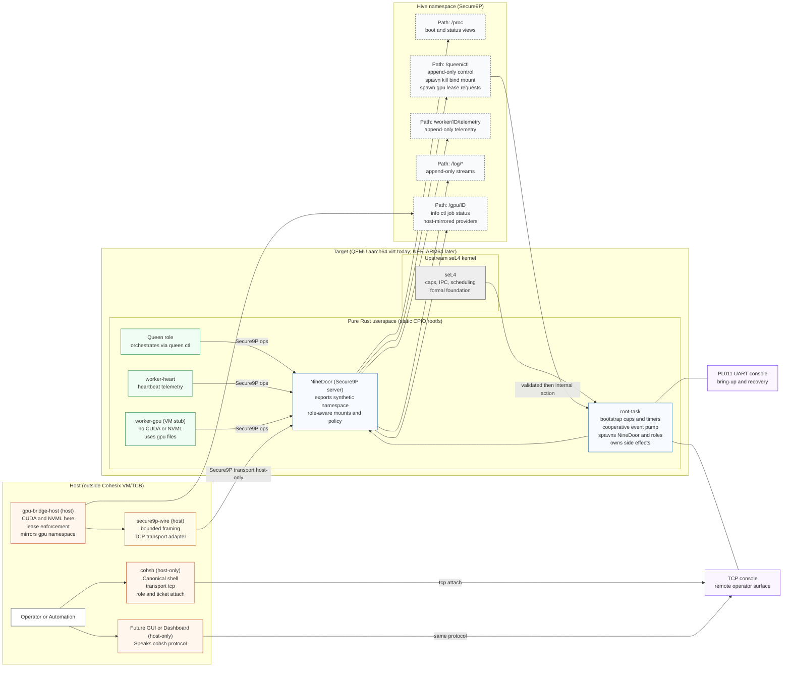

<!-- Author: Lukas Bower -->
# Cohesix

## Why Cohesix?

Cohesix explores a specific and deliberately narrow problem space: **how to build a small, auditable, and secure control plane for orchestrating distributed edge GPU systems**, without inheriting the complexity, opacity, and attack surface of general-purpose operating systems.

The project is informed by earlier work in film and broadcast technology, where hardware and software stacks were often pushed beyond their intended limits and reliability, timing, and control mattered more than convenience. Some of that work involved custom operating systems and tightly constrained runtime environments. Cohesix revisits those ideas with modern tools and a stronger formal foundation.

Cohesix is a **research operating system**, but its motivation is practical rather than academic. Writing an OS is intentionally difficult; the point here is to test whether a **formally grounded microkernel**, a **file-shaped control plane**, and a **strictly bounded userspace** can support real edge-orchestration workloads in hostile and unreliable environments.

In practical terms, the project would not be feasible without extensive use of AI agents. They are used throughout development for architecture review, design iteration, code synthesis, debugging assistance, and documentation refinement, enabling work of this scope without compromising technical rigor.

Cohesix is intentionally opinionated. It treats **determinism, auditability, and security** as design inputs rather than constraints, and is willing to exclude large classes of features to preserve those properties.

---

## What is Cohesix?

Cohesix is a **minimal orchestration operating system** for secure edge management, targeting a defined set of [use cases](docs/USE_CASES.md) around AI hives and distributed GPU workloads.

Technically, Cohesix is a **pure Rust userspace** running on upstream **seL4** on `aarch64/virt` (GICv3). Userspace is shipped as a static CPIO boot payload containing the root task, the NineDoor Secure9P server, worker roles, and host-facing tools. Cohesix does **not** include a traditional filesystem; instead it exposes a **synthetic Secure9P namespace** where paths represent capability-scoped control and telemetry interfaces rather than persistent storage.

All control and telemetry flows through Secure9P. There are **no ad-hoc RPC channels**, no background daemons, and no general in-VM networking services.

Operators interact with Cohesix through two consoles:
- a local **PL011 UART console** for early bring-up and recovery, and  
- a **remote TCP console** consumed by the `cohsh` shell, which mirrors serial semantics and provides the primary operational interface from Unix-like hosts.

The intended deployment target is **physical ARM64 hardware booted via UEFI**. Today, QEMU `aarch64/virt` is used for bring-up, CI, and testing, with the expectation that QEMU behaviour closely mirrors the eventual hardware profiles.

Cohesix is **not** a general-purpose operating system and is not intended to replace Linux or POSIX environments. It deliberately avoids POSIX semantics, libc, dynamic linking, and in-VM hardware stacks in order to keep the system small, analyzable, and resistant to accidental complexity.

In short, Cohesix treats **orchestration itself as an operating-system problem**, with authority, lifecycle, and failure handling as first-class concerns.

---

<!-- Concept Architecture — Cohesix (for README.md) -->
**Figure 1:** Cohesix concept architecture (Queen/Worker hive over Secure9P, host-only GPU bridge, dual consoles)

## Plan 9 heritage and departures

Cohesix is deliberately influenced by **[Plan 9 from Bell Labs](https://en.wikipedia.org/wiki/Plan_9_from_Bell_Labs)**, but it is **not a revival, clone, or generalisation of Plan 9**. This section clarifies what Cohesix inherits, what it adapts, and what it explicitly rejects—so the architecture remains stable as the project evolves.

### What Cohesix inherits from Plan 9

**Everything is a file — for control, not convenience**  
Like Plan 9, Cohesix exposes system control and observation as file operations. Orchestration happens by reading and appending to files such as:

- `/queen/ctl`
- `/worker/<id>/telemetry`
- `/log/*`
- `/gpu/<id>/*`

This yields diffable state, append-only audit logs, offline operation, and a uniform operator surface.

**Namespaces as authority boundaries**  
Following Plan 9’s per-process namespaces, Cohesix uses **per-session, role-scoped namespaces**. A namespace is not global truth; it is a *capability-filtered view* of the system. Authority is granted by what paths are visible and writable, not by ambient identity.

**Late binding of services**  
Services are not assumed to exist. GPU providers, workers, and auxiliary capabilities are bound into the namespace only when required. This late binding supports air-gapped operation, fault isolation, and minimal steady-state complexity.

### Where Cohesix deliberately departs from Plan 9

**Hostile networks by default**  
Plan 9 assumed relatively cooperative networks. Cohesix assumes unreliable, adversarial, and partitioned networks. Every operation is bounded, authenticated, auditable, and revocable.

**No single-system illusion**  
Plan 9 aimed for a “single system image.” Cohesix explicitly rejects this. Partial visibility, degraded operation, and asymmetric knowledge are normal and expected. The system must remain usable when parts are offline or compromised.

**Control plane only — not a universal OS**  
Secure9P in Cohesix is a **control-plane protocol**, not a universal IPC or data plane. Cohesix does not attempt to host applications, GUIs, or general user environments. Heavy ecosystems (CUDA, NVML, storage stacks, networking services) remain outside the trusted computing base.

**Explicit authority, revocation, and budgets**  
Unlike Plan 9’s softer trust model, Cohesix enforces explicit capability tickets, time- and operation-bounded leases, and revocation-first semantics. Failure is handled by withdrawing authority, not by retries or self-healing loops.

**Determinism over flexibility**  
Cohesix prioritises bounded memory, bounded work, and deterministic behaviour. Convenience features that obscure control flow, hide failure, or expand the trusted computing base are intentionally excluded.

### Summary

Cohesix adopts Plan 9’s **clarity of control via files and namespaces**, but reworks the philosophy for modern edge environments:

- hostile networks  
- regulated industries  
- hardware isolation via microkernels  
- minimal, auditable control planes  

In short: **Cohesix is Plan 9–inspired, seL4-grounded, and unapologetically strict about authority, determinism, and scope.**

---

## Getting Started
- Build and launch via `scripts/cohesix-build-run.sh`, pointing at your seL4 build and desired output directory; the script stages host tools alongside the VM image and enables the TCP console when `--transport tcp` is passed.
- Terminal 1: run the build script to start QEMU with `-serial mon:stdio` for the PL011 root console and TCP forwarding for the NineDoor console.
- Terminal 2: from `out/cohesix/host-tools/`, connect with `./cohsh --transport tcp --tcp-port <port>` to reach the TCP console; `cohsh` runs on the host only and mirrors the root console verbs.

## Architecture
Cohesix is structured as a hive: one Queen process orchestrates multiple worker roles (worker-heart, worker-gpu, and future variants) over a shared Secure9P namespace. Cohsh is the command surface for this hive, used by human operators and automation alike. Cohesix exposes a minimal control plane over Secure9P: the root task owns initial capabilities and schedulers, NineDoor presents the synthetic namespace, and all role-specific actions are file-driven under `/queen`, `/worker/<id>`, `/log`, and `/gpu/<id>`. Local operators rely on the PL011 console for bring-up, while remote operators attach through the TCP NineDoor console without entering the VM. The stack keeps CUDA/NVML and other heavy dependencies outside the TCB and host VM.

## Components
- **root-task** — seL4 bootstrapper configuring capabilities, timers, and the cooperative event pump; publishes the root console and hands initial caps to NineDoor to underpin the hive-wide namespace shared by the Queen and its workers.
- **nine-door** — Secure9P server exposing `/proc`, `/queen`, `/worker`, `/log`, and (host-fed) `/gpu` namespaces with role-aware mount tables, forming the shared hive namespace.
- **worker-heart** — Minimal worker emitting heartbeat telemetry into `/worker/<id>/telemetry` and reading boot/log views per its ticket; a worker role scheduled and managed by the Queen.
- **worker-gpu** — VM-resident stub consuming GPU lease/ticket files and telemetry hooks; it never touches hardware, deferring to host bridge nodes; another worker role under Queen control.
- **cohsh** — Host-only CLI that connects to the TCP NineDoor console, attaches with role/ticket pairs, and mirrors root console commands for operators; it is the canonical shell for the hive, and planned GUI clients are expected to speak the same protocol.
- **gpu-bridge-host** — Host-side process that discovers or mocks GPUs, enforces leases, and mirrors `/gpu/<id>/` nodes into the VM via Secure9P transport adapters.
- **secure9p-wire** — Codec/transport crate providing bounded 9P framing for NineDoor and host tools, including the TCP adapter (host-only).
- **Future tooling** — Planned host-side WASM “hive dashboard” and 9P client that reuses the cohsh protocol and adds no in-VM services.

## Status
- Milestones 0–4: repository scaffolding, seL4 boot/timer/IPC bring-up, Secure9P namespace, and bind/mount semantics are implemented per `docs/BUILD_PLAN.md`.
- Milestones 5–6: hardening, fuzz/integration coverage, and GPU role/bridge scaffolding are in place; worker-gpu remains namespace-only pending host bridge wiring.
- Milestone 7a–7c: cooperative event pump, authenticated dual consoles (PL011 + TCP), and namespace-aligned docs are live; future milestones extend worker lifecycle automation and GPU lease renewals.

## References
See [docs/ARCHITECTURE.md](docs/ARCHITECTURE.md), [docs/USERLAND_AND_CLI.md](docs/USERLAND_AND_CLI.md), [docs/INTERFACES.md](docs/INTERFACES.md), [docs/SECURE9P.md](docs/SECURE9P.md), [docs/ROLES_AND_SCHEDULING.md](docs/ROLES_AND_SCHEDULING.md), [docs/GPU_NODES.md](docs/GPU_NODES.md), and [docs/BUILD_PLAN.md](docs/BUILD_PLAN.md) for detailed design, interfaces, and milestone tracking.
