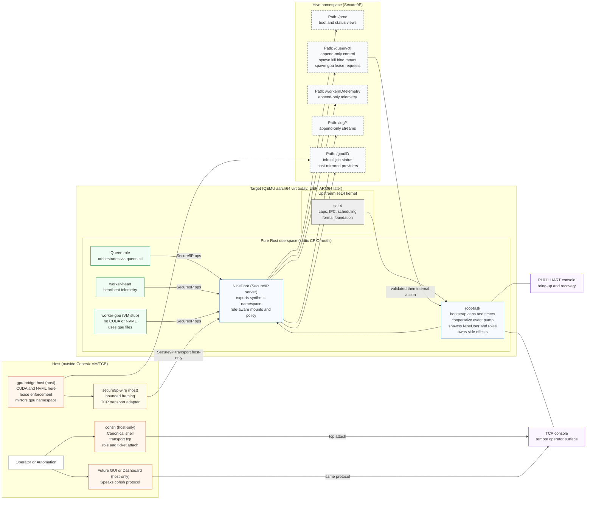

<!-- Author: Lukas Bower -->
# Cohesix
## Why Cohesix?
Cohesix exists to explore a specific problem space: how to build a small, auditable, and secure control plane for orchestrating distributed edge GPU systems, without inheriting the complexity and attack surface of general-purpose operating systems.

Earlier in my career, working in film and broadcast technology, I was exposed to environments where hardware and software stacks were routinely pushed beyond their intended limits. Some of that work involved custom operating systems and tightly constrained runtime environments. That experience left a lasting interest in systems where correctness, timing, and control matter more than convenience.

Cohesix is a research OS project that revisits those ideas with modern tools. Writing an operating system is deliberately difficult, but the motivation is practical rather than academic: to test whether a formally grounded microkernel, a file-oriented control plane, and a strictly bounded userspace can support real-world edge orchestration workloads.

In practical terms, this project would not be feasible without the extensive use of AI agents. They are used throughout development for design iteration, architecture review, code synthesis, debugging assistance, and documentation refinement. This has made it possible to pursue a project of this scope and depth in limited free time, without compromising on technical ambition or rigor.

The concrete research goals are to:
-	Validate the feasibility of a centralised, highly secure control plane for orchestrating fleets of edge GPU nodes.
- Explore a Queen / Worker model for one-to-many orchestration, lifecycle control, and telemetry.
-	Design a hive protocol inspired by Plan 9’s 9P, where the entire system is managed as a single, coherent namespace.
-	Prove that a single, uniform operator interface (cohsh) can scale from local bring-up to hive-wide automation.
-	Integrate cleanly with existing edge GPU ecosystems (e.g. NVIDIA CUDA on Linux/Jetson) while keeping heavy dependencies outside the trusted computing base.

Cohesix is intentionally opinionated. It prioritises determinism, auditability, and security over breadth, and treats those constraints as design inputs rather than limitations.

## What is Cohesix?
Cohesix is a minimal orchestration operating system for secure edge management, targeting a defined set of [use cases](docs/USE_CASES.md) around AI hives and distributed GPU workloads.

Technically, Cohesix is a pure Rust userspace stack running on upstream seL4 on aarch64/virt (GICv3). Userspace is shipped as a static CPIO root filesystem containing the root task, the NineDoor Secure9P server, worker roles, and host-facing tools. All control and telemetry flows through Secure9P; there are no ad-hoc RPC channels or in-VM network services.

Operators interact with Cohesix through two consoles:
-	a local PL011 console for early bring-up and recovery, and
-	a remote TCP NineDoor console, consumed by the "cohsh" remote shell, which provides the primary operational interface from Linux/Unix hosts.

The intended deployment target is physical ARM64 hardware booted via UEFI. QEMU aarch64/virt is used today for bring-up, CI, and testing, with the expectation that QEMU behaviour mirrors the eventual UEFI board profiles closely enough to surface real integration issues early.

Cohesix is not a general-purpose operating system and is not intended to replace Linux or POSIX environments. It deliberately avoids POSIX semantics, libc, and dynamic linking in order to keep the system small, analyzable, and resistant to accidental complexity. Developers working on Cohesix are expected to embrace these constraints and design within them.

In short, Cohesix is an experiment in treating orchestration itself as an operating system problem, with security and determinism as first-class concerns.

<!-- Concept Architecture — Cohesix (for README.md)             -->
**Figure 1:** Cohesix concept architecture (Queen/Worker hive over Secure9P, host-only GPU bridge, dual consoles)

## Getting Started
- Build and launch via `scripts/cohesix-build-run.sh`, pointing at your seL4 build and desired output directory; the script stages host tools alongside the VM image and enables the TCP console when `--transport tcp` is passed.
- Terminal 1: run the build script to start QEMU with `-serial mon:stdio` for the PL011 root console and TCP forwarding for the NineDoor console.
- Terminal 2: from `out/cohesix/host-tools/`, connect with `./cohsh --transport tcp --tcp-port <port>` to reach the TCP console; `cohsh` runs on the host only and mirrors the root console verbs.

## Architecture
Cohesix is structured as a hive: one Queen process orchestrates multiple worker roles (worker-heart, worker-gpu, and future variants) over a shared Secure9P namespace. Cohsh is the command surface for this hive, used by human operators and automation alike. Cohesix exposes a minimal control plane over Secure9P: the root task owns initial capabilities and schedulers, NineDoor presents the synthetic namespace, and all role-specific actions are file-driven under `/queen`, `/worker/<id>`, `/log`, and `/gpu/<id>`. Local operators rely on the PL011 console for bring-up, while remote operators attach through the TCP NineDoor console without entering the VM. The stack keeps CUDA/NVML and other heavy dependencies outside the TCB and host VM.

## Components
- **root-task** — seL4 bootstrapper configuring capabilities, timers, and the cooperative event pump; publishes the root console and hands initial caps to NineDoor to underpin the hive-wide namespace shared by the Queen and its workers.
- **nine-door** — Secure9P server exposing `/proc`, `/queen`, `/worker`, `/log`, and (host-fed) `/gpu` namespaces with role-aware mount tables, forming the shared hive namespace.
- **worker-heart** — Minimal worker emitting heartbeat telemetry into `/worker/<id>/telemetry` and reading boot/log views per its ticket; a worker role scheduled and managed by the Queen.
- **worker-gpu** — VM-resident stub consuming GPU lease/ticket files and telemetry hooks; it never touches hardware, deferring to host bridge nodes; another worker role under Queen control.
- **cohsh** — Host-only CLI that connects to the TCP NineDoor console, attaches with role/ticket pairs, and mirrors root console commands for operators; it is the canonical shell for the hive, and planned GUI clients are expected to speak the same protocol.
- **gpu-bridge-host** — Host-side process that discovers or mocks GPUs, enforces leases, and mirrors `/gpu/<id>/` nodes into the VM via Secure9P transport adapters.
- **secure9p-wire** — Codec/transport crate providing bounded 9P framing for NineDoor and host tools, including the TCP adapter (host-only).
- **Future tooling** — Planned host-side WASM “hive dashboard” that reuses the cohsh protocol and adds no in-VM services.

## Status
- Milestones 0–4: repository scaffolding, seL4 boot/timer/IPC bring-up, Secure9P namespace, and bind/mount semantics are implemented per `docs/BUILD_PLAN.md`.
- Milestones 5–6: hardening, fuzz/integration coverage, and GPU role/bridge scaffolding are in place; worker-gpu remains namespace-only pending host bridge wiring.
- Milestone 7a–7c: cooperative event pump, authenticated dual consoles (PL011 + TCP), and namespace-aligned docs are live; future milestones extend worker lifecycle automation and GPU lease renewals.

## References
See [docs/ARCHITECTURE.md](docs/ARCHITECTURE.md), [docs/USERLAND_AND_CLI.md](docs/USERLAND_AND_CLI.md), [docs/SECURE9P.md](docs/SECURE9P.md), [docs/ROLES_AND_SCHEDULING.md](docs/ROLES_AND_SCHEDULING.md), [docs/GPU_NODES.md](docs/GPU_NODES.md), and [docs/BUILD_PLAN.md](docs/BUILD_PLAN.md) for detailed design, interfaces, and milestone tracking.
