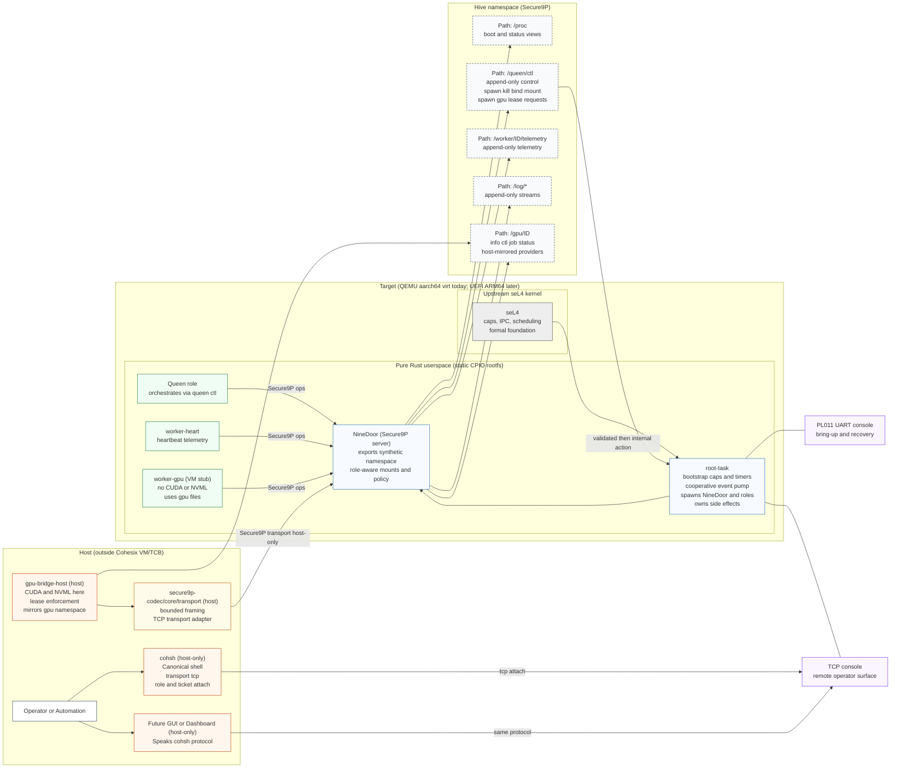

<!-- Copyright © 2025 Lukas Bower -->
<!-- SPDX-License-Identifier: Apache-2.0 -->
<!-- Purpose: Provide a high-level overview of Cohesix architecture and workspace layout. -->
<!-- Author: Lukas Bower -->
<table width="100%" cellpadding="0" cellspacing="0">
  <tr>
    <td align="center" bgcolor="#333333">
      
    </td>
  </tr>
</table>

Releases are available in [releases/](releases/).

## Why Cohesix?

Cohesix explores a specific and deliberately narrow problem space: **how to build a small, auditable, and secure control plane for orchestrating distributed edge GPU systems**, without inheriting the complexity, opacity, and attack surface of general-purpose operating systems.

The project is informed by earlier work in film and broadcast technology, where hardware and software stacks were often pushed beyond their intended limits - and reliability, timing, and control mattered more than convenience. Some of that work involved custom operating systems and tightly constrained runtime environments. Cohesix revisits those ideas with modern tools and a stronger formal foundation.

Cohesix is a **research operating system**, but its motivation is practical rather than academic. Writing an OS is intentionally difficult; the point here is to test whether a **formally grounded microkernel**, a **file-shaped control plane**, and a **strictly bounded userspace** can support real edge-orchestration workloads in hostile and unreliable environments.

In practical terms, the project would not be feasible without extensive use of AI agents. They are used throughout development for architecture review, design iteration, code synthesis, debugging assistance, and documentation refinement - enabling work of this scope despite limited free time.

Cohesix is intentionally opinionated. It treats **determinism, auditability, and security** as design inputs rather than constraints, and is willing to exclude large classes of features to preserve those properties.

Cohesix has a strong **MLOps** fit: model lifecycle pointers, deterministic CAS updates, and bounded telemetry streams make training, rollout, and audit pipelines reproducible without introducing in-VM ML stacks.

---

### seL4 foundation

Cohesix runs on **[seL4](https://sel4.systems/)**, a high-assurance capability-based microkernel with a machine-checked proof of correctness. seL4 provides strong isolation, explicit authority, and deterministic scheduling while keeping the kernel extremely small. This lets Cohesix place all policy and orchestration logic in a **pure Rust userspace**, minimize the trusted computing base, and enforce capability-scoped control planes without relying on POSIX semantics, in-kernel drivers, or ambient authority.

---
## What is Cohesix?

Cohesix is a **minimal orchestration operating system** for secure edge management, targeting a defined set of [use cases](docs/USE_CASES.md) around AI hives and distributed GPU workloads.

Technically, Cohesix is a **pure Rust userspace** running on upstream **seL4** on `aarch64/virt` (GICv3). Userspace is shipped as a static CPIO boot payload containing the root task, the NineDoor Secure9P server, and worker roles; host tools live outside the VM.

Cohesix does **not include a traditional filesystem**; instead it exposes a **synthetic Secure9P namespace** where paths represent capability-scoped control and telemetry interfaces rather than persistent storage.

Cohesix does not provide HTTPS or TLS. Instead, it relies on an **authenticated, encrypted private network** (e.g. VPN or overlay) for transport security, keeping the Cohesix TCB small and focused. See this [example](docs/NETWORK_CONFIG.md).

All control and telemetry are file-shaped and exposed via Secure9P; the console mirrors those semantics. There are **no ad-hoc RPC channels**, no background daemons, and no general in-VM networking services.

Operators interact with Cohesix through two consoles:
- a local **PL011 UART console** for early bring-up and recovery, and  
- a **remote TCP console** consumed by the `cohsh` shell, which mirrors serial semantics and provides the primary operational interface from Unix-like hosts.

The intended deployment target is **physical ARM64 hardware booted via UEFI**. Today, QEMU `aarch64/virt` is used for bring-up, CI, and testing, with the expectation that QEMU behaviour closely mirrors the eventual hardware profiles.

Cohesix is **not** a general-purpose operating system and is not intended to replace Linux or POSIX environments. It deliberately avoids POSIX semantics, libc, dynamic linking, and in-VM hardware stacks in order to keep the system small, analyzable, and resistant to accidental complexity.

In short, Cohesix treats **orchestration itself as an operating-system problem**, with authority, lifecycle, and failure handling as first-class concerns.

---

## Plan 9 heritage and departures

Cohesix is deliberately influenced by **[Plan 9 from Bell Labs](https://en.wikipedia.org/wiki/Plan_9_from_Bell_Labs)**, but it is **not** a revival, clone, or generalisation of Plan 9. The influence is philosophical rather than literal, and the departures are explicit.

### What Cohesix inherits

**File-shaped control surfaces**  
Cohesix exposes control and observation as file operations. Paths such as `/queen/ctl`, `/worker/<id>/telemetry`, `/log/*`, and `/gpu/<id>/*` are interfaces, not storage. This yields diffable state, append-only audit logs, and a uniform operator surface.

**Namespaces as authority boundaries**  
Like Plan 9’s per-process namespaces, Cohesix uses **per-session, role-scoped namespaces**. A namespace is not global truth; it is a capability-filtered view of the system. Authority is defined by which paths are visible and writable.

**Late binding of services**  
Services are not assumed to exist. Workers, GPU providers, and auxiliary capabilities are bound into the namespace only when required, supporting air-gapped operation, fault isolation, and minimal steady-state complexity.

### Where Cohesix departs

**Hostile networks by default**  
Cohesix assumes unreliable, adversarial, and partitioned networks. Every operation is bounded, authenticated, auditable, and revocable.

**No single-system illusion**  
Partial visibility and degraded operation are normal. Cohesix explicitly rejects the idea of a seamless single-system image.

**Control plane only**  
Secure9P is a control-plane protocol, not a universal IPC or data plane. Cohesix does not host applications, GUIs, or general user environments, and keeps heavy ecosystems outside the trusted computing base.

**Explicit authority and revocation**  
Cohesix enforces capability tickets, time- and operation-bounded leases, and revocation-first semantics. Failure is handled by withdrawing authority, not by retries or self-healing loops.

**Determinism over flexibility**  
Bounded memory, bounded work, and deterministic behaviour are prioritised over convenience and dynamism.

---

## Architecture (high level)

A single Cohesix deployment is a **hive**: one Queen role orchestrating multiple workers over a shared Secure9P namespace. The root task owns initial authority and scheduling, NineDoor presents the synthetic namespace, and all lifecycle actions are file-driven under `/queen`, `/worker/<id>`, `/log`, and `/gpu/<id>`.

CUDA, NVML, and other heavy stacks remain host-side. The VM never touches GPU hardware directly.

<!-- Concept Architecture — Cohesix (for README.md) -->
**Figure 1:** Cohesix concept architecture (Queen/Worker hive over Secure9P, host-only GPU bridge, dual consoles)


---

## Components

- **root-task** — seL4 bootstrapper configuring capabilities, timers, and the cooperative event pump; hosts the serial and TCP consoles and owns all side effects.
- **nine-door** — Secure9P server exporting `/proc`, `/queen`, `/worker`, `/log`, and host-mirrored `/gpu` namespaces with role-aware policy.
- **worker-heart** — Minimal worker emitting heartbeat telemetry into `/worker/<id>/telemetry`.
- **worker-gpu** — VM-resident stub handling GPU lease state and telemetry hooks; never touches hardware.
- **cohsh** — Host-only CLI and canonical shell for the hive; GUI tooling is expected to speak the same protocol.
- **gpu-bridge-host** — Host-side process that discovers or mocks GPUs, enforces leases, and mirrors `/gpu/<id>/` into the VM.
- **secure9p-codec / secure9p-core / secure9p-transport** — Secure9P codec, core policy hooks, and transport adapters for host tools.

---

## Getting Started

### Option A: Run a pre-built release (fastest)
Pre-built bundles are available in [releases/](releases/). Each bundle includes its own `QUICKSTART.md`.

1. Extract the bundle for your OS (`*-MacOS` or `*-linux`).
2. Install runtime dependencies (QEMU + SwarmUI libs):
   ```bash
   ./scripts/setup_environment.sh
   ```
3. Terminal 1: boot the VM:
   ```bash
   ./qemu/run.sh
   ```
4. Terminal 2: connect with `cohsh`:
   ```bash
   ./bin/cohsh --transport tcp --tcp-host 127.0.0.1 --tcp-port 31337 --role queen
   ```
5. Optional UI (Mac or Linux desktop):
   ```bash
   ./bin/swarmui
   ```
   Headless Linux: `xvfb-run -a ./bin/swarmui`

---

### Option B: Build from source (macOS or Linux)
You need QEMU, Rust, Python 3, and an external seL4 build that produces `elfloader` and `kernel.elf`.

**macOS 26 (Apple Silicon)**
```bash
./toolchain/setup_macos_arm64.sh
source "$HOME/.cargo/env"
```

**Linux (Ubuntu 24 recommended)**
```bash
sudo apt-get update
sudo apt-get install -y git cmake ninja-build clang llvm lld python3 python3-pip qemu-system-aarch64
curl --proto '=https' --tlsv1.2 -sSf https://sh.rustup.rs | sh -s -- -y --default-toolchain stable
source "$HOME/.cargo/env"
```
If you're on another Linux distro, install the same dependencies with your package manager (QEMU + build essentials + Rust).

**Build and run (QEMU + TCP console)**
1. Build seL4 externally (upstream) for `aarch64` + `qemu_arm_virt`. Place the build at `$HOME/seL4/build` or pass `--sel4-build` below.
2. Terminal 1: build and boot:
   ```bash
   SEL4_BUILD_DIR=$HOME/seL4/build ./scripts/cohesix-build-run.sh \
     --sel4-build "$HOME/seL4/build" \
     --out-dir out/cohesix \
     --profile release \
     --root-task-features cohesix-dev \
     --cargo-target aarch64-unknown-none \
     --transport tcp
   ```
3. Terminal 2: connect with `cohsh`:
   ```bash
   cd out/cohesix/host-tools
   ./cohsh --transport tcp --tcp-port 31337 --role queen
   ```

If you want a quicker on-ramp, use the pre-built bundles in [releases/](releases/) and follow their `QUICKSTART.md`.

---

## References
See below for detailed design, interfaces, and milestone tracking:
- [docs/ARCHITECTURE.md](docs/ARCHITECTURE.md)
- [docs/USERLAND_AND_CLI.md](docs/USERLAND_AND_CLI.md)
- [docs/INTERFACES.md](docs/INTERFACES.md)
- [docs/SECURE9P.md](docs/SECURE9P.md)
- [docs/ROLES_AND_SCHEDULING.md](docs/ROLES_AND_SCHEDULING.md)
- [docs/GPU_NODES.md](docs/GPU_NODES.md)
- [docs/HOST_TOOLS.md](docs/HOST_TOOLS.md)
- [docs/PYTHON_SUPPORT.md](docs/PYTHON_SUPPORT.md)
- [docs/FAILURE_MODES.md](docs/FAILURE_MODES.md)
- [docs/OPERATOR_WALKTHROUGH.md](docs/OPERATOR_WALKTHROUGH.md)

---

## Status
- [docs/BUILD_PLAN.md](docs/BUILD_PLAN.md) 
