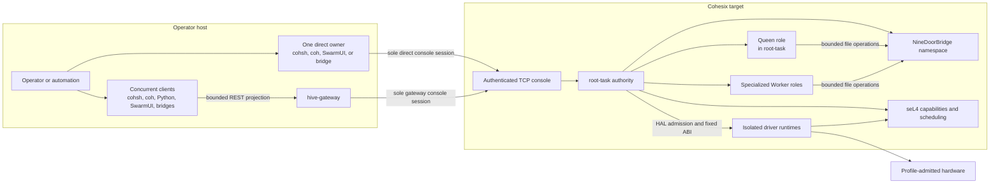

<!-- Copyright © 2026 Lukas Bower -->
<!-- SPDX-License-Identifier: Apache-2.0 -->
<!-- Purpose: Introduce Cohesix, explain its AI-hive design, and direct readers to verified usage and documentation. -->
<!-- Author: Lukas Bower -->

<table width="100%" cellpadding="0" cellspacing="0">
  <tr>
    <td align="center" bgcolor="#333333">
      
    </td>
  </tr>
</table>

# Cohesix

Cohesix is a pre-production research operating system for edge AI,
built around a simple idea: an AI fleet should have air-traffic control, not
a pile of tools holding unrestricted credentials.

Each Cohesix hive has a Queen with orchestration authority and specialized
Workers scoped to heartbeat telemetry, GPU lease/status records, and LoRA
lifecycle receipts, each limited by role-specific capabilities and tickets.

Models, agents, CUDA/NVML, training, and inference stay on the host. Cohesix is
the compact trust layer beneath them: approved host tools reduce intent to
bounded, policy-checked requests with visible state and evidence.

## What makes Cohesix different?

- **Authority is explicit.** Cohesix combines kernel-enforced capabilities with
  generated role, policy, ticket, and lifecycle checks rather than relying on
  ambient root access. Worker tickets are mandatory; Queen tickets are optional.
- **Control is uniform.** Commands, status, telemetry, policy, and evidence use a
  bounded file-shaped namespace—a role-visible tree of named control and state
  paths—instead of a collection of unrelated in-VM services.
- **Hardware is compartmentalized.** Physical Pi 4 devices run in
  manifest-declared Rust driver runtimes admitted through HAL; the root task does
  not own their steady-state drivers.
- **AI can propose; Cohesix decides.** Models, agents, and operators submit intent
  through approved host tools, while target-side role, ticket, lifecycle, and
  bounds checks decide what is accepted and retain evidence of the outcome.

Cohesix is for AI systems where safe action matters as much as smart inference:
what was allowed, which policy governed it, and what evidence remains. It is not
a general-purpose desktop/server OS, Linux distribution, POSIX environment, or
in-VM GPU stack.

## Why seL4, Plan 9, and 9P?

These names describe different layers; no prior Plan 9 or seL4 experience is
required to operate Cohesix.

| Term | Plain-language meaning | Why Cohesix uses it |
| --- | --- | --- |
| **[seL4](https://sel4.systems/About/)** | A microkernel: the small, privileged core controlling memory, execution, interrupts, and communication. A *capability* is a kernel-enforced permission to use a specific object in specific ways. | Keeps the privileged kernel small and makes access to target resources explicit. |
| **[Plan 9](https://9p.io/sys/doc/9.html)** | A Bell Labs research OS where services, devices, status, and stored data can all appear in a file hierarchy assembled for each process. | Provides the design inspiration for one understandable namespace spanning control, status, telemetry, policy, and evidence. Cohesix is not Plan 9 and does not provide a POSIX façade. |
| **[9P](https://9p.io/sys/doc/names.html)** | The protocol Plan 9 uses to access those file hierarchies. A client connects, follows a path, opens a node, and reads or writes bytes. | Host NineDoor implements a bounded 9P2000.L subset called Secure9P, so path, role, ticket, and size limits are visible and testable. |
| **NineDoor** | Cohesix's namespace server and related adapters. | Host NineDoor speaks Secure9P. The target uses a separate `NineDoorBridge` behind its authenticated console; it is not an in-VM 9P-over-TCP server. |

The layers solve complementary problems. seL4 answers **who may use a kernel
resource**; the ticketed namespace answers **which named control or state
surface that role may use**. A typical control flow is: write a bounded command,
receive an acknowledgement (`OK`) or refusal (`ERR`), then read state or tail
events for completion. This reduces protocol sprawl and makes policy, limits,
and evidence easier to inspect.

seL4's machine-checked proofs apply to the kernel and their documented
assumptions; they do not mean that Cohesix as a whole is formally verified.

## Architecture at a glance


```mermaid
flowchart LR
  subgraph Host[Operator host]
    Operator[Operator or automation]
    Direct["One direct owner\ncohsh, coh, SwarmUI, or bridge"]
    Shared["Concurrent clients\ncohsh, coh, Python, SwarmUI, bridges"]
    Gateway[hive-gateway]
    Operator --> Direct
    Operator --> Shared
    Shared -->|bounded REST projection| Gateway
  end

  subgraph Target[Cohesix target]
    Console[Authenticated TCP console]
    Root[root-task authority]
    Namespace[NineDoorBridge namespace]
    Queen["Queen role\nin root-task"]
    Workers[Specialized Worker roles]
    Drivers[Isolated driver runtimes]
    Kernel[seL4 capabilities and scheduling]
    Console --> Root
    Root --> Namespace
    Root --> Queen
    Root --> Workers
    Queen -->|bounded file operations| Namespace
    Workers -->|bounded file operations| Namespace
    Root -->|HAL admission and fixed ABI| Drivers
    Root --> Kernel
    Drivers --> Kernel
  end

  Hardware[Profile-admitted hardware]

  Direct -->|sole direct console session| Console
  Gateway -->|sole gateway console session| Console
  Drivers --> Hardware
```

The two console arrows are alternatives: one direct tool or bridge owns the
target's single TCP session, or `hive-gateway` owns it for concurrent host
clients. They must not compete. The console uses the documented `AUTH`/`ATTACH`
sequence, `OK`/`ERR` responses, and `END` stream terminator—not 9P frames on the
wire. Host tools preserve the same namespace authority without creating a
second control path.

SwarmUI is the host-side desktop view of Cohesix telemetry and replay. It reuses
the existing host transport semantics and adds no target authority.


## Current project status

Active work is Milestone 26d, with Milestone 26b reopened for bounded Pi 4
Wi-Fi/SDIO driver-task closure. See the [build plan](docs/BUILD_PLAN.md) for the
normative task and acceptance boundaries.

| Surface | Current state | Evidence boundary |
| --- | --- | --- |
| QEMU `aarch64/virt` | Reference development and regression target on seL4 15.0.0 | Current target-qualified repository evidence passes Stages 1–5; QEMU is not hardware proof. |
| Raspberry Pi 4 boot | Pi firmware → U-Boot → seL4 binary image → root task | Implemented and previously board-proven; current-tree live revalidation remains part of Milestone 26d. |
| Pi 4 wired networking | Isolated GENETv5 runtime with DHCP and TCP | Accepted Milestone 26c evidence exists for its recorded image; a new image must prove its own state. |
| Pi 4 Wi-Fi | Linked CYW43455 and SDIO runtimes implemented | Reopened 26b work has no current-image association, DHCP, TCP, or repeatability claim yet. |
| Host tools | macOS 26 on Apple Silicon is the primary development host | Host success does not prove target or Pi hardware behavior. |
| AWS/UEFI | Planned profile | Milestone 30 is pending; AWS is not a current Cohesix VM target. |

Building, flashing, current-image boot, saved policy, device readiness, raw TCP,
authenticated `cohsh`, and benchmark results are separate proof states. The
[hardware runbook](docs/HARDWARE_BRINGUP.md) explains how to prove each one.

## Get started

### Run a release bundle

Versioned bundles under [releases/](releases/) include release-specific
`QUICKSTART.md` instructions. The common QEMU flow is:

1. Extract the bundle and install its documented dependencies.
2. Start `./qemu/run.sh` in one terminal.
3. In another terminal, provide the deployment's TCP console authentication
   token without echoing it and connect as Queen:

   ```bash
   read -r -s COHSH_AUTH_TOKEN
   export COHSH_AUTH_TOKEN
   ./bin/cohsh --transport tcp --tcp-host 127.0.0.1 --tcp-port 31337 \
     --role queen
   unset COHSH_AUTH_TOKEN
   ```

Direct TCP is authenticated but not encrypted. Keep it on loopback or carry it
through an authenticated tunnel.

### Build the current source tree

The primary path is macOS 26 on Apple Silicon with the repository's external
seL4 15.0.0 build outputs. QEMU, Rust, Python 3, and the selected seL4 profile
must already be available. Review the profile and kernel-artifact prerequisites
in [Hardware bring-up](docs/HARDWARE_BRINGUP.md) before running the build.

```bash
./toolchain/setup_macos_arm64.sh
source "$HOME/.cargo/env"
```

Build and start the QEMU TCP-console profile:

```bash
SEL4_BUILD_DIR="$PWD/seL4/SMP_build" \
  ./scripts/cohesix-build-run.sh \
    --sel4-build "$PWD/seL4/SMP_build" \
    --out-dir out/cohesix \
    --profile release \
    --root-task-features cohesix-dev \
    --cargo-target aarch64-unknown-none \
    --transport tcp
```

Then connect from another terminal using the deployment's console
authentication token:

```bash
read -r -s COHSH_AUTH_TOKEN
export COHSH_AUTH_TOKEN
out/cohesix/host-tools/cohsh \
  --transport tcp --tcp-host 127.0.0.1 --tcp-port 31337 --role queen
unset COHSH_AUTH_TOKEN
```

For Raspberry Pi 4, use that runbook's separate workflow. Building or flashing
an image is not proof that the board booted that image.

## Documentation

Each document owns one part of the public contract. Generated values remain in
`docs/snippets/` and the selected resolved manifest.

### Design and contracts

| Document | Owns |
| --- | --- |
| [Architecture](docs/ARCHITECTURE.md) | Trust boundaries, components, and major data flows |
| [Interfaces](docs/INTERFACES.md) | Namespaces, payloads, console behavior, and compatibility |
| [Secure9P](docs/SECURE9P.md) | 9P layering, bounds, session invariants, and policy hooks |
| [Roles and scheduling](docs/ROLES_AND_SCHEDULING.md) | Queen/Worker authority, lifecycle, and scheduling policy |
| [Drivers](docs/DRIVERS.md) | HAL, isolated runtimes, device status, and proof method |
| [GPU nodes](docs/GPU_NODES.md) | Host-only GPU boundary, leases, and telemetry |

### Operator and integration guides

| Document | Owns |
| --- | --- |
| [Userland and CLI](docs/USERLAND_AND_CLI.md) | Console, `cohsh`, `.coh` grammar, and command semantics |
| [Host tools](docs/HOST_TOOLS.md) | Executable catalogue, transports, and composition rules |
| [API guidelines](docs/API_GUIDELINES.md) | REST projection, authentication, and compatibility |
| [Python support](docs/PYTHON_SUPPORT.md) | Python backends, bounded APIs, and examples |
| [Operator walkthrough](docs/OPERATOR_WALKTHROUGH.md) | End-to-end preflight, operation, and evidence capture |
| [Failure modes](docs/FAILURE_MODES.md) | Symptoms, evidence, recovery, and escalation |

### Targets, evidence, and planning

| Document | Owns |
| --- | --- |
| [Hardware bring-up](docs/HARDWARE_BRINGUP.md) | Image, flash, boot, and hardware-proof workflow |
| [Boot reference](docs/BOOT_REFERENCE.md) | Boot stages, prompts, and fail-closed invariants |
| [Benchmarks](docs/BENCHMARKS.md) | Workloads, provenance, and regression decisions |
| [Use cases](docs/USE_CASES.md) | Capability-fit patterns, not acceptance claims |
| [Build plan](docs/BUILD_PLAN.md) | Normative milestone scope, task authorization, and status |

## Help and contributing

- Start with the [operator walkthrough](docs/OPERATOR_WALKTHROUGH.md); use
  [failure modes](docs/FAILURE_MODES.md) for diagnosis and recovery.
- Contributions must follow `AGENTS.md` and the active task in the
  [build plan](docs/BUILD_PLAN.md); behavioral changes require matching tests,
  generated artifacts, and documentation.
- Cohesix is maintained by Lukas Bower. Use GitHub Issues for reproducible,
  non-sensitive bugs and scoped design discussions. Never put secrets in an
  issue, log, or command example.

## License

Cohesix is licensed under Apache-2.0. See [LICENSE.txt](LICENSE.txt) and
[NOTICE.txt](NOTICE.txt).
