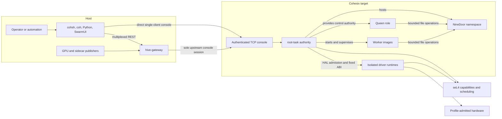

<!-- Copyright © 2026 Lukas Bower -->
<!-- SPDX-License-Identifier: Apache-2.0 -->
<!-- Purpose: Introduce Cohesix, its verified scope, and the canonical documentation suite. -->
<!-- Author: Lukas Bower -->

<table width="100%" cellpadding="0" cellspacing="0">
  <tr>
    <td align="center" bgcolor="#333333">
      
    </td>
  </tr>
</table>

# Cohesix

Cohesix is a pre-production control-plane operating system for secure edge
orchestration and telemetry. It combines upstream
[seL4](https://sel4.systems/), a pure-Rust userspace, capability-scoped
namespaces, and a Queen/Worker execution model. GPU frameworks, container
runtimes, model registries, and other large ecosystems stay on the host.

Versioned open-source bundles and their release-specific instructions are in
[releases/](releases/). The documentation linked from this page describes the
current source tree and can be newer than a release snapshot.

## Current status

The active work is Milestone 26d, with Milestone 26b reopened for bounded Pi 4
Wi-Fi/SDIO driver-task closure. The Milestone 26c README-linked documentation
remediation completed on 15 July 2026. See the
[build plan](docs/BUILD_PLAN.md) for normative task and acceptance boundaries.

| Surface | Current state | Evidence boundary |
| --- | --- | --- |
| QEMU `aarch64/virt` | Reference development and regression target on seL4 15.0.0 | Current target-qualified repository run passes Stages 1–5; QEMU evidence is not physical-hardware proof. |
| Raspberry Pi 4 boot | Pi firmware → U-Boot → seL4 binary image → root task | Implemented and previously board-proven; current-tree live revalidation remains part of Milestone 26d. |
| Pi 4 wired networking | GENETv5 isolated runtime and DHCP/TCP path | Accepted wired evidence exists from Milestone 26c; a new image must still prove its own boot and network state. |
| Pi 4 Wi-Fi | CYW43455 plus SDIO linked runtimes are implemented and target-tested | Reopened 26b work has no current-image association, DHCP, TCP, or repeatability claim yet. |
| Host tools | macOS 26 on Apple Silicon is the primary development host; scoped Linux release and host-tool flows are supported | Host success does not prove VM or Pi hardware behavior. |
| AWS/UEFI | Planned profile | Milestone 30 is pending; AWS is not a current Cohesix VM target. |

Flash success, current-image boot, saved policy, device readiness, raw TCP,
authenticated `cohsh`, and benchmark results are separate proof states. The
[hardware runbook](docs/HARDWARE_BRINGUP.md) defines the required evidence for
each state.

## System model

Cohesix deliberately exposes a narrow control plane:

- `root-task` owns initial seL4 authority, HAL admission, scheduling,
  recovery, and the serial/TCP console dispatchers.
- NineDoor adapters present bounded file namespaces for control, telemetry,
  logs, policy, and host projections. Host NineDoor speaks Secure9P; the target
  console projects overlapping operations through a separate adapter.
- Queen is the privileged orchestration role. Implemented worker images cover
  heartbeat, GPU control receipts, and LoRA control receipts; generated
  profile data decides which roles are admitted.
- Physical Pi 4 devices are serviced by manifest-declared, isolated `no_std`
  driver runtimes through a fixed, pointer-free command/completion ABI.
- Host clients project the same documented file and console semantics. They do
  not create a second authority path into the VM.


```mermaid
flowchart LR
  subgraph Host[Host]
    Operator[Operator or automation]
    Clients[cohsh, coh, Python, SwarmUI]
    Gateway[hive-gateway]
    Publishers[GPU and sidecar publishers]
    Operator --> Clients
    Clients -->|multiplexed REST| Gateway
    Publishers --> Gateway
  end

  subgraph Target[Cohesix target]
    Console[Authenticated TCP console]
    Root[root-task authority]
    NineDoor[NineDoor namespace]
    Queen[Queen role]
    Workers[Worker images]
    Drivers[Isolated driver runtimes]
    Root -->|hosts| NineDoor
    Root -->|provides control authority| Queen
    Root -->|starts and supervises| Workers
    Queen -->|bounded file operations| NineDoor
    Workers -->|bounded file operations| NineDoor
    Root -->|HAL admission and fixed ABI| Drivers
  end

  Kernel[seL4 capabilities and scheduling]
  Hardware[Profile-admitted hardware]

  Clients -->|direct single-client console| Console
  Gateway -->|sole upstream console session| Console
  Console --> Root
  Root --> Kernel
  Drivers --> Kernel
  Drivers --> Hardware
```

The TCP console uses the documented `AUTH`/`ATTACH` and `ACK`/`ERR`/`END`
grammar. It is not an in-VM 9P-over-TCP server. See
[Architecture](docs/ARCHITECTURE.md),
[Interfaces](docs/INTERFACES.md), and
[Secure9P](docs/SECURE9P.md) for the boundary between console transport,
NineDoor operations, and role authority.

The direct-client and gateway arrows are alternative ownership modes. A direct
client must not compete with a running gateway for the target console.

## Main components

| Component | Responsibility | Runs in |
| --- | --- | --- |
| `root-task` | Bootstrap, authority, HAL admission, consoles, recovery, and target-side NineDoor adapter | seL4 userspace |
| `worker-heart`, `worker-gpu`, `worker-lora` | Bounded worker loops for telemetry and control-plane receipts | seL4 userspace |
| `pi4-driver-runtime` images | Profile-selected serial, HDMI, USB, PCIe, GENET, CYW43, and SDIO service engines | Pi 4 seL4 userspace |
| `cohsh` | Canonical interactive and scripted operator shell | Host |
| `coh` | Mount, GPU, PEFT, telemetry, fleet, and evidence workflows | Host |
| `hive-gateway` | Loopback-first REST multiplexer holding one upstream console session | Host |
| `gpu-bridge-host` and `host-sidecar-bridge` | Publish bounded host state into documented namespaces | Host |
| SwarmUI | Desktop presentation and replay over existing host transport semantics | Host |
| `coh-rtc` | Compile selected manifest input into resolved configuration, Rust tables, policies, and documentation snippets | Build host |

SwarmUI visualizes Live Hive telemetry without adding VM authority.


## Run a release bundle

Each bundle under [releases/](releases/) includes a versioned `QUICKSTART.md`.
The common QEMU flow is:

1. Extract the bundle for the host platform.
2. Install its documented runtime dependencies.
3. Start the bundled QEMU launcher in one terminal.
4. In a second terminal, enter the Queen console token without echoing it and
   connect directly:

   ```bash
   read -r -s COHSH_AUTH_TOKEN
   export COHSH_AUTH_TOKEN
   ./bin/cohsh --transport tcp --tcp-host 127.0.0.1 --tcp-port 31337 \
     --role queen
   unset COHSH_AUTH_TOKEN
   ```

Use the token configured for that bundle or deployment. Never commit it, place
it in a command history entry, or reuse the documented test placeholder. Direct
TCP is authenticated but not encrypted; keep it on loopback or carry it through
an authenticated tunnel.

## Build the current source tree

The primary development path is macOS 26 on Apple Silicon with the repository's
external seL4 15.0.0 build outputs. QEMU, Rust, Python 3, and the selected seL4
profile must already be available.

```bash
./toolchain/setup_macos_arm64.sh
source "$HOME/.cargo/env"
```

Build and start the QEMU TCP-console profile:

```bash
SEL4_BUILD_DIR="$PWD/seL4/SMP_build" \
  ./scripts/cohesix-build-run.sh \
    --sel4-build "$PWD/seL4/SMP_build" \
    --out-dir out/cohesix \
    --profile release \
    --root-task-features cohesix-dev \
    --cargo-target aarch64-unknown-none \
    --transport tcp
```

Then connect from another terminal using the secret configured in the selected
manifest:

```bash
read -r -s COHSH_AUTH_TOKEN
export COHSH_AUTH_TOKEN
out/cohesix/host-tools/cohsh \
  --transport tcp --tcp-host 127.0.0.1 --tcp-port 31337 --role queen
unset COHSH_AUTH_TOKEN
```

For a Raspberry Pi 4 image, follow
[Hardware bring-up](docs/HARDWARE_BRINGUP.md). Building or flashing an image is
not proof that the board booted that image.

## Documentation suite

Each document owns one part of the public contract. Exact generated values
remain in `docs/snippets/` and the selected resolved manifest. Authored prose
links to those sources; the few compiler-verified mirrors required by drift
guards are isolated in clearly marked generated appendices.

### Design and contracts

| Document | Owns |
| --- | --- |
| [Architecture](docs/ARCHITECTURE.md) | System boundaries, components, trust model, and major data flows |
| [Interfaces](docs/INTERFACES.md) | External namespaces, payloads, console behavior, and compatibility rules |
| [Secure9P](docs/SECURE9P.md) | 9P layering, bounds, session invariants, and policy hooks |
| [Roles and scheduling](docs/ROLES_AND_SCHEDULING.md) | Queen/Worker roles, tickets, lifecycle authority, and scheduling policy |
| [Drivers](docs/DRIVERS.md) | HAL and isolated-runtime rules, device status, and hardware proof method |
| [GPU nodes](docs/GPU_NODES.md) | Host-only GPU boundary, publish lifecycle, leases, and telemetry |

### Operator and integration guides

| Document | Owns |
| --- | --- |
| [Userland and CLI](docs/USERLAND_AND_CLI.md) | Root console, `cohsh`, `.coh` grammar, and command semantics |
| [Host tools](docs/HOST_TOOLS.md) | Host executable catalogue, transport choices, and composition rules |
| [API guidelines](docs/API_GUIDELINES.md) | REST projection, authentication boundary, compatibility, and client guidance |
| [Python support](docs/PYTHON_SUPPORT.md) | Python installation, backends, bounded APIs, and examples |
| [Operator walkthrough](docs/OPERATOR_WALKTHROUGH.md) | One end-to-end operating sequence from preflight through evidence capture |
| [Failure modes](docs/FAILURE_MODES.md) | Symptoms, evidence, bounded recovery, and escalation |

### Targets, evidence, and planning

| Document | Owns |
| --- | --- |
| [Hardware bring-up](docs/HARDWARE_BRINGUP.md) | QEMU/Pi profiles, image/flash/boot workflow, and current proof gates |
| [Boot reference](docs/BOOT_REFERENCE.md) | Expected boot stages, prompts, and fail-closed invariants |
| [Benchmarks](docs/BENCHMARKS.md) | Workloads, evidence lanes, report interpretation, and regression decisions |
| [Use cases](docs/USE_CASES.md) | Capability-fit patterns and integration boundaries, not acceptance claims |
| [Build plan](docs/BUILD_PLAN.md) | Normative milestone scope, task authorization, checks, and status |

## License

Cohesix is licensed under Apache-2.0. See [LICENSE.txt](LICENSE.txt) and
[NOTICE.txt](NOTICE.txt).
