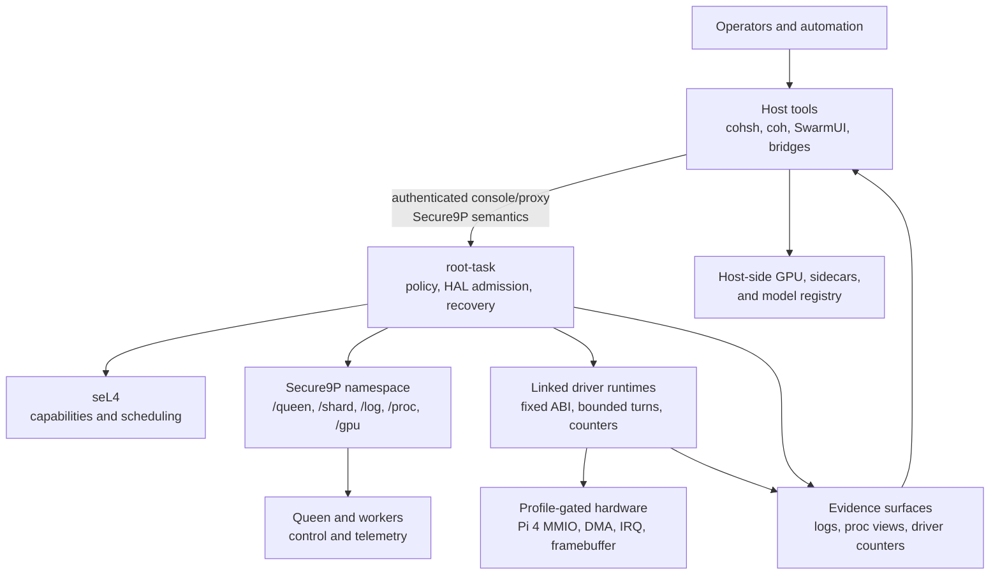

<!-- Copyright © 2026 Lukas Bower -->
<!-- SPDX-License-Identifier: Apache-2.0 -->
<!-- Purpose: Provide a high-level overview of Cohesix architecture and workspace layout. -->
<!-- Author: Lukas Bower -->
<table width="100%" cellpadding="0" cellspacing="0">
  <tr>
    <td align="center" bgcolor="#333333">
      
    </td>
  </tr>
</table>

Cohesix `0.9.0-beta` is the project's first beta release, with significant improvements in stability and operator usability.

Open-source releases are available in [releases/](releases/).

**Tested platforms**:
- Apple Silicon M-series (macOS 26 host, Queen VM + host tools)
- AWS g5g.xlarge (Queen VM, host tools, GPU integration, API integration)
- AWS t4g.small (arm64 build host)
- NVIDIA JetPack 6.2.1 (worker VM path, GPU integration)
- Raspberry Pi 4 version B (Queen, local-seat HDMI and USB keyboard, GENET NIC, CYW43 WiFi)

**Models Tested**:
- HuggingFaceTB/SmolVLM-500M-Instruct
- WinKawaks/vit-small-patch16-224 (ViT-S/16)
- WinKawaks/vit-tiny-patch16-224 (ViT-Ti/16)

## What is Cohesix?

Cohesix is a research operating system for secure edge orchestration. It asks how much of an edge GPU control plane can be made small, auditable, and deterministic by building on [seL4](https://sel4.systems/), keeping userspace pure Rust, and exposing control as capability-scoped files instead of POSIX services.

The system is intentionally narrow:
- upstream seL4 on QEMU `aarch64/virt` and the Raspberry Pi 4 U-Boot profile family;
- a static CPIO userspace containing the root task, worker roles, and profile-selected linked driver-runtime images;
- Secure9P-style namespaces for `/queen`, `/shard/<label>/worker/<id>`, `/log`, `/proc`, and host-projected `/gpu` state;
- console-backed VM access, with no separate in-VM 9P/TCP listener or ad-hoc RPC channel;
- host-side CUDA, NVML, sidecars, model registries, and UI tooling.

The result is an orchestration environment for AI hives and distributed GPU workloads where authority, lifecycle, telemetry, and failure handling are first-class OS concerns. Detailed scope and use cases live in [docs/USE_CASES.md](docs/USE_CASES.md) and [docs/BUILD_PLAN.md](docs/BUILD_PLAN.md).

## Design Shape

Cohesix uses a Queen/Worker hive model. The root task owns initial authority, HAL admission, scheduling, and recovery; NineDoor presents the synthetic namespace; workers and host tools interact through bounded file-shaped control surfaces. The design inherits Plan 9's namespace discipline, but rejects the single-system illusion: namespaces are role-scoped authority views, not global storage, and operations are bounded, revocable, and auditable.

QEMU is used for bring-up, CI, and semantic regression testing. The deployment direction is physical ARM64 hardware, with Pi 4 bring-up aligned to the upstream seL4 U-Boot + binary image flow. QEMU driver-task smoke is useful transport-substrate evidence, but hardware acceptance still requires fresh board proof. See [docs/HARDWARE_BRINGUP.md](docs/HARDWARE_BRINGUP.md) and [docs/BOOT_REFERENCE.md](docs/BOOT_REFERENCE.md).

**Figure 1:** Cohesix concept architecture


```mermaid
flowchart TB
  OP["Operators and automation"] --> HOST["Host tools\ncohsh, coh, SwarmUI, bridges"]
  HOST -->|"authenticated console/proxy\nSecure9P semantics"| ROOT["root-task\npolicy, HAL admission, recovery"]
  ROOT --> SEL4["seL4\ncapabilities and scheduling"]
  ROOT --> NS["Secure9P namespace\n/queen, /shard, /log, /proc, /gpu"]
  NS --> ROLES["Queen and workers\ncontrol and telemetry"]
  ROOT --> DRIVERS["Linked driver runtimes\nfixed ABI, bounded turns, counters"]
  DRIVERS --> BOARD["Profile-gated hardware\nPi 4 MMIO, DMA, IRQ, framebuffer"]
  ROOT --> EVIDENCE["Evidence surfaces\nlogs, proc views, driver counters"]
  DRIVERS --> EVIDENCE
  EVIDENCE --> HOST
  HOST --> EXT["Host-side GPU, sidecars,\nand model registry"]
```

For the full architecture, diagrams, namespace contracts, and driver-runtime ABI, see [docs/ARCHITECTURE.md](docs/ARCHITECTURE.md), [docs/SECURE9P.md](docs/SECURE9P.md), [docs/ROLES_AND_SCHEDULING.md](docs/ROLES_AND_SCHEDULING.md), and [docs/DRIVERS.md](docs/DRIVERS.md).

## Main Components

- **root-task** — seL4 bootstrap, authority root, HAL admission, recovery, and console handling.
- **NineDoor / Secure9P** — synthetic namespace for role-scoped control, telemetry, logs, and host-projected GPU state.
- **Queen and workers** — file-driven orchestration roles, including heartbeat and GPU lease telemetry.
- **linked driver runtimes** — profile-selected no-std child images for Pi 4 hardware service turns and driver counters.
- **host tools** — `cohsh`, `coh`, SwarmUI, `gpu-bridge-host`, and sidecar bridges; heavy ecosystems stay outside the VM TCB.

SwarmUI is the host-side desktop UI for Cohesix. It renders Live Hive telemetry and replays while reusing the same console-backed path as `cohsh`.

**Figure 2** SwarmUI replay (Live Hive telemetry visualization)


## Getting Started

### Option A: Run a pre-built release (fastest)
Pre-built bundles are available in [releases/](releases/). Each bundle includes its own `QUICKSTART.md`.

1. Extract the bundle for your OS (`*-MacOS` or `*-linux`).
2. Install runtime dependencies (QEMU + SwarmUI libs):
   ```bash
   ./scripts/setup_environment.sh
   ```
3. Terminal 1: boot the VM:
   ```bash
   ./qemu/run.sh
   ```
4. Terminal 2: connect with `cohsh`:
   ```bash
   ./bin/cohsh --transport tcp --tcp-host 127.0.0.1 --tcp-port 31337 --role queen
   ```
   For non-local use, tunnel this TCP console over a VPN/overlay (no TLS inside the VM).
5. If you plan to run non-mock PEFT flows, publish the live GPU registry so `/gpu/models` is visible:
   ```bash
   ./bin/gpu-bridge-host --publish --tcp-host 127.0.0.1 --tcp-port 31337 --auth-token changeme
   ```
6. Optional UI (Mac or Linux desktop):
   ```bash
   ./bin/swarmui
   ```
   Headless Linux: `xvfb-run -a ./bin/swarmui`

---

### Option B: Build from source (macOS or Linux)
You need QEMU, Rust, Python 3, and an external seL4 build that produces `elfloader` and `kernel.elf`.

**macOS 26 (Apple Silicon)**
```bash
./toolchain/setup_macos_arm64.sh
source "$HOME/.cargo/env"
```

**Linux (Ubuntu 24 recommended)**
```bash
sudo apt-get update
sudo apt-get install -y git cmake ninja-build clang llvm lld python3 python3-pip qemu-system-aarch64
curl --proto '=https' --tlsv1.2 -sSf https://sh.rustup.rs | sh -s -- -y --default-toolchain 1.93.1
source "$HOME/.cargo/env"
rustup target add aarch64-unknown-none --toolchain 1.93.1
```
If you're on another Linux distro, install the same dependencies with your package manager (QEMU + build essentials + Rust).

**Build and run (QEMU + TCP console)**
1. Build seL4 externally (upstream) for `aarch64` + `qemu_arm_virt`. Place the build at `$HOME/seL4/build` or pass `--sel4-build` below.
2. Terminal 1: build and boot:
   ```bash
   SEL4_BUILD_DIR=$HOME/seL4/build ./scripts/cohesix-build-run.sh \
     --sel4-build "$HOME/seL4/build" \
     --out-dir out/cohesix \
     --profile release \
     --root-task-features cohesix-dev \
     --cargo-target aarch64-unknown-none \
     --transport tcp
   ```
3. Terminal 2: connect with `cohsh`:
   ```bash
   cd out/cohesix/host-tools
   ./cohsh --transport tcp --tcp-port 31337 --role queen
   ```

---

## References
See below for detailed design, interfaces, and milestone tracking:
- [docs/ARCHITECTURE.md](docs/ARCHITECTURE.md)
- [docs/USERLAND_AND_CLI.md](docs/USERLAND_AND_CLI.md)
- [docs/INTERFACES.md](docs/INTERFACES.md)
- [docs/SECURE9P.md](docs/SECURE9P.md)
- [docs/ROLES_AND_SCHEDULING.md](docs/ROLES_AND_SCHEDULING.md)
- [docs/DRIVERS.md](docs/DRIVERS.md)
- [docs/GPU_NODES.md](docs/GPU_NODES.md)
- [docs/HOST_TOOLS.md](docs/HOST_TOOLS.md)
- [docs/API_GUIDELINES.md](docs/API_GUIDELINES.md)
- [docs/PYTHON_SUPPORT.md](docs/PYTHON_SUPPORT.md)
- [docs/FAILURE_MODES.md](docs/FAILURE_MODES.md)
- [docs/OPERATOR_WALKTHROUGH.md](docs/OPERATOR_WALKTHROUGH.md)
- [docs/USE_CASES.md](docs/USE_CASES.md)
- [docs/BENCHMARKS.md](docs/BENCHMARKS.md)

---

## Status
- [docs/BUILD_PLAN.md](docs/BUILD_PLAN.md) 
