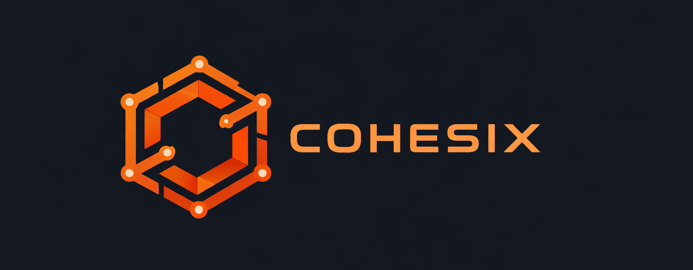
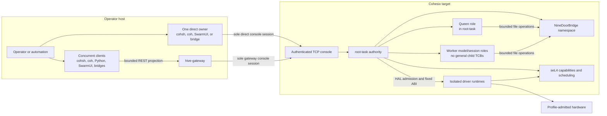
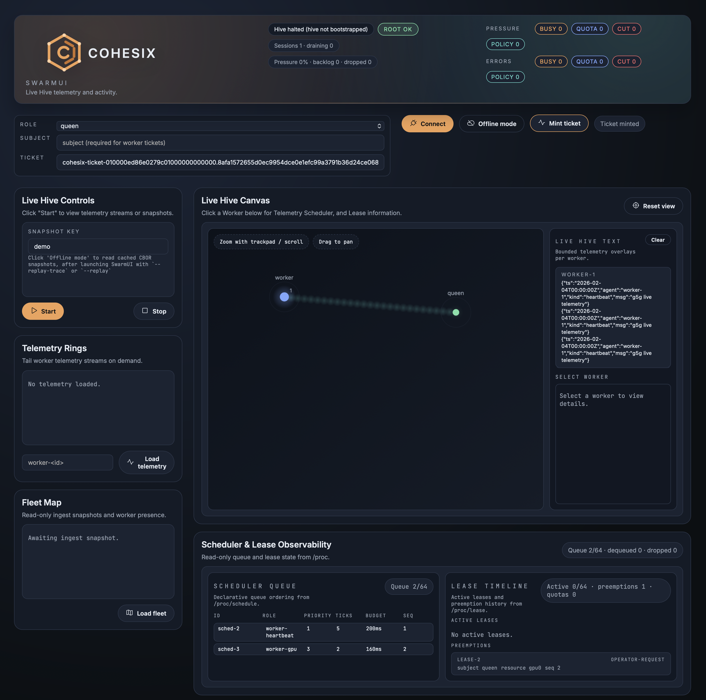

<!-- Copyright © 2026 Lukas Bower -->
<!-- SPDX-License-Identifier: Apache-2.0 -->
<!-- Purpose: Introduce Cohesix, explain its AI-hive design, and direct readers to verified usage and documentation. -->
<!-- Author: Lukas Bower -->

<div align="center">
  <div style="width: 720px; max-width: 100%; aspect-ratio: 5 / 2; overflow: hidden;">
    
  </div>
</div>
<br />
Cohesix is a research operating system for edge AI, built around a simple idea:
an AI fleet should have air-traffic control, not a pile of tools holding
unrestricted credentials.

Each Cohesix hive has a Queen—the central orchestration authority—and a small
set of narrowly focused Worker roles for heartbeat telemetry, GPU lease and
status records, and LoRA adapter/model lifecycle receipts. These Workers are
control-plane roles inside Cohesix, not the macOS or Linux machines in the
fleet. In the checked-in target profiles they are root/host model and session
views; no general Worker child TCB is launched yet.

Cohesix is designed to coordinate large, mixed-platform hives of GPU-backed AI
systems. Linux GPU nodes and macOS or Linux operator and AI hosts keep their
models, agents, training, inference, and hardware stacks in their native
operating systems. The project includes the complete Cohesix control-plane
toolkit: command-line tools, a gateway, desktop UI, GPU and service bridges, an
automation agent, a Python SDK, and evidence tooling. These tools are part of
Cohesix, but run beside the AI stack on the host—not inside the Cohesix OS—so
the trusted core stays small.

## What makes Cohesix different?

Cohesix complements macOS and Linux; it does not try to replace them. It adds a
compact, auditable decision layer for systems where safe action matters as much
as smart inference: what was allowed, which policy governed it, and what
evidence remains.

Conventional control planes often grow into a web of privileged services,
service accounts, RPC APIs, and one-off integrations. Cohesix borrows Plan 9's
most useful idea: present control and state as a tree of named paths. 9P does
much of the heavy lifting, giving tools one small vocabulary—find a path, read
state, or write a bounded request—instead of a different RPC interface and
permission model for every feature.

Host NineDoor exposes this tree through Secure9P. On a Cohesix target, approved
host tools reach the same namespace model through the authenticated console;
physical drivers use a separate fixed interface. The transports differ where
they must, but the control model stays consistent.

- **Authority is explicit.** Cohesix combines kernel-enforced capabilities with
  generated role, policy, ticket, and lifecycle checks rather than relying on
  ambient root access. Worker tickets are mandatory; Queen tickets are optional.
- **Control is uniform.** Commands, status, telemetry, policy, and evidence use a
  bounded file-shaped namespace—a role-visible tree of named control and state
  paths—instead of a collection of unrelated in-VM services.
- **Hardware is compartmentalized.** Physical Pi 4 devices run in
  manifest-declared Rust driver runtimes admitted through HAL; the root task does
  not own their steady-state drivers.
- **AI can propose; Cohesix decides.** Models, agents, and operators submit intent
  through approved host tools, while target-side role, ticket, lifecycle, and
  bounds checks decide what is accepted and retain evidence of the outcome.

Cohesix is not a general-purpose desktop/server OS, Linux distribution, POSIX
environment, or in-VM GPU stack.

## Why seL4, Plan 9, and 9P?

seL4 is Cohesix's kernel foundation. Plan 9 supplies the central design idea,
and 9P turns that idea into a practical control model. No prior experience with
them is required to use Cohesix.

| Term | Plain-language meaning | Why Cohesix uses it |
| --- | --- | --- |
| **[seL4](https://sel4.systems/About/)** | A formally verified microkernel: the small, privileged core controlling memory, execution, interrupts, and communication. A *capability* is a precise, kernel-enforced permission. | Keeps the privileged kernel small and makes access to target resources explicit. seL4's proofs apply under documented assumptions; they do not make Cohesix as a whole formally verified. |
| **[Plan 9](https://9p.io/sys/doc/9.html)** | A Bell Labs research OS where services, devices, status, and stored data can all appear in a file hierarchy assembled for each process. | Provides the design inspiration for one understandable namespace spanning control, status, telemetry, policy, and evidence. Cohesix is not Plan 9 and does not provide a POSIX façade. |
| **[9P](https://9p.io/sys/doc/names.html)** | The compact protocol Plan 9 uses to navigate and use those file hierarchies. | Host NineDoor implements a bounded 9P2000.L subset called Secure9P. Its path, read, write, and append model avoids a separate RPC interface for every feature. |
| **NineDoor** | Cohesix's namespace server and related adapters. | Host NineDoor speaks Secure9P. The target uses a separate `NineDoorBridge` behind its authenticated console; it is not an in-VM 9P-over-TCP server. |

Together, seL4 answers **who may hold low-level authority**, while the namespace
shows **which named controls and state each role may use**. Policy, state, and
evidence stay visible instead of being scattered across opaque services.

## Architecture at a glance


```mermaid
flowchart LR
  subgraph Host[Operator host]
    Operator[Operator or automation]
    Direct["One direct owner\ncohsh, coh, SwarmUI, or bridge"]
    Shared["Concurrent clients\ncohsh, coh, Python, SwarmUI, bridges"]
    Gateway[hive-gateway]
    Operator --> Direct
    Operator --> Shared
    Shared -->|bounded REST projection| Gateway
  end

  subgraph Target[Cohesix target]
    Console[Authenticated TCP console]
    Root[root-task authority]
    Namespace[NineDoorBridge namespace]
    Queen["Queen role\nin root-task"]
    Workers["Worker model/session roles\nno general child TCBs"]
    Drivers[Isolated driver runtimes]
    Kernel[seL4 capabilities and scheduling]
    Console --> Root
    Root --> Namespace
    Root --> Queen
    Root --> Workers
    Queen -->|bounded file operations| Namespace
    Workers -->|bounded file operations| Namespace
    Root -->|HAL admission and fixed ABI| Drivers
    Root --> Kernel
    Drivers --> Kernel
  end

  Hardware[Profile-admitted hardware]

  Direct -->|sole direct console session| Console
  Gateway -->|sole gateway console session| Console
  Drivers --> Hardware
```

The two console arrows are alternatives: one direct tool or bridge owns the
target's single TCP session, or `hive-gateway` owns it for concurrent host
clients. They must not compete. The console uses the documented `AUTH`/`ATTACH`
sequence, `OK`/`ERR` responses, and `END` stream terminator—not 9P frames on the
wire. Host tools preserve the same namespace authority without creating a
second control path.

**SwarmUI** is the host-side desktop view of Cohesix telemetry and replay. It reuses
the existing host transport semantics and adds no target authority.



## Current project status

Work is tracked in the [Build Plan](docs/BUILD_PLAN.md), including future planned Milestones.

| Surface | Current state | Evidence boundary |
| --- | --- | --- |
| QEMU `aarch64/virt` | Reference development and regression target on seL4 16.0.0; fresh static profiles and linked `--no-run` packaging pass | Booted target-qualified evidence is still required; QEMU is not hardware proof. |
| Raspberry Pi 4 boot | Pi firmware → U-Boot → seL4 binary image → root task; fresh v16 Pi profiles and direct `~/seL4_16` diagnostic build pass | Implemented and previously board-proven; a clean exact image and current-tree live revalidation remain part of Milestone 26d. |
| Pi 4 wired networking | Isolated GENETv5 runtime with DHCP and TCP | Accepted Milestone 26c evidence exists for its recorded image; a new image must prove its own state. |
| Pi 4 Wi-Fi | Linked CYW43455 and SDIO runtimes implemented | Reopened 26b work has no current-image association, DHCP, TCP, or repeatability claim yet. |
| Host tools | macOS 26 on Apple Silicon is the primary development host | Host success does not prove target or Pi hardware behavior. |
| AWS/UEFI | Planned profile | Milestone 30 is pending; AWS is not a current Cohesix VM target. |

Building, flashing, current-image boot, saved policy, device readiness, raw TCP,
authenticated `cohsh`, and benchmark results are separate proof states. The
[hardware runbook](docs/HARDWARE_BRINGUP.md) explains how to prove each one.

## Get started

### Run a release bundle

Versioned bundles under [releases/](releases/) include release-specific
`QUICKSTART.md` instructions. The common QEMU flow is:

1. Extract the bundle and install its documented dependencies.
2. Start `./qemu/run.sh` in one terminal.
3. In another terminal, provide the deployment's TCP console authentication
   token without echoing it and connect as Queen:

   ```bash
   read -r -s COHSH_AUTH_TOKEN
   export COHSH_AUTH_TOKEN
   ./bin/cohsh --transport tcp --tcp-host 127.0.0.1 --tcp-port 31337 \
     --role queen
   unset COHSH_AUTH_TOKEN
   ```

Direct TCP is authenticated but not encrypted. Keep it on loopback or carry it
through an authenticated tunnel.

### Build the current source tree

The primary path is macOS 26 on Apple Silicon with the repository's external
seL4 16.0.0 build outputs. QEMU, Rust, Python 3, and the selected seL4 profile
must already be available. Follow the current-tree
[Quickstart](docs/QUICKSTART.md); use
[Toolchain setup](docs/TOOLCHAIN_MAC_ARM64.md) for the pinned host and external
seL4 prerequisites. The repo-managed `seL4/` build, SMP, U-Boot, manual, and
elfloader reference artifacts have all been refreshed to v16; fresh acceptance
claims still validate their causal `out/sel4/profile-v2` builds.

```bash
./toolchain/setup_macos_arm64.sh
source "$HOME/.cargo/env"
```

Build and start the QEMU TCP-console profile:

```bash
SEL4_BUILD_DIR="$PWD/out/sel4/profile-v2/qemu-smp-production" \
  ./scripts/cohesix-build-run.sh \
    --sel4-build "$PWD/out/sel4/profile-v2/qemu-smp-production" \
    --out-dir out/cohesix \
    --profile release \
    --root-task-features cohesix-dev \
    --cargo-target aarch64-unknown-none \
    --transport tcp
```

Then connect from another terminal using the deployment's console
authentication token:

```bash
read -r -s COHSH_AUTH_TOKEN
export COHSH_AUTH_TOKEN
out/cohesix/host-tools/cohsh \
  --transport tcp --tcp-host 127.0.0.1 --tcp-port 31337 --role queen
unset COHSH_AUTH_TOKEN
```

For Raspberry Pi 4, use that runbook's separate workflow. Building or flashing
an image is not proof that the board booted that image.

## Documentation

Each document owns one part of the public contract. Generated values remain in
`docs/snippets/` and the selected resolved manifest.

### Design and contracts

| Document | Owns |
| --- | --- |
| [Glossary](docs/GLOSSARY.md) | Plain-language definitions of Cohesix concepts, terminology, and evidence boundaries |
| [Architecture](docs/ARCHITECTURE.md) | Trust boundaries, components, and major data flows |
| [Interfaces](docs/INTERFACES.md) | Namespaces, payloads, console behavior, and compatibility |
| [Secure9P](docs/SECURE9P.md) | 9P layering, bounds, session invariants, and policy hooks |
| [Roles and scheduling](docs/ROLES_AND_SCHEDULING.md) | Queen/Worker authority, lifecycle, and scheduling policy |
| [Drivers](docs/DRIVERS.md) | HAL, isolated runtimes, device status, and proof method |
| [GPU nodes](docs/GPU_NODES.md) | Host-only GPU boundary, leases, and telemetry |

### Operator and integration guides

| Document | Owns |
| --- | --- |
| [Quickstart](docs/QUICKSTART.md) | Shortest safe mock and current-source QEMU paths |
| [Userland and CLI](docs/USERLAND_AND_CLI.md) | Console, `cohsh`, `.coh` grammar, and command semantics |
| [Host tools](docs/HOST_TOOLS.md) | Executable catalogue, transports, and composition rules |
| [API guidelines](docs/API_GUIDELINES.md) | REST projection, authentication, and compatibility |
| [Python support](docs/PYTHON_SUPPORT.md) | Python backends, bounded APIs, and examples |
| [Operator walkthrough](docs/OPERATOR_WALKTHROUGH.md) | End-to-end preflight, operation, and evidence capture |
| [Operator recipes](docs/OPERATOR_RECIPES.md) | Evidence, mount, lifecycle, host-ticket, federation, and PEFT tasks |
| [Failure modes](docs/FAILURE_MODES.md) | Symptoms, evidence, recovery, and escalation |

### Targets, evidence, and planning

| Document | Owns |
| --- | --- |
| [Hardware bring-up](docs/HARDWARE_BRINGUP.md) | Image, flash, boot, and hardware-proof workflow |
| [Boot reference](docs/BOOT_REFERENCE.md) | Boot stages, prompts, and fail-closed invariants |
| [Benchmarks](docs/BENCHMARKS.md) | Workloads, provenance, and regression decisions |
| [Use cases](docs/USE_CASES.md) | Capability-fit patterns, not acceptance claims |
| [Build plan](docs/BUILD_PLAN.md) | Normative milestone scope, task authorization, and status |
| [Toolchain setup](docs/TOOLCHAIN_MAC_ARM64.md) | Pinned macOS host tools and external seL4 artifact contract |
| [Security](docs/SECURITY.md) | Private reporting, trust boundaries, controls, and generated limits |

## Help and contributing

- New to Cohesix? Start with the [glossary](docs/GLOSSARY.md), then follow the
  [operator walkthrough](docs/OPERATOR_WALKTHROUGH.md); use
  [failure modes](docs/FAILURE_MODES.md) for diagnosis and recovery.
- Contributions must follow [`AGENTS.md`](AGENTS.md),
  [Contributing](CONTRIBUTING.md), and the active task in the
  [build plan](docs/BUILD_PLAN.md).
- Cohesix is maintained by Lukas Bower. Use GitHub Issues for reproducible,
  non-sensitive bugs and scoped design discussions. Report vulnerabilities
  through the private process in [Security](docs/SECURITY.md); never put secrets
  in an issue, log, or command example.

## License

Cohesix is licensed under Apache-2.0. See [LICENSE.txt](LICENSE.txt) and
[NOTICE.txt](NOTICE.txt).
