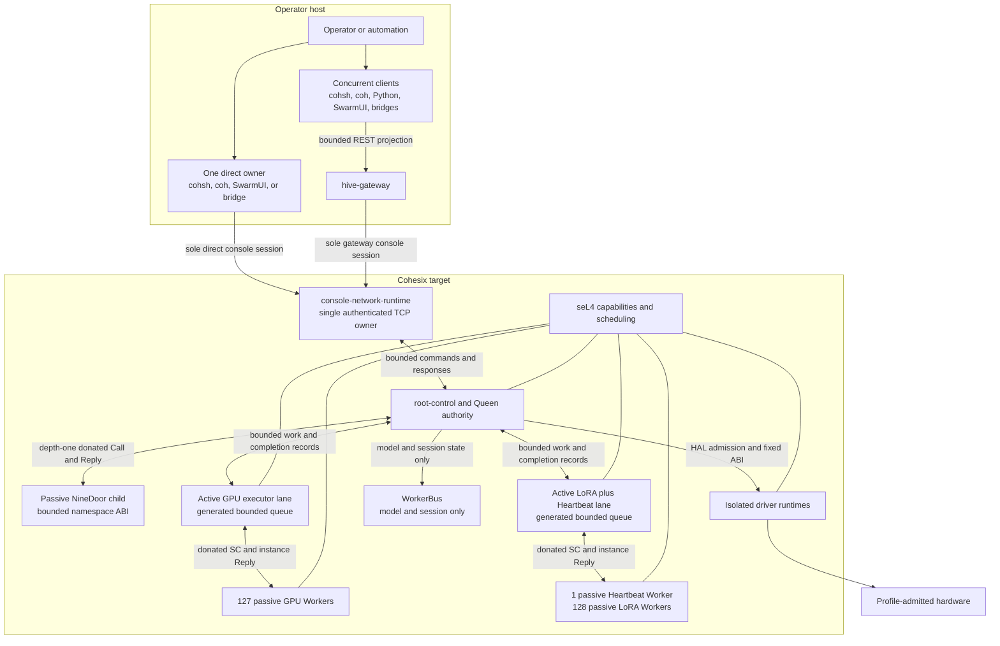

<!-- Copyright © 2026 Lukas Bower -->
<!-- SPDX-License-Identifier: Apache-2.0 -->
<!-- Purpose: Introduce Cohesix, explain its AI-hive design, and direct readers to verified usage and documentation. -->
<!-- Author: Lukas Bower -->

<div align="center">
  <div style="width: 720px; max-width: 100%;">
    
  </div>
</div>
<br />
Cohesix is a research operating system for edge AI, built around a simple idea:
an AI fleet should have air-traffic control, not a pile of tools holding
unrestricted credentials.

Each Cohesix hive has a Queen—the central orchestration authority—and a small
set of narrowly focused Worker roles for heartbeat telemetry, GPU lease and
status records, and LoRA adapter/model lifecycle receipts. These Workers are
control-plane roles inside Cohesix, not the macOS or Linux machines in the
fleet. The checked-in target profiles declare Heartbeat, GPU, and LoRA as
executable roles with bounded target-task authority; WorkerBus remains a
model/session-only role. That declaration is not evidence that a particular
QEMU or Pi run created or accepted those tasks.

The selected QEMU and Pi topologies each admit 256 passive Worker instances
across those three executable roles. Two bounded executor lanes
provide useful concurrency without multiplying active scheduling-context
demand per Worker.

Cohesix is designed to coordinate large, mixed-platform hives of GPU-backed AI
systems. Linux GPU nodes and macOS or Linux operator and AI hosts keep their
models, agents, training, inference, and hardware stacks in their native
operating systems. The project includes the complete Cohesix control-plane
toolkit: command-line tools, a gateway, desktop UI, GPU and service bridges, an
automation agent, a Python SDK, and evidence tooling. These tools are part of
Cohesix, but run beside the AI stack on the host—not inside the Cohesix OS—so
the trusted core stays small.

## What makes Cohesix different?

Cohesix complements macOS and Linux; it does not try to replace them. It adds a
compact, auditable decision layer for systems where safe action matters as much
as smart inference: what was allowed, which policy governed it, and what
evidence remains.

Conventional control planes often grow into a web of privileged services,
service accounts, RPC APIs, and one-off integrations. Cohesix borrows Plan 9's
most useful idea: present control and state as a tree of named paths. 9P does
much of the heavy lifting, giving tools one small vocabulary—find a path, read
state, or write a bounded request—instead of a different RPC interface and
permission model for every feature.

Host NineDoor exposes this tree through Secure9P. On a Cohesix target, approved
host tools reach the same namespace model through the authenticated console;
physical drivers use a separate fixed interface. The transports differ where
they must, but the control model stays consistent.

- **Authority is explicit.** Cohesix combines kernel-enforced capabilities with
  generated role, policy, ticket, and lifecycle checks rather than relying on
  ambient root access. Worker tickets are mandatory; Queen tickets are optional.
- **Control is uniform.** Commands, status, telemetry, policy, and evidence use a
  bounded file-shaped namespace—a role-visible tree of named control and state
  paths—instead of a collection of unrelated in-VM services.
- **Hardware is compartmentalized.** Physical Pi 4 devices run in
  manifest-declared Rust driver runtimes admitted through HAL; the root task does
  not own their steady-state drivers.
- **AI can propose; Cohesix decides.** Models, agents, and operators submit intent
  through approved host tools, while target-side role, ticket, lifecycle, and
  bounds checks decide what is accepted and retain evidence of the outcome.

Cohesix is not a general-purpose desktop/server OS, Linux distribution, POSIX
environment, or in-VM GPU stack.

## Why seL4, Plan 9, and 9P?

seL4 is Cohesix's kernel foundation. Plan 9 supplies the central design idea,
and 9P turns that idea into a practical control model. No prior experience with
them is required to use Cohesix.

| Term | Plain-language meaning | Why Cohesix uses it |
| --- | --- | --- |
| **[seL4](https://sel4.systems/About/)** | A formally verified microkernel: the small, privileged core controlling memory, execution, interrupts, and communication. A *capability* is a precise, kernel-enforced permission. | Keeps the privileged kernel small and makes access to target resources explicit. seL4's proofs apply under documented assumptions; they do not make Cohesix as a whole formally verified. |
| **[Plan 9](https://9p.io/sys/doc/9.html)** | A Bell Labs research OS where services, devices, status, and stored data can all appear in a file hierarchy assembled for each process. | Provides the design inspiration for one understandable namespace spanning control, status, telemetry, policy, and evidence. Cohesix is not Plan 9 and does not provide a POSIX façade. |
| **[9P](https://9p.io/sys/doc/names.html)** | The compact protocol Plan 9 uses to navigate and use those file hierarchies. | Host NineDoor implements a bounded 9P2000.L subset called Secure9P. Its path, read, write, and append model avoids a separate RPC interface for every feature. |
| **NineDoor** | Cohesix's namespace server and related adapters. | Host NineDoor speaks Secure9P. The target uses a separate `NineDoorBridge` behind its authenticated console; it is not an in-VM 9P-over-TCP server. |

Together, seL4 answers **who may hold low-level authority**, while the namespace
shows **which named controls and state each role may use**. Policy, state, and
evidence stay visible instead of being scattered across opaque services.

## Architecture at a glance


```mermaid
flowchart TB
  subgraph Host[Operator host]
    Operator[Operator or automation]
    Direct["One direct owner\ncohsh, coh, SwarmUI, or bridge"]
    Shared["Concurrent clients\ncohsh, coh, Python, SwarmUI, bridges"]
    Gateway[hive-gateway]
    Operator --> Direct
    Operator --> Shared
    Shared -->|bounded REST projection| Gateway
  end

  subgraph Target[Cohesix target]
    Console["console-network-runtime\nsingle authenticated TCP owner"]
    Root["root-control and Queen authority"]
    Namespace["Passive NineDoor child\nbounded namespace ABI"]
    GpuLane["Active GPU executor lane\ngenerated bounded queue"]
    LoraLane["Active LoRA plus Heartbeat lane\ngenerated bounded queue"]
    GpuWorkers["127 passive GPU Workers"]
    OtherWorkers["1 passive Heartbeat Worker\n128 passive LoRA Workers"]
    WorkerBus["WorkerBus\nmodel and session only"]
    Drivers[Isolated driver runtimes]
    Kernel[seL4 capabilities and scheduling]

    Console <-->|bounded commands and responses| Root
    Root <-->|depth-one donated Call and Reply| Namespace
    Root <-->|bounded work and completion records| GpuLane
    Root <-->|bounded work and completion records| LoraLane
    GpuLane <-->|donated SC and instance Reply| GpuWorkers
    LoraLane <-->|donated SC and instance Reply| OtherWorkers
    Root -->|model and session state only| WorkerBus
    Root -->|HAL admission and fixed ABI| Drivers
    Kernel --- Root
    Kernel --- GpuLane
    Kernel --- LoraLane
    Kernel --- GpuWorkers
    Kernel --- OtherWorkers
    Kernel --- Drivers
  end

  Hardware[Profile-admitted hardware]

  Direct -->|sole direct console session| Console
  Gateway -->|sole gateway console session| Console
  Drivers --> Hardware
```

The two console arrows are alternatives: one direct tool or bridge owns the
target's single TCP session, or `hive-gateway` owns it for concurrent host
clients. They must not compete. The console uses the documented `AUTH`/`ATTACH`
sequence, `OK`/`ERR` responses, and `END` stream terminator—not 9P frames on the
wire. Host tools preserve the same namespace authority without creating a
second control path.

**SwarmUI** is the host-side desktop view of Cohesix telemetry and replay. It reuses
the existing host transport semantics and adds no target authority.


## Current project status

Milestone 26e and release **1.0.0-beta** are still in qualification. The selected
profiles declare an SMP+MCS target with isolated root services, executable
Heartbeat/GPU/LoRA Workers, and isolated physical drivers. Full promotion still
requires separate exact-artifact QEMU and fresh-Pi evidence.

The latest checked-in host bundles are **0.9.0-beta**. The planned **1.0.0-beta**
Mac, Linux ARM64, and Pi 4 bundles have not been published; the Pi bundle will
include the first complete SD-card image. Existing releases are snapshots of
their own source and do not include all capabilities described by current main.

See [Current status](docs/STATUS.md) for the capability and evidence snapshot,
and the [Build Plan](docs/BUILD_PLAN.md) for the complete record of planned and
implemented scope. Building, flashing, booting, device readiness, raw TCP,
authenticated `cohsh`, and benchmark results remain separate proof states.

## Get started

The commands below use **Bash**. On a Mac, enter `bash` in each terminal before
running them.

### Run a release bundle

Choose the matching Mac or Linux ARM64 archive under [releases/](releases/)
and follow its bundled `QUICKSTART.md` and release notes. After extraction, verify its
`MANIFEST.sha256` before running tools: use `shasum -a 256 --check MANIFEST.sha256`
on Mac or `sha256sum --check MANIFEST.sha256` on Linux. The common host-bundle
QEMU flow is:

1. From the extracted bundle root, run `./scripts/setup_environment.sh`. This installs
   QEMU/runtime libraries and creates `.venv` when the bundled Python client is
   present.
2. Start `./qemu/run.sh` in one terminal.
3. In another terminal, change into the same extracted bundle. Obtain the
   target's TCP console credential using that release's guide, then enter it
   without echoing it and connect as Queen:

   ```bash
   read -r -s -p 'Target console token: ' COHSH_AUTH_TOKEN
   printf '\n'
   export COHSH_AUTH_TOKEN
   ./bin/cohsh --transport tcp --tcp-host 127.0.0.1 --tcp-port 31337 \
     --role queen
   unset COHSH_AUTH_TOKEN
   ```

The planned Pi 4 archive contains the SD image and documentation; it requires
the matching host archive for CLI, Python, and SwarmUI tools. See the current
[Quickstart](docs/QUICKSTART.md) for the three-bundle installation workflow.

Direct TCP is authenticated but not encrypted. Keep it on loopback or carry it
through an authenticated tunnel.

### Build the current source tree

Run one setup command from the repository root. Both installers pin Rust and
create `.venv`; rerunning either command is safe.

macOS 26 or later on Apple Silicon (full pinned seL4 build host):

```bash
./toolchain/setup_macos_arm64.sh
```

Ubuntu 22.04, 24.04, or 26.04 on ARM64 (host tools and diagnostic QEMU):

```bash
./toolchain/setup_linux_arm64.sh
```

Then enter the installed environments:

```bash
source "$HOME/.cargo/env"
source .venv/bin/activate
```

These installers prepare dependencies; they do not build the Cohesix host
binaries or seL4 guest. For host-tool builds and native Linux QEMU, follow the
[host-tool guide](docs/HOST_TOOLS.md#release-factory). Native Linux QEMU uses
`qemu_smp_kvm_production`, KVM, and a 31.25 MHz host counter. The Mac guest uses
`qemu_smp_production`, HVF, and 24 MHz; these guest artifacts are not interchangeable.

For the **Mac source build below**, first
[prepare the external seL4 16.0.0 project](docs/TOOLCHAIN_MAC_ARM64.md#2-prepare-the-external-sel4-project-source),
then [configure, build, and validate](docs/TOOLCHAIN_MAC_ARM64.md#6-rebuilding-sel4-profiles)
`qemu_smp_production` into `out/sel4/profile-v2/qemu-smp-production`.
The setup installer does not create that build directory. Once it is ready,
build and start the QEMU TCP-console profile:

```bash
SEL4_BUILD_DIR="$PWD/out/sel4/profile-v2/qemu-smp-production" \
  ./scripts/cohesix-build-run.sh \
    --sel4-build "$PWD/out/sel4/profile-v2/qemu-smp-production" \
    --out-dir out/cohesix \
    --profile release \
    --root-task-features release-qemu,bootstrap-trace \
    --cargo-target aarch64-unknown-none \
    --transport tcp
```

Then connect from another Bash terminal at the repository root. The QEMU
console token is the Queen ticket's `secret` in
`configs/generated/root_task_resolved.json`; view it locally without copying
it into shared logs. Editing this generated file does not change the credential
already compiled into the guest.

```bash
read -r -s -p 'Target console token: ' COHSH_AUTH_TOKEN
printf '\n'
export COHSH_AUTH_TOKEN
out/cohesix/host-tools/cohsh \
  --transport tcp --tcp-host 127.0.0.1 --tcp-port 31337 --role queen
unset COHSH_AUTH_TOKEN
```

For Raspberry Pi 4 source builds and flashing, follow
[Hardware Bring-up](docs/HARDWARE_BRINGUP.md). Use the Pi image's own console
credential and network address. Building or flashing an image is not proof
that the board booted that image.

## Documentation

Choose a document by what you want to do. The [Glossary](docs/GLOSSARY.md)
defines Cohesix terminology; generated values remain in `docs/snippets/` and
the selected resolved manifest.

### Understand Cohesix

| Document | Use it to |
| --- | --- |
| [Current status](docs/STATUS.md) | Distinguish checked-in capability from QEMU, Pi, release, and use-case acceptance |
| [Architecture](docs/ARCHITECTURE.md) | Understand trust boundaries, components, and major data flows |
| [Roles and scheduling](docs/ROLES_AND_SCHEDULING.md) | Understand Queen/Worker authority, lifecycle, and scheduling layers |
| [GPU nodes](docs/GPU_NODES.md) | Understand the host-only GPU boundary, leases, and telemetry |
| [Use cases](docs/USE_CASES.md) | Assess capability-fit patterns without treating them as acceptance claims |
| [Security](docs/SECURITY.md) | Understand security objectives, controls, limits, and vulnerability reporting |

### Use Cohesix

| Document | Use it to |
| --- | --- |
| [Quickstart](docs/QUICKSTART.md) | Set up Mac/Linux host tools, boot QEMU or install the Pi 4 image, and connect directly or through the gateway |
| [Operator walkthrough](docs/OPERATOR_WALKTHROUGH.md) | Complete one end-to-end live workflow |
| [Operator recipes](docs/OPERATOR_RECIPES.md) | Perform advanced evidence, mount, lifecycle, ticket, federation, and PEFT tasks |
| [Failure modes](docs/FAILURE_MODES.md) | Diagnose and recover from observable failures |
| [Hardware bring-up](docs/HARDWARE_BRINGUP.md) | Build, flash, boot, and prove QEMU or Pi 4 behavior |

### Guides

| Document | Use it to |
| --- | --- |
| [Userland and CLI](docs/USERLAND_AND_CLI.md) | Look up console, `cohsh`, `.coh`, and command semantics |
| [Host tools](docs/HOST_TOOLS.md) | Choose host executables and compose transports safely |
| [Python support](docs/PYTHON_SUPPORT.md) | Use Python backends, bounded APIs, and generated target contracts |
| [Boot reference](docs/BOOT_REFERENCE.md) | Interpret boot stages, prompts, and fail-closed markers |
| [Benchmarks](docs/BENCHMARKS.md) | Run and interpret reproducible performance measurements |

### Develop and contribute

| Document | Use it to |
| --- | --- |
| [Toolchain setup](docs/TOOLCHAIN_MAC_ARM64.md) | Reproduce the pinned macOS build environment and external seL4 contract |
| [Drivers](docs/DRIVERS.md) | Design, implement, test, and qualify a physical driver |
| [Contributing](CONTRIBUTING.md) | Propose, implement, validate, and submit a scoped change |
| [API guidelines](docs/API_GUIDELINES.md) | Implement against the REST projection and compatibility rules |
| [Interfaces](docs/INTERFACES.md) | Look up namespaces, payloads, console behavior, and compatibility |
| [Secure9P](docs/SECURE9P.md) | Look up 9P layering, bounds, session invariants, and policy hooks |
| [Build plan](docs/BUILD_PLAN.md) | Read the normative record of planned and implemented project scope |
- Contributions must follow [`AGENTS.md`](AGENTS.md),
  [Contributing](CONTRIBUTING.md), and align to the active task in the
  [build plan](docs/BUILD_PLAN.md).

## Help

- New to Cohesix? Read [current status](docs/STATUS.md), use the
  [glossary](docs/GLOSSARY.md) as terms arise, then follow the
  [operator walkthrough](docs/OPERATOR_WALKTHROUGH.md); use
  [failure modes](docs/FAILURE_MODES.md) for diagnosis and recovery.
- Cohesix is maintained by Lukas Bower. Use GitHub Issues for reproducible,
  non-sensitive bugs and scoped design discussions. Report vulnerabilities
  through the private process in [Security](docs/SECURITY.md); never put secrets
  in an issue, log, or command example.

## License

Cohesix is licensed under Apache-2.0. See [LICENSE.txt](LICENSE.txt) and
[NOTICE.txt](NOTICE.txt).
