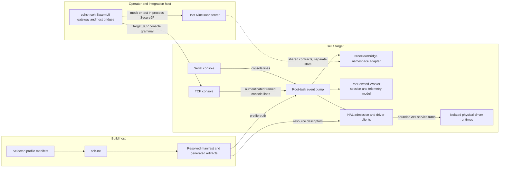

<!-- Copyright 2026 Lukas Bower -->
<!-- SPDX-License-Identifier: Apache-2.0 -->
<!-- Purpose: Describe the as-built Cohesix system boundaries, components, and principal data flows. -->
<!-- Author: Lukas Bower -->

# Cohesix Architecture

This document owns the system-level view of Cohesix: trust boundaries, runtime
components, and the principal control and data flows. Exact namespace contracts
belong in [INTERFACES.md](INTERFACES.md), Secure9P invariants in
[SECURE9P.md](SECURE9P.md), role policy in
[ROLES_AND_SCHEDULING.md](ROLES_AND_SCHEDULING.md), and physical-driver rules in
[DRIVERS.md](DRIVERS.md).

## 1. Authority and evidence boundary

Cohesix is built from an upstream seL4 kernel and a pure-Rust `no_std` target
userspace. The selected profile manifest, its resolved manifest, and generated
`coh-rtc` outputs define the profile's generated interfaces, limits, and
feature gates. The checked-in default-profile snapshot is available in
[the generated manifest snippet](snippets/root_task_manifest.md); target builds
must use the artifacts generated from their selected `configs/root_task*.toml`
file.

Implementation and proof are separate states:

- Source, generated descriptors, and a staged image prove that a path can be
  built; they do not prove that a particular board booted that image.
- QEMU evidence proves the QEMU profile only.
- The accepted Milestone 26c Pi 4 evidence is historical, target-qualified
  evidence for that image and boot set. It does not replace current-image
  Milestone 26d revalidation.
- Wired GENET, CYW43 Wi-Fi, USB/local-seat, serial, HDMI, driver-runtime,
  console, and benchmark proof remain independent ledgers.

The active scope and current proof requirements are normative in
[BUILD_PLAN.md](BUILD_PLAN.md). Boot-by-boot results are non-canonical evidence;
canonical claims must point to the tracked plan, test contract, and archived
target-qualified artifacts.

## 2. Design boundaries

Cohesix is a control-plane operating system for secure orchestration and
telemetry of edge GPU nodes. It uses a Queen/Worker model and exposes bounded,
file-oriented control surfaces.

The target trusted computing base contains:

- the selected upstream seL4 kernel build;
- the Rust root task and compiler-generated policy tables;
- manifest-declared physical-driver runtime images plus their fixed ABI.

The target does not contain CUDA, NVML, container runtimes, a POSIX emulation
layer, or a general-purpose network-service stack. GPU access, REST projection,
host-service integration, and other heavy ecosystems remain host-side. The
only permitted in-target TCP listener is the authenticated root-task console.

### 2.1 Components

| Component | Runtime | Responsibility |
| --- | --- | --- |
| Upstream seL4 | Target kernel | Capability enforcement, address spaces, scheduling, notifications, interrupts, and kernel-generated platform truth. |
| `root-task` | Target, `no_std` | Bootstraps CSpace/VSpaces, admits resources through HAL, runs the bounded event pump, owns operator consoles, validates tickets, and projects the in-target namespace through `NineDoorBridge`. |
| `pi4-driver-*` | Pi 4 target, `no_std` child images | Own steady-state physical-device service behind HAL-admitted resources and the pointer-free driver-task ABI. |
| Worker role/session model | Root-task and host test surfaces | Enforces ticket, namespace, lifecycle, telemetry, and lease semantics. Current selected profiles do not launch Worker child tasks. |
| Host NineDoor | Host, `std` | Implements the Secure9P server used by host builds and in-process tests. It is not the in-target console server. |
| `cohsh`, `coh`, `swarmui`, gateway and bridges | Host | Project documented console or Secure9P semantics; they do not create a new authority path. |
| `coh-rtc` | Build host | Validates manifest IR and generates Rust tables, resolved manifests, policy defaults, scripts, and documentation snippets. |

The checked-in profiles retain records for `worker-heartbeat`, `worker-gpu`,
`worker-bus`, and `worker-lora`, but mark every target Worker role
`implemented = false`. Endpoint-cap and lifecycle-notification requirements are
also disabled. The role records, reserved badge ranges, Worker crates, and
packaged build artifacts are model and interface scaffolding; none proves that
root-task loaded or resumed a Worker TCB. See
[ROLES_AND_SCHEDULING.md](ROLES_AND_SCHEDULING.md) for the support matrix.

### 2.2 System boundary

```mermaid
flowchart LR
  subgraph BuildHost[Build host]
    Manifest[Selected profile manifest]
    Compiler[coh-rtc]
    Generated[Resolved manifest and generated artifacts]
    Manifest --> Compiler --> Generated
  end

  subgraph OperatorHost[Operator and integration host]
    HostClients[cohsh coh SwarmUI gateway and host bridges]
    HostNineDoor[Host NineDoor server]
    HostClients -->|mock or test in-process Secure9P| HostNineDoor
  end

  subgraph Target[seL4 target]
    Serial[Serial console]
    Tcp[TCP console]
    EventPump[Root-task event pump]
    Bridge[NineDoorBridge namespace adapter]
    WorkerModel[Root-owned Worker session and telemetry model]
    Hal[HAL admission and driver clients]
    Drivers[Isolated physical-driver runtimes]

    Serial -->|console lines| EventPump
    Tcp -->|authenticated framed console lines| EventPump
    EventPump --> Bridge
    EventPump --> WorkerModel
    EventPump --> Hal
    Hal -->|bounded ABI service turns| Drivers
  end

  Generated -->|profile truth| EventPump
  Generated -->|resource descriptors| Hal
  HostClients -->|target TCP console grammar| Tcp
  HostNineDoor -.->|shared contracts, separate state| Bridge
```

The dotted relationship is semantic parity, not a transport connection. Host
NineDoor and target `NineDoorBridge` are separate adapters with separate
state. There is no in-target 9P-over-TCP listener.

## 3. Target execution model

### 3.1 Root-task authority

The root task is the target authority process. It constructs seL4 objects,
validates generated descriptors, creates admitted physical-driver child address
spaces, installs their capabilities, and schedules bounded service work. It may retain emergency
serial diagnostics, but it must not become the steady-state owner of a physical
device that the selected manifest assigns to an isolated driver runtime.

The event pump services operator input, timers, networking, worker events, and
driver completions without unbounded queues or busy-wait ownership loops.
Operator priority and bounded degradation rules are defined by `AGENTS.md` and
the console implementation.

### 3.2 Task isolation

Current manifest-declared physical-driver runtimes execute as separate seL4
tasks with task-local address spaces and capability spaces. Root-task creates
those children and delegates only the endpoint, notification, frame, and
shared-ring capabilities admitted for their driver records. The event pump,
console transports, target namespace adapter, tickets, lifecycle state, and
Worker session/model logic remain in the single root-task process.

No checked-in profile currently loads or resumes a Worker child TCB, CSpace, or
VSpace. Worker source crates and generated role records therefore do not add a
separate task-isolation boundary. Driver-task isolation is capability isolation,
not a claim that every device is protected from malicious DMA; the selected DMA
protection profile and target evidence qualify that separate guarantee.

### 3.3 Workers

Queen is the orchestration authority exposed through the root-task and
NineDoor control surfaces; it is not a separate host RPC service. Current
profiles expose Worker role, ticket, namespace, telemetry, lease, and scheduling
records as control-plane model state only. They mark every target Worker role
non-executable, disable cap-backed endpoint authority, and disable
notification-backed lifecycle delivery. Reserved badge values and a non-MCS
scheduling record remain compiler-owned schema data, not installed caps or
applied Worker scheduling evidence.

Worker-role sessions coordinate through scoped namespace files and bounded
model events. A valid Worker ticket authorizes that application-layer view; it
does not create a Worker TCB or seL4 invocation authority. Any future executable
Worker must receive explicit capabilities and must not gain implicit access to
root-task memory, physical devices, or host services. CUDA and NVML remain
outside the target.

### 3.4 Physical drivers

Physical resources enter the system through HAL. HAL validates the generated
driver-image record, maps only declared pages, creates the driver child, and
publishes a bounded runtime-init descriptor. Commands and completions use fixed
shared rings and declared endpoint or notification capabilities. Details,
device status, and proof requirements are in [DRIVERS.md](DRIVERS.md).

## 4. Control-plane paths

Cohesix has two distinct operator protocol families:

1. **Host/in-process Secure9P.** A client negotiates the bounded 9P2000.L
   subset with the host NineDoor server. This path is used by host builds and
   tests.
2. **Target console grammar.** Serial carries console lines directly. TCP adds
   a four-byte little-endian length frame and transport authentication before
   the same bounded command grammar. Application `ATTACH` then selects a role
   and optional capability ticket.

Both adapters project overlapping namespace semantics, but they are not the
same wire protocol. Exact framing, operations, acknowledgements, and error
surfaces are defined in [INTERFACES.md](INTERFACES.md).

Host REST, UI, GPU, sidecar, and federation tools are projections over these
documented interfaces. They may validate, batch, or render data, but they may
not introduce authority unavailable through the underlying ticketed namespace
or console operation.

## 5. Boot flow

The target boot sequence is profile-qualified:

1. Firmware and bootloader load the selected seL4 image. Pi 4 acceptance uses
   the firmware to U-Boot to seL4 binary-image handoff; it does not depend on
   UEFI.
2. seL4 supplies boot information and generated kernel metadata to root-task.
3. Root-task validates kernel/profile invariants, establishes CSpace/VSpaces,
   installs the timer backend, and loads generated policy.
4. HAL admits manifest-declared physical resources and starts selected driver
   runtimes. Owner-state is credited only after runtime identity, resources,
   and service progress are proved; staging a child image is insufficient.
5. Hardware and policy gates run and record their state. Emergency serial and
   root diagnostics may become available while hardware acceptance remains red;
   a diagnostic prompt is not a device-acceptance result.
6. The root-task namespace bridge, log ring, and profile-enabled operator
   surfaces are initialized subject to their individual readiness gates.
7. The bounded event pump enters steady service.

Pi 4 saved boot policy is loaded by the staged U-Boot script and passed through
bounded `/chosen/cohesix,*` properties. Saved policy may select or configure an
allowed network path, but it does not rewrite the compiled manifest. The
as-built boot and recovery procedures live in
[BOOT_REFERENCE.md](BOOT_REFERENCE.md) and
[HARDWARE_BRINGUP.md](HARDWARE_BRINGUP.md).

## 6. Principal data flows

### 6.1 Worker lifecycle and telemetry

An authorized Queen operation appends a bounded control record. Root-task or
host NineDoor validates the role, ticket, lifecycle gate, and generated limits.
In current profiles the operation updates root-owned or host model state; it
does not load or resume a Worker task. Authorized sessions and model helpers
append Worker telemetry to the canonical sharded path:

`/shard/<label>/worker/<id>/telemetry`

The legacy `/worker/<id>/telemetry` alias exists only when the selected
manifest enables it. Exact role views and scheduling semantics are in
[ROLES_AND_SCHEDULING.md](ROLES_AND_SCHEDULING.md).

### 6.2 GPU control

Host `gpu-bridge-host` owns hardware discovery and CUDA/NVML interaction. It
publishes bounded GPU namespace state through the documented bridge surface.
GPU-role policy and model records consume lease, status, and telemetry files.
Current profiles do not launch a target GPU Worker. Host NineDoor simulation
may additionally expose a job node; that host-only surface is not a live target
claim. Model and GPU schema details are in
[GPU_NODES.md](GPU_NODES.md).

### 6.3 Observability

Logs, pressure, session, scheduling, lease, and ingest state are exposed through
bounded namespace nodes. The selected manifest gates each generated provider.
Exact paths and formats are linked from [INTERFACES.md](INTERFACES.md); UI and
gateway consumers do not own those schemas.

## 7. Security invariants

- All target physical-device authority passes through HAL.
- All target steady physical drivers are manifest-declared isolated runtimes.
- Target code remains `no_std`; host capabilities do not leak into target
  closure profiles.
- Capabilities, tickets, generated bounds, and lifecycle gates are checked
  before side effects.
- Secure9P, console grammar, and the driver-task ABI remain separate bounded
  interfaces.
- The target has no TCP listener except the authenticated console.
- Heavy GPU and host-service ecosystems remain outside the target TCB.
- Rootfs CPIO remains below the limit enforced by `scripts/ci/size_guard.sh`.
- Timer and cache behavior follow the selected seL4 build's generated truth.

## 8. Source map

- Scope and milestones: [BUILD_PLAN.md](BUILD_PLAN.md)
- Default generated profile summary:
  [snippets/root_task_manifest.md](snippets/root_task_manifest.md)
- Manifest inputs: [`configs/root_task.toml`](../configs/root_task.toml) and
  [`configs/root_task_pi4_uboot_aarch64.toml`](../configs/root_task_pi4_uboot_aarch64.toml)
- Root-task: [`apps/root-task`](../apps/root-task)
- Host NineDoor: [`apps/nine-door`](../apps/nine-door)
- Physical-driver runtime: [`apps/pi4-driver-runtime`](../apps/pi4-driver-runtime)
- Driver ABI: [`crates/pi4-driver-abi`](../crates/pi4-driver-abi)
- Manifest compiler: [`tools/coh-rtc`](../tools/coh-rtc)
- Validation plan: [TEST_PLAN.md](TEST_PLAN.md)
