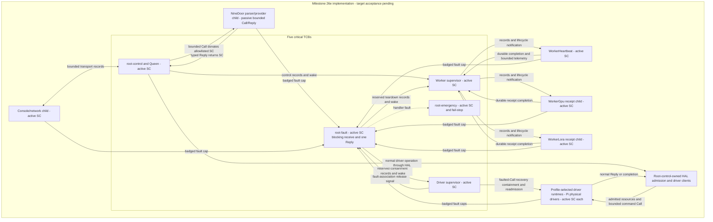
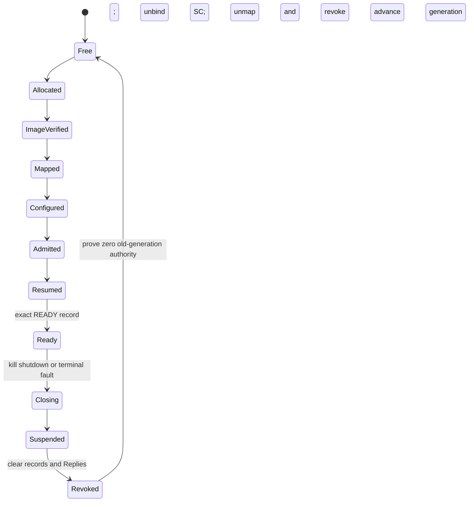
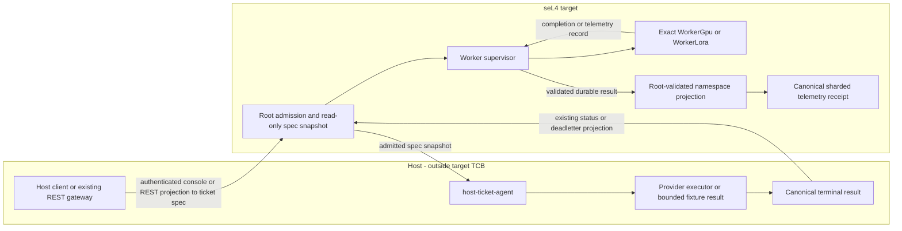

<!-- Copyright 2026 Lukas Bower -->
<!-- SPDX-License-Identifier: Apache-2.0 -->
<!-- Purpose: Describe the current Cohesix architecture and explicitly milestone-gated planned seL4 changes. -->
<!-- Author: Lukas Bower -->

# Cohesix Architecture

This document owns the system-level view of Cohesix: trust boundaries, runtime
components, principal control and data flows, and the selected direction for
seL4 task and temporal isolation. Exact namespace contracts belong in
[INTERFACES.md](INTERFACES.md), Secure9P invariants in
[SECURE9P.md](SECURE9P.md), role policy in
[ROLES_AND_SCHEDULING.md](ROLES_AND_SCHEDULING.md), and physical-driver rules in
[DRIVERS.md](DRIVERS.md).

Architecture state is explicit throughout this document:

- **Current** means implemented by the selected checked-in profile and source.
  A current target claim still requires evidence for that exact target and
  artifact set.
- **Planned** means owned by a named milestone task. It is not an implementation,
  boot, isolation, or acceptance claim.
- **Accepted** means the required immutable evidence exists for the exact
  profile, target, image, and proof class. Configuration, implementation,
  target acceptance, runtime-release acceptance, and production-use-case
  acceptance are different states.

The planned sections summarize the normative tasks in
[BUILD_PLAN.md](BUILD_PLAN.md). If a summary here and the plan disagree, the
plan governs and this document must be corrected.

## 1. Authority and evidence boundary

Cohesix is built from the tag-pinned upstream seL4 16.0.0 project. The selected
kernel revision is `6e7c3b733d296cfd88d5fbf635c96e447a882374`; complete source,
toolchain, profile, and evidence provenance is recorded in
[M26D_SEL4_16_PROVENANCE.md](audit/M26D_SEL4_16_PROVENANCE.md). Target userspace
is pure Rust `no_std`.

The selected profile manifest, its resolved manifest, and generated `coh-rtc`
outputs define generated interfaces, limits, feature gates, object topology,
and selected behavior. The checked-in default-profile snapshot is available in
[the generated manifest snippet](snippets/root_task_manifest.md); a target build
must use artifacts generated from its selected `configs/root_task*.toml` file.
The selected `SEL4_BUILD_DIR` supplies exact kernel headers, configuration,
object sizes, platform metadata, and timer truth.

### 1.1 Current Milestone 26e implementation and qualification boundary

| Concern | Current selected implementation | Qualification boundary |
| --- | --- | --- |
| Kernel contract | seL4 16, AArch64, four nodes, one domain, non-hypervisor SMP+MCS. The QEMU contract requires `virt` with GICv3; no operational classic scheduler profile or runtime selector remains. | Source, generated-profile, and target-compile checks do not substitute for the pending exact-image four-core QEMU execution record or later Pi 4 execution. |
| Temporal authority | Every generated live TCB is admitted as an active scheduling-context owner or as the allowlisted passive NineDoor donation chain. Manifest `root_task.schema = "1.11"` additionally accounts for one root-retained, one-shot NineDoor bootstrap SC outside the steady temporal topology and the profile-scoped root VirtIO Operator serial-I/O bound. Budgets, periods, deadlines, Reply objects, timeout faults, recovery owners, and fixed-priority response-time results are compiler checked. | The bootstrap candidate and observed steady SC donation/return, Reply, timeout, consumed-time, per-core reserve, and per-Operator serial-I/O behavior must match the generated inventory under normal, pressure, and injected-fault QEMU runs, then fresh Pi runs. |
| Principal userspace authority | The init TCB remains the honest `root-control` owner. Four restricted active-SC children own root-fault, emergency, Worker-supervisor, and driver-supervisor duties. NineDoor and QEMU console/network parsing execute in separate restricted children. | Construction and target checks are implementation evidence only until the exact registry is sealed and the selected image proves independent progress and containment in QEMU. |
| Workers | `worker-heartbeat`, `worker-gpu`, and `worker-lora` are separately packaged executable children with generated least-authority bundles and one active SC each. `worker-bus` alone remains model-only. | READY, receipt, fault, complete teardown, stale-authority refusal, and fresh-generation recreation require direct exact-image target evidence. |
| Drivers | The shared driver-task ABI and selected driver runtimes use explicit MCS SC, Reply, command, completion, timeout-fault, and containment authority. QEMU selects no Pi physical-driver temporal rows. | Pi driver and unchanged CYW43 behavior remain unaccepted until the later exact-image hardware/coexistence phase. |
| Target time | Operational QEMU and Pi manifests require exported `CNTVCT_EL0` truth and exact generated `TIMER_CLOCK_HZ`; dummy, read-count, bypass, and hard-coded frequency fallbacks fail closed. | Runtime evidence must bind the selected seL4 headers/configuration and demonstrate deadline/timeout behavior for that exact image. |
| Attestation | When enabled, root hashes public policy/manifest data and installs generated static ticket keys. This is reproducible `measurement_only` metadata, not TPM or DICE attestation. | Reopened Milestone 26 adds real nonce-bound TPM2 Quote or device-bound DICE evidence and sealed/derived ticket keys before authority publication when attestation is required. |
| Failure response | The accepted 26d classic artifact is retained only as an immutable behavioral comparator; it is not compiled into or selectable by the 26e operational closure. | Failure of an atomic 26e gate blocks promotion and requires returning to the owning implementation task; no shipped scheduler fallback is permitted. |

Milestone 26d is complete. Milestone 26e is in QEMU-first implementation and
qualification: the current source and selected manifests describe the MCS
candidate, but QEMU acceptance is still evidence-gated and Pi 4 build, flash,
execution, coexistence, and acceptance remain deferred. No QEMU-only result can
close the milestone or emit Worker-runtime release acceptance.

### 1.2 Evidence classes

Implementation and proof remain separate:

- Source, generated descriptors, and a staged image prove that a path can be
  built; they do not prove that a board booted that image.
- QEMU evidence proves the exact QEMU profile only.
- Fresh Pi evidence proves only the specifically observed behavior for its
  read-back-bound image and named boot/evidence set; it does not transfer to
  another image, boot, or target.
- Wired GENET, CYW43 Wi-Fi, USB/local-seat, serial, HDMI, driver-runtime,
  console, Worker, temporal-isolation, and benchmark proof remain independent
  ledgers.
- An upstream proof-eligibility profile proves only compatibility with the
  upstream verified-configuration preconditions. It is not a Cohesix kernel,
  Rust userspace, boot-path, hardware, DMA, SMP, or timing proof.

The selected Milestone 26e AArch64 SMP+MCS configurations are not represented
as tag-pinned verified seL4 configurations. The seL4 16 caveats describe
AArch64 MCS verification as incomplete and SMP+MCS as less explored. Exact
QEMU and Pi acceptance is therefore mandatory, but it does not create a
formal-verification claim.

The active scope and proof requirements are normative in
[BUILD_PLAN.md](BUILD_PLAN.md). Boot-by-boot results are non-canonical evidence;
canonical claims point to the tracked plan, test contract, and archived
target-qualified artifacts.

## 2. Current design boundary

Cohesix is a control-plane operating system for secure orchestration and
telemetry of edge GPU nodes. It uses a Queen/Worker model and exposes bounded,
file-oriented control surfaces.

The complete target trusted software closure contains:

- the selected upstream seL4 kernel build;
- the Rust root task and compiler-generated policy tables; and
- manifest-declared physical-driver runtime images plus their fixed ABI.

Within that closure, the root task is the principal userspace authority domain.
Selected physical-driver runtimes are genuine seL4 compartments with restricted
CSpace/VSpace authority; they are not part of the root address space. This
distinction does not imply that a driver is untrusted for every device property
or that BCM2711 DMA is confined by an IOMMU.

The target does not contain CUDA, NVML, container runtimes, a POSIX emulation
layer, or general host integration stacks. GPU access, PEFT execution, REST
projection, FUSE, systemd, Docker, Kubernetes, federation, SIEM, and other
heavy ecosystems remain host-side. The only permitted in-target TCP listener
is the authenticated console.

### 2.1 Current components

| Component | Runtime | Current responsibility |
| --- | --- | --- |
| Upstream seL4 | Target kernel | Enforces objects, capabilities, address spaces, SMP+MCS scheduling contexts and budgets, Reply objects, timeout faults, notifications, IPC, interrupts, and kernel-generated platform truth. |
| `root-task` | Target, `no_std` | Owns BootInfo/untyped allocation, CSpace/VSpace bootstrap, HAL admission, event pumping, serial/local-seat/HDMI handling, Queen policy, Worker model state, audit/evidence, and fault supervision. On QEMU it retains the VirtIO NIC adapter but copies Ethernet frames and authorized response bytes through the isolated console-network ABI; it owns no smoltcp or TCP/auth parser there. The current Pi network adapter remains outside that QEMU-first path pending hardware-phase wiring and evidence. |
| `pi4-driver-*` | Pi 4 target, `no_std` child images | Own steady physical-device service behind HAL-admitted resources and the pointer-free driver-task ABI. |
| `nine-door-runtime` | Target, `no_std` child | Implements the bounded pointer-free namespace request/response ABI, shared-frame validation, typed operation preparation, cancellation/revoke handling, and a real seL4 MCS receive/atomic-`ReplyRecv` loop. The schema-1.11 QEMU root constructor binds the selected ELF digest and W^X load plan, creates the child from its compiler-owned revoke anchor, retains a one-shot bootstrap SC and the dedicated fault-recovery Reply authority, and exposes only the bounded `Call` adapter. After one validated bootstrap exchange, the SC is unbound and the child is steady-state passive. Root remains the only Queen policy and namespace-mutation authority. A successful target check proves construction code and image identity, while a live selected-image QEMU boot remains the activation/containment evidence gate. |
| Executable Worker runtime and role/session model | Target children plus root/host projections | Root constructs suspended Heartbeat, GPU, and LoRA children from the compiler-owned image and authority inventory. Admission resumes exactly one selected role instance; READY gates publication; control, receipts, faults, teardown, and recreation retain exact five-part identity. WorkerBus remains model-only. |
| Host NineDoor library/fixture adapter | Host, `std` | Implements the Secure9P model used by host builds and in-process compatibility tests. It is not a packaged target transport or proof of a live host service. |
| `cohsh`, `coh`, SwarmUI, gateway, FUSE, GPU and provider bridges | Host | Provide host clients/adapters and execute only integrations whose selected implementation and observed mode are live; they do not create a new target authority path. |
| `coh-rtc` | Build host | Validates manifest IR and generates Rust tables, resolved manifests, policy defaults, scripts, and documentation snippets. |

The operational QEMU and Pi manifests mark `worker-heartbeat`, `worker-gpu`,
and `worker-lora` executable and require their endpoint, lifecycle,
notification, image, object, and temporal-authority records. `worker-bus` is the
only selected `model_only` role. Those declarations and packaged artifacts are
implementation truth, not proof that a particular image loaded, resumed, or
contained a Worker TCB. See
[ROLES_AND_SCHEDULING.md](ROLES_AND_SCHEDULING.md).

### 2.2 Current system boundary

```mermaid
flowchart LR
  subgraph BuildHost[Build host]
    Manifest[Selected profile manifest]
    Compiler[coh-rtc]
    Generated[Resolved manifest and generated artifacts]
    Manifest --> Compiler --> Generated
  end

  subgraph OperatorHost[Operator and integration host]
    HostClients[cohsh coh SwarmUI gateway FUSE and host bridges]
    HostNineDoor[Host NineDoor library and fixture adapter]
    HostClients -->|explicit host-model or in-process test Secure9P| HostNineDoor
  end

  subgraph Target[Current Milestone 26e target implementation]
    Serial[Serial and local-seat consoles]
    subgraph Critical[Critical TCBs with independent active SCs]
      EventPump[Root-control event pump and Queen authority]
      RootFault[Root-fault blocking receive and serialized Reply]
      Emergency[Root-emergency fatal output]
      WorkerSupervisor[Worker supervisor]
      DriverSupervisor[Driver supervisor]
    end
    ConsoleChild[Console-network child with TCP and smoltcp]
    NineDoorChild[NineDoor child - one-shot bootstrap SC then passive]
    Workers[Heartbeat GPU and LoRA children]
    Hal[HAL admission and driver clients]
    Drivers[Profile-selected isolated driver runtimes]

    Serial -->|console lines| EventPump
    ConsoleChild <-->|bounded shared frames and notifications| EventPump
    EventPump -->|bootstrap probe then bounded donated Call and atomic ReplyRecv| NineDoorChild
    EventPump -->|control records and wake| WorkerSupervisor
    RootFault -->|fault handoff and revoke| WorkerSupervisor
    WorkerSupervisor -->|least-authority lifecycle| Workers
    RootFault -->|fault handoff and recovery| DriverSupervisor
    EventPump --> Hal
    Hal -->|bounded ABI service turns| Drivers
  end

  Generated -->|profile truth| EventPump
  Generated -->|resource descriptors| Hal
  HostClients -->|target console grammar| ConsoleChild
  HostNineDoor -.->|shared contracts separate state| NineDoorChild
```

The dotted relationship is semantic parity, not a transport connection. Host
NineDoor and target `NineDoorBridge` are separate adapters with separate state.
There is no in-target 9P-over-TCP listener.

## 3. Current target execution model

### 3.1 Kernel and root authority

The current root task constructs seL4 objects, validates generated descriptors,
creates admitted service, Worker, and physical-driver address spaces, installs
their capabilities, and schedules bounded service work. Current source uses
untyped retype, guarded CNodes, CSpace derivation/revocation,
TCB/VSpace/ASID/IPC-buffer construction, endpoints, notifications, IRQs and
badges, fault and timeout endpoints, Reply objects, scheduling contexts,
per-core SchedControl, AArch64 mappings and cache maintenance, and MCS TCB
configuration.

Current implementation-level capability admission relies on a successful
bounded retype, the BootInfo CSpace window, and exact publication state.
`DebugCapIdentify` is optional telemetry; it cannot admit, reject, or recover a
capability.

The init TCB is the generated `root-control` owner and runs the authoritative
event loop. Root constructs four restricted active-SC children for root-fault,
root-emergency, Worker supervision, and driver supervision. The generated
fault registry is sealed before any service or Worker child resumes; root-fault
then becomes the sole receiver on one shared standard/timeout fault endpoint.
It blocks in `Recv` with one Reply object and resolves the exact badge and class
against the sealed registry after receive. Application service-turn and queue
bounds remain mandatory beside kernel-enforced MCS budgets. Live QEMU
qualification must still prove independent progress, exact timeout ownership,
serialized Reply release, and containment for the selected image.

### 3.2 Physical task isolation and memory authority

Manifest-declared physical-driver runtimes execute as separate seL4 tasks with
task-local address and capability spaces. Root delegates only generated
endpoint, notification, frame, shared-ring, IRQ, fault, and mapped-resource
authority. Pi profiles preflight root-CNode, slot, untyped, and mapping capacity
before partial child construction; the current Pi contract uses a 14-bit root
CNode.

Isolated child image plans reject effective W+X mappings. Code pages are
read-only and executable, non-code mappings are ExecuteNever, and writable root
aliases of executable frames are removed before child resume. Child-only
code/stack authority is transferred deliberately rather than left ambient.

Driver-task isolation is capability and address-space isolation. It is not a
claim that every device is protected from malicious DMA: the selected Pi DMA
profile remains `bounded-no-iommu`.

### 3.3 Current Worker and Queen execution model

Queen is root-task orchestration authority exposed through the console and
NineDoor control surfaces; it is not a separate host RPC service or target TCB.
The selected operational profiles expose executable Heartbeat, GPU, and LoRA
roles plus model-only WorkerBus. Root constructs each executable image as a
suspended, W^X, least-authority child with a dedicated active SC. A successful
admission request queues or resumes only its exact role instance; it is not a
READY receipt. Namespace publication follows the child's durable READY record,
and control/receipt completion is accepted only for the pinned role, slot,
logical lease epoch, supervisor generation, and capability generation.

A Worker ticket still does not prove execution by itself. `ATTACH` remains
session binding, not task creation. Direct target evidence must observe the
generated capabilities, notifications, scheduling authority, READY transition,
fault containment, complete teardown, stale-authority refusal, and
fresh-generation recreation before the corresponding runtime claim is
accepted.

### 3.4 Current timer and emergency-output qualification

Operational QEMU and Pi timing paths require the selected seL4 build's exported
virtual counter and generated frequency. The compiler and root build reject a
missing/zero clock, dummy/read-count timing, an MCS/profile mismatch, or a
hard-coded operational frequency fallback. Emergency output is a real selected
serial path; null/no-op serial remains fixture-only and cannot enter an
operational closure. Exact-image qualification must still observe the selected
clock, timeout, budget, and fatal-output paths rather than inferring them from
source or configuration.

### 3.5 Current identity and attestation qualification

When enabled, `apps/root-task/src/attest.rs` currently hashes public
policy-label and manifest-fingerprint data, labels the result from
configuration, and installs generated static ticket keys. It issues no TPM
command, nonce-bound Quote, device-bound DICE derivation, signature or chain
validation, measured-boot verification, or secret unsealing.

That output is deterministic `measurement_only` metadata. It does not establish
acceptable attested production ticket authority or satisfy a TPM, DICE,
`coh attest`, release, or production-use-case claim. Current code can still
publish/use its generated static authority material; that is the reopened
defect, not evidence of fail-closed attestation.

## 4. Milestone 26e topology under QEMU-first qualification

This section describes the selected Milestone 26e architecture now represented
by the source, generated QEMU/Pi manifests, and separately packaged child
images. That makes it current implementation, not accepted runtime evidence.
The active phase must still prove the exact four-core GICv3 QEMU image under
normal, pressure, timeout, fault, teardown, and fresh-generation recreation.
Pi component, full-system, and release PASS remain deferred and later require
positive exact-image CYW43 closure plus the matching MCS coexistence evidence.

### 4.1 Atomic SMP+MCS transition

Task `m26e-mcs-abi-foundation` first adds seL4 16 version-pinned
`SchedContext`, `SchedControl`, Reply-object, timeout-fault, consumed-time,
`YieldTo`, receive/call/reply, and reply-receive bindings. It makes the
four-node MCS profiles the only operational QEMU/Pi contracts and validates
kernel object sizes and generated headers before child ABIs freeze.

Every live TCB must have exactly one generated temporal-authority model:

- **Active:** a scheduling context bound to the TCB with admitted core, budget,
  period, refill policy, priority/MCP, timeout/overrun action, consumed-time
  evidence, and WCET/admission provenance.
- **Passive:** a compiler-allowlisted short synchronous service with bounded
  donor SCs/cores, call depth, Reply cardinality, donation depth, timeout,
  cancellation, fault, revoke, and proof that donated authority returns.

`SchedControl` remains root-only. Active SCs bind to TCBs, never notifications.
Network ingress, Workers, IRQ/DPC work, locality-bound drivers, authoritative
mutation, and autonomous drains use active SCs. Cross-core donation is
prohibited for IRQ- or locality-bound paths unless separately admitted. MCS
budgets supplement rather than replace byte, operation, completion, queue,
backpressure, replay, and cancellation bounds.

Both targets require exported `CNTVCT_EL0` and exact generated
`TIMER_CLOCK_HZ`. A missing or zero frequency, dummy/read-count clock, bypass,
hard-coded fallback, or null emergency-output selection is fatal for an
operational profile.

The implementation dependency order is fixed:

1. `m26e-mcs-abi-foundation` establishes the MCS ABI and target probes.
2. `m26e-production-surface-truth-and-stub-retirement` removes operational
   fixture/stub selection.
3. `m26e-worker-resource-admission-critical-tcbs` proves kernel-object, memory,
   CSpace, per-core demand, and the five independent critical reserves.
4. `m26e-driver-runtime-mcs-port-and-cyw43-coexistence` ports every selected
   driver and re-proves CYW43 coexistence before service extraction.
5. `m26e-ninedoor-service-isolation` then
   `m26e-console-network-service-isolation` extract the parser and network
   services.
6. Worker ABI, image, and supervisor tasks create Heartbeat/GPU/LoRA children.
7. Host dependency/integration tasks run before separate Worker-component,
   root-TCB, and full-system evidence and release promotion.

Milestone 26e retains four nodes, one domain, and one generated placement
mechanism. It does not introduce domain scheduling, VCPU/hypervisor support,
SMMU, or SMC forwarding. PMU, kernel debug, printing, and benchmark facilities
remain diagnostic rather than production authority.

### 4.2 Selected critical and child topology

```mermaid
flowchart TB
  subgraph Target[Milestone 26e implementation - target acceptance pending]
    subgraph Critical[Five critical TCBs]
      RC[root-control and Queen - active SC]
      RF[root-fault - active SC blocking receive and one Reply]
      RE[root-emergency - active SC and fail-stop]
      WS[Worker supervisor - active SC]
      DS[Driver supervisor - active SC]
    end

    HAL[Root-control-owned HAL admission and driver clients]
    ND[NineDoor parser/provider child - passive bounded Call/Reply]
    CN[Console/network child - active SC]
    WH[WorkerHeartbeat - active SC]
    WG[WorkerGpu receipt child - active SC]
    WL[WorkerLora receipt child - active SC]
    Drivers[Profile-selected driver runtimes - Pi physical drivers - active SC each]

    RC -->|bounded Call donates allowlisted SC| ND
    ND -->|typed Reply returns SC| RC
    CN <-->|bounded transport records| RC
    RC -->|control records and wake| WS
    RF -->|reserved teardown records and wake| WS
    RF -->|reserved containment records and wake| DS
    DS -->|fault-association release signal| RF
    WS -->|records and lifecycle notification| WH
    WS -->|records and lifecycle notification| WG
    WS -->|records and lifecycle notification| WL
    WH -->|durable completion and bounded telemetry| WS
    WG -->|durable receipt completion| WS
    WL -->|durable receipt completion| WS
    RC -->|normal driver operation through HAL| HAL
    HAL -->|admitted resources and bounded command Call| Drivers
    Drivers -->|normal Reply or completion| HAL
    DS -->|faulted-Call recovery containment and readmission| Drivers

    ND -->|badged fault cap| RF
    CN -->|badged fault cap| RF
    WH -->|badged fault cap| RF
    WG -->|badged fault cap| RF
    WL -->|badged fault cap| RF
    Drivers -->|badged fault caps| RF
    RF -.->|handler fault| RE
  end
```

Task `m26e-worker-resource-admission-critical-tcbs` proves that the five named
critical TCBs have independent active-SC reserves. The plan does
not imply that every critical TCB necessarily owns a separate VSpace; generated
least authority, scheduling independence, and the acyclic fault graph are the
required properties. Root-fault failure routes to root-emergency.
Root-emergency has no self-handler and fails stop if it faults.

Root-control and root-fault hand work to the Worker supervisor through separate
bounded records and a supervisor-bound wake notification. Root-fault uses a
separate reserved record per admitted driver to hand containment to the driver
supervisor. Worker, driver, endpoint, notification, IRQ, command, completion,
and fault badge domains are generated and disjoint.

Standard and timeout fault send caps share one root-fault receive endpoint and
carry disjoint exact-identity badges. Root-fault blocks on that endpoint with
the sole receive Reply object; it does not poll an empty endpoint or receive on
a second class lane. A linked-driver fault keeps that association serialized
while the independently scheduled driver supervisor performs command-failure
and containment work. Root-fault waits on the existing root-fault wake
notification and may re-enter `Recv` only after the supervisor emits the exact
generated release badge. The notification is a release handshake, not fault
identity or containment authority.

Terminal critical-domain faults use a private retained three-unit cursor rather
than composing classification and containment in the receive refill. The
blocking receive classifies and retains the exact task index, commits the
suspend unit, and yields. A fresh unit commits the emergency-signal successor,
suspends the exact child-local TCB cap, and yields. A third unit commits the
receive successor, signals root-emergency, and yields before receive can execute
again. The sole Reply association stays serialized through that terminal
signal. Worker, driver, service, and recoverable fault paths are unchanged.

No policy/audit child is selected in 26e. Policy decisions, authoritative
mutation, audit ordering, and replay state remain root-owned unless later
measurement justifies a split that does not duplicate authority or state.

### 4.3 Namespace and console service compartments

Task `m26e-ninedoor-service-isolation` defines a separately packaged
`nine-door-runtime` for untrusted target path, frame, record, namespace, and
provider parsing. The as-built source now supplies the pointer-free descriptor,
bounded partial-frame and queue state machines, typed prepared-operation parser,
seL4 shared-frame receive/atomic-`ReplyRecv` loop, and a fail-closed root client
that accepts only an exact generated config paired with live disjoint root frame
handles. Selected manifest `root_task.schema = "1.11"` freezes the bootstrap
fields and the profile-scoped VirtIO Operator serial-I/O bound and rejects
older schemas. On QEMU the HAL derives the complete generation
from revoke anchor slot 16137:
one TCB, one 16-slot child CNode, one VSpace/ASID, eight page tables, 35 W^X
image pages, eight stack pages, one IPC page, one read-only init page, exactly
four directional shared pages, one endpoint, one Reply object, one root-retained
one-shot scheduling context, and 80 fixed root slots. The SC candidate is 8
object bits, `3000 us / 10000 us`, and `max_refills = 2`; it raises the admitted
SC totals to 18 on QEMU and 25 on Pi. It has no general-allocation fallback.
During construction, root uses the selected core's SchedControl to configure
and bind that SC while the child remains suspended, before registry seal. The
child receives no SC or SchedControl cap, and construction performs no
`TCB.SetAffinity`. Root-fault receives a copy of the recovery Reply cap in its
compiler-selected CSpace slot 10; the constructor's last successful action
registers the child. It is called after the other nine QEMU sources, so that
registration completes the exact pre-seal registry.

After the registry is sealed and root-fault is active, root executes the frozen
activation transition on the already-bound SC: resume the child; issue and
validate an empty `Log` prepare (`path = ""`, `payload = ""`); let the child
atomically reply and queue its next receive with `seL4_ReplyRecv`; then unbind
that exact SC. Only the successful unbind admits the steady passive service and
emits
`[ninedoor-service] passive child active bootstrap-sc=unbound recovery-reply=installed`.
Activation, probe, or unbind failure revokes the namespace boundary and fails
boot; probe and unbind failure also suspend the child where possible rather
than admitting a partially bootstrapped receiver.

After bootstrap, only `root-control` may donate through the one-deep generated
Call/Reply chain. Each service turn returns through atomic `ReplyRecv`, leaving
the child queued before the donor resumes and preserving passive donation for
the next request.

If the child faults during a Call, root-fault suspends it and uses the distinct
recovery Reply cap once to return typed `Closed` to the donor before publishing
the durable owner mailbox. A between-call fault publishes containment without
fabricating a Reply. Root then fences the generation, scrubs and unmaps all four
shared pages, deletes fault and recovery caps, and revokes the retained anchor.
The active console-network service is ineligible for this passive Reply path.
NineDoor receives no Queen policy, authoritative mutation, catch-all namespace,
root CSpace, device, SC cap, or `SchedControl` authority. The 8-bit,
`3000 us / 10000 us`, two-refill bootstrap values remain a live-qualification
candidate: a selected four-core GICv3 QEMU boot, repeated post-bootstrap calls,
and injected service fault are still required operational evidence for these
source-enforced transitions; none is Pi hardware proof.

Task `m26e-console-network-service-isolation` moves smoltcp, TCP framing,
transport authentication parsing, receive, retransmission, and protocol timers
into an active-SC `console-network-runtime`. Root retains application admission,
Queen policy, authoritative ordering, emergency serial, fatal output, and
bounded response priority. The as-built QEMU adapter retains the virtual NIC,
copies only bounded Ethernet frames and authorized response bytes through four
pointer-free pages, and consumes authenticated command records. It constructs
the child suspended, resumes it only after the exact critical fault registry is
sealed, and on a standard/timeout/protocol fault suspends, unbinds, scrubs, and
revokes the complete retained-anchor generation before prohibiting replacement.
The four pages retain their fixed 4096-byte console-network ABI v1 layouts, but
steady exchange touches only a compact scalar header and the active payload:
40 bytes before packet payloads and 64 bytes before control/event payloads.
Publication clears the sequence commit, executes a release fence, writes the
scalar header and active bytes, executes a second release fence, publishes the
final sequence commit, and only then signals the peer. A reader accepts a record
only when the commit surrounding its bounded copy agrees with the validated
sequence and length. Scalar reserved header fields are validated as zero;
reserved page-tail bytes and inactive payload tails are non-authoritative:
construction zeros them and containment scrubs them, but a normal service turn
neither copies nor scans those tails. The child maps
root-to-child packet ingress and control pages read-only, while its
child-to-root packet-egress and event pages are read-write. This changes no ABI
version, field offset, page layout, record schema, or external console grammar.
The active child now closes at most one logical unit per active-MCS
replenishment. Its retained-first priority is: one retained completion publication, one
retained service-event publication, one retained egress publication, one
retained service-poll continuation, one new packet-ingress admission, then one
new root-control admission. A unit either commits its complete bounded state or
leaves it pending. After the initial Ready signal and every later nonterminal
unit, including idle or backpressure retention, the child executes exactly one
`seL4_Yield` and then one `seL4_Wait`. Later progress uses the existing root
service tick and existing wake notification; terminal revoke/shutdown uses only
the wait-only park. This cut adds no capability, ABI field, schema, budget, or
refill.
Steady root-control uses three exclusive outer EventPump phases in the cyclic
order Operator/Dispatch -> Runtime/IPC -> Network -> Operator/Dispatch. The
public EventPump entry first checks the exact isolated QEMU VirtIO selector and
routes it through a tiny noinline split dispatcher before the generic EventPump
frame can be allocated. Pi, linked-runtime, physical-owner, and other
non-VirtIO paths retain the generic dispatcher and their existing ordering.
The split dispatcher commits the outer successor before work and never calls
the generic Operator or Runtime bodies.

On the selected QEMU path, Operator/Dispatch begins one shared `64`-byte serial
credit and one retained-output-record credit, then performs a bounded serial
probe and admits at most one eligible material noinline leaf in strict priority:
serial dispatch or TX, one local-seat input unit, an ordered physical-response
record, one network lifecycle event, one already-buffered authenticated network
line, one background/high-impact pending-output record, then one
display/frontier/attach unit. Each leaf commits
its recorded successor before work. Background output cannot overtake an
ordered response, lifecycle event, or authenticated network input; an idle
Operator returns directly to the sole outer yield. Operator alone owns root
policy and command dispatch. Runtime/IPC alone owns `KernelIpc::dispatch`, the
bounded bootstrap drain, stream flush, and reboot tail, with serial and network
command ingress suppressed. Its persistent QEMU cursor is Worker ->
ControlEndpoint -> BootstrapDrain -> StreamFlush -> RebootTail. Each Runtime
visit attempts exactly one selected unit, including idle/no-op, commits the
successor before a compact isolated-VirtIO Runtime prelude, and returns. That
prelude reads the current HAL timebase and performs one timer poll. An observed
tick updates `now_ms`, increments the timer metric, publishes the HAL timebase,
and runs the existing conditional timer trace; without a tick, `now_ms` takes
the read timebase. The prelude then reconciles CYW43 network-ready HDMI state
and does not run the generic Runtime-without-control tail. Worker consumes one
pending mailbox operation or checks one retained Heartbeat/GPU/LoRA role slot;
ControlEndpoint performs at most one poll and its immediate forward;
BootstrapDrain takes one staged `Option`; RebootTail owns its visit. The MCS
fault poll is absent from the cursor. StreamFlush gives each earlier line its own visit, then separates the
terminal sequence across three visits: one emits the retained final line, the
next no-line visit performs cursor/bandwidth finalization only, and the third
emits END only. Legacy Pi/non-VirtIO Runtime keeps its existing
48-line/16-KiB bound. Network alone owns VirtIO/NIC service and performs
no command or general runtime-IPC dispatch. Each isolated Network visit attempts
exactly one internal unit, including when that attempt is a no-op. A persistent
lower cursor advances through ObserveChild -> StageOutput -> Disconnect ->
Ingress -> ServiceTick -> ObserveChild; a no-op advances just as a productive
attempt does, so one visit cannot search several lower units for work. Any lower
unit that successfully signals the child forces the next lower attempt to
ObserveChild rather than continuing from the ordinary successor.

A pending compact normal-success TX diagnostic preempts that lower cursor and
emits at most one record on its own non-publish visit. Otherwise retained egress
preempts the lower cursor and receives exactly one atomic TX attempt, with no
more than two bounded reclaim checks, before the visit returns on success or
backpressure. Both preemptions preserve the exact lower cursor and the retained
forced-observe state. The bounded diagnostic gate samples successful attempt
sequences 0 through 63 and every 64th eligible success thereafter; counters
remain continuous. An ObserveChild attempt may retain one copied egress and
returns without publishing it. For a diagnostic-bearing success the enforced
front sequence remains Observe -> TX -> DeferredDiagnostic; lower service then
resumes from the preserved cursor or forced ObserveChild state. A second
publication cannot overwrite or merge the pending record, anomalies remain
immediate, and retained egress is never discarded merely because TX applies
backpressure.

Root-control binds its generated steady SC only after bootstrap output and
restricted-child construction are complete. Immediately after the bind and
timeout-endpoint setup return, one universal MCS `seL4_Yield` sacrifices the
partially consumed initial refill and waits for the next replenishment before
any containment probe or ordinary phase begins. This one-time activation seam
is distinct from the recurring outer-loop boundary: every admitted ordinary
phase still commits its successor before an early return and then reaches the
sole recurring outer userland `seL4_Yield`, which separates phases and
replenishes the MCS budget. The activation yield adds one startup-period wait on
Pi as well as QEMU so both profiles give the first phase the same truthful
per-phase accounting; it adds no SC, budget, refill, capability, or authority.
TX descriptor initialization, avail publication, and any required notify are
one indivisible Network unit with no inner yield; after publication, descriptor
length bounds the initialized device-owned range and no later buffer write
occurs. No yield occurs while a shared-page or device transaction is open. The
Network -> Operator adjacency preserves immediate dispatch of newly buffered
TCP input, while Operator -> Runtime/IPC preserves prompt service of newly
published control work.
Before the selected ordinary phase begins, `root-control` probes the durable
console-network fault mailbox first. It probes NineDoor containment only when
the console probe reports no work. Mailbox contention returns `Retry` and does
not fence authority. The first successfully latched console turn performs only
the value/resource latch plus a lock-free, allocation-free scalar authority
fence; later Recovery turns each advance at most one material containment unit,
persist the successor, skip the ordinary EventPump phase without advancing its
phase or retained Runtime- or Network-unit state, and end at the same sole outer
`seL4_Yield`. Console-network remains ahead of NineDoor on every turn, so
simultaneous service faults serialize all pending console work before NineDoor
advances, with no ordinary-pump fallthrough.

The console containment cursor is exactly `SuspendTcb`,
`UnbindSchedulingContext`, then separate `ScrubCleanSharedFrame(i)` and
`UnmapSharedFrame(i)` units for each index 0 through 3, followed by
`DeleteFaultCap(0)`, `DeleteFaultCap(1)`, `RevokeAnchor`, `Finalize`, and the
idempotent proof-only `Complete` turn. Thus fourteen material units precede
`Complete`; `Finalize` only commits `Complete`, and only the following turn may
publish the exact proof and quarantine the terminal generation. Recovery adds
no authority, TCB, SC, budget, refill, or internal yield; it uses the existing
root-control authority and generated service-containment records.

After that scalar fence, ordinary retained-output visits run exactly one quiet
post-containment cleanup state in order:
`RootSessionTicket -> RootTicketUsage -> NineDoorSessionTicket ->
NineDoorSessionScope -> NineDoorSessionBinds -> PendingStreamCursor ->
PendingStream -> Finalize -> Complete`. Each successor is stored before work;
heap owners move to reboot-lifetime tombstones instead of being dropped. Only
`Complete` exposes the conditional reboot/parser/serial/local-seat/tail/detach
diagnostics. Service fault, failure, and teardown records remain ahead of those
cleanup diagnostics, console records remain ahead of NineDoor, admission never
evicts an older record, and admission and flush occur on distinct ordinary
turns. Backpressure retains the uncommitted diagnostic for a later admission.
The attached VirtIO contract also suppresses the Pi/GENET-only
`SERIAL_INPUT_TRACE stage=idle` raw-UART diagnostic, including after NIC
quarantine. That nonessential trace issues one synchronous debug syscall per
byte and has no QEMU acceptance consumer; Pi, GENET, and linked-runtime routing
remain unchanged. The three-phase state exists only for the isolated QEMU
VirtIO contract; non-VirtIO and Pi paths retain their existing single-turn
ownership and ordering. Console-network quarantine does not collapse the QEMU
cycle or combine Operator with Runtime/IPC: the Network phase observes the
quarantine and fences NIC work while all three exclusive phase boundaries
remain active.
The current measured repair candidate assigns 59 image pages, 32 stack pages,
one IPC page, one init page, and four shared pages: 97 frames total and 121
retained root slots. It keeps the 32-page stack at
`0x72030000..0x72050000` and an active-SC
`3000 us / 10000 us` budget with `2400 us` WCET and `7500 us` response bound.
The 47-page image reduction flows through the compiler-owned fixed and maximum
profile inventories without changing any reserve or per-Worker budget:

| Profile | Fixed frames | Fixed CSpace slots | Maximum frames | Maximum CSpace slots |
| --- | ---: | ---: | ---: | ---: |
| QEMU SMP production | 2,017 | 4,056 | 2,065 | 4,248 |
| Pi 4 U-Boot production | 4,065 | 8,960 | 4,113 | 9,152 |

Those values remain candidate source/configuration truth until live four-core
GICv3 QEMU completes console authentication, canonical `.coh` regression, and
fault/timeout injection without stack or budget failure. This QEMU-first path
changes no Pi driver or CYW43/SDIO behavior.

The live run at source commit `290ef6028` refuted the earlier whole-page
implementation. QEMU reached console readiness, but the first authenticated
packet produced console-network timeout badge `0x26ee0007`; the saved child PC
was inside the compiler-expanded volatile read of one 4096-byte `PacketPage`,
whose helper reserved roughly 96 KiB beneath the already-large start frame on
the 32-page stack. Root then timed out before draining the containment mailbox.
That run is failure evidence, not qualification. The compact repair must show
in target disassembly that packet/control readers and writers have bounded
small frames and contain no whole-page aggregate load/store before a fresh
four-core GICv3 QEMU authentication, regression, and fault-injection run may
qualify it; that live qualification remains pending.

The next live run at source commit `00bf02540` proved the compact page helpers
were not sufficient to qualify the two-phase root schedule. QEMU reached the
root prompt, then `root-control` timed out at the console-network control poll
before authenticated regression could begin. That failure disproves the v3
combined Network/runtime-IPC phase. The following live run at source commit
`4d1a47b89` retained the three exclusive turns, but `root-control` exhausted its
refill in `VirtioTxToken::consume` after the queue notify. That saved PC does not
show a device-completion wait: TX completion is asynchronous. It instead
falsifies v4's unbounded collection of productive work inside one Network turn.
The v5 candidate retained that bounded Network visit, but the next live run
failed before authentication: `console-network-service` consumed its exact
`3000 us` refill and raised timeout badge `0x26ee0007` at `Send` immediately
after `publish_exchange`. Root then consumed its exact `2750 us` refill while
containing and quarantining that generation and raised timeout badge
`0x26ee0001` at the sole outer `seL4_Yield`. The first failure falsifies the
child's multi-material-unit notification turn; the second falsifies whole-
containment Recovery in one root turn. Neither timeout is qualification.

The next canonical run used root ELF SHA-256
`0059fd675b476106888d6ca62c8bba21f9b340b9aa607e000fbf96997fd29900`.
Before authentication, `root-control` raised timeout badge `0x26ee0001` after
consuming its exact `2750 us` refill at the sole outer `seL4_Yield`. The saved
phase state proves the preceding Network turn composed an empty ObserveChild,
no-op StageOutput and Disconnect attempts, then committed and signalled the
first 60-byte ARP ingress as sequence 1. The console child was healthy and
blocked on its notification, no containment mailbox work was pending, and no
Recovery turn ran. This is live v6 failure evidence: bounding productive units
was insufficient because no-op lower units still composed in one visit.

The next canonical v7 run used root ELF SHA-256
`d2f69bddbf56deef6919ec6ea802e9d3c44a691c2dbe05aa59428854bbf7a6ae`.
It reached the root-console startup command list while the UART-visible
`[mark] root-console.start.ok` record remained queued; absence of that retained
marker on the wire is not evidence that source had not crossed the console
lifecycle boundary. Before any ordinary Network or Recovery phase,
`root-control` exhausted its exact `2750 us` SC and raised current-fault class
`Timeout` with badge `0x26ee0001`. The saved fault PC `0x43e84` is the serial
queue's `inner_dequeue`; LR `0x77b74` is `SerialPort::flush_tx_unlocked`.
This falsifies v7's unbounded composition of serial polls and flushes within
one Operator turn. It does not falsify the strict Network cursor, child loop,
or resumable Recovery, none of which had run.

The canonical v8 run used root ELF SHA-256
`5052e7a5070987c252d3c1f5cf6f27172bd5ece1836a8f6c2a5c329c789a0a61`.
With the generated `64`-byte VirtIO serial admission active, `root-control`
still consumed its full `2750 us` refill and raised current-fault `Timeout`
with badge `0x26ee0001`. The saved fault PC was `0xede84`, immediately after
`emit_prompt_now`. This falsifies v8's assumption that the shared byte credit
alone bounded retained output-record composition in one Operator turn.

The canonical v9 run used root ELF SHA-256
`fa488c9367136f0eadef7182a18691664c3ae51c2ac2974e12000ff5d27f38ed`
and CPIO SHA-256
`aca549e99e0d86299e9f98348d896b730259277654544ebd22a74595b61e9bfb`.
The direct command list completed under the bootstrap SC. At the first
post-bind Operator, serial was idle and the retained
`[mark] root-console.start.ok` plus initial prompt were still queued.
`root-control` consumed the complete `2750 us` refill and raised current-fault
`Timeout`, badge `0x26ee0001`, at PC `0x13a798`, the first instruction of
`compiler_builtins` `memmove`; LR `0x79ccc` was
`heapless::Vec<PendingConsoleOutput, 72>::remove(0)` and `x2 = 0x110` described
the prospective 272-byte move. No byte had been copied, the one-record cursor
was still full, and both records remained queued. The PC is therefore a timeout
delivery point, not proof that the move itself was expensive: v9 is falsified
by aggregate first-post-bind refill exhaustion across activation tail work,
no-work containment probes, and the Operator prefix. Its one-record admission
rule was not falsified.

The canonical v10 run used root ELF SHA-256
`022908395c954f73a67136f70fe4404d96e0cf1ff16f4531fa95eae7a6f57cb5`.
The post-activation yield completed, and UART emitted the retained startup
marker and prompt in separate bounded Operator visits. The second fresh Runtime
consumed the full `2750 us` and raised root timeout badge `0x26ee0001` at PC
`0xce98c`, the `seL4_NBWait`/nonblocking receive on root endpoint `0x0a70`.
Runtime had committed Network; the output FIFO was empty, its record cursor was
inactive, and the response barrier had crossed the prompt. This falsifies
v10's composed Runtime responsibilities, not the retained activation,
serial/output, Network, or Recovery architecture.

The same run recorded console timeout sequence 1, badge `0x26ee0007`, with
Terminal policy. The child was saved at `seL4_Wait` with
`service_pending = 1` and `control_pending = 1`: a completed logical unit and
its pending successor had composed on residual SC. Recovery reached Complete
with the TCB suspended, SC unbound, mappings scrubbed, capabilities revoked,
objects deleted, and generation fenced; NineDoor remained healthy. This
falsifies the v3 child replenishment boundary, not containment completeness.

The canonical v11/v4 run used root ELF SHA-256
`44971429e4941d751248c216082256f01e187930d9a6d40028e5c89d8611b597`,
console child ELF SHA-256
`af08f817191cc51c9354b61f09f3eeb50c8cdf875c660c7231987a426886666d`,
and CPIO SHA-256
`9fbb58e1dc6dc508361f37ce0c24219e3e9029dae101e2be789df1bcb1a5b11d`.
There were four TCP connects. The first three completed authentication attempts
each wrote 18 bytes and read zero; the fourth connect had no completed
authentication record. The child consumed its complete `3000 us`, raised timeout
badge `0x26ee0007`, and stopped at PC `0x213458`, the `seL4_Yield` immediately
after the composite `PollService` completed and cleared; saved retained state
identified `PollService` as that completed unit. Root then
completed containment (`Complete(6)`), but consumed its complete `2750 us` and
raised timeout badge `0x26ee0001` at PC `0xf5fbc`, the sole recurring outer
`seL4_Yield` after an empty Operator. The committed successors were ordinary
phase `Runtime` and retained Runtime unit `ControlEndpoint`; root output was
empty. This falsifies v4's still-composed `PollService` unit and v11's repeated
empty-Operator tail. It is not a Recovery-cursor failure or qualification
evidence, and Stage 03 plus pressure remained withheld.

The following v12/v5 diagnostic is also failure evidence. Non-claiming run
`out/test-plan-convergence/v12-v5-auth-20260812T010200Z` bound root ELF
SHA-256 `7cec5bd582d063adc73830af8cc62e0ec8dbbb33d91bd4701db09ca69e32e6ca`,
console child ELF SHA-256
`920883c5e706688a65e7f168a643dbc527d09d7f48584bfb41fbd0c0ae823cb6`,
and CPIO SHA-256
`dc36495a5de0df13bfb853ffa33fdc6e7ccc3bbf3a1a3c8c4cd74c8551160c16`.
All four authentication attempts wrote 18 bytes and read zero. The only target
timeout was `root-control`: badge `0x26ee0001`, exactly `2750 us`, at outer
Yield PC `0xf612c`. Stored successor `Network(2)` proves the completed ordinary
phase was Runtime; stored Runtime successor `StreamFlush(3)` proves the selected
unit was `BootstrapDrain`, whose staged `Option` was `None`. Fault sequence 2
and the console child healthy at its Yield-then-Wait boundary prove there was no
earlier child fault or Recovery. The run embedded dirty source commit
`a533290ffe264f0a2bf0af3db4bb4c45d1a4a278`; repository HEAD later advanced to
`84934dda6`, so this immutable observation is diagnostic/failure evidence only.
It falsifies composition of the generic Runtime-without-control prelude with an
otherwise empty selected Runtime unit, not the retained cursor or v5 child.

The v13/v5 non-claiming convergence run
`out/test-plan-convergence/v13-v5-auth-20260812T014607Z` bound dirty source
commit `84934dda6fcffbfa536d4e437cc1904c7fdeb0b1`, root ELF SHA-256
`0275cd7d701263cc1731ca3301d9aeab8a0393651745659f192106a0d558d78f`,
the unchanged v5 child SHA-256
`920883c5e706688a65e7f168a643dbc527d09d7f48584bfb41fbd0c0ae823cb6`,
and CPIO SHA-256
`142e2aec64662888a9872ff77ff85d1f5f7c351b7aaa478ded8cf99ba9e64f29`.
All four authentication attempts wrote 18 bytes and read zero. Root-control
initiated failure with timeout badge `0x26ee0001` at `sel4::poll` SVC PC
`0xce98c`; caller `0x108910` was immediately after the child-to-root
notification poll inside `IsolatedVirtioConsole::poll`. Committed successors
`Operator` and `StageOutput` identify selected Network unit `ObserveChild`. The
child remained healthy at `seL4_Wait`. Root-fault then timed out with badge
`0x26ee0002` at `suspend_tcb` SVC PC `0xce0cc` against root-control TCB cap
`0x10`, followed by root-emergency fail-stop. This is diagnostic failure
evidence for v13 root-control and v2 root-fault, not child v5 qualification or
failure.

The `m26e-qemu-root-exclusive-predispatch-candidate-v23` root-control,
`m26e-qemu-root-fault-service-units-candidate-v6` root-fault, and
`m26e-qemu-console-bounded-stack-steps-candidate-v6` child candidates keep
every numeric budget, WCET, response bound, core-0 reserve result, capability,
ABI, Recovery step, recurring outer yield, and outer phase boundary. The v10
one-time post-activation yield and v11 persistent Runtime cursor remain. On the
isolated QEMU VirtIO path, the retained v12 cut snapshots serviceable Operator work after its
first bounded serial/local-seat/line-dispatch pass and returns before the
repeated Operator tail when that snapshot is empty. V13 replaces only the
split isolated-VirtIO Runtime's generic tail with the compact timer/timebase and
network-ready-HDMI prelude described above before its already-selected cursor
unit. V14 gave Network its own compact timer/timebase plus network-ready-HDMI
prelude, then exactly one budgeted NIC unit. V19 narrowed only the true split
QEMU Network prelude to `poll_runtime_timer_prelude`; CYW43/HDMI reconciliation
remained in the distinct Runtime prelude and generic/Pi behavior was unchanged.
V20 retains one compact postlude observation after that timer-plus-NIC visit:
the telemetry snapshot, originating `now_ms`, and originating
last-RX-progress horizon. The next Network visit takes that observation before
any timer or NIC work, samples the counters that the intervening compact
Operator and Runtime visits cannot mutate, runs NETDIAG only, and returns.
Immediate flush accounting, connection identity, and NineDoor ingest
accounting remain in the originating visit; quarantine clears the retained
observation. Generic and Pi behavior is unchanged.
The exact v20 root ELF
`ed5cb9f587d0d63e6121f8b00b083e68f5a0a7dd23dd6d2bbf0c899e1e85e80f`
and CPIO
`ca2a52038eb0814a17c8609f03bec32ff357fdd524edee3e7080ac69ceb7823b`
then reached the root marker and prompt before root-emergency fail-stop.
Root-control timed out at outer-Yield PC `0xf680c`; successor Operator and a
retained diagnostic prove the timer-plus-NIC visit completed and its exclusive
diagnostic successor had not run. Exact lower-cursor, egress, and child state
are unconfirmed. V21 therefore adds only a QEMU-only
`OrdinaryVirtioNetworkUnit::{Timer, Nic}` cursor. With no retained diagnostic,
the successor commits before Timer runs only the shared timer/timebase prelude
or Nic runs only one unchanged NIC unit. The retained diagnostic preempts
without advancing that cursor, so the featured sequence is
Timer -> Nic -> DeferredDiagnostic -> Timer. Quarantine clears the diagnostic
but preserves the cursor; generic and Pi paths neither use nor mutate it.
V23 retains that Network cadence and makes compact-dispatcher housekeeping
success-sensitive before ordinary phase selection. `TailInFlight` performs one
physical-response reconciliation and returns if the barrier clears; if it
remains in flight, the turn runs exactly one compact Operator unit and returns.
An eligible stream prompt likewise performs one queue attempt and returns if
the pending bit clears; bounded queue backpressure permits exactly one compact
Operator unit before return. Ready reboot retains its existing exclusive
return. Every path preserves the ordinary phase and the retained Runtime and
Network cursors; only a fallback Operator subcursor may advance. Only a turn
with none of those duties reads the ordinary phase, commits its successor, and
dispatches one existing phase. This
cut follows exact v22 root FaultIP `0xe9ddc`, the not-yet-executed phase-store
after the former composed reconciliation and prompt-tail calls; no Operator
leaf had run. The v6 child was independently healthy at `seL4_Wait` after
`StackEgress`, with `Session` committed, so v23 changes no child boundary.
The adapter selects with
`select_isolated_network_turn`, commits the ordinary lower successor before
work, and dispatches through distinct noinline per-unit helpers instead of a
single all-unit closure. A successful child signal may still force
ObserveChild. Network retains but does not drain connection lifecycle events;
the immediately following Operator admits at most one such event before any
buffered command. Pi/non-VirtIO Runtime and Network behavior are unchanged.
V6 retains `ChildTurnUnit::PollService` but replaces the unbounded composite
interface poll with the private
`ServicePollUnit::StackIngress -> ServicePollUnit::StackEgress ->
ServicePollUnit::Session` cursor. Each invocation commits its successor before
work and is separated from that successor by the existing child
Yield-then-Wait boundary. Successful `StackIngress` and `StackEgress` return
`ServicePollOutcome::Continuation`; `Session` alone returns `Complete`.
The same V22 snapshot found secondary root-fault timeout badge `0x26ee0002` at
FaultIP/NextIP `0x113e70`, immediately after the Receive turn's terminal Yield
SVC at `0x113e6c`. LR `0x113e5c` was the return after publishing initiating
root timeout label `5` and badge `0x26ee0001`; the cursor had committed
Classify. V5 therefore adds only an initial `PrimeReceive` unit. Once the
constructed root-fault child is runnable, PrimeReceive commits Receive and
yields before any endpoint receive, copied fault value, or Reply association.
A fault arriving meanwhile remains queued on the already constructed shared
endpoint until the replenished Receive blocks or accepts it. Released, driver,
and SignalEmergency paths continue to commit Receive directly and retain every
v4 recurring lane. The v23/root-fault-V6/child-V6 candidates remain pending fresh canonical
QEMU proof.
Schema 1.11 adds `virtio_operator_serial_io_bytes_per_turn`: QEMU root-control
selects `64`, every non-root task selects zero, and Pi/non-VirtIO root-control
selects zero. The isolated VirtIO Operator creates that one shared credit at
turn entry; every root-context serial poll and flush debits the same credit for
RX and TX. When TX backlog exists at Operator entry, `32` bytes are reserved
for TX and RX may spend at most `32`; without entry backlog, RX may use the full
`64`. Exhaustion retains the unfinished queue for a later Operator turn. The
persistent output FIFO is also admitted separately: a nonzero VirtIO serial
credit permits at most one retained output-record attempt in that Operator,
and every later FIFO or response-tail record remains queued for a later
Operator. Pi and non-VirtIO turns retain their existing two-record attempt
limit. The persistent lower Network cursor remains the v7 repair. The physical
serial driver contract remains `max_bytes=1024`; linked-runtime and Pi outer
Runtime behavior are unchanged apart from Pi's one-time startup-period
activation wait, while active-MCS child Yield-then-Wait semantics are universal.
The exact v15 image (root ELF
`6c145a1d81bd57e791781a052f62dfc6dd5d34c7c7ca0aa4e3311a9b5696018c`, CPIO
`07b84ff5dc2a40e2b9039d49b1e37bb88824909fe2fd902c9dd0165b4a643529`,
resolved manifest
`46f3264e862944b84188064941bd581e60a78d80d9a7590dfe4b42fcfa3e7482`)
proved the second retained-output Operator emitted and cleared the prompt, then
incorrectly entered its generic Runtime tail because entry-time TX had been
true. Root-control exhausted `2750 us` at the outer yield; its saved successors
were `Runtime` and `ControlEndpoint`. The downstream root-fault exhausted
`3000 us` at the emergency-send return, while emergency delivery completed and
both v15 supervisors remained healthy in `seL4_Wait`. V16 made that
isolated-QEMU retained-output Operator exclusive, but the exact v16 image still
failed. It bound root ELF
`4fab7abc8707b9829ba66ac525efdfc7afefa812df4bab9abb8cb67d504a76a6`
and CPIO
`456558cac05e4d136d3cbc18d1290cc48bebf619ba5459cd623b667dbfff3e96`.
The prompt reached serial and retained output completed; root-control then
consumed `2750 us` and faulted at outer-Yield PC `0xf61c4`, with saved
successors `Runtime` and `ControlEndpoint`. Exact target disassembly showed the
path still entered an approximately `0x42c0`-byte generic EventPump frame and
an approximately `0x12a0`-byte generic Operator frame before its output leaf.
Root-fault subsequently consumed `3000 us` at its first post-classification
Yield, PC `0x113938`, before suspension or emergency signalling. V17 moves the
exact isolated-QEMU selector ahead of the generic frame and uses the compact
strict-priority Operator leaves described above. Root-fault v4 adds a distinct
Classify refill boundary. All numeric and authority contracts remain unchanged.

The exact v17 non-claiming run
`out/test-plan-convergence/v17-v4-auth-20260812T041428Z` bound root ELF
`3d0641bac42d21ce383c47f38628a05db0d2474fab69fc6e14b67ba39a71bd47`,
the unchanged v5 child
`920883c5e706688a65e7f168a643dbc527d09d7f48584bfb41fbd0c0ae823cb6`,
and CPIO
`fa478638d6d2b93b654a2615e4dcd1e1d7f666d0945d4e012adcf28da2292af1`.
All four authentication attempts wrote 18 bytes and read zero. Current fault
`.1` was root-control at outer-Yield PC `0xf6624`; committed successors were
ordinary phase `Runtime`, Runtime unit `Worker`, and Operator unit
`SerialDispatch`. The tiny compact path and successor attribution therefore
worked, but selected `SerialIo` still composed generic serial driver
admission/RX with TX flushing. V18 makes `SerialIo` one RX-only probe and
retains `SerialDispatch` for a later Operator, where it commits its successor,
performs bounded consume/echo plus TX flush, and returns before another probe
or material leaf. Raw-UART RX trace rendering is skipped only while the admitted
ordinary root-control turn is active; generic/Pi tracing remains unchanged.
Root-fault v4, child v5, schema, numerics, ABI, authority,
Pi/non-VirtIO behavior, and external operator ordering remain unchanged.

The exact v18 artifact bound root ELF
`e7d34f018ff308c575fedb79ca7cef5542a7da8e753c09ddb9d55cf9daa79d4e`
and CPIO
`0dca41cc6fdd9a877144dcd2db610beaeafef95423a81ce6896b01bb9b8f5cf5`.
Four authentication attempts each wrote 18 bytes and read zero. Root-control
consumed exactly `2750 us` and timed out at outer-Yield FaultIP `0xf66e4` after
Network; ordinary successor `Operator(0)` and lower successor `Disconnect(2)`
identify selected lower unit `StageOutput(1)`. Pending egress was zero,
deferred diagnostic state was `2`, and no child signal occurred. The downstream
root-fault timeout at `suspend_tcb` PC `0xce1f4` had already retained
`SignalEmergency`. V19 removes only CYW43/HDMI reconciliation from the split
QEMU Network prelude; the timer, one retained Network unit, Runtime prelude,
generic/Pi paths, and all authority and external contracts remained unchanged.

The exact clean v19 artifact bound root ELF
`0737a6f008197fd5b931af104c95164ddcd925fa04a8440439895c1e76b26fca`
and CPIO
`51e7b955b449b42b7a0cad569aa187e19a0f71464ffb81080d29733a589e7ed0`.
All four authentication attempts wrote 18 bytes and read zero. Root-control
timed out at outer-Yield PC `0xf66dc` after completed Network. Lower successor
`Ingress(3)` proves selected `Disconnect(2)` was a no-op without child signal;
pending egress was empty, the child remained healthy at Wait PC `0x21343c`,
and root `smoltcp_polls` was `250098`. This falsifies the combined post-leaf
counter refresh, NETDIAG, and NineDoor aggregate, not the selected NIC unit.

The exact v20 root/CPIO hashes were
`ed5cb9f587d0d63e6121f8b00b083e68f5a0a7dd23dd6d2bbf0c899e1e85e80f`
and `ca2a52038eb0814a17c8609f03bec32ff357fdd524edee3e7080ac69ceb7823b`.
Root-control timed out at outer-Yield PC `0xf680c`; successor Operator and a
retained diagnostic prove timer plus NIC completed while the diagnostic had
not run. Lower-cursor, egress, and child state remain unconfirmed.

Fresh canonical four-core GICv3 QEMU v21 authentication and standard/timeout
fault injection must pass before the focused direct base `.coh` batch, Hive
Gateway REST core/parity plus Python smoke, Conditional D performance matrix,
or complete host-tool validation can begin; all remain blocked. V21 services
the NIC once per three featured Network visits, so REST performance must be
measured rather than inferred.

These are internal seL4 compartment changes. The external protocol boundary
does not change: host NineDoor remains host Secure9P, target TCP remains the
authenticated console grammar, and no target 9P/TCP or second TCP listener is
introduced.

### 4.4 Executable Worker architecture

Tasks `m26e-worker-abi-identity-notifications`,
`m26e-worker-image-pipeline-loader`, and
`m26e-worker-supervisor-child-isolation` create the first real general Worker
tasks:

- `WorkerHeartbeat` performs bounded progress and telemetry work.
- `WorkerGpu` receives only correlated GPU lease terminal-result records. It
  receives no CUDA, NVML, MMIO, DMA, GPU credential, or device capability.
- `WorkerLora` receives correlated PEFT export, import, activate, and rollback
  terminal-result records. Datasets, adapter bytes, frameworks, training,
  evaluation, scanning, activation execution, model registries, runtime reload,
  and inference remain host-side.
- `WorkerBus` remains the sole model/session-only Worker and is absent from the
  executable Worker image archive.

The three executable Workers are separate `no_std`, W^X images in a deterministic
Worker archive distinct from the driver archive. Rootserver retains the exact
target-qualified archive and manifest for target loading because seL4 BootInfo
extra bytes contain typed FDT records, not the outer system CPIO; byte-identical
copies remain in that CPIO for host and release inspection. A pointer-free
`worker-task-abi/v1` binds every request and result to exact
`(role, slot, lease_epoch, supervisor_generation, cap_generation)` identity.
Each Worker has one dedicated active SC and no normal IPC donation.

Worker control uses generation-stamped bounded records plus one-hot lifecycle
notifications. Required READY and receipt results publish durable completion
records before waking the supervisor. Telemetry alone may use counted,
droppable `NBSend` through a Write-only badged endpoint without `Grant` or
`GrantReply`. Normal Worker IPC permits no blocking `Send`, `Call`, `Reply`,
`NBSendRecv`, or SC donation.

The Worker lifecycle-wait cap is Read-only and the supervisor signal cap is
Write-only. Notifications are wakeups, never structured data. The supervisor
decodes coalesced bitsets, drains each indicated record through its sequence
watermark, and applies generated precedence:
`revoke > shutdown > lease-expired > pressure > timer-wake`. Critical producers
never block: control saturation returns bounded refusal, while the reserved
per-child fault mailbox cannot be dropped.

Spawn is transactional:

```mermaid
stateDiagram-v2
  [*] --> Free
  Free --> Allocated
  Allocated --> ImageVerified
  ImageVerified --> Mapped
  Mapped --> Configured
  Configured --> Admitted
  Admitted --> Resumed
  Resumed --> Ready: exact READY record
  Ready --> Closing: kill shutdown or terminal fault
  Closing --> Suspended
  Suspended --> Revoked: clear records and Replies; unbind SC; unmap and revoke
  Revoked --> Free: prove zero old-generation authority; advance generation
```

Construction failure enters the same idempotent teardown. The complete instance
bundle contains the TCB, CSpace, VSpace, IPC buffer, stack, mappings, frames,
endpoints, notifications, standard/timeout fault caps, Reply objects, SC,
records, and retained revoke anchors. Teardown closes admission, suspends the
TCB only after publishing and signalling generation-stamped shutdown and
waiting no longer than the generated grace bound. It then clears pending
records/signals, resolves Reply associations, unbinds both notification and SC,
unmaps and invalidates frames, revokes derived capabilities, deletes objects,
and proves there is no old-generation Reply association, SC binding, blocking
queue, record/signal, mapping, cap, execution, or authority before slot reuse.

Milestone 26e owns this basic containment and fresh-generation recreation.
Milestone 28e later binds the already complete bundle to production ticket and
lease ledgers and adds structured quarantine evidence and fresh-ticket restart;
it does not finish 26e isolation or revocation.

### 4.5 Driver MCS port and CYW43 coexistence

Task `m26e-driver-runtime-mcs-port-and-cyw43-coexistence` implements the linked
drivers with active-SC receive/Reply, notification, IRQ, timeout, and fault
paths. Root command caps are `Write + GrantReply` without `Grant`; driver
command receive and IRQ-wait caps are Read-only; root/software signal caps are
Write-only. A driver SC binds only to its TCB.

Root/HAL driver clients originate normal bounded command `Call`/Reply traffic.
The driver supervisor owns retained origin/recovery caps and per-runtime command
state rather than the normal command policy. If a driver faults during a root
`Call`, the supervisor returns exactly one typed command failure to the blocked
caller, suspends the faulting TCB, clears and verifies the independent fault
Reply association, revokes the old runtime generation, and reconstructs only
through HAL admission.

Every selected driver, including a later HAL-admitted TPM runtime when such a
profile is selected, must receive the same generated MCS object, fault, Reply,
containment, and target-evidence treatment.

The MCS port may change only shared scheduling, IPC, runtime-init, and
containment scaffolding. It may not change CYW43/SDIO ownership, state machine,
hardware timing, deadlines, retries, recovery order, rings, or error policy.
The classic artifact remains an immutable comparator; 26e emits a new driver
archive hash and requires separate exact-image CYW43 coexistence evidence.

### 4.6 Fault, timeout, and revocation rules

Child fault caps identify the exact instance and carry `Write + GrantReply`.
Standard and timeout caps target one shared endpoint. Root-fault owns its sole
Read cap and one serialized Reply object, blocks in `Recv`, and decodes class
from the registry-qualified badge after receive.

The current root-fault V6 candidate retains the one-time
`PrimeReceive -> Receive` boundary and the recurring
`Receive -> Classify` split. `PrimeReceive` commits `Receive` and yields before
any receive, copied fault value, or Reply association exists. `Receive` commits
`Classify` before blocking receive, copies only the fault label and badge, then
yields. Released and validated driver-release paths return to `Receive` across
their existing yield. Critical faults retain the exact
`SuspendCritical -> SignalEmergency -> Receive` path.

Service faults instead advance through `ResolveService -> SuspendService ->
RecoverPassiveService -> PublishService -> Receive`; active console service
records skip `RecoverPassiveService` and go directly from `SuspendService` to
`PublishService`. `ResolveService` performs one fixed generated lookup and one
nonblocking registry-lock/scalar-snapshot attempt; contention retains the copied
fault and retries `ResolveService` without loss. `SuspendService` performs one
quiet bounded suspend syscall. `RecoverPassiveService` may issue at most one
recovery Reply for a passive donated Call, while an active console service uses
zero recovery Replies. `PublishService` performs one durable mailbox action and
retains the scalar snapshot on backpressure. Every unit commits its successor
before work and yields before the next unit. The sole fault Reply association
remains serialized throughout.

- An ordinary Worker fault is terminal. Root-fault suspends the Worker without
  replying, verifies the fault association is clear, and hands full teardown to
  the Worker supervisor.
- Only a compiler-allowlisted recoverable timeout may receive exactly one typed
  reply under its bounded budget/replenishment policy.
- A driver fault during a command closes admission, completes the blocked
  caller exactly once with typed failure, clears both command and fault Reply
  state, and then revokes the old generation. Until the driver supervisor
  signals the generated release badge, root-fault keeps the fault Reply
  serialized and waits on its dedicated Read-only wake cap.
- Service success, denial, timeout, cancellation, fault, and revoke paths must
  all return or revoke donated SC and Reply authority.
- Service, Worker, driver, root-control, and supervisor faults route to
  root-fault. Root-fault faults route to root-emergency. No handler routes to
  itself or forms a cycle.

### 4.7 Host integration boundary

Task `m26e-host-integration-dependency-contract` generates one
`host-integration-dependency/v1` graph over existing paths, actions, schemas,
Worker roles, host profiles, observed provider modes, package identities,
evidence lanes, and milestone owners. It is dependency metadata, not a new
provider registry or authority channel.

Task `m26e-host-worker-integration` makes host tools discover, start, observe,
correlate, package, and evidence the three executable Workers without a new
authority plane. Host Secure9P exercises separate host-model/compatibility
state. Real target task creation and target evidence use the authenticated
target console or an existing REST gateway projection over that console. The
implementation keeps request admission, `implemented = true`, READY, receipt
completion, artifact verification, QEMU acceptance, Pi acceptance,
runtime-release acceptance, and production-use-case acceptance independent.

The 26e VM receipt-correlation path is:

```mermaid
flowchart LR
  subgraph Host[Host - outside target TCB]
    Client[Host client or existing REST gateway]
    Agent[host-ticket-agent]
    Executor[Provider executor or bounded fixture result]
    Result[Canonical terminal result]
    Agent --> Executor --> Result
  end

  subgraph Target[seL4 target]
    Root[Root admission and read-only spec snapshot]
    Supervisor[Worker supervisor]
    Worker[Exact WorkerGpu or WorkerLora]
    Projection[Root-validated namespace projection]
    Telemetry[Canonical sharded telemetry receipt]
    Root --> Supervisor --> Worker
    Worker -->|completion or telemetry record| Supervisor
    Supervisor -->|validated durable result| Projection --> Telemetry
  end

  Client -->|authenticated console or REST projection to ticket spec| Root
  Root -->|admitted spec snapshot| Agent
  Result -->|existing status or deadletter projection| Root
```

There is no direct host-to-Worker IPC, client-authored receipt, or GPU/PEFT
data-plane byte stream in the VM. In 26e, WorkerGpu receipt correlation covers
GPU lease grant/renew/release and WorkerLora covers PEFT export/import/activate/
rollback. Later CUDA workload and full PEFT/training/runtime-reload actions
remain host integration work with their own generated contracts and evidence;
they cannot enter WorkerGpu or WorkerLora until a generated and tested later
contract either correlates a host-only phase to an existing boundary receipt or
versions and extends the Worker action/schema matrix. They are not silently
treated as existing 26e Worker ABI actions.

FUSE, systemd, Docker, Kubernetes, federation, SIEM, sidecars, gateway, UI,
Python, CUDA/NVML, and PEFT integrations retain independent
`unknown|missing|disabled|fixture|mock|dry-run|live` state. A fixture can prove
the bounded 26e result-to-Worker path, but cannot prove the external side
effect, live provider, production packaging, or use case.

### 4.8 Production-surface truth

Task `m26e-production-surface-truth-and-stub-retirement` inventories every
reachable binary, library, feature, profile, fallback, provider adapter,
example, proof source, package, and release asset. Operational QEMU/Pi closures
may not select or fall back to dummy time, null serial, spin stubs, preseeded
`/host`/GPU/model state, implicit active models, placeholder credentials,
client-created receipts, or synthetic evidence. Missing or expired live state
becomes typed unavailable state. Explicit fixtures remain only in isolated
test lanes and cannot satisfy target, integration, release, attestation, or
use-case evidence.

`configs/implementation_surfaces.toml` is the compiler source and
`configs/generated/implementation_surface_inventory.json` is the schema-v1
as-built inventory. Every row carries one class, owner, milestone,
reachability, selection source, package disposition, evidence requirement, and
observed mode. `scripts/ci/check_implementation_surfaces.py` independently
reconciles it with Cargo metadata, tracked public surfaces, selected
entrypoints/feature closures, source bodies, and the exact release manifest.
WorkerBus is the only `model_only` role; all other non-live rows are explicitly
fixture, host-model, diagnostic, contract, not-enabled, deferred, or retired.
The release row expands every host binary, target image, generated contract,
operator script, Python file, UI asset, trace/transcript fixture, support file,
and versioned migration into a classified destination row. The bundle builder
copies those files individually, rejects missing or unexpected paths, requires
GICv3, and writes `MANIFEST.sha256`; directory-recursive and wildcard copies
are not release acceptance.

### 4.9 Planned target acceptance

Implementation and target promotion remain separate:

| Claim | Required immutable evidence |
| --- | --- |
| Worker execution | Separate QEMU and Pi `cohesix-worker-task-evidence/v1` records for Heartbeat, GPU, and LoRA. |
| Root containment | Separate QEMU and Pi `cohesix-root-tcb-acceptance/v1` records. |
| Full SMP+MCS system | Separate QEMU and Pi `cohesix-mcs-smp-system-acceptance/v1` records. |
| Worker-runtime release | One `cohesix-worker-release-acceptance/v1` record referencing all six records and their complete artifact/hash graph. |

Tasks `m26e-worker-target-evidence-promotion` and
`m26e-root-tcb-target-proof` produce the component records.
`m26e-mcs-smp-target-acceptance` is verification-only over frozen artifacts.
It admits no source, generated-policy, profile, or image change after component
evidence.

The evidence graph binds the exact kernel configuration, resolved manifest,
root image, MCS driver archive and manifest, CYW43 coexistence record, Worker
archive, Worker image manifest and images, ABI schemas, admission totals, and
raw evidence hashes. Release validation also recursively checks the exact
role-required `worker-control`, `gpu-receipt-path`, and `peft-receipt-path`
integration records used by each target component record. Both targets must
pass normal load, overload, budget exhaustion, timeout, fault,
faulted-driver-call recovery, complete Worker teardown, fresh-generation
recreation, leak detection, operator liveness, protocol regression, GPU/PEFT
receipt, CYW43 coexistence, and same-harness performance gates. A build, boot,
or throughput win alone is insufficient.

Host/model, QEMU, Pi, CYW43, root-containment, Worker-runtime, and production
use-case evidence are not interchangeable. Any failure blocks 26e and triggers
whole-change source/configuration reversion, not a shipped fallback.

## 5. Planned Milestone 26 attestation closure — not as-built

Task `m26-device-identity-attestation-closure` replaces ambiguous configuration
labels with explicit `disabled|measurement_only|tpm2_quote|dice_evidence`
modes. It is a reopened pre-26e prerequisite for any ticket-bearing profile
that requires attestation. If it adds a TPM runtime before 26e, that selected
runtime is subsequently ported and admitted through the same MCS driver
topology as every other 26e driver.

- TPM mode uses a least-authority HAL-admitted isolated TPM runtime for bounded
  startup, PCR policy, Quote, and sealed-object operations. Root receives typed
  evidence/results, not raw bus/MMIO or device-root keys.
- DICE mode is valid only when a device-bound CDI and signed chain are
  established before root-task. Public-data hashing in root is not a DICE
  fallback.
- Both modes bind a verifier nonce, boot/session and replay data, firmware,
  U-Boot, seL4 kernel, root, runtime archives, resolved manifest, image hashes,
  algorithms, public chain, and signature.
- A live target reaches bounded
  `/proc/attest/{capabilities,status,challenge,evidence}` operations through the
  authenticated target console or its REST projection. Host Secure9P may expose
  the same schema only through separate host adapter/fixture state; it is not a
  transport to the target. No path creates a general RPC.
- Production ticket keys are TPM-sealed or DICE-domain-derived and remain
  unavailable when required evidence fails.
- QEMU vTPM evidence and real Pi hardware/device-root evidence remain separate.
  Without an accepted Pi trust root, the board reports `measurement_only` or
  `unavailable` and cannot make an attested-production claim.

The later host `coh attest` verifier remains outside the target TCB. This work
is sequenced after the active CYW43 exact-image surface is frozen and requires a
new root/image identity and separate target evidence; it does not modify
CYW43 behavior.

## 6. Control-plane paths

Cohesix has two distinct operator protocol families:

1. **Host-model/in-process Secure9P.** A client negotiates the bounded
   9P2000.L subset with the Host NineDoor library/fixture adapter. This path is
   used by host builds and compatibility tests; it has state separate from a
   live target and cannot create or prove a target task.
2. **Target console grammar.** Serial carries console lines directly. TCP adds
   a four-byte little-endian length frame and transport authentication before
   the same bounded command grammar. Application `ATTACH` then selects a role
   and optional capability ticket.

Both adapters project overlapping namespace semantics, but they are not the
same wire protocol. Exact framing, operations, acknowledgements, and error
surfaces are defined in [INTERFACES.md](INTERFACES.md). Milestone 26e changes
the internal task ownership of parsers; it does not change these external
authority paths.

Host REST, UI, GPU, PEFT, FUSE, sidecar, and federation tools are projections
over documented interfaces. They may validate, batch, execute host-only work,
or render data, but they may not introduce target authority unavailable through
the underlying ticketed namespace or console operation.

## 7. Boot flow

### 7.1 Current flow

The current target boot sequence is profile-qualified:

1. Firmware and bootloader load the selected seL4 image. Pi 4 acceptance uses
   firmware to U-Boot to seL4 binary-image handoff; it does not depend on UEFI.
2. seL4 supplies BootInfo and generated kernel metadata to root-task.
3. Root validates kernel/profile invariants, establishes CSpace/VSpaces,
   selects the timer backend, and loads generated policy.
4. HAL admits manifest-declared physical resources and starts selected driver
   runtimes. Owner state is credited only after runtime identity, resources,
   and service progress are proved; staging a child image is insufficient.
5. Hardware and policy gates record their state. Emergency serial and root
   diagnostics may remain available while hardware acceptance is red; a prompt
   is not device-acceptance evidence.
6. Root initializes the namespace bridge, log ring, and profile-enabled
   operator surfaces subject to their individual readiness gates.
7. The bounded event pump enters steady service.

Pi saved boot policy is loaded by the staged U-Boot script and passed through
bounded `/chosen/cohesix,*` properties. Saved policy may select or configure an
allowed network path, but it does not rewrite the compiled manifest. Procedures
live in [BOOT_REFERENCE.md](BOOT_REFERENCE.md) and
[HARDWARE_BRINGUP.md](HARDWARE_BRINGUP.md).

### 7.2 Planned 26e boot delta

After the existing firmware/U-Boot/seL4 handoff, an operational 26e boot must:

1. validate the exact MCS kernel profile, generated headers, four-core contract,
   object sizes, and virtual-counter frequency;
2. admit all kernel objects, memory, CSpace capacity, per-core demand, critical
   reserves, SCs, Replies, fault routes, and donation chains before partial
   activation;
3. create the five critical TCBs and their independent temporal reserves;
4. admit the exact MCS driver archive, including a selected TPM runtime, through
   HAL without changing device semantics;
5. complete the selected TPM/DICE attestation gate before ticket-authority
   publication when attestation is required;
6. validate and load the separate namespace, console-network, and Worker images
   with W^X and exact hashes;
7. expose Worker namespace state only after an exact READY record; and
8. emit target-qualified evidence without promoting a configured or booted
   candidate automatically.

## 8. Principal data flows

### 8.1 Worker lifecycle and telemetry

Currently, an authorized Queen operation appends a bounded control record.
Root validates role, ticket, lifecycle gate, and generated limits before
updating target model state. Host NineDoor performs the analogous validation
only against its separate host-model/test state. Neither current path loads or
resumes a Worker task.

In planned 26e, a successful spawn acknowledgement means only that the Worker
supervisor admitted a request. Namespace and telemetry publication begin after
the exact generation-stamped READY record. Kill, shutdown, fault, and
construction failure converge on the complete teardown in section 4.4.

The canonical telemetry path remains:

`/shard/<label>/worker/<id>/telemetry`

The legacy `/worker/<id>/telemetry` alias exists only when the selected
manifest enables it.

### 8.2 GPU and PEFT control

Current `gpu-bridge-host` owns hardware discovery and CUDA/NVML interaction and
publishes bounded host namespace state. Current target profiles do not launch a
GPU or LoRA Worker. Host NineDoor simulation may expose job/model state, but
that host-only fixture is not a live target or provider claim.

Planned WorkerGpu and WorkerLora remain receipt-only target tasks. Host
executors continue to own GPU lease side effects and PEFT/model lifecycle work.
Root admits and pins the exact live Worker identity before a host executor
claims a receipt-bearing ticket, then maps one canonical terminal result to the
supervisor/Worker record. No host provider state independently proves Worker
READY, and no Worker receipt independently proves a real external side effect.

### 8.3 Observability

Logs, pressure, session, scheduling, lease, ingest, task, fault, and evidence
state are exposed through bounded namespace nodes. The selected manifest gates
each generated provider. Exact paths and formats are linked from
[INTERFACES.md](INTERFACES.md); host UI and gateway consumers do not own those
schemas or raise the evidence level of their source.

## 9. Security invariants

Current invariants:

- All target physical-device authority passes through HAL.
- All selected steady physical drivers are manifest-declared isolated
  runtimes; the Pi DMA claim remains `bounded-no-iommu`.
- Target code remains `no_std`; host capabilities and heavy ecosystems do not
  enter target closure profiles.
- Isolated child mappings are W^X, and executable frames retain no writable
  root alias when a child resumes.
- Successful bounded retype, the BootInfo CSpace window/profile bounds, and
  exact publication state establish current implementation-level cap
  admission; debug identification is telemetry only. Target production
  acceptance still requires exact-target evidence.
- Capabilities, tickets, generated bounds, and lifecycle gates are checked
  before side effects.
- Secure9P, console grammar, Worker model/session interfaces, and driver-task
  ABI remain separate bounded interfaces.
- The target has no TCP listener except the authenticated console.
- Rootfs CPIO remains below the limit enforced by
  `scripts/ci/size_guard.sh`.
- Current measurement hashing is not attestation, and current cooperative
  service turns are not MCS temporal isolation.

Planned 26e acceptance invariants:

- Every active TCB has an admitted SC, core, budget, and period; every passive
  TCB has an allowlisted donor/Reply/timeout/recovery chain.
- `SchedControl` is never delegated, and an active SC binds only to its TCB.
- MCS budgets never replace application service and queue bounds.
- Root control, fault, emergency, Worker-supervisor, and driver-supervisor
  progress have independent reserves and an acyclic fault graph.
- WorkerHeartbeat, WorkerGpu, and WorkerLora are real restricted children;
  WorkerBus is the only model-only Worker.
- Every live instance has a complete capability/mapping/SC/Reply teardown and
  stale-generation exclusion path before reuse.
- Operational closures contain no silent mock, dummy, stub, no-op, synthetic,
  or live-to-fixture fallback.
- Host tools remain outside the target TCB and cannot manufacture Worker or
  provider readiness.
- No runtime classic scheduler fallback remains after acceptance; recovery from
  an unforeseen architecture failure is whole-change source/configuration
  reversion.
- Exact SMP+MCS target acceptance is not an upstream formal-verification claim.

## 10. Source map

- Scope and milestones: [BUILD_PLAN.md](BUILD_PLAN.md), especially
  [Milestone 26e](BUILD_PLAN.md#26e)
- seL4 16 source/profile evidence:
  [M26D_SEL4_16_PROVENANCE.md](audit/M26D_SEL4_16_PROVENANCE.md)
- seL4 capability classification:
  [M26D_SEL4_16_CAPABILITY_AUDIT.md](audit/M26D_SEL4_16_CAPABILITY_AUDIT.md)
- Scheduler decision and atomic transition:
  [M26D_MCS_DECISION.md](audit/M26D_MCS_DECISION.md)
- Current root boundary and planned split order:
  [M26D_ROOT_TCB_BOUNDARY_AUDIT.md](audit/M26D_ROOT_TCB_BOUNDARY_AUDIT.md)
- Default generated profile summary:
  [snippets/root_task_manifest.md](snippets/root_task_manifest.md)
- Kernel profile contracts:
  [`configs/sel4/profiles.toml`](../configs/sel4/profiles.toml)
- Manifest inputs: [`configs/root_task.toml`](../configs/root_task.toml) and
  [`configs/root_task_pi4_uboot_aarch64.toml`](../configs/root_task_pi4_uboot_aarch64.toml)
- Root task: [`apps/root-task`](../apps/root-task)
- Host NineDoor: [`apps/nine-door`](../apps/nine-door)
- Physical-driver runtime: [`apps/pi4-driver-runtime`](../apps/pi4-driver-runtime)
- Driver ABI: [`crates/pi4-driver-abi`](../crates/pi4-driver-abi)
- Host-tool boundary: [HOST_TOOLS.md](HOST_TOOLS.md)
- GPU boundary: [GPU_NODES.md](GPU_NODES.md)
- Role and scheduling contract:
  [ROLES_AND_SCHEDULING.md](ROLES_AND_SCHEDULING.md)
- Manifest compiler: [`tools/coh-rtc`](../tools/coh-rtc)
- Validation plan: [TEST_PLAN.md](TEST_PLAN.md)
