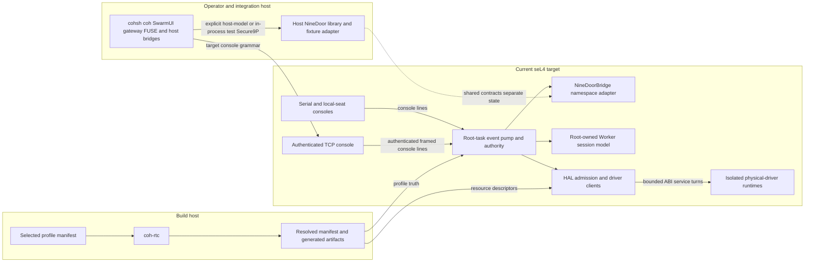
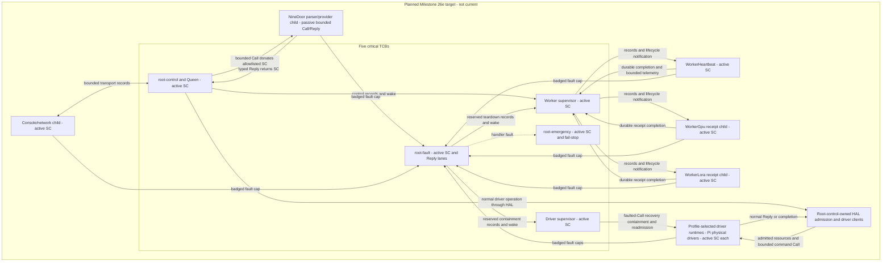
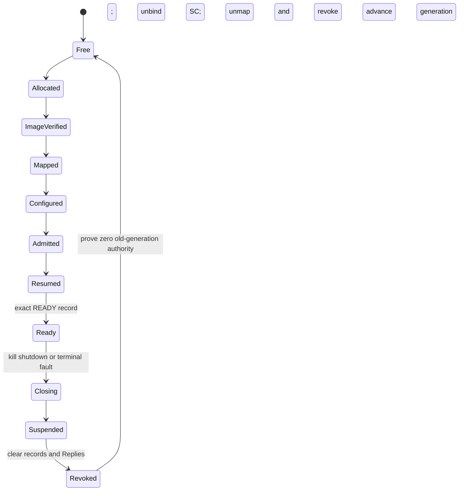
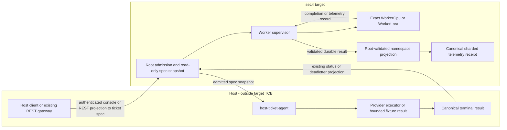

<!-- Copyright 2026 Lukas Bower -->
<!-- SPDX-License-Identifier: Apache-2.0 -->
<!-- Purpose: Describe the current Cohesix architecture and explicitly milestone-gated planned seL4 changes. -->
<!-- Author: Lukas Bower -->

# Cohesix Architecture

This document owns the system-level view of Cohesix: trust boundaries, runtime
components, principal control and data flows, and the selected direction for
seL4 task and temporal isolation. Exact namespace contracts belong in
[INTERFACES.md](INTERFACES.md), Secure9P invariants in
[SECURE9P.md](SECURE9P.md), role policy in
[ROLES_AND_SCHEDULING.md](ROLES_AND_SCHEDULING.md), and physical-driver rules in
[DRIVERS.md](DRIVERS.md).

Architecture state is explicit throughout this document:

- **Current** means implemented by the selected checked-in profile and source.
  A current target claim still requires evidence for that exact target and
  artifact set.
- **Planned** means owned by a named milestone task. It is not an implementation,
  boot, isolation, or acceptance claim.
- **Accepted** means the required immutable evidence exists for the exact
  profile, target, image, and proof class. Configuration, implementation,
  target acceptance, runtime-release acceptance, and production-use-case
  acceptance are different states.

The planned sections summarize the normative tasks in
[BUILD_PLAN.md](BUILD_PLAN.md). If a summary here and the plan disagree, the
plan governs and this document must be corrected.

## 1. Authority and evidence boundary

Cohesix is built from the tag-pinned upstream seL4 16.0.0 project. The selected
kernel revision is `6e7c3b733d296cfd88d5fbf635c96e447a882374`; complete source,
toolchain, profile, and evidence provenance is recorded in
[M26D_SEL4_16_PROVENANCE.md](audit/M26D_SEL4_16_PROVENANCE.md). Target userspace
is pure Rust `no_std`.

The selected profile manifest, its resolved manifest, and generated `coh-rtc`
outputs define generated interfaces, limits, feature gates, object topology,
and selected behavior. The checked-in default-profile snapshot is available in
[the generated manifest snippet](snippets/root_task_manifest.md); a target build
must use artifacts generated from its selected `configs/root_task*.toml` file.
The selected `SEL4_BUILD_DIR` supplies exact kernel headers, configuration,
object sizes, platform metadata, and timer truth.

### 1.1 Current and selected planned baseline

| Concern | Current selected state during Milestone 26d | Selected planned state |
| --- | --- | --- |
| Kernel contract | seL4 16, AArch64, four nodes, one domain, non-hypervisor classic SMP, with `KERNEL_MCS=false`. QEMU uses the GICv3 operational profile. | Pending Milestone 26e makes four-core, one-domain, non-hypervisor SMP+MCS the sole operational QEMU and Pi 4 architecture. |
| Temporal authority | Priorities, affinity, and bounded cooperative service turns; no scheduling contexts, MCS Reply objects, timeout faults, donation, or kernel-enforced CPU budgets. | Every live TCB has a compiler-admitted bound active scheduling context or an allowlisted passive donation chain with explicit Reply, timeout, and recovery ownership. |
| Principal userspace authority | One Rust root task owns Queen policy, parsers, networking, Worker model state, supervision, audit, and evidence. Selected physical drivers are restricted child tasks. | Five independently schedulable critical TCBs protect root control, fault handling, emergency output, Worker supervision, and driver supervision; parser, network, and executable Worker loops move to restricted children. |
| Workers | Heartbeat, GPU, Bus, and LoRA are model/session records. No selected profile launches a general Worker TCB. | Heartbeat, GPU, and LoRA become executable child tasks with one active SC each. WorkerBus alone remains model/session-only. |
| Drivers | Selected physical drivers are isolated children using classic scheduling. Their MCS receive/reply paths are currently stubs. | Every selected driver uses a real active-SC MCS command, Reply, notification, fault, and containment path. CYW43 behavior remains frozen and is re-proved under the new driver archive identity. |
| Target time | Pi uses exported virtual-counter truth for qualified timing. Canonical `release-qemu` currently selects `DummySoftTimer`, and the timer layer retains a hard-coded frequency fallback, so that path is not temporal-isolation evidence. | Both operational targets require exported `CNTVCT_EL0` access and exact generated `TIMER_CLOCK_HZ`; dummy, read-count, bypass, or hard-coded fallback selection fails closed. |
| Attestation | When enabled, root hashes public policy/manifest data and installs generated static ticket keys. This is reproducible `measurement_only` metadata, not TPM or DICE attestation. | Reopened Milestone 26 adds real nonce-bound TPM2 Quote or device-bound DICE evidence and sealed/derived ticket keys before authority publication when attestation is required. |
| Failure response | The classic-SMP source and artifact remain the 26d baseline and later immutable comparator. | There is no compiled classic fallback, scheduler selector, or runtime rollback path. Failure of the atomic 26e gates requires reverting the entire source/configuration change set and recording a new architecture decision. |

Milestone 26d remains in progress. Static profile validation and the accepted
QEMU run do not close current-image Pi 4, CYW43, local-seat, Pi TCP/`cohsh`
console, operator-liveness, benchmark, or formal-proof claims.

### 1.2 Evidence classes

Implementation and proof remain separate:

- Source, generated descriptors, and a staged image prove that a path can be
  built; they do not prove that a board booted that image.
- QEMU evidence proves the exact QEMU profile only.
- Fresh Pi evidence proves only the specifically observed behavior for its
  read-back-bound image and named boot/evidence set; it does not transfer to
  another image, boot, or target.
- Wired GENET, CYW43 Wi-Fi, USB/local-seat, serial, HDMI, driver-runtime,
  console, Worker, temporal-isolation, and benchmark proof remain independent
  ledgers.
- An upstream proof-eligibility profile proves only compatibility with the
  upstream verified-configuration preconditions. It is not a Cohesix kernel,
  Rust userspace, boot-path, hardware, DMA, SMP, or timing proof.

Current classic SMP and planned AArch64 SMP+MCS are not represented as
tag-pinned verified seL4 configurations. The seL4 16 caveats describe AArch64
MCS verification as incomplete and SMP+MCS as less explored. Exact QEMU and Pi
acceptance is therefore mandatory, but it does not create a formal-verification
claim.

The active scope and proof requirements are normative in
[BUILD_PLAN.md](BUILD_PLAN.md). Boot-by-boot results are non-canonical evidence;
canonical claims point to the tracked plan, test contract, and archived
target-qualified artifacts.

## 2. Current design boundary

Cohesix is a control-plane operating system for secure orchestration and
telemetry of edge GPU nodes. It uses a Queen/Worker model and exposes bounded,
file-oriented control surfaces.

The complete target trusted software closure contains:

- the selected upstream seL4 kernel build;
- the Rust root task and compiler-generated policy tables; and
- manifest-declared physical-driver runtime images plus their fixed ABI.

Within that closure, the root task is the principal userspace authority domain.
Selected physical-driver runtimes are genuine seL4 compartments with restricted
CSpace/VSpace authority; they are not part of the root address space. This
distinction does not imply that a driver is untrusted for every device property
or that BCM2711 DMA is confined by an IOMMU.

The target does not contain CUDA, NVML, container runtimes, a POSIX emulation
layer, or general host integration stacks. GPU access, PEFT execution, REST
projection, FUSE, systemd, Docker, Kubernetes, federation, SIEM, and other
heavy ecosystems remain host-side. The only permitted in-target TCP listener
is the authenticated console.

### 2.1 Current components

| Component | Runtime | Current responsibility |
| --- | --- | --- |
| Upstream seL4 | Target kernel | Enforces objects, capabilities, address spaces, classic scheduling, notifications, IPC, interrupts, and kernel-generated platform truth. |
| `root-task` | Target, `no_std` | Owns BootInfo/untyped allocation, CSpace/VSpace bootstrap, HAL admission, event pumping, serial/local-seat/HDMI/TCP handling, smoltcp and packet parsing, console and `NineDoorBridge` parsing, Queen policy, Worker model state, audit/evidence, and fault supervision. |
| `pi4-driver-*` | Pi 4 target, `no_std` child images | Own steady physical-device service behind HAL-admitted resources and the pointer-free driver-task ABI. |
| Worker role/session model | Root task and host test surfaces | Enforces ticket, namespace, lifecycle, telemetry, scheduling-record, and lease semantics. Current selected profiles do not launch Worker child tasks. |
| Host NineDoor library/fixture adapter | Host, `std` | Implements the Secure9P model used by host builds and in-process compatibility tests. It is not a packaged target transport or proof of a live host service. |
| `cohsh`, `coh`, SwarmUI, gateway, FUSE, GPU and provider bridges | Host | Provide host clients/adapters and execute only integrations whose selected implementation and observed mode are live; they do not create a new target authority path. |
| `coh-rtc` | Build host | Validates manifest IR and generates Rust tables, resolved manifests, policy defaults, scripts, and documentation snippets. |

All checked-in profiles mark `worker-heartbeat`, `worker-gpu`, `worker-bus`,
and `worker-lora` as `implemented = false`. Endpoint-cap and lifecycle-
notification requirements are disabled. Role records, reserved badge ranges,
Worker crates, and packaged build artifacts are model and interface
scaffolding; none proves that root loaded or resumed a Worker TCB. See
[ROLES_AND_SCHEDULING.md](ROLES_AND_SCHEDULING.md).

### 2.2 Current system boundary

```mermaid
flowchart LR
  subgraph BuildHost[Build host]
    Manifest[Selected profile manifest]
    Compiler[coh-rtc]
    Generated[Resolved manifest and generated artifacts]
    Manifest --> Compiler --> Generated
  end

  subgraph OperatorHost[Operator and integration host]
    HostClients[cohsh coh SwarmUI gateway FUSE and host bridges]
    HostNineDoor[Host NineDoor library and fixture adapter]
    HostClients -->|explicit host-model or in-process test Secure9P| HostNineDoor
  end

  subgraph Target[Current seL4 target]
    Serial[Serial and local-seat consoles]
    Tcp[Authenticated TCP console]
    EventPump[Root-task event pump and authority]
    Bridge[NineDoorBridge namespace adapter]
    WorkerModel[Root-owned Worker session model]
    Hal[HAL admission and driver clients]
    Drivers[Isolated physical-driver runtimes]

    Serial -->|console lines| EventPump
    Tcp -->|authenticated framed console lines| EventPump
    EventPump --> Bridge
    EventPump --> WorkerModel
    EventPump --> Hal
    Hal -->|bounded ABI service turns| Drivers
  end

  Generated -->|profile truth| EventPump
  Generated -->|resource descriptors| Hal
  HostClients -->|target console grammar| Tcp
  HostNineDoor -.->|shared contracts separate state| Bridge
```

The dotted relationship is semantic parity, not a transport connection. Host
NineDoor and target `NineDoorBridge` are separate adapters with separate state.
There is no in-target 9P-over-TCP listener.

## 3. Current target execution model

### 3.1 Kernel and root authority

The current root task constructs seL4 objects, validates generated descriptors,
creates admitted physical-driver address spaces, installs their capabilities,
and schedules bounded service work. Current source uses untyped retype, guarded
CNodes, CSpace derivation/revocation, TCB/VSpace/ASID/IPC-buffer construction,
endpoints, notifications, IRQs and badges, fault endpoints, AArch64 mappings and
cache maintenance, TCB control, and SMP affinity.

Current implementation-level capability admission relies on a successful
bounded retype, the BootInfo CSpace window, and exact publication state.
`DebugCapIdentify` is optional telemetry; it cannot admit, reject, or recover a
capability.

The event pump services operator input, timers, networking, Worker model events,
and driver completions with cooperative service-turn and queue bounds. Those
bounds constrain application work but do not enforce CPU budgets in the
kernel. Root-owned fault handling decodes driver faults and suspends a faulting
driver TCB; there is no independent root-fault or driver-supervisor TCB and no
general Worker fault path yet.

### 3.2 Physical task isolation and memory authority

Manifest-declared physical-driver runtimes execute as separate seL4 tasks with
task-local address and capability spaces. Root delegates only generated
endpoint, notification, frame, shared-ring, IRQ, fault, and mapped-resource
authority. Pi profiles preflight root-CNode, slot, untyped, and mapping capacity
before partial child construction; the current Pi contract uses a 14-bit root
CNode.

Isolated child image plans reject effective W+X mappings. Code pages are
read-only and executable, non-code mappings are ExecuteNever, and writable root
aliases of executable frames are removed before child resume. Child-only
code/stack authority is transferred deliberately rather than left ambient.

Driver-task isolation is capability and address-space isolation. It is not a
claim that every device is protected from malicious DMA: the selected Pi DMA
profile remains `bounded-no-iommu`.

### 3.3 Current Worker and Queen model

Queen is root-task orchestration authority exposed through the console and
NineDoor control surfaces; it is not a separate host RPC service or target TCB.
Current profiles expose Worker role, ticket, namespace, telemetry, lease, and
scheduling records as control-plane model state only. They disable cap-backed
endpoint authority and notification-backed lifecycle delivery.

A valid Worker ticket creates an application-layer session view. It does not
create a TCB, resume a Worker image, install a capability, or prove kernel
scheduling. `ATTACH` is session binding and never task creation. Reserved badge
values and non-MCS scheduling records remain compiler-owned schema data, not
installed caps or applied scheduling evidence.

### 3.4 Current timer and emergency-output qualification

Pi timing paths must use the selected build's exported virtual counter and
generated frequency. Canonical `release-qemu` currently selects
`DummySoftTimer`, and the AArch64 timer layer retains a hard-coded frequency
fallback. A no-op serial fallback remains reachable when `BootContext` lacks
serial; other explicit fixtures remain in non-production lanes. These paths are
current implementation facts, not valid operational timing, liveness, MCS, or
release evidence.

Milestone 26e retires those selections from operational QEMU/Pi closures.
Until then, architecture claims must name the exact selected timer/output path
rather than saying all current target timing follows generated truth.

### 3.5 Current identity and attestation qualification

When enabled, `apps/root-task/src/attest.rs` currently hashes public
policy-label and manifest-fingerprint data, labels the result from
configuration, and installs generated static ticket keys. It issues no TPM
command, nonce-bound Quote, device-bound DICE derivation, signature or chain
validation, measured-boot verification, or secret unsealing.

That output is deterministic `measurement_only` metadata. It does not establish
acceptable attested production ticket authority or satisfy a TPM, DICE,
`coh attest`, release, or production-use-case claim. Current code can still
publish/use its generated static authority material; that is the reopened
defect, not evidence of fail-closed attestation.

## 4. Planned Milestone 26e architecture — not as-built

This section describes the selected Milestone 26e design. Milestone 26e is
pending and inactive until Milestone 26d closes. If an explicitly accepted
blocker freezes the parallel CYW43 surface, the plan permits deterministic
preparatory work only; Pi component, full-system, and release PASS still require
positive exact-image CYW43 closure and matching MCS coexistence evidence. None
of these compartments, MCS records, Worker tasks, or acceptance records is
current behavior until its implementation task and separate QEMU/Pi evidence
gates pass.

### 4.1 Atomic SMP+MCS transition

Task `m26e-mcs-abi-foundation` first adds seL4 16 version-pinned
`SchedContext`, `SchedControl`, Reply-object, timeout-fault, consumed-time,
`YieldTo`, receive/call/reply, and reply-receive bindings. It makes the
four-node MCS profiles the only operational QEMU/Pi contracts and validates
kernel object sizes and generated headers before child ABIs freeze.

Every live TCB must have exactly one generated temporal-authority model:

- **Active:** a scheduling context bound to the TCB with admitted core, budget,
  period, refill policy, priority/MCP, timeout/overrun action, consumed-time
  evidence, and WCET/admission provenance.
- **Passive:** a compiler-allowlisted short synchronous service with bounded
  donor SCs/cores, call depth, Reply cardinality, donation depth, timeout,
  cancellation, fault, revoke, and proof that donated authority returns.

`SchedControl` remains root-only. Active SCs bind to TCBs, never notifications.
Network ingress, Workers, IRQ/DPC work, locality-bound drivers, authoritative
mutation, and autonomous drains use active SCs. Cross-core donation is
prohibited for IRQ- or locality-bound paths unless separately admitted. MCS
budgets supplement rather than replace byte, operation, completion, queue,
backpressure, replay, and cancellation bounds.

Both targets require exported `CNTVCT_EL0` and exact generated
`TIMER_CLOCK_HZ`. A missing or zero frequency, dummy/read-count clock, bypass,
hard-coded fallback, or null emergency-output selection is fatal for an
operational profile.

The implementation dependency order is fixed:

1. `m26e-mcs-abi-foundation` establishes the MCS ABI and target probes.
2. `m26e-production-surface-truth-and-stub-retirement` removes operational
   fixture/stub selection.
3. `m26e-worker-resource-admission-critical-tcbs` proves kernel-object, memory,
   CSpace, per-core demand, and the five independent critical reserves.
4. `m26e-driver-runtime-mcs-port-and-cyw43-coexistence` ports every selected
   driver and re-proves CYW43 coexistence before service extraction.
5. `m26e-ninedoor-service-isolation` then
   `m26e-console-network-service-isolation` extract the parser and network
   services.
6. Worker ABI, image, and supervisor tasks create Heartbeat/GPU/LoRA children.
7. Host dependency/integration tasks run before separate Worker-component,
   root-TCB, and full-system evidence and release promotion.

Milestone 26e retains four nodes, one domain, and one generated placement
mechanism. It does not introduce domain scheduling, VCPU/hypervisor support,
SMMU, or SMC forwarding. PMU, kernel debug, printing, and benchmark facilities
remain diagnostic rather than production authority.

### 4.2 Planned critical and child topology

```mermaid
flowchart TB
  subgraph Target[Planned Milestone 26e target - not current]
    subgraph Critical[Five critical TCBs]
      RC[root-control and Queen - active SC]
      RF[root-fault - active SC and Reply lanes]
      RE[root-emergency - active SC and fail-stop]
      WS[Worker supervisor - active SC]
      DS[Driver supervisor - active SC]
    end

    HAL[Root-control-owned HAL admission and driver clients]
    ND[NineDoor parser/provider child - passive bounded Call/Reply]
    CN[Console/network child - active SC]
    WH[WorkerHeartbeat - active SC]
    WG[WorkerGpu receipt child - active SC]
    WL[WorkerLora receipt child - active SC]
    Drivers[Profile-selected driver runtimes - Pi physical drivers - active SC each]

    RC -->|bounded Call donates allowlisted SC| ND
    ND -->|typed Reply returns SC| RC
    CN <-->|bounded transport records| RC
    RC -->|control records and wake| WS
    RF -->|reserved teardown records and wake| WS
    RF -->|reserved containment records and wake| DS
    WS -->|records and lifecycle notification| WH
    WS -->|records and lifecycle notification| WG
    WS -->|records and lifecycle notification| WL
    WH -->|durable completion and bounded telemetry| WS
    WG -->|durable receipt completion| WS
    WL -->|durable receipt completion| WS
    RC -->|normal driver operation through HAL| HAL
    HAL -->|admitted resources and bounded command Call| Drivers
    Drivers -->|normal Reply or completion| HAL
    DS -->|faulted-Call recovery containment and readmission| Drivers

    ND -->|badged fault cap| RF
    CN -->|badged fault cap| RF
    WH -->|badged fault cap| RF
    WG -->|badged fault cap| RF
    WL -->|badged fault cap| RF
    Drivers -->|badged fault caps| RF
    RF -.->|handler fault| RE
  end
```

Task `m26e-worker-resource-admission-critical-tcbs` proves that the five named
critical TCBs have independent active-SC reserves. The plan does
not imply that every critical TCB necessarily owns a separate VSpace; generated
least authority, scheduling independence, and the acyclic fault graph are the
required properties. Root-fault failure routes to root-emergency.
Root-emergency has no self-handler and fails stop if it faults.

Root-control and root-fault hand work to the Worker supervisor through separate
bounded records and a supervisor-bound wake notification. Root-fault uses a
separate reserved record per admitted driver to hand containment to the driver
supervisor. Worker, driver, endpoint, notification, IRQ, command, completion,
and fault badge domains are generated and disjoint.

No policy/audit child is selected in 26e. Policy decisions, authoritative
mutation, audit ordering, and replay state remain root-owned unless later
measurement justifies a split that does not duplicate authority or state.

### 4.3 Namespace and console service compartments

Task `m26e-ninedoor-service-isolation` moves untrusted target path, frame,
record, namespace, and provider parsing into a separately packaged
`nine-door-runtime`. The normal service is passive and caller-funded. Generated
donors, Reply objects, timeout/cancellation behavior, and donation depth bound
the call. It returns typed prepared operations; it receives no Queen policy,
authoritative mutation, catch-all namespace, root CSpace, device, or
`SchedControl` authority.

Task `m26e-console-network-service-isolation` moves smoltcp, TCP framing,
transport authentication parsing, receive, retransmission, and protocol timers
into an active-SC `console-network-runtime`. Root retains application admission,
Queen policy, authoritative ordering, emergency serial, fatal output, and
bounded response priority.

These are internal seL4 compartment changes. The external protocol boundary
does not change: host NineDoor remains host Secure9P, target TCP remains the
authenticated console grammar, and no target 9P/TCP or second TCP listener is
introduced.

### 4.4 Executable Worker architecture

Tasks `m26e-worker-abi-identity-notifications`,
`m26e-worker-image-pipeline-loader`, and
`m26e-worker-supervisor-child-isolation` create the first real general Worker
tasks:

- `WorkerHeartbeat` performs bounded progress and telemetry work.
- `WorkerGpu` receives only correlated GPU lease terminal-result records. It
  receives no CUDA, NVML, MMIO, DMA, GPU credential, or device capability.
- `WorkerLora` receives correlated PEFT export, import, activate, and rollback
  terminal-result records. Datasets, adapter bytes, frameworks, training,
  evaluation, scanning, activation execution, model registries, runtime reload,
  and inference remain host-side.
- `WorkerBus` remains the sole model/session-only Worker and is absent from the
  executable Worker image archive.

The three executable Workers are separate `no_std`, W^X images in a deterministic
Worker archive distinct from the driver archive. A pointer-free
`worker-task-abi/v1` binds every request and result to exact
`(role, slot, lease_epoch, supervisor_generation, cap_generation)` identity.
Each Worker has one dedicated active SC and no normal IPC donation.

Worker control uses generation-stamped bounded records plus one-hot lifecycle
notifications. Required READY and receipt results publish durable completion
records before waking the supervisor. Telemetry alone may use counted,
droppable `NBSend` through a Write-only badged endpoint without `Grant` or
`GrantReply`. Normal Worker IPC permits no blocking `Send`, `Call`, `Reply`,
`NBSendRecv`, or SC donation.

The Worker lifecycle-wait cap is Read-only and the supervisor signal cap is
Write-only. Notifications are wakeups, never structured data. The supervisor
decodes coalesced bitsets, drains each indicated record through its sequence
watermark, and applies generated precedence:
`revoke > shutdown > lease-expired > pressure > timer-wake`. Critical producers
never block: control saturation returns bounded refusal, while the reserved
per-child fault mailbox cannot be dropped.

Spawn is transactional:

```mermaid
stateDiagram-v2
  [*] --> Free
  Free --> Allocated
  Allocated --> ImageVerified
  ImageVerified --> Mapped
  Mapped --> Configured
  Configured --> Admitted
  Admitted --> Resumed
  Resumed --> Ready: exact READY record
  Ready --> Closing: kill shutdown or terminal fault
  Closing --> Suspended
  Suspended --> Revoked: clear records and Replies; unbind SC; unmap and revoke
  Revoked --> Free: prove zero old-generation authority; advance generation
```

Construction failure enters the same idempotent teardown. The complete instance
bundle contains the TCB, CSpace, VSpace, IPC buffer, stack, mappings, frames,
endpoints, notifications, standard/timeout fault caps, Reply objects, SC,
records, and retained revoke anchors. Teardown closes admission, suspends the
TCB only after publishing and signalling generation-stamped shutdown and
waiting no longer than the generated grace bound. It then clears pending
records/signals, resolves Reply associations, unbinds both notification and SC,
unmaps and invalidates frames, revokes derived capabilities, deletes objects,
and proves there is no old-generation Reply association, SC binding, blocking
queue, record/signal, mapping, cap, execution, or authority before slot reuse.

Milestone 26e owns this basic containment and fresh-generation recreation.
Milestone 28e later binds the already complete bundle to production ticket and
lease ledgers and adds structured quarantine evidence and fresh-ticket restart;
it does not finish 26e isolation or revocation.

### 4.5 Driver MCS port and CYW43 coexistence

Task `m26e-driver-runtime-mcs-port-and-cyw43-coexistence` replaces the current
linked-driver MCS stubs with real active-SC receive/Reply, notification, IRQ,
timeout, and fault paths. Root command caps are `Write + GrantReply` without
`Grant`; driver command receive and IRQ-wait caps are Read-only; root/software
signal caps are Write-only. A driver SC binds only to its TCB.

Root/HAL driver clients originate normal bounded command `Call`/Reply traffic.
The driver supervisor owns retained origin/recovery caps and per-runtime command
state rather than the normal command policy. If a driver faults during a root
`Call`, the supervisor returns exactly one typed command failure to the blocked
caller, suspends the faulting TCB, clears and verifies the independent fault
Reply association, revokes the old runtime generation, and reconstructs only
through HAL admission.

Every selected driver, including a later HAL-admitted TPM runtime when such a
profile is selected, must receive the same generated MCS object, fault, Reply,
containment, and target-evidence treatment.

The MCS port may change only shared scheduling, IPC, runtime-init, and
containment scaffolding. It may not change CYW43/SDIO ownership, state machine,
hardware timing, deadlines, retries, recovery order, rings, or error policy.
The classic artifact remains an immutable comparator; 26e emits a new driver
archive hash and requires separate exact-image CYW43 coexistence evidence.

### 4.6 Fault, timeout, and revocation rules

Child fault caps identify the exact instance and carry `Write + GrantReply`.
Root-fault owns the Read side and the generated Reply-lane cardinality.

- An ordinary Worker fault is terminal. Root-fault suspends the Worker without
  replying, verifies the fault association is clear, and hands full teardown to
  the Worker supervisor.
- Only a compiler-allowlisted recoverable timeout may receive exactly one typed
  reply under its bounded budget/replenishment policy.
- A driver fault during a command closes admission, completes the blocked
  caller exactly once with typed failure, clears both command and fault Reply
  state, and then revokes the old generation.
- Service success, denial, timeout, cancellation, fault, and revoke paths must
  all return or revoke donated SC and Reply authority.
- Service, Worker, driver, root-control, and supervisor faults route to
  root-fault. Root-fault faults route to root-emergency. No handler routes to
  itself or forms a cycle.

### 4.7 Host integration boundary

Task `m26e-host-integration-dependency-contract` generates one
`host-integration-dependency/v1` graph over existing paths, actions, schemas,
Worker roles, host profiles, observed provider modes, package identities,
evidence lanes, and milestone owners. It is dependency metadata, not a new
provider registry or authority channel.

Task `m26e-host-worker-integration` makes host tools discover, start, observe,
correlate, package, and evidence the three executable Workers without a new
authority plane. Host Secure9P exercises separate host-model/compatibility
state. Real target task creation and target evidence use the authenticated
target console or an existing REST gateway projection over that console. The
implementation keeps request admission, `implemented = true`, READY, receipt
completion, artifact verification, QEMU acceptance, Pi acceptance,
runtime-release acceptance, and production-use-case acceptance independent.

The 26e VM receipt-correlation path is:

```mermaid
flowchart LR
  subgraph Host[Host - outside target TCB]
    Client[Host client or existing REST gateway]
    Agent[host-ticket-agent]
    Executor[Provider executor or bounded fixture result]
    Result[Canonical terminal result]
    Agent --> Executor --> Result
  end

  subgraph Target[seL4 target]
    Root[Root admission and read-only spec snapshot]
    Supervisor[Worker supervisor]
    Worker[Exact WorkerGpu or WorkerLora]
    Projection[Root-validated namespace projection]
    Telemetry[Canonical sharded telemetry receipt]
    Root --> Supervisor --> Worker
    Worker -->|completion or telemetry record| Supervisor
    Supervisor -->|validated durable result| Projection --> Telemetry
  end

  Client -->|authenticated console or REST projection to ticket spec| Root
  Root -->|admitted spec snapshot| Agent
  Result -->|existing status or deadletter projection| Root
```

There is no direct host-to-Worker IPC, client-authored receipt, or GPU/PEFT
data-plane byte stream in the VM. In 26e, WorkerGpu receipt correlation covers
GPU lease grant/renew/release and WorkerLora covers PEFT export/import/activate/
rollback. Later CUDA workload and full PEFT/training/runtime-reload actions
remain host integration work with their own generated contracts and evidence;
they cannot enter WorkerGpu or WorkerLora until a generated and tested later
contract either correlates a host-only phase to an existing boundary receipt or
versions and extends the Worker action/schema matrix. They are not silently
treated as existing 26e Worker ABI actions.

FUSE, systemd, Docker, Kubernetes, federation, SIEM, sidecars, gateway, UI,
Python, CUDA/NVML, and PEFT integrations retain independent
`unknown|missing|disabled|fixture|mock|dry-run|live` state. A fixture can prove
the bounded 26e result-to-Worker path, but cannot prove the external side
effect, live provider, production packaging, or use case.

### 4.8 Production-surface truth

Task `m26e-production-surface-truth-and-stub-retirement` inventories every
reachable binary, library, feature, profile, fallback, provider adapter,
example, proof source, package, and release asset. Operational QEMU/Pi closures
may not select or fall back to dummy time, null serial, spin stubs, preseeded
`/host`/GPU/model state, implicit active models, placeholder credentials,
client-created receipts, or synthetic evidence. Missing or expired live state
becomes typed unavailable state. Explicit fixtures remain only in isolated
test lanes and cannot satisfy target, integration, release, attestation, or
use-case evidence.

### 4.9 Planned target acceptance

Implementation and target promotion remain separate:

| Claim | Required immutable evidence |
| --- | --- |
| Worker execution | Separate QEMU and Pi `cohesix-worker-task-evidence/v1` records for Heartbeat, GPU, and LoRA. |
| Root containment | Separate QEMU and Pi `cohesix-root-tcb-acceptance/v1` records. |
| Full SMP+MCS system | Separate QEMU and Pi `cohesix-mcs-smp-system-acceptance/v1` records. |
| Worker-runtime release | One `cohesix-worker-release-acceptance/v1` record referencing all six records and their complete artifact/hash graph. |

Tasks `m26e-worker-target-evidence-promotion` and
`m26e-root-tcb-target-proof` produce the component records.
`m26e-mcs-smp-target-acceptance` is verification-only over frozen artifacts.
It admits no source, generated-policy, profile, or image change after component
evidence.

The evidence graph binds the exact kernel configuration, resolved manifest,
root image, MCS driver archive and manifest, CYW43 coexistence record, Worker
archive, Worker image manifest and images, ABI schemas, admission totals, and
raw evidence hashes. Release validation also recursively checks the exact
role-required `worker-control`, `gpu-receipt-path`, and `peft-receipt-path`
integration records used by each target component record. Both targets must
pass normal load, overload, budget exhaustion, timeout, fault,
faulted-driver-call recovery, complete Worker teardown, fresh-generation
recreation, leak detection, operator liveness, protocol regression, GPU/PEFT
receipt, CYW43 coexistence, and same-harness performance gates. A build, boot,
or throughput win alone is insufficient.

Host/model, QEMU, Pi, CYW43, root-containment, Worker-runtime, and production
use-case evidence are not interchangeable. Any failure blocks 26e and triggers
whole-change source/configuration reversion, not a shipped fallback.

## 5. Planned Milestone 26 attestation closure — not as-built

Task `m26-device-identity-attestation-closure` replaces ambiguous configuration
labels with explicit `disabled|measurement_only|tpm2_quote|dice_evidence`
modes. It is a reopened pre-26e prerequisite for any ticket-bearing profile
that requires attestation. If it adds a TPM runtime before 26e, that selected
runtime is subsequently ported and admitted through the same MCS driver
topology as every other 26e driver.

- TPM mode uses a least-authority HAL-admitted isolated TPM runtime for bounded
  startup, PCR policy, Quote, and sealed-object operations. Root receives typed
  evidence/results, not raw bus/MMIO or device-root keys.
- DICE mode is valid only when a device-bound CDI and signed chain are
  established before root-task. Public-data hashing in root is not a DICE
  fallback.
- Both modes bind a verifier nonce, boot/session and replay data, firmware,
  U-Boot, seL4 kernel, root, runtime archives, resolved manifest, image hashes,
  algorithms, public chain, and signature.
- A live target reaches bounded
  `/proc/attest/{capabilities,status,challenge,evidence}` operations through the
  authenticated target console or its REST projection. Host Secure9P may expose
  the same schema only through separate host adapter/fixture state; it is not a
  transport to the target. No path creates a general RPC.
- Production ticket keys are TPM-sealed or DICE-domain-derived and remain
  unavailable when required evidence fails.
- QEMU vTPM evidence and real Pi hardware/device-root evidence remain separate.
  Without an accepted Pi trust root, the board reports `measurement_only` or
  `unavailable` and cannot make an attested-production claim.

The later host `coh attest` verifier remains outside the target TCB. This work
is sequenced after the active CYW43 exact-image surface is frozen and requires a
new root/image identity and separate target evidence; it does not modify
CYW43 behavior.

## 6. Control-plane paths

Cohesix has two distinct operator protocol families:

1. **Host-model/in-process Secure9P.** A client negotiates the bounded
   9P2000.L subset with the Host NineDoor library/fixture adapter. This path is
   used by host builds and compatibility tests; it has state separate from a
   live target and cannot create or prove a target task.
2. **Target console grammar.** Serial carries console lines directly. TCP adds
   a four-byte little-endian length frame and transport authentication before
   the same bounded command grammar. Application `ATTACH` then selects a role
   and optional capability ticket.

Both adapters project overlapping namespace semantics, but they are not the
same wire protocol. Exact framing, operations, acknowledgements, and error
surfaces are defined in [INTERFACES.md](INTERFACES.md). Milestone 26e changes
the internal task ownership of parsers; it does not change these external
authority paths.

Host REST, UI, GPU, PEFT, FUSE, sidecar, and federation tools are projections
over documented interfaces. They may validate, batch, execute host-only work,
or render data, but they may not introduce target authority unavailable through
the underlying ticketed namespace or console operation.

## 7. Boot flow

### 7.1 Current flow

The current target boot sequence is profile-qualified:

1. Firmware and bootloader load the selected seL4 image. Pi 4 acceptance uses
   firmware to U-Boot to seL4 binary-image handoff; it does not depend on UEFI.
2. seL4 supplies BootInfo and generated kernel metadata to root-task.
3. Root validates kernel/profile invariants, establishes CSpace/VSpaces,
   selects the timer backend, and loads generated policy.
4. HAL admits manifest-declared physical resources and starts selected driver
   runtimes. Owner state is credited only after runtime identity, resources,
   and service progress are proved; staging a child image is insufficient.
5. Hardware and policy gates record their state. Emergency serial and root
   diagnostics may remain available while hardware acceptance is red; a prompt
   is not device-acceptance evidence.
6. Root initializes the namespace bridge, log ring, and profile-enabled
   operator surfaces subject to their individual readiness gates.
7. The bounded event pump enters steady service.

Pi saved boot policy is loaded by the staged U-Boot script and passed through
bounded `/chosen/cohesix,*` properties. Saved policy may select or configure an
allowed network path, but it does not rewrite the compiled manifest. Procedures
live in [BOOT_REFERENCE.md](BOOT_REFERENCE.md) and
[HARDWARE_BRINGUP.md](HARDWARE_BRINGUP.md).

### 7.2 Planned 26e boot delta

After the existing firmware/U-Boot/seL4 handoff, an operational 26e boot must:

1. validate the exact MCS kernel profile, generated headers, four-core contract,
   object sizes, and virtual-counter frequency;
2. admit all kernel objects, memory, CSpace capacity, per-core demand, critical
   reserves, SCs, Replies, fault routes, and donation chains before partial
   activation;
3. create the five critical TCBs and their independent temporal reserves;
4. admit the exact MCS driver archive, including a selected TPM runtime, through
   HAL without changing device semantics;
5. complete the selected TPM/DICE attestation gate before ticket-authority
   publication when attestation is required;
6. validate and load the separate namespace, console-network, and Worker images
   with W^X and exact hashes;
7. expose Worker namespace state only after an exact READY record; and
8. emit target-qualified evidence without promoting a configured or booted
   candidate automatically.

## 8. Principal data flows

### 8.1 Worker lifecycle and telemetry

Currently, an authorized Queen operation appends a bounded control record.
Root validates role, ticket, lifecycle gate, and generated limits before
updating target model state. Host NineDoor performs the analogous validation
only against its separate host-model/test state. Neither current path loads or
resumes a Worker task.

In planned 26e, a successful spawn acknowledgement means only that the Worker
supervisor admitted a request. Namespace and telemetry publication begin after
the exact generation-stamped READY record. Kill, shutdown, fault, and
construction failure converge on the complete teardown in section 4.4.

The canonical telemetry path remains:

`/shard/<label>/worker/<id>/telemetry`

The legacy `/worker/<id>/telemetry` alias exists only when the selected
manifest enables it.

### 8.2 GPU and PEFT control

Current `gpu-bridge-host` owns hardware discovery and CUDA/NVML interaction and
publishes bounded host namespace state. Current target profiles do not launch a
GPU or LoRA Worker. Host NineDoor simulation may expose job/model state, but
that host-only fixture is not a live target or provider claim.

Planned WorkerGpu and WorkerLora remain receipt-only target tasks. Host
executors continue to own GPU lease side effects and PEFT/model lifecycle work.
Root admits and pins the exact live Worker identity before a host executor
claims a receipt-bearing ticket, then maps one canonical terminal result to the
supervisor/Worker record. No host provider state independently proves Worker
READY, and no Worker receipt independently proves a real external side effect.

### 8.3 Observability

Logs, pressure, session, scheduling, lease, ingest, task, fault, and evidence
state are exposed through bounded namespace nodes. The selected manifest gates
each generated provider. Exact paths and formats are linked from
[INTERFACES.md](INTERFACES.md); host UI and gateway consumers do not own those
schemas or raise the evidence level of their source.

## 9. Security invariants

Current invariants:

- All target physical-device authority passes through HAL.
- All selected steady physical drivers are manifest-declared isolated
  runtimes; the Pi DMA claim remains `bounded-no-iommu`.
- Target code remains `no_std`; host capabilities and heavy ecosystems do not
  enter target closure profiles.
- Isolated child mappings are W^X, and executable frames retain no writable
  root alias when a child resumes.
- Successful bounded retype, the BootInfo CSpace window/profile bounds, and
  exact publication state establish current implementation-level cap
  admission; debug identification is telemetry only. Target production
  acceptance still requires exact-target evidence.
- Capabilities, tickets, generated bounds, and lifecycle gates are checked
  before side effects.
- Secure9P, console grammar, Worker model/session interfaces, and driver-task
  ABI remain separate bounded interfaces.
- The target has no TCP listener except the authenticated console.
- Rootfs CPIO remains below the limit enforced by
  `scripts/ci/size_guard.sh`.
- Current measurement hashing is not attestation, and current cooperative
  service turns are not MCS temporal isolation.

Planned 26e acceptance invariants:

- Every active TCB has an admitted SC, core, budget, and period; every passive
  TCB has an allowlisted donor/Reply/timeout/recovery chain.
- `SchedControl` is never delegated, and an active SC binds only to its TCB.
- MCS budgets never replace application service and queue bounds.
- Root control, fault, emergency, Worker-supervisor, and driver-supervisor
  progress have independent reserves and an acyclic fault graph.
- WorkerHeartbeat, WorkerGpu, and WorkerLora are real restricted children;
  WorkerBus is the only model-only Worker.
- Every live instance has a complete capability/mapping/SC/Reply teardown and
  stale-generation exclusion path before reuse.
- Operational closures contain no silent mock, dummy, stub, no-op, synthetic,
  or live-to-fixture fallback.
- Host tools remain outside the target TCB and cannot manufacture Worker or
  provider readiness.
- No runtime classic scheduler fallback remains after acceptance; recovery from
  an unforeseen architecture failure is whole-change source/configuration
  reversion.
- Exact SMP+MCS target acceptance is not an upstream formal-verification claim.

## 10. Source map

- Scope and milestones: [BUILD_PLAN.md](BUILD_PLAN.md), especially
  [Milestone 26e](BUILD_PLAN.md#26e)
- seL4 16 source/profile evidence:
  [M26D_SEL4_16_PROVENANCE.md](audit/M26D_SEL4_16_PROVENANCE.md)
- seL4 capability classification:
  [M26D_SEL4_16_CAPABILITY_AUDIT.md](audit/M26D_SEL4_16_CAPABILITY_AUDIT.md)
- Scheduler decision and atomic transition:
  [M26D_MCS_DECISION.md](audit/M26D_MCS_DECISION.md)
- Current root boundary and planned split order:
  [M26D_ROOT_TCB_BOUNDARY_AUDIT.md](audit/M26D_ROOT_TCB_BOUNDARY_AUDIT.md)
- Default generated profile summary:
  [snippets/root_task_manifest.md](snippets/root_task_manifest.md)
- Kernel profile contracts:
  [`configs/sel4/profiles.toml`](../configs/sel4/profiles.toml)
- Manifest inputs: [`configs/root_task.toml`](../configs/root_task.toml) and
  [`configs/root_task_pi4_uboot_aarch64.toml`](../configs/root_task_pi4_uboot_aarch64.toml)
- Root task: [`apps/root-task`](../apps/root-task)
- Host NineDoor: [`apps/nine-door`](../apps/nine-door)
- Physical-driver runtime: [`apps/pi4-driver-runtime`](../apps/pi4-driver-runtime)
- Driver ABI: [`crates/pi4-driver-abi`](../crates/pi4-driver-abi)
- Host-tool boundary: [HOST_TOOLS.md](HOST_TOOLS.md)
- GPU boundary: [GPU_NODES.md](GPU_NODES.md)
- Role and scheduling contract:
  [ROLES_AND_SCHEDULING.md](ROLES_AND_SCHEDULING.md)
- Manifest compiler: [`tools/coh-rtc`](../tools/coh-rtc)
- Validation plan: [TEST_PLAN.md](TEST_PLAN.md)
