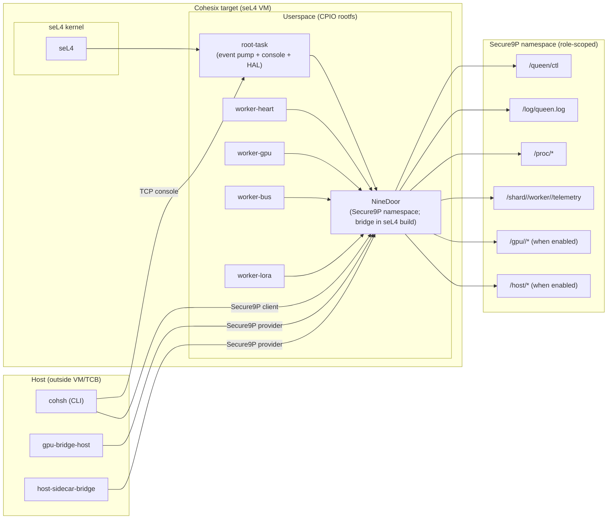
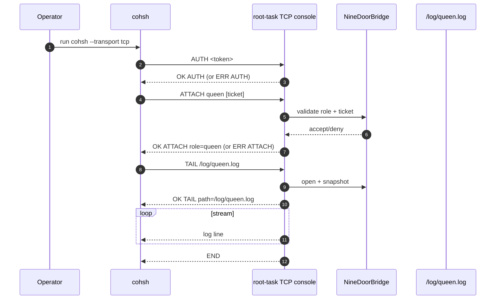
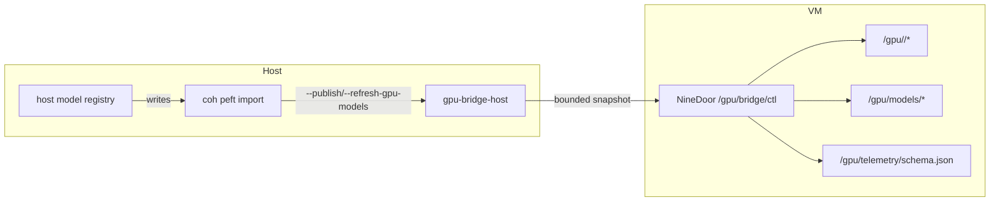
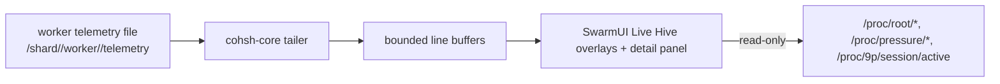

<!-- Copyright 2026 Lukas Bower -->
<!-- SPDX-License-Identifier: Apache-2.0 -->
<!-- Purpose: Describe the Cohesix system architecture, component responsibilities, and boundary constraints. -->
<!-- Author: Lukas Bower -->

# Cohesix Architecture (As-Built)

Cohesix is a control-plane OS for secure orchestration and telemetry of edge GPU nodes using a Queen/Worker hive model. This document describes the current as-built system for the QEMU `aarch64/virt` target, the Pi 4 U-Boot profile family (`pi4-uboot-aarch64` with legacy alias `uefi-aarch64`), and the macOS host; manifest-gated features are called out explicitly.

## 1. Scope and Non-Goals
Scope:
- Host: macOS 26 on Apple Silicon for build, QEMU, and host tools.
- Targets: QEMU `aarch64/virt` for development/CI, with the GIC version selected from the local seL4 build configuration, and Raspberry Pi 4 (`bcm2711`) via `Pi firmware -> U-Boot -> seL4 image -> root-task`; userspace is a pure Rust CPIO rootfs.
- Control plane: Secure9P namespace plus a deterministic console grammar shared with `cohsh`/`cohsh-core`.

Non-goals:
- In-VM GPU runtimes (CUDA/NVML), POSIX emulation, or dynamic loading.
- Control channels outside Secure9P and the console grammar (no ad-hoc RPC, no shared-memory shortcuts).
- In-VM TCP services except the authenticated root-task console.
- In-VM UI clients or host-side tooling; UI/CLI remain host-only and observational.
- In-VM UI stacks or alternate local-shell grammars; local diagnostics seat reuses the existing root-console parser and command set.

## 2. System Boundaries and TCB
- VM boundary: seL4 kernel plus the CPIO userspace payload (`root-task` and worker binaries). This is the trusted computing base.
- The root task owns capability setup, the event pump, console surfaces, logging, and the in-VM NineDoor bridge. It retains capability authority and revocation for hardware, while Pi 4 physical driver progress is routed through root-created driver-task service TCBs and fixed-layout command/completion rings.
- Host tooling (`cohsh`, `coh`, `swarmui`, `gpu-bridge-host`, `host-sidecar-bridge`, `cas-tool`) is outside the TCB and interacts only through Secure9P or the console.
- The only in-VM TCP listener is the root-task console; all other TCP services remain host-only.
- Device authority (MMIO, DMA admission/publication, cache ops, IRQ binding, and physical-address discovery) goes through the HAL; no direct device access outside HAL.
- The HAL is capability-layered rather than board-layered: generic MMIO/DMA access lives in `DeviceHal`, PCI-backed discovery/configuration lives in `PciHal`, and the Pi 4 CYW43-over-SDIO bring-up path lives in `Cyw43Hal`. The compatibility `Hardware` façade remains for call sites that still span multiple backends, but drivers are expected to depend on the narrowest HAL layer they actually need.
- On the physical Pi 4 profile, driver bootstrap now requires isolated child VSpaces and fixed command/completion rings. Root loads linked `pi4-driver-*` runtime images only from the raw driver-runtime CPIO embedded into the Pi 4 root-task image by `scripts/pi4-image-build.sh`; the staged U-Boot CPIO remains an audit/packaging artifact, not a runtime fallback. QEMU and host profiles keep compatibility paths for virtual-device testing.
- The intended isolated-image contract is represented in compiler IR under `root_task.driver_images` and generated into root-task tables. The build produces and stages linked `pi4-driver-*` image artifacts with fixed-ring service engines. Root maps every bounded runtime ELF `PT_LOAD` page declared by `code-pages` plus stack/IPC/ring and declared device regions, then sends each linked Pi 4 runtime a bounded pointer-free `pi4-driver-abi` runtime-init descriptor containing primitive MMIO/DMA/shared page metadata, semantic resource ranges, bus-address policy, optional IRQ descriptors, USB/PCIe and CYW43/SDIO bus links, and framebuffer metadata. Physical Pi service turns use `seL4_Call`, with linked runtimes replying only after publishing completion records so lower-priority driver TCBs can run without relying on cross-priority `Yield`. Runtime init is topology transport only and cannot credit owner-state by itself. Runtime DMA/shared budgets are now bounded by the descriptor ABI and current use: USB gets 64 DMA pages, GENET gets 64 DMA pages for a 32-RX/32-TX ring shape, HDMI uses framebuffer plus shared pages without a DMA arena, CYW43 gets shared-control pages without direct SDHCI MMIO or DMA, and SDIO gets one HAL-declared SDHCI MMIO page plus shared pages. Seven linked Pi 4 runtime specs are acceptance-eligible in the generated manifest. The serial image handles bounded mini-UART init/RX/TX, USB owns a direct-root-port xHCI boot-keyboard state machine, GENET owns MDIO/MAC plus bounded RX/TX descriptor rings, HDMI renders into the mapped framebuffer, PCIe services bounded MMIO operations, SDIO services fixed-layout CMD52/CMD53/POLL_IRQ records from its isolated runtime, and CYW43 owns the pointer-free shared-control SDPCM command surface behind the CYW43/SDIO bus-link descriptor. Fresh Pi hardware proof still has to show useful Wi-Fi/DHCP or GENET/DHCP plus USB keyboard, HDMI, serial, SDIO owner-state, and PCIe/VL805 behavior before those engines are board-proven.

## 2.1 SMP Execution Model (Task Isolation)
- SMP is enabled only when the seL4 kernel is built with `SMP=ON` and `KernelMaxNumNodes >= 2`.
- Cohesix uses **task isolation** (separate seL4 tasks) rather than shared-memory multithreading; authoritative state remains serialized.
- For QEMU bring-up, set `COHESIX_QEMU_SMP` (or `QEMU_SMP`) to match `KernelMaxNumNodes`, or provide a full topology via `COHESIX_QEMU_SMP_TOPO`, when running `scripts/qemu-run.sh` or `scripts/cohesix-build-run.sh`.
- QEMU SMP bring-up on macOS/TCG requires PSCI `smc`; the SMP kernel build must ingest a DTB dumped with `virtualization=on` so the elfloader emits `PSCI_METHOD_SMC` for the platform.
- Affinity hints live in `root_task.affinity` inside `configs/root_task.toml`; all core indices must be `< max_cores`, and `max_cores` must match the kernel build’s node count when affinity is enabled. Defaults enable affinity with `authority_core=0`, `ninedoor_cores=[1]`, `provider_cores=[2, 3]`, and `worker_cores=[2, 3]` unless overridden in the manifest. Per-driver TCB pinning is explicit under `root_task.affinity.drivers` for `serial`, `usb-local-seat`, `hdmi-text`, `bcmgenet-v5`, `cyw43455`, `rtl8139`, `virtio-net`, `sdio-host`, and `pcie-root`; validation rejects driver pins to the root authority core. When enabled, root-task pins its init TCB to `authority_core`, temporarily applies the NineDoor core when attaching the bridge, applies worker-core affinity during worker spawns, and applies the per-driver core to bootstrap-created driver TCBs on profiles where child-TCB affinity is enabled. Physical Pi 4 owner-state boots currently defer early child-TCB affinity after May 30 stall evidence and emit `DRIVER_TASK_AFFINITY_DEFERRED ... reason=pi4-child-tcb-affinity-boot-stall-guard`, so fourth-core placement is not proved until a later boot shows `affinity_core=3` and aggregate affinity proof. The same physical-Pi guard defers early TCB-bound notification setup with `DRIVER_TASK_NOTIFICATION_BIND_DEFERRED ... reason=pi4-early-tcb-notification-bind-boot-stall-guard`; the linked runtime command ring still starts through the endpoint path, while notification lifecycle proof remains red until the bind path is reproved. The `smp` debug command cycles the init TCB across the configured role cores and emits per-core scheduler dumps to prove core reachability.

## 3. Top-Level Architecture
- `root-task` (`apps/root-task`): seL4 bootstrap, CSpace management, event pump, console (serial + TCP), ticket issuance, log buffer (`/log/queen.log`), HAL, and the in-VM NineDoor bridge.
- `NineDoor` (`apps/nine-door`): Secure9P server for host builds and in-process tests. On seL4, `apps/root-task/src/ninedoor.rs` provides `NineDoorBridge`, a namespace/control shim used by the console path.
- Secure9P core (`crates/secure9p-*`): 9P2000.L codec and session logic used by NineDoor, `cohsh`, and `coh`.
- Worker crates (`apps/worker-heart`, `apps/worker-gpu`, `apps/worker-bus`, `apps/worker-lora`): role-specific binaries; orchestration is file-driven via `/queen/ctl` and role-scoped mounts.
- Host tools: `cohsh` CLI (`apps/cohsh`), `coh` host bridge (`apps/coh`), `swarmui` UI (`apps/swarmui`), `hive-gateway` REST gateway, `gpu-bridge-host`, `host-sidecar-bridge`, and `cas-tool`.
- Manifest compiler: `tools/coh-rtc` generates root-task tables, policies, and docs snippets from `configs/root_task.toml` into `apps/root-task/src/generated`, `out/manifests/`, and `docs/snippets/`.

## 4. Control Surfaces
### Secure9P namespace (NineDoor)
- Protocol: 9P2000.L only; ops include `version`, `attach`, `walk`, `open`, `read`, `write`, `clunk`, `stat`. `remove` is disabled.
- Bounds: `msize <= 8192`, walk depth <= 8, UTF-8 only, no `..`; walks validate each component and reject invalid or oversized segments.
- Append-only semantics apply to control and stream files (`/queen/ctl`, `/queen/lifecycle/ctl`, `/queen/schedule/ctl`, `/queen/lease/ctl`, `/queen/export/ctl`, `/policy/ctl`, `/gpu/bridge/ctl`, `/log/*`, `/queen/telemetry/*`, telemetry, policy/audit sinks).
- The path layout and constraints are shared between the host NineDoor server and the in-VM console bridge; host-only providers may be absent in the seL4 build.

### Console surfaces
- Serial console: PL011-backed `cohesix>` prompt when `serial-console` is built; used for bring-up and bootinfo checks.
- TCP console: smoltcp-based listener when `net-console` is built; frames are length-prefixed (4-byte little-endian) and capped by Secure9P bounds (`msize <= 8192`).
- Session guard: `AUTH <token>` handshake before any console verbs; failed auth is rate-limited.
- Command grammar: shared with `cohsh-core`; acknowledgements (`OK` / `ERR`) precede side effects and streamed commands terminate with `END`.
- Line bounds: 256-byte console line cap across transports.

### Host tooling
- `cohsh` is the canonical operator client. It speaks Secure9P for in-process/host NineDoor sessions and the console grammar over TCP for QEMU/VM sessions.
- `coh` is the host bridge for GPU leases, telemetry pulls, and PEFT lifecycle; it reuses the same console grammar and manifests.
- `swarmui` is observational only and reuses `cohsh-core` tailers; it does not add verbs or protocols.
- `hive-gateway` is a host-only REST projection of `LS`/`CAT`/`ECHO` with manifest-derived bounds; it uses a bounded broker dispatcher (control + telemetry queues, fair scheduling) and never introduces new control semantics.
- `gpu-bridge-host` and `host-sidecar-bridge` publish provider data into `/gpu/*` and `/host/*` via Secure9P; they never run inside the VM.
- `cas-tool` uploads CAS bundles via append-only `/updates/*` flows over the TCP console.

## 5. Boot and Bring-Up Flow
1. seL4 elfloader enters the root-task entry point.
2. Root task reconstructs canonical CSpace addressing using `seL4_CapInitThreadCNode` and `bootinfo.initThreadCNodeSizeBits`, validates the `bootinfo.empty` window, and logs copy/mint/retype tuples before consuming slots.
3. UART boot diagnostics are emitted through the emergency path, then physical Pi 4 skips installing a steady-state root UART mapping and initializes the linked mini-UART serial driver-task runtime instead. When the init command succeeds, the steady-state event pump receives only a ring-backed serial client; failed runtime init is a boot error rather than a silent root-MMIO fallback.
4. HAL setup, timer initialization, and IPC endpoints are established.
5. Manifest-generated tables (tickets, Secure9P limits, policy/audit flags) are loaded from `apps/root-task/src/generated`.
6. Milestone 26 hardware gates execute before ticket publication:
- no-NIC baseline (`hw.no_nic`) suppresses net-console bring-up.
- attestation policy (`hw.attestation.*`) is evaluated and can abort boot deterministically.
- local-seat policy (`hw.local_seat.*`) is evaluated with fail-fast/degrade semantics; the checked-in Pi 4 U-Boot profile requires local-seat runtime initialization.
7. The log buffer (`/log/queen.log`) and NineDoorBridge are initialized.
8. Serial console starts; TCP console is started only when networking is enabled by profile/policy.
9. The event pump enters its cooperative loop (serial, timer, networking, IPC, NineDoorBridge), avoiding busy waits.

### 5.1 Profile-gated NIC matrix (Milestone 26a/26b as-built)
- QEMU/dev-virt flow keeps existing behavior: virtio-net is default when enabled, RTL8139 remains supported, and dev defaults remain `10.0.2.15/24` with gateway `10.0.2.2`.
- Pi 4 U-Boot flow uses manifest-authored `hw.network.mode`, `hw.network.interface`, `hw.network.static_ipv4`, and `hw.network.dhcp` bounds with `hw.network.enabled=true` and `hw.network.backend=bcmgenet-v5`. The checked-in Pi 4 U-Boot manifest defaults to DHCP with `interface=auto`, so a no-saved-policy boot selects GENET DHCP unless bounded Wi-Fi credentials or explicit Wi-Fi policy select CYW43.
- The staged Pi 4 U-Boot boot script persists only Cohesix policy in `cohesix.env`, reloads it on each boot, then loads the staged padded `bcm2711-rpi-4-b.dtb`, mirrors `coh_net_mode`, `coh_net_interface`, `coh_static_ip`, `coh_static_prefix_len`, `coh_static_gateway`, `coh_wifi_ssid`, and `coh_wifi_psk` into `/chosen/cohesix,*`, and hands that DTB to the seL4 elfloader via the U-Boot `uImage`/`bootm` path. Root-task applies only bounded overrides and otherwise falls back to manifest defaults; saved U-Boot settings do not rewrite the build-time manifest.
- The current runtime still exposes exactly one active control-plane interface. `mode=static` uses manifest static IPv4 unless a bounded U-Boot static override is applied, `mode=dhcp` acquires a lease through the bounded DHCPv4 client, and `mode=off` disables net-console before socket bring-up.
- On Pi 4, `wired` selects the on-board GENETv5 path, explicit `wifi` selects the HAL-backed CYW43455 SDIO path for bounded `static` or `dhcp`, and `auto` remains DHCP-only. In the physical driver-task cutover profile, `auto` selects CYW43 when bounded credentials are present and otherwise selects GENET; once CYW43 is selected, attach/join/runtime failures are fatal driver evidence rather than an implicit wired fallback. QEMU/host compatibility profiles may still exercise the older absent-device fallback logic for virtual-device tests.
- Legacy `uefi-aarch64` manifests are accepted only as migration alias and emit deterministic diagnostics (`manifest.profile.alias=uefi-aarch64->pi4-uboot-aarch64`).
- Source of truth is compiler IR (`coh-rtc`) fields under `hw.network.*`; root-task does not hard-code Pi 4 network addresses.
- GENETv5 design provenance order is Linux `bcmgenet` -> Linux `bcm2711` DT bindings -> U-Boot `bcmgenet`; references are design-only and no source code lift is permitted.

### CSpace bootstrap invariants
- Root CNode addressing uses the kernel-advertised radix (`initThreadCNodeSizeBits`), with `seL4_CapInitThreadCNode` as the root and offsets fixed at 0.
- Destination slots are constrained to the `bootinfo.empty` window; reserved slots remain untouched.
- A smoke copy into the empty window validates the addressing policy before further retypes.

## 6. Role Model and Mounts
| Role | Namespace view (as-built) | Notes |
| --- | --- | --- |
| Queen | Full tree (`/`, `/queen`, `/log`, `/proc`, `/shard/*/worker/*`, legacy `/worker/*` when enabled) plus manifest-gated `/gpu`, `/host`, `/policy`, `/actions`, `/audit`, `/replay`, `/updates`, `/models` | Queen tickets are optional; worker tickets are required. |
| WorkerHeartbeat | `/proc/boot`, `/proc/lifecycle/*`, `/shard/<label>/worker/<id>/telemetry`, `/log/queen.log` (RO); legacy `/worker/<id>/telemetry` when enabled | Ticket must include a subject identity. |
| WorkerGpu | WorkerHeartbeat view + `/gpu/<id>/*` when GPU nodes are present | GPU nodes are host-published; no in-VM GPU stack. |
| WorkerBus | WorkerHeartbeat view + `/bus/<adapter>/*` when MODBUS/DNP3 sidecars are enabled | Scope is derived from ticket subject. |
| WorkerLora | WorkerHeartbeat view + `/lora/<adapter>/*` when LoRa sidecars are enabled | Scope is derived from ticket subject. |

Mount and bind semantics:
- NineDoor maintains a per-session mount table; `bind` and `mount` are queen-only.
- On seL4, `mount` is limited to manifest-provided namespace mounts (see generated mounts; `logs` maps to `/log` by default).
- On the host NineDoor server, mounts map registered services into the session namespace.
- Sharding is canonical: `/shard/<label>/worker/<id>/telemetry`; legacy `/worker/<id>/telemetry` exists only when `sharding.legacy_worker_alias = true`.
- Role isolation is enforced before provider logic runs.

## 7. Key Invariants (Red Lines)
- Secure9P: 9P2000.L only; `msize <= 8192`; walk depth <= 8; UTF-8 paths; no `..`; no fid reuse after `clunk`; `remove` disabled.
- Append-only: `/queen/ctl`, `/queen/lifecycle/ctl`, `/queen/schedule/ctl`, `/queen/lease/ctl`, `/queen/export/ctl`, `/policy/ctl`, `/log/*`, telemetry, policy/audit sinks, `/gpu/bridge/ctl`, and `/queen/telemetry/*` ignore offsets and reject writes that break bounds.
- Only TCP listener inside the VM is the authenticated root-task console.
- Rootfs CPIO remains < 4 MiB (`scripts/ci/size_guard.sh`).
- VM artifacts remain `no_std`; no POSIX or libc-style emulation layers.
- All device authority goes through HAL; no ad-hoc MMIO, physical-address/DMA publication, IRQ binding, or unsafe device access outside HAL.
- GPU access is host-only; worker-gpu is file-driven and lease-bound.

## 8. Data Flows
- **Orchestration:** Queen appends JSON lines to `/queen/ctl`; NineDoor validates and the root task updates worker state, bind tables, and audits to `/log/queen.log`.
- **Lifecycle:** Queen appends to `/queen/lifecycle/ctl`; `/proc/lifecycle/*` exposes state, reason, and since-ms.
- **Scheduling/Leases/Export:** Queen appends JSONL to `/queen/schedule/ctl`, `/queen/lease/ctl`, and `/queen/export/ctl`; `/proc/schedule/*` and `/proc/lease/*` expose bounded read-only snapshots.
- **Telemetry (worker):** Workers append newline-delimited records to `/shard/<label>/worker/<id>/telemetry`; ring sizes and schema selection are manifest-driven (`telemetry.ring_bytes_per_worker`, `telemetry.frame_schema`).
- **Telemetry ingest (host push):** Host tools append bounded envelopes to `/queen/telemetry/<device_id>/`; quotas and eviction are manifest-driven (`telemetry_ingest.*`). Large artifacts use bounded reference manifests (`coh-ref-c/v1`) instead of generic file transfer, and `/proc/ingest/*` reports ingest health.
- **Logging:** All roles read `/log/queen.log`; only queen/host tools append.
- **Observability:** `/proc/boot` exposes manifest fingerprints, Milestone 26 hardware gates, and attestation evidence hashes; `/proc/tests/*` carries regression scripts; `/proc/9p/*`, `/proc/root/*`, `/proc/pressure/*`, `/proc/ingest/*`, `/proc/schedule/*`, and `/proc/lease/*` surface bounded stats when enabled.
- **GPU:** Host GPU bridge publishes `/gpu/<id>/*`, `/gpu/models/*`, and `/gpu/telemetry/schema.json` via `/gpu/bridge/ctl`; worker-gpu reads `info/status` and appends to `job/ctl` within ticket scope.
- **Host sidecars:** `/host/*` is present only when enabled in the manifest; providers are published by `host-sidecar-bridge`.
- **Policy/Audit/Replay:** `/policy`, `/actions`, `/audit`, `/replay` appear only when enabled in the manifest; `/policy/ctl` drives apply/rollback and `/actions/queue` carries approvals/denials; writes are append-only and audited.
- **CAS / Models:** `/updates/*` and `/models/*` are available when CAS and model registry gates are enabled (`cas.enable`, `ecosystem.models.enable`).

## 9. Security Posture
- Capability tickets are MACed (`blake3::keyed_hash`) and bound to role, budget, subject, and mount scope.
- Role isolation is enforced at attach and on every path operation; NineDoor normalizes and validates paths before providers run.
- The console grammar and Secure9P semantics are shared via `cohsh-core` to keep ACK/ERR/END lines deterministic across transports.
- DMA cache maintenance follows manifest policy (`cache.*`) and is audited; misconfiguration is rejected by `coh-rtc`.
- Heavy ecosystems (CUDA/NVML, host sidecars, policy engines) remain host-side and do not expand the VM TCB.

## 10. Operational Workflows
- **Bring-up:** Use the PL011 serial console for bootinfo and capability checks; use `cohsh --transport tcp` for authenticated remote workflows.
- **Queen control:** `cohsh` appends to `/queen/ctl` and `/queen/lifecycle/ctl`, then tails `/log/queen.log` or worker telemetry files.
- **GPU publish + leases:** Use `gpu-bridge-host --publish` (or `coh peft import --publish`) to refresh `/gpu/*`, then `coh gpu lease/run` for host-side GPU workflows.
- **REST access:** `hive-gateway` exposes a host-only HTTP projection of `LS`/`CAT`/`ECHO` for automation; bounds and semantics match the console/file grammar.
- **Self-test:** `coh> test` executes the preinstalled `/proc/tests/*.coh` scripts; it is the canonical regression gate for console and Secure9P behavior.
- **Regression pack:** `scripts/cohsh/run_regression_batch.sh` runs the full `.coh` suite across base and gated manifests using QEMU.

## 11. Diagrams
### Boundary and components

```mermaid
flowchart LR
  subgraph Host["Host (outside VM/TCB)"]
    Cohsh["cohsh (CLI)"]
    GPUB["gpu-bridge-host"]
    HS["host-sidecar-bridge"]
  end

  subgraph VM["Cohesix target (seL4 VM)"]
    subgraph K["seL4 kernel"]
      SEL4["seL4"]
    end
    subgraph U["Userspace (CPIO rootfs)"]
      RT["root-task\n(event pump + console + HAL)"]
      ND["NineDoor\n(Secure9P namespace; bridge in seL4 build)"]
      WH["worker-heart"]
      WG["worker-gpu"]
      WB["worker-bus"]
      WL["worker-lora"]
    end
  end

  subgraph NS["Secure9P namespace (role-scoped)"]
    QCTL["/queen/ctl"]
    LOG["/log/queen.log"]
    PROC["/proc/*"]
    TEL["/shard/<label>/worker/<id>/telemetry"]
    GPU["/gpu/<id>/* (when enabled)"]
    HOST["/host/* (when enabled)"]
  end

  SEL4 --> RT
  RT --> ND
  WH --> ND
  WG --> ND
  WB --> ND
  WL --> ND
  ND --> QCTL
  ND --> LOG
  ND --> PROC
  ND --> TEL
  ND --> GPU
  ND --> HOST

  Cohsh -->|"TCP console"| RT
  Cohsh -->|"Secure9P client"| ND
  GPUB -->|"Secure9P provider"| ND
  HS -->|"Secure9P provider"| ND
```

### TCP console attach + tail

```mermaid
sequenceDiagram
  autonumber
  participant Operator
  participant Cohsh as cohsh
  participant TCP as root-task TCP console
  participant ND as NineDoorBridge
  participant Log as /log/queen.log

  Operator->>Cohsh: run cohsh --transport tcp
  Cohsh->>TCP: AUTH <token>
  TCP-->>Cohsh: OK AUTH (or ERR AUTH)

  Cohsh->>TCP: ATTACH queen [ticket]
  TCP->>ND: validate role + ticket
  ND-->>TCP: accept/deny
  TCP-->>Cohsh: OK ATTACH role=queen (or ERR ATTACH)

  Cohsh->>TCP: TAIL /log/queen.log
  TCP->>ND: open + snapshot
  TCP-->>Cohsh: OK TAIL path=/log/queen.log
  loop stream
    TCP-->>Cohsh: log line
  end
  TCP-->>Cohsh: END
```

### Live GPU publish + PEFT refresh (Milestone 24b)
The live publish path keeps `/gpu/models/*` and `/gpu/telemetry/schema.json` out of the VM until the host bridge pushes a bounded snapshot. PEFT import optionally refreshes the live model registry immediately after updating the host registry.

```mermaid
flowchart LR
  subgraph Host["Host"]
    GBH["gpu-bridge-host"]
    COH["coh peft import"]
    REG["host model registry"]
  end
  subgraph VM["VM"]
    ND["NineDoor /gpu/bridge/ctl"]
    GPU["/gpu/<id>/*"]
    MODELS["/gpu/models/*"]
    SCHEMA["/gpu/telemetry/schema.json"]
  end
  REG -->|writes| COH
  COH -->|"--publish/--refresh-gpu-models"| GBH
  GBH -->|"bounded snapshot"| ND
  ND --> GPU
  ND --> MODELS
  ND --> SCHEMA
```

### Live Hive telemetry path (Milestone 24b)
Live Hive renders only what the backend tailers ingest. Polling bounds and line caps live in `cohsh-core`, not in the UI.

```mermaid
flowchart LR
  W["worker telemetry file\n/shard/<label>/worker/<id>/telemetry"] --> TAIL["cohsh-core tailer"]
  TAIL --> BUF["bounded line buffers"]
  BUF --> UI["SwarmUI Live Hive overlays + detail panel"]
  UI -->|"read-only"| PROC["/proc/root/*, /proc/pressure/*, /proc/9p/session/active"]
```

## 12. References
- `AGENTS.md`
- `README.md`
- `docs/BUILD_PLAN.md`
- `docs/INTERFACES.md`
- `docs/SECURE9P.md`
- `docs/USERLAND_AND_CLI.md`
- `docs/ROLES_AND_SCHEDULING.md`
- `docs/REPO_LAYOUT.md`
- `docs/GPU_NODES.md`
- `docs/HOST_TOOLS.md`
- `configs/root_task.toml`
- `out/manifests/root_task_resolved.json`
- `apps/root-task`
- `apps/nine-door`
- `apps/cohsh`
- `apps/coh`
- `apps/swarmui`
- `tools/coh-rtc`
- `scripts/cohsh/run_regression_batch.sh`
- `tests/integration`

### Manifest snapshot (generated)
The following block is generated by `coh-rtc` and mirrored from `docs/snippets/root_task_manifest.md`. Do not edit by hand.
<!-- Author: Lukas Bower -->
<!-- Purpose: Generated manifest snippet consumed by docs/ARCHITECTURE.md. -->

### Root-task manifest schema (generated)
- `meta.author`: `Lukas Bower`
- `meta.purpose`: `Root-task manifest input for coh-rtc.`
- `root_task.schema`: `1.5`
- `profile.name`: `virt-aarch64`
- `profile.kernel`: `true`
- `event_pump.tick_ms`: `5`
- `secure9p.msize`: `8192`
- `secure9p.walk_depth`: `8`
- `secure9p.tags_per_session`: `16`
- `secure9p.batch_frames`: `1`
- `secure9p.short_write.policy`: `reject`
- `ticket_limits.max_scopes`: `8`
- `ticket_limits.max_scope_path_len`: `128`
- `ticket_limits.max_scope_rate_per_s`: `64`
- `ticket_limits.bandwidth_bytes`: `131072`
- `ticket_limits.cursor_resumes`: `16`
- `ticket_limits.cursor_advances`: `256`
- `cas.enable`: `true`
- `cas.store.chunk_bytes`: `128`
- `cas.delta.enable`: `true`
- `cas.signing.required`: `true`
- `cas.signing.key_path`: `resources/fixtures/cas_signing_key.hex`
- `telemetry.ring_bytes_per_worker`: `1024`
- `telemetry.frame_schema`: `legacy-plaintext`
- `telemetry.cursor.retain_on_boot`: `false`
- `telemetry_ingest.max_segments_per_device`: `4`
- `telemetry_ingest.max_bytes_per_segment`: `32768`
- `telemetry_ingest.max_total_bytes_per_device`: `131072`
- `telemetry_ingest.eviction_policy`: `evict-oldest`
- `lifecycle.initial_state`: `BOOTING`
- `lifecycle.auto_transitions`: `BOOTING->ONLINE`
- `control_plane.schedule.enable`: `true`
- `control_plane.schedule.queue_max_entries`: `64`
- `control_plane.schedule.ctl_max_bytes`: `8192`
- `control_plane.lease.enable`: `true`
- `control_plane.lease.active_max_entries`: `64`
- `control_plane.lease.preemptions_max_entries`: `64`
- `control_plane.lease.ctl_max_bytes`: `8192`
- `control_plane.export.enable`: `true`
- `control_plane.export.ctl_max_bytes`: `2048`
- `observability.proc_9p.sessions`: `true`
- `observability.proc_9p.outstanding`: `true`
- `observability.proc_9p.short_writes`: `true`
- `observability.proc_9p.sessions_bytes`: `8192`
- `observability.proc_9p.outstanding_bytes`: `128`
- `observability.proc_9p.short_writes_bytes`: `128`
- `observability.proc_9p_session.active`: `true`
- `observability.proc_9p_session.state`: `true`
- `observability.proc_9p_session.since_ms`: `true`
- `observability.proc_9p_session.owner`: `true`
- `observability.proc_9p_session.active_bytes`: `128`
- `observability.proc_9p_session.state_bytes`: `64`
- `observability.proc_9p_session.since_ms_bytes`: `64`
- `observability.proc_9p_session.owner_bytes`: `96`
- `observability.proc_ingest.p50_ms`: `true`
- `observability.proc_ingest.p95_ms`: `true`
- `observability.proc_ingest.backpressure`: `true`
- `observability.proc_ingest.dropped`: `true`
- `observability.proc_ingest.queued`: `true`
- `observability.proc_ingest.watch`: `true`
- `observability.proc_ingest.p50_ms_bytes`: `64`
- `observability.proc_ingest.p95_ms_bytes`: `64`
- `observability.proc_ingest.backpressure_bytes`: `64`
- `observability.proc_ingest.dropped_bytes`: `64`
- `observability.proc_ingest.queued_bytes`: `64`
- `observability.proc_ingest.watch_max_entries`: `16`
- `observability.proc_ingest.watch_line_bytes`: `192`
- `observability.proc_ingest.watch_min_interval_ms`: `50`
- `observability.proc_ingest.latency_samples`: `32`
- `observability.proc_ingest.latency_tolerance_ms`: `5`
- `observability.proc_ingest.counter_tolerance`: `1`
- `observability.proc_root.reachable`: `true`
- `observability.proc_root.last_seen_ms`: `true`
- `observability.proc_root.cut_reason`: `true`
- `observability.proc_root.reachable_bytes`: `32`
- `observability.proc_root.last_seen_ms_bytes`: `64`
- `observability.proc_root.cut_reason_bytes`: `64`
- `observability.proc_pressure.busy`: `true`
- `observability.proc_pressure.quota`: `true`
- `observability.proc_pressure.cut`: `true`
- `observability.proc_pressure.policy`: `true`
- `observability.proc_pressure.busy_bytes`: `64`
- `observability.proc_pressure.quota_bytes`: `64`
- `observability.proc_pressure.cut_bytes`: `64`
- `observability.proc_pressure.policy_bytes`: `64`
- `observability.proc_schedule.summary`: `true`
- `observability.proc_schedule.queue`: `true`
- `observability.proc_schedule.summary_bytes`: `128`
- `observability.proc_schedule.queue_bytes`: `256`
- `observability.proc_lease.summary`: `true`
- `observability.proc_lease.active`: `true`
- `observability.proc_lease.preemptions`: `true`
- `observability.proc_lease.summary_bytes`: `160`
- `observability.proc_lease.active_bytes`: `256`
- `observability.proc_lease.preemptions_bytes`: `256`
- `ui_providers.proc_9p.sessions`: `true`
- `ui_providers.proc_9p.outstanding`: `true`
- `ui_providers.proc_9p.short_writes`: `true`
- `ui_providers.proc_ingest.p50_ms`: `true`
- `ui_providers.proc_ingest.p95_ms`: `true`
- `ui_providers.proc_ingest.backpressure`: `true`
- `ui_providers.policy_preflight.req`: `false`
- `ui_providers.policy_preflight.diff`: `false`
- `ui_providers.updates.manifest`: `true`
- `ui_providers.updates.status`: `true`
- `client_policies.cohsh.pool.control_sessions`: `2`
- `client_policies.cohsh.pool.telemetry_sessions`: `4`
- `client_policies.cohsh.tail.poll_ms_default`: `1500`
- `client_policies.cohsh.tail.poll_ms_min`: `500`
- `client_policies.cohsh.tail.poll_ms_max`: `10000`
- `client_policies.cohsh.host_telemetry.nvidia_poll_ms`: `1000`
- `client_policies.cohsh.host_telemetry.systemd_poll_ms`: `2000`
- `client_policies.cohsh.host_telemetry.docker_poll_ms`: `2000`
- `client_policies.cohsh.host_telemetry.k8s_poll_ms`: `5000`
- `client_policies.coh.mount.root`: `/`
- `client_policies.coh.mount.allowlist`: `/proc, /queen, /worker, /log, /gpu, /host`
- `client_policies.coh.telemetry.root`: `/queen/telemetry`
- `client_policies.coh.telemetry.max_devices`: `32`
- `client_policies.coh.telemetry.max_segments_per_device`: `4`
- `client_policies.coh.telemetry.max_bytes_per_segment`: `32768`
- `client_policies.coh.telemetry.max_total_bytes_per_device`: `131072`
- `client_policies.retry.max_attempts`: `3`
- `client_policies.retry.backoff_ms`: `200`
- `client_policies.retry.ceiling_ms`: `2000`
- `client_policies.retry.timeout_ms`: `5000`
- `client_policies.heartbeat.interval_ms`: `15000`
- `client_paths.queen_ctl`: `/queen/ctl`
- `client_paths.queen_lifecycle_ctl`: `/queen/lifecycle/ctl`
- `client_paths.queen_schedule_ctl`: `/queen/schedule/ctl`
- `client_paths.queen_lease_ctl`: `/queen/lease/ctl`
- `client_paths.queen_export_ctl`: `/queen/export/ctl`
- `client_paths.policy_ctl`: `/policy/ctl`
- `client_paths.log`: `/log/queen.log`
- `swarmui.ticket_scope`: `per-ticket`
- `swarmui.cache.enabled`: `false`
- `swarmui.cache.max_bytes`: `262144`
- `swarmui.cache.ttl_s`: `3600`
- `swarmui.hive.frame_cap_fps`: `30`
- `swarmui.hive.step_ms`: `16`
- `swarmui.hive.lod_zoom_out`: `0.7`
- `swarmui.hive.lod_zoom_in`: `1.25`
- `swarmui.hive.lod_event_budget`: `512`
- `swarmui.hive.snapshot_max_events`: `4096`
- `swarmui.hive.overlay_lines`: `3`
- `swarmui.hive.detail_lines`: `50`
- `swarmui.hive.line_cap_bytes`: `160`
- `swarmui.hive.per_worker_bytes`: `2048`
- `swarmui.paths.telemetry_root`: `/worker`
- `swarmui.paths.proc_ingest_root`: `/proc/ingest`
- `swarmui.paths.worker_root`: `/worker`
- `swarmui.paths.namespace_roots`: `/proc, /queen, /worker, /log, /gpu`
- `cache.kernel_ops`: `true`
- `cache.dma_clean`: `true`
- `cache.dma_invalidate`: `true`
- `cache.unify_instructions`: `false`
- `features.net_console`: `true`
- `features.serial_console`: `true`
- `features.std_console`: `false`
- `features.std_host_tools`: `false`
- `namespaces.role_isolation`: `true`
- `sharding.enabled`: `true`
- `sharding.shard_bits`: `8`
- `sharding.legacy_worker_alias`: `true`
- `tickets`: 5 entries
- `manifest.sha256`: `0884f452da6fe84e7148c3c1e01d605b45f09f1da09914d87e961cc2c256b905`

### Namespace mounts (generated)
- service `logs` → `/log`

### Sharded worker namespace (generated)
- `sharding.enabled`: `true`
- `sharding.shard_bits`: `8`
- `sharding.legacy_worker_alias`: `true`
- shard labels: `00..ff` (count: 256)
- canonical worker path: `/shard/<label>/worker/<id>/telemetry`
- legacy alias: `/worker/<id>/telemetry`

### Sidecars section (generated)
- `sidecars.modbus.enable`: `false`
- `sidecars.modbus.mount_at`: `/bus`
- `sidecars.modbus.adapters`: `(none)`
- `sidecars.dnp3.enable`: `false`
- `sidecars.dnp3.mount_at`: `/bus`
- `sidecars.dnp3.adapters`: `(none)`
- `sidecars.lora.enable`: `false`
- `sidecars.lora.mount_at`: `/lora`
- `sidecars.lora.adapters`: `(none)`

### Ecosystem section (generated)
- `ecosystem.host.enable`: `true`
- `ecosystem.host.mount_at`: `/host`
- `ecosystem.host.providers`: `systemd`, `k8s`, `docker`, `nvidia`
- `ecosystem.host.tickets.enable`: `true`
- `ecosystem.host.tickets.request_schema`: `host-ticket/v1`
- `ecosystem.host.tickets.result_schema`: `host-ticket-result/v1`
- `ecosystem.host.tickets.max_line_bytes`: `2048`
- `ecosystem.host.tickets.action_allowlist`: `gpu.lease.grant|renew|release`, `peft.import|activate|rollback`, `systemd.start|stop|restart|status-check`, `docker.restart|stop|status-check`, `k8s.cordon|drain|lease.sync`
- `ecosystem.host.tickets.lifecycle`: `queued`, `claimed`, `running`, `succeeded`, `failed`, `expired`
- `ecosystem.host.federation.enable`: `true`
- `ecosystem.host.federation.local_hive`: `hive-a`
- `ecosystem.host.federation.relay_queue_max_entries`: `256`
- `ecosystem.host.federation.relay_queue_max_bytes`: `32768`
- `ecosystem.host.federation.wal_max_entries`: `1024`
- `ecosystem.host.federation.wal_max_bytes`: `524288`
- `ecosystem.host.federation.relay_timeout_ms`: `2000`
- `ecosystem.host.federation.peers`: `hive-b` -> `http://127.0.0.1:8081` (`auth_ref=COHESIX_RELAY_HIVE_B_TOKEN`)
- `ecosystem.host.federation.peers`: `hive-c` -> `http://127.0.0.1:8082` (`auth_ref=COHESIX_RELAY_HIVE_C_TOKEN`)
- `ecosystem.host.federation.action_allowlist`: `gpu.lease.grant`, `gpu.lease.renew`, `gpu.lease.release`, `peft.import`, `peft.activate`, `peft.rollback`, `systemd.start`, `systemd.stop`, `systemd.restart`, `systemd.status-check`, `docker.restart`, `docker.stop`, `docker.status-check`, `k8s.cordon`, `k8s.drain`, `k8s.lease.sync`
- `/host` namespace mounted at `/host` when enabled.
- `ecosystem.audit.enable`: `false`
- `ecosystem.audit.journal_max_bytes`: `8192`
- `ecosystem.audit.decisions_max_bytes`: `4096`
- `ecosystem.audit.replay_enable`: `false`
- `ecosystem.audit.replay_max_entries`: `64`
- `ecosystem.audit.replay_ctl_max_bytes`: `1024`
- `ecosystem.audit.replay_status_max_bytes`: `1024`
- `ecosystem.policy.enable`: `true`
- `ecosystem.policy.queue_max_entries`: `32`
- `ecosystem.policy.queue_max_bytes`: `4096`
- `ecosystem.policy.ctl_max_bytes`: `2048`
- `ecosystem.policy.status_max_bytes`: `512`
- `ecosystem.policy.rules`: `queen-ctl` → `/queen/ctl`
- `ecosystem.policy.rules`: `systemd-restart` → `/host/systemd/*/restart`
- `ecosystem.models.enable`: `false`
- Nodes appear only when enabled.

### Host ticket control plane (Milestones 25g + 25h)
- Queen writes append-only request JSONL to `/host/tickets/spec`.
- `host-ticket-agent` (host-only) tails spec, performs allowlisted adapters, and appends lifecycle receipts:
  - `/host/tickets/status` for `claimed|running|succeeded`
  - `/host/tickets/deadletter` for `failed|expired`
- Federation relay is host-only and manifest-gated:
  - `host-ticket-agent --relay` forwards allowlisted intents to peer hives using REST `/v1/fs/echo`.
  - relay state is bounded and restart-safe via WAL (`out/host-ticket-agent/relay-wal.json` by default).
  - relay observability is exposed via gateway status counters (`relay_queue_depth`, `relay_deduped`, `relay_remote_write_failures`).
- Federated envelope fields are additive in both spec and result lines: `source_hive`, `target_hive`, `relay_hop`, `relay_correlation_id`.
- Idempotency is keyed by `id + idempotency_key` for local flow and `id + idempotency_key + source_hive + target_hive` for federated flow.
- No new VM-side RPC/protocol is introduced; all interactions stay inside existing Secure9P files and console grammar.
- GPU/PEFT adapters reuse `/queen/ctl`, `/queen/lease/ctl`, `/gpu/*`, `/gpu/models/*`.
- systemd/docker/K8s adapters remain host-side and publish bounded verification lines back into `/host/*`.
- Evidence packs and timeline generation correlate ticket request/outcome streams with audit and lease artifacts.

_Generated from `configs/root_task.toml` (sha256: `0884f452da6fe84e7148c3c1e01d605b45f09f1da09914d87e961cc2c256b905`)._
