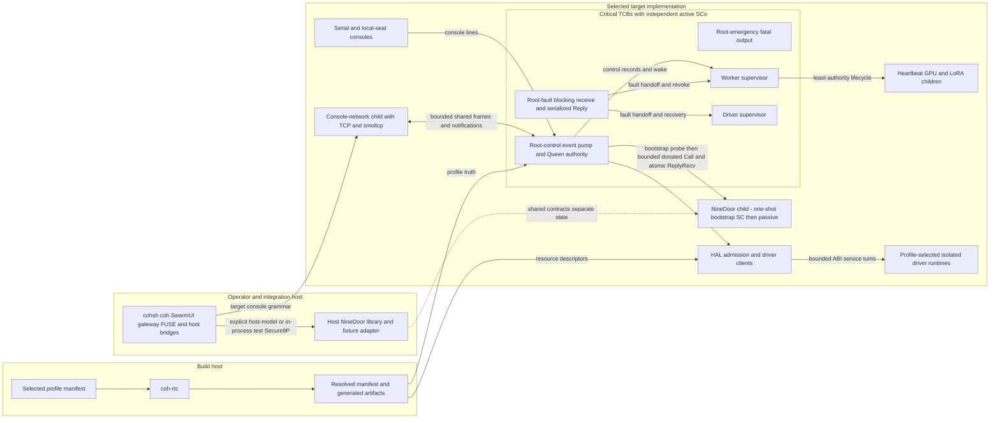

<!-- Copyright 2026 Lukas Bower -->
<!-- SPDX-License-Identifier: Apache-2.0 -->
<!-- Purpose: Describe the current Cohesix architecture, trust boundaries, components, and principal data flows. -->
<!-- Author: Lukas Bower -->

# Cohesix Architecture

This document owns the system-level view of Cohesix: trust boundaries, runtime
components, principal control and data flows, and the selected direction for
seL4 task and temporal isolation. Exact namespace contracts belong in
[INTERFACES.md](INTERFACES.md), Secure9P invariants in
[SECURE9P.md](SECURE9P.md), role policy in
[ROLES_AND_SCHEDULING.md](ROLES_AND_SCHEDULING.md), and physical-driver rules in
[DRIVERS.md](DRIVERS.md).

Readers new to Queen, Worker, NineDoor, and other Cohesix terms can start with
the [Glossary](GLOSSARY.md).

Architecture state is explicit throughout this document:

- **Current** means implemented by the selected checked-in profile and source.
  A current target claim still requires evidence for that exact target and
  artifact set.
- **Accepted** means the required immutable evidence exists for the exact
  profile, target, image, and proof class. Configuration, implementation,
  target acceptance, runtime-release acceptance, and production-use-case
  acceptance are different states.

## 1. Authority and evidence boundary

Cohesix is built from the tag-pinned upstream seL4 16.0.0 project. The selected
revision and complete source, toolchain, profile, and evidence provenance are
recorded with each qualified build. Target userspace is pure Rust `no_std`.

The selected profile manifest, its resolved manifest, and generated `coh-rtc`
outputs define generated interfaces, limits, feature gates, object topology,
and selected behavior. The checked-in default-profile snapshot is available in
[the generated manifest snippet](snippets/root_task_manifest.md); a target build
must use artifacts generated from its selected `configs/root_task*.toml` file.
The selected `SEL4_BUILD_DIR` supplies exact kernel headers, configuration,
object sizes, platform metadata, and timer truth.

### 1.1 Current implementation boundary

The selected source profiles define one four-core SMP+MCS architecture for QEMU
and Raspberry Pi 4. Exact budgets, object counts, capabilities, image identities,
and timer frequencies come from the selected manifest, resolved manifest, seL4
build outputs, and generated tables rather than this overview.

| Concern | Checked-in architecture | Evidence boundary |
| --- | --- | --- |
| Kernel | seL4 16.0.0 on AArch64 with SMP+MCS, per-core scheduling control, Reply objects, timeout-fault resources, and generated virtual-counter truth. | Configuration and compilation do not prove target execution or timing. |
| Root authority | The init TCB remains `root-control`; restricted root-fault, emergency, Worker-supervisor, and driver-supervisor duties have independent active scheduling contexts. | The exact image must prove progress, fault handling, and containment. |
| Namespace service | `nine-door-runtime` is a restricted passive child reached through a bounded donated Call/Reply chain after one compiler-budgeted bootstrap exchange. | Host NineDoor is a separate implementation and is not a transport to this child. |
| Console network | `console-network-runtime` owns target TCP, smoltcp, framing, and transport authentication; root receives only copied authenticated commands and returns bounded response records. | The public console grammar is unchanged and remains the only in-target TCP service. |
| Workers | Heartbeat, GPU, and LoRA are separately packaged executable roles with one generated slot each; WorkerBus remains model/session-only. | A declared slot or packaged image is not READY, runtime, teardown, or acceptance evidence. |
| Drivers | Selected physical devices use HAL-admitted isolated runtimes with fixed pointer-free ABIs and explicit temporal authority. | QEMU does not qualify Pi MMIO, DMA, IRQ, USB, display, GENET, SDIO, or CYW43 behavior. |
| Attestation | Current target metadata is deterministic `measurement_only` hashing with generated static authority material. | It is not TPM Quote, DICE, measured boot, device identity, or secret-unsealing evidence. |

See [Current Status](STATUS.md) for the public capability snapshot and
[Roles and Scheduling](ROLES_AND_SCHEDULING.md) for the temporal contract.
### 1.2 Evidence classes

Implementation and proof remain separate:

- Source, generated descriptors, and a staged image prove that a path can be
  built; they do not prove that a board booted that image.
- QEMU evidence proves the exact QEMU profile only.
- Fresh Pi evidence proves only the specifically observed behavior for its
  read-back-bound image and named boot/evidence set; it does not transfer to
  another image, boot, or target.
- Wired GENET, CYW43 Wi-Fi, USB/local-seat, serial, HDMI, driver-runtime,
  console, Worker, temporal-isolation, and benchmark proof remain independent
  ledgers.
- An upstream proof-eligibility profile proves only compatibility with the
  upstream verified-configuration preconditions. It is not a Cohesix kernel,
  Rust userspace, boot-path, hardware, DMA, SMP, or timing proof.

The selected AArch64 SMP+MCS configurations are not represented as tag-pinned
verified seL4 configurations. The seL4 16 caveats describe
AArch64 MCS verification as incomplete and SMP+MCS as less explored. Exact
QEMU and Pi acceptance is therefore mandatory, but it does not create a
formal-verification claim.

The active scope and proof requirements are normative in
[BUILD_PLAN.md](BUILD_PLAN.md). Boot-by-boot results are non-canonical evidence;
canonical claims point to the tracked plan, test contract, and archived
target-qualified artifacts.

## 2. Current design boundary

Cohesix is a control-plane operating system for secure orchestration and
telemetry of edge GPU nodes. It uses a Queen/Worker model and exposes bounded,
file-oriented control surfaces.

The complete target trusted software closure contains:

- the selected upstream seL4 kernel build;
- the Rust root task and compiler-generated policy tables; and
- manifest-declared physical-driver runtime images plus their fixed ABI.

Within that closure, the root task is the principal userspace authority domain.
Selected physical-driver runtimes are genuine seL4 compartments with restricted
CSpace/VSpace authority; they are not part of the root address space. This
distinction does not imply that a driver is untrusted for every device property
or that BCM2711 DMA is confined by an IOMMU.

The target does not contain CUDA, NVML, container runtimes, a POSIX emulation
layer, or general host integration stacks. GPU access, PEFT execution, REST
projection, FUSE, systemd, Docker, Kubernetes, federation, SIEM, and other
heavy ecosystems remain host-side. The only permitted in-target TCP listener
is the authenticated console.

### 2.1 Current components

| Component | Runtime | Current responsibility |
| --- | --- | --- |
| Upstream seL4 | Target kernel | Enforces objects, capabilities, address spaces, SMP+MCS scheduling contexts and budgets, Reply objects, timeout faults, notifications, IPC, interrupts, and kernel-generated platform truth. |
| `root-task` | Target, `no_std` | Owns BootInfo/untyped allocation, CSpace/VSpace bootstrap, HAL admission, event pumping, serial/local-seat/HDMI handling, Queen policy, Worker model state, audit/evidence, and fault supervision. On QEMU it retains the VirtIO NIC adapter but copies Ethernet frames and authorized response bytes through the isolated console-network ABI; it owns no smoltcp or TCP/auth parser there. Pi physical networking follows the manifest-declared isolated-driver boundary and requires independent hardware evidence. |
| `pi4-driver-*` | Pi 4 target, `no_std` child images | Own steady physical-device service behind HAL-admitted resources and the pointer-free driver-task ABI. |
| `nine-door-runtime` | Target, `no_std` child | Implements the bounded pointer-free namespace request/response ABI, shared-frame validation, typed operation preparation, cancellation/revoke handling, and a real seL4 MCS receive/atomic-`ReplyRecv` loop. The selected schema-1.14 QEMU root constructor retains the NineDoor contract introduced in 1.11 and carried through later schemas: it binds the selected ELF digest and W^X load plan, creates the child from its compiler-owned revoke anchor, retains a one-shot bootstrap SC and the dedicated fault-recovery Reply authority, and exposes only the bounded `Call` adapter. After one validated bootstrap exchange, the SC is unbound and the child is steady-state passive. Root remains the only Queen policy and namespace-mutation authority. A successful target check proves construction code and image identity, while a live selected-image QEMU boot remains the activation/containment evidence gate. |
| Executable Worker runtime and role/session model | Target children plus root/host projections | Root constructs suspended Heartbeat, GPU, and LoRA children from the compiler-owned image and authority inventory. Admission resumes exactly one selected role instance; READY gates publication; control, receipts, faults, teardown, and recreation retain exact five-part identity. WorkerBus remains model-only. |
| Host NineDoor library/fixture adapter | Host, `std` | Implements the Secure9P model used by host builds and in-process compatibility tests. It is not a packaged target transport or proof of a live host service. |
| `cohsh`, `coh`, SwarmUI, gateway, FUSE, GPU and provider bridges | Host | Provide host clients/adapters and execute only integrations whose selected implementation and observed mode are live; they do not create a new target authority path. |
| `coh-rtc` | Build host | Validates manifest IR and generates Rust tables, resolved manifests, policy defaults, scripts, and documentation snippets. |

The operational QEMU and Pi manifests mark `worker-heartbeat`, `worker-gpu`,
and `worker-lora` executable and require their endpoint, lifecycle,
notification, image, object, and temporal-authority records. `worker-bus` is the
only selected `model_only` role. Those declarations and packaged artifacts are
implementation truth, not proof that a particular image loaded, resumed, or
contained a Worker TCB. See
[ROLES_AND_SCHEDULING.md](ROLES_AND_SCHEDULING.md).

### 2.2 Current system boundary

```mermaid
flowchart LR
  subgraph BuildHost[Build host]
    Manifest[Selected profile manifest]
    Compiler[coh-rtc]
    Generated[Resolved manifest and generated artifacts]
    Manifest --> Compiler --> Generated
  end

  subgraph OperatorHost[Operator and integration host]
    HostClients[cohsh coh SwarmUI gateway FUSE and host bridges]
    HostNineDoor[Host NineDoor library and fixture adapter]
    HostClients -->|explicit host-model or in-process test Secure9P| HostNineDoor
  end

  subgraph Target[Selected target implementation]
    Serial[Serial and local-seat consoles]
    subgraph Critical[Critical TCBs with independent active SCs]
      EventPump[Root-control event pump and Queen authority]
      RootFault[Root-fault blocking receive and serialized Reply]
      Emergency[Root-emergency fatal output]
      WorkerSupervisor[Worker supervisor]
      DriverSupervisor[Driver supervisor]
    end
    ConsoleChild[Console-network child with TCP and smoltcp]
    NineDoorChild[NineDoor child - one-shot bootstrap SC then passive]
    Workers[Heartbeat GPU and LoRA children]
    Hal[HAL admission and driver clients]
    Drivers[Profile-selected isolated driver runtimes]

    Serial -->|console lines| EventPump
    ConsoleChild <-->|bounded shared frames and notifications| EventPump
    EventPump -->|bootstrap probe then bounded donated Call and atomic ReplyRecv| NineDoorChild
    EventPump -->|control records and wake| WorkerSupervisor
    RootFault -->|fault handoff and revoke| WorkerSupervisor
    WorkerSupervisor -->|least-authority lifecycle| Workers
    RootFault -->|fault handoff and recovery| DriverSupervisor
    EventPump --> Hal
    Hal -->|bounded ABI service turns| Drivers
  end

  Generated -->|profile truth| EventPump
  Generated -->|resource descriptors| Hal
  HostClients -->|target console grammar| ConsoleChild
  HostNineDoor -.->|shared contracts separate state| NineDoorChild
```

The dotted relationship is semantic parity, not a transport connection. Host
NineDoor and target `NineDoorBridge` are separate adapters with separate state.
There is no in-target 9P-over-TCP listener.

## 3. Current target execution model

### 3.1 Kernel and root authority

The current root task constructs seL4 objects, validates generated descriptors,
creates admitted service, Worker, and physical-driver address spaces, installs
their capabilities, and schedules bounded service work. Current source uses
untyped retype, guarded CNodes, CSpace derivation/revocation,
TCB/VSpace/ASID/IPC-buffer construction, endpoints, notifications, IRQs and
badges, fault and timeout endpoints, Reply objects, scheduling contexts,
per-core SchedControl, AArch64 mappings and cache maintenance, and MCS TCB
configuration.

Current implementation-level capability admission relies on a successful
bounded retype, the BootInfo CSpace window, and exact publication state.
`DebugCapIdentify` is optional telemetry; it cannot admit, reject, or recover a
capability.

The init TCB is the generated `root-control` owner and runs the authoritative
event loop. Root constructs four restricted active-SC children for root-fault,
root-emergency, Worker supervision, and driver supervision. The generated
fault registry is sealed before any service or Worker child resumes; root-fault
then becomes the sole receiver on one shared standard/timeout fault endpoint.
It blocks in `Recv` with one Reply object and resolves the exact badge and class
against the sealed registry after receive. The selected console child retains
its reserved timeout identity in that topology but does not install it as a TCB
timeout handler; its budget exhaustion uses native postponement instead.
Application service-turn and queue bounds remain mandatory beside
kernel-enforced MCS budgets. Live QEMU qualification must still prove
independent progress, console standard-fault containment, console
budget-exhaustion postponement, serialized Reply release, and containment for
the selected image.

### 3.2 Physical task isolation and memory authority

Manifest-declared physical-driver runtimes execute as separate seL4 tasks with
task-local address and capability spaces. Root delegates only generated
endpoint, notification, frame, shared-ring, IRQ, fault, and mapped-resource
authority. Pi profiles preflight root-CNode, slot, untyped, and mapping capacity
before partial child construction; the current Pi contract uses a 14-bit root
CNode.

Isolated child image plans reject effective W+X mappings. Code pages are
read-only and executable, non-code mappings are ExecuteNever, and writable root
aliases of executable frames are removed before child resume. Child-only
code/stack authority is transferred deliberately rather than left ambient.

Driver-task isolation is capability and address-space isolation. It is not a
claim that every device is protected from malicious DMA: the selected Pi DMA
profile remains `bounded-no-iommu`.

### 3.3 Current Worker and Queen execution model

Queen is root-task orchestration authority exposed through the console and
NineDoor control surfaces; it is not a separate host RPC service or target TCB.
The selected operational profiles expose executable Heartbeat, GPU, and LoRA
roles plus model-only WorkerBus. Root constructs each executable image as a
suspended, W^X, least-authority child with a dedicated active SC. A successful
admission request queues or resumes only its exact role instance; it is not a
READY receipt. Namespace publication follows the child's durable READY record,
and control/receipt completion is accepted only for the pinned role, slot,
logical lease epoch, supervisor generation, and capability generation.

A Worker ticket still does not prove execution by itself. `ATTACH` remains
session binding, not task creation. Direct target evidence must observe the
generated capabilities, notifications, scheduling authority, READY transition,
fault containment, complete teardown, stale-authority refusal, and
fresh-generation recreation before the corresponding runtime claim is
accepted.

### 3.4 Current timer and emergency-output qualification

Operational QEMU and Pi timing paths require the selected seL4 build's exported
virtual counter and generated frequency. The compiler and root build reject a
missing/zero clock, dummy/read-count timing, an MCS/profile mismatch, or a
hard-coded operational frequency fallback. Emergency output is a real selected
serial path; null/no-op serial remains fixture-only and cannot enter an
operational closure. Exact-image qualification must still observe the selected
clock, timeout, budget, and fatal-output paths rather than inferring them from
source or configuration.

### 3.5 Current identity and attestation qualification

When enabled, `apps/root-task/src/attest.rs` currently hashes public
policy-label and manifest-fingerprint data, labels the result from
configuration, and installs generated static ticket keys. It issues no TPM
command, nonce-bound Quote, device-bound DICE derivation, signature or chain
validation, measured-boot verification, or secret unsealing.

That output is deterministic `measurement_only` metadata. It does not establish
acceptable attested production ticket authority or satisfy a TPM, DICE,
`coh attest`, release, or production-use-case claim. Current code can still
publish/use its generated static authority material; that is the reopened
defect, not evidence of fail-closed attestation.

## 4. Control-plane paths

Cohesix has two distinct operator protocol families:

1. **Host-model or in-process Secure9P.** A client negotiates the bounded
   9P2000.L subset with the Host NineDoor library or fixture adapter. This path
   has state separate from a live target and cannot create or prove a target
   task.
2. **Target console grammar.** Serial carries console lines directly. TCP adds
   a four-byte little-endian length frame and transport authentication before
   the same bounded command grammar. Application `ATTACH` then selects a role
   and optional capability ticket.

Both adapters project overlapping namespace semantics, but they are not the
same wire protocol. Exact framing, operations, acknowledgements, and errors are
defined in [External Interfaces](INTERFACES.md). Internal task ownership does
not change these public authority paths.

Host REST, UI, GPU, PEFT, FUSE, sidecar, and federation tools are projections
over documented interfaces. They may validate, batch, perform host-only work,
or render data, but they cannot introduce target authority unavailable through
the underlying ticketed namespace or console operation.

## 5. Boot flow

The target boot sequence is profile-qualified:

1. Firmware and bootloader load the selected seL4 image. Pi 4 acceptance uses
   firmware → U-Boot → seL4 binary image; it does not depend on UEFI.
2. seL4 supplies BootInfo and generated kernel metadata to root-task.
3. Root validates the kernel/profile contract, establishes CSpace and VSpaces,
   selects the timer backend, and loads generated policy.
4. Root constructs the restricted namespace, console-network, fault,
   supervisor, Worker, and selected driver compartments from exact image and
   generated resource records. Children remain suspended until their admission
   and fault routes are ready.
5. HAL admits manifest-declared physical resources and starts selected driver
   runtimes. Owner state is credited only after runtime identity, resources,
   and service progress are proved.
6. Hardware and policy gates record their state. Emergency serial and bounded
   root diagnostics may remain available while hardware acceptance is red; a
   prompt is not device-acceptance evidence.
7. Root initializes the namespace bridge, log ring, and profile-enabled
   operator surfaces, then enters the bounded event pump. Executable Worker
   namespace state becomes live only after the exact child publishes READY.

Pi saved boot policy is loaded by the staged U-Boot script and passed through
bounded `/chosen/cohesix,*` properties. Saved policy may select or configure an
allowed network path, but it does not rewrite the compiled manifest. See
[Boot Reference](BOOT_REFERENCE.md) and
[Hardware Bring-up](HARDWARE_BRINGUP.md).

## 6. Principal data flows

### 6.1 Worker lifecycle and telemetry

An authorized Queen operation appends a bounded control record. Root validates
the role, ticket, lifecycle gate, generated slot, image identity, and resource
limits before the Worker supervisor may create or resume an executable child.
A successful spawn acknowledgement means only that the request was admitted;
namespace and telemetry publication begin after the exact
generation-stamped READY record.

Control and receipt results are pinned to role, slot, lease epoch, supervisor
generation, and capability generation. Kill, shutdown, fault, and construction
failure converge on one idempotent teardown that suspends execution, resolves
Reply state, clears records and signals, unbinds the scheduling context, unmaps
memory, revokes capabilities, and excludes the old generation before reuse.
Host NineDoor performs analogous role and namespace validation only against its
separate host-model or fixture state; it cannot create a target child.

The canonical telemetry path is:

`/shard/<label>/worker/<id>/telemetry`

The legacy `/worker/<id>/telemetry` alias exists only when the selected
manifest enables it.

### 6.2 GPU and PEFT control

`gpu-bridge-host` owns hardware discovery and CUDA/NVML interaction and
publishes bounded host namespace state. WorkerGpu and WorkerLora are
receipt-oriented target tasks; host executors continue to own GPU lease side
effects and PEFT/model lifecycle work. Root pins the exact live Worker identity
before accepting a correlated terminal result.

No host provider state independently proves Worker READY, and no Worker receipt
independently proves a real external side effect. See
[GPU Nodes](GPU_NODES.md) for this boundary.

### 6.3 Observability

Logs, pressure, session, scheduling, lease, ingest, task, fault, and evidence
state are exposed through bounded namespace nodes. The selected manifest gates
each generated provider. Exact paths and formats are defined in
[External Interfaces](INTERFACES.md); host UI and gateway consumers do not own
those schemas or raise the evidence level of their source.

## 7. Security invariants

- All target physical-device authority passes through HAL.
- Selected steady-state physical drivers are manifest-declared isolated
  runtimes; the Pi DMA claim remains `bounded-no-iommu`.
- Target code remains `no_std`; host capabilities and heavy ecosystems do not
  enter the target closure.
- Isolated child mappings are W^X, and executable frames retain no writable
  root alias when a child resumes.
- Capabilities, tickets, generated bounds, and lifecycle gates are checked
  before side effects.
- Secure9P, console grammar, Worker interfaces, and driver-task ABIs remain
  separate bounded interfaces.
- The target has no TCP listener except the authenticated console.
- Every active TCB has an admitted scheduling context, core, budget, and
  period; every passive TCB has an allowlisted donor, Reply, timeout, fault,
  cancellation, and recovery chain.
- `SchedControl` remains root-only, and kernel scheduling budgets do not
  replace application queue, byte, operation, or service-turn bounds.
- Root control, fault, emergency, Worker-supervisor, and driver-supervisor
  progress have independent reserves and an acyclic fault graph.
- Every live child has a complete capability, mapping, scheduling-context, and
  Reply teardown with stale-generation exclusion before reuse.
- Operational profiles contain no silent mock, dummy, stub, no-op, synthetic,
  or live-to-fixture fallback.
- Current measurement hashing is not hardware-backed attestation.
- Exact SMP+MCS target acceptance is not an upstream formal-verification claim.

## 8. Source map

- Public capability snapshot: [STATUS.md](STATUS.md)
- Scope and milestones: [BUILD_PLAN.md](BUILD_PLAN.md)
- Default generated profile summary:
  [snippets/root_task_manifest.md](snippets/root_task_manifest.md)
- Kernel profile contracts:
  [`configs/sel4/profiles.toml`](../configs/sel4/profiles.toml)
- Manifest inputs: [`configs/root_task.toml`](../configs/root_task.toml) and
  [`configs/root_task_pi4_uboot_aarch64.toml`](../configs/root_task_pi4_uboot_aarch64.toml)
- Root task: [`apps/root-task`](../apps/root-task)
- Host NineDoor: [`apps/nine-door`](../apps/nine-door)
- Physical-driver runtime:
  [`apps/pi4-driver-runtime`](../apps/pi4-driver-runtime)
- Driver ABI: [`crates/pi4-driver-abi`](../crates/pi4-driver-abi)
- Host-tool boundary: [HOST_TOOLS.md](HOST_TOOLS.md)
- GPU boundary: [GPU_NODES.md](GPU_NODES.md)
- Role and scheduling contract:
  [ROLES_AND_SCHEDULING.md](ROLES_AND_SCHEDULING.md)
- Manifest compiler: [`tools/coh-rtc`](../tools/coh-rtc)
- Validation and acceptance: [TEST_PLAN.md](TEST_PLAN.md)
