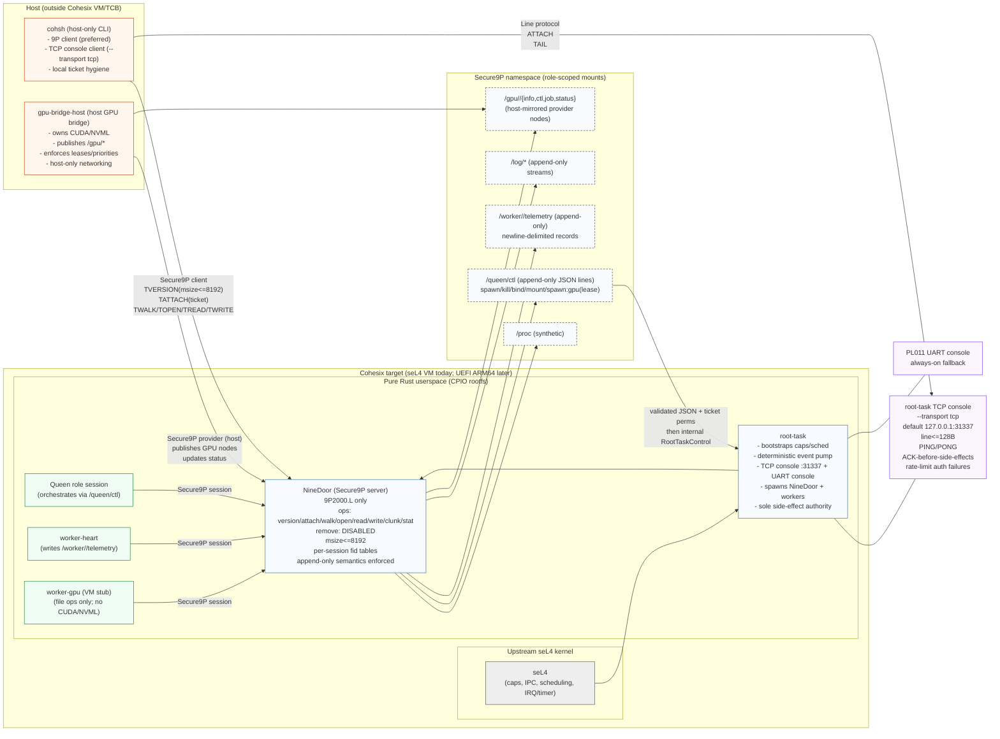

<!-- Author: Lukas Bower -->
# Cohesix Architecture Overview
Cohesix is designed for physical ARM64 hardware booted via UEFI as the primary deployment environment. Today’s reference setup runs on QEMU `aarch64/virt` for bring-up, CI, and testing, and QEMU behaviour is expected to mirror the eventual UEFI board profile.

**Figure 1.** Cohesix architecture overview.

## 1. System Boundaries
- **Kernel**: Upstream seL4 for `aarch64/virt (GICv3)`; treated as an external dependency that provides the capability system, scheduling primitives, and IRQ/timer services.
- **Userspace**: Entirely Rust, delivered as a CPIO rootfs containing the root task and all services.
- **Host Tooling**: macOS 26 (Apple Silicon M4) developer workstation running QEMU for validation, plus auxiliary host workers (e.g., GPU bridge) that communicate with the Cohesix instance over 9P or serial transports (the same transport model applies when running on physical hardware).

A single Cohesix deployment is a hive: one Queen process plus multiple workers sharing a Secure9P namespace.

The logical architecture—root-task, NineDoor, workers, Secure9P transports, GPU bridge—is hardware-agnostic. The current reference implementation runs on QEMU `aarch64/virt` for development and CI, and the roadmap brings this exact behaviour to UEFI-booted ARM64 hardware; VM semantics are expected to match the physical deployment profile.

## 2. High-Level Boot Flow
1. **seL4 Bootstraps** using the external elfloader and enters the Cohesix root task entry point.
2. **Root Task Initialisation**
   - Configures serial logging and prints the boot banner.
   - Reconstructs canonical init CSpace access (probe + init-root alias) before any mutable syscall, then walks `bootinfo.empty`
     to plan untyped retypes and capability consumption. 【F:apps/root-task/src/kernel.rs†L640-L718】
   - Publishes the root endpoint before any IPC attempt and routes all calls through guarded helpers that refuse to touch seL4 syscalls until the endpoint is live. 【F:apps/root-task/src/kernel.rs†L760-L833】【F:apps/root-task/src/sel4.rs†L74-L154】
   - Maps PL011 early, brings up the UART driver, and logs the resolved vaddr/slot before switching the logger to userland. 【F:apps/root-task/src/kernel.rs†L1119-L1217】
   - Establishes a periodic timer and registers IRQ handlers.
   - Constructs the cooperative event pump that rotates through serial RX/TX, timer ticks, networking polls (behind the `net`
     feature), and IPC dispatch without relying on busy waits; enters it after announcing the root console endpoint and TCP listener when enabled. 【F:apps/root-task/src/kernel.rs†L1474-L1565】
3. **Service Bring-up**
   - Spawns the **NineDoor** 9P server task and hands it the root capability set.
   - Registers static providers that expose `/proc`, `/queen`, `/log`, and the worker namespace.
4. **Operational State**
   - Queen and worker processes attach through NineDoor, exchanging capability tickets that encode their role and budgets.
   - The queen drives orchestration by appending JSON commands to `/queen/ctl`.
 - Telemetry and logs are streamed through append-only files in `/worker/<id>/telemetry` and `/log/queen.log`.
  - Remote operators attach via the TCP-backed console (`cohsh --transport tcp`) which mirrors serial semantics while applying
    heartbeat-driven keep-alives and exponential back-off so networking stalls cannot starve the event pump.

### Bootstrap CSpace Addressing

- All bootstrap `seL4_CNode_*` calls use the kernel-advertised radix depth so the init thread's single-level CSpace resolves correctly: `dest_root = seL4_CapInitThreadCNode`, `dest_depth = initThreadCNodeSizeBits`, and `dest_offset = 0`. Only the `dest_index` varies per allocation.
- Source capabilities for mint/copy/move mirror the same tuple with `src_depth = initThreadCNodeSizeBits`, ensuring the kernel traverses the root CNode using the declared radix.
- Untyped retypes reuse the same addressing policy; the destination tuple is `(root = seL4_CapInitThreadCNode, index = <slot>, depth = initThreadCNodeSizeBits, offset = 0)` so retypes stay aligned with the bootinfo metadata.
- Bootstrapping begins with a smoke copy of the init TCB capability into `bootinfo.empty.start`, confirming that the canonical addressing policy succeeds before any mutable capability traffic occurs.
- The bootstrap allocator derives `init_cnode_bits` and the empty window directly from `BootInfo`, asserting that every destination slot satisfies `slot < 2^{init_cnode_bits}` before issuing the syscall. Violations panic before touching the kernel, eliminating decode-time ambiguity.
- The kernel-seeded slots are treated as reserved exactly as listed in Table 9.1 of `seL4/seL4-manual-latest.pdf` (`seL4_CapNull` through `seL4_CapInitThreadSC`, plus Arm’s optional `seL4_CapSMC`), so the allocator only consumes indices from the advertised `bootinfo.empty` window onward.【F:apps/root-task/src/sel4.rs†L120-L142】
- Diagnostic logs for Copy → Mint → Retype include the exact `(index, depth, offset, badge)` tuple so regressions surface in
  the boot transcript immediately.

## 3. Component Responsibilities
### Root Task (crate: `root-task`)
- Owns seL4 initial caps, configures memory, and manages scheduling budgets.
- Provides a minimal RPC surface to NineDoor for spawning/killing tasks and for timer events.
- Enforces budget expiry (ticks, ops, ttl) and revokes capabilities on violation.
- Pre-seeds the device and DMA windows with translation tables so device mappings never trigger `seL4_FailedLookup` (error 6)
  when the kernel installs frames for peripherals.
- Exposes a deterministic event pump (`event::EventPump`) that coordinates serial, timer, networking, and IPC tasks. The pump
  emits structured audit lines whenever subsystems are initialised and ensures each poll cycle services every source without
  revisiting the legacy spin loop.
- Hosts the deterministic networking stack (`net::NetStack`) which wraps smoltcp behind a HAL-provided NIC abstraction. RTL8139
  (the default `dev-virt` backend) and the feature-gated virtio-net driver both rely on `KernelHal` for device mappings, DMA
  frames, and diagnostics; `NetworkClock` advances in timer-driven increments.
- Provides the PL011-backed serial façade (`serial::pl011` + `console::Console`) that powers the always-on root shell
  when `serial-console` is enabled. Input/output is line-buffered with bounded heapless queues and UTF-8
  normalisation shared with the TCP transport.
- Runs the serial/TCP console loop (`console::CommandParser`) which multiplexes authenticated commands (`help`, `attach`, `tail`,
  `log`, `spawn`, `kill`, `quit`) alongside timer and networking events inside the root-task scheduler. Capability validation is
  driven by a deterministic ticket table (`event::TicketTable`) that records bootstrap secrets, and an acknowledgement dispatcher
  emits `OK <verb>` / `ERR <verb>` lines across both transports before side effects fire so automation can align with root-task
  state transitions.【F:apps/root-task/src/event/mod.rs†L329-L360】
- Designs the capability distribution and event pump sequencing to support one Queen orchestrating many workers rather than a single privileged process.

### NineDoor 9P Server (crate: `nine-door`)
- Implements the Secure9P codec/core stack and publishes the synthetic namespace.
- Delegates permission checks to a role-aware `AccessPolicy` using capability tickets minted by the root task.
- Tracks per-session state (fid tables, msize) and ensures append-only semantics on log/telemetry nodes.
- Presents the shared hive namespace so queen and worker mounts reflect their orchestration roles.

### Workers (crate family: `worker-*`)
- Spawned by queen commands; each worker receives a ticket describing its role and budget, and remains capability-limited to its
  assigned mounts.【F:docs/ROLES_AND_SCHEDULING.md†L4-L17】
- Communicate exclusively through their mounted NineDoor namespace—no raw IPC between workers; queen keeps orchestration state
  in `/queen` while worker-heart processes stick to `/worker/<id>`.
- Heartbeat workers emit periodic telemetry; worker-gpu stubs exist for future host-bridge coordination but stay isolated from
  queen mounts beyond their lease scopes.
- The Queen role drives one-to-many worker orchestration through `/queen/ctl`, creating, configuring, and revoking multiple worker instances within the hive.

### Control Surfaces
- `cohsh` is the canonical operator shell for the hive, speaking the same console and NineDoor verbs over serial or TCP transports.
- Automated systems are expected to embed `cohsh` or speak the same protocol when issuing hive orchestration commands.
- A future host-side WASM GUI is planned as a hive dashboard that wraps the `cohsh` protocol; it introduces no new in-VM control channel.

### Networking Stack and HAL Boundary
- The HAL (`KernelHal` implementing the `Hardware` trait) is the sole entry point for device mappings, DMA frame allocation, and
  device coverage bookkeeping. NIC drivers invoke these helpers instead of touching physical addresses directly so snapshot and
  diagnostics paths remain coherent.
- Both NICs in tree (RTL8139 for `dev-virt`, virtio-net as an experimental alternate) implement a small `NetDevice` trait and plug
  into the smoltcp-backed `NetStack`. The stack remains NIC-agnostic: it consumes MAC address, link telemetry, and RX/TX tokens but
  never inspects device registers.
- TCP console traffic flows NIC driver → `NetStack` (smoltcp) → TCP console server → shared console runtime. Backend choice is a
  HAL concern; console authentication and verb parsing stay identical regardless of NIC.

### Host GPU Bridge (future, crate: `gpu-bridge`)
- Runs **outside** the VM, using NVML/CUDA to manage real hardware.
- Mirrors GPU control surfaces into the Cohesix instance (QEMU during development, physical hardware in deployment) via a 9P transport adapter (`secure9p-transport::Tcp` on the host side only).
- Maintains lease agreements and enforces memory/stream quotas independent of the VM profile.

## 4. Namespaces & Mount Tables
- Each session is mounted according to role:
  - **Queen**: `/`, `/queen`, `/proc`, `/log`, `/worker/*`, `/gpu/* (future)`.
  - **WorkerHeartbeat**: `/proc/boot`, `/worker/self/telemetry`, `/log/queen.log (read-only)`.
  - **WorkerGpu (future)**: Worker heartbeat view + `/gpu/<lease>/*` nodes.
- Mount tables keep `/queen`, `/worker/<id>`, `/log`, and `/gpu/*` isolated so worker processes cannot traverse queen control or
  other worker directories even when sharing a NineDoor transport.【F:docs/ROLES_AND_SCHEDULING.md†L4-L17】
- `bind` and `mount` operations are implemented via per-session mount tables maintained by NineDoor. Operations are scoped to a single path (no union mounts) and require queen privileges.

## 5. Capability & Role Model
- **Ticket**: 32-byte capability minted by the root task, bound to `{role, budget, mounts}`.
- **Session**: Contains ticket, negotiated `msize`, fid allocator, and mount table.
- NineDoor verifies every `walk`/`open`/`write` call against the ticket role and append/read mode before delegating to the provider.

## 6. Data Flow Highlights
- **Queen Control**: Append JSON commands to `/queen/ctl`; NineDoor forwards valid commands to root-task orchestration APIs.
- **Telemetry**: Workers append newline-delimited status records to `/worker/<id>/telemetry`. NineDoor enforces append-only semantics by ignoring offsets.
- **Logging**: Root task and queen append to `/log/queen.log`; workers read logs read-only for situational awareness.
- **GPU Integration (future)**: Host bridge exposes GPU metadata/control/job/status nodes; WorkerGpu instances mediate job submission and read back status via NineDoor.

## 7. Networking & Console Integration
- The root shell always runs on the PL011 UART when the `serial-console` feature is enabled, presenting the `cohesix>` prompt
  for low-level debug, bootinfo inspection, and capability sanity checks. It is intended as the non-negotiable bring-up path
  and remains active regardless of other transports.【F:apps/root-task/src/userland/mod.rs†L27-L120】
- When the `net` and `net-console` features are enabled, a TCP-backed console listener starts alongside the PL011 console. It
  speaks the same command parser, accepts `cohsh --transport tcp` sessions over the NineDoor-compatible protocol, and is
  required to remain non-blocking so it cannot interfere with root shell input or event-pump cadence.【F:apps/root-task/src/net/console_srv.rs†L1-L134】
- Both consoles run concurrently; remote access is additive rather than a replacement, ensuring local serial recovery remains
  available even when TCP listeners are present.【F:apps/root-task/src/kernel.rs†L1474-L1565】
- The networking substrate uses HAL-provided NICs (`NetDevice`) backed by fixed-size DMA frames rather than ad-hoc mappings. RTL8139
  is the default backend for `dev-virt` while virtio-net remains feature-gated for experiments. smoltcp provides the IPv4/TCP stack
  and the HAL boundary allows future hardware drivers to plug in without touching console or parser logic. The module is
  feature-gated (`--features net`) so developers can defer the footprint when working on console-only flows. The event pump owns the
  smoltcp poll cadence and publishes link status metrics into the boot log.
- The console loop multiplexes serial input and TCP sessions. A shared finite-state parser enforces maximum line length,
  exponential back-off for repeated authentication failures, and funnels all verbs through capability checks before invoking
  NineDoor or root-task orchestration APIs. Sanitised console lines are counted once in the event-pump metrics so `/proc/boot`
  can expose console pressure regardless of transport. TCP transports mirror the parser exactly, emitting `PING`/`PONG`
  heartbeats every 15 seconds (configurable) and logging reconnect attempts so host operators can correlate transient drops with
  root-task audit lines. Every command generates a deterministic acknowledgement (`OK`/`ERR`) broadcast to serial and TCP clients
  so operators can script against shared semantics without guessing event timing.【F:apps/root-task/src/event/mod.rs†L329-L360】【F:apps/root-task/src/net/queue.rs†L526-L559】
- Root-task’s event pump advances the networking clock on every timer tick, services console input, and emits structured log
  lines so host tooling (`cohsh`) can mirror state over either serial or TCP transports while timers and IPC continue to run.

`cohsh` is a host-only CLI: it never executes inside the VM or QEMU guest, instead running on macOS and connecting over the TCP
transport (or wrapping a local QEMU subprocess via the `qemu` transport) using the NineDoor protocol, and the same host-driven
posture applies when Cohesix runs on physical hardware. It mirrors the root shell command set but keeps orchestration off-VM,
matching the build instructions in `docs/USERLAND_AND_CLI.md`. 【F:apps/cohsh/src/main.rs†L44-L132】

## 8. Reliability & Security Considerations
- Minimal trusted computing base: no POSIX layers, no TCP servers inside the VM, no dynamic loading.
- All inter-process communication is file-based via 9P; no shared memory between workers.
- Timer and watchdog infrastructure ensures runaway workers are revoked cleanly.
- NineDoor core is `no_std + alloc` capable, allowing potential reuse in bare-metal contexts.

## 9. Roadmap Dependencies
- **Milestone alignment**: Architecture is realised incrementally per `BUILD_PLAN.md` milestones.
- **Documentation as Source of Truth**: Changes to components or interfaces must be reflected here to avoid drift.

## 10. Milestone 7 Migration Notes
- **Event pump adoption**: Developers upgrading from the legacy spin loop
  must initialise the `event::EventPump` in `kernel_start` and remove any
  ad-hoc busy waits. The pump now owns serial, timer, networking, and IPC
  poll cadence; new subsystems must register via typed handlers so audits
  continue to show `event-pump: init <subsystem>` lines during boot.
- **Serial driver integration**: The virtio-console façade replaces
  direct PL011 shims. It exposes heapless RX/TX queues and atomic
  back-pressure counters. Tests should exercise the shared console parser
  via `cargo test -p root-task console_auth` to confirm UTF-8
  sanitisation, rate limiting, and audit logging remain intact.
- **Networking feature flag**: The deterministic smoltcp glue is guarded
  by `--features net`. Enable the flag before touching networking code
  and run `cargo check -p root-task --features net` plus
  `cargo clippy -p root-task --features net --tests` to validate bounded
  queue usage. Disable the feature for serial-only builds to keep the
  baseline footprint minimal.
- **Integration workflow**: `scripts/qemu-run.sh --console serial --net`
  exercises the complete Milestone 7 event pump (serial + networking).
  Pair it with `tests/integration/qemu_tcp_console.rs` to confirm the TCP
  transport stays responsive while timers and NineDoor services continue
  to operate.

## 11. Manifest Compiler & As-Built Guarantees
- **Single manifest**: Beginning with Milestone 8, the root task, docs,
  and CLI scripts are generated from `root_task.toml` via the
  `tools/coh-rtc` compiler. The manifest encodes architecture profile,
  Secure9P bounds, provider topology, ticket policies, and feature gates
  that keep VM artefacts `#![no_std]`.
- **Validation**: The compiler enforces red lines (walk depth ≤ 8,
  `msize ≤ 8192`, no `..`, no fid reuse, capability scoping) and refuses
  manifests that would require `std`, exceed memory budgets, or enable
  unimplemented transports. Generated Rust modules carry `#![no_std]`
  annotations and are formatted deterministically to support reproducible
  builds and compliance audits.
- **Docs-as-built**: Architecture, interfaces, and security documents
  ingest compiler snippets (CBOR schemas, `/proc` layouts, concurrency
  knobs, hardware tables). CI compares manifest fingerprints and embedded
  excerpts to guarantee documentation reflects the running system. At
  release time, tools/coh-rtc regenerates Markdown fragments (e.g., `/proc`
  layout, concurrency knobs, CBOR schemas) and injects them into
  `docs/INTERFACES.md` and `docs/SECURE9P.md`, ensuring each release
  candidate’s documentation matches the compiled manifest exactly.
- **Policy export**: Compiler outputs `out/manifests/*.json` and
  operator policy files consumed by `cohsh`, enabling deterministic
  session pooling, retry budgets, and future hardware profiles without
  editing runtime code.

## 12. Hardware Trajectory & Host/Worker Sidecar Pattern
- **UEFI readiness**: Later milestones introduce an aarch64 UEFI loader
  that boots the generated manifest on physical hardware without a VM.
  The loader maps UART/NET MMIO regions defined in the manifest,
  initialises the same event pump, and emits attestation records to
  `/proc/boot`. Secure Boot measurements cover generated artefacts,
  ensuring retail, industrial, and defense deployments can trust the
  runtime state.
- **Device identity**: TPM (or DICE) integration seals ticket seeds and
  records boot hashes. NineDoor exposes attestation logs via read-only
  files so host tooling and operators can verify provenance before
  enabling privileged commands.
- **Host/Worker sidecar pattern**: *Sidecars* are auxiliary processes that
  run **outside the seL4 VM** whenever possible (on the host or another
  container). Each sidecar exposes its namespace into the VM **over 9P**
  using the same security model as internal providers. Only lightweight
  control stubs or schedulers (e.g., LoRa duty-cycle timers) execute
  **inside** the VM under strict manifest quotas to preserve a lean,
  deterministic TCB.
- **Lifecycle & discovery**: Sidecar mounts and capability scopes are
  declared in the **manifest**; the **host launcher** inspects the
  manifest at boot, spawns or connects required sidecars, and only then
  hands control to the root task. This keeps deployment topology in
  lockstep with what the compiler planned.
- **Common bridge trait (optional)**: All sidecars conform to a shared
  trait surface (e.g., `sidecar::ProviderBridge`) so new buses (MODBUS,
  DNP3, CAN, LoRa) can be added without modifying the VM.
- **Budget discipline**: Sidecar-related workers are feature-gated and
  bound by manifest quotas so the event pump remains deterministic even
  under constrained links. Host tooling validates dependencies before
  enabling sidecars, preventing drift between planned and deployed
  topologies.

## Future Notes (post–Milestone 7c)
- Event loop unification and shared transport polling land in later Milestone 7d/7e work to remove remaining spin-based fallbacks.【F:docs/BUILD_PLAN.md†L218-L340】
- Worker lifecycle automation (spawn/kill, budget expiry) is scheduled for the post-7c scheduler hardening tasks in the build plan.【F:docs/BUILD_PLAN.md†L218-L340】
- GPU node expansion follows the Milestone 6/8 host-bridge roadmap, keeping VM-side worker-gpu stubs minimal until host leases are available.【F:docs/BUILD_PLAN.md†L120-L135】
