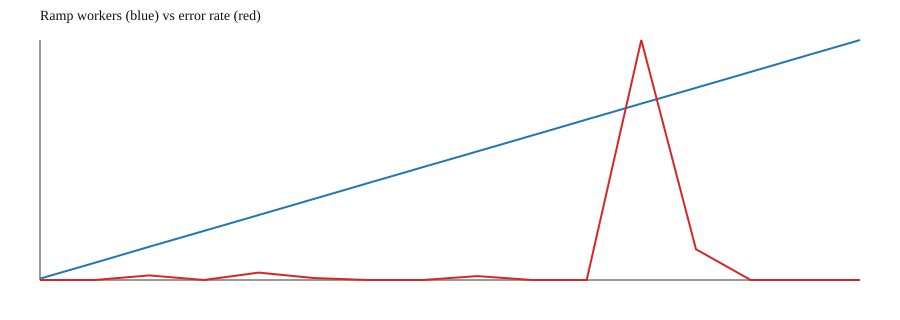
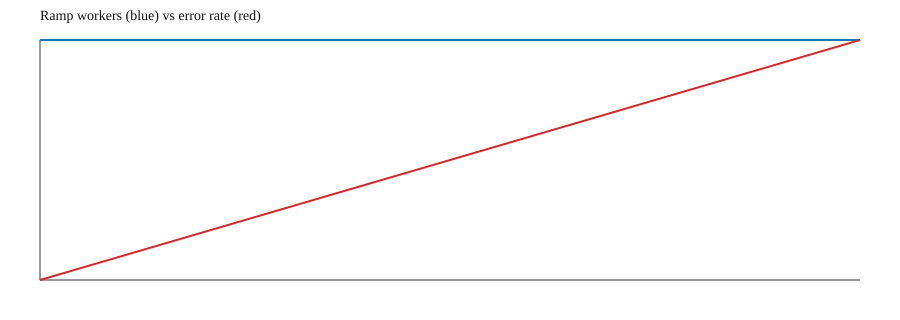
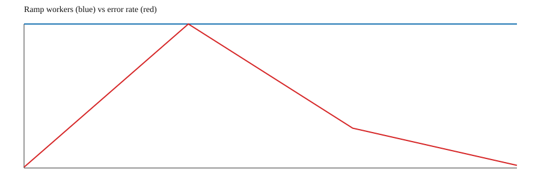

<!-- Copyright 2026 Lukas Bower -->
<!-- SPDX-License-Identifier: Apache-2.0 -->
<!-- Purpose: Document Cohesix benchmark evidence, limits, and Pi 4 benchmark proof requirements. -->
<!-- Author: Lukas Bower -->
# Cohesix Benchmarks

## Milestone 26a/26b Pi 4 Benchmark Status (Reopened Scope)

The Milestone 26a/26b performance and concurrency scope is reopened for Pi 4
GENET, CYW43455 Wi-Fi, USB local-seat, and serial coexistence. The committed
`docs/bench/` evidence below is still valid for the Milestone 25 QEMU/gateway
capacity questions it records, but it is not fresh Pi 4 benchmark parity proof.

Current Pi 4 acceptance requires separate artifacts for:

1. QEMU raw-TCP plus `hive-gateway` baseline.
2. Pi 4 wired GENET through the authenticated TCP console.
3. Pi 4 Wi-Fi through the authenticated TCP console after M1/M3, DHCP, and
   `netstats` prove the same boot is actually on Wi-Fi.

For Pi 4 hardware runs, keep the harness strict and bind the result to the live
board evidence directory:

```sh
python3 scripts/rest_perf_harness.py simulate \
  --no-qemu \
  --tcp-host <PI4_GENET_OR_WIFI_IP> \
  --tcp-port 31337 \
  --auth-token <console-auth-token> \
  --request-auth-token <rest-request-auth-token> \
  --gateway-pool-control-sessions 2 \
  --gateway-pool-telemetry-sessions 8 \
  --duration-mins 1 \
  --workers-min 1 \
  --workers-max 1 \
  --intensity-min 1 \
  --intensity-max 1 \
  --error-budget-rate 0.01 \
  --no-retries
```

Use `--qemu-run <script>` instead of `--no-qemu` only for the QEMU baseline.
Do not promote code-only checks, old QEMU/gateway summaries, or a post-flash
boot log without matching `rest_perf_harness.py` output into Pi 4 performance
closure.

## 0.9.0-beta Benchmark Verdict (As-Built)
- **Worker-capacity benchmark:** PASS for the `1500` hard cap in real VM/TCP/gateway mode (Milestone 25b evidence under `docs/bench/`).
- **Large-telemetry reliability gate:** PASS for all required no-retry scenarios (`telemetry-1mb`, `telemetry-10mb`, `telemetry-100mb`, `telemetry-1gb`) with `error_budget_rate=0.01` (Milestone 25f evidence under `logs/rest_bench_20260217T*.summary.json`).
- **Methodology alignment:** PASS against `docs/TEST_PLAN.md` section `6b` (no mock mode, no retries, fast-ramp, explicit error-budget checks).

## Hive-Gateway Worker Capacity (Milestone 25b)

### Executive Summary
- Hard worker-cap configuration was uplifted from `1000` to `1500` in the runtime path used by `hive-gateway`.
- Fixed-cap validation at `1500` workers completed successfully (`worker_cap=null`, no capacity-stop event).
- Under aggressive average activity, the first measurable control-plane backpressure event (`HTTP 429`) appeared at ~`1034` workers in the ramp profile.
- The practical operating envelope depends on workload profile:
  - Moderate profile: `1500` workers is validated.
  - Aggressive profile: reliability starts to degrade around `~1000-1200` due to gateway-side backpressure.

### Benchmark Questions
1. Are hard worker limits above 1000 truly removed in the real VM/TCP/auth path?
2. What is the new validated hard capacity limit?
3. At what worker count does aggressive mixed activity show first degradation?

### Test Validity Controls
All reported runs used real end-to-end execution:
1. QEMU boot success.
2. TCP reachability and authenticated console preflight success.
3. Gateway readiness checks (`/v1/meta/*`, `LS /`).
4. Authenticated REST traffic through `hive-gateway`.

No `--mock` mode was used for reported results.

### Runtime/Config Changes Under Test
- `apps/root-task/src/ninedoor.rs`
  - `MAX_WORKERS` raised to `1500`.
- `scripts/rest_perf_harness.py`
  - `--workers-min/--workers-max` clamp raised to `1500`.
- Heap note:
  - A temporary attempt to raise heap to `4 MiB` caused rootserver/elf-loader overlap at boot on current load addresses.
  - Final validated configuration remains `2 MiB` heap (`apps/root-task/sel4.ld`, `apps/root-task/src/alloc.rs`) with `MAX_WORKERS=1500`.

### Environment
- Host: macOS ARM64
- VM: QEMU `aarch64/virt`, `-m 1024`, `-smp 4,cores=4,threads=1,sockets=1`
- Console transport: TCP `127.0.0.1:31337`
- Gateway: `target/debug/hive-gateway`
- Harness: `scripts/rest_perf_harness.py --mode simulate`
- Workload formula: `rps = base_rps * intensity * active_workers`

### Run Matrix
| Run ID | Purpose | Key Params | Artifact Prefix |
| --- | --- | --- | --- |
| `RAMP-1K` | Baseline (prior validated cap) | `workers=8..1000`, `intensity=4`, `duration=8m` | `docs/bench/m25b_1k_rerun_20260213T233420Z` |
| `FIXED-1K` | Baseline hard-cap proof | `workers=1000`, `intensity=1`, `duration=1m` | `docs/bench/m25b_1k_rerun_fixed1000_20260213T234240Z` |
| `RAMP-1P5K` | New-cap degradation mapping | `workers=8..1500`, `intensity=4`, `duration=8m` | `docs/bench/m25b_1p5k_ramp_20260214T020554Z` |
| `FIXED-1P5K` | New hard-cap proof | `workers=1500`, `intensity=1`, `duration=1m` | `docs/bench/m25b_1p5k_fixed1500_v2_20260214T020432Z` |
| `FIXED-1200-I4` | Aggressive sustained check | `workers=1200`, `intensity=4`, `duration=2m` | `docs/bench/m25b_1p5k_fixed1200_i4_20260214T021516Z` |

### Results
| Metric | `RAMP-1K` | `FIXED-1K` | `RAMP-1P5K` | `FIXED-1P5K` | `FIXED-1200-I4` |
| --- | --- | --- | --- | --- | --- |
| `worker_cap` | `null` | `null` | `null` | `null` | `null` |
| Max workers observed | `938` | `1000` | `1407` | `1500` | `1200` |
| Overall ops | `61,293` | `4,222` | `72,223` | `7,356` | `27,548` |
| Overall errors | `5` (`0.0082%`) | `1` (`0.0237%`) | `166` (`0.2298%`) | `5` (`0.0680%`) | `113` (`0.4102%`) |
| Overall p95 latency | `0.0061s` | `0.0045s` | `0.1012s` | `0.0061s` | `0.1684s` |
| First step `err_rate >= 1%` | none | none | `1034 workers (2.9995%)` | none | `1200 workers (1.6412%)` |

### Degradation Analysis
- No VM worker-cap stop occurred at the new configuration cap (`1500`).
- The dominant high-load failure mode is gateway-side backpressure (`HTTP 429`), not root-task worker-cap exhaustion.
- In `RAMP-1P5K`, first 429 appears at `1034` workers:
  - `2026-02-14T02:11:33Z` (`schedule_write`, `/v1/fs/echo`).
- In `FIXED-1200-I4`, sustained 429 bursts are present; `schedule_write` is the largest error contributor (`52` errors).
- Legacy low-frequency `invalid-payload` control errors still appear, but they are not the primary scale limiter.

### Capacity Interpretation
- **Validated hard cap (current build): `1500` workers.**
  - Evidence: `FIXED-1P5K` run reached and sustained 1500 with `worker_cap=null`.
- **Estimated practical operating envelope (aggressive profile): `~1000-1200` workers.**
  - Above this range, gateway 429 backpressure appears and p95 latency inflates.
- **Recommendation:** keep hard cap at `1500` now, but treat `~1100` as the conservative aggressive-load SLO target until gateway rate-control and queueing are tuned.

### Graphs
- Generation method: `scripts/rest_perf_harness.py` `simulate` mode writes `*.ramp.svg` via `write_ramp_svg(...)` from each run's `ramp` rows in `*.summary.json`.
- `RAMP-1P5K`: `docs/bench/m25b_1p5k_ramp_20260214T020554Z.ramp.svg`
- `FIXED-1P5K`: `docs/bench/m25b_1p5k_fixed1500_v2_20260214T020432Z.ramp.svg`
- `FIXED-1200-I4`: `docs/bench/m25b_1p5k_fixed1200_i4_20260214T021516Z.ramp.svg`







### Evidence Index
- `docs/bench/m25b_1k_rerun_20260213T233420Z.summary.json`
- `docs/bench/m25b_1k_rerun_fixed1000_20260213T234240Z.summary.json`
- `docs/bench/m25b_1p5k_ramp_20260214T020554Z.summary.json`
- `docs/bench/m25b_1p5k_fixed1500_v2_20260214T020432Z.summary.json`
- `docs/bench/m25b_1p5k_fixed1200_i4_20260214T021516Z.summary.json`
- `docs/bench/m25b_1p5k_ramp_20260214T020554Z.ramp.csv`
- `docs/bench/m25b_1p5k_fixed1500_v2_20260214T020432Z.ramp.csv`
- `docs/bench/m25b_1p5k_fixed1200_i4_20260214T021516Z.ramp.csv`

### Repro Commands
```bash
# Clean stale benchmark processes first
pkill -f "rest_perf_harness.py|qemu-system-aarch64|hive-gateway --bind" || true

# Ramp to new cap (aggressive profile)
python3 scripts/rest_perf_harness.py \
  --mode simulate \
  --qemu-run /tmp/cohesix-qemu-local-smp.sh \
  --gateway-bin target/debug/hive-gateway \
  --auth-token bootstrap \
  --request-auth-token stage4-rest-token \
  --workers-min 8 --workers-max 1500 \
  --intensity-min 4 --intensity-max 4 \
  --duration-mins 8 --base-rps 0.1 --max-inflight 64 \
  --summary-max-error-lines 2000 \
  --qemu-log logs/bench/m25b_1p5k_ramp.qemu.log \
  --gateway-log logs/bench/m25b_1p5k_ramp.gateway.log \
  --log-prefix m25b_1p5k_ramp

# Fixed hard-cap validation
python3 scripts/rest_perf_harness.py \
  --mode simulate \
  --qemu-run /tmp/cohesix-qemu-local-smp.sh \
  --gateway-bin target/debug/hive-gateway \
  --auth-token bootstrap \
  --request-auth-token stage4-rest-token \
  --workers-min 1500 --workers-max 1500 \
  --intensity-min 1 --intensity-max 1 \
  --duration-mins 1 --base-rps 0.1 --max-inflight 64 \
  --summary-max-error-lines 2000 \
  --qemu-log logs/bench/m25b_1p5k_fixed1500_v2.qemu.log \
  --gateway-log logs/bench/m25b_1p5k_fixed1500_v2.gateway.log \
  --log-prefix m25b_1p5k_fixed1500_v2

# Aggressive fixed-load check
python3 scripts/rest_perf_harness.py \
  --mode simulate \
  --qemu-run /tmp/cohesix-qemu-local-smp.sh \
  --gateway-bin target/debug/hive-gateway \
  --auth-token bootstrap \
  --request-auth-token stage4-rest-token \
  --workers-min 1200 --workers-max 1200 \
  --intensity-min 4 --intensity-max 4 \
  --duration-mins 2 --base-rps 0.1 --max-inflight 64 \
  --summary-max-error-lines 2000 \
  --qemu-log logs/bench/m25b_1p5k_fixed1200_i4.qemu.log \
  --gateway-log logs/bench/m25b_1p5k_fixed1200_i4.gateway.log \
  --log-prefix m25b_1p5k_fixed1200_i4
```

## Large-Telemetry Reliability Gate (Milestone 25f, 0.9.0-beta)

### Required Methodology (from `docs/TEST_PLAN.md` section 6b)
- Real QEMU + real TCP console + real `hive-gateway` (no mock mode).
- `--no-retries --fast-ramp --error-budget-rate 0.01`.
- Required scenarios:
  - `telemetry-1mb`
  - `telemetry-10mb`
  - `telemetry-100mb`
  - `telemetry-1gb`
- Pass criteria:
  - exit code `0`;
  - `error_budget_pass=true`;
  - `error_rate <= 0.01`;
  - `no_retries=true`;
  - `fast_ramp=true`;
  - `scenario` matches the preset.

### Local 0.9.0-beta Results (latest run per scenario)
| Scenario | Summary Artifact | Ops | Errors | Error Rate | p95 Latency | Error Budget |
| --- | --- | --- | --- | --- | --- | --- |
| `telemetry-1mb` | `logs/rest_bench_20260217T223323Z.summary.json` | `7906` | `0` | `0.0000%` | `0.0277s` | `PASS` |
| `telemetry-10mb` | `logs/rest_bench_20260217T223635Z.summary.json` | `7911` | `0` | `0.0000%` | `0.0278s` | `PASS` |
| `telemetry-100mb` | `logs/rest_bench_20260217T223949Z.summary.json` | `2898` | `0` | `0.0000%` | `0.0314s` | `PASS` |
| `telemetry-1gb` | `logs/rest_bench_20260217T224303Z.summary.json` | `487` | `0` | `0.0000%` | `0.0317s` | `PASS` |

Each artifact above records:
- `error_budget_pass=true`
- `no_retries=true`
- `fast_ramp=true`
- `error_budget_rate=0.01`

### Repro Commands (mandatory matrix)
```bash
python3 scripts/rest_perf_harness.py simulate \
  --rest-url http://127.0.0.1:8080 \
  --no-retries --fast-ramp --scenario telemetry-1mb --error-budget-rate 0.01

python3 scripts/rest_perf_harness.py simulate \
  --rest-url http://127.0.0.1:8080 \
  --no-retries --fast-ramp --scenario telemetry-10mb --error-budget-rate 0.01

python3 scripts/rest_perf_harness.py simulate \
  --rest-url http://127.0.0.1:8080 \
  --no-retries --fast-ramp --scenario telemetry-100mb --error-budget-rate 0.01

python3 scripts/rest_perf_harness.py simulate \
  --rest-url http://127.0.0.1:8080 \
  --no-retries --fast-ramp --scenario telemetry-1gb --error-budget-rate 0.01
```

### Evidence Index (25f)
- `logs/rest_bench_20260217T222843Z.summary.json`
- `logs/rest_bench_20260217T223323Z.summary.json`
- `logs/rest_bench_20260217T223635Z.summary.json`
- `logs/rest_bench_20260217T223949Z.summary.json`
- `logs/rest_bench_20260217T224303Z.summary.json`

Release-note corroboration:
- `releases/RELEASE_NOTES-0.9.0-beta.md` records 25f gate PASS and the same local artifact pattern (`logs/rest_bench_20260217T*.summary.json`), plus G5g host-path evidence.
