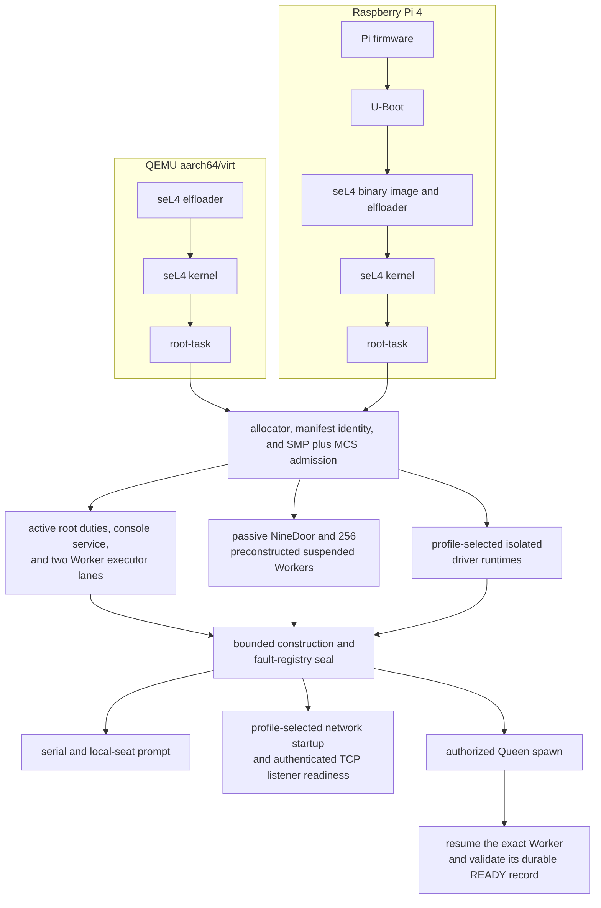

<!-- Copyright 2026 Lukas Bower -->
<!-- SPDX-License-Identifier: Apache-2.0 -->
<!-- Purpose: Define current Cohesix boot stages, profile-specific markers, and evidence invariants. -->
<!-- Author: Lukas Bower -->
# Cohesix Boot Reference

This reference defines the stable boot sequence and the evidence needed to
identify a Cohesix image. It is not a frozen serial transcript: addresses,
CSpace windows, manifest hashes, feature sets, and device messages vary with
the selected seL4 build and manifest profile.

Use [HARDWARE_BRINGUP.md](HARDWARE_BRINGUP.md) for build, flash, capture, and
recovery procedures. Use [TEST_PLAN.md](TEST_PLAN.md) for acceptance criteria.
See the [Glossary](GLOSSARY.md) for Cohesix-specific boot and evidence terms.

## Boot Paths



QEMU uses the selected `aarch64/virt` seL4 artifacts and PL011 serial. The Pi 4
baseline uses `Pi firmware -> U-Boot -> seL4 binary image -> root-task`, with
the Pi profile's serial and manifest-declared isolated driver runtimes. UEFI is
not the Pi 4 acceptance path.

Worker READY is observed after admission, not a prerequisite for the prompt.
On the deferred Pi Wi-Fi path, network startup continues after the serial and
local-seat prompt is published; TCP listener readiness remains a separate gate.

## Boot Stages

| Stage | Required evidence | Interpretation |
| --- | --- | --- |
| Artifact selection | Selected `SEL4_BUILD_DIR`, manifest profile, root-task feature set, and build output are recorded. | Establishes which generated kernel and manifest truth applies. |
| Loader handoff | The loader identifies the kernel and rootserver and transfers to userspace. | Proves image layout and handoff only. |
| Root entry | `[kernel:entry] root-task entry reached` and a boot-state marker appear. | Proves the current root task began executing. |
| Build identity | A `[BUILD]` line from the image under test is captured. | Associates later output with a specific image only when it matches staged or read-back evidence. |
| BootInfo and allocator | Root CSpace metadata is logged, followed by allocator readiness. | Values come from the selected kernel artifacts; they are not repository-wide constants. |
| Manifest identity | `manifest.schema`, `manifest.profile`, `manifest.sha256`, and relevant generated bounds are logged. | Must match the manifest compiled into this image. |
| Runtime admission | Profile-selected worker and driver-runtime resources are validated and admitted or fail closed with a named blocker. | A declaration or image lookup alone is not physical-driver proof. |
| Operator readiness | The serial prompt becomes responsive; a TCP-enabled profile may also publish listener readiness. | Serial readiness and TCP readiness are separate claims. |

Ordering is significant. A later prompt or network marker cannot repair a
missing build identity or a manifest mismatch earlier in the same boot slice.

## Profile-Independent Invariants

### Kernel-Derived State

BootInfo values must be accepted from the selected seL4 build, not copied from
an older transcript. In particular, the root CSpace empty window can move as
the rootserver image and initial capabilities change. Validate that the range
is internally consistent and anchored to current kernel output; do not require
a literal start slot.

### Manifest Identity

For the committed default profile, compare the current generated manifest hash
with the boot line:

```bash
shasum -a 256 configs/generated/root_task_resolved.json
```

Target builds must compare against the resolved manifest selected for that
target before committed default-profile output is restored. A hash from QEMU
must not be used to validate a Pi image, and a log from another image must not
be used to validate a rebuilt image.

### Secure9P and Console Bounds

Generated output and boot evidence must preserve the charter red lines,
including `msize <= 8192`, walk depth `<= 8`, no `..`, and no fid reuse after
clunk. The authenticated console uses the documented `AUTH`, `ATTACH`, and
`ACK`/`ERR`/`END` grammar. There is no independent in-VM 9P/TCP listener.

See [SECURE9P.md](SECURE9P.md) and
[USERLAND_AND_CLI.md](USERLAND_AND_CLI.md) for the normative protocol shape.

### Failure Is Explicit

Manifest admission, HAL mapping, runtime bootstrap, local-seat initialization,
and networking must either succeed or emit a bounded, operator-visible blocker.
The serial shell remains the recovery surface where the active profile permits
degradation. A fail-closed diagnostic boot is useful evidence, but it is not a
pass for the failed device lane.

## Profile-Specific Expectations

### QEMU `aarch64/virt`

A TCP-enabled development boot normally includes:

- PL011 serial output;
- the selected QEMU manifest summary;
- virtio-net readiness when enabled;
- the net-console configuration and listener;
- a responsive `cohsh` authentication and attach sequence.

A QEMU claim requires the applicable target-qualified Test Plan stages and
their exact source, image, launch, and transcript identities. It is not Pi
hardware proof. See [Current Status](STATUS.md) for the public evidence
snapshot.

### Raspberry Pi 4

A Pi boot additionally needs:

- the U-Boot-selected policy and exact image marker;
- the Pi manifest and seL4 counter configuration;
- manifest-declared isolated runtime resource and owner-state evidence;
- serial prompt responsiveness independent of optional network readiness;
- fresh device-specific diagnostics for any claimed USB, HDMI, GENET, or Wi-Fi
  lane.

Every normal cold boot and authenticated Cohesix reboot enters the interactive
**Cohesix boot menu**. A consumed high reset marker and the software-reset bit
are bounded diagnostics only; neither bypasses the menu. The first action is
**Boot with saved settings** for a coherent saved network policy or **Boot with
default settings** for generated manifest defaults. An absent, empty,
oversized, malformed, logo-only, or incoherent `cohesix.env` selects the
default-settings state. **Reset saved settings to defaults** requires explicit
confirmation and returns to that state; save and reset report success only
after bounded FAT write and exact readback verification succeed, and only the
explicit **Save settings and restart** action invokes restart.

A Pi claim requires the applicable offline and live Test Plan stages, including
the selected physical transport, raw TCP, authenticated `cohsh`, and required
repeatability. Evidence from another source tree, image, or boot is a
comparator only. See [Current Status](STATUS.md) for the public evidence
snapshot.

## Minimal Evidence Pattern

The exact text may grow, but a valid boot record keeps this causal shape:

```text
[kernel:entry] root-task entry reached
[MARK] boot_state=<state>
[BUILD] <image-identity>
[bootinfo:cspace] root=<slot> init_bits=<bits> empty=[<first>..<last>)
[boot] allocator ready
[cohesix:root-task] manifest.schema=<schema>
[cohesix:root-task] manifest.profile=<profile>
[cohesix:root-task] manifest.sha256=<sha256>
...
cohesix>
```

Device, listener, and acceptance markers follow according to the selected
profile. Never replace omitted evidence with values from this example.

## Evidence Classification

Classify a boot at the strongest layer actually proven:

1. image built and staged;
2. media flashed and independently read back;
3. the read-back image marker observed at boot;
4. root prompt and manifest identity verified;
5. device or network lane ready in current serial and packet evidence;
6. raw TCP and authenticated `cohsh` ready;
7. target-qualified Test Plan complete;
8. same-image repeatability complete;
9. benchmark workload and provenance accepted.

Success at one layer does not imply the next. This separation is mandatory for
all QEMU and physical-target reports.
