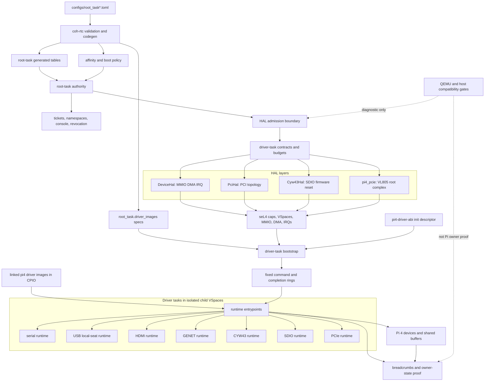

<!-- Copyright 2026 Lukas Bower -->
<!-- SPDX-License-Identifier: Apache-2.0 -->
<!-- Purpose: Provide a proven seL4/Pi 4 driver-development methodology and guardrails for Cohesix. -->
<!-- Author: Lukas Bower -->
# Driver Development Guide (seL4 13, Pi 4/aarch64)

This guide exists because Pi 4 driver bring-up is expensive when we discover
methodology edge-to-edge. For Cohesix, driver work must follow a repeatable
evidence ladder:

1. Prove the seL4 capability path.
2. Prove the platform description and address/IRQ truth.
3. Prove the HAL ownership boundary.
4. Prove one minimal polled device path.
5. Add IRQ delivery only after the device-clear path is known.
6. Add DMA only after cache, address, and ownership rules are explicit.
7. Bind the device into Cohesix semantics only after the hardware contract is
   stable.

Do not start at the full driver. Do not debug protocol behavior until the
seL4 resource path, MMIO mapping, IRQ line, DMA range, and reset/power state
are independently proven.

## Methodology Contract

The risk this guide addresses is not a missing register definition. The risk is
that a driver change can appear to make progress while skipping a lower-level
seL4 proof obligation. That creates wasted board time: protocol retries hide an
unproven IRQ, interrupt experiments hide an unproven device-clear path, DMA
debugging hides an unproven bus address, and feature work hides a missing HAL
boundary.

For Pi 4 work, progress means moving one step up the evidence ladder with a
durable proof. A workaround is acceptable only when it preserves the ladder and
narrows the unknown. A workaround that creates a second control path, bypasses
HAL, depends on an undocumented bootloader side effect, or weakens a bounded
failure condition is not progress.

## Scope

This document is scoped to active Pi 4 work in `docs/BUILD_PLAN.md`:

- Milestone 26: `m26-hal-boundary`, local diagnostics, and the U-Boot boot/DTB handoff.
- Milestone 26a: `m26a-bcmgenet-driver` and the original Pi 4 wired/static baseline.
- Milestone 26b: DHCP plus the profile-gated CYW43455 Wi-Fi path; the checked-in
  Pi 4 U-Boot manifest now defaults to DHCP/`auto`.

It targets seL4 13 behavior on AArch64/Pi 4 while preserving Cohesix's current
as-built constraints. `docs/BUILD_PLAN.md` currently records a future seL4 15
refresh under Milestone 26d; until that refresh lands, check local generated
headers under `seL4/build/` before assuming an API label, object type, IRQ
constant, or platform layout.

## Source Authority

Use this order when sources disagree:

1. Local generated seL4 build artifacts: `seL4/build/kernel/gen_config/*`,
   `seL4/build/kernel/gen_headers/*`, `seL4/build/libsel4/include/*`,
   and `seL4/build/kernel/generated/invocations_all.json`.
2. Cohesix manifest IR and generated artifacts: `configs/root_task*.toml`,
   `apps/root-task/src/generated/*`, and `out/manifests/*`.
3. Cohesix HAL and driver implementation: `apps/root-task/src/hal/mod.rs`,
   `apps/root-task/src/hal/dma.rs`, `apps/root-task/src/hal/cache.rs`,
   `apps/root-task/src/hal/bcmgenet.rs`, `apps/root-task/src/hal/pi4_wifi.rs`,
   `apps/root-task/src/hal/pi4_pcie.rs`, `apps/root-task/src/sel4.rs`,
   `apps/root-task/src/local_seat_pi4.rs`, and
   `third_party/usb-oxide/src/xhci.rs`.
4. Cohesix normative docs: `AGENTS.md`, `docs/BUILD_PLAN.md`,
   `docs/HARDWARE_BRINGUP.md`, `docs/ARCHITECTURE.md`,
   `docs/INTERFACES.md`, and `docs/SECURITY.md`.
5. Official seL4 sources:
   - seL4 Reference Manual 13.0.0:
     <https://sel4.systems/Info/Docs/seL4-manual-13.0.0.pdf>
   - seL4 13.0.0 release notes:
     <https://docs.sel4.systems/releases/sel4/13.0.0.html>
   - seL4 Raspberry Pi 4 platform page:
     <https://docs.sel4.systems/Hardware/Rpi4.html>
   - seL4 Rust root-task serial-device tutorial:
     <https://docs.sel4.systems/projects/rust/tutorial/root-task/serial-device.html>
   - seL4 interrupts, notifications, untyped, and mapping tutorials:
     <https://docs.sel4.systems/Tutorials/interrupts>,
     <https://docs.sel4.systems/Tutorials/notifications.html>,
     <https://docs.sel4.systems/Tutorials/untyped.html>,
     <https://docs.sel4.systems/Tutorials/mapping.html>
   - seL4 verified configurations and CAmkES DMA reference:
     <https://docs.sel4.systems/projects/sel4/verified-configurations.html>,
     <https://docs.sel4.systems/projects/camkes/manual.html#direct-memory-access>
6. Hardware/vendor or OS implementation references:
   - Raspberry Pi BCM2711 ARM peripherals:
     <https://datasheets.raspberrypi.com/bcm2711/bcm2711-peripherals.pdf>
   - Mainline Linux BCM2711 DTS:
     <https://github.com/torvalds/linux/blob/master/arch/arm/boot/dts/broadcom/bcm2711.dtsi>
   - Mainline Linux Pi 4 board DTS:
     <https://github.com/torvalds/linux/blob/master/arch/arm/boot/dts/broadcom/bcm2711-rpi-4-b.dts>
   - Mainline Linux `bcmgenet`:
     <https://github.com/torvalds/linux/blob/master/drivers/net/ethernet/broadcom/genet/bcmgenet.c>
   - U-Boot `bcmgenet`:
     <https://github.com/u-boot/u-boot/blob/master/drivers/net/bcmgenet.c>
   - OpenBSD `bwfm(4)`:
     <https://man.openbsd.org/bwfm.4>
   - Infineon WHD architecture:
     <https://infineon.github.io/wifi-host-driver/html/index.html>
   - Linux `brcmfmac` SDIO:
     <https://github.com/torvalds/linux/blob/master/drivers/net/wireless/broadcom/brcm80211/brcmfmac/sdio.c>

Linux, U-Boot, OpenBSD, and WHD are design references only. They may define
probe order, register contracts, recovery ladders, and expected evidence, but
their source code must not be copied into Cohesix.

## seL4 Driver Model

seL4 does not provide Linux-style in-kernel drivers. The root task receives
authority over remaining resources and must deliberately delegate or retain
that authority through capabilities. The kernel provides the mechanisms:

- device memory can be exposed to user-level code by retyping device untyped
  memory into frames and mapping those frames into a VSpace;
- IRQs can be represented by IRQHandler capabilities and delivered as
  notification signals;
- CPU time is controlled by TCBs, priorities, domains, and scheduling-context
  policy where the selected seL4 profile exposes it; non-MCS profiles still
  enforce driver budgets through priority/domain assignment plus bounded
  IPC/poll turns;
- DMA safety is outside the standard verified proof unless an IOMMU/SMMU
  configuration constrains device writes.

For Cohesix, the root task remains the privileged driver owner. Drivers must
depend on the narrow HAL trait that represents the resource they need:

- `DeviceHal`: MMIO, device-untyped coverage, DMA frames, DMA guard pages,
  and IRQ notification binding/acknowledgement.
- `PciHal`: generic PCI discovery/configuration for platforms with a HAL-owned
  topology. Do not assume this is the active Pi 4 VL805 path; current
  `KernelHal::pci_topology()` returns `None`, and Pi 4 VL805 ownership is
  proven by `apps/root-task/src/hal/pi4_pcie.rs`.
- `Cyw43Hal`: SDIO, power/reset, firmware, and Wi-Fi transport support.

The compatibility `Hardware` facade may remain where legacy call sites span
several domains, but new driver logic should prefer the narrowest trait.

### HAL And Driver Architecture

The architecture below shows the current authority path. The manifest compiler
declares driver images, affinity, and policy; root-task validates and maps the
resources through HAL; linked Pi 4 runtimes receive only bounded descriptors,
capabilities, and fixed-ring service turns.



The diagram is intentionally split between runtime transport and owner-state
proof. All seven Pi 4 runtime images are acceptance-eligible in the generated
manifest, but fresh Pi evidence must still prove their hardware state machines
make real progress from driver-local state. The transport boundary is no longer
a one-page smoke loader: root now maps bounded multi-page `PT_LOAD` runtime
images and semantic MMIO/DMA/shared resource ranges before submitting the
pointer-free init descriptor.

### Driver-Task Scheduling Contracts

Reopened Milestones 26a and 26b require every hardware-facing driver path to
run behind a HAL-declared scheduling contract and a live seL4 driver TCB. The
contract layer is the admission boundary for every hardware service turn. A
service that has no contract, has an unbounded budget, blocks indefinitely, or
bypasses the HAL cannot be serviced.

Each contract records:

- stable driver name and hardware role;
- service class (`RealtimeInput`, `ConsoleOutput`, `NetworkControl`,
  `NetworkData`, `DisplayRefresh`, or `Background`);
- authority class (`DeviceOnly`, `ConsoleTransport`, `NetworkFrameTransport`,
  or `DisplaySink`);
- current isolation state (`DedicatedSeL4Task` for the built-in driver task
  model; any fallback service turn must be recorded separately as
  `RootTaskCompatibility`);
- per-turn operation, byte, frame/report, and bounded-spin budgets;
- bounded IPC/event queue depth.

Scheduling-context fields are profile-qualified for the target architecture. A
dedicated driver task uses seL4 scheduling contexts when the active MCS kernel
profile provides them. On non-MCS profiles, the same HAL contract is enforced
with TCB priority/domain policy plus bounded IPC and poll turns.

The Pi 4 source path attempts to create root-owned seL4 TCBs for every
built-in hardware contract during boot. QEMU virtio compatibility builds keep
the same contract declarations but deliberately skip live driver-task bootstrap
before network init (`qemu-virtio-pre-net-resource-guard`) so scarce seL4
object/page-table budget remains available for the virtio TCP regression path.
When the explicit `qemu-driver-task-smoke` feature is enabled, QEMU may run a
post-network smoke probe after virtio networking is online; that probe creates
the full nine-contract driver-task set and publishes partial live-TCB proof.
That is useful for exercising the seL4 task mechanics under QEMU, but it is not
Pi 4 hardware proof and cannot satisfy the full dedicated-driver-task closure gate.
The no-USB QEMU smoke profile is the smallest local runtime attempt while the
full USB smoke image remains above the current elfloader placement ceiling; an
`image load address overlaps with ELF-loader` failure is an image-placement
blocker, not driver-task proof. A boot counts as dedicated-driver-task execution
only when the breadcrumbs below prove live TCBs, valid
cap/fault/revoke/scheduling/affinity fields, and hot-path
dispatch through those TCBs.
The May 20 Pi 4 capture reached Wi-Fi DHCP but is explicitly pre-closure
evidence: all nine `DRIVER_TASK_BOOT` attempts failed with `seL4_DeleteFirst`,
`live_tcb_count=0`, and the hot paths remained root-task compatibility. The
current code treats boot-seeded intermediate page-table collisions as existing
VSpace state for driver IPC/stack mappings; fresh Pi proof is still required.

| Contract | Role | Manifest affinity target | Current VSpace | Current hot path |
| --- | --- | --- | --- | --- |
| `serial` | serial console | `serial` | isolated child VSpace using the linked `pi4-driver-serial` image; emergency early UART remains root-owned | linked image services the fixed-ring smoke path plus bounded mini-UART init/RX/TX; generated spec is acceptance-eligible, but fresh Pi proof is still required |
| `usb-local-seat` | USB keyboard/local seat | `usb-local-seat` | isolated child VSpace using the linked `pi4-driver-usb` image | linked image requires a semantic xHCI MMIO range, DMA/shared pages, a physically contiguous DMA arena, the VL805 PCIe DMA bus alias, and a pointer-free USB-to-PCIe bus link before engine init; the runtime now owns a direct-root-port xHCI keyboard path with command/event/EP0/interrupt-IN rings, root-port reset, slot/address/configure-endpoint commands, HID boot-protocol setup, duplicate-key suppression, and DMA report polling; hub keyboards and VL805 timing still need Pi hardware proof |
| `hdmi-text` | HDMI text mirror | `hdmi-text` | isolated child VSpace using the linked `pi4-driver-hdmi` image | linked image requires framebuffer metadata plus declared resources and renders bounded text frames directly into the mapped framebuffer |
| `bcmgenet-v5` | GENET wired NIC | `bcmgenet-v5` | isolated child VSpace using the linked `pi4-driver-genet` image | linked image requires declared GENET MMIO/DMA/shared pages and a physically contiguous DMA arena before engine init; it programs UMAC/RGMII, MDIO PHY speed, MAC address, RX/TX descriptor rings, bounded TX submission, RX drain, and TX completion reclaim inside the runtime; useful link/DHCP progress still needs Pi hardware proof |
| `cyw43455` | CYW43 Wi-Fi NIC | `cyw43455` | isolated child VSpace using the linked `pi4-driver-cyw43` image | linked image requires SDIO-host MMIO, declared DMA/shared buffers, and a pointer-free CYW43-to-SDIO bus link before engine init; it performs SDIO card/function bring-up, backplane windowing, firmware/NVRAM streaming, ARMCR4 release, bounded control-frame TX, Ethernet TX, and RX polling over SDPCM; Wi-Fi association/DHCP and WPA/EAPOL still need Pi hardware proof |
| `rtl8139` | QEMU RTL8139 NIC | `rtl8139` | shared root VSpace | dedicated TCB service dispatch for active QEMU RTL8139 network polling |
| `virtio-net` | QEMU virtio-net NIC | `virtio-net` | shared root VSpace | dedicated TCB service dispatch for active QEMU virtio network polling |
| `sdio-host` | SDIO host for CYW43 | `sdio-host` | isolated child VSpace using the linked `pi4-driver-sdio` image | linked image requires declared SDHCI MMIO/DMA/shared pages and a physically contiguous DMA arena; it accepts both the legacy primitive command shape and a fixed-layout SDIO command descriptor for explicit CMD52/CMD53/POLL_IRQ turns, including byte/block sizing and R5-style response handling; CYW43 now consumes those primitives from its linked runtime, but Wi-Fi acceptance still needs Pi proof |
| `pcie-root` | Pi 4 PCIe root/VL805 support | `pcie-root` | isolated child VSpace using the linked `pi4-driver-pcie` image | linked image requires declared PCIe MMIO/shared pages and services bounded 32-bit read/write/posted-write-flush turns inside the mapped aperture; broader root-complex/VL805 handoff still needs Pi proof and completion |

The final isolated-image contract is now generated rather than hand-authored in
HAL. `configs/root_task.toml` and `configs/root_task_pi4_uboot_aarch64.toml`
declare `root_task.driver_images` for `serial-console`, `usb-keyboard`,
`hdmi-text`, `genet-nic`, `cyw43-wifi`, `sdio-host`, and `pcie-root`;
`coh-rtc` emits those records into `apps/root-task/src/generated`; and
`scripts/cohesix-build-run.sh` stages linked `pi4-driver-*` runtime image
binaries, and `scripts/pi4-image-build.sh` packages those images into the Pi 4
driver-runtime CPIO passed at U-Boot handoff. Those binaries now implement
fixed command/completion ring service engines for every Pi 4 hardware owner,
so physical Pi bootstrap debugs linked-image hardware turns instead of
shared-root service TCBs. The serial image handles bounded mini-UART
init/RX/TX. HDMI renders to a mapped framebuffer, PCIe services primitive MMIO
read/write/flush operations, SDIO services bounded command/data turns and
fixed-layout CMD52/CMD53 records, USB owns a direct-root-port xHCI
boot-keyboard path, and GENET owns bounded descriptor-ring RX/TX programming
with MDIO/MAC setup. CYW43 performs SDIO transport initialization, backplane
windowing, firmware/NVRAM streaming, ARMCR4 release, SDPCM control/data TX, and
RX polling through fixed CYW43 command records. The generated runtime specs for
all seven Pi 4 images report `root_context_required=false` and
`hardware_state_migrated=true`, making them acceptance-eligible as independent
hardware owners. Fresh Pi hardware proof is still required before claiming the
engines are production-proven: xHCI hub/timing, Wi-Fi association/DHCP, GENET
DHCP, HDMI scanout, serial I/O, and VL805 handoff all have to be observed on the
board.

The Pi 4 manifest default pins both network dataplane driver contracts to the
fourth core (`core=3`): `root_task.affinity.drivers.bcmgenet-v5=3` and
`root_task.affinity.drivers.cyw43455=3`. `coh-rtc` emits those fields into the
generated `DRIVER_AFFINITY_POLICY`; HAL maps the `bcmgenet-v5` and `cyw43455`
contracts to `DriverAffinityTarget::BcmGenetV5` / `DriverAffinityTarget::Cyw43455`
and calls `seL4_TCB_SetAffinity` before the driver TCB is resumed. A boot may
claim the fourth-core placement only when the corresponding `DRIVER_TASK_BOOT`
line reports `affinity_core=3` and the aggregate affinity proof remains applied.
The same Pi 4 manifest now defaults the first boot to DHCP/`auto` networking and
requires the local-seat path, so a no-saved-policy boot exercises GENET DHCP and
fails visibly if the HDMI/USB runtime cannot initialize.

For each successfully created physical Pi driver TCB, the HAL allocates the TCB
object, child CNode, command endpoint, notification, IPC frame, stack frame,
ring frame, and fault endpoint slot; installs a restricted child CSpace; binds
the remote IPC buffer; applies the contract priority; applies
manifest-selected per-driver affinity through `seL4_TCB_SetAffinity`; binds the
notification; maps every bounded `PT_LOAD` page from the linked runtime ELF plus
declared runtime regions; and resumes the TCB. Generated `code-pages=64`
currently covers the observed ~35 KiB runtime images and the 64 KiB linker
alignment gaps between RO, RX, and RW load segments. The generated runtime
buffer budgets are intentionally no longer first-boot-minimal: serial receives
four shared pages; USB receives 128 DMA pages plus 32 shared pages; HDMI
receives 16 DMA pages plus 16 shared pages in addition to the framebuffer
aperture; GENET receives 512 DMA pages plus 32 shared pages to match the
current 256-RX/256-TX descriptor-ring shape; CYW43 receives 128 DMA pages plus
64 shared pages for SDPCM/control/glom batching; SDIO receives 64 DMA pages plus
32 shared pages for batched CMD53 windows; and PCIe receives 16 shared control
pages. The driver-local virtual layout reserves non-overlapping windows for
those larger arenas: MMIO at `0x70200000`, DMA at `0x70800000`, and shared
control buffers at `0x70c00000`; semantic resource ranges carry aggregate page
counts when the fixed descriptor page arrays are intentionally capped. The
physical Pi
linked-runtime entry dispatches only
fixed-layout command/completion records; callback-pointer dispatch is compiled
out for that profile. QEMU smoke can additionally allocate isolated VSpaces and
map the minimal trampoline transport set, but that remains transport proof
rather than the functional Pi hardware path.

Before any linked runtime can accept hardware service, root now stages a
pointer-free `DriverRuntimeInitDescriptor` from the shared `pi4-driver-abi`
crate into the command ring and submits a runtime-init command. That descriptor
contains the hot-path id, role bit, fixed MMIO/DMA/shared-buffer virtual bases,
the physical page list for mapped MMIO, runtime-owned DMA pages and shared
pages, semantic resource ranges for large apertures, bus-address alias policy,
framebuffer metadata, IRQ descriptors, and bus-link descriptors for split owners
such as USB/PCIe and CYW43/SDIO. Runtime init is deliberately non-acceptance: it
proves that the child image received primitive hardware topology without root
pointers, but it does not credit owner-state progress until a later device
service turn makes real hardware progress from driver-local state.

The default Pi/hardware path is cut over to linked isolated images. Normal
serial init goes through the linked `pi4-driver-serial` image and the event pump
uses a `driver-task-serial-client` once that init command succeeds. GENET/CYW43
and USB/local-seat root callers are ring clients on the physical Pi branch; the
old root-resident `BcmGenetDevice`, `Cyw43NetDevice`, and `Pi4LocalSeat`
constructors remain only in compatibility paths and cannot count as owner-state
proof. The physical Pi `KernelHal` build does not carry a direct `Pi4WifiState`
slot and direct Wi-Fi HAL state construction returns
`pi4-wifi-driver-task-runtime-required`. Emergency early serial output remains
the only intended Pi root-owned escape hatch before or outside the driver-task
substrate. If a linked ring-backed hardware owner is unavailable, the service
turn fails closed with `DeviceUnavailable` instead of falling back to
root-driving the hardware. On the strict Pi owner-ring path, SDIO command and
single-frame data calls consume the linked-runtime completion and return before
the root SDHCI body, and PCIe physical port read/write/flush helpers return
from linked-runtime completions before root MMIO. Full CYW43 firmware and
SDPCM ownership, GENET DMA, USB/xHCI event-ring ownership, and broader VL805
handoff still need fresh Pi proof and remaining hardware-state completion.

Boot logs must expose the distinction with these breadcrumbs:

- `DRIVER_TASK_DEFAULT requested=dedicated required=yes substrate_active=<yes|no> live_hot_paths=<yes|no>`
- `DRIVER_TASK_BOOT contract=<name> role=<role> tcb=<cap> cnode=<cap> endpoint=<cap> notification=<cap> started=<yes|no> affinity_core=<n> isolation_cspace=restricted vspace=<isolated|shared-root> vspace_cap=<cap> code_vaddr=<addr> ring_vaddr=<addr> ipc_abi=<abi> pointer_free_ipc=<yes|no> runtime_image=<transport-mapped|declared-only|none> runtime_declared=<mask> runtime_mapped=<mask> runtime_acceptance=<yes|no> owner_state=<driver-owned|root-owned|not-proven> owner_state_reason=<reason>`
- `DRIVER_TASK_BOOT contract=<name> role=<role> status=failed err=<reason>` for any failed creation path
- `DRIVER_TASK_BOOT status=skipped reason=qemu-virtio-pre-net-resource-guard`
  for QEMU virtio compatibility boots that preserve pre-network resources for
  TCP regression coverage
- `DRIVER_TASK_BOOT_SMOKE phase=post-net-qemu contract=<name> role=<role> status=<created|failed> ...`
  for each declared contract in the explicit `qemu-driver-task-smoke`
  post-network live-TCB probe. The current smoke path creates isolated VSpaces,
  assigns ASIDs, maps only the one-page driver trampoline plus stack, IPC, and
  ring frames, unmaps root aliases for code, IPC, and stack after the isolated
  task starts, reports the runtime-image declared and mapped region masks plus
  the actual linked trampoline `code_vaddr`, and proves a fixed-layout
  command/completion ring without callback or context pointers. The root-visible
  ring frame remains intentional because root is the ring client. This may
  update `DRIVER_TASK_SUBSTRATE` to a full-contract QEMU transport report and must
  still fail full Pi 4 dedicated-driver-task acceptance because Pi hardware
  roles and hardware hot-path ownership are not proved by QEMU.
- `DRIVER_TASK_BOOT_SMOKE phase=post-net-qemu status=summary configured=<n> failed=<n> live_tcb_count=<n> vspace=<isolated|shared-root> ipc_abi=<abi> pointer_free_ipc=<yes|no> runtime_image_declared=<n> runtime_transport_mapped=<n> runtime_acceptance=<n> runtime_declared_hot_paths=<mask> runtime_mapped_hot_paths=<mask> owner_state=<driver-owned|root-owned|not-proven>`
  is also emitted through the root console path during QEMU smoke runs so the
  proof remains visible after the boot logger switches away from early UART.
- `DRIVER_TASK_SUBSTRATE active=<yes|no> task_count=<n> failed_count=<n> live_tcb_count=<n> root_authority_retained=yes fault_endpoint_ready=<yes|no> revoke_ready=<yes|no> broad_caps_leaked=<n> sched=<yes|no> affinity=<per-driver|missing> affinity_configured=<n> affinity_applied=<n> vspace=<isolated|shared-root> ipc_abi=<abi> pointer_free_ipc=<yes|no> owner_state=<driver-owned|root-owned> live_hot_paths=<yes|no>`
- one `DRIVER_TASK_OWNER_STATE contract=<name> hot_path=<serial-console|usb-keyboard|hdmi-text|genet-nic|cyw43-wifi|sdio-host|pcie-root> owner_state=<driver-owned|missing> descriptor=<present|missing> root_pointer=<no|unknown>` line per required Pi 4 hot path
- one `SCHED_CONTRACT` line per built-in contract, including `live_tcb` and
  `hot_path`; role-specific dedicated proof is credited only when both fields
  prove live dedicated dispatch
- one `DRIVER_TASK` line per role, including `capset`, `fault_probe`, and
  `revoke_ready`
- `DRIVER_TASK_SUMMARY` with contract, compatibility, live-role, hot-path,
  shared-ring-role, owner-state-role, owner-state-hot-path, and
  compatibility-role counts
- `DRIVER_TASK_ACCEPTANCE dedicated_ready=<yes|no> reason=<reason> ...` as the
  final machine-checkable verdict

Substrate proof is fail-closed for acceptance. A partial bootstrap may still
show useful `DRIVER_TASK_BOOT` evidence for the TCBs that started, but closure
requires the expected nine-task count, `failed_count=0`, live TCB count,
required role mask, per-driver affinity count, zero leaked broad caps, all
proof booleans demanded by `scripts/pi4_gate_proof.sh --require-driver-task-proof`,
`DRIVER_TASK_POINTER_FREE_IPC_PROOF=yes`, and
`DRIVER_TASK_OWNER_STATE_PROOF=yes`. Pointer callbacks into root-task
memory are compatibility evidence only; full VSpace isolation requires a
pointer-free shared command/completion ABI. The code-level ABI contract is now
spelled as fixed-layout `DriverTaskCommandRecord` and
`DriverTaskCompletionRecord` records containing only primitive opcodes,
sequence numbers, service budgets, fault codes, shared-buffer offsets, and
primitive aux fields for service-turn arguments such as network poll time. Those
records are live for the explicit QEMU isolated-trampoline smoke proof and for
the physical Pi 4 linked-runtime transport. On the physical Pi 4 profile,
`CURRENT_DRIVER_TASK_IPC_ABI=shared-ring-command`; owner-state proof still
remains red until every live driver state boundary moves into isolated
per-driver runtime images. Shared-root ring service roles are reported
separately as `shared_ring_roles`; they are useful readiness evidence but do not
satisfy `hot_path=dedicated` or full acceptance until `owner_state=driver-owned`
also proves live isolated runtime descriptors, mapped MMIO/DMA/shared buffers,
and hardware progress through the driver task. Idle completions and zero-result
progress completions never credit hot-path ownership.
The HAL now uses separate registration APIs for root-context diagnostic ring
services and pointer-free selector ring services. Transitional ring commands that
still carry a root runtime pointer or root-stack context are registered as
`root-context-diagnostic` and the HAL forces the common
`DRIVER_TASK_RING_FLAG_ROOT_CONTEXT_NON_ACCEPTANCE` bit, so a shared-ring
transport turn cannot later be promoted into owner-state proof by accident.
Runtime-image specs declare the intended per-hot-path mapping contract for code,
stack, IPC, ring, MMIO, DMA, and shared buffers. Physical Pi 4 bootstrap now
selects the isolated VSpace constructor; for generated Pi 4 hot paths it looks
up the linked runtime artifact in the boot payload CPIO, maps the executable
ELF page plus stack/IPC/ring/MMIO/DMA/shared regions, and starts the fixed-ring
runtime entry. The mapped pages are not full acceptance by themselves: the specs
are acceptance-eligible, but full Pi 4 VSpace closure still requires hardware
service evidence from each linked runtime. Standalone SDIO and PCIe owner-queue
records similarly are not closure until the composite CYW43/local-seat bus state
is proved from the linked runtimes on Pi hardware.
Owner-state proof is per-hot-path: an aggregate `owner_state=driver-owned`
field on `DRIVER_TASK_SUBSTRATE` or `DRIVER_TASK_ACCEPTANCE` is diagnostic until
all seven `DRIVER_TASK_OWNER_STATE` lines report a present descriptor and
`root_pointer=no` and all seven runtime-image specs are acceptance-eligible with
complete transport mapping. Descriptor registration is also rejected while the
matching runtime-image spec is not acceptance-eligible, so proof cannot be
forced by setting descriptor flags ahead of actual runtime migration.
Physical Pi 4 builds compile out the
callback slot state used by the transitional service ABI; serial,
USB/local-seat, display, and network hot-path callers can reach compatibility
dispatch only through the single HAL `try_driver_task_compat_service` gate,
which returns closed for the Pi 4 hardware profile. Physical Pi owner-state
builds skip installing a steady-state root UART mapping; the linked serial
runtime owns mini-UART MMIO, and the event pump holds a ring client rather than
the MMIO-backed driver. The remaining serial exception is emergency boot logging
before or outside the substrate. The code now carries an
explicit Pi 4 hot-path command catalog for serial console, USB keyboard, HDMI
text, GENET RX/TX, CYW43 RX/TX, SDIO host, and PCIe root service turns. Host
tests prove each catalog entry has a fixed-layout pointer-free command record
and cover the serial, USB, HDMI, GENET, CYW43, SDIO, and PCIe handlers or
client shells directly; fresh hardware proof is still required for useful
MMIO/DMA ownership. An aggregate task count alone is never sufficient.

The HAL rejects missing, zero-budget, non-preemptible, or unbounded-blocking
contracts before the driver is serviced. USB/local-seat and serial are
`RealtimeInput` and preempt network data. CYW43/SDIO Wi-Fi uses separate
network-control and network-data budgeting so EAPOL, DHCP, and TCP ACK progress
cannot be hidden behind bulk RX/TX work, while neither class can starve physical
input.

The CYW43 runtime data path now separates conservative control-plane Function 2
reply reads from runtime data/glom reads. Control replies keep the Linux-derived
64-byte first-read plus bounded remainder shape. Runtime RX uses a single
512-byte block-aligned Function 2 request into an 8192-byte bounded frame buffer
and deaggregates at most 16 glom subframes into a 16-entry bounded queue before
yielding back to the driver-service budget.

Runtime CYW43 data TX follows the same bounded-service rule. The smoltcp
`TxToken` is admitted only when link/security policy allows data and the current
SDPCM firmware credit window is open. The token fills the driver-owned
SDPCM/BDC transmit frame directly, then publishes one block-shaped Function 2
write; the data path no longer waits in a credit-spin loop or copies through an
extra stack frame before the HAL write. Control/EAPOL submit paths may still use
their explicit credit-wait probes because they are part of join/security
progress, not ordinary bulk data service.

Root-task compatibility remains only for early/emergency serial and QEMU/host
compatibility. The only steady-state root fallback admission point is the HAL
`admit_root_task_compatibility_service` gate, which records
`RootTaskCompatibility` and returns false for the physical Pi 4 profile. Any
callback-pointer service turn records compatibility evidence even if the call
rendezvoused with a live seL4 TCB, because the callback ABI still passes
root-memory pointers. Physical Pi 4 steady-state driver paths do not use those
compatibility fallbacks; if the ring-backed hardware owner is not available,
the path fails closed instead of root-driving the hardware. Declared
`max_service_us` budgets remain contract metadata; latency proof must come from
observed service/latency fields.

`DRIVER_TASK_SUBSTRATE_READY=yes` means boot evidence saw the nine-task
substrate with no bootstrap failures. `DRIVER_TASK_DEDICATED_READY=yes` is
reserved for the first image where root can create, schedule, fault-report,
revoke, and prove isolated VSpaces for the active driver TCBs with declared
capsets only, and where serial, USB/local-seat, display, network, SDIO, and PCIe
hardware progress is served by live driver TCBs with zero root-task
compatibility roles. The gate must prove substrate, `failed_count=0`, capset,
fault, revoke, scheduling, per-driver affinity, VSpace isolation, active-net
identity, zero root-task compatibility roles, zero broad cap leaks, observed
latency/responsiveness, and each required role separately so an aggregate count
cannot mask a missing hot path.
The dedicated seL4 driver-task migration keeps these contracts as the admission
boundary rather than replacing them with a second scheduling model.

Root-task keeps authority over tickets, console grammar, namespaces, policy,
replay, and capability revocation. Driver tasks receive only declared MMIO,
DMA/ring, IRQ notification, endpoint, and fault-reporting capabilities. Shared
rings are allowed only when compiler-declared, bounded, and single-producer /
single-consumer by construction.

## HAL, MMIO, DMA, SDIO, And PCIe Contracts

These contracts are the current Cohesix guardrails. If code needs a different
shape, update the milestone, manifest/IR, implementation, tests, and docs in
one scoped change before relying on it.

### HAL Boundary

All device access goes through HAL. Drivers may read and write device registers
only through HAL-returned mapped pages or device-specific HAL transport methods.

- Raw physical-address discovery belongs in HAL, never in a driver.
- Device-untyped retyping belongs in `KernelEnv::map_device` through
  `DeviceHal::map_device`.
- IRQHandler creation, notification badging, and acknowledgement belong in
  `KernelHal::bind_irq_notification`, `KernelHal::poll_and_service_irq`, or
  `KernelHal::wait_and_service_irq`.
- DMA frame allocation, guard-page reservation, pinning, and cache maintenance
  are HAL-owned.
- Firmware, mailbox, power, reset, clock, SDHCI, and SDIO CMD52/CMD53 access
  for CYW43455 belongs behind `Cyw43Hal` / `pi4_wifi`.
- Pi 4 BCM2711 PCIe root-complex/VL805 config access belongs behind
  `pi4_pcie`; drivers must not derive config space from the xHCI BAR.

### MMIO Mapping

seL4 exposes device memory by retyping device untyped into frames and mapping
those frames into the root-task VSpace. The seL4 untyped model has a watermark:
once allocations move past a physical address within an untyped, exact mapping
of an earlier page can fail until the children are revoked. Cohesix preserves
that rule in `KernelEnv::map_device`.

- Check `device_coverage(paddr, PAGE_BITS)` before mapping a device page.
- Map multi-page apertures in ascending physical-page order.
- For exact Pi 4 pages that share one device-untyped region, never map a higher
  page first and then expect a lower page to remain available.
- HAL must verify `ARMPageGetAddress` / `page_get_address` equals the requested
  physical address before publishing a mapping.
- Device mappings use Cohesix `DEVICE_VM_ATTRIBUTES`; drivers must not invent
  mapping attributes at call sites.
- MMIO access must be volatile and bounds-checked through `MappedRegion` or
  `MappedRegisterPages` unless a narrow HAL helper documents why raw volatile
  access is required.

Current Pi 4 examples:

- GENET maps six 4 KiB pages from one HAL-selected alias and requires all pages
  to have device coverage before publishing registers.
- Wi-Fi maps mailbox and SDHCI pages behind `pi4_wifi`; the CYW43 driver sees
  SDIO transport operations, not SDHCI register ownership.
- VL805 maps BCM2711 PCIe host pages in ascending order so the EXT_CFG DATA
  page at `0xfd508000` remains mappable before the EXT_CFG INDEX page and later
  root-complex registers are touched.

### DMA And Cache

Without an IOMMU/SMMU proof, a DMA-capable device is part of the trusted path:
seL4 does not prevent the device from writing any address it can bus-master.
Cohesix therefore treats DMA buffers as explicit shared-memory objects with
device-specific bus-address policy.

- Allocate DMA memory only through `DeviceHal::alloc_dma_frame*`.
- Use `alloc_dma_frame_low*` when the device has a low-address window.
- Use `seL4_ARM_Page_Uncached` when the driver contract requires uncached DMA.
- Pin every device-shared range with `hal::dma::pin` before publishing it to a
  device.
- Use `hal::dma::sync_for_cpu` before CPU reads of device-written cached data,
  and `hal::dma::unpin` before reclaim.
- Cache clean/invalidate/unify operations go only through `hal::cache`, whose
  labels come from the local generated seL4 bindings.
- xHCI device-publish labels (`xhci-*`) use `hal::dma::pin` with
  clean+invalidate before handoff, matching U-Boot's `xhci_flush_cache()`
  behavior for controller-visible rings, contexts, and transfer buffers while
  keeping SDIO/Wi-Fi DMA on its existing clean-only publish path.
- Never DMA into stack memory, parser buffers, unbounded heap buffers, or memory
  whose lifetime is not tied to a HAL frame/ring owner.
- Descriptor rings and packet buffers must be fixed-size, auditable, and have
  explicit producer/consumer ownership transitions.

Device-visible address policy is not generic:

- GENET currently uses `bcmgenet::dma_bus_addr`, `dma_uncached() == true`, and
  the diagnostic policy name `physical`.
- VL805/xHCI currently publishes `0x00000004_00000000 + CPU physical` for DMA
  pointers and keeps backing allocations below the 4 GiB inbound PCIe DMA
  window. A plain CPU physical address is wrong for xHCI rings on Pi 4.
- VL805/xHCI command, transfer, and event rings must be 64-byte aligned before
  their physical addresses are published. The Pi 4 cold-boot proof uses
  U-Boot-shaped command/event rings: 64 TRBs and one ERST entry. `CRCR`
  publication writes the target command-ring pointer directly, without a
  staged zero or stale snapshot replay, and writes the low/control dword before
  the high dword, matching U-Boot `xhci_writeq`. Event-ring
  `ERDP.EHB` acknowledgements are split into explicit 32-bit MMIO writes with
  the low/control dword before the high dword, matching the U-Boot polling path.
- Pi 4 mailbox requests use the VideoCore bus aliases selected in `pi4_wifi`.
  Wi-Fi, VL805 reset-notify, and local-seat framebuffer property calls all use
  the shared HAL mailbox call lock so one path cannot drain or consume another
  path's response. Receive waits are bounded both while the mailbox is empty and
  while draining unrelated property-channel replies. Do not reuse those aliases
  for unrelated DMA devices.
- Pi 4 local-seat cold boot is USB-first. When local-seat USB is enabled and
  the net-console policy selects Wi-Fi (`wifi`, or `auto` with credentials), the
  boot path runs one bounded USB keyboard/xHCI probe before entering CYW43
  control-plane bring-up. Wi-Fi net-console initialization is deferred out of
  early kernel net init, then resumed before the serial root console is
  published. The `Cohesix console ready` banner and `cohesix>` prompt must be
  the last visible boot milestone after Wi-Fi association/addressing succeeds,
  reaches a terminal failure, or hits the bounded pre-root wait timeout. QEMU
  virtio and Pi 4 wired NIC paths still use their immediate net-init flow.
- CYW43455 SDIO traffic is host-driven through SDHCI/CMD52/CMD53; the driver
  must not publish arbitrary DMA addresses to the Wi-Fi firmware path.

### IRQ Ordering

The seL4 interrupt pattern is derive IRQHandler, bind notification, wait/poll
notification, clear the device source, then acknowledge the IRQHandler. Cohesix
keeps that sequence in HAL helpers because acknowledging a level-triggered line
before clearing the device source can immediately redeliver the interrupt or
leave the line stuck.

- Use `IrqTrigger::Level` for Pi 4 SDIO and PCIe INTx-style lines unless source
  authority proves an edge-triggered line.
- Notification badges are IRQ-derived so shared notification objects stay
  auditable.
- Device clear callbacks must be bounded and nonblocking.
- Pi 4 SDIO uses GIC hwirq 158 through HAL binding and SDHCI
  `INT_STATUS`/`INT_ENABLE`/`SIGNAL_ENABLE`.
- IRQ 27 is the seL4 timer on this path; never treat it as a USB or Wi-Fi
  device interrupt.
- SDHCI command/data wait paths must not clear `CARD_INT` as a side effect of
  command completion, data-ready, or transfer-finish waits. `CARD_INT` belongs
  to the HAL IRQ service path, where Cohesix first clears the CYW43 dongle-side
  interrupt source, acknowledges the SDHCI/seL4 interrupt, and only then
  re-enables the SDHCI `CARD_INT` signal path.
- Current Pi 4 USB/VL805 is event-ring polled with PCI INTx/MSI/MSI-X delivery
  masked. The cold-boot command proof publishes fresh rings, starts with
  `USBCMD.RUN`, and acknowledges consumed events with `ERDP.EHB`. The gate-3/4
  proof command is Enable Slot; No Op is diagnostic-only and must not advance
  root-port sampling. Local-seat preserves already-posted current-boot PSC
  events until after it DMA-publishes Enable Slot and rings doorbell `0`; the
  wait loop then skips and acknowledges those PSC events, inserts the same
  bounded prompt-safe wait used for other unexpected events, and still accepts
  only the matching Command Completion Event as gate-4 proof. Do not unmask
  external xHCI interrupt delivery until a milestone explicitly proves it.

### SDIO/CYW43455

CYW43455 is an SDIO device, but Cohesix does not expose a generic SDIO host API
to drivers. The `Cyw43Hal` contract owns SDHCI reset, power, clock, bus width,
CMD52 direct I/O, CMD53 extended transfers, firmware bundle access, and Wi-Fi
power/reset state.

- Function 0 is CCCR/FBR control.
- Function 1 is the Broadcom backplane/control path.
- Function 2 is the data/control-plane FIFO path after firmware.
- Function 2 remains disabled before firmware/NVRAM upload.
- Production Function 2 traffic requires firmware upload/release evidence, real
  `CHIPCLKCSR.HT_AVAIL`, and live Function 2 readiness (`IOR2`/ready proof). The
  latest Pi 4 hardware trace proved the `CHIPCLKCSR=0x50`
  (`ALP_AVAIL|HT_REQ`) shape can latch `IOEX=0x06` while `IOR2` remains clear at
  `0x02`, even after the Linux-sized wait. That no-HT shape is therefore
  diagnostic evidence only, not a production Function 2 promotion.
- The bounded no-HT probe is not a success gate: `0x52`
  (`FORCE_HT|HT_REQ|ALP_AVAIL`) is only diagnostic readback of the exact `0x50`
  token after F2 clock forcing, and production boot still stops before F2 traffic
  unless real HT and live `IOR2` are both present.
- Function 2 enable follows Linux's `SDIO_WAIT_F2RDY` contract: the strict
  Cohesix path polls CCCR `IORx` for a 3000-sample F2-ready window before
  declaring `sdio-function2-ready-timeout`.
- Function 2 control-plane frames follow Linux SDIO host sizing: payloads that
  still fit CMD53 byte mode are four-byte aligned, while larger frames are
  padded to the 512-byte Function 2 block size so the HAL emits block-mode
  CMD53 rather than an unencodable byte-mode count.
- Pi 4 CLM upload follows the captured Linux `clmload` cadence: the first
  `clmload` DCMD carries a 1400-byte CLM blob chunk (`len=1412` after the
  `download_hdr`). Control-plane TX frames include Linux's 20-byte SDPCM
  control header (`hwhdr` + `hwext` + 8-byte software header), set
  `dat_offset=20`, carry the padded CMD53 request length in the on-wire
  `hwhdr`, and record the unpadded frame length plus tail padding in `hwext`.
  The first CLM frame is therefore a 1456-byte unpadded frame with an SDIO
  request length of 1536 and `tail_pad=80`, matching the Pi 4 Linux capture.
  The driver queries firmware `ver` and then `clmver` after upload before
  continuing with the remaining preinit commands.
- CLM must not be the first meaningful BCDC/iovar exchange. Linux proves the
  initial control-plane path with small iovars first: set
  `bus:txglomalign=8`, query `ulp_sdioctrl` while accepting the captured
  `BCME_UNSUPPORTED` result, set `bus:rxglom=1`, query `cur_etheraddr`, then
  issue Linux's mandatory `BRCMF_C_GET_REVINFO` (`cmd=98`) before CLM. Cohesix
  follows that order before CLM so the first Function 2 replies are small
  Linux-shaped 64-byte first-read transactions rather than a large CLM
  transfer. After that attach proof, Cohesix keeps the
  `bus:txglom`/`bus:rxglom` state established by the Linux-style SDIO preinit
  path through firmware `ver`, `clmver`, `mpc`, `event_msgs_ext`, and `WLC_UP`.
  Disabling `bus:rxglom` as a local safety shortcut before `mpc` is not
  Linux-equivalent and the 2026-05-13 Cohesix boot trace showed it can move an
  otherwise working control plane into a host-`CARD_INT`/no-dongle-source stall.
  The 2026-05-19 board trace proved that the same compatibility write after
  `mpc` but before `event_msgs_ext`/`WLC_UP` can still break the attach path, so
  Cohesix now defers any runtime `bus:rxglom=0` transition out of control-plane
  attach. Oversized or malformed aggregated RX is bounded in the receive path
  instead of by mutating the Linux attach order.
  Malformed or oversized RX-glom evidence must remain explicit, UART-capped,
  and recoverable by clearing the Function 2 frame condition.
- The first Linux-order control writes use the plain 12-byte SDPCM header. The
  8-byte SDPCM hardware-extension header is enabled only after `bus:rxglom`
  succeeds, matching `brcmfmac`'s `tx_hdrlen` transition. Sending
  `bus:txglomalign` with the extended header shifts the CDC payload to offset
  20 before the firmware has enabled that framing and leaves the host polling
  for a reply the firmware never generates.
- CYW43455 firmware upload uses Linux's 32 KiB brcmfmac backplane windows as
  the primary path (`brcmf_sdiod_ramrw write 32768 bytes`) and keeps Cohesix's
  byte-mode upload path only as the bounded seL4 recovery path after a real
  SDHCI transport failure. The HAL must still split the raw Function 1 CMD53
  commands like Linux's MMC SDIO helper: one command may carry at most 511
  blocks, so each 32 KiB F1/64-byte firmware window becomes a 511-block
  32704-byte command plus a final 1-block 64-byte command. Do not encode a
  block-mode count of zero for a 512-block command; zero count is only valid for
  512-byte byte-mode CMD53 transfers.
- Non-captured early iovars must not be hard blockers before this attach proof
  point. Cohesix may attempt station-path compatibility knobs such as
  `bus:txglom` and AMPDU limits only after the Linux first-iovar/MAC sequence,
  and `BCME_UNSUPPORTED` on those non-captured knobs is nonfatal. Transport
  errors remain fatal. Do not set `apsta=1` on the normal Pi 4 station attach
  path; Linux reserves that iovar for AP/P2P-style paths, and the 2026-05-12
  Cohesix boot proof showed it can move a healthy station attach into a
  hintless first-read/no-IRQ control-plane stall. Do not set `country` on the
  normal Pi 4 station attach path either; the Pi 4 Linux capture reaches
  country later as a cfg80211/regulatory query path, and the 2026-05-12
  Cohesix post-`apsta` proof showed an early `country` write can move the same
  transport into the hintless first-read/no-IRQ stall. Event-mask setup is not
  optional; at least one join-event subscription path must be proven before
  `SET_SSID`. The normal Pi 4 station attach tail must also avoid local legacy
  writes that are absent from the Linux capture before join. The 2026-05-13
  19:04 Cohesix trace proved firmware `ver`, `clmver`, `mpc`, `join_pref`,
  scan timing, event-mask, and `WLC_UP`, then stalled at legacy
  `WLC_SET_GMODE` (`cmd=110`) with host `CARD_INT` latched and no dongle reply
  source. Cohesix now skips early `WLC_SET_GMODE`, `WLC_SET_BAND`,
  `WLC_SET_ANTDIV`, local AMPDU-limit writes, and `WLC_SET_PM` on the
  station attach path unless a later Linux-equivalent gate proves they belong
  there. The 20:12 follow-up trace superseded that frontier: it reached join
  programming, drained an `EVENT_IF`, then spun on Function 1 `0x0c020`
  host-latch/no-dongle-source polls. Proof tooling must report that live edge
  as `join-programming-host-latch-loop`; earlier ARMCR4 CMD53 R5 errors in the
  same trace are recovered history once later control-plane replies and `UP`
  are proven.
- Cohesix also applies the Linux attach-time `join_pref` default payload
  (`04 02 08 01 01 02 00 00`) before scan/join defaults. WPA2-PSK join setup
  must match Linux and known-good CYW43 behavior: program the supported
  WPA2-PSK/CCMP RSN IE through `wpaie`, then the primary-BSS initial WPA2
  version mask (`wpa_auth=0x00c0`), D11 auth (`auth=0`), AES security
  (`wsec=0x0004`), the Linux RSN-capability side effects for the authored RSN
  IE (`mfp=0`, `wme_bss_disable=1` for the current zero-capability WPA2-PSK
  CCMP IE), final WPA2-PSK AKM (`wpa_auth=0x0080`), then either the Linux
  userspace supplicant path or an explicitly supported firmware-supplicant offload path
  before the primary `join` iovar. `infra=1` is not part of
  the Linux connect-time station command sequence. For the primary BSS
  (`bsscfgidx=0`), Linux `brcmf_fil_bsscfg_*` collapses most station connect
  commands to the plain iovar name and data, so Cohesix must keep `wpaie`,
  `wpa_auth`, `auth`, `wsec`, and `join` on the plain primary path. The Pi 4
  Linux capture shows the plain `sup_wpa` feature probe returning
  `BCME_UNSUPPORTED`; the same Linux run still connects because host
  `wpa_supplicant` handles EAPOL and key install outside the
  firmware-supplicant path. Milestone 26b authorizes bounded WPA2-PSK join
  sequencing, but no data path may be released on `SET_SSID` alone, so `sup_wpa`
  failure must not authorize or weaken the secure Cohesix join rule. The normal
  M26b image now probes the Linux firmware-supplicant/PSK-offload gate first,
  because known-good `brcmfmac` does that whenever cfg80211 supplies a PSK. If
  `sup_wpa`, the BSSCFG wrapper, or `WLC_SET_WSEC_PMK` is explicitly rejected by
  firmware, Cohesix disables the firmware-supplicant path, derives the host PMK
  locally, submits the primary join request, and exports
  `wifi-host-eapol-pending` as the live next secure boundary. Until either the
  firmware `PSK_SUP` completion rule or the host EAPOL/key-install path
  completes the secure handshake, Cohesix keeps DHCP and normal data TX
  disabled. Before the join request, Cohesix also applies the
  Linux connect-time station policy that disables minimum-power-consumption
  mode (`mpc=0`) and best-effort disables ARP/ND firmware offload
  (`arp_ol=0`, `arpoe=0`, `ndoe=0`), then runs an association-gated
  join-submit EAPOL proof window, enables a Linux-shaped receive-admission
  window (`mcast_list` for
  `01:80:c2:00:00:03`, `allmulti=0`, optional `WLC_SET_PROMISC=0`), refreshes
  that receive-admission programming once after association/BSSID proof, and
  then keeps the deferred EAPOL-only receive lane alive with bounded event-pump
  burst polls and low-level SDIO breadcrumbs suppressed even after a terminal
  `host-eapol-required` verdict.
  The Linux join event mask is programmed before `WLC_UP`; Cohesix then sends
  Linux's managed-station mode gate (`WLC_SET_INFRA`, `cmd=20`, value `1`)
  before the post-up event drain and event-mask replay so later firmware state
  transitions cannot silently drop association, link, PSK, or MIC events.
  Runtime RX must treat readable `SDIO_INT_STATUS=0` plus SDHCI `CARD_INT` as a
  stale host latch and clear/ack it before any Function 2 first-read; only
  non-zero or unreadable interrupt-source evidence may trigger the Linux-shaped
  first-read recovery path.
  M1/M3 are expected as unicast frames to the station after association; the
  host-EAPOL path first waits passively for M1, matching WPA-PSK host
  supplicant behavior where EAPOL-Start is not the handshake trigger. If the
  passive window expires, diagnostic EAPOL-Start stays on the 802.1X PAE group
  address while the current firmware-reported associated BSSID is kept only as
  an AP hint for later M1/M3 validation and EAPOL-Key replies.
  The hot host-latch clear path must not spam serial with repeated successful
  `SDIO_INT_STATUS` Function 1 reads or host-card-int-latch-only clears; logs
  stay reserved for first-edge proof, dongle source bits, unreadable-source
  failures, SDHCI transfer errors, and explicit operator diagnostics.
  HAL Function 2 writes must preserve the SDPCM channel boundary: control
  channel writes may arm a bounded ioctl-reply wait, but data/event channel
  writes such as EAPOL-Start must not arm or inherit a control-plane reply wait.
  Data TX frames also use Linux's extended Function 2 SDPCM shape after the
  control-plane `tx_hdrlen` transition: a 20-byte SDPCM TX header, software
  header at byte 12, `dat_offset=0x1a`, six bytes of padding, then the BDC
  header and Ethernet payload. The local Linux capture shows this exact shape for
  station data TX (`84 00 7b ff 80 00 00 01 ... 2a 02 00 1a`). EAPOL data TX
  must set the BDC priority byte to `6`, matching the Linux brcmfmac priority
  path for 802.1X frames. The current as-built host-EAPOL implementation
  contains bounded M1/M3 admission, M2/M4 transmit, 802.1X drain before key
  programming, and PTK/GTK `wsec_key` install logic. GTK/group keys use the
  Broadcom primary/default-key flag, while PTK/pairwise keys keep flags zero and
  still carry a zero RX RSC so Broadcom sees `iv_initialized=1`, matching the
  Linux key-install shape.
  The last reviewed Pi 4 boot (`/Users/lukasbower/pi4-serial-20260517-173550.log`)
  supersedes the earlier no-association traces: it proved association/link-up,
  EAPOL-only receive rescue, PAE-group diagnostic EAPOL-Start, USB prompt
  availability, and a live root prompt, but still did not receive M1
  (`eapol_rx=0`) and left DHCP blocked. The latest proof keeps the same secure
  frontier with `WIFI_GATE=7` and `wifi-host-eapol-pending`. `WLC_GET_BSSID`
  and the association events returned locally administered/P2P-looking unicast
  addresses; those are logged as unproved hints, not accepted AP identity, so
  Cohesix must wait for an AP-originated M1 or a verified global BSSID before
  storing `host_wpa.ap_mac`. Current root-task first waits for the AP-originated
  M1, refreshes the
  Linux unicast-M1 receive admission after association, then enables a temporary
  EAPOL-only receive rescue (`allmulti=1`, `promisc=1`) during the same bounded
  post-association proof window before sending delayed diagnostic EAPOL-Start
  frames to the PAE group address. DHCP and normal data remain blocked
  throughout the rescue; after secure key install Cohesix restores the Linux
  unicast-M1 receive policy
  idempotently before releasing DHCP/data, even if the rescue path was not used.
  Post-secure EAPOL frames stay routed to the host WPA handler for bounded
  rekey/group-key processing; malformed post-secure frames are dropped without
  re-entering the data-blocking pending state.
  This hardware state is not a Wi-Fi connection: the latest proof reports
  `WIFI_GATE=7`, `WIFI_BLOCKER=host-eapol-required`, and prompt-side `nettest`
  must report `wifi-host-eapol-pending` until M1/M3 handling and key
  installation complete or the deferred lane times out. Pre-root runtime
  accelerates that boundary with bounded host-EAPOL burst
  polls; after `cohesix>` is published, each event-pump turn yields back to
  serial, USB keyboard, HDMI echo, and IPC after a single Wi-Fi poll so the
  fail-closed EAPOL lane cannot delay physical-console input. The current
  runtime refreshes receive admission after association, drains runtime Function
  2 frames before clearing the SDIO interrupt source, treats runtime
  `I_HMB_FRAME_IND` with zero `RFRAME`, an actual `I_HMB_HOST_INT`, or an
  unreadable dongle interrupt source as bounded Linux-style fixed-address
  Function 2 first-read opportunities, and clears readable-zero dongle source
  plus SDHCI `CARD_INT` as a stale host latch instead of issuing a no-progress
  Function 2 read. Background host-EAPOL polling suppresses Wi-Fi UART output
  once USB first-byte proof exists; the internal log keeps rate-limited stale
  latch evidence plus concise `host-eapol rx-source` and `rx-source-regs`
  snapshots when no M1 is visible. The host-EAPOL rule
  must not be completed by firmware `PSK_SUP`; only M1/M2/M3/M4 plus key
  installation can release DHCP/data after firmware offload was rejected. When
  firmware offload is accepted, `PSK_SUP` plus carrier confirmation is the secure
  completion rule. The DHCP/readiness label and the RX/TX data
  gates use the same secure-completion predicate so a completed handshake cannot
  expose DHCP while the driver still blocks normal frames. The next valid success
  trace must show
  `host-eapol action=data-tx-shape ... bdc_priority=6`,
  `host-eapol action=send-m2`, `host-eapol action=send-m4`,
  `host-eapol action=wait-pending-8021x-drain`,
  `host-eapol action=install-wsec-key kind=ptk`, `kind=gtk`, and final
  `join complete mode=host-eapol secure=yes` before DHCP or normal data TX is
  enabled. The EAPOL drain path must first look for a new SDPCM credit covering
  the submitted M4/group-M2 sequence; if the firmware produces no fresh status
  before the bounded wait expires, the driver may proceed only when the
  already-advertised credit window explicitly covered the submitted sequence and
  must log `fresh_status=no`.
  Any observed 4-way frame is classified as `m1`, `m3`,
  `group-key`, malformed, or unexpected station-originated traffic, and the log
  records the exact next required host action (`derive-ptk-send-m2`,
  `verify-mic-send-m4-install-keys`, or key inspection). On M3, Cohesix must
  keep hostap ordering: validate the AP nonce and replay counter, verify the
  MIC, send M4, then install PTK and GTK through `wsec_key` before allowing
  DHCP/data. Repeated M3 and post-secure group-key messages must advance from
  the last accepted replay counter instead of reusing the M1 anchor. It must not
  fall back to `SET_SSID`-only completion or a lower-level
  transport hint. Explicit
  diagnostic commands may still probe the HAL-owned SDIO/control path. The
  2026-05-14 22:11 trace proves the corrected
  boundary: plain `sup_wpa` and wrapper `bsscfg:sup_wpa` both return
  `BCME_UNSUPPORTED`/`0xffffffe9`, and the old Cohesix image then incorrectly
  tried `WLC_SET_WSEC_PMK` twice before receiving `BCME_BADARG`/`0xfffffffe`.
  Transport errors remain fatal. When firmware supplicant offload is enabled,
  the primary PMK payload is the 132-byte Linux
  `brcmf_wsec_pmk_le` shape (`u16 key_len`, `u16 flags`, 128-byte key area).
  For 8-63 byte passphrases Cohesix derives the 32-byte PBKDF2-HMAC-SHA1 PMK
  from SSID + passphrase and sends flags `0`; for 64 ASCII hex PSKs it decodes
  the 32-byte PMK directly. A `BCME_BADARG` response to
  `WLC_SET_WSEC_PMK` is preserved as `wsec-pmk-bad-argument`, not masked by
  later SDIO hint probes. Any PMK or supplicant-shape rejection is
  join-programming drift, not a transport failure.
- Join programming must use Linux's station command shape. After `WLC_UP`,
  Cohesix drains bounded post-`UP` interface events before the first join
  security command, then sends the upstream primary-BSS `join` extended payload.
  Only an explicit `join` iovar failure may fall back to the legacy
  `WLC_SET_SSID` payload. A pre-join Function 1 host-latch loop is not
  association progress, DHCP progress, or IRQ progress; it is a join-programming
  blocker until a control reply, `join pending`, or terminal join event proves
  the firmware accepted the command. The 2026-05-13 20:40 trace exposed a
  Cohesix-only wrapper drift (`bsscfg:wsec` with a leading zero index) at this
  gate; proof tooling reports that old image as
  `primary-bsscfg-wrapper-join-security-loop`. The 2026-05-13 22:00 trace
  superseded that wrapper blocker: the image sent plain `wsec` first and then
  stayed in IRQ158 host-latch/no-dongle-source polling until the `wsec` ioctl
  timed out. Linux sends initial `wpa_auth` and `auth` before `wsec`; proof
  tooling reports that old image as `join-security-wsec-first-loop`. The
  driver must preserve that exact join-security gate into `wifi diag` instead
  of collapsing the post-failure shell output into a lower-level Function 1 or
  Function 2 visibility symptom.
- The 2026-05-13 22:45 trace proves the ordered-security image was flashed and
  reaches the first `wpa_auth` iovar before any `auth`, `wsec`, supplicant, PMK,
  or join-submit command. A late async `EVENT_IF` arrived in the ioctl reply
  window, after which the HAL cleared only host-side IRQ158 latches with
  `progress=no` until the bounded no-progress fail-fast. Root-task now keeps the
  control-reply wait active across non-control frames, sends the Linux
  connect-time RSN IE (`wpaie`) before initial `wpa_auth`, and reports the live
  frontier as `join-security-wpa-auth-initial-loop` instead of reusing the
  stale `wsec` label.
- Firmware RAM readback is diagnostic, not a mandatory production gate. The
  Linux production brcmfmac path compiles full RAM verify out; Cohesix may run
  bounded readback for evidence, but `sdhci-byte-mode-count` and similar
  readback-transport limitations after a completed upload must be reported as
  `readback-unavailable` and must not trigger a lower-speed reupload that can
  disturb a good image. Byte mismatches remain terminal because they prove bad
  payload contents.
- WPA2 join completion must be gated on cryptographic completion, not on
  `WLC_SET_SSID` success. Open networks may complete on a successful `SET_SSID`
  event. Secure networks must subscribe to `SET_SSID`, `AUTH`, and `PSK_SUP`;
  when firmware supplicant mode is enabled, require both successful `SET_SSID`
  association progress and `PSK_SUP` status 6 before the data path is released.
  When firmware supplicant mode is unsupported, the only valid live next state
  is `wifi-host-eapol-pending`; EAPOL frames may be logged as proof, but DHCP
  and data TX stay blocked until the bounded host EAPOL/key-install path reports
  secure completion. Device construction after this boundary must report a
  precise bring-up status such as `wifi-host-eapol-pending`; it is not proof
  that the Wi-Fi data path is online. Deferred boot joins may keep the EAPOL-only
  receive lane running after the proof window, and the event pump must accelerate
  that state with bounded host-EAPOL burst polls while still returning to serial,
  USB, and IPC work between bursts. The driver must suppress repetitive low-level
  SDIO breadcrumbs and continue dropping non-EAPOL data until the secure boundary
  is complete; queued glommed data also remains held until the same secure
  predicate is true. Blocking join attempts and timed-out deferred
  attempts must stop normal smoltcp receive polling so the root console is not
  flooded with no-progress Function 1 `SDIO_INT_STATUS` latch reads;
  prompt-side `wifi diag`, `wifi retry`, and related diagnostics remain the
  explicit way to ask the HAL for another live probe. During the join-submit
  proof window, Cohesix records `SET_SSID` as join-acceptance evidence only; the
  post-association EAPOL proof budget starts only after an association/reassociation
  or link-up event leaves the driver in the associated state, so the M1 window is
  not spent before diagnostic EAPOL-Start is legal. Successful association/link
  events may seed the AP/BSSID from the Broadcom event address or Ethernet
  source only when the address is a verified globally administered unicast AP
  candidate. Locally administered event addresses and station/P2P aliases are
  logged as unproved hints and must not populate `host_wpa.ap_mac`. Before host
  EAPOL-Start, Cohesix must issue `WLC_GET_BSSID` (`cmd=23`) and store the
  firmware-reported associated BSSID only when it passes the same verified AP
  proof. The seed/skip log must include both raw event candidates, and the
  EAPOL-Start log must include the actual destination MAC. Before the first
  post-association
  EAPOL-Start, Cohesix must refresh the Linux-shaped receive-admission
  programming because the join event/BSSID proof is the first point where the
  current AP identity is known. Because WPA-PSK host supplicants wait for AP M1,
  EAPOL-Start is delayed until the passive proof window expires and is logged as
  a diagnostic probe, not as the expected M1 trigger. The diagnostic Start frame
  uses the PAE group destination while AP identity remains unproved; M1 may
  overwrite the AP MAC with the authenticated frame source. Cohesix
  parses the EAPOL/EAPOL-Key envelope
  for proof (`m1`/`m3` shape, key-info bits, replay-counter presence, declared
  EAPOL length, CCMP key length, RSN IE consistency, and key-data length) and
  may complete the bounded host handshake only after M2, M4, and `wsec_key`
  PTK/GTK install succeed. MIC verification uses the declared EAPOL body length,
  not any trailing SDPCM/BDC receive padding. When an AP sends M3 without a GTK
  KDE, Cohesix sends M4 and installs PTK, keeps DHCP/data blocked, then accepts
  the separate Group Key 1/2 frame, installs GTK, replies with Group Key 2/2,
  reasserts AES `wsec`, and only then releases DHCP/data. Deferred join timeout and
  prompt-side `nettest` diagnostics must preserve `wifi-host-eapol-pending`
  while the deferred receive lane is still alive and `wifi-host-eapol-required`
  after the terminal proof window closes, instead of collapsing the failure into
  generic association or DHCP status. Firmware `PSK_SUP` events under the
  host-EAPOL completion rule are ignored for completion; they are not proof that
  Cohesix installed PTK/GTK keys. Any root-task panic after that line is a boot
  blocker and proof tooling must
  preserve the host-EAPOL Wi-Fi blocker rather than rewriting it to `none`. Any
  other `PSK_SUP` status is a failed secure join, not a pending-success edge.
  DHCP and data TX must not begin before that secure completion rule is
  satisfied; the root-task DHCP client is started only after the Wi-Fi backend
  reports no pending
  association status and a live Wi-Fi carrier. A post-join `EVENT_LINK` without
  the link flag is `wifi-link-down`; it must defer DHCP rather than being
  normalized as DHCP progress.
- Join-completion event delivery is a hard gate. Cohesix first programs the
  Linux `event_msgs_ext` shape (`ver=1`, `command=SET_MASK`, `len=27`) using
  the Pi 4 capture mask plus the Cohesix-required `AUTH`, association, and
  `PSK_SUP` bits. If and only if the firmware explicitly returns
  `BCME_UNSUPPORTED`, Cohesix falls back to a global `event_msgs` mask that
  preserves existing firmware bits and ORs the same required join events. If
  neither subscription path is proven before `SET_SSID`, join setup must fail.
- Linux clears `SBSDIO_FUNC1_SDIOPULLUP` during SDIO buscore preparation.
  Cohesix does not currently issue that optional CMD52 on Pi 4: the
  2026-05-12 Cohesix boot log proves the write can return a CRC failure and
  poison the following CCCR speed CMD52 with end-bit errors, while the same
  board reaches firmware upload and join gates when the write is skipped.
  This is a seL4 HAL adaptation, not a new hardware requirement; do not enable
  the pullup clear until the SDHCI path proves Linux-equivalent CMD52 recovery
  across the immediately following sideband access.
- During Pi 4 host reset, a stale bootloader `CMD_INHIBIT` bit in SDHCI
  `PRESENT_STATE` is not proof of a Cohesix command in flight. Match the Linux
  SDHCI reset order by proving power/card presence, programming the startup
  card clock, then issuing the command/data reset and requiring inhibit clear
  before the first SDIO command. Logs must distinguish this bounded pre-clock
  recovery edge from a real post-command `sdhci-inhibit-timeout`.
- Before the first iovar, Cohesix must drain the Linux-observed startup
  status/credit traffic emitted after `Dongle ready`. The captured first frame
  is a 12-byte SDPCM header-only event/status frame, followed by an empty
  64-byte read. That frame is not a CDC ioctl response and must be consumed
  before `bus:txglomalign`, otherwise the first ioctl wait can consume stale
  startup traffic and then spin on the SDIO-core status sideband instead of
  reading the real response.
- After real post-release HT and live Function 2 readiness are proved, the Pi 4
  firmware channel arms the Linux-shaped Function 2 interrupt path
  (`HOSTINTMASK`, `CCCR.IENx`, and SDHCI `CARD_INT`) through HAL-owned source
  clear plus seL4 ack. The SDPCM `FUNCTIONINTMASK` readback is diagnostic on
  this Pi 4 path; a zero value is not interrupt-programming drift when
  `CCCR.IENx` is armed and the SDIO-core frame-indication path is live. IRQ 158
  is the Wi-Fi SDIO interrupt; IRQ 27 remains the seL4 timer and is never Wi-Fi
  progress evidence.
- A polled Function 2 control reply may leave SDHCI `CARD_INT` visible after
  the dongle-side `SDIO_INT_STATUS` source has already been read and cleared.
  That is a stale host interrupt latch to clear and acknowledge, not a terminal
  `wifi-sdio-polled-reply-source-still-visible` blocker. It remains terminal
  only when the dongle-side source cannot be read before the seL4 IRQ ack.
- SDIO IRQ logs must separate host interrupt delivery from dongle source proof.
  A seL4 IRQ 158 notification or SDHCI `CARD_INT` latch with
  `SDIO_INT_STATUS=0` is logged as host-latch/no-dongle-source evidence with
  `progress=no`; only a nonzero dongle source bit, `I_HMB_FRAME_IND`, or a valid
  Function 2 SDPCM header proves control-plane reply progress. IRQ 27 remains
  the seL4 timer and is never part of this proof.
- A post-control-write SDIO-core `I_HMB_FRAME_IND` bit is authoritative reply
  progress even when the Function 1 frame-length sideband still reads zero.
  Mirror Linux by reading the fixed Function 2 FIFO at `0x18000000` with the
  64-byte first-read shape and then the SDPCM-indicated remainder padded to the
  same Function 2 host-transfer shape Linux uses. Do not block that read on
  stale `RFRAME` sideband hints or on a `FUNCTIONINTMASK` readback of zero when
  `CCCR.IENx` is armed and `I_HMB_FRAME_IND` is visible.
- Control-plane receive buffers must fit the captured Linux `BRCMF_FIRSTREAD`
  cadence for large replies: the initial 64-byte fixed-address Function 2 read
  followed by a 2048-byte bulk read. Smaller 2048-byte buffers are not enough to
  hold the padded SDPCM control frame and will misclassify real reply progress
  as partial hint visibility.
- The same `BRCMF_FIRSTREAD` cadence applies when `RFRAME` already exposes a
  nonzero reply length. Cohesix must not collapse a 2064-byte control reply into
  one padded 2560-byte Function 2 request; it reads 64 bytes first, then the
  2048-byte padded remainder, and logs both successful CMD53 shapes.
- If the first control-plane write succeeds but neither `RFRAME` nor
  `I_HMB_FRAME_IND` becomes visible, the HAL must not spin indefinitely on the
  SDIO-core `int_status` word. It performs a sparse, bounded Linux-shaped
  hintless Function 2 first-read probe, then reports
  `cyw43-control-plane-hintless-firstread-no-irq` /
  `control-plane-reply-idle-loop` if no reply arrives. That terminal proof keeps
  the gate loop honest and preserves IRQ 158 as the only Wi-Fi interrupt source;
  IRQ 27 remains the seL4 timer.
- Control-plane replies are accepted only when both the CDC command and CDC id
  match the outstanding request. This prevents a stale echoed `clmload`, `ver`,
  or `clmver` response from satisfying a later ioctl with the same wrapped id.
  The CDC response length must also be fully present in the SDPCM payload and
  fit the bounded control buffer; truncated or oversized replies are protocol
  failures, not shortened successful replies.
- During that control-plane receive wait, non-matching control frames and short
  SDPCM event/data side frames are drainable traffic, not terminal ioctl
  failures. Linux's `rxctl` path keeps reading Function 2 until the expected
  control response arrives, so Cohesix must not treat a 12-byte event-side frame
  as `bdc-event` failure while waiting for the real CDC reply. After a
  post-control-write Linux first-read, a 12-byte control/event header-only frame
  is consumed as status/credit traffic and the HAL performs another bounded
  64-byte fixed Function 2 first-read for the real CDC response.
- Pi 4 local-seat USB and CYW43455 Wi-Fi may both be active during boot, but
  USB owns the bounded pre-net keyboard/xHCI activity window. While USB is
  inside that window, Wi-Fi progress updates and raw `[pi4-wifi]` breadcrumbs
  must not compete for HDMI/UART output; Wi-Fi records them to the internal log
  buffer. After the USB keyboard transport reaches the runtime `keyboard-ready`
  proof, Wi-Fi still keeps raw HAL breadcrumbs off UART so log volume cannot
  prevent the first user byte from reaching the root shell.
- Wi-Fi net-console bring-up must precede the serial root console on Pi 4 when
  local-seat is enabled and the selected net-console interface is Wi-Fi.
  Cohesix emits `action=root-console-wait-for-wifi`, preserves the Wi-Fi
  configuration for operator diagnostics, resumes CYW43455 bring-up before the
  prompt, and publishes the serial shell after Wi-Fi is reachable, terminally
  failed, reaches bounded `wifi-host-eapol-pending`, or hits the pre-root wait
  timeout. `wifi-host-eapol-pending` is not a data-path success; it exists to
  release `cohesix>` while DHCP/data stay blocked and prompt-side `wifi diag` /
  `nettest` can report the exact WPA/EAPOL boundary. While that state is live,
  root-task performs bounded pre-root host-EAPOL burst polls, then post-root
  runtime polling yields after one Wi-Fi poll per event turn. Serial RX is
  sampled, but local-seat USB keyboard input is drained before serial command
  dispatch; if keyboard bytes were consumed in a turn, runtime work and serial
  command dispatch wait for the next turn. When local-seat is active, serial
  input dispatch is capped to one complete command line per pump turn, and
  serial-origin output is staged in small cooperative chunks instead of holding
  the UART in a blocking write across a whole line. HID boot keyboards use idle
  duration `0` once Cohesix owns xHCI, so Wi-Fi cannot strand the event ring
  behind periodic empty completions; HDMI echoes accepted USB keyboard bytes
  immediately at parser ingress. HID polling drains a burst of interrupt-IN
  reports in one pass and keeps 32 keyboard interrupt-IN reads armed on the
  poll-only Pi 4 path, so press/release/next-key sequences can complete while
  console output, HDMI echo, or bounded Wi-Fi diagnostics are in progress. When
  deferred Pi 4 Wi-Fi starts before the root prompt, verbose driver diagnostics
  are written to `/log/queen.log` and the serial UART keeps compact
  readiness/error summaries so HDMI and serial do not diverge behind a boot-log
  backlog.
  `usb status` exposes low-volume keyboard capture counters for HID
  reports/filtering, local-seat queue accept/drain/echo, event-loop
  keyboard-priority turns, and output-side keyboard service polls so missed
  keystrokes can be attributed without adding UART spam. HDMI progress banners
  are rate-limited to a 5-10 s visible cadence.
- Pi 4 local-seat USB is not a reason to disable Wi-Fi diagnostics. The serial
  console retains the HAL-backed Wi-Fi debug path after root-console handoff so
  `wifi diag`, `wifi load-fw`, and `wifi retry` can exercise CYW43455 without
  preventing boot from reaching the shell. Once a terminal boot/control-plane
  failure is preserved, `wifi diag` is passive and compact: it emits the
  readiness/network summary, reports an unchanged after-state when it skips the
  long live HT re-probe, and leaves the full transport snapshot to
  `wifi dump-state`. Operators can still run the explicit `wifi probe-ht`
  command when they want the stateful HT probe.
- Wi-Fi association completion is event-pump driven for both explicit `wifi`
  and `auto` interface policies. The driver issues the join command before the
  serial prompt on Pi 4 local-seat Wi-Fi boots, and the pre-root event-pump wait
  keeps polling until association and DHCP/static addressing reach a usable
  state, terminally fail, or hit the bounded pre-root timeout.
- In the physical Pi driver-task cutover profile, `auto` selects CYW43 when
  bounded Wi-Fi credentials are present and otherwise selects wired GENET before
  Wi-Fi ownership begins. Once CYW43 is selected, protocol, HAL transport,
  firmware, join, and post-Function-2 errors are Wi-Fi gate evidence and remain
  fatal so gates 7 and 8 cannot be hidden by the wired backend. QEMU/host
  compatibility profiles may still exercise absent-device fallback logic for
  virtual-device tests.
- Once host-EAPOL secure completion is proven during the join-submit proof
  window, the CYW43 path releases DHCP immediately and must not emit stale
  `wifi-host-eapol-pending` / `data=blocked` diagnostics. Optional
  peer-assisted `nettest` echo/smoke probes are reported separately from
  driver-level TX/RX/DHCP/remote-`cohsh` proof, so a missing router-side echo
  listener is not a Wi-Fi blocker and cannot spam the console.
- Post-attach SDPCM glom RX is bounded: descriptor lists are capped, normal-sized
  subframes are deaggregated into the data/event/EAPOL path, and malformed or
  oversized glom evidence remains explicit but UART-capped instead of silent or
  flood-prone. Descriptor overshoot is a soft mismatch when the remaining tail is
  still a complete SDPCM subframe. Pi 4 keeps Linux's `bus:rxglom=1` through
  attach and join; any future runtime disable or superframe expansion must be
  owned by the Wi-Fi driver task after secure carrier proof, with bounded work,
  counters, and recovery gates.
- `KSO`, cached `DEVON`, `ALP_AVAIL`, or `FORCE_HT` are diagnostic or sideband
  evidence only; they do not authorize strict Function 2 traffic by themselves.
- No-HT / forced-HT paths remain diagnostics. Forced HT does not authorize
  production Function 2 traffic without real HT and live `IOR2`.
- Pi 4 uses the CYW43455 ARMCR4 firmware path. Do not run the Linux CM3-only
  SOCSRAM bank remap writes (`bankidx=3`, `bankpda=0`) before firmware upload;
  Linux applies those writes only to the 43430/43439 CM3 path, and on CYW43455
  they are a Function 1 backplane blocker rather than progress.
- Pi 4 Linux capture identifies the CYW43455 ARM_CR4 wrapper at `0x18102000`.
  `0x18103000` is the adjacent PCIe2 wrapper, so ARMCR4 reset/release proof must
  target `0x18102000` through the HAL backplane helpers.

### PCIe/VL805

Pi 4 VL805 ownership is a platform proof, not generic PCI enumeration. The
active path is Cohesix-owned cold start:

- U-Boot USB state, stopped register seeds, old DT trust tokens, and captured
  COMMAND shadows are diagnostics only.
- The boot script no longer exports `cohesix,xhci-mmio`, PCI COMMAND, or final
  xHCI handoff trust tokens as runtime authority.
- HAL powers the USB HCD domain through the VideoCore mailbox module `3`.
- HAL masks/clears PCIe host interrupt sources for the poll-only lane.
- HAL validates link/root-complex state and always refreshes the BCM2711 DMA and
  outbound MMIO windows before EXT_CFG proof. Raw `PCIE_STATUS` link/root bits
  are advisory only: they do not prove live ownership and must not skip the
  bounded BCM2711 root-complex reset/window init for the current reset phase.
  The live VL805 tuple and COMMAND/BAR proof are the ownership gate.
- HAL maps the BCM2711 root-port config page before higher PCIe pages and
  programs the Linux/U-Boot bridge aperture before endpoint ownership:
  primary/secondary/subordinate buses `00/01/01`, memory window
  `0xc0000000..0xc00fffff`, prefetch disabled, and root-port COMMAND
  `Mem+ BusMaster+`. It also applies U-Boot's BCM2711 root-complex quirks:
  BAR2 PCIe-to-SCB little-endian mode and unadvertised ASPM support.
- HAL reselects VL805 `01:00.0` via BCM2711 `EXT_CFG_INDEX` before each
  `EXT_CFG_DATA` access and rejects selector echoes.
- Ownership can promote only on exact live `1106:3483`, class `0x0c0330`,
  BAR0 translation, COMMAND readback, command-proof PCIe Device Control
  (`DevCtl=0x281f`: 128-byte MPS, 512-byte MRRS, error reporting, Relaxed
  Ordering set, and No Snoop set, matching the Linux/U-Boot-compatible VL805
  read-transaction shape), and poll-only proof that INTx is masked, MSI is
  disabled when present, and MSI-X is mask-all/disabled when present.
- If the exact VL805 tuple appears with an unassigned 64-bit BAR, HAL may assign
  the Pi 4 outbound-window BAR value through EXT_CFG and read it back. Do not
  assign BARs for bad IDs, bad class, selector echoes, absent link proof, or
  any other tuple.
- U-Boot's Pi 4 order is USB-HCD power, BCM2711 PCIe root/PERST bring-up, then
  the firmware reset-notify for VL805. If Cohesix has to assert the BCM2711
  PCIe `SW_INIT_1`/PERST path after an earlier reset-notify because the link was
  not ready yet, HAL must replay the VL805 firmware reset-notify after link/RC
  readiness and before trusting EXT_CFG/xHCI ownership. If link/RC is already
  ready on the post-mailbox phase, HAL still issues the VL805 reset-notify and
  settle before reporting the refreshed PCIe windows as xHCI ownership evidence;
  link-ready alone is not firmware-ready. A live VL805 PCI
  function with `USBSTS.CNR` observed before HCRST is a reset-order clue;
  `USBSTS.CNR` stuck after the Cohesix-owned HCRST is the
  firmware-load/reset-order blocker, not command-ring or DMA evidence.
- xHCI ownership-register, `USBCMD.RUN`, and endpoint-doorbell
  posted-write flushes use HAL-owned BCM2711 EXT_CFG selector/COMMAND readback,
  endpoint BAR readback, and root bridge status, never xHCI BAR drains. The
  2026-05-10 Pi 4 trace proved that even an xHCI capability dword read at BAR
  offset `0x0000` can halt immediately after `USBCMD.RUN`; never use xHCI BAR
  reads, `USBSTS`, or any `PORTSC` as the posted-write drain on this
  prompt-safe path. The live xHCI BAR reads permitted on the Pi 4
  `platform-reset-complete` command gate are U-Boot's pre-HCRST
  `USBSTS.HCH==1` halt revalidation, a diagnostic-only pre-HCRST
  `USBSTS.CNR` observation, U-Boot's live
  `USBCMD` read-preserve-write seed immediately before HCRST, U-Boot's
  pre-`RUN` `USBCMD.HCRST==0` / `USBSTS.CNR==0` reset-completion handshake
  after the Cohesix-owned HCRST, plus the later pre-`RUN` `CRCR` seed read.
  The active `platform-reset-complete` path uses the same extended Pi 4
  platform-reset budget for the live HCH/HCRST/post-HCRST CNR polls
  that the previous blind-settle lane used; it must not assert HCRST,
  publish fresh rings, or ring doorbell 0 while `USBSTS.HCH` is unset,
  `USBCMD.HCRST` is set, or `USBSTS.CNR` remains set after HCRST.
  Pre-HCRST `USBSTS.CNR` is not a hard gate because U-Boot asserts HCRST
  after the halted check and then waits for CNR to clear after reset.
  `reset-controller-not-halted`, `reset-hcrst-timeout`, and
  `reset-controller-not-ready` are pre-command blockers, not Gate 4 evidence;
  old `reset-pre-hcrst-controller-not-ready` traces identify Cohesix's former
  over-strict pre-HCRST CNR wait rather than a U-Boot gate.
  Command timeout diagnostics on that lane emit one bounded final live state
  snapshot and avoid repeated live `PORTSC` or post-doorbell operational-register
  polling.
- CONFIG, DCBAAP, CRCR, initial ERDP, ERSTSZ, ERSTBA, DNCTRL, RUN,
  command-ring recovery, command-doorbell, and endpoint-doorbell posted-write
  drains fail closed when the HAL cannot prove the EXT_CFG selector, link/root
  readiness, PCIe IRQ-source masking, or poll-only VL805 COMMAND ownership, or
  when the drain read returns a selector echo or invalid config value. PCIe
  IRQ-source masking proof must reject all-ones sentinel readbacks and log that
  edge as untrusted instead of setting the posted-write proof latch.
- U-Boot-compatible command/event proof must publish the fresh ring registers in
  U-Boot order on the Pi 4 platform-reset lane (`DCBAAP`, `CRCR`, initial
  `ERDP`, `ERSTSZ`/`ERSTBA`), issue a HAL EXT_CFG drain after each
  controller-ownership register write, start the controller with `USBCMD.RUN`,
  then apply U-Boot's poll-only post-start interrupter state (`IMOD=0`,
  `IMAN=0`) through HAL-drained writes. On that lane, DCBAA slot `0` must stay
  zero while `DCBAAP`, `CRCR`, `ERDP`, `ERSTSZ`, and `ERSTBA` are published,
  then be rewritten with the HAL-returned scratchpad pointer-array bus address
  and shared again before `DNCTRL=0`. `CRCR`
  composition preserves the low
  `CMD_RING_RSVD_BITS` exactly as U-Boot does before OR-ing the command-ring
  pointer and producer cycle. On the Pi 4 `platform-reset-complete` lane, that
  means one pre-`RUN` live `CRCR` seed read after HCRST; when another seL4
  prompt-safe lane cannot live-read `CRCR` and has no trusted snapshot, it
  publishes from a zero reserved-bit seed instead of synthesizing Linux's later
  observed `CRCR` running-status bit. The U-Boot `DNCTRL=0` write is also
  HAL-drained
  before `USBCMD.RUN`. It must write the submitted command TRB in U-Boot
  `queue_trb()` order: parameter low, parameter high, status, then the control
  dword with the cycle bit last. Cohesix then DMA-publishes the whole
  command-ring allocation with HAL clean+invalidate before issuing the
  completion-grade command-ring publish barrier. This is stricter than U-Boot's
  16-byte cache flush while preserving the same ownership handoff. Cohesix then
  writes U-Boot's `DB_VALUE_HOST` to doorbell `0` and drains that posted write
  through the HAL-owned EXT_CFG/endpoint-BAR/root-status path before polling the
  event ring with the same 5 s command-event budget.
  The command proof is Enable Slot, matching U-Boot's first non-root-hub xHCI
  allocation gate. Already-posted current-boot Port Status Change events remain
  on the event ring and are skipped/acknowledged while the Enable Slot command
  is outstanding. The U-Boot-shaped Enable Slot lane must not perform a
  same-command re-doorbell or pre-poll event-ring debug sync; after the DB0
  posted-write flush it immediately enters the command-event wait and only the
  matching Command Completion Event can advance the gate. No Op is only a
  diagnostic helper and must not unlock root-port sampling. There is no
  pre-command `ERDP.EHB` acknowledgement, no pre-command PSC drain, and no
  same-command re-doorbell counted as proof.
  `ERDP.EHB` acknowledgement publishes the low/control dword before the high
  DMA-alias dword and drains both writes through HAL only after an event has
  been consumed; if the event-ring dequeue pointer cannot be translated to the
  device-visible DMA address, the path fails closed instead of publishing
  `ERDP.EHB` against address zero. All 64-bit ownership-register publications
  also drain both low and high dwords. Runtime `ERDP.EHB` ack logs must identify
  the low/control flush separately from the high DMA-alias flush so Gate 3 proof
  does not collapse both halves into one ambiguous stage. Command doorbell `0`
  itself still uses the U-Boot command
  value, but seL4 userland must drain that posted PCIe write through HAL-owned
  EXT_CFG selector/COMMAND readback plus endpoint BAR and root bridge status
  readbacks; it must not use an xHCI BAR read as the drain. A missing platform
  posted-write hook is a hard failure for the Pi 4 high-BAR VL805
  ownership-register, command-doorbell, and endpoint-doorbell paths.
- If the first U-Boot-shaped Enable Slot attempt times out after consuming
  current-boot PSC events, Cohesix may run exactly one bounded command recovery
  lane: stop the controller, poll `USBSTS.HCH` with a bounded U-Boot-style halt
  window, assert HCRST, require bounded HCRST clear and post-reset `USBSTS.CNR`
  clear, then republish fresh DCBAA/command/event rings in U-Boot register order
  (`DCBAAP`, `CRCR`, initial `ERDP`, `ERSTSZ`, `ERSTBA`), write `DNCTRL=0`,
  start the controller with `USBCMD=RUN`, and apply the U-Boot post-start
  poll-only interrupter state (`IMOD=0`, `IMAN=0`) before submitting a new
  Enable Slot. Recovery
  uses the same U-Boot cold-publish `CRCR` rule: after its local HCRST settle,
  the Pi 4 `platform-reset-complete` recovery lane performs the pre-`RUN` live
  `CRCR` seed read and preserves those low bits before writing the fresh command
  ring pointer. Other recovery lanes preserve low bits from a trusted snapshot or
  publish from a zero reserved-bit seed when no live read is allowed.
  The recovery lane still must not use xHCI BAR reads, `USBSTS`, or `PORTSC` as
  proof before command completion, and it must not acknowledge `ERDP.EHB` before
  the retry command completes. If both the cold U-Boot-shaped Enable Slot and
  this fresh U-Boot-shaped recovery lane time out while current-boot PSC events
  prove that the event ring is live, Cohesix may run one bounded
  Linux-captured command-event-generation fallback. That fallback is not
  U-Boot proof; it must be logged as
  `linux-captured-command-event-generation-after-uboot-timeout`, use a
  one-shot command path with no hidden retry, reset and republish fresh
  command/event rings again so the fallback Enable Slot TRB is at the published
  `CRCR` dequeue pointer, perform the Linux-captured event-ring/IMAN
  acknowledgement through HAL-drained paths, write the captured Linux
  command-event controls (`DNCTRL=2`, `IMOD=0xa0`, `IMAN.IE`, and
  `USBCMD.RUN|INTE`), then ring DB0 for that fresh Enable Slot command. A
  fallback command queued behind an already timed-out TRB is
  `cmd-stale-crcr-dequeue`, not proof. Only a matching Command Completion Event
  from that bounded fallback advances gate 4, and the cleanup lane must identify
  `cleanup_generation=linux-captured-command-event-generation`. Stale legacy
  Linux-shaped labels, pre-command status reads, post-enqueue event-generation
  replay without the preceding U-Boot recovery timeout, interrupt-delivery bits
  without MSI ownership, or a same-command re-doorbell are not proof.
- Pi 4 cold boot must attempt one bounded local-seat keyboard probe before
  net-console initialization. USB keyboard availability must not depend on the
  Wi-Fi/CYW43 bring-up reaching the cooperative event loop first. When local
  seat is enabled, explicit Wi-Fi net-console bring-up, and Auto policy with
  Wi-Fi credentials, proceed only after that pre-net USB probe has completed;
  if `hw.local_seat.required=true`, `coh-rtc` requires matching
  `hw.devices[]` entries for the configured keyboard/display IDs with
  `required=true`, and a missing local-seat backend is fatal before ticket
  publication. A present backend with no keyboard ready on the first
  bounded probe keeps polling instead of falling back to serial-only. When
  `required=false`, backend failures degrade to serial-only diagnostics with
  explicit `[local-seat]` boot lines and no repeated xHCI probing.
  The root console then waits in the event pump until Wi-Fi association and
  addressing are reachable. USB and Wi-Fi may only be interleaved at explicit
  boot/event-pump phase boundaries where the root task is not holding
  overlapping HAL ownership.
- Root-port state is cold-boot live evidence only. After mailbox reset, live
  HAL EXT_CFG proof, local HCRST, and fresh ring publication, direct `PORTSC`
  reads remain gated until command/event-ring proof succeeds; local-seat may
  then assert root-port power, require bounded `PORTSC.PP` readback evidence,
  run the U-Boot-shaped 5 s debounce window with 20 ms polls, and reset root
  ports through the Cohesix-owned controller. Linux or U-Boot captures must not
  synthesize a connected mask, speed, enabled-port state, or skipped root-port
  reset.
- The Pi 4 prompt-safe high-BAR lane proves command/event-ring consumption with
  U-Boot-shaped poll-only command state while PCI INTx/MSI/MSI-X/GIC delivery remains
  masked. For the fresh Pi 4 platform-reset path, already posted port-status
  events remain on the event ring until after the Enable Slot command is
  DMA-published and doorbell `0` is rung. The command wait then matches U-Boot's
  `xhci_wait_for_event()` behavior: unexpected Port Status Change events are
  skipped, acknowledged with `ERDP.EHB`, and only the matching command
  completion is accepted. Direct `PORTSC` reads remain blocked during this
  drain. Each skipped event republishes `ERDP.EHB` and drains the low/high dword
  writes through the HAL posted-write hook before polling the next event-ring
  slot; skipped PSC events also take one bounded prompt-safe settle before the
  next sync so command completions racing behind preserved PSCs are not hidden
  by a tight ERDP update loop. On success it immediately submits bounded
  poll-only Disable Slot
  cleanup for that slot; a cleanup failure is logged and tolerated only as
  command-ring proof, and later enumeration must not assume a pristine slot
  table. Linux-shaped cleanup or event-generation writes cannot advance gate 4.
  Only a completed command may reopen live root-port sampling.
- After an exact `cmd-event-ring-timeout` on the U-Boot-shaped lane, the bounded
  recovery lane remains U-Boot poll-only unless a later milestone implements the
  full Linux MSI ownership contract. Proof still requires a fresh matching
  command-completion TRB before root-port sampling resumes. Because preserved
  PSC events now prove the event ring can receive DMA writes, the summary labels
  that frontier as `event=psc-only command_completion=missing` instead of
  implying a dead event ring.
- On Pi 4 runtime/deferred handoff lanes, scratchpad publication follows the
  U-Boot cold-start edge: publish and DMA-clean DCBAA slot `0` with the
  scratchpad pointer-array bus address, then fill and DMA-clean the scratchpad
  pointer array. This keeps the command gate from depending on a prefilled
  scratchpad array that U-Boot never exposes before the DCBAA slot update.
  Prompt-safe recovery keeps the same visible order: slot `0` stays withheld
  through the fresh HCRST, DCBAAP, CRCR, ERDP, ERSTSZ, and ERSTBA writes, then
  recovery publishes/fills the scratchpad array before DNCTRL and `RUN`.
- Address Device follows U-Boot's EP0 max-packet ordering: low-speed uses 8,
  full-speed tries 64 first with 8 only as fallback, high-speed uses 64, and
  SuperSpeed uses 512. This keeps full-speed keyboard/composite devices on the
  same initial xHCI slot/EP0 context shape as U-Boot.
- SET_CONFIGURATION follows U-Boot's xHCI interception order: Cohesix programs
  the active configuration's endpoint contexts with Configure Endpoint before
  forwarding the SET_CONFIGURATION control transfer to the device. Later HID
  attach may reuse the already configured interrupt endpoint, but it must not
  make endpoint setup depend on a successful post-configuration control path.
- Periodic endpoint contexts must carry U-Boot-equivalent scheduler fields.
  For the current SINO WEALTH `258a:0f0a` keyboard interface, Linux reports a
  low-speed interrupt-IN endpoint (`0x81`) with `wMaxPacketSize=8` and
  `bInterval=10`. Cohesix therefore converts the low-speed frame interval the
  same way U-Boot does (`10 ms * 8` microframes rounded down to exponent `6`),
  publishes `Max ESIT Payload=8`, and sets `Average TRB Length=8`. A configured
  HID endpoint with those fields missing is a Gate 8/9 scheduler failure, not a
  reset, command-ring, event-ring, or IRQ27 issue.
- HID interrupt-IN transfer TRBs must also match U-Boot's normal-transfer
  completion flags: `IOC` is always set and `ISP` is set for IN endpoints so
  short keyboard reports generate transfer events. The endpoint doorbell write
  uses the xHCI DCI target (`3` for endpoint `0x81`), and HAL logs aligned
  doorbells beyond doorbell `0` as `role=endpoint-doorbell`. Command waits must
  preserve any non-command transfer event they drain while waiting for a later
  command completion, then replay it to the matching endpoint poller; otherwise
  the first HID report can be acknowledged in ERDP and lost before Gate 8 sees
  it. CPU-side HID/control descriptor reads must invalidate the DMA buffer after
  the transfer event before decoding device-written bytes.
- For keyboards behind a USB hub, the local-seat runtime must retain the hub
  device slot for as long as the HID keyboard is attached. Dropping the hub
  `UsbDevice` disables that xHCI slot and can silently orphan the interrupt-IN
  pipe after Gate 8. HDMI may show `local-seat USB keyboard online` only after
  the existing runtime first-byte proof reaches Gate 10; enumeration-only
  Gate 8 is reported as detected/pending input. Gate 10 proves at least one
  byte entered the root-console path. It is not full keyboard closure unless a
  printable key is also proven. Printable-key closure is separately evidenced
  by the first non-empty HID report and first printable-byte diagnostic, while
  the first unmapped HID usage is logged once if decode rejects a key.
  `/Users/lukasbower/pi4-serial-20260516-094954.log` proves Gate 10 with a
  printable byte (`ascii=0x6c`, `key=0x0f`) and prompt-side USB commands. The
  HID decode contract remains a U-Boot-compatible Boot Keyboard contract: report
  ID layouts are accepted only when the keyboard profile explicitly selects that
  offset, because byte `0` of an unknown report can be either a report ID or a
  real modifier bitmap. Post-Gate-8 runtime paths must not allocate fresh DMA for
  optional keyboard LED updates after local-seat seals the xHCI DMA pool.
  Poll-only Pi 4 keyboard input must keep a deep interrupt-IN read queue armed and
  match transfer events back to the submitted transfer TRB before decoding that
  DMA buffer; a single read requeued only after the next event-loop turn can miss
  fast press/release transitions during console-output stalls.
  `usb-oxide` therefore preallocates a dedicated one-byte HID output-report DMA
  buffer during keyboard attach and uses it for Caps Lock, Num Lock, and Scroll
  Lock `SET_REPORT(Output)` updates after the seal. LED sync is optional: if a
  keyboard stalls, rejects, or times out the output report, Cohesix logs that
  the LED path is unavailable, disables later LED writes for that keyboard, and
  keeps the software lock state and normal input path running.
- Root-port reset before Address Device follows the U-Boot retry envelope:
  retry reset/enable timeouts up to five attempts with a short first settle and
  longer subsequent settles, but do not synthesize a device when live root-port
  evidence says no connection. On the Pi 4 `platform-reset-complete` lane,
  after command/event-ring proof has reopened live port access, Cohesix also
  performs one extra bounded root-port reset/settle cycle before Address Device.
  That extra cycle is a Cohesix-owned cleanup for keyboards or hubs that U-Boot
  may have configured before `bootm`; it never runs before fresh command proof
  and never substitutes for controller ring adoption.
- The current boot-compatible keyboard/trackpad combo is treated as a normal
  HID composite device. Linux captures identify SINO WEALTH `258a:0f0a`, with
  interface 0 as Boot Keyboard (`Sub=01`, `Prot=01`) and interface 1 as a
  protocol-none touchpad. Cohesix local-seat enumeration must rank the Boot
  Keyboard interface as the primary target; the protocol-none touchpad must not
  displace keyboard bring-up. The keyboard decode contract consumes USB HID
  Usage Page `0x07` usage IDs (`A=0x04`, Enter `0x28`, keypad Enter `0x58`),
  not PS/2 set scancodes. If Enter works but letters do not, the next proof
  target is the actual non-empty HID report and printable/unmapped usage
  diagnostics, not a controller reset, command-ring, DMA-alias, or IRQ27 path.
- Cold-owned external VL805 high-BAR lanes (`None` and
  `platform-reset-complete` without a runtime seed) follow U-Boot's Pi 4 PCI
  xHCI path (`USB_XHCI_PCI`). Cohesix must not apply the Broadcom generic xHCI
  wrapper AXI quirk (`USB_XHCI_BRCM`, `AXIWRA/AXIRDA` at `0x0c08/0x0c0c`) to
  the VIA VL805 PCI BAR. Those labels are valid only for a generic Broadcom xHCI
  wrapper lane; on the Pi 4 VL805 PCI lane their absence is expected. Toxic
  post-`RUN` root-port or operational register sampling remains behind the
  command-completion gate.

## Evidence Ladder

Every new driver or risky driver change must climb this ladder in order. A
failure at any step means stop and fix that step; do not compensate at a later
layer.

### 1. Platform And Kernel Evidence

Record the exact local seL4 build facts before touching driver code:

```sh
rg -n "ARCH_AARCH64|PLAT_|ARM_GIC|SMMU|AARCH64_USER_CACHE|IRQ" \
  seL4/build/kernel/gen_config/kernel/gen_config.yaml \
  seL4/build/kernel/gen_headers/plat/platform_gen.h
```

For Pi 4, verify that the boot path is `Pi firmware -> U-Boot -> seL4 image ->
root-task`, matching `docs/HARDWARE_BRINGUP.md`. The upstream seL4 Pi 4 flow
uses `rpi_4_defconfig`, `fatload`, and `go`; Cohesix may use a staged `bootm`
DTB handoff where documented, but runtime driver authority still starts only
after seL4 transfers control to root-task.

Stop conditions:

- The target platform is not the expected Pi 4/aarch64 build.
- The local generated seL4 headers do not expose the object/API labels the
  driver code intends to invoke.
- Required device-untyped coverage is missing for the MMIO or PCIe aperture.

### 2. Device Description Evidence

Prove the physical address range, size, IRQ line, DMA addressing, reset/power
dependencies, and clock dependencies from source authority before mapping
anything.

For Pi 4 GENET:

- Mainline Linux declares `ethernet@7d580000` with compatible
  `brcm,bcm2711-genet-v5`, 64 KiB register span, SPI IRQs 157 and 158, and
  MDIO child `mdio@e14`.
- The Pi 4 board DTS enables GENET with PHY handle `phy1`, PHY address `1`,
  and mode `rgmii-rxid`.
- Cohesix HAL currently maps aliases around `0xfd58_0000`, `0x7d58_0000`,
  and `0xfe58_0000`; the HAL owns alias selection.

For Pi 4 Wi-Fi:

- Treat CYW43455 as an SDIO device behind the Pi 4 SDHCI path.
- WHD is useful for architecture: resource download, bus abstraction, SDPCM,
  CDC/BDC headers, and strict HAL split.
- OpenBSD `bwfm` is the first design reference for minimal SDIO Wi-Fi shape.
- Linux `brcmfmac` is a recovery and edge-case reference, especially firmware,
  NVRAM, Function 1/2, clock, and SDPCM behavior.

For Pi 4 xHCI/VL805:

- Treat PCIe/xHCI ownership as a separate HAL proof. A captured BAR or
  bootloader stop-state is not enough to touch runtime rings.
- Live PCI config, BAR translation, COMMAND state, MSI/INTx policy, and reset
  state must be proved through HAL before controller ownership is published.

Stop conditions:

- Address provenance is only a captured log with no DT/generated-header tie-in.
- An IRQ number collides with a known seL4/kernel source such as the Pi 4 timer.
- A bootloader state snapshot is being treated as runtime authority.

### 3. HAL Ownership Evidence

All direct MMIO, physical-address selection, IRQHandler creation, PCI config,
SDIO host access, firmware power/reset, and DMA frame allocation belong in HAL
modules. Driver modules may manipulate device registers only through mapped
regions returned by HAL.

The HAL must prove:

- `device_coverage(paddr, PAGE_BITS)` succeeds before `map_device(paddr)`;
- mapping code preserves page alignment and maps every page in the aperture;
- IRQ bindings are created through `bind_irq_notification`;
- IRQ ack happens only after the device source is cleared;
- DMA buffers are allocated through HAL and pinned through `hal::dma`;
- cache maintenance is tied to the generated cache policy;
- all `unsafe` blocks document the invariant with `SAFETY:`.

Stop conditions:

- A driver owns raw physical address discovery.
- A driver retypes untyped memory directly.
- A driver creates IRQHandler capabilities directly.
- A driver calls firmware or boot services after seL4 handoff.
- DMA uses ordinary stack/global buffers or untracked heap memory.

### 4. Minimal Polled Bring-Up

Start with polling, not interrupts. The first device proof should do the least
that can distinguish "mapped and alive" from "wrong address or unowned".

Examples:

- UART: read/write status and one byte path.
- GENET: read version/status, configure MAC/PHY minimally, prove link poll,
  and emit bounded register breadcrumbs before network stack integration.
- SDIO Wi-Fi: enumerate card, prove CCCR/FBR values, prove Function 1 register
  windowing, and stop before Function 2 traffic until firmware gate evidence is
  valid.
- xHCI: prove live PCI config/BAR/COMMAND and a no-touch ownership verdict
  before any ring or RUN writes.

Stop conditions:

- The code needs an interrupt to prove the register block exists.
- The code enters a protocol stack before a hardware-status proof exists.
- The first proof can hang indefinitely or lacks a bounded timeout.

### 5. IRQ Delivery

Use seL4's proven interrupt pattern:

1. Derive an IRQHandler from `seL4_CapIRQControl`.
2. Bind it to a notification.
3. Wait or poll the notification.
4. Clear the device's interrupt source.
5. Acknowledge the IRQHandler.

The seL4 interrupts tutorial documents that further interrupt delivery is
blocked until the handler is acknowledged. For level-triggered Pi 4 device IRQs,
acknowledging before clearing the device source can immediately redeliver or
wedge the line.

Cohesix guardrails:

- Use `IrqTrigger::Level` for Pi 4 SDIO and PCIe INTx-style lines unless the
  platform description proves an edge line.
- Badge notifications by IRQ number so one notification object can be audited.
- Keep the device-clear callback bounded and nonblocking.
- Do not add background IRQ workers unless the active milestone explicitly
  allows them.

### 6. DMA And Cache Coherency

DMA is where seL4's verification assumptions can stop helping us. seL4's
verified-configuration documentation states that current verified configurations
do not account for device address translation, and the CAmkES DMA reference
notes that without an IOMMU devices DMA to physical memory. Without SMMU/IOMMU
proof, the DMA-capable driver and device must be trusted.

Cohesix rules:

- Allocate device-visible frames through HAL only.
- Pin every shared range through `hal::dma::pin`.
- Use `seL4_ARM_Page_Uncached` where the driver contract requires uncached
  mappings.
- For cached mappings, run generated-policy cache maintenance before device
  ownership transfer and after reclaim.
- Use AArch64 VSpace cache operations only through `hal::cache`.
- Never DMA into stack memory, unbounded heap buffers, or protocol parser
  storage.
- Keep descriptor rings and packet buffers fixed-size and auditable.

seL4 13 notes for AArch64:

- Check `CONFIG_AARCH64_USER_CACHE_ENABLE` in local generated config. seL4 13
  documents user-level VA cache maintenance access for AArch64 when enabled.
- seL4 13 changed AArch64 VSpace object naming and behavior relative to older
  releases; do not use old `PageDirectory`/`PageUpperDirectory` assumptions.
- Use local `seL4/build/libsel4/include` and generated invocation labels as the
  final API contract.

Stop conditions:

- A device-visible address is guessed from a CPU physical address without a bus
  address policy.
- Cache clean/invalidate is ad hoc at individual call sites.
- A ring can be advanced without proving descriptor ownership and memory
  visibility.

### 7. Protocol And Cohesix Integration

Only after the hardware path is stable may the driver join higher-level
Cohesix behavior:

- Network devices implement existing `NetDevice`/smoltcp integration.
- The authenticated TCP console remains the only in-VM TCP listener.
- DHCP is client-only and bounded.
- Wi-Fi policy is `off|static|dhcp` plus `wired|wifi|auto` only where the
  manifest and U-Boot DTB handoff allow it.
- Console grammar, ACK/ERR/END behavior, `/proc` layouts, and NineDoor errors
  do not change unless the breaking-change process is followed.

Stop conditions:

- A hardware workaround adds a new command grammar or hidden RPC path.
- A driver-specific debug surface is available on nonmatching profiles.
- A protocol parser accepts unbounded user-controlled input.

## Driver-Specific Guardrails

### GENETv5 Wired NIC

Source order: Linux `bcmgenet` behavior, Linux BCM2711/Pi 4 DT bindings,
then U-Boot `bcmgenet` sanity checks.

Required Cohesix shape:

- HAL owns MMIO alias selection and maps the whole register aperture.
- Driver owns GENET register programming only after HAL returns mapped pages.
- MDIO polling is bounded; PHY address is validated against platform evidence.
- TX/RX descriptors are fixed-size; RX buffers are preallocated.
- TX completion and RX producer/consumer movement have breadcrumbs for stalls.
- The compatibility path reclaims at most 32 TX completions and drains at most
  eight RX descriptors in one service turn before yielding; raising those caps
  requires fresh USB/serial responsiveness proof under wired load.
- DMA address policy is explicit (`physical` vs VC/bus alias) and logged.
- No DHCP logic is inside the GENET driver; DHCP belongs above `NetDevice`.

Do not proceed to smoltcp until link and one bounded RX/TX smoke path are
observable.

### CYW43455 Wi-Fi

Source order: OpenBSD `bwfm`, Infineon WHD HAL split, Linux `brcmfmac` SDIO
edge behavior.

Required Cohesix shape:

- HAL owns SDHCI/MMIO, GPIO/power/reset, firmware bundle access, and SDIO
  CMD52/CMD53 transport.
- Driver owns CYW43 protocol state: firmware/NVRAM/CLM staging, SDPCM, CDC/BDC,
  association, and Ethernet dataplane.
- Function 2 traffic is forbidden until firmware release, real
  `CHIPCLKCSR.HT_AVAIL`, and live Function 2 readiness are proven.
- The Linux F2 enable timeout shape remains a 3000-sample CCCR `IORx` F2-ready
  window, but `FORCE_HT` / `0x50 -> 0x52` evidence is diagnostic only and cannot
  replace HT or `IOR2`.
- NVRAM normalization is deterministic and logged.
- Firmware upload proof distinguishes proven byte mismatch from readback
  unavailable.
- Diagnostic no-HT or forced clock paths must be explicit. They are not
  production promotions unless a future milestone adds a separate hardware proof
  and updates this guide in the same change.
- Pi 4 CYW43455 firmware upload follows the ARMCR4 path: Function 1 backplane
  control, firmware/NVRAM into ARMCR4 RAM, reset-vector release, then Function 2
  readiness. CM3-only SOCSRAM remap writes are not part of this path.
- Wi-Fi credentials remain bounded: SSID 1-32 printable ASCII bytes; PSK empty,
  8-63 printable ASCII bytes, or 64 ASCII hex digits.

Do not debug DHCP over Wi-Fi until association and the first CYW43 Ethernet
frame path are proven independently.

### xHCI/VL805 Local Seat

Required Cohesix shape:

- PCIe root-complex and VL805 BAR/COMMAND proof belongs to HAL.
- Bootloader stop-state evidence is diagnostic. Current Pi 4 USB profiles have
  no xHCI ownership handoff opt-in; stop-state, preserve-state, and U-Boot
  reset-authority evidence must fail gate proof instead of authorizing rings.
- MSI remains disabled unless the milestone explicitly proves it.
- Keyboard enumeration must use live cold-boot root-port sampling and reset
  after command/event-ring proof; Linux/U-Boot captures are layout diagnostics
  only and do not authorize deferred port enumeration. Any U-Boot-stale keyboard
  cleanup must be a post-command-proof Cohesix root-port reset, not a
  bootloader-state handoff.
- Cold-owned high-BAR xHCI follows U-Boot's Pi 4 PCI xHCI path and does not
  write the Broadcom generic wrapper `AXIWRA/AXIRDA` registers into the VIA
  VL805 BAR. Root-port reads known to be toxic still stay behind explicit HAL
  gates and fresh command-completion proof.
- Root-port reads known to be toxic must stay behind explicit HAL gates.
- USB keyboard feeds only the existing root-console parser after decoding USB
  HID Usage Page `0x07` keyboard usages to bounded ASCII/control bytes.
- HID keyboard polling first accepts strict boot-protocol reports, then uses a
  bounded compatibility fallback for report-protocol keyboards that expose
  compact or bitmap reports. A key-empty boot-looking payload with additional
  non-zero report bytes emits `0x0416 tag=usb-hid-report-flexible-key-fallback`
  before decoding via the flexible path, so Gate 9 failures stay attributable to
  report decoding instead of being misread as HAL/DMA/MMIO or SDIO contention.
- USB keyboard input is a distinct local-seat physical-console source, not a
  UART alias. The event pump clears an unfinished UART line when USB keyboard
  bytes arrive and defers concurrent UART command dispatch until the next
  no-keyboard-input turn. A later UART command still clears an unfinished
  local-seat line before dispatch, so serial and USB input cannot concatenate
  stale partial commands.
  Accepted local-seat command output is mirrored directly to HDMI and to UART
  through a best-effort TX mirror so slow serial output cannot starve xHCI
  polling or typed HDMI echo. `usb status` reports local-seat keyboard-drop
  counters without deferred HDMI queue/drop counters.
- Operator proof uses a single 10-gate USB ladder: 1 controller candidate, 2 live
  PCIe/VL805 ownership, 3 controller-ready, 4 command-ring completion, 5
  root-port connection, 6 device address, 7 descriptors/configuration, 8 HID
  keyboard ready, 9 first HID report, and 10 first console byte. `usb status`,
  `usb probe-kbd`, and `scripts/pi4_trace_normalize.py` must preserve
  `proof_gate` evidence rather than silently inferring only the current blocker.

Do not use xHCI as a general USB stack. Milestone 26 local seat is keyboard
input plus primitive HDMI text output only.

### UART

Required Cohesix shape:

- UART is the minimal debug lifeline, so it must initialize early and fail
  explicitly.
- Mini-UART and PL011 selection is profile/platform-derived. On the Pi 4
  U-Boot path, runtime serial probing prefers mini-UART before Pi 4 PL011 so
  the root-console prompt uses the same serial lane as the seL4/U-Boot debug
  capture; selecting the mapped PL011 first can make logs visible while the
  interactive prompt and input go to the wrong UART.
- RX/TX buffering is bounded and parser input is sanitized.
- UART debug output must not mask hardware proof failure with excessive logs.

### Future Devices

Before implementing a new device, add its manifest device declaration and update
docs describing:

- role and milestone authorization;
- physical address and IRQ source;
- HAL trait surface;
- DMA/cache policy;
- reset/power/clock authority;
- operator-visible evidence;
- tests and hardware proof commands.

## Compliant Test Coverage Matrix

Cohesix has two release driver targets:

- `release-qemu`: QEMU `aarch64/virt` with serial, TCP (`net-console`),
  VirtIO networking, USB, and cache-maintained DMA.
- `release-pi4`: Raspberry Pi 4 with serial, TCP (`net-console`), local
  seat, GENETv5, CYW43455 Wi-Fi, USB, PCIe/VL805, SDIO, MMIO, and
  cache-maintained DMA.

Both release bundles include TCP and USB; the `usb` feature owns the
`usb-oxide` dependency so USB cannot silently disappear from a release-target
compile. Do not test driver changes with ad hoc feature strings when the target
bundle applies. Use the focused aliases:

- `cargo test -p root-task --no-default-features --features driver-tests-qemu --lib`
  is not the staged command because it runs unrelated root-task tests too; use
  the focused filters below instead.
- `cargo test -p root-task --no-default-features --features driver-tests-qemu --lib drivers::rtl8139`
  covers the QEMU RTL8139 fallback PCI/MMIO contract.
- `cargo test -p root-task --no-default-features --features driver-tests-qemu --lib drivers::virtio`
  covers QEMU VirtIO MMIO identification, bounded ring ownership, and DMA
  cache hooks.
- `cargo test -p root-task --no-default-features --features driver-tests-qemu --lib hal::pci`
  covers HAL PCI topology lookup semantics.
- `cargo test -p root-task --no-default-features --features driver-tests-qemu --lib hal::virtio_mmio`
  covers QEMU VirtIO slot bounds and register mapping authority.
- `cargo test -p root-task --no-default-features --features driver-tests-qemu --lib hal::uart`
  covers QEMU and Pi 4 UART physical address constants.
- `cargo test -p root-task --no-default-features --features driver-tests-pi4 --lib drivers::bcmgenet`
  covers GENET descriptor, ring, link, and DMA address invariants.
- `cargo test -p root-task --no-default-features --features driver-tests-pi4 --lib drivers::cyw43`
  covers CYW43 protocol state, Linux-shaped join payloads, first-reply
  recovery, and bounded SDPCM/CDC behavior.
- `cargo test -p root-task --no-default-features --features driver-tests-pi4 --lib hal::bcmgenet`
  covers GENET HAL MMIO coverage and DMA policy.
- `cargo test -p root-task --no-default-features --features driver-tests-pi4 --lib hal::pi4_pcie`
  covers BCM2711 PCIe/VL805 BAR, INTx/MSI, posted-write, DMA-window, and page
  mapping contracts.
- `cargo test -p root-task --no-default-features --features driver-tests-pi4 --lib hal::pi4_wifi`
  covers SDIO, CYW43455 firmware/HT/Function 2 gates, mailbox, and R5 error
  contracts.
- `cargo test -p root-task --no-default-features --features driver-tests-pi4 --lib local_seat::`
  covers target-neutral local-seat parser, keyboard queue, mirror, and USB/Wi-Fi
  command policy helpers.
- `cargo test -p root-task --no-default-features --features driver-tests-pi4 --lib local_seat_pi4::driver_coverage_tests::`
  covers Pi 4 local-seat USB/VL805/xHCI policy, Enable Slot plus Disable Slot
  command-ring proof, event-ring polling, PCIe DMA aliasing, and HAL
  interrupt-source ordering.
- `cargo test -p root-task --no-default-features --features cache-maintenance --test cache_maintenance`
  covers HAL cache-clean/invalidate/error paths and DMA pin/sync/unpin audit
  ordering.
- `SEL4_BUILD_DIR=$REPO/seL4/SMP_build cargo check -p root-task --target aarch64-unknown-none --no-default-features --features release-qemu`
  proves the QEMU release bundle builds against the seL4 target artifacts.
- `SEL4_BUILD_DIR=$REPO/seL4/build_UBOOT cargo check -p root-task --target aarch64-unknown-none --no-default-features --features release-pi4`
  proves the Pi 4 release bundle compiles the target-only local-seat/USB path.
- `python3 scripts/ci/check_driver_test_coverage.py` verifies that this matrix,
  `docs/TEST_PLAN.md`, the staged runner, release feature bundles, and critical
  driver/HAL test tokens stay aligned.

## Review Checklist

Use this before merging any driver change:

- The exact `docs/BUILD_PLAN.md` milestone/task authorizes the work.
- The driver cites source provenance in docs or comments when behavior follows
  Linux/U-Boot/OpenBSD/WHD.
- Local `seL4/build/` generated artifacts were checked for object/API/IRQ truth.
- MMIO, IRQ, DMA, PCI, SDIO, power/reset, and firmware service calls are HAL
  owned.
- The driver declares a valid HAL driver-task scheduling contract before any
  runtime service path can poll, map, DMA, ack IRQs, or move frames.
- Polled proof exists before IRQ use.
- Device source is cleared before IRQHandler ack.
- DMA buffers are HAL-allocated, pinned, and cache-maintained.
- All loops that wait for hardware are bounded and emit exact blocker labels.
- No new in-VM listener, RPC path, shell grammar, or POSIX facade was added.
- QEMU behavior remains compatible unless a profile gate explicitly changes it.
- Pi 4 hardware evidence is not claimed from QEMU.
- Tests cover touched logic paths; hardware-only behavior has deterministic
  capture commands and expected evidence lines.

## Standard Task Template

Use this template for driver tasks:

```text
Title/ID: <build-plan task id>
Goal: <one sentence>
Inputs: <seL4 generated artifacts, manifest, DT/source references, local files>
Changes:
  - <file> -- <summary>
Commands:
  - rg -n "ARCH_AARCH64|PLAT_|ARM_GIC|SMMU|AARCH64_USER_CACHE|IRQ" seL4/build/kernel/gen_config/kernel/gen_config.yaml seL4/build/kernel/gen_headers/plat/platform_gen.h
  - python3 scripts/ci/check_driver_test_coverage.py
  - cargo test -p root-task --no-default-features --features driver-tests-qemu --lib drivers::rtl8139
  - cargo test -p root-task --no-default-features --features driver-tests-qemu --lib drivers::virtio
  - cargo test -p root-task --no-default-features --features driver-tests-qemu --lib hal::pci
  - cargo test -p root-task --no-default-features --features driver-tests-qemu --lib hal::virtio_mmio
  - cargo test -p root-task --no-default-features --features driver-tests-qemu --lib hal::uart
  - cargo test -p root-task --no-default-features --features driver-tests-pi4 --lib hal::driver_task
  - cargo test -p root-task --no-default-features --features driver-tests-pi4 --lib serial::tests::poll_io_obeys_driver_task_budget
  - cargo test -p root-task --no-default-features --features driver-tests-pi4 --lib event::tests::serial_input_skips_ready_network_data_poll_for_driver_task_turn
  - cargo test -p root-task --no-default-features --features driver-tests-pi4 --lib drivers::bcmgenet
  - cargo test -p root-task --no-default-features --features driver-tests-pi4 --lib drivers::cyw43
  - cargo test -p root-task --no-default-features --features driver-tests-pi4 --lib hal::bcmgenet
  - cargo test -p root-task --no-default-features --features driver-tests-pi4 --lib hal::pi4_pcie
  - cargo test -p root-task --no-default-features --features driver-tests-pi4 --lib hal::pi4_wifi
  - cargo test -p root-task --no-default-features --features driver-tests-pi4 --lib local_seat::
  - cargo test -p root-task --no-default-features --features driver-tests-pi4 --lib local_seat_pi4::driver_coverage_tests::
  - cargo test -p root-task --no-default-features --features cache-maintenance --test cache_maintenance
  - scripts/ci/test_plan_run.sh --list
  - scripts/ci/test_plan_run.sh --state-dir out/test-plan/<run-id>
Checks:
  - <capability/MMIO/IRQ/DMA proof>
  - <driver-specific bounded proof>
  - <no protocol drift>
Deliverables:
  - <code/tests/docs/logs>
```

## Practical Debug Order

When a Pi 4 driver stalls, debug in this order:

1. Boot path and manifest profile.
2. seL4 generated platform config and device-untyped coverage.
3. HAL map/probe breadcrumb.
4. Single register read from the expected block.
5. Reset/power/clock prerequisite.
6. Polled hardware status with bounded timeout.
7. IRQ binding and notification delivery.
8. Device-source clear plus IRQ ack ordering.
9. DMA address, descriptor ownership, and cache maintenance.
10. Protocol state machine.
11. Cohesix console/NineDoor/net integration.

If a later step fails, preserve the last known-good proof and add the narrowest
breadcrumb needed to distinguish the next frontier. Do not add broad logging,
new protocol surfaces, or speculative alternate paths.
