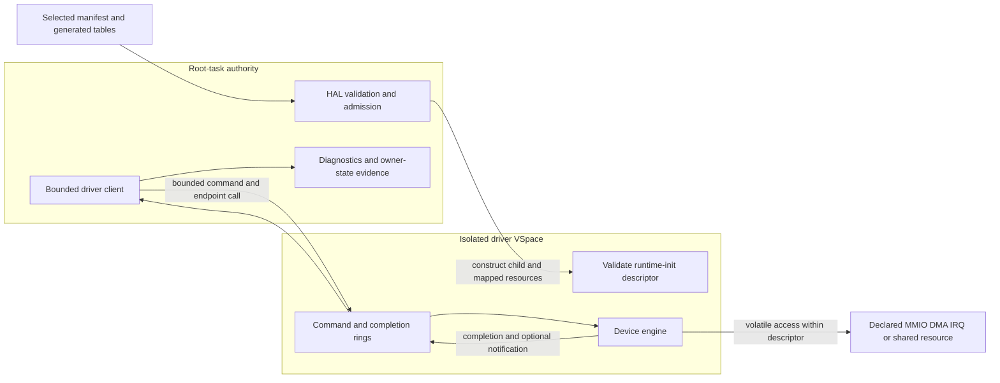

<!-- Copyright 2026 Lukas Bower -->
<!-- SPDX-License-Identifier: Apache-2.0 -->
<!-- Purpose: Define the as-built Cohesix HAL and isolated physical-driver architecture, methodology, status, and proof requirements. -->
<!-- Author: Lukas Bower -->

# HAL and Physical Drivers

This document owns the physical-device architecture: HAL admission, isolated
driver runtimes, the driver-task ABI, device-specific ownership, and the proof
required to claim target support. It does not define operator protocols,
namespace schemas, worker roles, or boot commands. Those belong in
[INTERFACES.md](INTERFACES.md),
[ROLES_AND_SCHEDULING.md](ROLES_AND_SCHEDULING.md),
[HARDWARE_BRINGUP.md](HARDWARE_BRINGUP.md), and
[BOOT_REFERENCE.md](BOOT_REFERENCE.md).

## Normative model

All physical-device authority passes through HAL. On Pi 4, steady-state
physical drivers run as manifest-declared isolated `pi4-driver-*` child images.
Root-task may discover and admit resources, construct seL4 objects, validate
descriptors, submit bounded service turns, collect diagnostics, and retain the
emergency serial escape hatch. It must not contain a parallel steady-state
physical driver.

QEMU compatibility is deliberately different: profile-gated virtual-device or
root-context test drivers may support QEMU and host tests. Their success is not
physical-hardware acceptance evidence.

The active milestone in [BUILD_PLAN.md](BUILD_PLAN.md) controls which driver
changes are legal. A device implementation, generated descriptor, staged image,
flash, boot, owner-state trace, functional transport, and benchmark are separate
evidence states.

## Sources of truth

Use these authorities in order appropriate to the claim:

1. `AGENTS.md` and [BUILD_PLAN.md](BUILD_PLAN.md) define scope, architecture,
   and acceptance requirements.
2. The selected seL4 build directory defines kernel headers, object layouts,
   timer exports, IRQ metadata, and platform truth for that build.
3. The selected `configs/root_task*.toml`, resolved manifest, and generated
   tables define admitted driver images, resources, IRQs, bus links, affinity,
   and profile gates.
4. [`pi4-driver-abi`](../crates/pi4-driver-abi) defines the pointer-free shared
   records accepted by root-task and driver runtimes.
5. Source and tests define implemented behavior.
6. Image readback and boot-paired target evidence prove what ran on hardware.

The generated default-profile summary is
[root_task_manifest.md](snippets/root_task_manifest.md). It is generated
evidence, not text to copy into this guide. Target evidence must identify the
target manifest and fingerprint used for that image.

## As-built architecture

The checked-in default and Pi 4 manifests declare seven isolated runtime
contracts: serial, USB/local-seat, HDMI text, GENET, CYW43, SDIO host, and PCIe
root. Each record names the artifact and entry point and bounds its code, stack,
IPC, ring, MMIO, DMA, shared-buffer, IRQ, and bus-link resources as applicable.



The runtime-init descriptor transports topology and resource metadata. It does
not, by itself, prove that the child owns the hardware or has completed useful
service.

## HAL contract

### Capability-trait map

Drivers depend on the narrowest HAL capability that admits their resource;
model names do not confer authority.

| Trait or boundary | As-built responsibility | Non-authority |
| --- | --- | --- |
| `DeviceHal` | Map a covered device page; allocate and guard DMA frames; report allocator/coverage state; bind and acknowledge HAL-owned IRQ notifications. | Does not grant namespace, parser, policy, or arbitrary physical-address authority. |
| `PciHal` | Discover a HAL-owned PCI topology, map an admitted BAR, and configure an admitted PCI function. | Does not make generic PCI discovery the Pi 4 VL805 authority; that platform path remains in `hal/pi4_pcie.rs`. |
| `Cyw43Hal` | Admit the selected firmware bundle used by the CYW43/SDIO runtime path. | Does not grant root-owned SDHCI, CMD52/CMD53, power/reset, or Wi-Fi transport service. |
| `Hardware` | Compatibility facade combining `PciHal` and `Cyw43Hal` for legacy call sites. | New code must not use it to bypass a narrower capability trait. |
| Driver-task ABI | Deliver sealed runtime-init resources and bounded role-specific commands after HAL admission. | A descriptor is not a new discovery or retyping API. |

The trait definitions are in
[`apps/root-task/src/hal/mod.rs`](../apps/root-task/src/hal/mod.rs). Pi 4
device-specific admission helpers remain HAL implementations, not additional
authority available to driver children.

### Admission

HAL is the only code allowed to:

- discover or accept a physical address;
- locate and retype device untypeds;
- map MMIO, DMA, shared, ring, or framebuffer pages;
- bind an IRQ handler or notification;
- perform platform firmware-service handoff;
- establish DMA bus-address policy; or
- publish an admitted resource to a driver child.

Admission validates the generated image identity, hot path, resource count,
page ranges, alignments, overlap, capability slots, and profile. Unknown,
undeclared, overlapping, or out-of-range resources fail closed.

The child receives only mapped pages and capabilities described by its sealed
runtime-init record. It must not scan physical address space, retype untypeds,
or infer authority from a device model name.

### MMIO

Runtime MMIO helpers must be volatile, range checked, and documented at the
call site. A driver may access only a descriptor range assigned to its role.
Posted-write drains and readbacks must use a safe register in the same admitted
block; an arbitrary readback is not a memory barrier and may have device side
effects.

Register width, ordering, reserved bits, and write-one-to-clear behavior are
part of the driver contract. Diagnostics may observe a register only when the
observation is safe and bounded.

seL4 device untypeds are allocation authorities with a forward-moving
watermark. Retyping or mapping a higher page can make an earlier page in the
same device-untyped region unavailable until the children are revoked. HAL
therefore must:

- pre-admit any lower child-only page before a root mapping consumes a higher
  page from the same device untyped, retain that capability without a root
  VSpace mapping, and consume the admission exactly once into the selected
  child VSpace;
- confirm `device_coverage(paddr, PAGE_BITS)` before mapping each page;
- map every multi-page aperture in ascending physical-page order;
- verify `page_get_address`/`ARMPageGetAddress` equals the requested physical
  address before publishing the mapping;
- use the common device VM attributes rather than call-site-selected cache or
  access attributes; and
- expose registers through bounded `MappedRegion`, `MappedRegisterWindow`, or
  `MappedRegisterPages` accessors unless a narrower helper documents its safety
  invariant.

Coverage, successful retype, successful VSpace mapping, and exact physical
address are separate checks. None may be inferred from a device model or a
working mapping created by firmware, U-Boot, Linux, or a previous boot.

### DMA and cache maintenance

HAL owns DMA allocation and publication. A descriptor carries primitive page
or semantic range records; it never carries a trusted host pointer. The driver
converts only those records into local addresses and device-visible bus
addresses.

The Pi 4 profile currently selects `bounded-no-iommu`. This means allocation,
range, ownership, and cache behavior are bounded and auditable; it is not an
SMMU/IOMMU claim and does not confine a malicious DMA-capable device.

For non-coherent regions:

- clean CPU-produced buffers before device reads;
- invalidate device-produced buffers before CPU reads;
- use the selected seL4 cache operations and the required memory barriers;
- keep descriptor ownership transitions explicit; and
- never substitute `volatile` for cache maintenance.

Ring publication and device DMA ownership are separate. A clean command ring
does not prove that a device payload buffer was cleaned, and invalidating a
payload does not advance a completion index.

### IRQs and notifications

An IRQ path must be generated, admitted, and bound before it is enabled at the
device. The owning runtime captures and clears the device source, acknowledges
the seL4 IRQ according to the selected kernel contract, publishes bounded work,
and reschedules remaining work when its service budget is exhausted.

Root-task may route a generated notification or consume a completion; it must
not become a hidden polling owner for a driver that is required to own the IRQ.
If a boot reports a deferred notification bind, notification-backed acceptance
remains red even when a polled diagnostic makes progress.

The current CYW43/SDIO topology declares one SDIO IRQ owner and a reciprocal
CYW43/SDIO bus link with a fixed event ring. Exact IRQ numbers, badges, slots,
offsets, and depth are compiler-owned in the selected manifest.

### Time

Pi 4 elapsed-time logic uses the read-only virtual counter (`CNTVCT_EL0`) only
when the selected seL4 build exports it. Deadlines are scaled from generated
`TIMER_CLOCK_HZ`. Physical-counter reads, EL0 timer-control registers, dummy
timers, and raw CPU-speed spin loops are not valid hardware timeout sources.

Fixed attempt counts may bound a protocol retry, but any retry intended to
represent elapsed time must also have a virtual-counter deadline. A
counter-qualified trace is required for latency or service-time claims.

## Driver-task ABI

[`crates/pi4-driver-abi`](../crates/pi4-driver-abi/src/lib.rs) is the shared,
`no_std`, pointer-free contract between root-task and
[`apps/pi4-driver-runtime`](../apps/pi4-driver-runtime). The ABI provides:

- a versioned runtime-init record with sealed runtime identity;
- primitive MMIO, DMA, shared-memory, framebuffer, IRQ, and bus-link records;
- fixed command and completion records;
- bounded single-producer/single-consumer ring state;
- generated endpoint and notification slots; and
- role-specific operation and diagnostic codes.

ABI records contain integers, offsets, lengths, identities, and bounded arrays,
not process-local pointers. Both sides validate magic, version, role, identity,
resource counts, ranges, and sequence state before use.

Physical Pi bootstrap also performs a deterministic root-CSpace admission pass
before creating the first linked runtime. The pass parses each selected runtime
ELF, accounts conservatively for code, stack, IPC, ring, MMIO, DMA, shared
buffers, translation structures, the maximum admitted HDMI framebuffer, and a
2,048-slot post-bootstrap reserve. Both canonical Pi seL4 profiles therefore
require `KernelRootCNodeSizeBits=14`; a smaller or stale build is rejected
before partial child construction rather than panicking midway through HDMI or
network setup. Child-only code and stack pages are filled through temporary
root mappings and then transferred using their original mapping capabilities.
Framebuffer pages are mapped exclusively into the HDMI child without a
root-VSpace alias. Ring, IPC, and explicitly root-shared pages retain separate
caps because their ABI ownership genuinely crosses the root/runtime boundary.

### Scheduling contract

Every hardware service path presents a validated `DriverTaskContract` before
HAL admits a turn. The contract records:

- a stable name and hardware kind;
- service class (`RealtimeInput`, `ConsoleOutput`, `NetworkControl`,
  `NetworkData`, `DisplayRefresh`, or `Background`);
- authority class (`DeviceOnly`, `ConsoleTransport`,
  `NetworkFrameTransport`, or `DisplaySink`);
- isolation state (`DedicatedSeL4Task` or the explicitly reported,
  non-acceptance `RootTaskCompatibility` fallback);
- per-turn maxima for HAL operations, bytes, frames/reports/rows, and any
  explicitly admitted bounded bootstrap spins;
- whether waits are permitted and whether the turn is preemptible; and
- the maximum inbound IPC/event queue depth.

Zero or out-of-range budgets, unbounded waits, a non-preemptible contract,
authority/class mismatch, or an unsupported isolation state fail validation.
MCS scheduling-context fields are profile-qualified; on a non-MCS profile,
priority/domain policy plus the same bounded IPC and service-turn contract
provide the applicable scheduling controls. Neither contract declaration nor
generated affinity proves applied target scheduling without boot evidence.

### Service turn

1. Root's driver client reserves a free command slot.
2. It publishes a fully initialized command and advances the producer state
   with the required ordering.
3. It performs the bounded endpoint call or notification defined by the
   generated topology.
4. The driver validates the command and consumes only its declared resources.
5. The driver performs bounded work and publishes one completion, progress
   state, or explicit pending result.
6. It replies only when a real reply capability exists and signals only a
   declared notification.
7. Root consumes the completion and returns control to the event pump.

No service turn may contain an unbounded wait for hardware, firmware, network
traffic, or another driver. Pending work remains explicit and resumable.

## Device ownership and current status

This table separates implementation from hardware proof. “Implemented” means
the runtime and generated contract exist; it does not claim that the latest
image has passed the device's acceptance gate.

| Contract | As-built owner and boundary | Evidence status |
| --- | --- | --- |
| Serial | Isolated mini-UART runtime owns bounded steady RX/TX. Root retains an emergency serial path for fatal diagnostics and recovery. | Runtime and ABI implemented. Current-image prompt and owner-state evidence remain target-qualified. |
| USB/local-seat | Isolated xHCI runtime owns controller state, root- and hub-connected boot-keyboard discovery, HID polling, and report completion within admitted PCIe/MMIO/DMA resources. | Runtime implemented. Keyboard enumeration, first report, command-ready input, and no stalled service turn must be proved on the current image. |
| HDMI text | Isolated runtime renders bounded text into the HAL-admitted framebuffer; root submits text/service records. | Runtime implemented. Current-image framebuffer, visible output, and bounded refresh proof are separate from serial readiness. |
| GENET | Isolated runtime owns MAC/MDIO and bounded RX/TX descriptor rings. Root consumes a network-driver trait. | Accepted Milestone 26c wired evidence exists for its recorded image. Milestone 26d current-image and benchmark revalidation is a separate requirement. |
| PCIe root | Isolated runtime services declared PCIe MMIO operations; HAL owns platform admission and firmware/reset authority. | Runtime implemented. PCIe/VL805 identity, BAR/COMMAND, link, and downstream USB proof must be tied to the current boot. |
| SDIO host | Isolated runtime exclusively owns SDHCI MMIO, CMD52/CMD53, card interrupt handling, and bus-owner service. | Runtime, generated IRQ/DPC topology, Linux-aligned elapsed timing, deterministic controller model, whole-action restart cuts, modeled CARD_INT/notification substeps, and persistent outer-fence failures are implemented. Repeated physical functional proof remains an acceptance gate. |
| CYW43 Wi-Fi | Isolated runtime owns firmware upload, SDPCM/BDC control, EAPOL/data service, and bounded RX state through the generated CYW43-to-SDIO link. It receives no direct SDHCI MMIO authority. Root supervises transient bootstrap after publishing serial/local-seat and performs a full pair/context replay on retry. | Implementation remains active research/closure work. Production acceptance requires 10/10 cold plus 10/10 warm boots of one read-back image with association, DHCP, raw TCP/`cohsh`, ordered RX, and clean DPC counters; historical or offline success is not current closure. |

### QEMU network drivers

Virtio-net and RTL8139 remain profile-gated QEMU compatibility drivers. They
exercise network and console semantics without proving GENET, SDIO, CYW43,
PCIe, USB, DMA, IRQ, or Pi timer behavior.

## Stable device-specific invariants

### Serial

- Emergency serial must remain usable when an isolated runtime fails to start.
- Emergency ownership is diagnostic and must not be counted as migrated
  steady-state ownership.
- Input, output, and recovery loops remain bounded; a stalled device cannot
  monopolize the event pump.

### HDMI and local seat

- The framebuffer and keyboard resources are separately admitted and proved.
- After the ordinary EventPump starts, USB attach, one keyboard-enumeration or
  report poll, HDMI attach, and one pending-frame service are retained turns:
  each outer turn may issue one immutable linked-runtime request or poll one
  matching completion, then returns. An HDMI attach attempt and a frame submit
  never share an outer turn.
- HDMI feedback may degrade under load but must not block serial/local-seat
  input or fatal status.
- A USB byte, a HID endpoint, a keyboard-ready marker, and a usable command
  parser are separate gates.
- USB retained service has typed `Pending`, `Complete`, and `Failed` outcomes.
  A normal multi-turn `Pending` result preserves the immutable command ticket,
  command-ready evidence, and no-reply counters; only a terminal `Failed`
  outcome may revoke readiness or add no-reply debt. This prevents ordinary
  prepare/boost/commit/notify/poll phases from manufacturing USB pressure that
  can starve keyboard input or HDMI refresh.
- `usb diag` is a cached, passive, compact ten-gate report. It does not poll
  the USB runtime or prepend the verbose `usb status` counters. Ordinary
  response-body records cannot consume the three linked-serial protocol-tail
  slots reserved for the terminal ACK/END and prompt, so backpressure cannot
  strand the physical-response fence or block later serial/USB input.
- `usb probe-kbd` emits only its one-slice result, explicit
  `continuation=pending|terminal` state, cached runtime contract, verdict, and
  terminal `OK`; it does not reuse the verbose `usb status` dump. The complete
  command response must fit below the 2,048-byte serial output bound. A pending
  command-owned probe cursor advances by one operation on each later
  `LocalSeat` turn and restores the prior polling policy when it terminates.
- `wifi diag` is likewise a single cached read: it never performs the old
  dump/probe/dump sequence, and retained progress is explicitly labelled as
  historical when a newer terminal fault exists. `netstats` and `smp activity`
  are passive retained-counter reports. In contrast, `nettest` starts the
  bounded network self-test and `usb probe-kbd` advances one retained
  enumeration attempt, so operators must wait for each command's terminal
  status before sending the next burst.
- If a USB diagnostic service turn stops replying, preserve the boot evidence
  and stop submitting more commands until the bounded recovery path or a fresh
  boot.

### PCIe and USB

- Firmware reset and root-complex admission remain HAL-owned.
- The Pi root completes the current synchronous PCIe HAL prerequisite before
  constructing the EventPump. This is pre-pump local bookkeeping and authority
  setup for the retained USB cursor, not root-owned steady USB service and not
  permission to combine PCIe, USB, or display operations later. If the proof is
  absent, the retained USB attach cursor remains blocked at its PCIe
  prerequisite and cannot bypass HAL.
- Live PCIe identity, class, BAR, command, link, and DMA-window evidence must
  precede xHCI ownership credit.
- Linux or U-Boot captures may inform static layout; they do not grant runtime
  authority and are not accepted as live Cohesix state.
- USB interrupt delivery must not be claimed when the selected path is
  intentionally poll-driven.

### GENET

- Descriptor ownership and cache transitions are explicit for every RX/TX
  buffer.
- Dispatching a wired network-console command performs zero same-turn TCP flush
  polls. Root retains a connection-owned post-command response cursor instead;
  each later `Network` phase performs exactly one budgeted GENET TCP flush and
  returns. The cursor is bounded to eight phases normally or sixteen while the
  local display reports backlog pressure. A second buffered command cannot
  dispatch until the first response cursor completes or exhausts its bound, and
  a changed or absent active connection discards the stale cursor instead of
  applying it to a replacement session.
- The post-command cursor is GENET-specific. A data-ready CYW43 console keeps
  using the ordinary one-operation `Network` poll path; it neither creates nor
  consumes the wired flush cursor.
- Link, DHCP, ARP, TCP, console, and performance evidence are separate.
- A real DHCP lease or TCP handshake is stronger datapath evidence than a stale
  readiness bookkeeping flag, but it does not waive other acceptance gates.

### SDIO and CYW43

This as-built closure is authorized by Milestone 26d task
`m26d-cyw43-hardware-free-closure` and Reopened Milestone 26b task
`m26b-wifi-sdio-notification-dpc-closure`.

- SDIO is the sole SDHCI owner; CYW43 submits bounded bus-link operations.
- After engine initialization, the SDIO runtime accepts only the fixed-layout
  typed reciprocal descriptor. The former aux-packed raw command shape is
  rejected before controller access; it is not a compatibility or diagnostic
  service lane.
- Linux `mmc-bcm2835`/MMC-SDIO and `brcmfmac` ordering is the behavioral
  reliability oracle, adapted to the linked-runtime authority boundary rather
  than copied as a root-owned driver. The external-DMA adaptation was checked
  against Raspberry Pi Linux commit
  `89050b1059997d38d55462b323b099a6436dc10d`; the audited
  `bcm2835-mmc.c` and `bcm2835-dma.c` SHA-256 digests are respectively
  `8c12ad975529715bc05f6573a70d74488c62d78b5f35384df5aa6f3fe4cb1683`
  and `936f55cca6cb9989f24d72bce8f6788c94fa101110ef815aae219b7f6dbec6eb`.
  CYW43 engine initialization is
  descriptor- and local-state-only: it cannot submit an SDIO child. Root first
  completes the irreversible SDIO producer handoff; only then may the first
  retained `TRANSPORT_INIT` turn request one generation reset from the SDIO
  owner. A later turn starts fresh owner-side enumeration in Linux order:
  startup host configuration, `CMD0`, discovery `CMD5(0)`, bounded ready
  `CMD5(OCR)`, `CMD3`, and `CMD7` with the required short-busy R1b response. Generation
  reset completion, enumeration, and generation commit remain separate turns.
  Power sequencing is itself retained: engine-init state/health/policy/IRQ
  publication, firmware property post/reply, WL_ON mailbox service,
  reset issue/poll, clock disable/program/stable-poll/enable, host-status repair,
  and generation reset each consume separate outer turns. Startup host
  configuration and generic CMD5/CMD52/CMD53 service use the same retained
  request owner. Generation commit resets the reciprocal DPC ring before it
  publishes generation state and health, then writes interrupt-enable and
  signal-enable policy on separate turns.
  After CMD7, a request- and generation-bound card-lane cursor reads CCCR
  revision and capabilities on separate outer turns. It rejects an unsupported
  revision, missing `CAP_SMB`, or a low-speed card without `4BLS` before any
  FBR or firmware write; Cohesix does not create a compatibility lane. It then
  reads CCCR `SPEED`, requires SHS, enables and verifies EHS, programs the
  selected high-speed host clock while the host remains one-bit, read-modify-writes
  and verifies CCCR `IF` while preserving non-width bits, and only then
  programs the host for four-bit operation. Function 1 block size 64,
  Function 2 block size 512, and Function 1 enable follow only after that
  retained adoption completes. Stale ownership, a changed generation, or an
  issued-unknown completion poisons the lane and requires ordered pair
  recovery. During an admitted E to E+1 pair reset, the rebuilt card facts are
  owned by pending epoch E+1 even while reciprocal commands still traverse the
  old sealed link; the exact generation commit makes E+1 active without
  relabeling or reusing any E-owned fact.
  Same-command retries are admitted only for an entry-inhibit result proving
  the command register was never written. A CMD7 busy timeout is recorded as
  post-issue quiescence; command, response, busy, and later failure stages are
  issued-unknown and leave through pair recovery without replay.
  A pair restart already performs its owner-side physical reset and therefore
  must not trigger a second CYW43-requested power cycle in the same episode.
- The physical Pi profile places SDIO and CYW43 on the same driver core. Both
  deferred runtimes retain shell-safe bootstrap priority `255` through exact
  owner-first descriptor and engine replay, firmware/control-context replay,
  and control-plane readiness. The supervisor registers and replays the SDIO
  owner descriptor first, then registers and replays the CYW43 client
  descriptor; neither replay lowers a child early. After the control plane is
  ready, one outer turn lowers SDIO to its steady contract priority and a
  separate later turn lowers CYW43. Descriptor replay, priority cutover, and
  the next child operation never share one CYW43 operation permit. Pair
  recovery raises and reprograms SDIO, then raises and reprograms CYW43 while
  both are suspended; it resumes and proves the owner before the client, keeps
  both at priority `255` through engine and retained context replay, and lowers
  SDIO then CYW43 only after renewed control-plane readiness. There is no
  client-first descriptor service or legacy fallback ordering. A real
  post-claim steady-priority failure is sticky for that episode: the same
  generation cannot reclaim the cutover. With a sealed pair-restart context it
  enters the exact owner-first restart, which resets the latch only at the
  bootstrap-priority transition; an absent restart context or a cutover
  precondition rejection remains terminal.
- A retained one-way root-to-runtime request cannot rely on `seL4_Yield` to
  schedule a child below the root task. HAL therefore advances a request- and
  generation-bound scheduling lease through separate ordinary EventPump
  turns. The first turn prepares the immutable ring record with sequence zero,
  so an autonomously polling child cannot observe it. Later turns boost the
  reciprocal SDIO owner when required, boost the primary child, commit the
  nonzero sequence as the issue boundary, publish one best-effort one-way
  endpoint doorbell, and poll the matching completion once per turn. After that
  completion is latched, later turns restore the primary child before the bus
  owner and release the lease before exposing the completion to its caller.
  Root-to-runtime retained commands use the runtime's command endpoint. If one
  of those commands returns `Pending`, the child retains the exact command and
  blocks on the combined endpoint/notification receive; it does not
  `seL4_Yield` into another foreground quantum. Each subsequent root-command
  quantum requires a later EventPump turn to repeat the one-way endpoint
  rendezvous for the same sequence. The child admits it only when the complete
  ring record still matches the retained immutable no-reply intake. This wake
  is not a new issue boundary: it never republishes, mutates, or replays the
  command. seL4 `NBSend` is delivered only while the child is waiting on the
  endpoint, so dropped sends do not queue and successful sends cannot
  accumulate foreground authority.

  Delegated CYW43-to-SDIO work has a different authority path. Successful
  one-way owner handoff deletes and zeros root's SDIO endpoint authority, and
  CYW43 receives no substitute endpoint cap. A retained multi-phase SDIO child
  therefore advances through one fixed 24-byte acknowledged continuation grant
  in reserved bytes 40 through 63 of the shared owner command page. The record
  carries a magic discriminator, request sequence, fingerprint of every action
  field, authoritative SDIO generation, monotonic nonzero grant id, and the
  SDIO consumer's `consumed_grant_id`. CYW43 publishes the immutable body and
  then the grant id as the sequence-last commit. It never overwrites an
  unacknowledged grant: a missed acknowledgement re-signals the same id, while
  a new id is published only after the preceding id is acknowledged. Grant-id
  exhaustion, malformed state, an already-consumed id, or any identity mismatch
  fails closed.

  The delegated owner compares the command generation with its independently
  retained SDIO generation before the first physical action, binds that
  generation when the command first returns `Pending`, validates the stable
  grant against that retained intake, and irrevocably acknowledges exactly one
  grant before spending its one continuation quantum. CYW43 alone holds a
  send-only copy of the SDIO owner's command endpoint after root deletes its
  steady producer cap. Its endpoint message carries only the immutable ring
  sequence: first intake requires the sequence-last command, and every retained
  phase additionally requires the exact unused shared grant. A failed
  completion poll plans publication or re-signal, the next `Grant` turn
  performs that one retained grant action and one endpoint doorbell, and a
  later `Poll` turn observes the result. Foreground and DPC-owned children use
  the same `Poll -> Grant -> Poll` separation.

  IRQ and completion/DPC notifications remain coalescing service wakes and can
  never advance a retained foreground cursor. A real SDIO IRQ may consume one
  notification-service quantum; immediately reasserted level wakes are
  retained until a later admitted endpoint turn, and that service turn cannot
  spend an exact foreground grant. Explicit scheduler handoffs follow service
  and rejected immediately-ready wakes, so a
  priority-255 runtime cannot form a private IRQ loop. The reserved high
  notification bit is excluded from service badges but is not foreground grant
  authority. Root keeps the original unbadged notification cap private for TCB
  bind/restart, the child's bound local-notification cap is receive-only, and
  the generated child-held routes are the CYW43-to-SDIO owner endpoint and the
  SDIO-to-CYW43 badge-2 notification; the SDIO IRQ carries badge 159. A dropped
  nonblocking initial endpoint send cannot replay work: the later completion
  miss publishes or re-signals the same immutable grant and endpoint sequence
  on separate outer turns. An idle runtime blocks for a new endpoint command
  instead of polling or yielding. The legacy `dpc_owner_rearms` trace field
  counts generation-scoped nonblocking owner-endpoint publication attempts,
  not proven message delivery. Actual SDIO owner progress and rearm are
  established by durable ring and owner telemetry such as `card_irq_rearms`.
  Request, full command fingerprint, and pair generation must match throughout;
  an issued-unknown request cannot be recommitted or granted again. Pair restart
  clears an unresolved lease only after both runtimes are suspended and fenced.
  Root-command phase order is `prepare -> boost bus -> boost primary -> commit
  -> endpoint wake -> poll -> [endpoint wake -> poll]* -> restore`;
  delegated-owner phase order is `submit -> poll -> [grant -> poll]*`. Every
  rendezvous, grant, and poll is a separate root EventPump turn. These are
  scheduling admissions for one immutable operation, not private send/poll
  loops or legacy driver fallbacks.
- Clearing a root-to-runtime transport also clears its cached progress magic,
  sequence, phase, and auxiliary word. Progress evidence is scoped to one
  transport generation; a rebound endpoint cannot inherit an earlier issued
  action and poison the replacement generation.
- Root-task must not wait synchronously for CMD5/CMD52/CMD53 credit, firmware
  replies, or RX drain work.
- The production EventPump is configured in place and borrowed by both the
  Genet and deferred-WiFi console loops. The retained CYW43 supervisor is reset
  in place between bounded outer attempts. This avoids nested by-value copies
  of the 54-KiB pump and 46-KiB supervisor on the 256-KiB root stack while
  preserving one no-allocation owner.
- Each SDHCI request follows the selected Pi 4 `mmc-bcm2835` register contract.
  Every CMD5, CMD52, and CMD53 first receives a separate 10-millisecond
  pre-issue inhibit fence. The owner arms a fresh Linux-equivalent 10-second
  request watchdog only after that fence succeeds and immediately before the
  command can issue, so time spent proving ownership cannot consume the issued
  request's lifetime. Data and short-busy requests refresh
  `TIMEOUT_CONTROL=0x0e`. The bounded owner envelope reserves at most two
  transfer attempts and an independent 220-millisecond containment interval
  after each failed attempt; the second transfer attempt is admitted only when
  the first failure was the entry-inhibit stage and therefore proves that no
  command was issued. Any later failure is issued or issued-unknown and cannot
  replay in the same generation. The shared ABI derives a 20.56-second
  CYW43-to-SDIO child bound from those maxima plus its 100-millisecond handoff
  margin. Root applies a 30.56-second per-child lease, preserving a full
  10-second parent margin instead of racing the child's legal completion edge.
  A lease renews only on a fresh `OWNER_REPLY` edge carrying the exact active
  parent sequence, descriptor fingerprint, generation, and CYW43 aux marker.
  Repeated, stale, wrong-sequence, or unrelated progress cannot renew it, and
  the shared 1,024-action foreground-trace bound caps all renewals for one
  immutable parent operation.

  For data requests the retained owner seals one engine into the immutable
  request identity from the normalized SDHCI host block count: one or two host
  blocks use retained PIO, while more than two use the external BCM2835 DMA
  engine. This is one request path, owner, cursor, and recovery policy rather
  than independently selectable lanes. Both engine shapes inspect, repair, and
  verify block-gap state and separately clear status and program timeout, block
  size, block count, argument, and transfer mode. External DMA retains the
  persistent idle interrupt policy. PIO additionally programs a request-local
  policy that adds only its direction-correct `SPACE_AVAIL` or `DATA_AVAIL`
  source while the request is active. External DMA also admits DMA authority,
  proves the channel idle, and stages the complete immutable control-block
  chain.

  One deliberate issue turn writes COMMAND. For external DMA, that same
  indivisible issued action then publishes DMA RESET, control-block address, and
  ACTIVE in Linux order, exactly as `bcm2835_mmc_request()` hands the issued
  request to dmaengine without waiting for the response IRQ. PIO does not start
  or inspect DMA; after validating the fresh response and R5, each later outer
  turn may move at most one raw 32-bit word through `SDHCI_BUFFER`, and only
  while the direction-correct ready edge and `PRESENT_STATE` prove ownership of
  the current block. An early ready edge without matching present-state
  ownership is consumed as a wakeup and cannot authorize later FIFO access
  without a fresh edge.

  Both engines independently join the exact response, complete payload
  movement, possibly coalesced `DATA_END`, and host quiescence. PIO then
  restores the ordinary interrupt policy on a later turn; external DMA never
  changed that persistent base policy. External DMA additionally requires no
  DMA error, `CONBLK_AD == 0`, and this request's `CS.INT`; it acknowledges that
  W1C edge with Linux's `INT | ACTIVE` value. Its final control block sets
  Linux's `INT_EN`, intermediate blocks do not, and a full store-completion
  fence plus same-channel status readback after ACTIVE prevents an immediate
  join poll from observing a posted start as false completion. The external
  engine does not set `SDHCI_TRNS_DMA`; that bit belongs to SDHCI's internal
  DMA mode, not Linux's dmaengine path. SDHCI `readl`/`writel` and raw FIFO
  access retain the required AArch64 device-ordering barriers. Idle and
  external-DMA interrupt admission use the exact named Linux mask
  `0x02ff000b`. An active retained-PIO request derives
  its mask by removing DMA-only `DMA_END` and `ADMA_ERROR`, adding only its
  direction-correct ready source, and preserving that source across any
  interleaved CARD_INT policy rewrite; `SIGNAL_ENABLE` never gains a PIO
  source. `CARD_INT` is added only while that asynchronous source is armed.
  Terminal detection still observes the broad `INT_STATUS` error mask
  `0xffff8000`; request-local `DMA_END` is progress only and never substitutes
  for `DATA_END`.
- The compiler-declared SDIO owner has exactly three MMIO pages and ten low,
  uncached DMA pages. MMIO page 0 owns SDHCI at `0xfe300000`, page 1 owns the
  firmware mailbox aperture, and page 2 owns the BCM2835 DMA controller at
  `0xfe007000`; only physical channel 4 at offset `0x400` is admitted. DMA page
  0 remains the mailbox request, page 1 holds 32-byte-aligned control blocks,
  and pages 2-9 are the 32-KiB SDIO bounce arena. Channel 4 uses SDIO DREQ 11,
  peripheral bus address `0x7e300020`, and the low-RAM bus alias
  `physical | 0xc0000000`. Missing, aliased, high-memory, misaligned, or
  incorrectly tagged resources fail descriptor admission before command issue.
  Because `0xfe007000` and the firmware mailbox at `0xfe00b000` share the
  generated 21-bit seL4 device untyped, HAL admits the lower DMA-controller
  page before pre-seeding the higher root mailbox mapping. The retained DMA
  capability is never mapped in root and is removed from HAL's discovery cache
  after its one mapping into the SDIO child. This is resource ordering for the
  external-DMA engine selected above the Linux-shaped barrier, not a second
  launch path or fallback.
- Cohesix intentionally has one production SDIO request lane with the
  Linux/Raspberry Pi `mmc-bcm2835` engine threshold embedded in its immutable
  request identity. A normalized host block count of at most two selects
  retained PIO; more than two selects external DMA. Byte-mode CMD53 therefore
  has one normalized host block and uses PIO regardless of byte length. Once
  admitted, a request cannot switch engine after a ready, response, transport,
  DMA-resource, timeout, or containment failure. There is no operator-selectable
  engine, root-owned data path, lower-clock or narrower-bus rescue, legacy
  fallback, same-generation replay, or second boot lane.
  Function 1 firmware streaming retains one immutable 32-KiB backplane
  aperture, matching brcmfmac's production RAM-write window rather than its
  debug-only 2-KiB `MEMBLOCK` readback unit. MMC-shaped CMD53 partitioning
  drains a full aperture as `511 * 64` bytes followed by `1 * 64` bytes; the
  final aperture uses as many full 64-byte blocks as possible and one bounded
  byte-mode tail after four-byte transport padding. Thus the 511-block child
  uses external DMA while the one-block child and byte-mode tail use retained
  PIO by the same sealed threshold. Each child CMD53 is issued once and retained
  across later owner turns. Window edges and the true final remainder affect
  normalized geometry before admission; they cannot change an admitted
  request's engine or select a compatibility boot lane. Block mode is legal
  only after retained `CAP_SMB` proof.
- Noncontiguous bounce pages produce one immutable control block per physical
  segment. Writes copy the reciprocal-ring payload into the bounce arena before
  the DMA store barrier; reads apply the DMA load barrier before copying back.
  For an external-DMA request, the SDIO owner retains the exact cursor after
  command and channel activation. Each later continuation samples one immutable
  SDHCI plus DMA snapshot, latches response, `DATA_END`, and DMA terminal
  evidence independently, and returns without a private wait loop. Lone
  `SPACE_AVAIL`/`DATA_AVAIL` observations remain outside this engine's W1C
  ownership, and block-gap control is required to remain zero.
  Completion requires `CONBLK_AD == 0`, this request's terminal DMA `CS.INT`,
  no DMA `CS.ERROR`, and SDHCI `DATA_END`, with the DMA and SDHCI terminal
  edges accepted in either arrival order. The DMA edge is acknowledged exactly
  once with `INT | ACTIVE`. `DMA_END` is enabled and acknowledged
  as Linux-shaped progress only; it cannot satisfy either terminal join
  condition. A deadline or either-engine error records pre-containment SDHCI
  and DMA state, clears `NEXTCB`, performs the bounded channel-local
  abort/reset, resets the SDHCI command/data path, and returns an issued-unknown
  result. It never replays that action in the same generation.
- For a retained PIO request, the same owner cursor never requests DMA
  authority, constructs a control block, or starts/contains the DMA channel.
  It validates response/R5 before touching the FIFO, acknowledges only the
  direction-owned ready source after pairing it with live block ownership, and
  moves one raw `SDHCI_BUFFER` word per outer EventPump turn. Completion still
  requires the exact payload length, `DATA_END`, and quiescent SDHCI
  command/data state. Timeout, controller error, short payload, missing
  `DATA_END`, or lost ready ownership poisons the generation and enters the
  common bounded host containment path without engine switching or replay.
- A failed owner transfer snapshots telemetry version 3 before command/data
  containment clears or resets either engine. Its stable prefix contains
  present state, interrupt status, response, host/power/clock state,
  block-size/count, payload digest, and DMA `CS`, `CONBLK_AD`, and `NEXTCB`.
  The version-3 extension adds the live SDHCI argument,
  transfer-mode/command, timeout/block-gap, interrupt-enable, signal-enable,
  and host-control-2 registers plus BCM2835 DMA `TI`, source, destination,
  length, stride, and debug registers. The returned fault frame therefore
  describes the terminal request, not the recovered host. Root classifies
  absent DMA authority, never-started, active or stuck, error, and
  chain-exhausted states and renders mandatory
  `reason`, `result`, `clock_state`, parent-request length, child-transfer
  length, and direct-versus-inferred gate fields on separate bounded lines so
  serial truncation cannot silently change the diagnosis.
- Firmware-preparation probe attach follows Linux `brcmf_sdio_kso_init`
  exactly: read `SLEEPCSR` once and write `KSO` once only when the bit is
  absent. It does not poll `KSO` or require `DEVON` at this stage; the later
  runtime wake transition owns the bounded `KSO|DEVON` readback. This keeps
  probe attach from inventing a stronger device contract or consuming the
  foreground trace as a surrogate one-second KSO timer.
- Function 1 enable uses the SDIO CIS timeout when that field is eventually
  carried by the ABI; the current fixed profile uses Linux's one-second
  fallback. Its generation- and request-bound cursor separates the `IOEx`
  read, the single `IOEx.F1` write, every `IORx` read, and every deadline
  observation into distinct outer EventPump turns. A slow valid card can pass
  more than 1,024 structural-test reads without growing the foreground trace;
  production remains bounded by the one-second elapsed deadline. Stale or
  issued-unknown ownership poisons the cursor and permits no same-generation
  replay. Backplane attach is a generation- and request-bound retained
  cursor with explicit `ALP request`, `ALP poll`, `FORCE_ALP`, `FORCE_ALP
  settle`, `pull-up clear`, `ChipCommon read`, and `complete` phases. ALP
  availability uses one absolute one-second elapsed deadline. Each exact
  `CHIPCLKCSR` poll checkpoints the cursor's deadline, last value, and poll
  count, then releases the foreground trace before a later outer EventPump
  turn. A long ALP wait therefore does not consume one entry per poll from the
  1,024-action foreground trace and cannot mistake trace capacity for an
  elapsed-time bound. The first read validates all synchronous writable bits,
  excluding only asynchronous availability bits.

  Before either linked runtime starts, HAL establishes the Linux Pi pinctrl
  state for GPIO34-GPIO39: ALT3 on all six pins, no pull on CLK, and BCM2711
  register-native pull-up value `1` on CMD/DAT0-DAT3. It reads GPFSEL3 and
  GPPUPPDN2 back and fails Wi-Fi bootstrap closed unless every selected field
  matches. This is deliberately after lower child-only DMA capability admission
  but before SDIO engine construction, so the monotonic seL4 device-untyped
  cursor and the Linux `pinctrl-before-mmc-probe` ordering both hold.

  After `FORCE_ALP`, the retained cursor preserves the 65 microsecond settle.
  Both nonterminal and terminal deadline observations consume their admitted
  turn. The next retained turn follows brcmfmac by issuing exactly one Function
  1 CMD52 that writes `SBSDIO_FUNC1_SDIOPULLUP=0`, after host pinctrl is already
  configured and read back. Cohesix adapts Linux's best-effort callback to the
  linked-runtime authority boundary: `Pending` retains the immutable action
  ticket, only the exact completion advances to ChipCommon, and a failed,
  malformed, stale, or issued-unknown completion poisons the generation. It is
  never replayed in that generation. An ordered pair restart may issue the
  clear exactly once under its new generation, and the generation-reprobe
  allowlist admits only this zero-valued write at the pull-up register. The
  SDIO owner independently claims that exact descriptor before controller
  issue and rejects a duplicate claim in the active or pending generation.

  Attach diagnostics identify the exact retained frontier with distinct
  `BACKPLANE_ALP_REQUEST`, `BACKPLANE_ALP_POLL`,
  `BACKPLANE_FORCE_ALP`, `BACKPLANE_FORCE_ALP_SETTLE`,
  `BACKPLANE_PULLUP_CLEAR`, and `BACKPLANE_CHIPCOMMON_READ` progress.
  `BACKPLANE_PULLUP_SKIPPED` and `BACKPLANE_PULLUP_FAULT_CONTAINED` remain
  decodable only for earlier captures and are not current-image acceptance
  progress.
  The first ChipCommon access additionally
  publishes `BACKPLANE_WINDOW_LOW`, `BACKPLANE_WINDOW_MID`, and
  `BACKPLANE_WINDOW_HIGH` immediately before the matching CMD52 programming
  operations. Each child submission, continuation grant, completion poll, and
  retained deadline poll remains a separate outer EventPump turn; a terminal
  child or deadline poll cannot compose the next attach action into that turn.
- Firmware download has a distinct retained preparation cursor; it does not
  reuse the initial backplane-attach trace or enter an immediate descriptor
  loop. The immutable root request and SDIO generation own the cursor through
  ARMCR4/D11 passive setup, KSO, `CARDCTRL.WLANRESET`,
  `PMUCONTROL.RES_RELOAD`, Function 2 disable, `CHIPCLKCSR=0`, a fresh
  `ALP_AVAIL_REQ`, ALP readiness, and SoCRAM upload preparation. The
  `CHIPCLKCSR=0` edge is Linux's `CLK_SDONLY` boundary between probe attach and
  the asynchronous firmware callback; omitting it is invalid. ARMCR4 and D11
  have deliberately different passive states. The ARMCR4 cursor programs its
  LOW/MID/HIGH window, asserts reset, configures the in-reset `CPUHALT` state,
  clears `RESETCTRL` with the bounded Linux retry/deadline, and finishes with
  `IOCTRL=CPUHALT|CLK`; firmware is uploaded into TCM while ARMCR4 is
  reset-deasserted, clocked, and halted. D11 is core-disabled and remains reset
  asserted for firmware to enable. Each window byte, control write, flush read,
  retained settle, reset read, KSO operation, and probe-attach operation is an
  explicit cursor phase, so even an immediately completed SDIO child cannot
  authorize a second physical operation in that EventPump turn. PMUCONTROL
  preserves Linux's little-endian `readl()`/modify/`writel()` semantics with
  one incrementing four-byte Function 1 CMD53 read and one incrementing
  four-byte Function 1 CMD53 write at the backplane-word address `0x8600`.
  Each immutable child uses retained PIO under the normalized one-block
  threshold and moves its one raw word on a distinct outer turn. The
  generation-owned cursor is the sole sequencer. No bytewise CMD52 update,
  alternate address, engine switch, byte replay, or fallback is permitted.

  After SoCRAM preparation and before the first firmware CMD53, that same
  cursor invalidates every cached firmware-transfer fact and re-proves the live
  card contract through retained phases: Function 1 block-size low/high reads,
  CCCR capabilities with `CAP_SMB` and low-speed `4BLS` validation, four-bit
  interface readback, SHS+EHS speed readback, ALP availability/readback, exact
  RAM-window LOW/MID/HIGH writes, and exact LOW/MID/HIGH reads. Every CMD52 is
  one child operation in one ordinary EventPump turn; the final local contract
  commit consumes a later turn and publishes all derived authority atomically.
  Any failed phase, stale owner/generation, or issued-unknown result invalidates
  the complete contract and cannot replay. Production-chain failure-cut tests
  traverse the reciprocal ring and real controller seam at every phase, proving
  terminal deterministic failure and no second controller issue.

  The fresh firmware-download ALP request retains the same absolute one-second
  PMU deadline and validates its first readback, but unavailable reads are
  spaced by retained five-millisecond virtual-counter settles. The CMD52 read,
  each settle observation, and the absolute-deadline observation return on
  separate outer turns, checkpointing and clearing the foreground action trace
  after each completed phase. The production one-second/five-millisecond
  contract permits about 200 physical reads; an extended-deadline structural
  test drives more than 1,024 reads solely to prove checkpoint capacity, not
  wall-clock behavior. A stale request or generation, issued-unknown child,
  terminal failure, or second preparation in the same generation performs no
  replay; only the ordered pair restart may create a new preparation cursor.
  Fault `0x5337` names failure of the SD-only clock write, remains at Wi-Fi Gate
  5, and admits new-generation SDIO-owner recovery but never same-command retry.
- Firmware release has its own immutable request- and generation-owned cursor;
  the immediate descriptor path is fail-closed. It checkpoints the ordered
  Linux transition through stale-interrupt clear, optional reset vector,
  ARMCR4 disable/assert, retained RESETCTRL clear/50-microsecond settle/read,
  the 20-millisecond `CLK_SDONLY` fence, paced HT readiness, `FORCE_HT`, mailbox
  version, Function 2 enable, dongle masks/sideband, core-ready proof, firmware
  mailbox proof, final interrupt arm, and DPC activation. The bounded ARM clear
  loop, every HT read/settle/deadline observation, every `IORx` read/deadline
  observation, and every firmware-mailbox read/deadline observation are
  separate outer EventPump turns. Function 2 `IOEx` is issued exactly once.
  Delayed success at the 51/200/3,000/1,000 bounds cannot consume the
  1,024-action foreground trace or 64-slot deadline table.

  `firmware_execution_started` is published only after the exact ARMCR4
  RESETCTRL-clear completion; `firmware_released` is published only after the
  exact generation-bound DPC activation completion. Any stale owner,
  generation change, reset-vector mutation, issued-unknown child, or retained
  terminal failure rejects all further same-generation release I/O. Only the
  deterministic CYW43/SDIO pair restart may establish a new release owner.
- Function 2 enable is one `IOEx` write followed by elapsed `IORx` polling for
  up to three seconds. A transient miss does not clear/re-enable F2 or start a
  raw-spin retry. Post-release write readiness likewise does not re-prime F2
  within the same generation; an ambiguous issued transfer poisons that
  generation, and pair recovery owns the only retained replay.
  Typed `CONTROL_FRAME` and `ETH_TX`/EAPOL parents remain `Pending` across the
  pure local F2 cursor-begin turn; local identity initialization is not a false
  terminal `Idle`. Backplane LOW, MID, and HIGH writes, the fresh `IORx` sample,
  and the sole Function 2 CMD53 then consume separate later turns with at most
  one reciprocal owner operation each.
- Post-F2 configuration preserves the pinned Linux BCM43455 lifecycle as
  explicit retained phases. The Linux-ordered register work is
  `HOSTINTMASK`, watermark, `DEVICE_CTL` read-modify-write with `F2WM`,
  `MESBUSYCTRL`, `WAKEUPCTRL` read-modify-write with `HTWAIT`, `CARDCAP`, and
  exact `FORCE_HT`. Cohesix retains `FUNCTIONINTMASK` as a separate Gate 10
  phase immediately after `HOSTINTMASK`; it is not folded into the host-mask
  operation. Each read, write, completion observation, and later reprime phase
  consumes its own outer EventPump turn. Read-modify-write preserves unrelated
  `DEVICE_CTL`, `WAKEUPCTRL`, and CCCR `IENx` bits. Card-interrupt admission is
  the Linux-shaped retained sequence `IENx read -> write(current | 0x07) ->
  readback`; DPC activation is forbidden until the master, Function 1, and
  Function 2 bits are all proved. Exact fault `0x5339` poisons the live
  firmware generation on a failed access or bad readback; steady RX sampling
  never repairs `IENx` opportunistically. An issued-unknown phase poisons the
  generation, stale completion cannot advance the cursor, and no earlier phase
  is replayed in that generation.
- Root retry authority is parent-operation-aware. A descriptor-transfer fault
  proves same-generation non-issuance only when detail `0x5103` reports entry
  inhibit at stage 1 and the retained parent is one physical action:
  `FIRMWARE_CHUNK`, `NVRAM_CHUNK`, `NVRAM_TAIL`, `CONTROL_FRAME`, `ETH_TX`,
  `RX_POLL`, or `CONTROL_POLL`. `TRANSPORT_INIT`, `FIRMWARE_PREP`, `RELEASE`,
  and `CONTROL_EXCHANGE` are composite parents; an earlier child may already
  have committed when their final nested SDIO child reports entry inhibit.
  Those parents always leave through generation-bound pair recovery, never a
  fresh parent publication. Maintenance, association, key install, BSSID
  refresh, and optional bootstrap controls follow the same op11 rule. Optional
  continuation is admitted only for a valid firmware semantic
  `UNSUPPORTED`/`BADARG` response, never for a transport fault, and transport
  telemetry is not quieted merely because the requested iovar was optional.
- SDIO owns the host CARD_INT mask/rearm and wakes CYW43; CYW43 owns dongle/FIFO
  source inspection and drains bounded control, event, and data work. The
  generation-bound `DPC_ACTIVATE` owner turn performs no Function 1
  `RFRAMEBCLO`/`RFRAMEBCHI` CMD52 reads. Matching Linux's MMC-host layering, it
  publishes an already-latched host `CARD_INT`, or advances a retained masked
  rearm when none is latched. The level route remains masked until separately
  admitted state, health, `INT_ENABLE`, `SIGNAL_ENABLE`, ring, disposition, IRQ
  acknowledgement, and signal phases complete; each phase performs at most one
  register or owner action. The retained CYW43 DPC inspects the dongle source on
  later admitted turns, removing the former two-CMD52 private owner subpath.
  Pending-command DPC arbitration is retained across
  quanta: a peer/IRQ notification admits at most one DPC service action, while
  one exact root endpoint rendezvous admits at most one foreground child
  action. Any remaining foreground work blocks for another endpoint
  rendezvous. Reciprocal CYW43-to-SDIO foreground and DPC work separates
  child-ring submission, each completion poll, and each acknowledged shared
  grant plus endpoint doorbell into retained quanta. Neither path contains a
  private yield/resignal loop; notifications report only owner completion/DPC
  or IRQ work and never grant a foreground quantum.
  A DPC event's immutable source/frame-length hint is admitted only when its
  sequence first becomes active. Retained grant and completion turns continue
  from the DPC cursor without reapplying that hint; otherwise a completed F2
  read could resurrect `I_HMB_FRAME_IND` and reread the same frame forever.
  A different event sequence arriving while one is active poisons the current
  generation instead of merging two event identities.
- DPC 32-bit backplane writes for SDIO-core interrupt-status W1C and firmware
  mailbox ACK/NAK are one atomic little-endian, incrementing, four-byte
  Function 1 CMD53 child action. They are never split into four bytewise CMD52
  actions, so a newly arriving interrupt cause cannot be exposed to a partial
  byte-clear window. Submission and completion remain separate retained
  quanta, and an issued-unknown word write is never replayed in the same
  generation.
- Each retained foreground phase snapshots the committed DPC producer. Events
  through that watermark drain first; later level-triggered publications stay
  queued until after one foreground quantum. A new snapshot before the next
  phase preserves DPC service without allowing a continuously asserted
  `CARD_INT` source to starve control or bootstrap progress.
- Control replies, asynchronous events, EAPOL, and data frames may interleave;
  sequence and channel identity must be preserved.
- A fixed event ring must report overrun, drop, stale epoch, and malformed
  entries explicitly.
- Gate 10 consumes the generation-scoped v10 client trace. Its DPC `rearms`
  field counts actual owner-notification publications after consumed events;
  the distinct source-asserted-empty episode-rearm counter is diagnostic only
  and cannot be substituted for owner liveness.
- Physical-Pi Wi-Fi bootstrap is supervised after the serial prompt. Buffered
  USB command fencing remains live during that finite episode, but HDMI keeps
  its interactive ready banner and prompt deferred until the supervisor emits
  `ready`, `exhausted`, or `permanent` and USB command admission is proven.
  Pre-terminal HDMI text reports startup/diagnostic availability only. The
  linked display schedules its canonical attach snapshot once, immediately at
  successful attach and before queued incremental startup text can drain.
  Pre-terminal USB bytes remain parser-buffered without opening an unprompted
  HDMI row. Later Wi-Fi milestones are inserted above an open command row with
  that exact prompt and typed row restored and cleared to end-of-line; a closed
  command retains its newline before response text, rather than restarting a
  viewport redraw.
  One bootstrap or recovery episode permits at most five attempts, separated
  by bounded `1/2/4/8` second virtual-counter backoffs. This finite bound is
  analogous to brcmfmac's `BRCMF_SDIO_MAX_ACCESS_ERRORS = 5` SDIO-access error
  budget; it does not claim that Linux retries the whole device-bootstrap
  sequence identically. Once both restart contexts exist, every retry first
  suspends and fences the pair, restarts SDIO before CYW43, and replays retained
  firmware and control context. Inside one outer attempt, at most one such pair
  restart is admitted until the attached EventPump proves address/TCP network
  readiness. Successful descriptor, engine, firmware, or context replay is not
  stability proof and cannot reset that inner streak; the same transport fault
  recurring before network-ready proof returns typed
  `cyw43-pair-recovery-limit` to the outer retry/backoff policy instead of
  forming an endless replay-success/fault cycle. Only a matching ready
  generation plus the attached EventPump's network-ready observation resets the
  inner pair-restart budget for a later independent recovery episode. A lease
  conflict before issue that neither executed an action nor changed scheduler
  state clears locally; issued or scheduler-mutating uncertainty requires the
  bounded pair restart. A fifth retryable failure emits
  `status=exhausted`, admits no implicit sixth pair restart, and returns
  ownership to the ordinary EventPump so serial, local-seat, HDMI, diagnostics,
  authentication, and reboot remain live while Wi-Fi acceptance stays red. If
  a stack was already attached, EventPump quarantines its network-service path
  before entering that operator mode. The stack reference remains retained for
  storage ownership only; passive diagnostics use immutable terminal and owner
  ring evidence and reject retained DHCP, EAPOL, and acceptance state as stale.
  No status read, poll, buffered TCP command dispatch, or TCP flush may touch
  the poisoned CYW43 generation. Terminal gate evidence also clamps direct gate
  proof before rendering later gates, so a stale formerly healthy stack cannot
  overrule the new fault. Quarantine closes any network-origin session and its
  stream/cursor authority locally, so later serial input cannot inherit
  authentication from an unreachable TCP peer.
  A non-retryable failure during attached recovery, including a completion that
  lacks ready-generation proof, emits one permanent terminal status and enters
  the same quarantined ordinary-operator mode; it cannot remain in a
  bootstrap-only turn that fences diagnostics forever.
  End-to-end network-ready proof resets the finite recovery state for a later
  independently signalled steady-state recovery episode. Immutable credential,
  firmware-bundle, and descriptor-bound failures are terminal and remain
  visible to the local operator.
- High-impact supervisor transitions use `status=begin`, `status=recovery`,
  `status=backoff`, `status=ready`, `status=exhausted`, and
  `status=permanent`. The preceding typed failure record preserves the specific
  permanent reason. Attempt-zero `status=preflight` reports linked-serial
  admission without consuming the five-attempt Wi-Fi budget. These records are
  at most 256 bytes even at every integer maximum and are enqueued
  only after the Wi-Fi HAL scope is released. The serial and bounded queen-log
  records remain authoritative, while a fixed twelve-entry, episode-sized HDMI
  FIFO preserves every start/backoff/terminal milestone during display delay.
  The wire suffix `recovery=full telemetry_sinks=serial+qlog+hdmi` declares the
  configured fail-closed full-pair recovery policy and three routing targets;
  `qlog` denotes `/log/queen.log`. It proves neither that a restart already ran
  nor that an unavailable or saturated display accepted the semantic mirror.
  Terminal status has bounded priority over older nonterminal breadcrumbs but
  can never evict an `ACK`/`ERR`/`END` tail or prompt.
  One retained copy can be submitted only during each later ordinary `Display`
  EventPump turn; status publication cannot compose display service with the
  child operation that caused it.
- Recovery can become necessary before initial firmware-bundle admission. After
  the ordered pair restart acquires the context-replay gate, a supervisor with
  no retained bundle reacquires the manifest-selected bundle through HAL,
  validates it and its firmware reset vector, normalizes NVRAM into retained
  storage, and publishes the retained recovery context before beginning the
  firmware turns. A bundle already admitted by the same supervisor is reused.
  Reacquisition failure is a typed terminal failure that releases the replay
  gate as unsuccessful; it cannot substitute an empty context, retain the gate
  as active, or bypass HAL.
- The same no-allocation bootstrap supervisor remains alive after the network
  stack is attached. It owns monotonic turn IDs, immutable
  descriptor/payload fingerprints, the current linked-pair generation,
  pending-action and recovery cursors, and generation poisoning. A sticky
  association, EAPOL, data, or pair-context fault fences ordinary NetStack
  work and re-enters that retained supervisor; a stale completion cannot
  mutate the replacement generation, and an issued-but-unknown action is
  poisoned rather than replayed.
- Descriptor replay, engine initialization, prerequisite admission, context
  replay, and post-secure retained maintenance carry absolute virtual-counter
  deadlines. The linked engine envelope is eight seconds, covering the
  Linux-aligned one-second ALP and three-second Function 2 waits plus bounded
  handoff margin. An expired issued request poisons its generation and cannot
  be replaced in that generation; a non-issued gate fails with a typed stage
  error instead of remaining pending forever.
- Steady association, EAPOL, maintenance, data, and pair-signal paths may only
  publish the first immutable deferred-recovery record for the current
  generation. That record separately binds the current recovery generation and
  the generation that owned the immutable action, plus the cause, descriptor,
  payload digest, ticket, completion detail and sequence, and outer turn ID.
  Publication performs only lock-free admission fencing; it cannot clear
  mutex-owned sessions or poison the generation. After the originating
  EventPump turn releases every service guard, the retained supervisor adopts
  any quiescent association/carrier epoch, consumes the current-generation
  record, rejects stale ownership, and is the sole recovery authority that
  poisons the generation exactly once before the ordered pair restart. The
  first current-generation record wins; a retained stale record cannot mask a
  later current fault. If association policy advances the logical epoch while
  an op11 join cursor is still unresolved, the recovery record uses the new
  epoch as its recovery generation while retaining the join cursor's original
  owner generation, descriptor, payload digest, and ticket. This separation
  prevents recovery from relocking a steady-path session, orphaning a
  possibly-issued join, or creating extra epoch transitions from duplicate
  faults.
- For the shared op11 control lane, only a pre-transmit `NOT_READY` result or a
  decoded firmware reply is known-terminal. Any timeout after the Function 2
  transmit is issued-unknown: association cannot emit Gate 7a, PTK/GTK and
  SCB/filter/BSSID cursors cannot advance, and bootstrap/maintenance callers
  must leave through the ordered pair restart without same-generation replay.
- One central CYW43 operation permit is opened for each ordinary EventPump
  turn. At most one reciprocal CYW43/SDIO runtime or HAL operation may claim
  it. Descriptor replay, firmware/NVRAM streaming, core release, control and
  any-frame polling, the ordered 22-action pair restart, generation and
  association recovery, host-EAPOL maintenance, data TX, and ARP/GARP output
  retain their next action for a later turn. EventPump and NetStack do not
  manufacture private Wi-Fi poll, tail-ingest, TCP-flush, or EAPOL bursts. In
  particular, the post-up 256-frame drain requires 256 separately admitted
  outer turns.
- Between retained operations, live serial service is admitted only through
  the independent linked-runtime route. Physical-Pi cutover requires a matching
  linked-runtime service completion (`Idle`, `Progress`, or `FrameReady`) after
  attach; an actual accepted `FrameReady` byte remains the separate RX-input
  proof and is not required merely to establish transport ownership. The Wi-Fi
  supervisor remains retained but blocked if linked serial service is
  unproved; the ordinary root-UART EventPump retries that proof every 250 ms
  without abandoning Wi-Fi for the boot. After linked-runtime cutover, the
  serial child is the sole physical UART owner. Root never falls back to the
  current TCB, a direct/raw UART helper, or a path that reacquires the Wi-Fi
  HAL; even callers of the raw diagnostic helpers append their ordered record
  to the bounded `/log/queen.log` ledger instead of touching the UART. Every
  returned pending supervisor turn is retained in that software record.
  High-impact `CYW43_BOOTSTRAP_SUPERVISOR` records use a retained serial class:
  when the ordinary background partition is full, they may evict only an older
  nonterminal background breadcrumb and can never evict an `ACK`/`ERR`/`END`
  tail or prompt. Serial and `/log/queen.log` retain the exact machine record.
  The twelve-entry HDMI FIFO retains one concise typed `[drivers] WiFi ...`
  rendering of each transition in the same order, with a separate bounded
  terminal reserve if delayed display service has already filled that FIFO;
  HDMI does not receive or display the machine record verbatim. Thus
  `telemetry_sinks=serial+qlog+hdmi` declares the configured semantic routing
  targets, not byte-identical formatting or delivery proof. When HDMI is
  available and its bounded FIFO admits the transition, one display rendering
  is submitted only on a later `Display` turn.
  The machine record reports `local_seat=enabled|disabled`; this is manifest
  configuration, not USB keyboard command-ready proof.
  The typed `[net-console] deferred failed detail=...` record immediately
  preceding a generic `permanent` status shares that retained serial class.
  Other nonterminal detail/result and sparse `CYW43_BOOTSTRAP_TURN` lines remain
  best-effort; queue pressure may omit those live UART copies without proving
  the supervisor failed to advance, while a missing retained supervisor or
  terminal-reason record is a liveness failure. There is no raw-UART fallback
  after cutover. A sparse turn line is
  attempted on stage transitions and power-of-two repeats, and a rejected
  enqueue preserves eligibility for a later same-stage attempt. Local-seat
  service consumes only already-buffered
  bytes while Wi-Fi bootstrap or recovery owns the HAL; USB backend polling,
  HDMI echo/redraw, and network service remain fenced. During this fence,
  `attach queen <ticket>` remains available because it is parser/ticket-table
  work; authenticated `reboot` remains the only hardware-facing exception.
  Once accepted, it fences all later command intake, reserves and retains its
  terminal ACK, discards only nonessential `BackgroundLine` records already
  preserved in `/log/queen.log`, and waits for an exact serial drain result.
  Drain completion requires the linked runtime's explicit UART transmitter-idle
  sample after all queued bytes complete; FIFO acceptance alone is not wire-idle
  proof. A busy sample completes only that immutable probe and preserves an RX
  fairness turn before a fresh idle ticket. A physical-console reboot has a
  three-second virtual-counter drain deadline. A still-pending drain stays
  retained; a poisoned linked-serial generation or expired deadline records a
  fail-closed reason in `/log/queen.log` and leaves reset fenced. Emptying a
  poisoned queue is never misclassified as successful ACK delivery. The turn
  that first proves wire idle only records that fact and returns; platform reset
  is dispatched on a later reset-only outer turn with no serial, driver,
  network, local-seat, or display work.
- Retained lease generations are contract-local. Only CYW43 and SDIO bind to
  the linked-pair restart epoch; serial, USB, HDMI, PCIe, and GENET retain their
  own transport identity and cannot be invalidated by a Wi-Fi pair restart. A
  non-pair pre-issue failure clears only that request, while an issued-unknown
  failure poisons only that device's retained slot and never requests pair
  recovery. Serial consumes typed `Pending`, `Complete`, and `Failed` HAL
  outcomes for RX, staged TX, and transmitter-idle probes. Terminal `Failed`
  poisons the serial transport once, discards issued-unknown TX without replay,
  and is never reported as ordinary backpressure or indefinite `Pending`.
- Linked serial TX uses an immutable retained command and staged-byte cursor.
  A missing completion resumes the same ring fingerprint on a later outer turn;
  it never restores possibly issued bytes to the queue tail. A known partial
  completion consumes only its completed prefix and gives the remaining FIFO
  suffix a new monotonic action ticket. Each TX action is capped at 128 bytes,
  and a completed chunk forces one RX turn before another chunk so startup
  output cannot starve commands or reboot. Malformed or over-reported
  completions poison TX without replay while preserving fail-closed RX service.
  The ordinary linked EventPump rotates through five retained phases: `Serial`,
  `Dispatch`, `Network`, `LocalSeat`, and `Display`. `Serial` queues at most one
  pending output record and admits one TX-first serial-ring turn. `Dispatch`
  consumes at most one serial, buffered local-seat, or already-buffered network
  command and performs no NIC poll or TCP flush. Dispatching a GENET command
  retains its connection-owned response-flush cursor and returns. `Network`
  performs exactly one ordinary NIC service or one retained GENET TCP flush,
  then leaves any received command buffered for a later `Dispatch` phase. A
  second buffered network command remains behind the active response cursor, so
  NIC work, response flushing, and command dispatch never share one outer turn.
  CYW43 data-ready traffic continues through ordinary one-operation network
  polls and does not use the GENET cursor. `LocalSeat`
  performs one retained USB keyboard turn, and `Display` performs at most one
  retained HDMI attach or frame turn. Every phase returns to the outer loop
  before the next phase; a missing local seat skips directly from `Network` to
  `Serial`.

  While an immutable TX command occupies the shared reciprocal-ring slot, RX
  returns `Pending` without allocating an RX cursor, ticket, or competing
  fingerprint; once TX completes, the mandatory RX fairness turn proceeds
  normally. There is no generic/current-TCB UART fallback. If the bounded
  linked TX queue cannot accept an operator response, EventPump retains the
  complete record instead of dropping or truncating it. The pending-console
  backlog reserves three records for response tails. Ordinary `Line` and
  nonessential `BackgroundLine` records cannot consume that reserve; a
  response-priority record may evict only the newest `BackgroundLine`, never
  command output or an existing protocol tail. A backpressured stream retains
  its cursor and pending `END`, and the prompt itself is a retained
  `ResponseTailPrompt` backlog record rather than a separate one-bit slot.
  Physical-console command intake stays fenced while any serial bytes, backlog
  record, or response barrier is outstanding, so later commands cannot overtake
  their predecessor's response. A later `Serial` phase moves one retained
  record into serial only after the active TX action and input fence permit it.
- Secured PSK profiles have one production security lane: root owns the retained
  host-EAPOL sequencer after the linked runtime completes the primary join.
  Firmware-supplicant, wrapper, PMK-launch, and adaptive fallback paths are not
  present. Open profiles retain only their explicit open-network lane.
- Pi 4 AArch64 control preinitialization submits exactly one immutable
  `bus:txglomalign=8` action, matching Linux's 64-bit DMA build. A firmware
  `BADARG` or `UNSUPPORTED` result fails that control generation and enters the
  owner-first pair-recovery boundary; it never submits the ARM32 value `4` or
  replays the op11 parent. Host-EAPOL receive admission is likewise one exact
  station policy: the PAE multicast address is installed with `allmulti=0` and
  `promisc=0`. A later retained refresh may reassert those same values, but no
  elapsed-time or EAPOL-Start threshold widens them to all-multicast or
  promiscuous reception.
- Association alone is not acceptance. Require DHCP, raw TCP/`cohsh`, clean
  counters, and repeated current-image boots with paired network evidence.
  Gate 7 is likewise an ordered proof, not the latest reported frontier:
  `7a` is the accepted primary join submission, `7b` is association plus link,
  `7c` is explicit host receipt of M1, `7d` requires ordered M2, M3, M4, PTK,
  and GTK completion, and `7e` is secure host-EAPOL release of DHCP/data. Full
  proof is bound to the latest accepted primary join in the boot slice; every
  later accepted join resets the ordered cursor so retries cannot splice
  sub-gates from different association/EAPOL attempts. Full
  acceptance requires `WIFI_GATE7_COMPLETE=yes`,
  `WIFI_GATE7_SEEN=7a>7b>7c>7d>7e`, `WIFI_GATE7_LAST=7e`, and
  `WIFI_GATE7_MISSING=none`. Firmware-supplicant or condensed secure summaries
  cannot satisfy this host-EAPOL chain.

The July 19 pre-fix image (`df7196c7bc56`, image id
`2fb39b8be336200d73082e0b00d265900da50041d24af31d28a7120d5264357d`)
completed the SDIO engine, began CYW43 engine work, and then cycled attempt-1
pair/context replay for more than seven million turns before any Pi network
frame. That evidence identifies the deleted-endpoint/delegated-continuation
boundary and replay-budget reset as the first causal failure; it does not
justify rewriting association, EAPOL, DHCP, or TCP. Conversely, July 10 W01
from `918a58c09-dirty` completed all ten Wi-Fi gates, PTK/GTK, DHCP, raw TCP,
authenticated scripts, and `tcp_accepts=4 tcp_auth=4`. It remains an upper-path
compatibility oracle only, never current proof or authority to restore timing
loops, same-generation replay, root-owned SDIO, or a legacy fallback. Exact
capture names and pairing are recorded in [HARDWARE_BRINGUP.md](HARDWARE_BRINGUP.md).

Hardware-free validation executes the shared state transitions used by the
production no-allocation foreground transaction: `begin_turn`, frontier
reservation, submit retention, completion-miss retention, continuation-grant
retention, immutable identity/completion validation, completion commit, and
cached replay. The host ring adapter executes the same sequence-last command
publication, stable owner intake, sequence-last completion publication, and
stable client read used by the mapped target ring. It stages the real reciprocal
descriptor and obtains its completion from the descriptor-to-SDHCI transfer
path against a deterministic controller model; it does not fabricate a direct
success completion. The physical mapped addresses, cache-maintenance effects,
seL4 notification send/receive, and target transaction entry/exit remain
target-compile checked and require Pi proof. The hardware-free suite injects
failure at every production
pair-restart action plus the modeled CARD_INT/notification substeps and
persistent outer fences, and exercises adversarial DPC schedules. Tests assert
the central permit never records more
than one child operation in an outer turn, that 256 retained polls consume 256
turns, that every failure cut resumes or fails deterministically, and that
reciprocal-ring association/EAPOL/maintenance faults return before supervisor
recovery. Runtime-loop tests prove that idle and retained-Pending commands use
blocking receive. For root-to-runtime commands, exactly one immutable one-way
endpoint rendezvous advances one foreground quantum; dropped `NBSend`
doorbells do not queue, and repeated doorbells neither republish nor replay the
retained command. For delegated CYW43-to-SDIO work, the tests drive the real
owner cursor and shared record: sequence-last publication, acknowledgement,
unacknowledged same-id re-signal, monotonic replacement after acknowledgement,
authoritative owner-generation validation, and exact `Poll -> Grant -> Poll`
turns for both foreground and DPC children. Torn, stale, mutated,
wrong-generation, already-consumed, replayed, aliased, and grant-id-exhausted
records fail closed. Peer/IRQ notification badges can service only coalesced
DPC work or wake the owner to inspect an existing exact grant; a badge alone
cannot advance foreground state. Exact-match, stale, mutated, and reply-cap
endpoint wakes remain separated explicitly for the root-command path. The
autonomous intake poll survives a lost initial best-effort root endpoint send.
Duplicate or stale deferred records cannot replay work or advance a replacement
generation. Recovery tests also prove that context-replay success cannot reset
the one-pair-restart-per-attempt bound and that only attached address/TCP
  network-ready proof resets the streak.
Production-chain coverage additionally drives both control and EAPOL TX through
the exact five children (three window CMD52 writes, fresh IORx CMD52 read, and
one F2 CMD53 write), drives the 18-child post-F2 release through real DPC
activation, and lets a real DPC event consume owner-backed status/F2/empty
confirmation work before a later queue-only foreground poll. The queue-only
test performs exactly 256 separately admitted control/RX polls with zero SDIO
owner operations. Terminal pre-issue, issued-unknown, stale-generation,
fingerprint-mutation, timeout, and corrupt-grant cuts preserve the immutable
ticket and cannot issue a second child.
The fixed 1,024-action trace and 128 KiB replay payload retain their full
capacity in loader-zeroed `SHT_NOBITS` storage. The full CYW43 baseline slot is
also an explicitly invalid `MaybeUninit` slot in loader-zeroed storage and
becomes readable only after exact parent admission copies the live state and
release-publishes validity. This avoids a second file-backed nonzero state image
without changing runtime memory, replay capacity, or state semantics;
packaging must not shrink, strip, or alias a runtime image to satisfy the
rootfs size guard.
Operator service runs only after the preceding scoped HAL borrow and service
guards are released. Serial production-chain tests publish staged bytes through
the real reciprocal ring, delay the child completion across an outer-turn
boundary, reject RX fingerprint allocation behind the retained TX action, and
prove that the ordinary TX-first EventPump performs exactly one serial-ring
operation in its `Serial` phase with no UART fallback. Phase tests prove the
five-phase rotation, that NIC polling and command dispatch occupy distinct outer
turns, and that USB keyboard and HDMI attach/service cursors each advance by one
retained action per corresponding phase. GENET response tests prove zero
same-dispatch flushes, one flush per later `Network` phase, the eight/sixteen
phase bounds, connection ownership and stale-connection rejection, and that a
second command remains buffered until its predecessor's cursor ends. CYW43
tests prove data-ready work stays on the ordinary one-operation poll path.
Saturation tests preserve the stream
cursor and three-record response-tail reserve, retain the prompt in the backlog,
and let an in-flight physical response evict stale lifecycle mirrors only after
all lower-impact background lines are gone; lifecycle producers cannot evict
response bodies or protocol tails. Cutover tests route an explicitly
raw diagnostic only to `/log/queen.log`; reboot tests prove later commands
remain fenced, FIFO acceptance is not UART wire-idle proof, and reset cannot
fire until a later reset-only turn after the complete ACK and transmitter-idle
sample. These tests prove control-flow, ownership, timeout, operator-liveness,
and fail-closed invariants; they do not prove Pi electrical timing, firmware
behavior, RF association, DHCP, TCP, or repeatability. Those remain target
evidence.

## Evidence ladder

Use the following order for bring-up and review:

1. **Scope and profile:** cite the exact active task and selected manifest.
2. **Kernel truth:** record the seL4 build, generated headers, timer exports,
   and target configuration.
3. **Build and staging:** prove the runtime artifact and target image were
   rebuilt from the intended sources.
4. **Flash/readback:** when applicable, identify the exact medium and verify the
   written image. This is not boot proof.
5. **Current-image boot:** prove the new image by a fresh marker or changed
   frame shape and preserve the boot-paired serial/network evidence.
6. **HAL admission:** show declared ranges, mappings, DMA profile, IRQ/bus-link
   topology, and no undeclared authority.
7. **Runtime identity and owner state:** show the expected child identity,
   descriptor acceptance, useful service progress, and no root-owned
   steady-state fallback.
8. **Device function:** prove the device-specific outcome, such as keyboard
   input, visible HDMI, packets, or firmware/data flow.
9. **Operator path:** prove the required console or namespace behavior with its
   acknowledgements and bounded completion.
10. **Repeatability and performance:** repeat on the same image and use the
    documented harness, timer, transport, and error budget.

Do not promote a lower rung to a higher one. In particular, generated
eligibility is not owner state; owner state is not useful I/O; useful I/O is not
repeatability; and a historical boot is not current-image proof.

## Failure classification

Classify the strongest completed gate and the first failing gate. Useful classes
include:

- build or staging mismatch;
- flash/readback mismatch;
- stale or unidentified image;
- HAL admission or mapping failure;
- runtime identity/resource rejection;
- missing endpoint/reply capability;
- deferred or missing notification;
- MMIO/IRQ/DMA/cache/timer failure;
- protocol-state failure inside the driver;
- operator-projection failure after real device progress; and
- proof tooling or evidence-pairing failure.

Avoid widening a physical-driver patch when later evidence already proves the
datapath. Localize the remaining failure to bookkeeping, completion routing,
console projection, or the proof tool before changing device ownership.

## Change and test requirements

Every physical-driver change must:

- cite its exact milestone task;
- update manifest IR and generated artifacts when resources, topology, bounds,
  or profile behavior change;
- preserve HAL-only authority and the fixed ABI;
- add or update unit and boundary tests for every changed path;
- run the selected generated-artifact and target gates; and
- update canonical documentation when the public or acceptance contract moves.

Minimum focused checks depend on the touched surface. Common commands include:

```sh
cargo test -p pi4-driver-abi
cargo test -p pi4-driver-runtime
cargo test -p coh-rtc
scripts/check-generated.sh
scripts/ci/test_plan_run.sh --list
```

### Release and focused-test matrix

Use the release feature that matches the target and the focused driver-test
feature that matches the implementation under review:

| Lane | Contract and commands |
| --- | --- |
| QEMU release | `release-qemu` covers the canonical QEMU `aarch64/virt` GICv3 profile, including its virtual/network compatibility drivers. Build with `SEL4_BUILD_DIR="$PWD/out/sel4/profile-v2/qemu-smp-production" cargo check -p root-task --target aarch64-unknown-none --no-default-features --features release-qemu` after the profile validator passes. |
| Pi 4 release | `release-pi4` covers the Pi 4 serial, local-seat, GENET, CYW43/SDIO, PCIe/VL805, MMIO, and cache-maintained DMA closure. Build with `SEL4_BUILD_DIR="$PWD/out/sel4/profile-v2/pi4-production" cargo check -p root-task --target aarch64-unknown-none --no-default-features --features release-pi4`. The tracked `seL4/build_UBOOT` directory is the v16 diagnostic reference mirror, not the production target-check default. |
| Shared isolated runtime | `cargo test -p pi4-driver-runtime --lib -- --test-threads=1` validates the pointer-free runtime implementation independently of physical acceptance. |
| QEMU focused tests | Use `--features driver-tests-qemu` with the staged filters `drivers::rtl8139`, `drivers::virtio`, `hal::pci`, `hal::virtio_mmio`, and `hal::uart`. |
| Pi 4 focused tests | Use `--features driver-tests-pi4` with the staged filters `hal::pi4_pcie`, `hal::pi4_wifi`, and `local_seat::`. |
| DMA/cache tests | `cargo test -p root-task --no-default-features --features cache-maintenance --test cache_maintenance`. |

The release names select compile-time closure; a successful build or focused
test does not establish current-image hardware acceptance.

Do not replace these feature bundles with an ad hoc combination. The exact
commands and required filters are staged in [TEST_PLAN.md](TEST_PLAN.md) and
`scripts/ci/test_plan_stage_02_host_fast.sh`. Run
`python3 scripts/ci/check_driver_test_coverage.py` to verify that the release
features, focused tests, source tokens, and this documentation remain aligned.

### Review checklist

- The exact [BUILD_PLAN.md](BUILD_PLAN.md) task authorizes the driver surface.
- HAL owns resource admission for MMIO, IRQ, DMA, PCI, SDIO, board-level
  power/reset, and firmware bundles; steady physical service uses the linked
  runtime descriptor and fixed ABI.
- A valid scheduling contract exists before polling, mapping, DMA, IRQ
  acknowledgement, or frame movement.
- The device source is cleared before the seL4 IRQHandler is acknowledged.
- DMA ownership and cache transitions are explicit and use HAL-admitted ranges.
- Hardware waits are counter-deadlined and bounded; blocker labels are exact.
- QEMU, generated metadata, staging, flash/readback, and current-image hardware
  evidence remain distinct.
- Tests cover touched logic paths; hardware-only behavior has deterministic
  capture commands and expected evidence records.

Pi 4 acceptance additionally uses the image builder, trace normalizer, proof
gate, current-image serial capture, and boot-paired network capture described in
[HARDWARE_BRINGUP.md](HARDWARE_BRINGUP.md) and
[TEST_PLAN.md](TEST_PLAN.md).

## Source map

- HAL: [`apps/root-task/src/hal`](../apps/root-task/src/hal)
- Root driver clients:
  [`apps/root-task/src/hal/driver_task.rs`](../apps/root-task/src/hal/driver_task.rs) and
  [`apps/root-task/src/drivers/driver_task_net.rs`](../apps/root-task/src/drivers/driver_task_net.rs)
- Driver runtimes: [`apps/pi4-driver-runtime`](../apps/pi4-driver-runtime)
- Shared ABI: [`crates/pi4-driver-abi`](../crates/pi4-driver-abi)
- Profile manifests: [`configs`](../configs)
- Manifest compiler: [`tools/coh-rtc`](../tools/coh-rtc)
- Pi proof scripts: [`scripts/pi4_gate_proof.sh`](../scripts/pi4_gate_proof.sh) and
  [`scripts/pi4_trace_normalize.py`](../scripts/pi4_trace_normalize.py)
