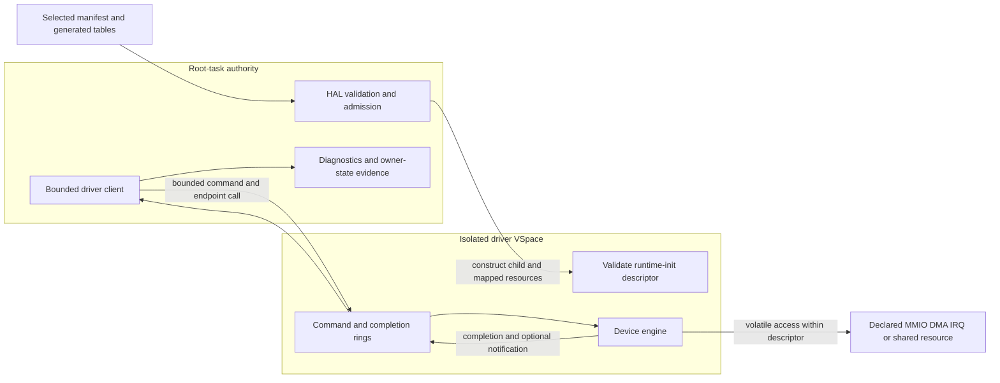

<!-- Copyright 2026 Lukas Bower -->
<!-- SPDX-License-Identifier: Apache-2.0 -->
<!-- Purpose: Define the as-built Cohesix HAL and isolated physical-driver architecture, methodology, status, and proof requirements. -->
<!-- Author: Lukas Bower -->

# HAL and Physical Drivers

This document owns the physical-device architecture: HAL admission, isolated
driver runtimes, the driver-task ABI, device-specific ownership, and the proof
required to claim target support. It does not define operator protocols,
namespace schemas, worker roles, or boot commands. Those belong in
[INTERFACES.md](INTERFACES.md),
[ROLES_AND_SCHEDULING.md](ROLES_AND_SCHEDULING.md),
[HARDWARE_BRINGUP.md](HARDWARE_BRINGUP.md), and
[BOOT_REFERENCE.md](BOOT_REFERENCE.md).

## Normative model

All physical-device authority passes through HAL. On Pi 4, steady-state
physical drivers run as manifest-declared isolated `pi4-driver-*` child images.
Root-task may discover and admit resources, construct seL4 objects, validate
descriptors, submit bounded service turns, collect diagnostics, and retain the
emergency serial escape hatch. It must not contain a parallel steady-state
physical driver.

QEMU compatibility is deliberately different: profile-gated virtual-device or
root-context test drivers may support QEMU and host tests. Their success is not
physical-hardware acceptance evidence.

The active milestone in [BUILD_PLAN.md](BUILD_PLAN.md) controls which driver
changes are legal. A device implementation, generated descriptor, staged image,
flash, boot, owner-state trace, functional transport, and benchmark are separate
evidence states.

## Sources of truth

Use these authorities in order appropriate to the claim:

1. `AGENTS.md` and [BUILD_PLAN.md](BUILD_PLAN.md) define scope, architecture,
   and acceptance requirements.
2. The selected seL4 build directory defines kernel headers, object layouts,
   timer exports, IRQ metadata, and platform truth for that build.
3. The selected `configs/root_task*.toml`, resolved manifest, and generated
   tables define admitted driver images, resources, IRQs, bus links, affinity,
   and profile gates.
4. [`pi4-driver-abi`](../crates/pi4-driver-abi) defines the pointer-free shared
   records accepted by root-task and driver runtimes.
5. Source and tests define implemented behavior.
6. Image readback and boot-paired target evidence prove what ran on hardware.

The generated default-profile summary is
[root_task_manifest.md](snippets/root_task_manifest.md). It is generated
evidence, not text to copy into this guide. Target evidence must identify the
target manifest and fingerprint used for that image.

## As-built architecture

The checked-in default and Pi 4 manifests declare seven isolated runtime
contracts: serial, USB/local-seat, HDMI text, GENET, CYW43, SDIO host, and PCIe
root. Each record names the artifact and entry point and bounds its code, stack,
IPC, ring, MMIO, DMA, shared-buffer, IRQ, and bus-link resources as applicable.



The runtime-init descriptor transports topology and resource metadata. It does
not, by itself, prove that the child owns the hardware or has completed useful
service.

## HAL contract

### Capability-trait map

Drivers depend on the narrowest HAL capability that admits their resource;
model names do not confer authority.

| Trait or boundary | As-built responsibility | Non-authority |
| --- | --- | --- |
| `DeviceHal` | Map a covered device page; allocate and guard DMA frames; report allocator/coverage state; bind and acknowledge HAL-owned IRQ notifications. | Does not grant namespace, parser, policy, or arbitrary physical-address authority. |
| `PciHal` | Discover a HAL-owned PCI topology, map an admitted BAR, and configure an admitted PCI function. | Does not make generic PCI discovery the Pi 4 VL805 authority; that platform path remains in `hal/pi4_pcie.rs`. |
| `Cyw43Hal` | Admit the selected firmware bundle used by the CYW43/SDIO runtime path. | Does not grant root-owned SDHCI, CMD52/CMD53, power/reset, or Wi-Fi transport service. |
| `Hardware` | Compatibility facade combining `PciHal` and `Cyw43Hal` for legacy call sites. | New code must not use it to bypass a narrower capability trait. |
| Driver-task ABI | Deliver sealed runtime-init resources and bounded role-specific commands after HAL admission. | A descriptor is not a new discovery or retyping API. |

The trait definitions are in
[`apps/root-task/src/hal/mod.rs`](../apps/root-task/src/hal/mod.rs). Pi 4
device-specific admission helpers remain HAL implementations, not additional
authority available to driver children.

### Admission

HAL is the only code allowed to:

- discover or accept a physical address;
- locate and retype device untypeds;
- map MMIO, DMA, shared, ring, or framebuffer pages;
- bind an IRQ handler or notification;
- perform platform firmware-service handoff;
- establish DMA bus-address policy; or
- publish an admitted resource to a driver child.

Admission validates the generated image identity, hot path, resource count,
page ranges, alignments, overlap, capability slots, and profile. Unknown,
undeclared, overlapping, or out-of-range resources fail closed.

The child receives only mapped pages and capabilities described by its sealed
runtime-init record. It must not scan physical address space, retype untypeds,
or infer authority from a device model name.

### MMIO

Runtime MMIO helpers must be volatile, range checked, and documented at the
call site. A driver may access only a descriptor range assigned to its role.
Posted-write drains and readbacks must use a safe register in the same admitted
block; an arbitrary readback is not a memory barrier and may have device side
effects.

Register width, ordering, reserved bits, and write-one-to-clear behavior are
part of the driver contract. Diagnostics may observe a register only when the
observation is safe and bounded.

seL4 device untypeds are allocation authorities with a forward-moving
watermark. Retyping or mapping a higher page can make an earlier page in the
same device-untyped region unavailable until the children are revoked. HAL
therefore must:

- pre-admit any lower child-only page before a root mapping consumes a higher
  page from the same device untyped, retain that capability without a root
  VSpace mapping, and consume the admission exactly once into the selected
  child VSpace;
- confirm `device_coverage(paddr, PAGE_BITS)` before mapping each page;
- map every multi-page aperture in ascending physical-page order;
- verify `page_get_address`/`ARMPageGetAddress` equals the requested physical
  address before publishing the mapping;
- use the common device VM attributes rather than call-site-selected cache or
  access attributes; and
- expose registers through bounded `MappedRegion`, `MappedRegisterWindow`, or
  `MappedRegisterPages` accessors unless a narrower helper documents its safety
  invariant.

Coverage, successful retype, successful VSpace mapping, and exact physical
address are separate checks. None may be inferred from a device model or a
working mapping created by firmware, U-Boot, Linux, or a previous boot.

### DMA and cache maintenance

HAL owns DMA allocation and publication. A descriptor carries primitive page
or semantic range records; it never carries a trusted host pointer. The driver
converts only those records into local addresses and device-visible bus
addresses.

The Pi 4 profile currently selects `bounded-no-iommu`. This means allocation,
range, ownership, and cache behavior are bounded and auditable; it is not an
SMMU/IOMMU claim and does not confine a malicious DMA-capable device.

For non-coherent regions:

- clean CPU-produced buffers before device reads;
- invalidate device-produced buffers before CPU reads;
- use the selected seL4 cache operations and the required memory barriers;
- keep descriptor ownership transitions explicit; and
- never substitute `volatile` for cache maintenance.

Ring publication and device DMA ownership are separate. A clean command ring
does not prove that a device payload buffer was cleaned, and invalidating a
payload does not advance a completion index.

### IRQs and notifications

An IRQ path must be generated, admitted, and bound before it is enabled at the
device. The owning runtime captures the exact source and either clears it before
handler ACK or durably latches it under the source's defined mask for later
cursor-owned W1C. It acknowledges the seL4 IRQ according to that generated
source contract, publishes bounded work, and reschedules remaining work when
its service budget is exhausted.

Root-task may route a generated notification or consume a completion; it must
not become a hidden polling owner for a driver that is required to own the IRQ.
If a boot reports a deferred notification bind, notification-backed acceptance
remains red even when a polled diagnostic makes progress.

The current CYW43/SDIO topology declares one SDIO runtime owner with two
physical IRQ inputs—SDHCI IRQ 158 and BCM2835 DMA channel-4 IRQ 116—and a
reciprocal CYW43/SDIO bus link with a fixed event ring. Both IRQs bind to the
same runtime-local notification through disjoint generated badges and handler
slots. Exact IRQ numbers, badges, slots, offsets, and depth are compiler-owned
in the selected manifest.
The selected Pi 4 DTS maps `dma4` to GIC SPI `0x54`; adding the GIC SPI base
`32` yields seL4 IRQ `116`. IRQ `114` names `dma2` in that DTS and is invalid
for this channel-4 owner.

### Time

Pi 4 elapsed-time logic uses the read-only virtual counter (`CNTVCT_EL0`) only
when the selected seL4 build exports it. Deadlines are scaled from generated
`TIMER_CLOCK_HZ`. Physical-counter reads, EL0 timer-control registers, dummy
timers, and raw CPU-speed spin loops are not valid hardware timeout sources.

Fixed attempt counts may bound a protocol retry, but any retry intended to
represent elapsed time must also have a virtual-counter deadline. A
counter-qualified trace is required for latency or service-time claims.

## Driver-task ABI

[`crates/pi4-driver-abi`](../crates/pi4-driver-abi/src/lib.rs) is the shared,
`no_std`, pointer-free contract between root-task and
[`apps/pi4-driver-runtime`](../apps/pi4-driver-runtime). The ABI provides:

- a versioned runtime-init record with sealed runtime identity;
- primitive MMIO, DMA, shared-memory, framebuffer, IRQ, and bus-link records;
- fixed command and completion records;
- bounded single-producer/single-consumer ring state;
- generated endpoint and notification slots; and
- role-specific operation and diagnostic codes.

ABI records contain integers, offsets, lengths, identities, and bounded arrays,
not process-local pointers. Both sides validate magic, version, role, identity,
resource counts, ranges, and sequence state before use.

Physical Pi bootstrap also performs a deterministic root-CSpace admission pass
before creating the first linked runtime. The pass parses each selected runtime
ELF, accounts conservatively for code, stack, IPC, ring, MMIO, DMA, shared
buffers, translation structures, the maximum admitted HDMI framebuffer, and a
2,048-slot post-bootstrap reserve. Both canonical Pi seL4 profiles therefore
require `KernelRootCNodeSizeBits=14`; a smaller or stale build is rejected
before partial child construction rather than panicking midway through HDMI or
network setup. Child-only code and stack pages are filled through temporary
root mappings and then transferred using their original mapping capabilities.
Framebuffer pages are mapped exclusively into the HDMI child without a
root-VSpace alias. Ring, IPC, and explicitly root-shared pages retain separate
caps because their ABI ownership genuinely crosses the root/runtime boundary.

### Scheduling contract

Every hardware service path presents a validated `DriverTaskContract` before
HAL admits a turn. The contract records:

- a stable name and hardware kind;
- service class (`RealtimeInput`, `ConsoleOutput`, `NetworkControl`,
  `NetworkData`, `DisplayRefresh`, or `Background`);
- authority class (`DeviceOnly`, `ConsoleTransport`,
  `NetworkFrameTransport`, or `DisplaySink`);
- isolation state (`DedicatedSeL4Task` or the explicitly reported,
  non-acceptance `RootTaskCompatibility` fallback);
- per-turn maxima for HAL operations, bytes, frames/reports/rows, and any
  explicitly admitted bounded bootstrap spins;
- whether waits are permitted and whether the turn is preemptible; and
- the maximum inbound IPC/event queue depth.

Zero or out-of-range budgets, unbounded waits, a non-preemptible contract,
authority/class mismatch, or an unsupported isolation state fail validation.
MCS scheduling-context fields are profile-qualified; on a non-MCS profile,
priority/domain policy plus the same bounded IPC and service-turn contract
provide the applicable scheduling controls. Neither contract declaration nor
generated affinity proves applied target scheduling without boot evidence.

### Service turn

1. Root's driver client reserves a free command slot.
2. It publishes a fully initialized command and advances the producer state
   with the required ordering.
3. It performs the bounded endpoint call or notification defined by the
   generated topology.
4. The driver validates the command and consumes only its declared resources.
5. The driver performs bounded work and publishes one completion, progress
   state, or explicit pending result.
6. It replies only when a real reply capability exists and signals only a
   declared notification.
7. Root consumes the completion and returns control to the event pump.

No service turn may contain an unbounded wait for hardware, firmware, network
traffic, or another driver. Pending work remains explicit and resumable.

## Device ownership and current status

This table separates implementation from hardware proof. “Implemented” means
the runtime and generated contract exist; it does not claim that the latest
image has passed the device's acceptance gate.

| Contract | As-built owner and boundary | Evidence status |
| --- | --- | --- |
| Serial | Isolated mini-UART runtime owns bounded steady RX/TX. Root retains an emergency serial path for fatal diagnostics and recovery. | Runtime and ABI implemented. Current-image prompt and owner-state evidence remain target-qualified. |
| USB/local-seat | Isolated xHCI runtime owns controller state, root- and hub-connected boot-keyboard discovery, HID polling, and report completion within admitted PCIe/MMIO/DMA resources. | Runtime implemented. Keyboard enumeration, first report, command-ready input, and no stalled service turn must be proved on the current image. |
| HDMI text | Isolated runtime renders bounded text into the HAL-admitted framebuffer; root submits text/service records. | Runtime implemented. Current-image framebuffer, visible output, and bounded refresh proof are separate from serial readiness. |
| GENET | Isolated runtime owns MAC/MDIO and bounded RX/TX descriptor rings. Root consumes a network-driver trait. | Accepted Milestone 26c wired evidence exists for its recorded image. Milestone 26d current-image and benchmark revalidation is a separate requirement. |
| PCIe root | Isolated runtime services declared PCIe MMIO operations; HAL owns platform admission and firmware/reset authority. | Runtime implemented. PCIe/VL805 identity, BAR/COMMAND, link, and downstream USB proof must be tied to the current boot. |
| SDIO host | Isolated runtime exclusively owns SDHCI MMIO, CMD52/CMD53, card interrupt handling, and bus-owner service. | Runtime, generated IRQ/DPC topology, Linux-aligned elapsed timing, deterministic controller model, whole-action restart cuts, modeled CARD_INT/notification substeps, and persistent outer-fence failures are implemented. Repeated physical functional proof remains an acceptance gate. |
| CYW43 Wi-Fi | Isolated runtime owns firmware upload, SDPCM/BDC control, EAPOL/data service, and bounded RX state through the generated CYW43-to-SDIO link. It receives no direct SDHCI MMIO authority. After linked-pair descriptor and mailbox admission, cold bootstrap enters the sole 22-action pair transaction directly; its SDIO engine replay owns the only WL_ON/power-sequence lifetime before firmware and control. Recovery reuses that same transaction only after exact service readiness. | Implementation remains active research/closure work. Production acceptance requires 10/10 cold plus 10/10 warm attempt-1 boots of one read-back image, with zero pre-service pair restarts and with association, DHCP, raw TCP/`cohsh`, ordered RX, and clean DPC counters; historical, offline, or eventual retry success is not current closure. |

### Current CYW43 performance frontier

The 2026-07-31 exact `0b15321d0c12` /
`ee68c7c6faeb83b76934df87caea9f93feed94f8355b7286f999da51652a7753`
hardware group separates startup reliability from data-plane quality. Its
power-off boot and warm reboots R01-R06 all completed supervisor attempt 1,
physical pair epoch 1, Gate 8a-8h, and DHCP without pair recovery. That is 7/7
first-lifetime startup on the exact image, not yet the required cold/warm
repeatability proof.

The same image is not production-ready for TCP. Across the six ICMP-probed
lifetimes—the power-off boot and R01-R05—the first request reached the Pi and
caused it to ARP-resolve the host about 126-179 ms later. smoltcp 0.13.1 had
constructed its automatic stateless Echo Reply, but unresolved-neighbor
Ethernet dispatch discarded it. This is a common NetStack reply-lifetime
defect, not lost CYW43 wire ingress or acceptable cold-neighbor behavior. Raw
TCP SYN-to-SYN/ACK latency ranged
from about 124 to 392 ms. A clean 506-request benchmark stream had no
retransmission, reset, sequence disorder, reconnect, or zero window, but
request-to-first-response latency was about 380 ms at p50 and 468 ms at p95
with only about 2.42 exchanges/s. The persistent-flow result is deterministic
CYW43 service cadence, not RF or TCP recovery. USB and HDMI remained healthy;
GENET is outside this WiFi-only defect and remains unchanged.
R06 deliberately sent TCP before ping: the Pi ARP-resolved the host 130.616 ms
after the SYN, retained that SYN across neighbor resolution, returned one
SYN/ACK at 322.861 ms, and closed cleanly without a SYN retry. Cold-neighbor
behavior and warmed CYW43 cadence are therefore separate acceptance samples.

The later exact `b91b31f9a2b471d37ceeb66469e3fc10609e4df2` /
`a70ca8e8f03c280302306a87e9d6f67f493488d786e858331dcb7e75b19c0433`
group exposed the remaining two lifetime defects. The power-off boot and R01
each produced 40 DHCP Discovers and received 39 prompt Offers in the paired
capture, but sent no Request. R02-R05 each completed one DORA, so bootstrap was
only 4/5. On R05, 21 later Echo Requests received no reply after the rejected
edge design's DPC/root-wake telemetry stopped advancing; Wi-Fi `.coh` and
pressure were correctly withheld. The first defect was root head-of-line blocking: a submitted retained
op7 terminal hid an Offer already copied into the root queue. The second was
architectural reliance on a consumable linked notification edge after durable
RX work already existed. The capture does not justify a watchdog; it requires
committed queue state to remain authoritative after any edge is lost,
coalesced, or consumed.

GENET on that same image proves the common NetStack correction and control
path. Its first cold Echo Request survived ARP resolution and received one
matching reply. Three `.coh` scripts and a post-pressure repeat passed. The
one-minute REST/hive run completed 9,956/9,960 operations; the four failures
were bounded application-level schedule-buffer refusals, while the single TCP
flow had no reset, zero window, duplicate range, overlap, or gap and measured
1.216 ms p50 / 1.538 ms p95 request-to-first-Pi-payload. No GENET driver change
is justified by this evidence.

The as-built correction remains above both physical drivers. Cohesix disables
smoltcp's transient automatic echo responder and uses one fixed-capacity raw
IPv4/ICMP socket as the sole Echo Reply owner. From two full-MTU RX slots, the
service admits only checksum-valid Echo Requests from a unicast source to the
exact assigned local address, with at most one request constructed per NetStack
turn. The single full-MTU TX slot preserves the exact identifier, sequence,
and payload while ordinary smoltcp neighbor metadata holds it across ARP, then
emits it once. Malformed, nonlocal, non-Echo, saturated, competing, expired,
or stale work emits nothing. WiFi connection-generation change, DHCP address
change, and explicit stack reset purge and recreate both queues. The
three-second virtual-counter deadline bounds an unresolved reply. This adds no
packet issuer below NetStack, creates no CYW43 DPC/source-probe demand, and
changes no GENET scheduler rule.

The causal invariant is that quiet WiFi was not idle. The retired design let
ordinary NetStack turns manufacture fresh op8 work, forced recurring
eight-millisecond hintless source probes, and forced another probe after each
accepted TX. One R03 sample accumulated 139,053 CYW43 service turns, 2,788
time-cap exits, 376 deadline probes, and 382 probe terminals against only 58
real root-wake hits while all queues and loss counters remained clean. Real
ingress therefore joined a sole-owner lane saturated by self-generated work,
and the 25-ms quantum cap repeatedly sliced an unchanged exact parent before
its typed terminal.

The instrumented slow-path samples locate the dominant remaining delay below
smoltcp. They executed roughly 140,000-168,000 outer Network turns over about
130 seconds, or roughly 1,100-1,300 turns/s, but completed only about
10,000-11,000 `cyw43_quantum` runs. f4 R02 recorded 153,576 Network turns for
1,936 covered root-to-CYW43 requests: about 79 turns per covered request,
although urgent and empty DPC turns mean that ratio is not an intrinsic phase
count. Root and runtime RX queues had zero drops or overruns. In the paired
pcap, host ACKs for Pi payload returned in roughly 0.1-0.2 ms while a later Pi
segment could remain off air for roughly 0.37-0.40 s. That combination rules
out RF loss, TCP recovery, smoltcp queue loss, and a shortage of raw EventPump
opportunities as the primary explanation.

Historical source audit of the rejected f4 cadence falsifies one earlier
candidate: f4 already used
`PREISSUE_STEP_BOUND=16` to batch deterministic ordinary CMD52/CMD53 preflight,
register programming, and the sole COMMAND in one owner quantum, apart from its
request-owned status-clear retry. The actual amplifier was nested
scheduler-only stop-and-wait. One root-to-CYW43 parent separately crossed
prepare, commit, exact-grant publication, notification, and completion-poll
turns, and the consumer separately crossed wake check, grant check, and
ACK-before-I/O execution. A normal linked Function-2 receive uses about five
physical CYW43-to-SDIO children for a frame that fits the first read (status,
optional W1C, Function-2 first read, the Linux-style empty confirming read, and
post-status), or six when a remainder read is required. SDIO-core
`0x18004000` and the Function-2 FIFO at `0x18000000` share the same 32-KiB
backplane aperture, so the hot DPC path performs no per-packet Function-1
window writes; a genuinely cold aperture adds LOW/MID/HIGH exactly once. Each
real child nevertheless repeated the same retained owner admission, so many
software scheduling turns still surrounded sub-millisecond 41.666-MHz bus
work. This stop-and-wait description is non-authoritative history; the current
contract is the persistent durable-condition transaction described below.

The historical `78d5195582c7` 5/5 boot oracle masked two owner-lifetime gaps
because its recurrent Poll/Grant/reply-probe cadence repeatedly returned to
both the request-terminal IRQ episode and final DPC rearm. That made boot look
reliable while making ordinary ingress depend on consumable scheduler edges;
the resulting TCP cadence was far outside Wi-Fi latency and throughput norms.
The current repair preserves the oracle's physical ordering as durable owner
state. It restores neither its poller nor any fallback, source probe, smoltcp
tuning, or GENET change.

The exact `25f406d9cc26` image (image id
`92d8326196f954c5f56b45b092cc2b17ae7cf5ffe9bfff7bbc6df806c1030884`,
SHA-256
`6c2fcbb266e4158f94ef6436b8fc37830118111ce53b2239a066318448cd19a1`)
put the fused scheduling candidate on hardware and rejected it as a
single-lifetime design. The power-off boot plus five warm boots all reached
Gate 8a-8d on attempt 1 and pair 1, but all terminated at Gate 8e with
`host-eapol-prerequisite-required`; none reached DHCP or TCP. Four warm boots
recorded the first PTK-stage deauthentication with reason 2 at generations 1,
2, 1, and 3 respectively, while R05 recorded no first terminal receipt before
the common generation-6 failure. DPC publication/consumption/rearm accounting
remained exact and loss-free. The boot-paired Wi-Fi capture contained only 32
Pi-source broadcast LLC/XID frames and no Pi EAPOL, ARP, IPv4, DHCP, ICMP, or
TCP. Consequently `.coh` and REST pressure were correctly withheld. This 0/5
warm result is a material pre-data regression, not TCP-quality evidence.

The current source therefore preserves `f4fec9e80`'s proven physical ordering
under Reopened Milestone 26b task
`m26b-wifi-sdio-notification-dpc-closure` while replacing consumable scheduling
history with durable conditions. Non-op11 retained foreground commands outside
the finite urgent op7 path, including non-op11 bootstrap and recovery commands,
keep their existing exact endpoint/grant cadence. The urgent op7 parent retains
its separate finite steady-service identity and budget. EAPOL-Start and
ordinary control remain on that ordinary retained cadence. Only an
intake-sealed EAPOL-Key M2, M4, or group-key response may reuse the existing
paired finite-op7 marker: one current-generation frame, four owner operations,
and 1,536 bytes under request-bound CYW43-plus-SDIO priority. That exact parent
commits and sends one notification, publishes no grant after issue, crosses the
Function-2 pre-TX DPC fence, and remains authoritative until its durable
terminal is visible to root. Its deadline can enter recovery only; it never
creates progress, a poller, or a fallback lane. Ordinary post-Gate-8 TCP retains
the O(1) finite op7 admission path and is not parsed or scheduled as EAPOL. The
finite parent's current durable
condition decides each handoff: deterministic private work continues even when
the diagnostic snapshot is unchanged, while a committed child, unavailable
credit, or other external wait blocks on its first observation. For every
exact op11, HAL derives
a persistent-transaction marker only from the fully validated immutable
descriptor and payload, performs ABI-invisible `Stage`, cleans/barriers the
complete body, commits the command sequence last, records `Issued`, and signals
CYW43 exactly once. Every later root poll can observe only the durable terminal
or contain a fault; it cannot publish grant 19, re-signal, or manufacture a
rescue edge. CYW43 derives a paired marker for each exact CMD52, CMD53, or
`DPC_ACTIVATE` child. The sole SDIO owner retains that immutable child across
bounded physical quanta with zero delegated grants, and commits the terminal
before signalling. The post-release `DPC_ACTIVATE` establishes one
generation-long bus lifetime. An ordinary control exchange reuses that current
healthy, unmasked, quiescent generation instead of interposing another
activation child. If a committed event is already visible, the exchange binds
that exact sequence and canonical DPC consumes it before control continues;
only activation-absent or mask-skewed state, plus exact ACK debt bound to an
already-submitted immutable activation frontier, uses the retained activation
state machine. Invalid, wrong-generation, poisoned, overrun, or lost-authority
state fails closed and quarantines the generation. From the first post-release
DPC event, before or after Gate 8, the
active event sequence and current physical generation bind the separate finite
DPC steady-service lease. Mutable data-plane readiness cannot select an
ordinary recurrent-grant DPC path. Persistent op11, urgent op7, and the DPC
event lease continue only when their current durable local condition is
runnable. Snapshot change is diagnostic history, not service authority: a
newly committed external wait blocks immediately, while equal deterministic
private state and returned RX-queue capacity continue without another hint.
PIO uses
its SDHCI/host condition alone; external DMA joins SDHCI IRQ158 and DMA
channel-4 IRQ116 into one terminal. The owner rechecks child completion, joined
IRQ state, CARD_INT/DPC, RX queue, credit, and the active event frontier
immediately before blocking. Notifications are optional prompts, never
authority or history; issued-unknown containment preserves the exact
transaction until its late terminal or canonical restart.

Linux `brcmfmac` normally runs SDIO with interrupts enabled and polling
disabled. Its ISR schedules one ordered DPC worker, which drains durable
pending work before sleeping; TX completion does not itself require a physical
receive-source read. Its SDIO cadence is RX-first with `BRCMF_RXBOUND=50`,
`BRCMF_TXBOUND=20`, `BRCMF_TXMINMAX=1` while RX remains pending, a 2,048-entry
TX queue, a 32-KiB aggregation buffer, and block-mode CMD53 transfers. Cohesix
retains the material transport shapes without Linux's private workqueue or host
lock. Its linked-runtime translation is one persistent op11 parent when root
issues a control transaction, one event-sequence DPC lease from the first
post-release event through steady service, one separate urgent-op7 lease, one
HAL/SDIO physical owner, joined SDHCI/DMA interrupts, a durable DPC level, a
sequence-last RX queue record, and one committed batch carrying one through
eight root frames. Op8 terminalizes that batch once; an active persistent op11
instead exposes it as sideband and waits for root's disjoint commit-last ACK.
These authorities never substitute for one another.
Notifications are optional coalescing prompts; they carry neither authority nor
history.

The as-built lane has no post-TX receive watch, periodic source probe, or
alternate receive path. A physical interrupt drives the event-bound DPC
lifetime to complete any active transfer, drain bounded RX work, apply SDPCM
credit updates, admit an already-ready urgent TX, and recheck the durable
condition before sleep. Current durable condition, not snapshot novelty,
selects the next handoff: deterministic private work continues without a
scheduler edge, while a named child, credit, queue, or peer wait blocks
immediately. CYW43 commits `DriverRuntimeCyw43RxQueueState` at
local-ring offset 192
by clearing the commit before body mutation, then cleaning/barriering and
writing a new nonzero commit sequence last. For one immutable op8 parent or one
active-op11 sideband batch it writes `DriverRuntimeCyw43RxBatchRecord` at shared
offset 36,864 and one through eight fixed 1,536-byte payload slots beginning at
36,992, cleans/barriers the batch, and writes `committed_parent_sequence` at byte
124 last. Op8 then publishes one completion with detail `0x5803` and
`result=count`; op11 remains active and may only signal root. Root
double-samples the queue and batch state, validates generation, queue commit,
parent sequence and entry bounds, copies every frame, and revalidates the
unchanged header before delivery. Remaining committed queue depth retains
Network without another notification. For active op11, the same stable batch is
nonterminal; root commits the exact 64-byte cache-line-disjoint ACK at shared
offset 49,280 only after delivery, and CYW43 preserves parent and batch until
that ACK matches. At the condition-before-sleep boundary, every active
autonomous SDIO phase that can remain blocked commits its exact counter expiry
through the 20-byte deadline arm. This includes pre-issue inhibit/status-clear;
containment clock settle commits the earlier settle/overall expiry. Phase
progress refreshes or clears the arm, and terminal/reset clears it before
publication. Ordinary physical completion produces zero hints; only a stable
unchanged expired arm may cause one fault-only root-to-CYW43-to-SDIO hint, after
which SDIO alone rechecks and contains the request. Deadlines never manufacture
source progress or a rescue op8. `wifi diag` exposes the boot-lifetime monotonic
`sdio_deadline_hints=<count>` evidence field; ordinary accepted traffic requires
zero. One already-admitted
exact op11 parent remains non-revocable under its immutable budget of 192
operations, 64 frames, and 65,536 bytes; that operation budget is not a
scheduler-poll or yield count.
The next read-back-proven image must preserve first-lifetime startup, retain one
first inbound Echo Request across cold ARP and answer it exactly once without a
host retry, then achieve ARP-warmed request-to-first-payload p95 at or below 40
ms and at least 29 sequential requests/s without loss, reconnect, or benchmark
timeout. Record the cold semantic/elapsed sample separately. The aggressive
target remains p95 at or below 10 ms and at least 100 sequential requests/s.
One GENET control must prove the same common cold-neighbor semantics with
unchanged wired latency, throughput, and scheduling. These Wi-Fi source changes
remain unproven until rebuilt, flashed, and exercised on Pi hardware.

### QEMU network drivers

Virtio-net and RTL8139 remain profile-gated QEMU compatibility drivers. They
exercise network and console semantics without proving GENET, SDIO, CYW43,
PCIe, USB, DMA, IRQ, or Pi timer behavior.

## Stable device-specific invariants

### Serial

- Emergency serial must remain usable when an isolated runtime fails to start.
- Emergency ownership is diagnostic and must not be counted as migrated
  steady-state ownership.
- The Pi 4 profile declares mini-UART IRQ `125`, badge `126`, child handler
  slot `4`, and local notification slot `3` as one level-triggered HAL-owned
  lane. HAL must bind that notification to the serial child TCB before resume;
  an IRQ bind, cap-mint, notification-bind, descriptor-seal, initial-ACK, or
  runtime-init failure is terminal for migrated serial service and never
  enables a polling fallback.
- The serial child drains at most 128 hardware bytes per service turn into one
  512-byte queue before acknowledging the IRQ. Because the mini-UART source is
  level-triggered and a bound seL4 notification may coalesce, every admitted
  serial service turn samples the live RX level even when no fresh badge was
  observed. One shared byte grant bounds the pre- and post-service samples; if
  that grant is exhausted, the child may read only the line-status register and
  must leave the masked IRQ pending for the next turn. Queue capacity is checked
  before reading `MU_IO`; a full queue likewise retains the masked IRQ until a
  root read frees space, the same child drains the remaining source, and the
  deferred ACK succeeds. At the one-way root-to-child ownership handoff, the
  child preserves root's active line/FIFO configuration and drains RX before
  enabling and acknowledging its IRQ; it must not clear a byte that arrived
  after root's preceding idle sample. TX may preserve RX bytes from the same
  sole child owner while it holds the CPU, but it does not create a second
  hardware owner or boot path.
- Input, output, and recovery loops remain bounded; a stalled device cannot
  monopolize the event pump.

### HDMI and local seat

- The framebuffer and keyboard resources are separately admitted and proved.
- After the ordinary EventPump starts, USB attach, one keyboard-enumeration or
  report poll, HDMI attach, and one pending-frame service are retained turns:
  each outer turn may issue one immutable linked-runtime request or poll one
  matching completion, then returns. An HDMI attach attempt and a frame submit
  never share an outer turn.
- HDMI feedback may degrade under load but must not block serial/local-seat
  input or fatal status.
- A USB byte, a HID endpoint, a keyboard-ready marker, and a usable command
  parser are separate gates.
- After attach, re-enumeration, or interrupt-endpoint recovery, the USB runtime
  treats key state as untrusted until a decoded all-zero idle/release report
  establishes the baseline. A non-zero prefix is admissible only when decode
  provenance proves a complete report-ID-prefixed boot report; ambiguous compact
  windows cannot establish the baseline. Key or modifier reports before that
  boundary are filtered; only a later make transition may enter the command
  parser. A successfully decoded held-key or modifier report still counts as
  endpoint-health telemetry, but cannot publish first-report or command-input
  readiness while the attach/recovery idle guard is closed. Recovery re-arms
  the endpoint and explicitly invalidates any old first-report/first-byte
  readiness until a fresh safe idle baseline arrives.
- USB retained service has typed `Pending`, `Complete`, and `Failed` outcomes.
  A normal multi-turn `Pending` result preserves the immutable command ticket,
  command-ready evidence, and no-reply counters; only a terminal `Failed`
  outcome may revoke readiness or add no-reply debt. This prevents ordinary
  prepare/boost/commit/notify/poll phases from manufacturing USB pressure that
  can starve keyboard input or HDMI refresh. Missing first-report or
  command-ready proof with no decoded or buffered byte is USB service debt, not
  physical operator input. It earns one bounded `LocalSeat` service turn but
  cannot retain the post-Dispatch operator fence or suppress Network. Only an
  actual buffered decoded key, partial command, or physical response retains
  operator precedence.
- `usb diag` is a cached, passive, compact ten-gate report. It does not poll
  the USB runtime or prepend the verbose `usb status` counters. Ordinary
  response-body records cannot consume the three linked-serial protocol-tail
  slots reserved for the terminal ACK/END and prompt, so backpressure cannot
  strand the physical-response fence or block later serial/USB input.
- `usb probe-kbd` emits only its one-slice result, explicit
  `continuation=pending|terminal` state, cached runtime contract, verdict, and
  terminal `OK`; it does not reuse the verbose `usb status` dump. The complete
  command response must fit below the 2,048-byte serial output bound. A pending
  command-owned probe cursor advances by one operation on each later
  `LocalSeat` turn and restores the prior polling policy when it terminates.
- `wifi diag` is likewise a single cached read: it never performs the old
  dump/probe/dump sequence, and retained progress is explicitly labelled as
  historical when a newer terminal fault exists. Its driver-task report copies
  the maintenance generation, requested mask, and next stage in one bounded
  record, plus the retained action identity in an adjacent bounded record,
  copied from the same snapshot under the existing cursor lock without
  servicing that action; retained
  deferred recovery is labelled against the live connection generation. A
  terminal child completion during firmware replay retains its exact
  descriptor, ticket, sequence, detail, result, and generation before the sole
  pair-recovery policy consumes it. An optional control operation rejected
  with that phase's documented `BADARG` or `UNSUPPORTED` result remains
  visible as trace output but cannot replace an earlier causal transport
  terminal; a transport fault at the same phase remains causal.
  `netstats` and `smp` are passive retained-counter reports. In contrast,
  `nettest` starts the bounded network self-test and `usb probe-kbd` advances
  one retained enumeration attempt, so operators must wait for each command's
  terminal status before sending the next burst.
  `OK NETTEST detail=started run_generation=<n>` is admission only; after the
  15-second window, a final `netstats` reports one complete connection- and
  run-generation-tagged `verdict` line, with targets on a separate
  `nettargets:` line. A result from another admitted run is not proof.
- If a USB diagnostic service turn stops replying, preserve the boot evidence
  and stop submitting more commands until the bounded recovery path or a fresh
  boot.

### PCIe and USB

- Firmware reset and root-complex admission remain HAL-owned.
- The Pi root completes the current synchronous PCIe HAL prerequisite before
  constructing the EventPump. This is pre-pump local bookkeeping and authority
  setup for the retained USB cursor, not root-owned steady USB service and not
  permission to combine PCIe, USB, or display operations later. If the proof is
  absent, the retained USB attach cursor remains blocked at its PCIe
  prerequisite and cannot bypass HAL.
- Live PCIe identity, class, BAR, command, link, and DMA-window evidence must
  precede xHCI ownership credit.
- The keyboard endpoint has one production interrupt-IN lane for its complete
  lifetime. The isolated runtime keeps exactly one transfer active, retires it
  on its matching transfer event, and rearms exactly one successor. The
  128-entry xHCI transfer ring is wraparound storage, not a 128-entry active
  queue. First-report proof never changes the active depth. This mirrors the
  Linux usbhid one-URB lifetime while preserving Cohesix's one-operation
  linked-runtime turns. An armed idle transfer is healthy but is not physical
  typing proof; `usb status` reports `physical_input_proven=no` until a
  linked-runtime HID byte also reaches parser ingress. Either signal alone is
  diagnostic only.
- A successful keyboard-endpoint doorbell proves submission, not completion.
  Before any keyboard transfer event or first valid report, the runtime binds
  one liveness watch to the exact active slot, endpoint, report slot, TRB, and
  transfer generation. The same identity retains its original five-second
  virtual-counter deadline, or the bounded 4,096-poll fallback when counter
  timing is unavailable. Expiry is actionable only while the endpoint is
  ready, that one identity remains active, and neither a preserved transfer
  event nor a pending doorbell can explain the silence; it then fails the
  stalled attach closed through the existing
  `FULL_QUEUE_NO_EVENT` pre-first-report policy. Any keyboard transfer event
  or first valid report clears the watch. The rearmed one-transfer lane after
  first-report readiness has no idle timeout, so normal post-first quiescence
  cannot be mistaken for endpoint failure.
- Linux or U-Boot captures may inform static layout; they do not grant runtime
  authority and are not accepted as live Cohesix state.
- USB interrupt delivery must not be claimed when the selected path is
  intentionally poll-driven.

### GENET

- Descriptor ownership and cache transitions are explicit for every RX/TX
  buffer.
- Dispatching a wired network-console command performs zero same-turn TCP flush
  polls. Root retains a connection-owned post-command response cursor instead;
  each later `Network` phase performs exactly one budgeted GENET TCP flush and
  returns. The cursor is bounded to eight phases normally or sixteen while the
  local display reports backlog pressure. A second buffered command cannot
  dispatch until the first response cursor completes or exhausts its bound, and
  a changed or absent active connection discards the stale cursor instead of
  applying it to a replacement session.
- The post-command cursor is GENET-specific. A data-ready CYW43 console keeps
  using the ordinary one-operation `Network` poll path; it neither creates nor
  consumes the wired flush cursor.
- Link, DHCP, ARP, TCP, console, and performance evidence are separate.
- A real DHCP lease or TCP handshake is stronger datapath evidence than a stale
  readiness bookkeeping flag, but it does not waive other acceptance gates.

### SDIO and CYW43

This as-built defect and cadence closure is authorized by Milestone 26d tasks
`m26d-cyw43-hardware-free-closure` and
`m26d-benchmark-revalidation-and-tuning`, with active defect authority from
Reopened Milestone 26b tasks
`m26b-wifi-sdio-notification-dpc-closure` and
`m26b-net-control-priority`. It does not authorize a second ownership,
bootstrap, recovery, scheduling, or proof lane.

#### Sole physical lifetime, pair transaction, and ordered pre-Join drain

Cold bootstrap and recovery do not have separate post-handoff implementations.
Root first registers both isolated services, replays the SDIO descriptor before
the CYW43 descriptor, proves the SDIO prerequisites, and hands the mailbox to
SDIO. Cold bootstrap then enters the retained 22-action pair transaction
directly. It does **not** initialize either physical engine first. The canonical
transaction suspends and fences the pair, drains and acknowledges the
notification/IRQ state, zeroes the discarded pair-ring state while preserving
only the exact 16-byte `DriverRuntimeSdioPhysicalLifetimeRecord` in the SDIO
owner ring, restores bootstrap scheduling state, resumes and proves SDIO before
CYW43, replays both descriptors, performs the sole SDIO engine replay and WL_ON
power-sequence lifetime, replays the CYW43 engine, hands the producer ring to
CYW43, and advances the pair epoch. After that exact restart completes, root
registers the SDIO owner state before acquiring the context-replay gate.
Firmware and control programming then precede the two owner-first
steady-priority cutovers.

The retired cold path initialized SDIO and CYW43 once, handed off the producer,
and then unconditionally ran the complete pair transaction, whose SDIO engine
replay performed the same physical power sequence again. That created two
WL_ON/card/controller lifetimes inside one nominal boot attempt. The first
lifetime was immediately destroyed and could not be bound coherently to later
enumeration, firmware, control, or Gate 8 proof. The production path has no
preliminary engine initialization, direct cold-to-firmware path, recovery-only
replay path, same-generation fallback, or second restart cursor.

For every valid physical-Pi Wi-Fi selection, explicit Wi-Fi or `Auto` with
credentials, root routes startup to the persistent post-prompt supervisor
regardless of whether a local seat exists. The pre-root network constructor is
not called for that selection. Wired selection and `Auto` without Wi-Fi
credentials retain their non-Wi-Fi behavior. The generic root network
engine-init lane remains available to GENET but is rejected by CYW43; the only
CYW43 engine replay is `ReplayCyw43Engine` inside the canonical pair
transaction.

The sole SDIO owner publishes a versioned physical-lifetime record in the
reserved owner ring. `begun_epoch` is sequence-last and advances immediately
before the first physical low/high power-sequence action.
`completed_epoch` advances only when that same lifetime reaches its ready
terminal; `failed_epoch` records a terminal or abandoned in-progress lifetime.
Pair-ring reset preserves only these 16 bytes. It zeroes command, completion,
DPC, grant, continuation, fault-telemetry, and pair-generation-counter state rather
than carrying any of that discarded generation's failure history forward. Only
initial ring construction clears the physical-lifetime record. Before restart
clears a runtime cursor, the owner snapshots the durable record and immediately
publishes `failed_epoch = begun_epoch` for an active lifetime, including when
the volatile cursor has already been lost; failure publication does not wait
for another begin. Root reads the record passively with stable double-sampling.
It cannot infer a lifetime from downstream Gate 1 state, a pair epoch, or a root
notification. Pair-restart SDIO and CYW43 engine failures also preserve their
exact `DriverTaskCompletionRecord`. Root retains primitive detail/result and
sequence in the first deferred-recovery diagnostic; the SDIO owner additionally
publishes its typed replay status. Neither path replaces the child terminal
with only `engine-replay-failed`.

The completed owner epoch established during `ReplaySdioEngine` and returned by
the completed pair transaction becomes the supervisor's
`physical_lifetime_epoch`. Gate 1 requires that exact supervisor-bound,
nonzero expected epoch to remain the owner's stable
`begun_epoch == completed_epoch`, with `failed_epoch != begun_epoch` and no
active lifetime. The same prerequisite is rechecked whenever the supervisor
accepts or commits Gate 8, checks operational Gate 8 continuity, or accepts
Gate 10. The passive `Cyw43ServiceWorkSnapshot` carries the same epoch alongside
connection generation and pair epoch, and EventPump's durable Network-resume
identity must match all three. A missing, active, failed, or changed physical
epoch retracts those authorities; it cannot be relabelled as the current
lifetime or repaired by an in-place runtime command.

`wifi diag` binds this owner truth into Gate 1 without performing a probe:

```text
wifi: gate 1 owner_lifetime lifetime_begun=<u32> lifetime_completed=<u32> lifetime_failed=<u32> lifetime_active=<yes|no|unknown> source=sdio-owner
wifi: gate 1 name=runtime-power-reset status=<pass|blocked|fail> evidence=power=<state> reset=<state> pwrseq_status=<state> pwrseq_phase=<phase> dependency=<reason> source=<source> next=sdio-card-select
```

The separate bounded owner line prevents the causal Gate 1 dependency from
being truncated by the fixed 256-byte console record.

Gate 4 uses a separate 44-byte, sequence-last
`DriverRuntimeSdioClockSnapshot` in the SDIO owner ring. The final retained
`HOST_CONFIG` carries the CYW43 client's read-back CCCR `SPEED` and
`BUS_INTERFACE_CONTROL` bytes to the sole SDIO owner; the owner combines those
card facts with its requested clock, BCM2711 base clock, decoded divisor,
effective clock, final `CLOCK_CONTROL`/`HOST_CONTROL` readbacks, completed
physical-lifetime epoch, and generated virtual-counter frequency. Root only
double-reads this passive record. It never reads SDIO MMIO or creates another
clock owner.

The Pi 4 production setting requests 50,000,000 Hz. The BCM2711 250,000,000 Hz
source and legal even divisor `6` produce 41,666,666 Hz; that effective value is
expected and is not a slow-clock fallback. The elapsed-time source remains
`CNTVCT_EL0` at the generated 54,000,000 Hz `TIMER_CLOCK_HZ`. Gate 4 can pass
only when the snapshot belongs to the current completed physical lifetime,
both clock-stable and card-enable bits are present, CCCR `EHS` is read back,
and both host and card report 4-bit width. Missing, torn, stale, zero, or
partial evidence fails closed at Gate 4 and is rendered as `unavailable`;
linked-runtime diagnostics never substitute `clock=0Hz width=unknown`.
Because the snapshot is evidence-only, an unavailable publication never
rewrites an otherwise successful physical `HOST_CONFIG` completion; it removes
Gate 4 proof instead of creating a second hardware failure lane.
`wifi diag` keeps the gate line bounded and emits the remaining register,
CCCR, and timer fields on one adjacent `wifi: evidence sdio_clock` line. This
record is CYW43/SDIO-only and does not alter the GENET clock, descriptor, or
service path.

The canonical cold transaction remains part of `attempt=1`, not a retry. Its
successful typed `ColdBootstrap` completion records the exact
initial-physical-lifetime provenance through the owned replay. That record is
a lifecycle fence and diagnostic, never publication authority: a numeric pair
epoch, physical-lifetime epoch, or replay state cannot select a faster command
lane. Every recovery request, pair-transaction failure, unfinished cursor drop,
and replay terminal clears it. Cold bootstrap, recovery, and steady service all
publish through the same retained sequence. The sequence-zero `Stage` remains
an ABI-invisible turn. After the required priority transitions, `CommitRing`
re-prepares the immutable record, latches issued-unknown, and commits the
sequence last. The later `PublishGrant` turn publishes initial grant 1, and the
later `NotifyRing` turn commits `Issued` before signalling last. `PollRing`
remains a separate completion handoff. On a miss it records only
`GrantRequired` for a consumed grant or `Granted` for an exact unconsumed grant;
replacement publication and notification occur on their later explicit turns.
A matching completion wins before either authority action. Non-CYW43 endpoint
commands retain their existing phases.

The sole ordered event-drain snapshot is immediately before association Join.
It runs after the last Join-affecting protected-network control
(`HostEapolPromisc`) or open-network control (`OpenWpaAuth`) and before Join
event ownership can be armed. It completes only after two consecutive exact
`Idle` terminals. Any `FrameReady` or `Progress` activity resets that streak,
and 256 polls is the finite fail-closed cap rather than mandatory work on an
already quiet boot. Join uses the same `CONTROL_PRE_TX_DRAIN` lane, which
rechecks the ordered RX FIFO after every SDPCM-credit wait before permitting
the Function 2 write. Root arms association-event ownership only after the
exact Join request publishes a post-Function-2 TX progress phase; HAL
child-command issue and `CONTROL_TX_BEGIN` are not physical TX proof. Events
drained before that boundary remain history and cannot poison the new
generation.

The ordered drain is followed by one Join-only SDIO owner fence. Root marks
only the retained association Join exchange; generic control, maintenance,
host-EAPOL, and data traffic do not inherit this policy. Immediately before
writing `SDHCI_COMMAND` for that Join's Function 2 CMD53, the sole SDIO owner
samples the level-retained host `CARD_INT`. If it is asserted, the child
returns a typed not-issued terminal without starting DMA, touching the FIFO,
advancing the SDPCM sequence, entering containment, or requesting pair
recovery. The same immutable operation-11 parent, payload, generation, and
absolute deadline bind the exact committed source to canonical DPC service for
that observed CARD_INT condition, consume it through the same post-release
event-sequence lease, and re-enter the ordinary drain/credit/setup path. The
healthy generation-long activation is reused; this late crossing does not
create a second activation lifetime.
Only a later source-clear child may issue the Join
CMD53, exactly once. This closes the owner-side late-source interval without a
second Join, recovery, or fallback lane; repeated fresh-Pi proof remains
required before claiming hardware repeatability.

#### Ordered Gate 8 stability contract

Transport and control-plane attachment enter `stabilizing`, not `ready`.
The sole `attempt=1` boot episode owns one fixed absolute deadline of 90,000
milliseconds through Gate 8 commit, DHCP, and listener admission. Gate 8 is a
passive proof surface: evaluating a subgate, observing a logical failure, or
exhausting this deadline performs no HAL, runtime, SDIO, completion, retry, or
pair-recovery mutation. Before exact service readiness, an independently typed
runtime/SDIO fault or issued-unknown physical operation may only drain, fence,
and poison its exact owner before terminal quarantine; it cannot start pair 2,
publish `status=recovery`, or manufacture another stabilization window. Only a
later fault after exact DHCP/listener service readiness may consume the one
runtime pair-repair episode.

One passive, immutable snapshot evaluates and publishes the eight subgates in
this exact order:

1. `8a-pair-generation` proves one current linked CYW43/SDIO pair epoch.
2. `8b-control-program` proves the control program for that same pair epoch.
3. `8c-join-terminal` proves the primary Join reached a successful exact
   terminal.
4. `8d-association-link` proves association and link-up.
5. `8e-bssid-refresh` proves the post-association BSSID owner reached its exact
   terminal, except on an open network where that refresh is unnecessary.
6. `8f-eapol-keys` proves the protected network is secure and no host-EAPOL
   owner remains active or required; an open network passes this step directly.
7. `8g-post-key-maintenance` proves the current-generation maintenance mask and
   all logical control owners are clear.
8. `8h-data-admission` proves the current-generation data handoff and bounded
   fairness/loss invariants.

An ordinary firmware `AUTH` timeout remains event telemetry and is not a
terminal association failure. Unsuccessful `SET_SSID`, link-down/no-network,
deauthentication, and disassociation events are logical connection failures:
8c reports `pending` with `blocker=association-retry-pending`, and the single
association supervisor suspends authentication, applies its bounded backoff,
and starts a fresh logical generation/Join on the same admitted linked pair.
An exact current-generation BSSID-refresh failure at 8e reports
`pending` with `blocker=bssid-refresh-retry-pending`; an exact required
post-key-maintenance failure at 8g reports `pending` with
`blocker=post-key-maintenance-retry-pending`. The same association supervisor
owns both outcomes and applies the same bounded same-pair logical-generation
retry.
These events never fabricate an SDIO fault or enter the pair-normalization
repair lane.

Gate 8h has one explicit root-consumer commit. Association-generation start
does not establish the data-handoff baseline because, unlike Linux
`brcmfmac`, Cohesix can open the firmware controlled port before its root
NetStack consumer can accept data. Every attached non-recovery iteration runs
the ordinary EventPump/NetStack turn because that is also the sole
association, host-EAPOL, maintenance, and exact-operation continuation lane.
Until handoff commit, the CYW43 NetDevice blocks queued-data delivery,
Device-originated fresh data polling, DHCP start, fresh ARP staging, and fresh
smoltcp TX. The existing pre-poll physical RX ingress remains available to
observe association/control events; it routes those frames to their sole
policy owner and copies ordinary data into the current-generation queue. An
already assigned NetData operation may likewise reach its exact terminal, but
an ordinary returned frame is copied back into that queue rather than
delivered.

After one such control-capable turn makes 8a through 8g current and passing,
root calls `commit_cyw43_data_handoff_if_ready` with the freshly observed
logical connection generation, never the independently retained firmware
bootstrap generation. This idempotent helper revalidates the pair,
association/link, BSSID, key, maintenance, logical-owner, and recovery state;
rejects only queued tokens captured in a stale generation; preserves
current-generation backlog for the following consumer turn; captures the
sticky cumulative root-drop and runtime-overflow counters as the
post-consumer baseline; release-publishes its generation token; and then
release-publishes the matching consumer commit token last. Root then takes a
new Gate 8 snapshot because commit changes 8h. This is bookkeeping at the one
data-consumer boundary, not a second physical driver, SDIO owner, polling path,
or recovery lane.

Root and child use the single ABI value
`pi4_driver_abi::DRIVER_RUNTIME_CYW43_RX_QUEUE_CAP=50`: it bounds both the
root copied-frame queue and child decoded-frame queue, and it is also the
child's bounded RX drain budget. This alignment lets root preserve one complete
child backlog without maintaining a divergent private capacity. It does not
replace the consumer commit or convert saturation into success.

Subgates 8a and 8b must belong to one current pair/control epoch. Subgates 8c
through 8h must all belong to one current logical connection generation. The
producer evaluates once, formats all eight
`wifi: gate 8 subgate=<token> status=<pass|pending|fail>
pair_epoch=<p> generation=<n> blocker=<reason>` records from that immutable
value, and queues them plus the immediately following
`CYW43_GATE8_COMMIT attempt=<n> status=ready pair_epoch=<p> generation=<g>
deadline_ms=<n> console_seq=<n> telemetry_sinks=serial+qlog+hdmi
consumer=data` record in one all-or-nothing retained transaction. This commit
opens the exact-generation data consumer so DHCP can run, but it is not the
terminal bootstrap Ready record. Root revalidates and commits the same
snapshot before the transaction. A prefix, mixed generation, cross-recovery
stitch, non-adjacent Gate 8 commit, or snapshot that changed before commit is
not Gate 8 proof.

Initial Gate 8 commit additionally requires two consecutive ordinary control
turns with the same pair epoch and logical generation, with all eight subgates
stable and the publication lane quiescent on both observations. The quiescence
snapshot requires no current-generation pending host-EAPOL event or queued
pre-secure EAPOL RX frame, no host-EAPOL prompt, session work, deferred
reauthentication, or post-association BSSID work, no maintenance or other
logical control owner, no prompt poll or terminal-drain cursor, and no retained
HAL driver-task request. The linked SDIO DPC ring must also be empty and
healthy: producer equals consumer, current-pair flags are exactly
`OWNER_ACTIVE`, and the current-pair overrun count is zero. `ack_failures` is
retained attempt history
for that physical pair, not current fault authority: after an exact ACK retry
succeeds and pending/fault flags clear, a stable nonzero count does not by
itself revoke healthy work. Its exact value, the nonzero DPC epoch, and the
producer watermark must remain unchanged across both observations. Final
hardware acceptance still requires zero ACK failures in every accepted pair.
Pair replacement resets these ring counters; cross-pair causes remain in
root's first-cause recovery records rather than being stitched into the new
authoritative ring. Pair recovery/rejoin must also remain absent. Any owner activity,
DPC publication, counter movement, DPC epoch change, or logical/pair generation
change clears the candidate and requires two fresh observations. The snapshot
commit and consumer-token publication recheck the exact
pair/generation/DPC/history receipt before publication and again after the
release boundary; rejection publishes no Gate 8 commit. After commit, one
exact current-generation NetData continuation and ordinary newly published DPC
traffic remain legal and do not by themselves retract otherwise stable proof.

The unique terminal
`CYW43_BOOTSTRAP_SUPERVISOR attempt=1 status=ready ...` is emitted later, only
after that same committed generation remains the active CYW43/Wi-Fi interface,
DHCP is `bound` with a nonempty address, and the TCP console listener is
actually bound. It does not wait for the first accepted or authenticated TCP
session, which would deadlock the first client. That service-ready transaction,
not the Gate 8 commit, releases the final HDMI `Ready to use` banner. A later
successful steady-service repair emits
`CYW43_RUNTIME_RECOVERY status=ready generation=<g> ...`; it cannot duplicate
or replace the one bootstrap Ready record.

A current-generation EAPOL frame copied into root before secure publication
remains an obligation of the same host-EAPOL policy owner. Post-association
BSSID and filter maintenance retains priority; after that maintenance reaches
its exact terminal, each ordinary EventPump turn consumes at most one queued
EAPOL frame and retains any resulting TX/key/drain continuation for later
turns. That aggregate owner also fences a fresh generic NetData pre-poll at
both stack entry and its inner budgeted service: a request-less post-secure
op7 must acquire and advance its own HAL request instead of repeatedly finding
the turn consumed by a fresh op8. An already-assigned exact NetData
continuation remains non-revocable and finishes first. A secure session
therefore cannot exit while the aggregate Gate 8g work
fence is held solely by its own queued frame. Frames handled after secure key
completion retain post-secure rekey/fail-closed semantics; this is not a
second RX poll, retry, or NetData lane.

The first deferred-recovery and terminal-drain diagnostics remain retained
through every revocable snapshot/publication attempt and are cleared only
after the complete 8a-through-8h plus Gate 8 commit transaction is retained.

The Gate 8 commit is revocable, but ordinary post-secure key maintenance is not
carrier loss. While the accepted pair and generation remain current, 8a
through 8f remain pass, the secure carrier and control program remain live, the
exact handoff/publication token remains open, and no rejoin, recovery, root-RX
loss, or runtime-overflow episode appears, bounded same-generation 8g work keeps
the data consumer published. Its retained protocol owner carries the finite
timeout and typed failure transition; Gate 8 neither retracts the data lane nor
starts another boot-policy deadline merely because a GTK or other post-secure
maintenance transaction is active.

Any pair, generation, control-program, association, link, key-security,
handoff, recovery, rejoin, or post-publication loss invariant failure retracts
the Gate 8 commit to `stabilizing`. The old snapshot becomes non-authorizing
immediately, and a complete new 8a-through-8h snapshot is required before
another Gate 8 commit. Bootstrap admits exactly one initial physical pair and
zero pre-service pair restarts: a typed physical fault may drain and fence its
exact owner, but it cannot turn boot into pair 2. The original absolute
90-second deadline remains authoritative through Gate 8 commit, DHCP, and TCP
listener admission. If exact-generation service readiness is still absent at
that deadline, the blocker is `service-readiness-deadline`. A logical subgate
failure remains visible and pending inside its owning gate-local policy until
the same deadline. Deadline exhaustion retains the complete eight-line
snapshot plus an adjacent
`CYW43_GATE8_TERMINAL ... action=quarantine` record, publishes terminal
`status=permanent`, and quarantines the attached Wi-Fi network path without
requesting pair repair. Serial, local-seat, HDMI diagnostics, authentication,
and `reboot` remain live. While output capacity delays that terminal batch, the
supervisor runs only the hardware-free operator-output turn. A newly visible
typed runtime/SDIO recovery may supersede the logical terminal while
schema/route/capacity preflight remains blocked. After successful preflight,
one final typed-recovery probe either declines terminal policy or commits its
explicit decision cut immediately before atomic batch retention. That decision
linearizes terminal policy, and no child/network poll may reopen the episode
while the batch and adjacent Permanent record drain.
Retraction also invalidates queued HDMI Ready/prompt bytes and schedules a
canonical Stabilizing redraw. There is no automatic whole-bootstrap backoff,
reset, or attempt 2. Gate-local association, DHCP, and protocol retries remain
bounded inside their owning gates and do not create another outer episode.
Only exact service readiness admits one bounded runtime pair-repair episode.
After that repair restores a new exact-generation DHCP/listener cut, the
distinct runtime Ready transaction may re-arm one later episode; duplicate
Ready observations for one generation cannot replenish the budget. Gate 10
remains downstream data-service acceptance proof and is not recovery
authority.

Gate 8h deliberately permits normal bounded root RX, data TX, ARP, runtime
backlog, and an exact already-assigned current-generation NetData request.
Before the nonterminal Gate 8 commit, however, the separate
publication-quiescence predicate waits for that exact request and its
terminal-drain/HAL ownership to finish; Gate 8h pass is not permission to
publish through an active physical owner. After Gate 8 commit, the exact
continuation is legal under the revocable data-consumer proof above.
Before the root-consumer commit, a missing/stale commit or baseline token is
`pending` with blocker `data-handoff-commit-pending`, and pre-consumer queue
pressure cannot be relabelled as a post-handoff failure. After the token is
published, a lossless full root RX queue remains `pending` with bounded drain
priority. Gate 8h then fails when an exact-generation root-drop latch or
monotonic runtime-overflow episode advances beyond the committed baseline, a
prompt belongs to a stale generation, or a retained request-less NetData
pre-poll survives while higher-priority root RX/TX/ARP work exists. Cumulative
root-drop telemetry saturates instead of wrapping; the exact-generation latch
therefore remains fail-closed even at counter saturation. Recovery or
generation advance invalidates the commit and requires a new consumer-active
commit without clearing cumulative boot telemetry. Pending tokens capture the
connection generation when root queues them. Generation invalidation and the
commit boundary reject and separately count stale-generation tokens, while
valid current-generation backlog remains queued for NetStack rather than being
discarded or hidden by the new baseline.

Gate 8 data-consumer publication binds the durable RX contract to the logical
connection generation, linked pair epoch, and completed physical-lifetime
epoch. The runtime's sequence-last queue record is the durable condition:
generation, queue depth/capacity, flags, and nonzero commit sequence must remain
stable across two reads. An optional empty-to-nonempty notification merely asks
root to perform that read. It creates no scheduler state, pending bit, history,
clear operation, or authority to issue work.

For a nonempty committed queue, the sole `NetData` op8 parent remains immutable
while CYW43 builds one batch of at most eight frames. The batch header binds its
generation and queue commit to that parent; the final matching parent-sequence
word commits the body and payloads. Root accepts the single terminal only after
a stable header read, copies all bounded entries, and rejects delivery if the
header changes on the post-copy recheck. `remaining` and the next stable queue
record retain service without another notification. Nonempty runtime/root
queues, control replies, TX/ARP, leases, prompts, and other protocol obligations
schedule only their own already-authorized work and cannot create another RX
owner.

The event-sequence DPC owner services physical interrupt work to bounded
quiescence, then rechecks completion and queue state immediately before sleep.
Only connection-generation, pair, or physical-lifetime invalidation, recovery,
quarantine, reboot, or selection of another NIC invalidates the durable
identity. Deadline expiry poisons or recovers the exact active autonomous phase
or ambiguous transaction; it does not poll the source or synthesize receive work. This is
Cohesix's linked-runtime translation of Linux interrupt/DPC idle, not a second
poller, issuer, TX path, timer owner, or GENET behavior.

Root admits Wi-Fi Ethernet output through one generation-scoped bounded
aggregate of 16 immutable frames. The aggregate uses two heapless FIFO classes:
urgent control and bulk. ARP, EAPOL, DHCP, TCP SYN/FIN/RST, and payload-free TCP
control segments are urgent; other payload-bearing TCP, fragmented IPv4, and
ordinary traffic remain bulk. A frame produced through the copied-RX paired
token is urgent independently, preserving response liveness. Urgent frames are
selected before bulk while FIFO order is preserved within each class. This is
scheduling priority, not a second physical lane: both classes feed exactly one
`CYW43_PENDING_DATA_TX`, which exists only after the FIFO head has proof that
the predecessor SDPCM-credit window is closed and remains the sole op7 owner.
The two fixed backing deques occupy about 50 KiB of BSS, roughly 25 KiB more
than one deque, while the aggregate admission bound remains 16. This deliberate
static trade avoids O(n) movement of approximately 1.5-KiB frame records on the
hot path and avoids an unsafe shared payload pool.

`Device::transmit` reserves only the ordinary first 15 aggregate slots,
leaving the final slot for the mandatory TxToken paired with
`Device::receive`; that paired token may reserve all 16 slots. Consuming a
reserved token only enqueues its immutable frame, cannot fail merely because an
older op7 owner remains active, and never promotes outside EventPump. Dropping
an unused token releases only its local permit. EventPump is the sole production
TX coordinator. Its Wi-Fi-only hook runs once before smoltcp polling and first
proves that no foreign exact HAL descriptor owns the lane. A retained NetData
op8 remains non-revocable: the op7 head stays queued and requestless, and the TX
hook spends no budget, starts no deadline, and requests no recovery until that
op8 reaches its typed terminal.

With the lane free, the hook either advances one active op7 or promotes and
advances one credit-ready FIFO head for at most one physical turn before
copied-RX service. This bounded
priority prevents a continually replenished root RX queue from starving the
first DHCP or later control TX. Copied RX precedes the coordinator's physical
op only while no op7 is legally runnable, including predecessor-credit
discovery or a retained foreign owner. Otherwise it remains preserved and may
drain memory-only in the following smoltcp poll. `Device::receive` and a failed
reservation never service TX. The hook may
move one eligible ARP/GARP record into the same urgent aggregate before that
single op7 advance. If all 16 aggregate slots are occupied, promotion removes
one credit-ready head and restores a paired slot before its one advance. A
terminal never promotes a successor; that frame remains queued until a later
EventPump coordinator turn.
Before charging the TX service budget or promoting a FIFO head, the hook proves
that the predecessor SDPCM-credit window is closed. Without that proof, the
immutable frame remains queued with no active op7, HAL request, or child
deadline; the hook spends no TX budget and yields to already-authorized NetData
RX/op8 continuation or source work. A queued frame cannot expire or poison the
pair. Credit-bearing RX/op8 work may close the predecessor window; promotion
then starts the op7 lifetime. Generation replacement or reset purges
never-issued queued frames locally, while an active issued or otherwise
ambiguous frame follows the existing poison-and-recovery path. GENET has no
queue reservation, priority class, promotion, hook, or telemetry path.

Both `wifi diag` and `wifi probe-ht` emit the same passive scheduler, handoff,
and retained-frontier records after association and maintenance state:

```text
wifi: association scheduler service_turns=<n> join_starts=<n> control_progress=ordinary-network-turn
wifi: host_eapol work_pending=<yes|no> blocker=<none|deferred-reauth|prompt-poll|pending-event|queued-eapol|tx-submit|key-install|tx-drain|bssid-obligation> generation=<n> open_network=<yes|no>
wifi: host_eapol detail deferred_reauth=<yes|no> prompt_poll=<yes|no> pending_events=<n> pending_eapol=<n> tx_submit=<yes|no> key_install=<yes|no> tx_drain=<yes|no> bssid_obligation=<yes|no>
wifi: data_handoff generation=<n> committed=<yes|no> commit_token=<t> baseline_token=<t> baseline_generation=<n> queue=<used>/50 high_water=<n>
wifi: data_handoff rx_queue stable=<yes|no> generation=<n> depth=<n>/<n> flags=0x<hex> commit_sequence=<n>
wifi: data_handoff rx_batch stable=<yes|no> parent_sequence=<n> generation=<n> queue_commit_sequence=<n> count=<n> remaining=<n> committed_parent_sequence=<n>
wifi: data_handoff rx_hint observed=<yes|no> authority=none history=none control_progress=ordinary-network-turn
wifi: data_handoff counters root_drops=<n> baseline_drops=<n> drop_token=<t> runtime_overflows=<n> baseline_overflows=<n>
wifi: data_handoff stale_purge total=<n> last_token=<t> last_count=<n>
wifi: data_handoff boot_first_loss=no
wifi: data_handoff postcommit_first_loss=no
wifi: gate8 retained_frontier=no
wifi: gate8 retained_frontier=yes pair_epoch=<p> generation=<n> subgate=<token> status=<pass|pending|fail> blocker=<reason>
```

The queue and batch records report only stable committed state. A hint
observation is current-turn telemetry and is never retained as pending work or
used to reconstruct history. Batch `count` is one through eight,
`committed_parent_sequence` must match `parent_sequence`, and the batch's
generation and queue commit must match the stable queue record. The separate
`wifi_post_dhcp_rx` counters advance only when a frame crosses an actual
smoltcp delivery boundary. Trace-only `rx-preserve` and `rx-deliver`
observations cannot double-count one frame. Legacy `rx_watch`,
`deadline_probes`, wake-hit, clear, and recheck fields describe rejected images
only and are not reachable steady-state progress mechanisms.

A live NetStack frontier supersedes retained runtime evidence only after the
current generation has complete `8a`-through-`8h` proof and no pair recovery is
active. Before that boundary, retained recovery, bootstrap/resource failure,
exact runtime/SDIO terminal evidence, and the current ordered Gate 8 frontier
remain authoritative in that order. A text-only host-EAPOL cause may refine the
blocker only when `8a` through `8e` have passed, `8f-eapol-keys` is the current
frontier, and no pair recovery is active; otherwise it is secondary telemetry.
DHCP counters cannot relabel an earlier driver failure. The bounded
linked-serial response retains its terminal `ACK`/`ERR` and prompt after the
diagnostic body.

The retained Gate 8 line is the latest complete snapshot taken before sticky
pair recovery rewrites live Gate 8 as the generic
`8a-pair-generation/pair-recovery-required` state. The association counters
are boot-cumulative and passive: a `join-submit-pending` frontier with zero
service turns and zero Join starts proves scheduler starvation rather than RF
or hardware warm-up.

When losses exist, the fourth and fifth lines have these exact shapes:

```text
wifi: data_handoff boot_first_loss=yes sampled_generation=<n> committed=<yes|no> reason=<reason> queue_len=<n> channel=<n> ethertype=0x<value> priority=<n> attribution=current-epoch-sample
wifi: data_handoff postcommit_first_loss=yes sampled_generation=<n> reason=<reason> queue_len=<n> channel=<n> ethertype=0x<value> priority=<n> attribution=current-epoch-sample
```

`sampled_generation` is the connection epoch observed when root sampled the
first copied-frame loss; `attribution=current-epoch-sample` explicitly means it
is not proof of which producer or physical owner caused that loss.

Gate 9 DHCP/address proof and Gate 10 nettest/TCP/authenticated-`cohsh` proof
must belong to the same logical connection generation as the accepted Gate 8
snapshot. A recovery or readiness retraction invalidates those downstream
proofs; a later generation cannot inherit them. DHCP transaction identity is
also wire-generation-bound: each start derives a fresh nonzero XID from the
device MAC, logical connection generation, retained start epoch, and monotonic
time. Reset clears the active lease/XID but retains the start epoch, so a late
Offer or ACK from a prior generation or same-generation retry cannot be
accepted and relabeled as current proof. DHCP start telemetry reports both
generation and XID.

- SDIO is the sole SDHCI owner; CYW43 submits bounded bus-link operations.
- After engine initialization, the SDIO runtime accepts only the fixed-layout
  typed reciprocal descriptor. The former aux-packed raw command shape is
  rejected before controller access; it is not a compatibility or diagnostic
  service lane.
- SDIO descriptor opcodes 8 (`GENERATION_RESET`) and 10
  (`GENERATION_COMMIT`) are retired, reserved tombstones. They are excluded
  from descriptor validity and are typed-rejected at sealed intake before
  SDHCI, DMA, mailbox, power-sequence, or retained-owner work. Their stable
  rejection results remain diagnostic ABI, not callable recovery services.
  These retired SDIO opcode numbers are unrelated to CYW43 network operation 8
  (`RX_POLL`) and operation 10 (`CONTROL_POLL`), which remain active.
- Linux `mmc-bcm2835`/MMC-SDIO and `brcmfmac` ordering is the behavioral
  reliability oracle, adapted to the linked-runtime authority boundary rather
  than copied as a root-owned driver. The external-DMA adaptation was checked
  against Raspberry Pi Linux commit
  `89050b1059997d38d55462b323b099a6436dc10d`; the audited
  `bcm2835-mmc.c` and `bcm2835-dma.c` SHA-256 digests are respectively
  `8c12ad975529715bc05f6573a70d74488c62d78b5f35384df5aa6f3fe4cb1683`
  and `936f55cca6cb9989f24d72bce8f6788c94fa101110ef815aae219b7f6dbec6eb`.
  CYW43 engine initialization is descriptor- and local-state-only: it cannot
  submit an SDIO child or create a physical lifetime. Root's canonical pair
  transaction resets the reciprocal rings, then `ReplaySdioEngine` alone runs
  the retained power sequence and publishes the completed physical epoch before
  `ReplayCyw43Engine`. CYW43 transport then starts fresh owner-side enumeration
  in Linux order: startup host configuration, `CMD0`, discovery `CMD5(0)`,
  bounded ready `CMD5(OCR)`, `CMD3`, and `CMD7` with the required short-busy
  R1b response. Power sequencing is retained across separate outer turns:
  engine-init state/health/policy/IRQ publication, firmware property post/reply,
  WL_ON mailbox service, reset issue/poll,
  clock disable/program/stable-poll/enable, and host-status repair. Startup host
  configuration and generic CMD5/CMD52/CMD53 service use the same retained
  request owner. DPC activation remains the typed opcode-9 host-policy lane;
  there is no later generation-reset, reprobe, or generation-commit phase.
  After CMD7, a request- and generation-bound card-lane cursor reads CCCR
  revision and capabilities on separate outer turns. It rejects an unsupported
  revision, missing `CAP_SMB`, or a low-speed card without `4BLS` before any
  FBR or firmware write; Cohesix does not create a compatibility lane. It then
  reads CCCR `SPEED`, requires SHS, enables and verifies EHS, programs the
  selected high-speed host clock while the host remains one-bit, read-modify-writes
  and verifies CCCR `IF` while preserving non-width bits, and only then
  programs the host for four-bit operation. Function 1 block size 64,
  Function 2 block size 512, and Function 1 enable follow only after that
  retained adoption completes. Stale ownership, a changed generation, or an
  issued-unknown completion poisons the lane and requires the canonical
  root-owned pair transaction. That transaction scrubs the discarded
  runtime/card authority and establishes one replacement physical lifetime
  before enumeration rebuilds any card fact; no pending epoch or in-place
  commit can relabel an old fact as current.
  Healthy cold initialization follows the Linux Pi 4 host order:
  `RESET_ALL`, power, interrupt policy, status clear, and then clock
  programming. It does not issue a redundant pre-clock CMD/DATA software
  reset. A first clock-stability timeout may enter the one retained CMD/DATA
  reset recovery edge; that reset must clear by its VCNT-scaled deadline, and
  a second clock-stability timeout is terminal. Before publishing
  `SDIO_READY`, the owner W1C-clears request-owned `INT_STATUS` bits and reads
  them back on a later retained turn, rewriting only the still-observed
  non-`CARD_INT` subset until clear or the distinct
  `status-clear-failed` terminal. `CARD_INT` remains exclusively DPC-owned.
  Cohesix never publishes a ready card while recovery-reset or request-status
  state is merely assumed to have settled.
  Same-command retries are admitted only for an entry-inhibit result proving
  the command register was never written. A CMD7 busy timeout is recorded as
  post-issue quiescence; command, response, busy, and later failure stages are
  issued-unknown and leave through pair recovery without replay.
  A pair restart already performs its owner-side physical reset and therefore
  must not trigger a second CYW43-requested power cycle in the same episode.
- The physical Pi profile places SDIO and CYW43 on the same driver core. Both
  deferred runtimes retain shell-safe bootstrap priority `255` through exact
  owner-first descriptor and engine replay, firmware/control-context replay,
  and control-plane readiness. The supervisor registers and replays the SDIO
  owner descriptor first, then registers and replays the CYW43 client
  descriptor; neither replay lowers a child early. After the control plane is
  ready, one outer turn lowers SDIO to its steady contract priority and a
  separate later turn lowers CYW43. Descriptor replay, priority cutover, and
  the next child operation never share one CYW43 operation permit. Pair
  recovery raises and reprograms SDIO, then raises and reprograms CYW43 while
  both are suspended; it resumes and proves the owner before the client, keeps
  both at priority `255` through engine and retained context replay, and lowers
  SDIO then CYW43 only after renewed control-plane readiness. There is no
  client-first descriptor service or legacy fallback ordering. A real
  post-claim steady-priority failure is sticky for that episode: the same
  generation cannot reclaim the cutover. With a sealed pair-restart context it
  enters the exact owner-first restart, which resets the latch only at the
  bootstrap-priority transition; an absent restart context or a cutover
  precondition rejection remains terminal.
- A retained one-way root-to-runtime request cannot rely on `seL4_Yield` to
  schedule a child below the root task. Bootstrap and pair recovery therefore
  keep their owner-first, per-action lane while both CYW43/SDIO children remain
  at priority `255`; neither episode borrows the steady Network scheduling
  lease. Non-CYW43 retained runtimes keep their existing request-bound
  prepare/boost/commit/poll/restore lane.

  Once the pair has reached its steady priorities, the selected-WiFi
  `Network` phase opens one generation-bound pair scheduling lease for the
  whole bounded Network quantum. HAL first reserves both scheduling envelopes,
  then boosts the reciprocal SDIO owner and the CYW43 client exactly once
  before admitting a physical parent. Exact root-to-CYW43 parents in that
  current pair generation reuse those reservations while retaining their own
  immutable request, grant, sequence, and completion state machines; they do
  not repeat the four TCB-priority writes for every parent. This amortization
  changes scheduling only. An active exact parent keeps the open quantum
  actionable even while its sequence-zero `Prepared` descriptor is deliberately
  absent from the shared ABI aperture. Each ordinary outer EventPump turn still
  admits at most one root CYW43 parent operation. Inside an admitted persistent
  op11, urgent-op7, or DPC event lifetime, the linked runtimes may continue
  through bounded helpers only while the current durable condition identifies
  deterministic private work; each immutable hardware request remains
  single-issue.

  Quantum close first changes the lease to `Closing`, which fences every fresh
  pair parent. An exact already-`Prepared` or already-`Issued` CYW43 parent may
  drain, and no other work may borrow the closing generation. Its durable
  runtime lifetime does not insert a complete physical-operator rotation,
  notification, or scheduler yield between deterministic private phases. Every root
  turn revalidates the same request identity and the one-way
  `Prepared`-to-`Issued` transition. The 25-ms virtual-counter cap fences only
  admission of a fresh parent; it cannot interrupt this exact already-admitted
  parent. Pending physical or buffered-console response and the hard ordinary
  EventPump fairness cap may yield root admission, but the next admitted
  Network slice resumes only that fenced parent. The persistent parent's
  192-operation budget is not a scheduler-turn count. Once that parent is
  terminal, HAL restores CYW43 first and SDIO
  second, releases both reservations, and only then permits the terminal
  EventPump exit. A torn phase, request switch or issue-state regression,
  reservation mismatch, pair-epoch change, invalid active parent, or failed
  restore poisons the lease and requests the sole pair-recovery lane.
  Quarantine and reboot must close or drain this same lease; if they cannot
  prove that exact close, they also enter pair recovery rather than abandoning
  priority ownership. GENET does not inspect, acquire, drain, or report this
  lease and retains its ordinary single-`Network`-turn behavior.

  CYW43 descriptor commands use one durable root-continuation lane in every
  logical generation, including bootstrap generation zero. Non-op11 retained
  commands outside finite op7, including non-op11 bootstrap and recovery commands,
  preserve their established
  ABI-invisible `Stage`, `CommitRing`, `PublishGrant`, `NotifyRing`, and
  `PollRing` cadence. Their exact continuation grant remains authoritative;
  this repair neither weakens that identity nor creates an endpoint fallback.
  Non-CYW43 retained runtime commands keep their exact endpoint rendezvous.

  Every exact op11, including logical generation zero and every bootstrap,
  recovery, or steady lifecycle use, is the deliberately narrower persistent
  case. HAL rejects a caller-supplied marker and derives
  `DRIVER_RUNTIME_COMMAND_FLAG_PERSISTENT_TRANSACTION` only when the complete
  staged op11 descriptor, payload, full contract budget, request, and logical
  generation form one valid immutable statement. The shared budget is exactly
  192 operations, 64 frames, and 65,536 bytes; any changed field rejects the
  marker before child issue. The root-owned logical connection generation and
  the generated SDIO bus-link epoch are independent identities. CYW43 seals the
  exact logical generation in the parent, then binds that parent once to the
  current private physical epoch; the parent `aux1` remains logical while the
  retained transaction and every SDIO child carry the physical epoch. Neither
  generation zero nor a nonzero logical generation is ever compared with, or
  rewritten into, the physical epoch. A changed parent identity or a stale
  physical ring epoch rejects before child issue. `Stage` remains invisible to
  the child. The following producer turn refreshes and cleans the complete
  body/payload, executes the barrier, commits the nonzero command sequence last,
  moves the retained request to `Issued`, and signals the reserved-root-badge
  notification exactly once. The committed command and sealed private cursor
  then authorize the complete control exchange. A `Pending` completion poll
  retains `Issued` and schedules no `PublishGrant`, replacement grant,
  `NotifyRing`, re-signal, or endpoint send. Only the exact terminal or typed
  fault containment closes the parent. Thus the sequence
  `Stage -> sequence-last commit -> one notification -> Issued -> terminal`
  contains no recurrent root scheduling edge. Root samples one non-renewable
  30-second CNTVCT parent deadline from the issue commit. After expiry it
  stable-reads the exact terminal twice; a matching sequence wins, while a
  stable miss enters the existing coordinated pair recovery without signalling
  or granting either runtime.

  EVENT and DATA frames that precede the exact BCDC reply do not terminalize
  this parent. CYW43 retains op11 and exports up to eight already-decoded frames
  through the same sequence-last `DriverRuntimeCyw43RxBatchRecord` used by op8.
  Root first reserves capacity for the complete committed batch; if that
  capacity is unavailable, it copies nothing and leaves the child-owned commit
  visible without an ACK. Once capacity is available, root stable-reads and
  copies the batch, re-reads the header, delivers each frame once, then
  publishes a cache-line-disjoint
  `DriverRuntimeCyw43RxBatchAck`: clear commit, write the exact generation,
  parent sequence, queue commit, and count, clean/barrier, and commit the queue
  sequence last. CYW43 advances or reuses the batch storage only after two
  stable ACK samples match that exact identity. This sideband handoff is
  memory-only and leaves the immutable op11 descriptor, payload, BCDC id,
  deadline, child frontier, and final terminal ownership unchanged. The
  pre-Gate-8 bootstrap operator turn performs the same stable-copy/ACK check
  before deciding whether Driver is due, so a sideband batch cannot depend on
  a TCP-era network phase to release its persistent parent.

  While that exact issued persistent op11 has no stable terminal, HAL reports
  `Cyw43PersistentTransactionParentCondition::Waiting`. Root uses this durable
  condition to suppress only the same parent's runtime-descriptor,
  logical-owner, and HAL-lease self-demand from
  `Cyw43ServiceWorkSnapshot`; repeated EventPump turns therefore cannot become
  a poll clock. The supervisor reports that recheck as no operation and keeps
  deferred bootstrap in its operator phase until terminal, fault, or identity
  change makes Driver due. A committed DPC event, committed RX queue/batch
  state, an exact sideband-batch consumer/ACK obligation, a fault-only
  deadline-arm obligation, or the exact parent's newly visible terminal
  remains independent schedulable work. `TerminalVisible`, identity loss, or typed
  deadline containment ends the suppression through the existing exact path.
  Notification arrival or absence never controls this mask.

  HAL mints that root scheduling cap only for the exact CYW43 contract and only
  after all fallible runtime-construction steps have completed. Every retained
  bootstrap, association, maintenance, key, EAPOL, prompt-poll, and data-TX
  cursor stores its owner generation when created and supplies that immutable
  value to every later command and active-state check. A live connection-epoch
  change cannot rewrite `aux1`, adopt an older cursor, or make its completion
  current. The retained op11 owner recovers its generation only from its exact
  HAL-retained command and rejects a stale terminal result before routing it;
  no private compatibility caller remains.

  CYW43 runtime RX availability uses one separate compiler-declared
  child-to-root notification object. HAL retains the unbound receive cap and
  mints only a send-only badge-1 cap into CYW43 child CSpace slot 11; no other
  runtime may declare that route. CYW43 may signal after it commits an
  empty-to-nonempty transition, but the notification is only a current-turn
  prompt to inspect shared state. Root never converts it into a wake-hit epoch,
  pending latch, admission cursor, or work-history counter.

  `Cyw43ServiceWorkSnapshot` binds its reason mask to the current logical
  connection generation, linked pair epoch, and completed physical-lifetime
  epoch. RX work is present only through a stable
  `DriverRuntimeCyw43RxQueueState` or a valid committed batch bound to that
  queue commit. Other reasons remain root queues, control replies, data and ARP
  TX, an exact runtime descriptor or retained HAL lease, logical
  owner/terminal drain, host-EAPOL, prompt, maintenance, and recovery
  obligations. A completed lifetime is permission, not work demand. At true
  idle the non-recovery reason mask and committed RX depth are zero.

  EventPump's central `network_contract_service_admissible` fence protects both
  direct service entries: ordinary `poll_runtime` and pre-root
  `poll_pre_root_network`. It is checked before Network service and again
  immediately before choosing either CYW43 work or retained TCP flush. A
  missing, active, failed, or replaced physical epoch, or a recovery-active
  snapshot, invalidates cached queue/batch observations and admits neither
  operation. It does not clear or consume notification history because none is
  authoritative. The fence is CYW43-specific; GENET remains unchanged.

  Outside an already-active `Network` turn, either a notification prompt or a
  stable nonempty queue condition may request service at the next safe
  physical-console boundary without rewriting an already-scheduled
  `LocalSeat`, `Dispatch`, or pending `Display` phase. `Serial` and remaining
  operator work complete first. Network then stable-reads the queue and batch,
  consumes up to eight frames, and rechecks durable depth after service. An op8
  batch closes through its one terminal; an op11 sideband batch instead closes
  only its disjoint root ACK and leaves the parent active. A complete TCP
  command, actual physical response/input,
  or CYW43 hard-turn/time-cap exit retains unfinished committed work behind the
  mandatory physical-operator fence. No per-frame notification or terminal is
  required.

  Pair restart suspends both linked children, changes generation, and
  invalidates the queue, batch, sideband ACK, and SDIO deadline-arm records
  before service resumes. GENET selection
  never polls or reports CYW43 state. The immutable ring request, selected
  ordinary-grant or persistent-marker contract, generation, committed
  queue/batch state, and terminal completion are the sole authorities.
  `wifi diag` reports stable queue commit/depth, batch
  parent/count/remaining, sideband ACK identity, per-pair DPC/ACK counters, and
  `sdio_deadline_hints=<count>`; it reports no pending
  wake, hit, clear, recheck, or stale-clear policy.

  Delegated CYW43-to-SDIO work has a different authority path. Successful
  one-way owner handoff deletes and zeros root's SDIO endpoint authority, and
  CYW43 receives no substitute endpoint cap. HAL instead mints one send-only
  badge-256 cap to the SDIO owner's bound notification. Non-op11 delegated
  foreground commands retain the existing fixed 24-byte acknowledged
  continuation-grant protocol in shared bytes 40 through 63. That ordinary
  cadence remains exact, commit-before-signal, and generation-bound. Production
  DPC events are different: from the first event after firmware release, the
  event sequence and current physical generation bind the existing finite
  steady-service child marker. Gate 8 state cannot downgrade that event to the
  recurrent continuation-grant mode, which remains only a legacy/test shape.
  The immutable DPC cursor and committed ring state remain authoritative
  between exact children until the event reaches terminal quiescence; the
  semantic snapshot is diagnostic only.

  Every CMD52, CMD53, or `DPC_ACTIVATE` child derived from a persistent op11
  instead carries `FLAG_PERSISTENT_TRANSACTION` paired with its parent's command
  marker. The marker has no standalone authority: CYW43 may derive it only from
  the currently sealed op11 identity, and SDIO admits it only when the command,
  descriptor, request sequence, parent binding, independently retained SDIO
  generation, and one-way owner state all match. A partial marker, marker on an
  unrelated primitive, changed body, stale generation, replay, or mixture with
  the finite steady-service lease fails closed before I/O.

  Post-release `DPC_ACTIVATE` owns the generation-level activation lifetime; it
  is not a prerequisite transaction repeated before each control transfer. A
  healthy current-physical-generation, owner-active, unmasked, empty ring
  authorizes the control
  parent to continue locally to its Function-2 issue fence. A visible ring
  entry instead binds exactly that event sequence to the parent until the
  canonical DPC consumer commits it consumed; a later reassertion cannot widen
  that one-event dependency or starve TX. If the bound event disappears or is
  replaced without durable consumed proof, the generation is quarantined
  rather than reconstructed by a new activation. Only activation-absent or
  mask-skewed state, plus exact ACK debt bound to an already-submitted immutable
  activation frontier, enters the retained `DPC_ACTIVATE` state machine.
  Invalid, wrong-generation, poisoned, overrun, or lost-authority state fails
  closed and quarantines the generation.

  That fault/initialization state machine is the operation-specific exception
  to pre-existing activation and `CARD_INT` mask-parity admission. It still
  requires the exact nonzero physical bus-link epoch, ready reciprocal link,
  non-poisoned owner, and a valid ring for that same physical epoch with no
  poison or overrun. Its sole
  retained SDIO-owner cursor rechecks the link, generation, notification
  binding, and poison before MMIO; establishes activation and masked policy;
  inspects or coalesces the durable source; republishes ring health; and reaches
  one terminal without issuing an SDHCI command. The same condition-first rule
  applies when IRQ158 arrives after that exact immutable frontier is submitted:
  its current `ACK_PENDING` bit remains admissible only while the active parent,
  child ticket, generation, descriptor, source-probe flag, and global child
  sequence all identify that one `DPC_ACTIVATE`. That owner cursor alone
  commits/coalesces the source, ACKs the frozen IRQ epoch, republishes cleared
  health, and then terminalizes. ACK debt with no such frontier, a different
  child, or a mutated identity remains a terminal parent-admission failure.
  Notification intake latches that exact epoch before sampling host status.
  While activation is closed and either the immutable owner command or its
  private cursor exists, even a clear status sample remains attached to that
  frontier; only an unclaimed zero-status badge may be acknowledged immediately.
  Ordinary persistent CMD52/CMD53 children and the separate urgent-op7 lease
  retain their stronger live activation, ring, and mask-coherence gates.

  Every persistent Function-2 CMD53 write additionally inherits
  `FLAG_PRE_TX_DPC_FENCE`; callers and operation-specific control flags cannot
  opt out. Before installing that immutable request, SDIO requires the exact
  generation, a valid non-poisoned DPC ring, no IRQ-ACK debt, and state/ring
  mask agreement. A visible event returns a typed proven-not-issued defer only
  while the canonical masked-source state is committed; event-plus-unmasked is
  an invariant fault. Healthy generation activation remains live across
  requests. The issue fence transiently masks, verifies, and crossing-safely
  rearms the current request's source condition; it does not close and reopen
  the generation's activation lifetime. The committed ring health and both host
  enable registers are then re-read. Immediately before `SDHCI_COMMAND`, SDIO repeats the
  durable ring, enable-register, and `CARD_INT` checks. A source crossing is
  durably published and defers the unissued child; an epoch, health, ACK, or
  enable mismatch fails closed. This issue prerequisite applies to PIO and
  external-DMA control children without adding a poller, deadline wake, second
  issuer, or steady op7 hot-path work.

  Request terminalization closes the same physical episode before publishing
  the child terminal. The sole SDIO owner masks request and `CARD_INT`
  signalling in both host enable registers and verifies the readback, W1Cs
  only the immutable request's residual status bits, and verifies that exact
  clear. If `CARD_INT` is visible, it commits the DPC event body and sequence
  before acknowledging the exact IRQ158 handler cap; that event retains the
  masked level for its DPC consumer. Otherwise the owner
  acknowledges the exact IRQ158 episode and completes the normal
  crossing-safe `CARD_INT` rearm before the child terminal becomes visible. A
  source crossing that rearm is committed and acknowledged by the same
  ordering. An external-DMA child additionally joins the already-cleared
  channel condition with the exact DMA4 IRQ116 handler acknowledgement before
  the single child terminal. Polling the durable controller terminal before
  dequeuing either IRQ badge therefore cannot strand a masked handler or split
  one immutable request into two completions.

  While an immutable one-way child is intake-sealed or cursor-active, the DPC
  event, ring health, IRQ158 acknowledgement, and optional IRQ116 join are body
  state for that same child terminal. None emits an intermediate peer hint.
  The generic owner path cleans and barriers the complete terminal body,
  commits the child completion sequence last, and only then emits exactly one
  CYW43 hint. A failed completion commit emits none. Standalone idle `CARD_INT`
  capture/rearm discovery and non-one-way service have no later linked terminal
  to carry the handoff, so they retain one immediate hint after their durable
  event commit. This intake-seal rule covers the interval before the retained
  cursor exists and prevents a consumable scheduling edge from preceding its
  authoritative completion.

  CYW43 writes and cleans the complete persistent child command, executes the
  barrier, commits its sequence last, and may issue one badge-256 scheduling
  prompt. The sole SDIO owner binds that exact child once and advances it without
  a delegated continuation grant or repeated notification. Each service helper
  performs bounded work and each immutable hardware request issues at most once.
  CYW43 foreground and DPC service route from the current durable condition:
  private work continues and an external wait blocks immediately, regardless of
  snapshot novelty. SDIO alone takes one live SDHCI/DMA condition sample after
  a changed retained cursor before it may block. Scheduler placement is never a
  required transaction edge. Persistent service
  state records only immutable identity and semantic progress. At that final
  condition-before-sleep boundary, every active autonomous SDIO phase that can
  remain unchanged while waiting publishes a 20-byte
  `DriverRuntimeSdioDeadlineArm` at owner-ring offset 2,028: physical-lifetime
  epoch, request sequence, the exact phase's 64-bit counter expiry, and request
  sequence committed last. Covered phases include pre-issue inhibit and
  status-clear admission, issued polling, containment/reset polling, and host
  clock polling. Containment clock settle publishes whichever of its settle and
  overall expiries comes first. A blockable phase without the target's required
  counter deadline fails closed instead of sleeping. Phase progress refreshes
  or clears the arm; before publishing terminal/reset state, SDIO clears its
  commit first. The arm cannot authorize another request, source probe, poll,
  replay, or traffic-progress wake.

  Root may stable-read the arm during its existing outer service turn. If the
  same exact identity remains committed and expired, root emits at most one
  fault-only scheduling hint through its existing reserved-root notification to
  CYW43. CYW43 stable-rechecks the same physical epoch, request, commit, expiry,
  terminal, and restart state before forwarding its existing badge-256 peer hint
  to SDIO. SDIO then rechecks terminal before its counter deadline and alone
  decides the terminal or containment result. A torn/zero/stale arm, a changed
  commit, pair restart, or already-seen exact identity clears the root one-shot
  cache and grants no authority. Ordinary traffic completes from IRQ158/IRQ116
  and durable levels with zero such hints. This root-to-CYW43-to-SDIO chain is
  fault containment over existing caps, not a watchdog service lane or direct
  root SDIO path. Immediately before `Wait`, the owner stable-reads
  the matching completion sequence, joined IRQ state, CARD_INT/DPC work, and
  retained child frontier again. Visible work continues without another edge;
  unchanged state blocks. This is the Cohesix equivalent of brcmfmac rechecking
  its durable DPC condition before sleeping and mmc-bcm2835 retaining one
  request.
  `sdio-owner-command-admitted` is emitted once, only after the high-domain
  command passes current-generation admission and before its first owner
  quantum. Retained turns preserve the exact persistent child frontier instead
  of overwriting it with another intake marker; generic `command-observed`
  engine-init history cannot substitute for that diagnostic proof.

  IRQ and completion/DPC notifications are coalescing prompts and can never
  advance a retained foreground cursor. The distinct badge-256 client-to-owner
  notification prompts inspection of an already-published command, ordinary
  grant, or persistent child condition. Immediately before its idle receive,
  the SDIO runtime stable-reads the one-way command ring again. A fresh
  sequence-last child re-enters owner arbitration without requiring another
  notification; only an unchanged ring may block.
  SDHCI IRQ158 (currently badge 159) and DMA channel-4 IRQ116 are distinct
  physical sources bound to the same SDIO owner. PIO uses no DMA authority;
  for external DMA, the owner joins both IRQs with the
  immutable request's response, payload, `DATA_END`, DMA `CS.INT`,
  `CONBLK_AD == 0`, and host-quiescence conditions before publishing exactly one
  terminal. Either IRQ may arrive first or coalesce. If CARD_INT and badge 256
  coalesce, the runtime services bounded interrupt work, preserves the exact
  immutable child, event lease, or ordinary grant, and continues from durable
  state without requiring another edge. A standalone repeated notification
  cannot advance any authority. Finite event/parent budgets, immutable hardware
  deadlines, and immediate blocking on named external conditions prevent a
  priority-255 private IRQ loop without inserting a yield as a progress edge.
  The reserved high notification bit is excluded from service badges and has no
  grant authority. Root keeps the original unbadged notification cap
  private for TCB bind/restart, the child's bound local-notification cap is
  receive-only, and the generated child-held routes are the CYW43-to-SDIO
  badge-256 notification and the SDIO-to-CYW43 badge-2 notification.
  Notification coalescing cannot replay work because the sequence-last ring
  command plus either its paired persistent marker or exact unused ordinary
  grant are the only intake and continuation authorities. An idle runtime
  blocks only after the final command-ring, committed-state, and
  hardware-condition recheck.
  In particular, an empty valid DPC ring whose durable owner state still says
  `CARD_INT` is masked makes the SDIO owner's final rearm quantum due even when
  its command queue is empty. The owner performs the same crossing-safe rearm
  from that durable condition before command arbitration; a peer notification
  may prompt the check but supplies neither the condition nor a command.
  The legacy `dpc_owner_rearms` trace field counts
  generation-scoped signal attempts, not delivered work or authority; actual
  SDIO owner progress and rearm are established by durable ring and owner
  telemetry such as `card_irq_rearms`.
  Request, full command fingerprint, and pair generation must match throughout.
  The immutable root/delegated command descriptor retains the selected ordinary
  grant or persistent-marker contract if mutable gate state is lost, so endpoint
  wake cannot become a fallback. An issued-unknown request cannot be recommitted,
  re-granted, or re-marked.
  Pair restart
  revokes a poisoned Network scheduling lease only after both runtimes are
  suspended, fenced, and their rings are reset.
  Before the runtime applies a pair-restart hold, it first completion-reaps an
  issued-unknown child. Each waiting reap arbitration preserves the same exact
  ordinary grant or persistent transaction before returning to wait. A late
  exact completion is ownership proof only: its
  result and payload are quarantined, the exact child claim is released, and
  the old foreground parent emits one exact typed terminal. No same-generation
  child replay or late payload application is permitted; every other ambiguous
  or fresh action remains held for the canonical restart.
  Non-CYW43 root-command phase order is `prepare -> boost bus -> boost primary
  -> commit -> endpoint wake -> poll -> [endpoint wake -> poll]* -> restore`.
  Ordinary non-op11 root-to-CYW43 work outside finite op7, including non-op11
  bootstrap and recovery work, uses the same publication cadence. At bootstrap
  priority `255` it is
  `prepare -> commit -> publish-grant -> notify ->
  [poll -> publish-grant-if-required -> notify]* -> terminal-poll`. Steady
  service uses
  `open pair quantum lease -> [prepare -> commit -> publish-grant -> notify ->
  [poll -> publish-grant-if-required -> notify]* -> terminal-poll]*
  -> close fence -> exact-parent drain if required -> restore CYW43 -> restore
  SDIO`. The brackets may
  contain several exact current-generation parents without a repeated priority
  transition. Each root completion miss changes only the retained phase; any
  replacement publication and signal-last notification occur on later turns.
  Exact op11 phase order is `prepare -> sequence-last commit -> mark Issued ->
  one notify -> [terminal poll]*`; a miss cannot enter a grant or notify phase.
  Non-op11 delegated-foreground phase order is
  `submit+signal -> [poll -> grant-or-resignal+signal]* -> terminal-poll`, while
  the owner stable-reads the committed condition and exact grant and acknowledges
  immediately before I/O. An op11-derived delegated child instead uses
  `sequence-last submit + optional signal -> [condition recheck + bounded owner
  service]* -> terminal` with its paired marker and no grants. A production DPC
  event uses the same condition-driven service shape under its distinct exact
  event-sequence steady lease from the first post-release event; it never selects
  ordinary grants from mutable Gate 8 state. Every submission, completion poll,
  ordinary explicit grant-and-signal turn, terminal poll, and physical owner
  helper is bounded retained work. Changed durable state may continue through
  consecutive helpers to quiescence, but no notification, yield, or fallback
  admits another immutable request.
- Clearing a root-to-runtime transport also clears its cached progress magic,
  sequence, phase, and auxiliary word. Progress evidence is scoped to one
  transport generation; a rebound endpoint cannot inherit an earlier issued
  action and poison the replacement generation.
- Root-task must not wait synchronously for CMD5/CMD52/CMD53 credit, firmware
  replies, or RX drain work.
- The production EventPump is configured in place and borrowed by both the
  Genet and deferred-WiFi console loops. The retained CYW43 supervisor begins
  exactly one outer boot episode in place and is never reset into another boot
  attempt. This avoids nested by-value copies of the 54-KiB pump and 46-KiB
  supervisor on the 256-KiB root stack while preserving one no-allocation
  owner.
- Each SDHCI request follows the selected Pi 4 `mmc-bcm2835` register contract.
  Every ordinary 32-bit SDHCI register write completes its device-store
  publication before the runtime begins Linux's clock-dependent post-write
  interval: the integer quotient for two card clocks using a 400-kilohertz
  floor, plus Linux's one-microsecond guard. This is 6 microseconds during
  startup and 1 microsecond at the 50-megahertz active clock. Raw
  `SDHCI_BUFFER` FIFO writes remain on Linux's separate no-delay access path.
  Before programming ARGUMENT/TRANSFER_MODE/COMMAND, the retained owner W1C
  clears the request-owned command/data/error status bits and reads
  `INT_STATUS` back. A nonzero readback retries only that same W1C under the
  existing 10-millisecond virtual-counter deadline; expiry reports typed
  pre-issue stage 8 and issues no command. After bounded containment, that
  uncleared request-owned edge poisons the current SDIO owner generation:
  every later ordinary descriptor rejects before `COMMAND` until the canonical
  root pair transaction stops both runtimes, scrubs the owner, and
  `ReplaySdioEngine` establishes a replacement physical lifetime. `CARD_INT`
  is excluded from every request W1C and remains owned by the DPC lane. After an
  issued command asserts `RESPONSE` or an error edge, the same retained owner
  first W1C-acknowledges that immutable request-status snapshot, completes the
  BCM2835 two-clock posted-write settle, and then reads `RESPONSE` exactly
  once. Reading the response register before that acknowledgement is invalid:
  the controller may still expose the preceding or zero response even though
  the new `RESPONSE` status bit is visible.
  Every CMD5, CMD52, and CMD53 first receives a separate 10-millisecond
  pre-issue inhibit fence. The owner arms a fresh Linux-equivalent 10-second
  request watchdog only after that fence succeeds and immediately before the
  command can issue, so time spent proving ownership cannot consume the issued
  request's lifetime. Data and short-busy requests refresh
  `TIMEOUT_CONTROL=0x0e`. The bounded owner envelope reserves at most two
  transfer attempts and an independent 220-millisecond containment interval
  after each failed attempt; the second transfer attempt is admitted only when
  the first failure was the entry-inhibit stage and therefore proves that no
  command was issued. Any later failure is issued or issued-unknown and cannot
  replay in the same generation. The shared ABI derives a 20.56-second
  CYW43-to-SDIO child bound from those maxima plus its 100-millisecond handoff
  margin. Root applies a separate 30.56-second per-child containment lease so
  root cannot abandon the child's legal completion edge.
  The CYW43 control-exchange cursor retains Linux's two separate absolute
  2.5-second protocol deadlines: one for control TX completion and one armed
  after the exact Function 2 TX for the DCMD reply. An immutable delegated
  child remains owned until its exact terminal completion and must be applied
  before the parent evaluates an already-expired deadline; the parent cannot
  abandon it, mint a replacement, or report replayable pre-issue `NOT_READY`.
  This ordering serializes completion and timeout without pausing or extending
  either protocol clock. If the exact Function 2 TX completes after the TX
  deadline, the result is a post-TX timeout that poisons the pair; it is never
  same-generation retry authority. The independent 20.56-second child and
  30.56-second root lease bounds contain ownership loss but do not inflate the
  Linux protocol windows.
  A lease renews only on a fresh `OWNER_REPLY` edge carrying the exact active
  parent sequence, descriptor fingerprint, generation, and CYW43 aux marker.
  Repeated, stale, wrong-sequence, or unrelated progress cannot renew it, and
  the shared 1,024-action foreground-trace bound caps all renewals for one
  immutable parent operation.

  For data requests the retained owner seals one engine into the immutable
  request identity from the normalized SDHCI host block count: one or two host
  blocks use retained PIO, while more than two use the external BCM2835 DMA
  engine. This is one request path, owner, cursor, and recovery policy rather
  than independently selectable lanes. Retaining the f4 source invariant, both
  engine shapes use one finite preissue/issue owner quantum with
  `PREISSUE_STEP_BOUND=16` to inspect, repair, and verify block-gap state; clear
  status; and program timeout, block size, block count, argument, transfer
  mode, and exactly one COMMAND. That quantum is admitted by the shared
  256-operation contract and issues at most one request. A request-owned
  status-clear readback that still observes owned W1C bits is the sole ordinary
  setup retry: it preserves
  `ProgramVerifyStatusClear`, yields, and remains bounded by the pre-issue
  deadline. The optional pre-TX DPC fence may instead finish unissued through
  its retained restore/terminal path, but cannot retry or issue the request.
  External DMA retains the persistent idle interrupt policy, admits DMA
  authority, proves the channel idle, stages the complete immutable
  control-block chain, and then publishes DMA RESET, control-block address, and
  ACTIVE in Linux order in the same indivisible issue quantum. This matches how
  `bcm2835_mmc_request()` hands the issued request to dmaengine and performs no
  post-issue completion inspection in that quantum. PIO instead installs a
  request-local policy containing only its direction-correct `SPACE_AVAIL` or
  `DATA_AVAIL` source and never starts or inspects DMA.

  After validating the fresh response and R5, each fresh direction-correct
  ready edge paired with matching `PRESENT_STATE` ownership authorizes exactly
  one complete normalized host block through `SDHCI_BUFFER`: 1-512 bytes and at
  most 128 FIFO accesses. That owner quantum must not cross into the next block;
  another block requires another fresh ready edge. An early ready edge without
  matching present-state ownership is consumed as a wakeup and cannot authorize
  later FIFO access without a fresh edge.

  Both engines independently join the exact response, complete payload
  movement, possibly coalesced `DATA_END`, and host quiescence. A terminal PIO
  snapshot restores the ordinary interrupt policy before publishing completion
  in that same bounded terminal quantum; external DMA never changed that
  persistent base policy. External DMA additionally requires no
  DMA error, `CONBLK_AD == 0`, and this request's `CS.INT`; it acknowledges that
  W1C edge with Linux's `INT | ACTIVE` value. Its final control block sets
  Linux's `INT_EN`, intermediate blocks do not, and a full store-completion
  fence plus same-channel status readback after ACTIVE prevents an immediate
  join poll from observing a posted start as false completion. The external
  engine does not set `SDHCI_TRNS_DMA`; that bit belongs to SDHCI's internal
  DMA mode, not Linux's dmaengine path. SDHCI `readl`/`writel` and raw FIFO
  access retain the required AArch64 device-ordering barriers. Idle and
  external-DMA interrupt admission use the exact named Linux mask
  `0x02ff000b`. An active retained-PIO request derives
  its mask by removing DMA-only `DMA_END` and `ADMA_ERROR`, adding only its
  direction-correct ready source, and preserving that source across any
  interleaved CARD_INT policy rewrite; `SIGNAL_ENABLE` never gains a PIO
  source. `CARD_INT` is added only while that asynchronous source is armed.
  Terminal detection still observes the broad `INT_STATUS` error mask
  `0xffff8000`; request-local `DMA_END` is progress only and never substitutes
  for `DATA_END`.
- The compiler-declared SDIO owner has exactly SDHCI IRQ 158, DMA channel-4 IRQ
  116, three MMIO pages, and ten low, uncached DMA pages. MMIO page 0 owns SDHCI
  at `0xfe300000`, page 1 owns the firmware mailbox aperture, and page 2 owns
  the BCM2835 DMA controller at `0xfe007000`; only physical channel 4 at offset
  `0x400` is admitted. Both IRQ caps remain inside this runtime and join on the
  immutable request; root and CYW43 receive only its single terminal. DMA page
  0 remains the mailbox request, page 1 holds 32-byte-aligned control blocks,
  and pages 2-9 are the 32-KiB SDIO bounce arena. Channel 4 uses SDIO DREQ 11,
  peripheral bus address `0x7e300020`, and the low-RAM bus alias
  `physical | 0xc0000000`. Missing, aliased, high-memory, misaligned, or
  incorrectly tagged resources fail descriptor admission before command issue.
  Because `0xfe007000` and the firmware mailbox at `0xfe00b000` share the
  generated 21-bit seL4 device untyped, HAL admits the lower DMA-controller
  page before pre-seeding the higher root mailbox mapping. The retained DMA
  capability is never mapped in root and is removed from HAL's discovery cache
  after its one mapping into the SDIO child. This is resource ordering for the
  external-DMA engine selected above the Linux-shaped barrier, not a second
  launch path or fallback.
- Cohesix intentionally has one production SDIO request lane with the
  Linux/Raspberry Pi `mmc-bcm2835` engine threshold embedded in its immutable
  request identity. A normalized host block count of at most two selects
  retained PIO; more than two selects external DMA. Byte-mode CMD53 therefore
  has one normalized host block and uses PIO regardless of byte length. Once
  admitted, a request cannot switch engine after a ready, response, transport,
  DMA-resource, timeout, or containment failure. There is no operator-selectable
  engine, root-owned data path, lower-clock or narrower-bus rescue, legacy
  fallback, same-generation replay, or second boot lane.
  The reciprocal descriptor aperture is admission scratch, not continuation
  authority. After the SDIO owner accepts a request, every later owner turn
  dispatches from the private cursor's sealed descriptor while continuing to
  validate the immutable command fingerprint and generation. CYW43 DPC/event
  publication may reuse the shared aperture without rerouting the retained
  SDIO request or manufacturing a rejected-command terminal. This is the
  linked-runtime equivalent of Linux retaining request-private `mmc_request`
  state until its single host-thread completion.
  That private authority now starts at the SDIO endpoint intake. The owner
  copies the sequence-last descriptor before CARD_INT arbitration, then
  transfers it into the retained request cursor on the first service turn.
  Intake admission is authoritative rather than advisory: a competing command
  cannot become a runnable `RuntimeCommandIntake` while another exact seal owns
  the aperture. The durable replacement remains deferred until that owner
  transfers or terminates. A descriptor-shaped dispatch with no valid seal is
  a site-tagged terminal invariant failure; it cannot fall through to the
  synchronous descriptor parser or be flattened into an unattributed generic
  rejected-command.
  Every outer terminal, including a pre-dispatch generation rejection, clears
  only its exact seal. A fresh contained-preissue retry selects its own sealed
  descriptor and must compare equal to the fenced terminal request; it cannot
  borrow the old cursor descriptor to make a changed retry self-authenticate.
  SDIO owner admission and retained-state invariant failures are site-tagged in
  the shared ABI (`0x53440001..0x5344000b`): intake busy/missing, outer
  generation, CYW43 logical-owner mismatch, reset-route mismatch, retained
  request identity mismatch, invalid fresh request identity, pull-up admission,
  invalid retained phase, DPC-activation admission, and the reserved
  generation-commit tombstone. A DPC terminal parent preserves that exact child
  result instead of flattening it to generic result zero. Retired SDIO opcodes
  8 and 10 may be sealed only far enough to return their site-typed terminal;
  they never create a retained cursor, power sequence, ring mutation, or
  controller access. Once `dpc_poisoned` is set, all ordinary descriptors also
  reject before owner I/O. Only the canonical root pair transaction may stop
  both runtimes, scrub poison and old descriptor ownership, preserve the exact
  16-byte SDIO physical-lifetime record while zeroing every other discarded
  ring byte, and invoke the sole `ReplaySdioEngine` lifetime.
  On the producer side, both foreground and DPC children acquire the one
  global CYW43-to-SDIO claim before publishing descriptor or payload bytes. A
  DPC cursor blocked by a foreground child remains deferred and cannot touch
  the reciprocal aperture. Together these rules provide the seL4
  linked-runtime equivalent of Linux constructing an immutable `mmc_request`
  before either host-thread or IRQ work can observe it.
  Root-to-CYW43 retained publication also treats sequence commit, not
  preparation, as the only child-visible input boundary. Non-op11 exact
  current-generation CYW43 parents outside finite op7—cold, recovery, or
  steady—retain the existing lane: an ABI-invisible zero-sequence prepare turn,
  required priority
  transitions, separate sequence-last commit, exact-grant publication,
  signal-last notify, and completion-poll turns. The finite urgent op7 steady
  lease remains a separate typed identity with its existing admission and
  budget. EAPOL-Start and ordinary control remain on the preceding retained
  cadence. Intake may select the existing paired finite marker only for a
  completely sealed current-generation EAPOL-Key M2, M4, or group-key response,
  with exactly one frame and the four-operation/1,536-byte budget. HAL binds
  both CYW43 and SDIO priority to that exact request; root commits it, signals
  once, and publishes no grant after issue. The runtime applies the Function-2
  pre-TX DPC fence and advances only from durable conditions until the committed
  terminal lets root resume. Expiry is recovery authority only. Untagged input
  cannot promote itself into this contract, and post-Gate-8 TCP keeps its O(1)
  finite-op7 path with no EAPOL parse, fallback, or polling lane. Its sealed
  parent remains local across a real credit wait; current
  credit and DPC-ring conditions resume it, while an exact external wait blocks
  immediately.
  The typed initial-physical-lifetime provenance remains lifecycle evidence but
  cannot select another publisher. Issued-unknown state is latched before
  sequence commit, and each ordinary child still requires its immutable
  committed command plus matching grant. Nonmatching, closing, stale,
  recovery-torn, and GENET requests fail closed rather than selecting another
  publication lane.
  Bootstrap does not borrow or duplicate the steady lease. The parent descriptor has
  one canonical cache-line-aligned slot at ring offset `1920`: after the
  maximum RX frame, backplane word, and SDIO fault-telemetry writers, and before
  private SDPCM TX at `2048`. Post-release parent payload uses the root TX
  shared slice `4096..8192`; DPC RX begins at `8192`. These disjoint ranges
  close the core-0/root versus core-3/runtime race without a timing assumption.
  For an exact op11, HAL derives the persistent command marker only after the
  fingerprint-matched descriptor and complete payload are staged in their
  disjoint slices. The commit turn refreshes those inputs and zero-sequence
  command/completion records, cleans and barriers the body, commits the command
  sequence last, records `Issued`, and sends exactly one notification. No grant
  record is published for that parent. No later retained turn restages over it,
  sends a second notification, or changes `Issued` on a completion miss; root
  only revalidates and polls the durable terminal. The old frame-offset
  descriptor is rejected rather than retained as a fallback. Non-op11 parents
  outside finite op7, including non-op11 bootstrap and recovery parents, retain
  their prior grant and notify phases. Failure before the one allowed signal
  remains issued-unknown; it never
  rolls back or enters a fallback.
  Every payload-bearing CYW43 parent likewise uses the canonical shared-payload
  base at `4096`; the runtime and shared ABI reject the former ring-local
  payload lane.
  The same rule begins at CYW43 intake, not at the first physical child. The
  runtime seals an op11 descriptor and its payload immediately after the
  sequence-last command record and derived persistent marker agree, before
  draining any watermarked CARD_INT/DPC work. Purely private op11 phase
  transitions retain that seal until terminal completion. Control admission
  initializes the durable BCDC cursor before capturing the foreground rollback
  baseline, then the same bounded service call advances through the first
  actionable private phase. It may not return `Pending` at an artificial
  no-child boundary. The first private service turn restores the descriptor and
  payload together before any helper consumes them. DPC may continue using its
  disjoint frame and RX slices before op11's first SDIO child without
  misrouting or corrupting the root control exchange. This is the isolated runtime equivalent of Linux
  attaching BCDC state to the already admitted request before scheduling its
  SDIO DPC.
  Function 1 firmware streaming retains one immutable 32-KiB backplane
  aperture, matching brcmfmac's production RAM-write window rather than its
  debug-only 2-KiB `MEMBLOCK` readback unit. MMC-shaped CMD53 partitioning
  drains a full aperture as `511 * 64` bytes followed by `1 * 64` bytes; the
  final aperture uses as many full 64-byte blocks as possible and one bounded
  byte-mode tail after four-byte transport padding. Thus the 511-block child
  uses external DMA while the one-block child and byte-mode tail use retained
  PIO by the same sealed threshold. Each child CMD53 is issued once and retained
  across later owner turns. Window edges and the true final remainder affect
  normalized geometry before admission; they cannot change an admitted
  request's engine or select a compatibility boot lane. Block mode is legal
  only after retained `CAP_SMB` proof.
- Noncontiguous bounce pages produce one immutable control block per physical
  segment. Writes copy the reciprocal-ring payload into the bounce arena before
  the DMA store barrier; reads apply the DMA load barrier before copying back.
  For an external-DMA request, the SDIO owner retains the exact cursor after
  command and channel activation. IRQ 158 and IRQ 116 wake that same cursor;
  each service turn samples one immutable SDHCI plus DMA snapshot and latches
  response, `DATA_END`, and DMA terminal evidence independently. Either IRQ may
  arrive first, and neither alone publishes completion. Lone
  `SPACE_AVAIL`/`DATA_AVAIL` observations remain outside this engine's W1C
  ownership, and block-gap control is required to remain zero.
  Exactly one completion is published after the join proves `CONBLK_AD == 0`,
  this request's terminal DMA `CS.INT`, no DMA `CS.ERROR`, response/payload,
  SDHCI `DATA_END`, and host quiescence. The DMA and SDHCI terminal edges are
  accepted in either arrival order. The DMA edge is acknowledged exactly once
  with `INT | ACTIVE`. `DMA_END` is enabled and acknowledged
  as Linux-shaped progress only; it cannot satisfy either terminal join
  condition. A deadline is fault containment, not a polling wake: it or either
  engine error records pre-containment SDHCI
  and DMA state, clears `NEXTCB`, performs the bounded channel-local
  abort/reset, resets the SDHCI command/data path, and returns an issued-unknown
  result. It never replays that action in the same generation.
- For a retained PIO request, the same owner cursor never requests DMA
  authority, constructs a control block, or starts/contains the DMA channel.
  It validates response/R5 before touching the FIFO, acknowledges only the
  direction-owned ready source after pairing it with live block ownership, and
  moves exactly one complete normalized host block of at most 512 bytes and 128
  FIFO accesses per fresh ready edge. It never crosses into a later block in
  that owner quantum. Completion still requires the exact payload length,
  `DATA_END`, and quiescent SDHCI command/data state. Timeout, controller error,
  short payload, missing `DATA_END`, or lost ready ownership poisons the
  generation and enters the common bounded host containment path without engine
  switching or replay.
- A failed owner transfer snapshots telemetry version 3 before command/data
  containment clears or resets either engine. Its stable prefix contains
  present state, interrupt status, response, host/power/clock state,
  block-size/count, payload digest, and DMA `CS`, `CONBLK_AD`, and `NEXTCB`.
  The version-3 extension adds the live SDHCI argument,
  transfer-mode/command, timeout/block-gap, interrupt-enable, signal-enable,
  and host-control-2 registers plus BCM2835 DMA `TI`, source, destination,
  length, stride, and debug registers. The returned fault frame therefore
  describes the terminal request, not the recovered host. Root classifies
  absent DMA authority, never-started, active or stuck, error, and
  chain-exhausted states and renders mandatory
  `reason`, `result`, `clock_state`, parent-request length, child-transfer
  length, and direct-versus-inferred gate fields on separate bounded lines so
  serial truncation cannot silently change the diagnosis.
- Firmware-preparation probe attach follows Linux `brcmf_sdio_kso_init`
  exactly: read `SLEEPCSR` once and write `KSO` once only when the bit is
  absent. It does not poll `KSO` or require `DEVON` at this stage; the later
  runtime wake transition owns the bounded `KSO|DEVON` readback. This keeps
  probe attach from inventing a stronger device contract or consuming the
  foreground trace as a surrogate one-second KSO timer.
- Function 1 enable uses the SDIO CIS timeout when that field is eventually
  carried by the ABI; the current fixed profile uses Linux's one-second
  fallback. Its generation- and request-bound cursor separates the `IOEx`
  read, the single `IOEx.F1` write, every `IORx` read, and every deadline
  observation into distinct outer EventPump turns. A slow valid card can pass
  more than 1,024 structural-test reads without growing the foreground trace;
  production remains bounded by the one-second elapsed deadline. Stale or
  issued-unknown ownership poisons the cursor and permits no same-generation
  replay. Backplane attach is a generation- and request-bound retained
  cursor with explicit `ALP request`, `ALP poll`, `FORCE_ALP`, `FORCE_ALP
  settle`, `pull-up clear`, `ChipCommon read`, and `complete` phases. ALP
  availability uses one absolute one-second elapsed deadline. Each exact
  `CHIPCLKCSR` poll checkpoints the cursor's deadline, last value, and poll
  count, then releases the foreground trace before a later outer EventPump
  turn. A long ALP wait therefore does not consume one entry per poll from the
  1,024-action foreground trace and cannot mistake trace capacity for an
  elapsed-time bound. The first read validates all synchronous writable bits,
  excluding only asynchronous availability bits.

  Before either linked runtime starts, HAL establishes the Linux Pi pinctrl
  state for GPIO34-GPIO39: ALT3 on all six pins, no pull on CLK, and BCM2711
  register-native pull-up value `1` on CMD/DAT0-DAT3. It reads GPFSEL3 and
  GPPUPPDN2 back and fails Wi-Fi bootstrap closed unless every selected field
  matches. This is deliberately after lower child-only DMA capability admission
  but before SDIO engine construction, so the monotonic seL4 device-untyped
  cursor and the Linux `pinctrl-before-mmc-probe` ordering both hold.

  After `FORCE_ALP`, the retained cursor preserves the 65 microsecond settle.
  Both nonterminal and terminal deadline observations consume their admitted
  turn. The next retained turn follows brcmfmac by issuing exactly one Function
  1 CMD52 that writes `SBSDIO_FUNC1_SDIOPULLUP=0`, after host pinctrl is already
  configured and read back. Cohesix adapts Linux's best-effort callback to the
  linked-runtime authority boundary: `Pending` retains the immutable action
  ticket, only the exact completion advances to ChipCommon, and a failed,
  malformed, stale, or issued-unknown completion poisons the generation. It is
  never replayed in that physical lifetime. The canonical pair transaction
  scrubs that owner before `ReplaySdioEngine` establishes the replacement
  lifetime; the subsequent fresh CYW43 attach may issue the zero-valued pull-up
  write exactly once. There is no in-place generation-reprobe allowlist. The
  SDIO owner independently claims that exact descriptor before controller
  issue and rejects a duplicate claim in the current lifetime.

  Attach diagnostics identify the exact retained frontier with distinct
  `BACKPLANE_ALP_REQUEST`, `BACKPLANE_ALP_POLL`,
  `BACKPLANE_FORCE_ALP`, `BACKPLANE_FORCE_ALP_SETTLE`,
  `BACKPLANE_PULLUP_CLEAR`, and `BACKPLANE_CHIPCOMMON_READ` progress.
  `BACKPLANE_PULLUP_SKIPPED` and `BACKPLANE_PULLUP_FAULT_CONTAINED` remain
  decodable only for earlier captures and are not current-image acceptance
  progress.
  The first ChipCommon access additionally
  publishes `BACKPLANE_WINDOW_LOW`, `BACKPLANE_WINDOW_MID`, and
  `BACKPLANE_WINDOW_HIGH` immediately before the matching CMD52 programming
  operations. Each child submission, continuation grant, completion poll, and
  retained deadline poll remains a separate outer EventPump turn; a terminal
  child or deadline poll cannot compose the next attach action into that turn.
- Firmware download has a distinct retained preparation cursor; it does not
  reuse the initial backplane-attach trace or enter an immediate descriptor
  loop. The immutable root request and SDIO generation own the cursor through
  ARMCR4/D11 passive setup, KSO, `CARDCTRL.WLANRESET`,
  `PMUCONTROL.RES_RELOAD`, Function 2 disable, `CHIPCLKCSR=0`, a fresh
  `ALP_AVAIL_REQ`, ALP readiness, and SoCRAM upload preparation. The
  `CHIPCLKCSR=0` edge is Linux's `CLK_SDONLY` boundary between probe attach and
  the asynchronous firmware callback; omitting it is invalid. ARMCR4 and D11
  have deliberately different passive states. The ARMCR4 cursor programs its
  LOW/MID/HIGH window, asserts reset, configures the in-reset `CPUHALT` state,
  clears `RESETCTRL` with the bounded Linux retry/deadline, and finishes with
  `IOCTRL=CPUHALT|CLK`; firmware is uploaded into TCM while ARMCR4 is
  reset-deasserted, clocked, and halted. D11 is core-disabled and remains reset
  asserted for firmware to enable. Each window byte, control write, flush read,
  retained settle, reset read, KSO operation, and probe-attach operation is an
  explicit cursor phase, so even an immediately completed SDIO child cannot
  authorize a second physical operation in that EventPump turn. PMUCONTROL
  preserves Linux's little-endian `readl()`/modify/`writel()` semantics with
  one incrementing four-byte Function 1 CMD53 read and one incrementing
  four-byte Function 1 CMD53 write at the backplane-word address `0x8600`.
  Each immutable child uses retained PIO under the normalized one-block
  threshold and moves its complete four-byte host block in one post-issue
  ready-edge owner quantum. The read and write remain separate immutable child
  requests under the generation-owned cursor. No bytewise CMD52 update,
  alternate address, engine switch, byte replay, or fallback is permitted.

  After SoCRAM preparation and before the first firmware CMD53, that same
  cursor invalidates every cached firmware-transfer fact and re-proves the live
  card contract through retained phases: Function 1 block-size low/high reads,
  CCCR capabilities with `CAP_SMB` and low-speed `4BLS` validation, four-bit
  interface readback, SHS+EHS speed readback, ALP availability/readback, exact
  RAM-window LOW/MID/HIGH writes, and exact LOW/MID/HIGH reads. Every CMD52 is
  one child operation in one ordinary EventPump turn; the final local contract
  commit consumes a later turn and publishes all derived authority atomically.
  Any failed phase, stale owner/generation, or issued-unknown result invalidates
  the complete contract and cannot replay. Production-chain failure-cut tests
  traverse the reciprocal ring and real controller seam at every phase, proving
  terminal deterministic failure and no second controller issue.

  The fresh firmware-download ALP request retains the same absolute one-second
  PMU deadline and validates its first readback, but unavailable reads are
  spaced by retained five-millisecond virtual-counter settles. The CMD52 read,
  each settle observation, and the absolute-deadline observation return on
  separate outer turns, checkpointing and clearing the foreground action trace
  after each completed phase. The production one-second/five-millisecond
  contract permits about 200 physical reads; an extended-deadline structural
  test drives more than 1,024 reads solely to prove checkpoint capacity, not
  wall-clock behavior. A stale request or generation, issued-unknown child,
  terminal failure, or second preparation in the same generation performs no
  replay; only the ordered pair restart may create a new preparation cursor.
  Fault `0x5337` names failure of the SD-only clock write, remains at Wi-Fi Gate
  5, and admits new-generation SDIO-owner recovery but never same-command retry.
- Firmware release has its own immutable request- and generation-owned cursor;
  the immediate descriptor path is fail-closed. It checkpoints the ordered
  Linux transition through stale-interrupt clear, optional reset vector,
  ARMCR4 disable/assert, retained RESETCTRL clear/50-microsecond settle/read,
  the 20-millisecond `CLK_SDONLY` fence, paced HT readiness, `FORCE_HT`, mailbox
  version, Function 2 enable, dongle masks/sideband, core-ready proof, firmware
  mailbox proof, final interrupt arm, and DPC activation. The bounded ARM clear
  loop, every HT read/settle/deadline observation, every `IORx` read/deadline
  observation, and every firmware-mailbox read/deadline observation are
  separate outer EventPump turns. Function 2 `IOEx` is issued exactly once.
  Delayed success at the 51/200/3,000/1,000 bounds cannot consume the
  1,024-action foreground trace or 64-slot deadline table.

  The `DPC_ACTIVATE` state machine is the sole path that establishes a healthy
  post-release activation lifetime for that physical generation. Its health
  phase publishes `OWNER_ACTIVE` after physical activation is admitted and
  before the exact child terminal; the terminal remains separate proof that the
  activation transaction completed.
  Ordinary control transfers reuse that state; they do not insert a second
  activation transaction between CYW43 and the card.

  `firmware_execution_started` is published only after the exact ARMCR4
  RESETCTRL-clear completion; `firmware_released` is published only after the
  exact generation-bound DPC activation completion. Any stale owner,
  generation change, reset-vector mutation, issued-unknown child, or retained
  terminal failure rejects all further same-generation release I/O. Only the
  deterministic CYW43/SDIO pair restart may establish a new release owner.
- Function 2 enable is one `IOEx` write followed by elapsed `IORx` polling for
  up to three seconds. A transient miss does not clear/re-enable F2 or start a
  raw-spin retry. Post-release write readiness likewise does not re-prime F2
  within the same generation; an ambiguous issued transfer poisons that
  generation, and pair recovery owns the only retained replay.
  Typed `CONTROL_FRAME` and `ETH_TX`/EAPOL parents use the serialized
  generation-local CHIPCOMMON window cache. A cache hit publishes the sole
  Function 2 CMD53 child immediately, without a private cursor-begin turn or
  per-packet `IORx` sample. A genuine cache miss remains `Pending` across exact
  LOW, MID, and HIGH CMD52 children before a later F2 child, with at most one
  reciprocal owner operation per outer turn. Initialization/recovery owns the
  only F2-readiness polling.
- Post-F2 configuration preserves the pinned Linux BCM43455 lifecycle as
  explicit retained phases. The Linux-ordered register work is
  `HOSTINTMASK`, watermark, `DEVICE_CTL` read-modify-write with `F2WM`,
  `MESBUSYCTRL`, `WAKEUPCTRL` read-modify-write with `HTWAIT`, `CARDCAP`, and
  exact `FORCE_HT`. Cohesix retains `FUNCTIONINTMASK` as a separate Gate 10
  phase immediately after `HOSTINTMASK`; it is not folded into the host-mask
  operation. Each read, write, completion observation, and later reprime phase
  consumes its own outer EventPump turn. Read-modify-write preserves unrelated
  `DEVICE_CTL`, `WAKEUPCTRL`, and CCCR `IENx` bits. Card-interrupt admission is
  the Linux-shaped retained sequence `IENx read -> write(current | 0x07) ->
  readback`; DPC activation is forbidden until the master, Function 1, and
  Function 2 bits are all proved. Exact fault `0x5339` poisons the live
  firmware generation on a failed access or bad readback; steady RX sampling
  never repairs `IENx` opportunistically. An issued-unknown phase poisons the
  generation, stale completion cannot advance the cursor, and no earlier phase
  is replayed in that generation.
- Root retry authority is parent-operation-aware. A descriptor-transfer fault
  proves same-generation non-issuance only when detail `0x5103` reports entry
  inhibit at stage 1 and the retained parent is one physical action:
  `FIRMWARE_CHUNK`, `NVRAM_CHUNK`, `NVRAM_TAIL`, `CONTROL_FRAME`, `ETH_TX`,
  `RX_POLL`, or `CONTROL_POLL`. `TRANSPORT_INIT`, `FIRMWARE_PREP`, `RELEASE`,
  and `CONTROL_EXCHANGE` are composite parents; an earlier child may already
  have committed when their final nested SDIO child reports entry inhibit.
  Those parents always leave through generation-bound pair recovery, never a
  fresh parent publication. Maintenance, association, key install, BSSID
  refresh, and optional bootstrap controls follow the same op11 rule. Optional
  continuation is admitted only for a valid firmware semantic
  `UNSUPPORTED`/`BADARG` response, never for a transport fault, and transport
  telemetry is not quieted merely because the requested iovar was optional.
- SDIO owns the host CARD_INT mask/rearm and wakes CYW43; CYW43 owns dongle/FIFO
  source inspection and drains bounded control, event, and data work. The
  generation-bound `DPC_ACTIVATE` owner turn performs no Function 1
  `RFRAMEBCLO`/`RFRAMEBCHI` CMD52 reads. Matching Linux's MMC-host layering, it
  publishes an already-latched host `CARD_INT`, or advances a retained masked
  rearm when none is latched. One exact admitted authority—an ordinary
  foreground grant, an op11-derived paired persistent marker, or the
  post-release event-sequence DPC lease—runs one bounded owner quantum with
  `SDIO_DPC_ACTIVATE_STEP_BOUND=32` through state, health,
  `INT_ENABLE`, `SIGNAL_ENABLE`, host-status/ring inspection, disposition,
  durable publish/coalesce, exact IRQ acknowledgement, signal, and rearm
  policy. The source remains masked until that ordered quantum reaches its
  disposition. Production uses that transaction at release, for
  activation-absent or mask-skewed state, and for exact ACK debt bound to an
  already-submitted immutable activation frontier only. Invalid,
  wrong-generation, poisoned, overrun, or lost-authority state fails closed;
  a healthy generation's ordinary pre-TX path reuses the established lifetime.
  Only a failed acknowledgement of the exact frozen IRQ epoch may return
  `Pending` and cross an outer-turn boundary; that later owner turn retries only
  the acknowledgement, without rereading status, republishing an event, or
  replaying device work. Exhausting `SDIO_DPC_IRQ_ACK_ATTEMPTS=3` fails the
  owner transaction closed while retaining the single durable CARD_INT event,
  masked source, and pending ACK; it disables DPC activation without
  republishing or poisoning that event. The retained CYW43 DPC inspects and
  drains the dongle source, then rechecks the durable condition before sleeping
  and rearming, removing the former two-CMD52 private owner subpath.
  `ack_failures` counts failed ACK attempts within the current physical pair.
  It is passive history, not a live admission predicate. Once the exact retry
  succeeds, current `ACK_PENDING`, poisoned, overrun, and owner-state flags
  determine authority; healthy op11, steady TX, root urgency, and RX batching
  remain admissible even though the historical count stays nonzero. Pair
  replacement zeros the ring count, while root first-cause records preserve the
  cross-pair recovery cause. Final hardware acceptance nevertheless requires
  zero ACK failures and zero overruns in every accepted pair.
  Queue export is separate from physical source ownership but remains one
  persistent end-to-end transaction. While a DPC cursor or SDIO child is
  active, CYW43 may publish only already-completed private RX frames into the
  sequence-last queue and batch records; that memory-only publication performs
  no Function 1, Function 2, reciprocal-SDIO, or DPC-cursor action and preserves
  the active cursor and child identity byte-for-byte. One intake-sealed op8
  parent may cover one through eight frames. Its terminal is published once,
  after the batch body/payload commit, and cannot be recreated per frame. The
  persistent op11 cursor may publish the same bounded record as nonterminal
  sideband state while it continues to own the exact control exchange; root's
  exact disjoint ACK, not a per-frame completion, releases that batch storage.

  The batch path requires the exact current nonzero logical parent generation,
  the active current physical bus-link epoch, a healthy owner frontier,
  immutable parent identity, and compatible prompt identity when one exists.
  Ordinary op8 requires no control exchange; the separate sideband
  branch requires the exact active persistent op11 identity and preserves it
  until the matching BCDC terminal. Both require no recovery, issued-unknown
  state, restart, or quarantine. Empty, stale, torn, mismatched, unsealed,
  out-of-bounds, duplicate-ACK, and
  physical-capable input remains serialized or fails closed. The former
  one-frame queue-only op8/op10 exception and pre-baseline terminal shortcut are
  retired; no rollback optimization may bypass stable queue/batch validation.
  Root's central physical operation permit remains one, while copying the
  entries of one already-committed batch and committing its ACK perform zero
  physical owner actions. Producer and consumer commit words occupy disjoint
  cache lines, so neither side writes a line owned by the other.
  The additive 252-byte v11 RX-idle trace retains the complete 196-byte v10
  prefix and appends saturating DPC source, service-turn, owner-turn, and
  frame-bound counters. The fixed v3 DPC event-ring ABI adds the durable
  `OWNER_ACTIVE` state bit. SDIO sets it during the exact `DPC_ACTIVATE` health
  phase after generation-long physical activation is admitted, clears it on
  reset or poison, and publishes it with the rest of owner health before
  signaling CYW43. It records the durable active owner state, not the child
  terminal by itself. A valid,
  empty and unmasked ring without `OWNER_ACTIVE` is not reusable activation.
  `wifi diag` exposes this as `owner_active=yes|no` immediately before
  `poisoned`; current capture tooling accepts the revised line and fails closed
  unless accepted hardware evidence reports `owner_active=yes`. The following
  scope line defines the historical `captures` key with
  `CYW43_SDIO_DPC_SCOPE captures=event-attempts published=ring-events
  poisoned=aggregate-client-or-ring source=card-int-or-source-probe
  physical_card_irq=not-exported`. Thus
  `captures` is exactly `ring.producer + ring.overruns`, not the SDIO owner's
  physical CARD_INT counter. Rejected historical images may include authorized
  hintless source probes in that legacy count; current steady state does not.
  The fixed v3 event-ring ABI has no cumulative
  physical-interrupt field. `wifi diag` renders the appended v11 counters after
  the accounting, scope, truth, and rearm lines as
  `CYW43_SDIO_DPC_CAUSE samples=<n> frm=<n> hm=<n> fcc=<n> fcs=<n> ca=<n>
  other=<n> spur=<n> done=<n> dpc=<n> child=<n> owner=<n> fdpc=<n>
  fown=<n>`. `samples` counts exact raw initial SDIO-core interrupt-status
  captures; `frm`, `hm`, `fcc`, `fcs`, and `ca` are the overlapping FRAME,
  HOSTMAIL, FC_CHANGE, FC_STATE, and CHIPACTIVE classes. `other` records a
  nonzero raw bit outside those classes and may overlap them, while `spur`
  means the entire raw initial status was zero. `done` counts completed
  DPC-admitted frames; `dpc`, `child`, and `owner` count event-associated DPC
  turns, distinct SDIO child submissions, and initial plus fresh-grant owner
  quanta. `fdpc` and `fown` accumulate those turn deltas only at completed-frame
  boundaries, so their ratios to `done` exclude work after the newest frame.
  This is passive generation-scoped telemetry only; it changes no DPC
  authority, scheduling, timing, acknowledgement, or rearm rule.
  `netstats` and `wifi diag` also expose generation-scoped TX boundary counts
  and virtual-counter timing:
  `wifi_tx_phase_counts gen=<n> accepted=<n> issued=<n> terminals=<n>
  credits=<n> next_issues=<n>` and
  `wifi_tx_phase gen=<n> us=n/last/max/avg a2i=<...> t2c=<...> c2i=<...>`
  plus
  `wifi_tx_phase_i2t gen=<n> us=n/last/max/avg i2t=<...>` and
  `wifi_tx_queue gen=<n> depth=<n> reserved=<n> hwm=<n> drops=<n>
  stale_purged=<n>` (`wifi diag` uses the equivalent `wifi: tx_phase*` and
  `wifi: tx_queue` prefixes). `a2i` measures actual TxToken acceptance,
  including FIFO residence and predecessor-credit wait, to the first observed
  issue of that immutable op7 ticket; `i2t` measures first observed issue to
  its typed terminal; `t2c`
  measures successful op7 terminal to SDPCM-credit proof. `next_issues` and the
  `credit_to_next_issue` metric, printed compactly as `c2i`, measure credit
  proof to the next actual op7 issue from the FIFO,
  not admission of a new TxToken or an earlier local promotion. Tickets are
  deduplicated and every logical connection generation resets the tracker.
  High `a2i` locates delay in the root-to-CYW43 retained transport; high `t2c`
  locates it in firmware credit/return service; high `i2t` locates the issued
  runtime/SDIO transaction. `c2i` isolates credit-to-physical-issue scheduling and
  must not be labelled stack TxToken-admission delay. Queue depth, reservations,
  high-water mark, local drops, and stale-generation purges distinguish bounded
  ingress pressure from the one active owner. These counters are passive and
  do not alter Wi-Fi or GENET scheduling.
  Pending-command DPC arbitration retains one immutable transaction across
  quanta. A peer notification merely prompts inspection. Non-op11 retained
  commands outside finite op7 continue to use their exact root or delegated
  continuation grant.
  An exact op11 parent and each marker-paired SDIO child instead retain durable
  identity and semantic progress without recurrent grants; each scheduler turn
  still admits at most one bounded physical owner quantum. Remaining work stays
  visible in committed state and does not require another notification. The
  persistent condition includes the private replay/prepared frontier as well as
  queue, credit, DPC, and exact-child state. A deterministic local transition
  continues even when the external snapshot is otherwise unchanged. Blocking
  is legal only for a submitted exact child, unavailable SDPCM credit with no
  newer queue state, an unacknowledged sideband batch, or an empty reply/source
  condition with a real producer and wake route.
  A sequence-last SDIO command is never discarded because reciprocal descriptor
  intake is busy or missing. A matching seal enters the sole owner; a conflict
  enters the typed fail-closed dispatcher and performs zero physical I/O. Thus
  consuming a coalesced doorbell cannot leave a committed child stranded.
  Reciprocal CYW43-to-SDIO work separates child-ring submission, stable
  completion checks, and physical owner service into retained quanta. Neither
  path contains a private yield/resignal loop. Badge-2 and badge-256
  notifications carry no authority or history, while SDHCI and DMA IRQ state
  remains physical evidence owned only by SDIO.
  If SDHCI IRQ 158 or DMA channel-4 IRQ 116 arrives while an immutable owner
  request is active, the SDIO runtime records that exact request's observed
  terminal component and owed acknowledgement. It performs no competing policy
  write, event publication, rearm, or second request. The request remains active
  until response/payload, `DATA_END`, DMA `CS.INT`, `CONBLK_AD == 0`, and host
  quiescence join, or a typed fault contains it. Either IRQ may arrive first;
  coalescence is legal; one component alone cannot publish a terminal.

  CARD_INT remains a DPC source under the same sequencer. The retained cursor
  freezes its exact IRQ epoch, inspects host status and the durable event ring,
  publishes or coalesces the exact event, and only then acknowledges the kernel
  IRQ cap. An acknowledgement failure leaves the source masked and the exact
  epoch pending; later service retries only that acknowledgement. Completion of
  an older acknowledgement cannot clear a newer delivered epoch. This keeps the
  interrupt top half, DMA terminal join, and controller transaction under one
  SDIO owner without a fallback path.
  Fault telemetry occupies a dedicated frame outside the complete root payload
  aperture and before the Function 2 TX region, so terminal DPC capture cannot
  overwrite an accepted control or data payload.
  A control exchange carrying `CONTROL_PRE_TX_DRAIN` retains one immutable,
  logical-generation-bound parent. At `PreTxDpcProbe`, a healthy owner-active
  ring for the current physical bus-link epoch, empty and unmasked, reuses the
  existing activation. A committed front event
  instead binds one attempt-scoped sequence token—sequence zero is valid—and
  canonical DPC must commit that exact event consumed before the parent
  advances. A later event remains queued and cannot extend the token; a missing
  or replaced token without consumed proof quarantines the generation. Only
  activation-absent or mask-skewed state, plus exact ACK debt bound to an
  already-submitted immutable activation frontier, enters the activation-repair
  transaction. Invalid, wrong-generation, poisoned, overrun, or lost-authority
  state fails closed. The later Function-2 issue fence, not another activation
  child, owns a source crossing after this decision. The exchange otherwise
  services only already-visible
  physical CARD_INT or committed DPC/queue state before Function 2 TX. If a frame arrives while
  the cursor waits for SDPCM credit, the durable condition returns that same
  parent to its bounded FIFO drain; exhausting the finite pre-TX frame bound
  terminates as not-issued rather than transmitting ahead of an older frame.
  After the exact TX completes, an empty software reply FIFO yields and waits
  for a physical interrupt or committed queue transition. It does not issue a
  source probe before the next reply-deadline observation. That deadline may
  fault only the exact outstanding control parent and cannot manufacture
  `SOURCE_PENDING`, DPC, or RX work.

  The SDIO owner publishes a real CARD_INT event by writing the complete event
  body, cleaning and ordering it, committing the event sequence last, and only
  then signalling CYW43. An already-committed event remains authoritative
  without a second signal and is never republished or acknowledged twice. The
  production event-sequence CYW43 DPC cursor is the sole reader of dongle status
  and Function 2; it admits the event once in the matching generation, retains
  its exact finite lease between children, drains to the bounded RX condition,
  updates credits, and rechecks that durable state before blocking.
  Only a real `I_HMB_FRAME_IND` status bit or a validated retained frame
  condition authorizes the fixed Function 2 first read. Zero status plus zero
  RFRAME is quiescent and rearms the sole owner without touching stale shared
  RX bytes. Zero, stale, wrong-generation, mismatched-consumer, overwritten,
  out-of-range, and recovery-poisoned event state fails closed.

  The first terminal DPC cause is retained with its SDIO detail, result, fault
  frame, event sequence, action, and I/O phase so later operator inspection or a
  pair fence cannot relabel it as a generic bus-link failure. An exact contained
  entry-inhibit completion proves that SDHCI never wrote the command and may
  receive one fresh cursor-local child ticket; any second inhibit failure,
  missing or inconsistent telemetry, command-or-later failure, owner-path
  poison, timeout, or issued-unknown result fences the generation without
  replay. There is no hintless event, foreground receive probe, or competing
  receive lane.
  A fresh steady op8 `RX_POLL` is admitted only for a stable nonempty queue
  record and becomes one immutable batch parent. The DPC producer level
  separately preserves its exact event-lease urgency but grants no second
  source lane.
  The parent commits at most eight already-completed frames and publishes one
  terminal; it cannot be rewritten or renewed per frame. Ordinary steady state
  has no hintless source probe or lost-edge watchdog. Bootstrap,
  control-reply, host-EAPOL, and Join retain only their explicitly bounded
  protocol fences and may not generalize them into steady polling. For
  host-EAPOL, the sealed M2/M4/group-key finite parent described above is one
  such explicit fence; EAPOL-Start and other control remain ordinary. Stale,
  malformed, torn, or issued-unknown completion state fails closed without
  mutating a replacement generation. Neither op8 nor op10 may fall back to an
  independent foreground physical read.
  A DPC event's immutable source/frame-length hint is admitted only when its
  sequence first becomes active. Later durable-condition rechecks and any
  legacy ordinary-mode test turn continue from the DPC cursor without
  reapplying that hint; otherwise a completed F2 read could resurrect
  `I_HMB_FRAME_IND` and reread the same frame forever.
  A different event sequence arriving while one is active poisons the current
  generation instead of merging two event identities.
  Post-read dispatch follows Linux brcmfmac failure boundaries. Once the
  Function 2 transfer and SDPCM length/complement header are valid, an
  unsupported channel, malformed BDC payload, malformed glom descriptor, or
  other upper-payload decode miss is a counted local drop; it cannot poison the
  CYW43/SDIO generation or request pair replay. Glom superframes admit both DATA
  and EVENT subframes in descriptor order. A malformed descriptor-backed glom
  superframe uses retained Function 2 abort, `RF_TERM`, and bounded RFRAME drain
  without NAK; only failure of that retained recovery is generation-terminal.
  A validated SDPCM next-length remains the decode bound, but a physical
  Function 2 read above CMD53 byte-mode capacity is rounded up to the configured
  512-byte Function 2 block boundary and issued once in block mode; the padded
  bytes never widen SDPCM validation or upper-frame delivery.
  A control packet or length mismatch encountered through an SDPCM nextlen read
  uses retained `RF_TERM`, bounded drain, mailbox NAK, and `NAKHANDLED` wait so
  firmware retries it header-first, without an unnecessary completed-Function-2
  abort. Invalid header-first framing retains the corresponding abort,
  `RF_TERM`, drain, and NAK sequence. Every register access, Function 2
  transfer, recovery poll, and mailbox write remains one reciprocal physical
  child action; software-only cursor transitions may coalesce around that one
  action but can never admit a second physical action. A zero-wanted-mask DPC direct-delivery result remains an
  internal ownership invariant and is terminal; ordinary decode drops are not.
- DPC 32-bit backplane writes for SDIO-core interrupt-status W1C and firmware
  mailbox ACK/NAK are one atomic little-endian, incrementing, four-byte
  Function 1 CMD53 child action. They are never split into four bytewise CMD52
  actions, so a newly arriving interrupt cause cannot be exposed to a partial
  byte-clear window. Submission and completion remain separate retained
  quanta, and an issued-unknown word write is never replayed in the same
  generation.
- Each retained foreground phase snapshots the committed DPC producer. Events
  through that watermark drain first; later level-triggered publications stay
  queued until after one foreground quantum unless the sealed parent is
  currently waiting on the credit or reply that the front event can carry. A
  persistent op11 in credit/reply wait and a finite urgent op7 in `WAIT_CREDIT`
  therefore admit that later durable front condition directly; private pre-TX
  phases and ordinary commands retain the watermark and RXBOUND fairness. The
  sole pre-TX exception is the one exact event token bound at `PreTxDpcProbe`;
  once it is consumed, later events again remain behind the foreground quantum.
  This
  preserves DPC service without allowing a continuously asserted `CARD_INT`
  source to starve unrelated control or bootstrap progress.
- Control replies, asynchronous events, EAPOL, and data frames may interleave;
  sequence and channel identity must be preserved.
- A fixed event ring must report overrun, drop, stale epoch, and malformed
  entries explicitly.
- Gate 10 consumes the generation-scoped v10 client trace. Its DPC `rearms`
  field counts actual owner-notification publications after consumed events;
  the distinct source-asserted-empty episode-rearm counter is diagnostic only
  and cannot be substituted for owner liveness.
- Physical-Pi Wi-Fi bootstrap is supervised after the serial prompt. Buffered
  USB command fencing remains live during that finite episode. Supervisor
  `ready` proves the driver lifecycle only. For the selected Wi-Fi/DHCP lane,
  HDMI may say `Ready to use` only after DHCP is bound and the TCP console
  listener is bound, non-deferred, and admitted. This listener-ready predicate
  is weaker than end-to-end `tcp_ready`, which additionally requires accepted
  or authenticated physical data-path proof. On `failed` or `permanent`,
  HDMI may expose diagnostics but must not render `Ready to use`.
  Pre-terminal HDMI text reports startup/diagnostic availability only. The
  linked display schedules its canonical attach snapshot once, immediately at
  successful attach and before queued incremental startup text can drain.
  Once the root console admits USB input, pre-terminal bytes update a live HDMI
  input row even though the final ready banner and `cohesix>` prompt remain
  withheld. Wi-Fi startup, quarantine, or terminal failure must never make a
  working keyboard blind. Later Wi-Fi milestones are inserted above an open
  command row with the exact typed row restored and cleared to end-of-line; a
  closed command retains its newline before response text, rather than
  restarting a viewport redraw.
  Every cold boot enters the same sole 22-action pair transaction and context
  replay used by recovery before firmware/control. Descriptor and mailbox
  admission touch no physical engine; the transaction's SDIO engine replay
  owns the one physical lifetime. It is part of the sole outer boot episode,
  always `attempt=1`, and is not an implicit retry.
  There is no automatic whole-bootstrap backoff, reset, attempt 2, or
  pre-service pair repair. A fault before exact DHCP/listener service readiness
  drains and fences its accepted owner, emits one terminal bootstrap result,
  quarantines Wi-Fi, and keeps the ordinary operator EventPump alive.
  Successful descriptor, engine, firmware, or context replay is not stability
  proof and cannot renew the absolute service-readiness deadline. Gate-local
  association, DHCP, and protocol retries remain independently bounded and do
  not open another boot episode. Only the exact-generation Gate 8 commit plus
  bound DHCP address and admitted TCP listener authorizes a later independently
  signalled steady-state runtime-recovery episode with one consumed-once pair
  repair. A duplicate Ready cannot replenish that repair; successful recovery
  of a new generation emits the distinct runtime Ready record before one later
  episode can be re-armed. A lease conflict before issue that neither executed
  an action nor changed scheduler state clears locally; issued or
  scheduler-mutating uncertainty requires the bounded runtime repair. A
  terminal boot failure emits `status=permanent` once and returns ownership to
  the ordinary EventPump so serial, local-seat, HDMI, diagnostics, fresh
  authentication, and reboot remain live while Wi-Fi acceptance stays red. If
  a stack was already attached, EventPump quarantines its network-service path
  before entering that operator mode. The stack reference remains retained for
  storage ownership only; passive diagnostics use immutable terminal and owner
  ring evidence and reject retained DHCP, EAPOL, and acceptance state as stale.
  No status read, poll, buffered TCP command dispatch, or TCP flush may touch
  the poisoned CYW43 generation. Terminal gate evidence also clamps direct gate
  proof before rendering later gates, so a stale formerly healthy stack cannot
  overrule the new fault. Quarantine closes any network-origin session and its
  stream/cursor authority locally, so later serial input cannot inherit
  authentication from an unreachable TCP peer. The fixed linked-runtime
  rotation skips both the quarantined NIC phase and its committed RX
  queue/batch condition read, then advances to one independent bounded `Display` turn when a local
  seat is attached before returning to `Serial`; failed Wi-Fi therefore cannot
  freeze HDMI feedback for a still-live USB console.
  A non-retryable failure during bootstrap or runtime recovery, including a
  completion that lacks ready-generation proof, emits one permanent terminal
  status and enters the same quarantined ordinary-operator mode; it cannot
  remain in a bootstrap-only turn that fences diagnostics forever.
  Exact-generation DHCP Bound with a nonempty address and an admitted TCP
  listener closes bootstrap service readiness and authorizes one fresh repair
  budget for a later independently signalled steady-state runtime-recovery
  episode. Gate 10 remains downstream acceptance evidence and grants no repair
  authority. Immutable credential, firmware-bundle, and descriptor-bound
  failures are terminal and remain visible to the local operator.
- High-impact supervisor transitions use `status=begin`, `status=recovery`,
  `status=stabilizing`, `status=ready`, `status=failed`, and
  `status=permanent`. `status=recovery` is legal only after prior exact service
  readiness and marks the consumed-once steady-state runtime-recovery episode;
  it never publishes another boot `begin`. Pre-service terminal cleanup may
  drain, fence, and poison the exact uncertain owner but publishes no Recovery
  status and cannot start pair 2. The preceding typed failure record preserves
  the specific terminal reason. Attempt-zero
  `status=preflight` reports linked-serial admission without consuming the sole
  boot episode. If fallible supervisor construction or immutable
  configuration/artifact validation fails first, `attempt=1 status=permanent`
  is valid as the sole terminal record before `begin`; it does not create a
  second lane. These
  records are at most 256 bytes even at every integer maximum and are enqueued
  only after the Wi-Fi HAL scope is released. The serial and bounded queen-log
  records remain authoritative, while a fixed episode-sized HDMI
  FIFO preserves every start/progress/terminal milestone during display delay.
  The first physical frontier renders
  `[drivers] WiFi starting one CYW43/SDIO physical lifetime`; an unchanged
  frontier may add the bounded `(still working)` suffix after five virtual-time
  seconds. This names the one owner lifetime being established and must not be
  relabelled as preliminary setup, a retry, or a second attempt.
  Between those milestones, sparse retained-turn records are collapsed into
  concise `[drivers] WiFi ...` gate frontiers. A material frontier may be
  queued no sooner than five virtual-time seconds after the preceding progress
  line; an unchanged frontier emits a `still working` heartbeat after five
  seconds. One coalescing slot retains only the latest progress frontier, and
  only a later ordinary `Display` EventPump turn may submit it, so bootstrap
  telemetry cannot create an unbounded HDMI queue or combine display service
  with a CYW43/SDIO child operation.
  The wire suffix `recovery=full telemetry_sinks=serial+qlog+hdmi` declares the
  configured fail-closed full-pair recovery policy and three routing targets;
  `qlog` denotes `/log/queen.log`. It proves neither that a restart already ran
  nor that an unavailable or saturated display accepted the semantic mirror.
  Terminal status has bounded priority over older nonterminal breadcrumbs but
  can never evict an `ACK`/`ERR`/`END` tail or prompt.
  One retained copy can be submitted only during each later ordinary `Display`
  EventPump turn; status publication cannot compose display service with the
  child operation that caused it.
- The cold canonical pair transaction or recovery admits a firmware bundle only after the
  ordered pair restart acquires the context-replay gate. A supervisor with
  no retained bundle reacquires the manifest-selected bundle through HAL,
  validates it and its firmware reset vector, normalizes NVRAM into retained
  storage, and publishes the retained recovery context before beginning the
  firmware turns. A bundle already admitted by the same supervisor is reused.
  Reacquisition failure is a typed terminal failure that releases the replay
  gate as unsuccessful; it cannot substitute an empty context, retain the gate
  as active, or bypass HAL.
- The same no-allocation bootstrap supervisor remains alive after the network
  stack is attached. It owns monotonic turn IDs, immutable
  descriptor/payload fingerprints, the current linked-pair generation,
  pending-action and recovery cursors, and generation poisoning. A sticky
  association, EAPOL, data, or pair-context fault fences ordinary NetStack
  work and re-enters that retained supervisor; a stale completion cannot
  mutate the replacement generation, and an issued-but-unknown action is
  poisoned rather than replayed. Recovery entry is a strict
  `Network -> yield -> Operator -> yield -> Driver` sequence. Driver repeats
  the reboot/linked-serial admission check before its child turn; it cannot
  share an outer iteration with the operator service that preceded it.
- Descriptor replay, engine initialization, prerequisite admission, context
  replay, and post-secure retained maintenance carry absolute virtual-counter
  deadlines. The linked engine envelope is eight seconds, covering the
  Linux-aligned one-second ALP and three-second Function 2 waits plus bounded
  handoff margin. Once HAL assigns an immutable request, both `Prepared` and
  `Issued` deadline expiry retain the exact lease and require ordered pair
  scrub; neither may be discarded or replaced in that generation. Only an
  action that never crossed HAL request admission may fail locally with a
  typed stage error instead of remaining pending forever.
- Steady association, EAPOL, maintenance, data, and pair-signal paths retain
  one deferred-recovery record for the current generation. That record
  separately binds the current recovery generation and the generation that
  owned the immutable action, plus the cause, descriptor, payload digest,
  ticket, completion detail, result, sequence, terminal-observed state, and
  outer turn ID.
  Publication performs only lock-free admission fencing; it cannot clear
  mutex-owned sessions or poison the generation. After the originating
  EventPump turn releases every service guard, the retained supervisor adopts
  any quiescent association/carrier epoch, consumes the current-generation
  record, rejects stale ownership, and is the sole recovery authority that
  poisons the generation exactly once before the ordered pair restart. A fully
  generic, nonterminal `PairSignal` placeholder may be refined in exactly two
  ways: to nonterminal `IssuedOwnerUnknown` only after a fresh exact HAL
  revalidation proves that the same immutable current-generation owner is
  `Issued`, or to the exact matching terminal completion. A merely `Prepared`
  owner is not child-visible and cannot perform the first refinement. Once a
  typed nonterminal or terminal record is retained it is immutable; a stale or
  mismatched record cannot replace it or mask a later current fault. If
  association policy advances the logical epoch while an op11 join cursor is
  still unresolved, the recovery record uses the new epoch as its recovery
  generation while retaining the join cursor's original owner generation,
  descriptor, payload digest, and ticket. This separation prevents recovery
  from relocking a steady-path session, orphaning a possibly-issued join, or
  creating extra epoch transitions from duplicate faults.
- A runtime-origin pair signal cannot immediately bypass the bounded exact-owner
  drain attempt for an already-issued CYW43 parent. Root first fences every
  fresh CYW43 admission, then uses one no-allocation escrow cursor for the current
  generation's immutable deferred descriptor replay, engine init,
  bootstrap/firmware/control action, prompt poll, association op11, WSEC op11,
  host-EAPOL TX, data TX, or maintenance owner. A request-bearing cursor can
  still be `Prepared`: root owns a retained HAL transport lease, but the child
  cannot have observed its zero-sequence command. `Prepared` never becomes
  `IssuedOwnerUnknown` and receives no terminal-drain authority. If a
  `Prepared` or otherwise invalid retained HAL lease survives parent teardown,
  root pair-fences it solely so the scheduler boosts and lease unwind
  deterministically before the local owner is discarded. Root publishes
  terminal-drain authority only after a fresh active-state check proves the
  exact request is `Issued`. The retained root escrow and current-generation
  check prove the separate logical generation; HAL proves the active issued
  request, immutable command and `aux1`, and fingerprint.
  Keeping command `aux1` independent is required for engine-init and
  deferred-descriptor commands, whose ABI value remains zero while their root
  owner still carries the logical generation.
  HAL then permits that exact fingerprint to finish its already-issued grant,
  poll, restore, and completion phases while rejecting prepared, fresh,
  replayed, stale, or differently fingerprinted work. Each drain step consumes
  at most one ordinary EventPump operation. Only a completion carrying the
  exact request sequence can refine the recovery record; foreign or stale
  completions cannot contribute detail, result, or identity. When the exact
  matching terminal is available, its result, primitive detail, completion
  sequence, and owner identity are latched before pair restart begins on a
  later outer turn. A one-second virtual-counter deadline, with a 2,048-turn
  hardware-free fallback, ends an undrainable owner in ordered pair recovery
  while preserving the strongest existing record, without issuing prepared
  work or replaying an issued action in the same generation.
- The private CYW43 BCDC/control compatibility issuer and wrapper tree has been
  deleted, including its former test-only issuing body. Production and tests
  both exercise the retained descriptor-replay, engine, bootstrap/control,
  association, WSEC, maintenance, prompt, host-EAPOL, and data owners through
  the same HAL-retained ring lane. No dormant issuer, compatibility choke
  point, test-only physical issuing body, or alternate launch path remains.
- Association timeout and terminal-event teardown never revoke an accepted
  host-EAPOL child action. The supervisor first returns that immutable poll,
  key, or TX cursor to the ordinary host-EAPOL service lane, which advances at
  the same persistent op11 through bounded helpers while deterministic private
  work is due, with every immutable hardware child issued at most once. A named
  external condition blocks locally on first observation; it does not require recurrent
  root turns. Only after no accepted action remains may it suspend authentication
  and enter backoff. Purely local prepared work is cancelled at the absolute
  deadline and cannot begin a new child request after expiry. A real fault or
  issued-unknown action still poisons the generation through the normal
  pair-recovery path.
- For the shared op11 control lane, only a pre-transmit `NOT_READY` result or a
  decoded firmware reply is known-terminal. Any timeout after the Function 2
  transmit is issued-unknown: association cannot emit Gate 7a, PTK/GTK and
  SCB/filter/BSSID cursors cannot advance, and bootstrap/maintenance callers
  must leave through the ordered pair restart without same-generation replay.
  Root additionally retains one generation-scoped logical op11 lease across
  every physical HAL request emitted by the runtime's persistent BCDC cursor.
  Interleaved EVENT/DATA never produces a `FrameReady` terminal for that op11.
  It is committed as a bounded sideband batch, copied and delivered once by
  root, and released by the exact disjoint commit-last ACK while the logical
  lease remains active. It cannot admit association, WSEC, maintenance, or
  bootstrap under a different command, BCDC id, descriptor, or payload
  fingerprint. The runtime snapshots the accepted BCDC request into private
  state. Root's descriptor and TX payload remain in their canonical disjoint
  input slices; DPC-delivered event/data frames use the batch payload slots.
  Only the separate CYW43-to-SDIO reciprocal owner aperture is mutable scratch
  between physical child requests.

  Root's logical lease remains the sole authority for the immutable stage,
  command, BCDC id, descriptor, and full payload fingerprint. The runtime binds
  its active cursor to the exact intake-sealed logical request: owner
  generation, operation, flags, target, payload and total lengths, command,
  BCDC id, reserved value, and every payload byte must match the retained
  private request. The root logical ticket is captured before carrier
  canonicalization, so its descriptor retains logical payload offset zero;
  the producer then requires the one physical shared-payload base at `4096`.
  Payload offset is excluded only from the logical fingerprint at that
  boundary, while carrier admission validates `4096` exactly. A later physical
  request sequence may carry the same retained logical continuation, but no
  alternate payload location may do so. The runtime still restores its private
  snapshot before the one transmit instead of treating reciprocal child
  scratch as continuation authority.

  A competing identity cannot advance, drain, retire, replace, or retransmit
  the retained cursor. The runtime preserves the cursor and private request,
  latches recovery, pair-restart-required, and DPC-deferred, publishes the
  pair-restart edge, and returns non-terminal `RejectedCommand` result
  `0x53440004`. Root therefore retains the original logical lease through the
  canonical pair fence; there is no cross-owner predecessor drain or
  same-generation handoff lane.

  After the exact Function 2 transmit, any non-exact CDC reply with `id = 0`
  and nonzero `status` is unbound evidence, irrespective of its `cmd` field.
  It is never terminal evidence and never authority to retry, retransmit, or
  allocate a fresh BCDC id. The runtime consumes and records that frame once,
  keeps the same exact cursor and logical owner, and admits exactly four
  subsequent normal DPC/RX continuation turns. Additional unbound frames do
  not refresh the bound. EVENT/DATA frames remain visible in wire order, and
  an exact command/id reply may still win during the grace; an exact reply with
  nonzero status remains an immediate terminal firmware fault. After the fourth
  turn, the runtime freezes the current FIFO depth exactly once and drains only
  that already-arrived bounded prefix in wire order. This lets an EVENT followed
  by the exact CONTROL reply delivered by the final permitted probe complete the
  request, while later arrivals cannot extend the grace or authorize another
  probe. An empty frozen prefix, or exhaustion of that prefix without the exact
  reply, requests recovery and the ordered pair restart and reports
  `FAULT_CYW43_CONTROL_EXCHANGE` with the existing encoded
  `NONMATCHING_REPLY` reason 8 and mismatch count (`0x43080001` for one unbound
  frame). It resets the runtime cursor only after latching that recovery; root's
  non-terminal logical lease remains fenced until pair scrub. No grace path
  retransmits or mints a fresh id.

  Pending turns restore the exact retained parent input after reciprocal
  aperture reuse without issuing hardware work. While the lease is active,
  every other root-originated CYW43 descriptor—including generic op10
  prompt/control polls and data TX—retains its cursor and yields without
  consuming the CYW43 operation permit or reaching HAL. The linked-runtime DPC
  remains the sole wire-order RX producer and may continue to queue
  CONTROL/EVENT/DATA for the active exchange. This prevents a second root
  control consumer from racing the pending BCDC transaction.

  An exact terminal drain may bypass normal logical admission only to finish
  the already-issued, pair-fenced physical ticket. It cannot publish fresh
  work, replace the logical owner, or interpret a rejected competing identity
  as the older exchange's terminal. The logical lease survives generation
  poisoning and every pending pair-restart action; it is released only by a
  decoded matching control reply, a proven pre-transmit terminal, or successful
  completion of the deterministic pair scrub. That completion also advances a
  root-only scrub epoch captured by each association Join. A Join
  from the preceding epoch is retired locally without replay or a second
  restart request, even when the exact physical drain was not a logical
  association terminal. This is the linked-runtime translation of brcmfmac's
  single pending BCDC transaction.
- One central CYW43 operation permit is opened for each ordinary EventPump
  turn. At most one reciprocal CYW43/SDIO runtime or HAL operation may claim
  it. Descriptor replay, firmware/NVRAM streaming, core release, control and
  any-frame polling, the ordered 22-action pair restart, generation and
  association recovery, host-EAPOL maintenance, data TX, and ARP/GARP output
  retain their next action for a later turn. EventPump and NetStack do not
  manufacture private Wi-Fi poll, tail-ingest, TCP-flush, or EAPOL bursts. In
  particular, the sole immediately pre-Join ordered drain snapshot consumes one
  poll per separately admitted outer turn, requires two consecutive exact
  `Idle` terminals, resets that streak on activity, and fails closed at its
  finite 256-poll cap. It is not an atomic exclusion fence for a source that
  becomes pending after the final observation.
- Steady Gate 8 service uses one retained-owner arbitration rule. An existing
  `NetData` batch parent remains first until its immutable request reaches a
  typed terminal, including while its prepared ring sequence is deliberately
  zero and invisible to the child. Once admitted, the runtime-private op8/op10
  cursor retains its descriptor; reciprocal SDIO and DPC
  work may reuse the shared descriptor aperture and cannot mutate, reroute, or
  reject that retained request. Runtime dispatch checks this private cursor
  before reparsing scratch for a fresh op11 exchange. A pending or required
  host-EAPOL session or retained post-key/filter maintenance then owns the next
  fresh control/data transaction; generic NetData admission cannot continually
  start ahead of it. An already-issued NetData batch parent still reaches its exact
  typed terminal before maintenance takes a fresh turn. This bounded ordering
  prevents runtime service from filling root's pending RX queue while
  maintenance is waiting for the same one-operation EventPump permit.
  Association, host-EAPOL, maintenance, and NetData therefore defer to the
  exact current ticket rather than adopting, replacing, or poisoning it at the
  bootstrap-to-steady handoff. Association immediately creates one
  current-generation post-association BSSID obligation independently of the
  EAPOL-Start timer, but the secure-keys boundary is its only issue point so
  the control request cannot occupy the latency-sensitive M2-to-M3 lane. The
  host-EAPOL policy lane remains scheduled until that obligation has an exact
  success/failure terminal, and it fences only fresh NetData admission; it
  cannot revoke an already-assigned op8 continuation. If an interleaved
  `SET_SSID` failure arrives while the BSSID op11 owner is issued, association
  retry first lets the maintenance lane drain that immutable owner to its
  exact terminal. It then enters the existing logical same-pair backoff; the
  semantic connection failure alone cannot request a physical CYW43/SDIO pair
  restart or context replay.
  An accepted steady data TX does not manufacture receive demand or fence the
  next credited TX. Any already-assigned exact op8 batch parent remains
  non-revocable; otherwise the sole `NetData` op8 lane starts only from a
  stable nonempty committed queue state. A notification merely prompts that
  read. From the first post-release event, a DPC producer level schedules only
  its exact event-sequence steady lease. Queues and other protocol obligations
  schedule their own owners instead, and no deadline creates a source poll.
- Between retained operations, live serial service is admitted only through
  the independent linked-runtime route. Physical-Pi cutover requires a matching
  linked-runtime service completion (`Idle`, `Progress`, or `FrameReady`) after
  attach; an actual accepted `FrameReady` byte remains the separate RX-input
  proof and is not required merely to establish transport ownership. The Wi-Fi
  supervisor remains retained but blocked if linked serial service is
  unproved; the ordinary root-UART EventPump retries that proof every 250 ms
  without abandoning Wi-Fi for the boot. After linked-runtime cutover, the
  serial child is the sole physical UART owner. Root never falls back to the
  current TCB, a direct/raw UART helper, or a path that reacquires the Wi-Fi
  HAL; even callers of the raw diagnostic helpers append their ordered record
  to the bounded `/log/queen.log` ledger instead of touching the UART. Every
  returned pending supervisor turn is retained in that software record.
  High-impact `CYW43_BOOTSTRAP_SUPERVISOR` records use a retained serial class:
  when the ordinary background partition is full, they may evict only an older
  nonterminal background breadcrumb and can never evict an `ACK`/`ERR`/`END`
  tail or prompt. Serial and `/log/queen.log` retain the exact machine record.
  The fixed episode-sized HDMI FIFO retains one concise typed `[drivers] WiFi ...`
  rendering of each transition in the same order, with a separate bounded
  terminal reserve if delayed display service has already filled that FIFO;
  HDMI does not receive or display the machine record verbatim. Thus
  `telemetry_sinks=serial+qlog+hdmi` declares the configured semantic routing
  targets, not byte-identical formatting or delivery proof. When HDMI is
  available and its bounded FIFO admits the transition, one display rendering
  is submitted only on a later `Display` turn.
  After the prompt, the ordinary physical EventPump advances the same
  linked-serial cutover for every selected physical network, including GENET;
  WiFi supervision is not a private trigger for migration. A failed attach
  leaves the emergency root console available while other physical drivers
  continue, but a successful cutover never creates a second UART owner.
  The machine record reports `local_seat=enabled|disabled`; this is manifest
  configuration, not USB keyboard command-ready proof.
  The typed `[net-console] deferred failed detail=...` record immediately
  preceding a generic `permanent` status shares that retained serial class.
  Other nonterminal detail/result and sparse `CYW43_BOOTSTRAP_TURN` lines remain
  best-effort; queue pressure may omit those live UART copies without proving
  the supervisor failed to advance, while a missing retained supervisor or
  terminal-reason record is a liveness failure. There is no raw-UART fallback
  after cutover. A sparse turn line is
  attempted on stage transitions and power-of-two repeats, and a rejected
  enqueue preserves eligibility for a later same-stage attempt. Local-seat
  service consumes only already-buffered bytes while Wi-Fi bootstrap or
  recovery owns the HAL. Root may update the bounded canonical input/echo
  queue, but USB backend polling, HDMI frame submission, and network service
  remain fenced; one separately retained Display turn submits pending echo.
  During this fence,
  `attach queen <ticket>` remains available because it is parser/ticket-table
  work; authenticated `reboot` remains the only hardware-facing exception.
  Once accepted, it fences all later command intake, reserves and retains its
  terminal ACK, discards only nonessential `BackgroundLine` records already
  preserved in `/log/queen.log`, and waits for an exact serial drain result.
  Drain completion requires the linked runtime's explicit UART transmitter-idle
  sample after all queued bytes complete; FIFO acceptance alone is not wire-idle
  proof. A busy sample completes only that immutable probe and preserves an RX
  fairness turn before a fresh idle ticket. A physical-console reboot has a
  three-second virtual-counter drain deadline. A still-pending drain stays
  retained; a poisoned linked-serial generation or expired deadline records a
  fail-closed reason in `/log/queen.log` and leaves reset fenced. Emptying a
  poisoned queue is never misclassified as successful ACK delivery. The turn
  that first proves wire idle only records that fact and returns; platform reset
  is dispatched on a later reset-only outer turn with no serial, driver,
  network, local-seat, or display work.
- Retained lease generations are contract-local. Only CYW43 and SDIO bind to
  the linked-pair restart epoch; serial, USB, HDMI, PCIe, and GENET retain their
  own transport identity and cannot be invalidated by a Wi-Fi pair restart. A
  non-pair pre-issue failure clears only that request, while an issued-unknown
  failure poisons only that device's retained slot and never requests pair
  recovery. Serial consumes typed `Pending`, `Complete`, and `Failed` HAL
  outcomes for RX, staged TX, and transmitter-idle probes. Terminal `Failed`
  poisons the serial transport once, discards issued-unknown TX without replay,
  and is never reported as ordinary backpressure or indefinite `Pending`.
- Linked serial TX uses an immutable retained command and staged-byte cursor.
  A missing completion resumes the same ring fingerprint on a later outer turn;
  it never restores possibly issued bytes to the queue tail. A known partial
  completion consumes only its completed prefix and gives the remaining FIFO
  suffix a new monotonic action ticket. Each TX action is capped at 128 bytes,
  and a completed chunk forces one RX turn before another chunk so startup
  output cannot starve commands or reboot. Malformed or over-reported
  completions poison TX without replay while preserving fail-closed RX service.
  The ordinary quiescent linked EventPump uses five retained phase classes in
  the fixed order `Serial`, `LocalSeat`, `Dispatch`, `Network`, and `Display`.
  The sole phase-admission exception is selected-CYW43 urgency: a notification
  prompt may request a stable state read, while a current-generation committed
  queue/batch or exact retained transaction may choose which existing phase
  follows the serial operator boundary. It creates no new driver or operation
  owner. Only durable state retains service; observing or consuming a
  notification changes nothing. A changed physical lifetime, pair/generation,
  quarantine, reboot, or non-Wi-Fi selection invalidates cached observations.
  `Serial`
  queues at most one pending output record and admits one TX-first serial-ring
  turn. `LocalSeat` then performs one retained USB keyboard turn, so a newly
  arrived key is visible before network weighting begins. First-report or
  command-ready service debt may request that one turn, but without buffered
  input it is not physical operator pressure. `Dispatch` consumes
  at most one serial, buffered local-seat, or already-buffered network command
  and performs no NIC poll or TCP flush. Dispatching a GENET command retains its
  connection-owned response-flush cursor and returns. Each `Network` turn
  performs exactly one ordinary NIC service or one retained GENET TCP flush,
  then leaves any received command buffered for a later `Dispatch` phase. A
  second buffered network command remains behind the active response cursor, so
  NIC work, response flushing, and command dispatch never share one outer turn.
  GENET and idle CYW43 service retain the ordinary phase rotation.

  A selected CYW43 path may retain `Network` for an exact current DPC/RX/TX
  continuation, stable nonempty committed RX queue/batch state, a non-empty
  root queue, or actual TCP socket/parser/response work. The identity-only
  lifetime cursor and any notification observation are permission/prompt
  context, not retention authority.
  During Gate 8, exact `wifi-associating` and nonterminal
  `wifi-host-eapol-pending` status are also actionable under that same bounded
  quantum so the association-to-EAPOL transition cannot lose its scheduler
  weighting before the one-operation host-EAPOL sequencer runs. Terminal
  `wifi-host-eapol-required` does not retain the quantum, and the driver-task
  contract check occurs before status inspection, so no WiFi-shaped label can
  open this lane for GENET. An authenticated but idle socket is not a weighting
  reason. A complete TCP command retained by the ingest queue ends the current
  Network burst so the ordinary physical-operator rotation reaches `Dispatch`
  before another NIC operation. Raw or partial traffic cannot retain Network
  indefinitely. The sole contiguous continuation quantum is
  bounded by the compiler-declared CYW43 `max_ops_per_turn` service limit
  (currently 192 separately opened Network turns). A 25-ms seL4
  virtual-counter cap separately fences admission of a fresh physical parent.
  A separate 25-ms virtual-counter clock bounds elapsed time between
  physical-console checkpoints while that quantum remains active. On expiry,
  EventPump completes `Serial -> LocalSeat -> Dispatch` and leaves at most one
  `Display` turn pending. The checkpoint performs no NIC operation, does not
  close or reissue the exact CYW43 parent or its pair-priority lease, and
  resets only its own clock after `Dispatch` before resuming the same quantum.
  Operation count alone never triggers a checkpoint; cheap linked-runtime
  microsteps can therefore run at transport cadence instead of spending every
  fixed tranche on console probes. A fresh committed empty-to-nonempty CYW43
  queue transition remains visible but never rewrites an already-scheduled
  physical-console phase; a notification is only an optional prompt. The fresh-parent
  time cap is checked before admission, so an elapsed idle or between-parent
  quantum admits no new NIC/SDIO parent. An exact already-`Prepared` or
  already-`Issued` parent is not split by that elapsed-time check and continues
  toward its typed terminal. Reaching the hard turn bound, a
  complete TCP command, or pending actual physical response/buffered input
  retains unfinished
  Wi-Fi service behind an operator fence and returns to `Serial`, optional
  `LocalSeat`, and `Dispatch` before another quantum. Reboot or quarantine
  instead invalidates the Wi-Fi-only scheduler state. At
  `Network` entry, quarantine or an already-owned physical response skips NIC
  inspection and service, opens no CYW43 quantum, and returns directly to
  `Serial`. The sole physical-response exception is the exact network-origin
  reboot acknowledgement drain, which may admit its required NIC service turn
  before returning to `Serial`. A physical-response barrier raised by an
  admitted NIC operation also returns directly to `Serial` rather than
  proceeding through display work. Raw DPC and handshake work receive this
  weighting before TCP authentication, and the predicate rejects stale-epoch,
  poisoned, overrun, acknowledgement-failed, or inconsistent DPC state. Every
  retained EventPump turn still admits at most one root CYW43 parent operation.
  An admitted persistent or event lifetime may use consecutive bounded runtime
  helpers for deterministic private work without admitting another parent. Actionable selected
  WiFi work opens the current-generation pair priority lease before the first
  such turn, reserves and boosts SDIO then CYW43 once, and reuses it for exact
  parents until the quantum closes. An exact active parent, including an
  ABI-invisible sequence-zero `Prepared` parent, prevents an open lease from
  closing between its stages. Close fences fresh pair work; an exact active
  root parent drains alone, with request/issue identity rechecked after every
  admitted Network turn and each immutable hardware request issued at most
  once. The 25-ms cap cannot interrupt that exact parent; the hard ordinary
  EventPump fairness cap or an operator response may yield without admitting a
  different parent, and the same identity resumes later. The persistent
  parent's 192-operation budget is not a root-turn count. HAL restores CYW43
  followed by SDIO only after
  the exact parent becomes terminal, before the phase returns to a physical
  operator. A torn lease, request or issue-state mismatch, generation change,
  or unprovable quarantine/reboot close requests pair recovery.

  `netstats` reports quantum count, turns, maximum turns/duration, operator
  yields, and idle, dispatch, turn-cap, time-cap, physical, and guard exit
  counts. On selected WiFi it also emits:

  ```text
  netstats: cyw43_quantum runs=<n> turns=<n> max_turns=<n> max_elapsed_us=<n> operator_yields=<n> checkpoint_ms=25
  netstats: proof_policy m26d_net_first=no physical_input_yield=enabled
  netstats: cyw43_priority_lease state=<inactive|acquiring|open|closing|restoring|poisoned> pair_epoch=<n> active=<yes|no> close_pending=<yes|no>
  netstats: cyw43_priority_lease_counts opens=<n> closes=<n> restores=<n> recovery_revocations=<n> amortized_requests=<n> failures=<n>
  ```

  The split keeps every field parseable even when counters reach their maximum
  width. The policy line must report exactly
  `m26d_net_first=no physical_input_yield=enabled`; the retired network-first
  policy is failed evidence. A clean terminal/idle sample has `state=inactive active=no
  close_pending=no` and `failures=0`, equal open/close/restore counts, and no
  recovery revocation unless the same evidence slice contains its exact typed
  pair recovery. Once steady WiFi parents have run,
  `amortized_requests` must be nonzero and may exceed `opens`, proving that
  request identity was preserved while scheduler transitions were amortized.
  The CYW43 quantum counters remain zero for GENET, and the WiFi-only priority
  lease records are omitted on GENET. `operator_yields` counts the bounded
  physical-console checkpoints
  (`Serial -> LocalSeat -> Dispatch -> pending Display`) and therefore may be
  nonzero only for selected CYW43. `checkpoint_ms=25` is the independent
  elapsed-time cadence; no network-turn count is a second yield trigger.
  `wifi_trace_tx_retries` counts only an actual action retry or an unproved TX
  credit. A `no-completion*` software scheduling deferral is a pending
  transition and cannot inflate that retry counter.
  `Display` performs at most one retained HDMI attach or frame turn after the
  Network phase or after Dispatch queues physical input echo. A partial command
  may retain the CYW43 operator fence, but it cannot route back to Serial before
  that pending Display turn unless a reboot acknowledgement or physical
  response tail already owns Serial. Display then returns to Serial with the
  exact parent and fence unchanged; response-owned Dispatch instead returns
  directly to Serial and leaves the echo pending for a later Display turn.
  Every phase returns to the outer loop before its successor; a missing local
  seat skips directly from `Serial` to `Dispatch` and from `Network` back to
  `Serial`.

  The TCP console keeps exactly one parser, authentication server, and attached
  session authority. Once that active socket enters the single
  `Draining`/`PeerCloseWait`/`Closing` lane, one standby smoltcp acceptor may
  listen on the same port and buffer at most one unauthenticated peer. For
  `QUIT`, Cohesix first drains `OK QUIT` and its TCP send queue, then gives the
  peer a bounded one-second grace to send FIN. A peer FIN moves the socket to
  `CloseWait`, after which Cohesix sends its FIN through the ordinary
  `LastAck`-to-`Closed` path. If the socket remains `Established` when the grace
  expires, Cohesix aborts it and promotes the terminal result; it never starts
  a local FIN from that state. This avoids the simultaneous-close path that can
  hold the standby peer until the generic 10-second forced-abort deadline. The
  standby cannot parse, authenticate, dispatch, or become active until the old
  socket is terminal and all old session, peer, inbound, and outbound authority
  is cleared. The standby pending-peer deadline is 21 seconds, covering the
  active path's 10-second drain, one-second peer grace, and 10-second close
  bounds. Early FIN/RST and non-promotable standby states are aborted and
  recycled.
  Network-generation and stack resets abort both sockets. This generic handoff
  is shared by CYW43 and GENET and does not introduce a second console or boot
  path.

  One immutable TX command may occupy the shared reciprocal-ring slot while up
  to 16 never-issued frames remain in the root aggregate. FIFO acceptance and
  op7 admission are distinct: accepting a frame preserves it in the bounded
  aggregate but does not create an active op7. Urgent ARP, EAPOL, DHCP, TCP
  SYN/FIN/RST, and payload-free TCP control precede other payload-bearing TCP
  and bulk, with FIFO order within each class; both classes still feed the same
  sole op7 owner. An unproved predecessor credit window leaves the selected
  head queued with no TX budget charge, active op7, HAL request, or child
  deadline. Already-authorized RX/op8 work may close that predecessor window;
  the queued TX does not manufacture a fresh op8. Only a credit-ready head is
  promoted, and promotion starts its retained virtual-counter deadline. Each
  later physical Network turn advances only that exact active owner, which
  retains its payload, digest, ticket, request, and generation through
  nonterminal HAL/runtime turns until the typed `Submitted` terminal or
  deadline. There is no eight-turn abandonment or other turn-count lifetime
  bound after promotion; corruption, identity loss, generation replacement, or
  a typed terminal fault still fails closed. The regression
  `cyw43_data_tx_credit_wait_stays_queued_without_budget_or_recovery` advances
  time beyond the complete child lease before credit and proves that promotion
  and physical issue occur only after exact credit proof.
  EventPump is the sole production TX coordinator. An exact foreign HAL owner,
  including a retained NetData op8, remains non-revocable and leaves the op7
  head queued without spending TX budget or deadline. Once the lane is free,
  the coordinator either advances one active op7 or promotes and advances one
  credit-ready FIFO head before copied RX, so a replenished memory-only queue
  cannot starve TX. Copied RX precedes that physical quantum only when no op7 is legally
  runnable, including while RX/op8 must establish predecessor credit; otherwise
  it remains preserved and may drain memory-only in the following smoltcp poll.
  At full capacity, promotion
  removes one credit-ready head and restores a paired slot before its one
  physical advance. A terminal does not promote a successor in the same turn.
  A queued,
  unissued frame has no child deadline and cannot poison the pair;
  `Device::receive` and reservation failure never service TX. TX
  completion does not manufacture a following op8, alter the lifetime cursor,
  or fence another credited TX. A later fresh op8 batch parent begins only from
  stable committed queue state; a DPC producer level separately schedules its
  exact event-sequence lease without creating a second source-inspection lane.
  Notifications and deadlines cannot create either owner. Queues schedule
  their own bounded work, and an exact assigned continuation remains
  non-revocable. Every op8 still uses the same sole NetData/HAL/SDIO owner
  chain. CYW43 TxToken reservation is
  therefore bounded by aggregate capacity rather than by whether an older active
  owner or unproved credit window exists; promotion into op7 and physical issue
  both remain credit-gated. A consumed reservation cannot be reported
  successful unless its immutable frame was retained. There is no
  generic/current-TCB UART fallback. If the bounded
  linked TX queue cannot accept an operator response, EventPump retains the
  complete record instead of dropping or truncating it. The pending-console
  backlog reserves three records for response tails. Ordinary `Line` and
  nonessential `BackgroundLine` records cannot consume that reserve; a
  response-priority record may evict only the newest `BackgroundLine`, never
  command output or an existing protocol tail. A backpressured stream retains
  its cursor and pending `END`, and the prompt itself is a retained
  `ResponseTailPrompt` backlog record rather than a separate one-bit slot.
  Physical-console command intake stays fenced while any serial bytes, backlog
  record, or response barrier is outstanding, so later commands cannot overtake
  their predecessor's response. A later `Serial` phase moves one retained
  record into serial only after the active TX action and input fence permit it.
- Secured PSK profiles have one production security lane: root owns the retained
  host-EAPOL sequencer after the linked runtime completes the primary join.
  Firmware-supplicant, wrapper, PMK-launch, and adaptive fallback paths are not
  present. Open profiles retain only their explicit open-network lane.
- Pi 4 AArch64 control preinitialization submits exactly one immutable
  `bus:txglomalign=8` action, matching Linux's 64-bit DMA build. A firmware
  `BADARG` or `UNSUPPORTED` result fails that control generation and enters the
  owner-first pair-recovery boundary; it never submits the ARM32 value `4` or
  replays the op11 parent. Host-EAPOL receive admission is likewise one exact
  station policy: the PAE multicast address is installed with `allmulti=0` and
  `promisc=0`. A later retained refresh may reassert those same values, but no
  elapsed-time or EAPOL-Start threshold widens them to all-multicast or
  promiscuous reception.
- Association alone is not acceptance. Require DHCP, raw TCP/`cohsh`, clean
  counters, and repeated current-image boots with paired network evidence.
  Gate 7 is likewise an ordered proof, not the latest reported frontier:
  `7a` is the accepted primary join submission, `7b` is association plus link,
  `7c` is explicit host receipt of M1, `7d` requires ordered M2, M3, M4, PTK,
  and GTK completion, and `7e` is secure host-EAPOL release of DHCP/data. Full
  proof is bound to the latest accepted primary join in the boot slice; every
  later accepted join resets the ordered cursor so retries cannot splice
  sub-gates from different association/EAPOL attempts. Full
  acceptance requires `WIFI_GATE7_COMPLETE=yes`,
  `WIFI_GATE7_SEEN=7a>7b>7c>7d>7e`, `WIFI_GATE7_LAST=7e`, and
  `WIFI_GATE7_MISSING=none`. Firmware-supplicant or condensed secure summaries
  cannot satisfy this host-EAPOL chain. Gate `8e` is a post-secure BSSID
  refresh. Until host-EAPOL reaches its secure terminal, `8e` remains pending
  with the exact `host-eapol-prerequisite-pending` blocker. A terminal
  host-EAPOL requirement fails `8e` as
  `host-eapol-prerequisite-required` instead of advertising resumable work;
  only after keys are secure may diagnostics name a pending BSSID owner.

The July 19 pre-fix image (`df7196c7bc56`, image id
`2fb39b8be336200d73082e0b00d265900da50041d24af31d28a7120d5264357d`)
completed the SDIO engine, began CYW43 engine work, and then cycled attempt-1
pair/context replay for more than seven million turns before any Pi network
frame. That evidence identifies the deleted-endpoint/delegated-continuation
boundary and replay-budget reset as the first causal failure; it does not
justify rewriting association, EAPOL, DHCP, or TCP. Conversely, July 10 W01
from `918a58c09-dirty` completed all ten Wi-Fi gates, PTK/GTK, DHCP, raw TCP,
authenticated scripts, and `tcp_accepts=4 tcp_auth=4`. It remains an upper-path
compatibility oracle only, never current proof or authority to restore timing
loops, same-generation replay, root-owned SDIO, or a legacy fallback. Exact
capture names and pairing are recorded in [HARDWARE_BRINGUP.md](HARDWARE_BRINGUP.md).

Hardware-free validation executes the shared state transitions used by the
production no-allocation foreground transaction: `begin_turn`, frontier
reservation, submit retention, completion-miss retention, selected ordinary
grant or persistent-marker retention, immutable identity/completion validation,
completion commit, and cached replay. The host ring adapter executes the same
sequence-last command publication, stable owner intake, sequence-last
completion publication, and stable client read used by the mapped target ring.
It stages the real reciprocal
descriptor and obtains its completion from the descriptor-to-SDHCI transfer
path against a deterministic controller model; it does not fabricate a direct
success completion. The physical mapped addresses, cache-maintenance effects,
seL4 notification send/receive, and target transaction entry/exit remain
target-compile checked and require Pi proof. The hardware-free suite injects
failure at every production
pair-restart action plus the modeled CARD_INT/notification substeps and
persistent outer fences, and exercises adversarial DPC schedules. Tests assert
the central root permit never records more than one admitted CYW43 parent
operation in an outer EventPump turn, that ordinary acknowledged root or
delegated-foreground grants retain their explicit publication/re-signal phases,
and that an exact op11 crosses one sequence-last commit and one notification
with no grant 19 or recurrent root edge. Every derived persistent SDIO child
must carry the paired marker and reach one terminal with zero delegated grants.
Interleaved EVENT/DATA must commit one stable sideband batch without an op11
terminal; root must copy it once, post-copy revalidate it, and commit the exact
cache-line-disjoint ACK last before CYW43 advances. Torn, stale, wrong-parent,
wrong-generation, wrong-queue-commit, wrong-count, duplicate, and missing ACKs
must not release the batch or alter the op11 parent.
The production DPC event child must carry its exact event-sequence steady lease
from the first post-release event, including before Gate 8. Tests classify the
current durable condition rather than snapshot novelty: a newly submitted child
blocks immediately, equal deterministic private work continues, and
`RxQueueWait` resumes as soon as committed queue capacity returns. SDIO alone
takes its required live hardware sample after a changed cursor. A marked
persistent op11 reuses a healthy current-physical-generation, owner-active,
empty/unmasked ring with no
`DPC_ACTIVATE` child. A committed event binds one exact sequence, including
wrapped sequence zero, and advances after durable consumption even if a later
event is queued; disappearance or replacement without consumed proof
quarantines the generation. Separate masked/ACK-pending coverage drives the
retained `DPC_ACTIVATE` child through production SDIO intake and owner terminal,
then replays its sequence-last completion with the notification absent. The
generation-1 Join fallback composition begins from the observed
inactive/mask-skewed boundary plus one exact IRQ158 ACK debt and proves that the
already-submitted activation frontier remains admitted, ACKs that exact epoch,
republishes cleared health, and reconciles the owner with zero SDHCI command
issue. Removing the submitted frontier or changing its operation rejects the
parent; the same boundary also rejects an ordinary persistent Function-1 read,
while stale epoch, poison, or overrun still fail closed. The same marked
logical-generation-zero lifecycle then consumes an owner-published source event
through canonical DPC, reaches one persistent Function-2 TX child with no
continuation grant, physically issues that child exactly once, commits its
sequence-last terminal once, and consumes/replays that terminal exactly once,
then takes a modeled physical IRQ158/CARD_INT through durable DPC publication,
Function-2
RX, and the control queue before terminating on its exact CONTROL reply. That
child is automatically fenced even when the parent control flags
are zero: masked-empty owner state must commit an unmasked healthy ring before
its sole command write, an already-durable source event defers without a fake
`CARD_INT` bit, and ACK debt or health mismatch performs zero command/DMA I/O
and fails closed. PIO and external-DMA variants both traverse the same issue
gate. Separate production-reachable tests prove op11 `WaitReply` and urgent-op7
`WAIT_CREDIT` admit a later committed front DPC event
outside the original fairness watermark; the same sealed op7 then reaches its
exact Function-2 child without a root or delegated continuation grant.
Every failure cut resumes or fails
deterministically, and reciprocal-ring association/EAPOL/maintenance faults
return before supervisor recovery. Runtime-loop tests prove that idle and
retained-Pending commands use
blocking receive. For an exact op11, endpoint wakes are rejected, notification
coalescing cannot lose the durable parent, repeated badges neither republish nor
replay it, and every completion miss leaves it `Issued`. Non-CYW43 and non-op11
retained CYW43 foreground commands outside finite op7 keep their endpoint/grant
coverage. The finite op7 lease retains its exact identity and bounds while using
the common condition-driven progress route. For delegated CYW43-to-SDIO work,
tests drive all three contracts through the real owner cursor and shared record:
ordinary foreground exact-grant publication/acknowledgement/re-signal,
op11-derived paired-marker intake with no continuation grant, and the
post-release DPC event lease with no recurrent grant. All require authoritative
owner-generation
validation and sequence-last completion publication. An issued-unknown child is
completion-reaped before a restart hold; a
late exact reply may release ownership and produce one exact old-parent
terminal but must not apply its result/payload or replay a child.
Owner-admission tests prove a stable committed-condition and selected
ordinary-grant, persistent-marker, or DPC event-lease read, CARD_INT
service-first behavior, a final condition-before-sleep recheck, mismatch
rollback with zero I/O, and at most one issue of each immutable hardware
request. They also prove that
immutable generation-bound root/delegated commands reject endpoint fallback after mutable
gate-state loss and that every issued-unknown reap wait preserves the exact
selected transaction. `DPC_ACTIVATE` must finish its ordered
mask/inspect/publish-or-coalesce/ACK/signal/rearm work
inside one bounded 32-step quantum; only a failed exact IRQ acknowledgement may
retain the cursor for a later turn. Torn, stale, mutated, wrong-generation,
already-consumed, replayed, aliased, and grant-id-exhausted records fail closed.
After one injected ACK failure and exact successful retry, tests must retain the
per-pair `ack_failures` history while clearing current pending/fault flags and
must prove op11, steady TX, DPC urgency, and RX batching remain admissible.
Pending, poisoned, or overrun state remains fail-closed; pair replacement zeros
the ring counters while preserving the root first-cause record.
Peer notifications only prompt inspection of committed DPC work, an existing
ordinary grant, or a persistent child; a badge alone cannot advance foreground
state or record history.
Exact-match, stale, mutated, and reply-cap endpoint wakes
remain separated explicitly for non-CYW43 root commands.
Root-to-CYW43 tests reject endpoint wakes, preserve ordinary grants across
coalesced peer service, and prove an exact op11 plus its marker-paired children
reach the same terminal with a missing, coalesced, or repeated scheduling hint.
The SDIO runtime-loop test additionally publishes a fresh ring-only child after
the earlier idle sample and proves the final pre-wait command-ring read re-enters
owner arbitration; endpoint and unrelated notification routes still block.
SDIO deadline tests must prove every timed autonomous owner wait selects and
commits the exact phase expiry in `DriverRuntimeSdioDeadlineArm` body before
request sequence, including pre-issue inhibit and status-clear, and prove
containment clock settle chooses the earlier settle/overall expiry. A blockable
phase without a counter deadline must fail closed. Ordinary IRQ terminal/reset
clears the commit first, and normal traffic emits zero fault hints. A stable
expired exact arm may cause one root reserved-badge hint; CYW43
must stable-recheck it before forwarding the existing badge-256 hint, and SDIO
must recheck terminal before deadline. Torn, cleared, stale-epoch,
wrong-request, restarted, repeated, and terminal-racing arms must emit no second
hint and must never issue, replay, or complete device work outside SDIO.
Immediately before blocking, the runtime rechecks the selected durable
condition. A terminal or work condition committed between the earlier empty
check and receive remains visible without another notification; the recheck
performs no physical I/O, and pending CARD_INT still wins before foreground
service. This is Cohesix's
linked-runtime form of Linux's condition-before-sleep workqueue rule.
Real-ring epoch-cut tests advance the live
epoch while the cursor is separately `Prepared` and `Issued`, then prove the
retained request and `aux1` remain bound to the original generation and that
the replacement generation cannot adopt or replay either cursor.
Duplicate or stale deferred records cannot replay work or advance a replacement
generation. Recovery tests also prove that context-replay success cannot reset
the consumed-once pair-repair bound or the absolute Gate 8 deadline, that no
automatic attempt 2 is admitted, and that only exact-generation DHCP Bound
with a nonempty address plus an admitted TCP listener authorizes a fresh repair
in a later independent steady-state runtime-recovery episode. Gate 10 remains
downstream acceptance evidence.
Production-chain coverage additionally drives normal control and EAPOL TX
through exactly one cached-window F2 CMD53 child. A separate cold-cache proof
drives exactly three LOW/MID/HIGH CMD52 writes followed by F2, with no
per-packet IORx child. Function 2 readiness remains an initialization/recovery
  proof, matching Linux brcmfmac's enable-once/data-lane split. The suite drives
  the 20-command post-F2 release culminating in the generation's one real DPC
  activation and lets a real DPC
event consume owner-backed status/F2/empty confirmation work before publishing
the durable queue and batch state. The real DPC chain routes one exact admitted
`DPC_ACTIVATE` through the production pending-command gate as a bounded
32-step owner quantum and joins SDHCI IRQ 158 with DMA IRQ 116 in both arrival
orders. The persistent CYW43 DPC consumes the exact sequence-last event, drains
the source to the bound, updates credits, admits already-ready urgent TX, and
performs the completion/queue condition recheck before rearm.

The real batch test places eight frames through that production DPC path,
observes one queue commit, one immutable op8 parent, one batch commit, and one
detail-`0x5803` terminal with `result=8`, then copies all entries through the
root stable-read/post-copy-recheck path with zero per-frame owner operations.
It repeats with the notification absent, coalesced, and repeated. Torn commits,
stale generation, mismatched queue commit or parent sequence, invalid entry
bounds, post-copy header mutation, terminal pre-issue, issued-unknown,
fingerprint mutation, timeout, and corrupt-grant cuts fail closed and cannot
issue a second child or synthesize a terminal stream.
The same production batch must run beneath one active persistent op11 with zero
op11 terminals, one disjoint commit-last root ACK, and no batch reuse before
that ACK; the later exact CONTROL reply alone terminates the parent. Deadline
coverage requires `sdio_deadline_hints=0` for normal IRQ service and at most one
hint for one stable expired exact arm.
The fixed 1,024-action trace and 128 KiB replay payload retain their full
capacity in loader-zeroed `SHT_NOBITS` storage. The full CYW43 baseline slot is
also an explicitly invalid `MaybeUninit` slot in loader-zeroed storage and
becomes readable only after exact parent admission copies the live state and
release-publishes validity. This avoids a second file-backed nonzero state image
without changing runtime memory, replay capacity, or state semantics;
packaging must not shrink, strip, or alias a runtime image to satisfy the
rootfs size guard.
Operator service runs only after the preceding scoped HAL borrow and service
guards are released. Serial production-chain tests publish staged bytes through
the real reciprocal ring, delay the child completion across an outer-turn
boundary, reject RX fingerprint allocation behind the retained TX action, and
prove that the ordinary TX-first EventPump performs exactly one serial-ring
operation in its `Serial` phase with no UART fallback. Phase tests prove the
five-phase rotation, that NIC polling and command dispatch occupy distinct outer
turns, and that USB keyboard and HDMI attach/service cursors each advance by one
retained action per corresponding phase. GENET response tests prove zero
same-dispatch flushes, one flush per later `Network` phase, the eight/sixteen
phase bounds, connection ownership and stale-connection rejection, and that a
second command remains buffered until its predecessor's cursor ends. CYW43
tests prove data-ready work stays on the ordinary one-operation poll path.
Saturation tests preserve the stream
cursor and three-record response-tail reserve, retain the prompt in the backlog,
and let an in-flight physical response evict stale lifecycle mirrors only after
all lower-impact background lines are gone; lifecycle producers cannot evict
response bodies or protocol tails. Cutover tests route an explicitly
raw diagnostic only to `/log/queen.log`; reboot tests prove later commands
remain fenced, FIFO acceptance is not UART wire-idle proof, and reset cannot
fire until a later reset-only turn after the complete ACK and transmitter-idle
sample. These tests prove control-flow, ownership, timeout, operator-liveness,
and fail-closed invariants; they do not prove Pi electrical timing, firmware
behavior, RF association, DHCP, TCP, or repeatability. Those remain target
evidence.

## Evidence ladder

Use the following order for bring-up and review:

1. **Scope and profile:** cite the exact active task and selected manifest.
2. **Kernel truth:** record the seL4 build, generated headers, timer exports,
   and target configuration.
3. **Build and staging:** prove the runtime artifact and target image were
   rebuilt from the intended sources.
4. **Flash/readback:** when applicable, identify the exact medium and verify the
   written image. This is not boot proof.
5. **Current-image boot:** prove the new image by a fresh marker or changed
   frame shape and preserve the boot-paired serial/network evidence.
6. **HAL admission:** show declared ranges, mappings, DMA profile, IRQ/bus-link
   topology, and no undeclared authority.
7. **Runtime identity and owner state:** show the expected child identity,
   descriptor acceptance, useful service progress, and no root-owned
   steady-state fallback.
8. **Device function:** prove the device-specific outcome, such as keyboard
   input, visible HDMI, packets, or firmware/data flow.
9. **Operator path:** prove the required console or namespace behavior with its
   acknowledgements and bounded completion.
10. **Repeatability and performance:** repeat on the same image and use the
    documented harness, timer, transport, and error budget.

Do not promote a lower rung to a higher one. In particular, generated
eligibility is not owner state; owner state is not useful I/O; useful I/O is not
repeatability; and a historical boot is not current-image proof.

## Failure classification

Classify the strongest completed gate and the first failing gate. Useful classes
include:

- build or staging mismatch;
- flash/readback mismatch;
- stale or unidentified image;
- HAL admission or mapping failure;
- runtime identity/resource rejection;
- missing endpoint/reply capability;
- deferred or missing notification;
- MMIO/IRQ/DMA/cache/timer failure;
- protocol-state failure inside the driver;
- operator-projection failure after real device progress; and
- proof tooling or evidence-pairing failure.

Avoid widening a physical-driver patch when later evidence already proves the
datapath. Localize the remaining failure to bookkeeping, completion routing,
console projection, or the proof tool before changing device ownership.

## Change and test requirements

Every physical-driver change must:

- cite its exact milestone task;
- update manifest IR and generated artifacts when resources, topology, bounds,
  or profile behavior change;
- preserve HAL-only authority and the fixed ABI;
- add or update unit and boundary tests for every changed path;
- run the selected generated-artifact and target gates; and
- update canonical documentation when the public or acceptance contract moves.

Minimum focused checks depend on the touched surface. Common commands include:

```sh
cargo test -p pi4-driver-abi
cargo test -p pi4-driver-runtime
cargo test -p coh-rtc
scripts/check-generated.sh
scripts/ci/test_plan_run.sh --list
```

### Release and focused-test matrix

Use the release feature that matches the target and the focused driver-test
feature that matches the implementation under review:

| Lane | Contract and commands |
| --- | --- |
| QEMU release | `release-qemu` covers the canonical QEMU `aarch64/virt` GICv3 profile, including its virtual/network compatibility drivers. Build with `SEL4_BUILD_DIR="$PWD/out/sel4/profile-v2/qemu-smp-production" cargo check -p root-task --target aarch64-unknown-none --no-default-features --features release-qemu` after the profile validator passes. |
| Pi 4 release feature set | `release-pi4` covers the Pi 4 serial, local-seat, GENET, CYW43/SDIO, PCIe/VL805, MMIO, and cache-maintained DMA closure. Check the image candidate against its immutable diagnostic ABI input with `SEL4_BUILD_DIR="$PWD/seL4/build_UBOOT" cargo check -p root-task --target aarch64-unknown-none --no-default-features --features release-pi4`. The repo-managed tree is canonical input for Pi image composition but remains diagnostic artifact evidence, not seL4 release, media, boot, or network proof. |
| Shared isolated runtime | `cargo test -p pi4-driver-runtime --lib -- --test-threads=1` validates the pointer-free runtime implementation independently of physical acceptance. |
| QEMU focused tests | Use `--features driver-tests-qemu` with the staged filters `drivers::rtl8139`, `drivers::virtio`, `hal::pci`, `hal::virtio_mmio`, and `hal::uart`. |
| Pi 4 focused tests | Use `--features driver-tests-pi4` with the staged filters `hal::pi4_pcie`, `hal::pi4_wifi`, and `local_seat::`. |
| DMA/cache tests | `cargo test -p root-task --no-default-features --features cache-maintenance --test cache_maintenance`. |

The release names select compile-time closure; a successful build or focused
test does not establish current-image hardware acceptance.

Do not replace these feature bundles with an ad hoc combination. The exact
commands and required filters are staged in [TEST_PLAN.md](TEST_PLAN.md) and
`scripts/ci/test_plan_stage_02_host_fast.sh`. Run
`python3 scripts/ci/check_driver_test_coverage.py` to verify that the release
features, focused tests, source tokens, and this documentation remain aligned.

### Review checklist

- The exact [BUILD_PLAN.md](BUILD_PLAN.md) task authorizes the driver surface.
- HAL owns resource admission for MMIO, IRQ, DMA, PCI, SDIO, board-level
  power/reset, and firmware bundles; steady physical service uses the linked
  runtime descriptor and fixed ABI.
- A valid scheduling contract exists before polling, mapping, DMA, IRQ
  acknowledgement, or frame movement.
- The device source is cleared before the seL4 IRQHandler is acknowledged.
- DMA ownership and cache transitions are explicit and use HAL-admitted ranges.
- Hardware waits are counter-deadlined and bounded; blocker labels are exact.
- QEMU, generated metadata, staging, flash/readback, and current-image hardware
  evidence remain distinct.
- Tests cover touched logic paths; hardware-only behavior has deterministic
  capture commands and expected evidence records.

Pi 4 acceptance additionally uses the image builder, trace normalizer, proof
gate, current-image serial capture, and boot-paired network capture described in
[HARDWARE_BRINGUP.md](HARDWARE_BRINGUP.md) and
[TEST_PLAN.md](TEST_PLAN.md).

## Source map

- HAL: [`apps/root-task/src/hal`](../apps/root-task/src/hal)
- Root driver clients:
  [`apps/root-task/src/hal/driver_task.rs`](../apps/root-task/src/hal/driver_task.rs) and
  [`apps/root-task/src/drivers/driver_task_net.rs`](../apps/root-task/src/drivers/driver_task_net.rs)
- Driver runtimes: [`apps/pi4-driver-runtime`](../apps/pi4-driver-runtime)
- Shared ABI: [`crates/pi4-driver-abi`](../crates/pi4-driver-abi)
- Profile manifests: [`configs`](../configs)
- Manifest compiler: [`tools/coh-rtc`](../tools/coh-rtc)
- Pi proof scripts: [`scripts/pi4_gate_proof.sh`](../scripts/pi4_gate_proof.sh) and
  [`scripts/pi4_trace_normalize.py`](../scripts/pi4_trace_normalize.py)
