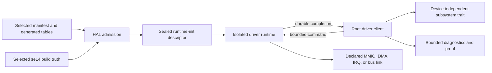

<!-- Copyright 2026 Lukas Bower -->
<!-- SPDX-License-Identifier: Apache-2.0 -->
<!-- Purpose: Explain how to design, implement, test, and qualify Cohesix device drivers. -->
<!-- Author: Lukas Bower -->

# Developing Cohesix Drivers

This is the engineering guide for creating and changing Cohesix drivers. It
defines the development workflow, the boundaries between the manifest compiler,
HAL, isolated runtime, root client, and subsystem, and the evidence required to
call a driver correct.

This document is not a driver-status page or an incident log. Put milestone
state in [BUILD_PLAN.md](BUILD_PLAN.md), physical runbooks and current evidence
in [HARDWARE_BRINGUP.md](HARDWARE_BRINGUP.md), test procedures in
[TEST_PLAN.md](TEST_PLAN.md), and temporary investigation notes outside the
canonical documentation set. Update this guide only when the reusable driver
development contract changes.

See the [Glossary](GLOSSARY.md) for Cohesix-specific runtime, authority, and
evidence terms.

## 1. Start with the governing contract

Before changing a driver, read:

1. [`AGENTS.md`](../AGENTS.md) for the repository-wide architecture and merge
   rules.
2. [BUILD_PLAN.md](BUILD_PLAN.md) for the exact active milestone task that
   authorizes the work.
3. The selected `configs/root_task*.toml` profile and its resolved manifest.
4. The generated seL4 headers and configuration in the selected
   `SEL4_BUILD_DIR`.
5. The relevant runtime, HAL, ABI, subsystem, and test sources listed in the
   [source map](#12-source-map).

The active task must authorize every touched surface. If the task, selected
profile, and as-built system disagree, fix the scope in `BUILD_PLAN.md` before
implementing driver behavior.

Use the repository task format verbatim:

```text
Title/ID: <slug>
Milestone: <exact milestone/submilestone and task title/ID>
Goal: <one sentence>
Inputs: <artifacts, versions, paths>
Changes:
  - <file> — <summary>
Commands: <exact shell commands for the scoped host/target; default macOS ARM64>
Checks: <deterministic success criteria>
Deliverables: <files, logs, doc updates>
```

Every new or modified human-authored file must retain or add the required
Lukas Bower author, purpose, and 2026 copyright metadata in its native comment
syntax.

## 2. Understand the architecture before writing code

Physical drivers do not run as steady-state root-task code. Each physical
device role is served by a manifest-declared isolated runtime child. Root-task
constructs and admits resources through HAL, creates the child, submits bounded
commands, consumes completions, and projects diagnostics. The child owns the
device engine after handoff.



### 2.1 Layer responsibilities

| Layer | Owns | Must not own |
| --- | --- | --- |
| Build plan and profile | Scope, selected target, declared runtime images, resource counts, IRQ topology, bus links, affinity, and feature gates. | Runtime-discovered authority or undocumented fallback behavior. |
| Manifest compiler (`coh-rtc`) | Validation, resolved manifests, generated Rust tables, generated snippets, and profile fingerprints. | Device I/O or hand-authored generated output. |
| HAL | Physical-address admission, device-untyped handling, seL4 object construction, mappings, DMA allocation, IRQ binding, PCI/platform admission, firmware-resource publication, and runtime creation. | Steady device service, protocol policy, or a second driver implementation. |
| Shared ABI | Pointer-free versioned records, resource descriptors, bounded command/completion formats, and linked-runtime records. | Process-local pointers, implicit ownership, or unbounded payloads. |
| Isolated runtime | Runtime-init validation, the device state machine, volatile access to admitted mappings, descriptor ownership, bounded waits, IRQ-source handling, and durable completion publication. | Physical discovery, untyped retyping, arbitrary mapping, namespace authority, or resources absent from its descriptor. |
| Root driver client | Contract validation, command publication, bounded service turns, completion consumption, policy-neutral diagnostics, and adaptation to a narrow subsystem trait. | Direct steady-state MMIO, duplicate completion, or rescue through a root-owned physical path. |
| Subsystem | Device-independent use of serial, display, input, network, storage, or another role. | Device model checks, register knowledge, or HAL bypasses. |

HAL owns resource admission for MMIO, IRQ, DMA, PCI, SDIO, board-level
power/reset, and firmware bundles. A child may use only the capabilities and
mapped pages sealed into its runtime-init descriptor.

### 2.2 One owner for every physical effect

Write down the ownership model before implementation. For every register bank,
descriptor ring, interrupt source, DMA buffer, firmware mailbox, and recovery
action, name exactly one physical owner.

The design must have:

- one path that issues a physical operation;
- one path that completes it;
- one path that retries or recovers it;
- one immutable identity from logical parent through physical child and
  terminal receipt; and
- no polling, compatibility, diagnostic, or emergency path that can become a
  second owner.

Multiple scheduling lanes may request service from one owner. They do not gain
independent physical authority. A notification is a scheduling hint, not an
ownership transfer and not proof that an operation completed.

Root may retain the documented emergency serial path for fatal output. That
exception is not steady-state serial ownership and cannot be generalized to
other devices.

### 2.3 Physical and compatibility drivers are different proof lanes

Pi 4 physical drivers use isolated runtime images and the fixed driver-task
ABI. QEMU VirtIO and RTL8139 implementations are profile-gated compatibility
drivers for virtual-device, host, and protocol tests. A QEMU success can prove
shared subsystem behavior, but it cannot prove Pi MMIO, DMA, IRQ, timer, PCIe,
USB, GENET, SDIO, or CYW43 behavior.

## 3. Design the driver on paper

Create a short design record in the task or PR before editing source. It should
answer all of the following.

### 3.1 Role and authority

- What device-independent role does the driver provide?
- Which isolated runtime owns the hardware?
- Which HAL capability admits each resource?
- Does the device depend on another runtime? If so, which side is the client,
  which side is the sole physical owner, and what is the bounded bus-link
  protocol?
- Which root component consumes the driver, and through which narrow trait?
- What is explicitly outside the driver's authority?

Choose devices by role, not model. Model-specific logic belongs behind the
role boundary. A subsystem must not branch on a PCI ID, board name, or chip
family when a trait can express the required service.

### 3.2 Resource inventory

List the exact requirements for:

- code, stack, IPC, ring, and shared-buffer pages;
- MMIO pages and safe register widths;
- DMA pages, alignment, bus-address rules, and coherence;
- framebuffer or firmware buffers;
- IRQ numbers, trigger modes, badges, handler slots, and notification slots;
- linked-runtime endpoints, notifications, shared ranges, epochs, and queue
  depths;
- scheduling class, authority class, affinity, service budgets, and queue
  depth; and
- elapsed-time deadlines and the selected timer source.

Treat the inventory as a bound, not a suggestion. Unknown, overlapping,
misaligned, excessive, or undeclared resources must fail closed.

### 3.3 State machine and terminality

Describe the state machine as bounded transitions. For every command, define:

- the immutable request identity;
- preconditions and validation errors;
- the physical issue point;
- pending states and the exact condition that makes progress possible;
- a finite operation budget and elapsed-time deadline;
- success and failure terminals;
- how hardware and software ownership return to a quiescent state; and
- what evidence the final consumer records after receiving the terminal.

Never use a retry counter as a substitute for elapsed time. Never use a timeout
to silently switch to another owner or implementation.

A resumable active driver may select MCS `NaturalPostpone` in its target
manifest when one immutable physical lifetime intentionally spans multiple SC
refills. That policy leaves the exact budget, period, standard-fault endpoint,
explicit device deadline, owner, and terminal publication unchanged; it only
prevents ordinary current-refill exhaustion from becoming a false terminal
timeout fault. Generated timeout capability identity and resource accounting
remain present. The selection requires target evidence for bounded progress and
cannot replace a device deadline, no-progress detector, or fault-containment
test.
The driver TCB constructor must consume this generated policy at the actual
`TCB.SetTimeoutEndpoint` boundary. Its bounded construction record reports both
the policy and whether the timeout endpoint was installed or omitted; manifest
selection without matching kernel-object construction is a failed invariant.

### 3.4 Acceptance plan

State the evidence needed at each tier before coding:

- model and unit-test proof;
- generated/profile proof;
- target compile and image provenance;
- media readback when applicable;
- current-image runtime identity and owner-state proof;
- useful device I/O;
- repeatability; and
- performance under the required mixed load.

This prevents a source test or generated descriptor from being mistaken for a
hardware result.

## 4. Implement a new physical driver

The following order keeps compiler truth, authority, ABI, runtime behavior, and
tests aligned. Existing drivers use the same order for material changes.

### Step 1: Add the compiler-owned declaration

Add the runtime image to the applicable `root_task.driver_images` profile. A
runtime image record declares:

- a stable image ID;
- a contract name and hot-path name;
- the packaged artifact and entry symbol;
- bounded code, stack, IPC, ring, MMIO, DMA, and shared-buffer pages;
- any role-specific root-wake notification; and
- whether root context is forbidden and hardware state is migrated.

Declare IRQs and reciprocal bus links in the same profile when they are part of
the topology. Do not encode those values again in prose or infer them at
runtime.

The current compiler intentionally recognizes a closed set of Pi 4 hot paths.
A genuinely new role therefore normally requires coordinated changes to:

- `DriverRuntimeImagePolicy` and its validators in `tools/coh-rtc/src/ir.rs`;
- generated Rust and documentation output in `tools/coh-rtc/src/codegen/`;
- every selected profile that must support the role;
- affinity and feature validation;
- negative compiler tests for missing, duplicate, overlapping, excessive, and
  inconsistent declarations; and
- generated artifacts and their hashes.

Do not hand-edit `apps/root-task/src/generated/*`,
`configs/generated/*`, `scripts/cohsh/boot_v0.coh`, or
`docs/snippets/*`. Run the full generator output set defined by
`scripts/check-generated.sh`, then run the guard again. The short generator
form that emits only root-task Rust and a resolved manifest is not sufficient
for an intentional regeneration.

### Step 2: Define or extend the pointer-free ABI

Use [`pi4-driver-abi`](../crates/pi4-driver-abi) for data shared between root
and the runtime. ABI records must be `no_std`, fixed-size, pointer-free, and
validatable without trusting the sender.

Prefer existing generic records for MMIO, DMA, shared pages, IRQs, resource
ranges, commands, completions, counters, and bus links. Add a role-specific
record only when the generic contract cannot express the required semantics.

For every new or changed record:

1. Define magic, version, size, alignment, capacity, and reserved-field rules.
2. Use offsets, lengths, indices, physical addresses, bus addresses, epochs,
   and tokens rather than virtual pointers.
3. Validate arithmetic with checked operations.
4. Reject unknown flags, opcodes, versions, roles, and out-of-range values.
5. Define the publication order and terminal commit field.
6. Add positive, boundary, malformed, stale-identity, and torn-publication
   tests on both sides of the ABI.
7. Bump `DRIVER_RUNTIME_INIT_VERSION` when layout or shared protocol semantics
   change, and update every producer, consumer, generator check, fixture, and
   diagnostic that depends on it.

Do not place policy objects, trait objects, slices, references, process-local
addresses, or allocator-owned structures in the ABI.

### Step 3: Add the scheduling contract

Every root service path validates a `DriverTaskContract` before HAL admits
work. Add the role to the contract and hot-path tables in
`apps/root-task/src/hal/driver_task.rs`.

The contract defines:

- `DriverTaskKind`;
- service class;
- authority class;
- isolation state;
- maximum HAL operations, bytes, frames/reports/rows, and any explicitly
  permitted bounded bootstrap spins per turn;
- whether a wait is permitted;
- preemptibility; and
- maximum inbound queue depth.

Reject zero or excessive budgets, unbounded waits, non-preemptible hardware
turns, class/authority mismatches, and physical `RootTaskCompatibility`
fallbacks. Affinity and scheduling values are profile-qualified; a generated
value is not proof that the kernel applied it on the target.

### Step 4: Implement HAL admission

Use the narrowest existing capability trait:

- `DeviceHal` for generic device pages, DMA frames, coverage, and IRQ binding;
- `PciHal` for admitted PCI topology, BAR mapping, and command-register
  configuration; or
- `Cyw43Hal` for the admitted CYW43 firmware bundle.

Add a narrower trait when a new capability class is genuinely required. Do not
expand the `Hardware` compatibility facade just to make a call site convenient.

HAL must validate and construct every resource before the child runs. This
includes:

- exact physical coverage and requested physical address;
- page order, alignment, access permissions, and non-overlap;
- DMA allocation and bus-address publication;
- IRQ handler, badged notification, trigger, and child capability slots;
- reciprocal runtime link capabilities and shared ranges;
- runtime image identity, entry point, code and stack bounds;
- child CSpace and VSpace capacity; and
- the sealed runtime-init descriptor.

Physical-address discovery, device-untyped retyping, DMA allocation, IRQ
binding, PCI configuration, board power/reset admission, and firmware-resource
selection must not escape HAL.

### Step 5: Create the isolated runtime entry point

Add a binary under `apps/pi4-driver-runtime/src/bin/` and its `[[bin]]` entry
in `apps/pi4-driver-runtime/Cargo.toml`. Reuse the shared runtime machinery in
`apps/pi4-driver-runtime/src/lib.rs`; do not create a private transport or a
second ABI.

On startup, the runtime must:

1. Receive the initialization command through the fixed entry point.
2. Validate descriptor magic, ABI version, task key, artifact identity, role,
   hot path, flags, counts, ranges, and link identity.
3. Reject missing required resources and forbidden extra resources.
4. Construct only bounded local views over the mapped resources.
5. Initialize the device without discovering new authority.
6. Publish an explicit ready or failed terminal.
7. Enter the command/notification loop only after initialization is durable.

The runtime state must fit within statically bounded storage. Avoid large stack
frames; place large queues and device state in bounded static or admitted
shared storage. VM code remains `no_std`.

### Step 6: Implement bounded service turns

A normal service turn is:

1. Root reserves the single producer lane.
2. Root writes the complete command body.
3. Root performs required cache maintenance and barriers.
4. Root commits the command sequence last.
5. Root invokes the declared endpoint or notification.
6. The runtime validates and accepts that exact command.
7. The runtime performs no more than the admitted work budget.
8. The runtime publishes one terminal, explicit pending state, or budget
   exhaustion result.
9. The final consumer validates and records the exact completion.

No turn may wait without a finite deadline. No turn may monopolize the event
pump until hardware, firmware, another runtime, or network traffic responds.
Long operations must use an explicit retained cursor whose identity and
deadline survive across turns.

### Step 7: Add the root client and subsystem adapter

Add root-side publication, completion consumption, and owner-state evidence to
`apps/root-task/src/hal/driver_task.rs` or a narrowly scoped client module. The
client must:

- enforce the scheduling contract;
- serialize the single producer;
- preserve one immutable request identity;
- distinguish pending, terminal success, terminal failure, and no response;
- reject stale or cross-generation completions;
- return control to the event pump after bounded work; and
- expose a narrow device-independent trait to the consuming subsystem.

Root may validate, submit, observe, and adapt. It must not duplicate device
register access or implement a rescue data path.

### Step 8: Add bounded diagnostics

Diagnostics are passive snapshots unless the operator command explicitly
states that it starts a bounded probe. A diagnostic must report:

- selected profile and runtime identity;
- descriptor acceptance and resource totals;
- owner and generation identity;
- command issue, progress, and terminal sequence;
- typed blocker or first fault;
- IRQ, DMA, cache, timer, and queue counters relevant to the claim; and
- whether evidence is current, retained, inferred, stale, or unavailable.

Keep records short enough for the documented console bound. Rate-limit repeated
hot-path output. A diagnostic must never clear a fault, issue hardware I/O,
renew a lease, retry an operation, or promote cached readiness unless that
mutation is the documented purpose of a separately bounded command.

### Step 9: Package the runtime

The Pi image builder compiles the declared runtime binaries, packages them in
the driver-runtime CPIO, embeds that payload in root-task, and stages the
U-Boot image set. A new runtime must be added consistently to:

- `apps/pi4-driver-runtime/Cargo.toml`;
- the selected manifest image records;
- root runtime-image and bootstrap contract tables;
- the image builder's binary and CPIO entry lists;
- CSpace preflight accounting;
- artifact-freshness checks; and
- target-qualified Test Plan actions.

Do not copy an old runtime binary into a new image or infer freshness from its
filename. The packaged bytes, generated identity, source revision, target
image, media readback, and boot marker are separate evidence.

## 5. Implement hardware access correctly

### 5.1 MMIO

Use `MappedRegion`, `MappedRegisterWindow`, or `MappedRegisterPages` derived
from HAL admission. Access registers with the exact width specified by the
device contract and use volatile reads/writes only inside the admitted range.

For every register operation:

- validate offset, width, alignment, and access permission;
- preserve reserved bits;
- handle read-clear and write-one-to-clear semantics explicitly;
- document ordering requirements at the call site;
- use a known-safe register for posted-write readback; and
- avoid diagnostic reads that have side effects.

`volatile` prevents compiler elision of the access. It does not provide a
memory barrier, cache maintenance, or DMA ownership transfer.

seL4 device untypeds use a forward-moving allocation watermark. When pages in
one device-untyped region are admitted to different owners, lower child-only
pages may need pre-admission before a higher root mapping advances the
watermark. Map multi-page apertures in ascending physical-page order, verify
device coverage, and verify that the mapped frame's reported physical address
equals the request before publication.

### 5.2 DMA and cache maintenance

HAL allocates DMA memory and publishes primitive page or semantic range
records. A runtime derives local and device-visible addresses only from those
records.

For every buffer or descriptor, define an ownership cycle such as:

```text
CPU free -> CPU prepared -> cache-maintained when cacheable -> device owned
device complete -> cache-maintained when cacheable -> CPU consumed -> CPU free
```

Requirements:

- clean CPU-produced data in cacheable mappings before a non-coherent device reads it;
- invalidate device-produced data in cacheable mappings before the CPU reads it;
- for `seL4_ARM_Page_Uncached` mappings, skip cache operations while retaining
  the required DMA publication and consumption barriers;
- order descriptor publication after payload preparation;
- order completion consumption after device ownership returns;
- use the selected seL4 cache operations and barriers;
- reject lengths or bus addresses outside admitted ranges; and
- keep command-ring publication separate from payload-DMA publication.

The authenticated `CACHELOG` operator view is diagnostic evidence, not device
ownership or a DMA synchronization primitive. Root keeps the existing
1920-record bound. A synchronous network request reserves the complete bounded
snapshot allocation before taking the cache-log lock, holds that lock once only
while copying the selected newest-first records, then renders and transmits one
record at a time after release. Allocation failure returns a typed bounded
error without a partial snapshot; live-ring mutation after capture cannot
change, reorder, duplicate, or extend the response. This snapshot path adds no
cache-maintenance operation, device transition, DMA authority, or Pi timing
change.

The Pi 4 profile uses `bounded-no-iommu`. It provides bounded allocation,
range, ownership, and cache discipline; it is not hardware-enforced isolation
from a malicious DMA-capable device. Do not claim SMMU/IOMMU protection for
that profile.

### 5.3 IRQs and notifications

An interrupt path must be declared, generated, admitted, bound, and validated
before the device source is enabled.

For a level-triggered source, the runtime normally:

1. reads and validates the exact source;
2. masks or latches it according to the device contract;
3. performs bounded source service;
4. clears the device source, or durably records the source under a defined
   cursor-owned mask;
5. acknowledges the seL4 IRQHandler; and
6. republishes remaining work if the service budget was exhausted.

Do not acknowledge the kernel IRQ before the device source is safely cleared
or retained. A notification may coalesce and may arrive before, after, or with
other state. The consumer must always recheck durable work before sleeping.

On selected MCS builds, a notification bound to the receiving TCB defines its
badge but does not define the returned `MessageInfo`. Runtime receive
classification is therefore badge-first: the exact compiler-owned 64-bit
command badge with nonzero message length is endpoint IPC; any admitted
low-32-bit nonzero badge is a notification even when the message length is
stale; and zero, zero-length command, wrong-task, or foreign high-domain badges
fail closed. Classic seL4 retains its length-first receive semantics. Device
routing still validates the admitted one-hot or coalesced notification bits
before performing one bounded owner quantum.

If the selected implementation is intentionally polled, report it as polled.
Do not claim interrupt delivery from configuration eligibility or an unused
IRQ record.

### 5.4 Timeouts and delays

On Pi 4, elapsed-time logic uses `CNTVCT_EL0` only when the selected seL4 build
enables `KernelArmExportVCNTUser` / `CONFIG_EXPORT_VCNT_USER`. Convert ticks
using generated `TIMER_CLOCK_HZ`.

Do not use:

- `CNTPCT_EL0`;
- EL0 timer-control registers;
- a dummy timer for hardware acceptance;
- raw CPU-speed spin loops; or
- an unqualified poll count as elapsed time.

A fixed attempt count may bound protocol work. If it represents a real delay or
timeout, pair it with a virtual-counter deadline. Performance claims require a
counter-qualified target trace.

### 5.5 PCI and board-level setup

HAL owns PCI topology discovery, BAR admission, command-register changes,
root-complex setup, firmware reset, and DMA-window policy. The isolated device
runtime owns only the admitted function or controller service after handoff.

Prove identity, class, BAR shape, link state, command bits, and DMA window
before giving a child credit for downstream device function. Linux or U-Boot
captures may be reference material; they are not live Cohesix authority or
target proof.

## 6. Preserve durable command and completion semantics

### 6.1 Publish body first and commit identity last

Shared command, completion, event, and diagnostic records use a sequence-last
publication rule:

1. clear or invalidate the old commit field;
2. write the complete body;
3. perform required cache maintenance and barriers; and
4. publish the nonzero sequence, epoch, or commit value last.

Readers must take a stable snapshot, validate the identity, and reject torn,
zero, stale, or mismatched records. Do not treat the highest observed sequence
as sufficient when another field binds the exact request or generation.

### 6.2 Commit before notification

When a producer wakes another task, the terminal or durable pending condition
must be visible before the signal. The order is:

```text
terminal body -> cache clean/barrier -> sequence-last commit -> notification
```

The consumer must recheck the committed condition after preparing to wait and
immediately before the blocking receive. This closes the wake-before-wait and
signal-before-commit races without turning polling into a scheduling clock.

### 6.3 Retained operations

Use a retained operation only when a single bounded turn cannot finish the
device action. Its cursor must bind:

- parent request sequence;
- operation code and immutable arguments;
- role-specific descriptor or payload fingerprint;
- logical and physical generation;
- current phase;
- remaining operation, byte, and frame budgets;
- absolute deadline; and
- exact child or IRQ work currently awaited.

Only semantic progress may advance the cursor. A notification, empty poll,
duplicate completion, scheduler turn, or diagnostic read is not progress.

If the owner can block, it must publish the durable wait condition before
sleeping and clear it before interpreting a wake. If it cannot establish a safe
wait, fail closed through the sole recovery path.

### 6.4 Recovery

Recovery is part of the original ownership design, not an alternate driver.
Define one recovery state machine that:

- contains an issued or possibly issued operation before reuse;
- preserves the exact first terminal cause;
- invalidates stale readiness and generations;
- quiesces IRQ and DMA ownership;
- returns resources to one known state; and
- either resumes through the canonical initialization path or terminates
  without claiming readiness.

Do not add a whole-bootstrap retry, root-context fallback, independent polling
loop, duplicate interrupt lane, or faster command path to conceal a broken
handoff.

## 7. Use the existing driver patterns

The selected Pi 4 manifests currently declare seven physical runtime roles.
The generated manifest snippet is the authority for exact artifacts, resource
counts, IRQs, bus links, and affinity. The table below describes only the
reusable ownership pattern.

| Role | Runtime owns | Root/HAL boundary |
| --- | --- | --- |
| Serial | Bounded mini-UART RX/TX and steady interrupt service. | HAL admits UART/IRQ resources; root retains only the emergency fatal-output exception. |
| USB/local seat | xHCI state, enumeration, one boot-keyboard interrupt-IN lifetime, HID report completion, and bounded recovery. | HAL admits PCIe/MMIO/DMA; root consumes decoded input through the local-seat path. |
| HDMI text | Bounded text rendering into the admitted framebuffer. | HAL maps the framebuffer exclusively into the child; root submits display records and may shed display work under pressure. |
| GENET | MAC/MDIO state and bounded RX/TX descriptor service. | HAL admits MMIO/DMA; root consumes the common network-device behavior. |
| CYW43 | Firmware, SDPCM/BDC, control, EAPOL/data policy mechanics, and Wi-Fi RX/TX state. | HAL admits firmware/shared resources; CYW43 has no direct SDHCI MMIO authority. |
| SDIO host | SDHCI, CMD52/CMD53, card interrupt, DMA channel, and physical bus service. | HAL admits MMIO/DMA/IRQs; CYW43 requests bounded service through the generated reciprocal link. |
| PCIe root | Declared PCIe-controller service after HAL platform admission. | HAL retains root-complex, firmware/reset, topology, and resource-admission authority. |

### 7.1 Serial pattern

- On selected MCS builds, a notification bound to a runtime TCB may satisfy the
  `seL4_NBRecv` used to admit a Reply-bearing command. Apply the common
  badge-first MCS rule in Section 5.3 rather than trusting the notification's
  unspecified message length. Route and service exactly one bounded owner
  quantum, then re-read the still-durable command on a later outer turn without
  reusing or replacing its Reply object.
- The selected Pi serial transport uses the runtime's existing four shared
  pages as two independent generation-bound SPSC rings. Pages zero and one are
  the root-to-runtime TX ring, pages two and three are the runtime-to-root RX
  ring, and each two-page ring has a 64-byte header plus exactly 8,128 payload
  bytes. Do not reinterpret the pages as a common MPMC queue or add a second
  UART owner.
- Map these CPU-only ring pages with identical cacheable, execute-never Normal
  memory attributes in root and child. The selected AArch64 seL4 kernel maps
  `Page_Uncached` as Device-nGnRnE, which is retained for DMA/MMIO but is not a
  valid home for the ring's Rust atomic acquire/release cursors. Do not extend
  the serial exception to a device-facing or DMA-addressable page.
- Publish payload before the producer cursor and consume payload before the
  consumer cursor. Validate magic, version, direction, generation, capacity,
  cursor distance, and commit-paired cursors before access; poison and fail
  closed on an invalid or discontinuous cursor instead of truncating it.
- Treat wakeups as hints around durable ring state. After producing or
  consuming, perform the final state/epoch recheck required to close the
  empty-to-nonempty and full-to-not-full races. Root drains the rings through
  its existing cooperative EventPump polling; the transport does not claim a
  direct interrupt wake into root.
- While the validated root-to-runtime ring has committed nonzero occupancy,
  sample `MU_STAT` before sleeping. If the FIFO has no free slot, block only on
  the generated local notification in slot 3; if it exposes one through eight
  free slots, re-enter one bounded owner turn immediately. Admit only the exact
  serial IRQ badge, root doorbell badge, or their coalesced value; service at
  most one FIFO quantum, then re-enter the outer command poll before
  classifying occupancy again. Return to the combined endpoint-and-bound-
  notification wait at zero. An invalid live cursor or impossible FIFO level
  poisons the TX ring, disables TX-empty, and makes the TX-idle probe fault
  instead of selecting either active wait or a fallback owner.
- Keep RX and TX loops bounded by the service contract.
- Interpret the BCM2711 mini-UART IER by the hardware-validated Linux/QEMU
  mapping: bit 0 enables RX and bit 1 enables TX-empty. The older BCM2835
  peripheral PDF labels those two sources in the opposite order, but its
  published errata swaps bits 1:0; do not copy the original reversal into the
  BCM2711 runtime. `MU_LSR` bit 5 proves only that at
  least one TX byte is admissible; derive the exact zero-through-eight-byte
  write prefix from `MU_STAT[27:24]`, consume no SPSC byte on an impossible
  level, and keep TX-empty enabled exactly while committed TX bytes remain.
- For a level-triggered RX source, sample live level even when a notification
  coalesces, but never exceed the granted byte budget.
- Check queue capacity before reading a data register.
- Preserve an asserted source when the queue or budget is exhausted; drain it
  through the same child before IRQ acknowledgement. If a full RX ring leaves
  the combined mini-UART handler unacknowledged, a later software continuation
  after root drain must retry the same pending IRQ acknowledgement; whether
  that continuation itself carried an IRQ badge is irrelevant.
- Any source-polled or root-doorbell turn that consumes RX bytes, fills a TX
  FIFO prefix, or leaves durable RX/TX work must establish the handler-rearm
  obligation before it can wait. An IRQ badge is evidence of one wake, not the
  sole authority to restore the level handler after a coalesced edge.
- A terminal linked-serial generation poison aborts only output owned by that
  failed transport, records one exact `SERIAL_TRANSPORT status=failed ...
  owner-fallback=none` diagnostic in the Queen log, and retires the physical
  response barrier. Later serial RX and local-seat USB parsing remain
  serviceable, while serial-only output is explicitly retired instead of
  consuming its bounded queue. Root never resumes MMIO ownership as a fallback;
  local-seat response text and prompts continue through the existing HDMI
  mirror.
- Before takeover or steady-state acknowledgement, complete the IER/device
  writes, read back IER and non-destructive `MU_STAT` from the same mini-UART
  aperture, complete that observation, and only then invoke
  `seL4_IRQHandler_Ack`. A mask/readback mismatch or failed kernel ACK retains
  the handler evidence and poisons TX so the child cannot sleep waiting for an
  interrupt that remains masked.
- Transfer ownership without dropping bytes that arrive at the boundary.
- This transport changes no mini-UART baud, FIFO, IRQ identity, owner, MCS
  budget/period, response bound, timeout policy, or emergency-fatal exception.
- Treat emergency root serial as degraded diagnostics, not migrated service.

### 7.2 USB and local-seat pattern

- Separate PCIe prerequisite, controller readiness, device discovery, HID
  endpoint readiness, first valid report, parser ingress, and echoed command
  completion. None implies the next.
- Keep exactly one production keyboard interrupt-IN transfer active. Ring
  capacity is storage capacity, not permission for multiple active transfers.
- Interpret sustained queue diagnostics against that invariant: zero entries
  is empty, one is healthy, and more than one is a queue-depth fault. A large
  cumulative transfer count cannot turn the healthy one-deep state into a
  collapse warning. Use the current no-reply streak for liveness; retain the
  cumulative no-reply total as telemetry only.
- After attach or recovery, require a decoded all-zero idle report before
  accepting make transitions; do not turn a held key into a synthetic command.
- Emit every ordinary key once per make/release edge. Only held arrow usages
  repeat: use the exported virtual counter and selected `TIMER_CLOCK_HZ` for a
  300 ms initial deadline and 50 ms interval. Evaluate a due repeat from the
  existing steady keyboard turn even when no new HID report arrives; report
  count is not elapsed time and must not become the repeat clock.
- Represent retained work as typed `Pending`, `Complete`, or `Failed`.
- Keep the fixed 48-byte, pointer-free `DriverRuntimeUsbOldgoodReceipt` ABI slot
  at shared-ring offset 192 reserved for compatibility, but do not stage or
  publish its partial or terminal state from the isolated USB runtime. Root may
  stable-read and passively project the reserved zero record; that projection
  grants no admission, scheduling, recovery, or acceptance authority.
- Give enumeration and recovery finite attempt and elapsed-time bounds.
- Expose active, outstanding, and active-without-progress state separately;
  cached readiness must not hide a retained request that has stopped making
  progress.
- Count real decoded or buffered input as operator work. Do not let cached
  readiness or ordinary pending polls starve the network lane.
- Treat a skipped runtime turn after higher-priority physical input as
  scheduling telemetry, not a transport no-reply. Transport degradation needs
  explicit failed recovery, no-reply, queue collapse, or dropped-byte evidence.
- A keyboard probe may report attachment only from its live `Complete`
  terminal. Cached attachment cannot promote `Pending` or `Failed` to success.
- Program HID `SET_IDLE` with a one-second interval on the existing endpoint
  lifetime. This gives an unchanged keyboard a bounded way to publish the
  all-zero attach baseline before the separate five-second exact-transfer
  watchdog; it does not add a polling path, retry owner, or second transfer.
- Keep `USB_RESET_DONE` inside the existing bounded extended controller-init
  and reset timeout class. It is the transition into the following run-stage
  setup, not permission to fall back to the generic three-resume allowance or
  to create a new retry lifetime.
- A passive liveness sentinel passes only when the linked runtime, parser
  ingress, parser drain, and echo counters advance without a dropped-byte
  increase. A latched startup gate or unchanged cumulative counter is not
  current physical-input proof.
- Before a current linked-runtime HID byte is accepted, report
  `usb-physical-input-unproven`. Gate 10, command readiness, or first-report
  readiness alone must never be relabelled as first-byte evidence and cannot
  produce a `usb-post-first-byte-*` blocker.
- The attach sequence performs PCIe descriptor preparation and owner
  registration, then USB descriptor replay and runtime initialization. It
  registers the USB owner once controller init is ready, before enumeration.
  On a physical Pi profile that marks local-seat required, the deferred
  CYW43/SDIO supervisor cannot take its first driver turn while that PCIe/USB
  controller-owner chain is still retained. Its operator phase routes ordinary
  one-operation EventPump turns until the USB controller owner is ready, then
  rechecks Wi-Fi admission. While retained bootstrap work remains, a pending
  display milestone keeps its existing first-turn priority, but distinct
  non-display turns alternate one bounded linked USB/HID service unit with
  serial/dispatch service. Network stays fenced throughout this operator
  rotation, and any USB byte remains buffered for the later serial/dispatch
  turn. This preserves keyboard-enumeration progress without composing USB and
  CYW43 hardware operations or allowing either physical console to starve.
  Once that controller is admitted and ready, `controller_ready &&
  !command_ready` remains finite bounded `LocalSeat` debt even before backend
  keyboard polling is enabled. One existing local-seat turn services that debt,
  then returns to serial alternation; the debt stops at command readiness.
  Keyboard command readiness and first-byte proof
  remain independent downstream USB gates and are not prerequisites for Wi-Fi.
  `LocalSeat` does not add a second proof-scheduling phase after endpoint
  completion and does not
  cache a completion or HID bytes while waiting for another descriptor/owner
  pass. A valid linked input frame follows the existing parser-admission path
  once, and a valid first-report completion follows the existing command-ready
  transition. Current hardware acceptance independently requires both USB and
  PCIe owners to be `driver-owned`, both descriptors to be `sealed`, Gate 10,
  the exact one-deep queue, and real HID/parser/HDMI liveness; endpoint progress
  alone cannot satisfy those gates. An ordinary pending enumeration retry may
  retain the existing pre-prompt deferral, but that deferral is not descriptor
  or owner proof authority.
- Treat local HDMI readiness independently from WiFi or GENET readiness. Queue
  `Cohesix console ready` only after root and current USB command admission,
  and withhold the interactive prompt until that exact banner frame completes
  and display retry health holds. Before that boundary, project bounded
  controller, keyboard-enumeration, and first-report feedback through the
  existing EventPump output path. Emit stage changes immediately and an
  unchanged-stage heartbeat no more often than every two seconds. Retain the
  bounded canonical `[local-seat] usb keyboard command-ready
  action=enable-command-input ...` receipt exactly once in `queen.log`; its
  counter detail remains log-only. EventPump is the sole serial projector and
  emits that canonical receipt exactly once immediately before the passive
  `[drivers] USB console ready` timing record through the existing HighImpact
  output path. The pair may follow prompt release and grants no scheduling
  authority.
- Keep the canonical prompt/input row dirty until its matching generation
  receipt completes. Older FIFO output stays before that row, later output
  stays after it, and backspace cannot erase bytes at or before the prompt
  floor. An older display completion cannot acknowledge newer input.
- If an arrow arrives at the live tail while ordinary HDMI output remains
  pending, seal that finite prefix, drain it under generation and logical-tail
  receipt identity, and only then apply the bounded CSI scroll. Output queued
  later stays behind the fence. Identity drift, wrap, eviction, or unavailable
  history requests one canonical snapshot; none of these presentation paths
  resets or reinitializes xHCI.
- If USB command readiness is invalidated, retract the prompt and stale
  console-ready banner without discarding the typed suffix. Re-admit them only
  from fresh readiness; a stale retraction receipt cannot clear the restored
  row.

### 7.3 HDMI pattern

- Map framebuffer pages into the display child without a steady root VSpace
  alias.
- After the immutable framebuffer range, format, alignment, pitch, and geometry
  are admitted, the child may write one fixed `Cohesix starting...` glyph tile
  in the safe area and issue one device-store barrier. This is bounded early
  physical progress only: it grants no root alias, prompt, USB readiness,
  mailbox/HVS authority, or full-surface clear. Invalid geometry performs zero
  stores, and the first ordinary generation-bound frame clears and replaces the
  tile through the existing takeover cursor.
- Keep terminal state in a fixed child-private cell plane. The current Pi
  renderer admits at most 256 columns by 128 rows, uses a logical row ring for
  scrolling, and records visible damage in a fixed bitmap. Retain a
  generation-bound parser cursor so each immutable input byte is consumed at
  most once across as many bounded turns as required, coalesce the final cell
  values, and rasterize only dirty glyph bands. A tab advances to the next
  eight-column stop by exactly 1 through 8 cells, including eight cells when
  the cursor is already aligned. Never read live scanout to implement terminal
  scroll or redraw.
- On the physical Pi MCS profile only, the canonical one-way HDMI-text
  `SubmitFrame` command selects retained scheduler mask zero: exact HDMI
  contract and hot-path role, generated budget, zero auxiliaries, fixed frame
  offset, nonzero in-bound payload, and zero frame flags are all required.
  HDMI already owns its generated active scheduling context and has no
  separately scheduled bus owner, so one fresh request may fuse only the
  hardware-free `Stage` through sequence-last `CommitRing` transition.
  Endpoint notification remains the next outer turn, and completion polling
  and retirement remain a later outer turn. An exact completion advances
  directly from `Issued` to `ReadyToComplete`; it does not manufacture classic
  priority-boost or restore phases that cannot change MCS state. Any command,
  request, endpoint, ring, fingerprint, retained-lease, or committed-record
  identity drift fails closed before notification. This lane changes no
  scheduling budget, payload limit, raster operation, USB path, bus ownership,
  physical-operation cardinality, or QEMU behavior.
- Admit the framebuffer before rendering: the format must be RGB888 or
  XRGB8888, the visible area must contain a complete 8-by-16 cell, row bytes
  must fit the pitch, the declared framebuffer range must cover
  `pitch * height`, and XRGB8888 virtual address and pitch must be 32-bit
  aligned. Reject unsupported, partial-cell, oversized, truncated, or
  misaligned geometry rather than constructing an alternate renderer.
- Bound parsing, every wide logical-plane operation, first-takeover or
  form-feed clear, dirty raster, frame, and refresh work as resumable retained
  phases of the exact command generation. Do not advance to a later input byte
  until the current byte's clear, scroll, tab, or other multi-cell effect is
  completely staged. Completion is published only after the final
  device-store barrier. The selected Pi profile reserves 2,000 us per unchanged
  10,000 us period; its 1,800 us candidate WCET is a static-admission input,
  not measured Pi timing evidence. Store and cell ceilings scale from the
  generated reservation and are not an unbounded refresh loop.
- Bind every submitted frame to the shared HDMI HAL grant of exactly 1,280
  dirty-cell operations, a 4,096-byte parser envelope, and 80 physical clear
  rows per retained turn. The unchanged pointer-free frame transport admits at
  most 1,536 payload bytes; 4,096 is a pure parser/grant ceiling, not a widened
  single-frame ABI. Reject zero, narrower, broader, or byte-insufficient frame
  grants before mutating the cell plane or scanout, and still cap the
  clear/raster implementation to the admitted fields so contract drift cannot
  silently widen a later turn.
- Distinguish queue acceptance from completed rendering. A ready receipt needs
  a completed display-runtime turn with no outstanding submission or exhausted
  retry; mirroring or queueing a line is insufficient.
- Bind current outstanding status to the display driver's active request. An
  inactive submitted/completed counter gap remains cumulative
  timeout telemetry and cannot fabricate live display work. Passive acceptance
  requires the adjacent current `hdmi: driver` record with present counters,
  no active request, at least one completion, no no-reply streak, and no stale
  snapshot.
- Once a snapshot establishes the viewport, held arrows chase the requested
  history offset by one completed CSI `S`/`T` row per bounded display turn.
  Before rotating the logical row origin, retain bounded damage for the union
  of each old and new visible row's nonblank columns, then clear only the newly
  exposed row or rows without adding redundant damage. Existing dirty cells
  remain ordered through the rotation.
  A scroll count at least as large as the viewport clears the text area while
  preserving the cursor. Reserve full redraw for initial materialization or
  recovery; do not restart it for every repeat or grow an unbounded queue.
- Allow display mirroring and redraw to degrade before serial or keyboard
  command liveness.
- On the deferred WiFi path, a newly accepted partial local-seat line schedules
  exactly one bounded `Dispatch -> Display -> Serial` presentation successor
  before Network while retaining the immutable CYW43 parent and operator fence.
  A reboot acknowledgement or owned physical-response tail keeps immediate
  Serial priority and leaves the echo queued. This ordering changes neither USB
  byte ownership nor HDMI's one-command raster bounds.
- The write-only compositor does not authorize BCM DMA, mailbox/HVS ownership,
  a cacheable or second scanout alias, or a second framebuffer owner. Host
  compositor tests and target compilation can reject a candidate, but only a
  fresh exact-image Pi run can establish visible correctness, latency, and
  operator polish.
- These local-seat rules change no console grammar, physical owner, poller,
  retry path, or scheduling authority. The reserved fixed USB old-good slot and
  root projection are passive compatibility diagnostics; runtime publication
  is dormant. USB remains the sole xHCI/HID owner and HDMI remains the
  child-only framebuffer renderer.

### 7.4 Network-device pattern

- Expose the common network trait; keep controller and firmware details inside
  the driver boundary.
- The selected Pi profile binds GENET default queue 16 to the exact resolved
  seL4 IRQ 189 from the first `ethernet@7d580000` DTS interrupt. The second
  line belongs to priority queues 0 through 15 and is not admitted. Runtime
  code must consume the generated identity and badge 1024 and must not infer a
  GIC offset. Non-Pi/QEMU profiles retain their existing three-IRQ declaration;
  the Pi-only interrupt must not leak into them.
- GENET packet completion is child-owned and IRQ-driven. One DPC turn drains at
  most 16 frames and 24,576 bytes into a fixed 16-frame private queue, then
  completes the device-store/unmask readback before its final source and ring
  recheck. A remaining exact IRQ lifetime stays masked and unacknowledged. An
  exact IRQ badge starts the ordinary lifetime; after direct ownership, an
  already-admitted owner/peer turn or final condition-before-sleep cut may join
  a raw owned interrupt level or advanced DMA index to that same sole-owner
  episode, then uses the existing mask, clear, bounded drain, unmask/readback,
  final raw-plus-index recheck, and exact handler rearm. Software-ring state,
  badge zero by itself, a timer, or an unadmitted poll cannot create an episode.
  `dpc_level_adoptions` counts those physical-level joins only; it grants no
  packet, polling, retry, acknowledgement, or recovery authority. Handler-ack
  or unmask-readback failure disables the runtime without retry.
- Before an admitted GENET RX command reports idle, the same sole owner also
  compares the durable RDMA producer with its consumer and may drain only the
  command's existing operation, frame, and byte grant. This condition check
  cannot create or acknowledge an unseen IRQ lifetime, add a timer poller, or
  introduce a second DMA consumer; it prevents a coalesced notification from
  hiding already-produced frames while the IRQ DPC remains the eager path.
  Packed completion bit 30 is the cumulative, passive
  `command_rx_drain_seen` proof for that route and is exposed as
  `runtime_cmd_drain_seen=0|1` on the existing `netstats: genet_rxq` row. It is
  set only after an admitted command successfully queues at least one durable
  frame; it grants no polling, IRQ, acknowledgement, DMA, or retry authority.
- GENET TX reclaim detail is a completion delta, not a sampled level. An IRQ or
  DPC may accumulate newly reclaimed descriptors until the next root command
  completion with a reclaim field consumes that aggregate exactly once. A
  budget-exhausted completion cannot discard it, a later zero-reclaim poll
  cannot erase it, and a later eligible command cannot report it again. The
  cumulative completion count cannot exceed submissions, while
  `tx_free + tx_in_flight` remains the fixed 32-descriptor active ring.
- QEMU direct-VirtIO retains its strict isolated lower rotor: `ObserveChild`,
  `StageOutput`, `Disconnect`, then `ServiceTick`. Direct GENET alone selects an
  exactly ready `StageOutput` first, then an exactly ready `Disconnect`; with
  neither ready it alternates the only blind root responsibilities,
  `ObserveChild` and `ServiceTick`, one unit per Network visit. After the first
  direct-GENET Network visit observes exactly one accepted authenticated
  command, the existing five-unit Pi quantum may run
  `Serial -> LocalSeat -> Dispatch -> Network`, replacing only optional Display
  with one exact response-stage unit. The direct child's generation- and
  connection-bound response lane already retains the response through
  `ControlCompleted` plus `OutputDrained`, so it creates no legacy TCP flush
  cursor. Display remains the next debt. Stale or mismatched generation,
  connection, authentication, or runtime identity fails closed to the bounded
  legacy cursor; saturation, physical response, quarantine, containment,
  recovery, reboot, or no progress denies the causal fifth unit. This cannot
  compose a child lower-unit burst, increase a manifest or MCS budget, skip
  physical-input priority, create a poller, or grant NIC/child authority.
- CYW43 retains its connection-bound post-dispatch flush cursor because its
  ordinary smoltcp path has no isolated `OutputDrained` proof. The normal TX
  service opportunity precedes smoltcp. If the following cursor flush accepts
  exactly one current-generation response frame for the same nonzero active
  authenticated connection, and the turn has not spent its sole CYW43
  operation, it may use the remaining ordinary `DriverServiceBudget` for one
  immediate op7 service call. Any prior operation, zero/multiple/saturated
  acceptance, identity drift, physical operator work, recovery, containment,
  quarantine, or reboot denies it. The existing outer-operation claim still
  limits the complete Network turn to one physical operation, and the 8/16
  cursor bound remains unchanged.
- Prioritize ARP and TCP/ICMP control traffic, but after four consecutive
  control frames service the oldest data frame so control load cannot starve
  data. Batch drain and root consumption remain independently bounded.
- Physical GENET descriptors and DMA buffers remain private, uncached, and
  solely owned by the GENET child. After DHCP and an exact proof that every
  root-mediated GENET command, RX, and TX cursor is quiescent, root may perform
  the one-way generation-bound direct-data-plane handoff. It then reuses the
  existing 32 shared pages as CPU-only cacheable Normal/XN memory: page 0 is
  the control page, pages 1 through 15 are GENET-to-console RX slots, and pages
  16 through 31 are console-to-GENET TX slots. Those pages have no
  device-visible, DMA, or physical-address authority and map only into the two
  child generations. GENET remains the sole MMIO/DMA/IRQ owner and
  console-network remains the sole smoltcp/TCP/auth owner.
- Each direction is a single-producer/single-consumer sequence-last ring with
  bounded frames, monotonic cursors, exact generation/length validation, and a
  final durable-state recheck before waiting. Fixed-badge peer notifications
  are coalescing hints only. The root publishes the exact generation as
  handoff-pending before issuing DGHO. While that phase is unfaulted, only the
  bounded legacy drain may run; a DGHO retry waits for its coordinator and
  root RX/TX queues to become empty. READY atomically removes the pending phase,
  while a fault at any earlier or later interleaving latches coupled
  containment. An invalid sequence, stale generation, corruption, descriptor
  drift, failed handoff terminal, IRQ unmask/acknowledgement failure, or peer
  fault poisons the link, signals the peer, and fails through the standard
  supervisor endpoint; root packet polling, copying, and packet-command service
  never resume as a fallback. Before its standard fault, console-network
  independently poisons its RX-consumer and TX-producer lines and signals the
  GENET peer; a reciprocal-line race cannot suppress either valid owned poison.
  Console containment unmaps and deletes every
  copied external frame cap before revoking the console anchor, while driver
  containment owns the original page generation.
- DGHO may publish READY only after a finite legacy interrupt/completion epoch.
  A quiet Ethernet wire is not a synchronization condition. The GENET child
  masks the admitted source, stops MAC RX, waits 10 ms in the generated
  CNTVCT domain for accepted pipeline work, clears only RDMA `DMA_EN` while
  retaining the default-ring enable and configuration, and requires DMA status
  bit 0 to report disabled within 5 ms. Only then does
  it snapshot the immutable producer frontier. Root may drain that finite
  legacy frontier, private RX, TX reclaim, pending direct cursor commits, and
  every retained handler lifetime while the source and ingress remain stopped.
  Producer movement, a cursor distance beyond the 32-descriptor hardware ring,
  generation/token drift, failed stop/readback, or timeout faults the pair and
  leaves MAC RX, RDMA, TDMA, and IRQ sources contained. While stopped and before
  publishing the direct generation, the child unconditionally acknowledges the
  exact admitted IRQHandler once at this finite empty ownership boundary. This
  closes a queued-but-unobserved legacy notification lifetime before RDMA, MAC
  RX, and the exact source resume in that order with readback. An ACK failure
  faults before READY. The boundary ACK grants no packet work, does not
  fabricate an IRQ wake, and cannot recur as a poller; durable DMA and direct
  ring cursors remain the only post-cutover service authority. A queued exact
  seL4 IRQ notification received after READY belongs to the same sole owner and
  is serviced as direct-epoch work.
- Direct GENET admits exactly one material packet operation per MCS-accounted
  DPC slice. Successive slices alternate the first TX/RX choice; an empty side
  donates its slice, while continuous bidirectional pressure receives exactly
  eight TX and eight RX slices in the retained 16-slice window. Finalizing a
  retained ambiguous TX or RX cursor commit consumes one of those slices and
  cannot be reconciled outside the same accounting. Recycling a malformed RX
  descriptor also consumes its slice and cannot donate that same slice to TX.
  A full TX ring waits for a
  peer rearm notification unless an independent retained cursor transition is
  actionable; queued RX cannot create a self-poll while smoltcp ingress is
  occupied. The Pi manifest gives GENET a `3,000 us / 10,000 us` core-1 SC,
  priority 160, eight refill records in its existing 8-bit SC, exact 800 us
  WCET, natural-postpone policy, and a 3,400 us computed response bound. Legal
  sustained packet work remains hard
  capped by that reservation and is postponed until replenishment rather than
  quarantined as a device failure. Standard faults, explicit device deadlines,
  direct-ring/cursor faults, and pair containment remain terminal. These static
  bounds require fresh Pi consumed-time, latency, and throughput evidence.
- In direct mode the owner retains one dense software episode only while exact
  durable work remains. A `Reenter` successor stays
  inside the same notification or final-prewait handler, so generic command
  arbitration cannot consume unguarded time between packet slices. The owner
  samples the elapsed MCS guard around every slice and yields at half of its
  3,000 us budget or 16 attempted slices only while durable successor work
  remains. A final slice that proves the rings empty and the source rearmed
  blocks before the guard/cap/stalled Yield decision and closes only the
  userspace episode's start, attempt, and stalled-retry state. A later real IRQ
  or reciprocal peer wake starts a new software episode on the same unchanged
  kernel SC; it does not manufacture a refill. A successor
  that first crosses the guard yields and returns to outer arbitration rather
  than beginning another activation inside the handler. Only TX issue, resolved reconciliation, RX
  publish, or malformed-descriptor recycle that advances owned state is
  productive; a peer wake, IRQ ACK, or unresolved cursor race cannot extend the
  window even though reconciliation still consumes its fair slice. One
  no-progress durable recheck is permitted; a second yields.
  Any endpoint command marks the shared SC consumption stale and
  forces a fresh-refill boundary before more packet work, and quiescent episode
  closure cannot clear that independent requirement. The compiler and
  generated profile require exact `wcet_us=800`; the handoff and runtime
  validate the exact `3,000/10,000 us`, max-eight-refill contract. A
  missing/backwards counter, repeated non-advancing slice, contract drift, or
  invalid cursor fails closed. The kernel SC remains the sole CPU authority;
  continuously durable work never resets its guard, cap, or stalled boundary.
- Direct GENET copies descriptor-admitted uncached RX/TX payloads with aligned
  volatile 64-bit accesses plus bounded byte prefixes and tails. The source and
  destination range, frame length, cursor, and DMA slot remain validated before
  mutation; descriptor publication, cache/barrier ordering, and sequence-last
  direct-ring commits are unchanged. This reduces the per-frame volatile-copy
  operation count without widening a DMA mapping or moving device authority.
- Direct-link control page 0 reserves bytes `[0,64)` for its immutable header
  and `[64,320)` for the four 64-byte SPSC cursor records. The optional
  direct-GENET diagnostic-v4 record occupies the formerly reserved bytes
  `[320,512)`, is exactly 192 bytes and cache-line aligned, and commits its
  publication sequence last at record offset 184. Version 4 assigns offset 12
  to the maximum observed bounded packet-slice duration and retains offset 108
  for cumulative `dpc_level_adoptions`, the number of badge-zero or
  peer-turn joins of durable physical work to a direct IRQ episode. Offsets
  160, 168, and 176 contain cumulative nonzero raw notification receipts,
  receipts rejected by the exact GENET route filter, and their 32-bit badge
  union. MCS reason bits record command-freshness, elapsed guard, counter fault,
  attempt cap, and stalled-retry boundaries. They are counted at the actual receive boundary before filtering and
  are observational only: they cannot service or acknowledge an IRQ, admit a
  DPC or packet, retry, or change scheduling. Count each nonzero notification
  once at the initial ring-aware receive or a later combined poll/wait receive;
  exclude zero/command wakes, synthetic grants, physical-level adoption, and
  unrelated local steady waits. GENET is its sole writer;
  root accepts it only through a stable double-read with exact nonzero direct
  generation, magic, version, length, flags, cursor validity,
  counter relations, badge width, and matching sequence/commit. Missing, torn,
  stale, wrong-generation, or
  malformed data is unavailable diagnostic evidence, not a reason to change
  packet, IRQ, retry, recovery, or containment behavior. Ordinary packet turns
  do not scan the record, and page bytes `[512,4096)` remain reserved, zeroed at
  construction, and scrubbed at containment.
- One operator diagnostic may request one idempotent, exact-generation `DGHO`
  replay so the sole GENET owner publishes that record. Retain both the stable
  pre-replay snapshot and the replacement sampled before normal post-command
  idle service. This is a bounded causal probe, not a passive read: waking the
  owner can permit the existing idle path to drain durable RX. It cannot recur,
  admit a packet, acknowledge an IRQ, retry a command, recover a peer, create a
  poller, or satisfy traffic, latency, throughput, or acceptance evidence.
- Bound RX admission, TX submission, completion reclaim, and queue depth per
  turn.
- Preserve packet order unless a documented priority policy explicitly
  selects another frame.
- Treat link, address configuration, ARP, TCP, console response, throughput,
  and latency as separate evidence gates.
- Use a same-stack known-good device as a control when localizing a physical
  driver failure, but never use the control device as proof for the driver
  under test.

### 7.5 Linked SDIO/CYW43 pattern

This is the reference pattern for two logical runtimes sharing one physical
transport:

- SDIO is the sole physical issuer of controller, CMD52, CMD53, DMA, and card
  interrupt operations.
- CYW43 owns Wi-Fi firmware, control, and data semantics but requests physical
  SDIO work through the generated link.
- One parent identity remains bound through every child action and the final
  consumer receipt.
- A nonforeground bus-link payload copy validates both complete ranges before
  mutation, computes batching from the actual mapped virtual addresses, and
  uses naturally aligned parent words plus paired aligned owner words when the
  mappings share alignment. It otherwise uses the existing physical byte
  primitives without consulting foreground transaction state per byte. The
  copy cannot cross the runtime ring/shared-buffer mapping seam. Owner reads
  retain invalidate-before-copy ordering and owner writes retain the store
  barrier plus clean-after-copy ordering. Foreground sealed-parent, trace, and
  overlay authority is unchanged; range, length, or cursor drift fails closed
  without a fallback issuer.
- The event ring, command ring, child terminal, parent terminal, notification,
  and consumer receipt are distinct states.
- IRQ/DPC work is condition-driven and bounded. Empty polling must not become
  the transport clock.
- Retained CYW43/SDIO exact-grant admission may fuse no more than three pure
  local bookkeeping states before one existing physical-owner quantum. Source
  arbitration runs first. `Service` is a hard stop before a grant read;
  otherwise exactly one stable grant read is allowed. `Empty` alone permits one
  condition-before-sleep recheck, `Inactive` fails closed with no recheck, and
  `Ready` must revalidate and acknowledge the exact immutable grant before
  returning authority for one bounded physical quantum. A failed ACK restores
  the complete pre-grant gate, including coalesced wake state, and performs zero
  device I/O. The fused helper performs no device operation itself. It removes
  scheduler edges between `CheckWake`, `CheckGrant`, and the final local
  admission decision. For generation-bound CYW43/SDIO only, it also
  intentionally supersedes the earlier source-level postphysical `seL4_Yield`:
  selected MCS charges that call's complete remaining head refill, so the same
  child immediately re-enters exact-grant admission and blocks on the existing
  local notification when no fresh identity-matched grant exists. One physical
  operation or finalizer per exact fresh grant, producer/root reconciliation,
  every external-condition wait, owner, deadline, retry, fault/Reply rule, and
  MCS numeric remain unchanged. A consumed old grant performs no ACK or I/O;
  ambiguous, rejected, Reply-bearing, unsupported, and other-driver routes fail
  closed or retain their prior scheduler handoff and cannot fall back into this
  lane.
- Within one CYW43 root-granted foreground turn, observing and consuming one
  exact successful SDIO child terminal under a sealed finite cold parent does
  not consume that turn's sole new-submission slot. The admitted cold set is
  transport init, firmware prep, firmware chunk, NVRAM chunk/tail, and release;
  a zero-payload parent also requires zero descriptor and retained payload
  identity.
  After continuing from that exact accepted result, the runtime may publish at
  most one following immutable child command in that same turn.
  The new submission consumes the slot; a second new command is forbidden.
  Fault terminals, every control, RX, steady, persistent, or other non-cold
  parent, a still-pending child, issued-unknown state, identity or generation
  drift, invalid replay, watermark fault, pair restart, recovery, or a
  previously consumed slot admits no new child and preserves the existing
  typed recovery/containment path. This
  removes one scheduler edge at a successful completion-to-next-child boundary
  without granting CYW43 physical-issuer authority, changing SDIO's
  one-operation-per-command rule, or adding autonomous firmware progress.
- The deferred physical WiFi supervisor may retain one root-control refill only
  through strict Operator/Driver alternation under the generated
  `root-control budget_us - wcet_us` CNTVCT reserve and a 64-productive-unit
  hard cap. The selected Pi values make that strict admission cut exactly
  3,000 us (`5,500 - 2,500`); equality stops so one complete declared 2,500-us
  leaf WCET remains inside the SC. Check the continuous window before each
  fresh phase and retire the exact one-operation outer lease
  before re-entry. The kernel SC remains the hard execution boundary if a
  started unit reaches natural postponement. After child Ready, an attached
  EventPump turn may retain the window after actual CYW43 Network activity and
  exactly one service-unit advance. The ordinary case still requires an
  immediate Network successor with durable schedulable work. A still-active
  authenticated response cursor may instead cross exactly
  `Network -> Serial -> LocalSeat -> Dispatch -> Network` when its connection,
  cursor decrement, service/flush counters, accepted-command count, and
  generation/pair/lifetime rotation token all remain exact. That rotation
  admits LocalSeat exactly once, clears its token at Dispatch, and admits only
  the next separately charged Network turn after the caller rechecks the
  3,000-us reserve and 64-unit cap. Real physical input or response,
  terminal return, identity drift, recovery, quarantine, containment, or reboot
  denies the continuation. Invalid timing/config, wait, idle, no progress, handoff,
  output pressure, fault, or terminal state yields and resets; invalid evidence
  permits only one legacy logical turn.
  The window replaces, rather than composes with, the earlier four-Driver
  restart burst and changes no device deadline, operation cardinality, owner,
  or QEMU/generic path.
- The Pi direct-GENET-feature isolated authenticated console socket, used by
  both selected Pi network modes, is an interactive control path, not a bulk
  stream. It disables delayed ACK and Nagle so one bounded receive
  cycle can emit its ACK immediately and a later small response cannot wait
  behind an unacknowledged response segment. This changes no frame, queue,
  listener, authentication, ownership, or MCS contract; QEMU retains its
  already-qualified TCP policy.
- The Pi console-network child retains eight refill records in its existing
  8-bit SC, matching the Pi direct-GENET fragment-preserving selection, and
  runs on core 2 rather than root-control's core 0. Its budget, period,
  priority, MCP, WCET, queue, packet authority, and operation bound are
  unchanged. QEMU retains its selected core-2 lower-priority max-two-refill
  console-network contract. Refill capacity and affinity are bounded scheduling
  prerequisites, not physical latency, throughput, or August-parity evidence.
- After the CYW43 child is attached, one root-control invocation may traverse
  up to the existing five-turn hard cap across distinct
  `Serial`/`LocalSeat`/`Dispatch`/`Display`/`Network` phases instead of paying a
  scheduler edge between every phase. It admits Network at most once in that
  invocation and stops on a repeated phase, a return to the starting phase,
  quarantine, recovery, containment, or reboot. An exact productive
  Network-to-Network successor with fresh durable schedulable work may retain
  the current guarded activation. The authenticated-response exception above
  may also retain that activation after one complete
  Network/Serial/LocalSeat/Dispatch rotation, but it performs no second Network
  operation inside the invocation. Each phase keeps its existing one-operation
  bound; no SC, priority, retry, timeout, device deadline, or QEMU path changes.
  The retained outer quantum's 25 ms cap accumulates only time spent inside
  admitted CYW43 Network service. Replenishment gaps, exact-child waits between
  turns, and physical-operator phases do not consume it. The independent
  25 ms real-wall physical-operator checkpoint and absolute 192-turn cap remain
  unchanged, so long waits cannot starve serial/local-seat service and active
  Network work cannot become unbounded.
- In both Pi network modes, the physical Network leaf owns timer, NIC, and
  display-ready reconciliation only. It does not repeat the composite root
  IPC/bootstrap/stream/reboot tail already serviced by the bounded Serial,
  LocalSeat, Dispatch, and Display leaves. The generated root-core-0 to
  console-core-2 boundary is signal-only for both direct GENET and mediated
  WiFi. A successful one-hot wake performs no `SchedContext_YieldTo`, child-SC
  pre-drain, or child-consumed credit; a failed or missing same-core Yield can
  never be reclassified as cross-core progress. The child executes concurrently
  on its own hard-bounded SC. QEMU retains its existing direct-VirtIO selector.
- An exact authenticated direct-GENET `OutputDrained` transition may open one
  root-local active tail for strictly less than 8 ms and no more than 64
  complete physical-rotor quanta. The first drain's CNTVCT sample is the unslid
  wall origin, and the root's `5,500/10,000 us` SC remains the hard execution
  bound. Every quantum rechecks generation, connection, final Serial phase,
  passive admission, physical operator/response priority, local fault,
  recovery, containment, quarantine, reboot, handoff, counter frequency, wall
  expiry, and the shared cap. Empty, stale, backpressured, faulted, or
  operator-owned work closes the tail without a retry, second packet operation,
  new refill, or child authority. A second command remains behind complete
  operator/display debt. Mediated WiFi cannot mint direct-GENET tail authority.
- A parsed Pi passive-service command whose strict reserve lease expires is
  retained across at most one completely new Yield/refill attempt. The retry
  begins from `AwaitingYield`, drains fresh Consumed evidence, and retains the
  generated strict `<3,000 us` `budget - WCET` test plus every command, session, connection,
  recovery, containment, and quarantine fence. A second expiry emits the same
  single `busy detail=root-sc-reserve` refusal; no within-refill resampling or
  sliding lease is permitted.
- The isolated console child's Ready timestamp and the root handoff bound share
  the absolute CNTVCT millisecond domain. Root samples immediately before and
  after resume, requires identical nonzero generated/runtime timer frequency
  and a nondecreasing counter, uses the pre-resume sample as the inclusive
  publication lower bound, and derives the exclusive deadline from the
  post-resume sample plus the generated response bound. This admits a child
  publication between resume and root return while rejecting zero, pre-resume,
  at-boundary, late, stale-generation, identity-invalid, backwards, overflowed,
  or frequency-drifted evidence.
- SDIO containment and `HOST_CONFIG` may batch finite deterministic
  sole-owner register/state transitions inside one admitted turn. Containment
  is capped at 24 transitions; host configuration is capped at 18. Controller,
  command, DMA, reset, inhibit, and internal-clock-stability conditions still
  receive one sample per admitted turn and persist when false. The exact
  100-microsecond card-clock-disable settle is different: containment consumes
  that timer-only interval inside the already-admitted owner SC, testing the
  settle condition before the unchanged outer containment deadline. The Pi
  implementation uses exported `CNTVCT_EL0`; deterministic host tests use the
  finite fallback. At most the two existing settle intervals run, with no
  SDHCI condition poll, command, DMA action, new owner, retry, or deadline
  extension. The `HostConfigStart` intake must enter that bounded containment
  before its first persisted outer-owner boundary; arming the immutable owner
  deadline and releasing before containment lets unrelated MCS admission age
  the request without doing device work. The first permitted post-containment
  boundary for the initial differing-clock request is
  `HostConfigClock1Disable`; an equal-clock request resumes at
  `HostConfigControl`, while a genuine DMA/reset/inhibit wait may persist
  inside containment. An unarmed or invalid retained settle cursor fails
  through the existing typed containment path. Preserve command identity, no
  replay, and the immutable first causal failure snapshot; a transition bound
  or cursor violation fails closed.
- At the shared-payload/private-DMA boundary, copy only between the existing
  shared command payload and the SDIO child's existing private uncached DMA4
  bounce region. Use an alignment-safe bounded prefix, `u64` word body, and
  tail; validate both complete ranges, integer overflow, and discontinuity
  before touching either side. This is a CPU copy optimization, not permission
  for DMA4 to address cacheable shared pages or for CYW43 to gain controller
  authority.
- Current DPC-client accounting lives in one cache-isolated, exact 128-byte
  `DriverRuntimeCyw43DpcClientRecord` at shared offset 49,984
  (`[49,984, 50,112)`). CYW43 is its sole writer and publishes at the existing
  initialization, quiescent owner-rearm, and terminal-fault checkpoints by
  committing a nonzero publication sequence in the final word after the body.
  Root reads it only between two identical stable live-SDIO-ring snapshots and
  requires the record's physical epoch and consumer sequence to match that
  ring. A torn, raced, or stale sample is rerun-required evidence, not
  admission, notification, wake, issue, retry, rearm, recovery, deadline,
  scheduling, or physical-owner authority. The additive completion trace is
  compatibility input, not current client truth.
- A physical or logical generation change invalidates stale work; it does not
  authorize relabelling or replay under the new generation.
- Recovery reuses the same ownership path after containment. It does not
  create another bootstrap, controller, or data path.
- Preserve the exact first-recovery pre-scrub discriminator and snapshot before
  clearing the delegated generation. The bulk-copy change does not alter
  controller ordering, physical/logical owners, retry ceilings, device or
  aggregate deadlines, pair-restart cuts, completion layout, or IRQ
  mask/acknowledgement semantics.

Exact source `0696803f55d215721b4e750825a5c25daf2cac05` is the current
dual-mode hardware oracle for this seam. WiFi completed Gate 8, DORA, three
first-attempt `.coh` scripts, and 64/64 raw requests without fault or
quarantine, but only at 7.196 requests/s and 159.456-ms p95. GENET completed
the same functional gates and 64/64 at 47.167 requests/s and 20.052-ms p95.
Its request-to-target-ACK latency, 0.545-ms median and 0.634-ms p95, is already
effectively equal to the August hardware-ingress comparator, while its
ACK-to-response latency remains 19.307-ms median and 19.360-ms p95. This
routes the shared remaining failure to the root/isolated-console MCS response
seam rather than GENET DMA/IRQ or WiFi RF/DHCP. It is convergence evidence,
not current-candidate performance or acceptance proof.

- Direct GENET uses a QEMU-derived productive-micro-unit rule without copying
  QEMU authority. After the child publishes one exact authenticated `Command`
  or `CommandBatch`, it quiesces direct service until root applies a newly
  sequenced `StageOutput` for the same generation and connection. Root may
  compose only that adapter-local response stage. A bounded immediate terminal
  such as `QUIT` already queues its exact adapter response and therefore has no
  `SyncCapture` record to compose. Typed `NoPending` may proceed only when the
  ordinary generation-, connection-, authentication-, recovery-, flush-, and
  batch-drain predicate independently proves that existing response lane is
  stage-ready, terminal-queued, producer-closed, and contains exactly one
  completed response; otherwise it defers as `OutputMissing`. Identity drift
  retains fail-closed containment. A stale/empty control, peer wake,
  publication ACK, fault, or containment cannot release the quiesce or
  authorize NIC work.
  QEMU direct VirtIO and non-GENET backends remain on their existing paths.
- Copied WiFi may retain the current guarded root activation across a period
  seam only through one opaque transient-publication credit. Minting requires
  one Network poll to advance exactly one material isolated-child unit while
  lifetime, response cursor/lane, active and authenticated connection,
  accepted-command count, service count, and pending flush remain exact at the
  mint. The next composer must admit the ordinary
  `Serial -> LocalSeat? -> Dispatch` cut. After Dispatch it may rebase the
  credit once only when one authenticated network command advances the command
  count by exactly one, the prior empty lane becomes one exact nonempty sealed
  completed response lane, and the prior empty flush becomes one bounded
  same-connection flush. Lifetime, generation, response identity, service
  count, operator rotor, recovery, containment, quarantine, reboot, and
  handoff evidence must remain exact. It then revalidates the complete rebased
  snapshot immediately before one Network poll and consumes the credit once.
  Any other change, Yield, physical operator or response work, passive
  admission, or identity/cursor drift revokes or rejects it. The credit is not
  a notification, SC refill, retry, device grant, or transferable authority.
- Pi-only causal diagnostics retain bounded in-memory aggregates, not a hot
  log. The composer recorder accumulates raw 54 MHz CNTVCT start-to-start
  periods and start-to-finish run ticks for root-control composer quanta; these
  are not kernel activations, SC refills, or consumed-time samples. The first
  period is excluded, backwards periods and invalid counter evidence are
  counted separately, and conversion to microseconds occurs only when an
  operator requests `smp mcs`. A separate one-assembly-block
  `CNTVCT -> svc -> CNTVCT` record measures the exact userspace hiatus around
  an explicit Yield. It retains one exclusive trigger, the pre-Yield pending
  mask, lane, and exact connection/generation. Fixed one-bit pending state
  distinguishes command queue, root output, child control, child egress,
  child event, continuation, WiFi-driver work, passive admission, operator
  work, and recovery; triggers distinguish reserve guard, no productive
  successor, passive admission, recovery fence, operator rotation, and other
  explicit boundaries. Reserve-guard rows additionally retain activation,
  attached, bootstrap-operator, and bootstrap-driver cuts plus cap, clock,
  reserve, and policy reasons. These observations can locate an off-CPU MCS
  seam but do not independently identify a kernel refill.
- Pi `netstats` retains five additive fast-path rows. Copied WiFi counts
  transient-publication candidates, mint/consume/reject totals, the sticky
  reason mask, and rejects at the exact probe, next-composer entry, final
  pre-Network, or revocation cut. Direct GENET counts the typed response-compose
  outcomes `composed`, `no_pending`, `not_sealed`, `backpressure`, and
  `identity_drift`. `composed` proves a sealed `SyncCapture` moved into the
  adapter. `no_pending` may reach the same ordinary stage path only when an
  exact already-queued non-`SyncCapture` response lane is independently
  stage-ready; otherwise `genet_defer output_missing` increments. The counter
  alone authorizes nothing. The adjacent `genet_defer` row assigns every
  aggregate compact Deferred to exactly one of `passive`, `command`,
  `compose_open`, `compose_backpressure`, `fence`, `prior_batch`,
  `control_busy`, `output_missing`, or `stage_backpressure`; their sum equals
  the aggregate `genet_compact deferred` count, and `compose_open` is the
  aggregate classification for typed `NotSealed`. When the isolated service
  exposes timing, five optional millisecond seam ages
  cover command publication to root observation, dispatch to first `StageOutput`,
  `StageOutput` to the observed control-consumption watermark, `StageOutput`
  to `OutputDrained`, and `OutputDrained` to root observation. The shared
  control watermark has no timestamp, so `stage-control-observe` intentionally
  combines child consumption and later root observation rather than claiming
  to split them. On the physical Pi release target, child timestamps and every
  root dispatch, observation, stage, control, and drain sample use the same
  absolute `CNTVCT_EL0` epoch scaled by generated `TIMER_CLOCK_HZ`; root
  elapsed/smoltcp time is never compared with that epoch. The GENET, CYW43, and
  default stack wrappers forward the exact dispatch identity and observation
  to the isolated adapter. Host tests and QEMU retain their caller-time
  fallback. Zero/backwards pairs are invalid and valid totals saturate.
  Collection never calls `SchedContext_Consumed`, changes a scheduling
  decision, signals a task, retries work, or executes accounting writes on the
  protected QEMU release path; QEMU emits none of the five rows. These rows and
  the explicit `smp mcs` batch are diagnostic only; fresh exact-image Pi traffic
  and benchmark evidence remain required for correctness or performance claims.

When debugging the linked pair, trace this chain with exact identities:

```text
root parent publication
  -> CYW43 parent acceptance
  -> SDIO child publication
  -> physical issue or explicit not-issued terminal
  -> IRQ/DPC or polled terminal
  -> SDIO completion commit
  -> CYW43 child receipt
  -> CYW43 parent completion commit
  -> root consumer receipt
```

Stop at the first missing durable transition. Later counters or notifications
cannot prove an earlier handoff.

After the current CYW43 generation has committed Gate 8 and the legacy network
stack has exact DHCP/address/prefix truth, that truth exposes only a
side-effect-free deferred-console predicate. The bootstrap supervisor must then
select one exclusive `ConsoleHandoff` root-control turn: it performs no CYW43
poll, borrows HAL only to finalize and resume the already registered
console-network child, and yields before a later Network turn consumes child
Ready. Recovery or a runnable/waiting canonical parent keeps priority over this
handoff. DHCP becoming bound inside a NetworkControl turn authorizes that
handoff only when the turn began strictly before the original deadline and the
committed generation remains operational both before and after activation. The
authorization is retained for the exclusive following turn; raw DHCP truth
alone cannot select the handoff. A successful activation replaces neither
budget nor retry policy: it arms one exact-generation Ready observation window
derived from the independently
rounded generated response bounds for `console-network-service` and
  `root-control` (`3 ms + 6 ms = 9 ms` for the current Pi profile). Missing,
zero, inactive, non-admitted, or overflowing authority fails closed. Retain the
ABI-validated child publication time together with exact service identity,
generation, and sequence. At or after the boundary, one final shared-page-only
observation may accept only a publication strictly before the deadline; it
performs no NIC work, policy advance, retry, wake, or composed Network unit.
An at-boundary, late, missing, replayed, or drifted publication fails closed. A
handoff failure stays failed, with no root TCP fallback,
deadline renewal, or extra retry. Gate 8 and DHCP alone therefore do not prove
listener readiness.

## 8. Build diagnostics for developers, not incidents

Diagnostics should make the owner state machine understandable without
embedding a particular failure history in this document.

### 8.1 Required diagnostic qualities

Use stable field names and typed values. Prefer one compact summary plus
bounded detail records over an unbounded dump. A useful report answers:

- Which profile, artifact, ABI version, and runtime identity are active?
- Which resources were declared, admitted, and accepted?
- Who owns the physical operation now?
- What exact request/generation is active?
- What was the last durable transition?
- Is the runtime runnable, waiting on a declared condition, terminal, or
  quarantined?
- What is the strongest current blocker?
- Which counters changed during this observation, and which are merely
  cumulative?

Distinguish `current`, `retained`, `inferred`, `stale`, and `unavailable` data.
A boot-time readiness latch must not be presented as current liveness.
When `usb: runtime_queue queue_valid=no`, the queue depth, doorbell,
preserved-event, transfer-event, and report-status companions render as
`unknown`; bytes carried in an enumeration result are not HID queue telemetry.

When a verbose diagnostic can end before its causal state is shown, reserve a
compact terminal summary before producing detail. For example, the Wi-Fi
diagnostic summary should retain detail-complete state, current versus scrubbed
scope, current and retained frontier, recovery cause, and first scheduler
trigger. This terminal summary is evidence presentation only; it must not
service, retry, or recover the driver.

One current compact Wi-Fi causal transaction begins with nonzero
`wifi: diag_begin id=<id> schema=v2 snapshot=best-effort-multi-record ...`.
It contains at most eight preflighted body lines and closes with a matching
`wifi: diag_complete ... schema=v2` that repeats the first gate, status,
blocker, body-line count, and body-byte count. `wifi: causal_episode` binds the
latest stable physical epoch, logical generation, immutable parent, SDIO child,
terminal, pending mask, and exit. The latest
`CYW43_DPC_CHILD_TIMING_ENTRY` distinguishes publication, intake, issue,
terminal, and final-consumer acceptance. `wifi: causal_grant` and the transport
row expose publication/consumption and root-wake badge/counters without making
either notification an authority source. This multi-record snapshot is causal
triage, not Gate 7/8 acceptance; an earlier failure renders downstream work
`not-reached`.

The current causal-progress producer carries either `ring=u` or the exact
fixed-width lowercase result-bearing tuple
`command-sequence:opcode:flags:aux1>completion-sequence:code:detail:result`.
The normalizer separately retains the early schema-v2 row with no ring suffix
and the exact historical seven-field tuple for existing evidence; neither old
form can refine a blocker. Only the current result-bearing form can refine a
containment stage after its nonzero publication and episode sequences,
immutable parent sequence, nonzero physical epoch, matching child sequence,
concrete transport-parent fault, child Fault terminal, and stable bus episode
all correlate inside the unsigned 32-bit identity domain. A present short,
uppercase, extended, zero-identity, or overflowing tuple/episode fails closed.

`wifi dump-state` retains the verbose DPC, association, maintenance, data-path,
Gate 7, and Gate 8 inspection rows. Historical logs can contain the former
bracketed `diag_begin ... snapshot=current` verbose transaction. The
normalizer continues to accept that old grammar, but new compact `wifi diag`
output cannot manufacture or replace the independently required verbose
acceptance evidence.

When pair recovery is entered after an SDIO owner fault, the first-recovery
snapshot may additionally expose `scheduler_sdio_fault`,
`scheduler_sdio_status`, `scheduler_sdio_dma`, and `scheduler_sdio_regs` rows.
Root accepts this payload only when two passive reads agree and the completion
is Fault with the exact version-3 116-byte length, an aligned in-ring cursor, a
contained or owner-poisoned disposition, matching magic/version, and a failure
word equal to the terminal result. The retained 29 words preserve the owner's
pre-scrub SDHCI and DMA4 register cut; `captured=no` means unavailable evidence,
not zero hardware state. These rows never acknowledge, consume, retry, reset,
wake, or recover either owner and cannot satisfy a Wi-Fi gate by themselves.

Routine WiFi, GENET, and HDMI ring-call begin/return chatter is not a required
steady-state record. The target may suppress it for steady, nonblocking,
prompt-slice, and retained turns; initialization, descriptor non-acceptance,
fault, budget-exhaustion, and non-quiet timeout evidence remains mandatory.
Absence of a routine call row is therefore neither progress nor failure proof.

The complete activity-gated `DRIVER_TASK_COUNTER` provenance record remains a
single fixed-layout row with a 1,024-byte construction bound in boot/qlog
evidence. It is not a console-line ABI. `smp` and `smp activity` project the
same selected snapshot into exactly seven independently bounded 256-byte rows:
`[smp] driver v=1` parts `turn`, `outcome`, `sched`, `retry`, `cache`,
`traffic`, and `role`. Wi-Fi projects CYW43 then SDIO; wired mode projects
GENET. The split changes no counter, activity gate, owner, or normalizer
authority and cannot replace a missing canonical provenance record.

On a physical-console `smp` or `smp activity` request with Wi-Fi selected, a
complete current old-good receipt is emitted before the ordinary activity
report as one all-or-nothing 37-line batch. Its first six rows are compact
current `DRIVER_TASK_OWNER_STATE` records in the exact order
`serial-console`, `usb-keyboard`, `hdmi-text`, `pcie-root`, `cyw43-wifi`, then
`sdio-host`; their contracts are respectively `serial`, `usb-local-seat`,
`hdmi-text`, `pcie-root`, `cyw43455`, and `sdio-host`. Only USB, CYW43, and SDIO
carry `bus_link_seal=valid`. The following 31 physically contiguous rows are
one `WIFI_OLDGOOD_RETAINED_BEGIN`, three same-ID firmware/NVRAM/CLM SHA-256
rows, the exact 26-step SDIO-engine-through-DHCP-bound replay, and one matching
`WIFI_OLDGOOD_RETAINED_END ... status=complete`. The beginning fixes
`id=pair_epoch`, `attempt=1`, nonzero pair/generation identity,
`prefix_steps=26`, and the
concrete firmware, normalized NVRAM-upload, and CLM lengths; the NVRAM upload
length is 1,744 bytes, while its SHA-256 still identifies the immutable
2,074-byte source artifact. Association proof accepts only `assoc`, `link-up`,
`eapol-m1`, `eapol-m2`, or `eapol-m3`.

Every retained or compact-owner row is at most 243 bytes. The emitter
preflights the whole batch and reserves 32 body rows for the ordinary `smp`
activity report within the 69-row body capacity; if identity changes or the
whole batch does not fit, none of it is emitted. These rows are passive
retained-prefix evidence, not live traffic evidence. The normalizer accepts
only the newest exact contiguous transaction, quarantines older complete proof
after a later malformed/incomplete reserved record, Join, Gate 8 lifecycle, or
recovery boundary, and requires later same-generation netstats, authenticated
TCP, terminal nettest, and healthy DPC evidence.

Each passive `usb status`, `usb dump-state`, or `usb diag` response continues
to project the reserved USB slot and current root snapshot as two adjacent
uppercase rows before its ordinary detail:

```text
USB_OLDGOOD_RETAINED v=1 task=<u32> token=0x<8hex> link_epoch=<u32> link_token=0x<8hex> epoch=<u32> seq=<u32> mask=0x<8hex> topology=0x<8hex> input_gen=<u32> commit=<u32> source=<linked-runtime-hid|none>
USB_OLDGOOD_CURRENT contracts=usb-local-seat+pcie-root owners=<driver-owned|missing>+<driver-owned|missing> descriptors=<sealed|missing>+<sealed|missing> command_ready=<yes|no> proof_gate=<0|14> blocker=<none|receipt-missing|usb-owner-missing|pcie-owner-missing|usb-descriptor-missing|pcie-descriptor-missing|command-not-ready> root_pointer=no
```

The runtime-publication repair leaves the first row truthfully at `v=1` with
zero identity/body fields and `source=none`; the ABI slot and stable root reader
remain so older tooling fails closed. The second row is a fresh USB-then-PCIe
root snapshot. Its current descriptor and owner fields remain independently
required, but `receipt-missing` and `proof_gate=0` do not fail physical USB
acceptance while runtime publication is dormant. Current acceptance instead
requires both owners `driver-owned`, both descriptors `sealed`, Gate 10,
`command_ready=yes`, one armed interrupt-IN transfer, zero current no-reply or
queue-collapse state, and real linked-runtime HID input reaching the parser and
HDMI. The pair remains passive and each row is bounded to 243 bytes. Active
`usb enable-kbd` and `usb probe-kbd` operations do not project either retained
row.

The non-network linked runtimes publish the fixed 48-byte
`DriverRuntimeCadenceRecord` version 2 without moving the role-local ABI slot.
The current entry remains a full 64-bit `CNTVCT_EL0` sample; the existing word
formerly used only for `last_cntvct` now carries the low 32 bits of the
previous entry and current publication. `PI4_CADENCE schema=v2` renders
`prev=valid|none`, true modulo-32-bit entry-to-entry `gap`, and independent
in-episode `run`. A missing previous-entry validity bit renders `gap=na`.
Neither field is scheduling authority, and the old `dt` duration must not be
interpreted as an inter-entry gap.

Physical Pi root-control service must not multiply a driver's generated period
by serializing every independent local-operator phase across separate explicit
yields. While required local-seat preflight excludes Network, root may compose
one bounded Serial/LocalSeat/Dispatch/Display rotation. After terminal network
quarantine, it may compose the same useful rotation plus the hardware-free
quarantined Network transition. Every phase retains its existing one-operation
bound, the hard poll limits are four and five respectively, and reboot or
containment ends the composition immediately. The existing generated-period
admission gate remains authoritative and must reject a second wake for the same
driver inside its period. Active Network ownership, QEMU, device protocol
state, retry/deadline logic, and SC parameters are outside this Pi-only cadence
correction.

### 8.2 Passive versus active commands

A passive status or diagnostic command reads a bounded snapshot and performs
no device service. An active probe must say that it starts work, allocate a new
run or command generation, advance through normal bounded service turns, and
publish a terminal result. Admission of a probe is not its result.

Operators and automated tests must wait for the command's terminal
`ACK`/`ERR`/`END` behavior before sending another command burst. Diagnostics
must preserve the documented console output bound and must not strand a
terminal response behind verbose body records.

### 8.3 Logging discipline

- Log state edges and terminals, not every hot-path poll.
- Include immutable identity fields needed to join parent, child, and consumer
  records.
- Preserve the first causal fault; report later cleanup failures separately.
- Rate-limit repeated blockers.
- Keep instrumentation out of timing-critical loops unless the active task
  authorizes and measures it.
- Reuse existing counters and traces before adding new high-rate telemetry.

## 9. Test every boundary you change

Tests cover touched logic paths, including success, bounded pending work,
failure, malformed input, stale identity, resource exhaustion, timeout,
recovery, and publication ordering.

### 9.1 Unit and model tests

Add tests at the narrowest layer that owns the invariant:

- `coh-rtc`: manifest validation, topology, resource limits, generated output,
  and negative profiles;
- `pi4-driver-abi`: layout, size, validation, sequence-last records, and ABI
  compatibility;
- `pi4-driver-runtime`: register-independent state machines, bounded queues,
  descriptor ownership, command intake, retained cursors, completion
  publication, and deterministic MMIO/IRQ/DMA models;
- root HAL/client: admission, scheduling contracts, CSpace/VSpace accounting,
  publication/consumption, typed faults, trait adaptation, and event-pump
  fairness; and
- subsystem: device-independent behavior and operator-visible results.

Hardware-free tests must inject register, DMA, interrupt, timer, or linked-child
behavior through a bounded model. Include the exact adverse orderings that the
real system permits: notification before wait, work committed during the final
pre-wait window, duplicate notification, late terminal, budget exhaustion,
queue full, IRQ source still asserted, and deadline expiry.

Passing models prove control flow and invariants. They do not prove electrical
timing, firmware, RF, cables, peripherals, or target performance.

### 9.2 Focused checks

Run the checks matching the touched layer before broad workspace gates:

```sh
cargo test -p coh-rtc
cargo test -p pi4-driver-abi
cargo test -p pi4-driver-runtime -- --test-threads=1
cargo test -p root-task --no-default-features --features driver-tests-qemu --lib -- --test-threads=1 --skip drivers::driver_task_net
cargo test -p root-task --no-default-features --features driver-tests-pi4 --lib -- --test-threads=1
cargo test -p root-task --no-default-features --features cache-maintenance --test cache_maintenance
cargo test -p root-task --no-default-features --features driver-tests-qemu --lib hal::cache::tests -- --test-threads=1
python3 scripts/ci/check_driver_test_coverage.py
```

Use the staged Test Plan as the source of truth for the final command set:

```sh
scripts/ci/test_plan_run.sh --list
scripts/check-generated.sh
scripts/ci/check_test_plan.sh
```

### 9.3 Target compile lanes

Use the release feature bundle for the selected target. Do not assemble an ad
hoc substitute feature set.

| Lane | Purpose |
| --- | --- |
| `release-qemu` | Canonical QEMU `aarch64/virt` target with virtual-device compatibility drivers. |
| `release-pi4` | Pi 4 target with isolated physical runtime, arch-counter timer, cache-maintained DMA, serial, local-seat, and network closure. |
| `driver-tests-qemu` | Host/model tests compiled with the QEMU release feature set. |
| `driver-tests-pi4` | Host/model tests compiled with the Pi release feature set. |

Representative target checks are:

```sh
SEL4_BUILD_DIR="$PWD/out/sel4/profile-v2/qemu-smp-production" \
  cargo check -p root-task --target aarch64-unknown-none \
  --no-default-features --features release-qemu

SEL4_BUILD_DIR="$PWD/seL4/build_UBOOT" \
  cargo check -p root-task --target aarch64-unknown-none \
  --no-default-features --features release-pi4

cargo check -p pi4-driver-runtime --target aarch64-unknown-none
```

The exact selected seL4 directory must already satisfy the profile validator.
A compile proves source compatibility with those generated headers; it does
not prove image composition or target execution.

### 9.4 Repository gates

Before merge, run the charter-required checks appropriate to the completed
change, including:

```sh
cargo fmt --all -- --check
cargo clippy --workspace --all-targets -- -D warnings
cargo check --workspace
cargo test --workspace
cargo audit
cargo deny check advisories
git diff --check
```

Any new `unsafe` block requires a precise `SAFETY:` invariant at the call site
and tests that exercise the boundary. Non-test `unsafe`, `unwrap`, `expect`, and
`panic!` indicators must not increase without the documented audit exception.

## 10. Qualify the driver on hardware

Follow [HARDWARE_BRINGUP.md](HARDWARE_BRINGUP.md) and the target-qualified
stages in [TEST_PLAN.md](TEST_PLAN.md). This section defines how to interpret
the evidence, not how to flash or operate a particular board.

### 10.1 Evidence ladder

Keep these claims separate:

1. **Scope and profile:** exact build-plan task and selected manifest.
2. **Kernel truth:** selected seL4 build, generated headers, timer export, and
   target configuration.
3. **Source checks:** unit/model tests, lint, generated validation, and target
   compilation.
4. **Image composition:** intended runtime binaries and root image were built
   and packaged together.
5. **Media readback:** the intended files were written and independently read
   back. This is not boot proof.
6. **Current-image boot:** a fresh boot identifies the intended image and
   profile.
7. **HAL admission:** exact resources, mappings, DMA profile, IRQs, and links
   were accepted without undeclared authority.
8. **Runtime identity and owner state:** the expected child accepted its
   descriptor and owns the physical path without root fallback.
9. **Useful device I/O:** bytes, reports, pixels, frames, or device-specific
   protocol work reached the final consumer.
10. **Operator behavior:** required `ACK`/`ERR`/`END`, console, or namespace
    behavior completed within bounds.
11. **Repeatability and performance:** the same read-back image passes the
    required cold/warm matrix and load envelope.

Do not promote evidence between tiers. Generated eligibility is not a running
child. A running child is not useful I/O. Eventual success is not first-attempt
repeatability. An accepted image is not proof of another image.

### 10.2 Capture the first broken transition

Begin with passive, boot-paired evidence. Do not interact with the target until
the boot has settled and one operator owns the serial lane. Then identify the
strongest completed transition and the first missing or failed transition.

Useful failure classes are:

- build, packaging, or media identity mismatch;
- stale or unidentified boot image;
- HAL admission, mapping, or capability failure;
- runtime identity or resource rejection;
- command publication or endpoint failure;
- physical issue versus explicit not-issued failure;
- MMIO, DMA, cache, IRQ, or timer failure;
- child terminal or parent terminal publication failure;
- notification/wait race;
- final consumer or subsystem adaptation failure;
- operator projection failure after real device progress; or
- proof-tooling and evidence-pairing failure.

Fix the complete first broken transition and its reciprocal completion path.
Do not change a later subsystem when earlier exact evidence already shows the
operation failed below it.

### 10.3 Acceptance means function, repeatability, and quality

Define acceptance in the active task and Test Plan. At minimum, physical
acceptance needs:

- the exact read-back image and current boot identity;
- isolated owner-state proof with no fallback;
- useful end-to-end I/O;
- bounded error and recovery counters;
- the required cold and warm repetition matrix; and
- latency, throughput, loss, and mixed-load behavior appropriate to the role.

For a network driver, association or link and DHCP are prerequisites, not TCP
quality. Measure raw TCP before higher-level REST, gateway, or hive workloads.
For a local-seat driver, controller readiness is not physical keyboard input.
For HDMI, a queued line is not visible completed rendering. For serial, a
prompt does not by itself prove migrated interrupt-backed ownership.

## 11. Review checklist

### Scope and design

- [ ] The exact [BUILD_PLAN.md](BUILD_PLAN.md) task authorizes every change.
- [ ] The driver is selected by role and exposes a device-independent trait.
- [ ] Every physical effect has one owner, issuer, completer, and recovery path.
- [ ] There is no root-context physical fallback or duplicate polling lane.
- [ ] New paths, records, and public behavior are documented before use.

### Manifest and ABI

- [ ] Every runtime, resource, IRQ, bus link, affinity, and bound is declared in
      the selected profile and validated by `coh-rtc`.
- [ ] Generated artifacts were regenerated through the full output set and
      were not edited by hand.
- [ ] ABI records are fixed-size, pointer-free, versioned, bounded, and
      validated on both sides.
- [ ] Body-before-commit and commit-before-notification ordering is tested.
- [ ] Stale, duplicate, malformed, and torn records fail closed.

### HAL and runtime

- [ ] HAL alone discovers, retypes, maps, allocates, binds, and publishes
      physical resources.
- [ ] MMIO widths, ranges, barriers, reserved bits, and side effects are
      explicit.
- [ ] DMA ownership and cache transitions are explicit for payloads and
      descriptors.
- [ ] Device source handling precedes IRQHandler acknowledgement.
- [ ] All waits and service turns are bounded by work and elapsed time.
- [ ] Pi elapsed time uses generated virtual-counter truth.
- [ ] Recovery contains the exact operation before reuse and preserves the
      first terminal cause.

### Tests and evidence

- [ ] Tests cover touched logic paths and adverse orderings.
- [ ] The coverage guard, generated guard, and staged Test Plan agree.
- [ ] The selected release feature and seL4 build compile.
- [ ] Source, image, media, boot, owner-state, function, and performance claims
      are reported separately.
- [ ] Hardware evidence belongs to the current read-back image and boot.
- [ ] Diagnostics are bounded, passive by default, and identify the first
      blocker without mutating the driver.

## 12. Source map

Use these sources rather than copying their changing details into this guide:

- Active scope and acceptance:
  [BUILD_PLAN.md](BUILD_PLAN.md) and [TEST_PLAN.md](TEST_PLAN.md)
- Physical build, flash, capture, and proof:
  [HARDWARE_BRINGUP.md](HARDWARE_BRINGUP.md)
- System and scheduling boundaries:
  [ARCHITECTURE.md](ARCHITECTURE.md) and
  [ROLES_AND_SCHEDULING.md](ROLES_AND_SCHEDULING.md)
- Profile manifests: [`configs`](../configs)
- Generated default-profile summary:
  [`docs/snippets/root_task_manifest.md`](snippets/root_task_manifest.md)
- Manifest IR and code generation: [`tools/coh-rtc`](../tools/coh-rtc)
- Shared pointer-free ABI: [`crates/pi4-driver-abi`](../crates/pi4-driver-abi)
- Isolated runtime implementation:
  [`apps/pi4-driver-runtime`](../apps/pi4-driver-runtime)
- HAL and root driver client:
  [`apps/root-task/src/hal`](../apps/root-task/src/hal)
- Root network adapter:
  [`apps/root-task/src/drivers/driver_task_net.rs`](../apps/root-task/src/drivers/driver_task_net.rs)
- Event-pump scheduling: [`apps/root-task/src/event`](../apps/root-task/src/event)
- Local-seat adapter:
  [`apps/root-task/src/local_seat.rs`](../apps/root-task/src/local_seat.rs)
- Pi image packaging:
  [`scripts/pi4-image-build.sh`](../scripts/pi4-image-build.sh)
- Driver/HAL coverage guard:
  [`scripts/ci/check_driver_test_coverage.py`](../scripts/ci/check_driver_test_coverage.py)
- Pi trace and proof tools:
  [`scripts/pi4_trace_normalize.py`](../scripts/pi4_trace_normalize.py) and
  [`scripts/pi4_gate_proof.sh`](../scripts/pi4_gate_proof.sh)

When one of these sources changes the reusable development contract, update
this guide in the same change. Do not append the investigation that led to the
change.
