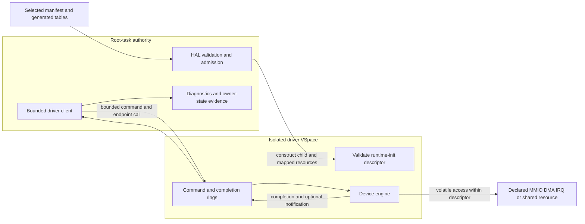

<!-- Copyright 2026 Lukas Bower -->
<!-- SPDX-License-Identifier: Apache-2.0 -->
<!-- Purpose: Define the as-built Cohesix HAL and isolated physical-driver architecture, methodology, status, and proof requirements. -->
<!-- Author: Lukas Bower -->

# HAL and Physical Drivers

This document owns the physical-device architecture: HAL admission, isolated
driver runtimes, the driver-task ABI, device-specific ownership, and the proof
required to claim target support. It does not define operator protocols,
namespace schemas, worker roles, or boot commands. Those belong in
[INTERFACES.md](INTERFACES.md),
[ROLES_AND_SCHEDULING.md](ROLES_AND_SCHEDULING.md),
[HARDWARE_BRINGUP.md](HARDWARE_BRINGUP.md), and
[BOOT_REFERENCE.md](BOOT_REFERENCE.md).

## Normative model

All physical-device authority passes through HAL. On Pi 4, steady-state
physical drivers run as manifest-declared isolated `pi4-driver-*` child images.
Root-task may discover and admit resources, construct seL4 objects, validate
descriptors, submit bounded service turns, collect diagnostics, and retain the
emergency serial escape hatch. It must not contain a parallel steady-state
physical driver.

QEMU compatibility is deliberately different: profile-gated virtual-device or
root-context test drivers may support QEMU and host tests. Their success is not
physical-hardware acceptance evidence.

The active milestone in [BUILD_PLAN.md](BUILD_PLAN.md) controls which driver
changes are legal. A device implementation, generated descriptor, staged image,
flash, boot, owner-state trace, functional transport, and benchmark are separate
evidence states.

## Sources of truth

Use these authorities in order appropriate to the claim:

1. `AGENTS.md` and [BUILD_PLAN.md](BUILD_PLAN.md) define scope, architecture,
   and acceptance requirements.
2. The selected seL4 build directory defines kernel headers, object layouts,
   timer exports, IRQ metadata, and platform truth for that build.
3. The selected `configs/root_task*.toml`, resolved manifest, and generated
   tables define admitted driver images, resources, IRQs, bus links, affinity,
   and profile gates.
4. [`pi4-driver-abi`](../crates/pi4-driver-abi) defines the pointer-free shared
   records accepted by root-task and driver runtimes.
5. Source and tests define implemented behavior.
6. Image readback and boot-paired target evidence prove what ran on hardware.

The generated default-profile summary is
[root_task_manifest.md](snippets/root_task_manifest.md). It is generated
evidence, not text to copy into this guide. Target evidence must identify the
target manifest and fingerprint used for that image.

## As-built architecture

The checked-in default and Pi 4 manifests declare seven isolated runtime
contracts: serial, USB/local-seat, HDMI text, GENET, CYW43, SDIO host, and PCIe
root. Each record names the artifact and entry point and bounds its code, stack,
IPC, ring, MMIO, DMA, shared-buffer, IRQ, and bus-link resources as applicable.



The runtime-init descriptor transports topology and resource metadata. It does
not, by itself, prove that the child owns the hardware or has completed useful
service.

## HAL contract

### Capability-trait map

Drivers depend on the narrowest HAL capability that admits their resource;
model names do not confer authority.

| Trait or boundary | As-built responsibility | Non-authority |
| --- | --- | --- |
| `DeviceHal` | Map a covered device page; allocate and guard DMA frames; report allocator/coverage state; bind and acknowledge HAL-owned IRQ notifications. | Does not grant namespace, parser, policy, or arbitrary physical-address authority. |
| `PciHal` | Discover a HAL-owned PCI topology, map an admitted BAR, and configure an admitted PCI function. | Does not make generic PCI discovery the Pi 4 VL805 authority; that platform path remains in `hal/pi4_pcie.rs`. |
| `Cyw43Hal` | Admit the selected firmware bundle used by the CYW43/SDIO runtime path. | Does not grant root-owned SDHCI, CMD52/CMD53, power/reset, or Wi-Fi transport service. |
| `Hardware` | Compatibility facade combining `PciHal` and `Cyw43Hal` for legacy call sites. | New code must not use it to bypass a narrower capability trait. |
| Driver-task ABI | Deliver sealed runtime-init resources and bounded role-specific commands after HAL admission. | A descriptor is not a new discovery or retyping API. |

The trait definitions are in
[`apps/root-task/src/hal/mod.rs`](../apps/root-task/src/hal/mod.rs). Pi 4
device-specific admission helpers remain HAL implementations, not additional
authority available to driver children.

### Admission

HAL is the only code allowed to:

- discover or accept a physical address;
- locate and retype device untypeds;
- map MMIO, DMA, shared, ring, or framebuffer pages;
- bind an IRQ handler or notification;
- perform platform firmware-service handoff;
- establish DMA bus-address policy; or
- publish an admitted resource to a driver child.

Admission validates the generated image identity, hot path, resource count,
page ranges, alignments, overlap, capability slots, and profile. Unknown,
undeclared, overlapping, or out-of-range resources fail closed.

The child receives only mapped pages and capabilities described by its sealed
runtime-init record. It must not scan physical address space, retype untypeds,
or infer authority from a device model name.

### MMIO

Runtime MMIO helpers must be volatile, range checked, and documented at the
call site. A driver may access only a descriptor range assigned to its role.
Posted-write drains and readbacks must use a safe register in the same admitted
block; an arbitrary readback is not a memory barrier and may have device side
effects.

Register width, ordering, reserved bits, and write-one-to-clear behavior are
part of the driver contract. Diagnostics may observe a register only when the
observation is safe and bounded.

seL4 device untypeds are allocation authorities with a forward-moving
watermark. Retyping or mapping a higher page can make an earlier page in the
same device-untyped region unavailable until the children are revoked. HAL
therefore must:

- confirm `device_coverage(paddr, PAGE_BITS)` before mapping each page;
- map every multi-page aperture in ascending physical-page order;
- verify `page_get_address`/`ARMPageGetAddress` equals the requested physical
  address before publishing the mapping;
- use the common device VM attributes rather than call-site-selected cache or
  access attributes; and
- expose registers through bounded `MappedRegion`, `MappedRegisterWindow`, or
  `MappedRegisterPages` accessors unless a narrower helper documents its safety
  invariant.

Coverage, successful retype, successful VSpace mapping, and exact physical
address are separate checks. None may be inferred from a device model or a
working mapping created by firmware, U-Boot, Linux, or a previous boot.

### DMA and cache maintenance

HAL owns DMA allocation and publication. A descriptor carries primitive page
or semantic range records; it never carries a trusted host pointer. The driver
converts only those records into local addresses and device-visible bus
addresses.

The Pi 4 profile currently selects `bounded-no-iommu`. This means allocation,
range, ownership, and cache behavior are bounded and auditable; it is not an
SMMU/IOMMU claim and does not confine a malicious DMA-capable device.

For non-coherent regions:

- clean CPU-produced buffers before device reads;
- invalidate device-produced buffers before CPU reads;
- use the selected seL4 cache operations and the required memory barriers;
- keep descriptor ownership transitions explicit; and
- never substitute `volatile` for cache maintenance.

Ring publication and device DMA ownership are separate. A clean command ring
does not prove that a device payload buffer was cleaned, and invalidating a
payload does not advance a completion index.

### IRQs and notifications

An IRQ path must be generated, admitted, and bound before it is enabled at the
device. The owning runtime captures and clears the device source, acknowledges
the seL4 IRQ according to the selected kernel contract, publishes bounded work,
and reschedules remaining work when its service budget is exhausted.

Root-task may route a generated notification or consume a completion; it must
not become a hidden polling owner for a driver that is required to own the IRQ.
If a boot reports a deferred notification bind, notification-backed acceptance
remains red even when a polled diagnostic makes progress.

The current CYW43/SDIO topology declares one SDIO IRQ owner and a reciprocal
CYW43/SDIO bus link with a fixed event ring. Exact IRQ numbers, badges, slots,
offsets, and depth are compiler-owned in the selected manifest.

### Time

Pi 4 elapsed-time logic uses the read-only virtual counter (`CNTVCT_EL0`) only
when the selected seL4 build exports it. Deadlines are scaled from generated
`TIMER_CLOCK_HZ`. Physical-counter reads, EL0 timer-control registers, dummy
timers, and raw CPU-speed spin loops are not valid hardware timeout sources.

Fixed attempt counts may bound a protocol retry, but any retry intended to
represent elapsed time must also have a virtual-counter deadline. A
counter-qualified trace is required for latency or service-time claims.

## Driver-task ABI

[`crates/pi4-driver-abi`](../crates/pi4-driver-abi/src/lib.rs) is the shared,
`no_std`, pointer-free contract between root-task and
[`apps/pi4-driver-runtime`](../apps/pi4-driver-runtime). The ABI provides:

- a versioned runtime-init record with sealed runtime identity;
- primitive MMIO, DMA, shared-memory, framebuffer, IRQ, and bus-link records;
- fixed command and completion records;
- bounded single-producer/single-consumer ring state;
- generated endpoint and notification slots; and
- role-specific operation and diagnostic codes.

ABI records contain integers, offsets, lengths, identities, and bounded arrays,
not process-local pointers. Both sides validate magic, version, role, identity,
resource counts, ranges, and sequence state before use.

### Scheduling contract

Every hardware service path presents a validated `DriverTaskContract` before
HAL admits a turn. The contract records:

- a stable name and hardware kind;
- service class (`RealtimeInput`, `ConsoleOutput`, `NetworkControl`,
  `NetworkData`, `DisplayRefresh`, or `Background`);
- authority class (`DeviceOnly`, `ConsoleTransport`,
  `NetworkFrameTransport`, or `DisplaySink`);
- isolation state (`DedicatedSeL4Task` or the explicitly reported,
  non-acceptance `RootTaskCompatibility` fallback);
- per-turn maxima for HAL operations, bytes, frames/reports/rows, and any
  explicitly admitted bounded bootstrap spins;
- whether waits are permitted and whether the turn is preemptible; and
- the maximum inbound IPC/event queue depth.

Zero or out-of-range budgets, unbounded waits, a non-preemptible contract,
authority/class mismatch, or an unsupported isolation state fail validation.
MCS scheduling-context fields are profile-qualified; on a non-MCS profile,
priority/domain policy plus the same bounded IPC and service-turn contract
provide the applicable scheduling controls. Neither contract declaration nor
generated affinity proves applied target scheduling without boot evidence.

### Service turn

1. Root's driver client reserves a free command slot.
2. It publishes a fully initialized command and advances the producer state
   with the required ordering.
3. It performs the bounded endpoint call or notification defined by the
   generated topology.
4. The driver validates the command and consumes only its declared resources.
5. The driver performs bounded work and publishes one completion, progress
   state, or explicit pending result.
6. It replies only when a real reply capability exists and signals only a
   declared notification.
7. Root consumes the completion and returns control to the event pump.

No service turn may contain an unbounded wait for hardware, firmware, network
traffic, or another driver. Pending work remains explicit and resumable.

## Device ownership and current status

This table separates implementation from hardware proof. “Implemented” means
the runtime and generated contract exist; it does not claim that the latest
image has passed the device's acceptance gate.

| Contract | As-built owner and boundary | Evidence status |
| --- | --- | --- |
| Serial | Isolated mini-UART runtime owns bounded steady RX/TX. Root retains an emergency serial path for fatal diagnostics and recovery. | Runtime and ABI implemented. Current-image prompt and owner-state evidence remain target-qualified. |
| USB/local-seat | Isolated xHCI runtime owns controller state, root- and hub-connected boot-keyboard discovery, HID polling, and report completion within admitted PCIe/MMIO/DMA resources. | Runtime implemented. Keyboard enumeration, first report, command-ready input, and no stalled service turn must be proved on the current image. |
| HDMI text | Isolated runtime renders bounded text into the HAL-admitted framebuffer; root submits text/service records. | Runtime implemented. Current-image framebuffer, visible output, and bounded refresh proof are separate from serial readiness. |
| GENET | Isolated runtime owns MAC/MDIO and bounded RX/TX descriptor rings. Root consumes a network-driver trait. | Accepted Milestone 26c wired evidence exists for its recorded image. Milestone 26d current-image and benchmark revalidation is a separate requirement. |
| PCIe root | Isolated runtime services declared PCIe MMIO operations; HAL owns platform admission and firmware/reset authority. | Runtime implemented. PCIe/VL805 identity, BAR/COMMAND, link, and downstream USB proof must be tied to the current boot. |
| SDIO host | Isolated runtime exclusively owns SDHCI MMIO, CMD52/CMD53, card interrupt handling, and bus-owner service. | Runtime, generated IRQ/DPC topology, Linux-aligned elapsed timing, deterministic controller model, whole-action restart cuts, modeled CARD_INT/notification substeps, and persistent outer-fence failures are implemented. Repeated physical functional proof remains an acceptance gate. |
| CYW43 Wi-Fi | Isolated runtime owns firmware upload, SDPCM/BDC control, EAPOL/data service, and bounded RX state through the generated CYW43-to-SDIO link. It receives no direct SDHCI MMIO authority. Root supervises transient bootstrap after publishing serial/local-seat and performs a full pair/context replay on retry. | Implementation remains active research/closure work. Production acceptance requires 10/10 cold plus 10/10 warm boots of one read-back image with association, DHCP, raw TCP/`cohsh`, ordered RX, and clean DPC counters; historical or offline success is not current closure. |

### QEMU network drivers

Virtio-net and RTL8139 remain profile-gated QEMU compatibility drivers. They
exercise network and console semantics without proving GENET, SDIO, CYW43,
PCIe, USB, DMA, IRQ, or Pi timer behavior.

## Stable device-specific invariants

### Serial

- Emergency serial must remain usable when an isolated runtime fails to start.
- Emergency ownership is diagnostic and must not be counted as migrated
  steady-state ownership.
- Input, output, and recovery loops remain bounded; a stalled device cannot
  monopolize the event pump.

### HDMI and local seat

- The framebuffer and keyboard resources are separately admitted and proved.
- HDMI feedback may degrade under load but must not block serial/local-seat
  input or fatal status.
- A USB byte, a HID endpoint, a keyboard-ready marker, and a usable command
  parser are separate gates.
- If a USB diagnostic service turn stops replying, preserve the boot evidence
  and stop submitting more commands until the bounded recovery path or a fresh
  boot.

### PCIe and USB

- Firmware reset and root-complex admission remain HAL-owned.
- Live PCIe identity, class, BAR, command, link, and DMA-window evidence must
  precede xHCI ownership credit.
- Linux or U-Boot captures may inform static layout; they do not grant runtime
  authority and are not accepted as live Cohesix state.
- USB interrupt delivery must not be claimed when the selected path is
  intentionally poll-driven.

### GENET

- Descriptor ownership and cache transitions are explicit for every RX/TX
  buffer.
- Link, DHCP, ARP, TCP, console, and performance evidence are separate.
- A real DHCP lease or TCP handshake is stronger datapath evidence than a stale
  readiness bookkeeping flag, but it does not waive other acceptance gates.

### SDIO and CYW43

- SDIO is the sole SDHCI owner; CYW43 submits bounded bus-link operations.
- Root-task must not wait synchronously for CMD52/CMD53 credit, firmware
  replies, or RX drain work.
- Function 1 enable uses the SDIO CIS timeout when that field is eventually
  carried by the ABI; the current fixed profile uses Linux's one-second
  fallback. ALP availability also uses a one-second elapsed deadline. After
  `FORCE_ALP`, the runtime preserves the 65 microsecond settle, writes
  `SBSDIO_FUNC1_SDIOPULLUP=0`, and validates `CHIPCLKCSR` while excluding only
  asynchronous availability bits from the immediate readback comparison.
- Function 2 enable is one `IOEx` write followed by elapsed `IORx` polling for
  up to three seconds. A transient miss does not clear/re-enable F2 or start a
  raw-spin retry. Post-release write readiness likewise does not re-prime F2
  within the same generation; an ambiguous issued transfer poisons that
  generation, and pair recovery owns the only retained replay.
- SDIO captures/clears the source and wakes CYW43; CYW43 drains bounded control,
  event, and data work and resignal/yields on budget exhaustion.
- Each retained foreground phase snapshots the committed DPC producer. Events
  through that watermark drain first; later level-triggered publications stay
  queued until after one foreground quantum. A new snapshot before the next
  phase preserves DPC service without allowing a continuously asserted
  `CARD_INT` source to starve control or bootstrap progress.
- Control replies, asynchronous events, EAPOL, and data frames may interleave;
  sequence and channel identity must be preserved.
- A fixed event ring must report overrun, drop, stale epoch, and malformed
  entries explicitly.
- Physical-Pi Wi-Fi bootstrap is supervised after the serial/local-seat prompt.
  Transient timing, transport, and linked-runtime progress faults retry forever
  at `1/2/4/8/16/30` seconds and then every 30 seconds. Once both restart
  contexts exist, every retry first suspends and fences the pair, restarts SDIO
  before CYW43, and replays retained firmware and control context. Immutable
  credential, firmware-bundle, and descriptor-bound failures are terminal and
  remain visible to the local operator.
- The same no-allocation bootstrap supervisor remains alive after the network
  stack is attached. It owns monotonic turn IDs, immutable
  descriptor/payload fingerprints, the current linked-pair generation,
  pending-action and recovery cursors, and generation poisoning. A sticky
  association, EAPOL, data, or pair-context fault fences ordinary NetStack
  work and re-enters that retained supervisor; a stale completion cannot
  mutate the replacement generation, and an issued-but-unknown action is
  poisoned rather than replayed.
- Steady association, EAPOL, maintenance, data, and pair-signal paths may only
  publish the first immutable deferred-recovery record for the current
  generation. That record separately binds the current recovery generation and
  the generation that owned the immutable action, plus the cause, descriptor,
  payload digest, ticket, completion detail and sequence, and outer turn ID.
  Publication performs only lock-free admission fencing; it cannot clear
  mutex-owned sessions or poison the generation. After the originating
  EventPump turn releases every service guard, the retained supervisor adopts
  any quiescent association/carrier epoch, consumes the current-generation
  record, rejects stale ownership, and is the sole recovery authority that
  poisons the generation exactly once before the ordered pair restart. The
  first current-generation record wins; a retained stale record cannot mask a
  later current fault. If association policy advances the logical epoch while
  an op11 join cursor is still unresolved, the recovery record uses the new
  epoch as its recovery generation while retaining the join cursor's original
  owner generation, descriptor, payload digest, and ticket. This separation
  prevents recovery from relocking a steady-path session, orphaning a
  possibly-issued join, or creating extra epoch transitions from duplicate
  faults.
- One central CYW43 operation permit is opened for each ordinary EventPump
  turn. At most one reciprocal CYW43/SDIO runtime or HAL operation may claim
  it. Descriptor replay, firmware/NVRAM streaming, core release, control and
  any-frame polling, the ordered 22-action pair restart, generation and
  association recovery, host-EAPOL maintenance, data TX, and ARP/GARP output
  retain their next action for a later turn. EventPump and NetStack do not
  manufacture private Wi-Fi poll, tail-ingest, TCP-flush, or EAPOL bursts. In
  particular, the post-up 256-frame drain requires 256 separately admitted
  outer turns.
- Between retained operations, live serial service is admitted only through
  the independent linked-runtime route. It never falls back to the current
  TCB or a path that reacquires the Wi-Fi HAL. Local-seat service consumes only
  already-buffered bytes while Wi-Fi recovery owns the HAL; USB polling, HDMI
  echo/redraw, and network service remain fenced. Reboot ACK dispatch wins
  before another bootstrap/recovery operation.
- Association alone is not acceptance. Require DHCP, raw TCP/`cohsh`, clean
  counters, and repeated current-image boots with paired network evidence.

Hardware-free validation executes the production reciprocal runtime-ring and
descriptor-to-SDHCI transfer path against a deterministic controller model,
injects failure at every production pair-restart action plus the modeled
CARD_INT/notification substeps and persistent outer fences, and exercises
adversarial DPC schedules. Tests assert the central permit never records more
than one child operation in an outer turn, that 256 retained polls consume 256
turns, that every failure cut resumes or fails deterministically, and that
reciprocal-ring association/EAPOL/maintenance faults return before supervisor
recovery. Duplicate or stale deferred records cannot replay work or advance a
replacement generation. Operator service runs only after the preceding scoped
HAL borrow and service guards are released. These tests prove control-flow,
ownership, timeout,
operator-liveness, and fail-closed invariants; they do not prove Pi electrical
timing, firmware behavior, RF association, DHCP, or repeatability. Those remain
target evidence.

## Evidence ladder

Use the following order for bring-up and review:

1. **Scope and profile:** cite the exact active task and selected manifest.
2. **Kernel truth:** record the seL4 build, generated headers, timer exports,
   and target configuration.
3. **Build and staging:** prove the runtime artifact and target image were
   rebuilt from the intended sources.
4. **Flash/readback:** when applicable, identify the exact medium and verify the
   written image. This is not boot proof.
5. **Current-image boot:** prove the new image by a fresh marker or changed
   frame shape and preserve the boot-paired serial/network evidence.
6. **HAL admission:** show declared ranges, mappings, DMA profile, IRQ/bus-link
   topology, and no undeclared authority.
7. **Runtime identity and owner state:** show the expected child identity,
   descriptor acceptance, useful service progress, and no root-owned
   steady-state fallback.
8. **Device function:** prove the device-specific outcome, such as keyboard
   input, visible HDMI, packets, or firmware/data flow.
9. **Operator path:** prove the required console or namespace behavior with its
   acknowledgements and bounded completion.
10. **Repeatability and performance:** repeat on the same image and use the
    documented harness, timer, transport, and error budget.

Do not promote a lower rung to a higher one. In particular, generated
eligibility is not owner state; owner state is not useful I/O; useful I/O is not
repeatability; and a historical boot is not current-image proof.

## Failure classification

Classify the strongest completed gate and the first failing gate. Useful classes
include:

- build or staging mismatch;
- flash/readback mismatch;
- stale or unidentified image;
- HAL admission or mapping failure;
- runtime identity/resource rejection;
- missing endpoint/reply capability;
- deferred or missing notification;
- MMIO/IRQ/DMA/cache/timer failure;
- protocol-state failure inside the driver;
- operator-projection failure after real device progress; and
- proof tooling or evidence-pairing failure.

Avoid widening a physical-driver patch when later evidence already proves the
datapath. Localize the remaining failure to bookkeeping, completion routing,
console projection, or the proof tool before changing device ownership.

## Change and test requirements

Every physical-driver change must:

- cite its exact milestone task;
- update manifest IR and generated artifacts when resources, topology, bounds,
  or profile behavior change;
- preserve HAL-only authority and the fixed ABI;
- add or update unit and boundary tests for every changed path;
- run the selected generated-artifact and target gates; and
- update canonical documentation when the public or acceptance contract moves.

Minimum focused checks depend on the touched surface. Common commands include:

```sh
cargo test -p pi4-driver-abi
cargo test -p pi4-driver-runtime
cargo test -p coh-rtc
scripts/check-generated.sh
scripts/ci/test_plan_run.sh --list
```

### Release and focused-test matrix

Use the release feature that matches the target and the focused driver-test
feature that matches the implementation under review:

| Lane | Contract and commands |
| --- | --- |
| QEMU release | `release-qemu` covers the canonical QEMU `aarch64/virt` GICv3 profile, including its virtual/network compatibility drivers. Build with `SEL4_BUILD_DIR="$PWD/out/sel4/profile-v2/qemu-smp-production" cargo check -p root-task --target aarch64-unknown-none --no-default-features --features release-qemu` after the profile validator passes. |
| Pi 4 release | `release-pi4` covers the Pi 4 serial, local-seat, GENET, CYW43/SDIO, PCIe/VL805, MMIO, and cache-maintained DMA closure. Build with `SEL4_BUILD_DIR="$PWD/seL4/build_UBOOT" cargo check -p root-task --target aarch64-unknown-none --no-default-features --features release-pi4`. |
| Shared isolated runtime | `cargo test -p pi4-driver-runtime --lib -- --test-threads=1` validates the pointer-free runtime implementation independently of physical acceptance. |
| QEMU focused tests | Use `--features driver-tests-qemu` with the staged filters `drivers::rtl8139`, `drivers::virtio`, `hal::pci`, `hal::virtio_mmio`, and `hal::uart`. |
| Pi 4 focused tests | Use `--features driver-tests-pi4` with the staged filters `hal::pi4_pcie`, `hal::pi4_wifi`, and `local_seat::`. |
| DMA/cache tests | `cargo test -p root-task --no-default-features --features cache-maintenance --test cache_maintenance`. |

The release names select compile-time closure; a successful build or focused
test does not establish current-image hardware acceptance.

Do not replace these feature bundles with an ad hoc combination. The exact
commands and required filters are staged in [TEST_PLAN.md](TEST_PLAN.md) and
`scripts/ci/test_plan_stage_02_host_fast.sh`. Run
`python3 scripts/ci/check_driver_test_coverage.py` to verify that the release
features, focused tests, source tokens, and this documentation remain aligned.

### Review checklist

- The exact [BUILD_PLAN.md](BUILD_PLAN.md) task authorizes the driver surface.
- HAL owns resource admission for MMIO, IRQ, DMA, PCI, SDIO, board-level
  power/reset, and firmware bundles; steady physical service uses the linked
  runtime descriptor and fixed ABI.
- A valid scheduling contract exists before polling, mapping, DMA, IRQ
  acknowledgement, or frame movement.
- The device source is cleared before the seL4 IRQHandler is acknowledged.
- DMA ownership and cache transitions are explicit and use HAL-admitted ranges.
- Hardware waits are counter-deadlined and bounded; blocker labels are exact.
- QEMU, generated metadata, staging, flash/readback, and current-image hardware
  evidence remain distinct.
- Tests cover touched logic paths; hardware-only behavior has deterministic
  capture commands and expected evidence records.

Pi 4 acceptance additionally uses the image builder, trace normalizer, proof
gate, current-image serial capture, and boot-paired network capture described in
[HARDWARE_BRINGUP.md](HARDWARE_BRINGUP.md) and
[TEST_PLAN.md](TEST_PLAN.md).

## Source map

- HAL: [`apps/root-task/src/hal`](../apps/root-task/src/hal)
- Root driver clients:
  [`apps/root-task/src/hal/driver_task.rs`](../apps/root-task/src/hal/driver_task.rs) and
  [`apps/root-task/src/drivers/driver_task_net.rs`](../apps/root-task/src/drivers/driver_task_net.rs)
- Driver runtimes: [`apps/pi4-driver-runtime`](../apps/pi4-driver-runtime)
- Shared ABI: [`crates/pi4-driver-abi`](../crates/pi4-driver-abi)
- Profile manifests: [`configs`](../configs)
- Manifest compiler: [`tools/coh-rtc`](../tools/coh-rtc)
- Pi proof scripts: [`scripts/pi4_gate_proof.sh`](../scripts/pi4_gate_proof.sh) and
  [`scripts/pi4_trace_normalize.py`](../scripts/pi4_trace_normalize.py)
