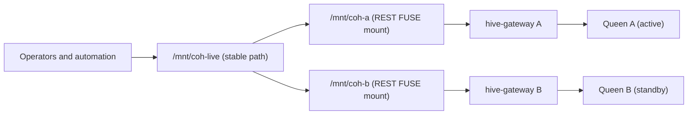

<!-- Copyright 2026 Lukas Bower -->
<!-- SPDX-License-Identifier: Apache-2.0 -->
<!-- Purpose: Define production failover and redundancy runbooks for Cohesix 0.9.0-beta using gateway and FUSE mounts. -->
<!-- Author: Lukas Bower -->
# Cohesix Failover and Redundancy (0.9.0-beta As-Built)
Author: Lukas Bower  
Revision: February 19, 2026

## 1) Scope and Verdict
This document defines the production failover model for Cohesix `0.9.0-beta` using existing as-built surfaces only.

**Verdict:** failover is supported in `0.9.0-beta` as **single-writer active/standby** with host-orchestrated cutover.  
**Not supported as-built:** active/active multi-queen writes to one logical hive.

The model in this document keeps Cohesix semantics unchanged:
- all control is file-shaped (`LS`, `CAT`, `ECHO`);
- all control writes remain append-only;
- no new in-VM protocols are introduced.

## 2) As-Built Constraints (Must Keep)
1. One TCP console client per Queen.  
`hive-gateway` must be the sole console client when multiplexing.
2. One REST FUSE mount per gateway URL (`coh mount --rest-url` lock).
3. Control files are append-only (`/queen/ctl`, `/queen/lifecycle/ctl`, `/queen/schedule/ctl`, `/queen/lease/ctl`, `/queen/export/ctl`, `/policy/ctl`, `/gpu/bridge/ctl`).
4. Audit and replay are file surfaces (`/audit/*`, `/replay/*`), not a replication subsystem.
5. Built-in cross-queen state replication is not present in `0.9.0-beta`.

## 3) Production Pattern
Use two independent hives:
- `queen-a` (active)
- `queen-b` (standby)

Each hive has its own:
- QEMU console port
- `hive-gateway` bind port
- REST request-auth token
- FUSE mountpoint

Expose one stable operator path (`/mnt/coh-live`) that points at the active mount.



## 4) Split-Brain Prevention
Use these controls together:
1. Single-writer policy: only `/mnt/coh-live` is writable in automation.
2. Fencing: the standby path (`/mnt/coh-b`) is read-only to automation except during failover.
3. Idempotency: include stable IDs/idempotency keys in queued control intents.
4. WAL on host: persist pending control intents before write, replay only unapplied entries after cutover.

## 5) Required Inputs
- Release bundle: `releases/Cohesix-0.9.0-beta-MacOS` and/or `releases/Cohesix-0.9.0-beta-linux`.
- Queen auth token (`COH_AUTH_TOKEN`).
- Gateway request-auth token (`HIVE_GATEWAY_REQUEST_AUTH_TOKEN`).
- FUSE runtime:
  - macOS: MacFUSE (`/dev/macfuse0`).
  - Linux: FUSE3.

## 6) Bring-Up (Active + Standby)
Example uses two local queens for validation; production hosts can be split across machines.

```bash
# Queen A
TCP_PORT=41337 UDP_PORT=41338 SMOKE_PORT=41339 ./releases/Cohesix-0.9.0-beta-MacOS/qemu/run.sh

# Queen B
TCP_PORT=42337 UDP_PORT=42338 SMOKE_PORT=42339 ./releases/Cohesix-0.9.0-beta-MacOS/qemu/run.sh
```

```bash
# Gateway A
COH_TCP_HOST=127.0.0.1 COH_TCP_PORT=41337 COH_AUTH_TOKEN="$COH_AUTH_TOKEN" COH_ROLE=queen \
  HIVE_GATEWAY_BIND=127.0.0.1:48080 HIVE_GATEWAY_REQUEST_AUTH_TOKEN="$HIVE_GATEWAY_REQUEST_AUTH_TOKEN" \
  ./releases/Cohesix-0.9.0-beta-MacOS/bin/hive-gateway

# Gateway B
COH_TCP_HOST=127.0.0.1 COH_TCP_PORT=42337 COH_AUTH_TOKEN="$COH_AUTH_TOKEN" COH_ROLE=queen \
  HIVE_GATEWAY_BIND=127.0.0.1:48081 HIVE_GATEWAY_REQUEST_AUTH_TOKEN="$HIVE_GATEWAY_REQUEST_AUTH_TOKEN" \
  ./releases/Cohesix-0.9.0-beta-MacOS/bin/hive-gateway
```

```bash
# Mount both gateways
./releases/Cohesix-0.9.0-beta-MacOS/bin/coh mount --rest-url http://127.0.0.1:48080 \
  --rest-auth-token "$HIVE_GATEWAY_REQUEST_AUTH_TOKEN" --at /mnt/coh-a
./releases/Cohesix-0.9.0-beta-MacOS/bin/coh mount --rest-url http://127.0.0.1:48081 \
  --rest-auth-token "$HIVE_GATEWAY_REQUEST_AUTH_TOKEN" --at /mnt/coh-b

# Publish stable active path
ln -sfn /mnt/coh-a /mnt/coh-live
```

## 7) Planned Failover Runbook
1. Health-check active hive.
```bash
curl -fsS http://127.0.0.1:48080/v1/meta/status | jq .
cat /mnt/coh-live/proc/lifecycle/state
```
2. Gate new work.
```bash
echo cordon >> /mnt/coh-live/queen/lifecycle/ctl
echo drain >> /mnt/coh-live/queen/lifecycle/ctl
```
3. Confirm drain/lease state.
```bash
cat /mnt/coh-live/proc/lifecycle/state
cat /mnt/coh-live/proc/lease/summary
```
4. Cut over active path.
```bash
ln -sfn /mnt/coh-b /mnt/coh-live
```
5. Resume on standby.
```bash
echo resume >> /mnt/coh-live/queen/lifecycle/ctl
cat /mnt/coh-live/proc/lifecycle/state
```
6. Replay unapplied WAL intents (idempotent IDs only).

## 8) Unplanned Failover Runbook
When active queen or gateway is unavailable:
1. Freeze writers for `N` seconds (short global write pause).
2. Switch active symlink immediately:
```bash
ln -sfn /mnt/coh-b /mnt/coh-live
```
3. Verify standby health:
```bash
cat /mnt/coh-live/proc/lifecycle/state
curl -fsS http://127.0.0.1:48081/v1/meta/status | jq .
```
4. Replay WAL with idempotency keys.
5. Resume write traffic.

## 9) Failback Runbook
1. Restore original active hive and verify health.
2. Put current active into maintenance (`cordon`, `drain`) if required.
3. Move `/mnt/coh-live` back.
4. Replay any pending WAL records.
5. Confirm lifecycle `ONLINE` and normal pressure counters.

## 10) Operational Validation Checks
Run after every cutover:
```bash
cat /mnt/coh-live/proc/lifecycle/state
cat /mnt/coh-live/proc/root/reachable
cat /mnt/coh-live/proc/root/cut_reason
cat /mnt/coh-live/proc/pressure/busy
cat /mnt/coh-live/proc/pressure/cut
```

Capture evidence:
```bash
./releases/Cohesix-0.9.0-beta-MacOS/bin/coh evidence pack --rest-url http://127.0.0.1:48081 \
  --rest-auth-token "$HIVE_GATEWAY_REQUEST_AUTH_TOKEN" --out ./out/evidence/failover --with-telemetry
./releases/Cohesix-0.9.0-beta-MacOS/bin/coh evidence timeline --in ./out/evidence/failover
```

## 11) Cross-Host Validation Matrix (Mac Queen A + Jetson Queen B, Latest)
Validation date: **February 19, 2026**

### Topology under test
- Queen A (Mac): TCP `64337`, gateway `127.0.0.1:64080`
- Queen B (Jetson): TCP `65337`, gateway `127.0.0.1:64081`
- Cross-host access used SSH forwarding (loopback-only gateways):
  - Mac local forward: `127.0.0.1:65081 -> Jetson 127.0.0.1:64081`
  - Mac reverse forward: `Jetson 127.0.0.1:65080 -> Mac 127.0.0.1:64080`
- FUSE mounts on both hosts:
  - Mac: `mnt-a -> 64080`, `mnt-b -> 65081`
  - Jetson: `mnt-a -> 65080`, `mnt-b -> 64081`
- Stable operator paths:
  - Mac: `live -> mnt-a|mnt-b`
  - Jetson: `live -> mnt-a|mnt-b`

### Baseline (before failure drills)
Observed:
1. Both hosts reached both queens through their local mount layout (`A` and `B` visible as `state=ONLINE`).
2. Authenticated control writes through REST to both endpoints succeeded:
   - Mac -> A and B: `MAC_BASE_A_RESP.status=OK`, `MAC_BASE_B_RESP.status=OK`
   - Jetson -> B and A: `JET_BASE_B_RESP.status=OK`, `JET_BASE_A_RESP.status=OK`

### Case 1: Mac failure, failover to Jetson B
Failure simulation:
1. Stopped Mac Queen A (`qemu`) and Mac gateway A.
2. Stopped the Mac reverse tunnel (`-R 65080`) so Jetson lost tunnel access to A.

Verification:
1. Reachability transitioned as expected:
   - Mac: `MAC_CASE1_A_DOWN=1`, `MAC_CASE1_B_UP=1`
   - Jetson: `JET_CASE1_A_DOWN=1`, `JET_CASE1_B_UP=1`
2. Switched both hosts to standby mount:
   - Mac `live -> mnt-b`, observed `MAC_CASE1_LIVE=state=ONLINE`
   - Jetson `live -> mnt-b`, observed `JET_CASE1_LIVE=state=ONLINE`
3. Post-cutover control writes to B succeeded from both hosts:
   - `CASE1_MAC_RESP.status=OK`
   - `CASE1_JET_RESP.status=OK`

### Case 2: Jetson failure, failover to Mac A
Failure simulation:
1. Restored Mac Queen A + gateway A first.
2. With both hosts on `live -> mnt-b`, stopped Jetson Queen B, gateway B, and Jetson mount processes.
3. Stopped Mac local tunnel to Jetson (`-L 65081`) and reverse tunnel (`-R 65080`) to emulate host-path loss.

Verification:
1. Mac observed standby path loss with active A healthy:
   - `MAC_CASE2_B_DOWN=1`
   - `MAC_CASE2_A_UP=1`
2. Switched Mac `live -> mnt-a`, observed `MAC_CASE2_LIVE_STATE=state=ONLINE`.
3. Post-cutover control write on Mac A succeeded:
   - `CASE2_MAC_RESP.status=OK`
4. Jetson side endpoints were unavailable after failure simulation:
   - `JET_CASE2_B_DOWN=1`
   - `JET_CASE2_A_TUNNEL_DOWN=1`

### Evidence directory from latest run
- `/tmp/coh_ha_cross_20260219T090809Z`
  - Mac evidence: `/tmp/coh_ha_cross_20260219T090809Z/mac/*`
  - Jetson evidence: `/tmp/coh_ha_cross_20260219T090809Z/jet/*`

Lab notes:
- This cross-host validation kept gateways loopback-bound and used SSH forwarding; `HIVE_GATEWAY_ALLOW_NON_LOOPBACK_BIND` was **not** required.
- Control-plane mutation checks in this run used REST `/v1/fs/echo` with request-auth.
- On macOS in this run, append writes to control files through REST-backed FUSE mounts returned `EINVAL` (`fuse-write-check.rc`); reads were stable. Treat REST `/v1/fs/echo` as the validated mutation path for this topology in `0.9.0-beta`.

## 12) Known Limits in 0.9.0-beta
1. No built-in cross-queen replication.
2. Failover correctness depends on external fencing + idempotent replay.
3. `coh mount --rest-url` enforces one mount per gateway URL on a host.
4. Gateway backpressure (`429`) remains the dominant high-load limiter under aggressive traffic.
5. In this cross-host lab on macOS, control-file appends through REST-backed FUSE mounts returned `EINVAL`; use REST `/v1/fs/echo` for control writes.

## 13) Production Recommendation
For production today:
1. Run bounded hives (single writer per hive).
2. Use active/standby queens per fault domain.
3. Put strict automation discipline around `/mnt/coh-live`.
4. Enforce idempotency + WAL replay in operator automation.
5. Collect evidence packs at each failover event for audit and postmortem.

## 14) Watchdog Ops Automation (Auto-Cutover)
`0.9.0-beta` supports host-side watchdog automation without changing VM semantics.

Script:
- `scripts/failover_watchdog.py`

Behavior:
1. Poll both REST gateways (`/v1/meta/status` and `/v1/fs/cat path=/proc/root/reachable`).
2. Track consecutive failure/success counters per side.
3. Declare active failed when `failure_threshold` is met.
4. Require standby healthy (`success_threshold`) before cutover.
5. Atomically flip live symlink (`/mnt/coh-live` or lab equivalent) to standby.
6. Enforce hold-down timer to avoid flapping.
7. Emit JSON events (`start`, `probe`, `cutover`, `cutover-error`, `stop`).

### Recommended Invocation
```bash
python3 scripts/failover_watchdog.py \
  --a-rest-url http://127.0.0.1:64080 \
  --b-rest-url http://127.0.0.1:65081 \
  --a-mount /mnt/coh-a \
  --b-mount /mnt/coh-b \
  --live-link /mnt/coh-live \
  --rest-auth-token "$HIVE_GATEWAY_REQUEST_AUTH_TOKEN" \
  --failure-threshold 3 \
  --success-threshold 1 \
  --hold-down-sec 15 \
  --interval-sec 1
```

Options for production controls:
- `--fence-cmd "<command with {src} and {dst}>"`
- `--post-cutover-cmd "<command with {src} and {dst}>"`
- `--lock-file /var/run/cohesix-failover-watchdog.lock`
- `--allow-failback` (disabled by default; keep manual failback unless strongly justified)

### Watchdog Validation (Latest)
Validation date: **February 19, 2026**

Scenario:
1. Mac watchdog configured with `live -> mnt-a`.
2. Queen A endpoint intentionally unavailable (`http://127.0.0.1:64080` down).
3. Queen B endpoint served from Jetson via SSH local forward (`http://127.0.0.1:65081`).
4. Watchdog run with `--once --failure-threshold 1 --success-threshold 1 --hold-down-sec 0`.

Observed:
- Pre-run live target: `.../mac/mnt-a`
- Post-run live target: `.../mac/mnt-b`
- Watchdog event: `"event":"cutover","reason":"active-failed","src_side":"a","dst_side":"b"`
- Standby lifecycle remained healthy: `state=ONLINE`

Evidence directory:
- `/tmp/coh_watchdog_20260219T095123Z`
