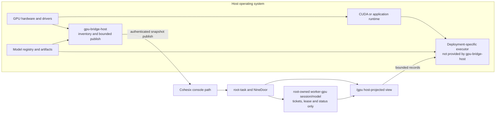

<!-- Copyright 2026 Lukas Bower -->
<!-- SPDX-License-Identifier: Apache-2.0 -->
<!-- Purpose: Define the as-built host GPU trust boundary, namespace projection, and model-data lifecycle. -->
<!-- Author: Lukas Bower -->
# GPU Nodes and Host Acceleration

Cohesix keeps GPU discovery, drivers, CUDA/NVML, model storage, and workload
execution outside the VM trusted computing base. The VM receives only bounded,
manifest-authorized control records and host-published descriptions.

This document distinguishes the live root-task surface from host simulation.
It does not describe a general GPU scheduler or an in-VM compute API.

## 1. Trust boundary



The boundary is strict:

- no GPU device nodes, GPU MMIO, CUDA, or NVML enter the VM;
- `gpu-bridge-host` discovers inventory and publishes a snapshot; it does not
  execute kernels, enforce lease TTLs, schedule jobs, or reload models;
- the root-owned `worker-gpu` session/model carries control-plane ticket,
  lease, status, and telemetry state; current profiles do not launch it as a
  target task;
- a deployment-specific host executor must perform any real GPU mutation and
  return bounded status or receipt records through an authorized host path.

## 2. As-built capability matrix

| Surface | As-built behavior | Important limit |
| --- | --- | --- |
| `gpu-bridge-host` | Discovers GPUs through compiled NVML or CUDA inventory backends, reads optional host model-registry descriptors, serializes a bounded snapshot, and publishes it over the authenticated console or REST projection. | Inventory and publication only; no hardware scheduling or execution. |
| Live root task | Installs `/gpu/<id>/info`, `ctl`, `lease`, and `status`, plus bridge status and optional model/telemetry descriptors. | The live root-task path does **not** expose `/gpu/<id>/job`. |
| Root-owned `worker-gpu` session/model | Represents a manifest-declared Worker role and carries ticket, lease, and telemetry state without direct hardware access. Current profiles do not launch a target Worker task. | It does not read `/gpu/models/active` automatically or propagate model changes to host inference. |
| Host NineDoor simulation | Can expose `/gpu/<id>/job` and synthesize `QUEUED`, `RUNNING`, and `OK` records for tests and demos. | Synthetic status is not live VM behavior or GPU execution proof. |
| Model lifecycle view | Publishes host-authored model manifests, an active-model pointer, and a telemetry schema descriptor when a snapshot includes them. | Artifacts remain on the host; activation and reload remain host responsibilities. |

The selected manifest and generated output remain authoritative. A path listed
here is absent when its feature is disabled or its host publish has not
completed.

## 3. Live namespace

| Path | Direction | Meaning |
| --- | --- | --- |
| `/gpu/bridge/ctl` | Host to VM, append | Single-writer snapshot channel using bounded `begin`, `b64:`, and `end` records. |
| `/gpu/bridge/status` | VM to host, read | Publish state such as `idle`, `receiving`, `ok`, or `err`. |
| `/gpu/<id>/info` | VM to client, read | Host-published GPU metadata. |
| `/gpu/<id>/ctl` | Authorized append | Text control record. Acceptance records intent; it is not proof that a host-side action occurred. |
| `/gpu/<id>/lease` | Authorized JSON append/read | `gpu-lease/v1` state records. |
| `/gpu/<id>/status` | Authorized JSON append/read | Bounded host or root-owned Worker-model status/breadcrumb records. |
| `/gpu/models/available/<model_id>/manifest.toml` | VM to client, read | Host-authored descriptor for an artifact that remains outside the VM. |
| `/gpu/models/active` | Authorized append/read | Model identifier pointer; changing it does not itself reload a runtime. |
| `/gpu/telemetry/schema.json` | VM to client, read | Host-published telemetry schema descriptor. Telemetry records are not written below `/gpu/telemetry`. |

`/gpu/models` and `/gpu/telemetry/schema.json` are absent until a successful
publish provides them. Concurrent publishers must be serialized because the
bridge control path is single-writer.

The canonical schema and generated limits are documented in
[INTERFACES.md](INTERFACES.md). When prose and generated output disagree, the
generated profile is authoritative and the documentation drift must be fixed.

## 4. Publishing a snapshot

Configure a real console secret outside source control, then publish. The
commands below use release-bundle binaries under `./bin`; source-tree users can
run the corresponding Cargo packages. The tools resolve `COH_AUTH_TOKEN` from
the environment, avoiding secret exposure in process arguments.

```bash
test -n "${COH_AUTH_TOKEN:?set COH_AUTH_TOKEN to the live console secret}"

./bin/gpu-bridge-host \
  --publish \
  --tcp-host 127.0.0.1 \
  --tcp-port 31337
```

Verify through the same authenticated control path:

```bash
./bin/cohsh \
  --transport tcp \
  --tcp-host 127.0.0.1 \
  --tcp-port 31337 \
  --role queen <<'COH'
ls /gpu
cat /gpu/bridge/status
COH
```

Do not place a token in documentation, command arguments, scripts, process
supervision files, or shell history. See [HOST_TOOLS.md](HOST_TOOLS.md) for
auth resolution and live gateway operation.

## 5. Simulation-only job descriptor

The host `nine-door` implementation includes `/gpu/<id>/job` only for tests,
macOS development, and policy/client demonstrations. The live root task does
not expose this node. Each non-empty append line is decoded as this host-only
JSON descriptor:

```json
{
  "job": "jid-42",
  "kernel": "vadd",
  "grid": [128, 1, 1],
  "block": [256, 1, 1],
  "bytes_hash": "sha256:e3b0c44298fc1c149afbf4c8996fb92427ae41e4649b934ca495991b7852b855",
  "inputs": [],
  "outputs": [],
  "timeout_ms": 5000,
  "payload_b64": ""
}
```

| Field | Contract in the simulation |
| --- | --- |
| `job` | Stable job identifier accepted by the `worker-gpu` host type. |
| `kernel` | Host enum value `vadd` or `matmul`. |
| `grid`, `block` | Three unsigned dimensions carried in the descriptor; no CUDA launch occurs. |
| `bytes_hash` | `sha256:` followed by 64 hexadecimal digits. |
| `inputs`, `outputs` | String lists retained as simulated artifact references; NineDoor does not dereference them. |
| `timeout_ms` | Unsigned simulated deadline field; it does not start a live cancellation timer. |
| `payload_b64` | Optional Base64 bytes. When present, decoding must succeed and SHA-256 must equal `bytes_hash`. |

After validation, host NineDoor appends the descriptor and synthesizes
`QUEUED`, `RUNNING`, and `OK` status records plus matching logical Worker
telemetry.
Those records prove parser, lease, ticket, policy, and client behavior only.
They do not prove CUDA launch, timeout/cancellation, GPU isolation, model
activation, or physical performance. The `JobDescriptor` source comment refers
to this contract as [GPU Nodes §5](#5-simulation-only-job-descriptor); keep
that section reference attached to this simulation schema rather than to the
live namespace.

A future live job or executor contract requires explicit
[BUILD_PLAN.md](BUILD_PLAN.md) scope, generated interface changes where
applicable, tests, and documentation in the same change.

## 6. Lease records

The host-side lease type contains the worker identity as part of the authority
record:

```rust
pub struct GpuLease {
    pub gpu_id: String,
    pub mem_mb: u32,
    pub streams: u8,
    pub ttl_s: u32,
    pub priority: u8,
    pub worker_id: String,
}
```

Serialized `gpu-lease/v1` lines include `schema`, `state`, `gpu_id`,
`worker_id`, `mem_mb`, `streams`, `ttl_s`, and `priority`. The current log shape
records lease intent and state. A real executor must independently enforce
memory, stream, lifetime, revocation, and device-isolation policy; the presence
of an `ACTIVE` line is not hardware enforcement proof.

## 7. Model and telemetry lifecycle

1. A host registry stores the model artifact and its manifest.
2. `gpu-bridge-host` reads descriptors and publishes a bounded namespace
   snapshot.
3. Cohesix exposes descriptors and the active identifier under `/gpu/models`.
4. An authorized operator or host tool may update the active identifier.
5. A deployment-specific host process validates the artifact, applies the
   change, and publishes a receipt or status record.

Cohesix does not upload model blobs into the VM, train a model, have the
root-owned `worker-gpu` model watch the active pointer, or hot-swap an inference
process. Host telemetry may
carry `model_id` and `lora_id`, but the host emitter owns validation, record
bounds, and delivery to an accepted telemetry path.

## 8. Security and acceptance

- Validate model identifiers, snapshot sizes, JSON envelopes, hashes, and all
  user-controlled strings before they reach an external executor.
- Keep artifacts and secrets on the host; publish only bounded descriptors and
  opaque identifiers.
- Treat control-file acceptance, host-executor receipt, and observed hardware
  state as three separate proofs.
- Preserve role and path checks. Host projections must not become a second
  authority channel.
- Run repository tests for `gpu-bridge-host`, `worker-gpu`, NineDoor, and the
  root-task surface touched by a change. Hardware claims require a separate
  executor-specific test and benchmark lane.

For worker scheduling see [ROLES_AND_SCHEDULING.md](ROLES_AND_SCHEDULING.md),
for file semantics see [SECURE9P.md](SECURE9P.md), and for deployment patterns
see [USE_CASES.md](USE_CASES.md).
