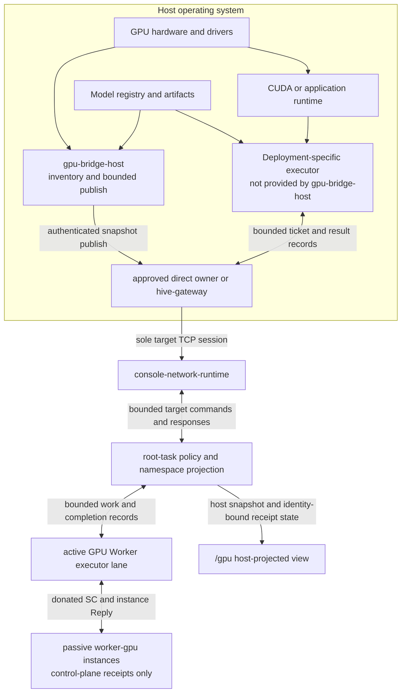

<!-- Copyright 2026 Lukas Bower -->
<!-- SPDX-License-Identifier: Apache-2.0 -->
<!-- Purpose: Define the as-built host GPU trust boundary, namespace projection, and model-data lifecycle. -->
<!-- Author: Lukas Bower -->
# GPU Nodes and Host Acceleration

Cohesix keeps GPU discovery, drivers, CUDA/NVML, model storage, and workload
execution outside the VM trusted computing base. The VM receives only bounded,
manifest-authorized control records and host-published descriptions.

See the [Glossary](GLOSSARY.md) for Cohesix-specific role and authority terms.

This document distinguishes the live root-task surface from host simulation.
It does not describe a general GPU scheduler or an in-VM compute API.

The compiler-owned
[`host-integration-dependency/v1`](../configs/generated/host_integration_dependency.json)
graph keeps the `gpu-receipt-path` target row separate from the
`gpu-host-provider` row. A QEMU or Pi WorkerGpu receipt therefore cannot promote
a fixture catalog, mock result, or unavailable NVML/CUDA provider to live GPU
execution; the reverse is also true. See the generated
[support table](snippets/host_integration_dependency.md).

## Native CUDA reference and publication

The physical CUDA reference lane is owned by `gpu-bridge-host`.
Build its child on the selected Linux AArch64 host with
`scripts/build-gpu-reference.sh /mnt/nvme/<fresh-build-directory>`. The build
checks the generated CUDA 13.2.2 profile and emits `build.json` with source,
executable and provider-graph hashes. Use the recorded executable digest with
`gpu-bridge-host --reference-inventory --reference-helper <executable>
--reference-helper-sha256 <digest> --reference-state <fresh-directory>`.

`--reference-request <file>` accepts only
`cohesix-cuda-reference-request/v1`: ticket correlation ID, `vadd|matmul`,
dimension, iterations, device ordinal/UUID, inventory timestamp, provider graph
hash, memory budget and deadline. Vector length is at most 65536, matrix side
at most 128, iterations at most 10000, allocation budget at most 64 MiB, and
child deadline at most 30 seconds. Inventory expires at five seconds. The
child rechecks UUID and preserves 2 GiB free shared-memory headroom before
allocation. It accepts no command, inline code, or output path. The bridge
pins helper bytes in a fresh private directory, checks every little-endian
float output against the reference algebra, and retains its SHA-256 and
native metadata. `--reference-cancel-after-ms` selects an explicit bounded
diagnostic cancellation. Parent death kills the CUDA child.

These reference outputs distinguish native discovery from native execution
and carry `authoritative=false` and `worker_proof=false`. They do not supply
root admission, a production lease, MIG isolation or a Worker receipt.
Admitted workload transport and receipt custody have separate contracts and
qualification; see [GPU workload authority](SECURITY.md#bounded-gpu-workload-host-transport).

Run the finite native reference checks on the selected host with
`scripts/ci/provider_conformance_run.sh --provider gpu.workload --live-reference
--gpu-bridge /absolute/path/to/gpu-bridge-host --cuda-build
/absolute/path/to/reference-build --state-dir /absolute/fresh/evidence-directory`.
The runner retains vector addition, matrix multiplication, wrong-device,
memory-budget, stale-inventory, deadline and cancellation outcomes. Its
`reference_result` describes only these native checks; exit 2 and `INCOMPLETE`
preserve the missing production admission and Worker evidence.

Add `--execution-lane systemd --execution-user USER --sidecar-bridge
/absolute/path/to/host-sidecar-bridge` for the authorized systemd launcher, or
`--execution-lane nvidia-container --execution-user USER --container-image
REPOSITORY@sha256:DIGEST` with Docker access. The launcher fixes the workload
command, enforces an unprivileged workload UID, a 1 GiB memory cap and finite
process/time bounds, and records the unit invocation/journal cursor or immutable
container identity/events. State and outputs remain under `--state-dir`.
These diagnostic lanes do not mint or admit Cohesix workload tickets.


Live GPU bridge publication rejects missing, malformed or placeholder
credentials before connecting. Console frames include their four-byte length
header and are bounded by generated `authority.gpu_frame_max_bytes` (default
8,192 bytes) before payload allocation. The shared REST client streams JSON
under a 10 MiB response-body cap, including error responses. REST publication
also requires the delegated ticket header; use the bridge's `--ticket` or
`COH_REST_TICKET` with request auth. [M27a authority](M27A_AUTHORITY.md)
describes secret resolution and rotation.


## 1. Trust boundary



The boundary is strict:

- no GPU device nodes, GPU MMIO, CUDA, or NVML enter the VM;
- `gpu-bridge-host` discovers inventory and publishes a versioned snapshot; it
  does not execute kernels, enforce workload lease TTLs, schedule jobs, or
  reload models. Root separately withdraws an expired snapshot generation;
- the isolated `worker-gpu` task carries control-plane ticket, lease, status,
  telemetry, and bounded receipt state; it has no GPU hardware authority;
- a deployment-specific host executor must perform any real GPU mutation and
  return bounded status or receipt records through an authorized host path.

## 2. As-built capability matrix

| Surface | As-built behavior | Important limit |
| --- | --- | --- |
| `gpu-bridge-host` | Discovers GPUs through compiled NVML or CUDA inventory backends, validates a real registry or reports it unavailable, serializes a bounded `gpu-bridge-snapshot/v2`, and publishes it over the authenticated console or REST projection. | Inventory and publication only; no hardware scheduling or execution. |
| Live root task | Installs `/gpu/<id>/info`, `ctl`, `lease`, and `status`, plus bridge status and optional model/telemetry descriptors. | The live root-task path does **not** expose `/gpu/<id>/job`. |
| Isolated `worker-gpu` task | Executes the generated Worker control/receipt contract without direct hardware access. | It does not read `/gpu/models/active` automatically or propagate model changes to host inference. |
| Host NineDoor simulation | Can expose `/gpu/<id>/job` and synthesize `QUEUED`, `RUNNING`, and `OK` records for tests and demos. | Synthetic status is not live VM behavior or GPU execution proof. |
| Model lifecycle view | Publishes host-authored model manifests, an active-model pointer, and a telemetry schema descriptor when a snapshot includes them. | Artifacts remain on the host; activation and reload remain host responsibilities. |

The selected manifest and generated output remain authoritative. A path listed
here is absent when its feature is disabled or its host publish has not
completed.

## 3. Live namespace

| Path | Direction | Meaning |
| --- | --- | --- |
| `/gpu/bridge/ctl` | Host to VM, append | Single-writer snapshot channel using bounded `begin`, `b64:`, and `end` records. |
| `/gpu/bridge/status` | VM to host, read | Publish state such as `unavailable`, `receiving`, `ok`, `err`, or expired, with accepted source/epoch/sequence identity. |
| `/gpu/<id>/info` | VM to client, read | Host-published GPU metadata. |
| `/gpu/<id>/ctl` | Authorized append | Text control record. Acceptance records intent; it is not proof that a host-side action occurred. |
| `/gpu/<id>/lease` | Authorized JSON append/read | `gpu-lease/v1` state records. |
| `/gpu/<id>/status` | Authorized JSON append/read | Bounded host or root-owned Worker-model status/breadcrumb records. |
| `/gpu/models/available/<model_id>/manifest.toml` | VM to client, read | Host-authored descriptor for an artifact that remains outside the VM. |
| `/gpu/models/active` | Read | Receipt-bound active model installed only by a validated snapshot. Direct writes are denied. |
| `/gpu/telemetry/schema.json` | VM to client, read | Host-published telemetry schema descriptor. Telemetry records are not written below `/gpu/telemetry`. |

`/gpu/models` and `/gpu/telemetry/schema.json` are absent until a successful
publish provides them. A snapshot carries source mode and identity, monotonic
epoch/sequence, observation time, bounded TTL, canonical catalog digest,
per-model manifest and CAS digests, optional base/adapter identity, and an
activation generation/receipt. Root rejects fixture mode, replayed or stale
generations, malformed compatibility chains, and digest/receipt mismatches.
After the accepted TTL, it atomically withdraws the provider generation and
returns to unavailable state. Concurrent publishers must be serialized because
the bridge control path is single-writer.

Within the same unexpired publisher epoch, refreshing an unchanged GPU id and
info descriptor preserves its `ctl`, `lease`, and `status` append logs. The
snapshot payloads seed those logs when the device generation is first installed;
subsequent control changes use their authorized append paths. An absent device,
changed descriptor, publisher source/mode/epoch change, or expired generation
starts fresh logs. Inventory refresh is not a control-record reset or a lease
renewal. The lease record still does not enforce hardware lifetime or revocation.

`coh peft activate` and `coh peft rollback` commit the local registry, then use
this snapshot channel to publish it. Their Rust library helpers, the ticket
agent, and Python's `peft_activate`/`peft_rollback` report the host pointer
commit separately as `projection=pending`. For those callers, the configured
bridge publisher must publish that registry before `/gpu/models/active`
changes. A successful ticket receipt proves its host action and Worker receipt;
it does not prove a published model or inference reload.

The canonical schema and generated limits are documented in
[INTERFACES.md](INTERFACES.md). When prose and generated output disagree, the
generated profile is authoritative and the documentation drift must be fixed.

## 4. Publishing a snapshot

For a non-empty live registry, each
`available/<model-id>/manifest.toml` contains a matching model id, a 64-digit
`cas_sha256`, a non-empty format, and optionally a base id plus
`adapter_sha256`. A base must exist in the same validated generation and an
adapter digest is illegal without a base. The optional `active` file must name
an available model; absence means no active model. There is no first-model
fallback. A missing registry publishes explicit empty/unavailable state.

The file-native `coh peft import` extension remains strict rather than becoming
an opaque metadata escape hatch. Its `[model]` table uses
`format = "safetensors+lora"`; both `cas_sha256` and `adapter_sha256` identify
the exact `adapter.safetensors` bytes. The required `[provenance]` and
`[hashes]` tables bind the source job, approval state, LoRA metadata, optional
metrics, policy, telemetry, hashes, and byte counts. The bridge rejects a
partial extension, unknown fields or artifact names, and any mismatch between
the model CAS/adapter identity and the adapter hash. The exact manifest digest
then binds the remaining PEFT fields into the published catalog identity.

Configure a real console secret outside source control, then publish. The
commands below use release-bundle binaries under `./bin`; source-tree users can
run the corresponding Cargo packages. The tools resolve `COH_AUTH_TOKEN` from
the environment, avoiding secret exposure in process arguments.

```bash
test -n "${COH_AUTH_TOKEN:?set COH_AUTH_TOKEN to the live console secret}"

./bin/gpu-bridge-host \
  --publish \
  --tcp-host 127.0.0.1 \
  --tcp-port 31337
```

Verify through the same authenticated control path:

```bash
./bin/cohsh \
  --transport tcp \
  --tcp-host 127.0.0.1 \
  --tcp-port 31337 \
  --role queen <<'COH'
ls /gpu
cat /gpu/bridge/status
COH
```

Do not place a token in documentation, command arguments, scripts, process
supervision files, or shell history. See [HOST_TOOLS.md](HOST_TOOLS.md) for
auth resolution and live gateway operation.

## 5. Simulation-only job descriptor

The host `nine-door` implementation includes `/gpu/<id>/job` only for tests,
macOS development, and policy/client demonstrations. The live root task does
not expose this node. Each non-empty append line is decoded as this host-only
JSON descriptor:

```json
{
  "job": "jid-42",
  "kernel": "vadd",
  "grid": [128, 1, 1],
  "block": [256, 1, 1],
  "bytes_hash": "sha256:e3b0c44298fc1c149afbf4c8996fb92427ae41e4649b934ca495991b7852b855",
  "inputs": [],
  "outputs": [],
  "timeout_ms": 5000,
  "payload_b64": ""
}
```

| Field | Contract in the simulation |
| --- | --- |
| `job` | Stable job identifier accepted by the `worker-gpu` host type. |
| `kernel` | Host enum value `vadd` or `matmul`. |
| `grid`, `block` | Three unsigned dimensions carried in the descriptor; no CUDA launch occurs. |
| `bytes_hash` | `sha256:` followed by 64 hexadecimal digits. |
| `inputs`, `outputs` | String lists retained as simulated artifact references; NineDoor does not dereference them. |
| `timeout_ms` | Unsigned simulated deadline field; it does not start a live cancellation timer. |
| `payload_b64` | Optional Base64 bytes. When present, decoding must succeed and SHA-256 must equal `bytes_hash`. |

After validation, host NineDoor appends the descriptor and synthesizes
`QUEUED`, `RUNNING`, and `OK` status records plus matching logical Worker
telemetry.
Those records prove parser, lease, ticket, policy, and client behavior only.
They do not prove CUDA launch, timeout/cancellation, GPU isolation, model
activation, or physical performance. The `JobDescriptor` source comment refers
to this contract as [GPU Nodes §5](#5-simulation-only-job-descriptor); keep
that section reference attached to this simulation schema rather than to the
live namespace.

A future live job or executor contract requires explicit
[BUILD_PLAN.md](BUILD_PLAN.md) scope, generated interface changes where
applicable, tests, and documentation in the same change.

## 6. Lease records

The host-side lease type contains the worker identity as part of the authority
record:

```rust
pub struct GpuLease {
    pub gpu_id: String,
    pub mem_mb: u32,
    pub streams: u8,
    pub ttl_s: u32,
    pub priority: u8,
    pub worker_id: String,
}
```

Serialized `gpu-lease/v1` lines include `schema`, `state`, `gpu_id`,
`worker_id`, `mem_mb`, `streams`, `ttl_s`, and `priority`. The current log shape
records lease intent and state. A real executor must independently enforce
memory, stream, lifetime, revocation, and device-isolation policy; the presence
of an `ACTIVE` line is not hardware enforcement proof.

## 7. Model and telemetry lifecycle

1. A host registry stores the model artifact and its manifest.
2. `gpu-bridge-host` reads descriptors and publishes a bounded namespace
   snapshot.
3. Cohesix verifies the snapshot/catalog/activation identities and exposes the
   accepted descriptors and active identifier under `/gpu/models` until TTL.
4. A deployment-specific host process validates the artifact, applies the
   change, and publishes a receipt or status record.

Cohesix does not upload model blobs into the VM, train a model, have the
root-owned `worker-gpu` model watch the active pointer, or hot-swap an inference
process. Host telemetry may
carry `model_id` and `lora_id`, but the host emitter owns validation, record
bounds, and delivery to an accepted telemetry path.

## Admitted GPU workload transport

The optional GPU executor uses the generated `providers.gpu_executor` contract:
a private Unix socket, HMAC-SHA256 authenticated request and response frames,
16 KiB frame bound, one active CUDA context, 64 retained jobs, and a 4 MiB WAL.
Its explicit `cohesix-gpu-executor-config/v1` deployment file binds the GPU ID,
physical CUDA UUID, exact helper SHA-256, provider graph, writer epoch, socket,
private state root, and secret reference. The reference profile is CUDA 13.2.2
on Orin Nano; MIG is unavailable on that profile. Native host administration
remains outside this authority boundary.

For the qualified deployment paths, set `execution_lane` to `systemd` or
`docker` in that file. Before dispatch and after completion the bridge reads its
native cgroup v2 identity, finite memory/CPU/task controls and `NoNewPrivs`.
The selected envelope permits at most 1 GiB process memory, two CPU cores and
64 tasks; the service renderer selects these limits and disables swap. Docker
uses the same limits, a read-only image pinned by digest, no network or added
capabilities, and `--cgroupns=host` so the native container cgroup is observable.
Correlate its 64-character container id with the version-negotiated Engine API;
correlate systemd's invocation id with the manager D-Bus observation. The bridge
includes these measured controls in its signed native result. Missing or changed
controls refuse qualification. Omitting this optional field preserves the local
lane and explicitly reports `cgroup_limits=not_selected`.

The requested CUDA allocation budget is checked against measured device free
capacity after reserving 2 GiB OS headroom. It is not a hard GPU partition.
One active context bounds concurrency; the owned child is killed and reaped at
its deadline or after loss of current authority. Process cgroups bound host
resources, while the pinned helper rechecks exact CUDA device identity. MIG,
DLA and PVA remain unsupported on this reference.

Run `gpu-bridge-host --workload-config /absolute/config.json` as the owner of
that private state. Select `host-ticket-agent --gpu-executor-socket PATH
--gpu-executor-credential-ref env:NAME --gpu-request-root PATH --execution-lanes 2` on the same
host. The secret value is never an argument or evidence field. The agent reads
only root-admitted v2 requests, checks the exact ready Worker and active root
lease, and renews a one-second bridge grant while both remain current. A changed
lease sequence, Worker generation, expired ticket, lost agent, or disconnected
control plane revokes execution. Cancellation completes only after the CUDA
child has been killed and reaped. Bridge restart records interruption and never
replays the operation. Retained successful output hashes are checked again
before returning a stored result; full retention produces backpressure.

`coh gpu [connection options] workload --action gpu.workload.submit --spec FILE`
(and the corresponding cancel/observe actions) writes only `/host/tickets/spec`.
Python `client.gpu_workload_ticket(spec)` follows the same path. A submission ACK
is not a provider or Worker terminal receipt. Input CAS JSON uses the canonical
Rust `workload::Input` serialization, is limited to 8192 bytes, and is stored as
`<sha256>.json`. The agent cannot select an executable path through a ticket.
The bridge independently rechecks device topology, free-memory headroom, every
output element, and the expected output digest before reporting success.

When the GPU executor is selected, lane zero is reserved for lease, cancel,
and observe operations. Submissions and other provider work use the remaining
lanes. This keeps cancellation serviceable during CUDA execution. The durable
lane topology includes this selection; changing it requires a fresh journal
root after existing operations are reconciled.

Native workload publication uses `gpu-bridge-host --publish
--native-inventory-config /absolute/executor.json`. This selects the same pinned
helper, CUDA UUID and provider graph as the local executor. The
`cohesix-gpu-device/v1` `execution_identity` in `/gpu/<id>/info` carries the
native topology digest and publisher epoch. `host-ticket-agent` checks it before
execution and throughout lease renewal. Snapshot expiry withdraws the device;
replacement or changed identity revokes an outstanding grant. Legacy inventory
without this identity remains useful for discovery but cannot admit workloads.
Model-catalog availability in `/gpu/bridge/status` is separate from physical
GPU inventory: an empty catalog does not supply model or inference evidence.

For one pending `gpu.workload.submit`, root can admit one matching
`gpu.workload.cancel`, `gpu.workload.observe`, `gpu.lease.renew`, or
`gpu.lease.release` at the same Worker identity. Workload controls name that
job; lease controls name that job's lease. A second pending control, unrelated
lease, or second workload is refused. Worker receipts still use one IPC call
at a time. The agent reserves its control execution lane and rechecks the
root-published memory/stream reservation along with the lease and device.

### Durable recipe composition

The external `coh` plan/apply/watch/explain/verify/recover commands accept
`cuda-reference --recipe --deployment FILE`. They compose the admitted workload
transport described above, preserving the original native job and ticket across
controller failure. The protected host journal never supplies admission or
execution proof. Signed native termination releases its reservation; verified
output bytes in CAS permit bounded dependency-aware reuse. Current authority is
required for every new submit/cancel action. See [Recoverable CUDA
recipes](HOST_TOOLS.md#recoverable-cuda-recipes) for deployment fields, recovery,
finite retention and the checked Python example. Device buffers are released by
native child termination; retained output artifacts are not native training
checkpoints. Queen reboot persistence and production Worker bundle binding keep
their separate evidence owners.

### Native MIG identity and execution selection

The `gpu-bridge-host --mig-inventory` diagnostic reads NVML directly through the
pinned CUDA helper. It returns parent and compute-instance UUIDs, GI/CI ids,
profile ids, memory, and native placements in `cohesix-nvml-mig-topology/v1`.
Discovery changes neither MIG mode nor instance configuration. It is bounded to
32 parent indices, 64 instances and ten seconds. Missing APIs, disabled MIG,
legacy UUID formats, partial discovery, or a pending mode change return typed
unavailable state without a healthy partial topology. Orin remains an
unsupported MIG reference; the physical CUDA lane does not depend on MIG.

```sh
gpu-bridge-host --mig-inventory --mig-parent-ordinal 0 \
  --reference-helper "$CUDA_HELPER" \
  --reference-helper-sha256 "$CUDA_HELPER_SHA256" \
  --reference-state "$FRESH_PRIVATE_STATE"
```

An explicitly selected `providers.gpu_executor.profile = "nvidia-mig-cuda13"`
compiler contract enables the MIG executor. Regenerate and rebuild the bridge
and helper together. This contract uses native Linux AArch64 or x86_64, CUDA
13.2.2, CUDA driver API 13020 or newer, and compute-80 PTX for supported
nonintegrated NVIDIA GPUs. Selecting it does not qualify a deployment. A
MIG-capable host must supply its own native workload and isolation evidence.

Private workload configuration includes a `mig` enrollment with `parent_ordinal`,
`parent_uuid`, the exact observed `instance` object, and `topology_sha256`.
The digest is SHA-256 of the complete topology with instances sorted by UUID,
object keys sorted, and compact JSON serialization. Enrollment is an operator
configuration step; discovery does not automatically enroll a changed instance.
`--reference-mig-selection` accepts the same enrollment for explicit diagnostic
inventory and workload invocations. The workload still requires its admitted
lease, writer/TTL fence, immutable request and executable hashes, and the full
published device topology digest. Snapshot refresh cannot renew changed topology.

The executor rechecks the complete MIG generation before dispatch and restricts
its isolated child to one canonical `MIG-` UUID via `CUDA_VISIBLE_DEVICES`.
The child accepts only ordinal zero and verifies the native compute-instance
UUID using `cuDeviceGetUuid_v2`. Reused GI/CI numbers, changed profiles or
placements, and unrelated instance changes invalidate enrollment. NVML recheck
and CUDA execution share the request deadline and cancellation signal. Native
output is independently verified and records the exact selection and topology
digest. Memory accounting remains bounded by the same 64 MiB allocation ceiling,
2 GiB headroom and single-stream contract. A compute instance shares its GPU
instance's memory resources with sibling compute instances; it does not claim
independent CI memory isolation. External administrators retain control over MIG
configuration, and changes during execution can cause native CUDA failures.

The native identity interpretation follows NVIDIA's
[MIG device names](https://docs.nvidia.com/datacenter/tesla/mig-user-guide/mig-device-names.html),
[NVML MIG API](https://docs.nvidia.com/deploy/nvml-api/api/group__nvmlMultiInstanceGPU.html),
and [CUDA device API](https://docs.nvidia.com/cuda/cuda-driver-api/group__CUDA__DEVICE.html).

## 8. Security and acceptance

- Validate model identifiers, snapshot sizes, JSON envelopes, hashes, and all
  user-controlled strings before they reach an external executor.
- Keep artifacts and secrets on the host; publish only bounded descriptors and
  opaque identifiers.
- Treat control-file acceptance, host-executor receipt, and observed hardware
  state as three separate proofs.
- Preserve role and path checks. Host projections must not become a second
  authority channel.
- Run repository tests for `gpu-bridge-host`, `worker-gpu`, NineDoor, and the
  root-task surface touched by a change. Hardware claims require a separate
  executor-specific test and benchmark lane.

For worker scheduling see [ROLES_AND_SCHEDULING.md](ROLES_AND_SCHEDULING.md),
for file semantics see [SECURE9P.md](SECURE9P.md), and for deployment patterns
see [USE_CASES.md](USE_CASES.md).
