<!-- Copyright 2026 Lukas Bower -->
<!-- SPDX-License-Identifier: Apache-2.0 -->
<!-- Purpose: Provide the QEMU and Raspberry Pi 4 build, flash, boot, capture, and proof runbook. -->
<!-- Author: Lukas Bower -->
# Hardware Bring-up

This runbook covers the supported development path on QEMU `aarch64/virt` and
the Raspberry Pi 4 U-Boot path. It keeps image construction, media state, boot
identity, device readiness, remote control, and performance as independent
proof layers.

Implementation details belong in [DRIVERS.md](DRIVERS.md), boot-marker semantics
in [BOOT_REFERENCE.md](BOOT_REFERENCE.md), acceptance predicates in
[TEST_PLAN.md](TEST_PLAN.md), and performance methodology in
[BENCHMARKS.md](BENCHMARKS.md).

## Current Evidence Boundary

| Lane | Current status | What it does not prove |
| --- | --- | --- |
| QEMU current source | Target-qualified Stages 01-05 pass under `out/test-plan/m26d-repository-gates-qemu`. | Pi firmware, MMIO, DMA, IRQ, local-seat, GENET, or CYW43 behavior. |
| Pi 4 historical wired GENET | Milestone 26c retained one coherent Stage 01-05, runtime/DMA, DHCP, raw TCP, and authenticated `cohsh` proof chain. See [M26C_AS_BUILT_BLOCKERS.md](audit/M26C_AS_BUILT_BLOCKERS.md). | The current source tree or a newly flashed image. |
| Pi 4 current source, offline | Pi-qualified Stages 01-02 pass under `out/test-plan/m26d-repository-gates-pi4`. | A board boot, current-image device readiness, TCP, or benchmark result. |
| Pi 4 current image, live | Revalidation pending after full build, verified flash/readback, and fresh boot. | Wi-Fi, GENET, USB/local-seat, raw TCP, `cohsh`, repeatability, and performance remain unclaimed until captured. |

Maintainers may keep a workstation-local boot ledger while an investigation is
active. It may be newer than checked-in records, but only the repository's
linked audit and target-qualified Test Plan evidence is canonical for shared
claims.

## Proof Layers

Never collapse these layers into a single “works” claim:

1. **Build:** source compiled and artifacts were staged.
2. **Flash:** the intended removable disk was erased and written.
3. **Readback:** the media contents and exact image marker match staged
   artifacts.
4. **Boot:** that read-back marker appears in a fresh serial boot.
5. **Saved policy:** `cohesix.env` was preserved or intentionally replaced,
   without disclosing secrets.
6. **Device/network:** current serial and boot-paired packet evidence prove the
   selected USB, HDMI, GENET, or Wi-Fi lane.
7. **Console:** raw TCP and authenticated `cohsh` succeed on the same boot.
8. **Test Plan:** target-qualified stage markers are complete and no
   `*.incomplete` state remains.
9. **Benchmark:** a workload-specific report has full provenance and passes its
   error and latency contract.

```mermaid
flowchart LR
  Source["source and selected manifests"] --> Build["build and stage"]
  Build --> Flash["verify target and flash"]
  Flash --> Readback["read back media\nand match image marker"]
  Readback --> Boot["fresh serial boot\nwith that image marker"]
  Boot --> Policy["saved policy\npreserved or intentionally replaced"]
  Policy --> Device["device and network proof\nserial plus paired packet capture"]
  Device --> Console["raw TCP and authenticated cohsh"]
  Console --> TestPlan["target-qualified Test Plan"]
  TestPlan --> Benchmark["qualified benchmark"]
```



## Profiles and Toolchain

| Target | Manifest | seL4 build truth |
| --- | --- | --- |
| QEMU `aarch64/virt` | `configs/root_task.toml` | Selected QEMU `SEL4_BUILD_DIR`, normally `seL4/SMP_build` for the current SMP regression lane. |
| Raspberry Pi 4 | `configs/root_task_pi4_uboot_aarch64.toml` | `seL4/build_UBOOT` plus the accepted external seL4 15 source and Pi overlay provenance. |

The Pi 4 baseline is `Pi firmware -> U-Boot -> seL4 binary image -> root-task`.
`configs/root_task_uefi_aarch64.toml` is a separate profile and is not Pi 4
acceptance evidence.

Use the macOS ARM64 environment in
[TOOLCHAIN_MAC_ARM64.md](TOOLCHAIN_MAC_ARM64.md). The selected generated seL4
headers, cache, timer frequency, capability layout, and resolved manifest are
authoritative for each build.

## QEMU Runbook

### Build and Boot

```bash
SEL4_BUILD_DIR="$PWD/seL4/SMP_build" \
  ./scripts/cohesix-build-run.sh \
  --sel4-build "$PWD/seL4/SMP_build" \
  --out-dir out/cohesix \
  --profile release \
  --root-task-features cohesix-dev \
  --cargo-target aarch64-unknown-none \
  --transport tcp
```

In another terminal, set the live secret outside source control and attach with
the built `cohsh` binary as described in [QUICKSTART.md](QUICKSTART.md). Do not
use a placeholder token in a live path.

### Run the Target-Qualified Plan

```bash
./scripts/ci/test_plan_run.sh \
  --target qemu \
  --state-dir out/test-plan/qemu-$(date -u +%Y%m%dT%H%M%SZ)
```

A QEMU pass requires generic and `.qemu.done` markers for Stages 01-05 and no
incomplete marker. Stage 03 exercises TCP regression, Stage 04 the REST
projection, and Stage 05 due diligence.

## Raspberry Pi 4 Runbook

### 1. Build and Stage

For an acceptance candidate, perform a full build. Do not use `--skip-build`:

```bash
./scripts/pi4-image-build.sh \
  --clean \
  --manifest configs/root_task_pi4_uboot_aarch64.toml \
  --sel4-build-dir seL4/build_UBOOT
```

The default stage directory is `out/pi4-sd`. The script validates the Pi U-Boot
shape, the selected seL4 configuration, the virtual-counter contract, generated
artifacts, runtime payloads, and rootfs bounds before staging. A successful
stage is build proof only.

Record hashes for the image, U-Boot, DTB, boot script, and driver-runtime
archive that will be flashed. Record the build marker embedded in the staged
image so the later serial boot can be associated with the same bytes.

### 2. Verify the Flash Target

Flashing is destructive. Identify the whole removable disk twice:

```bash
diskutil list external physical
diskutil info /dev/diskN
```

Confirm the device node, external/removable status, size, and expected media.
Do not infer the target from a stale `/Volumes/COHESIX` mount or a partition
node such as `/dev/diskNs1`.

### 3. Flash and Read Back

Only after verification, pass the explicit whole-disk node:

```bash
./scripts/pi4-image-build.sh \
  --manifest configs/root_task_pi4_uboot_aarch64.toml \
  --sel4-build-dir seL4/build_UBOOT \
  --flash-disk /dev/diskN
```

The flash path erases the target, preserves a non-empty `cohesix.env` found on
the expected existing volume, restores it with restricted permissions, checks
the staged root and fallback image hashes, and unmounts the disk. Do not print
the policy file: it may contain Wi-Fi credentials.

For acceptance, remount the media and independently compare every staged
artifact and the embedded build marker. The script's image checks do not replace
the full readback ledger.

### 4. Capture a Fresh Boot

Use one serial owner. Start serial capture and the relevant packet capture
before powering the Pi so the files share a boot-time boundary. Pair captures
by filename timestamp or packet time, not by a later filesystem modification
time.

On each requested boot, send commands conservatively and wait for the prompt
after every command:

```text
netstats
nettest
wifi diag
wifi probe-ht
usb diag
usb probe-kbd
smp activity
```

If `usb diag` echoes but does not return, stop sending input and preserve the
sample. A merged or overlapped serial transcript is not acceptance evidence.

The serial log must contain the exact read-back build marker before any current-
image claim is made. Preserve the U-Boot policy selection, root prompt, first
causal blocker, and all driver owner-state/counter evidence from the same boot.

### 5. Normalize Without Overclaiming

Inspect the latest boot slice:

```bash
python3 scripts/pi4_trace_normalize.py \
  --gate-summary \
  "$SERIAL_LOG"

python3 scripts/pi4_trace_normalize.py \
  --boot-summary \
  "$SERIAL_LOG"
```

For a wired acceptance candidate:

```bash
./scripts/pi4_gate_proof.sh \
  --normalize-only \
  --log "$SERIAL_LOG" \
  --runtime-dma-proof-out "$PROOF_ENV" \
  --require-wired-ready \
  --require-driver-task-proof \
  --require-input-responsive \
  --expect DRIVER_TASK_ACTIVE_NET=genet \
  --expect NET_ACTIVE=wired \
  --expect NET_DHCP=bound
```

For Wi-Fi, use `--require-wifi-ready` instead of the wired gate and retain the
boot-paired Wi-Fi packet capture. The normalizer must prove association, host
EAPOL completion, DHCP, ARP/data progress, healthy DPC state, `nettest`, and
authenticated TCP bytes; an association or DHCP line alone is insufficient.

### 6. Prove Raw TCP Before REST

On the same boot, verify the listener and complete authenticated `cohsh`
`AUTH`, `ATTACH`, `PING`, and `NETSTATS`. Do not infer remote-shell readiness
from `tcp_ready`, DHCP, ARP, or a port probe alone.

Only after raw TCP succeeds should a gateway, REST, UI, or benchmark lane be
interpreted. A gateway cannot repair a target transport failure.

### 7. Complete the Pi Test Plan

Offline validation uses only the first two stages:

```bash
STATE_DIR=out/test-plan/pi4-$(date -u +%Y%m%dT%H%M%SZ)

./scripts/ci/test_plan_run.sh --target pi4 --state-dir "$STATE_DIR" --stage 1
./scripts/ci/test_plan_run.sh --target pi4 --state-dir "$STATE_DIR" --stage 2
```

Stages 03-05 require the same accepted live target:

- Stage 03 requires `COHSH_TCP_HOST` or `COHSH_HOST` for the Pi TCP console.
- Stage 04 requires an existing gateway URL backed by that Pi; the runner must
  not start local QEMU for a Pi lane.
- Stage 05 checks repository and target proof artifacts.

A full Pi pass requires Stage 01-05 generic and `.pi4.done` markers with no
incomplete state. Current-tree offline Stage 01-02 evidence must not be reported
as a full Pi pass.

## Network and Local-Seat Claims

### Wired GENET

Historical accepted M26c GENET evidence remains a control sample. A current
GENET claim needs a new read-back image marker, wired DHCP or accepted static
configuration, bidirectional packet evidence, driver-task proof, raw TCP, and
authenticated `cohsh` from the same boot.

### CYW43 Wi-Fi

Wi-Fi is the current research and evidence-closure lane. Source tests and a
stage-only build do not establish live association or data-path readiness. The
current image must be reflashed and revalidated with fresh serial and packet
evidence. Repeatability closure requires repeated current-image boots of the
same read-back-proven image with paired network evidence and repeatable raw TCP
and authenticated `cohsh` proof, with no unresolved transport, DPC, generation,
or recovery ambiguity. The evidence record must state the sample count actually
run; the active plan does not define a numeric cold/warm threshold.

### USB Keyboard and HDMI

Serial remains the recovery authority. HDMI is an independent display sink;
USB keyboard readiness requires isolated-runtime command and first-report
proof. A prompt displayed on HDMI does not prove keyboard input, and a USB
descriptor does not prove command readiness. Under load, preserve serial and
local-seat command liveness before nonessential mirroring or redraws.

## Failure Routing

Route the first failed proof layer rather than patching a later symptom:

| First failed layer | Next source of truth |
| --- | --- |
| Build or generated drift | Build log, selected manifest, seL4 generated artifacts, `scripts/check-generated.sh`. |
| Flash or readback | Verified whole-disk identity, staged hashes, mounted media hashes, embedded marker. |
| Loader or root entry | [BOOT_REFERENCE.md](BOOT_REFERENCE.md), serial from power-on, selected U-Boot/seL4 artifacts. |
| Driver admission or owner state | [DRIVERS.md](DRIVERS.md), normalized driver counters, first timeout/fault, HAL resource proof. |
| Network attach | Current serial plus boot-paired pcap; distinguish policy, association, EAPOL, DHCP, ARP, and TCP. |
| `cohsh` | Raw TCP transcript and console grammar before REST or UI investigation. |
| Benchmark | [BENCHMARKS.md](BENCHMARKS.md); verify provenance and classify the moved layer. |

Keep failed evidence. A named, current-image blocker is more useful than a
later successful boot with no causal record.
