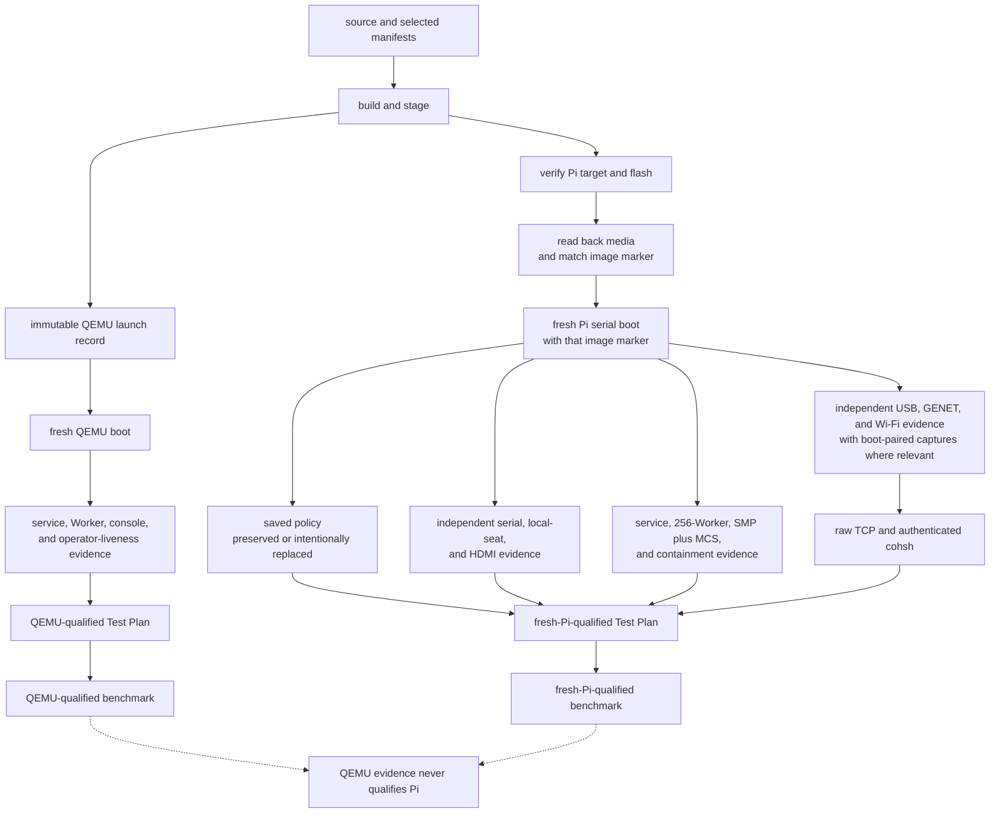

<!-- Copyright 2026 Lukas Bower -->
<!-- SPDX-License-Identifier: Apache-2.0 -->
<!-- Purpose: Provide the QEMU and Raspberry Pi 4 build, flash, boot, capture, and proof runbook. -->
<!-- Author: Lukas Bower -->
# Hardware Bring-up

This runbook covers the supported development path on QEMU `aarch64/virt` and
the Raspberry Pi 4 U-Boot path. It keeps image construction, media state, boot
identity, device readiness, remote control, and performance as independent
proof layers.

Implementation details belong in [DRIVERS.md](DRIVERS.md), boot-marker semantics
in [BOOT_REFERENCE.md](BOOT_REFERENCE.md), acceptance predicates in
[TEST_PLAN.md](TEST_PLAN.md), and performance methodology in
[BENCHMARKS.md](BENCHMARKS.md).

See the [Glossary](GLOSSARY.md) for Cohesix-specific boot, role, and evidence
terms.

## Current evidence boundary

This runbook defines how to produce evidence; it does not maintain a history of
individual images or failed boots. See [Current Status](STATUS.md) for the
public capability snapshot, the [Build Plan](BUILD_PLAN.md) for planned and
implemented scope, and the tracked audit/evidence records for exact qualified
artifacts.

A previously accepted image proves only its recorded source, media, target,
boot, and proof lane. Any changed source tree, seL4 build, manifest, runtime
archive, boot file, policy, or image requires a new evidence chain.

## Proof Layers

Never collapse these layers into a single “works” claim:

1. **Build:** source compiled and artifacts were staged.
2. **Flash:** the intended removable disk was erased and written.
3. **Readback:** the media contents and exact image marker match staged
   artifacts.
4. **Boot:** that read-back marker appears in a fresh serial boot.
5. **Saved policy:** `cohesix.env` was preserved or intentionally replaced,
   without disclosing secrets.
6. **Device/network:** current serial and boot-paired packet evidence prove the
   selected USB, HDMI, GENET, or Wi-Fi lane.
7. **Console:** raw TCP and authenticated `cohsh` succeed on the same boot.
8. **Test Plan:** target-qualified stage markers are complete and no
   `*.incomplete` state remains.
9. **Benchmark:** a workload-specific report has full provenance and passes its
   error and latency contract.



## Profiles and Toolchain

The Cargo `release` profile keeps its existing artifact paths, fat LTO,
single codegen unit and maximum-size `z` optimization for Pi and QEMU. The
selected manifest's ELF/page admission, stack and rootfs size bounds remain
mandatory. A compiler-profile experiment must qualify exact target stack use
as well as artifact size; compilation alone does not qualify boot or performance.
The root image reserves a 1-MiB initial stack, separate from its unchanged
2-MiB bootstrap heap. Exact size-optimized Pi code exceeds 512 KiB along the
retained bootstrap/GENET call chain before deeper calls. The previous 256-KiB
stack allowed downward writes into the adjacent heap. The mapped gap above
the stack separates IPC storage and is not a downward overflow guard. Child
stack/page declarations and rootfs archive limits remain independently enforced.

| Target | Manifest | seL4 build truth |
| --- | --- | --- |
| QEMU `aarch64/virt` | `configs/root_task.toml` | Canonical validated `SEL4_BUILD_DIR` at `out/sel4/profile-v2/qemu-smp-production`; explicit alternatives are diagnostic unless a named profile contract passes. |
| Raspberry Pi 4 | `configs/root_task_pi4_uboot_aarch64.toml` | A freshly validated MCS Pi profile build matching the selected manifest. Repository-managed or cached seL4 output is admissible only when its profile stamp, generated headers, object sizes, timer truth, and required artifacts validate for the intended runtime. |

The Pi 4 baseline is `Pi firmware -> U-Boot -> seL4 binary image -> root-task`.
`configs/root_task_uefi_aarch64.toml` is a separate profile and is not Pi 4
acceptance evidence.

Use the macOS ARM64 environment in
[TOOLCHAIN_MAC_ARM64.md](TOOLCHAIN_MAC_ARM64.md). The selected generated seL4
headers, cache, timer frequency, capability layout, and resolved manifest are
authoritative for each build.

## QEMU Runbook

### Build and Boot

The selected QEMU composition requires the separately reviewed classic
linked-driver archive as comparison evidence. The canonical
`configs/driver_runtime_classic_comparator.toml` record binds that comparator's
source and component identities to one deterministic newc digest. A build may point
`COHESIX_DRIVER_CLASSIC_COMPARATOR_RECORD` at a copied record for an isolated
workspace, but malformed or identity-incomplete records fail before root is
compiled.

```bash
SEL4_BUILD_DIR="$PWD/out/sel4/profile-v2/qemu-smp-production" \
./scripts/cohesix-build-run.sh \
  --sel4-build "$PWD/out/sel4/profile-v2/qemu-smp-production" \
  --out-dir out/cohesix \
  --profile release \
  --root-task-features release-qemu,bootstrap-trace \
  --cargo-target aarch64-unknown-none \
  --transport tcp
```

The build creates deterministic, distinct
`driver-runtimes/cohesix-driver-runtimes.cpio` and
`worker-images/cohesix-worker-images.cpio` artifacts. The driver manifest binds
all seven component hashes, runtime-init ABI 9, the MCS active-SC scheduler
class, the new archive hash, and the supplied classic comparator. The driver
archive is embedded into the root image and also recorded separately in the
system payload manifest. The rootfs does not duplicate that multi-megabyte
archive; its manifest names the exact build-output path and states that the
bytes are embedded in the rootserver. The seven images are not copied as loose
system CPIO binaries, preserving the mandatory rootfs size bound.

The launcher resolves paths from the repository root, requires the Cargo target
directory to be the literal in-repository `target/`, and accepts build output
only beneath `out/`; symlinked or external output roots fail before cleanup.
Its `--clean` option clears only the selected build-output child (normally
`out/cohesix`). A full evidence rebuild must separately preserve the immutable
seL4 source and pinned toolchain inputs, clear the literal repository `target/`
and disposable `out/` contents, restore those inputs at their exact paths, and
then rebuild the selected seL4 profile before invoking this launcher.

The first build writes `out/cohesix/cohesix-qemu-launch-artifacts.json`, which
binds the exact staged elfloader, kernel, rootserver, and system CPIO plus the
seL4 build, Cargo target/profile, root feature set, and GICv3 truth. Repeated
fault-injection or pressure boots must launch that same set without rebuilding
or repacking it:

```bash
scripts/cohesix-build-run.sh \
  --launch-existing \
  --cargo-target aarch64-unknown-none \
  --profile release \
  --root-task-features release-qemu,bootstrap-trace \
  --raw-qemu
```

`--launch-existing` verifies every bound byte before QEMU starts and rejects
`--clean`, DTB substitution, and kernel/initrd/topology overrides. This avoids
mistaking a newly repacked newc archive for a same-artifact repeat boot.

In another terminal, set the live secret outside source control and attach with
the built `cohsh` binary as described in [QUICKSTART.md](QUICKSTART.md). Do not
use a placeholder token in a live path.

### Run the Target-Qualified Plan

```bash
./scripts/ci/test_plan_run.sh \
  --target qemu \
  --state-dir out/test-plan/qemu-$(date -u +%Y%m%dT%H%M%SZ)
```

A QEMU pass requires generic and `.qemu.done` markers for Stages 01-05 and no
incomplete marker. Stage 03 exercises TCP regression, Stage 04 the REST
projection, and Stage 05 due diligence.

## Raspberry Pi 4 Runbook

### 1. Build and Stage

For an acceptance candidate, perform a full build. Do not use `--skip-build`
for the first command:

```bash
.venv/bin/python scripts/sel4_profile.py validate \
  --repo-managed \
  --profile pi4_diagnostic \
  --build-dir "$PWD/seL4/build_UBOOT" \
  --require-artifacts \
  --for-runtime
./scripts/pi4-image-build.sh \
  --manifest configs/root_task_pi4_uboot_aarch64.toml \
  --venv .venv
```

The default stage directory is `out/pi4-sd`. The script validates the Pi U-Boot
shape, the canonical tracked `pi4_diagnostic` seL4 artifacts and relocated
build-input stamp, the virtual-counter contract, generated artifacts, runtime
payloads, and rootfs bounds before staging. Both Pi production and diagnostic
profiles require `KernelRootCNodeSizeBits=16`. The resulting 65,536-slot root
CSpace admits the manifest's complete 256-Worker population, linked-runtime
images, isolated HDMI framebuffer mapping, and post-construction reserve while
consuming 19,513 slots and leaving 46,023 compiler-accounted slots free. The
profile wrapper preserves that declared value and uses 13 bits only for profiles
that omit the setting.
An older Pi build cache reporting 13 or 14 bits is stale and must be rebuilt
before image staging or hardware proof.
The selected seL4 build directory is immutable profile evidence: the wrapper
fingerprints `seL4/build_UBOOT`, reconstructs the exact tracked baseline
elfloader from its archived objects as a toolchain oracle, and injects and
relinks the Cohesix rootserver only in a disposable composition directory. It
does not configure, build, repair, re-stamp, or otherwise mutate the tracked
tree. The durable `out/pi4-image-assembly` provenance binds the immutable
profile stamp and artifact identities, relink tool identities and baseline
oracle, and the derived rootserver, exact newc archive, and wrapper. A failed
or interrupted composition therefore cannot turn derived output into canonical
seL4 input. The script also proves
that one fixed-width marker occupies a dedicated file-backed root-task load
section, carries that placeholder through the stripped ELF and complete legacy
image, and finally seals the staged image. Sealing hashes the complete image
with only the marker's 64-byte self-reference plus the U-Boot header/data CRC
fields normalized, writes the digest into `image-id=`, repairs both CRCs, and
writes `out/pi4-sd/pi4-image-identity.json`. A successful stage is build proof
only. It also retains the selected Pi resolved manifest as
`out/pi4-sd/cohesix-root-task-resolved.json`; the runtime/DMA build proof names
and hashes that immutable copy so later restoration of canonical QEMU generated
outputs cannot relabel the Pi build. The repository-managed diagnostic tree is
not release proof, and neither it nor the staged image substitutes for
read-back media, boot, Wi-Fi, TCP, or benchmark evidence.

Record hashes for the image, U-Boot, DTB, boot script, firmware, and
driver-runtime archive that will be flashed. Record the exact sealed build
marker and `pi4-image-identity.json`. The marker content-binds the complete
`cohesix-image-arm-bcm2711` file; it does not by itself bind U-Boot, DTB,
boot-script, firmware, saved policy, or other partition files, which remain
separate entries in the flash ledger.

Identity-v2 records the image's canonical resolved `path`; equivalent relative,
absolute, or normalized `..` spellings that resolve to that same file verify
without weakening its device, inode, size, timestamp, CRC, hash, marker, or
root-archive checks. The schema remains v2 because canonical Pi builds already
publish that same absolute path, so this alias-verification repair leaves their
metadata bytes unchanged and changes no benchmark report schema.

### 2. Verify the Flash Target

Flashing is destructive. Identify both the whole removable medium and its exact
existing Cohesix child:

```bash
diskutil list
diskutil info /dev/diskN
diskutil list /dev/diskN
diskutil info /dev/diskNs1
```

Confirm that the whole node is physical, removable, writable, non-virtual, and
the expected size/media. Apple's built-in SDXC reader reports its physical slot
as `Internal`; the card must still report `Removable Media: Removable` and
`Protocol: Secure Digital`. Confirm that the exact child is the expected
writable FAT32 `COHESIX` volume and that its `Part of Whole` is the supplied
whole-disk identifier. Do not infer the target from a stale
`/Volumes/COHESIX` mount, a historical `/dev/diskN`, or any same-label volume
on another disk.

### 3. Flash and Read Back

Only after verification, pass the explicit whole-disk node:

```bash
./scripts/pi4-image-build.sh \
  --manifest configs/root_task_pi4_uboot_aarch64.toml \
  --venv .venv \
  --skip-build \
  --flash-disk /dev/diskN
```

Routine reflash is a single in-place content-replacement lane on that already
provisioned exact child. The helper refuses a locked macOS console session,
holds a bounded `caffeinate` assertion through the media-critical section,
revalidates the child/whole relationship immediately before mutation, preserves
the non-empty `cohesix.env` without printing it, and synchronizes the staged
payload with deletion of obsolete payload files. It does not call
`diskutil eraseDisk`, reformat the volume, force-unmount the whole medium, or
search every mounted volume for the `COHESIX` label. It verifies every staged
regular file byte-for-byte, restores and verifies the bounded private policy,
syncs, and unmounts only the exact child.

This lock guard is mandatory, not advisory. When `loginwindow` denies the mount
of a newly created removable volume, Disk Arbitration may immediately eject the
whole medium and remove its BSD nodes even though formatting succeeded. A mount
retry cannot recover an `Ejected=Yes` medium; physically reinsert it, rediscover
the new `/dev/diskN`, and revalidate the target before continuing.

Whole-disk MBR/FAT provisioning is a separate explicit first-use or repair
operation:

```bash
./scripts/pi4-image-build.sh \
  --manifest configs/root_task_pi4_uboot_aarch64.toml \
  --venv .venv \
  --skip-build \
  --flash-disk /dev/diskN \
  --initialize-disk
```

Never use `--initialize-disk` for an ordinary reflash. It is the only lane
allowed to recreate partition topology. The helper rechecks that the Mac is
unlocked immediately before that operation and never falls back to it when
normal exact-child validation fails.

If any media mutation is interrupted, the helper retains the private policy
copy with mode `0600` and prints its path. Reinsert if macOS has removed the BSD
node, rediscover and reverify the whole disk, then retry the normal reflash with
`--policy-recovery-file <printed-path>`. Recovery refuses to replace a
different non-empty on-card policy, enforces the 384-byte policy bound, and
removes the private recovery file only after the complete staged payload has
been verified and the exact child unmounted successfully.

For acceptance, remount the media and independently compare every staged
artifact. Re-run `scripts/pi4_image_identity.py verify` on the read-back primary
and fallback images, require them to be byte-identical, and preserve the mutable
saved-policy hash separately without printing its contents. The script's image
checks do not replace the full readback ledger.

### 4. Set First-Boot Network Policy

This section defines the operator contract for saved and default Pi network
policy. Live Pi acceptance still requires the hardware evidence in
[TEST_PLAN.md](TEST_PLAN.md).

The staged Pi image always stops at **Cohesix boot menu**. Its opening state is
determined by successfully imported, coherent network overrides, not merely by
whether a file named `cohesix.env` exists:

- **Saved network settings loaded:** option 1 is **Boot with saved settings**.
- **Default network settings active:** option 1 is **Boot with default
  settings**. This state applies when `cohesix.env` is absent, empty, oversized,
  malformed, contains no network override, or contains an incoherent network
  tuple. "Default" in the menu means the selected manifest's generated network
  defaults.

Policy loading is capped at 384 bytes, accepts LF or CRLF text, and imports only
the allowlisted fields below. An invalid or partial network tuple, or a logo
value other than `0` or `1`, is cleared in memory with a warning before the menu
is shown, so option 1 cannot accidentally handoff a half-configured policy.
SSID values are never printed in U-Boot summaries. Root-task remains the final
validator for exact IPv4 octets, Wi-Fi text, and compiler-owned bounds; a
rejected DTB handoff falls back deterministically to manifest defaults.

The root menu provides these exact actions:

- `1` — **Boot with saved settings** or **Boot with default settings**, matching
  the state shown above it.
- `2` — **Change network settings**.
- `3` — **Boot logo: On (select to turn off)** or **Boot logo: Off (select to
  turn on)**, so the current choice is visible before it is toggled.
- `4` — **Reset saved settings to defaults**. This opens **Reset saved
  settings?**; `1` is **Confirm reset**, `0` is **Cancel**, and `9` is
  **Advanced: Open U-Boot shell**. **Cancel** is the Enter-key default, and
  nothing is erased before confirmation.
- `5` — **Save settings and restart**.
- `9` — **Advanced: Open U-Boot shell**.

The guided pages use one navigation convention: `0` goes back or cancels and
`9` opens the advanced U-Boot shell. **Choose IPv4 configuration** presents
**Automatic (DHCP)** and **Manual (static IPv4)**. **Choose network connection**
presents **Ethernet (wired)** and **Wi-Fi (wireless)**. Manual mode collects the
address, subnet prefix length, and optional default gateway before review.
These labels deliberately use normal operator terminology; U-Boot variables
retain their internal `dhcp|static` and `wired|wifi` values.

Back and discard actions return through the bounded menu dispatcher. Returning
to the root page from an abandoned configuration reloads `cohesix.env`, so
unsaved working values are never presented as saved settings. **Review network
settings** offers `1` **Boot once without saving**, `2` **Save settings and
restart**, `3` **Edit network settings**, `0` **Discard changes and return to
boot menu**, and `9` **Advanced: Open U-Boot shell**. Save and reset actions
first verify file size and a private byte-for-byte readback; export, write,
size, or readback failure leaves the user in the menu and does not restart.

When Wi-Fi credentials already exist, **Choose Wi-Fi network** offers **Keep
current Wi-Fi settings**, **Change Wi-Fi network**, **Back**, and the advanced
shell. Replacement uses temporary variables and commits them to the working
policy only after valid local entry, so a failed retry does not destroy the
existing credentials. When no network is configured, the page instead offers
**Enter Wi-Fi network**.

To move to a different Wi-Fi network, select **Change network settings**, then
**Wi-Fi (wireless)** and **Change Wi-Fi network**; a delete or reflash cycle is
not needed. If a completely fresh policy is wanted, select **Reset saved
settings to defaults**, confirm the reset, then select **Change network
settings** and enter the new network. The confirmed reset does not delete the
file: it writes a verified allowlisted policy with empty network fields and the
boot logo enabled, then returns to **Default network settings active**. Saving
the new choices recreates or overwrites `cohesix.env` and restarts the board.

The default image is built with `--uboot-menu-input usb`. Use an HDMI display
and USB keyboard for the guided Wi-Fi setup. Before entry, the screen warns:
**Privacy notice: Wi-Fi network name and password are visible on this display;
they are hidden from serial output**. U-Boot normally echoes serial input, so
the script refuses to collect a Wi-Fi password through a serial-only session.
While the **Wi-Fi network name (SSID)** and **Wi-Fi password** prompts are
active, input is restricted to the USB keyboard and output to the video
console; serial/video output is restored after capture. Do not type a Wi-Fi
password into minicom, a serial automation script, or a command recorded in
shell history.

The saved file may contain only these imported fields:

| Field | Meaning |
| --- | --- |
| `coh_net_mode` | `dhcp` or `static` |
| `coh_net_interface` | `wired` or `wifi` |
| `coh_static_ip`, `coh_static_prefix_len`, `coh_static_gateway` | Static IPv4 settings; unused for DHCP |
| `coh_wifi_ssid`, `coh_wifi_psk` | Wi-Fi credentials; unused for wired boots |
| `coh_show_logo` | U-Boot HDMI logo preference |

If USB input is unavailable, mount the boot partition on a trusted workstation
and create or update `cohesix.env` with a local editor that does not sync,
version, or retain the secret. Never use generic `uboot.env`, commit the policy,
print it in a transcript, or include it in an evidence pack. FAT media does not
provide meaningful file-permission protection; treat the card as a credential.
Keep the file within the 384-byte bound and use only the fields above. Unmount
it cleanly before boot. Evidence should record only whether the policy was
intentionally preserved, replaced, or reset and the non-secret summary that
U-Boot emits.

At handoff, the boot script imports only the allowlisted fields, writes the
selected values into `/chosen/cohesix,*` properties in the staged DTB, and
passes that DTB to seL4. Root-task validates the bounds and falls back to
manifest defaults when the handoff is absent or invalid. The script does not
rewrite the source manifest. The flash workflow preserves a non-empty
`cohesix.env` only when it is found on the verified target volume; preservation
is not proof that the selected policy booted.

### 5. Capture a Fresh Boot

Use one serial owner. Start serial capture and the relevant packet capture
before powering the Pi so the files share a boot-time boundary. Pair captures
by filename timestamp or packet time, not by a later filesystem modification
time.

Choose one UTC run identifier and reuse it for every artifact from the boot.
The example below makes `$SERIAL_LOG`, `$PCAP`, and `$PROOF_ENV` concrete; replace
the serial device and capture interface with the devices verified on the host.
On macOS, identify the network interface with `networksetup -listallhardwareports`
or `ifconfig` before capture.

```bash
RUN_ID="20260715T010203Z" # replace once; reuse for this boot only
EVIDENCE_DIR="$PWD/out/pi4-proof/$RUN_ID"
SERIAL_DEVICE="/dev/cu.usbserial-0001"
CAPTURE_IFACE="en8"       # for example, the verified Pi-facing USB Ethernet NIC
SERIAL_LOG="$EVIDENCE_DIR/pi4-serial-$RUN_ID.log"
PCAP="$EVIDENCE_DIR/pi4-network-$RUN_ID.pcap"
PROOF_ENV="$EVIDENCE_DIR/pi4-runtime-dma-$RUN_ID.env"
mkdir -p "$EVIDENCE_DIR"
```

In the packet-capture terminal, start before power-on and stop with `Ctrl-C`
only after the console proof completes:

```bash
sudo tcpdump -i "$CAPTURE_IFACE" -U -n -s 0 -w "$PCAP" \
  'ether proto 0x888e or arp or udp port 67 or udp port 68 or tcp port 31337'
```

In the serial terminal, repeat the setup block with the same `RUN_ID` and start
the sole serial owner before power-on:

```bash
minicom -D "$SERIAL_DEVICE" -b 115200 -o -C "$SERIAL_LOG"
```

Packet captures and serial logs can contain addresses, identifiers, console
traffic, and credentials accidentally emitted by other software. Store and
share them as sensitive evidence even when Cohesix itself redacts the PSK.

On each requested boot, send commands conservatively and wait for the prompt
after every command:

`scripts/pi4_serial_reboot.py` requires
`--image-identity-metadata out/pi4-sd/pi4-image-identity.json`. It validates the
canonical clean sidecar before opening the UART, then requires that sidecar's
exact full sealed build marker before accepting a fresh root prompt. A generic
`[BUILD]` prefix, another image ID, inconsistent metadata, or a root prompt that
arrives first fails closed. This binds diagnostics to the expected root image;
U-Boot, DTB, firmware, saved policy, flash/readback, and Pi acceptance remain
separate proof obligations.

```text
netstats
smp activity
nettest
netstats
wifi dump-state
wifi diag
usb diag
usb status
smp activity
```

That ordering is the Wi-Fi helper path after the settled supervisor and DHCP
checks: the retained `smp activity` prefix must precede the fresh nettest,
terminal netstats, TCP, and DPC tail. The final `smp activity` produces the
non-stale counter-delta window that the first sample explicitly requests. The
GENET path uses `netstats`, the same first activity sample, `nettest`, final
`netstats`, USB diagnostics, then the second activity sample. These two samples
are routing telemetry, not benchmark or acceptance evidence. The helper accepts
a `cohesix>` prompt split across two bounded reads only when the prior read's
final bytes and the next read are one physically contiguous stream. It carries
at most the marker-length-minus-one tail into the next prompt wait; unrelated
intervening bytes cannot complete the marker. This allows a prompt whose leading
byte arrived with the guarded `ping` result without sending the next diagnostic
early.

For current images, `netstats: cyw43_quantum max_elapsed_us` is accumulated
time spent inside admitted Network service, not wall duration from the first
to last turn. Replenishment, exact-child wait, and operator gaps are excluded;
the separate `checkpoint_ms=25` physical-operator clock remains real-wall.
Historical images that reported whole-quantum wall duration are not directly
comparable on this field.

The legacy `pi4_gate_proof.sh` live-capture path now enforces the same minimum
barriers: it waits for the attempt-1 supervisor terminal, polls `netstats` only
after that terminal, and skips `nettest` unless current Wi-Fi DHCP is bound. A
successful `nettest` admission starts a 17-second observation window; the next
`netstats` response must contain one complete successful terminal for the exact
admitted nonzero run generation. Missing, malformed, running, failed, duplicate,
or generation-mismatched status fails after the remaining diagnostics and
controlled capture are closed. Its default sequence also requires the second
`smp activity` command to contain one positive non-stale counter-delta window.
`--no-default-commands` remains a custom capture mode and omits that canonical
rate gate; it cannot inherit the default sequence's performance-telemetry proof.
Its default convergence sequence omits the verbose `wifi dump-state`; it cannot
create missing acceptance evidence. `--require-wifi-ready` inserts the verbose
command immediately before compact causal triage and then requires its
command-bound DPC proof. `pi4_serial_reboot.py` remains the canonical interactive
reboot helper and additionally compares any observed asynchronous result with
the final generation-tagged status. Before acquiring the UART for diagnostics,
it validates the exact clean identity sidecar, canonical `cohsh`, Queen
manifest, and `boot_v0.coh` peer inputs. It refuses to begin live evidence
unless the sidecar's exact sealed marker is observed. The gate wrapper remains
the canonical path for a controlled concurrent serial/pcap proof.
Gate-proof `--normalize-only` remains safe for historical logs but cannot create
the live admission-to-terminal link.

`OK NETTEST detail=started run_generation=<n>` proves only admission. The
canonical serial helper and live gate wrapper validate the current exact
DHCP-bound address for the selected WiFi or wired policy, bind the host route
to `en0` or canonical `192.168.10.1/24` `en8` respectively, and only after that
nonzero admission start one asynchronous authenticated
`cohsh --script scripts/cohsh/boot_v0.coh` peer. The gate wrapper binds target
selection to the latest command-scoped `netstats` row rather than accepting a
historical address from the accumulating transcript.
The credential exists only in the child environment, never argv or transcript.
Wait at least 15 seconds, then issue the final `netstats` before continuing.
The run binds the first later authenticated connection to fresh zero
per-connection counters and requires command bytes read, response bytes written
and exactly drained, listener readiness, and later RX/TCP progress from that
same identity. Physical backends also require NIC TX completion before the
identity retires; direct VirtIO uses the exact child drain. A replacement peer,
post-disconnect NIC activity, historical traffic, or an idle previously
authenticated connection cannot complete missing proof.
The final command must contain a complete, untruncated
`nettest: generation=<connection> run_generation=<run> ... running=false verdict=<pass|peer-assisted-pass|fail> ...`
line whose run generation matches the admitted ACK. The standard serial reboot
helper performs a 17-second observation window, treats an asynchronous internal
log and the host peer's successful exit as corroboration only, and fails closed
on an invalid/unbound peer address, peer launch/exit failure, or a missing,
running, mismatched, incomplete, truncated, or failed final `netstats` verdict
while still collecting the remaining diagnostics.

For the Wi-Fi lane, that helper does not treat the first root prompt as
bootstrap completion. It also treats the atomic 8a-through-8h
`CYW43_GATE8_COMMIT` as nonterminal progress and sends no command merely
because that commit appears. It first waits without sending input for exactly
one newline-complete current production `CYW43_BOOTSTRAP_SUPERVISOR` terminal
record (`ready`, `failed`, or `permanent`). The record must carry canonical
`attempt=1`, `backoff_ms`, `next_attempt_ms`, `serial`, `local_seat`,
`recovery=full`, `console_seq`, `telemetry_sinks=serial+qlog+hdmi`, and
`prompt_refresh=yes` fields. A truncated or malformed terminal, a duplicate or
contradictory terminal, or any later attempt in the accumulated post-prompt
settle evidence fails closed. `recovery` or `stabilizing` retracts an earlier
Ready candidate. After the first Ready candidate, the helper keeps serial and
network writes idle for the full 130-second Gate 8 lifetime plus terminal-drain
window; only an unchanged Ready admits diagnostics. Guarded `netstats` polls
must then show the selected Wi-Fi/DHCP generation as
`active=wifi addr_src=dhcp-lease ... dhcp=bound` before `nettest` is admitted.
One absolute 60-second DHCP deadline covers every prompt barrier, command,
result wait, and poll interval. Expiry is recorded as a diagnostic failure; the
helper skips the premature `nettest`, establishes a fresh command boundary, and
still captures final `netstats`, Wi-Fi, USB, and SMP diagnostics. An explicit
`failed` or `permanent` supervisor terminal likewise fails closed and skips
unavailable `nettest` work rather than accepting a stale prior verdict. These
waits keep retained bootstrap output from colliding with serial commands. They
do not alter the GENET diagnostic order or its existing timeouts.

The production helper issues guarded, paced `wifi dump-state` for verbose
acceptance evidence followed by compact `wifi diag` causal triage. It never
submits the legacy `wifi probe-ht`, `wifi load-fw`, or
`wifi retry` verbs. Those spellings remain parser-compatible, but root refuses
each with one typed `pi4-wifi-driver-task-runtime-required` terminal before a
debug handle, retained snapshot, or physical operation can be reached. Any
`ERR`, truncated terminal, or missing terminal remains a diagnostic failure.

`usb diag` returns the compact cached ten-gate report and arms a passive
post-command liveness baseline. Type a real key on the attached USB keyboard,
then run `usb status`; `diag_liveness ... status=pass` requires positive linked
HID, parser-accepted, parser-drained, and echoed byte deltas with no new drop.
Gate 10 is explicitly startup-scoped and unchanged cumulative counters do not
prove the keyboard is still live. The status response also reports the exact
USB driver request as `active`, `outstanding`, and `active_no_progress`; any
`usb-retained-request-no-terminal` verdict invalidates current local-seat proof
even when cached Gate 10 is present. It separately distinguishes HDMI queue
pressure from a completed `hdmi-text` driver receipt. A complete
diagnostic response includes Gate 10, `OK USB`, and the prompt, after which both
a serial `ping` and a USB-keyboard `ping` must still return. If any tail is
absent, stop sending input and preserve the sample. A merged or overlapped
serial transcript is not acceptance evidence.

The 48-byte `DriverRuntimeUsbOldgoodReceipt` ABI slot at shared-ring offset 192
remains reserved, and root may still stable-double-read and passively project
it. The isolated USB runtime does not stage or publish partial or terminal
receipt state. A zero record is the expected compatibility state, not a
substitute for functional USB evidence.

`usb status`, `usb dump-state`, and `usb diag` expose that receipt as one
atomic physically adjacent pair:

```text
USB_OLDGOOD_RETAINED v=1 task=<u32> token=0x<8hex> link_epoch=<u32> link_token=0x<8hex> epoch=<u32> seq=<u32> mask=0x<8hex> topology=0x<8hex> input_gen=<u32> commit=<u32> source=<linked-runtime-hid|none>
USB_OLDGOOD_CURRENT contracts=usb-local-seat+pcie-root owners=<driver-owned|missing>+<driver-owned|missing> descriptors=<sealed|missing>+<sealed|missing> command_ready=<yes|no> proof_gate=<0|14> blocker=<none|receipt-missing|usb-owner-missing|pcie-owner-missing|usb-descriptor-missing|pcie-descriptor-missing|command-not-ready> root_pointer=no
```

The reserved first row remains truthful as `v=1` with zero identity/body fields
and `source=none`; do not require `mask=0x00003fff`, `proof_gate=14`, or
`USB_OLDGOOD_REPLAY=yes` while runtime publication is dormant. The current row
must still show both USB and PCIe owners as `driver-owned` and both descriptors
as `sealed`. Physical acceptance additionally requires Gate 10,
`command_ready=yes`, a current one-deep interrupt-IN queue, no current no-reply
or recovery failure, and real linked-runtime HID input reaching parser ingress
and visible HDMI output. Active `usb enable-kbd` and `usb probe-kbd` commands
emit neither old-good row.

The first serial `cohesix>` prompt is not permission to type on the USB local
seat. HDMI can first show `USB controller starting...` and bounded
`stage=controller|keyboard-enumeration|first-report` feedback while its
interactive prompt remains withheld. A stage change is shown immediately; an
unchanged stage is repeated at most once every two seconds. At command
readiness, local-seat retains the bounded canonical `[local-seat] usb keyboard
command-ready action=enable-command-input ...` receipt exactly once in
`queen.log`; its verbose counter detail stays log-only. EventPump is the sole
serial projector and emits that receipt exactly once immediately before the
terminal `[drivers] USB console ready` line through the existing HighImpact
output path. The latter reports observed controller, enumeration, command, and
total milliseconds. This passive pair may appear after the local seat has
released the prompt, so do not require receipt/prompt ordering. Require instead
that prompt release itself follows USB command readiness and healthy display
retry state. These records observe the existing retained USB frontier and do
not add a poll, retry, wake, completion, command, ABI field, or hardware owner.

The attach sequence performs PCIe descriptor preparation and owner
registration, then USB descriptor replay and runtime initialization. It
registers the USB owner once controller init is ready, before enumeration.
`LocalSeat` adds no second descriptor/owner proof scheduler after endpoint
completion and keeps neither a completed endpoint nor HID bytes in a deferred
proof cache: a valid linked input frame follows the parser-admission path once,
and a valid first report follows the command-ready transition. The independent HAL/gate sample remains
fail-closed unless both current owners and descriptors, Gate 10, the exact
one-deep queue, and real HID/parser/HDMI liveness all pass; endpoint completion
alone is not board acceptance. An ordinary pending enumeration retry retains
the existing pre-prompt deferral, which supplies no descriptor or owner proof.

After the HDMI prompt appears, verify that every typed character reaches the
canonical command row, backspace stops at the prompt prefix, and held up/down
arrows advance scrollback smoothly one completed viewport row at a time.
Ordinary one-row motion must damage only the bounded union of old/new nonblank
columns plus the newly exposed row; a full-viewport redraw on every repeat is a
performance failure even if HID input counters remain lossless.
Queue/submission counters alone do not satisfy this check; preserve the matching
completed `hdmi-text` receipt evidence. If USB command readiness is invalidated
during the sample, the HDMI prompt and stale console-ready banner must retract
without losing the typed suffix. The prompt returns only after fresh readiness
and display health; the banner is canonically re-admitted after fresh readiness
and becomes visible through that healthy display service. Do not require a
fault injection merely to exercise this branch on otherwise healthy hardware.

Before those root-projected milestones, an admitted HDMI child may show only
the fixed `Cohesix starting...` tile. Treat it as early framebuffer-owner
progress, not root-console, USB, driver-set, or network readiness. The first
ordinary HDMI frame must clear and replace it. A missing tile with rejected
geometry is an admission failure; a tile followed by no first-frame completion
is a later display-service failure.

This behavior retains the existing console grammar and physical authority.
The reserved fixed USB old-good slot and root projection are passive
compatibility diagnostics; runtime publication is dormant. HAL still admits
resources, the isolated USB runtime remains the sole xHCI/HID owner, and the
isolated HDMI runtime remains the sole framebuffer renderer.

`usb probe-kbd` is also output-bounded: it emits the one-slice result, explicit
`continuation=pending|terminal` state, cached runtime contract, verdict, and
terminal `OK` below the 2,048-byte serial bound. It does not prepend the verbose
`usb status` dump. A pending command-owned cursor continues by one operation on
each later `LocalSeat` turn and restores the prior polling policy at its finite
terminal bound. It is active recovery triage, not part of the default passive
proof sequence. Use `--active-usb-probe` with the serial reboot helper or
`--probe-usb-keyboard` with the gate-proof helper only when that mutation is
explicitly intended.
`probe_result=attached` means the live retained slice completed. A cached
keyboard-ready latch with a still-pending request instead reports
`probe_result=keyboard-unavailable continuation=pending`.

The command effects are intentionally distinct. `wifi diag`, `wifi dump-state`,
`usb diag`, `netstats`, and `smp` read retained state and must not submit a
device operation. `wifi diag` is a compact, preflighted causal response capped
at eight body lines and 2,048 body bytes. It reports the first known failed
gate before downstream state, the latest parent/child episode, timing receipts,
grant consumption, wake hint, and fault; its explicit
`snapshot=best-effort-multi-record` label prevents cross-record state from being
mistaken for one atomic acceptance snapshot. `wifi dump-state` retains the
verbose acceptance surface and labels cached progress as `last_progress` and
`superseded=yes` when a terminal fault is newer. On the physical linked-runtime
profile it emits passive `wifi: association state`, `progress`, and `retained`
records. They name the current connection generation, explicitly
mark whether session progress belongs to it, report primary-join,
association/link and host-EAPOL state, preserve poll/event counters, and expose
the retained prompt/TX/key/drain owner, generation, request, issuance, and HAL
acceptance state without line truncation. Use those records to distinguish an
accepted join waiting for DPC-delivered events from stale progress, purely
prepared local work, or a still-owned child request; the command itself never
probes SDIO. The driver-task report also emits two passive, independently
bounded records:
`wifi: maintenance generation=<n> current=<yes|no> pending=<yes|no>
requested=0x<mask> ... next=<stage>` and
`wifi: maintenance action=<stage|none> action_generation=<n> request=<n|none>
issued=<yes|no> turns=<n>`. A cleared current-generation cursor reports
`pending=no requested=0x00000000 next=none` and `action=none`; a retained
deferred-recovery summary independently reports
`current=<yes|no> live_generation=<n>` so a first-cause record from an older
generation cannot be mistaken for live maintenance. Its immutable first-cause
snapshot also emits:

```text
wifi: deferred_recovery retained=yes refinement=<pair-placeholder|owner-context|exact-owner> logical_terminal_observed=<yes|no> cause=<cause> subphase=<subphase> gate=<n> current=<yes|no> live_generation=<n>
wifi: deferred_recovery scheduler scope=<first-pre-fence|unavailable> cause=<unavailable|root-request|persistent-parent-stable-invalid|runtime-progress|rx-queue-poison|recovery-continuation> outer=<phase>/<pair_epoch>/0x<mask> root=<active>/<phase>/0x<mask>/<request>/<generation> command_sequence=<n>
wifi: deferred_recovery scheduler_edge publication_latched=<yes|no> signal_returned=<yes|no> parent_deadline_expired=<yes|no> child_terminal=<yes|no> child_wait_receipt=<yes|no> child_bus_episode=<yes|no> bus_parent=<seq>/0x<op> rsl=<n> evidence=exact-only
wifi: deferred_recovery scheduler_sdio scope=<first-pre-fence|unavailable> observed=<yes|no> command=<sequence>/<opcode>/<flags>/<aux0>/<aux1> completion=<sequence>/<code>/<detail>/<result> evidence=stable-double-read
```

HAL captures that scheduler record sequence-last immediately before the first
outer-lease poison or sticky pair-restart mutation, and driver-layer evidence
preserves it through later refinement. Before that recovery mutation, HAL also
invalidates and samples the delegated SDIO command/completion records twice.
Only an identical pair is retained as `observed=yes`; an unstable or
unavailable pair is explicit and cannot be interpreted as proof that CYW43 did
not publish. This snapshot is passive: it does not wake SDIO, consume a
completion, retry a command, or acquire producer authority. The
first-writer-wins `cause` separates
canonical persistent-parent identity failure, runtime progress, RX-queue
poison, generic root request, and recovery continuation; it is provenance, not
another recovery authority. `refinement=pair-placeholder` has no
exact descriptor or ticket evidence, `owner-context` has only partial owner
evidence, and
`exact-owner` requires both the descriptor operation and ticket identity. A
`scope=unavailable` scheduler record is diagnostic failure, not pre-fence
proof. A child-invisible retained request is reported as
`state=prepared-root-continuation ... exact=not-published`; while that state is
current, the causal next action is to resume the exact root continuation before
CommitRing rather than inspect EAPOL RX. The split root records expose the
actual committed command sequence independently of the doorbell:

```text
wifi: root grant state=<state> active=<yes|no> phase=<phase> mask=0x<mask> request=<n> generation=<n> command_sequence=<n> sequence_published=<yes|no> doorbell_issued=<yes|no>
wifi: root grant_ids notify_bound=<yes|no> producer=<n> shared=<n> consumed=<n> exact=<yes|no|not-published>
```

`sequence_published=yes` requires the nonzero request to equal
`command_sequence`; it is not implied by `doorbell_issued=yes`.
The adjacent bounded `scheduler_edge` record uses `publication_latched` to name
the same retained issue latch as `doorbell_issued`. `signal_returned=yes` is a
post-syscall latch bound to the exact request and proves only that the sole
signal syscall returned; it does not prove delivery, remote scheduling, or
child intake. `parent_deadline_expired` samples the exact persistent-parent
lifetime condition. `child_terminal`, `child_wait_receipt`, and
`child_bus_episode` are separate same-request downstream evidence from a stable
completion, full wait-receipt identity, or sequence-last bus-episode record;
`bus_parent` reports that episode's parent sequence and operation. No progress
marker contributes to this record. Compact serial field `rsl` is copied
from the generation-matched poisoned RX queue record and names the exact
`apps/pi4-driver-runtime/src/lib.rs` call site in the reported image commit; it
is passive evidence and zero for non-queue recovery causes. A `no` value means only that the named exact
proof was absent at capture, not that the edge did not happen or that the fault
has been localized. `evidence=exact-only` separates this immutable frontier
from derived gates, breadcrumbs, and post-recovery progress. On the captured
pre-26e non-MCS Pi profile, a successful persistent-op11 signal crosses from
authority core 0 to the linked-runtime driver core 3. Root-core `seL4_Yield` is
not a child-dispatch operation and cannot be treated as proof of CYW43 intake.
The trace normalizer treats a
dependency-aware Gate 8
`evidence=exact=<association-blocker>` plus its matching evidence boundary as
authoritative over later generic replay/recovery progress. That cache is
transport-generation scoped: clearing or rebinding the physical linked-runtime
transport zeros progress magic, sequence, phase, and auxiliary identity before
a replacement generation can be admitted. On the physical linked-runtime
profile, the legacy mutation verbs return one typed runtime-required error
without printing the passive startup blackbox and never start a root-owned
probe, firmware reload, retry, or snapshot traversal.
The blackbox maps a firmware-preparation terminal from its contextual semantic
detail: live CCCR/FBR and clock/backplane contract failures remain at Gates
3–5, while ARMCR4/D11 passive core preparation remains Gate 6. It never
relabels every preparation failure as bulk firmware upload. Admission of a
later firmware operation is a direct sequencer proof for the completed FBR and
upload-window checks, while ARMCR4/D11 reset readbacks remain explicitly
advisory and pre-release ALP/high-speed proof is not reported as post-release
HT proof. `nettest` actively starts the bounded
network self-test, while `usb probe-kbd` actively advances one retained
keyboard-enumeration attempt per later local-seat turn. Run the active commands
only after their preceding passive response has returned its terminal status
and prompt.

The serial log must contain the exact read-back sealed build marker before any
current-image claim is made. The current bootstrap-supervisor record counts only
with its complete production ownership/recovery and console-ordering suffix; a
bare, legacy, or truncated record is diagnostic, not readiness proof. Preserve
the U-Boot policy selection, root prompt, first causal blocker, and all driver
owner-state/counter evidence from the same boot.

### 6. Normalize Without Overclaiming

Inspect the latest boot slice:

```bash
python3 scripts/pi4_trace_normalize.py \
  --gate-summary \
  "$SERIAL_LOG"

python3 scripts/pi4_trace_normalize.py \
  --boot-summary \
  "$SERIAL_LOG"
```

For a wired acceptance candidate:

```bash
./scripts/pi4_gate_proof.sh \
  --normalize-only \
  --log "$SERIAL_LOG" \
  --runtime-dma-proof-out "$PROOF_ENV" \
  --require-wired-ready \
  --require-driver-task-proof \
  --require-input-responsive \
  --expect DRIVER_TASK_ACTIVE_NET=genet \
  --expect NET_ACTIVE=wired \
  --expect NET_DHCP=bound
```

For Wi-Fi, use `--require-wifi-ready` instead of the wired gate and retain the
boot-paired Wi-Fi packet capture. The normalizer must prove association, host
EAPOL completion, DHCP, ARP/data progress, healthy DPC state, `nettest`, and
authenticated TCP bytes; an association or DHCP line alone is insufficient.
The same boot slice must end with the canonical CYW43 bootstrap supervisor
present, ready, unblocked, and with `LAST_STATUS=ready`; any boot recovery,
backoff, failure, second begin, or attempt greater than one remains
acceptance-red.
It must also report `WIFI_GATE7_COMPLETE=yes`, the exact retained history
`WIFI_GATE7_SEEN=7a>7b>7c>7d>7e`, `WIFI_GATE7_LAST=7e`, and
`WIFI_GATE7_MISSING=none`. A latest-frontier `WIFI_SUBGATE=7e` cannot replace
ordered proof of primary join, association/link, M1, M2/M3/M4 plus PTK/GTK,
and secure release.
For reopened 26b acceptance it must additionally report
`WIFI_OLDGOOD_REPLAY=yes` and `WIFI_OLDGOOD_MISSING=none`. The newest complete
retained prefix is one 37-line atomic `smp activity` batch: six compact current
owner rows in serial, USB, HDMI, PCIe, CYW43, SDIO order followed immediately
by 31 contiguous rows containing BEGIN, firmware/NVRAM/CLM hashes, the exact 26
SDIO-engine-through-DHCP-bound steps, and a same-identity END. BEGIN requires
`id=pair_epoch`, `attempt=1`, and `prefix_steps=26`. The normalized
NVRAM upload length is 1,744 bytes; its hash still covers the immutable
2,074-byte source artifact. Every row is at most 243 bytes, and the emitter
reserves 32 further body rows for ordinary SMP output. A newer
incomplete/malformed reserved record, later Join/Gate 8 lifecycle/recovery
boundary, wrong owner/link seal, or cross-pair/generation tail revokes the
older prefix. Netstats, authenticated TCP, terminal nettest, and healthy DPC
must be fresh rows after END.

### 7. Prove Raw TCP Before REST

On the same boot, verify the listener and complete authenticated `cohsh`
`AUTH`, `ATTACH`, `PING`, and `NETSTATS`. Do not infer remote-shell readiness
from `tcp_ready`, DHCP, ARP, or a port probe alone.

Only after raw TCP succeeds should a gateway, REST, UI, or benchmark lane be
interpreted. A gateway cannot repair a target transport failure.

### 8. Complete the Pi Test Plan

Offline validation uses only the first two stages:

```bash
STATE_DIR=out/test-plan/pi4-$(date -u +%Y%m%dT%H%M%SZ)

./scripts/ci/test_plan_run.sh --target pi4 --state-dir "$STATE_DIR" --stage 1
./scripts/ci/test_plan_run.sh --target pi4 --state-dir "$STATE_DIR" --stage 2
```

Stages 03-05 require the same accepted live target:

- Stage 03 requires `COHSH_TCP_HOST` or `COHSH_HOST` for the Pi TCP console.
- Stage 04 requires an existing gateway URL backed by that Pi; the runner must
  not start local QEMU for a Pi lane.
- Stage 05 checks repository and target proof artifacts.

A full Pi pass requires Stage 01-05 generic and `.pi4.done` markers with no
incomplete state. Current-tree offline Stage 01-02 evidence must not be reported
as a full Pi pass.

## U-Boot Recovery and Host Smoke Testing

When the Cohesix boot-options menu is visible, option 0 exits to the U-Boot
prompt. Prefer the staged script commands because they load the saved policy,
DTB, driver-runtime archive, and image through the same bounded path as the
menu:

```text
=> run coh_load_saved_policy
=> run coh_boot_sequence
```

To reload policy from the card and return to the bounded menu instead, use:

```text
=> run coh_load_saved_policy
=> run coh_start_menu
```

Running `coh_prompt_root` alone renders only one page and does not reload policy
or start the dispatcher. If the scripted path cannot load its files, inspect
the FAT partition with `fatls mmc 0:1`. The following raw sequence is a
diagnostic last resort for the default staged filenames:

```text
=> fatload mmc 0:1 0x10000000 cohesix-image-arm-bcm2711
=> fatload mmc 0:1 0x14000000 bcm2711-rpi-4-b.dtb
=> fatload mmc 0:1 0x15000000 cohesix-driver-runtimes.cpio.uimg
=> usb stop
=> bootm 0x10000000 0x15000000 0x14000000
```

This raw sequence does not import `cohesix.env`, apply its `/chosen` properties,
or run every script-owned USB-quiesce diagnostic. It can localize a loader
problem, but it is not acceptance evidence. Never omit the driver-runtime
archive from a current physical-driver boot.

The repository also has a host-only U-Boot smoke harness. Point it at a
separately built QEMU ARM64 U-Boot binary so it does not replace or confuse the
Pi binary in `third_party/u-boot`:

```bash
QEMU_UBOOT_BIN="${QEMU_UBOOT_BIN:?set a QEMU ARM64 U-Boot binary}"

./scripts/uboot/qemu-uboot-smoke.sh \
  --u-boot-bin "$QEMU_UBOOT_BIN" \
  --net user \
  --out-dir out/uboot/qemu-smoke
```

The harness proves that QEMU reached a U-Boot prompt and accepted deterministic
environment/network commands. It does not execute the staged Pi menu, load the
Pi image, or prove firmware, SD, USB, GENET, CYW43, or seL4 behavior.

## Network and Local-Seat Claims

### Serial transport

The four-page serial SPSC candidate is not qualified by ABI tests, a target
build, or a staged image. On the fresh read-back-proven Pi image, retain one
UART owner and exercise simultaneous sustained RX and TX through the ordinary
serial console while HDMI, USB, and the selected network path are active.
Record complete byte counts and ordering across ring wrap, full-ring
backpressure followed by root drain, a software continuation that retires a
previously pending UART handler acknowledgement, and prompt/diagnostic latency.
Confirm construction reports the CPU-only serial pages through the coherent
Normal-memory path while DMA/MMIO pages remain uncached; any mapping-attribute,
atomic, poison, or alignment fault fails the candidate.
Require zero poison, invalid-generation/cursor, drop, duplicate, no-reply,
stalled-ACK, or cross-direction corruption records. The selected Pi MCS
direct-GENET path
may wake a globally idle root through the bound root-control fan-in only after
the isolated child commits its durable producer state; root must then re-read
that state through ordinary EventPump arbitration. A badge, host model, timer
edge, or child IRQ counter alone remains insufficient proof of serial work.
WiFi uses the same fan-in only for a currently issued finite transaction or
exact causal-child debt, never as a generic/global idle receive.
The unchanged 115200 baud still bounds wire throughput, so report measured
command/response latency and loss separately from CPU-side ring service.

### Direct-GENET root idle timer and fan-in

The selected Pi profile must construct the existing isolated `pcie-root`
runtime with its unchanged scheduling contract, a ten-page tagged PCIe host
aperture, and one separately tagged discontiguous BCM system-timer page at
physical `0xFE003000`. Construction must seal level IRQ 99, badge 2048,
handler slot 4, and local-notification slot 3. Boot evidence must show the
child-only early-MMIO admission before root mailbox/watchdog mapping: two
ascending pages (`0xFE003000`, then `0xFE007000`) in WiFi mode and the timer
page alone in wired mode. The timer capability must be consumed exclusively
into `pcie-root`; `driver-runtime-pcie-timer-mmio-not-covered`, an ordinary
root-mapped substitute, or a retained root alias fails before registry seal.
Boot evidence must show descriptor replay publish an exact `Disarmed` timer
state without programming channel 3 in every mode, and bind the existing root
fan-in to root-control. WiFi must remain `Disarmed` for its whole lifetime. On
direct GENET, a completed empty quantum and exactly one empty nonblocking
multiplexed receive must precede the first complete global-idle fence. That
fence must precede one synchronous Reply-bearing typed enable Call; the
matching completion and durable `Enabled` record must precede a second complete
fence and the blocking receive. Later idle entries must reuse that exact
enabled lifetime rather than reprogram C3.
Each genuine timer IRQ must clear and self-rearm channel 3 at 5,000 us from its
generated 10,000-us owner period, signal root, acknowledge once, and immediately
return the PCIe owner to its combined command-endpoint/local-notification
receive. A missing, duplicate, prematurely enabled, WiFi-enabled, or mismatched
resource/IRQ/binding/state rejects the candidate before performance testing.
The timer edge is scheduling evidence only. Packet timing and raw TCP remain
the performance authority, while fresh serial, USB, HDMI, fault, reboot, and
endpoint-Call checks prove that enable and the multiplexed idle receive did not
strand an operator or control path. This blocking global-idle proof applies
only in the exact direct-GENET topology; WiFi retains its separately fenced
current-transaction waits.

### Wired GENET

A GENET claim needs a read-back image marker, wired DHCP or accepted static
configuration, bidirectional packet evidence, driver-task proof, raw TCP, and
authenticated `cohsh` from the same boot. Evidence from another image remains
a comparator, not proof for the image under test.

For the Pi IRQ/DPC candidate, the same boot must show that construction sealed
exact seL4 IRQ 189 with badge 1024 for GENET default queue 16 and no second-line
priority-queue IRQ. Capture the child DPC's per-quantum frame/byte count,
private-queue depth/high-water state, source mask/unmask/readback, final
source/ring recheck, and handler-ack result. Each quantum must remain at or
below 16 frames and 24,576 bytes; queue pressure must preserve accepted frame
order and bounded control/data fairness without overwrite, duplicate, or
silent drop. Then prove ARP, ICMP, raw TCP, authenticated `cohsh`, and the
focused `.coh` scripts from the boot-paired wired capture before throughput or
latency measurement. QEMU's retained three-IRQ profile is regression evidence,
not Pi IRQ or GENET performance proof.

The exact Pi `bcmgenet-v5` profile uses console-network ABI v6 and derives one
post-DHCP direct data-plane handoff. Root first proves every legacy GENET
command, RX, and TX cursor quiescent, publishes an atomic handoff-pending
generation, and issues one generation-bound, zero-payload `DGHO`. An exact
`PROGRESS/READY` terminal is the only route to READY. The child masks the exact
GENET source, stops MAC RX with readback, waits 10 ms in generated CNTVCT
time, clears only RDMA `DMA_EN` while retaining the default-ring enable and
configuration, and requires DMA status bit 0 within 5 ms before freezing the producer. During an exact
unfaulted `IDLE/QUIESCING` phase, only the bounded legacy path may drain that
immutable, at-most-32-descriptor frontier plus retained TX/handler state.

The same transition must close the legacy IRQ epoch. Before READY, require
the frozen RDMA producer and every private RX, TX reclaim, pending direct cursor
commit, and retained handler lifetime to remain exact until empty. The child
then clears retained raw sources, revalidates the generation and stopped
hardware, publishes direct ownership while ingress remains stopped, and resumes
RDMA, MAC RX, and the source in that order with readback at every boundary. A
status timeout, producer/cursor movement, generation/token drift, ACK failure,
or stop/resume/unmask/readback failure is terminal and stops MAC RX/TX plus
RDMA/TDMA before poisoning and faulting the pair. DGHO itself must report zero
synthetic IRQ acknowledgements or wakes; a queued exact seL4 notification after
READY belongs to the direct epoch and the same sole child owner.

After READY, the GENET and console children reuse the admitted 32 pages as
cacheable Normal/XN CPU-only memory: page 0 is the sequence-last control page,
pages 1 through 15 carry GENET-to-console RX, and pages 16 through 31 carry
console-to-GENET TX. The pages grant no physical-address, MMIO, DMA, or
device-visible authority. GENET remains the sole MMIO/DMA/IRQ and private-ring
owner and copies between its private DMA rings and this link;
console-network remains the sole smoltcp/TCP/authentication owner. Root retains
lifecycle, control-event, and fault supervision, but performs no steady packet
copy, poll, or GENET packet command after READY.

Each direction is a generation-bound single-producer/single-consumer ring with
monotonic cursors and sequence-last publication. The reciprocal send-only
notifications are coalescing wake hints, not packet truth; each consumer checks
durable state again immediately before waiting. A failed handoff, invalid
cursor or sequence, stale generation, descriptor drift, peer fault, or
containment error poisons the link and pair-contains both child generations.
Containment suspends GENET, removes both reciprocal notification caps, and
removes all 32 external console mapping caps before anchor revoke.
Root-mediated packet service never reopens as a fallback.

When a direct boot reaches READY but packet progress stops, run one `netstats`
before further active network commands and retain its eleven ordered
`genet_direct*` rows. That command takes a stable pre-replay sample, issues one
exact generation-bound idempotent `DGHO`, and samples the replacement diagnostic
before normal post-command idle service. Compare IRQ wake/ack and raw/mask/
active source state, receive-boundary notification receipts/rejections/badge
union, DPC turns, RDMA/TDMA indices, direct RX/TX cursors and packet counts,
peer hints, and poison state. A new RX or cursor delta after the
replay distinguishes a missed ordinary wake from a permanently idle hardware
producer, but the command is a causal probe: waking GENET may itself let the
existing idle path drain durable RX. Do not describe it as passive latency or
throughput measurement, repeat it as a poller, or treat its rows as packet or
acceptance proof. Follow it with independent host ARP, ICMP, raw TCP,
authenticated `cohsh`, and capture evidence.

The selected direct-GENET console image has a 66-page PT_LOAD footprint and a
service inventory of 104 frames and 161 retained root CSpace slots. The one-page
increase is one immutable executable image frame and its retained mapping cap;
it does not enlarge any data-plane or scheduling budget. The 32
direct pages are reused GENET-owned external frames, so they add mapping-cap
slots rather than data-plane frame objects and do not enlarge the one-MiB child
untyped. Construction and stage checks must reject an image exceeding the
66-page admission or a resource projection that drifts from the generated
104-frame/161-slot contract, but they are not proof that a Pi reached READY or
moved a packet.

A dispatched authenticated command still performs no TCP flush in root's
`Dispatch` turn. Root installs the bounded response-control cursor for the exact
connection, and each later `Network` phase may publish exactly one response
unit to the console child. The child owns the actual TCP send and flush over the
direct link. The normal cursor limit is eight phases and rises to sixteen only
while the local display reports pending/redraw/no-reply backlog pressure. A
second buffered command waits behind the first cursor; identity loss rejects
the cursor rather than transferring it to a replacement session. Any trace
showing root-owned TCP flush, dispatch plus publication in one turn, multiple
publications in one `Network` phase, an unbounded cursor, or cross-connection
transfer is failed liveness evidence.

Fresh same-boot evidence must bind the read-back image to exact handoff
generation and READY state, IRQ/DPC and queue health, boot-paired packet
capture, DHCP or accepted static policy, ARP, ICMP, raw TCP, authenticated
`cohsh`, focused `.coh` scripts, loss, latency, and throughput. Static ABI,
resource, build, and stage checks do not prove Pi boot, hardware, packet
correctness, performance, QEMU parity, or acceptance.

### CYW43 Wi-Fi

Wi-Fi acceptance is an exact-image hardware claim. Source tests, a staged
image, an older accepted boot, or a later successful retry cannot establish
current association or data service. Keep every counted boot bound to one
read-back-proven image, one complete serial slice, and one boot-paired packet
capture.

Implementation mechanics and reusable ownership invariants belong in
[Developing Cohesix Drivers](DRIVERS.md). This section owns only the physical
operator and evidence workflow.

The exact `24e1c1c7778a3dc7ad8460c9ef644992814e41a5` convergence boot is a
historical Ready-clock failure oracle, not an accepted WiFi sample. Image ID
`33298abaa8751693f6fcc5c05655d5837a32a9c2c710dc64907a4a61cab03061` and
image SHA-256
`f0c2aaa840b6d88948bf938837c5ae6ed538b37862c937a59f05ab2c5e0965d7`
complete cold SDIO/CYW43, firmware, association, EAPOL, Gate 8, and DORA. The
isolated child publishes Ready from absolute CNTVCT time, but root compared it
with the pump-driven HAL clock, did not consume the durable page until after
the apparent boundary, and incorrectly quarantined at
`service-readiness-deadline`. The repaired arbitration samples absolute CNTVCT
immediately before and after child resume, requires the same nonzero generated
and runtime counter frequency, admits only an exact-identity publication in
the half-open pre-resume-to-post-resume-plus-18-ms window, takes at most one
final shared-page-only observation, and rejects zero, pre-resume, at-boundary,
late, missing, replayed, drifted, or clock-invalid Ready without NIC work or
retry. The same boot's 6,324 productive Driver turns and approximately 20 ms
cadence motivate a separately bounded physical-WiFi activation window. Its Pi
admission cut is the generated `budget_us - wcet_us = 250 us` inside the
unchanged 2,750 us SC, with a 64-productive-unit cap. Equality stops new-leaf
admission, preserving one complete declared 2,500 us WCET. An independent WCET
audit rejected the proposed 2,500 us elapsed work window because admission at
2,499 us could leave only 251 us for the fresh leaf. After service readiness,
only an actually productive CYW43 Network unit whose exact successor remains
Network may retain that window. Source or image checks cannot claim its hardware
speedup. The isolated console socket also disables delayed
ACK and Nagle, but only a fresh capture can show how much of the measured TCP
cadence that removes. For the next exact-image test, require listener
Ready, port 31337 reachability, authenticated `cohsh`, focused `.coh` scripts,
and measured boot/network performance before promotion. The August 10 accepted
boots remain compatibility comparators only.

The earlier exact service-isolation boot is source
`ae2dd774126d9be70767d0b56068a13e58de5fd4`, build ID
`12946f3637f482a3f70b47309dc43f3a2084c59e9d817597f13d2a7f5d9ac05d`, image
ID `249549ae082f2d9a854c2c8b2da85bc6859f7bf55540ff3e39eca94b14573736`, and
image SHA-256
`19e499454c6a9e0efa4a0f7eb4eb1381adc482586299b1645c77f3d55e3d874d`.
Its boot-paired `20260829-210442` captures and exact serial slice prove Gate
8a--8h, DHCP `192.168.86.154`, sealed 272/272 MCS registration, USB command
readiness, five TCP handshakes, and successful `AUTH` without a driver fault or
network quarantine. Every operation then fails closed at NineDoor `ATTACH`
with `reason=busy`; the host peer exits nonzero, canonical `.coh` scripts never
start, and medium/high REST pressure returns HTTP 503 on its first request.
That makes `SERVICE_RUNTIME` the first failed invariant for the next image.
Do not retune RF, SDIO, CYW43, DHCP, queues, or retries from this refusal. An
authenticated serial reboot was blocked at the same boundary, so ae2 contains
no GENET boot evidence and cannot qualify either network mode.

The correction keeps mediated WiFi handoff signal-only, retains guarded
`SchedContext_YieldTo` only for direct GENET, classifies admitted MCS
notifications by badge before stale `MessageInfo`, and gates only parsed
physical-Pi commands that can enter passive NineDoor with one baseline
accounting sample used only for validation, one mandatory periodic MCS Yield
boundary, an immediate post-Yield `CNTVCT_EL0` capture, one ignored
preserved-accounting drain, and one strict wall-lease decision.
Raw serial, USB/local-seat, and TCP ingress plus root-owned diagnostics remain
live. Passive dispatch admits only below the checked 250 us
`budget_us - wcet_us` limit, leaving the complete 2,500 us WCET inside the
unchanged SC; equality or excess refuses once without retry. A terminal
`CallArm` or `Call` failure revokes and fences its generation rather than
resetting or retrying a `REPLIED` lane. Focused source tests and a fresh QEMU
canary remain rejection gates only. Qualification still requires new
exact-image WiFi and GENET boots with raw TCP, authenticated `cohsh`, focused
`.coh` scripts, and medium/high benchmark evidence.

The follow-up exact source
`1c269ed97f8f12158a5ce549d96811764411bd25`, build ID
`8d4e469aa94453989fa6df7fa7aecd7c35bfb37fdd0edbd8aeccfc3cae312de2`, image
ID `c59c7b2e5823f10904516734aede16aa5c98d0931585a52307b7f347bc5e6cad`, and
image SHA-256
`39f7b19e4e51f47735793c06e56ff2716a3abdd3986a8bab0472d1d8a749dba7`
proves on its 2026-08-30 WiFi boot that the lower driver path remains healthy:
root is ready at 8.116 seconds, USB command-ready at 12.745 seconds, Gate 8a--8h
passes on attempt 1, DHCP assigns `192.168.86.154`, the MCS registry seals
272/272, and paced serial diagnostics plus a generation-bound peer test finish
without driver fault, quarantine, queue drop, or recovery revocation. It still
rejects service and performance closure. The first standalone `boot_v0.coh`
session completes TCP, `AUTH`, and Queen `ATTACH`, then `log` fails once with
`busy detail=root-sc-reserve`; a separate raw framed session is refused at its
initial passive admission. The cold-neighbour ping sample loses 2/5 packets and
the three replies span 127.921--167.312 ms, while WiFi usable readiness remains
about 136 seconds. Medium/high REST pressure is deliberately withheld at this
first failed invariant rather than manufacturing a benchmark from refused
requests. The live `20260830-071519` capture prefixes and direct serial artifact
are diagnostic provenance only, not sealed acceptance evidence.

Selected seL4 source explains the refusal: MCS `handleYield` relinquishes the
remaining refill, then restores actual pre-Yield `scConsumed`. The capture-time
baseline therefore cannot make the resumed decision fresh; parse unwind and
rotor work survive the Yield and can consume the entire 250-us margin. A later
selected-kernel audit disproves the proposed second pre-Yield reset: the
Consumed syscall clears stored `scConsumed` evidence but cannot clear live
per-core `ksConsumed`, which Yield preserves into the resumed accounting. The
correct candidate retains the baseline only for validation, then performs the
existing Yield. Its first userland operation after Yield captures
`CNTVCT_EL0`; only then does one Consumed call drain and discard the preserved
pre-Yield evidence. An already-published fault still cancels and enters
material recovery in the same turn; a healthy retained command runs before
no-fault containment probes and completes its bounded policy, authority,
environment, and recovery preparation before the final admission sample. That
sample closes the strict post-Yield-capture-to-final-admission/WCET-cut wall
lease. The comparison, direct dispatch, and bounded response/epilogue remain
inside the declared 2,500-us WCET, with `CallArm` retaining the final fault
frontier. Equality at 250 us, timer-frequency drift, backwards or
missing evidence, accounting failure, or invalid period conversion fails
closed.
Every root/driver MCS number, owner, queue, manifest, schema, CNode/Worker
allocation, retry bound, public protocol, QEMU branch, and hardware setting
remains unchanged. Source tests and QEMU can reject this candidate, but only
fresh exact-image WiFi and GENET scripts, raw framed tests, and medium/high
benchmarks can prove function or August-performance parity.

Exact source `91b2c529cea01d0e6c857570b315963c5bf153ad`, image ID
`5ad7f4d0df188c7d311ebaaefabe4e4ab74182aeb01b6282fe6f49a1ac87659e`,
and the boot-paired `20260830-080743` captures prove that correction admits a
generation-bound peer and three first-attempt canonical `.coh` scripts while
all six selected WiFi-mode driver contracts, DHCP, queues, serial, USB, and the
272/272 MCS registry remain healthy. They do not prove sustained admission:
the immediately following
no-retry raw session reaches TCP and `AUTH`, then receives
`busy detail=root-sc-reserve` at `ATTACH`; the canonical authenticated serial
GENET reboot is refused at the same boundary. WiFi Gate 8 is still about
149.690 seconds. Stop pressure at that first failed invariant. Do not retry the
command, bypass Queen authentication, retune RF/SDIO/CYW43/GENET, or enlarge
the SC/WCET margin.

The candidate image removes only the discovered O(Workers) recovery tax. Before
this correction, both hot predicates resolved each fixed service ID by scanning
all 272 generated temporal tasks; the deferred WiFi supervisor performed those
scans before every useful turn and retained passive admission performed them
inside the 250-us decision margin. The candidate uses the existing one-sample
complete-service fault frontier instead, preserving fresh Acquire-ordered
raw/intermediate/final checks and fail-closed handoff contention. A qualifying
boot must materially
reduce Gate-8 time with unchanged clean SDIO/CYW43 evidence, pass sustained
first-attempt `ATTACH` and raw framed traffic, and then repeat medium/high
pressure separately on WiFi and GENET. Build, QEMU, flash, and a single
successful command remain non-hardware or incomplete evidence.

Exact source `bdb33f82ca0b21b11e574073cb4c61516883d139`, build ID
`f2fea17d6b3fd31644769b7f92627f1c8204413d762535717a7f39d2aaea30d7`,
image ID
`ceb753d08404f1045f3539d00158b8485297623522e4a4b58a7650ba1a2e7053`,
and image SHA-256
`48d24d8f2398c299dab6036e463b533baaa49cad3aa8e5802cee4ac89f1e2024`
bind the next exact WiFi run. Root is ready at 8.116 seconds, USB command
readiness at 15.235 seconds, and Gate 8 at 52.270 seconds. The sole supervisor
begins at 1.415 seconds and completes attach/control at 45.790 seconds after
5,227 turns, approximately 8.49 ms per turn; DHCP completes in approximately
205 ms. Its boot-paired capture shows established TCP with no loss or
retransmission, while application response remains 193--250 ms and throughput
approximately 3.42 kB/s. The first passive command is refused with
`busy detail=root-sc-reserve`; medium/high REST runs therefore stop before a
valid benchmark sample. The same passive boundary prevents the authenticated
serial reboot, so this run contains no GENET result. It proves neither WiFi
service/performance nor GENET behavior nor August parity.

The corresponding source-only candidate uses the corrected strict post-Yield
wall lease above. It also lets a CYW43 root-granted turn consume one exact
successful child completion under a sealed ordinary firmware-chunk or
NVRAM-chunk parent and publish at most one following immutable SDIO child. A
fault terminal, other parent operation, steady or persistent path, pending
child, stale/unknown identity, or already-used submit slot cannot publish
another child, and two new physical submissions in one turn remain forbidden.
This removes one avoidable reciprocal scheduler edge in the dominant cold
streaming phases without adding persistent firmware authority, changing an MCS
numeric, or creating another physical issuer. Build, QEMU, static-profile,
image, flash, and source-test results remain non-hardware evidence until a
fresh exact-image Pi run measures the effect separately on WiFi and GENET.

The exact `3f87bca1f978ad80016a15ba4f81b14b0076783a` physical runs establish the
next performance frontier without changing acceptance status. WiFi completed
DHCP, authenticated service, focused `.coh` scripts, and raw64, but delivered
4.404 requests/s at p95 249.597 ms versus the August 10 reference of 27.089
requests/s at p95 50.457 ms; useful readiness arrived at 46.660 seconds versus
approximately 10.6--11.0 seconds in August. GENET completed the same functional
frontier at 24.473 requests/s and p95 44.989 ms versus 180.269 requests/s and
p95 1.677 ms in August. Its boot-paired capture localizes the regression above
the wire: DHCP completed in 34.846 ms versus 49.512 ms in August,
SYN-to-SYN-ACK was 0.463--0.647 ms, ingress ACK p95 was at most 1.342 ms, and
there were no retransmissions or resets; the remaining delay begins after
ingress and before application response. The guarded direct-GENET repair may
retain at most 64 complete five-phase root quanta only after exact durable
progress for the authenticated generation and connection plus one accepted
command and its response stage. Before every retained quantum it must use the
continuous first-post-Yield wall sample and the unchanged generated strict
`budget - WCET = 250 us` cut; equality refuses. Recovery, operator input or
response, fault, reboot, containment, quarantine, stale identity, handoff, and
no-progress fences are final and side-effect-free before retention. QEMU
behavior is unchanged. This is a source contract pending fresh physical proof,
not a WiFi or GENET parity claim; WiFi's synchronous child-Yield cadence remains
an explicit fresh-Pi proof gap.

For the earlier exact `24e1c1c7778a3dc7ad8460c9ef644992814e41a5` paired wired
regression, GENET reaches DHCP and legacy ARP before the old direct handoff
stalls with raw/active source `0x00012000`, zero IRQ wakes/DPC turns, and an
advancing RDMA producer. The next GENET image must
show the generated core-1 `3,000/10,000 us` SC and 3,400 us response contract,
then prove the finite MAC/RDMA cutover reaches READY without containment. Only
a same-boot packet capture plus raw TCP, authenticated `cohsh`, focused `.coh`
scripts, consumed-time counters, and the canonical wired benchmark can qualify
latency or throughput. Build, image, media, and QEMU checks remain non-boot
evidence.

#### Acceptance contract

The minimum repeatability sample is 10/10 cold power-on boots and 10/10 warm
software-reset boots of the same independently read-back image. Every counted
boot must:

- contain the exact sealed `[BUILD]` marker and matching clean source identity;
- select `NET_ACTIVE=wifi`;
- start and finish the sole initial `attempt=1` bootstrap episode;
- contain no bootstrap `status=backoff`, second `status=begin`, automatic
  whole-bootstrap restart, or pre-service pair replacement;
- pass the complete Gate 1–Gate 8 association and keying sequence;
- bind the expected IP policy and reach the admitted TCP listener;
- pass Gate 10 data service, raw TCP, and authenticated `cohsh`; and
- retain no unresolved driver, queue, DPC, generation, timeout, recovery,
  operator-liveness, or transport blocker.

A steady-state runtime recovery may be assessed only after the original pair
has completed Gate 8, DHCP or static address binding, and TCP-listener
admission. It must remain visible as a recovery event and cannot rewrite the
initial bootstrap result.

#### One physical owner

The selected CYW43 and SDIO runtimes form one linked physical-owner path.
Root admits the generated pair, then the SDIO runtime owns power sequencing,
command issue, completion, IRQ/DPC progress, retry, and recovery for that
physical lifetime. No root fallback, compatibility engine, watchdog poller, or
second replay lane may operate the same device.

For the aligned bulk-copy candidate, retain the exact first-recovery pre-scrub
DMA4 discriminator and compare it with the newest same-boot serial/pcap pair.
The boot must advance the real command engine through firmware/control,
association, EAPOL, address binding, and data service with no new owner,
retry, pair-restart, device-deadline, aggregate-deadline, or completion-order
delta. Host alignment/range tests prove only the CPU-copy contract; they do not
prove DMA coherency, SDIO command completion, CYW43 radio service, throughput,
or reliability on the Pi.

The owner publishes complete sequence-last records before signalling.
Notifications are coalescing wakeups, not transaction history. Root may mask
only the exact issued parent's self-demand while its stable HAL state is
`Waiting`; independent committed DPC, RX, and terminal work must remain
eligible. For a selected-MCS foreground publication, the first exact
`seL4_NBSendWait` can return on an already-active CYW43 badge before the
equal-priority SDIO owner runs. CYW43 must then re-prove the same sequence-last
`Waiting` child and its absent first-owner-action receipt before taking exactly
one ordinary local-notification wait. It sends no second doorbell and performs
no retry, poll, or second physical operation; a visible first action, terminal,
replacement, recovery, or identity drift returns to durable reclassification.
Pair recovery fences new work, preserves the exact terminal reason, scrubs the
discarded generation, and advances identity before replay.

The owner-lifetime record is:

```text
wifi: gate 1 owner_lifetime lifetime_begun=<u32> lifetime_completed=<u32> lifetime_failed=<u32> lifetime_active=<yes|no|unknown> source=sdio-owner
```

For a clean initial lifetime, the nonzero begun epoch equals the completed
epoch, the failed epoch differs, the record is inactive at the terminal, and
the epoch matches the supervisor's expected physical-lifetime identity. A
second begun epoch before the initial terminal, a missing record, or a generic
error that discards the exact runtime completion fails the boot.

#### Route the first failed invariant

Capture serial from power-on and run guarded `wifi dump-state` followed by
`wifi diag` only after the boot reaches a stable terminal or the current first
failure is unambiguous. Preserve the
newest non-empty serial log and, once network traffic begins, its paired capture.
Do not combine markers or counters from different boots.

Interpret the first failed layer:

| First failure | Inspect next |
| --- | --- |
| Image marker or policy | Readback ledger, sealed image identity, boot script, and saved policy |
| Runtime admission | Generated descriptors, HAL resource proof, image identity, and first typed fault |
| Owner lifetime | Gate 1 owner record, exact runtime completion, and pair generation |
| Clock/backplane/firmware | First failing gate and its exact SDIO command/completion record |
| Association or EAPOL | Gate 8 substage, transmitted/received management and EAPOL frames, and paired pcap |
| Address binding | DHCP/static-policy records plus ARP and packet capture |
| TCP listener | Raw SYN/SYN-ACK/data exchange before any REST or UI test |
| Authenticated console | Exact `AUTH`/`ATTACH` transcript and `OK`/`ERR`/`END` order |
| Pressure or latency | Same-boot driver counters and the benchmark lane in [Benchmarking](BENCHMARKS.md) |

Stop at that layer. A missing final consumer receipt is not repaired by adding
more notifications, polling, retries, or a parallel owner.

#### Prove data service before performance

After Gate 8 and address binding:

1. confirm the Pi address and paired ARP/ICMP traffic;
2. prove bidirectional raw TCP on the target listener;
3. complete authenticated `cohsh` on that same boot;
4. run the applicable focused `.coh` checks;
5. collect passive verbose `wifi dump-state` owner, DPC, queue, deadline,
   fault, and recovery counters, followed by compact `wifi diag` causal
   triage; and
6. only then run REST, hive, or performance workloads.

Performance evidence must retain per-lifetime loss, error, reconnect, timeout,
latency, and throughput results plus an unchanged wired GENET control when the
Test Plan requires it. A functional association or clean packet trace is not a
performance pass.

#### Seal the repeatability result

After collecting the logs and independently reading the target image back from
the mounted medium, run the fail-closed aggregate gate:

```bash
python3 scripts/pi4_wifi_repeatability.py \
  --cold-log out/pi4-evidence/cold.log \
  --warm-log out/pi4-evidence/warm.log \
  --staged-image out/pi4-sd/cohesix-image-arm-bcm2711 \
  --readback-image /Volumes/COHESIX/cohesix-image-arm-bcm2711 \
  --image-sha256 <independent-readback-sha256> \
  --image-identity-metadata out/pi4-sd/pi4-image-identity.json \
  --expected-image-identity-sha256 <independently-preserved-sidecar-sha256> \
  --capture-manifest out/pi4-evidence/capture-manifest.json \
  --expected-git-commit <exact-clean-40-hex-commit> \
  --expected-build-id <canonical-64-hex-build-id> \
  --build-marker '[BUILD] <exact-readback-marker>' \
  --output out/pi4-evidence/wifi-repeatability.json
```

The staged and read-back image paths must be distinct files whose raw bytes and
normalized image identities agree. The capture manifest must bind every unique
run ID, declared cold/warm class, serial slice, nonempty paired pcap, hashes,
sealed image, clean commit, build ID, identity-sidecar hash, and capture epoch.

A `PASS` verdict does not replace the underlying logs and captures. Missing,
unreadable, reused, empty, conflicting, or self-authenticating artifacts fail
closed. Cold versus warm remains an operator-recorded reset classification, so
retain the collection ledger and power/reset evidence with the proof bundle.
### USB Keyboard and HDMI

Serial remains the recovery authority. HDMI is an independent display sink;
USB keyboard readiness requires isolated-runtime command and first-report
proof. A USB descriptor does not prove command readiness. `Ready to use`
requires DHCP bound plus TCP-listener readiness but does not prove the stronger
end-to-end `tcp_ready` predicate. HDMI may first show
`Cohesix starting...` plus bounded stage feedback. The boot script keeps
serial and vidconsole output enabled through `bootm` and does not clear the
handoff frame before jumping into seL4. Retained boot output remains visible
until the isolated HDMI owner draws its bounded startup tile and immediately
begins clearing the surrounding boot background. The same retained init
command completes the full clear in bounded row slices while preserving the
tile; it does not wait for USB readiness or the ordinary console frame. A
blank introduced before the tile, old boot text after HDMI init completion,
or stale text in the interactive frame is a failure. This preserves existing
boot-video output; it does not add a kernel
framebuffer renderer. The
isolated HDMI runtime is constructed immediately after Serial and before
PCIe/USB enumeration, while PCIe still precedes USB. The interactive
`cohesix>` prompt is released only after the root console, USB command admission,
and display retry state are all ready; it remains independent of Wi-Fi
stabilization. The passive `USB console ready` timing record may be emitted by
a later EventPump observation of that same readiness transition, so its position
relative to prompt release is not an acceptance predicate. Durable HDMI work
receives its bounded Display phase
without requiring a CYW43 rotation token. A completed CYW43 operator rotation
admits exactly one Display operation before the same durable Wi-Fi identity
resumes, and every Display operation grants one later Network turn after the
next physical-operator cut. Persistent redraw/no-reply work therefore cannot
starve Wi-Fi discovery or GENET, while ordinary ready/terminal Wi-Fi work keeps
Network priority at the bus boundary. Under load, preserve serial and
local-seat command liveness before nonessential mirroring or redraws.

For a Pi image carrying the write-only HDMI damage compositor, record the exact
source/image identity and measure first takeover, a short printable echo, one
new-line scroll, and ten consecutive scrolls from the same boot. Include split
escape sequences, an aligned and unaligned tab (which must advance by 8 and
1-through-7 cells respectively), and a wide clear that requires more than one
retained parser/plane turn. Confirm that no processed prefix, row-origin
advance, or glyph is duplicated; verify the final visible rows and cursor, zero
outstanding HDMI work, bounded deferral debt, and concurrent serial response
plus USB keystroke delivery. The selected 2,000 us HDMI reservation, 1,800 us
candidate WCET used for static admission, and successful host/target builds are
construction evidence only; without these same-boot observations they do not
establish visible correctness, measured execution time, display latency,
refresh rate, or polished performance.

This integration does not change xHCI, HID, the one-deep interrupt-IN lifetime,
or USB scheduling. Re-run the existing Gate 10, real-key, dropped-keystroke,
serial/HDMI concurrency, and GENET-versus-Wi-Fi comparisons; any observed USB
improvement is same-boot performance evidence, not an implemented USB-driver
repair by implication.

After attach or endpoint recovery, decoded held-key/modifier traffic is health
telemetry only until a decoded all-zero release establishes a fresh baseline.
The one-second HID idle interval supplies that baseline during ordinary idle;
the existing five-second exact-transfer watchdog still fails a keyboard closed
when no completion arrives.
The runtime reports first-report pending during that guard, and root invalidates
stale first-report, first-byte, parser, and HDMI command-ready latches while
keeping the endpoint and ordinary serial/HDMI service available. A pending
first-report or command-ready proof is service demand only: EventPump grants one
bounded `LocalSeat` opportunity but must not report physical input, retain the
post-Dispatch CYW43 operator fence, or block the following Network turn unless
an actual decoded or buffered byte or physical response exists.
Once the controller is admitted and ready, `controller_ready &&
!command_ready` remains bounded bootstrap `LocalSeat` debt throughout CYW43
bootstrap, including before ordinary keyboard polling is enabled, and stops at
command readiness. This changes no CYW43 prerequisite, temporal budget, retry,
or physical-issue authority.
Until a current linked-runtime HID byte is accepted at parser ingress, the
truthful diagnostic is `usb-physical-input-unproven`. `proof_gate=10`, command
readiness, and first-report readiness do not imply a first byte and must not
produce a `usb-post-first-byte-*` blocker. During controller initialization,
the existing `USB_RESET_DONE` progress edge stays in the already bounded
extended controller-reset timeout class; it creates no new retry or lifetime.

Before constructing the EventPump, Pi root completes the current synchronous
PCIe HAL prerequisite as local bookkeeping and authority setup for the retained
USB cursor. This does not create a root-owned steady USB backend or authorize a
later combined PCIe/USB turn; a missing proof leaves retained USB attach blocked
at the PCIe prerequisite. Once the pump is active, each USB descriptor replay,
init, enumeration/report poll, HDMI descriptor/attach step, and pending-frame
service issues one immutable linked-runtime action or polls one exact completion
per outer turn. HDMI attach and frame submit are always separate turns.

## Failure Routing

Route the first failed proof layer rather than patching a later symptom:

| First failed layer | Next source of truth |
| --- | --- |
| Build or generated drift | Build log, selected manifest, seL4 generated artifacts, `scripts/check-generated.sh`. |
| Flash or readback | Verified whole-disk identity, staged hashes, mounted media hashes, embedded marker. |
| Loader or root entry | [BOOT_REFERENCE.md](BOOT_REFERENCE.md), serial from power-on, selected U-Boot/seL4 artifacts. |
| Driver admission or owner state | [DRIVERS.md](DRIVERS.md), normalized driver counters, first timeout/fault, HAL resource proof. |
| Network attach | Current serial plus boot-paired pcap; distinguish policy, association, EAPOL, DHCP, ARP, and TCP. |
| `cohsh` | Raw TCP transcript and console grammar before REST or UI investigation. |
| Benchmark | [BENCHMARKS.md](BENCHMARKS.md); verify provenance and classify the moved layer. |

Keep failed evidence. A named, current-image blocker is more useful than a
later successful boot with no causal record.
