<!-- Copyright 2026 Lukas Bower -->
<!-- SPDX-License-Identifier: Apache-2.0 -->
<!-- Purpose: Provide the QEMU and Raspberry Pi 4 build, flash, boot, capture, and proof runbook. -->
<!-- Author: Lukas Bower -->
# Hardware Bring-up

This runbook covers the supported development path on QEMU `aarch64/virt` and
the Raspberry Pi 4 U-Boot path. It keeps image construction, media state, boot
identity, device readiness, remote control, and performance as independent
proof layers.

Implementation details belong in [DRIVERS.md](DRIVERS.md), boot-marker semantics
in [BOOT_REFERENCE.md](BOOT_REFERENCE.md), acceptance predicates in
[TEST_PLAN.md](TEST_PLAN.md), and performance methodology in
[BENCHMARKS.md](BENCHMARKS.md).

## Current Evidence Boundary

| Lane | Current status | What it does not prove |
| --- | --- | --- |
| QEMU current source | Target-qualified Stages 01-05 pass under `out/test-plan/m26d-repository-gates-qemu`. | Pi firmware, MMIO, DMA, IRQ, local-seat, GENET, or CYW43 behavior. |
| Pi 4 historical wired GENET | Milestone 26c retained one coherent Stage 01-05, runtime/DMA, DHCP, raw TCP, and authenticated `cohsh` proof chain. See [M26C_AS_BUILT_BLOCKERS.md](audit/M26C_AS_BUILT_BLOCKERS.md). | The current source tree or a newly flashed image. |
| Pi 4 current source, offline | Pi-qualified Stages 01-02 pass under `out/test-plan/m26d-repository-gates-pi4`. | A board boot, current-image device readiness, TCP, or benchmark result. |
| Pi 4 current image, live | Exact image `cfc034bb5417` / `d3b4acf30a59af1cbdf3c0a9d6401dd7193552fc17250707164ef3287d379738` starts both linked runtimes and reaches Gate 6. Its first 8-KiB/count-128 firmware CMD53 receives a clean R5, fills the 128-byte host FIFO, then stalls with `DATA_END` absent and BCM2835 DMA held by DREQ. | No association, EAPOL, DHCP, TCP, `cohsh`, repeatability, or performance proof exists for that image. Retained card adoption, mandatory pull-up clear, `DMA_END` handling, and 2-KiB `MEMBLOCK` commands remain source-only until rebuilt, flashed, and captured. |

Maintainers may keep a workstation-local boot ledger while an investigation is
active. It may be newer than checked-in records, but only the repository's
linked audit and target-qualified Test Plan evidence is canonical for shared
claims.

## Proof Layers

Never collapse these layers into a single “works” claim:

1. **Build:** source compiled and artifacts were staged.
2. **Flash:** the intended removable disk was erased and written.
3. **Readback:** the media contents and exact image marker match staged
   artifacts.
4. **Boot:** that read-back marker appears in a fresh serial boot.
5. **Saved policy:** `cohesix.env` was preserved or intentionally replaced,
   without disclosing secrets.
6. **Device/network:** current serial and boot-paired packet evidence prove the
   selected USB, HDMI, GENET, or Wi-Fi lane.
7. **Console:** raw TCP and authenticated `cohsh` succeed on the same boot.
8. **Test Plan:** target-qualified stage markers are complete and no
   `*.incomplete` state remains.
9. **Benchmark:** a workload-specific report has full provenance and passes its
   error and latency contract.

```mermaid
flowchart LR
  Source["source and selected manifests"] --> Build["build and stage"]
  Build --> Flash["verify target and flash"]
  Flash --> Readback["read back media\nand match image marker"]
  Readback --> Boot["fresh serial boot\nwith that image marker"]
  Boot --> Policy["saved policy\npreserved or intentionally replaced"]
  Policy --> Device["device and network proof\nserial plus paired packet capture"]
  Device --> Console["raw TCP and authenticated cohsh"]
  Console --> TestPlan["target-qualified Test Plan"]
  TestPlan --> Benchmark["qualified benchmark"]
```



## Profiles and Toolchain

| Target | Manifest | seL4 build truth |
| --- | --- | --- |
| QEMU `aarch64/virt` | `configs/root_task.toml` | Canonical validated `SEL4_BUILD_DIR` at `out/sel4/profile-v2/qemu-smp-production`; explicit alternatives are diagnostic unless a named profile contract passes. |
| Raspberry Pi 4 | `configs/root_task_pi4_uboot_aarch64.toml` | `seL4/build_UBOOT` plus the accepted external seL4 15 source and Pi overlay provenance. |

The Pi 4 baseline is `Pi firmware -> U-Boot -> seL4 binary image -> root-task`.
`configs/root_task_uefi_aarch64.toml` is a separate profile and is not Pi 4
acceptance evidence.

Use the macOS ARM64 environment in
[TOOLCHAIN_MAC_ARM64.md](TOOLCHAIN_MAC_ARM64.md). The selected generated seL4
headers, cache, timer frequency, capability layout, and resolved manifest are
authoritative for each build.

## QEMU Runbook

### Build and Boot

```bash
SEL4_BUILD_DIR="$PWD/out/sel4/profile-v2/qemu-smp-production" \
./scripts/cohesix-build-run.sh \
  --sel4-build "$PWD/out/sel4/profile-v2/qemu-smp-production" \
  --out-dir out/cohesix \
  --profile release \
  --root-task-features cohesix-dev \
  --cargo-target aarch64-unknown-none \
  --transport tcp
```

In another terminal, set the live secret outside source control and attach with
the built `cohsh` binary as described in [QUICKSTART.md](QUICKSTART.md). Do not
use a placeholder token in a live path.

### Run the Target-Qualified Plan

```bash
./scripts/ci/test_plan_run.sh \
  --target qemu \
  --state-dir out/test-plan/qemu-$(date -u +%Y%m%dT%H%M%SZ)
```

A QEMU pass requires generic and `.qemu.done` markers for Stages 01-05 and no
incomplete marker. Stage 03 exercises TCP regression, Stage 04 the REST
projection, and Stage 05 due diligence.

## Raspberry Pi 4 Runbook

### 1. Build and Stage

For an acceptance candidate, perform a full build. Do not use `--skip-build`:

```bash
python3 scripts/sel4_profile.py configure \
  --profile pi4_diagnostic \
  --source "$PWD/out/sel4/v15-pi4-project" \
  --build-dir "$HOME/seL4/build_UBOOT"
python3 scripts/sel4_profile.py build \
  --profile pi4_diagnostic \
  --source "$PWD/out/sel4/v15-pi4-project" \
  --build-dir "$HOME/seL4/build_UBOOT"
python3 scripts/sel4_profile.py validate \
  --profile pi4_diagnostic \
  --source "$PWD/out/sel4/v15-pi4-project" \
  --build-dir "$HOME/seL4/build_UBOOT" \
  --require-source --require-artifacts --for-runtime
./scripts/pi4-image-build.sh \
  --manifest configs/root_task_pi4_uboot_aarch64.toml \
  --sel4-build-dir "$HOME/seL4/build_UBOOT" \
  --sel4-kernel-source-dir "$PWD/out/sel4/v15-pi4-project/kernel"
```

The default stage directory is `out/pi4-sd`. The script validates the Pi U-Boot
shape, the canonical `pi4_diagnostic` seL4 profile, its pinned source and build
input stamp, the virtual-counter contract, generated
artifacts, runtime payloads, and rootfs bounds before staging. Both Pi
production and diagnostic profiles require
`KernelRootCNodeSizeBits=14`; this reserves deterministic root CSpace for the
manifest-declared linked-runtime images and the isolated HDMI framebuffer
mapping. The profile wrapper preserves that declared value and uses 13 bits
only for profiles that omit the setting. An older Pi build cache reporting 13
bits is stale and must be rebuilt before image staging or hardware proof.
The selected seL4 build directory is immutable profile evidence: the wrapper
fingerprints it, builds and validates a fresh disposable `pi4_diagnostic`
composition tree,
injects and relinks the Cohesix rootserver only in that derived tree, and then
revalidates the selected tree and its complete byte/mode/symlink fingerprint.
The durable `out/pi4-image-assembly` provenance binds the selected canonical
profile stamp and state, the pristine composition stamp/configuration, and the
derived rootserver, exact newc archive, and wrapper. A failed or interrupted
composition therefore cannot turn the canonical build stamp into stale
self-consistent evidence. The script also proves
that one fixed-width marker occupies a dedicated file-backed root-task load
section, carries that placeholder through the stripped ELF and complete legacy
image, and finally seals the staged image. Sealing hashes the complete image
with only the marker's 64-byte self-reference plus the U-Boot header/data CRC
fields normalized, writes the digest into `image-id=`, repairs both CRCs, and
writes `out/pi4-sd/pi4-image-identity.json`. A successful stage is build proof
only.

Record hashes for the image, U-Boot, DTB, boot script, firmware, and
driver-runtime archive that will be flashed. Record the exact sealed build
marker and `pi4-image-identity.json`. The marker content-binds the complete
`cohesix-image-arm-bcm2711` file; it does not by itself bind U-Boot, DTB,
boot-script, firmware, saved policy, or other partition files, which remain
separate entries in the flash ledger.

### 2. Verify the Flash Target

Flashing is destructive. Identify the whole removable disk twice:

```bash
diskutil list external physical
diskutil info /dev/diskN
```

Confirm the device node, external/removable status, size, and expected media.
Do not infer the target from a stale `/Volumes/COHESIX` mount or a partition
node such as `/dev/diskNs1`.

### 3. Flash and Read Back

Only after verification, pass the explicit whole-disk node:

```bash
./scripts/pi4-image-build.sh \
  --manifest configs/root_task_pi4_uboot_aarch64.toml \
  --sel4-build-dir "$HOME/seL4/build_UBOOT" \
  --sel4-kernel-source-dir "$PWD/out/sel4/v15-pi4-project/kernel" \
  --flash-disk /dev/diskN
```

The flash path erases the target, preserves a non-empty `cohesix.env` found on
the expected existing volume, restores it with restricted permissions, checks
the staged root and fallback image hashes, and unmounts the disk. Do not print
the policy file: it may contain Wi-Fi credentials.

Keep the Mac unlocked throughout erase and copy. If macOS ejects or refuses to
mount the new FAT partition after erase, the helper retains the private policy
copy with mode `0600` and prints its path. Reinsert and reverify the whole disk,
then retry with `--policy-recovery-file <printed-path>`. Recovery refuses to
replace a different non-empty on-card policy, enforces the 384-byte policy
bound, and removes the private recovery file only after the flash has been
hash-verified and unmounted successfully.

For acceptance, remount the media and independently compare every staged
artifact. Re-run `scripts/pi4_image_identity.py verify` on the read-back primary
and fallback images, require them to be byte-identical, and preserve the mutable
saved-policy hash separately without printing its contents. The script's image
checks do not replace the full readback ledger.

### 4. Set First-Boot Network Policy

This operator contract is authorized by reopened Milestone 26b tasks
`m26b-uboot-network-wizard` and `m26b-uboot-net-policy`; live Pi acceptance
still requires the hardware evidence in [TEST_PLAN.md](TEST_PLAN.md).

The staged Pi image always stops at **Cohesix boot menu**. Its opening state is
determined by successfully imported, coherent network overrides, not merely by
whether a file named `cohesix.env` exists:

- **Saved network settings loaded:** option 1 is **Boot with saved settings**.
- **Default network settings active:** option 1 is **Boot with default
  settings**. This state applies when `cohesix.env` is absent, empty, oversized,
  malformed, contains no network override, or contains an incoherent network
  tuple. "Default" in the menu means the selected manifest's generated network
  defaults.

Policy loading is capped at 384 bytes, accepts LF or CRLF text, and imports only
the allowlisted fields below. An invalid or partial network tuple, or a logo
value other than `0` or `1`, is cleared in memory with a warning before the menu
is shown, so option 1 cannot accidentally handoff a half-configured policy.
SSID values are never printed in U-Boot summaries. Root-task remains the final
validator for exact IPv4 octets, Wi-Fi text, and compiler-owned bounds; a
rejected DTB handoff falls back deterministically to manifest defaults.

The root menu provides these exact actions:

- `1` — **Boot with saved settings** or **Boot with default settings**, matching
  the state shown above it.
- `2` — **Change network settings**.
- `3` — **Boot logo: On (select to turn off)** or **Boot logo: Off (select to
  turn on)**, so the current choice is visible before it is toggled.
- `4` — **Reset saved settings to defaults**. This opens **Reset saved
  settings?**; `1` is **Confirm reset**, `0` is **Cancel**, and `9` is
  **Advanced: Open U-Boot shell**. **Cancel** is the Enter-key default, and
  nothing is erased before confirmation.
- `5` — **Save settings and restart**.
- `9` — **Advanced: Open U-Boot shell**.

The guided pages use one navigation convention: `0` goes back or cancels and
`9` opens the advanced U-Boot shell. **Choose IPv4 configuration** presents
**Automatic (DHCP)** and **Manual (static IPv4)**. **Choose network connection**
presents **Ethernet (wired)** and **Wi-Fi (wireless)**. Manual mode collects the
address, subnet prefix length, and optional default gateway before review.
These labels deliberately use normal operator terminology; U-Boot variables
retain their internal `dhcp|static` and `wired|wifi` values.

Back and discard actions return through the bounded menu dispatcher. Returning
to the root page from an abandoned configuration reloads `cohesix.env`, so
unsaved working values are never presented as saved settings. **Review network
settings** offers `1` **Boot once without saving**, `2` **Save settings and
restart**, `3` **Edit network settings**, `0` **Discard changes and return to
boot menu**, and `9` **Advanced: Open U-Boot shell**. Save and reset actions
first verify file size and a private byte-for-byte readback; export, write,
size, or readback failure leaves the user in the menu and does not restart.

When Wi-Fi credentials already exist, **Choose Wi-Fi network** offers **Keep
current Wi-Fi settings**, **Change Wi-Fi network**, **Back**, and the advanced
shell. Replacement uses temporary variables and commits them to the working
policy only after valid local entry, so a failed retry does not destroy the
existing credentials. When no network is configured, the page instead offers
**Enter Wi-Fi network**.

To move to a different Wi-Fi network, select **Change network settings**, then
**Wi-Fi (wireless)** and **Change Wi-Fi network**; a delete or reflash cycle is
not needed. If a completely fresh policy is wanted, select **Reset saved
settings to defaults**, confirm the reset, then select **Change network
settings** and enter the new network. The confirmed reset does not delete the
file: it writes a verified allowlisted policy with empty network fields and the
boot logo enabled, then returns to **Default network settings active**. Saving
the new choices recreates or overwrites `cohesix.env` and restarts the board.

The default image is built with `--uboot-menu-input usb`. Use an HDMI display
and USB keyboard for the guided Wi-Fi setup. Before entry, the screen warns:
**Privacy notice: Wi-Fi network name and password are visible on this display;
they are hidden from serial output**. U-Boot normally echoes serial input, so
the script refuses to collect a Wi-Fi password through a serial-only session.
While the **Wi-Fi network name (SSID)** and **Wi-Fi password** prompts are
active, input is restricted to the USB keyboard and output to the video
console; serial/video output is restored after capture. Do not type a Wi-Fi
password into minicom, a serial automation script, or a command recorded in
shell history.

The saved file may contain only these imported fields:

| Field | Meaning |
| --- | --- |
| `coh_net_mode` | `dhcp` or `static` |
| `coh_net_interface` | `wired` or `wifi` |
| `coh_static_ip`, `coh_static_prefix_len`, `coh_static_gateway` | Static IPv4 settings; unused for DHCP |
| `coh_wifi_ssid`, `coh_wifi_psk` | Wi-Fi credentials; unused for wired boots |
| `coh_show_logo` | U-Boot HDMI logo preference |

If USB input is unavailable, mount the boot partition on a trusted workstation
and create or update `cohesix.env` with a local editor that does not sync,
version, or retain the secret. Never use generic `uboot.env`, commit the policy,
print it in a transcript, or include it in an evidence pack. FAT media does not
provide meaningful file-permission protection; treat the card as a credential.
Keep the file within the 384-byte bound and use only the fields above. Unmount
it cleanly before boot. Evidence should record only whether the policy was
intentionally preserved, replaced, or reset and the non-secret summary that
U-Boot emits.

At handoff, the boot script imports only the allowlisted fields, writes the
selected values into `/chosen/cohesix,*` properties in the staged DTB, and
passes that DTB to seL4. Root-task validates the bounds and falls back to
manifest defaults when the handoff is absent or invalid. The script does not
rewrite the source manifest. The flash workflow preserves a non-empty
`cohesix.env` only when it is found on the verified target volume; preservation
is not proof that the selected policy booted.

### 5. Capture a Fresh Boot

Use one serial owner. Start serial capture and the relevant packet capture
before powering the Pi so the files share a boot-time boundary. Pair captures
by filename timestamp or packet time, not by a later filesystem modification
time.

Choose one UTC run identifier and reuse it for every artifact from the boot.
The example below makes `$SERIAL_LOG`, `$PCAP`, and `$PROOF_ENV` concrete; replace
the serial device and capture interface with the devices verified on the host.
On macOS, identify the network interface with `networksetup -listallhardwareports`
or `ifconfig` before capture.

```bash
RUN_ID="20260715T010203Z" # replace once; reuse for this boot only
EVIDENCE_DIR="$PWD/out/pi4-proof/$RUN_ID"
SERIAL_DEVICE="/dev/cu.usbserial-0001"
CAPTURE_IFACE="en8"       # for example, the verified Pi-facing USB Ethernet NIC
SERIAL_LOG="$EVIDENCE_DIR/pi4-serial-$RUN_ID.log"
PCAP="$EVIDENCE_DIR/pi4-network-$RUN_ID.pcap"
PROOF_ENV="$EVIDENCE_DIR/pi4-runtime-dma-$RUN_ID.env"
mkdir -p "$EVIDENCE_DIR"
```

In the packet-capture terminal, start before power-on and stop with `Ctrl-C`
only after the console proof completes:

```bash
sudo tcpdump -i "$CAPTURE_IFACE" -U -n -s 0 -w "$PCAP" \
  'ether proto 0x888e or arp or udp port 67 or udp port 68 or tcp port 31337'
```

In the serial terminal, repeat the setup block with the same `RUN_ID` and start
the sole serial owner before power-on:

```bash
minicom -D "$SERIAL_DEVICE" -b 115200 -o -C "$SERIAL_LOG"
```

Packet captures and serial logs can contain addresses, identifiers, console
traffic, and credentials accidentally emitted by other software. Store and
share them as sensitive evidence even when Cohesix itself redacts the PSK.

On each requested boot, send commands conservatively and wait for the prompt
after every command:

```text
netstats
nettest
wifi diag
wifi probe-ht
usb diag
usb probe-kbd
smp activity
```

`usb diag` returns the compact cached ten-gate report; use `usb status` only
when the additional counter detail is needed. A complete response includes
Gate 10, `OK USB`, and the prompt, after which both a serial `ping` and a
USB-keyboard `ping` must still return. If any tail is absent, stop sending input
and preserve the sample. A merged or overlapped serial transcript is not
acceptance evidence.

The command effects are intentionally distinct. `wifi diag`, `usb diag`,
`netstats`, and `smp activity` read retained state and must not submit a device
operation; `wifi diag` labels cached progress as `last_progress` and
`superseded=yes` when a terminal fault is newer. On the physical linked-runtime
profile, `wifi probe-ht` reports cached state or a typed runtime-required error
and never starts a root-owned live probe. `nettest` actively starts the bounded
network self-test, while `usb probe-kbd` actively advances one retained
keyboard-enumeration attempt per later local-seat turn. Run the active commands
only after their preceding passive response has returned its terminal status
and prompt.

The serial log must contain the exact read-back sealed build marker before any
current-image claim is made. The current bootstrap-supervisor record counts only
with its complete production ownership/recovery and console-ordering suffix; a
bare, legacy, or truncated record is diagnostic, not readiness proof. Preserve
the U-Boot policy selection, root prompt, first causal blocker, and all driver
owner-state/counter evidence from the same boot.

### 6. Normalize Without Overclaiming

Inspect the latest boot slice:

```bash
python3 scripts/pi4_trace_normalize.py \
  --gate-summary \
  "$SERIAL_LOG"

python3 scripts/pi4_trace_normalize.py \
  --boot-summary \
  "$SERIAL_LOG"
```

For a wired acceptance candidate:

```bash
./scripts/pi4_gate_proof.sh \
  --normalize-only \
  --log "$SERIAL_LOG" \
  --runtime-dma-proof-out "$PROOF_ENV" \
  --require-wired-ready \
  --require-driver-task-proof \
  --require-input-responsive \
  --expect DRIVER_TASK_ACTIVE_NET=genet \
  --expect NET_ACTIVE=wired \
  --expect NET_DHCP=bound
```

For Wi-Fi, use `--require-wifi-ready` instead of the wired gate and retain the
boot-paired Wi-Fi packet capture. The normalizer must prove association, host
EAPOL completion, DHCP, ARP/data progress, healthy DPC state, `nettest`, and
authenticated TCP bytes; an association or DHCP line alone is insufficient.
It must also report `WIFI_GATE7_COMPLETE=yes`, the exact retained history
`WIFI_GATE7_SEEN=7a>7b>7c>7d>7e`, `WIFI_GATE7_LAST=7e`, and
`WIFI_GATE7_MISSING=none`. A latest-frontier `WIFI_SUBGATE=7e` cannot replace
ordered proof of primary join, association/link, M1, M2/M3/M4 plus PTK/GTK,
and secure release.

### 7. Prove Raw TCP Before REST

On the same boot, verify the listener and complete authenticated `cohsh`
`AUTH`, `ATTACH`, `PING`, and `NETSTATS`. Do not infer remote-shell readiness
from `tcp_ready`, DHCP, ARP, or a port probe alone.

Only after raw TCP succeeds should a gateway, REST, UI, or benchmark lane be
interpreted. A gateway cannot repair a target transport failure.

### 8. Complete the Pi Test Plan

Offline validation uses only the first two stages:

```bash
STATE_DIR=out/test-plan/pi4-$(date -u +%Y%m%dT%H%M%SZ)

./scripts/ci/test_plan_run.sh --target pi4 --state-dir "$STATE_DIR" --stage 1
./scripts/ci/test_plan_run.sh --target pi4 --state-dir "$STATE_DIR" --stage 2
```

Stages 03-05 require the same accepted live target:

- Stage 03 requires `COHSH_TCP_HOST` or `COHSH_HOST` for the Pi TCP console.
- Stage 04 requires an existing gateway URL backed by that Pi; the runner must
  not start local QEMU for a Pi lane.
- Stage 05 checks repository and target proof artifacts.

A full Pi pass requires Stage 01-05 generic and `.pi4.done` markers with no
incomplete state. Current-tree offline Stage 01-02 evidence must not be reported
as a full Pi pass.

## U-Boot Recovery and Host Smoke Testing

When the Cohesix boot-options menu is visible, option 0 exits to the U-Boot
prompt. Prefer the staged script commands because they load the saved policy,
DTB, driver-runtime archive, and image through the same bounded path as the
menu:

```text
=> run coh_load_saved_policy
=> run coh_boot_sequence
```

To reload policy from the card and return to the bounded menu instead, use:

```text
=> run coh_load_saved_policy
=> run coh_start_menu
```

Running `coh_prompt_root` alone renders only one page and does not reload policy
or start the dispatcher. If the scripted path cannot load its files, inspect
the FAT partition with `fatls mmc 0:1`. The following raw sequence is a
diagnostic last resort for the default staged filenames:

```text
=> fatload mmc 0:1 0x10000000 cohesix-image-arm-bcm2711
=> fatload mmc 0:1 0x14000000 bcm2711-rpi-4-b.dtb
=> fatload mmc 0:1 0x15000000 cohesix-driver-runtimes.cpio.uimg
=> usb stop
=> bootm 0x10000000 0x15000000 0x14000000
```

This raw sequence does not import `cohesix.env`, apply its `/chosen` properties,
or run every script-owned USB-quiesce diagnostic. It can localize a loader
problem, but it is not acceptance evidence. Never omit the driver-runtime
archive from a current physical-driver boot.

The repository also has a host-only U-Boot smoke harness. Point it at a
separately built QEMU ARM64 U-Boot binary so it does not replace or confuse the
Pi binary in `third_party/u-boot`:

```bash
QEMU_UBOOT_BIN="${QEMU_UBOOT_BIN:?set a QEMU ARM64 U-Boot binary}"

./scripts/uboot/qemu-uboot-smoke.sh \
  --u-boot-bin "$QEMU_UBOOT_BIN" \
  --net user \
  --out-dir out/uboot/qemu-smoke
```

The harness proves that QEMU reached a U-Boot prompt and accepted deterministic
environment/network commands. It does not execute the staged Pi menu, load the
Pi image, or prove firmware, SD, USB, GENET, CYW43, or seL4 behavior.

## Network and Local-Seat Claims

### Wired GENET

Historical accepted M26c GENET evidence remains a control sample. A current
GENET claim needs a new read-back image marker, wired DHCP or accepted static
configuration, bidirectional packet evidence, driver-task proof, raw TCP, and
authenticated `cohsh` from the same boot.

A dispatched GENET console command performs no TCP flush in its `Dispatch`
turn. It installs a cursor owned by the active TCP connection; each later
`Network` phase performs exactly one budgeted response flush and returns. The
normal cursor limit is eight phases and rises to sixteen only while the local
display reports pending/redraw/no-reply backlog pressure. A second buffered
command must wait behind the first cursor. If the active connection changes or
disappears, root rejects the stale cursor rather than flushing a replacement
session. A trace or test that shows command dispatch plus a flush in one turn,
multiple flushes in one `Network` phase, an unbounded cursor, or cursor transfer
between connections is failed TCP liveness evidence.

### CYW43 Wi-Fi

This runbook section exercises Milestone 26d task
`m26d-cyw43-hardware-free-closure` and Reopened Milestone 26b task
`m26b-wifi-sdio-notification-dpc-closure`.

Wi-Fi is the current research and evidence-closure lane. Source tests and a
stage-only build do not establish live association or data-path readiness. The
current image must be reflashed and revalidated with fresh serial and packet
evidence. Repeatability closure requires repeated current-image boots of the
same read-back-proven image with paired network evidence and repeatable raw TCP
and authenticated `cohsh` proof, with no unresolved transport, DPC, generation,
or recovery ambiguity. The minimum closure sample is 10/10 cold power-on boots
and 10/10 warm software-reset boots of the same independently read-back image.
Every counted boot must contain that image's exact `[BUILD]` marker and must
pass the complete normalizer evidence predicate with `NET_ACTIVE=wifi`; one
failed boot keeps repeatability open rather than being hidden by extra passes.

On the current shared-core linked-runtime design, the prompt-side supervisor
must prove the SDIO owner before the CYW43 client. SDIO service registration and
exact descriptor replay occur first, followed by CYW43 registration and
descriptor replay. Both remain at bootstrap priority `255` through engine,
firmware, and control-context replay. Only after control-plane readiness does
one outer turn lower SDIO to its steady contract priority; a separate later
turn lowers CYW43. Recovery raises and reprograms SDIO, raises and reprograms
CYW43 while both remain suspended, then resumes and proves the SDIO owner before
the CYW43 client. It likewise keeps both at `255` through engine and retained
context replay and performs the two owner-first lowers only after renewed
control-plane readiness. Each priority transition, register-programming step,
resume, descriptor replay, and engine replay is admitted as its own retained
operation. A capture
that stops at `CYW43_BOOTSTRAP_SUPERVISOR ... status=begin`, shows client-first
descriptor service, or depends on a legacy root-owned Wi-Fi path is failed
bootstrap evidence.

After both members reach their steady priorities, retained root-to-runtime work
uses a request- and generation-bound scheduling lease. Separate ordinary
EventPump turns prepare an immutable sequence-zero record, boost the reciprocal
SDIO bus owner when required, boost the primary child, commit the nonzero
sequence as the issue boundary, publish one best-effort one-way command-endpoint
doorbell, poll at most once for its matching completion per later turn, then
restore the primary child before the bus owner and release the lease. The
sequence-zero prepare cannot be observed by an autonomously polling child; the
commit can, so the following endpoint `NBSend` is a wake hint and is never an
issue replay. If the root-issued command returns `Pending`, each later exact
no-reply endpoint rendezvous admits at most one continuation quantum. Dropped
sends do not queue, and repeated sends neither republish nor replay the command.
No completion is exposed until all leased priorities have returned to their
manifest values. An unresolved lease is cleared only inside fenced pair restart
after both runtimes are suspended.

Delegated CYW43-to-SDIO work cannot use that endpoint rule. The one-way owner
handoff deletes and zeros root's SDIO endpoint authority, and CYW43 has only its
shared owner window plus the send-only reciprocal notification cap. A retained
multi-phase SDIO command therefore uses one fixed 24-byte continuation-grant
record in reserved shared-ring bytes 40 through 63. Its magic, request sequence,
complete action fingerprint, authoritative SDIO generation, monotonic nonzero
grant id, and consumer-published consumed id make the notification only a wake
hint. CYW43 publishes the immutable body and grant id last, never overwrites an
unacknowledged grant, re-signals only that same id while acknowledgement is
absent, and publishes a new id only after the preceding id is consumed. Torn,
stale, wrong-generation, mutated, replayed, already-consumed, and exhausted-id
states fail closed.

The SDIO owner validates the delegated command against its independently
retained generation before executing the first action, binds that generation at
the first `Pending`, and irrevocably acknowledges exactly one exact grant before
spending its continuation quantum. A failed completion poll only plans the
next grant action; a separate later `Grant` turn publishes or re-signals once,
and another later `Poll` observes the completion. Foreground and DPC-owned
children both follow this `Poll -> Grant -> Poll` shape. A notification by
itself cannot advance either cursor.

IRQ and linked-peer badges remain coalescing notification-service wakes and
cannot advance foreground work. Separate send-only peer caps deliver
CYW43-to-SDIO as badge 1 and SDIO-to-CYW43 as badge 2, while the SDIO IRQ is
badge 159. The reserved high notification bit is excluded from service work but
is not foreground authority. The first pending peer/IRQ source receives at
most one service quantum. Reasserted level wakes remain coalesced and rejected
until the exact endpoint rendezvous or acknowledged shared grant for that
authority path arrives. If deferred service consumes a root endpoint
rendezvous, another fresh rendezvous is required for root foreground work.
Scheduler handoffs after service and rejected ready wakes prevent a
priority-255 private IRQ loop. Autonomous committed-ring polling still prevents
a lost initial root endpoint send from stranding first command intake. Idle runtimes
block on their command endpoint rather than spinning.
Pending-command DPC arbitration performs at most one retained DPC or foreground
action per released quantum. A reciprocal CYW43-to-SDIO transaction uses one
turn to submit the immutable child-ring command, one turn for each completion
poll, and one intervening acknowledged shared-grant turn for each required
continuation. DPC and foreground routes have identical grant bounds. Neither
path may privately yield, resignal, or poll itself into another action. A trace
that shows multiple foreground phases after one endpoint rendezvous or shared
grant, or foreground progress caused only by a peer/IRQ badge without a valid
grant, fails the one-operation-per-turn contract.

The newest exact capture is `pi4-serial-20260721-191137.log`, boot-paired with
`tcpdump-wifi-20260721-191146.pcap` and
`tcpdump-usb-eth-20260721-191146.pcap`. It identifies marker commit
`cfc034bb5417` and image id
`d3b4acf30a59af1cbdf3c0a9d6401dd7193552fc17250707164ef3287d379738`.
Early DMA-page admission and both linked-runtime starts now pass. The first
causal failure is Gate 6's first firmware Function 1 CMD53: 8,192 bytes as
128 64-byte blocks with argument `0x9d000080`. R5 is clean at `0x1000`, but
the FIFO remains full, `DATA_END` never arrives, block count advances only
from 128 to 126, and BCM2835 DMA `CS=0x21` remains held by DREQ. Neither paired
capture contains a Pi Wi-Fi frame. This is a pre-firmware/RF transport
boundary; association, EAPOL, DHCP, TCP, and `cohsh` remain downstream.

The preceding exact captures are
`pi4-serial-20260721-063257.log` and the authenticated, paced reboot sidecar
`pi4-serial-20260721-064156-3538d28-W02-pyserial.log`, boot-paired with
`tcpdump-wifi-20260721-063254.pcap` and
`tcpdump-usb-eth-20260721-063254.pcap`. Both boots identify marker commit
`3538d28eee83` and image id
`f8b1cc9063de3f36d94b347c47cb10843c739ba6f864c088c11e26777a36482d`.
Gate 1 is direct and Gates 2-5 are explicitly inference-only. Gate 6 stops on
the first 64-byte/count-1 Function 1 firmware CMD53 at backplane address
`0x00198000`. The command has a clean R5 response and exact payload digest, but
the pre-containment snapshot is `PRESENT_STATE=0x01ef0006`,
`INT_STATUS=0x00000000`, and `BLOCK_SIZE_COUNT=0x00017040`: the data path stays
active/inhibited and the block count never decrements. This eliminates a lost
`DATA_END`, post-transfer W1C, stale payload, or safe replay as the primary
cause. Recovery poisons the generation, restarts the pair in bounded order,
and exhausts after five attempts without an endless loop.

Within either conservative boot slice, neither paired capture contains the Pi
Wi-Fi MAC, EAPOL, DHCP, ARP, IP, ICMP, TCP, or console-port traffic. The Wi-Fi
capture is managed Ethernet rather than monitor mode, so it cannot prove an
absence of over-air EAPOL; it does corroborate that this boot never reached the
host network path. TCP, association, DHCP, and `cohsh` remain downstream and
must not be changed to treat this pre-firmware transport failure.

The resulting source candidate changes the sole linked-runtime lane, not the
launch path. After CMD7, a retained request- and generation-bound cursor reads
CCCR revision and capabilities, requires `CAP_SMB`, a legal four-bit card, and
SHS, enables/verifies EHS, programs the high-speed clock while still one-bit,
read-modify-writes and verifies CCCR `IF`, and only
then switches the host to four-bit. Function block sizes and Function 1 enable
follow that adoption. A recovery adoption is stamped with the pending E+1 epoch
before the exact commit, so the commit cannot make freshly rebuilt card facts
stale. The generated SDIO runtime retains SDHCI, firmware
mailbox, and BCM2835 DMA MMIO plus one mailbox page, one control-block page,
and two bounce pages. Physical channel 4 uses SDIO DREQ 11, FIFO bus address
`0x7e300020`, and low-RAM `0xc0000000` aliasing. Every CMD53 uses that external
engine and a missing or invalid resource fails closed—there is no PIO or
legacy fallback. The bounded 8-KiB shared stage now drains as at most four
2-KiB Linux `MEMBLOCK` commands, each 32 64-byte blocks and each a distinct
outer EventPump operation. Request-local `DMA_END` is enabled and acknowledged
as progress only. Success still requires both DMA control-block completion and
SDHCI `DATA_END`; failure captures both engines before bounded channel
abort/reset and generation poisoning. These card-lane and 2-KiB changes are
source-only until a rebuilt image proves them on Pi.

The earlier `pi4-serial-20260719-180716.log` capture identified a separate
pre-command continuation-liveness failure: SDIO engine initialization completed
and CYW43 engine initialization began, but the supervisor replayed SDIO engine
work for more than seven million outer turns. It is retained as historical
evidence for the shared continuation-grant correction, not the current first
failure.

Production-chain inspection found the exact stranded edge. Successful SDIO
handoff had correctly deleted root's command endpoint, but a delegated
multi-phase CYW43-to-SDIO command still depended on endpoint-only continuation.
Its first `Pending` quantum therefore had no authority path for the next owner
action. Context replay could appear successful and reset recovery accounting,
then the same stranded command requested another pair restart, producing the
unbounded attempt-1 loop. The fix keeps root endpoint rendezvous for
root-to-runtime commands and adds the acknowledged shared grant only for
delegated owner work, with foreground/DPC parity and authoritative owner
generation validation. It also limits an outer attempt to one pair restart
until attached address/TCP readiness proves stability; replay alone cannot
reset the streak. A pre-issue lease conflict that performed no action and made
no scheduler change clears locally, while issued or scheduler-mutating
uncertainty takes the ordered restart. These are host-side fixes until the next
exact image is rebuilt, read back, and booted; this capture does not prove the
fixed hardware result.

The July 10 W01 capture
`pi4-serial-20260710-123050-m26d-authoritative-W01-pyserial.log`, paired with
`tcpdump-wifi-20260710-112826.pcap`, remains the upper-path compatibility
oracle. The `918a58c09-dirty` image completed all ten Wi-Fi gates, host EAPOL,
PTK/GTK installation, DHCP, raw TCP, and authenticated `boot_v0.coh` plus
`smp_parity.coh`, ending with `tcp_accepts=4 tcp_auth=4`. It proves that the
Linux-shaped post-transport association/EAPOL/DHCP/TCP path can work on this
board; it is not current-image proof, a repeatability result, or permission to
restore timing-dependent loops, same-generation replay, root-owned SDIO, or any
legacy fallback.

Every returned pending turn is appended as a full-fidelity record to the
bounded `/log/queen.log` software ledger. The
`CYW43_BOOTSTRAP_TURN attempt=<n> turn=<n> stage=<stage> operation=<bool>
repeat=<n>` line is its sparse live-serial mirror: after the Wi-Fi HAL guard is
released, an all-or-nothing linked-serial enqueue is attempted on stage changes
and power-of-two repeats, and a rejected enqueue remains eligible for a later
same-stage attempt. Accepted bytes flush on a later operator turn. The UART
copy is deliberately best-effort under bounded queue pressure, so its absence
alone does not prove a supervisor freeze; it does leave a required capture
predicate unproved. After linked-runtime cutover, the child is the sole
physical UART owner: even an explicitly raw root diagnostic is retained with
ordering metadata in `/log/queen.log` and must not bypass the reciprocal ring.
Diagnose with the retained queen log and later terminal or stage records, while
keeping the raw UART capture as the boot source of truth for bytes that really
reached the wire. A post-cutover serial capture is no longer, by itself, a
complete driver-diagnostic ledger.
Descriptor replay, engine init, prerequisites, context replay, and retained
maintenance have virtual-counter deadlines; an eight-second engine envelope
covers the Linux-shaped one-second ALP and three-second Function 2 waits plus
bounded handoff margin. Repeating one stage beyond that envelope without a
terminal failure/recovery record is failed liveness evidence.

Backplane attach advances through a retained generation-bound ALP/window cursor,
not a synchronous private loop. One outer EventPump turn may perform one exact
ALP request or read, one retained deadline observation, one FORCE_ALP, one
exact Function 1 pull-up-clear CMD52, one window-register CMD52, one ChipCommon
CMD53, one continuation grant, or one completion poll. A terminal child or
deadline poll records the result and returns; the next attach action requires a
later turn. Each non-ready ALP read
checkpoints the one-second absolute deadline, last `CHIPCLKCSR` value, and poll
count, then closes that foreground transaction. Thus a long, still-within-
deadline ALP wait does not accumulate against the retained transaction's
1,024-action trace or use trace exhaustion as a timeout.

The preceding card adoption and Function 1 enable are retained by the same
rule. CCCR revision, capabilities, `SPEED`, and `IF` operations, host-clock and
host-width changes, `IOEx` read, one-shot `IOEx.F1` write, each `IORx` read,
and each deadline observation are separate outer turns. Missing `CAP_SMB`, an
illegal low-speed/four-bit contract, issued-unknown work, or stale ownership
invalidates transport readiness and requires typed pair recovery before any
prior edge can be considered again.

Firmware preparation repeats neither that initial trace nor the initial
`FORCE_ALP` policy. It uses a second request- and generation-bound cursor with
the Linux order `ARMCR4/D11 passive -> KSO -> CARDCTRL.WLANRESET ->
PMUCONTROL.RES_RELOAD -> IOEx.F2=0 -> CHIPCLKCSR=0 -> ALP_AVAIL_REQ ->
SoCRAM/upload preparation`. The zero write is the required `CLK_SDONLY` edge
before the asynchronous firmware-download ALP request. Each zero write, ALP
request, ALP read, retained five-millisecond virtual-counter settle, and
one-second absolute-deadline observation consumes its own outer EventPump turn.
PMUCONTROL follows Linux's `readl`/`writel` transaction shape: one incrementing
four-byte Function 1 CMD53 with the backplane 2/4-byte flag for the read, and
one for the write. Splitting the word across CMD52 addresses `0x600..0x603`
can expose `RES_RELOAD` before the tail bytes and is prohibited; there is no
CMD52 fallback or same-generation replay after an ambiguous word operation.
The cursor checkpoints after every completed phase, so unavailable ALP cannot
consume the 1,024-entry foreground trace. Production timing permits about 200
five-millisecond reads inside the absolute one-second window; a separate
extended-deadline host stress may exceed 1,024 reads only to prove checkpoint
capacity. Exact fault `0x5337` identifies the SD-only write, stays at Gate 5,
and leaves only through a new-generation pair restart. Duplicate or failed
preparation in the same generation is not re-primed.

Firmware release is also an ordinary EventPump continuation, not a private
driver call chain. Its retained cursor orders stale interrupt clear, optional
reset vector, ARMCR4 disable/assert and bounded RESETCTRL release, the
20-millisecond SD-only fence, one-second paced HT wait, `FORCE_HT`, mailbox
version, one-shot Function 2 `IOEx`, three-second `IORx` wait, Function 2
configuration, one-second firmware-mailbox wait, final interrupt arm, and DPC
activation. The 51 ARM attempts, 200 HT polls, 3,000 Function 2 fallback polls,
and 1,000 mailbox fallback polls each advance through distinct outer turns and
checkpoint before the next phase. They therefore cannot overflow the
foreground trace or retained-deadline table. A poisoned or stale generation
performs no same-command replay; ARM execution and firmware release are
published only after their exact irreversible child completions.

Serial evidence should name the exact frontier rather than leaving the generic
backplane marker as an ALP diagnosis: ALP request, ALP poll, FORCE_ALP, its
65-microsecond settle, the Pi pull-up-policy skip, ChipCommon read, and each
LOW/MID/HIGH backplane-window CMD52 have separate progress markers. Current Pi
production must emit `BACKPLANE_PULLUP_SKIPPED` and no Function 1 descriptor for
`SBSDIO_FUNC1_SDIOPULLUP`. Upstream brcmfmac treats that optional write as best
effort, but a post-issue fault on this BCM2711 path can poison the next CMD52;
resetting the host does not prove card-side non-issue. Initial attach and
generation reprobe therefore reject it. Any other issued-unknown,
`OWNER_PATH_POISONED`, stale, or malformed result must poison the generation and
request the ordered pair restart; host quiescence is not permission to continue
or retry in place.
Card selection uses CMD7 with the SDIO R1b short-busy response. Only the entry
inhibit wait before `SDHCI_COMMAND` is written is retryable; a busy timeout after
issue is retained as post-issue quiescence and cannot be replayed in-generation.

The retained CYW43 transaction keeps its full 1,024-action and 128 KiB payload
capacity in loader-zeroed `SHT_NOBITS` pages; the HAL loader must zero those
pages before copying file-backed bytes. That trace remains a bounded cache for
one straight-line retained substep, not an elapsed-time or ALP-poll budget. The
smaller nonzero baseline snapshot remains file-backed, so this layout changes
packaging size without changing the runtime aperture, replay capacity, or state
semantics.

Each initial bootstrap or later steady-state recovery episode is finite. The
supervisor permits five attempts with `1/2/4/8` second virtual-counter backoffs
between them. This uses brcmfmac's five-error SDIO access budget as the finite
reliability analogue; it is not a claim that Linux retries its complete device
bootstrap in the same way. Initial attempts emit `status=begin`, attempts after
an attached-stack fault emit `status=recovery`, the first four retryable
failures emit `status=backoff`, and success emits `status=ready`. A fifth
retryable failure must emit exactly one `status=exhausted backoff_ms=0` record.
Within each outer attempt, only one ordered pair restart is permitted until a
matching ready generation and attached address/TCP network-ready observation
prove stability. Descriptor/engine/context replay completion alone cannot reset
that bound. A recurring pre-ready transport fault must fail the inner recovery
with `cyw43-pair-recovery-limit` and return to the outer retry policy rather
than remain in the same attempt. A lease conflict before issue that made no
scheduler change fails locally; issued or scheduler-mutating uncertainty uses
the one ordered restart. That fifth failure retains
`next_attempt_ms=18446744073709551615` as the no-deadline sentinel and
perform no automatic sixth child operation or pair restart. The supervisor then
quarantines network service and returns to the ordinary EventPump with Wi-Fi
acceptance red. An already-attached stack remains available to passive
diagnostics only through immutable terminal and owner-ring evidence; its
retained live DHCP/EAPOL/TCP status is stale and must not be read or allowed to
supersede the terminal gate. The poisoned CYW43 generation receives no status,
poll, or TCP-flush turn. Buffered TCP commands are not dispatched, and
quarantine ends the network-origin session and its stream/cursor authority
locally before serial commands resume. A non-retryable attached recovery
failure, including missing ready-generation proof, must emit one permanent
terminal status, apply the same network quarantine, and enter the same ordinary
operator mode rather than repeating bootstrap-only turns. Paced serial and local-seat commands remain
dispatchable: `netstats`, `nettest`, `wifi diag`,
`wifi probe-ht`, `usb diag`, `usb probe-kbd`, `smp activity`, authentication,
and `reboot` must return their documented result or a typed unavailable/fenced
error rather than being swallowed by the failed bootstrap. Only end-to-end
network-ready proof resets the inner restart streak and the finite recovery
state for a later independently signalled recovery episode.

The high-impact `preflight`, `begin`, `recovery`, `backoff`, `ready`,
`exhausted`, and `permanent` supervisor records declare
`recovery=full telemetry_sinks=serial+qlog+hdmi`; `full` names the configured
fail-closed pair-recovery policy rather than claiming a restart already ran,
and `qlog` names `/log/queen.log`. Attempt-zero `status=preflight` records
linked-serial readiness without consuming a Wi-Fi attempt. A typed failure line
immediately before generic `status=permanent` retains the terminal reason. Every
supervisor line fits the fixed 256-byte serial record at its numeric maxima.
They are queued only after the Wi-Fi HAL guard is released. Serial and
`/log/queen.log` retain the transition
immediately; a fixed twelve-entry FIFO retains a complete worst-case episode
without overwriting delayed milestones, and the isolated HDMI runtime mirrors
at most one entry during each later ordinary `Display` turn. A trace with
`attempt=6`, a same-turn HDMI submit, a lost queued terminal status, an attached
network poll after any terminal recovery status, or an unresponsive prompt after
`status=exhausted` or a permanent terminal status fails the software liveness
contract even before Wi-Fi RF acceptance is considered.

USB retained polling is likewise typed. A `Pending` prepare, boost, commit,
endpoint-wake, or completion-poll phase is progress, not a no-reply event: it
must preserve the ticket, command-ready state, and counters. Only terminal
`Failed` may revoke readiness and add no-reply debt. Sustained `usb status`
evidence with normal input but no-reply growth proportional to retained phase
count is a software regression rather than a keyboard fault. A retained USB,
serial, or HDMI lease fault is device-local: pre-issue failure clears that
request and issued-unknown failure poisons it, but neither may request
CYW43/SDIO pair recovery. The CYW43/SDIO pair epoch is consulted only for those
two contracts;
serial, USB, HDMI, PCIe, and GENET retain contract-local transport identity and
cannot be invalidated by a Wi-Fi restart. Linked serial RX, staged TX, and
transmitter-idle probes consume typed `Pending`, `Complete`, and `Failed`
outcomes. Terminal `Failed` poisons the serial transport once and is neither
ordinary TX backpressure nor permission to replay issued bytes.

If recovery occurs before the initial firmware bundle was admitted, the
ordered pair restart first acquires context-replay ownership. A later retained
turn then reacquires and validates the manifest-selected bundle through HAL,
checks the firmware reset vector, normalizes NVRAM into retained storage, and
publishes the recovery context before firmware streaming resumes. If that
admission fails, the supervisor releases context replay as unsuccessful and
reports the typed terminal failure; it must not use an empty, stale, or
root-supplied substitute bundle.

Before Wi-Fi supervision begins, physical-Pi serial cutover must have an
attached linked runtime plus a matching `Idle`, `Progress`, or `FrameReady`
service completion. That service completion proves the independent operator
transport; accepted `FrameReady` bytes separately prove RX input and need not be
present on an idle console. If linked serial service is unproved, the supervisor
stays retained at the ordinary root console, retries the service proof every
250 ms, and must report `serial=blocked`, not `serial=ready`; a transient first
miss must not disable Wi-Fi for the remainder of the boot. While a Wi-Fi HAL
scope is held, serial uses only that proved
linked route and local-seat handling consumes already-buffered bytes only; USB
backend polling, HDMI/echo re-entry, and network polling remain fenced until the
scope is released. High-impact `CYW43_BOOTSTRAP_SUPERVISOR` lifecycle records
retain their exact machine-readable form on serial and in the bounded
`/log/queen.log` ledger. HDMI instead shows a concise `[drivers] WiFi ...`
semantic rendering on a later isolated-display turn; it must not render the raw
supervisor record. The `telemetry_sinks=serial+qlog+hdmi` field declares the
configured routing targets without requiring byte-identical presentation; it
is not proof that an unavailable or saturated display accepted the mirror.
The serial record receives bounded physical-console priority: a terminal
`ready`, `exhausted`, or `permanent` record may
evict only an older nonterminal background record, never an `ACK`/`ERR`/`END`,
prompt, or in-progress command line. The typed `[net-console] deferred failed
detail=...` record immediately preceding generic `permanent` shares the
retained serial class. Other nonterminal detail/result and sparse turn records
remain best-effort under saturation. An accepted physical-console record
flushes on a later operator turn. Every
root raw-UART helper must also route only to `/log/queen.log` after cutover. A
raw-UART breadcrumb that bypasses the linked runtime is failed
operator-ownership evidence, while an absent required linked-serial line is
incomplete capture evidence rather than proof that its transition never
occurred.

Linked serial output is exact-ticket retained work after cutover. Each CYW43
bootstrap/recovery operator turn may send or poll only the current immutable
serial command, with no queue-tail restoration after an unknown result. A valid
partial completion advances only the written prefix; its FIFO suffix receives a
new action ticket. TX is limited to 128 bytes per action and alternates with RX
after every completed chunk, so large startup output cannot hide a paced serial
command. The ordinary linked EventPump rotates through separate `Serial`,
`Dispatch`, `Network`, `LocalSeat`, and `Display` outer turns. `Serial` admits
one TX-first serial-ring turn. `Dispatch` consumes at most one serial, buffered
local-seat, or already-buffered network command without polling the NIC.
`Network` performs one NIC service and leaves any received command buffered for
the next `Dispatch` turn; receiving a command and dispatching it therefore never
share an outer turn. `LocalSeat` performs one retained USB keyboard turn, and
`Display` performs at most one retained HDMI attach or pending-frame turn.
For wired GENET, the one `Network` service may instead be the next retained
post-command TCP flush described above; dispatch itself performs none. A
data-ready CYW43 connection never uses that GENET cursor and continues through
ordinary one-operation network polls on successive `Network` phases.

If a TX command already owns the shared ring slot, RX remains unallocated and
cannot install a competing ticket or fingerprint. When the bounded linked TX
queue is full, complete output remains retained. Three backlog records are
reserved for response tails; ordinary `Line` and nonessential `BackgroundLine`
records cannot consume them. A response-priority enqueue may preempt only the
newest `BackgroundLine`, whose authoritative copy is already in
`/log/queen.log`; it cannot drop command output or an existing tail. The stream
cursor and pending `END` do not advance on backpressure, and the prompt is a
retained `ResponseTailPrompt` backlog record, not a separate one-bit slot.
Physical-console command intake remains fenced until the current serial bytes,
backlog records, and response barrier have drained. A later `Serial` turn
retries one retained record; queue saturation must not silently discard or
truncate it. Repeated or reordered console
banners, or a prompt that freezes after otherwise successful DHCP, indicate
failed linked-serial transport evidence, not a Wi-Fi supervisor retry, unless
the capture also shows a later numbered `CYW43_BOOTSTRAP_SUPERVISOR attempt=`
record.
On a fresh boot with no authenticated session, use the paced serial
`attach queen <ticket>` flow before `reboot`; authentication remains available
during bootstrap because it touches only the parser and ticket table. All other
hardware diagnostics remain fenced until the retained Wi-Fi action releases
its HAL scope. Once reboot is accepted, every later command is fenced and reset
admission discards only nonessential `BackgroundLine` records already preserved
in `/log/queen.log`, never command output or protocol tails. Reset dispatch waits
for the complete ACK, all output ahead of it, and an explicit linked-runtime
UART transmitter-idle sample. FIFO acceptance is not wire-idle proof. A busy
sample completes only that immutable idle probe and preserves an RX fairness
turn before a fresh idle ticket. If the serial generation is poisoned or the
three-second virtual-counter drain deadline expires, the reset stays fenced and
`/log/queen.log` records `linked-serial-generation-poisoned` or
`ack-drain-timeout`; an empty queue after poison is not ACK proof. The turn that
first proves wire idle records the proof and returns. Platform reset occurs on a
later reset-only outer turn with no driver, network, local-seat, display, or
serial work.

Hardware-free closure is narrower: it requires the retained production
supervisor, one-child-operation EventPump permit, reciprocal-ring/controller
failure-cut tests, supervisor-only generation transitions from immutable
deferred-recovery records after steady-path guards unwind, preservation of an
unresolved association cursor across logical epoch changes, exact immutable
endpoint-rendezvous gating after every retained root-command `Pending` quantum,
acknowledged sequence-last shared grants after every delegated CYW43-to-SDIO
`Pending` quantum, foreground/DPC `Poll -> Grant -> Poll` parity, authoritative
owner-generation rejection, and the one-pair-restart-per-attempt bound until
attached address/TCP readiness,
retained generation-bound ALP/backplane attach with one request, deadline poll,
CMD52/CMD53 child action, grant, or completion poll per outer turn, terminal
poll separation, per-poll cursor checkpointing beyond the 1,024-action trace
capacity, exact window/ChipCommon progress, and exact one-shot pull-up-clear
completion with any fault poisoning the generation,
five-phase linked EventPump arbitration with distinct NIC-service and command
dispatch turns, retained GENET TCP response flushing with one operation per
later `Network` phase and connection fencing, ordinary CYW43 data-ready polls,
TX-first single-operation linked-serial service, one-turn USB
keyboard and HDMI attach/service cursors, sole linked-runtime UART ownership,
terminal-output retention, exact UART wire-idle reboot-ACK fencing followed by
a later reset-only turn, exact clean image identity, and all repository gates to
pass. Host tests cover the initial root endpoint-send loss path, non-queued
repeated endpoint rendezvous, shared-grant publication/acknowledgement/re-signal,
stale/mutated/consumed/wrong-generation grant rejection, grant-id exhaustion,
real foreground and DPC owner cursors, recurring replay-fault termination,
network-ready streak reset, peer/IRQ coalescing priority, contract-local
generation isolation, typed serial terminal failure, idle blocking,
raw-diagnostic routing, stream/prompt saturation, reboot command fencing, and
the serial TX/RX collision that previously froze the prompt. That result makes
the committed image ready for the strongest available Pi test, but it is not
evidence that the board associated, completed EAPOL,
obtained DHCP, answered ARP, carried raw TCP/authenticated `cohsh`, preserved
USB/local-seat liveness, or repeated reliably. Only the boot-paired 10-cold and
10-warm capture set below can close those physical claims.

After collecting the logs and independently reading the target image artifact
back from the mounted medium, run the fail-closed aggregate gate:

```bash
python3 scripts/pi4_wifi_repeatability.py \
  --cold-log out/pi4-evidence/cold.log \
  --warm-log out/pi4-evidence/warm.log \
  --staged-image out/pi4-sd/cohesix-image-arm-bcm2711 \
  --readback-image /Volumes/COHESIX/cohesix-image-arm-bcm2711 \
  --image-sha256 <independent-readback-sha256> \
  --image-identity-metadata out/pi4-sd/pi4-image-identity.json \
  --expected-image-identity-sha256 <independently-preserved-sidecar-sha256> \
  --capture-manifest out/pi4-evidence/capture-manifest.json \
  --expected-git-commit <exact-clean-40-hex-commit> \
  --expected-build-id <canonical-64-hex-build-id> \
  --build-marker '[BUILD] <exact-readback-marker>' \
  --output out/pi4-evidence/wifi-repeatability.json
```

`PASS` is an evidence verdict, not a substitute for preserving each serial log
and its boot-paired pcap. The staged source and independently read-back files
must be distinct paths and distinct open-file identities whose raw bytes hash
identically. Each must independently pass the normalized image-ID calculation,
legacy-image structure checks, and both U-Boot CRC checks. Reusing a log path or
the same raw boot-slice bytes in either class is rejected. The required capture
manifest uses `cohesix-pi4-wifi-capture-manifest/v2`; each counted slice has one
unique run ID, declared cold/warm class, serial-file and raw-slice hashes, one
distinct nonempty boot-paired pcap and its hash, the sealed image ID, clean Git
commit, canonical build ID, and capture epoch. The manifest also binds the
independently preserved SHA-256 of the exact identity sidecar, so a stale image,
sidecar, and log set cannot authenticate itself merely by agreeing internally.
A missing/unreadable artifact,
hash mismatch, unsealed/absent/duplicated/conflicting marker, incomplete or
non-ready bootstrap-supervisor
record, skip-only log, wired boot, failed boot slice, or any existing
Wi-Fi/driver/operator blocker fails the aggregate. Cold versus warm remains an
operator-recorded reset classification, so retain a per-run collection ledger
and power/reset evidence alongside the serial and pcap files.

### USB Keyboard and HDMI

Serial remains the recovery authority. HDMI is an independent display sink;
USB keyboard readiness requires isolated-runtime command and first-report
proof. A prompt displayed on HDMI does not prove keyboard input, and a USB
descriptor does not prove command readiness. Under load, preserve serial and
local-seat command liveness before nonessential mirroring or redraws.

Before constructing the EventPump, Pi root completes the current synchronous
PCIe HAL prerequisite as local bookkeeping and authority setup for the retained
USB cursor. This does not create a root-owned steady USB backend or authorize a
later combined PCIe/USB turn; a missing proof leaves retained USB attach blocked
at the PCIe prerequisite. Once the pump is active, each USB descriptor replay,
init, enumeration/report poll, HDMI descriptor/attach step, and pending-frame
service issues one immutable linked-runtime action or polls one exact completion
per outer turn. HDMI attach and frame submit are always separate turns.

## Failure Routing

Route the first failed proof layer rather than patching a later symptom:

| First failed layer | Next source of truth |
| --- | --- |
| Build or generated drift | Build log, selected manifest, seL4 generated artifacts, `scripts/check-generated.sh`. |
| Flash or readback | Verified whole-disk identity, staged hashes, mounted media hashes, embedded marker. |
| Loader or root entry | [BOOT_REFERENCE.md](BOOT_REFERENCE.md), serial from power-on, selected U-Boot/seL4 artifacts. |
| Driver admission or owner state | [DRIVERS.md](DRIVERS.md), normalized driver counters, first timeout/fault, HAL resource proof. |
| Network attach | Current serial plus boot-paired pcap; distinguish policy, association, EAPOL, DHCP, ARP, and TCP. |
| `cohsh` | Raw TCP transcript and console grammar before REST or UI investigation. |
| Benchmark | [BENCHMARKS.md](BENCHMARKS.md); verify provenance and classify the moved layer. |

Keep failed evidence. A named, current-image blocker is more useful than a
later successful boot with no causal record.
