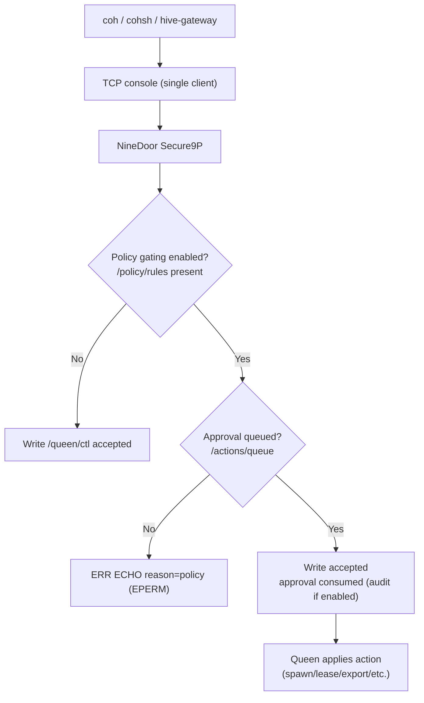
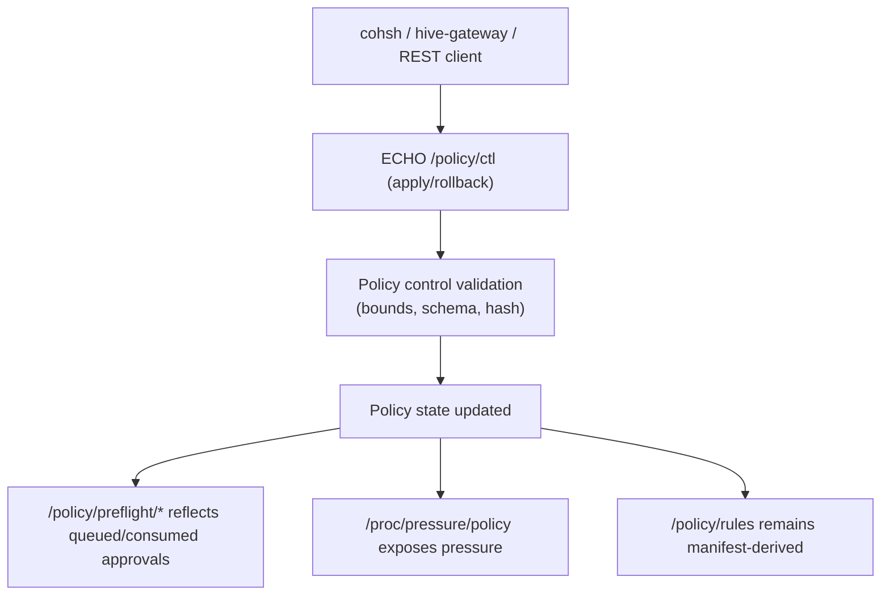
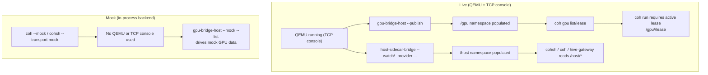

<!-- Copyright © 2025 Lukas Bower -->
<!-- SPDX-License-Identifier: Apache-2.0 -->
<!-- Purpose: Describe Cohesix host tools, their purpose, and usage. -->
<!-- Author: Lukas Bower -->
# Host Tools

Host tools run outside the VM and project the same file/console semantics the VM enforces. They do not introduce new control-plane verbs or bypass Secure9P; every tool is a convenience wrapper over `LS`, `CAT`, `ECHO`, and/or mounted Secure9P namespaces.

**Build + locations**
- Source tree: `scripts/cohesix-build-run.sh` stages host binaries under `out/cohesix/host-tools/`. It builds `cohsh` and `host-sidecar-bridge` with TCP support, plus `coh`, `gpu-bridge-host`, `cas-tool`, `hive-gateway`, and (when `cohesix-dev` is enabled) `swarmui`.
- Source tree (manual): `cargo build -p <tool>` produces `target/<profile>/<tool>`.
- Release bundles: host tools live in `bin/`. The Linux release bundle ships `coh` with `fuse,nvml,cuda`; build with `--no-default-features` to skip FUSE when needed. `cohsh` and `host-sidecar-bridge` include TCP support.

All examples below use `./bin/<tool>` as the bundle layout. In the source tree, replace `./bin` with `out/cohesix/host-tools` (staged) or `target/<profile>` (manual).

**Console exclusivity**
The TCP console is single-client. Only one of `cohsh`, `swarmui`, `hive-gateway`, `coh`, `gpu-bridge-host`, `host-sidecar-bridge`, `cas-tool`, or a Python `TcpBackend` should be attached at a time. `cohsh` enforces this with a lock file; set `COHSH_CONSOLE_LOCK=0` only if you understand the risk. For multiplexed deployments, run `hive-gateway` as the sole console client and point host tools at it using REST (`--rest-url`, `COH_REST_URL`, or `SWARMUI_REST_URL`). `coh mount --rest-url` is limited to one active mount per gateway URL (host-side lock).

## cohsh
### Purpose
Canonical operator shell for Cohesix. Attaches to the TCP console (or an in-process NineDoor Secure9P server for mock/trace workflows) and drives `/queen/ctl`, logs, telemetry, and control files.

### Location
- Source: `apps/cohsh`
- Binary: `out/cohesix/host-tools/cohsh` (bundle: `bin/cohsh`)

### Usage
```bash
./bin/cohsh --transport tcp --tcp-host 127.0.0.1 --tcp-port 31337
./bin/cohsh --transport tcp --role worker-heartbeat --ticket "$WORKER_TICKET"
./bin/cohsh --transport tcp --script scripts/cohsh/boot_v0.coh
./bin/cohsh --mint-ticket --role worker-heartbeat --ticket-subject worker-1
./bin/cohsh --transport qemu --qemu-out-dir out/cohesix --qemu-arg "-nographic"
./bin/cohsh --transport rest --rest-url http://127.0.0.1:8080
```

### Notes
- `--transport` supports `tcp`, `rest`, `qemu`, and `mock`. `qemu` boots QEMU using the staged artefacts under `--qemu-out-dir` (defaults to `out/cohesix`).
- `.coh` scripts follow the grammar in `docs/USERLAND_AND_CLI.md`; validate with `--check`.
- `--record-trace` and `--replay-trace` require `--transport mock`.
- Tickets are required when ticketing is enabled; the default manifest ships mintable secrets for queen and worker roles. Auth tokens (`--auth-token` / `COHSH_AUTH_TOKEN`) are separate from tickets.
- Environment overrides: `COHSH_AUTH_TOKEN`, `COHSH_TCP_HOST`, `COHSH_TCP_PORT`, `COHSH_REST_URL`, `COH_REST_URL`, `HIVE_GATEWAY_URL`, `COHSH_POLICY`, `COHSH_TICKET_CONFIG`, `COHSH_TICKET_SECRET`, `COHSH_QEMU_ARGS`, `COHSH_TCP_DEBUG`.
- Advanced tuning: `COHSH_POOL_CONTROL_SESSIONS`, `COHSH_POOL_TELEMETRY_SESSIONS`, `COHSH_RETRY_MAX_ATTEMPTS`, `COHSH_RETRY_BACKOFF_MS`, `COHSH_RETRY_CEILING_MS`, `COHSH_RETRY_TIMEOUT_MS`, `COHSH_HEARTBEAT_INTERVAL_MS`.

## coh
### Purpose
Host bridge for mount, GPU leases, telemetry pulls, runtime breadcrumbs, PEFT lifecycle glue, and environment checks (`coh doctor`).

### Location
- Source: `apps/coh`
- Binary: `out/cohesix/host-tools/coh` (bundle: `bin/coh`)

### Usage
```bash
./bin/coh doctor --mock
./bin/coh --rest-url http://127.0.0.1:8080 gpu list
./bin/coh --rest-url http://127.0.0.1:8080 mount --at /tmp/coh-mount
./bin/coh gpu list --host 127.0.0.1 --port 31337
./bin/coh gpu lease --host 127.0.0.1 --port 31337 --gpu GPU-0 --mem-mb 4096 --streams 1 --ttl-s 60
./bin/coh run --host 127.0.0.1 --port 31337 --gpu GPU-0 -- echo ok
./bin/coh telemetry pull --host 127.0.0.1 --port 31337 --out ./out/telemetry
./bin/coh peft export --host 127.0.0.1 --port 31337 --job job_8932 --out ./out/export
./bin/coh peft import --host 127.0.0.1 --port 31337 --publish --model demo-model \
  --from demo/peft_adapter --job job_8932 --export ./out/export --registry ./out/model_registry
./bin/coh peft activate --host 127.0.0.1 --port 31337 --model demo-model --registry ./out/model_registry
./bin/coh peft rollback --host 127.0.0.1 --port 31337 --registry ./out/model_registry
```

### Notes
- `coh mount` uses FUSE for live mounts. FUSE is enabled by default on Linux; ensure a FUSE runtime is installed. `--mock` skips the mount check.
- `coh mount` is long-running and stays in the foreground to serve the mount. Use a second terminal for access or run it in the background (`... &`) and unmount with `fusermount -u` (Linux) or `umount` (macOS).
- `--rest-url` (or `COH_REST_URL` / `HIVE_GATEWAY_URL`) routes operations through `hive-gateway` and does not attach to the TCP console (queen role only).
- `coh mount --rest-url` is exclusive: only one REST mount per gateway URL. Unmount before starting another.
- `coh doctor` prefers NVML; if NVML is feature-limited (Jetson), it falls back to CUDA discovery and emits `status=degraded backend=cuda`.
- `coh gpu list`/`lease` only see GPUs after `/gpu` is published by `gpu-bridge-host` (live: `--publish`; mock: `--mock --list`).
- Reading `/host/*` requires `host-sidecar-bridge` to be running and publishing providers.
- Mock vs live: `--mock` uses an in-process backend and ignores the VM; live commands require QEMU + the TCP console. Mixing mock and live in the same session commonly leads to empty views or unexpected failures.
- `coh gpu --nvml` seeds the mock backend from NVML and requires `--features nvml` (it is mutually exclusive with `--mock`); if NVML is feature-limited, CUDA is used as a fallback.
- `coh run` executes a host command locally after validating a lease and appends bounded breadcrumbs to `/gpu/<id>/status`.
- `coh run` requires an active lease in `/gpu/<id>/lease` and will refuse to execute without one.
- Policy enforcement is manifest-driven; `COH_POLICY` (or `out/coh_policy.toml`) must hash-match the compiled defaults.
- If policy gating is enabled (see `/policy/rules`), writes to `/queen/ctl` require approvals queued in `/actions/queue`. `coh gpu lease`, `coh run`, and `coh peft ...` will fail with `ERR ECHO reason=policy ... EPERM` until an approval is queued.
- Auth token fallback order is `--auth-token`, `COH_AUTH_TOKEN`, then `COHSH_AUTH_TOKEN`.
- `peft import --publish` (alias `--refresh-gpu-models`) refreshes `/gpu/models` in the live VM.

## swarmui
### Purpose
Desktop UI (Tauri) that renders the hive view and reuses `cohsh-core` semantics. It does not add new verbs or protocols.

### Location
- Source: `apps/swarmui`
- Binary: `out/cohesix/host-tools/swarmui` (bundle: `bin/swarmui`)

### Usage
```bash
./bin/swarmui
SWARMUI_TRANSPORT=rest SWARMUI_REST_URL=http://127.0.0.1:8080 ./bin/swarmui
SWARMUI_TRANSPORT=9p SWARMUI_9P_HOST=127.0.0.1 SWARMUI_9P_PORT=31337 ./bin/swarmui
./bin/swarmui --replay /path/to/demo.hive.cbor
./bin/swarmui --replay-trace /path/to/trace_v0.trace
./bin/swarmui --mint-ticket --role worker-heartbeat --ticket-subject worker-1
```

### Notes
- Transport is selected via `SWARMUI_TRANSPORT=console|tcp|9p|secure9p|rest|gateway` (default: `console`).
- `SWARMUI_9P_HOST`/`SWARMUI_9P_PORT` supply the TCP endpoint for both console and Secure9P transports.
- `SWARMUI_REST_URL` (fallback `COH_REST_URL`) supplies the hive-gateway base URL for `rest|gateway`.
- `SWARMUI_TRANSPORT=rest|gateway` is enabled by default. Use `--no-default-features` to strip REST support and rebuild with `--features rest` when needed.
- `SWARMUI_AUTH_TOKEN` (or `COHSH_AUTH_TOKEN`) supplies the console auth token.
- Ticket minting uses `SWARMUI_TICKET_CONFIG`/`SWARMUI_TICKET_SECRET` (fallback to `COHSH_*`).
- `--replay` resolves relative paths first against the current working directory, then the app data directory under `snapshots/`, and forces offline mode.
- `--replay-trace` resolves relative paths under `traces/` and auto-loads a sibling `*.hive.cbor` if present.

## cas-tool
### Purpose
Package and upload CAS bundles over the TCP console using the same append-only flows as `cohsh`.

### Location
- Source: `apps/cas-tool`
- Binary: `out/cohesix/host-tools/cas-tool` (bundle: `bin/cas-tool`)

### Usage
```bash
./bin/cas-tool pack --epoch 1 --input path/to/payload --out-dir out/cas/1
./bin/cas-tool upload --bundle out/cas/1 --host 127.0.0.1 --port 31337 \
  --auth-token changeme --ticket "$QUEEN_TICKET"
./bin/cas-tool upload --bundle out/cas/1 --rest-url http://127.0.0.1:8080
```

### Notes
- Epoch labels must be ASCII digits only (max 20 chars) to satisfy `/updates/<epoch>/` validation.
- `--template`, `--chunk-bytes`, and `--delta-base` mirror the manifest template inputs.
- If signing is required in `configs/root_task.toml`, pass `--signing-key` when packing (Ed25519 key in hex).
- Payloads are chunked and sent as bounded `ECHO` writes (`b64:` segments) to `/updates/<epoch>/`.

## gpu-bridge-host
### Purpose
Discover GPUs on the host (NVML with CUDA fallback, or mock) and emit the `/gpu` namespace snapshot consumed by NineDoor.

### Location
- Source: `apps/gpu-bridge-host`
- Binary: `out/cohesix/host-tools/gpu-bridge-host` (bundle: `bin/gpu-bridge-host`)

### Usage
```bash
./bin/gpu-bridge-host --mock --list
./bin/gpu-bridge-host --list
./bin/gpu-bridge-host --publish --tcp-host 127.0.0.1 --tcp-port 31337 --auth-token changeme
./bin/gpu-bridge-host --publish --rest-url http://127.0.0.1:8080
./bin/gpu-bridge-host --publish --interval-ms 1000 --registry demo/peft_registry
```

### Notes
- `--list` prints JSON for host-side integration; it does not talk to the VM directly.
- `--publish` streams bounded snapshots to `/gpu/bridge/ctl` over the TCP console (queen role) or hive-gateway (`--rest-url`).
- `--rest-url` is enabled by default. Use `--no-default-features` to strip REST support and rebuild with `--features rest` when needed.
- `--interval-ms` repeats publish in a loop; omit to send a single snapshot.
- `--registry` points at a host model registry root to populate `/gpu/models`.
- NVML is preferred on dGPU hosts; when NVML is feature-limited (Jetson), the bridge falls back to CUDA driver/runtime APIs to populate `/gpu/*`.

## host-sidecar-bridge
### Purpose
Publish host-side providers into `/host` (systemd, k8s, docker, nvidia, jetson, net) via Secure9P for policy/CI validation and live telemetry snapshots.

### Location
- Source: `apps/host-sidecar-bridge`
- Binary: `out/cohesix/host-tools/host-sidecar-bridge` (bundle: `bin/host-sidecar-bridge`)

### Usage
```bash
./bin/host-sidecar-bridge --mock --mount /host --provider systemd --provider k8s --provider docker --provider nvidia
./bin/host-sidecar-bridge --tcp-host 127.0.0.1 --tcp-port 31337 --auth-token changeme
./bin/host-sidecar-bridge --tcp-host 127.0.0.1 --tcp-port 31337 --auth-token changeme --watch
./bin/host-sidecar-bridge --rest-url http://127.0.0.1:8080 --watch
./bin/host-sidecar-bridge --tcp-host 127.0.0.1 --tcp-port 31337 --auth-token changeme \
  --provider systemd --provider k8s --provider docker --provider nvidia --watch
```

### Notes
- Live publishing requires TCP or REST support (enabled by default). Use `--no-default-features` to strip transports, or rebuild with `--features tcp`/`--features rest` as needed.
- `--rest-url` publishes through hive-gateway (queen role) without attaching to the TCP console.
- Providers may be `systemd`, `k8s`, `docker`, `nvidia`, `jetson`, or `net`. When no providers are specified, the defaults are `systemd`, `k8s`, `docker`, and `nvidia`.
- `--watch` polls providers continuously using manifest-backed polling defaults (override with `--policy`). Only `systemd`, `k8s`, `docker`, and `nvidia` have live polling schedules.
- The `/host` namespace must be enabled in `configs/root_task.toml`.

## hive-gateway
### Purpose
Host-only REST gateway that maps 1:1 to Cohesix console/file semantics (`LS`, `CAT`, `ECHO`). It does not add new verbs or control-plane behavior.

### Location
- Source: `apps/hive-gateway`
- Binary: `out/cohesix/host-tools/hive-gateway` (bundle: `bin/hive-gateway`)

### Usage
```bash
./bin/hive-gateway --mock --bind 127.0.0.1:8080
COH_TCP_HOST=127.0.0.1 COH_TCP_PORT=31337 COH_AUTH_TOKEN=changeme \
  COH_ROLE=queen HIVE_GATEWAY_BIND=127.0.0.1:8080 \
  ./bin/hive-gateway

curl -sS http://127.0.0.1:8080/v1/meta/bounds | jq .
```

### Notes
- Environment overrides: `HIVE_GATEWAY_BIND`, `HIVE_GATEWAY_MOCK`, `COH_TCP_HOST`, `COH_TCP_PORT`, `COH_AUTH_TOKEN` (or `COHSH_AUTH_TOKEN`), `COH_ROLE`, `COH_TICKET`.
- OpenAPI spec + examples live in `docs/HOST_API.md` and are served at `/v1/openapi.yaml`.
- Swagger UI is served at `/docs` and uses public CDN assets; use the YAML spec for air-gapped environments.
- The gateway is the console client; do not attach `cohsh` or `swarmui` in console mode at the same time. Use `SWARMUI_TRANSPORT=rest` and host tool `--rest-url` flags when multiplexing.

---

## Using Host Tools Together
These workflows show how the tools complement each other without introducing new semantics. Each example uses the shipped commands only.

In the source tree, use `scripts/qemu-run.sh` instead of `./qemu/run.sh` and replace `./bin` paths with `out/cohesix/host-tools`.

### 1) Live Hive operator flow (Queen + UI + CLI)
Goal: show a live Queen with SwarmUI as the trustable lens, and `cohsh` as the action surface.
Why this matters: proves the UI is observational only while the authoritative control plane remains the CLI and file-shaped paths.
```bash
./qemu/run.sh
./bin/swarmui
```
Quit SwarmUI before switching to `cohsh`:
```bash
./bin/cohsh --transport tcp --tcp-host 127.0.0.1 --tcp-port 31337
```
In `cohsh`:
```
attach queen
cat /proc/lifecycle/state
spawn heartbeat ticks=100
```
For multiplexed mode, keep `hive-gateway` attached to the console and run `SWARMUI_TRANSPORT=rest` with host tools using `--rest-url` so the console remains single-client.
Quit `cohsh`, relaunch SwarmUI to observe the worker activity.

### 2) GPU surface + lease + breadcrumbs (host tools only)
Goal: prove the GPU namespace and bounded runtime breadcrumbs.
Why this matters: shows GPU access is host-side and lease-gated, and that runtime actions are logged in `/gpu/<id>/status`.
```bash
./qemu/run.sh
./bin/gpu-bridge-host --list   # NVML/CUDA discovery on Linux
./bin/coh --host 127.0.0.1 --port 31337 gpu list
./bin/coh --host 127.0.0.1 --port 31337 gpu lease --gpu GPU-0 --mem-mb 4096 --streams 1 --ttl-s 60
./bin/coh --host 127.0.0.1 --port 31337 run --gpu GPU-0 -- echo ok
```
Note: if `/gpu` is empty, confirm the host GPU bridge integration is running and the snapshot shows devices.

### 3) Telemetry ingress + pull (operator + host bridge)
Goal: write telemetry to the Queen's ingest surface and pull the bundles.
Why this matters: demonstrates the append-only ingest surface and bounded export without introducing any new protocol.
```bash
./qemu/run.sh
./bin/cohsh --transport tcp --tcp-host 127.0.0.1 --tcp-port 31337 --role queen \
  telemetry push demo/telemetry/demo.txt --device device-1
./bin/coh --host 127.0.0.1 --port 31337 telemetry pull --out ./out/telemetry/pull
```

### 4) PEFT lifecycle loop (export -> import -> activate -> rollback)
Goal: show auditable adapter handling with host tooling.
Why this matters: proves adapters are managed as auditable artifacts with reversible activation.
```bash
./qemu/run.sh
./bin/gpu-bridge-host --mock --list
./bin/coh peft export --mock --job job_0001 --out demo/peft_export
./bin/coh --host 127.0.0.1 --port 31337 peft import --model demo-model \
  --from demo/peft_adapter --job job_0001 --export demo/peft_export --registry demo/peft_registry --publish
./bin/coh --host 127.0.0.1 --port 31337 peft activate --model demo-model --registry demo/peft_registry
./bin/coh --host 127.0.0.1 --port 31337 peft rollback --registry demo/peft_registry
```

### 5) Host sidecar publishing + policy validation
Goal: project host providers into `/host` and observe via CLI/UI.
Why this matters: validates `/host` gating, queen-only controls, and audit logging with either mock or live snapshots.
```bash
./qemu/run.sh
./bin/host-sidecar-bridge --tcp-host 127.0.0.1 --tcp-port 31337 --auth-token changeme \
  --provider systemd --provider k8s --provider docker --provider nvidia --watch
./bin/cohsh --transport tcp --tcp-host 127.0.0.1 --tcp-port 31337
```
In `cohsh`:
```
attach queen
ls /host
```
Quit `cohsh`, open SwarmUI to observe the live hive alongside host provider activity.

Note: if live provider commands (systemctl/kubectl/docker/nvidia-smi) are unavailable, status lines report `state=unknown reason=<...>`.

### 6) CAS update bundle demo (pack + upload + verify)
Goal: show content-addressed update flows with deterministic upload paths.
Why this matters: proves update artifacts are signed, chunked, and uploaded through the same audited console path.
```bash
./qemu/run.sh
QUEEN_TICKET=$(./bin/cohsh --mint-ticket --role queen)
./bin/cas-tool pack --epoch 1 --input demo/telemetry/demo.txt --out-dir out/cas/1 \
  --signing-key resources/fixtures/cas_signing_key.hex
./bin/cas-tool upload --bundle out/cas/1 --host 127.0.0.1 --port 31337 \
  --auth-token changeme --ticket "$QUEEN_TICKET"
```
In `cohsh` (optional):
```
attach queen
ls /updates
```

### 7) Hive gateway monitoring + API control
Goal: observe host telemetry (NVML/CUDA-backed GPU snapshots plus systemd, k8s, and docker) over HTTP and submit control actions through the REST projection.
Why this matters: demonstrates that monitoring and control stay aligned with the same file and console semantics.

Real-world flow (snapshot + REST read):
```bash
./qemu/run.sh

# Publish a one-shot NVML/CUDA GPU snapshot into /gpu (do not keep this attached).
./bin/gpu-bridge-host --publish --tcp-host 127.0.0.1 --tcp-port 31337 --auth-token changeme

# Publish a one-shot host telemetry snapshot into /host (do not keep this attached).
./bin/host-sidecar-bridge --tcp-host 127.0.0.1 --tcp-port 31337 --auth-token changeme \
  --provider systemd --provider k8s --provider docker --provider nvidia

# Start the REST gateway (sole console client) and read the published snapshot.
COH_TCP_HOST=127.0.0.1 COH_TCP_PORT=31337 COH_AUTH_TOKEN=changeme \
  COH_ROLE=queen HIVE_GATEWAY_BIND=127.0.0.1:8080 \
  ./bin/hive-gateway
```
In another terminal:
```bash
# List top-level providers under /host.
curl -sS 'http://127.0.0.1:8080/v1/fs/ls?path=/host' | jq .

# Read systemd unit status (example unit).
curl -sS 'http://127.0.0.1:8080/v1/fs/cat?path=/host/systemd/cohesix-agent.service/status&max_bytes=256' | jq .

# Read a Kubernetes node status (example node id).
curl -sS 'http://127.0.0.1:8080/v1/fs/cat?path=/host/k8s/node/node-1/status&max_bytes=256' | jq .

# Read Docker and NVIDIA provider status.
curl -sS 'http://127.0.0.1:8080/v1/fs/cat?path=/host/docker/status&max_bytes=256' | jq .
curl -sS 'http://127.0.0.1:8080/v1/fs/cat?path=/host/nvidia/gpu/0/status&max_bytes=256' | jq .

# Read NVML/CUDA-backed GPU info published by gpu-bridge-host.
curl -sS 'http://127.0.0.1:8080/v1/fs/cat?path=/gpu/GPU-0/info&max_bytes=2048' | jq .
```

Real-world API control (lease + schedule + policy):
```bash
# Enqueue a GPU worker schedule entry.
curl -sS -X POST http://127.0.0.1:8080/v1/fs/echo \
  -H 'Content-Type: application/json' \
  -d '{"path":"/queen/schedule/ctl","line":"{\"id\":\"sched-42\",\"role\":\"worker-gpu\",\"priority\":3,\"ticks\":5,\"budget_ms\":120}"}'

# Grant and preempt a lease.
curl -sS -X POST http://127.0.0.1:8080/v1/fs/echo \
  -H 'Content-Type: application/json' \
  -d '{"path":"/queen/lease/ctl","line":"{\"op\":\"grant\",\"id\":\"lease-42\",\"subject\":\"queen\",\"resource\":\"gpu0\",\"ttl_s\":300,\"priority\":5}"}'
curl -sS -X POST http://127.0.0.1:8080/v1/fs/echo \
  -H 'Content-Type: application/json' \
  -d '{"path":"/queen/lease/ctl","line":"{\"op\":\"preempt\",\"id\":\"lease-42\",\"reason\":\"maintenance\"}"}'

# Apply and roll back a policy revision.
curl -sS -X POST http://127.0.0.1:8080/v1/fs/echo \
  -H 'Content-Type: application/json' \
  -d '{"path":"/policy/ctl","line":"{\"op\":\"apply\",\"id\":\"rev-2026-02-05\",\"sha256\":\"0123456789abcdef0123456789abcdef0123456789abcdef0123456789abcdef\"}"}'
curl -sS -X POST http://127.0.0.1:8080/v1/fs/echo \
  -H 'Content-Type: application/json' \
  -d '{"path":"/policy/ctl","line":"{\"op\":\"rollback\",\"id\":\"rev-2026-02-05\"}"}'
```

Notes:
- The console is single-client. When `hive-gateway` is attached, use `--rest-url` on host bridges instead of attaching them directly.
- For continuous telemetry, run `host-sidecar-bridge --watch --rest-url http://127.0.0.1:8080` while `hive-gateway` remains the console client.

## Policy & Dependency Diagrams
These diagrams summarize the policy gating and host-tool interdependencies that most often surprise new users.

Figure 1: Policy-gated control writes (`/queen/ctl`)


Figure 2: Policy control apply/rollback (`/policy/ctl`)


Figure 3: GPU + host visibility dependencies (live vs mock)


## Glossary
- `9P2000.L`: The only supported 9P protocol variant; all Secure9P traffic uses it.
- `ACK/ERR/END`: Console response grammar. `ACK` = command accepted; `ERR` = refused with reason; `END` = end of a stream or listing.
- `Actions Queue` (`/actions/queue`): Append-only approvals/denials that satisfy policy gating for control writes.
- `Approval`: Single-use decision line in `/actions/queue` (`id`, `target`, `decision`).
- `Append-Only`: Write semantics where offsets are ignored/rejected; each write appends a new record or line.
- `Attach`: Session handshake that binds a role (and optional ticket) to a namespace slice.
- `Audit`: Optional policy/decision logging (when `/audit` is enabled).
- `AuditFS` (`/audit/*`): Append-only audit journal and decisions (manifest-gated).
- `Auth Token`: Console authentication token (for example `COH_AUTH_TOKEN`). Distinct from role tickets.
- `Auth Token Fallback (coh)`: Resolution order is `--auth-token`, `COH_AUTH_TOKEN`, then `COHSH_AUTH_TOKEN`.
- `Batch Frames`: Manifest-bounded batching of multiple 9P frames per round trip.
- `Backpressure`: Deterministic refusal when a bounded buffer or queue is full.
- `Budget`: Per-ticket resource limits (ticks/ops/ttl_s) enforced by root-task and NineDoor.
- `Budget Ops`: Max NineDoor operations permitted before revocation.
- `Budget Ticks`: Scheduler quanta allocated to a worker.
- `Budget TTL`: Wall-clock lifetime for a worker budget (seconds); leases use their own `ttl_s`.
- `Bounds`: Manifest-defined hard limits on bytes, entries, and walk depth enforced by NineDoor.
- `Bridge` (host-side): Host tools that publish external state into the VM (`gpu-bridge-host`, `host-sidecar-bridge`).
- `CAS Updates` (`/updates/*`): Content-addressed update bundles uploaded in bounded chunks (manifest-gated).
- `Console`: The single-client TCP control channel used directly by `cohsh` (and by `hive-gateway` when multiplexing REST clients). Other host tools attach directly only in console mode.
- `Control Files`: Append-only control paths such as `/queen/ctl`, `/queen/lifecycle/ctl`, `/queen/schedule/ctl`, `/queen/lease/ctl`, `/queen/export/ctl`, `/policy/ctl`, and `/gpu/bridge/ctl`.
- `Control Write`: An `ECHO` to a control path (e.g., `/queen/ctl`, `/policy/ctl`) that triggers actions.
- `Cohesix Hive`: Queen + workers model; queen orchestrates, workers emit telemetry or mirror GPU lease state.
- `COH`: Host bridge CLI for GPU, telemetry, mounts, PEFT, and runtime checks.
- `COHSH`: Operator shell for direct console control and scripting.
- `Clunk`: 9P operation that releases a fid; fids cannot be reused after clunk.
- `Deterministic`: Behaviors are bounded and replayable; same input yields same output.
- `ECHO`: Console write verb used for control files; append-only to control paths.
- `EPERM`: Permission error; in Cohesix often means policy gate denied the write.
- `Export Window` (`/queen/export/ctl`): Append-only control for opening/closing bounded export periods.
- `Feature Gate`: Manifest toggle that enables/disables namespaces (for example `/policy`, `/audit`, `/replay`, `/updates`, `/models`).
- `Fid`: 9P file identifier scoped to a session.
- `FUSE`: Filesystem in Userspace; used by `coh mount` to expose Secure9P namespaces.
- `GPU Bridge Publish`: Snapshot publish flow that installs `/gpu/*`, `/gpu/models/*`, and `/gpu/telemetry/schema.json`.
- `GPU Lease`: A time-bounded claim on a GPU resource recorded under `/gpu/<id>/lease`.
- `Host Providers`: Source of `/host/*` data (systemd, k8s, docker, nvidia) via `host-sidecar-bridge`.
- `IR/Manifest`: The compiler-generated truth of system behavior (for example `root_task.toml`).
- `JSONL`: Newline-delimited JSON; one object per line.
- `Lease`: Time-bounded resource allocation recorded under `/queen/lease/ctl` and `/proc/lease/*`.
- `Lease Preemption` (`/queen/lease/ctl`): Forced termination of an active lease with a reason.
- `Lease Renewal` (`/queen/lease/ctl`): Extension of an existing lease TTL.
- `Lease Quota` (`/queen/lease/ctl`): Limits on active leases and preemptions per subject/resource.
- `Lifecycle Gates`: State-driven allow/deny checks for attach, publish, telemetry, and job writes.
- `Models Registry` (`/gpu/models/*` or `/models/*`): Host-authored model manifests and active pointers (manifest-gated).
- `Mock Mode`: In-process backend; no VM or TCP console required.
- `msize`: Negotiated Secure9P max message size (≤ 8192).
- `Mount`: FUSE view of Secure9P paths; long-running process.
- `Namespace`: Role-scoped view of paths exposed by NineDoor.
- `NineDoor`: Userspace 9P server in the VM enforcing bounds and policy.
- `Root Task`: seL4 root task hosting NineDoor, console listeners, and ticket issuance.
- `Policy Gate`: Manifest-enabled rule set requiring approvals for sensitive writes.
- `Policy Rules` (`/policy/rules`): Manifest-derived policy snapshot; read-only.
- `Policy Control` (`/policy/ctl`): Append-only control file for apply/rollback.
- `PolicyFS` (`/policy/*`): Policy control, rules, and preflight observability (manifest-gated).
- `Policy Preflight` (`/policy/preflight/*`): Observability into queued vs consumed approvals.
- `Pressure` (`/proc/pressure/*`): Read-only counters indicating resource pressure (policy queue, ingest, etc.).
- `Provider`: Component that implements a namespace subtree (host bridges or NineDoor providers).
- `QEMU` (aarch64/virt): Reference dev/CI VM target.
- `Queen`: Hive orchestrator role with authority over control files and worker lifecycle.
- `ReplayFS` (`/replay/*`): Append-only replay control and status (manifest-gated).
- `Role Ticket`: Role-scoped capability token minted for queen/worker roles.
- `Ticket`: Capability token (`cohesix-ticket`) binding role, subject, budget, and mounts.
- `Ticket Claims`: Structured fields inside a ticket (role, budget, subject, mounts, issued_at_ms).
- `Ticket Quotas`: Manifest-defined limits on ticket scopes and rates.
- `Ticket Scope`: Optional path/rate limits attached to a ticket.
- `Ticket Secret`: Host-only secret used to MAC tickets.
- `Ticket Subject`: Worker identity bound to a ticket.
- `Schedule Queue` (`/queen/schedule/ctl`, `/proc/schedule/*`): Declarative scheduling requests and read-only snapshots.
- `Secure9P`: File-shaped control plane; all interactions are paths and bounded reads/writes.
- `Shard`: Two-hex-digit worker namespace label derived from the worker ID hash; used in `/shard/<label>/worker/<id>/telemetry`.
- `Shard Bits`: Manifest setting controlling the shard label space size (e.g., 8 bits -> `00..ff`).
- `Sharding`: Canonical worker namespace layout under `/shard/<label>/worker/<id>/telemetry`.
- `Sharding Legacy Alias`: Optional `/worker/<id>/telemetry` alias for backward compatibility when `sharding.legacy_worker_alias = true`.
- `Short Write`: Transport-level partial write handling (reject or bounded retry).
- `Tag Window`: Manifest-bounded limit on in-flight 9P tags per session.
- `Telemetry`: Append-only worker data stored under `/worker/*` or `/shard/*/worker/*`.
- `Telemetry Segment`: OS-named ingest segment under `/queen/telemetry/<device_id>/seg/`.
- `Trace/Replay`: Deterministic logs and snapshots used for UI replay/testing.
- `UI Providers`: Manifest-gated observability nodes under `/proc`.
- `Walk Depth`: Maximum path components allowed in Secure9P walks.
- `Worker` (heart/gpu): Child roles; heart emits telemetry, gpu mirrors lease state.
