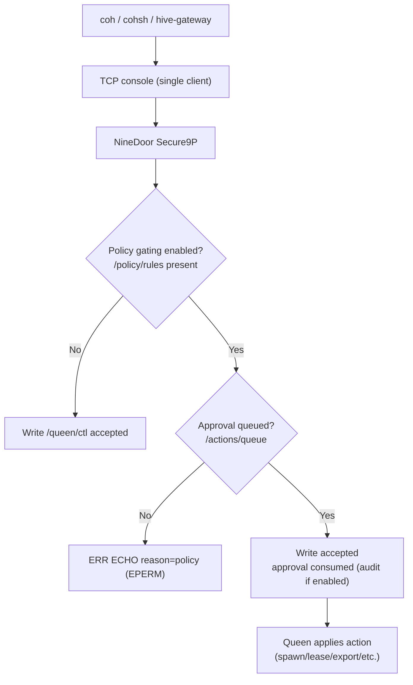
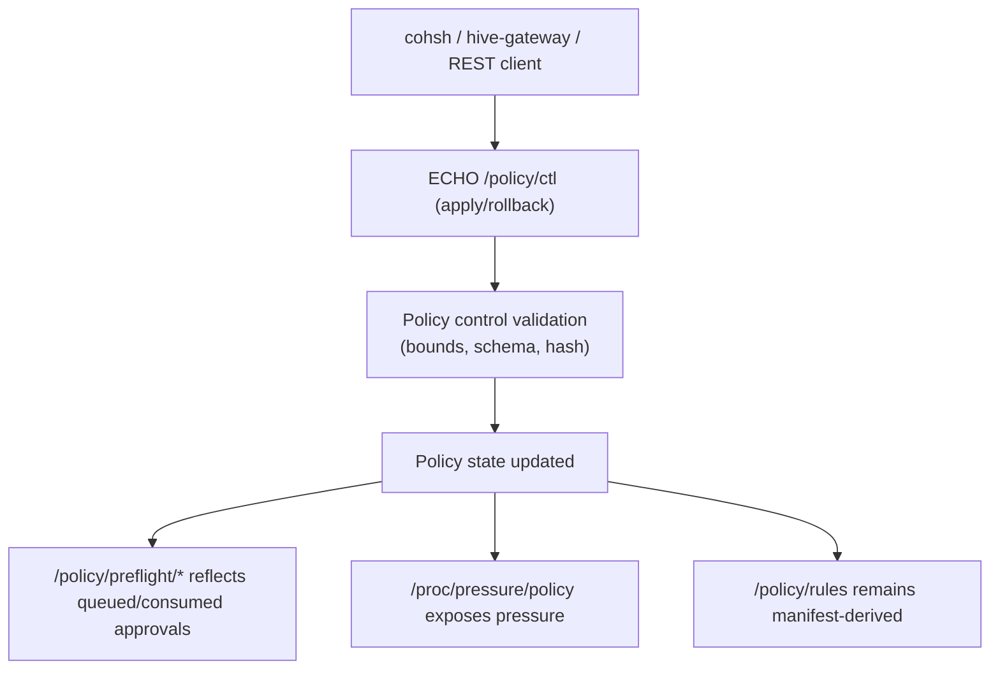
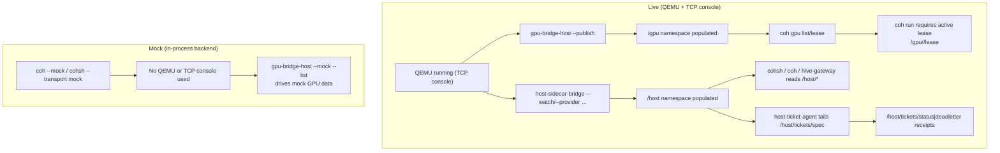

<!-- Copyright 2026 Lukas Bower -->
<!-- SPDX-License-Identifier: Apache-2.0 -->
<!-- Purpose: Describe Cohesix host tools, their purpose, and usage. -->
<!-- Author: Lukas Bower -->
# Host Tools

Host tools run outside the VM and project the same file/console semantics the VM enforces. They do not introduce new control-plane verbs or bypass Secure9P; every tool is a convenience wrapper over `LS`, `CAT`, `TAIL`, `ECHO`, metadata reads, and/or mounted Secure9P namespaces.

**0.9.0-beta note**
This release introduces `hive-gateway` as the supported multiplexing layer for host tools. When you need multiple tools or remote operators, run `hive-gateway` as the **sole** console client and point every other tool at it using REST.

**Build + locations**
- Source tree: `scripts/cohesix-build-run.sh` stages host binaries under `out/cohesix/host-tools/`. It builds `cohsh`, `host-sidecar-bridge`, and `host-ticket-agent` with TCP support, plus `coh`, `gpu-bridge-host`, `cas-tool`, `hive-gateway`, and (when `cohesix-dev` is enabled) `swarmui`.
- Source tree (manual): `cargo build -p <tool>` produces `target/<profile>/<tool>`.
- Release bundles: host tools live in `bin/`. The Linux release bundle ships `coh` with `fuse,nvml,cuda`; macOS bundles ship `coh` with FUSE enabled (requires MacFUSE installed and approved, typically surfaced as `/dev/macfuse0`). `cohsh` and `host-sidecar-bridge` include TCP support.

All examples below use `./bin/<tool>` as the bundle layout. In the source tree, replace `./bin` with `out/cohesix/host-tools` (staged) or `target/<profile>` (manual).

**Live auth prerequisites (non-mock)**
```bash
export COH_AUTH_TOKEN=replace-with-real-token
export COHSH_AUTH_TOKEN="$COH_AUTH_TOKEN"
export HIVE_GATEWAY_REQUEST_AUTH_TOKEN=replace-with-real-token
```
`coh`, `cohsh`, and `hive-gateway` reject the insecure placeholder token `changeme` in non-mock mode.

**Console exclusivity**
The TCP console is single-client. Only one of `cohsh`, `swarmui`, `hive-gateway`, `coh`, `gpu-bridge-host`, `host-sidecar-bridge`, `host-ticket-agent`, `cas-tool`, or a Python `TcpBackend` should be attached at a time. `cohsh` enforces this with a lock file; set `COHSH_CONSOLE_LOCK=0` only if you understand the risk. For multiplexed deployments, run `hive-gateway` as the sole console client and point host tools at it using REST (`--rest-url`, `COH_REST_URL`, or `SWARMUI_REST_URL`) with request-auth configured (`--rest-auth-token` or `HIVE_GATEWAY_REQUEST_AUTH_TOKEN` / `COHSH_REST_AUTH_TOKEN` / `COH_REST_AUTH_TOKEN`; SwarmUI also supports `SWARMUI_REST_AUTH_TOKEN`). `coh mount --rest-url` is limited to one active mount per gateway URL (host-side lock).

**Choosing a transport**
Use the TCP console when a single tool is active and you want minimal hops. Use `hive-gateway` when you need multiple tools, remote operators, or a REST surface.

| Scenario | Recommended transport | Why |
| --- | --- | --- |
| Single operator, local machine | TCP console | Lowest latency, simplest mental model. |
| SwarmUI + CLI together | REST via `hive-gateway` | Console is single-client; REST multiplexes. |
| Remote Mac controlling a GPU host | REST via SSH tunnel | Keeps console on the host, secure remote access. |
| Multiple publishers (gpu + host-sidecar) | REST via `hive-gateway` | One console client, many REST clients. |

## Hive-gateway quickstart (0.9.0-beta)
Goal: run `hive-gateway` as the only console client and route all tools through REST.

1. Boot the Queen VM.
```bash
./qemu/run.sh
```
2. Start the gateway (queen role).
```bash
COH_TCP_HOST=127.0.0.1 COH_TCP_PORT=31337 COH_AUTH_TOKEN="$COH_AUTH_TOKEN" \
  HIVE_GATEWAY_REQUEST_AUTH_TOKEN="$HIVE_GATEWAY_REQUEST_AUTH_TOKEN" \
  COH_ROLE=queen HIVE_GATEWAY_BIND=127.0.0.1:8080 \
  ./bin/hive-gateway
```
3. Verify the gateway is healthy.
```bash
curl -sS http://127.0.0.1:8080/v1/meta/bounds | jq .
curl -sS 'http://127.0.0.1:8080/v1/fs/ls?path=/' | jq .
```
4. Attach `cohsh` via REST (not TCP).
```bash
./bin/cohsh --transport rest --rest-url http://127.0.0.1:8080 \
  --rest-auth-token "$HIVE_GATEWAY_REQUEST_AUTH_TOKEN" --role queen
```
5. Publish host snapshots through the gateway.
```bash
./bin/gpu-bridge-host --publish --rest-url http://127.0.0.1:8080 \
  --rest-auth-token "$HIVE_GATEWAY_REQUEST_AUTH_TOKEN" --interval-ms 1000
./bin/host-sidecar-bridge --rest-url http://127.0.0.1:8080 \
  --rest-auth-token "$HIVE_GATEWAY_REQUEST_AUTH_TOKEN" --watch
```
6. Launch SwarmUI over REST.
```bash
SWARMUI_TRANSPORT=rest SWARMUI_REST_URL=http://127.0.0.1:8080 \
  SWARMUI_REST_AUTH_TOKEN="$HIVE_GATEWAY_REQUEST_AUTH_TOKEN" ./bin/swarmui
```

## cohsh
### Purpose
Canonical operator shell for Cohesix. Runs on the host and attaches to NineDoor over the TCP console, the REST gateway multiplexer, or mock/QEMU transports for development. It never runs inside the VM and does not add new control-plane semantics.

### Location
- Source: `apps/cohsh`
- Binary: `out/cohesix/host-tools/cohsh` (bundle: `bin/cohsh`)

### Usage
```bash
# TCP console (single client).
./bin/cohsh --transport tcp --tcp-host 127.0.0.1 --tcp-port 31337 --role queen

# REST gateway (multiplexed; hive-gateway is the sole console client).
./bin/cohsh --transport rest --rest-url http://127.0.0.1:8080 \
  --rest-auth-token "$HIVE_GATEWAY_REQUEST_AUTH_TOKEN" --role queen

# QEMU (dev convenience).
./bin/cohsh --transport qemu --qemu-out-dir out/cohesix --qemu-arg "-nographic"

# Mock (offline, in-process NineDoor).
./bin/cohsh --transport mock --mock-seed-gpu

# Run or validate a .coh script.
./bin/cohsh --transport tcp --script scripts/cohsh/boot_v0.coh
./bin/cohsh --check scripts/cohsh/boot_v0.coh

# Mint a ticket (worker roles require a subject).
./bin/cohsh --mint-ticket --role worker-heartbeat --ticket-subject worker-1
```

### Session + auth model
- `--role <role>` attaches immediately; use `--ticket <payload>` when ticketing is enabled.
- `attach <role> [ticket]` and `login <role> [ticket]` are equivalent inside the shell.
- `detach` closes the NineDoor session but keeps the shell alive; `quit` exits.
- TCP auth uses `--auth-token` or env (`COHSH_AUTH_TOKEN`, then `COH_AUTH_TOKEN`) and is separate from capability tickets.
- In non-mock mode, `cohsh` rejects placeholder token `changeme`.
- REST transport requires a running `hive-gateway` (`--rest-url` or `COHSH_REST_URL`) and uses the gateway's configured role/ticket (queen in standard deployments). Use `--rest-auth-token` (or `COHSH_REST_AUTH_TOKEN` / `COH_REST_AUTH_TOKEN` / `HIVE_GATEWAY_REQUEST_AUTH_TOKEN`) for gateway request-auth.

### Core commands (interactive)
| Command | Notes |
| --- | --- |
| `help` | List available shell commands and console verbs. |
| `attach <role> [ticket]` | Start a session (`login` is an alias). |
| `ls <path>` | Enumerate directory entries. |
| `cat <path>` | Read file contents once. |
| `tail <path>` | Stream a file. |
| `log` | Alias for `tail /log/queen.log`. |
| `echo <text> > <path>` | Append a single line; adds a newline. |
| `spawn <role> ...` | Queue worker spawn (see examples below). |
| `kill <worker_id>` | Queue worker termination. |
| `bind <src> <dst>` | Bind namespace path (queen session required). |
| `mount <service> <path>` | Mount a service namespace (queen session required). |
| `lifecycle <cordon\|drain\|resume\|quiesce\|reset>` | Node lifecycle controls via `/queen/lifecycle/ctl` (queen session required). |
| `telemetry push <file> --device <id>` | Push a bounded telemetry segment. |
| `test [--mode <quick\|full\|smp>] [--json] [--timeout <s>] [--no-mutate]` | Run self-tests (timeout 1–120s). |
| `ping` | Health check; reports attach + transport status. |
| `tcp-diag [port]` | TCP connectivity check without protocol traffic (TCP builds only). |
| `pool bench <opts>` | Pooled throughput benchmark (advanced). |
| `quit` | Close the session and exit. |

### Spawn examples
```text
coh> spawn heartbeat ticks=120
coh> spawn heartbeat ticks=50 ttl_s=60 ops=500
coh> spawn gpu gpu_id=GPU-0 mem_mb=4096 streams=1 ttl_s=120
coh> spawn gpu gpu_id=GPU-0 mem_mb=4096 streams=1 ttl_s=120 priority=3 budget_ttl_s=300 budget_ops=500
```

### Tests
`test` executes the bundled `.coh` scripts under `/proc/tests/` (for example `selftest_smp.coh`). Default timeout is 30s; maximum is 120s.
```text
coh> test --mode quick
coh> test --mode full --timeout 120
coh> test --mode smp
coh> test --mode quick --no-mutate
coh> test --mode full --json
```

### Pool bench examples
`pool bench` writes bounded payloads to a path and measures baseline vs pooled throughput. Use append-only paths (for example `/log/queen.log` or worker telemetry).
```text
coh> pool bench path=/log/queen.log ops=50 kind=control
coh> pool bench path=/log/queen.log ops=200 batch=4 payload_bytes=64 kind=control
coh> pool bench path=/shard/<label>/worker/<id>/telemetry ops=200 batch=8 kind=telemetry payload=telemetry
coh> pool bench path=/log/queen.log ops=50 kind=control inject_failures=2 inject_bytes=8
coh> pool bench path=/log/queen.log ops=20 kind=control exhaust=4
```

### Telemetry push
`telemetry push` accepts `txt`, `log`, `json`, `ndjson`, or `csv` inputs and forwards bounded records to `/queen/telemetry/<device_id>/`.
When source bytes exceed inline envelope limits, `cohsh` emits bounded `coh-ref-c/v1` reference-manifest records (manifest-driven entry/byte limits) instead of generic file transfer.
```text
coh> telemetry push demo/telemetry/demo.txt --device device-1
coh> telemetry push demo/telemetry/sample.ndjson --device jetson-1
coh> telemetry push demo/telemetry/sample.csv --device g5g-1
```

### Quota checks (why you see `ELIMIT`)
`cohsh` enforces ticket-scoped quotas in the root-task. Each attached session carries a ticket with:
- **Scope** (which paths/verbs are permitted).
- **Rate/bandwidth** limits (bytes/second, total bytes).
- **Cursor bounds** for telemetry tails.

If a command exceeds these limits, the console returns `ERR ... reason=ELIMIT` (quota) or `ERR ... reason=EPERM` (scope). Fixes are:
- attach with a **queen** ticket (higher limits).
- reduce the tail rate/size.
- reattach to reset counters after a long session.

### Tips & gotchas
- Only one direct TCP console client at a time: `cohsh` and `swarmui` should not be attached simultaneously unless they go through one `hive-gateway`.
- Worker IDs are dynamic: prefer `ls /shard` and canonical `/shard/<label>/worker/<id>/telemetry` paths before `tail`/`kill`. Legacy `/worker/<id>/telemetry` paths work only when `sharding.legacy_worker_alias = true`.
- GPU spawns require `/gpu` entries: for live runs, publish with `./bin/gpu-bridge-host --publish ...`; for mock demos, use `./bin/gpu-bridge-host --mock --list`.
- `ELIMIT` errors on `tail` indicate ticket quota limits; reattach with a queen ticket or slow the tail.

### Notes
- `--transport` supports `tcp`, `rest`, `qemu`, and `mock`. `tcp` is the default when built with TCP support.
- `.coh` scripts follow the grammar in `docs/USERLAND_AND_CLI.md`; validate with `--check`.
- `--record-trace` and `--replay-trace` require `--transport mock`.
- `--mock-seed-gpu` seeds mock sessions with `/gpu` entries for demos/scripts.
- Tickets are required when ticketing is enabled; the default manifest ships mintable secrets for queen and worker roles. Auth tokens (`--auth-token` / `COHSH_AUTH_TOKEN`) are separate from tickets.
- Environment overrides: `COHSH_AUTH_TOKEN`, `COHSH_TCP_HOST`, `COHSH_TCP_PORT`, `COHSH_REST_URL`, `COH_REST_URL`, `HIVE_GATEWAY_URL`, `COHSH_REST_AUTH_TOKEN`, `COH_REST_AUTH_TOKEN`, `HIVE_GATEWAY_REQUEST_AUTH_TOKEN`, `COHSH_POLICY`, `COHSH_TICKET_CONFIG`, `COHSH_TICKET_SECRET`, `COHSH_QEMU_ARGS`, `COHSH_TCP_DEBUG`.
- Advanced tuning: `COHSH_POOL_CONTROL_SESSIONS`, `COHSH_POOL_TELEMETRY_SESSIONS`, `COHSH_RETRY_MAX_ATTEMPTS`, `COHSH_RETRY_BACKOFF_MS`, `COHSH_RETRY_CEILING_MS`, `COHSH_RETRY_TIMEOUT_MS`, `COHSH_HEARTBEAT_INTERVAL_MS`.

## coh
### Purpose
Host bridge for mount, GPU leases, telemetry pulls, runtime breadcrumbs, PEFT lifecycle glue, and environment checks (`coh doctor`).

### Location
- Source: `apps/coh`
- Binary: `out/cohesix/host-tools/coh` (bundle: `bin/coh`)

### Usage

Usage: coh [OPTIONS] <COMMAND>
```bash
Commands:
  doctor     Run deterministic environment checks
  mount      Mount a Secure9P namespace via FUSE
  gpu        GPU discovery and lease operations
  peft       PEFT/LoRA lifecycle operations
  run        Run a host command with lease validation and breadcrumb logging
  telemetry  Telemetry pull operations
  evidence   Evidence pack and timeline operations
  fleet      Read-only multi-hive fan-in status commands
  help       Print this message or the help of the given subcommand(s)

Options:
      --role <ROLE>
          Role to use when attaching to Secure9P

          Possible values:
          - queen:            Queen orchestration role
          - worker-heartbeat: Worker heartbeat role
          - worker-gpu:       Worker GPU role
          - worker-bus:       Worker bus role
          - worker-lora:      Worker LoRa role
          
          [default: queen]

      --ticket <TICKET>
          Optional capability ticket payload

      --policy <FILE>
          Path to the manifest-derived coh policy TOML

  -h, --help
          Print help (see a summary with '-h')

  -V, --version
          Print version
```

```bash
./bin/coh doctor --mock
./bin/coh gpu --rest-url http://127.0.0.1:8080 --rest-auth-token "$HIVE_GATEWAY_REQUEST_AUTH_TOKEN" list
./bin/coh mount --rest-url http://127.0.0.1:8080 --rest-auth-token "$HIVE_GATEWAY_REQUEST_AUTH_TOKEN" --at /tmp/coh-mount
./bin/coh gpu list --host 127.0.0.1 --port 31337
./bin/coh gpu lease --host 127.0.0.1 --port 31337 --gpu GPU-0 --mem-mb 4096 --streams 1 --ttl-s 60 \
  --receipt-out ./out/receipts/lease.json
./bin/coh run --host 127.0.0.1 --port 31337 --gpu GPU-0 --receipt-out ./out/receipts/run.json -- echo ok
./bin/coh telemetry pull --host 127.0.0.1 --port 31337 --out ./out/telemetry
./bin/coh evidence pack --host 127.0.0.1 --port 31337 --out ./out/evidence/live --with-telemetry
./bin/coh evidence timeline --in ./out/evidence/live
./bin/coh fleet status --rest-url http://127.0.0.1:8080 --hive hive-a=http://127.0.0.1:8080 --hive hive-b=http://127.0.0.1:8081 --hive hive-c=http://127.0.0.1:8082
./bin/coh fleet lease-summary --rest-url http://127.0.0.1:8080 --hive hive-a=http://127.0.0.1:8080 --hive hive-b=http://127.0.0.1:8081 --hive hive-c=http://127.0.0.1:8082
./bin/coh fleet pressure --rest-url http://127.0.0.1:8080 --hive hive-a=http://127.0.0.1:8080 --hive hive-b=http://127.0.0.1:8081 --hive hive-c=http://127.0.0.1:8082
./bin/coh peft export --host 127.0.0.1 --port 31337 --job job_8932 --out ./out/export
./bin/coh peft import --host 127.0.0.1 --port 31337 --publish --model demo-model \
  --from demo/peft_adapter --job job_8932 --export ./out/export --registry ./out/model_registry
./bin/coh peft activate --host 127.0.0.1 --port 31337 --model demo-model --registry ./out/model_registry
./bin/coh peft rollback --host 127.0.0.1 --port 31337 --registry ./out/model_registry
```

### Evidence packs
`coh evidence pack` exports a deterministic on-disk directory sourced only from existing Cohesix surfaces (`/proc`, `/log`, `/audit`, `/replay`, telemetry). It is suitable for audits, due diligence, and incident review.

Pack layout (relative to `--out`):
- `meta.json` - pack metadata (manifest + policy fingerprints, redaction policy).
- `bounds.json` - `GET /v1/meta/bounds` snapshot (or an equivalent local snapshot when not using REST).
- `summary.json` - captured/missing inventory.
- `proc/` - bounded `/proc/*` snapshots (when enabled).
- `log/queen.log` - bounded `/log/queen.log` tail snapshot.
- `audit/` - `/audit/export`, redacted `/audit/journal`, redacted `/audit/decisions` (when audit is enabled).
- `replay/status` - `/replay/status` snapshot (when replay is enabled).
- `telemetry/` - downloaded telemetry segments (when `--with-telemetry` is set).

`coh evidence timeline` generates `timeline.ndjson` and `timeline.md` offline from the pack directory.

### CI + SIEM integration kits (Python)
CI validation (machine-readable summary JSON, non-zero exit on failures):
```bash
python3 tools/cohesix-py/examples/ci_evidence_pack.py --pack ./out/evidence/live
```

SIEM export (normalized NDJSON for Splunk/Elastic ingestion):
```bash
python3 tools/cohesix-py/examples/siem_export_ndjson.py --pack ./out/evidence/live \
  --out ./out/evidence/live/siem.ndjson
```

### Notes
- `coh mount` uses FUSE for live mounts. FUSE is enabled by default on Linux (ensure a FUSE runtime is installed). On macOS, `coh` is built with FUSE enabled in Cohesix bundles, but mounts still require MacFUSE installed and approved (verify `/dev/macfuse0` exists). `--mock` skips the mount check.
- `coh mount` is long-running and stays in the foreground to serve the mount. Use a second terminal for access or run it in the background (`... &`) and unmount with `fusermount -u` (Linux) or `umount` (macOS).
- `--rest-url` (or `COH_REST_URL` / `HIVE_GATEWAY_URL`) routes operations through `hive-gateway` and does not attach to the TCP console (queen role only). Use `--rest-auth-token` (or `COH_REST_AUTH_TOKEN` / `COHSH_REST_AUTH_TOKEN` / `HIVE_GATEWAY_REQUEST_AUTH_TOKEN`) for gateway request-auth.
- `coh mount --rest-url` is exclusive: only one REST mount per gateway URL. Unmount before starting another.
- `coh doctor` prefers NVML; if NVML is feature-limited (Jetson), it falls back to CUDA discovery and emits `status=degraded backend=cuda`.
- `coh gpu list`/`lease` only see GPUs after `/gpu` is published by `gpu-bridge-host` (live: `--publish`; mock: `--mock --list`).
- Reading `/host/*` requires `host-sidecar-bridge` to be running and publishing providers.
- Mock vs live: `--mock` uses an in-process backend and ignores the VM; live commands require QEMU + the TCP console. Mixing mock and live in the same session commonly leads to empty views or unexpected failures.
- `coh gpu --nvml` seeds the mock backend from NVML and requires `--features nvml` (it is mutually exclusive with `--mock`); if NVML is feature-limited, CUDA is used as a fallback.
- `coh run` executes a host command locally after validating a lease and appends bounded breadcrumbs to `/gpu/<id>/status`.
- `coh run` requires an active lease in `/gpu/<id>/lease` and will refuse to execute without one.
- `coh evidence pack` exports a deterministic on-disk snapshot sourced only from existing Cohesix surfaces (`/proc`, `/log`, `/audit`, `/replay`, telemetry). Exported audit JSONL hashes ticket fields (`ticket` → `sha256:<hex>`) so evidence packs do not leak raw capability tickets.
- `coh evidence timeline` generates `timeline.ndjson` and `timeline.md` offline from an evidence pack directory. For federated host tickets, timeline rows include `source_hive`, `target_hive`, `relay_hop`, and correlate with `id + idempotency_key + source_hive + target_hive`.
- `coh fleet` commands are read-only fan-in views over `/proc` surfaces (`status`, `lease-summary`, `pressure`). They never mutate hive state.
- Policy enforcement is manifest-driven; `COH_POLICY` (or `out/coh_policy.toml`) must hash-match the compiled defaults.
- If policy gating is enabled (see `/policy/rules`), writes to `/queen/ctl` require approvals queued in `/actions/queue`. `coh gpu lease`, `coh run`, and `coh peft ...` will fail with `ERR ECHO reason=policy ... EPERM` until an approval is queued.
- Auth token fallback order is `--auth-token`, `COH_AUTH_TOKEN`, then `COHSH_AUTH_TOKEN`.
- REST request-auth fallback order is `--rest-auth-token`, `COH_REST_AUTH_TOKEN`, `COHSH_REST_AUTH_TOKEN`, then `HIVE_GATEWAY_REQUEST_AUTH_TOKEN`.
- `peft import --publish` (alias `--refresh-gpu-models`) refreshes `/gpu/models` in the live VM.

## swarmui
### Purpose
Desktop UI (Tauri) that renders the hive view and reuses `cohsh-core` semantics. It does not add new verbs or protocols.

### Location
- Source: `apps/swarmui`
- Binary: `out/cohesix/host-tools/swarmui` (bundle: `bin/swarmui`)

### Usage
```bash
./bin/swarmui
SWARMUI_TRANSPORT=rest SWARMUI_REST_URL=http://127.0.0.1:8080 \
  SWARMUI_REST_AUTH_TOKEN="$HIVE_GATEWAY_REQUEST_AUTH_TOKEN" ./bin/swarmui
SWARMUI_TRANSPORT=9p SWARMUI_9P_HOST=127.0.0.1 SWARMUI_9P_PORT=31337 ./bin/swarmui  # configured host/profile Secure9P endpoint only
./bin/swarmui --replay /path/to/demo.hive.cbor
./bin/swarmui --replay-trace /path/to/trace_v0.trace
./bin/swarmui --mint-ticket --role worker-heartbeat --ticket-subject worker-1
```

### Notes
- Transport is selected via `SWARMUI_TRANSPORT=console|tcp|9p|secure9p|rest|gateway` (default: `console`).
- `SWARMUI_9P_HOST`/`SWARMUI_9P_PORT` supply a configured host/profile Secure9P endpoint. The live QEMU/Pi VM path remains the authenticated TCP console; Cohesix does not add an in-VM 9P/TCP listener.
- `SWARMUI_REST_URL` (fallback `COH_REST_URL`) supplies the hive-gateway base URL for `rest|gateway`.
- REST request-auth uses `SWARMUI_REST_AUTH_TOKEN` (fallback `HIVE_GATEWAY_REQUEST_AUTH_TOKEN`, `COHSH_REST_AUTH_TOKEN`, `COH_REST_AUTH_TOKEN`).
- `SWARMUI_TRANSPORT=rest|gateway` is enabled by default. Use `--no-default-features` to strip REST support and rebuild with `--features rest` when needed.
- SwarmUI console auth resolution order is `SWARMUI_AUTH_TOKEN`, `COHSH_AUTH_TOKEN`, `COH_AUTH_TOKEN`, then the queen ticket secret from `SWARMUI_TICKET_CONFIG` / `COHSH_TICKET_CONFIG` (default `configs/root_task.toml`). If the resolved token is the placeholder `changeme`, SwarmUI warns in the attach transcript, but listeners that reject insecure console auth will still refuse the session.
- Ticket minting uses `SWARMUI_TICKET_CONFIG`/`SWARMUI_TICKET_SECRET` (fallback to `COHSH_*`).
- `--replay` resolves relative paths first against the current working directory, then the app data directory under `snapshots/`, forces offline mode, and disables the interactive console prompt because snapshot replay only carries Hive state.
- `--replay-trace` resolves relative paths under `traces/`, auto-loads a sibling `*.hive.cbor` if present, and keeps the embedded console available through the trace-backed shell transport.
- Linux builds and runtime now assume the Tauri 2 WebKitGTK 4.1 package line; use `scripts/setup_environment.sh` and `scripts/linux_host_tools_sync.sh` to install the required packages.

## cas-tool
### Purpose
Package and upload CAS bundles over the TCP console or REST gateway using the same append-only flows as `cohsh`.

### Location
- Source: `apps/cas-tool`
- Binary: `out/cohesix/host-tools/cas-tool` (bundle: `bin/cas-tool`)

### Usage
```bash
Usage: cas-tool <COMMAND>

Commands:
  pack    Package a payload into CAS chunks and manifest
  upload  Upload a CAS bundle via the TCP console or REST gateway
  help    Print this message or the help of the given subcommand(s)

Options:
  -h, --help     Print help
  -V, --version  Print version
```

```bash
./bin/cas-tool pack --epoch 1 --input path/to/payload --out-dir out/cas/1
./bin/cas-tool upload --bundle out/cas/1 --host 127.0.0.1 --port 31337 \
  --auth-token "$COH_AUTH_TOKEN" --ticket "$QUEEN_TICKET"
./bin/cas-tool upload --bundle out/cas/1 --rest-url http://127.0.0.1:8080 \
  --rest-auth-token "$HIVE_GATEWAY_REQUEST_AUTH_TOKEN"
```

### Notes
- Epoch labels must be ASCII digits only (max 20 chars) to satisfy `/updates/<epoch>/` validation.
- `--template`, `--chunk-bytes`, and `--delta-base` mirror the manifest template inputs.
- If signing is required in `configs/root_task.toml`, pass `--signing-key` when packing (Ed25519 key in hex).
- Payloads are chunked and sent as bounded `ECHO` writes (`b64:` segments) to `/updates/<epoch>/`.
- REST upload request-auth fallback order is `--rest-auth-token`, `HIVE_GATEWAY_REQUEST_AUTH_TOKEN`, `COHSH_REST_AUTH_TOKEN`, then `COH_REST_AUTH_TOKEN`.

## gpu-bridge-host
### Purpose
Discover GPUs on the host (NVML with CUDA fallback, or mock) and emit the `/gpu` namespace snapshot consumed by NineDoor.

### Location
- Source: `apps/gpu-bridge-host`
- Binary: `out/cohesix/host-tools/gpu-bridge-host` (bundle: `bin/gpu-bridge-host`)

### Usage
```bash
      --mock                     Use the deterministic mock backend instead of NVML
      --registry <DIR>           Host registry root containing available model manifests
      --list                     Print GPU namespace JSON to stdout
      --publish                  Publish the GPU namespace into /gpu/bridge/ctl on a live Queen
      --interval-ms <MS>         Interval in milliseconds between publish snapshots (requires --publish)
      --tcp-host <TCP_HOST>      TCP host for the live console publish mode [default: 127.0.0.1]
      --tcp-port <TCP_PORT>      TCP port for the live console publish mode [default: 31337]
      --auth-token <AUTH_TOKEN>  Authentication token for the live console publish mode
      --ticket <TICKET>          Optional ticket payload when attaching to the console
      --rest-url <URL>           REST gateway base URL for hive-gateway publish mode
      --rest-auth-token <TOKEN>  Request auth token for REST mutating routes
  -h, --help                     Print help
  -V, --version                  Print version
```

```bash
./bin/gpu-bridge-host --mock --list
./bin/gpu-bridge-host --list
./bin/gpu-bridge-host --publish --tcp-host 127.0.0.1 --tcp-port 31337 --auth-token "$COH_AUTH_TOKEN"
./bin/gpu-bridge-host --publish --rest-url http://127.0.0.1:8080 \
  --rest-auth-token "$HIVE_GATEWAY_REQUEST_AUTH_TOKEN"
./bin/gpu-bridge-host --publish --interval-ms 1000 --registry demo/peft_registry
```

### Notes
- `--list` prints JSON for host-side integration; it does not talk to the VM directly.
- `--publish` streams bounded snapshots to `/gpu/bridge/ctl` over the TCP console (queen role) or hive-gateway (`--rest-url`).
- `--rest-url` is enabled by default. Use `--no-default-features` to strip REST support and rebuild with `--features rest` when needed.
- REST publish request-auth fallback order is `--rest-auth-token`, `HIVE_GATEWAY_REQUEST_AUTH_TOKEN`, `COHSH_REST_AUTH_TOKEN`, then `COH_REST_AUTH_TOKEN`.
- `--interval-ms` repeats publish in a loop; omit to send a single snapshot.
- `--registry` points at a host model registry root to populate `/gpu/models`.
- NVML is preferred on dGPU hosts; when NVML is feature-limited (Jetson), the bridge falls back to CUDA driver/runtime APIs to populate `/gpu/*`.

## host-sidecar-bridge
### Purpose
Publish host-side providers into `/host` (systemd, k8s, docker, nvidia, jetson, net) via Secure9P for policy/CI validation and live telemetry snapshots.

### Location
- Source: `apps/host-sidecar-bridge`
- Binary: `out/cohesix/host-tools/host-sidecar-bridge` (bundle: `bin/host-sidecar-bridge`)

### Usage
```bash
      --mock                     Enable deterministic mock mode (in-process NineDoor)
      --mount <MOUNT>            Mount point for the /host namespace [default: /host]
      --provider <PROVIDER>      Provider to publish (repeat for multiple) [possible values: systemd, k8s, docker, nvidia, jetson, net]
      --policy <FILE>            Path to the manifest-derived cohsh policy TOML (polling defaults)
      --watch                    Run continuously, polling providers on their configured interval
      --rest-url <URL>           REST gateway base URL for hive-gateway publish mode
      --rest-auth-token <TOKEN>  Request auth token for REST mutating routes
      --tcp-host <TCP_HOST>      TCP host for a live NineDoor console (non-mock) [default: 127.0.0.1]
      --tcp-port <TCP_PORT>      TCP port for a live NineDoor console (non-mock) [default: 31337]
      --auth-token <AUTH_TOKEN>  Authentication token for the TCP console (required in non-mock; placeholder rejected)
  -h, --help                     Print help
  -V, --version                  Print version
```

```bash
./bin/host-sidecar-bridge --mock --mount /host --provider systemd --provider k8s --provider docker --provider nvidia
./bin/host-sidecar-bridge --tcp-host 127.0.0.1 --tcp-port 31337 --auth-token "$COH_AUTH_TOKEN"
./bin/host-sidecar-bridge --tcp-host 127.0.0.1 --tcp-port 31337 --auth-token "$COH_AUTH_TOKEN" --watch
./bin/host-sidecar-bridge --rest-url http://127.0.0.1:8080 \
  --rest-auth-token "$HIVE_GATEWAY_REQUEST_AUTH_TOKEN" --watch
./bin/host-sidecar-bridge --tcp-host 127.0.0.1 --tcp-port 31337 --auth-token "$COH_AUTH_TOKEN" \
  --provider systemd --provider k8s --provider docker --provider nvidia --watch
```

### Notes
- Live publishing requires TCP or REST support (enabled by default). Use `--no-default-features` to strip transports, or rebuild with `--features tcp`/`--features rest` as needed.
- `--rest-url` publishes through hive-gateway (queen role) without attaching to the TCP console.
- REST publish request-auth fallback order is `--rest-auth-token`, `HIVE_GATEWAY_REQUEST_AUTH_TOKEN`, `COHSH_REST_AUTH_TOKEN`, then `COH_REST_AUTH_TOKEN`.
- Set a real TCP console secret via `--auth-token`, `COH_AUTH_TOKEN`, or `COHSH_AUTH_TOKEN`; placeholder values are rejected in live mode.
- Providers may be `systemd`, `k8s`, `docker`, `nvidia`, `jetson`, or `net`. When no providers are specified, the defaults are `systemd`, `k8s`, `docker`, and `nvidia`.
- `--watch` polls providers continuously using manifest-backed polling defaults (override with `--policy`). Only `systemd`, `k8s`, `docker`, and `nvidia` have live polling schedules.
- The `/host` namespace must be enabled in `configs/root_task.toml`.
- `--watch` updates appear under `/host/*` (for example `/host/systemd/status`, `/host/nvidia/gpu/0/status`). View them via `cohsh`, REST (`/v1/fs/cat`), or a `coh mount`.

## host-ticket-agent
### Purpose
Host-only ticket executor that tails `/host/tickets/spec`, applies allowlisted actions, and appends deterministic receipts to `/host/tickets/status` or `/host/tickets/deadletter`.

### Location
- Source: `apps/host-ticket-agent`
- Binary: `out/cohesix/host-tools/host-ticket-agent` (bundle: `bin/host-ticket-agent`)

### Usage
```bash
      --manifest <FILE>          Path to out/manifests/root_task_resolved.json
      --cursor <FILE>            Cursor state file for deterministic resume
      --mount <PATH>             Optional host mount override (default from manifest)
      --poll-ms <POLL_MS>        Poll interval in milliseconds [default: 1000]
      --relay                    Enable federated relay forwarding from /host/tickets/spec
      --relay-wal <FILE>         Relay WAL state file [default: out/host-ticket-agent/relay-wal.json]
      --run-once                 Process one pass and exit
      --mock                     Use deterministic in-process NineDoor
      --rest-url <URL>           REST gateway base URL
      --rest-auth-token <TOKEN>  Request auth token for REST writes
      --tcp-host <TCP_HOST>      TCP host [default: 127.0.0.1]
      --tcp-port <TCP_PORT>      TCP port [default: 31337]
      --auth-token <AUTH_TOKEN>  TCP auth token (required in non-mock; placeholder rejected)
      --policy <FILE>            Optional coh policy TOML for PEFT defaults
      --registry-root <DIR>      Optional PEFT registry root override
```

```bash
./bin/host-ticket-agent --mock --run-once
./bin/host-ticket-agent --tcp-host 127.0.0.1 --tcp-port 31337 --auth-token "$COH_AUTH_TOKEN"
./bin/host-ticket-agent --rest-url http://127.0.0.1:8080 \
  --rest-auth-token "$HIVE_GATEWAY_REQUEST_AUTH_TOKEN"
./bin/host-ticket-agent --rest-url http://127.0.0.1:8080 \
  --rest-auth-token "$HIVE_GATEWAY_REQUEST_AUTH_TOKEN" \
  --relay --relay-wal out/host-ticket-agent/relay-wal.json
```

### Notes
- Reads ticket bounds/allowlists from `out/manifests/root_task_resolved.json` (`ecosystem.host.tickets`).
- Cursor resume is persisted to `out/host-ticket-agent/cursor.json` by default.
- Lifecycle receipts are append-only and bounded (`claimed`, `running`, `succeeded`, `failed`, `expired`).
- Idempotency key is `id + idempotency_key`; terminal receipts deduplicate repeated ticket specs.
- Federated relay idempotency key is `id + idempotency_key + source_hive + target_hive`.
- Federation fields `source_hive` and `target_hive` are pair-required (`both set` or `both unset`).
- `relay_hop` is optional but, when present, must be in range `1..=32`; relay forwarding increments it monotonically.
- Relay forwarding is manifest-gated (`ecosystem.host.federation.*`) and only relays intents authored by the local hive.
- Relay envelope fields are additive and optional: `source_hive`, `target_hive`, `relay_hop`, `relay_correlation_id`.
- Supported action adapters: `gpu.lease.*`, `peft.*`, `systemd.*`, `docker.*`, `k8s.*`.
- Set a real TCP console secret via `--auth-token`, `COH_AUTH_TOKEN`, or `COHSH_AUTH_TOKEN`; placeholder values are rejected in live mode.
- Use REST mode when multiplexing with other tools through `hive-gateway`.

## hive-gateway
### Purpose
Host-only REST gateway that projects Cohesix console/file semantics (`LS`, `CAT`, `TAIL`, `ECHO`) plus metadata endpoints. It uses bounded broker/cache state for multiplexing but does not add VM authority or new control-plane behavior.

### Location
- Source: `apps/hive-gateway`
- Binary: `out/cohesix/host-tools/hive-gateway` (bundle: `bin/hive-gateway`)

### Usage
```bash
      --bind <BIND>              Bind address for the REST gateway [default: 127.0.0.1:8080]
      --tcp-host <TCP_HOST>      TCP console host [default: 127.0.0.1]
      --tcp-port <TCP_PORT>      TCP console port [default: 31337]
      --auth-token <AUTH_TOKEN>  TCP console auth token (required in non-mock mode)
      --request-auth-token <REQUEST_AUTH_TOKEN>
                                Per-request REST auth token for mutating paths
      --allow-non-loopback-bind  Allow non-loopback bind addresses
      --role <ROLE>              Role to attach with (queen by default) [default: queen]
      --ticket <TICKET>          Optional capability ticket payload
      --pool-control-sessions <POOL_CONTROL_SESSIONS>
                                Override pooled control session capacity
      --pool-telemetry-sessions <POOL_TELEMETRY_SESSIONS>
                                Override pooled telemetry session capacity
      --mock                     Use the in-process mock NineDoor backend
  -h, --help                     Print help
  -V, --version                  Print version
```

```bash
./bin/hive-gateway --bind 127.0.0.1:8080 --auth-token "$COH_AUTH_TOKEN" \
  --request-auth-token "$HIVE_GATEWAY_REQUEST_AUTH_TOKEN"
COH_TCP_HOST=127.0.0.1 COH_TCP_PORT=31337 COH_AUTH_TOKEN="$COH_AUTH_TOKEN" \
  HIVE_GATEWAY_REQUEST_AUTH_TOKEN="$HIVE_GATEWAY_REQUEST_AUTH_TOKEN" \
  COH_ROLE=queen HIVE_GATEWAY_BIND=127.0.0.1:8080 \
  ./bin/hive-gateway

curl -sS http://127.0.0.1:8080/v1/meta/bounds | jq .
```

### Notes
- Environment overrides: `HIVE_GATEWAY_BIND`, `HIVE_GATEWAY_MOCK`, `HIVE_GATEWAY_REQUEST_AUTH_TOKEN`, `COH_REST_AUTH_TOKEN`, `COHSH_REST_AUTH_TOKEN`, `COH_TCP_HOST`, `COH_TCP_PORT`, `COH_AUTH_TOKEN` (or `COHSH_AUTH_TOKEN`), `COH_ROLE`, `COH_TICKET`, `HIVE_GATEWAY_ALLOW_NON_LOOPBACK_BIND`, `HIVE_GATEWAY_ALLOW_INSECURE_CONSOLE_AUTH`, `COHESIX_ALLOW_INSECURE_CONSOLE_AUTH`.
- Pool overrides: `HIVE_GATEWAY_POOL_CONTROL_SESSIONS`, `HIVE_GATEWAY_POOL_TELEMETRY_SESSIONS`.
- OpenAPI spec + examples live in `docs/HOST_API.md` and are served at `/v1/openapi.yaml`.
- Swagger UI is served at `/docs` and uses public CDN assets; use the YAML spec for air-gapped environments.
- The gateway is the console client; do not attach `cohsh` or `swarmui` in console mode at the same time. Use `SWARMUI_TRANSPORT=rest` and host tool `--rest-url` flags when multiplexing.
- `--auth-token` and `--request-auth-token` are required in non-mock mode, and placeholder `changeme` is rejected by default.
- Non-loopback binds are blocked by default; use `--allow-non-loopback-bind` (or `HIVE_GATEWAY_ALLOW_NON_LOOPBACK_BIND=1`) only when exposure is intentional.
- Gateway role/ticket is fixed at startup; REST clients inherit that single role and ticket. There is no per-request ticket.
- Request handling is brokered through bounded control/telemetry queues with fair scheduling; write/read pressure returns deterministic `429` (`gateway backpressure`) instead of hidden retries.
- `/v1/meta/status` includes broker counters (`control_waiters`, `telemetry_waiters`, `pool_exhausted`, `timeout_rejections`, `telemetry_yields`) and relay counters (`relay_queue_depth`, `relay_deduped`, `relay_remote_write_failures`) for federation triage.
- Bind the gateway to loopback and expose it remotely via SSH tunneling.

### Remote access pattern (SSH tunnel)
```bash
# On the GPU host (runs the gateway and holds the console).
COH_TCP_HOST=127.0.0.1 COH_TCP_PORT=31337 COH_AUTH_TOKEN="$COH_AUTH_TOKEN" \
  HIVE_GATEWAY_REQUEST_AUTH_TOKEN="$HIVE_GATEWAY_REQUEST_AUTH_TOKEN" \
  COH_ROLE=queen HIVE_GATEWAY_BIND=127.0.0.1:8080 \
  ./bin/hive-gateway

# From your Mac, tunnel the gateway.
ssh -L 8080:127.0.0.1:8080 <gpu-host>

# Use REST clients locally.
SWARMUI_TRANSPORT=rest SWARMUI_REST_URL=http://127.0.0.1:8080 \
  SWARMUI_REST_AUTH_TOKEN="$HIVE_GATEWAY_REQUEST_AUTH_TOKEN" ./bin/swarmui
./bin/cohsh --transport rest --rest-url http://127.0.0.1:8080 \
  --rest-auth-token "$HIVE_GATEWAY_REQUEST_AUTH_TOKEN" --role queen
```

---

## Using Host Tools Together
These workflows show how the tools complement each other without introducing new semantics. Each example uses the shipped commands only.

In the source tree, use `scripts/qemu-run.sh` instead of `./qemu/run.sh` and replace `./bin` paths with `out/cohesix/host-tools`.

### 1) Live Hive operator flow (Queen + UI + CLI)
Goal: show a live Queen with SwarmUI as the trustable lens, and `cohsh` as the action surface.
Why this matters: proves the UI is observational only while the authoritative control plane remains the CLI and file-shaped paths.
```bash
./qemu/run.sh
./bin/swarmui
```
Quit SwarmUI before switching to `cohsh`:
```bash
./bin/cohsh --transport tcp --tcp-host 127.0.0.1 --tcp-port 31337
```
In `cohsh`:
```
attach queen
cat /proc/lifecycle/state
spawn heartbeat ticks=100
```
For multiplexed mode, keep `hive-gateway` attached to the console and run `SWARMUI_TRANSPORT=rest` with host tools using `--rest-url` so the console remains single-client.
Quit `cohsh`, relaunch SwarmUI to observe the worker activity.

### 1b) Live Hive operator flow (gateway multiplexed)
Goal: run SwarmUI, `cohsh`, and host publishers concurrently through `hive-gateway`.
Why this matters: demonstrates the supported multi-tool pattern in 0.9.0-beta.
```bash
./qemu/run.sh
COH_TCP_HOST=127.0.0.1 COH_TCP_PORT=31337 COH_AUTH_TOKEN="$COH_AUTH_TOKEN" \
  HIVE_GATEWAY_REQUEST_AUTH_TOKEN="$HIVE_GATEWAY_REQUEST_AUTH_TOKEN" \
  COH_ROLE=queen HIVE_GATEWAY_BIND=127.0.0.1:8080 \
  ./bin/hive-gateway
./bin/gpu-bridge-host --publish --rest-url http://127.0.0.1:8080 \
  --rest-auth-token "$HIVE_GATEWAY_REQUEST_AUTH_TOKEN" --interval-ms 1000
./bin/host-sidecar-bridge --rest-url http://127.0.0.1:8080 \
  --rest-auth-token "$HIVE_GATEWAY_REQUEST_AUTH_TOKEN" --watch
SWARMUI_TRANSPORT=rest SWARMUI_REST_URL=http://127.0.0.1:8080 \
  SWARMUI_REST_AUTH_TOKEN="$HIVE_GATEWAY_REQUEST_AUTH_TOKEN" ./bin/swarmui
./bin/cohsh --transport rest --rest-url http://127.0.0.1:8080 \
  --rest-auth-token "$HIVE_GATEWAY_REQUEST_AUTH_TOKEN" --role queen
```
In `cohsh`:
```
attach queen
ls /gpu
ls /host
```

### 2) GPU surface + lease + breadcrumbs (host tools only)
Goal: prove the GPU namespace and bounded runtime breadcrumbs.
Why this matters: shows GPU access is host-side and lease-gated, and that runtime actions are logged in `/gpu/<id>/status`.
```bash
./qemu/run.sh
./bin/gpu-bridge-host --list   # NVML/CUDA discovery on Linux
./bin/coh --host 127.0.0.1 --port 31337 gpu list
./bin/coh --host 127.0.0.1 --port 31337 gpu lease --gpu GPU-0 --mem-mb 4096 --streams 1 --ttl-s 60
./bin/coh --host 127.0.0.1 --port 31337 run --gpu GPU-0 -- echo ok
```
Note: if `/gpu` is empty, confirm the host GPU bridge integration is running and the snapshot shows devices.

### 3) Telemetry ingress + pull (operator + host bridge)
Goal: write telemetry to the Queen's ingest surface and pull the bundles.
Why this matters: demonstrates the append-only ingest surface and bounded export without introducing any new protocol.
```bash
./qemu/run.sh
./bin/cohsh --transport tcp --tcp-host 127.0.0.1 --tcp-port 31337 --role queen \
  telemetry push demo/telemetry/demo.txt --device device-1
./bin/coh --host 127.0.0.1 --port 31337 telemetry pull --out ./out/telemetry/pull
```

### 4) PEFT lifecycle loop (export -> import -> activate -> rollback)
Goal: show auditable adapter handling with host tooling.
Why this matters: proves adapters are managed as auditable artifacts with reversible activation.
```bash
./qemu/run.sh
./bin/gpu-bridge-host --mock --list
./bin/coh peft export --mock --job job_0001 --out demo/peft_export
./bin/coh --host 127.0.0.1 --port 31337 peft import --model demo-model \
  --from demo/peft_adapter --job job_0001 --export demo/peft_export --registry demo/peft_registry --publish
./bin/coh --host 127.0.0.1 --port 31337 peft activate --model demo-model --registry demo/peft_registry
./bin/coh --host 127.0.0.1 --port 31337 peft rollback --registry demo/peft_registry
```

### 5) Host sidecar publishing + policy validation
Goal: project host providers into `/host` and observe via CLI/UI.
Why this matters: validates `/host` gating, queen-only controls, and audit logging with either mock or live snapshots.
```bash
./qemu/run.sh
./bin/host-sidecar-bridge --tcp-host 127.0.0.1 --tcp-port 31337 --auth-token "$COH_AUTH_TOKEN" \
  --provider systemd --provider k8s --provider docker --provider nvidia --watch
./bin/cohsh --transport tcp --tcp-host 127.0.0.1 --tcp-port 31337
```
In `cohsh`:
```
attach queen
ls /host
```
Quit `cohsh`, open SwarmUI to observe the live hive alongside host provider activity.

Note: if live provider commands (systemctl/kubectl/docker/nvidia-smi) are unavailable, status lines report `state=unknown reason=<...>`.

### 6) CAS update bundle demo (pack + upload + verify)
Goal: show content-addressed update flows with deterministic upload paths.
Why this matters: proves update artifacts are signed, chunked, and uploaded through the same audited console path.
```bash
./qemu/run.sh
QUEEN_TICKET=$(./bin/cohsh --mint-ticket --role queen)
./bin/cas-tool pack --epoch 1 --input demo/telemetry/demo.txt --out-dir out/cas/1 \
  --signing-key resources/fixtures/cas_signing_key.hex
./bin/cas-tool upload --bundle out/cas/1 --host 127.0.0.1 --port 31337 \
  --auth-token "$COH_AUTH_TOKEN" --ticket "$QUEEN_TICKET"
```
In `cohsh` (optional):
```
attach queen
ls /updates
```

### 7) Hive gateway monitoring + API control
Goal: observe host telemetry (NVML/CUDA-backed GPU snapshots plus systemd, k8s, and docker) over HTTP and submit control actions through the REST projection.
Why this matters: demonstrates that monitoring and control stay aligned with the same file and console semantics.

Real-world flow (continuous publish + REST read):
```bash
./qemu/run.sh

# Start the REST gateway (sole console client).
COH_TCP_HOST=127.0.0.1 COH_TCP_PORT=31337 COH_AUTH_TOKEN="$COH_AUTH_TOKEN" \
  HIVE_GATEWAY_REQUEST_AUTH_TOKEN="$HIVE_GATEWAY_REQUEST_AUTH_TOKEN" \
  COH_ROLE=queen HIVE_GATEWAY_BIND=127.0.0.1:8080 \
  ./bin/hive-gateway

# Publish continuous snapshots through the gateway.
./bin/gpu-bridge-host --publish --rest-url http://127.0.0.1:8080 \
  --rest-auth-token "$HIVE_GATEWAY_REQUEST_AUTH_TOKEN" --interval-ms 1000
./bin/host-sidecar-bridge --rest-url http://127.0.0.1:8080 --watch \
  --rest-auth-token "$HIVE_GATEWAY_REQUEST_AUTH_TOKEN" \
  --provider systemd --provider k8s --provider docker --provider nvidia
```
In another terminal:
```bash
# List top-level providers under /host.
curl -sS 'http://127.0.0.1:8080/v1/fs/ls?path=/host' | jq .

# Read systemd unit status (example unit).
curl -sS 'http://127.0.0.1:8080/v1/fs/cat?path=/host/systemd/cohesix-agent.service/status&max_bytes=256' | jq .

# Read a Kubernetes node status (example node id).
curl -sS 'http://127.0.0.1:8080/v1/fs/cat?path=/host/k8s/node/node-1/status&max_bytes=256' | jq .

# Read Docker and NVIDIA provider status.
curl -sS 'http://127.0.0.1:8080/v1/fs/cat?path=/host/docker/status&max_bytes=256' | jq .
curl -sS 'http://127.0.0.1:8080/v1/fs/cat?path=/host/nvidia/gpu/0/status&max_bytes=256' | jq .

# Read NVML/CUDA-backed GPU info published by gpu-bridge-host.
curl -sS 'http://127.0.0.1:8080/v1/fs/cat?path=/gpu/GPU-0/info&max_bytes=2048' | jq .
```

Real-world API control (lease + schedule + policy):
```bash
# Enqueue a GPU worker schedule entry.
curl -sS -X POST http://127.0.0.1:8080/v1/fs/echo \
  -H "Authorization: Bearer $HIVE_GATEWAY_REQUEST_AUTH_TOKEN" \
  -H 'Content-Type: application/json' \
  -d '{"path":"/queen/schedule/ctl","line":"{\"id\":\"sched-42\",\"role\":\"worker-gpu\",\"priority\":3,\"ticks\":5,\"budget_ms\":120}"}'

# Grant and preempt a lease.
curl -sS -X POST http://127.0.0.1:8080/v1/fs/echo \
  -H "Authorization: Bearer $HIVE_GATEWAY_REQUEST_AUTH_TOKEN" \
  -H 'Content-Type: application/json' \
  -d '{"path":"/queen/lease/ctl","line":"{\"op\":\"grant\",\"id\":\"lease-42\",\"subject\":\"queen\",\"resource\":\"gpu0\",\"ttl_s\":300,\"priority\":5}"}'
curl -sS -X POST http://127.0.0.1:8080/v1/fs/echo \
  -H "Authorization: Bearer $HIVE_GATEWAY_REQUEST_AUTH_TOKEN" \
  -H 'Content-Type: application/json' \
  -d '{"path":"/queen/lease/ctl","line":"{\"op\":\"preempt\",\"id\":\"lease-42\",\"reason\":\"maintenance\"}"}'

# Apply and roll back a policy revision.
curl -sS -X POST http://127.0.0.1:8080/v1/fs/echo \
  -H "Authorization: Bearer $HIVE_GATEWAY_REQUEST_AUTH_TOKEN" \
  -H 'Content-Type: application/json' \
  -d '{"path":"/policy/ctl","line":"{\"op\":\"apply\",\"id\":\"rev-2026-02-05\",\"sha256\":\"0123456789abcdef0123456789abcdef0123456789abcdef0123456789abcdef\"}"}'
curl -sS -X POST http://127.0.0.1:8080/v1/fs/echo \
  -H "Authorization: Bearer $HIVE_GATEWAY_REQUEST_AUTH_TOKEN" \
  -H 'Content-Type: application/json' \
  -d '{"path":"/policy/ctl","line":"{\"op\":\"rollback\",\"id\":\"rev-2026-02-05\"}"}'
```

Notes:
- The console is single-client. When `hive-gateway` is attached, use `--rest-url` on host bridges instead of attaching them directly.
- For continuous telemetry, run `host-sidecar-bridge --watch --rest-url http://127.0.0.1:8080` while `hive-gateway` remains the console client.
- For ticket-driven host actions, run `host-ticket-agent` through the same gateway (`--rest-url ...`) so ticket writes and receipts stay in one multiplexed control path.

### 8) Multi-Hive federation relay (source + target)
Goal: queue a host ticket on one hive and execute it on a federated peer with deterministic dedupe and receipts.
Why this matters: validates manifest-gated relay (`ecosystem.host.federation`) without introducing new control-plane verbs.

Source hive (`hive-mac`, local gateway `:8080`):
```bash
./qemu/run.sh
COH_TCP_HOST=127.0.0.1 COH_TCP_PORT=31337 COH_AUTH_TOKEN="$COH_AUTH_TOKEN" \
  HIVE_GATEWAY_REQUEST_AUTH_TOKEN="$HIVE_GATEWAY_REQUEST_AUTH_TOKEN" \
  COH_ROLE=queen HIVE_GATEWAY_BIND=127.0.0.1:8080 \
  ./bin/hive-gateway
./bin/host-ticket-agent --rest-url http://127.0.0.1:8080 \
  --rest-auth-token "$HIVE_GATEWAY_REQUEST_AUTH_TOKEN" \
  --relay --relay-wal out/host-ticket-agent/relay-wal.json
```

Target hive (`hive-jetson`, run directly on Jetson):
```bash
./qemu/run.sh
COH_TCP_HOST=127.0.0.1 COH_TCP_PORT=31337 COH_AUTH_TOKEN="$COH_AUTH_TOKEN" \
  HIVE_GATEWAY_REQUEST_AUTH_TOKEN="$HIVE_GATEWAY_REQUEST_AUTH_TOKEN" \
  COH_ROLE=queen HIVE_GATEWAY_BIND=127.0.0.1:8080 \
  ./bin/hive-gateway
./bin/host-ticket-agent --rest-url http://127.0.0.1:8080 \
  --rest-auth-token "$HIVE_GATEWAY_REQUEST_AUTH_TOKEN"
```

Submit one federated ticket on source:
```bash
curl -sS -X POST http://127.0.0.1:8080/v1/fs/echo \
  -H "Authorization: Bearer ${HIVE_GATEWAY_REQUEST_AUTH_TOKEN}" \
  -H 'Content-Type: application/json' \
  -d '{"path":"/host/tickets/spec","line":"{\"schema\":\"host-ticket/v1\",\"id\":\"fed-systemd-1\",\"idempotency_key\":\"fed-20260221-1\",\"action\":\"systemd.restart\",\"target\":\"/host/systemd/cohesix-agent.service/restart\",\"source_hive\":\"hive-mac\",\"target_hive\":\"hive-jetson\"}"}'
```

Create a read-only tunnel from source for verification:
```bash
ssh -L 8081:127.0.0.1:8080 <jetson-host>
```

Verify receipt fields on target via the tunnel:
```bash
curl -sS 'http://127.0.0.1:8081/v1/fs/cat?path=/host/tickets/status&max_bytes=4096' | jq .
```
Expected: status lines include `source_hive`, `target_hive`, and `relay_hop`; repeated spec submission with the same federated key deduplicates.

## Policy & Dependency Diagrams
These diagrams summarize the policy gating and host-tool interdependencies that most often surprise new users.

Figure 1: Policy-gated control writes (`/queen/ctl`)


Figure 2: Policy control apply/rollback (`/policy/ctl`)


Figure 3: GPU + host visibility dependencies (live vs mock)


## Glossary
- `9P2000.L`: The only supported 9P protocol variant; all Secure9P traffic uses it.
- `Actions Queue` (`/actions/queue`): Append-only approvals/denials that satisfy policy gating for control writes.
- `Active/Standby`: Failover topology where one hive is writable (active) and the other is pre-staged for takeover (standby).
- `Allowlist`: Explicit set of permitted paths, actions, or adapters defined by policy/manifest; everything else is denied.
- `Append-Only`: Write semantics where offsets are ignored/rejected; each write appends a new record or line.
- `Approval`: Single-use decision line in `/actions/queue` (`id`, `target`, `decision`).
- `Attach`: Session handshake that binds a role (and optional ticket) to a namespace slice.
- `Audit`: Optional policy/decision logging (when `/audit` is enabled).
- `AuditFS` (`/audit/*`): Append-only audit journal and decisions (manifest-gated).
- `Auth Token`: Console authentication token (for example `COH_AUTH_TOKEN`). Distinct from role tickets.
- `Auth Token Fallback (coh)`: Resolution order is `--auth-token`, `COH_AUTH_TOKEN`, then `COHSH_AUTH_TOKEN`; placeholder `changeme` is rejected.
- `Auth Token Fallback (cohsh)`: Resolution order is `--auth-token`, `COHSH_AUTH_TOKEN`, then `COH_AUTH_TOKEN`; placeholder `changeme` is rejected.
- `Backpressure`: Deterministic refusal when a bounded buffer or queue is full.
- `Batch Frames`: Manifest-bounded batching of multiple 9P frames per round trip.
- `Bounds`: Manifest-defined hard limits on bytes, entries, and walk depth enforced by NineDoor.
- `Bridge` (host-side): Host tools that publish external state into the VM (`gpu-bridge-host`, `host-sidecar-bridge`).
- `Budget`: Per-ticket resource limits (ticks/ops/ttl_s) enforced by root-task and NineDoor.
- `Budget Ops`: Max NineDoor operations permitted before revocation.
- `Budget Ticks`: Scheduler quanta allocated to a worker.
- `Budget TTL`: Wall-clock lifetime for a worker budget (seconds); leases use their own `ttl_s`.
- `CAS Updates` (`/updates/*`): Content-addressed update bundles uploaded in bounded chunks (manifest-gated).
- `Clunk`: 9P operation that releases a fid; fids cannot be reused after clunk.
- `COH`: Host bridge CLI for GPU, telemetry, mounts, PEFT, and runtime checks.
- `Cohesix Hive`: Queen + workers model; queen orchestrates, workers emit telemetry or mirror GPU lease state.
- `COHSH`: Operator shell for direct console control and scripting.
- `Console`: The single-client TCP control channel used directly by `cohsh` (and by `hive-gateway` when multiplexing REST clients). Other host tools attach directly only in console mode.
- `Control Files`: Append-only control paths such as `/queen/ctl`, `/queen/lifecycle/ctl`, `/queen/schedule/ctl`, `/queen/lease/ctl`, `/queen/export/ctl`, `/policy/ctl`, and `/gpu/bridge/ctl`.
- `Control Write`: An `ECHO` to a control path (e.g., `/queen/ctl`, `/policy/ctl`) that triggers actions.
- `Cutover`: Atomic switch of the active operator path (for example `/mnt/coh-live`) from active to standby during failover.
- `Deadletter` (`/host/tickets/deadletter`): Terminally failed host-ticket specs recorded for operator review and remediation.
- `Deterministic`: Behaviors are bounded and replayable; same input yields same output.
- `ECHO`: Console write verb used for control files; append-only to control paths.
- `EPERM`: Permission error; in Cohesix often means policy gate denied the write.
- `Epoch` (`/updates/<epoch>/`): Numeric CAS update label used to scope a specific bundle upload and its manifest/chunks.
- `Evidence Pack`: Deterministic export directory from `coh evidence pack` containing bounded snapshots (`meta.json`, `bounds.json`, `summary.json`, plus `proc/`, `log/`, optional `audit/`, `replay/`, `telemetry/`).
- `Evidence Timeline`: Offline correlation output from `coh evidence timeline` (`timeline.ndjson`, `timeline.md`) generated from an evidence pack.
- `Export Window` (`/queen/export/ctl`): Append-only control for opening/closing bounded export periods.
- `Failover` (`0.9.0-beta`): Supported as single-writer active/standby with host-orchestrated cutover; active/active multi-queen writes to one logical hive are not supported.
- `Federated Idempotency Key`: Cross-hive dedupe identity `id + idempotency_key + source_hive + target_hive`.
- `Feature Gate`: Manifest toggle that enables/disables namespaces (for example `/policy`, `/audit`, `/replay`, `/updates`, `/models`).
- `Fencing`: Controls that prevent split-brain by ensuring only one writer can mutate control paths at a time.
- `Fid`: 9P file identifier scoped to a session.
- `FUSE`: Filesystem in Userspace; used by `coh mount` to expose Secure9P namespaces.
- `Gateway Broker`: `hive-gateway` request scheduler using bounded control/telemetry queues to multiplex REST clients over a single console session.
- `Gateway Request-Auth Token`: Per-request REST auth token for mutating gateway routes (`Authorization: Bearer <token>` or `x-cohesix-auth`).
- `Gateway Status Counters` (`/v1/meta/status`): Broker observability fields (`control_waiters`, `telemetry_waiters`, `pool_exhausted`, `timeout_rejections`, `telemetry_yields`) used for tuning and triage.
- `GPU Bridge Publish`: Snapshot publish flow that installs `/gpu/*`, `/gpu/models/*`, and `/gpu/telemetry/schema.json`.
- `GPU Lease`: A time-bounded claim on a GPU resource recorded under `/gpu/<id>/lease`.
- `Hold-Down Timer`: Watchdog cool-down period after a cutover to prevent rapid failover flapping.
- `Host Providers`: Source of `/host/*` data (systemd, k8s, docker, nvidia, jetson, net) via `host-sidecar-bridge`.
- `Host Ticket Agent`: Host executor that processes `/host/tickets/spec` and writes lifecycle receipts to `/host/tickets/status|deadletter`.
- `Host Ticket Namespace` (`/host/tickets/*`): Host control ticket surfaces: spec queue (`/host/tickets/spec`), lifecycle receipts (`/host/tickets/status`), and failures (`/host/tickets/deadletter`).
- `Idempotency Key`: Stable request identity used to safely deduplicate/replay control intents and host-ticket execution.
- `IR/Manifest`: The compiler-generated truth of system behavior (for example `root_task.toml`).
- `JSONL`: Newline-delimited JSON; one object per line.
- `K8s Coexistence Intents` (`k8s.cordon`, `k8s.drain`, `k8s.lease.sync`): Host-ticket action class for Kubernetes safety and lease synchronization.
- `Lease`: Time-bounded resource allocation recorded under `/queen/lease/ctl` and `/proc/lease/*`.
- `Lease Preemption` (`/queen/lease/ctl`): Forced termination of an active lease with a reason.
- `Lease Quota` (`/queen/lease/ctl`): Limits on active leases and preemptions per subject/resource.
- `Lease Renewal` (`/queen/lease/ctl`): Extension of an existing lease TTL.
- `Lifecycle Gates`: State-driven allow/deny checks for attach, publish, telemetry, and job writes.
- `Mock Mode`: In-process backend; no VM or TCP console required.
- `Models Registry`: Current host-published model pointers live under `/gpu/models/*`; top-level `/models/*` is a separate manifest-gated CAS/model registry surface and may be disabled.
- `Mount`: FUSE view of Secure9P paths; long-running process.
- `Multi-Hive Federation`: Host-side relay of allowlisted `host-ticket/v1` intents across independent hives, while preserving single-writer behavior per hive.
- `msize`: Negotiated Secure9P max message size (≤ 8192).
- `Mutating Routes` (REST): Gateway endpoints that change VM state (for example `POST /v1/fs/echo`); require request-auth.
- `Namespace`: Role-scoped view of paths exposed by NineDoor.
- `NineDoor`: Userspace 9P server in the VM enforcing bounds and policy.
- `OK/ERR/END`: Console response grammar. `OK` = command accepted; `ERR` = refused with reason; `END` = end of a stream or listing.
- `Policy Control` (`/policy/ctl`): Append-only control file for apply/rollback.
- `Policy Gate`: Manifest-enabled rule set requiring approvals for sensitive writes.
- `Policy Preflight` (`/policy/preflight/*`): Observability into queued vs consumed approvals.
- `Policy Rules` (`/policy/rules`): Manifest-derived policy snapshot; read-only.
- `PolicyFS` (`/policy/*`): Policy control, rules, and preflight observability (manifest-gated).
- `Pressure` (`/proc/pressure/*`): Read-only counters indicating resource pressure (policy queue, ingest, etc.).
- `Provider`: Component that implements a namespace subtree (host bridges or NineDoor providers).
- `QEMU` (aarch64/virt): Reference dev/CI VM target.
- `Queen`: Hive orchestrator role with authority over control files and worker lifecycle.
- `ReplayFS` (`/replay/*`): Append-only replay control and status (manifest-gated).
- `Relay Correlation ID` (`relay_correlation_id`): Deterministic token used to correlate the same federated intent across spec/status/evidence streams.
- `Relay Hop` (`relay_hop`): Monotonic cross-hive forwarding counter; values are bounded to `1..=32`.
- `REST Mount Exclusivity` (`coh mount --rest-url`): Exactly one active FUSE mount per gateway URL on a host; additional mounts must wait until unmount.
- `Role Ticket`: Role-scoped capability token minted for queen/worker roles.
- `Root Task`: seL4 root task hosting NineDoor, console listeners, and ticket validation/registration; host tools mint configured tickets.
- `Schedule Queue` (`/queen/schedule/ctl`, `/proc/schedule/*`): Declarative scheduling requests and read-only snapshots.
- `Secure9P`: File-shaped control plane; all interactions are paths and bounded reads/writes.
- `Shard`: Two-hex-digit worker namespace label derived from the worker ID hash; used in `/shard/<label>/worker/<id>/telemetry`.
- `Shard Bits`: Manifest setting controlling the shard label space size (e.g., 8 bits -> `00..ff`).
- `Sharding`: Canonical worker namespace layout under `/shard/<label>/worker/<id>/telemetry`.
- `Sharding Legacy Alias`: Optional `/worker/<id>/telemetry` alias for backward compatibility when `sharding.legacy_worker_alias = true`.
- `Short Write`: Transport-level partial write handling (reject or bounded retry).
- `Single-Writer`: Operational rule that exactly one active writable control path/queen is used per logical hive.
- `Source Hive` (`source_hive`): Origin hive that authored and queued a federated ticket intent.
- `Tag Window`: Manifest-bounded limit on in-flight 9P tags per session.
- `Telemetry`: Append-only worker data stored under canonical `/shard/*/worker/*` paths; `/worker/*` is a legacy alias only when enabled.
- `Telemetry Segment`: OS-named ingest segment under `/queen/telemetry/<device_id>/seg/`.
- `Ticket`: Capability token (`cohesix-ticket`) binding role, subject, budget, and mounts.
- `Ticket Claims`: Structured fields inside a ticket (role, budget, subject, mounts, issued_at_ms).
- `Ticket Quotas`: Manifest-defined limits on ticket scopes and rates.
- `Ticket Scope`: Optional path/rate limits attached to a ticket.
- `Ticket Secret`: Host-only secret used to MAC tickets.
- `Ticket Subject`: Worker identity bound to a ticket.
- `Target Hive` (`target_hive`): Destination peer hive selected for federated relay execution.
- `Trace/Replay`: Deterministic logs and snapshots used for UI replay/testing.
- `UI Providers`: Manifest-gated observability nodes under `/proc`.
- `WAL (Write-Ahead Log)`: Host-side intent log written before control mutations so unapplied entries can be replayed safely after cutover.
- `Walk Depth`: Maximum path components allowed in Secure9P walks.
- `Watchdog (Failover)`: Host-side automation (`scripts/failover_watchdog.py`) that probes both gateways, applies failure/success thresholds + hold-down, and flips the live mount symlink during cutover.
- `Worker` (heart/gpu): Child roles; heart emits telemetry, gpu mirrors lease state.
