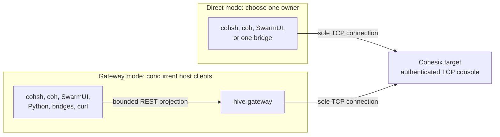

<!-- Copyright © 2026 Lukas Bower -->
<!-- SPDX-License-Identifier: Apache-2.0 -->
<!-- Purpose: Catalog Cohesix host tools and define their safe composition rules. -->
<!-- Author: Lukas Bower -->
# Cohesix Host Tools

Cohesix keeps CUDA, NVML, container integrations, REST, desktop UI, packaging,
and automation on the host. Host tools may perform local work, but every target
read or mutation remains a projection of the documented console and Secure9P
semantics. They do not create new in-target listeners or authority paths.

This document owns the host-tool catalog and composition rules. Command grammar
belongs in [USERLAND_AND_CLI.md](USERLAND_AND_CLI.md), REST behavior in
[API_GUIDELINES.md](API_GUIDELINES.md), and the runnable live sequence in
[OPERATOR_WALKTHROUGH.md](OPERATOR_WALKTHROUGH.md). Task-oriented evidence,
mount, ticket, federation, lifecycle, and PEFT procedures live in
[OPERATOR_RECIPES.md](OPERATOR_RECIPES.md).

See the [Glossary](GLOSSARY.md) for Cohesix-specific role, namespace, and
evidence terms.

## Generated integration truth

`coh-rtc` compiles
[`configs/host_integration_acceptance.toml`](../configs/host_integration_acceptance.toml)
into the exact
[`host-integration-dependency/v1`](../configs/generated/host_integration_dependency.json)
graph. The generated [support table](snippets/host_integration_dependency.md)
binds each advertised host binary, library API, use case, and built-in Python
playbook to its required mode, package, evidence lane, and acceptance owner.
Executable-Worker proof, provider availability, package presence, mock or
dry-run success, and use-case promotion are independent states.

Target scheduling and service-compartment details are intentionally absent
from this catalogue because they do not change host-tool composition. Host
tools consume the stable console, namespace, REST, and generated target-profile
contracts. Use [Roles and Scheduling](ROLES_AND_SCHEDULING.md) for target
temporal policy, [API Guidelines](API_GUIDELINES.md) for REST deadline and
refusal semantics, and [Benchmarking](BENCHMARKS.md) for backend proof classes.
## Choose one live topology

The target TCP console is single-client. Use direct mode for one foreground tool or
gateway mode when tools must operate concurrently.



The two incoming TCP arrows are alternatives, not concurrent paths.

### Composition rules

| Mode | Console owner | Safe clients | Important constraint |
| --- | --- | --- | --- |
| Direct TCP | One direct tool | Only that process | A continuous publisher holds the console; stop it before starting another direct client. |
| Gateway | `hive-gateway` | Multiple REST-capable tools | Writes require gateway request authentication and still use the gateway's upstream role/ticket. |
| In-memory mock | The selected Rust executable | That process only | State is not shared across executables and is not live-system evidence. |
| Python `MockBackend` | A local filesystem root | Processes selecting the same root | State can persist and be shared locally, but it is not live-system evidence. |
| Mounted filesystem | `coh mount` over direct TCP or REST | Filesystem consumers | The mount is foreground; only one REST mount lock is allowed per gateway URL. |

Do not start a direct `cohsh` session while a direct `--watch` or
`--interval-ms` publisher is running. Point both at `hive-gateway` instead.

## Authentication layers

| Layer | Configuration | What it proves |
| --- | --- | --- |
| TCP console authentication | `COH_AUTH_TOKEN` or tool-specific equivalent | Access to the target console listener |
| Upstream attach | Gateway/direct-tool role plus optional capability ticket | Target namespace identity, scope, budget, and subject |
| Gateway request authentication | `HIVE_GATEWAY_REQUEST_AUTH_TOKEN`, `COH_REST_AUTH_TOKEN`, or tool-specific equivalent | Permission to call the host HTTP write edge |
| Target policy and lifecycle | Manifest rules and current target state | Whether the requested operation is allowed now |

Gateway request authentication is not delegated target identity. Every REST client
inherits the role and optional ticket with which the gateway attached upstream.
The target remains authoritative for ticket, policy, lifecycle, path, and quota
checks.

Keep the gateway bound to loopback unless an explicitly secured deployment
requires otherwise. The console and gateway do not provide transport-layer TLS;
use an authenticated tunnel, VPN, or TLS-terminating reverse proxy for remote
access.

## Tool catalog

The source commands below use `cargo run -p <package> -- ...`. Release bundles
provide the corresponding executable under `bin/`. Run each executable with
`--help` for the authoritative option list compiled into that build.

### `cohsh`

Interactive and scripted operator shell. It supports direct TCP, REST, QEMU,
and in-process mock transports; performs role attachment; and implements the
command and `.coh` grammar defined in
[USERLAND_AND_CLI.md](USERLAND_AND_CLI.md).

```bash
cargo run -p cohsh -- --help
```

Use direct TCP only when `cohsh` is the sole console owner. For concurrent use,
select `--transport rest` and a running gateway. The current REST transport
accepts only the local `queen` role and still inherits the gateway's upstream
role and optional ticket. The default REST filesystem-operation response window
is 130,000 ms for the canonical 120,000/120,000 ms gateway broker profile. Use
`--rest-response-timeout-ms` or `COHSH_REST_RESPONSE_TIMEOUT_MS` only when the
gateway declares a different profile; the value must be at least
`5,000 + max(control, telemetry) + 5,000` milliseconds.

Direct-TCP `CAT` preserves ordinary lines up to 256 bytes unchanged. A longer
canonical JSON line uses the existing response stream and the exact versioned
wire form `C1:<seq4hex>:<count4hex>:<full_sha256>:<utf8_payload>`. Sequence and
count are four lowercase hexadecimal digits, sequence starts at zero and is
contiguous, count is in `1..=64`, every wire line remains at most 256 bytes,
and every chunk repeats the full lowercase SHA-256 of the reconstructed line.
The reconstructed line is bounded to 2,048 bytes. `cohsh` reassembles this
format before returning `CAT` output and rejects partial, reordered, replayed,
mixed-digest, oversized, or noncanonical groups. This does not add a verb,
path, authority, or larger global console-output queue.

### `coh`

Host integration CLI with these command families:

| Command | Purpose |
| --- | --- |
| `doctor` | Validate local policy/ticket, mount, GPU, and runtime prerequisites. |
| `mount` | Mount the allowed namespace through FUSE. |
| `gpu` | List GPUs and manage GPU leases. |
| `peft` | Export, import, activate, and roll back PEFT adapters. |
| `run` | Run a host command after lease validation and record bounded breadcrumbs. |
| `telemetry pull` | Export Queen telemetry to a local directory. |
| `fleet` | Read status, lease summaries, or pressure from multiple REST gateways. |
| `evidence pack` | Export a deterministic evidence directory. |
| `evidence timeline` | Build NDJSON and Markdown timelines from an evidence pack. |

```bash
cargo run -p coh -- --help
cargo run -p coh -- doctor --help
```

The evidence-pack inventory, redaction behavior, missing-path semantics, and
offline CI/SIEM contract are defined in
[OPERATOR_RECIPES.md#evidence-packs-ci-and-siem](OPERATOR_RECIPES.md#evidence-packs-ci-and-siem).

`coh mount` remains in the foreground. Create the mount point first, keep the
mount process in its own terminal, and use the host's normal FUSE unmount
procedure before terminating it. Generated policy and doctor behavior are in
[snippets/coh_policy.md](snippets/coh_policy.md) and
[snippets/coh_doctor_checks.md](snippets/coh_doctor_checks.md). Verified macOS,
Linux, REST, and direct-mode mount procedures are in
[OPERATOR_RECIPES.md#mounted-namespace-with-fuse](OPERATOR_RECIPES.md#mounted-namespace-with-fuse).

### `hive-gateway`

Host-only REST multiplexer. It owns the one target TCP console connection and
projects `LS`, `CAT`, `TAIL`, and `ECHO`, plus bounded metadata endpoints.

```bash
cargo run -p hive-gateway -- --help
```

Non-mock startup requires both a non-placeholder TCP console token and a
non-placeholder request-auth token. The default bind is `127.0.0.1:8080`;
non-loopback binds require an explicit opt-in. See
[API_GUIDELINES.md](API_GUIDELINES.md) for endpoint, status, and compatibility
rules.

### `gpu-bridge-host`

Discovers host GPUs through the compiled backend, builds the `/gpu` snapshot,
and optionally publishes it through `/gpu/bridge/ctl`.

```bash
# Local inventory only; no target mutation.
cargo run -p gpu-bridge-host -- --list

# One REST publish from a real registry; exits after the snapshot is sent.
cargo run -p gpu-bridge-host -- --registry "$COH_GPU_REGISTRY" \
  --publish --rest-url "$COH_REST_URL"
```

`--list` does not publish. `--publish` without `--interval-ms` is one-shot;
adding an interval runs continuously. A continuous direct-TCP publisher owns
the console for its lifetime. Live publication resolves and rejects placeholder
TCP or REST credentials before opening a connection/request. A missing registry
publishes explicit empty/unavailable state; an invalid registry fails. There is
no demo-catalog or first-active-model fallback. `--mock` selects deterministic
fixture inventory and carries `source_mode=fixture`; the operational target
rejects it, and it cannot satisfy integration, release, attestation, or use-case
evidence.

### `host-sidecar-bridge`

Projects selected host providers into `/host`. Supported provider selectors are
`systemd`, `k8s`, `docker`, `nvidia`, `jetson`, and `net`.

```bash
# One provider collection through the gateway.
cargo run -p host-sidecar-bridge -- \
  --rest-url "$COH_REST_URL" --provider net

# Continuous gateway-backed publication for a scheduled provider.
cargo run -p host-sidecar-bridge -- \
  --rest-url "$COH_REST_URL" --provider docker --watch
```

Provider availability is host-dependent. Failures are published as bounded
unknown/error state where the provider contract permits; they do not authorize
host control. Watch scheduling supports `systemd`, `docker`, `k8s`, and
`nvidia`; `net` and `jetson` are one-shot providers. In direct `--watch` mode
the bridge is the sole TCP owner.

### `host-ticket-agent`

Consumes manifest-enabled host control tickets, validates their lifecycle and
scope, executes supported host actions, records status, and resumes from a
bounded cursor. Optional federation relay behavior is defined entirely by the
resolved manifest; `--relay` does not invent peers or delegated authority.

```bash
cargo run -p host-ticket-agent -- --help
cargo run -p host-ticket-agent -- --rest-url "$COH_REST_URL" --run-once
```

Use a dedicated cursor and relay WAL per deployment. Do not share state files
between concurrently running agents. Ticket schemas and status paths are
defined with the manifest-gated namespaces in
[INTERFACES.md#host-tickets-and-federation](INTERFACES.md#host-tickets-and-federation).
Runnable local and federated examples are in
[OPERATOR_RECIPES.md#host-tickets-and-federation](OPERATOR_RECIPES.md#host-tickets-and-federation).

### `cas-tool`

Packages signed or unsigned content-addressed bundles locally and uploads a
prepared bundle through direct TCP or REST.

```bash
cargo run -p cas-tool -- pack --help
cargo run -p cas-tool -- upload --help
```

`pack` writes a manifest and chunks; it does not contact the target. `upload`
appends the bundle through the documented CAS control paths and is subject to
request authentication, target authority, bounds, and update policy. CAS schemas
are in [INTERFACES.md#cas-updates](INTERFACES.md#cas-updates).

Manifest-v1 uses the shared maximum of eight chunks. With the
default generated template's 128-byte chunks, the largest structurally
eligible payload is therefore 1,024 bytes. The generated JSON template exposes
that host-tool projection as `limits.max_chunks = 8` and
`limits.max_payload_bytes = 1024`; `limits` is tooling metadata and is not an
additional CBOR manifest-v1 wire field. A legacy template without `limits`
falls back to the shared eight-chunk maximum. When `limits` is present,
`max_chunks` must equal the shared maximum exactly and `max_payload_bytes` must
equal `chunk_bytes * max_chunks`; a smaller or larger declaration is rejected
as contract drift. `--chunk-bytes` is only an explicit confirmation and must
equal the selected template's `chunk_bytes`.

`pack` rejects an over-limit payload before writing a bundle. `upload` decodes
and validates a prepared manifest before reading its chunks or opening a TCP or
REST connection, so a legacy or foreign bundle with more than eight chunks is
also a local zero-network failure. This preflight proves only manifest
eligibility. An otherwise valid bundle can still receive the target's typed
`buffer-full` refusal when other chunks or models consume the independent
global CAS store capacity; clients must preserve that refusal and must not
retry, truncate, or silently relabel the payload.

### SwarmUI

SwarmUI is the host desktop application for bounded telemetry, replay, status,
and the shared operator console. Read-only panels and Live Hive rendering do
not add protocol verbs; the embedded console can issue the same authorized
commands as `cohsh`.

```bash
cargo run -p swarmui -- --help
```

| `SWARMUI_TRANSPORT` | Use |
| --- | --- |
| `console` or `tcp` | Direct console mode; SwarmUI is the sole TCP owner. |
| `rest` or `gateway` | Concurrent mode through `hive-gateway`. |
| `9p` or `secure9p` | A documented host-side Secure9P endpoint; never an extra in-target listener. |

For gateway mode, set `SWARMUI_REST_URL` or `COH_REST_URL`. Write auth resolves
from `SWARMUI_REST_AUTH_TOKEN`, `HIVE_GATEWAY_REQUEST_AUTH_TOKEN`,
`COHSH_REST_AUTH_TOKEN`, or `COH_REST_AUTH_TOKEN`. Generated display and cache
defaults are in [snippets/swarmui_defaults.md](snippets/swarmui_defaults.md).

### Cohesix Python package

The Python package supplies filesystem, direct TCP, REST, and deterministic
mock backends plus typed orchestration helpers. Its installation, API, and
backend rules are owned by [PYTHON_SUPPORT.md](PYTHON_SUPPORT.md).

## Common environment variables

| Variable | Consumer | Meaning |
| --- | --- | --- |
| `COH_TCP_HOST`, `COH_TCP_PORT` | Gateway and selected host tools | Target TCP console endpoint |
| `COH_AUTH_TOKEN`, `COHSH_AUTH_TOKEN` | Direct tools and gateway | TCP console authentication |
| `COH_ROLE`, `COH_TICKET` | Gateway and selected tools | Upstream role and optional ticket |
| `COH_REST_URL`, `COHSH_REST_URL`, `HIVE_GATEWAY_URL` | REST-capable clients | Gateway base URL |
| `HIVE_GATEWAY_REQUEST_AUTH_TOKEN`, `COH_REST_AUTH_TOKEN`, `COHSH_REST_AUTH_TOKEN` | Gateway and REST clients | HTTP mutation authentication |

Not every executable accepts every alias; its `--help` and the tool-specific
sections above are authoritative. Prefer deployment-scoped environment files or
a secret manager with restrictive permissions. Never commit a populated secret
file.

## Operational checks

Before adding a tool to a live topology:

1. Confirm whether it uses direct TCP, REST, a mount, or only local files.
2. Confirm the gateway's upstream role/ticket is sufficient for any REST write.
3. Confirm the active manifest exposes the required path and feature gate.
4. Use `/v1/meta/bounds` or generated client policy for request sizing.
5. Check [FAILURE_MODES.md](FAILURE_MODES.md) before retrying a failed mutation.

The full, ordered example is in
[OPERATOR_WALKTHROUGH.md](OPERATOR_WALKTHROUGH.md). Start there for a new live
deployment; use [OPERATOR_RECIPES.md](OPERATOR_RECIPES.md) only after that
topology is healthy.
