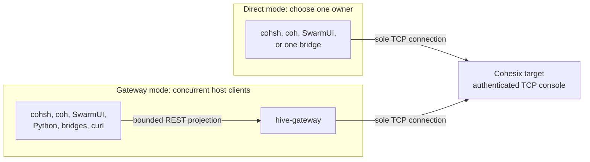

<!-- Copyright © 2026 Lukas Bower -->
<!-- SPDX-License-Identifier: Apache-2.0 -->
<!-- Purpose: Catalog Cohesix host tools and define their safe composition rules. -->
<!-- Author: Lukas Bower -->
# Cohesix Host Tools

Cohesix keeps CUDA, NVML, container integrations, REST, desktop UI, packaging,
and automation on the host. Host tools may perform local work, but every target
read or mutation remains a projection of the documented console and Secure9P
semantics. They do not create new in-target listeners or authority paths.

This document owns the host-tool catalog and composition rules. Command grammar
belongs in [USERLAND_AND_CLI.md](USERLAND_AND_CLI.md), REST behavior in
[API_GUIDELINES.md](API_GUIDELINES.md), and the runnable live sequence in
[OPERATOR_WALKTHROUGH.md](OPERATOR_WALKTHROUGH.md). Task-oriented evidence,
mount, ticket, federation, lifecycle, and PEFT procedures live in
[OPERATOR_RECIPES.md](OPERATOR_RECIPES.md).

See the [Glossary](GLOSSARY.md) for Cohesix-specific role, namespace, and
evidence terms.

## Generated integration truth

`coh-rtc` compiles
[`configs/host_integration_acceptance.toml`](../configs/host_integration_acceptance.toml)
into the exact
[`host-integration-dependency/v1`](../configs/generated/host_integration_dependency.json)
graph. The generated [support table](snippets/host_integration_dependency.md)
binds each advertised host binary, library API, use case, and built-in Python
playbook to its required mode, package, evidence lane, and acceptance owner.
Executable-Worker proof, provider availability, package presence, mock or
dry-run success, and use-case promotion are independent states.

Target scheduling and service-compartment details are intentionally absent
from this catalogue because they do not change host-tool composition. Host
tools consume the stable console, namespace, REST, and generated target-profile
contracts. Use [Roles and Scheduling](ROLES_AND_SCHEDULING.md) for target
temporal policy, [API Guidelines](API_GUIDELINES.md) for REST deadline and
refusal semantics, and [Benchmarking](BENCHMARKS.md) for backend proof classes.

The Pi-only GENET-to-console direct data plane is a private target transport
change. Its optional causal diagnostic adds seventeen ordered
`netstats: genet_direct*` rows without changing a command, listener, authentication,
namespace, REST request/response, library API, workload, or report schema. The
captured Pi-wired `cohsh` fixture includes the seventeen rows, including the raw
receive-boundary notification discriminator and the v6 maximum-slice counter
timestamps, including Signal entry/return and RX retirement, direction/cursor
and optional TCP header tuple. The Pi trace
normalizer classifies them as wired-driver evidence before generic network
records and keeps legacy captures without them parseable. Network-state and
TCP-authentication summaries explicitly exclude these observational rows: the
packet tuple's `src=` must not replace canonical `NET_ADDR_SRC`, and component
flags must not replace `NET_ACTIVE` or manufacture authentication proof. Partial
batches remain individual observational rows. Parsing does not assert batch
completeness or promote a partial capture to complete causal evidence. The
one-shot DGHO refresh may
wake the owner and enable its normal idle RX service, so neither the normalized
rows nor their before/after delta is passive performance or acceptance proof.

The exact-d7fab follow-up under
`m26e-driver-runtime-mcs-port-and-cyw43-coexistence` and
`m26e-console-network-service-isolation` also advances existing copied WiFi
NetData RX admission through every legal observable HAL transition. These changes
preserve the console grammar and framing, AUTH/ATTACH and terminal semantics,
Secure9P namespaces, role/ticket/cursor bounds, REST endpoints and deadlines,
generated profiles, and physical-driver authority. The separately versioned
GENET diagnostic advances from v5 to v6 while retaining its 320-byte extent,
128-byte maximum-slice receipt and commit offset. Three formerly reserved words
now distinguish peer Signal entry/return and RX retirement. It is decoded only by
the paired target runtime and root reader, not by a host binary or Python API.
Its timestamps measure elapsed counter intervals, not CPU use or packet arrival.

The affected host surfaces are
[`pi4_trace_normalize.py`](../scripts/pi4_trace_normalize.py), its
[legacy/current/partial diagnostic fixtures](../tests/test_pi4_trace_normalize.py),
and the [Pi-wired cohsh fixture](../apps/cohsh/tests/tcp_cli_script.rs). The
normalizer retains legacy eleven-row and sixteen-row captures and current
seventeen-row captures without assigning acceptance authority to any version.
The new final `genet_direct_slice_rx` row reports `notify_due`,
`signal_enter_ticks`, `signal_return_ticks` and `retired_ticks`; absent samples
are zero and the existing presence mask distinguishes absent or empty evidence.
The `cohsh` fixture verifies all seventeen diagnostic rows within the unchanged
terminal-delimited response.
No production `cohsh` transport change is required.

The complete implementations of `coh`, `cohsh`, `coh-status`, Hive Gateway/REST,
SwarmUI, `gpu-bridge-host`, `host-ticket-agent`, `host-sidecar-bridge`, sidecar
bus, CAS tooling and `console-ack-wire` were reviewed and require no further
compatibility change. The same review covers all `tools/cohesix-py` filesystem,
TCP, REST and mock backends, typed helpers and playbooks; generated-profile and
`coh-rtc` consumers; every `.coh` workload; Pi serial/gate helpers and driver
model comparison; the M26e QEMU pressure runner; REST benchmark workloads,
measurement arithmetic, evidence predicates and report readers. None requires
an implementation, generated-output, workload or schema change for this batch.
In particular, the existing explicit Pi gateway profile, canonical READY census,
TAIL cursor accounting, pool/backpressure bounds, retries and timeouts remain
unchanged. GENET diagnostic rows do not replace the harness's exact boot/handoff,
authentication, Worker or pressure proofs. Host compatibility and a QEMU canary
do not establish improvement on the next physical Pi image.

The Pi gate
wrapper now preflights the canonical authenticated peer, selects only its
command-bound exact DHCP lease on the required WiFi or GENET lane, starts that
peer after a nonzero `nettest` admission, and still requires an exact
same-generation target terminal after the bounded observation window.
`pi4_serial_reboot.py` requires the clean staged
identity sidecar and exact sealed marker, validates the exact current bound
WiFi or wired address and its host route (`en0` for WiFi, canonical
`192.168.10.1/24` on `en8` for GENET) plus canonical `cohsh`, Queen manifest, and
`boot_v0.coh` inputs before acquiring the UART. Both controlled live paths reuse
one asynchronous authenticated peer only after the target admits a nonzero
nettest run generation. The Queen secret is passed only in the child
environment and is
redacted from the serial transcript; the generation-matched target terminal
remains authoritative and any invalid address, peer failure, or incomplete
terminal fails closed. The helper also takes two activity samples, and the REST
performance harness accepts only terminal `OK AUTH`. These are bounded host
evidence-truth changes, not wire, workload, or report-schema changes. The
focused `cohsh` capture fixture and Pi trace-normalizer/helper tests change;
`coh`, `coh-status`, Hive Gateway/REST, SwarmUI, the remaining host tools,
`tools/cohesix-py`, generated-profile consumers, `.coh` workloads, benchmark
arithmetic, and report schemas were reviewed and require no implementation
change. Pi build selection and generated private ABI/resource records remain
unchanged. A fresh physical benchmark is still the only Pi performance
authority.

The post-069 productive-micro-unit candidate is likewise private to Pi target
scheduling. Direct GENET's command quiesce and exact response-control release,
copied WiFi's one-shot transient publication credit, and the bounded causal
MCS accumulators change no console command, TCP/REST framing, namespace,
authentication, generated manifest/profile contract, Python API, `.coh`
grammar, benchmark workload, arithmetic, evidence record, or report schema.
Pi `netstats` adds six fast-path rows (`cyw43_publication`,
`cyw43_publication_cut`, `cyw43_productive_window`, `genet_compact`,
`genet_compose`, and `genet_defer`)
plus five isolated-seam rows only when that timing snapshot is available. The detailed
27-row composer/Yield/idle-fence batch is intentionally restricted to explicit `smp mcs`;
it is not appended to ordinary `netstats`. Existing key/prefix-based consumers
ignore these unknown additive rows unless they are later taught to consume
them; no current parser derives readiness, quarantine, throughput, latency, or
acceptance from their presence. `cyw43_productive_window` is diagnostic-only:
its exact-identity `opened`, `idle_admitted`, and `closed` counters and additive
`ready_rechecks` count grant no refill, retry, network readiness, or device
authority. Every aggregate compact Deferred increments
exactly one `genet_defer` reason counter, so the reason-counter sum equals the
aggregate `genet_compact deferred` count; `compose_open` represents typed
`NotSealed`. The row is classification only, not a retry or admission signal.
The Pi-only accounting writes and runtime rows are absent from the QEMU
release hot path and output. A future consumer must
add bounded-row and missing/invalid-evidence fixtures rather than treating row
absence as success.

The root/SDIO independent-generation repair changes only private Pi runtime
identity validation. Its five additive `mcs_idle*` rows sample existing root
idle predicates; they do not change those predicates or grant acceptance.
The normalizer's passive-component fixture verifies that these rows neither
replace network selection nor manufacture TCP/nettest readiness. Review of
the complete host-tool and Python-library catalogue, generated contracts,
`.coh` workloads, pressure/benchmark scripts and report readers finds no
other affected wire field, parser requirement, public API or report schema.

The complete `coh`, `cohsh`, `coh-status`, Hive Gateway/REST, SwarmUI, GPU
bridge, host-ticket agent, sidecar and sidecar bus, CAS tooling, Pi gate and
serial helpers, trace normalization, `tools/cohesix-py`, generated-contract
consumers, every `.coh` script, the M26e pressure runner, benchmark workloads,
and report readers were reviewed for this candidate. None needs a behavior,
fixture, generated-output, workload, or schema change. Targeted host and QEMU
checks can reject shared regressions, but the 069 observations remain
historical convergence input and only a fresh exact-candidate Pi benchmark can
establish WiFi or GENET performance.

The finite GENET ownership-boundary IRQ rearm, attached-CYW43 distinct-phase
composition, Wi-Fi-bootstrap USB/serial/display fairness, and physical-Pi MCS
HDMI finite-frame lane are private target scheduling and driver-lifetime
changes. They add no command, wire field, namespace, Python API, workload, or
report field. The bounded
`[smp] driver v=1 part=...` rows are an operator-only projection; trace and
benchmark tooling continues to consume the unchanged canonical
`DRIVER_TASK_COUNTER` boot/qlog record. The generated profile contracts,
`coh-rtc` outputs, Pi manifest/resource allocation, `tools/cohesix-py`, and
benchmark scripts therefore require no change. Host tests can validate those
bounds and parsing invariants, but only a fresh exact-image Pi run can establish
GENET IRQ progress, Wi-Fi/USB/HDMI latency, TCP/script success, or performance.

The physical-Pi MCS queue-only NetData op8 root episode changes only private
HAL admission and stable-terminal retirement. Review of `coh`, `cohsh`,
`coh-status`, Hive Gateway/REST, SwarmUI, GPU/sidecar bridges, host-ticket agent,
CAS tools, Pi gate/serial helpers and trace normalization finds no exposed
field or behavior contract requiring a host change. `tools/cohesix-py`,
generated-contract consumers, `.coh` scripts, the REST/performance harnesses
and report readers keep their existing APIs, framing, workloads and schemas.
Existing RX timing receipts and unchanged raw/pressure workloads measure the
candidate; no host pacing, retries or acceptance thresholds are adjusted.

The Pi HDMI early startup tile now adds one fixed child-rendered progress line
within the existing admitted safe-area raster. It changes no console frame,
command, namespace, authentication rule, generated contract, host API,
diagnostic row, or report schema. The complete host-tool suite,
`tools/cohesix-py`, `.coh` workloads, serial/Pi helpers, performance harnesses,
and report readers therefore require no behavior or fixture change. Focused
runtime tests and exact target compilation can reject the tile implementation;
only the physical display can prove that both lines are visible before serial
cutover and are replaced cleanly by the first ordinary frame.

## Choose one live topology

The target TCP console is single-client. Use direct mode for one foreground tool or
gateway mode when tools must operate concurrently.



The two incoming TCP arrows are alternatives, not concurrent paths.

### Composition rules

| Mode | Console owner | Safe clients | Important constraint |
| --- | --- | --- | --- |
| Direct TCP | One direct tool | Only that process | A continuous publisher holds the console; stop it before starting another direct client. |
| Gateway | `hive-gateway` | Multiple REST-capable tools | Writes require gateway request authentication and still use the gateway's upstream role/ticket. |
| In-memory mock | The selected Rust executable | That process only | State is not shared across executables and is not live-system evidence. |
| Python `MockBackend` | A local filesystem root | Processes selecting the same root | State can persist and be shared locally, but it is not live-system evidence. |
| Mounted filesystem | `coh mount` over direct TCP or REST | Filesystem consumers | The mount is foreground; only one REST mount lock is allowed per gateway URL. |

Do not start a direct `cohsh` session while a direct `--watch` or
`--interval-ms` publisher is running. Point both at `hive-gateway` instead.

## Authentication layers

| Layer | Configuration | What it proves |
| --- | --- | --- |
| TCP console authentication | `COH_AUTH_TOKEN` or tool-specific equivalent | Access to the target console listener |
| Upstream attach | Gateway/direct-tool role plus optional capability ticket | Target namespace identity, scope, budget, and subject |
| Gateway request authentication | `HIVE_GATEWAY_REQUEST_AUTH_TOKEN`, `COH_REST_AUTH_TOKEN`, or tool-specific equivalent | Permission to call the host HTTP write edge |
| Target policy and lifecycle | Manifest rules and current target state | Whether the requested operation is allowed now |

Gateway request authentication is not delegated target identity. Every REST client
inherits the role and optional ticket with which the gateway attached upstream.
The target remains authoritative for ticket, policy, lifecycle, path, and quota
checks.

Keep the gateway bound to loopback unless an explicitly secured deployment
requires otherwise. The console and gateway do not provide transport-layer TLS;
use an authenticated tunnel, VPN, or TLS-terminating reverse proxy for remote
access.

## Release factory

Milestone 26e release creation uses the primary source host for the pinned QEMU
and Pi build inputs, and one explicitly selected remote Linux ARM64 builder for
Linux host binaries and final Linux archive compression. The remote host must be
prepared in advance; the release path does not install packages, add apt
repositories, or infer a builder from a machine name. This is especially
important on Jetson systems, where generic desktop NVIDIA development packages
can conflict with the board-managed runtime.

First validate the compiler-selected QEMU inputs, Python package, macOS host
tools, and exact canonical Pi SD stage without mutating a release:

```bash
scripts/release_bundle.sh --check-manifest \
  --pi4-stage-dir <local-pi4-stage>
```

To create peer MacOS, Linux, and Pi4 bundles, provide every
environment-specific builder and output location explicitly:

```bash
scripts/release_bundle.sh \
  --name <release-name> \
  --version <inventory-version> \
  --force \
  --linux \
  --pi4-stage-dir <local-pi4-stage> \
  --linux-builder-host <host> \
  --linux-builder-user <user> \
  --linux-builder-build-dir <remote-build-root> \
  --linux-builder-release-dir <remote-release-root> \
  --linux-builder-cargo <remote-cargo-path> \
  --linux-builder-cargo-home <remote-cargo-cache> \
  --linux-builder-max-glibc <major.minor> \
  --linux-host-tools-dir <local-linux-tools-dir> \
  --linux-host-tools-manifest <local-provenance-json>
```

Add `--linux-builder-key <path>` only when normal SSH agent/config
authentication is insufficient. An NVMe-backed builder is selected by passing
NVMe-backed build and release roots; no NVMe, host, user, home, cargo, or key
location is embedded in either release script.

The compiler inventory names every file under the accepted Pi SD stage. The
release gate verifies the primary/fallback sealed image pair and its current
source identity, rejects stage-set drift, and builds a separate peer
`<release-name>-Pi4/` folder and archive beside `<release-name>-MacOS/` and
`<release-name>-linux/`. The Pi bundle contains a compact raw MBR/FAT32 image,
its SHA-256 sidecar, layout/provenance metadata, release documentation, and its
own exact manifest. Image capacity is derived from the selected payload rather
than from a physical card. The metadata records `minimum_target_bytes`; the
image works on any SD card at least that large, with additional card capacity
left unallocated and no filesystem expansion required for boot. This is a
flash payload and build/provenance artifact, not whole-media readback or Pi
hardware acceptance; follow
[HARDWARE_BRINGUP.md](HARDWARE_BRINGUP.md) for destructive media operations and
fresh physical proof.

## Tool catalog

The source commands below use `cargo run -p <package> -- ...`. Release bundles
provide the corresponding executable under `bin/`. Run each executable with
`--help` for the authoritative option list compiled into that build.

### `cohsh`

Interactive and scripted operator shell. It supports direct TCP, REST, QEMU,
and in-process mock transports; performs role attachment; and implements the
command and `.coh` grammar defined in
[USERLAND_AND_CLI.md](USERLAND_AND_CLI.md).

```bash
cargo run -p cohsh -- --help
```

Use direct TCP only when `cohsh` is the sole console owner. For concurrent use,
select `--transport rest` and a running gateway. The current REST transport
accepts only the local `queen` role and still inherits the gateway's upstream
role and optional ticket. The default REST filesystem-operation response window
is 130,000 ms for the canonical 120,000/120,000 ms gateway broker profile. Use
`--rest-response-timeout-ms` or `COHSH_REST_RESPONSE_TIMEOUT_MS` only when the
gateway declares a different profile; the value must be at least
`5,000 + max(control, telemetry) + 5,000` milliseconds.

Direct-TCP `CAT` preserves ordinary lines up to 256 bytes unchanged. A longer
canonical JSON line uses the existing response stream and the exact versioned
wire form `C1:<seq4hex>:<count4hex>:<full_sha256>:<utf8_payload>`. Sequence and
count are four lowercase hexadecimal digits, sequence starts at zero and is
contiguous, count is in `1..=64`, every wire line remains at most 256 bytes,
and every chunk repeats the full lowercase SHA-256 of the reconstructed line.
The reconstructed line is bounded to 2,048 bytes. `cohsh` reassembles this
format before returning `CAT` output and rejects partial, reordered, replayed,
mixed-digest, oversized, or noncanonical groups. This does not add a verb,
path, authority, or larger global console-output queue.

### `coh`

Host integration CLI with these command families:

| Command | Purpose |
| --- | --- |
| `doctor` | Validate local policy/ticket, mount, GPU, and runtime prerequisites. |
| `mount` | Mount the allowed namespace through FUSE. |
| `gpu` | List GPUs and manage GPU leases. |
| `peft` | Export, import, activate, and roll back PEFT adapters. |
| `run` | Run a host command after lease validation and record bounded breadcrumbs. |
| `telemetry pull` | Export Queen telemetry to a local directory. |
| `fleet` | Read status, lease summaries, or pressure from multiple REST gateways. |
| `evidence pack` | Export a deterministic evidence directory. |
| `evidence timeline` | Build NDJSON and Markdown timelines from an evidence pack. |

```bash
cargo run -p coh -- --help
cargo run -p coh -- doctor --help
```

The evidence-pack inventory, redaction behavior, missing-path semantics, and
offline CI/SIEM contract are defined in
[OPERATOR_RECIPES.md#evidence-packs-ci-and-siem](OPERATOR_RECIPES.md#evidence-packs-ci-and-siem).

`coh mount` remains in the foreground. Create the mount point first, keep the
mount process in its own terminal, and use the host's normal FUSE unmount
procedure before terminating it. Generated policy and doctor behavior are in
[snippets/coh_policy.md](snippets/coh_policy.md) and
[snippets/coh_doctor_checks.md](snippets/coh_doctor_checks.md). Verified macOS,
Linux, REST, and direct-mode mount procedures are in
[OPERATOR_RECIPES.md#mounted-namespace-with-fuse](OPERATOR_RECIPES.md#mounted-namespace-with-fuse).

### `hive-gateway`

Host-only REST multiplexer. It owns the one target TCP console connection and
projects `LS`, `CAT`, `TAIL`, and `ECHO`, plus bounded metadata endpoints.

```bash
cargo run -p hive-gateway -- --help
```

Non-mock startup requires both a non-placeholder TCP console token and a
non-placeholder request-auth token. The default bind is `127.0.0.1:8080`;
non-loopback binds require an explicit opt-in. See
[API_GUIDELINES.md](API_GUIDELINES.md) for endpoint, status, and compatibility
rules.

For a physical Pi gateway, select `--worker-runtime-profile pi4-production`.
The default `qemu-smp-production` preserves the QEMU contract. This option
selects the existing compiler-generated Worker roles, limits and namespace
bounds for `/v1/meta/bounds`; it does not discover or qualify the target.
Pi uses eight shard bits, while the QEMU profile uses six, so the selection
must match the target before structured Worker discovery or REST pressure.

The gateway owns one authenticated target connection and one bounded broker.
It schedules three fixed progress classes over that connection: host-ticket
specification ingress first, receipt/control progress second, and bulk reads or
telemetry third. Each turn remains batch- and queue-bounded; an execution burst
is followed by a control burst and one telemetry batch, so priority cannot
become starvation. `/v1/fs/echo-batch` accepts one through eight same-path
records and preserves an exact outcome per input record. It amortizes the
internal command boundary without creating a retry, alternate target session,
or compatibility path.

### `gpu-bridge-host`

Discovers host GPUs through the compiled backend, builds the `/gpu` snapshot,
and optionally publishes it through `/gpu/bridge/ctl`.

```bash
# Local inventory only; no target mutation.
cargo run -p gpu-bridge-host -- --list

# One REST publish from a real registry; exits after the snapshot is sent.
cargo run -p gpu-bridge-host -- --registry "$COH_GPU_REGISTRY" \
  --publish --rest-url "$COH_REST_URL"
```

`--list` does not publish. `--publish` without `--interval-ms` is one-shot;
adding an interval runs continuously. A continuous direct-TCP publisher owns
the console for its lifetime. Live publication resolves and rejects placeholder
TCP or REST credentials before opening a connection/request. A missing registry
publishes explicit empty/unavailable state; an invalid registry fails. There is
no demo-catalog or first-active-model fallback. `--mock` selects deterministic
fixture inventory and carries `source_mode=fixture`; the operational target
rejects it, and it cannot satisfy integration, release, attestation, or use-case
evidence.

### `host-sidecar-bridge`

Projects selected host providers into `/host`. Supported provider selectors are
`systemd`, `k8s`, `docker`, `nvidia`, `jetson`, and `net`.

```bash
# One provider collection through the gateway.
cargo run -p host-sidecar-bridge -- \
  --rest-url "$COH_REST_URL" --provider net

# Continuous gateway-backed publication for a scheduled provider.
cargo run -p host-sidecar-bridge -- \
  --rest-url "$COH_REST_URL" --provider docker --watch
```

Provider availability is host-dependent. Failures are published as bounded
unknown/error state where the provider contract permits; they do not authorize
host control. Watch scheduling supports `systemd`, `docker`, `k8s`, and
`nvidia`; `net` and `jetson` are one-shot providers. In direct `--watch` mode
the bridge is the sole TCP owner.

### `host-ticket-agent`

Consumes manifest-enabled host control tickets, validates their lifecycle and
scope, executes supported host actions, records status, and resumes from a
bounded cursor. Optional federation relay behavior is defined entirely by the
resolved manifest; `--relay` does not invent peers or delegated authority.

```bash
cargo run -p host-ticket-agent -- --help
cargo run -p host-ticket-agent -- --rest-url "$COH_REST_URL" --run-once
```

Use a dedicated cursor and relay WAL per deployment. Do not share state files
between concurrently running agents. Ticket schemas and status paths are
defined with the manifest-gated namespaces in
[INTERFACES.md#host-tickets-and-federation](INTERFACES.md#host-tickets-and-federation).
Runnable local and federated examples are in
[OPERATOR_RECIPES.md#host-tickets-and-federation](OPERATOR_RECIPES.md#host-tickets-and-federation).

An agent may use up to eight deterministic execution lanes. Ticket identity
selects exactly one lane; each lane has its own cursor and journal, while
provider mutation locks serialize only the provider resource that actually
conflicts. Status transitions are published with bounded ordered batches.
Terminal journal payloads compact only after target publication and durable
cursor advancement; the cumulative admission-sequence fence still rejects
replay after compaction.

### `cas-tool`

Packages signed or unsigned content-addressed bundles locally and uploads a
prepared bundle through direct TCP or REST.

```bash
cargo run -p cas-tool -- pack --help
cargo run -p cas-tool -- upload --help
```

`pack` writes a manifest and chunks; it does not contact the target. `upload`
appends the bundle through the documented CAS control paths and is subject to
request authentication, target authority, bounds, and update policy. CAS schemas
are in [INTERFACES.md#cas-updates](INTERFACES.md#cas-updates).

Manifest-v1 uses the shared maximum of eight chunks. With the
default generated template's 128-byte chunks, the largest structurally
eligible payload is therefore 1,024 bytes. The generated JSON template exposes
that host-tool projection as `limits.max_chunks = 8` and
`limits.max_payload_bytes = 1024`; `limits` is tooling metadata and is not an
additional CBOR manifest-v1 wire field. A legacy template without `limits`
falls back to the shared eight-chunk maximum. When `limits` is present,
`max_chunks` must equal the shared maximum exactly and `max_payload_bytes` must
equal `chunk_bytes * max_chunks`; a smaller or larger declaration is rejected
as contract drift. `--chunk-bytes` is only an explicit confirmation and must
equal the selected template's `chunk_bytes`.

`pack` rejects an over-limit payload before writing a bundle. `upload` decodes
and validates a prepared manifest before reading its chunks or opening a TCP or
REST connection, so a legacy or foreign bundle with more than eight chunks is
also a local zero-network failure. This preflight proves only manifest
eligibility. An otherwise valid bundle can still receive the target's typed
`buffer-full` refusal when other chunks or models consume the independent
global CAS store capacity; clients must preserve that refusal and must not
retry, truncate, or silently relabel the payload.

### SwarmUI

SwarmUI is the host desktop application for bounded telemetry, replay, status,
and the shared operator console. Read-only panels and Live Hive rendering do
not add protocol verbs; the embedded console can issue the same authorized
commands as `cohsh`.

```bash
cargo run -p swarmui -- --help
```

| `SWARMUI_TRANSPORT` | Use |
| --- | --- |
| `console` or `tcp` | Direct console mode; SwarmUI is the sole TCP owner. |
| `rest` or `gateway` | Concurrent mode through `hive-gateway`. |
| `9p` or `secure9p` | A documented host-side Secure9P endpoint; never an extra in-target listener. |

For gateway mode, set `SWARMUI_REST_URL` or `COH_REST_URL`. Write auth resolves
from `SWARMUI_REST_AUTH_TOKEN`, `HIVE_GATEWAY_REQUEST_AUTH_TOKEN`,
`COHSH_REST_AUTH_TOKEN`, or `COH_REST_AUTH_TOKEN`. Generated display and cache
defaults are in [snippets/swarmui_defaults.md](snippets/swarmui_defaults.md).

### Cohesix Python package

The Python package supplies filesystem, direct TCP, REST, and deterministic
mock backends plus typed orchestration helpers. Its installation, API, and
backend rules are owned by [PYTHON_SUPPORT.md](PYTHON_SUPPORT.md).

## Common environment variables

| Variable | Consumer | Meaning |
| --- | --- | --- |
| `COH_TCP_HOST`, `COH_TCP_PORT` | Gateway and selected host tools | Target TCP console endpoint |
| `COH_AUTH_TOKEN`, `COHSH_AUTH_TOKEN` | Direct tools and gateway | TCP console authentication |
| `COH_ROLE`, `COH_TICKET` | Gateway and selected tools | Upstream role and optional ticket |
| `COH_REST_URL`, `COHSH_REST_URL`, `HIVE_GATEWAY_URL` | REST-capable clients | Gateway base URL |
| `HIVE_GATEWAY_REQUEST_AUTH_TOKEN`, `COH_REST_AUTH_TOKEN`, `COHSH_REST_AUTH_TOKEN` | Gateway and REST clients | HTTP mutation authentication |

Not every executable accepts every alias; its `--help` and the tool-specific
sections above are authoritative. Prefer deployment-scoped environment files or
a secret manager with restrictive permissions. Never commit a populated secret
file.

## Operational checks

Before adding a tool to a live topology:

1. Confirm whether it uses direct TCP, REST, a mount, or only local files.
2. Confirm the gateway's upstream role/ticket is sufficient for any REST write.
3. Confirm the active manifest exposes the required path and feature gate.
4. Use `/v1/meta/bounds` or generated client policy for request sizing.
5. Check [FAILURE_MODES.md](FAILURE_MODES.md) before retrying a failed mutation.

The full, ordered example is in
[OPERATOR_WALKTHROUGH.md](OPERATOR_WALKTHROUGH.md). Start there for a new live
deployment; use [OPERATOR_RECIPES.md](OPERATOR_RECIPES.md) only after that
topology is healthy.
