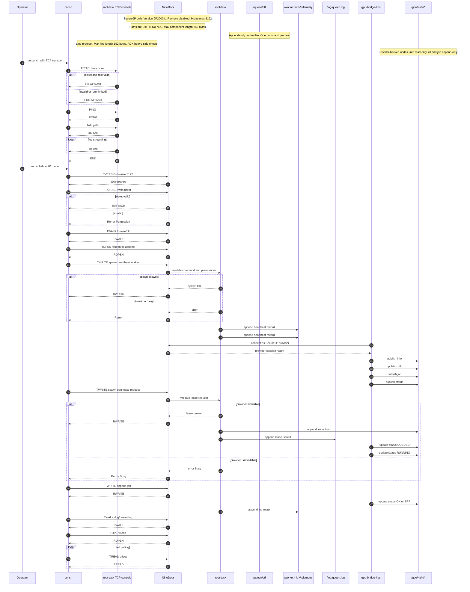

<!-- Copyright © 2025 Lukas Bower -->
<!-- SPDX-License-Identifier: Apache-2.0 -->
<!-- Purpose: Document Cohesix control-plane interfaces, ticket claims, and console flows. -->
<!-- Author: Lukas Bower -->
<!-- Purpose: Canonical interface definitions for NineDoor, queen/worker verbs, GPU bridge files, and telemetry schemas. -->
# Cohesix Interfaces (Queen/Worker, NineDoor, GPU Bridge)

The queen/worker verbs and `/queen/ctl` schema form the hive control API: one Queen instance uses these interfaces to control many workers over the shared Secure9P namespace.

**Figure 1.** Sequence diagram
<!-- INTERFACES.md Sequence Diagram (COMPLETE + white background) -->


## 1. NineDoor 9P Operations
- Supports **9P2000.L** only (`version`, `attach`, `walk`, `open`, `read`, `write`, `clunk`, `stat`, `remove` (disabled)).
- `msize` negotiated ≤ 8192 bytes; larger requests rejected with `Rerror(TooBig)`.
- Fid tables are per-session; `clunk` invalidates handles immediately.
- Path components limited to 255 bytes and must be valid UTF-8 without NULs.
- Batched request frames are permitted when enabled by the manifest (`secure9p.batch_frames`); each response is keyed by its tag and may arrive out-of-order, so clients must match replies by tag instead of FIFO ordering.
- Tag overflow (`secure9p.tags_per_session`) and batch back-pressure return deterministic `Rerror(Invalid)` or `Rerror(Busy)` with stable ordering, preserving prior single-request semantics when batching is disabled.

## 2. Capability Ticket
```rust
pub struct Ticket(pub [u8; 32]);

pub struct TicketClaims {
    pub role: Role,
    pub budget: Budget,
    pub subject: Option<String>,
    pub mounts: MountSpec,
    pub issued_at_ms: u64,
}
```
- Minted by root task, delivered out-of-band during `attach`.
- Encoded using BLAKE3 MAC over claims to prevent tampering.

## 3. Queen Control Surface
Path: `/queen/ctl` (append-only JSON lines)
```json
{"spawn":"heartbeat","ticks":100,"budget":{"ttl_s":120,"ops":500}}
{"kill":"worker-7"}
{"bind":{"from":"/worker","to":"/shadow"}}
{"mount":{"service":"gpu-bridge","at":"/gpu"}}
{"spawn":"gpu","lease":{"gpu_id":"GPU-0","mem_mb":4096,"streams":2,"ttl_s":120}}
```
- Lines must parse as UTF-8 JSON; unknown fields logged and ignored.
- `spawn:"gpu"` queues a lease request for the host GPU bridge; if the bridge is unavailable the command returns `Error::Busy`.
- GPU spawns require the host bridge to publish `/gpu/<id>` entries via `install_gpu_nodes`; lease issuance is mirrored to `/log/queen.log` and `/gpu/<id>/ctl`.
- Optional `priority` fields raise scheduling weight on the host bridge when multiple leases compete.
- Operators typically exercise these verbs via `cohsh`, and any GUI client is expected to speak the same protocol.

## 4. Worker Telemetry
- Path: `/worker/<id>/telemetry` (append-only, newline-delimited records).
- Heartbeat payload: `{"tick":42,"ts_ms":123456789}`.
- GPU payload: `{"job":"jid-9","state":"RUNNING","detail":"scheduled"}` followed by `{"job":"jid-9","state":"OK","detail":"completed"}`.
- Telemetry ring quotas and cursor retention are manifest-governed:
  - `telemetry.ring_bytes_per_worker` caps the per-worker append-only ring.
  - `telemetry.cursor.retain_on_boot` preserves or resets cursor state after reboot.
  - `telemetry.frame_schema` gates legacy plain-text vs CBOR framing.
- GPU telemetry schema (Milestone 6a):
  - Descriptor: `/gpu/telemetry/schema.json` (read-only, versioned)
  - Records must include `schema_version`, `device_id`, `model_id`, `time_window`, `token_count`, `latency_histogram`.
  - Optional fields: `lora_id`, `confidence`, `entropy`, `drift`, `feedback_flags`.
  - Max record size: 4096 bytes; append-only semantics enforced by host bridge before forwarding to `/queen/telemetry/*`.

<!-- coh-rtc:telemetry-cbor:start -->
### Telemetry CBOR Frame v1 (generated)
- Schema: `telemetry-frame/v1`
- Version: `1`
- Encoding: CBOR map (major type 5)

| Field | CBOR type | Required | Description |
| --- | --- | --- | --- |
| `schema` | `text` | `yes` | Schema identifier; must be `telemetry-frame/v1`. |
| `worker_id` | `text` | `yes` | Worker identifier emitting the record. |
| `role` | `text` | `yes` | Worker role label (`worker-heartbeat`, `worker-gpu`). |
| `seq` | `uint` | `yes` | Monotonic frame sequence number. |
| `emitted_ms` | `uint` | `yes` | Unix epoch milliseconds captured by the worker. |
| `payload` | `map` | `yes` | Schema-specific payload map (e.g., heartbeat or GPU job data). |

_Generated by coh-rtc (sha256: `d1906bce668a4d73d95a8262734f1ec04a1480610ebfd9b6c3f3c8ad2e402b7e`)._
<!-- coh-rtc:telemetry-cbor:end -->

## 5. GPU Bridge Files (host-mirrored)
| Path | Mode | Description |
|------|------|-------------|
| `/gpu/<id>/info` | read-only | JSON metadata: vendor, model, memory, SMs, driver/runtime versions |
| `/gpu/<id>/ctl` | append-only | Lease management: `LEASE`, `RELEASE`, `PRIORITY <n>` |
| `/gpu/<id>/job` | append-only | JSON job descriptors (validated hash, grid/block dims, optional `payload_b64`) |
| `/gpu/<id>/status` | read-only append stream | Job lifecycle entries (QUEUED/RUNNING/OK/ERR) |
| `/gpu/models/available/<model_id>/manifest.toml` | read-only | Host-authored model manifests; no uploads from the VM |
| `/gpu/models/active` | append-only pointer | Symlink-like pointer to the active model (atomic swap on host) |
| `/gpu/telemetry/schema.json` | read-only | Versioned schema descriptor (`gpu-telemetry/v1`) with field and size limits |
| `/gpu/telemetry/*` | append-only | Bounded telemetry windows tagged with `model_id` / `lora_id`; forwarded unchanged to `/queen/telemetry/*` and `/queen/export/lora_jobs/*` |

- WorkerGpu must read `/gpu/models/active` before emitting telemetry and propagate the `model_id`/`lora_id` into every record.
- Telemetry writes that exceed `max_record_bytes` or omit required fields are rejected by the host bridge prior to mirroring.

## 6. Host Sidecar Files (`/host`)
| Path | Mode | Description |
|------|------|-------------|
| `/host/systemd/<unit>/status` | append-only | Host-published unit status snapshots (mockable in CI) |
| `/host/systemd/<unit>/restart` | append-only | Control sink for restart requests (queen-only) |
| `/host/k8s/node/<name>/cordon` | append-only | Control sink for cordon requests (queen-only) |
| `/host/k8s/node/<name>/drain` | append-only | Control sink for drain requests (queen-only) |
| `/host/nvidia/gpu/<id>/status` | append-only | Host-published GPU status snapshots |
| `/host/nvidia/gpu/<id>/power_cap` | append-only | Control sink for power-cap changes (queen-only) |
| `/host/nvidia/gpu/<id>/thermal` | append-only | Host-published thermal snapshots |

- `/host` is only mounted when `ecosystem.host.enable = true`; providers are selected from `ecosystem.host.providers[]` and mounted at `ecosystem.host.mount_at`.
- Control writes are append-only; non-queen write attempts return deterministic `Permission` (`EPERM`) errors and emit audit lines that include the ticket and path.
- Audit lines flow through the existing `/log/queen.log` logging path; no new logging protocol is introduced.

## 7. PolicyFS & Actions (`/policy`, `/actions`)
| Path | Mode | Description |
|------|------|-------------|
| `/policy/ctl` | append-only | Policy control JSONL commands (validated UTF-8, manifest-bounded) |
| `/policy/rules` | read-only | Manifest-derived policy rules snapshot |
| `/actions/queue` | append-only | JSONL approvals/denials (`id`, `target`, `decision`) |
| `/actions/<id>/status` | read-only | Status snapshot (`queued` → `consumed`) |

- PolicyFS nodes appear only when `ecosystem.policy.enable = true`.
- Gate approvals are single-use: once an action is consumed, replay attempts return deterministic `EPERM` and append a policy audit line to `/log/queen.log`.
- Rules are authored in `configs/root_task.toml` and emitted verbatim in `/policy/rules` for deterministic inspection.

## 8. AuditFS & ReplayFS (`/audit`, `/replay`)
| Path | Mode | Description |
|------|------|-------------|
| `/audit/journal` | append-only | JSONL audit journal of Cohesix control actions (bounded by manifest) |
| `/audit/decisions` | append-only | Policy approvals/denials (`policy-action`, `policy-gate`) with role/ticket metadata |
| `/audit/export` | read-only | Snapshot of retention bounds (`journal_base`, `journal_next`, `decisions_base`, `decisions_next`) plus replay flags |
| `/replay/ctl` | append-only | Replay command JSON (`{"from":<cursor>}`) |
| `/replay/status` | read-only | Replay status (`idle`/`ok`/`err`) with deterministic `sequence_fnv1a` |

- AuditFS nodes appear only when `ecosystem.audit.enable = true`; ReplayFS nodes require `ecosystem.audit.replay_enable = true`.
- `/audit/journal` and `/replay/ctl` enforce append-only semantics; offset mismatches return deterministic `Invalid` errors and emit audit lines.
- Replay is bounded to the retained audit window and applies only Cohesix-issued control-plane actions; requests outside the window return `ERR` and produce no side effects.

## 9. Root Task RPC (internal trait)
```rust
pub trait RootTaskControl {
    fn spawn(&self, role: Role, spec: WorkerSpec) -> Result<WorkerId, SpawnError>;
    fn kill(&self, id: WorkerId) -> Result<(), KillError>;
    fn bind(&self, session: SessionId, from: &str, to: &str) -> Result<(), NamespaceError>;
    fn mount(&self, session: SessionId, service: &str, at: &str) -> Result<(), NamespaceError>;
}
```
- NineDoor invokes these methods after validating JSON commands and ticket permissions.
- `WorkerSpec` includes budget, initial telemetry seed, and optional GPU lease request.

## 10. CLI (`cohsh`) Protocol
- Client attaches using the queen or worker ticket, negotiates `msize`, then issues 9P ops corresponding to shell commands.
- `tail` uses repeated `read` calls with offset tracking; NineDoor enforces append-only by ignoring provided offsets.
- `bind` and `mount` commands are no-ops for non-queen roles.
- `--transport tcp` connects to the root-task console listener (default `127.0.0.1:31337`) and speaks a Secure9P-style framed protocol:
  - Each console line is encoded as a length-prefixed frame (4-byte little-endian length including the header, followed by the UTF-8 payload).
  - `ATTACH <role> <ticket?>` → `OK ATTACH role=<role>` on success or `ERR ATTACH reason=<cause>` on failure.
  - `TAIL <path>` emits `OK TAIL path=<path>` before newline-delimited log entries; the stream still terminates with `END`.
  - `CAT <path>` emits `OK CAT path=<path> data=<summary>` before newline-delimited contents; the stream still terminates with `END`.
  - `LS <path>` currently returns `ERR LS reason=unsupported path=<path>` until directory listings are exposed.
  - Other verbs (e.g., `LOG`, `ECHO`, `SPAWN`) mirror serial behaviour and return a single acknowledgement before triggering side effects.
- `PING` / `PONG` probes keep sessions alive; the client sends `PING` every 15 seconds of inactivity and expects an immediate
    `PONG` even when the server is mid-stream.
  - The TCP console enforces a maximum line length of 192 bytes and rate-limits failed authentication attempts (3 strikes within
    60 seconds triggers a 90-second cooldown). Oversized frames on authenticated sessions yield
    `ERR FRAME reason=invalid-length` and the session remains open. `cohsh` additionally validates worker tickets locally,
    rejecting whitespace or malformed values so automation does not leak failed attempts over the wire.
- Cohesix ships regression scripts in `.coh` format consumed by `coh> test`; see the canonical spec in [USERLAND_AND_CLI.md](./USERLAND_AND_CLI.md#coh-scripts-coh) for syntax and assertion rules.
- For `dev-virt`, QEMU forwards `127.0.0.1:{31337/tcp,31338/udp,31339/tcp}` to `10.0.2.15` for the console and self-test ports; the virtio-net backend is the default (`net-backend-virtio`), with RTL8139 available as a fallback by removing that feature. Operators generally do not need to care which NIC is active, but the backend label appears in boot logs for diagnostics.
- `cohsh` is the authoritative implementation of this protocol, and the planned WASM GUI is conceptually another client that wraps the same verbs without introducing a new control surface.

## 11. Error Surface
| Error | Meaning |
|-------|---------|
| `Permission` | Role not permitted to access path or mode |
| `NotFound` | Path or worker ID missing |
| `Busy` | Resource in use (GPU lease, worker slot) |
| `Invalid` | JSON parse failure or malformed 9P frame |
| `TooBig` | Frame exceeds negotiated `msize` |
| `Closed` | Fid used after `clunk` or revoked ticket |
| `RateLimited` | Console authentication locked out due to repeated failures |

## 12. Documentation Hooks
- Any new command or file path must be documented here and referenced from `ROLES_AND_SCHEDULING.md` and `BUILD_PLAN.md` before implementation.
