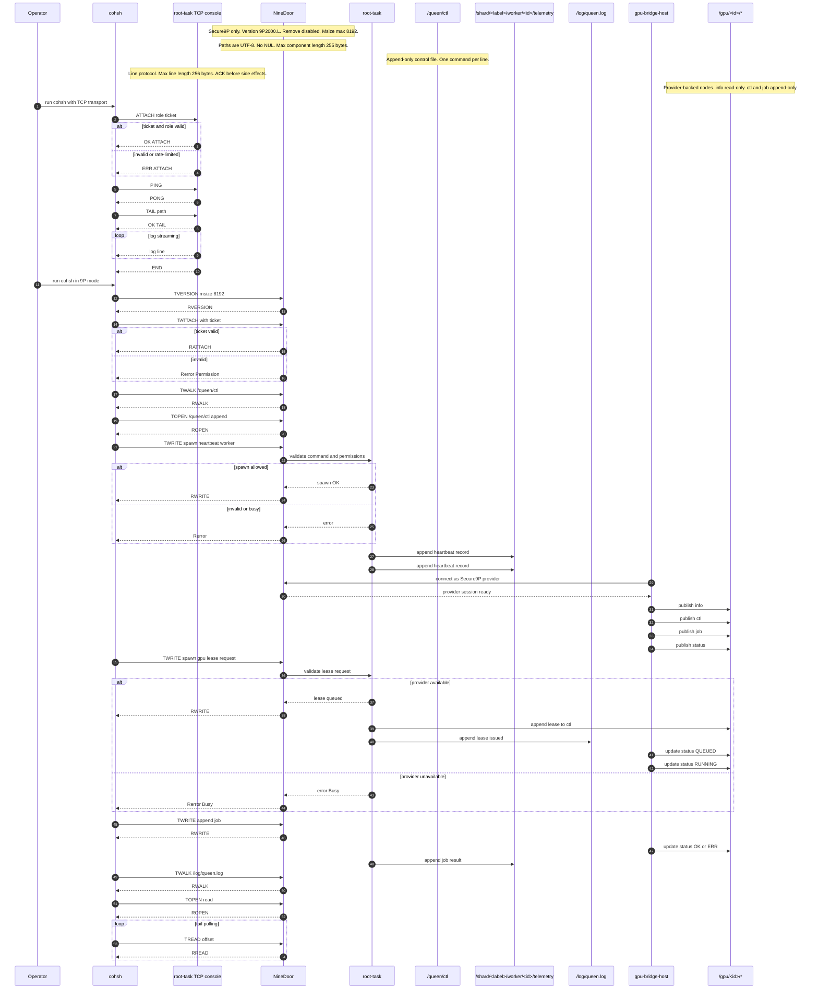

<!-- Copyright © 2025 Lukas Bower -->
<!-- SPDX-License-Identifier: Apache-2.0 -->
<!-- Purpose: Document Cohesix control-plane interfaces, ticket claims, and console flows. -->
<!-- Author: Lukas Bower -->
<!-- Purpose: Canonical interface definitions for NineDoor, queen/worker verbs, GPU bridge files, and telemetry schemas. -->
# Cohesix Interfaces (Queen/Worker, NineDoor, GPU Bridge)

The queen/worker verbs and `/queen/ctl` schema form the hive control API: one Queen instance uses these interfaces to control many workers over the shared Secure9P namespace.

**Figure 1.** Sequence diagram
<!-- INTERFACES.md Sequence Diagram (COMPLETE + white background) -->


## 1. NineDoor 9P Operations
- Supports **9P2000.L** only (`version`, `attach`, `walk`, `open`, `read`, `write`, `clunk`, `stat`, `remove` (disabled)).
- `msize` negotiated ≤ 8192 bytes; larger requests rejected with `Rerror(TooBig)`.
- Fid tables are per-session; `clunk` invalidates handles immediately.
- Path components limited to 255 bytes and must be valid UTF-8 without NULs.
- Batched request frames are permitted when enabled by the manifest (`secure9p.batch_frames`); each response is keyed by its tag and may arrive out-of-order, so clients must match replies by tag instead of FIFO ordering.
- Tag overflow (`secure9p.tags_per_session`) and batch back-pressure return deterministic `Rerror(Invalid)` or `Rerror(Busy)` with stable ordering, preserving prior single-request semantics when batching is disabled.

## 2. Capability Ticket
```rust
pub struct Ticket(pub [u8; 32]);

pub struct TicketClaims {
    pub role: Role,
    pub budget: Budget,
    pub subject: Option<String>,
    pub mounts: MountSpec,
    pub issued_at_ms: u64,
}
```
- Minted by root task, delivered out-of-band during `attach`.
- Encoded using BLAKE3 MAC over claims to prevent tampering.

## 3. Queen Control Surface
Path: `/queen/ctl` (append-only JSON lines)
```json
{"spawn":"heartbeat","ticks":100,"budget":{"ttl_s":120,"ops":500}}
{"kill":"worker-7"}
{"bind":{"from":"/shard","to":"/shadow"}}
{"mount":{"service":"gpu-bridge","at":"/gpu"}}
{"spawn":"gpu","lease":{"gpu_id":"GPU-0","mem_mb":4096,"streams":2,"ttl_s":120}}
```
- Lines must parse as UTF-8 JSON; unknown fields logged and ignored.
- `spawn:"gpu"` queues a lease request for the host GPU bridge; if the bridge is unavailable the command returns `Error::Busy`.
- GPU spawns require the host bridge to publish `/gpu/<id>` entries via `install_gpu_nodes`; lease issuance is mirrored to `/log/queen.log` and `/gpu/<id>/ctl`.
- Optional `priority` fields raise scheduling weight on the host bridge when multiple leases compete.
- Operators typically exercise these verbs via `cohsh`, and any GUI client is expected to speak the same protocol.

## 3a. Node Lifecycle Control
Path: `/queen/lifecycle/ctl` (append-only, queen-only)
```
cordon
drain
resume
quiesce
reset
```
- Commands are single-line tokens; invalid transitions return deterministic `ERR`.
- Every transition appends an audit line to `/log/queen.log`:
  - `lifecycle transition old=<STATE> new=<STATE> reason=<reason>`
- Denials are also logged:
  - `lifecycle denied action=<cmd> state=<STATE> reason=<invalid-transition|outstanding-leases|invalid-command|gate-denied>`
- Lifecycle gates apply to: worker attach, telemetry ingest, worker telemetry, GPU job submission, and host publishes.

### Lifecycle observability (read-only)
- `/proc/lifecycle/state`: `state=<BOOTING|DEGRADED|ONLINE|DRAINING|QUIESCED|OFFLINE>`
- `/proc/lifecycle/reason`: `reason=<text>`
- `/proc/lifecycle/since`: `since_ms=<u64>`

## 4. Worker Telemetry
- Path (canonical): `/shard/<label>/worker/<id>/telemetry` (append-only, newline-delimited records).
- Legacy alias (when enabled): `/worker/<id>/telemetry`.
- Heartbeat payload: `{"tick":42,"ts_ms":123456789}`.
- GPU payload: `{"job":"jid-9","state":"RUNNING","detail":"scheduled"}` followed by `{"job":"jid-9","state":"OK","detail":"completed"}`.
- Telemetry ring quotas and cursor retention are manifest-governed:
  - `telemetry.ring_bytes_per_worker` caps the per-worker append-only ring.
  - `telemetry.cursor.retain_on_boot` preserves or resets cursor state after reboot.
  - `telemetry.frame_schema` gates legacy plain-text vs CBOR framing.
- GPU telemetry schema (Milestone 6a):
  - Descriptor: `/gpu/telemetry/schema.json` (read-only, versioned)
  - Records must include `schema_version`, `device_id`, `model_id`, `time_window`, `token_count`, `latency_histogram`.
  - Optional fields: `lora_id`, `confidence`, `entropy`, `drift`, `feedback_flags`.
  - Max record size: 4096 bytes; append-only semantics enforced by host bridge before forwarding to `/queen/telemetry/*`.

### Queen telemetry ingest (host push)
- Path: `/queen/telemetry/<device_id>/`
  - `ctl` — append-only control log. Accepts JSON lines of the form `{"new":"segment","mime":"text/plain"}`.
  - `seg/` — directory containing OS-named segments (append-only).
  - `latest` — read-only pointer to the newest segment (single line: `<seg_id>`).
- Segment creation is **OS-owned**: clients can only request a new segment via `ctl`; names are assigned `seg-000001`, `seg-000002`, ... per device.
- Segment writes are append-only; offsets must match the end of the file (or use `u64::MAX`). Random writes, truncation, and renames are rejected.
- Quotas are manifest-driven via `telemetry_ingest.*`:
  - `max_segments_per_device`
  - `max_bytes_per_segment`
  - `max_total_bytes_per_device`
  - `eviction_policy` (`refuse` | `evict-oldest`)
- Max record size: 4096 bytes; each append is treated as one telemetry record.

### Queen LoRA export (read-only)
- Path: `/queen/export/lora_jobs/<job_id>/`
  - `telemetry.cbor` — CBOR telemetry bundle (bounded).
  - `base_model.ref` — base model identifier (single line).
  - `policy.toml` — export policy snapshot (TOML).
- Export directories are created by the Queen when telemetry gates pass and remain read-only to clients.

### Telemetry ingest envelope (cohsh-telemetry-push/v1)
`cohsh telemetry push` emits UTF-8 JSON lines, one per append:
```json
{"schema":"cohsh-telemetry-push/v1","seq":1,"mime":"text/plain","payload":"telemetry demo line 1"}
```
| Field | Type | Required | Description |
| --- | --- | --- | --- |
| `schema` | `text` | yes | Schema identifier; must be `cohsh-telemetry-push/v1`. |
| `seq` | `uint` | yes | Monotonic per-segment sequence number (starts at 1). |
| `mime` | `text` | yes | MIME type of the source payload (e.g. `text/plain`). |
| `payload` | `text` | yes | Opaque UTF-8 payload chunk; `cohsh` chunks to stay within `max_record_bytes` (4096). |

<!-- coh-rtc:sharding:start -->
### Sharded worker namespace (generated)
- `sharding.enabled`: `true`
- `sharding.shard_bits`: `8`
- `sharding.legacy_worker_alias`: `true`
- shard labels: `00..ff` (count: 256)
- canonical worker path: `/shard/<label>/worker/<id>/telemetry`
- legacy alias: `/worker/<id>/telemetry`

_Generated from `configs/root_task.toml` (sha256: `ea6ca43101b547b7730d1b706dc19d88ee08e9d428d9e8d5e411b459afa2c547`)._
<!-- coh-rtc:sharding:end -->

<!-- coh-rtc:telemetry-cbor:start -->
<!-- Author: Lukas Bower -->
<!-- Purpose: Generated CBOR telemetry schema snippet for docs/INTERFACES.md. -->

### Telemetry CBOR Frame v1 (generated)
- Schema: `telemetry-frame/v1`
- Version: `1`
- Encoding: CBOR map (major type 5)

| Field | CBOR type | Required | Description |
| --- | --- | --- | --- |
| `schema` | `text` | `yes` | Schema identifier; must be `telemetry-frame/v1`. |
| `worker_id` | `text` | `yes` | Worker identifier emitting the record. |
| `role` | `text` | `yes` | Worker role label (`worker-heartbeat`, `worker-gpu`). |
| `seq` | `uint` | `yes` | Monotonic frame sequence number. |
| `emitted_ms` | `uint` | `yes` | Unix epoch milliseconds captured by the worker. |
| `payload` | `map` | `yes` | Schema-specific payload map (e.g., heartbeat or GPU job data). |

_Generated by coh-rtc (sha256: `d1906bce668a4d73d95a8262734f1ec04a1480610ebfd9b6c3f3c8ad2e402b7e`)._
<!-- coh-rtc:telemetry-cbor:end -->

## 5. Sidecar Bus & LoRa Mounts
Sidecar namespaces are manifest-gated; mounts appear only when `sidecars.*.enable = true` and adapter labels are compiler-resolved (hash-prefixed on collision).

### `/bus/<adapter>` (MODBUS/DNP3)
- `ctl` — append-only control log for sidecar coordination (byte-for-byte, bounded by `secure9p.msize`).
- `telemetry` — append-only; when link is offline, payloads are spooled for deterministic replay.
- `link` — append-only; accepts `online` or `offline` to toggle link state.
- `replay` — append-only; any write drains the spool into telemetry and appends `replay entries=<n> bytes=<m>`.
- `spool` — read-only; lines `entries=<n> bytes=<m> max_entries=<n> max_bytes=<m>` plus per-frame `seq=<n> bytes=<m> payload=<text>`.

### `/lora/<adapter>`
- `ctl` — append-only transmit attempts; duty-cycle guard enforces window/percent limits, violations return `ERR` and record tamper entries.
- `telemetry` — read-only mirror of accepted payloads (populated by `ctl` writes).
- `tamper` — read-only; lines `tamper ts_ms=<ms> reason=<payload-oversize|duty-cycle> bytes=<n>`.

- Capability scope is enforced per adapter; mismatched roles or scopes yield deterministic `ERR` plus a `sidecar-deny` audit line in `/log/queen.log`.

## 6. /proc Observability
<!-- coh-rtc:observability-interfaces:start -->
<!-- Author: Lukas Bower -->
<!-- Purpose: Generated observability snippet consumed by docs/INTERFACES.md. -->

### /proc observability nodes (generated)
- `/proc/9p/sessions` (read-only, max 8192 bytes): `sessions total=<u64> worker=<u64> shard_bits=<u8> shard_count=<u16>` plus `shard <hex> <count>` lines.
- `/proc/9p/outstanding` (read-only, max 128 bytes): `outstanding current=<u64> limit=<u64>`.
- `/proc/9p/short_writes` (read-only, max 128 bytes): `short_writes total=<u64> retries=<u64>`.
- `/proc/9p/session/active` (read-only, max 128 bytes): `active=<u64> draining=<u64>`.
- `/proc/9p/session/<id>/state` (read-only, max 64 bytes): `state=SETUP|ACTIVE|DRAINING|CLOSED`.
- `/proc/9p/session/<id>/since_ms` (read-only, max 64 bytes): `since_ms=<u64>`.
- `/proc/9p/session/<id>/owner` (read-only, max 96 bytes): `owner=<identity>`.
- `/proc/ingest/p50_ms` (read-only, max 64 bytes): `p50_ms=<u32>` (milliseconds).
- `/proc/ingest/p95_ms` (read-only, max 64 bytes): `p95_ms=<u32>` (milliseconds).
- `/proc/ingest/backpressure` (read-only, max 64 bytes): `backpressure=<u64>`.
- `/proc/ingest/dropped` (read-only, max 64 bytes): `dropped=<u64>`.
- `/proc/ingest/queued` (read-only, max 64 bytes): `queued=<u32>`.
- `/proc/ingest/watch` (append-only, max_entries=16, line_bytes=192, min_interval_ms=50): `watch ts_ms=<u64> p50_ms=<u32> p95_ms=<u32> queued=<u32> backpressure=<u64> dropped=<u64> ui_reads=<u64> ui_denies=<u64>`.
- `/proc/root/reachable` (read-only, max 32 bytes): `reachable=yes|no`.
- `/proc/root/last_seen_ms` (read-only, max 64 bytes): `last_seen_ms=<u64>`.
- `/proc/root/cut_reason` (read-only, max 64 bytes): `cut_reason=<none|network_unreachable|session_revoked|policy_denied|lifecycle_offline>`.
- `/proc/pressure/busy` (read-only, max 64 bytes): `busy=<u64>`.
- `/proc/pressure/quota` (read-only, max 64 bytes): `quota=<u64>`.
- `/proc/pressure/cut` (read-only, max 64 bytes): `cut=<u64>`.
- `/proc/pressure/policy` (read-only, max 64 bytes): `policy=<u64>`.

_Generated by coh-rtc (sha256: `f6a15827996005ebddeafb3ea7af80be672473bfe862f798f87ae41e56d6041e`)._
<!-- coh-rtc:observability-interfaces:end -->

## 6a. NineDoor UI Providers (Read-Only)
- UI providers expose bounded, cursor-resumable summaries for UI clients: each read ≤ 8192 bytes, total stream ≤ 32 KiB, deterministic EOF.
- Manifest toggles: `ui_providers.*` gates visibility; `/proc` UI providers require corresponding `observability.*`, `/policy/preflight/*` requires `ecosystem.policy.enable`, `/updates/*` requires `cas.enable`.
- Disabled providers return deterministic `ERR` and emit `ui-provider` audit lines.

### /proc UI summaries (text + CBOR)
- `/proc/9p/sessions(.cbor)` — text output matches `/proc` observability; CBOR map: `total`, `worker`, `shard_bits`, `shard_count`, `shards[] {label, count}`.
- `/proc/9p/outstanding(.cbor)` — text output matches `/proc` observability; CBOR map: `current`, `limit`.
- `/proc/9p/short_writes(.cbor)` — text output matches `/proc` observability; CBOR map: `total`, `retries`.
- `/proc/ingest/p50_ms(.cbor)` — text output matches `/proc` observability; CBOR map: `p50_ms`.
- `/proc/ingest/p95_ms(.cbor)` — text output matches `/proc` observability; CBOR map: `p95_ms`.
- `/proc/ingest/backpressure(.cbor)` — text output matches `/proc` observability; CBOR map: `backpressure`.

### Policy preflight (text + CBOR)
- `/policy/preflight/req(.cbor)` — text: `req total=<u64> queued=<u64> consumed=<u64>` plus `req id=<id> target=<path> decision=<allow|deny> state=<queued|consumed>`.
- `/policy/preflight/req.cbor` — CBOR map: `total`, `queued`, `consumed`, `actions[] {id, target, decision, state}`.
- `/policy/preflight/diff(.cbor)` — text: `diff rules=<u64> actions=<u64> unmatched=<u64>` plus `rule id=<id> target=<path> queued=<u64> consumed=<u64>`.
- `/policy/preflight/diff.cbor` — CBOR map: `rules`, `actions`, `unmatched`, `entries[] {id, target, queued, consumed}`.

### Update status (text + CBOR)
- `/updates/<epoch>/manifest.cbor` — read-only; schema `cohesix-cas/manifest-v1`.
- `/updates/<epoch>/status(.cbor)` — text lines: `status epoch=<epoch> state=<empty|manifest_pending|chunks_pending|ready>`, `manifest_bytes=<u64> manifest_pending_bytes=<u64>`, `chunks_expected=<u64> chunks_committed=<u64> chunks_pending=<u64> chunks_missing=<u64>`, `payload_bytes=<u64> payload_sha256=<hex|none>`, `delta_base_epoch=<epoch|none> delta_base_sha256=<hex|none>`.
- `/updates/<epoch>/status.cbor` — CBOR map: `epoch`, `state`, `manifest_bytes`, `manifest_pending_bytes`, `chunks_expected`, `chunks_committed`, `chunks_pending`, `chunks_missing`, `payload_bytes`, `payload_sha256` (bytes or null), `delta` (map `{base_epoch, base_sha256}` or null).

## 6b. SwarmUI Consumption (Host UI)
- SwarmUI is a host-only Tauri client that defaults to the TCP console transport via `cohsh`; `SWARMUI_TRANSPORT=9p` enables Secure9P. No new verbs or in-VM services are introduced.
- Telemetry and fleet panels are read-only; `tail` transcripts must emit `OK ...`, stream lines, and terminate with `END` exactly as the CLI does.
- The frontend is rendering-only: no retries, caching policy, or background polling logic; watchers exist only when a view is active.
- Offline inspection is read-only and uses cached CBOR snapshots under `$DATA_DIR/snapshots/`; no network access or retries occur while offline.

### Live Hive (render-only PixiJS view)
- Live Hive is a WebGL PixiJS scene embedded in SwarmUI; it consumes the same telemetry tails as the panels and inherits the console/9P transport choice without adding new verbs.
- Ingestion is backend-owned: telemetry stream lines map to hive events (`ERR` -> error pulse, other lines -> telemetry); the frontend applies bounded diffs and makes no per-event draw guarantees.
- Live Hive surfaces authority and contention by reading `/proc/root/reachable`, `/proc/root/cut_reason`, `/proc/9p/session/active`, and `/proc/pressure/*` (text-only). UI badges render `ROOT OK` vs `CUT`, session counts highlight `DRAINING`, and pressure counters are displayed inline.
- `ERR` lines tagged with `reason=busy|quota|cut|policy` are classified and displayed by category instead of a single generic failure bucket.
- Replay is deterministic across live streams, recorded transcripts, and cached CBOR snapshots. `--replay <snapshot>` accepts CBOR snapshots or transcripts; offline mode reads `$DATA_DIR/snapshots/hive:<key>.cbor`.
- LOD and degradation rules: zoomed out renders cluster hulls + aggregate flow intensity, zoomed in renders agents + pollen, and under load degrades to flow-only intensity; frame cap (`swarmui.hive.frame_cap_fps`), step (`swarmui.hive.step_ms`), and budgets (`swarmui.hive.lod_event_budget`, `swarmui.hive.snapshot_max_events`) are compiler-emitted.
- Visual language: circle/soft-blob primitives only, glow and pulse effects are single-shot and bounded, and SVG is limited to labels or selection overlays.
- Design tokens and assets: fonts load from `apps/swarmui/frontend/assets/fonts` (mono ligatures off by default via `.mono`, opt-in `.mono.liga`), colors and spacing live in `apps/swarmui/frontend/styles/colors.css` and `apps/swarmui/frontend/styles/tokens.css`, hive tokens mirror CSS in `apps/swarmui/frontend/hive/tokens.js`, icons use `apps/swarmui/frontend/assets/icons/sprite.svg` via `apps/swarmui/frontend/components/icon.js`, and layout spacing is limited to 4/8/12/16/24/32 with no shadows.

## 7. GPU Bridge Files (host-mirrored)
| Path | Mode | Description |
|------|------|-------------|
| `/gpu/<id>/info` | read-only | JSON metadata: vendor, model, memory, SMs, driver/runtime versions |
| `/gpu/<id>/ctl` | append-only | Lease management: `LEASE`, `RELEASE`, `PRIORITY <n>` |
| `/gpu/<id>/lease` | append-only | Lease/ticket log entries (`gpu-lease/v1`) with active/release state |
| `/gpu/<id>/job` | append-only | JSON job descriptors (validated hash, grid/block dims, optional `payload_b64`) |
| `/gpu/<id>/status` | read-only append stream | Job lifecycle entries (QUEUED/RUNNING/OK/ERR) |
| `/gpu/models/available/<model_id>/manifest.toml` | read-only | Host-authored model manifests; no uploads from the VM |
| `/gpu/models/active` | append-only pointer | Symlink-like pointer to the active model (atomic swap on host) |
| `/gpu/telemetry/schema.json` | read-only | Versioned schema descriptor (`gpu-telemetry/v1`) with field and size limits |
| `/gpu/telemetry/*` | append-only | Bounded telemetry windows tagged with `model_id` / `lora_id`; forwarded unchanged to `/queen/telemetry/*` and `/queen/export/lora_jobs/*` |

- In `dev-virt` QEMU runs without a host GPU bridge, the root-task exposes mock `/gpu/<id>/info`, `/gpu/<id>/lease`, and `/gpu/<id>/status` entries (GPU-0/GPU-1) for CLI demos; `/gpu/models` and `/gpu/telemetry` remain host-mirrored only.

<!-- coh-rtc:gpu-breadcrumbs:start -->
<!-- Author: Lukas Bower -->
<!-- Purpose: Generated GPU status breadcrumb snippet consumed by docs/INTERFACES.md. -->

### GPU status breadcrumb schema (generated)
- `coh.run.lease.schema`: `gpu-lease/v1`
- `coh.run.lease.active_state`: `ACTIVE`
- `coh.run.lease.max_bytes`: `1024`
- `coh.run.breadcrumb.schema`: `gpu-breadcrumb/v1`
- `coh.run.breadcrumb.max_line_bytes`: `512`
- `coh.run.breadcrumb.max_command_bytes`: `256`
- Lease entries are JSON lines with fields: `schema`, `state`, `gpu_id`, `worker_id`, `mem_mb`, `streams`, `ttl_s`, `priority`.
- Breadcrumb entries are JSON lines with fields: `schema`, `event`, `command`, `status`, `exit_code` (optional).

_Generated by coh-rtc (sha256: `80eff6277e0b97c54fc8996ffc01a54ccff20b899bcd0e9f63c30de1afb02f80`)._
<!-- coh-rtc:gpu-breadcrumbs:end -->

- WorkerGpu must read `/gpu/models/active` before emitting telemetry and propagate the `model_id`/`lora_id` into every record.
- Telemetry writes that exceed `max_record_bytes` or omit required fields are rejected by the host bridge prior to mirroring.

## 8. Host Sidecar Files (`/host`)
| Path | Mode | Description |
|------|------|-------------|
| `/host/systemd/<unit>/status` | append-only | Host-published unit status snapshots (mock-only in current build; mockable in CI) |
| `/host/systemd/<unit>/restart` | append-only | Control sink for restart requests (queen-only) |
| `/host/k8s/node/<name>/cordon` | append-only | Control sink for cordon requests (queen-only; mock-only in current build) |
| `/host/k8s/node/<name>/drain` | append-only | Control sink for drain requests (queen-only; mock-only in current build) |
| `/host/nvidia/gpu/<id>/status` | append-only | Host-published GPU status snapshots (mock-only in current build) |
| `/host/nvidia/gpu/<id>/power_cap` | append-only | Control sink for power-cap changes (queen-only) |
| `/host/nvidia/gpu/<id>/thermal` | append-only | Host-published thermal snapshots (mock-only in current build) |

- `/host` is only mounted when `ecosystem.host.enable = true`; providers are selected from `ecosystem.host.providers[]` and mounted at `ecosystem.host.mount_at`.
- Control writes are append-only; non-queen write attempts return deterministic `Permission` (`EPERM`) errors and emit audit lines that include the ticket and path.
- Audit lines flow through the existing `/log/queen.log` logging path; no new logging protocol is introduced.

## 9. CAS Updates & Models
- Update bundles are exposed under `/updates/<epoch>` and written via append-only `manifest.cbor` and `chunks/<sha256>` nodes; chunk payloads must exactly match `cas.store.chunk_bytes`.
- Chunk uploads are resumable by appending multiple writes until the fixed-size chunk is complete; mismatched hashes are rejected and quarantined.
- Delta manifests reference a non-delta base (`delta.base_epoch`, `delta.base_sha256`), and the payload hash covers base + delta bytes.
- Models are exposed at `/models/<sha256>/{weights,schema,signature}` and become read-only once committed; the entire registry is gated by `ecosystem.models.enable`.
- Example bind (queen): `bind /models/<sha256> /worker/worker-1/model`.

<!-- coh-rtc:cas-interfaces:start -->
<!-- Author: Lukas Bower -->
<!-- Purpose: Generated CAS snippet consumed by docs/INTERFACES.md. -->

### CAS update surfaces (generated)
- `cas.store.chunk_bytes`: `128`
- `cas.delta.enable`: `true`
- `cas.signing.required`: `true`
- Base update layout: `/updates/<epoch>/manifest.cbor`, `/updates/<epoch>/chunks/<sha256>`.
- Model registry layout: `/models/<sha256>/weights`, `/models/<sha256>/schema`, `/models/<sha256>/signature`.
- Delta manifests supply `delta.base_epoch` and `delta.base_sha256`, referencing a non-delta base.
- Payloads are appended as raw bytes or `b64:`-prefixed base64.
- CAS manifest template:
```json
{
  "chunk_bytes": 128,
  "chunks": [
    "<sha256-hex>"
  ],
  "delta": {
    "base_epoch": "<epoch>",
    "base_sha256": "<sha256-hex>"
  },
  "epoch": "<epoch>",
  "payload_bytes": "<payload-bytes>",
  "payload_sha256": "<sha256-hex>",
  "schema": "cohesix-cas/manifest-v1",
  "signature": "<ed25519-signature-hex>"
}
```

_Generated by coh-rtc (sha256: `1bd13b5ce9da8c2e5442e87cfca3e95daa90ee3fbba7de30e21855f19a3ae8a5`)._
<!-- coh-rtc:cas-interfaces:end -->

## 10. PolicyFS & Actions (`/policy`, `/actions`)
| Path | Mode | Description |
|------|------|-------------|
| `/policy/ctl` | append-only | Policy control JSONL commands (validated UTF-8, manifest-bounded) |
| `/policy/rules` | read-only | Manifest-derived policy rules snapshot |
| `/actions/queue` | append-only | JSONL approvals/denials (`id`, `target`, `decision`) |
| `/actions/<id>/status` | read-only | Status snapshot (`queued` → `consumed`) |

- PolicyFS nodes appear only when `ecosystem.policy.enable = true`.
- Gate approvals are single-use: once an action is consumed, replay attempts return deterministic `EPERM` and append a policy audit line to `/log/queen.log`.
- Rules are authored in `configs/root_task.toml` and emitted verbatim in `/policy/rules` for deterministic inspection.

## 11. AuditFS & ReplayFS (`/audit`, `/replay`)
| Path | Mode | Description |
|------|------|-------------|
| `/audit/journal` | append-only | JSONL audit journal of Cohesix control actions (bounded by manifest) |
| `/audit/decisions` | append-only | Policy approvals/denials (`policy-action`, `policy-gate`) with role/ticket metadata |
| `/audit/export` | read-only | Snapshot of retention bounds (`journal_base`, `journal_next`, `decisions_base`, `decisions_next`) plus replay flags |
| `/replay/ctl` | append-only | Replay command JSON (`{"from":<cursor>}`) |
| `/replay/status` | read-only | Replay status (`idle`/`ok`/`err`) with deterministic `sequence_fnv1a` |

- AuditFS nodes appear only when `ecosystem.audit.enable = true`; ReplayFS nodes require `ecosystem.audit.replay_enable = true`.
- `/audit/journal` and `/replay/ctl` enforce append-only semantics; offset mismatches return deterministic `Invalid` errors and emit audit lines.
- Replay is bounded to the retained audit window and applies only Cohesix-issued control-plane actions; requests outside the window return `ERR` and produce no side effects.

## 12. Root Task RPC (internal trait)
```rust
pub trait RootTaskControl {
    fn spawn(&self, role: Role, spec: WorkerSpec) -> Result<WorkerId, SpawnError>;
    fn kill(&self, id: WorkerId) -> Result<(), KillError>;
    fn bind(&self, session: SessionId, from: &str, to: &str) -> Result<(), NamespaceError>;
    fn mount(&self, session: SessionId, service: &str, at: &str) -> Result<(), NamespaceError>;
}
```
- NineDoor invokes these methods after validating JSON commands and ticket permissions.
- `WorkerSpec` includes budget, initial telemetry seed, and optional GPU lease request.

## 13. CLI (`cohsh`) Protocol
- Client attaches using the queen or worker ticket, negotiates `msize`, then issues 9P ops corresponding to shell commands.
- `tail` uses repeated `read` calls with offset tracking; NineDoor enforces append-only by ignoring provided offsets.
- `bind` and `mount` commands are no-ops for non-queen roles.
- `--transport tcp` connects to the root-task console listener (default `127.0.0.1:31337`) and speaks a Secure9P-style framed protocol:
  - Each console line is encoded as a length-prefixed frame (4-byte little-endian length including the header, followed by the UTF-8 payload).
  - `ATTACH <role> <ticket?>` → `OK ATTACH role=<role>` on success or `ERR ATTACH reason=<cause>` on failure.
  - `TAIL <path>` emits `OK TAIL path=<path>` before newline-delimited log entries; the stream still terminates with `END`.
  - `CAT <path>` emits `OK CAT path=<path> data=<summary>` before newline-delimited contents; the stream still terminates with `END`.
  - `LS <path>` currently returns `ERR LS reason=unsupported path=<path>` until directory listings are exposed.
  - Other verbs (e.g., `LOG`, `ECHO`, `SPAWN`) mirror serial behaviour and return a single acknowledgement before triggering side effects.
- `PING` / `PONG` probes keep sessions alive; the client sends `PING` every 15 seconds of inactivity and expects an immediate
    `PONG` even when the server is mid-stream.
  - The TCP console enforces a maximum line length of 256 bytes and rate-limits failed authentication attempts (3 strikes within
    60 seconds triggers a 90-second cooldown). Oversized frames on authenticated sessions yield
    `ERR FRAME reason=invalid-length` and the session remains open. `cohsh` additionally validates worker tickets locally,
    rejecting whitespace or malformed values so automation does not leak failed attempts over the wire.
- Cohesix ships regression scripts in `.coh` format consumed by `coh> test`; see the canonical spec in [USERLAND_AND_CLI.md](./USERLAND_AND_CLI.md#coh-scripts-coh) for syntax and assertion rules.
- For `dev-virt`, QEMU forwards `127.0.0.1:{31337/tcp,31338/udp,31339/tcp}` to `10.0.2.15` for the console and self-test ports; the virtio-net backend is the default (`net-backend-virtio`), with RTL8139 available as a fallback by removing that feature. Operators generally do not need to care which NIC is active, but the backend label appears in boot logs for diagnostics.
- `cohsh` is the authoritative implementation of this protocol, and the planned WASM GUI is conceptually another client that wraps the same verbs without introducing a new control surface.

## 14. Error Surface
| Error | Meaning |
|-------|---------|
| `Permission` | Role not permitted to access path or mode |
| `NotFound` | Path or worker ID missing |
| `Busy` | Resource in use (GPU lease, worker slot) |
| `Invalid` | JSON parse failure or malformed 9P frame |
| `TooBig` | Frame exceeds negotiated `msize` |
| `Closed` | Fid used after `clunk` or revoked ticket |
| `RateLimited` | Console authentication locked out due to repeated failures |

## 15. Documentation Hooks
- Any new command or file path must be documented here and referenced from `ROLES_AND_SCHEDULING.md` and `BUILD_PLAN.md` before implementation.
