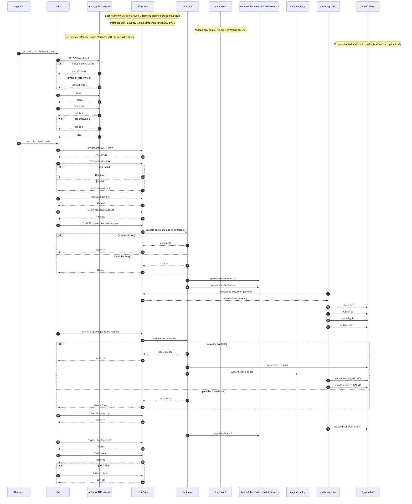

<!-- Copyright 2026 Lukas Bower -->
<!-- SPDX-License-Identifier: Apache-2.0 -->
<!-- Purpose: Canonical interface definitions for NineDoor, queen/worker verbs, GPU bridge files, and telemetry schemas. -->
<!-- Author: Lukas Bower -->
# Cohesix Interfaces (Queen/Worker, NineDoor, GPU Bridge)

The queen/worker verbs and `/queen/ctl` schema form the hive control API: one Queen instance uses these interfaces to control many workers over the shared Secure9P namespace.

This document is **canonical** for control-plane interfaces. Snippets marked `coh-rtc` are generated from
`configs/root_task.toml` and must not be edited by hand. If code diverges from this document, update IR,
regenerate artifacts, and then update docs/tests in the same change.

**Related docs**
- `docs/SECURE9P.md` — transport invariants and AccessPolicy ordering.
- `docs/ROLES_AND_SCHEDULING.md` — role-to-namespace rules.
- `docs/HOST_TOOLS.md` — host tool semantics and interdependencies.
- `docs/API_GUIDELINES.md` — REST gateway scope and mapping.
- `docs/USERLAND_AND_CLI.md` — CLI grammar and bounds.

**At a glance**
- Control files: `/queen/ctl` (3), `/queen/*/ctl` (3a–3e), `/policy/ctl` (10).
- Observability: `/proc/*` (6, 6a).
- Host bridges: `/gpu/*` (7), `/host/*` (8).
- Updates/models: `/updates/*`, `/models/*` (9).
- Console protocol: `cohsh` framing and verbs (13).

## 0. Stability & Versioning
- Interface changes that alter console grammar, NineDoor error codes, or `/proc` formats are **breaking**.
- Breaking changes require updated CLI fixtures, regenerated manifest artifacts, and a schema version bump.
- Feature-gated paths may be absent if disabled in the manifest; missing paths should be treated as gate state,
  not client bugs.

Interface invariants:
- All control writes are append-only; offsets are ignored or rejected for control files.
- All reads are bounded by manifest limits; clients must request within the declared `max_bytes`/`msize` budget.
- Paths and tokens are validated as UTF-8 with no NULs and no `..` traversal.
- `ERR` responses are deterministic and must be treated as **no side effects** unless explicitly documented.

**Figure 1.** Sequence diagram
<!-- INTERFACES.md Sequence Diagram (COMPLETE + white background) -->

```mermaid
sequenceDiagram
  autonumber

  participant Operator
  participant Cohsh as cohsh
  participant Console as root-task TCP console
  participant ND as NineDoor
  participant RT as root-task
  participant QCTL as /queen/ctl
  participant WT as /shard/<label>/worker/<id>/telemetry
  participant LOG as /log/queen.log
  participant GPUB as gpu-bridge-host
  participant GPU as /gpu/<id>/*

  %% =========================
  %% Protocol invariants
  %% =========================
  Note over ND: Secure9P only. Version 9P2000.L. Remove disabled. Msize max 8192.
  Note over ND: Paths are UTF-8. No NUL. Max component length 255 bytes.
  Note over QCTL: Append-only control file. One command per line.
  Note over Console: Line protocol. Max line length 256 bytes. ACK before side effects.
  Note over GPU: Provider-backed nodes. info read-only. ctl and job append-only.

  %% =========================
  %% A) TCP console attachment
  %% =========================
  Operator->>Cohsh: run cohsh with TCP transport
  Cohsh->>Console: ATTACH role ticket
  alt ticket and role valid
    Console-->>Cohsh: OK ATTACH
  else invalid or rate-limited
    Console-->>Cohsh: ERR ATTACH
  end

  %% Keepalive
  Cohsh->>Console: PING
  Console-->>Cohsh: PONG

  %% Tail logs over console
  Cohsh->>Console: TAIL path
  Console-->>Cohsh: OK TAIL
  loop log streaming
    Console-->>Cohsh: log line
  end
  Console-->>Cohsh: END

  %% =========================
  %% B) Secure9P session setup
  %% =========================
  Operator->>Cohsh: run cohsh in 9P mode
  Cohsh->>ND: TVERSION msize 8192
  ND-->>Cohsh: RVERSION
  Cohsh->>ND: TATTACH with ticket
  alt ticket valid
    ND-->>Cohsh: RATTACH
  else invalid
    ND-->>Cohsh: Rerror Permission
  end

  %% =========================
  %% C) Queen control via /queen/ctl
  %% =========================
  Cohsh->>ND: TWALK /queen/ctl
  ND-->>Cohsh: RWALK
  Cohsh->>ND: TOPEN /queen/ctl append
  ND-->>Cohsh: ROPEN

  Cohsh->>ND: TWRITE spawn heartbeat worker
  ND->>RT: validate command and permissions
  alt spawn allowed
    RT-->>ND: spawn OK
    ND-->>Cohsh: RWRITE
  else invalid or busy
    RT-->>ND: error
    ND-->>Cohsh: Rerror
  end

  %% =========================
  %% D) Worker telemetry
  %% =========================
  RT->>WT: append heartbeat record
  RT->>WT: append heartbeat record

  %% =========================
  %% E) GPU provider registration
  %% =========================
  GPUB->>ND: connect as Secure9P provider
  ND-->>GPUB: provider session ready
  GPUB->>GPU: publish info
  GPUB->>GPU: publish ctl
  GPUB->>GPU: publish job
  GPUB->>GPU: publish status

  %% =========================
  %% F) GPU lease request
  %% =========================
  Cohsh->>ND: TWRITE spawn gpu lease request
  ND->>RT: validate lease request
  alt provider available
    RT-->>ND: lease queued
    ND-->>Cohsh: RWRITE
    RT->>GPU: append lease to ctl
    RT->>LOG: append lease issued
    GPUB->>GPU: update status QUEUED
    GPUB->>GPU: update status RUNNING
  else provider unavailable
    RT-->>ND: error Busy
    ND-->>Cohsh: Rerror Busy
  end

  %% =========================
  %% G) GPU job execution
  %% =========================
  Cohsh->>ND: TWRITE append job
  ND-->>Cohsh: RWRITE
  GPUB->>GPU: update status OK or ERR
  RT->>WT: append job result

  %% =========================
  %% H) Tail logs via 9P
  %% =========================
  Cohsh->>ND: TWALK /log/queen.log
  ND-->>Cohsh: RWALK
  Cohsh->>ND: TOPEN read
  ND-->>Cohsh: ROPEN
  loop tail polling
    Cohsh->>ND: TREAD offset
    ND-->>Cohsh: RREAD
  end
```

## 1. NineDoor 9P Operations
- Supports **9P2000.L** only (`version`, `attach`, `walk`, `open`, `read`, `write`, `clunk`, `stat`, `remove` (disabled)).
- `msize` negotiated ≤ 8192 bytes; larger requests rejected with `Rerror(TooBig)`.
- Fid tables are per-session; `clunk` invalidates handles immediately.
- Path components limited to 255 bytes and must be valid UTF-8 without NULs.
- Batched request frames are permitted when enabled by the manifest (`secure9p.batch_frames`); each response is keyed by its tag and may arrive out-of-order, so clients must match replies by tag instead of FIFO ordering.
- Tag overflow (`secure9p.tags_per_session`) and batch back-pressure return deterministic `Rerror(Invalid)` or `Rerror(Busy)` with stable ordering, preserving prior single-request semantics when batching is disabled.

## 2. Capability Ticket
```rust
pub struct Ticket(pub [u8; 32]);

pub struct TicketClaims {
    pub role: Role,
    pub budget: Budget,
    pub subject: Option<String>,
    pub mounts: MountSpec,
    pub issued_at_ms: u64,
}
```
- Minted by root task, delivered out-of-band during `attach`.
- Encoded using BLAKE3 MAC over claims to prevent tampering.

## 3. Queen Control Surface
Path: `/queen/ctl` (append-only JSON lines)
```json
{"spawn":"heartbeat","ticks":100,"budget":{"ttl_s":120,"ops":500}}
{"kill":"worker-7"}
{"bind":{"from":"/shard","to":"/shadow"}}
{"mount":{"service":"gpu-bridge","at":"/gpu"}}
{"spawn":"gpu","lease":{"gpu_id":"GPU-0","mem_mb":4096,"streams":2,"ttl_s":120}}
```
- Lines must parse as UTF-8 JSON; unknown fields are rejected with deterministic `ERR` (schema is strict).
- `spawn:"gpu"` queues a lease request for the host GPU bridge; if the bridge is unavailable the command returns `Error::Busy`.
- GPU spawns require the host bridge to publish `/gpu/<id>` entries via `install_gpu_nodes`; lease issuance is mirrored to `/log/queen.log` and `/gpu/<id>/ctl`.
- Optional `priority` fields raise scheduling weight on the host bridge when multiple leases compete.
- Operators typically exercise these verbs via `cohsh`, and any GUI client is expected to speak the same protocol.
- If policy gating is enabled (`/policy/rules` present), writes to `/queen/ctl` require approvals queued in `/actions/queue`.

## 3a. Node Lifecycle Control
Path: `/queen/lifecycle/ctl` (append-only, queen-only)
```
cordon
drain
resume
quiesce
reset
```
- Commands are single-line tokens; invalid transitions return deterministic `ERR`.
- Every transition appends an audit line to `/log/queen.log`:
  - `lifecycle transition old=<STATE> new=<STATE> reason=<reason>`
- Denials are also logged:
  - `lifecycle denied action=<cmd> state=<STATE> reason=<invalid-transition|outstanding-leases|invalid-command|gate-denied>`
- Lifecycle gates apply to: worker attach, telemetry ingest, worker telemetry, GPU job submission, and host publishes.

### Lifecycle observability (read-only)
- `/proc/lifecycle/state`: `state=<BOOTING|DEGRADED|ONLINE|DRAINING|QUIESCED|OFFLINE>`
- `/proc/lifecycle/reason`: `reason=<text>`
- `/proc/lifecycle/since`: `since_ms=<u64>`

## 3b. GPU Bridge Publish Channel
Path: `/gpu/bridge/ctl` (append-only, queen-only; lifecycle gate: `host_publish`)

Publish lines (one per append):
```
begin bytes=<payload_bytes> sha256=<hex>
b64:<base64_chunk>
...
end
```
- `begin` defines the expected payload byte size and SHA-256 of the decoded wire payload.
- `b64:` lines stream the base64-encoded wire payload in bounded chunks.
- `end` finalizes the snapshot; invalid size/hash results in deterministic `ERR`.
- Successful publish installs `/gpu/<id>/*`, `/gpu/models/*`, and `/gpu/telemetry/schema.json`.

Status path: `/gpu/bridge/status` (read-only)
- `state=idle` — no active publish.
- `state=receiving bytes=<n>` — ingesting snapshot.
- `state=ok bytes=<n> sha256=<hex>` — last publish succeeded.
- `state=err reason=<detail>` — last publish failed (detail is bounded).

## 3c. Scheduler Control
Path: `/queen/schedule/ctl` (append-only JSONL)
```json
{"id":"sched-1","role":"worker-gpu","priority":2,"ticks":3,"budget_ms":120}
```
- Strict JSON line; unknown fields are rejected deterministically.
- `id` and `role` must be short ASCII tokens (alphanumeric, `-`, `_`); `ticks` and `budget_ms` must be > 0.
- Queue depth is bounded by `control_plane.schedule.queue_max_entries`; duplicate `id` entries are rejected.
- The control log is bounded by `control_plane.schedule.ctl_max_bytes`; overflow returns deterministic `ERR`.
- When enabled, `/proc/schedule/summary` and `/proc/schedule/queue` expose read-only snapshots of the queue (see `/proc` observability).

## 3d. Lease Control
Path: `/queen/lease/ctl` (append-only JSONL)
```json
{"op":"grant","id":"lease-1","subject":"queen","resource":"gpu0","ttl_s":300,"priority":5}
{"op":"renew","id":"lease-1","ttl_s":600,"priority":6}
{"op":"preempt","id":"lease-1","reason":"timeout"}
{"op":"quota","subject":"queen","resource":"gpu0","max_active":4,"max_preemptions":8}
```
- Strict JSON line with `op` = `grant|renew|preempt|quota`; unknown fields are rejected.
- `id`, `subject`, and `resource` are bounded ASCII tokens; `ttl_s`, `max_active`, and `max_preemptions` must be > 0.
- Active and preemption lists are bounded by `control_plane.lease.*_max_entries`; overflow returns deterministic `ERR`.
- The control log is bounded by `control_plane.lease.ctl_max_bytes`.
- `/proc/lease/summary`, `/proc/lease/active`, and `/proc/lease/preemptions` expose read-only snapshots when enabled.

## 3e. Export Control
Path: `/queen/export/ctl` (append-only JSONL)
```json
{"op":"open","id":"export-1","ttl_s":900}
{"op":"close","id":"export-1","reason":"window-complete"}
```
- Strict JSON line with `op` = `open|close`; unknown fields are rejected.
- `id` and `reason` are bounded ASCII tokens; `ttl_s` must be > 0.
- The control log is bounded by `control_plane.export.ctl_max_bytes`.

## 4. Worker Telemetry
- Path (canonical): `/shard/<label>/worker/<id>/telemetry` (append-only, newline-delimited records).
- Legacy alias (when enabled): `/worker/<id>/telemetry`.
- Heartbeat payload: `{"tick":42,"ts_ms":123456789}`.
- GPU payload: `{"job":"jid-9","state":"RUNNING","detail":"scheduled"}` followed by `{"job":"jid-9","state":"OK","detail":"completed"}`.
- Telemetry ring quotas and cursor retention are manifest-governed:
  - `telemetry.ring_bytes_per_worker` caps the per-worker append-only ring.
  - `telemetry.cursor.retain_on_boot` preserves or resets cursor state after reboot.
  - `telemetry.frame_schema` gates legacy plain-text vs CBOR framing.
- GPU telemetry schema (Milestone 6a; LoRA here refers to model adapters, not LoRa radio):
  - Descriptor: `/gpu/telemetry/schema.json` (read-only, versioned)
  - Records must include `schema_version`, `device_id`, `model_id`, `time_window`, `token_count`, `latency_histogram`.
  - Optional fields: `lora_id`, `confidence`, `entropy`, `drift`, `feedback_flags`.
  - Max record size: 4096 bytes; host-side telemetry emitters must enforce bounds before forwarding to `/queen/telemetry/*`.
  - Only the schema is mirrored into the VM; telemetry records remain host-side.

### Queen telemetry ingest (host push)
- Path: `/queen/telemetry/<device_id>/`
  - `ctl` — append-only control log. Accepts JSON lines of the form `{"new":"segment","mime":"text/plain"}`.
  - `seg/` — directory containing OS-named segments (append-only).
  - `latest` — read-only pointer to the newest segment (single line: `<seg_id>`).
- Segment creation is **OS-owned**: clients can only request a new segment via `ctl`; names are assigned `seg-000001`, `seg-000002`, ... per device.
- Segment writes are append-only; offsets must match the end of the file (or use `u64::MAX`). Random writes, truncation, and renames are rejected.
- Quotas are manifest-driven via `telemetry_ingest.*`:
  - `max_segments_per_device`
  - `max_bytes_per_segment`
  - `max_total_bytes_per_device`
  - `max_reference_entries_per_segment`
  - `max_reference_manifest_bytes_per_segment`
  - `max_reference_bytes_per_segment`
  - `eviction_policy` (`refuse` | `evict-oldest`)
- Max record size: 4096 bytes; each append is treated as one telemetry record.

### Queen LoRA export (read-only)
- Path: `/queen/export/lora_jobs/<job_id>/`
  - `telemetry.cbor` — CBOR telemetry bundle (bounded).
  - `base_model.ref` — base model identifier (single line).
  - `policy.toml` — export policy snapshot (TOML).
- Export directories are created by the Queen when telemetry gates pass and remain read-only to clients.

### Telemetry ingest envelope (cohsh-telemetry-push/v1)
`cohsh telemetry push` emits UTF-8 JSON lines, one per append:
```json
{"schema":"cohsh-telemetry-push/v1","seq":1,"mime":"text/plain","payload":"telemetry demo line 1"}
```
| Field | Type | Required | Description |
| --- | --- | --- | --- |
| `schema` | `text` | yes | Schema identifier; must be `cohsh-telemetry-push/v1`. |
| `seq` | `uint` | yes | Monotonic per-segment sequence number (starts at 1). |
| `mime` | `text` | yes | MIME type of the source payload (e.g. `text/plain`). |
| `payload` | `text` | yes | Opaque UTF-8 payload chunk; `cohsh` chunks to stay within `max_record_bytes` (4096). |

### Telemetry reference-manifest envelope (coh-ref-c/v1)
For large host artifacts, `cohsh telemetry push` and the Python SDK emit reference-manifest lines instead of inline payload transfer:
```json
{"schema":"coh-ref-c/v1","seq":1,"off":0,"len":16777216,"sha256":"QmFzZTY0RGlnZXN0Li4u"}
```
| Field | Type | Required | Description |
| --- | --- | --- | --- |
| `schema` | `text` | yes | Schema identifier; must be `coh-ref-c/v1`. |
| `seq` | `uint` | yes | Monotonic record sequence (starts at 1). |
| `off` | `uint` | yes | Referenced byte offset. Must be contiguous (`off == prior off + len`). |
| `len` | `uint` | yes | Referenced chunk bytes (`>= 1`). |
| `sha256` | `text` | yes | Chunk digest token (bounded ASCII digest alphabet). |

Deterministic ingest rules:
- A segment is either inline (`cohsh-telemetry-push/v1`) or reference-manifest (`coh-ref-c/v1`); mixing modes in one segment is rejected.
- Reference manifests are bounded by `max_reference_entries_per_segment`, `max_reference_manifest_bytes_per_segment`, and `max_reference_bytes_per_segment`.
- Per-record Secure9P limits are unchanged (`msize <= 8192`, record payload <= 4096 bytes).

<!-- coh-rtc:sharding:start -->
### Sharded worker namespace (generated)
- `sharding.enabled`: `true`
- `sharding.shard_bits`: `8`
- `sharding.legacy_worker_alias`: `true`
- shard labels: `00..ff` (count: 256)
- canonical worker path: `/shard/<label>/worker/<id>/telemetry`
- legacy alias: `/worker/<id>/telemetry`

_Generated from `configs/root_task.toml` (sha256: `afc015e7a9f9bea1625f43a291c485760b380eebedb622af15ebcc40f6ba2fc9`)._
<!-- coh-rtc:sharding:end -->

<!-- coh-rtc:telemetry-cbor:start -->
### Telemetry CBOR Frame v1 (generated)
- Schema: `telemetry-frame/v1`
- Version: `1`
- Encoding: CBOR map (major type 5)

| Field | CBOR type | Required | Description |
| --- | --- | --- | --- |
| `schema` | `text` | `yes` | Schema identifier; must be `telemetry-frame/v1`. |
| `worker_id` | `text` | `yes` | Worker identifier emitting the record. |
| `role` | `text` | `yes` | Worker role label (`worker-heartbeat`, `worker-gpu`). |
| `seq` | `uint` | `yes` | Monotonic frame sequence number. |
| `emitted_ms` | `uint` | `yes` | Unix epoch milliseconds captured by the worker. |
| `payload` | `map` | `yes` | Schema-specific payload map (e.g., heartbeat or GPU job data). |

_Generated by coh-rtc (sha256: `d1906bce668a4d73d95a8262734f1ec04a1480610ebfd9b6c3f3c8ad2e402b7e`)._
<!-- coh-rtc:telemetry-cbor:end -->

## 5. Sidecar Bus & LoRa Mounts
Sidecar namespaces are manifest-gated; mounts appear only when `sidecars.*.enable = true` and adapter labels are compiler-resolved (hash-prefixed on collision).

### `/bus/<adapter>` (MODBUS/DNP3)
- `ctl` — append-only control log for sidecar coordination (byte-for-byte, bounded by `secure9p.msize`).
- `telemetry` — append-only; when link is offline, payloads are spooled for deterministic replay.
- `link` — append-only; accepts `online` or `offline` to toggle link state.
- `replay` — append-only; any write drains the spool into telemetry and appends `replay entries=<n> bytes=<m>`.
- `spool` — read-only; lines `entries=<n> bytes=<m> max_entries=<n> max_bytes=<m>` plus per-frame `seq=<n> bytes=<m> payload=<text>`.

### `/lora/<adapter>`
- `ctl` — append-only transmit attempts; duty-cycle guard enforces window/percent limits, violations return `ERR` and record tamper entries.
- `telemetry` — read-only mirror of accepted payloads (populated by `ctl` writes).
- `tamper` — read-only; lines `tamper ts_ms=<ms> reason=<payload-oversize|duty-cycle> bytes=<n>`.

- Capability scope is enforced per adapter; mismatched roles or scopes yield deterministic `ERR` plus a `sidecar-deny` audit line in `/log/queen.log`.

## 6. /proc Observability
<!-- coh-rtc:observability-interfaces:start -->
### /proc observability nodes (generated)
- `/proc/9p/sessions` (read-only, max 8192 bytes): `sessions total=<u64> worker=<u64> shard_bits=<u8> shard_count=<u16>` plus `shard <hex> <count>` lines.
- `/proc/9p/outstanding` (read-only, max 128 bytes): `outstanding current=<u64> limit=<u64>`.
- `/proc/9p/short_writes` (read-only, max 128 bytes): `short_writes total=<u64> retries=<u64>`.
- `/proc/9p/session/active` (read-only, max 128 bytes): `active=<u64> draining=<u64>`.
- `/proc/9p/session/<id>/state` (read-only, max 64 bytes): `state=SETUP|ACTIVE|DRAINING|CLOSED`.
- `/proc/9p/session/<id>/since_ms` (read-only, max 64 bytes): `since_ms=<u64>`.
- `/proc/9p/session/<id>/owner` (read-only, max 96 bytes): `owner=<identity>`.
- `/proc/ingest/p50_ms` (read-only, max 64 bytes): `p50_ms=<u32>` (milliseconds).
- `/proc/ingest/p95_ms` (read-only, max 64 bytes): `p95_ms=<u32>` (milliseconds).
- `/proc/ingest/backpressure` (read-only, max 64 bytes): `backpressure=<u64>`.
- `/proc/ingest/dropped` (read-only, max 64 bytes): `dropped=<u64>`.
- `/proc/ingest/queued` (read-only, max 64 bytes): `queued=<u32>`.
- `/proc/ingest/watch` (append-only, max_entries=16, line_bytes=192, min_interval_ms=50): `watch ts_ms=<u64> p50_ms=<u32> p95_ms=<u32> queued=<u32> backpressure=<u64> dropped=<u64> ui_reads=<u64> ui_denies=<u64>`.
- `/proc/root/reachable` (read-only, max 32 bytes): `reachable=yes|no`.
- `/proc/root/last_seen_ms` (read-only, max 64 bytes): `last_seen_ms=<u64>`.
- `/proc/root/cut_reason` (read-only, max 64 bytes): `cut_reason=<none|network_unreachable|session_revoked|policy_denied|lifecycle_offline>`.
- `/proc/pressure/busy` (read-only, max 64 bytes): `busy=<u64>`.
- `/proc/pressure/quota` (read-only, max 64 bytes): `quota=<u64>`.
- `/proc/pressure/cut` (read-only, max 64 bytes): `cut=<u64>`.
- `/proc/pressure/policy` (read-only, max 64 bytes): `policy=<u64>`.
- `/proc/schedule/summary` (read-only, max 128 bytes): `queue=<u64> dequeued=<u64> dropped=<u64> max_entries=<u32>`.
- `/proc/schedule/queue` (read-only, max 256 bytes): `id=<id> role=<role> priority=<u32> ticks=<u32> budget_ms=<u32> seq=<u64>`.
- `/proc/lease/summary` (read-only, max 160 bytes): `active=<u64> preemptions=<u64> quotas=<u64> max_active=<u32> max_preemptions=<u32>`.
- `/proc/lease/active` (read-only, max 256 bytes): `id=<id> subject=<subject> resource=<resource> ttl_s=<u32> priority=<u32> state=<STATE> seq=<u64>`.
- `/proc/lease/preemptions` (read-only, max 256 bytes): `id=<id> subject=<subject> resource=<resource> reason=<reason> seq=<u64>`.

_Generated by coh-rtc (sha256: `4ff0d485329b917eeaa1b604f8adfb28fd0a75924e7d55ac818d9359b81379b5`)._
<!-- coh-rtc:observability-interfaces:end -->

## 6a. NineDoor UI Providers (Read-Only)
- UI providers expose bounded, cursor-resumable summaries for UI clients: each read ≤ 8192 bytes, total stream ≤ 32 KiB, deterministic EOF.
- Manifest toggles: `ui_providers.*` gates visibility; `/proc` UI providers require corresponding `observability.*`, `/policy/preflight/*` requires `ecosystem.policy.enable`, `/updates/*` requires `cas.enable`.
- Disabled providers return deterministic `ERR` and emit `ui-provider` audit lines.

### /proc UI summaries (text + CBOR)
- `/proc/9p/sessions(.cbor)` — text output matches `/proc` observability; CBOR map: `total`, `worker`, `shard_bits`, `shard_count`, `shards[] {label, count}`.
- `/proc/9p/outstanding(.cbor)` — text output matches `/proc` observability; CBOR map: `current`, `limit`.
- `/proc/9p/short_writes(.cbor)` — text output matches `/proc` observability; CBOR map: `total`, `retries`.
- `/proc/ingest/p50_ms(.cbor)` — text output matches `/proc` observability; CBOR map: `p50_ms`.
- `/proc/ingest/p95_ms(.cbor)` — text output matches `/proc` observability; CBOR map: `p95_ms`.
- `/proc/ingest/backpressure(.cbor)` — text output matches `/proc` observability; CBOR map: `backpressure`.

### Policy preflight (text + CBOR)
- `/policy/preflight/req(.cbor)` — text: `req total=<u64> queued=<u64> consumed=<u64>` plus `req id=<id> target=<path> decision=<allow|deny> state=<queued|consumed>`.
- `/policy/preflight/req.cbor` — CBOR map: `total`, `queued`, `consumed`, `actions[] {id, target, decision, state}`.
- `/policy/preflight/diff(.cbor)` — text: `diff rules=<u64> actions=<u64> unmatched=<u64>` plus `rule id=<id> target=<path> queued=<u64> consumed=<u64>`.
- `/policy/preflight/diff.cbor` — CBOR map: `rules`, `actions`, `unmatched`, `entries[] {id, target, queued, consumed}`.

### Update status (text + CBOR)
- `/updates/<epoch>/manifest.cbor` — read-only; schema `cohesix-cas/manifest-v1`.
- `/updates/<epoch>/status(.cbor)` — text lines: `status epoch=<epoch> state=<empty|manifest_pending|chunks_pending|ready>`, `manifest_bytes=<u64> manifest_pending_bytes=<u64>`, `chunks_expected=<u64> chunks_committed=<u64> chunks_pending=<u64> chunks_missing=<u64>`, `payload_bytes=<u64> payload_sha256=<hex|none>`, `delta_base_epoch=<epoch|none> delta_base_sha256=<hex|none>`.
- `/updates/<epoch>/status.cbor` — CBOR map: `epoch`, `state`, `manifest_bytes`, `manifest_pending_bytes`, `chunks_expected`, `chunks_committed`, `chunks_pending`, `chunks_missing`, `payload_bytes`, `payload_sha256` (bytes or null), `delta` (map `{base_epoch, base_sha256}` or null).

## 6b. SwarmUI Consumption (Host UI)
- SwarmUI is a host-only Tauri client that defaults to the TCP console transport via `cohsh`; `SWARMUI_TRANSPORT=9p` enables Secure9P. No new verbs or in-VM services are introduced.
- Telemetry and fleet panels are read-only; `tail` transcripts must emit `OK ...`, stream lines, and terminate with `END` exactly as the CLI does.
- Scheduler and lease panels are read-only views powered by `/proc/schedule/*` and `/proc/lease/*`; they never append or mutate control files.
- The frontend is rendering-only: no retries, caching policy, or background polling logic; watchers exist only when a view is active.
- Offline inspection is read-only and uses cached CBOR snapshots under `$DATA_DIR/snapshots/`; no network access or retries occur while offline.

### Live Hive (render-only PixiJS view)
- Live Hive is a WebGL PixiJS scene embedded in SwarmUI; it consumes the same telemetry tails as the panels and inherits the console/9P transport choice without adding new verbs.
- Ingestion is backend-owned: telemetry stream lines map to hive events (`ERR` -> error pulse, other lines -> telemetry); the frontend applies bounded diffs and makes no per-event draw guarantees.
- Freshness-first ingestion: the backend samples up to `swarmui.hive.poll_workers_per_tick` workers per poll, caps per-worker pending lines with `swarmui.hive.pending_lines_per_worker`, and drops oldest events beyond `swarmui.hive.pending_event_cap` to keep newest telemetry visible.
- Live Hive surfaces authority and contention by reading `/proc/root/reachable`, `/proc/root/cut_reason`, `/proc/9p/session/active`, and `/proc/pressure/*` (text-only). UI badges render `ROOT OK` vs `CUT`, session counts highlight `DRAINING`, and pressure counters are displayed inline.
- Status snapshots are rate-limited by `swarmui.hive.status_poll_ms` and cached between polls; the Live Hive poll loop follows the same interval (clamped to ≥250 ms) so telemetry deltas refresh once per poll within the configured event budget.
- `ERR` lines tagged with `reason=busy|quota|cut|policy` are classified and displayed by category instead of a single generic failure bucket.
- Replay is deterministic across live streams, recorded transcripts, and cached CBOR snapshots. `--replay <snapshot>` accepts CBOR snapshots or transcripts; offline mode reads `$DATA_DIR/snapshots/hive:<key>.cbor`.
- LOD and degradation rules: zoomed out renders cluster hulls + aggregate flow intensity, zoomed in renders agents + pollen, and under load degrades to flow-only intensity; frame cap (`swarmui.hive.frame_cap_fps`), step (`swarmui.hive.step_ms`), budgets (`swarmui.hive.lod_event_budget`, `swarmui.hive.snapshot_max_events`, `swarmui.hive.pending_event_cap`), and pressure threshold (`swarmui.hive.degrade_pressure`) are compiler-emitted.
- Live Hive rendering stays active during scroll with degraded cadence/quality to keep the page responsive; rendering pauses only when the canvas is offscreen/hidden, while telemetry continues polling and buffers for a flush once visible again.
- When the canvas is not actively interacted with, Live Hive caps detail LOD, drops renderer resolution, and throttles simulation cadence/budgets, then restores full cadence on interaction to keep scrolling smooth without dropping telemetry.
- Visual language: circle/soft-blob primitives only, glow and pulse effects are single-shot and bounded, and SVG is limited to labels or selection overlays.
- Agent dots are role-coded (queen/worker-heartbeat/worker-gpu/worker-lora/worker-bus/worker); a numeric label beside each worker dot provides stable identity hints when IDs are long.
- Clicking a worker dot selects it for the detail panel; overlay cards and dot clicks stay in sync and do not introduce any new verbs or polling paths.
- Live Hive renders bounded telemetry text: per-worker overlays show the last N lines, and a selectable detail panel shows the last M lines. Line caps and per-worker byte budgets are enforced in shared `cohsh-core` tail buffers, not in UI code.
- Performance guardrails: resize only on actual canvas bounds changes and drain event queues via cursors (avoid per-frame `splice`); a debug metrics hook is reserved for UI performance harnesses.
- Design tokens and assets: fonts load from `apps/swarmui/frontend/assets/fonts` (mono ligatures off by default via `.mono`, opt-in `.mono.liga`), colors and spacing live in `apps/swarmui/frontend/styles/colors.css` and `apps/swarmui/frontend/styles/tokens.css`, hive tokens mirror CSS in `apps/swarmui/frontend/hive/tokens.js`, icons use `apps/swarmui/frontend/assets/icons/sprite.svg` via `apps/swarmui/frontend/components/icon.js`, and layout spacing is limited to 4/8/12/16/24/32 with no shadows.

## 7. GPU Bridge Files (host-mirrored)
| Path | Mode | Description |
|------|------|-------------|
| `/gpu/bridge/ctl` | append-only | GPU bridge snapshot publish channel (`begin`/`b64:`/`end`). |
| `/gpu/bridge/status` | read-only | Publish status (`state=idle|receiving|ok|err`). |
| `/gpu/<id>/info` | read-only | JSON metadata: vendor, model, memory, SMs, driver/runtime versions |
| `/gpu/<id>/ctl` | append-only | Lease management: `LEASE`, `RELEASE`, `PRIORITY <n>` |
| `/gpu/<id>/lease` | append-only | Lease/ticket log entries (`gpu-lease/v1`) with active/release state |
| `/gpu/<id>/job` | append-only | JSON job descriptors (validated hash, grid/block dims, optional `payload_b64`) |
| `/gpu/<id>/status` | read-only append stream | Job lifecycle entries (QUEUED/RUNNING/OK/ERR) |
| `/gpu/models/available/<model_id>/manifest.toml` | read-only | Host-authored model manifests; no uploads from the VM |
| `/gpu/models/active` | append-only pointer | Symlink-like pointer to the active model (atomic swap on host) |
| `/gpu/telemetry/schema.json` | read-only | Versioned schema descriptor (`gpu-telemetry/v1`) with field and size limits |
| `/gpu/telemetry/*` | host-only | Telemetry records remain host-side; only the schema is mirrored into the VM. |

- Host GPU discovery prefers NVML; when NVML is feature-limited (Jetson), CUDA driver/runtime APIs supply `memory_mb`, `sm_count`, and version fields.
- In `dev-virt` QEMU runs without a host GPU bridge, the root-task exposes mock `/gpu/<id>/info`, `/gpu/<id>/lease`, and `/gpu/<id>/status` entries (GPU-0/GPU-1) for CLI demos; `/gpu/models` and `/gpu/telemetry/schema.json` remain host-mirrored only.

<!-- coh-rtc:gpu-breadcrumbs:start -->
### GPU status breadcrumb schema (generated)
- `coh.run.lease.schema`: `gpu-lease/v1`
- `coh.run.lease.active_state`: `ACTIVE`
- `coh.run.lease.max_bytes`: `1024`
- `coh.run.breadcrumb.schema`: `gpu-breadcrumb/v1`
- `coh.run.breadcrumb.max_line_bytes`: `512`
- `coh.run.breadcrumb.max_command_bytes`: `256`
- Lease entries are JSON lines with fields: `schema`, `state`, `gpu_id`, `worker_id`, `mem_mb`, `streams`, `ttl_s`, `priority`.
- Breadcrumb entries are JSON lines with fields: `schema`, `event`, `command`, `status`, `exit_code` (optional).

_Generated by coh-rtc (sha256: `80eff6277e0b97c54fc8996ffc01a54ccff20b899bcd0e9f63c30de1afb02f80`)._
<!-- coh-rtc:gpu-breadcrumbs:end -->

- WorkerGpu must read `/gpu/models/active` before emitting telemetry and propagate the `model_id`/`lora_id` into every record.
- Telemetry records that exceed `max_record_bytes` or omit required fields must be rejected by host-side emitters; the VM does not accept `/gpu/telemetry/*` writes.

## 8. Host Sidecar Files (`/host`)
| Path | Mode | Description |
|------|------|-------------|
| `/host/systemd/<unit>/status` | append-only | Host-published unit status snapshots (mock or live) |
| `/host/systemd/<unit>/start` | append-only | Control sink for start requests (queen-only) |
| `/host/systemd/<unit>/stop` | append-only | Control sink for stop requests (queen-only) |
| `/host/systemd/<unit>/restart` | append-only | Control sink for restart requests (queen-only) |
| `/host/k8s/node/<name>/cordon` | append-only | Control sink for cordon requests (queen-only) |
| `/host/k8s/node/<name>/drain` | append-only | Control sink for drain requests (queen-only) |
| `/host/docker/status` | append-only | Host-published Docker status snapshot (mock or live) |
| `/host/docker/restart` | append-only | Control sink for restart requests (queen-only) |
| `/host/docker/stop` | append-only | Control sink for stop requests (queen-only) |
| `/host/nvidia/gpu/<id>/status` | append-only | Host-published GPU status snapshots (mock or live) |
| `/host/nvidia/gpu/<id>/power_cap` | append-only | Control sink for power-cap changes (queen-only) |
| `/host/nvidia/gpu/<id>/thermal` | append-only | Host-published thermal snapshots (mock or live) |
| `/host/tickets/spec` | append-only JSONL | Host control ticket requests (`host-ticket/v1`) |
| `/host/tickets/status` | append-only JSONL | Host control ticket lifecycle receipts (`host-ticket-result/v1`) |
| `/host/tickets/deadletter` | append-only JSONL | Terminal failure/expiry receipts (`host-ticket-result/v1`) |
| `/host/tickets/spec.snapshot` | read-only | Bounded snapshot view of `/host/tickets/spec` |
| `/host/tickets/status.snapshot` | read-only | Bounded snapshot view of `/host/tickets/status` |
| `/host/tickets/deadletter.snapshot` | read-only | Bounded snapshot view of `/host/tickets/deadletter` |

Line formats (append-only snapshots; values are sanitized and lines capped at 256 bytes):
- systemd status: `state=<state> sub=<substate>`
- k8s node status: `state=<ready|unknown|...> role=<role> version=<version>`
- docker status: `version=<ver> containers=<n> running=<n> paused=<n> stopped=<n>`
- nvidia status: `util_pct=<n> mem_used_mb=<n> mem_total_mb=<n> temp_c=<n> power_w=<n>`
- nvidia thermal: `temp_c=<n>`
- On provider errors, status lines emit `state=unknown reason=<detail>` and thermal falls back to `temp_c=unknown`.
- Host tickets are strict JSONL:
  - spec line required fields: `schema`, `id`, `idempotency_key`, `action`; optional `target`, `args`, `expires_unix_ms`.
  - spec line federation fields (optional, additive): `source_hive`, `target_hive`, `relay_hop`, `relay_correlation_id`.
  - result line required fields: `schema`, `id`, `idempotency_key`, `action`, `state`; optional `message`.
  - result line federation fields (optional, additive): `source_hive`, `target_hive`, `relay_hop`, `relay_correlation_id`.
  - `id`/`idempotency_key` tokens are bounded ASCII (`[A-Za-z0-9._:-]`, max 128 bytes).
  - `source_hive` and `target_hive` are pair-required (both set or both unset).
  - `relay_hop` must be in range `1..=32` when present.
  - `relay_correlation_id` follows the same bounded token charset (`[A-Za-z0-9._:-]`).
  - action must be in manifest allowlist.
  - state must be in manifest lifecycle allowlist.
  - line bytes must be `<= ecosystem.host.tickets.max_line_bytes` and `<= secure9p.msize`.
- Canonical lifecycle transitions for host tickets: `queued` -> `claimed` -> `running` -> `succeeded|failed|expired`.
- Idempotency key for replay/evidence correlation is:
  - local tickets: `id + idempotency_key`
  - federated tickets: `id + idempotency_key + source_hive + target_hive`
- Federation relay policy is manifest-gated under `ecosystem.host.federation.*` (peer inventory, allowlisted actions, queue/WAL bounds, timeout).

- `/host` is only mounted when `ecosystem.host.enable = true`; providers are selected from `ecosystem.host.providers[]` and mounted at `ecosystem.host.mount_at`.
- Control writes are append-only; non-queen write attempts return deterministic `Permission` (`EPERM`) errors and emit audit lines that include the ticket and path.
- Audit lines flow through the existing `/log/queen.log` logging path; no new logging protocol is introduced.

## 9. CAS Updates & Models
- Update bundles are exposed under `/updates/<epoch>` and written via append-only `manifest.cbor` and `chunks/<sha256>` nodes; chunk payloads must exactly match `cas.store.chunk_bytes`.
- Chunk uploads are resumable by appending multiple writes until the fixed-size chunk is complete; mismatched hashes are rejected and quarantined.
- Delta manifests reference a non-delta base (`delta.base_epoch`, `delta.base_sha256`), and the payload hash covers base + delta bytes.
- Models are exposed at `/models/<sha256>/{weights,schema,signature}` and become read-only once committed; the entire registry is gated by `ecosystem.models.enable`.
- Example bind (queen): `bind /models/<sha256> /worker/worker-1/model`.

<!-- coh-rtc:cas-interfaces:start -->
### CAS update surfaces (generated)
- `cas.store.chunk_bytes`: `128`
- `cas.delta.enable`: `true`
- `cas.signing.required`: `true`
- Base update layout: `/updates/<epoch>/manifest.cbor`, `/updates/<epoch>/chunks/<sha256>`.
- Model registry layout: `/models/<sha256>/weights`, `/models/<sha256>/schema`, `/models/<sha256>/signature`.
- Delta manifests supply `delta.base_epoch` and `delta.base_sha256`, referencing a non-delta base.
- Payloads are appended as raw bytes or `b64:`-prefixed base64.
- CAS manifest template:
```json
{
  "chunk_bytes": 128,
  "chunks": [
    "<sha256-hex>"
  ],
  "delta": {
    "base_epoch": "<epoch>",
    "base_sha256": "<sha256-hex>"
  },
  "epoch": "<epoch>",
  "payload_bytes": "<payload-bytes>",
  "payload_sha256": "<sha256-hex>",
  "schema": "cohesix-cas/manifest-v1",
  "signature": "<ed25519-signature-hex>"
}
```

_Generated by coh-rtc (sha256: `1bd13b5ce9da8c2e5442e87cfca3e95daa90ee3fbba7de30e21855f19a3ae8a5`)._
<!-- coh-rtc:cas-interfaces:end -->

## 10. PolicyFS & Actions (`/policy`, `/actions`)
| Path | Mode | Description |
|------|------|-------------|
| `/policy/ctl` | append-only | Policy control JSONL commands (validated UTF-8, manifest-bounded) |
| `/policy/rules` | read-only | Manifest-derived policy rules snapshot |
| `/actions/queue` | append-only | JSONL approvals/denials (`id`, `target`, `decision`) |
| `/actions/<id>/status` | read-only | Status snapshot (`queued` → `consumed`) |

- PolicyFS nodes appear only when `ecosystem.policy.enable = true`.
- Gate approvals are single-use: once an action is consumed, replay attempts return deterministic `EPERM` and append a policy audit line to `/log/queen.log`.
- Rules are authored in `configs/root_task.toml` and emitted verbatim in `/policy/rules` for deterministic inspection.

Policy control (`/policy/ctl`) JSONL:
```json
{"op":"apply","id":"rev-2026-02-03","sha256":"0123456789abcdef0123456789abcdef0123456789abcdef0123456789abcdef"}
{"op":"rollback","id":"rev-2026-02-03"}
```
- Strict JSON line with `op` = `apply|rollback`; unknown fields are rejected.
- `id` must be a bounded ASCII token; `sha256` must be 64 hex characters.
- Apply updates the active policy revision; rollback reverts to a prior revision by `id`.
- The control log is bounded by `ecosystem.policy.ctl_max_bytes`; overflow returns deterministic `ERR`.

## 11. AuditFS & ReplayFS (`/audit`, `/replay`)
| Path | Mode | Description |
|------|------|-------------|
| `/audit/journal` | append-only | JSONL audit journal of Cohesix control actions (bounded by manifest) |
| `/audit/decisions` | append-only | Policy approvals/denials (`policy-action`, `policy-gate`) with role/ticket metadata |
| `/audit/export` | read-only | Snapshot of retention bounds (`journal_base`, `journal_next`, `decisions_base`, `decisions_next`) plus replay flags |
| `/replay/ctl` | append-only | Replay command JSON (`{"from":<cursor>}`) |
| `/replay/status` | read-only | Replay status (`idle`/`ok`/`err`) with deterministic `sequence_fnv1a` |

- AuditFS nodes appear only when `ecosystem.audit.enable = true`; ReplayFS nodes require `ecosystem.audit.replay_enable = true`.
- `/audit/journal` and `/replay/ctl` enforce append-only semantics; offset mismatches return deterministic `Invalid` errors and emit audit lines.
- Replay is bounded to the retained audit window and applies only Cohesix-issued control-plane actions; requests outside the window return `ERR` and produce no side effects.

## 12. Root Task RPC (internal trait)
```rust
pub trait RootTaskControl {
    fn spawn(&self, role: Role, spec: WorkerSpec) -> Result<WorkerId, SpawnError>;
    fn kill(&self, id: WorkerId) -> Result<(), KillError>;
    fn bind(&self, session: SessionId, from: &str, to: &str) -> Result<(), NamespaceError>;
    fn mount(&self, session: SessionId, service: &str, at: &str) -> Result<(), NamespaceError>;
}
```
- NineDoor invokes these methods after validating JSON commands and ticket permissions.
- `WorkerSpec` includes budget, initial telemetry seed, and optional GPU lease request.

## 13. CLI (`cohsh`) Protocol
- Client attaches using the queen or worker ticket, negotiates `msize`, then issues 9P ops corresponding to shell commands.
- `tail` uses repeated `read` calls with offset tracking; NineDoor enforces append-only by ignoring provided offsets.
- `bind` and `mount` commands are no-ops for non-queen roles.
- `--transport tcp` connects to the root-task console listener (default `127.0.0.1:31337`) and speaks a Secure9P-style framed protocol:
  - Each console line is encoded as a length-prefixed frame (4-byte little-endian length including the header, followed by the UTF-8 payload).
  - `ATTACH <role> <ticket?>` → `OK ATTACH role=<role>` on success or `ERR ATTACH reason=<cause>` on failure.
  - `TAIL <path>` emits `OK TAIL path=<path>` before newline-delimited log entries; the stream still terminates with `END`.
  - `CAT <path>` emits `OK CAT path=<path> data=<summary>` before newline-delimited contents; the stream still terminates with `END`.
  - `LS <path>` currently returns `ERR LS reason=unsupported path=<path>` until directory listings are exposed.
  - Other verbs (e.g., `LOG`, `ECHO`, `SPAWN`) mirror serial behaviour and return a single acknowledgement before triggering side effects.
- `PING` / `PONG` probes keep sessions alive; the client sends `PING` every 15 seconds of inactivity and expects an immediate
    `PONG` even when the server is mid-stream.
  - The TCP console enforces a maximum line length of 256 bytes and rate-limits failed authentication attempts (3 strikes within
    60 seconds triggers a 90-second cooldown). Oversized frames on authenticated sessions yield
    `ERR FRAME reason=invalid-length` and the session remains open. `cohsh` additionally validates worker tickets locally,
    rejecting whitespace or malformed values so automation does not leak failed attempts over the wire.
- Cohesix ships regression scripts in `.coh` format consumed by `coh> test`; see the canonical spec in [USERLAND_AND_CLI.md](./USERLAND_AND_CLI.md#coh-scripts-coh) for syntax and assertion rules.
- For `dev-virt`, QEMU forwards `127.0.0.1:{31337/tcp,31338/udp,31339/tcp}` to `10.0.2.15` for the console and self-test ports; the virtio-net backend is the default (`net-backend-virtio`), with RTL8139 available as a fallback by removing that feature. Operators generally do not need to care which NIC is active, but the backend label appears in boot logs for diagnostics.
- For `pi4-uboot-aarch64` (and migration alias `uefi-aarch64`), backend and addressing are authored through `hw.network.*`: `hw.network.backend=bcmgenet-v5`, `hw.network.mode=(off|static|dhcp)`, `hw.network.interface=(wired|wifi|auto)`, manifest static IPv4 when `mode=static`, and bounded DHCP retry/timeout fields when `mode=dhcp`.
- When the staged Pi 4 DTB carries an explicit invalid Cohesix network override, root-task now emits `[net-policy] source=dtb rejected reason=<reason> ...` and rejects net-console bring-up with `invalid net config: dtb override rejected (<reason>)`; it no longer silently falls back to the manifest-selected backend on that path.
- The staged Pi 4 U-Boot boot script presents a Linux-style numbered wizard whose default action continues with saved Cohesix policy when present and otherwise boots manifest defaults. Saving settings persists only the Cohesix policy fields into `cohesix.env`; it does not rewrite the manifest or the generic U-Boot environment. At boot, the script reloads `cohesix.env`, explicitly bootstraps menu/input USB with `pci enum; usb start` whenever no active input session is marked, and switches `stdin` to `usbkbd,serial` only when that session is live so the wizard prefers the attached keyboard while retaining serial fallback. The old bring-up-only USB snapshot spam and diagnostics submenu were removed once the runtime local-seat handoff breadcrumbs became the primary evidence surface. Unsafe downstream hubs still defer eager per-port `PORT_POWER` during early enumeration, delayed child `status-error` retries still avoid stray `PORT_POWER` writes, and the Apple `05ac:1006` keyboard hub keeps its targeted 250 ms post-config settle plus a 5 s hub debounce budget so downstream keyboard functions enumerate reliably without a global scripted startup delay. During controller probe, U-Boot exports only the raw xHCI BAR (`coh_xhci_mmio_raw`), the host-translated MMIO address it actually mapped (`coh_xhci_mmio`), the preserved VL805 PCI command word (`coh_xhci_pci_cmd`), a matching xHCI capability snapshot (`coh_xhci_cap_length`, `coh_xhci_hci_version`, `coh_xhci_hcs1`, `coh_xhci_hcs2`, `coh_xhci_hccparams1`, `coh_xhci_dboff`, `coh_xhci_rtsoff`), the live stop-state registers (`coh_xhci_usbcmd`, `coh_xhci_usbsts`, `coh_xhci_iman0`), and bounded probe/remove breadcrumbs that include `usbcmd`, `usbsts`, `iman0`, `halted`, and `safe`. It no longer exports bootloader-owned `DCBAAP` / `CRCR` / `ERST*` / `ERDP` ring state into env or DT. On the `usb stop` path, the PCI driver now relies on the existing xHCI reset/cleanup flow, preserves the PCI command word, masks legacy/MSI/MSI-X delivery, scrubs xHCI interrupt enables, snapshots the post-stop controller state, and only exports a trustable handoff when that post-stop state is halted and interrupt-quiesced enough to mark `coh_xhci_handoff_safe=1`; a halt or safety failure now returns a driver error instead of falling through to cleanup and rebooting the board. The `usb` command path now propagates `usb stop` / `usb reset` failures back to the boot script, and the boot script clears the live `coh_xhci_*` handoff tokens immediately before `usb stop`, so probe-time `ready/irq` state cannot leak into the post-stop contract. Immediately before DTB handoff capture, the staged boot script forces a real `pci enum; usb reset`, logs token state before reprobe and after the forced reprobe, emits `xhci-reprobe-result reset=<success|failed> ready=<0|1|absent> irq=<0|1|absent> halted=<0|1|absent> safe=<0|1|absent> input=<0|1>`, snapshots the resulting pre-stop state for diagnostics, runs `usb stop`, and mirrors the translated host-physical BAR, PCI command word, xHCI capability snapshot, live stop-state registers (`cohesix,xhci-usbcmd`, `cohesix,xhci-usbsts`, `cohesix,xhci-iman0`), and post-stop trust tokens (`cohesix,xhci-handoff-ready`, `cohesix,xhci-irq-quiesced`, `cohesix,xhci-handoff-halted`, `cohesix,xhci-handoff-safe`) into DTB `/chosen/cohesix,*`. The final handoff source now records whether the decision was `*-post-stop-safe`, `*-partial`, `*-absent`, or `reprobe-usb-stop-failed`; pre-stop snapshots remain diagnostics only and are no longer restored as trusted runtime handoff evidence. It then continues to hand off `coh_net_mode`, `coh_net_interface`, `coh_static_ip`, `coh_static_prefix_len`, `coh_static_gateway`, `coh_wifi_ssid`, and `coh_wifi_psk` before the padded `bcm2711-rpi-4-b.dtb` reaches the seL4 elfloader via the U-Boot `uImage`/`bootm` path. Root-task applies only bounded overrides, rejects a leaked BCM2711 DMA-alias `chosen-pci-bar` as non-MMIO, trusts the safe high-BAR post-stop handoff only when the bootloader exported the full contract, pins the trusted high BAR before the higher VL805 ECAM page inside the shared PCIe device-untyped aperture so the handoff window remains mappable, keeps VL805 ECAM preseed on a map-only path in safe mode because live ECAM reads still correlate with fatal Pi 4 halts, leaves read-verified live PCI-command replay disabled later in safe-mode runtime, replays only the bounded runtime VL805 mailbox reset-notify on the trusted handoff path, keeps a posted-fallback reset on the same trusted cold-start path when the bootloader stop-state snapshot is present, and otherwise degrades local-seat according to policy instead of reconstructing ownership from low aliases.
- Root-task also emits a combined `xhci-handoff-contract` breadcrumb after DT parse, a companion `xhci-handoff-dtb source=... prestop=.../... poststop=.../...` breadcrumb, a stop-state breadcrumb, and the trusted `xhci-cap-snapshot` breadcrumb so a partial or rejected handoff can be diagnosed from root-task logs alone even if early U-Boot serial output is unavailable. It no longer emits `xhci-handoff-rings`, because the active Pi 4 path no longer consumes bootloader-owned ring state and always rebuilds `DCBAA`, scratchpads, command ring, and event ring locally after the reset boundary it trusts.
- The Pi 4 Wi-Fi HAL emits `firmware core-ctrl mode=cmd53-windowed-read32-cmd53-byte-current-window fallback=cmd53-byte-rewindow split-window` before AI-core control, and if the primary mixed Function 1 backplane path times out it now keeps the staged recovery split explicit: reads first try CMD53 byte-mode recovery against the current backplane window before falling back to a rewindowed CMD53 byte-mode pass, while write paths still preserve the existing CMD52 recovery behavior where required. Boot-time bring-up now also avoids unconditional long reset-deassert and SDIO retry spins: SDHCI power-on first emits `settle stage=sdhci-power-on mode=poll ...` and only falls back to the older long settle when the controller never reports ready, reset deassert emits `reset state=deasserted action=logical-only settle=skipped`, and the optional pre-reset HT assist keeps a shorter soft wait budget than the required final HT wait. Small CMD53 byte-mode transfers now program the host as a single block with block-count enable asserted instead of leaving the host block count path unset, incrementing CMD53 transfers advance the Function 1 address per chunk, the serial log emits bounded `sdio xfer chunk fn=1 ... base=... chunk=... off=...` breadcrumbs for the early/new transfer shapes plus `backplane window program ... low=... mid=... high=...` on the flagged Function 1 control path, and same-window Function 1 accesses now emit `backplane window reuse ...` instead of replaying an unchanged SBADDRLOW/MID/HIGH CMD52 triplet. AI core-control writes keep the general `AI_IOCTRL` path on the direct unflagged current-window CMD52 address, SOCRAM `assert-reset` emits `firmware core-ctrl reset-write mode=cmd53-word-windowed fallback=cmd52-byte-current-window-rewindow ...`, SOCRAM `clear-reset` now emits `firmware core-ctrl reset-write mode=cmd53-word-windowed fallback=cmd52-byte-current-window ...`, and the surrounding reset path now splits the first reset-release edge into `stage=clear-reset-primary` and `stage=clear-reset-retry`. If that primary reset-release CMD53 write fails, root-task now emits `sdhci recover stage=core-ctrl-reset-clear-cmd52-current-window mask=cmd+data cache=preserved restored_window=... shadow_window=... fn=...` and then retries only the current-window CMD52 path. The outer `clear-reset-write-retry` stage now skips replaying the already-failed `cmd53-word-windowed` path and instead emits `stage=clear-reset-retry ... path=cmd52-byte-current-window cache=preserved` before retrying the preserved current-window write directly; a successful preserved retry emits `firmware core-ctrl reset-clear stage=cmd52-current-window-ok ...`. If that SOCRAM retry-2 current-window write still returns `sdhci-command-error`, root-task now emits `stage=clear-reset-retry-assumed-committed ... reason=socram-release-edge-timeout`, restores the programmed backplane window from the shadowed `AI_RESETCTRL` access, and then continues into the existing deferred-readback/postreset probe, so operators must judge that path by the following `clear-reset-ready`, `postreset-clock-en-write`, `postreset-clock-en-readback`, and `verify` breadcrumbs rather than by the timeout alone. The first SOCRAM post-release `AI_IOCTRL` write now emits `firmware core-ctrl postreset-write mode=cmd52-byte-current-window no-rewindow ...`; if that current-window write returns `sdhci-command-error`, root-task emits `stage=postreset-clock-en-assumed-committed ... reason=socram-postreset-write-timeout`, restores the programmed backplane window from the shadowed `AI_IOCTRL` access, and continues into readback so operators can judge the edge by the following `postreset-clock-en-readback` and `verify` breadcrumbs rather than by the timeout alone. The first SOCRAM `postreset-clock-en-readback` `AI_IOCTRL` probe now preserves the cached backplane window across recovery, emits `sdhci recover stage=core-ctrl-postreset-cmd52-current-window mask=cmd+data cache=preserved ...`, and stops after the direct current-window CMD52 read instead of immediately re-entering a rewindow fallback, so the next remaining timeout identifies the live post-reset read edge rather than an `SBADDRLOW` replay. If that direct current-window read still returns `sdhci-command-error`, root-task now emits `stage=postreset-clock-en-read-deferred io=... reason=socram-fragile-postreset-read`, restores the programmed backplane window from the shadowed `AI_IOCTRL` access again, and continues into the remaining readback/verify path so operators can judge the next edge by the following `postreset-clock-en-readback` and `verify` breadcrumbs rather than by the first read timeout alone. The following SOCRAM `AI_RESETCTRL` confirmation read now also stays on the preserved-window/no-rewindow path; if it still returns `sdhci-command-error`, root-task emits `stage=postreset-reset-read-deferred reset=... reason=socram-fragile-postreset-reset-read`, restores the programmed backplane window from the shadowed `AI_RESETCTRL` access again, and completes `verify` with the already-cleared reset value so the next remaining failure is beyond the post-reset reset-confirmation probe. The outer reset sequence still distinguishes `stage=postreset-clock-en-write`, `stage=postreset-clock-en-write-ok`, and `stage=postreset-clock-en-readback` so logs separate the first post-reset write from the first post-reset readback while keeping the SOCRAM `AI_IOCTRL` edge on the direct byte path. Once a core is already held in reset the SOCRAM `in-reset-configure` path now skips a redundant `AI_IOCTRL` rewrite when the asserted-reset hold value matches the pre-reset `FGC|CLK` value, emitting `in-reset-configure-skip ... reason=redundant-after-assert` instead of forcing another post-reset write. When that SOCRAM skip path is taken immediately after a fresh reset assert, the immediate `AI_RESETCTRL` confirmation read is also deferred and logged as `in-reset-ready-read-deferred ... reason=redundant-after-assert` so Function 1 is not probed again while the core is still fragile. The SOCRAM `core_reset` path now also emits `core-reset ... stage=skip-disable reason=held-reset-from-prior-disable`; if that path already established the same held-reset `FGC|CLK` value, it now emits `core-reset ... stage=pre-clear-in-reset-configure-skip ... reason=redundant-held-reset-from-prior-disable` and avoids replaying that identical SOCRAM `AI_IOCTRL` write before reset release. The first SOCRAM `clear-reset` readback is still deferred once, emitting `clear-reset-read-deferred ... reason=socram-fragile-first-read`, so the next remaining failure moves to the first later post-reset access instead of the repeated `core_disable` entry read or the immediate reset-clear confirmation read. ARMCR4 non-redundant in-reset `AI_IOCTRL` writes still emit `firmware core-ctrl in-reset-write mode=cmd53-word-windowed-in-reset ...` and first use the flagged 32-bit backplane write path before falling back to current-window and rewindowed CMD52 recovery, while SOCRAM held-reset `AI_IOCTRL` replays now emit `firmware core-ctrl in-reset-write mode=cmd52-byte-current-window fallback=cmd52-byte-rewindow ...` so the fragile SOCRAM prepare stage stays on the already-windowed byte path. The generic `firmware core-ctrl access ...` breadcrumb still prints both `bus=...` and `trace_bus=...` so logs show the exact unflagged byte address used for live CMD52 writes alongside the flagged address used for window tracing. SDHCI command or data-path failures on that path emit `sdhci recover stage=... mask=cmd+data` plus paired `sdio shadow ...` breadcrumbs so logs show both the forced host recovery and the last cached backplane-window / chipclk / wake / sleep / cardcap state without additional failing probe traffic; the SOCRAM `clear-reset` current-window recovery specifically adds `cache=preserved restored_window=... shadow_window=... fn=...`, and the first post-reset `AI_IOCTRL` readback now does the same on `core-ctrl-postreset-cmd52-current-window`, while the deferred post-reset `AI_IOCTRL` and `AI_RESETCTRL` reads restore the same shadowed window again before proceeding, so a later timeout is attributable to the live reset-release/readback edge rather than an unnecessary SBADDR replay. Firmware load now also primes `firmware stage=pre-reset-ht-assist` before the ARMCR4/SOCRAM reset-heavy path whenever cached chip-clock state lacks an HT request, so remaining failures after the backplane-window fix point at the reset edge itself rather than missing HT assist state. The AI core-control sequence now matches the upstream Broadcom AI reset order: write `FGC|CLK` before asserting reset, re-apply `FGC|CLK` while the core is held in reset, then clear reset and leave `CLK` enabled; on Pi 4 SOCRAM, that explicit re-apply stage is now skipped only when the immediately preceding `skip-disable` path already left the identical held-reset value in place. ARMCR4 also carries the upstream `CPUHALT` bit through disable and final release so the firmware CPU is parked until the post-load reset completes.
- As-built refinement: ARMCR4 post-reset single-byte probes now skip the fragile CMD53 data-phase path entirely and begin on the current-window CMD52 read path (`mode=cmd52-byte-current-window fallback=cmd52-byte-rewindow`), so repeated `armcr4-core-up` retries no longer spend time bouncing between two failing CMD53 read shapes before the later HT decision. The earlier ARMCR4 `postreset-clock-en-readback` / `postreset-reset-readback` probes now also treat a direct `sdio-cmd52-read` failure as the same bounded fragile post-reset read boundary as the older SDHCI timeout class, so those edges defer/retry instead of terminating bring-up immediately on the first strict CMD52 miss.
- After SOCRAM `verify`, the first `firmware stage=chipcommon-config` window hop now also stays explicit: if the redundant `SBADDRLOW` replay times out while switching from the SOCRAM `AI_RESETCTRL` window into ChipCommon and only the middle backplane window byte actually changes, root-task emits `stage=chipcommon-config-retry ... reason=mid-byte-only-window-switch`, recovers SDHCI command/data state, rewrites only `SBADDRMID`, restores the programmed target window with `stage=chipcommon-config-window-retarget`, and retries the first ChipCommon config write directly so the next remaining failure is beyond the initial post-reset ChipCommon window transition.
- The first SOCRAM reset-release path now adds `pre-clear-in-reset-configure ... reason=required-before-clear-reset`, but when `skip-disable` already established the same held-reset value it emits `pre-clear-in-reset-configure-skip ... reason=redundant-held-reset-from-prior-disable` and avoids replaying that identical write before `clear-reset-prewrite-delay ... reason=socram-fragile-first-write`. On failure it still makes one `clear-reset-write-retry ... reason=socram-fragile-first-write` recovery attempt before the deferred `clear-reset-read-deferred ...` readback path, and that first clear-reset recovery now preserves the cached backplane window instead of taking an immediate `cmd52-byte-rewindow` detour. The second attempt also now skips replaying the already-failed `cmd53-word-windowed` reset-clear write and goes directly to the preserved `cmd52-byte-current-window` path, so the next remaining failure can move beyond the immediate reset-release edge without a redundant word-write replay.
- The Pi 4 local-seat runtime treats a firmware DT `xhci` node marked `status = "disabled"` as stale handoff rather than immediate loss of keyboard support: it translates BCM2711 `0x7e...` SoC-bus `reg` values into CPU physical addresses for diagnostics, ignores stale disabled-node hints as active xHCI runtime sources, pins the trusted handed-off xHCI BAR before the higher VL805 ECAM page so the lower handoff aperture is not lost to monotonic device retype ordering, keeps VL805 ECAM preseed on a map-only path because live ECAM reads still correlate with fatal Pi 4 halts, emits concise candidate-decision breadcrumbs (`kind/cfg/cov/pwin/pin/fh/fs/vh`) plus a targeted firmware-handoff trust-gate line (`cmd_safe/token/irq/trusted/reason`) before skipping an xHCI MMIO source, and treats the standard U-Boot `usb stop` handoff as trusted only when the bootloader exports the safe high-BAR contract. If that contract is rejected, or if runtime needs a VL805 mailbox reset and only sees an unconfirmed result outside the posted-fallback / soft-continue weak-handoff set, root-task emits the corresponding `reject-untrusted-high-bar` or `mailbox-reset-unconfirmed action=skip-candidate` breadcrumb and leaves local-seat degraded instead of touching xHCI MMIO on an unsafe snapshot path.
- On the active trusted Pi 4 xHCI path, local-seat still replays the bounded runtime VL805 mailbox reset-notify through the shared long-lived request page and keeps ownership polling-driven with only the bounded bcm2711 PCIe child-INTx and bridge sinks. The trusted CAP snapshot remains the runtime hint, and `action=fresh-init-from-cap-snapshot mode=...` means runtime is rebuilding DCBAA, scratchpads, command ring, and event ring locally instead of preserving firmware-owned ring state. A confirmed runtime reset selects `mode=cold-start-from-snapshot`, while posted-fallback, soft-continue, or bootloader-owned stop-state handoff selects `mode=preserve-controller-state`. Any remaining `xhci.diag stage=0x0253 tag=crcr-read-begin` breadcrumb is therefore part of the runtime-owned path, not a preserved stop-state shortcut.
- The preserved-controller deferred-ownership breadcrumbs remain available inside `usb-oxide` for generic regression work, but the active Pi 4 local-seat runtime no longer depends on them. Posted-fallback mailbox resets can still keep the trusted CAP-snapshot candidate alive on Pi 4, but the weaker stop-state-only branch now skips the first runtime reset edge without ever preserving firmware-owned ring state; if the trusted high-BAR contract is absent, runtime still fails gracefully back to the UART console.
- The Pi 4 CYW43455 firmware-load path keeps the startup SDIO link active through chip discovery, RAM sizing, AI core disable/reset, and the initial Function 1 firmware upload. After upload, the active control-plane contract is now a bounded two-stage path: root-task still attempts strict HT-clock readiness first and still requires real Function 2 readiness before using the control plane, but if the final stronger `wait-ht-clock` retry leaves `HT_AVAIL_REQ` latched, `ALP_AVAIL` high, `FORCE_HT` asserted, and complete HT-assist shadow state, it now emits `action=continue mode=bounded-no-ht`, enters the slower no-HT transport profile, and lets `setup-firmware-channel` / `wait-firmware-ready` prove mailbox viability instead of failing immediately at the PMU boundary. The `wait-ht-clock` ALP-prime substep still preserves the forced HT / retry request bits instead of dropping back to a bare ALP-only request, logs `alp-request=0x..`, emits decoded `status=request-readback|ht-rerequest-readback|timeout-soft|timeout-hard ... ht_req=... alp_req=... force_ht=... clkreq_off=... alp=... ht=... wake=... sleep=... cardcap=...` breadcrumbs, gives the final stronger required retry a larger bounded wait budget (`action=retry-stronger-request ... wait_loops=...`) with chunked `progress=wait-ht-clock polls=... csr=... refresh_index=...` checkpoints, and when the bounded fallback engages the subsequent breadcrumbs carry `mode=bounded-no-ht` and `chunk_limit=64` so the operator can distinguish the slow-link transport profile from the strict HT-ready path.
- The initial `setup-firmware-channel` mailbox version / `HOSTINTMASK` / watermark / `MESBUSYCTRL` programming and the later rearm block both use the same bounded low-clock write window. If the control-plane link is already above the startup clock, HAL temporarily lowers those critical SDIO-core and Function 1 register writes back to the startup clock, emits `firmware-channel-write-clock action=lower ...`, performs the setup/rearm block, and then emits `action=restore ...` when the faster control-plane clock is restored. This keeps the critical mailbox/device-control writes on the safer transfer shape without pretending failed writes committed.
- On the weaker stop-state-only xHCI snapshot branch, runtime still uses the trusted CAP layout plus stop-state diagnostics, but it no longer preserves firmware-owned ring state or participates in the deferred ring ladder at all. A stop-state-only snapshot now suppresses the early halt revalidation touch, takes the same bounded post-mailbox-reset blind settle before runtime MMIO ownership begins, records `mode=preserve-controller-state`, skips the first live `USBCMD.HCRST` / `CONFIG` touch, and then rebuilds runtime-owned ring state locally through the remaining fresh ownership order with zero-seeded `DCBAAP`/`CRCR`/`ERST*`/`ERDP` state and without the abandoned stop-state deferred `CRCR` shortcut. Any remaining `crcr-read-begin` breadcrumb is therefore part of the runtime-owned path rather than a preserved stop-state handoff. The broader deferred-ownership ladder remains an internal `usb-oxide` recovery tool, not part of the active Pi 4 handoff contract.
- Pi 4 local-seat now preserves the last emitted `xhci.diag` tuple even when live USB diagnostics are rate-limited. Terminal `detail=xhci-init` failures add `xhci diag summary context=keyboard-init ...`, making the final xHCI phase visible without extending the live ladder.
- Once the UART root shell is live, Pi 4 backend keyboard polling stays manual until an explicit serial/local-seat debug command enables it. `usb status` reports whether the runtime local-seat backend is attached and whether keyboard polling is still deferred; `usb enable-kbd` arms deferred runtime probing, and `usb probe-kbd` immediately runs one on-demand runtime xHCI keyboard probe pass after arming polling. The same serial-local debug surface exposes `wifi dump-state`, `wifi probe-ht`, `wifi load-fw`, and `wifi retry` for Pi 4 CYW43455 bring-up without extending the shared network console grammar.
- Current as-built runtime supports Pi 4 wired control-plane traffic through GENETv5 and Wi-Fi control-plane traffic through CYW43455. Explicit `wifi` requires bounded credentials and now accepts both `dhcp` and `static`; `auto` remains DHCP-only and keeps a single active interface by preferring Wi-Fi only when credentials are present and the CYW43455 path initializes successfully.
- `nettest` and `netstats` remain backend-agnostic console verbs (no grammar changes). `netstats` includes deterministic target fields:
  `backend=<label> enabled=<bool> running=<bool> udp=<ip:port> tcp=<ip:port> last=<result>`.
- When `nettest` cannot start, the refusal detail is explicit: `detail=dhcp-pending`, `detail=not-ready:<root-ep|ipc-buffer|cspace-window|bootstrap-commit>`, `detail=policy-disabled`, or `detail=selftest-disabled`.
- `netstats` also reports the active policy state on a dedicated line:
  `mode=<off|static|dhcp> policy=<wired|wifi|auto> active=<iface> standby=<iface|none> addr_src=<source> ip=<ipv4> gateway=<ipv4> dhcp=<phase>`.
- `netstats` emits an additional compact serial-friendly line:
  `netstatus: ip=<ipv4> gateway=<ipv4> src=<source> dhcp=<phase>`.
- `nettest` target selection is profile-gated:
  QEMU keeps existing `127.0.0.1:{31338,31339}` hostfwd semantics; Pi 4 uses whichever single active interface (`wired` or `wifi`) currently owns the control-plane address without introducing new in-VM listeners.
- Operator capture guidance is profile-gated as well: QEMU hostfwd/tunnel flows use `lo0`, while Pi 4 direct-link flows use the host's physical NIC and require the logged peer-side `nc` commands to exercise UDP echo and TCP smoke.
- `cohsh` is the authoritative implementation of this protocol, and the planned WASM GUI is conceptually another client that wraps the same verbs without introducing a new control surface.

## 14. Error Surface
| Error | Meaning |
|-------|---------|
| `Permission` | Role not permitted to access path or mode |
| `NotFound` | Path or worker ID missing |
| `Busy` | Resource in use (GPU lease, worker slot) |
| `Invalid` | JSON parse failure or malformed 9P frame |
| `TooBig` | Frame exceeds negotiated `msize` |
| `Closed` | Fid used after `clunk` or revoked ticket |
| `RateLimited` | Console authentication locked out due to repeated failures |

## 15. Documentation Hooks
- Any new command or file path must be documented here and referenced from `ROLES_AND_SCHEDULING.md` and `BUILD_PLAN.md` before implementation.
