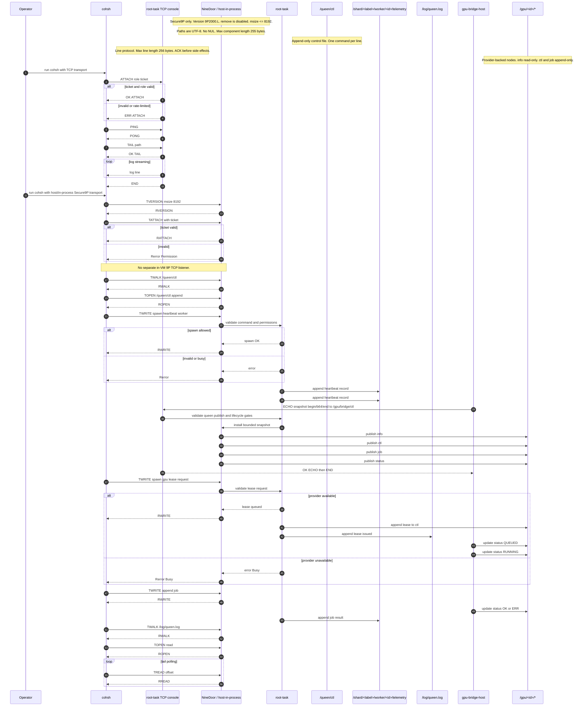

<!-- Copyright 2026 Lukas Bower -->
<!-- SPDX-License-Identifier: Apache-2.0 -->
<!-- Purpose: Canonical interface definitions for NineDoor, queen/worker verbs, GPU bridge files, and telemetry schemas. -->
<!-- Author: Lukas Bower -->
# Cohesix Interfaces (Queen/Worker, NineDoor, GPU Bridge)

The queen/worker verbs and `/queen/ctl` schema form the hive control API: one Queen instance uses these interfaces to control many workers over the shared Secure9P namespace.

This document is **canonical** for control-plane interfaces. Snippets marked `coh-rtc` are generated from
`configs/root_task.toml` and must not be edited by hand. If code diverges from this document, update IR,
regenerate artifacts, and then update docs/tests in the same change.

**Related docs**
- `docs/SECURE9P.md` — transport invariants and AccessPolicy ordering.
- `docs/ROLES_AND_SCHEDULING.md` — role-to-namespace rules.
- `docs/HOST_TOOLS.md` — host tool semantics and interdependencies.
- `docs/API_GUIDELINES.md` — REST gateway scope and mapping.
- `docs/USERLAND_AND_CLI.md` — CLI grammar and bounds.

**At a glance**
- Control files: `/queen/ctl` (3), `/queen/*/ctl` (3a–3e), `/policy/ctl` (10).
- Observability: `/proc/*` (6, 6a).
- Host bridges: `/gpu/*` (7), `/host/*` (8).
- Updates/models: `/updates/*`, `/models/*` (9).
- Console protocol: `cohsh` framing and verbs (13).

## 0. Stability & Versioning
- Interface changes that alter console grammar, NineDoor error codes, or `/proc` formats are **breaking**.
- Breaking changes require updated CLI fixtures, regenerated manifest artifacts, and a schema version bump.
- Feature-gated paths may be absent if disabled in the manifest; missing paths should be treated as gate state,
  not client bugs.

Interface invariants:
- All control writes are append-only; offsets are ignored or rejected for control files.
- All reads are bounded by manifest limits; clients must request within the declared `max_bytes`/`msize` budget.
- Paths and tokens are validated as UTF-8 with no NULs and no `..` traversal.
- `ERR` responses are deterministic and must be treated as **no side effects** unless explicitly documented.

**Figure 1.** Sequence diagram
<!-- INTERFACES.md Sequence Diagram (COMPLETE + white background) -->

```mermaid
sequenceDiagram
  autonumber

  participant Operator
  participant Cohsh as cohsh
  participant Console as root-task TCP console
  participant ND as NineDoor / host-in-process
  participant RT as root-task
  participant QCTL as /queen/ctl
  participant WT as /shard/<label>/worker/<id>/telemetry
  participant LOG as /log/queen.log
  participant GPUB as gpu-bridge-host
  participant GPU as /gpu/<id>/*

  %% =========================
  %% Protocol invariants
  %% =========================
  Note over ND: Secure9P only. Version 9P2000.L. remove is disabled. msize <= 8192.
  Note over ND: Paths are UTF-8. No NUL. Max component length 255 bytes.
  Note over QCTL: Append-only control file. One command per line.
  Note over Console: Line protocol. Max line length 256 bytes. ACK before side effects.
  Note over GPU: Provider-backed nodes. info read-only. ctl and job append-only.

  %% =========================
  %% A) TCP console attachment
  %% =========================
  Operator->>Cohsh: run cohsh with TCP transport
  Cohsh->>Console: ATTACH role ticket
  alt ticket and role valid
    Console-->>Cohsh: OK ATTACH
  else invalid or rate-limited
    Console-->>Cohsh: ERR ATTACH
  end

  %% Keepalive
  Cohsh->>Console: PING
  Console-->>Cohsh: PONG

  %% Tail logs over console
  Cohsh->>Console: TAIL path
  Console-->>Cohsh: OK TAIL
  loop log streaming
    Console-->>Cohsh: log line
  end
  Console-->>Cohsh: END

  %% =========================
  %% B) Host/in-process Secure9P session setup
  %% =========================
  Operator->>Cohsh: run cohsh with host/in-process Secure9P transport
  Cohsh->>ND: TVERSION msize 8192
  ND-->>Cohsh: RVERSION
  Cohsh->>ND: TATTACH with ticket
  alt ticket valid
    ND-->>Cohsh: RATTACH
  else invalid
    ND-->>Cohsh: Rerror Permission
  end
  Note over Cohsh,ND: No separate in-VM 9P TCP listener.

  %% =========================
  %% C) Queen control via /queen/ctl
  %% =========================
  Cohsh->>ND: TWALK /queen/ctl
  ND-->>Cohsh: RWALK
  Cohsh->>ND: TOPEN /queen/ctl append
  ND-->>Cohsh: ROPEN

  Cohsh->>ND: TWRITE spawn heartbeat worker
  ND->>RT: validate command and permissions
  alt spawn allowed
    RT-->>ND: spawn OK
    ND-->>Cohsh: RWRITE
  else invalid or busy
    RT-->>ND: error
    ND-->>Cohsh: Rerror
  end

  %% =========================
  %% D) Worker telemetry
  %% =========================
  RT->>WT: append heartbeat record
  RT->>WT: append heartbeat record

  %% =========================
  %% E) GPU publish
  %% =========================
  GPUB->>Console: ECHO snapshot begin/b64/end to /gpu/bridge/ctl
  Console->>RT: validate queen publish and lifecycle gates
  RT->>ND: install bounded snapshot
  ND->>GPU: publish info
  ND->>GPU: publish ctl
  ND->>GPU: publish job
  ND->>GPU: publish status
  Console-->>GPUB: OK ECHO then END

  %% =========================
  %% F) GPU lease request
  %% =========================
  Cohsh->>ND: TWRITE spawn gpu lease request
  ND->>RT: validate lease request
  alt provider available
    RT-->>ND: lease queued
    ND-->>Cohsh: RWRITE
    RT->>GPU: append lease to ctl
    RT->>LOG: append lease issued
    GPUB->>GPU: update status QUEUED
    GPUB->>GPU: update status RUNNING
  else provider unavailable
    RT-->>ND: error Busy
    ND-->>Cohsh: Rerror Busy
  end

  %% =========================
  %% G) GPU job execution
  %% =========================
  Cohsh->>ND: TWRITE append job
  ND-->>Cohsh: RWRITE
  GPUB->>GPU: update status OK or ERR
  RT->>WT: append job result

  %% =========================
  %% H) Tail logs via 9P
  %% =========================
  Cohsh->>ND: TWALK /log/queen.log
  ND-->>Cohsh: RWALK
  Cohsh->>ND: TOPEN read
  ND-->>Cohsh: ROPEN
  loop tail polling
    Cohsh->>ND: TREAD offset
    ND-->>Cohsh: RREAD
  end
```

## 1. NineDoor 9P Operations
- Supports **9P2000.L** only (`version`, `attach`, `walk`, `open`, `read`, `write`, `clunk`, `stat`, `remove` (disabled)).
- `msize` negotiated ≤ 8192 bytes; larger requests rejected with `Rerror(TooBig)`.
- Fid tables are per-session; `clunk` invalidates handles immediately.
- Path components limited to 255 bytes and must be valid UTF-8 without NULs.
- `/log/queen.log` is bounded, not unbounded: the live root-task ring retains up to 2048 lines. Console `cat /log/queen.log` exports the retained window in bounded 64-line batches and emits `END` only after the final retained line. Console `tail /log/queen.log` and `log` default to the old 64-line snapshot behavior; `tail /log/queen.log <lines>` may request up to 256 retained lines. Host dump workflows in `cohsh` and SwarmUI are projections over the same path and do not introduce a new VM verb or evidence channel.
- Batched request frames are permitted when enabled by the manifest (`secure9p.batch_frames`); each response is keyed by its tag and may arrive out-of-order, so clients must match replies by tag instead of FIFO ordering.
- Tag overflow (`secure9p.tags_per_session`) and batch back-pressure return deterministic `Rerror(Invalid)` or `Rerror(Busy)` with stable ordering, preserving prior single-request semantics when batching is disabled.

## 2. Capability Ticket
```rust
pub struct TicketClaims {
    pub role: Role,
    pub budget: BudgetSpec,
    pub subject: Option<String>,
    pub mounts: MountSpec,
    pub issued_at_ms: u64,
    pub scopes: Vec<TicketScope>,
    pub quotas: TicketQuotas,
}
```
- Encoded as `cohesix-ticket-<hex-payload>.<hex-mac>`.
- The MAC is BLAKE3-keyed from the configured role secret; attach rejects malformed, expired, wrong-role, wrong-subject, or MAC-mismatched tickets.
- A **ticket** is a signed capability claim, not an opaque session id. It carries the role, subject identity, budget, mount view, optional UI scopes, and optional quotas used by NineDoor/root-task policy.

## 3. Queen Control Surface
Path: `/queen/ctl` (append-only JSON lines)
```json
{"spawn":"heartbeat","ticks":100,"budget":{"ttl_s":120,"ops":500}}
{"kill":"worker-7"}
{"bind":{"from":"/shard","to":"/shadow"}}
{"mount":{"service":"gpu-bridge","at":"/gpu"}}
{"spawn":"gpu","lease":{"gpu_id":"GPU-0","mem_mb":4096,"streams":2,"ttl_s":120}}
```
- Lines must parse as UTF-8 JSON; unknown fields are rejected with deterministic `ERR` (schema is strict).
- `spawn:"gpu"` queues a lease request for the host GPU bridge; if the bridge is unavailable the command returns `Error::Busy`.
- GPU spawns require the host bridge to publish `/gpu/<id>` entries via `install_gpu_nodes`; lease issuance is mirrored to `/log/queen.log` and `/gpu/<id>/ctl`.
- Optional `priority` fields raise scheduling weight on the host bridge when multiple leases compete.
- Operators typically exercise these verbs via `cohsh`, and any GUI client is expected to speak the same protocol.
- If policy gating is enabled (`/policy/rules` present), writes to `/queen/ctl` require approvals queued in `/actions/queue`.

## 3a. Node Lifecycle Control
Path: `/queen/lifecycle/ctl` (append-only, queen-only)
```
cordon
drain
resume
quiesce
reset
```
- Commands are single-line tokens; invalid transitions return deterministic `ERR`.
- Every transition appends an audit line to `/log/queen.log`:
  - `lifecycle transition old=<STATE> new=<STATE> reason=<reason>`
- Denials are also logged:
  - `lifecycle denied action=<cmd> state=<STATE> reason=<invalid-transition|outstanding-leases|invalid-command|gate-denied>`
- Lifecycle gates apply to: worker attach, telemetry ingest, worker telemetry, GPU job submission, and host publishes.

### Lifecycle observability (read-only)
- `/proc/lifecycle/state`: `state=<BOOTING|DEGRADED|ONLINE|DRAINING|QUIESCED|OFFLINE>`
- `/proc/lifecycle/reason`: `reason=<text>`
- `/proc/lifecycle/since`: `since_ms=<u64>`

## 3b. GPU Bridge Publish Channel
Path: `/gpu/bridge/ctl` (append-only, queen-only; lifecycle gate: `host_publish`)

Publish lines (one per append):
```
begin bytes=<payload_bytes> sha256=<hex>
b64:<base64_chunk>
...
end
```
- `begin` defines the expected payload byte size and SHA-256 of the decoded wire payload.
- `b64:` lines stream the base64-encoded wire payload in bounded chunks.
- `end` finalizes the snapshot; invalid size/hash results in deterministic `ERR`.
- Successful publish installs `/gpu/<id>/*`, `/gpu/models/*`, and `/gpu/telemetry/schema.json`.

Status path: `/gpu/bridge/status` (read-only)
- `state=idle` — no active publish.
- `state=receiving bytes=<n>` — ingesting snapshot.
- `state=ok bytes=<n> sha256=<hex>` — last publish succeeded.
- `state=err reason=<detail>` — last publish failed (detail is bounded).

## 3c. Scheduler Control
Path: `/queen/schedule/ctl` (append-only JSONL)
```json
{"id":"sched-1","role":"worker-gpu","priority":2,"ticks":3,"budget_ms":120}
```
- Strict JSON line; unknown fields are rejected deterministically.
- `id` and `role` must be short ASCII tokens (alphanumeric, `-`, `_`); `ticks` and `budget_ms` must be > 0.
- Queue depth is bounded by `control_plane.schedule.queue_max_entries`; duplicate `id` entries are rejected.
- The control log is bounded by `control_plane.schedule.ctl_max_bytes`; overflow returns deterministic `ERR`.
- When enabled, `/proc/schedule/summary` and `/proc/schedule/queue` expose read-only snapshots of the queue (see `/proc` observability).

## 3d. Lease Control
Path: `/queen/lease/ctl` (append-only JSONL)
```json
{"op":"grant","id":"lease-1","subject":"queen","resource":"gpu0","ttl_s":300,"priority":5}
{"op":"renew","id":"lease-1","ttl_s":600,"priority":6}
{"op":"preempt","id":"lease-1","reason":"timeout"}
{"op":"quota","subject":"queen","resource":"gpu0","max_active":4,"max_preemptions":8}
```
- Strict JSON line with `op` = `grant|renew|preempt|quota`; unknown fields are rejected.
- `id`, `subject`, and `resource` are bounded ASCII tokens; `ttl_s`, `max_active`, and `max_preemptions` must be > 0.
- Active and preemption lists are bounded by `control_plane.lease.*_max_entries`; overflow returns deterministic `ERR`.
- The control log is bounded by `control_plane.lease.ctl_max_bytes`.
- `/proc/lease/summary`, `/proc/lease/active`, and `/proc/lease/preemptions` expose read-only snapshots when enabled.

## 3e. Export Control
Path: `/queen/export/ctl` (append-only JSONL)
```json
{"op":"open","id":"export-1","ttl_s":900}
{"op":"close","id":"export-1","reason":"window-complete"}
```
- Strict JSON line with `op` = `open|close`; unknown fields are rejected.
- `id` and `reason` are bounded ASCII tokens; `ttl_s` must be > 0.
- The control log is bounded by `control_plane.export.ctl_max_bytes`.

## 4. Worker Telemetry
- Path (canonical): `/shard/<label>/worker/<id>/telemetry` (append-only, newline-delimited records).
- Legacy alias (when enabled): `/worker/<id>/telemetry`.
- Heartbeat payload: `{"tick":42,"ts_ms":123456789}`.
- GPU payload: `{"job":"jid-9","state":"RUNNING","detail":"scheduled"}` followed by `{"job":"jid-9","state":"OK","detail":"completed"}`.
- Telemetry ring quotas and cursor retention are manifest-governed:
  - `telemetry.ring_bytes_per_worker` caps the per-worker append-only ring.
  - `telemetry.cursor.retain_on_boot` preserves or resets cursor state after reboot.
  - `telemetry.frame_schema` gates legacy plain-text vs CBOR framing.
- GPU telemetry schema (Milestone 6a; LoRA here refers to model adapters, not LoRa radio):
  - Descriptor: `/gpu/telemetry/schema.json` (read-only, versioned)
  - Records must include `schema_version`, `device_id`, `model_id`, `time_window`, `token_count`, `latency_histogram`.
  - Optional fields: `lora_id`, `confidence`, `entropy`, `drift`, `feedback_flags`.
  - Max record size: 4096 bytes; host-side telemetry emitters must enforce bounds before forwarding to `/queen/telemetry/*`.
  - Only the schema is mirrored into the VM; telemetry records remain host-side.

### Queen telemetry ingest (host push)
- Path: `/queen/telemetry/<device_id>/`
  - `ctl` — append-only control log. Accepts JSON lines of the form `{"new":"segment","mime":"text/plain"}`.
  - `seg/` — directory containing OS-named segments (append-only).
  - `latest` — read-only pointer to the newest segment (single line: `<seg_id>`).
- Segment creation is **OS-owned**: clients can only request a new segment via `ctl`; names are assigned `seg-000001`, `seg-000002`, ... per device. Console `ECHO` acknowledgements for successful `ctl` segment creation include `seg_id=<id>` in the detail field so clients do not need a follow-up `latest` read on the common path.
- Segment writes are append-only; offsets must match the end of the file (or use `u64::MAX`). Random writes, truncation, and renames are rejected.
- Quotas are manifest-driven via `telemetry_ingest.*`:
  - `max_segments_per_device`
  - `max_bytes_per_segment`
  - `max_total_bytes_per_device`
  - `max_reference_entries_per_segment`
  - `max_reference_manifest_bytes_per_segment`
  - `max_reference_bytes_per_segment`
  - `eviction_policy` (`refuse` | `evict-oldest`)
- Max record size: 4096 bytes; each append is treated as one telemetry record.

### Queen LoRA export (read-only)
- Path: `/queen/export/lora_jobs/<job_id>/`
  - `telemetry.cbor` — CBOR telemetry bundle (bounded).
  - `base_model.ref` — base model identifier (single line).
  - `policy.toml` — export policy snapshot (TOML).
- Export directories are created by the Queen when telemetry gates pass and remain read-only to clients.

### Telemetry ingest envelope (cohsh-telemetry-push/v1)
`cohsh telemetry push` emits UTF-8 JSON lines, one per append:
```json
{"schema":"cohsh-telemetry-push/v1","seq":1,"mime":"text/plain","payload":"telemetry demo line 1"}
```
| Field | Type | Required | Description |
| --- | --- | --- | --- |
| `schema` | `text` | yes | Schema identifier; must be `cohsh-telemetry-push/v1`. |
| `seq` | `uint` | yes | Monotonic per-segment sequence number (starts at 1). |
| `mime` | `text` | yes | MIME type of the source payload (e.g. `text/plain`). |
| `payload` | `text` | yes | Opaque UTF-8 payload chunk; `cohsh` chunks to stay within `max_record_bytes` (4096). |

### Telemetry reference-manifest envelope (coh-ref-c/v1)
For large host artifacts, `cohsh telemetry push` and the Python SDK emit reference-manifest lines instead of inline payload transfer:
```json
{"schema":"coh-ref-c/v1","seq":1,"off":0,"len":16777216,"sha256":"QmFzZTY0RGlnZXN0Li4u"}
```
| Field | Type | Required | Description |
| --- | --- | --- | --- |
| `schema` | `text` | yes | Schema identifier; must be `coh-ref-c/v1`. |
| `seq` | `uint` | yes | Monotonic record sequence (starts at 1). |
| `off` | `uint` | yes | Referenced byte offset. Must be contiguous (`off == prior off + len`). |
| `len` | `uint` | yes | Referenced chunk bytes (`>= 1`). |
| `sha256` | `text` | yes | Chunk digest token (bounded ASCII digest alphabet). |

Deterministic ingest rules:
- A segment is either inline (`cohsh-telemetry-push/v1`) or reference-manifest (`coh-ref-c/v1`); mixing modes in one segment is rejected.
- Reference manifests are bounded by `max_reference_entries_per_segment`, `max_reference_manifest_bytes_per_segment`, and `max_reference_bytes_per_segment`.
- Per-record Secure9P limits are unchanged (`msize <= 8192`, record payload <= 4096 bytes).

<!-- coh-rtc:sharding:start -->
### Sharded worker namespace (generated)
- `sharding.enabled`: `true`
- `sharding.shard_bits`: `8`
- `sharding.legacy_worker_alias`: `true`
- shard labels: `00..ff` (count: 256)
- canonical worker path: `/shard/<label>/worker/<id>/telemetry`
- legacy alias: `/worker/<id>/telemetry`

_Generated from `configs/root_task.toml` (sha256: `afc015e7a9f9bea1625f43a291c485760b380eebedb622af15ebcc40f6ba2fc9`)._
<!-- coh-rtc:sharding:end -->

<!-- coh-rtc:telemetry-cbor:start -->
### Telemetry CBOR Frame v1 (generated)
- Schema: `telemetry-frame/v1`
- Version: `1`
- Encoding: CBOR map (major type 5)

| Field | CBOR type | Required | Description |
| --- | --- | --- | --- |
| `schema` | `text` | `yes` | Schema identifier; must be `telemetry-frame/v1`. |
| `worker_id` | `text` | `yes` | Worker identifier emitting the record. |
| `role` | `text` | `yes` | Worker role label (`worker-heartbeat`, `worker-gpu`). |
| `seq` | `uint` | `yes` | Monotonic frame sequence number. |
| `emitted_ms` | `uint` | `yes` | Unix epoch milliseconds captured by the worker. |
| `payload` | `map` | `yes` | Schema-specific payload map (e.g., heartbeat or GPU job data). |

_Generated by coh-rtc (sha256: `d1906bce668a4d73d95a8262734f1ec04a1480610ebfd9b6c3f3c8ad2e402b7e`)._
<!-- coh-rtc:telemetry-cbor:end -->

## 5. Sidecar Bus & LoRa Mounts
Sidecar namespaces are manifest-gated; mounts appear only when `sidecars.*.enable = true` and adapter labels are compiler-resolved (hash-prefixed on collision).

### `/bus/<adapter>` (MODBUS/DNP3)
- `ctl` — append-only control log for sidecar coordination (byte-for-byte, bounded by `secure9p.msize`).
- `telemetry` — append-only; when link is offline, payloads are spooled for deterministic replay.
- `link` — append-only; accepts `online` or `offline` to toggle link state.
- `replay` — append-only; any write drains the spool into telemetry and appends `replay entries=<n> bytes=<m>`.
- `spool` — read-only; lines `entries=<n> bytes=<m> max_entries=<n> max_bytes=<m>` plus per-frame `seq=<n> bytes=<m> payload=<text>`.

### `/lora/<adapter>`
- `ctl` — append-only transmit attempts; duty-cycle guard enforces window/percent limits, violations return `ERR` and record tamper entries.
- `telemetry` — read-only mirror of accepted payloads (populated by `ctl` writes).
- `tamper` — read-only; lines `tamper ts_ms=<ms> reason=<payload-oversize|duty-cycle> bytes=<n>`.

- Capability scope is enforced per adapter; mismatched roles or scopes yield deterministic `ERR` plus a `sidecar-deny` audit line in `/log/queen.log`.

## 6. /proc Observability
<!-- coh-rtc:observability-interfaces:start -->
### /proc observability nodes (generated)
- `/proc/9p/sessions` (read-only, max 8192 bytes): `sessions total=<u64> worker=<u64> shard_bits=<u8> shard_count=<u16>` plus `shard <hex> <count>` lines.
- `/proc/9p/outstanding` (read-only, max 128 bytes): `outstanding current=<u64> limit=<u64>`.
- `/proc/9p/short_writes` (read-only, max 128 bytes): `short_writes total=<u64> retries=<u64>`.
- `/proc/9p/session/active` (read-only, max 128 bytes): `active=<u64> draining=<u64>`.
- `/proc/9p/session/<id>/state` (read-only, max 64 bytes): `state=SETUP|ACTIVE|DRAINING|CLOSED`.
- `/proc/9p/session/<id>/since_ms` (read-only, max 64 bytes): `since_ms=<u64>`.
- `/proc/9p/session/<id>/owner` (read-only, max 96 bytes): `owner=<identity>`.
- `/proc/ingest/p50_ms` (read-only, max 64 bytes): `p50_ms=<u32>` (milliseconds).
- `/proc/ingest/p95_ms` (read-only, max 64 bytes): `p95_ms=<u32>` (milliseconds).
- `/proc/ingest/backpressure` (read-only, max 64 bytes): `backpressure=<u64>`.
- `/proc/ingest/dropped` (read-only, max 64 bytes): `dropped=<u64>`.
- `/proc/ingest/queued` (read-only, max 64 bytes): `queued=<u32>`.
- `/proc/ingest/watch` (append-only, max_entries=16, line_bytes=192, min_interval_ms=50): `watch ts_ms=<u64> p50_ms=<u32> p95_ms=<u32> queued=<u32> backpressure=<u64> dropped=<u64> ui_reads=<u64> ui_denies=<u64>`.
- `/proc/root/reachable` (read-only, max 32 bytes): `reachable=yes|no`.
- `/proc/root/last_seen_ms` (read-only, max 64 bytes): `last_seen_ms=<u64>`.
- `/proc/root/cut_reason` (read-only, max 64 bytes): `cut_reason=<none|network_unreachable|session_revoked|policy_denied|lifecycle_offline>`.
- `/proc/pressure/busy` (read-only, max 64 bytes): `busy=<u64>`.
- `/proc/pressure/quota` (read-only, max 64 bytes): `quota=<u64>`.
- `/proc/pressure/cut` (read-only, max 64 bytes): `cut=<u64>`.
- `/proc/pressure/policy` (read-only, max 64 bytes): `policy=<u64>`.
- `/proc/schedule/summary` (read-only, max 128 bytes): `queue=<u64> dequeued=<u64> dropped=<u64> max_entries=<u32>`.
- `/proc/schedule/queue` (read-only, max 256 bytes): `id=<id> role=<role> priority=<u32> ticks=<u32> budget_ms=<u32> seq=<u64>`.
- `/proc/lease/summary` (read-only, max 160 bytes): `active=<u64> preemptions=<u64> quotas=<u64> max_active=<u32> max_preemptions=<u32>`.
- `/proc/lease/active` (read-only, max 256 bytes): `id=<id> subject=<subject> resource=<resource> ttl_s=<u32> priority=<u32> state=<STATE> seq=<u64>`.
- `/proc/lease/preemptions` (read-only, max 256 bytes): `id=<id> subject=<subject> resource=<resource> reason=<reason> seq=<u64>`.

_Generated by coh-rtc (sha256: `4ff0d485329b917eeaa1b604f8adfb28fd0a75924e7d55ac818d9359b81379b5`)._
<!-- coh-rtc:observability-interfaces:end -->

## 6a. NineDoor UI Providers (Read-Only)
- UI providers expose bounded, cursor-resumable summaries for UI clients: each read ≤ 8192 bytes, total stream ≤ 32 KiB, deterministic EOF.
- Manifest toggles: `ui_providers.*` gates visibility; `/proc` UI providers require corresponding `observability.*`, `/policy/preflight/*` requires `ecosystem.policy.enable`, `/updates/*` requires `cas.enable`.
- Disabled providers return deterministic `ERR` and emit `ui-provider` audit lines.

### /proc UI summaries (text + CBOR)
- `/proc/9p/sessions(.cbor)` — text output matches `/proc` observability; CBOR map: `total`, `worker`, `shard_bits`, `shard_count`, `shards[] {label, count}`.
- `/proc/9p/outstanding(.cbor)` — text output matches `/proc` observability; CBOR map: `current`, `limit`.
- `/proc/9p/short_writes(.cbor)` — text output matches `/proc` observability; CBOR map: `total`, `retries`.
- `/proc/ingest/p50_ms(.cbor)` — text output matches `/proc` observability; CBOR map: `p50_ms`.
- `/proc/ingest/p95_ms(.cbor)` — text output matches `/proc` observability; CBOR map: `p95_ms`.
- `/proc/ingest/backpressure(.cbor)` — text output matches `/proc` observability; CBOR map: `backpressure`.

### Policy preflight (text + CBOR)
- `/policy/preflight/req(.cbor)` — text: `req total=<u64> queued=<u64> consumed=<u64>` plus `req id=<id> target=<path> decision=<allow|deny> state=<queued|consumed>`.
- `/policy/preflight/req.cbor` — CBOR map: `total`, `queued`, `consumed`, `actions[] {id, target, decision, state}`.
- `/policy/preflight/diff(.cbor)` — text: `diff rules=<u64> actions=<u64> unmatched=<u64>` plus `rule id=<id> target=<path> queued=<u64> consumed=<u64>`.
- `/policy/preflight/diff.cbor` — CBOR map: `rules`, `actions`, `unmatched`, `entries[] {id, target, queued, consumed}`.

### Update status (text + CBOR)
- `/updates/<epoch>/manifest.cbor` — read-only; schema `cohesix-cas/manifest-v1`.
- `/updates/<epoch>/status(.cbor)` — text lines: `status epoch=<epoch> state=<empty|manifest_pending|chunks_pending|ready>`, `manifest_bytes=<u64> manifest_pending_bytes=<u64>`, `chunks_expected=<u64> chunks_committed=<u64> chunks_pending=<u64> chunks_missing=<u64>`, `payload_bytes=<u64> payload_sha256=<hex|none>`, `delta_base_epoch=<epoch|none> delta_base_sha256=<hex|none>`.
- `/updates/<epoch>/status.cbor` — CBOR map: `epoch`, `state`, `manifest_bytes`, `manifest_pending_bytes`, `chunks_expected`, `chunks_committed`, `chunks_pending`, `chunks_missing`, `payload_bytes`, `payload_sha256` (bytes or null), `delta` (map `{base_epoch, base_sha256}` or null).

## 6b. SwarmUI Consumption (Host UI)
- SwarmUI is a host-only Tauri client that defaults to the TCP console transport via `cohsh`; `SWARMUI_TRANSPORT=9p` selects a host/in-process or profile-scoped Secure9P transport when configured. No new verbs or in-VM services are introduced.
- Telemetry and fleet panels are read-only; `tail` transcripts must emit `OK ...`, stream lines, and terminate with `END` exactly as the CLI does.
- Scheduler and lease panels are read-only views powered by `/proc/schedule/*` and `/proc/lease/*`; they never append or mutate control files.
- The frontend is rendering-only: no retries, caching policy, or background polling logic; watchers exist only when a view is active.
- Offline inspection is read-only and uses cached CBOR snapshots under `$DATA_DIR/snapshots/`; no network access or retries occur while offline.

### Live Hive (render-only PixiJS view)
- Live Hive is a WebGL PixiJS scene embedded in SwarmUI; it consumes the same telemetry tails as the panels and inherits the console/9P transport choice without adding new verbs.
- Ingestion is backend-owned: telemetry stream lines map to hive events (`ERR` -> error pulse, other lines -> telemetry); the frontend applies bounded diffs and makes no per-event draw guarantees.
- Freshness-first ingestion: the backend samples up to `swarmui.hive.poll_workers_per_tick` workers per poll, caps per-worker pending lines with `swarmui.hive.pending_lines_per_worker`, and drops oldest events beyond `swarmui.hive.pending_event_cap` to keep newest telemetry visible.
- Live Hive surfaces authority and contention by reading `/proc/root/reachable`, `/proc/root/cut_reason`, `/proc/9p/session/active`, and `/proc/pressure/*` (text-only). UI badges render `ROOT OK` vs `CUT`, session counts highlight `DRAINING`, and pressure counters are displayed inline.
- Status snapshots are rate-limited by `swarmui.hive.status_poll_ms` and cached between polls; the Live Hive poll loop follows the same interval (clamped to ≥250 ms) so telemetry deltas refresh once per poll within the configured event budget.
- `ERR` lines tagged with `reason=busy|quota|cut|policy` are classified and displayed by category instead of a single generic failure bucket.
- Replay is deterministic across live streams, recorded transcripts, and cached CBOR snapshots. `--replay <snapshot>` accepts CBOR snapshots or transcripts; offline mode reads `$DATA_DIR/snapshots/hive:<key>.cbor`.
- LOD and degradation rules: zoomed out renders cluster hulls + aggregate flow intensity, zoomed in renders agents + pollen, and under load degrades to flow-only intensity; frame cap (`swarmui.hive.frame_cap_fps`), step (`swarmui.hive.step_ms`), budgets (`swarmui.hive.lod_event_budget`, `swarmui.hive.snapshot_max_events`, `swarmui.hive.pending_event_cap`), and pressure threshold (`swarmui.hive.degrade_pressure`) are compiler-emitted.
- Live Hive rendering stays active during scroll with degraded cadence/quality to keep the page responsive; rendering pauses only when the canvas is offscreen/hidden, while telemetry continues polling and buffers for a flush once visible again.
- When the canvas is not actively interacted with, Live Hive caps detail LOD, drops renderer resolution, and throttles simulation cadence/budgets, then restores full cadence on interaction to keep scrolling smooth without dropping telemetry.
- Visual language: circle/soft-blob primitives only, glow and pulse effects are single-shot and bounded, and SVG is limited to labels or selection overlays.
- Agent dots are role-coded (queen/worker-heartbeat/worker-gpu/worker-lora/worker-bus/worker); a numeric label beside each worker dot provides stable identity hints when IDs are long.
- Clicking a worker dot selects it for the detail panel; overlay cards and dot clicks stay in sync and do not introduce any new verbs or polling paths.
- Live Hive renders bounded telemetry text: per-worker overlays show the last N lines, and a selectable detail panel shows the last M lines. Line caps and per-worker byte budgets are enforced in shared `cohsh-core` tail buffers, not in UI code.
- Performance guardrails: resize only on actual canvas bounds changes and drain event queues via cursors (avoid per-frame `splice`); a debug metrics hook is reserved for UI performance harnesses.
- Design tokens and assets: fonts load from `apps/swarmui/frontend/assets/fonts` (mono ligatures off by default via `.mono`, opt-in `.mono.liga`), colors and spacing live in `apps/swarmui/frontend/styles/colors.css` and `apps/swarmui/frontend/styles/tokens.css`, hive tokens mirror CSS in `apps/swarmui/frontend/hive/tokens.js`, icons use `apps/swarmui/frontend/assets/icons/sprite.svg` via `apps/swarmui/frontend/components/icon.js`, and layout spacing is limited to 4/8/12/16/24/32 with no shadows.

## 7. GPU Bridge Files (host-mirrored)
| Path | Mode | Description |
|------|------|-------------|
| `/gpu/bridge/ctl` | append-only | GPU bridge snapshot publish channel (`begin`/`b64:`/`end`). |
| `/gpu/bridge/status` | read-only | Publish status (`state=idle|receiving|ok|err`). |
| `/gpu/<id>/info` | read-only | JSON metadata: vendor, model, memory, SMs, driver/runtime versions |
| `/gpu/<id>/ctl` | append-only | Lease management: `LEASE`, `RELEASE`, `PRIORITY <n>` |
| `/gpu/<id>/lease` | append-only | Lease/ticket log entries (`gpu-lease/v1`) with active/release state |
| `/gpu/<id>/job` | append-only | JSON job descriptors (validated hash, grid/block dims, optional `payload_b64`) |
| `/gpu/<id>/status` | read-only append stream | Job lifecycle entries (QUEUED/RUNNING/OK/ERR) |
| `/gpu/models/available/<model_id>/manifest.toml` | read-only | Host-authored model manifests; no uploads from the VM |
| `/gpu/models/active` | append-only pointer | Symlink-like pointer to the active model (atomic swap on host) |
| `/gpu/telemetry/schema.json` | read-only | Versioned schema descriptor (`gpu-telemetry/v1`) with field and size limits |
| `/gpu/telemetry/*` | host-only | Telemetry records remain host-side; only the schema is mirrored into the VM. |

- Host GPU discovery prefers NVML; when NVML is feature-limited (Jetson), CUDA driver/runtime APIs supply `memory_mb`, `sm_count`, and version fields.
- In `dev-virt` QEMU runs without a host GPU bridge, the root-task exposes mock `/gpu/<id>/info`, `/gpu/<id>/lease`, and `/gpu/<id>/status` entries (GPU-0/GPU-1) for CLI demos; `/gpu/models` and `/gpu/telemetry/schema.json` remain host-mirrored only.

<!-- coh-rtc:gpu-breadcrumbs:start -->
### GPU status breadcrumb schema (generated)
- `coh.run.lease.schema`: `gpu-lease/v1`
- `coh.run.lease.active_state`: `ACTIVE`
- `coh.run.lease.max_bytes`: `1024`
- `coh.run.breadcrumb.schema`: `gpu-breadcrumb/v1`
- `coh.run.breadcrumb.max_line_bytes`: `512`
- `coh.run.breadcrumb.max_command_bytes`: `256`
- Lease entries are JSON lines with fields: `schema`, `state`, `gpu_id`, `worker_id`, `mem_mb`, `streams`, `ttl_s`, `priority`.
- Breadcrumb entries are JSON lines with fields: `schema`, `event`, `command`, `status`, `exit_code` (optional).

_Generated by coh-rtc (sha256: `80eff6277e0b97c54fc8996ffc01a54ccff20b899bcd0e9f63c30de1afb02f80`)._
<!-- coh-rtc:gpu-breadcrumbs:end -->

- Host-side GPU/PEFT tooling owns model activation and telemetry annotation today. `worker-gpu` consumes GPU tickets and lease/status files; it does not currently implement a VM-side read of `/gpu/models/active` or automatic `model_id`/`lora_id` propagation.
- Telemetry records that exceed `max_record_bytes` or omit required fields must be rejected by host-side emitters; the VM does not accept `/gpu/telemetry/*` writes.

## 8. Host Sidecar Files (`/host`)
| Path | Mode | Description |
|------|------|-------------|
| `/host/systemd/<unit>/status` | append-only | Host-published unit status snapshots (mock or live) |
| `/host/systemd/<unit>/start` | append-only | Control sink for start requests (queen-only) |
| `/host/systemd/<unit>/stop` | append-only | Control sink for stop requests (queen-only) |
| `/host/systemd/<unit>/restart` | append-only | Control sink for restart requests (queen-only) |
| `/host/k8s/node/<name>/cordon` | append-only | Control sink for cordon requests (queen-only) |
| `/host/k8s/node/<name>/drain` | append-only | Control sink for drain requests (queen-only) |
| `/host/docker/status` | append-only | Host-published Docker status snapshot (mock or live) |
| `/host/docker/restart` | append-only | Control sink for restart requests (queen-only) |
| `/host/docker/stop` | append-only | Control sink for stop requests (queen-only) |
| `/host/nvidia/gpu/<id>/status` | append-only | Host-published GPU status snapshots (mock or live) |
| `/host/nvidia/gpu/<id>/power_cap` | append-only | Control sink for power-cap changes (queen-only) |
| `/host/nvidia/gpu/<id>/thermal` | append-only | Host-published thermal snapshots (mock or live) |
| `/host/tickets/spec` | append-only JSONL | Host control ticket requests (`host-ticket/v1`) |
| `/host/tickets/status` | append-only JSONL | Host control ticket lifecycle receipts (`host-ticket-result/v1`) |
| `/host/tickets/deadletter` | append-only JSONL | Terminal failure/expiry receipts (`host-ticket-result/v1`) |
| `/host/tickets/spec.snapshot` | read-only | Bounded snapshot view of `/host/tickets/spec` |
| `/host/tickets/status.snapshot` | read-only | Bounded snapshot view of `/host/tickets/status` |
| `/host/tickets/deadletter.snapshot` | read-only | Bounded snapshot view of `/host/tickets/deadletter` |

Line formats (append-only snapshots; values are sanitized and lines capped at 256 bytes):
- systemd status: `state=<state> sub=<substate>`
- k8s node status: `state=<ready|unknown|...> role=<role> version=<version>`
- docker status: `version=<ver> containers=<n> running=<n> paused=<n> stopped=<n>`
- nvidia status: `util_pct=<n> mem_used_mb=<n> mem_total_mb=<n> temp_c=<n> power_w=<n>`
- nvidia thermal: `temp_c=<n>`
- On provider errors, status lines emit `state=unknown reason=<detail>` and thermal falls back to `temp_c=unknown`.
- Host tickets are strict JSONL:
  - spec line required fields: `schema`, `id`, `idempotency_key`, `action`; optional `target`, `args`, `expires_unix_ms`.
  - spec line federation fields (optional, additive): `source_hive`, `target_hive`, `relay_hop`, `relay_correlation_id`.
  - result line required fields: `schema`, `id`, `idempotency_key`, `action`, `state`; optional `message`.
  - result line federation fields (optional, additive): `source_hive`, `target_hive`, `relay_hop`, `relay_correlation_id`.
  - `id`/`idempotency_key` tokens are bounded ASCII (`[A-Za-z0-9._:-]`, max 128 bytes).
  - `source_hive` and `target_hive` are pair-required (both set or both unset).
  - `relay_hop` must be in range `1..=32` when present.
  - `relay_correlation_id` follows the same bounded token charset (`[A-Za-z0-9._:-]`).
  - action must be in manifest allowlist.
  - state must be in manifest lifecycle allowlist.
  - line bytes must be `<= ecosystem.host.tickets.max_line_bytes` and `<= secure9p.msize`.
- Canonical lifecycle transitions for host tickets: `queued` -> `claimed` -> `running` -> `succeeded|failed|expired`.
- Idempotency key for replay/evidence correlation is:
  - local tickets: `id + idempotency_key`
  - federated tickets: `id + idempotency_key + source_hive + target_hive`
- Federation relay policy is manifest-gated under `ecosystem.host.federation.*` (peer inventory, allowlisted actions, queue/WAL bounds, timeout).

- `/host` is only mounted when `ecosystem.host.enable = true`; providers are selected from `ecosystem.host.providers[]` and mounted at `ecosystem.host.mount_at`.
- Control writes are append-only; non-queen write attempts return deterministic `Permission` (`EPERM`) errors and emit audit lines that include the ticket and path.
- Audit lines flow through the existing `/log/queen.log` logging path; no new logging protocol is introduced.

## 9. CAS Updates & Models
- Update bundles are exposed under `/updates/<epoch>` and written via append-only `manifest.cbor` and `chunks/<sha256>` nodes; chunk payloads must exactly match `cas.store.chunk_bytes`.
- Chunk uploads are resumable by appending multiple writes until the fixed-size chunk is complete; mismatched hashes are rejected and quarantined.
- Delta manifests reference a non-delta base (`delta.base_epoch`, `delta.base_sha256`), and the payload hash covers base + delta bytes.
- Models are exposed at `/models/<sha256>/{weights,schema,signature}` and become read-only once committed; the entire registry is gated by `ecosystem.models.enable`.
- Example bind (queen): `bind /models/<sha256> /shard/<label>/worker/worker-1/model`. The legacy `/worker/worker-1/...` alias is valid only when `sharding.legacy_worker_alias = true`.

<!-- coh-rtc:cas-interfaces:start -->
### CAS update surfaces (generated)
- `cas.store.chunk_bytes`: `128`
- `cas.delta.enable`: `true`
- `cas.signing.required`: `true`
- Base update layout: `/updates/<epoch>/manifest.cbor`, `/updates/<epoch>/chunks/<sha256>`.
- Model registry layout: `/models/<sha256>/weights`, `/models/<sha256>/schema`, `/models/<sha256>/signature`.
- Delta manifests supply `delta.base_epoch` and `delta.base_sha256`, referencing a non-delta base.
- Payloads are appended as raw bytes or `b64:`-prefixed base64.
- CAS manifest template:
```json
{
  "chunk_bytes": 128,
  "chunks": [
    "<sha256-hex>"
  ],
  "delta": {
    "base_epoch": "<epoch>",
    "base_sha256": "<sha256-hex>"
  },
  "epoch": "<epoch>",
  "payload_bytes": "<payload-bytes>",
  "payload_sha256": "<sha256-hex>",
  "schema": "cohesix-cas/manifest-v1",
  "signature": "<ed25519-signature-hex>"
}
```

_Generated by coh-rtc (sha256: `1bd13b5ce9da8c2e5442e87cfca3e95daa90ee3fbba7de30e21855f19a3ae8a5`)._
<!-- coh-rtc:cas-interfaces:end -->

## 10. PolicyFS & Actions (`/policy`, `/actions`)
| Path | Mode | Description |
|------|------|-------------|
| `/policy/ctl` | append-only | Policy control JSONL commands (validated UTF-8, manifest-bounded) |
| `/policy/rules` | read-only | Manifest-derived policy rules snapshot |
| `/actions/queue` | append-only | JSONL approvals/denials (`id`, `target`, `decision`) |
| `/actions/<id>/status` | read-only | Status snapshot (`queued` → `consumed`) |

- PolicyFS nodes appear only when `ecosystem.policy.enable = true`.
- Gate approvals are single-use: once an action is consumed, replay attempts return deterministic `EPERM` and append a policy audit line to `/log/queen.log`.
- Rules are authored in `configs/root_task.toml` and emitted verbatim in `/policy/rules` for deterministic inspection.

Policy control (`/policy/ctl`) JSONL:
```json
{"op":"apply","id":"rev-2026-02-03","sha256":"0123456789abcdef0123456789abcdef0123456789abcdef0123456789abcdef"}
{"op":"rollback","id":"rev-2026-02-03"}
```
- Strict JSON line with `op` = `apply|rollback`; unknown fields are rejected.
- `id` must be a bounded ASCII token; `sha256` must be 64 hex characters.
- Apply updates the active policy revision; rollback reverts to a prior revision by `id`.
- The control log is bounded by `ecosystem.policy.ctl_max_bytes`; overflow returns deterministic `ERR`.

## 11. AuditFS & ReplayFS (`/audit`, `/replay`)
| Path | Mode | Description |
|------|------|-------------|
| `/audit/journal` | append-only | JSONL audit journal of Cohesix control actions (bounded by manifest) |
| `/audit/decisions` | append-only | Policy approvals/denials (`policy-action`, `policy-gate`) with role/ticket metadata |
| `/audit/export` | read-only | Snapshot of retention bounds (`journal_base`, `journal_next`, `decisions_base`, `decisions_next`) plus replay flags |
| `/replay/ctl` | append-only | Replay command JSON (`{"from":<cursor>}`) |
| `/replay/status` | read-only | Replay status (`idle`/`ok`/`err`) with deterministic `sequence_fnv1a` |

- AuditFS nodes appear only when `ecosystem.audit.enable = true`; ReplayFS nodes require `ecosystem.audit.replay_enable = true`.
- `/audit/journal` and `/replay/ctl` enforce append-only semantics; offset mismatches return deterministic `Invalid` errors and emit audit lines.
- Replay is bounded to the retained audit window and applies only Cohesix-issued control-plane actions; requests outside the window return `ERR` and produce no side effects.

## 12. Root Task RPC (internal trait)
```rust
pub trait RootTaskControl {
    fn spawn(&self, role: Role, spec: WorkerSpec) -> Result<WorkerId, SpawnError>;
    fn kill(&self, id: WorkerId) -> Result<(), KillError>;
    fn bind(&self, session: SessionId, from: &str, to: &str) -> Result<(), NamespaceError>;
    fn mount(&self, session: SessionId, service: &str, at: &str) -> Result<(), NamespaceError>;
}
```
- NineDoor invokes these methods after validating JSON commands and ticket permissions.
- `WorkerSpec` includes budget, initial telemetry seed, and optional GPU lease request.

## 13. CLI (`cohsh`) Protocol
- For host/in-process Secure9P sessions, the client attaches using the queen or worker ticket, negotiates `msize`, then issues 9P ops corresponding to shell commands.
- For live QEMU/Pi sessions, `cohsh --transport tcp` connects to the authenticated root-task console listener and sends console verbs through Secure9P-style frames. Cohesix does not expose a separate in-VM 9P/TCP listener.
- `tail` uses repeated `read` calls with offset tracking; NineDoor enforces append-only by ignoring provided offsets.
- `bind` and `mount` commands are no-ops for non-queen roles.
- `--transport tcp` connects to the root-task console listener (default `127.0.0.1:31337`) and speaks a Secure9P-style framed protocol:
  - Each console line is encoded as a length-prefixed frame (4-byte little-endian length including the header, followed by the UTF-8 payload).
  - `ATTACH <role> <ticket?>` → `OK ATTACH role=<role>` on success or `ERR ATTACH reason=<cause>` on failure.
  - `TAIL <path>` emits `OK TAIL path=<path>` before newline-delimited log entries; the stream still terminates with `END`.
  - `CAT <path>` emits `OK CAT path=<path> data=<summary>` before newline-delimited contents; the stream still terminates with `END`.
  - `LS <path>` emits `OK LS path=<path> entries=<n>`, newline-delimited entries, then `END`.
  - Other verbs (e.g., `LOG`, `ECHO`, `SPAWN`) mirror serial behaviour and return a single acknowledgement before triggering side effects.
- `PING` / `PONG` probes keep sessions alive; the client sends `PING` every 15 seconds of inactivity and expects an immediate
    `PONG` even when the server is mid-stream.
  - The TCP console enforces a maximum line length of 256 bytes and rate-limits failed authentication attempts (3 strikes within
    60 seconds triggers a 90-second cooldown). Oversized frames on authenticated sessions yield
    `ERR FRAME reason=invalid-length` and the session remains open. `cohsh` additionally validates worker tickets locally,
    rejecting whitespace or malformed values so automation does not leak failed attempts over the wire.
- Cohesix ships regression scripts in `.coh` format consumed by `coh> test`; see the canonical spec in [USERLAND_AND_CLI.md](./USERLAND_AND_CLI.md#coh-scripts-coh) for syntax and assertion rules.
- For `dev-virt`, QEMU forwards `127.0.0.1:{31337/tcp,31338/udp,31339/tcp}` to `10.0.2.15` for the console and self-test ports; the virtio-net backend is the default (`net-backend-virtio`), with RTL8139 available as a fallback by removing that feature. Operators generally do not need to care which NIC is active, but the backend label appears in boot logs for diagnostics.
- For `pi4-uboot-aarch64` (and migration alias `uefi-aarch64`), backend and addressing are authored through `hw.network.*`: `hw.network.backend=bcmgenet-v5`, `hw.network.mode=(off|static|dhcp)`, `hw.network.interface=(wired|wifi|auto)`, manifest static IPv4 when `mode=static`, and bounded DHCP retry/timeout fields when `mode=dhcp`.
- When the staged Pi 4 DTB carries an explicit invalid Cohesix network override, root-task now emits `[net-policy] source=dtb rejected reason=<reason> ...` and rejects net-console bring-up with `invalid net config: dtb override rejected (<reason>)`; it no longer silently falls back to the manifest-selected backend on that path.
- The staged Pi 4 U-Boot build uses a Cohesix-specific `bootcmd` that loads `boot.scr.uimg` directly from `mmc 0:1` instead of entering the generic EFI/bootflow scan, uses `CONFIG_ENV_IS_NOWHERE` so generic `uboot.env` cannot override console/input state, and relies on only the Cohesix-owned `cohesix.env` policy file. The staged boot script forces serial input before loading `cohesix.env` or checking the authenticated fast-boot marker, then presents the Linux-style numbered wizard on cold boot; the default first action continues with saved Cohesix policy when present and otherwise boots manifest defaults. Saving settings persists only the Cohesix policy fields into `cohesix.env`; it does not rewrite the manifest or generic U-Boot environment. The wizard starts USB only for menu/input with `pci enum; usb start` and switches `stdin` to `usbkbd,serial` only when that session is live so the HDMI wizard keeps USB keyboard input; `scripts/pi4-image-build.sh --uboot-menu-input serial` is the serial-only opt-out. Before `bootm`, it returns input to serial, clears stale `coh_xhci_*` trust tokens, requests one U-Boot USB stop only when a USB menu session was active, and exports no stopped register seeds (`cohesix,xhci-usbcmd`, `cohesix,xhci-usbsts`, `cohesix,xhci-iman0`), clean-halt claim, or bootloader xHCI ownership contract; if no U-Boot USB session was active, Cohesix still starts unseeded. The image builder no longer has a U-Boot xHCI handoff opt-in; `cohesix,xhci-mmio`, PCI COMMAND, stopped register seeds, and handoff trust tokens are never staged by the current script. It no longer forces a handoff `usb reset`, emits USB trace breadcrumbs, records handoff source labels, or mirrors capability/pre-stop/post-stop diagnostic snapshots; xHCI capability layout and rings are rebuilt by the Rust runtime from Cohesix-owned state, using the Pi 4 Linux VL805 capture only as a static high-BAR/capability layout witness. It then continues to hand off `coh_net_mode`, `coh_net_interface`, `coh_static_ip`, `coh_static_prefix_len`, `coh_static_gateway`, `coh_wifi_ssid`, and `coh_wifi_psk` before the padded `bcm2711-rpi-4-b.dtb` reaches the seL4 elfloader via the U-Boot `uImage`/`bootm` path.
- Authenticated Pi 4 `cohsh reboot` requests best-effort mark the BCM2711 PM RSTS register with a one-shot Cohesix fast-boot value, then arm the watchdog through the BCM2711 PM WDOG/RSTC restart sequence. Root-task orders and drains the marker write before arming reset, but PM RSTS readback is not treated as a policy gate on live hardware; if the marker is visible to U-Boot, the generated script first forces serial input, consumes it after loading `cohesix.env` and before any menu/input setup, clears the marker with the PM write password, then runs the same `coh_boot_sequence` with saved policy or manifest defaults. This skips the logo/menu/input path for authenticated software reboots when the marker is present and does not create a new control-plane secret, a persistent U-Boot environment setting, or a bootloader xHCI handoff.
- If U-Boot does not observe the one-shot marker, the script logs a bounded `fast boot marker absent` diagnostic containing the observed RSTS/high/low marker values and then enters the normal cold-boot wizard. That path is recovery evidence only; it does not silently convert a cold boot into an unattended boot.
- Root-task emits a combined xHCI boot contract breadcrumb after DT parse plus stop-state and candidate-decision breadcrumbs so a partial or rejected handoff can be diagnosed from root-task logs alone even if early U-Boot serial output is unavailable. It still tolerates legacy source/pre-stop/post-stop/capability DT properties from older SD images for diagnostics, but the current default staged script clears the xHCI handoff ownership properties and leaves controller ownership to root-task cold start. No stopped register seed is exported by the current image builder; root-task must publish fresh Cohesix-owned rings before it touches the xHC command path. Root-task no longer emits `xhci-handoff-rings`, because the active Pi 4 path no longer consumes bootloader-owned ring state and always rebuilds `DCBAA`, scratchpads, command ring, and event ring locally.
- The Pi 4 Wi-Fi HAL emits `firmware core-ctrl mode=cmd53-windowed-read32-cmd53-byte-transfer-window fallback=cmd53-byte-rewindow split-window` before AI-core control, and if the primary mixed Function 1 backplane path times out it keeps the staged recovery split explicit. Reads first try CMD53 byte-mode recovery against the current backplane window before falling back to a rewindowed CMD53 byte-mode pass. ARMCR4/SOCRAM/D11 pre-reset `FGC|CLK` writes now log `cmd52-byte-unflagged-prereset fallback=cmd53-word-windowed`; reset assert still logs `mode=cmd53-word-windowed fallback=cmd52-byte-current-window`.
- As-built refinement: ARMCR4 clear-reset and post-reset single-byte probes now use the windowed CMD53-read path with current-window and rewindowed CMD53 byte fallbacks (`mode=cmd53-windowed-read32-cmd53-byte-transfer-window fallback=cmd53-byte-rewindow`) instead of the fragile CMD52-current-window shortcut. After ARMCR4 release, `armcr4-release-proof` still tries to live-read `AI_IOCTRL` and `AI_RESETCTRL`; a concrete `CPUHALT` or reset-asserted readback fails before HT with `cyw43-armcr4-release-not-live`, and fragile SDIO readback timeouts now fail before HT with `cyw43-armcr4-release-readback-unavailable` so production Function 2 remains gated on a live ARMCR4 release proof.
- Earlier M26b correction: the SDIO-card-select trace superseded older startup-clock reset, pre-reset HT-assist, and firmware-upload-first wording at the time. That historical post-reflash blocked edge was SDIO card select before firmware upload: CMD0, CMD5/OCR, CMD5-ready, and CMD3/RCA could succeed, but CMD7 select could fail with `0x5101` / `sdio-command-unavailable`. That failure was gate 2 `sdio-card-select`, not DHCP, `nettest`, `netstats`, or a Function 1 firmware-transfer result.
- Current June 14 Wi-Fi correction: `/Users/lukasbower/pi4-serial-20260614-132747.log` supersedes `/Users/lukasbower/pi4-serial-20260614-075442.log` for the active Wi-Fi frontier, while the 07:54 trace remains corroborating prior evidence. The selected Wi-Fi interface reaches firmware upload completion, NVRAM tail, firmware release ready after owner-state recovery, and owner-state replay ready, then fails before join at the first Linux-order startup control (`bus:txglomalign=8`, 36-byte plain-header payload). The active fix is split control: the parent submits a bounded `CONTROL_FRAME` TX turn and then polls with parent-side `CONTROL_POLL` turns until the expected CDC command/ioctl-id reply arrives or a terminal split-control blocker is named. `CYW43_DRIVER_TASK_CONTROL_REQUEST`, `CYW43_DRIVER_TASK_CONTROL_SPLIT`, and `CYW43_DRIVER_TASK_CONTROL_REPLY` carry the request shape, expected command/id/header/iovar, completion sequence, nonmatching/malformed counts, and reply-match status; terminal attempts also emit `CYW43_DRIVER_TASK_COMMAND_FAULT` with the existing `0x430*` timeout encoding. Nonterminal idle and nonmatching samples are context only. Root publishes fixed-ring command records with a sequence-last contract, cleans staged descriptor/payload bytes plus command/completion records before publishing the real sequence, and invalidates completion/progress records before consuming isolated runtime evidence. Nested SDIO-owner bus-link progress is attributed to the active parent CYW43 request sequence, while the private owner sequence remains the SDIO completion key. Station setup must receive expected CDC command/ioctl-id replies for the Linux-first preflight (`bus:txglomalign=8`, optional `ulp_sdioctrl`, `bus:rxglom=1`, `cur_etheraddr`, `BRCMF_C_GET_REVINFO`, `mpc=0`) before `WLC_UP`, programs the Linux `event_msgs_ext` join-event mask before and after `WLC_UP`, and keeps DHCP/data blocked until root-side host-EAPOL proves M1/M2/M3/M4 plus PTK/GTK installation. `CYW43_DRIVER_TASK_HOST_EAPOL_STATUS` decodes packed runtime first-read source bits into `rxsrc_*` and `control_rxsrc_*`, covering attempted probe length, CCCR `IENx`, frame-indication, host-interrupt, SDHCI card-int, and Function 2 readiness, but repeated pending rows with no semantic progress may be compacted and folded into the next full row as `suppressed_status=<count>`. Those fields are not exercised in the June 14 pre-join no-reply boot. The first three Linux-first preflight controls use the plain 12-byte SDPCM control header; the 20-byte hardware-extension header is used only after `bus:rxglom` succeeds.
- Current M26b correction: the latest Pi 4 trace showed flagged Function 1 CMD53/CMD52 pre-reset control writes being rejected before firmware upload. ARMCR4/SOCRAM/D11 pre-reset `AI_IOCTRL.FGC|CLK` now starts with the unflagged current-window CMD52 byte shape and keeps the incrementing CMD53 word path as fallback evidence, logging `cmd52-byte-unflagged-prereset fallback=cmd53-word-windowed`. The earlier `cmd53-word-windowed-prereset fallback=cmd52-byte-current-window` and `cmd52-byte-transfer-window-prereset fallback=cmd53-word-windowed` labels are stale for this edge.
- Current M26b correction: the ARMCR4 `AI_RESETCTRL` reset-assert edge is no longer allowed to start with the special CMD52 transfer-window write. With the Linux-captured ARMCR4 wrapper at `0x18102000`, it now starts with the canonical Linux-shaped CMD53 word write and logs `mode=cmd53-word-windowed fallback=cmd52-byte-current-window`; any fallback CMD52 uses the ordinary Function 1 current-window byte address `0x02800` only after the word path fails. Legacy `0x0b800`/`0x03800` traces came from the adjacent `0x18103000` wrapper and are stale evidence.
- Current M26b correction: SOCRAM disable no longer uses `prereset-zero-ioctrl` on the upstream write-first path. It now writes `AI_IOCTRL.FGC|CLK` at `stage=prereset-fgc-clock`, starts with unflagged CMD52 current-window byte access, keeps CMD53 word-windowed Function 1 backplane access as fallback evidence, clears stale firmware proof/contract evidence and live release counters at the start of each firmware-load attempt, and reports the exact failing fallback stage instead of collapsing the edge to a generic pre-F2 failure.
- After SOCRAM `verify`, the first `firmware stage=chipcommon-config` window hop now also stays explicit: if the redundant `SBADDRLOW` replay times out while switching from the SOCRAM `AI_RESETCTRL` window into ChipCommon, root-task emits `stage=chipcommon-config-retry ... reason=mid-high-window-switch-direct`, recovers SDHCI command/data state, rewrites the Linux-shaped `SBADDRMID`/`SBADDRHIGH` latch sequence, restores the programmed target window, and retries the first ChipCommon config write directly so the next remaining failure is beyond the initial post-reset ChipCommon window transition.
- The first SOCRAM reset-release path now adds `pre-clear-in-reset-configure ... reason=required-before-clear-reset`, but when `skip-disable` already established the same held-reset value it emits `pre-clear-in-reset-configure-skip ... reason=redundant-held-reset-from-prior-disable` and avoids replaying that identical write before `clear-reset-prewrite-delay ... reason=socram-fragile-first-write`. On failure it still makes one `clear-reset-write-retry ... reason=socram-fragile-first-write` recovery attempt before the deferred `clear-reset-read-deferred ...` readback path, and that first clear-reset recovery now preserves the cached backplane window instead of taking an immediate `cmd52-byte-rewindow` detour. The second attempt also now skips replaying the already-failed `cmd53-word-windowed` reset-clear write and goes directly to the preserved `cmd52-byte-transfer-window` path, so the next remaining failure can move beyond the immediate reset-release edge without a redundant word-write replay.
- Current Pi 4 USB authority stays inside the isolated runtime. Root-task local-seat code is only a ring-client prompt, HDMI mirror, and evidence consumer; it does not construct a root-owned xHCI implementation, select high-BAR preflight strategies, or use Linux/U-Boot stop-state as authority. PCIe owner replay is a prerequisite service turn, and the isolated `pi4-driver-usb` runtime owns xHCI hardware initialization, controller command proof, HID enumeration, first report, and first-byte acceptance. Firmware DT `xhci` hints, Linux-captured high-BAR layouts, stopped seeds, and bootloader reset tokens are diagnostic or historical evidence only; a passing proof must keep `USB_BOOTLOADER_HANDOFF_SEEN=no`.
- Prompt-side USB diagnostics preserve the active frontier through `usb: linked_runtime_snapshot ...`, `usb: runtime_progress ...`, and, after a timed-out child-observed call, `usb: linked_runtime_progress ...`. These rows map the runtime phase to the ten-gate USB ladder without entering a root-owned xHCI preflight lane. IRQ27 remains the seL4 virtual-timer PPI and is not used as USB evidence.
- After the serial root prompt is live, routine USB prompt-slice progress, hub-port snapshots, and transient enumeration breadcrumbs are retained in `/log/queen.log` and explicit `usb` diagnostics instead of being streamed through the interactive serial or HDMI surfaces. While the isolated USB keyboard path is still below keyboard enumeration/HID polling readiness, HDMI shows `USB console starting...` and does not ask the operator to press a key. The `System starting; press any key to start the USB console` prompt is emitted only after keyboard enumeration/HID polling readiness is latched and before first-byte proof. The user-facing USB arming alert is emitted once the isolated HID path proves a first byte: `usb keyboard armed: first_report=yes first_byte=yes input=local-seat ... parser_ingress=no ... action=wait-for-command-ready`. Arming and settle bytes before the USB command-ready latch prove the path but are not forwarded to the command parser. Root logs `[local-seat] usb keyboard command-ready action=enable-command-input ...` after the root/TCP console gate, linked USB first-byte proof, clean post-first-byte polls, no recovery/no-reply/hard queue blocker, and healthy HDMI retry state; HDMI does not print a second command-ready banner after the pre-input prompt. Once the command-ready latch opens, transient keyboard poll cooldown, no-reply, or recovery pressure may show `USB console armed; system busy, keystrokes may be delayed`, but parser ingress remains open so later bytes are not consumed as new arming input. Controller-ready, keyboard-enumerated, and first-report-only states remain diagnostic evidence, not a command-ready operator alert.
- If the post-mailbox BCM2711 status proves link/root readiness and the live EXT_CFG tuple matches VL805 `01:00.0` (`1106:3483`, class `0x0c0330`) but BAR0/BAR1 read back as `0x00000004/0x00000000`, HAL treats that as an unassigned 64-bit memory BAR and assigns the Pi 4 outbound-window value `0xc0000004/0x00000000` through the same EXT_CFG path. The assignment is read back and logged as `vl805 bcm2711-pcie bar assign ... reason=unassigned-64bit-memory-bar`; it is not attempted for selector echoes, bad IDs, bad class, absent link proof, or any other BAR tuple.
- Current Pi 4 xHCI prompt-safe ordering is cold-boot-only. Local-seat always begins the high-BAR path as `handoff=none`, `origin=live-runtime-default`, `seed=none`, and `pre=mailbox-reset-required`; stopped seeds, `ColdStartFromSnapshot`, preserve-state, and bootloader reset tokens are parsed only as diagnostics and are never generated as runtime strategies. The mailbox reset plus live HAL BCM2711 EXT_CFG BAR/COMMAND proof is the only promotion path to `platform-reset-complete`, after which the isolated USB runtime publishes fresh Cohesix-owned CONFIG/DCBAA/scratchpads/command-ring/event-ring/ERST/ERDP state using the Linux-captured BCM2711 PCIe DMA bus alias `0x00000004_00000000 + CPU physical` before `run=run-cold`. The active driver-task acceptance surface is the isolated `pi4-driver-usb` runtime; root-task local-seat code is only the ring-client prompt and evidence consumer. IRQ27 remains the seL4 virtual-timer PPI, USB stays poll-driven with PCI INTx/MSI delivery masked, and Linux capture contributes only the high-BAR/capability/DMA-range/event-generation layout. A passing proof must keep `USB_BOOTLOADER_HANDOFF_SEEN=no`; any stop-seed, bootloader-owned, bootloader-authorized, preserve-state, or `run-uboot` evidence is a failed proof.
- The Pi 4 gate proof normalizer treats an IRQ27 line after command doorbell publication as timer evidence only. If the trace halts after `cmd-doorbell-write` and before `cmd-doorbell-write-done`, the stable gate summary is `USB_BLOCKER=cmd-doorbell-write-halt`; once `cmd-poll-only-timeout` or a more precise live timeout detail appears, that later blocker supersedes the pending state.
- The Pi 4 USB admission proof still uses BCM2711 EXT_CFG selector/COMMAND readback to prove VL805 BAR/COMMAND ownership before xHCI entry, but the isolated USB runtime now drains non-doorbell xHCI operational-register writes inside its own declared MMIO aperture. `USBCMD.RUN`, `CONFIG`, `DNCTRL`, and 64-bit base-register high dwords are followed by bounded same-runtime xHCI readback instead of a nested USB-to-PCIe child command; command and endpoint doorbells are published with DMA/store barriers only, matching the May 18 working trace that treated same-window xHCI doorbell readback as toxic. The previous HAL EXT_CFG-only drain remains historical context for old traces; new traces should identify the exact non-doorbell xHCI readback frontier through `usb-*written` / `usb-*flushed` progress markers if that edge is toxic.
- The Pi 4 USB deferred-capture contract requires command-ring proof from the isolated `usb-local-seat` runtime. `command_probe=no-op-deferred` is no longer sufficient; the isolated runtime must submit the command-ring proof, report `command-ring-pending` while bounded later service turns poll for completion, and return `command-ring-ready` only after the matching Command Completion Event. Live root-port sampling unlocks only after that command completes. `command_probe=enable-slot-ok` proves command/event-ring consumption; No Op proof labels remain legacy diagnostic evidence only. Historical `enable-slot-linux-event-ok` / `no-op-linux-event-ok` labels are diagnostic only and do not satisfy the cold-boot USB gate. A concrete `tag=cmd-timeout` now normalizes as `USB_BLOCKER=cmd-timeout`, and concrete `no-op-unproven`, `enable-slot-unproven`, `no-op-linux-event-unproven`, or legacy `enable-slot-linux-event-unproven` proof summaries normalize as `USB_BLOCKER=cmd-event-ring-timeout`; these supersede the earlier timer-only `cmd-poll-pending` state.
- Current M26b USB correction: the Pi 4 platform-reset lane uses a U-Boot-shaped poll-only command path (`USBCMD.RUN`, `DNCTRL=0`, `IMOD=0`, `IMAN=0`) while PCI INTx/MSI/GIC delivery remains masked. It preserves the leading port-status events that Linux shows before the first Enable Slot completion, submits Enable Slot through the command-proof path instead of the plain xHCI command helper, and lets the command wait skip those non-command events before accepting the command completion. The Enable Slot command-proof lane acknowledges consumed event-ring entries with prompt-safe `ERDP.EHB` writes plus DMA/store barriers and no same-window xHCI readback; later full command/control waits keep the normal acknowledgement path. Command-proof snapshots do not live-read `PORTSC`; their low result bits carry consumed event count until command completion unlocks root-port sampling. Any missing command completion remains `cmd-event-ring-timeout`, and IRQ27 remains the seL4 timer only.
- If the prompt-safe Enable Slot proof reaches the command timeout, the isolated USB runtime performs one bounded fresh command/event-ring recovery before returning to the shell. The recovery allocates new HAL DMA-backed command and event rings, republishes `CONFIG.MaxSlots`, `DCBAAP`, `CRCR`, `ERSTSZ`, `ERSTBA`, initial `ERDP` without `EHB`, scratchpad DCBAA slot 0, and `DNCTRL=0` with the Pi 4 PCIe DMA alias, publishes init-time 64-bit base registers with low/high writes plus same-runtime xHCI readback drains, starts `USBCMD.RUN`, requires `USBSTS.HCH==0`, reapplies U-Boot's poll-only `IMOD=0` / `IMAN=0` state, and retries Enable Slot once while PCI INTx/MSI delivery remains masked. A second timeout remains `cmd-event-ring-timeout`, now proving the blocker survived fresh ring publication rather than stale command/event-ring state.
- Current M26b USB cold-boot correction: the active Pi 4 USB strategy no longer accepts U-Boot xHCI handoff, bootloader-authorized reset, stop-state seed, seeded cold-start, or preserve-state evidence as runtime authority. Local-seat always starts high-BAR USB with `policy=full-reset-start origin=live-runtime-default mode=none seed=none`, uses Linux capture only as static BAR/capability layout evidence, requires the VL805 mailbox reset plus live HAL BCM2711 EXT_CFG BAR/COMMAND proof, and then promotes only to `policy=platform-reset-complete origin=mailbox-reset-complete run=run-cold seed=none`. The gate proof now emits and checks `USB_BOOTLOADER_HANDOFF_SEEN`; any stop-seed or bootloader USB evidence is a failed proof, not a fallback.
- Current M26b USB correction: the live HAL-proven `platform-reset-complete` lane publishes fresh ownership registers in isolated runtime order: `CONFIG.MaxSlots`, `DCBAAP`, `CRCR`, `ERSTSZ`, `ERSTBA`, initial `ERDP` without `EHB`, scratchpad DCBAA slot 0, and `DNCTRL=0`; init-time xHCI register writes use low/high writes plus same-runtime xHCI readback drains inside the isolated USB runtime. When that prompt-safe lane cannot live-read `CRCR` and has no trusted snapshot, it no longer synthesizes Linux's later observed running-status bit before publishing the fresh command-ring pointer. Command timeouts still keep repeated live command-gate snapshots deferred; if a same-runtime readback is toxic, the runtime records the precise progress marker that failed instead of falling back to root-owned xHCI access. The command RUN edge now fails closed unless `USBSTS.HCH` clears before poll-only `IMOD=0` / `IMAN=0` are applied.
- Current M26b USB scratchpad correction: the isolated runtime init descriptor now carries 80 DMA page descriptors so non-contiguous HAL allocations still cover the full xHCI zero/scratchpad arena. The USB runtime publishes progress for scratchpad slot-0 write, slot-0 clean, array fill, and array clean before `DNCTRL` and `RUN`, and root diagnostics map those markers to the pre-root-port frontier instead of treating a no-reply as HID or generic xHCI failure.
- As-built refinement: on the active cold-boot `platform-reset-complete` USB path, local-seat preserves leading `PORT_STATUS_CHANGE` events until after command proof publishes Enable Slot and rings doorbell 0, then acknowledges each consumed proof event with prompt-safe `ERDP.EHB` writes plus barriers inside the isolated USB runtime. No Op remains diagnostic-only and cannot unlock root-port sampling.
- The preserved-controller deferred-ownership breadcrumbs remain historical regression context only. The active Pi 4 local-seat runtime does not depend on them, does not keep mailbox no-ack or bootloader reset evidence alive as authority, and does not let a captured COMMAND shadow satisfy `cmd_replay`; replay is true only for a live HAL EXT_CFG proof COMMAND source.
- The Pi 4 CYW43455 firmware-load path keeps Function 1 sideband active through chip discovery, RAM sizing, and AI core disable/reset. During backplane prep it mirrors the Linux `brcmf_sdio_buscoreprep()` clock shape and performs the `SDIOPULLUP` (`0x1000F`) clear as a single-shot best-effort write after the 4-bit lane is active and Function 1 sideband is readable; a failed clear is recovered and logged as non-terminal. The Linux `brcmf_sdio_probe_attach()` lane leaves Function 2 disabled, so Cohesix no longer attempts the pre-firmware F2 enable that latched `IOEX=0x06` without `IOR2`; its KSO step mirrors upstream `brcmf_sdio_kso_init()` and does not require `DEVON` before firmware upload. Before upload, the isolated CYW43/SDIO runtime switches the card and host into the Linux high-speed lane by programming CCCR `SPEED.EHS` and setting SDHCI `HOST_CONTROL.HISPD`, then mirrors Linux's pre-download `alp_only` clock edge by requesting `CHIPCLKCSR.ALP_AVAIL_REQ`; `ALP_AVAIL` is sufficient for firmware/NVRAM upload, while a readable `HT_AVAIL` bit is only stronger diagnostic evidence at this phase. If `HT_AVAIL` is not visible, the isolated runtime stages 1024-byte root-provided feed chunks in the declared 8192-byte SDIO shared-payload/RX window and starts the owner-link flush with the promoted high-speed Function 1 block-mode CMD53 shape. After a transfer fault, it preserves the retained stage and replays it in byte mode first on the one-bit startup-clock lane, then through lower 4-bit high-speed target clocks down to 1.5625 MHz. The older direct-HAL path used 32 KiB backplane windows, then stepped down through 25 MHz and 12.5 MHz before the final 1.5625 MHz byte-mode fallback. On that ALP-only upload path, bounded readback is attempted before ARMCR4 release and verifies the fully staged firmware image/NVRAM/tail after NVRAM upload rather than reading the image before NVRAM. The image proof uses Linux-shaped 2048-byte Function 1 block reads; proven byte mismatches remain fatal, and unavailable reads after the completed upload continue as an unverified Linux-style upload rather than replaying fragile transport setup. Immediately after ARMCR4 release, Cohesix emits a live `armcr4-release-proof` before the cached `post-release-proof` tuple. After upload, production `wait-ht-clock` no longer primes `WAKEUPCTRL.HTWAIT`, CCCR `CARDCAP`, or `SLEEPCSR` through pre-HT Function 1 sideband CMD52; it goes straight to the firmware-callback `CHIPCLKCSR=0` fence and `CHIPCLKCSR.HT_AVAIL_REQ`, then programs broader sideband only after the post-F2 boundary. Strict Function 2 traffic still requires real `CHIPCLKCSR.HT_AVAIL` plus live readiness. A completed upload with `CHIPCLKCSR` stuck at `ALP_AVAIL|HT_AVAIL_REQ` and cached `SLEEPCSR.KSO` is diagnostic failure evidence only; production does not probe Function 2 from that no-HT shape.
- The first firmware-image proof remains the 2048-byte Linux-shaped Function 1 block read. If that read times out or returns an SDIO R5 rejection after the full firmware/NVRAM/tail upload has completed, the CYW43455 path classifies the readback as unavailable evidence and continues with the Linux-style upload instead of replaying fragile transport setup before ARMCR4 release. Same-width retry setup does not replay the CCCR bus-width CMD52. The slower 512-byte byte-mode retry profiles remain available for non-readback transport failures where the retry lane can be entered safely, and their CMD53 read timeouts may recover through a Function 1 CMD52 windowed fallback for the same proof chunk. That fallback keeps the firmware RAM/NVRAM proof on the flagged backplane data-window address rather than the unflagged small-register alias. Any byte mismatch remains the explicit firmware-readback blocker.
- As-built refinement: the post-ARMCR4-release `post-release-proof` breadcrumbs include a compact tuple for the firmware image range, normalized NVRAM range, NVRAM tail magic, reset-vector address/value, CPUHALT release value, upload/current/preferred SDIO clocks, and cached `CHIPCLKCSR` / `WAKEUPCTRL` / `SLEEPCSR` / `CARDCAP` labels. That tuple is cached diagnostic context; `armcr4-release-proof` remains the live release check when readable, and fragile readback timeouts now fail before HT with `cyw43-armcr4-release-readback-unavailable` so production Function 2 is not reached on cached release evidence alone.
- As-built correction: the Pi 4 CYW43455 production post-download `wait-ht-clock` edge no longer emits `post-download-ht-sideband-prime` before the HT request. The latest hardware trace showed those wake/cardcap/SLEEPCSR CMD52s can collapse the SDHCI command path, so the isolated CYW43/SDIO runtime requests `CHIPCLKCSR.HT_AVAIL_REQ` first and defers broader sideband until after the Function 2 boundary. The runtime still does not add `FORCE_HT` before proof, and strict traffic waits for real `HT_AVAIL` plus live Function 2 readiness. If the post-release wait instead stabilizes at `ALP_AVAIL|HT_AVAIL_REQ` with cached `SLEEPCSR.KSO`, production fails before Function 2; explicit `diagnostic-force-ht-*` characterization remains `production_continue=no`.
- The Pi 4 Wi-Fi gate proof normalizer gives the `debug-probe-ht` `CHIPCLKCSR` CMD52 edge its own blocker: `WIFI_BLOCKER=chipclkcsr-cmd52-pre-f2` for `cmd=52 arg=0x12001c00` failures before Function 2 readiness. This preserves the distinction from generic backplane CMD52 rejection and from post-HT Function 2 failures.
- The Pi 4 CYW43455 NVRAM upload mirrors Linux `brcmf_fw_nvram_strip()` before the Broadcom tail token is published. The raw captured Raspberry Pi NVRAM text remains the build input, but root-task uploads only compact NUL-separated `key=value` entries with comments, empty lines, carriage returns, invalid keys, and `RAW1` records removed, and it adds `boardrev=0xff` only when the file lacks a board revision. For the known-good Pi 4 capture this changes the payload from the raw 2074-byte text file to a 1744-byte upload at `0x0025f92c`, then writes the separate `0xfe4b01b4` token at the top-of-RAM tail; that matches Linux's captured total NVRAM download length of 1748 bytes.
- As-built refinement: before ARMCR4 release, root-task emits `firmware stage=nvram-normalize raw=... normalized=... total_with_tail=... state=...` and performs a bounded proof of the fully staged firmware image, normalized NVRAM head/tail, Broadcom tail token, and reset-vector write when readback is available. On ALP-only uploads, unavailable image/NVRAM/tail readback after a successful upload is an unverified continuation, while any proven byte mismatch is a terminal firmware-readback blocker. Image reads use the Linux-shaped 2048-byte Function 1 block transfer; slower byte-mode proof profiles remain diagnostic/recovery machinery for paths where transport setup can be entered safely, not mandatory pre-release proof. On pre-upload HT-proven uploads, the same bounded proof remains diagnostic unless a byte mismatch is proven. Function 2 remains blocked until readable `CHIPCLKCSR.HT_AVAIL` and CCCR `IOR2` readiness are observed; the Pi 4-specific forced tuple is diagnostic only and does not authorize production Function 2 traffic.
- Current Pi 4 CYW43455 high-speed behavior follows the Linux capture for the primary firmware upload and normal control-plane work: those phases request a 50 MHz SDIO target on the 4-bit high-speed lane, with the BCM2711 SDHCI mailbox-reported `100000000 Hz` rate corrected to the effective Arasan `250000000 Hz` parent so the legal divider produces the observed `41666666 Hz` transfer clock. The pre-upload AI core reset-control writes are the bounded exception: after ALP is requested/read back, HAL lowers the host SDIO transfer clock for that reset-control sequence because the latest board trace proved the first high-speed ARMCR4 `AI_IOCTRL` CMD53 can wedge before firmware upload. Firmware upload preserves the declared 8192-byte owner-link staging window while the isolated runtime uses high-speed Function 1 block-mode CMD53 as the primary flush; a transfer fault switches the retained stage into byte-mode replay starting with a conservative one-bit startup-clock retry, then lower 4-bit high-speed target clocks, before terminal `0x5329` exhausted proof. CMD53's 9-bit count field encodes 512 blocks or 512 bytes as zero and must not leak into the Function 1 address field. A firmware bulk `sdhci-int-timeout` is now classified as a recoverable upload-transfer failure for the existing clock fallback ladder, so the next proof should show either a lower bulk clock or `action=switch-byte-mode next_len=512` rather than an immediate `cyw43-load-firmware-fail` before NVRAM and ARMCR4 release. Strict transport requires real `CHIPCLKCSR.HT_AVAIL` and CCCR `IORX` readiness; any Pi 4 no-HT probe is an explicit diagnostic lane, not normal boot. Status output now keeps `cyw43-function2-disabled` with `CHIPCLKCSR=0x50` and `IOEX/IORDY=0x02` on the `wait-ht-clock` contract rather than presenting it as Function 2 readiness. `wait-firmware-ready` no longer lowers a proven promoted link to 400 kHz for mailbox polling, and pre-HT control-plane staging preserves the current promoted lane instead of forcing a startup-clock detour.
- Current isolated runtime firmware-transfer correction: the latest Pi trace supersedes the temporary 512-byte byte-mode-primary wording. The owner ABI declares an 8192-byte shared-payload/RX window; root streams firmware through that window, and the CYW43 runtime starts each retained pre-release stage as a high-speed Function 1 block-mode CMD53 transfer. Byte-mode is reserved for lower-level retained-stage owner faults; a `0x5329` retry-exhausted firmware fault now replays the retained window block-first after SDIO owner recovery and reports `same_offset_attempts` so the next trace distinguishes forward progress from a stuck firmware offset. The final partial firmware window is zero-padded to the next 512-byte boundary inside the owner window and logged as `CYW43_DRIVER_TASK_STREAM_TAIL_PAD`, preventing the old failing 29-byte tail from becoming the last pre-release CMD53 shape. Firmware chunk descriptors use `arg0` as the logical firmware byte count when the physical `payload_len` carries final-tail padding; runtime stream accounting treats that final padding as physical transfer padding, not logical firmware bytes, and rejects non-zero or non-final padding before issuing the SDIO owner transfer. The owner replay policy allows 192 total firmware owner recoveries and fails after 24 attempts at the same resume offset.
- Current M26b correction: the production Pi 4 Wi-Fi boot path no longer accepts a KSO-only, cached-DEVON, or forced ALP/KSO tuple as Function 2 readiness. Post-download HT probing is bounded and now keeps pre-HT wake/CMD14/SLEEPCSR sideband CMD52 programming deferred, because the latest Pi 4 trace proved that Function 1 sideband lane can collapse the SDHCI command path before `CHIPCLKCSR` can make progress. The HT request uses cached shadow plus live `CHIPCLKCSR` evidence, then requires real `CHIPCLKCSR.HT_AVAIL` plus Function 2 readiness before strict Function 2 traffic, and leaves no-HT Function 2 probing to explicit debug diagnostics rather than normal boot.
- Current M26b correction: the Pi 4 Wi-Fi probe-attach KSO phase mirrors upstream `brcmf_sdio_kso_init()`: KSO may be set or observed before firmware upload, but DEVON is not a pre-upload requirement. A KSO-only `SLEEPCSR=0x01` at `stage=linux-probe-attach-kso` is wake evidence, while the production blocker remains the later post-release `CHIPCLKCSR.HT_AVAIL` plus Function 2 readiness proof before Function 2.
- Current M26b correction: the default Pi 4 USB path treats the Linux VL805 capture as BAR/capability layout evidence only. Live PCI config COMMAND proof through BCM2711 EXT_CFG is now HAL-owned and enabled by default, so capture-only high-BAR pinning and a captured `COMMAND=0x0546` shadow are still not enough to touch DCBAAP. Before the root-complex proof, HAL powers the same Pi firmware USB HCD module (`3`) that U-Boot powers during Pi board init. HAL refreshes the BCM2711 DMA/outbound MMIO windows on both already-ready and reset-required link states. If the BCM2711 status register lacks link/RC bits, HAL performs one bounded root-complex reset/window init, drains posted reset/window writes with same-block readbacks, waits through a conservative spin-backed U-Boot/PCIe CEM 100 ms post-PERST target plus bounded 100 ms link-poll target, and then either re-proves live status or promotes only on exact live EXT_CFG proof of the known VL805 tuple. That exact proof maps the BCM2711 PCIe register pages in ascending physical order before root init reaches SW_INIT/EXT_CFG_INDEX, because seL4 device-untyped retyping is monotonic and the live EXT_CFG DATA page at `0xfd508000` must remain mappable for `01:00.0` evidence. Every EXT_CFG access reselects bus `01:00.0` via `EXT_CFG_INDEX` before reading or writing `EXT_CFG_DATA`; a returned selector echo `0x00100000` is logged as `reason=selector-echo` and never promotes ownership. The default path blocks fresh publication and returns to the UART prompt unless the HAL proof validates the live PCIe link/RC state or exact VL805 identity/class/BAR tuple, MSI-disabled poll-only state, and COMMAND readback. The default path still does not use Linux virq 27 or Linux MSI virq 30 as seL4 xHCI IRQs.
- The initial `setup-firmware-channel` pass and the later rearm block both use the same bounded low-clock write window after strict Function 2 readiness is proven. The default block covers mailbox version / `HOSTINTMASK` / CYW43455 watermark / `DEVCTL(F2WM_ENAB)` / `MESBUSYCTRL` and deliberately defers the interrupt-side `function-int-mask`, `CCCR.IENx`, and SDHCI `CARD_INT` signal arming. If the control-plane link is already above the startup clock, HAL temporarily lowers those critical SDIO-core and Function 1 register writes back to the startup clock, emits `firmware-channel-write-clock action=lower ...`, performs the setup/rearm block, and then emits `action=restore ...` when the faster control-plane clock is restored. This keeps the critical mailbox/device-control writes on the safer transfer shape without pretending failed writes committed.
- Bootloader-authorized stop-state, seeded cold-start, and preserve-state xHCI branches are no longer part of the active Pi 4 USB contract. If old DT properties or old logs contain those labels, the proof normalizer records `USB_BOOTLOADER_HANDOFF_SEEN=yes`; current local-seat ignores that evidence and keeps the only runtime attempt on the cold-boot path.
- The trusted Pi 4 xHCI `RUN` edge is the cold-boot `platform-reset-complete` lane only. `xhci.diag stage=0x02e5` means the `USBCMD.RUN` store returned, `0x0110` marks constructor/init completion, `0x031b` / `0x031c` acknowledge `ERDP.EHB`, and command-ring proof proceeds by event-ring polling with bounded command/event snapshots. Stop-seed and preserve-state labels in older traces are historical blockers, not accepted fallback lanes.
- Pi 4 local-seat now preserves the last emitted `xhci.diag` tuple even when live USB diagnostics are rate-limited. Terminal `detail=xhci-init` failures add `xhci diag summary context=keyboard-init ...`, making the final xHCI phase visible without extending the live ladder.
- Once the UART root shell is live, Pi 4 backend keyboard polling stays manual until an explicit serial/local-seat debug command enables it. The `usb` debug surface is manifest-gated by `hw.local_seat.enabled`; QEMU/virt manifests that do not enable local-seat do not advertise or reserve `usb` commands. `usb status` and its `usb dump-state` alias report whether the isolated local-seat backend is attached and whether keyboard polling is still deferred, then replay compact `verdict=... focus=...`, `runtime_gate ...`, `runtime_contract ...`, `linked_runtime_snapshot ...`, and `runtime_progress ...` rows. When the isolated runtime has reached the HID report lane, the `runtime_queue` row includes `report_status=...` so idle, short, decoded-empty, decode-failed, flexible-fallback, produced-byte, and filtered-key cases remain distinct from Gate 10 first-byte acceptance. `usb diag` emits that status, skips live probing with `reason=linked-runtime-only`, and renders a passive `usb: diag recorder=startup-blackbox ...` ten-gate table from cached runtime/HAL evidence before `usb: evidence ...` and `usb: next_action=...`; `usb enable-kbd` persistently arms deferred runtime probing. `usb probe-kbd` is a bounded one-shot probe: it temporarily arms polling, restores deferred polling unless it was already enabled or the keyboard comes online, and spends only the small prompt-side burst budget on the same isolated runtime request before returning cached progress/status. When a child runtime observed a timed-out call, `usb status`, `usb diag`, and `usb probe-kbd` also emit `usb: linked_runtime_progress ...` with the marker phase, gate, blocker, and next action, including the DCBAAP/CRCR/ERSTBA/ERDP low-write, high-write, and high-flush submarkers emitted by isolated xHCI init. Stable prompt-slice timeout/progress/keep-active repeats keep only the first raw UART line per stable key; phase changes remain visible and the command transcript carries the cached progress rows. The Wi-Fi debug surface is manifest-gated by a declared `wifi` hardware device, so QEMU/virt builds do not advertise or reserve `wifi` commands. Pi 4 Wi-Fi builds expose `wifi dump-state`, `wifi probe-ht`, `wifi diag`, `wifi load-fw`, and `wifi retry` without extending the shared network console grammar, but those commands no longer construct root-owned CYW43455/SDIO state; `wifi probe-ht`, `wifi load-fw`, and `wifi retry` return bounded `ERR WIFI ... pi4-wifi-driver-task-runtime-required` responses when isolated runtime evidence cannot satisfy the request. Serial-local Wi-Fi debug commands retain bounded diagnostic records instead of mirroring raw HAL breadcrumbs immediately to UART, so the `wifi:` console transcript cannot interleave with raw HAL breadcrumb lines. When a live Wi-Fi snapshot keeps a more specific cached diagnostic field, it reports `source=live+cached`; cached-only snapshots are passive diagnostic context rather than live gate proof. Serial-local console lines are flushed before raw USB halt breadcrumbs resume, and the Pi 4 proof normalizer splits remaining mixed UART lines at producer markers. `wifi diag` emits a compact readiness/network summary, skips the live HT probe when a terminal cached boot/control-plane failure already exists, renders a passive `wifi: diag recorder=startup-blackbox ...` ten-gate table from the cached snapshot, the last SDIO isolated runtime replay status, the last CYW43 isolated runtime progress marker, or the last CYW43 isolated runtime command fault/no-reply record, and emits `wifi: sdio linked_runtime_progress ...` plus `wifi: cyw43 linked_runtime_progress ...` when those timed-out runtime markers exist. SDIO command evidence in `wifi diag` includes command index, argument/RCA, response flags, detail, and result for CMD0/CMD5/CMD3/CMD7 card-select faults; SDIO owner evidence includes the raw CMD53 address, decoded `transfer_reason`, plus `effective`, `chunk_off`, and `payload_off` values so firmware-transfer failures can be tied to the original producer payload region. CYW43 no-reply evidence includes stage, operation, target address, payload bounds, total length, and control cmd/id/header context; transport-init no-reply is classified as the CYW43 transport frontier rather than generic disabled-network or HAL power failure. The explicit `wifi probe-ht` command remains the stateful HT probe only when the isolated runtime boundary can support it, and `wifi dump-state` remains the full cached transport snapshot. `wifi dump-state` ends with a compact `verdict=... focus=...` line that classifies the current last-mile blocker from the cached transport snapshot. Debug command backend-missing failures are reported as bounded `ERR USB` / `ERR WIFI` responses and return the UART prompt instead of trapping the shell.
- USB command-proof diagnostics add `root_port_mask`, `root_port_power`,
  `cmd_proof`, `cmd_events_seen`, `cmd_slot_or_polls`, `cmd_event_type`,
  `cmd_ack_failures`, `active_request_valid`, `active_request`,
  `request_match`, and `marker_aux_match` to `USB_RUNTIME_ENUM_SNAPSHOT`; the
  root-port fields name xHCI port state, not root-task ownership. The request
  fields correlate the latest child marker with the currently active
  isolated runtime enumeration turn and do not create root-owned xHCI authority.
  The event type is a compact code, the ack field is a compact failed-ack count
  during command proof, and these fields keep `0x0203` as a gate-4 diagnostic
  frontier until a matching Command Completion Event advances enumeration. While
  zero command-proof events have been consumed, a pending Enable Slot proof may
  re-ring DB0 on bounded interval turns as liveness recovery; the proof still
  advances only on the matching Command Completion Event. CYW43 command-fault
  diagnostics include producer `payload_off`; `cyw43-descriptor-invalid` uses
  the runtime `result` word as a compact validation-predicate bitmask rather
  than DHCP, `nettest`, `netstats`, or network-policy evidence.
- CYW43 matched-control diagnostics are split at the isolated runtime boundary.
  `CYW43_DRIVER_TASK_CONTROL_REQUEST` describes the root CDC request envelope;
  `CYW43_DRIVER_TASK_CONTROL_SPLIT` describes root-observed TX completion,
  sparse control-poll completions, response readiness, and terminal parent-side
  timeout/failure; `CYW43_DRIVER_TASK_CONTROL_REPLY` decodes the CDC reply
  header when any control/event frame is observed. Split/reply lines include the
  completion sequence, expected command/id/header/iovar, expected response
  length, reply-match status, and nonmatching/malformed frame counts. Terminal
  split-control faults keep using `CYW43_DRIVER_TASK_COMMAND_FAULT` with the
  existing `0x430*` control-timeout result encoding so summary tooling can emit
  exact `cyw43-control-rx-*`, `cyw43-control-reply-*`, or `cyw43-control-tx-*`
  blockers while preserving the stable Gate 7 control-plane classification.
- CYW43 card-select diagnostics stay inside the isolated runtime. During transport init the CYW43 runtime emits host-config, CMD0, CMD5 OCR, CMD5 ready, CMD3 RCA, and CMD7 select progress before submitting each pointer-free SDIO-owner command. `wifi diag` renders terminal card-select faults with the failed command label, attempt, compact card bits, stage, detail, and result; it must not replay CMD0/CMD5/CMD3/CMD7 in root to fill missing fields.
- Current as-built runtime supports Pi 4 wired control-plane traffic through GENETv5 and Wi-Fi control-plane traffic through CYW43455. Explicit `wifi` requires bounded credentials and now accepts both `dhcp` and `static`; SSIDs must be 1-32 printable ASCII bytes, and PSKs must be empty for open networks, 8-63 printable ASCII bytes, or exactly 64 ASCII hex digits. A 64-hex PSK is decoded as the direct 32-byte PMK for host-EAPOL; passphrase PSKs use WPA2 PBKDF2. On that explicit path the driver may now return to the event pump with `address_source=wifi-associating` / boot log `pending-link ... detail=wifi-associating` while association finishes in bounded background polls. `auto` remains DHCP-only and keeps a single active interface: the physical driver-task profile selects CYW43 when credentials are present and GENET otherwise, and a selected CYW43 failure is fatal driver evidence rather than wired fallback. QEMU/host compatibility profiles may still cover the older absent-device fallback behavior.
- Wi-Fi credential warnings are evidence-gated operator diagnostics on both the serial root console and mirrored HDMI console. The warning line is `wifi warning: code=<class> detail=<reason> action=<operator-action>` and is emitted only for invalid credential format, WPA2 MIC failure, or association evidence that can plausibly indicate an SSID, password, security-mode, range, or AP availability problem. Generic host-EAPOL pending and post-secure key-maintenance failures do not emit credential warnings, and DHCP-bound or secure-EAPOL Wi-Fi suppresses stale credential warnings.
- `nettest` and `netstats` remain backend-agnostic console verbs (no grammar changes). `netstats` includes deterministic target fields:
  `backend=<label> enabled=<bool> running=<bool> udp=<ip:port> tcp=<ip:port> last=<result>`.
- When `nettest` cannot start, the refusal detail is explicit: `detail=dhcp-pending`, `detail=wifi-associating`, `detail=wifi-host-eapol-pending`, `detail=wifi-host-eapol-required`, `detail=wifi-association-failed`, `detail=wifi-link-down`, `detail=not-ready:<root-ep|ipc-buffer|cspace-window|bootstrap-commit>`, `detail=policy-disabled`, or `detail=selftest-disabled`.
- Wi-Fi Gate 10 proof requires explicit command evidence in the capture:
  successful `nettest` plus final `netstats` showing DHCP-bound Wi-Fi, secure
  EAPOL, and non-zero TX/RX counters. DHCP-bound `wifi diag` startup evidence
  is Gate 9 only and reports `cohsh=requires-nettest` until those commands run.
- `netstats` also reports the active policy state on a dedicated line:
  `mode=<off|static|dhcp> policy=<wired|wifi|auto> active=<iface> standby=<iface|none> addr_src=<source> ip=<ipv4> gateway=<ipv4> dhcp=<phase>`.
- `netstats` reports TCP establishment and authenticated console readiness
  separately: `tcp_accepts=<count>` counts TCP Established, while
  `tcp_auth=<count>` counts Cohesix-authenticated remote `cohsh` sessions. The
  same line includes shared TCP-console receive counters:
  `tcp_recv_ready=<count>` for receive-ready turns and
  `tcp_recv_budget_hits=<count>` for turns that exhaust the bounded receive
  budget.
- `netstats` reports post-dispatch TCP response-flush counters:
  `tcp_post_flush_polls=<count>` counts bounded flush polls run immediately
  after network-origin command dispatch, while
  `tcp_post_flush_exhaustions=<count>` counts batches that reached the cap with
  TCP work still active.
- `netstats` reports local-seat HDMI pressure for network-origin console output:
  `local_seat_net_mirror=<count>` counts remote lines mirrored to HDMI,
  `local_seat_net_mirror_suppressed=<count>` counts remote lines sent to TCP
  but skipped for HDMI because the display path was already pressured, and the
  same line includes bounded HDMI pending/no-reply counters when local-seat
  mirroring is attached.
- `netstats` reports driver TX and ARP edge counters on a dedicated line:
  `tx_submit=<count> tx_complete=<count> tx_free=<count> tx_in_flight=<count> tx_double_submit=<count> tx_zero_len_attempt=<count> arp_rx=<count> arp_tx=<count>`.
- `netstats` emits an additional compact serial-friendly line:
  `netstatus: ip=<ipv4> gateway=<ipv4> src=<source> dhcp=<phase>`.
- `nettest` target selection is profile-gated:
  QEMU keeps existing `127.0.0.1:{31338,31339}` hostfwd semantics; Pi 4 uses whichever single active interface (`wired` or `wifi`) currently owns the control-plane address without introducing new in-VM listeners.
- Operator capture guidance is profile-gated as well: QEMU hostfwd/tunnel flows use `lo0`, while Pi 4 direct-link flows use the host's physical NIC and require the logged peer-side `nc` commands to exercise UDP echo and TCP smoke.
- `cohsh` is the authoritative implementation of this protocol, and the planned WASM GUI is conceptually another client that wraps the same verbs without introducing a new control surface.

## 14. Error Surface
| Error | Meaning |
|-------|---------|
| `Permission` | Role not permitted to access path or mode |
| `NotFound` | Path or worker ID missing |
| `Busy` | Resource in use (GPU lease, worker slot) |
| `Invalid` | JSON parse failure or malformed 9P frame |
| `TooBig` | Frame exceeds negotiated `msize` |
| `Closed` | Fid used after `clunk` or revoked ticket |
| `RateLimited` | Console authentication locked out due to repeated failures |

## 15. Documentation Hooks
- Any new command or file path must be documented here and referenced from `ROLES_AND_SCHEDULING.md` and `BUILD_PLAN.md` before implementation.
