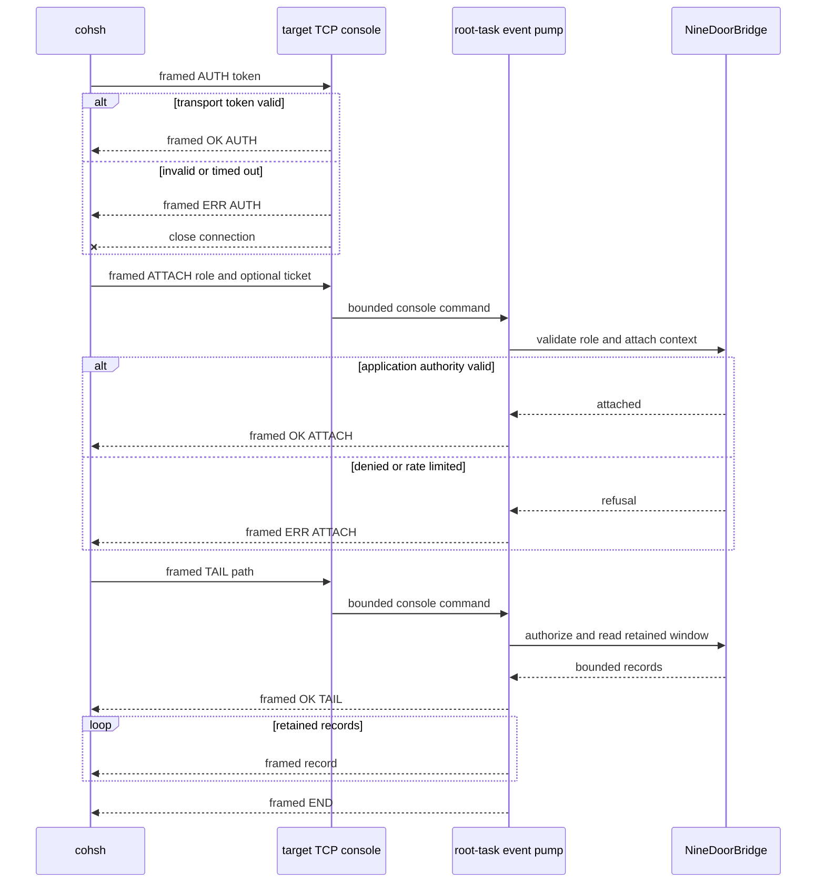

<!-- Copyright 2026 Lukas Bower -->
<!-- SPDX-License-Identifier: Apache-2.0 -->
<!-- Purpose: Define the as-built external transport, namespace, control-file, and schema contracts. -->
<!-- Author: Lukas Bower -->

# External Interfaces

This document is the index and human-authored contract for Cohesix external
interfaces: transport selection, target console framing, namespace paths,
control files, and non-generated record schemas. It links to generated snippets
for compiler-owned values instead of copying them.

Protocol internals belong in [SECURE9P.md](SECURE9P.md), role and ticket policy
in [ROLES_AND_SCHEDULING.md](ROLES_AND_SCHEDULING.md), system boundaries in
[ARCHITECTURE.md](ARCHITECTURE.md), and operator command usage in
[USERLAND_AND_CLI.md](USERLAND_AND_CLI.md).

## Stability and authority

The selected profile manifest, resolved manifest, generated tables, and
generated snippets are authoritative for enabled providers, exact capacities,
paths, and defaults. Source and fixtures are authoritative for handwritten
parsers and response grammar.

The following are breaking changes:

- a Secure9P request, response, or error-code change;
- a target console verb or `OK`/`ERR`/`END` grammar change;
- a namespace path, mode, or record-format change;
- a role/ticket authority change; or
- a generated interface, bound, or default change.

Breaking changes require the process in `AGENTS.md`: manifest schema changes
where applicable, regenerated artifacts, updated fixtures, tests, and canonical
documentation in the same authorized change.

## Pi 4 pre-kernel policy interface

The Pi 4 U-Boot menu is a bounded pre-kernel configuration surface, not a new
Cohesix protocol or authority path. `scripts/pi4-image-build.sh` generates the
executable `boot.cmd`/`boot.scr.uimg` contract. Generic persistent U-Boot
environment storage is disabled; only the FAT-side `cohesix.env` file is
eligible for Cohesix boot-policy import.

The import contract is:

- maximum file size: 384 bytes;
- text line endings: LF or CRLF;
- allowlisted keys only: `coh_net_mode`, `coh_net_interface`,
  `coh_static_ip`, `coh_static_prefix_len`, `coh_static_gateway`,
  `coh_wifi_ssid`, `coh_wifi_psk`, and `coh_show_logo`;
- coherent network tuples: `dhcp|static` plus `wired|wifi`, with static address
  and prefix required for static mode and SSID required for Wi-Fi;
- logo preference: absent or exactly `0|1`; any other value rejects the saved
  policy;
- absent, empty, oversized, malformed, or incoherent input: clear network
  overrides and use selected-manifest defaults.

File presence and saved-network state are deliberately distinct. A logo-only
or cleared `cohesix.env` remains a valid file but produces **Default network
settings active** with the **Boot with default settings** action. A coherent
imported network tuple produces **Saved network settings loaded** with **Boot
with saved settings**. Back/discard transitions reload the file before
returning to **Cohesix boot menu**, so working values cannot masquerade as
persisted policy.

The root menu exposes **Change network settings**, a stateful **Boot logo: On
(select to turn off)** / **Boot logo: Off (select to turn on)** action, **Reset
saved settings to defaults**, **Save settings and restart**, and **Advanced:
Open U-Boot shell**. Reset has a separate **Reset saved settings?** confirmation
page; `1` confirms, `0` cancels, and no persistent state changes before
confirmation. Cancel is the Enter-key default. A confirmed reset writes a
verified default policy rather than requiring deletion of `cohesix.env`.

The menu uses an iterative page dispatcher for root, IPv4 configuration,
network connection, Wi-Fi, manual IPv4, review, and reset-confirmation pages.
Submenus consistently use `0` for **Back** or **Cancel** and `9` for
**Advanced: Open U-Boot shell**. Operator-facing choices are **Automatic
(DHCP)** / **Manual (static IPv4)** and **Ethernet (wired)** / **Wi-Fi
(wireless)**. The review page distinguishes **Boot once without saving** from
**Save settings and restart**; discard reloads persisted policy before returning
to the root menu.

Existing Wi-Fi settings can be kept or changed, and a reset followed by
**Change network settings** creates a fresh saved policy for a different Wi-Fi
network without a reflash. Credential entry is enabled only on the
USB-keyboard/HDMI console. The display explicitly warns that the network name
and password are visible on that display while serial output is disabled;
temporary replacement variables are not part of the export allowlist. SSIDs
are redacted from summaries so untrusted imported text cannot forge terminal or
serial evidence. Save and reset operations export into a bounded buffer, write
`cohesix.env`, verify its size, privately compare a readback copy, and set
success only after exact agreement. Restart is never invoked after a failed
export, write, size check, load, or comparison.

At boot, selected non-empty overrides are projected into the staged DTB as
`/chosen/cohesix,net-mode`, `cohesix,net-interface`,
`cohesix,static-ipv4`, `cohesix,static-prefix-len`,
`cohesix,static-gateway`, `cohesix,wifi-ssid`, and `cohesix,wifi-psk`.
Root-task validates these properties and either selects the DTB-backed policy
or reports a bounded rejection and retains the generated manifest defaults.
The source manifest is never rewritten by U-Boot.

## Transport matrix

| Surface | Wire contract | Authentication and authority | Runtime boundary |
| --- | --- | --- | --- |
| Host/in-process NineDoor | Bounded Secure9P 9P2000.L subset | `Tattach` selects role/identity and carries the ticket | Host `std` server and tests only; not an in-target listener |
| Target serial console | Unframed console lines | Physical serial access, then application `ATTACH` for role/ticket authority | Root-task console |
| Target TCP console | Four-byte little-endian length plus one console line | Transport `AUTH <token>`, then application `ATTACH <role> [ticket]` | Root-task smoltcp listener; the only permitted in-target TCP listener |
| REST, UI, GPU, sidecar, and federation tools | Host-specific projection | Must preserve the underlying ticket and namespace authority | Host only; never a new VM authority path |

Secure9P messages are not transported through the target TCP console. A
console command such as `CAT` or `ECHO` invokes the target namespace adapter; it
does not synthesize a 9P frame on the wire.

### Internal target namespace-service ABI

`nine-door-runtime` uses `namespace-service/v1` only inside the target. It is
not an operator transport, a host RPC, or a second policy plane. The
pointer-free 32-byte request header carries exact ABI/header versions,
operation, zero flags, sequence, supervisor generation, bounded path/payload
lengths, and zero reserved bytes. Path and payload bytes occupy a distinct
shared frame bounded to 256 and 4096 bytes respectively. The child accepts only
`attach`, `tail`, `spawn`, `kill`, `echo`, `cat`, `list`, and `log`; absolute
paths have at most eight components and reject `.` and `..`.

The child response repeats the operation, exact sequence and generation, typed
status, and bounded prepared path/payload. The root-side client contract exposes
exact response validation that must succeed before ticket/Queen policy or
authoritative mutation. Its call cap is exactly Write + GrantReply, without
Read or Grant; the child receive cap is Read-only. Root maps the request window
read-write and response window read-only; the child receives the complementary
read-only and read-write mappings. Each direction is exactly two 4 KiB pages,
uses distinct frame capabilities and physical pages, and carries no pointers in
the shared record. The target adapter sends only sequence and encoded length in
two message registers and rejects extra or unwrapped caps, unknown labels,
short replies, stale identities, mismatched prepared bytes, and unknown error
codes. The sealed 72-byte `namespace-runtime-init/v2` descriptor carries the
aligned child IPC-buffer address in its formerly reserved word; the child
validates that mapping and installs it as the libsel4 IPC buffer before its
first receive. The QEMU constructor binds the exact selected ELF digest and
entry/load span, maps image pages W^X, and creates the child from generated revoke anchor
16137 without allocator fallback. While the child remains suspended, root
configures and binds one compiler-budgeted, root-retained bootstrap scheduling
context. After registry seal and root-fault activation, root resumes the child,
validates an empty `Log` parser probe, observes the atomic `ReplyRecv` transition
into the next receive, and unbinds that exact scheduling context. Only then is
the child passive and only `root-control` donates on the single-inflight,
one-deep Call chain. Activation, probe, or unbind failure revokes the namespace
boundary and suspends the child where possible. The child owns one receive-loop
Reply object but no scheduling-context cap or `SchedControl` authority, and no
`SetAffinity` path is used. Root-fault retains a copy in its generated CSpace slot 10
solely to return `NAMESPACE_REJECTED` with typed `Closed` once when a fault
interrupts an outstanding Call. It then publishes the owner mailbox for scrub,
unmap, and anchor revoke. No Reply is issued between calls, and the active
console-network service cannot use this path. Queue-full, partial-frame, close,
cancellation, stale-generation, and revoke outcomes are explicit and bounded.
The ABI supplies no target TCP listener, namespace-wide capability, device
capability, scheduling-context or `SchedControl` capability, ticket-execution
authority, or root CSpace access. The bootstrap scheduling-context candidate
remains subject to live QEMU qualification.
`apps/nine-door` remains a host library/fixture provider and has no target or
print-and-exit binary. A live QEMU boot is still required to promote these
constructed interfaces to target execution evidence.

The steady IPC wrapper retains four independent readiness checks: endpoint
ready, endpoint validated, send unlocked, and post-commit unlocked. When all
four are true, the wrapper takes an inline fast gate before the bootstrap trace
counter, tracer snapshot, formatting, lock, or UART diagnostics. Any false
condition enters the existing cold diagnostic/refusal path. This changes no
endpoint right, message register, Reply behavior, ABI record, or failure rule.

For application `ATTACH`, the target namespace preparation is the sole fallible
namespace transaction. Once its validated response succeeds, NineDoor commits
the attached role/ticket context before best-effort audit, logger, or tracer
observation; root commits its console session and emits `OK ATTACH` only after
that bridge transaction returns success. Bridge notification enters
UART+EP-mirrored logging without running a synchronous ping/ack loop. A later
explicit request may still test and promote EP-only logging, but that optional
transport optimization cannot veto or roll back namespace authority.

### Internal target console-network ABI

`console-network-runtime` is an active-SC child, not the passive NineDoor
donation chain and not a second external transport. Its console-network ABI v3
retains four fixed 4096-byte, pointer-free, sequence-last pages: root-produced
packet ingress and control are read-only in the child; child-produced packet
egress and events are read-write there. Compact 40-byte packet and 64-byte
control/event headers plus the validated active payload are authoritative;
inactive tails are not protocol fields.

ABI v3 adds root control kind `SendBatch = 3` without changing a page or
offset. Its binary payload uses encoding version 1 and an eight-byte header
`(version, count, used_bytes, reserved=0)`, followed by one through eight
records. Each record is a little-endian `u16` length and `1..=256` UTF-8 bytes;
CR/LF is forbidden. `used_bytes` must exactly cover every record header and
byte, and trailing data is rejected. Root encodes the complete batch before
publication; the child validates the complete copied payload before mutation
and emits at most one record per Session unit. Legacy `SendLine = 1` and
Disconnect remain valid controls.

After a Session unit commits one complete retained wire frame, including the
last batch frame, it retains exactly one next
`StackIngress -> StackEgress -> Session` cycle. The following no-progress
Session completes and quiesces. Merely having a pending batch or lacking
sendability/capacity cannot retain that cycle; this is a scheduling rule, not a
new ABI field or wake.

The descriptor's existing `timer_clock_hz` field is target truth rather than a
portable default. QEMU/HVF emits `24000000`, matching the selected seL4 header
and host virtual counter; Pi retains its independently generated frequency.
This value correction changes no ABI field, size, version, notification,
console grammar, Secure9P behavior, or host-tool schema.

The child rechecks its coalesced badge and publication-credit gates between
logical units. The retained-first priority is completion publication,
service-event publication, egress publication, service-poll continuation, new
ingress, then new control. Exact eligible retained private work uses
`seL4_Poll`. Idle or publication-uncredited work calls `seL4_Wait` directly,
with no ordinary `seL4_Yield`. Ready starts with no publication credit. Only
badge 64, signalled after root ObserveChild has
validated/copied every indicated record and the adapter has durably handled the
event and retained egress, grants one global credit. Internal units preserve
it; exactly one publication consumes it before page mutation. Ordinary wakes
never grant credit, and root clears its one-shot ACK debt before signalling.
Root records ACK debt in ObserveChild but performs no signal in that unit. The
next QEMU Network visit selects the distinct `AcknowledgePublication` unit
ahead of diagnostic, egress, and lower work; that unit alone clears debt before
Release+Signal, and its successful signal forces the following lower root unit
back to ObserveChild. An empty packet/control hint is retired after the
stable page proves there is no newer sequence, then drives exactly one retained
service cycle; it cannot manufacture a permanent local Poll loop. Terminal
revoke parks without publication. Graceful shutdown waits for one credit,
publishes `ShutdownComplete`, retires ACK debt without another signal, and
starts bounded containment. This scheduling cut changes only the internal ABI,
manifest, and capability contract, not any external console verb. Root keeps
`ChildTurnUnit::PollService` as the ABI-neutral scheduler unit, while v6
internally resumes it across private `StackIngress`, `StackEgress`, and
`Session` steps. The first two return `ServicePollOutcome::Continuation` and
retain `service_pending` across the gate recheck and eligible local-Poll path; only
`Session` returns `Complete` and clears it. This adds no shared
record, notification, or external state. Root
containment is separately resumable: one exclusive Recovery turn advances at
most one fixed-order material unit, preserves both retained Runtime- and
Network-unit cursors, and
reaches the sole outer yield without ordinary-pump fallthrough. Console-network
has precedence until its pending sequence completes; only then may NineDoor
containment advance. Root V34 preserves V33/V32/V31/V30/V29's capture of HELP, NETSTATS, SMP,
and CACHELOG for one
exact child generation and authenticated connection, seals the complete body
and terminal before publication, and drains through V27's retained response
lane. The selected `DefaultNetStack` delegates terminal publication, bounded
identity, lane inspection, response-budget polling, and pending console events
to its concrete backend. One producer unit may fill only the existing
eight-line adapter queue;
one Network unit performs one useful ACK, egress, batch-stage, ingress, or
child-service action. Exactly one ordinary Operator/Runtime/Network debt turn
follows every eight response units. The external wire remains the same ordered
per-line body followed by its exact `OK` or `ERR`; streamed namespace responses
retain their documented `END`. The exact terminal batch must receive both
`ControlCompleted` and `OutputDrained` before the lane retires. Disconnect is
not eligible while that root-owned lane retains terminal completion, ACK debt,
copied egress, or queued output; child-side drain alone does not authorize the
transition.

No command, frame, line, terminal, retry, or client-timeout contract changes. The
fixed target matrix requires HELP 12 total frames, NETSTATS 16, first-call
selected-QEMU SMP activity 17, and CACHELOG 10 for count nine, then PING and
QUIT on the same socket using the preexisting client response timeout and no
retry or reconnect. The internal 1920-record ring capacity is not a separate
five-second promotion gate.

The
`m26e-qemu-console-received-progress-retention-candidate-v18` child and
`m26e-qemu-root-adjacent-refill-natural-postpone-candidate-v35` root-control plus
`m26e-qemu-root-fault-service-units-candidate-v6` root-fault candidates
remain pending fresh exact QEMU fixed-matrix, standard-fault terminal
containment, and budget-exhaustion natural-postponement liveness/isolation
evidence. The preceding V26/V13 immutable
image passed two complete direct sessions on one boot. The V27/V15 bounded
TAIL/CAT canary later failed after QUIT at exact root reason
`response-completion-sequence`; the retained V28/V15 result then qualified only
the terminal-response fence and reconnect transition. The immutable V29/V15
artifact completed AUTH and ATTACH, then HELP returned zero bytes before the
unchanged 30-second timeout because the selected wrapper returned its default
bounded identity instead of delegating the isolated hooks. None qualifies
V30/V15. The later V30/V15 terminal-timeout artifact completed HELP and
NETSTATS before terminalizing at the Yield SVC with adjacent refills totalling
`3000 us`. A non-claiming local-Poll diagnostic completed HELP, NETSTATS, and
correct SMP16 on its first boot; a second fresh boot reached
`root-console.start.ok` then emitted `root-emergency fail-stop` before a TCP
probe. These are failure diagnostics, not qualification.
The later V31/V17 Stage 03 run passed the fixed matrix and its first three
operational `.coh` scripts; the third rapid TAIL in `observe_watch.coh` reached
target command begin, `tail.start`, `tail.stop reason=eof`, and command end,
but did not deliver a complete response before the unchanged five-second
client deadline. Its later CAT and QUIT were therefore not dispatched. This is
V31 failure evidence for V32, not Stage 03 qualification.
The subsequent V32/V17 Stage 03 run passed the same fixed matrix and
`boot_v0.coh`, then failed `9p_batch.coh`: routine command/session diagnostics
had entered public `/log/queen.log`, so the bounded CAT preview no longer
contained the required ordered `batch-1|batch-2|batch-3` payload. Only one of
the 17 selected operational `.coh` scripts passed before the stop. This is V32
failure evidence for V33, not Stage 03 qualification.
The later V33/V17 Stage 03 run
`out/m26e-qemu/stage03-v33-v17-20260814T031936Z` passed the fixed matrix 7/7,
`boot_v0.coh`, and `9p_batch.coh`, then exact same-artifact fault evidence
identified a root-control timeout at task index 0, badge `0x26ee0001`, label 5,
immediately after the final QUIT audit and before `host_absent.coh`. The base
and gated artifact identities are retained in [TEST_PLAN.md](TEST_PLAN.md).
This is V33 failure evidence for V34, not Stage 03 qualification.
The subsequent immutable V34/V18 state
`out/test-plan/m26e-console-qemu-v34-v18-oraclefix-20260814T104728Z`, Stage 03
attempt `20260814T105938.465736Z-11947-27f75501fecd`, passed Stage 01 and
Stage 02. Its Stage 03 base/gated artifact IDs were
`sha256:11921e2eedbf8e9c46f781c500b89acdcb9669ebda42eb6db0ed21a4eb47dac3`
and
`sha256:46ce91c8bffae218f557fedb19ec125cdded39118db641aee70db9e63949163b`.
The fixed matrix passed 7/7, all ten base scripts passed including 9P and
`session_pool.coh`, and the fresh base-telemetry boot passed
`telemetry_ring.coh`; `telemetry_push_create.coh` then failed when each
replacement connection wrote the complete 18-byte AUTH frame and read zero
bytes. Immutable replay proved root-control task 0, timeout
badge `0x26ee0001`, label 5, at the outer Yield after ordinary Network/Timer,
with no timer trace and tick `356343`, not divisible by 8,000. The adjacent
refill amounts were the exhausted current `38,090` ticks and already-valid next
`93,910` ticks; their sum is the unchanged `132,000` ticks or `5,500 us` at
24 MHz. The terminal endpoint converted exhaustion of only the current refill,
despite the valid adjacent refill, into fail-stop. The selected V35 QEMU and
V24 Pi root records therefore omit only the root TCB timeout endpoint under
`NaturalPostpone`; the timeout capability/badge/resource identity remains
reserved and standard faults remain terminal. This repair cites discovery
task `m26e-console-network-service-isolation` and reopened Milestone 25
root-service temporal restoration carried by `m26e-root-tcb-target-proof`.
It changes no schema, external API, wire frame, grammar, namespace, workload,
retry, or timeout contract; no host-tool, Python-library, benchmark, workload,
evidence-record, or report-schema implementation changes are required, and the
V34/V18 state remains failure evidence. The complete exact-version QEMU
staged, `.coh`, REST, host-tool, Python, and performance gates remain required,
and Pi separately requires a fresh 54 MHz build, flash, and hardware proof.
The selected manifest contract is schema 1.14, ABI v3, Ready identity v3, ACK
badge 64, and the existing fifth root Write-only mint while page layouts and
external console grammar remain unchanged. `NaturalPostpone` leaves the child
and selected QEMU V35/Pi V24 root-control TCB timeout-handler slots empty, so
seL4 postpones an exhausted active SC until replenishment. Standard faults
remain terminal. Each reserved timeout cap, badge, resource, and registry
identity remains accounted but is not installed as that TCB's timeout handler.

Fresh V35/V18 state
`out/test-plan/m26e-console-qemu-v35-v18-full-20260814T134855Z`, source identity
`sha256:0a1c64ec92fc9f80d74e423972c2579872fc067fbf76370c54daf14e823b2821`,
then passed Stage 03's fixed matrix `7/7` and all 18 selected `.coh` scripts
using base/gated artifact IDs
`sha256:d7f978d66935e93318892a09a7be426bc6083e55fc7237aaaea5d9ff332523f9`
and
`sha256:d0141863625f009280bab8f3bcbc085c0adc36dcdf978c116c9b42f0ac67c981`.
Stage 04 attempt `20260814T142002.169146Z-32864-8dc11c8651a4` passed REST
`boot_v0.coh` and failed `observe_watch.coh` line 8 when the three-second Rust
client deadline expired inside the gateway's legal queue/response envelope.
The target remained responsive, the gateway retained one connection and one
upstream ATTACH, and no root-emergency, fail-stop, panic, or target fault was
recorded. This is host deadline failure evidence, not a target or Stage 04
interface failure.

Under active `m26e-console-network-service-isolation`, reopened
`m24e-rest-client`, `m24e-cohsh-rest-transport`,
`m25-smp-rest-regression-batch`, and the deadline-composition portion of
`m25f-gateway-broker-refactor`, REST filesystem clients reserve
`5,000 ms + max(control_response_ms, telemetry_response_ms) + 5,000 ms`.
Canonical broker deadlines `120,000/120,000 ms` therefore produce a
`130,000 ms` client response window. This is host-side liveness configuration:
it adds no REST field, endpoint, target wire frame, command, line, terminal,
namespace, authority, ACK/ERR/END, concurrency, pool, or retry change. Metadata
and other short HTTP phases remain separately bounded, and an ambiguous write
is never retried merely because the client deadline expired.

V35 retains V34/V33/V32/V31/V30/V29's bounded synchronous capture, V27's bounded response
lane, V26 lifecycle fencing, V28 terminal-response Disconnect fence, V30's
selected-wrapper delegation, and V31's failed-producer retirement. It changes
only selected-QEMU internal routine-audit delivery: command, session, TAIL, and
NineDoor diagnostics enter a private capacity-four EventPump FIFO, never
public `/log/queen.log`. Saturation drops the new best-effort record while
preserving older FIFO order. A final-idle Operator unit attempts one
nonblocking serial admission and retains the head on backpressure. V34 permits
at most one physical audit byte per eligible final-idle visit and retains the
complete record and audit-only tag across later visits; response,
stream, flush, input, retained-output, containment, network, and display work
all take precedence. Pi, linked-runtime, legacy/non-VirtIO, ordinary
console-failure, critical/fatal, and fail-stop routes retain their prior raw
diagnostic behavior. It changes no command grammar, response order, timeout,
retry, external interface field, namespace data, or authority and retains
V25's complete temporal envelope. QEMU
root-control stays on core 0 with budget/WCET/response
`5500/5000/7600 us`; the console task and its SchedControl/service placement
remain on core 2, where budget/WCET/response are `3000/3000/3000 us`.
GPU/LoRA response admission on that core is `3600 us`, while demand remains
`3800/9000 us`. Pi root-control selects
`m26e-pi4-root-adjacent-refill-natural-postpone-candidate-v24` while retaining
V23 placement and timing; its child advances to common V18 provenance under
schema 1.14 with response `8100 us` and demand `9000/9000 us`. The envelope remains conservative and is not a
claim of numeric minimality.

Historical child V7 retains the private v6 three-unit cursor and changes only the internal
smoltcp send precondition. Session requires both `can_send()` and capacity for
the complete retained frame before `send_slice`; capacity alone cannot admit a
write in FIN-WAIT or another closing state. Skipped output is not committed and
cannot produce `OutputDrained`. When the peer finishes TCP teardown, the
existing `end` transition clears the closed connection generation, publishes
one `Disconnected`, and relistens. This adds no ABI page, field, event kind,
notification, console verb, retry policy, or host-visible framing rule.

Child V8 retains that guard and gives the already-present control-page
`connection_id` its lifecycle meaning at application time. The child validates
the control kind, bounded payload, and nonzero identity before classifying a
well-formed record for an ended or different connection as `StaleConnection`.
That record advances its exact sequence and publishes `ControlCompleted`, but
enqueues no bytes, publishes no `OutputDrained`, and raises no fault. A malformed
record or a matching-current control that violates authentication or queue
rules remains an error. Consequently an old control cannot cross into a newly
authenticated connection. Root retains its one-slot control ownership across
`Disconnected` until the exact completion arrives; before staging, a root
adapter with no authenticated connection returns backpressure so its stream
cursor does not advance silently. These are generation-fence semantics over
existing v1 fields and event kinds, not an ABI, schema, framing, grammar,
capability, notification, timeout, or numeric change.

The exact V24 HVF diagnostic completed `OK AUTH` and `OK ATTACH`, then timed
out on `TAIL /log/queen.log`; its child standard fault mapped to retained
`ApplyControl(SendLine)` after the owning connection had ended and
authentication was inactive. That evidence falsifies V7's lifecycle
disposition only. It does not change the external ACK/ERR/END contract or
qualify V8.

The exact V8 artifact
`out/cohesix-v8-stale-control-hvf-qemu10-20260813T090943Z` subsequently reached
the root prompt with no fault, but both live transport attempts wrote 18 AUTH
bytes and received zero. V9 preserved V8's connection-generation disposition
but its local-Poll/publication-fence artifact also wrote 18 AUTH bytes and read
zero. V11 retains private internal Poll and replaces inferred wake credit with
explicit Observe-to-ACK badge 64: one ACK grants and one publication consumes
one credit. This moves the internal contract to schema 1.12 and ABI/READY v2
with a fifth root Write-only mint on the existing notification. There is no
external framing, ACK/ERR/END, timeout, retry, or namespace change.

Child V12 adds only the missing peer-close lifecycle transition. A peer FIN
that produces `CloseWait` sets the existing idempotent graceful-disconnect
intent, retains already-authorized exact-generation output until `close_ready`,
and then reuses the existing `Closed`/`end`/`listen` path to publish exactly one
`Disconnected`, clear that generation, and restore the sole listener. The
immutable V25/V11 artifact
`out/m26e-qemu/temporal-v25-20260813T125130Z/artifact` completed its first raw
AUTH but reset replacement connections at `+1 s` and `+10 s`; a healthy-child,
`NullFault` read-only snapshot localized this to lifecycle rather than a new
interface fault, but retained no transcript. V12 changes no page, field, badge,
event kind, ABI/READY identity, schema, capability, external framing, grammar,
namespace, timeout, or retry contract and is not qualified by that V25 run.

The immutable V12 evidence set
`out/m26e-qemu/peer-close-v12-20260813T133000Z` bound source digest
`sha256:c047b0886ba42ba1dfe0004009a8e9377d4d2cbd98e997e8dfd463e4bc80eaa0`.
Raw AUTH 1, host close, and same-boot raw AUTH 2 passed, followed by a `cohsh`
session that passed AUTH, ATTACH, four-line TAIL, END, and QUIT. Replacement
authentication timed out at `+5 s` and raw authentication still timed out at
`+30 s`; UART showed no fault, and a read-only GDB reproduction found all CPUs
kernel-idle. QUIT had made the server the active closer, leaving the sole
smoltcp socket in `TimeWait`; smoltcp 0.13.1 uses a fixed `10 s` close delay
and re-arms it for each incoming replacement SYN. M26b Complete `72288c7d`
already treated that state as terminal. V13 ends the old connection generation,
aborts only the completed TCP control block, and immediately relistens; the
existing `Closed` path is unchanged. This changes no page, field, badge, event
kind, ABI/READY identity, schema, capability, framing, grammar, namespace,
timing, placement, retry, or timeout contract. V12 is failure evidence for the
V13 repair, not qualification.

The immutable V13 target failure is
`out/m26e-qemu/peer-close-timewait-v13-20260813T140319Z/same-boot-two-complete-sessions-20260813T141000Z`.
Session A completed AUTH, ATTACH, four-line TAIL, END, and QUIT. Same-boot
session B connected twice but each AUTH wrote 18 bytes and read zero; QEMU
remained alive and UART showed no runtime fault. The exact child ELF contained
V13's TimeWait terminal transition. Root instead left the successful Disconnect
eligible after `ControlCompleted` and `OutputDrained`, republished it on every
strict lower-cursor pass, and reset the cursor to ObserveChild before Ingress or
ServiceTick. V26 makes that existing root control per-connection single-issue:
backpressure remains retryable, successful publication latches until the
connection ends, and the requested Quit reason remains intact. This is an
internal transaction disposition over existing control/event kinds. It changes
no page, field, badge, ABI/READY identity, schema, capability, external framing,
ACK/ERR/END behavior, namespace, numeric, grammar, declared retry, or timeout
contract. Pi root provenance remains V23 and child provenance remains V13.

V23 and root-fault V6 change internal turn boundaries only. Successful compact
physical-tail/prompt housekeeping returns before ordinary phase selection;
bounded backpressure may fall through to exactly one compact Operator unit
without phase advance. Root-fault's one-time PrimeReceive commits Receive and
yields before accepting a fault, so an early sender may queue on the existing
endpoint but no fault value or Reply association crosses that prime boundary.
The V6 service branch adds only internal `ResolveService`, `SuspendService`,
optional passive `RecoverPassiveService`, and `PublishService` turns. Active
console service faults issue no recovery Reply; passive service recovery may
issue at most one. Neither change adds an endpoint, message, field, right, verb,
or response.

V18 retains v17's exact isolated QEMU VirtIO selection at the public EventPump
entry, before the generic EventPump frame is allocated. Its tiny noinline dispatcher
commits the outer successor and cannot call generic Operator or Runtime bodies.
The compact Operator begins the existing shared serial and one-record output
credits. A retained SerialDispatch is selected first; otherwise an RX-only
SerialIo probe may retain SerialDispatch for a later Operator. SerialIo admits
no TX, dispatch, flush, or raw-UART RX trace formatting while the admitted
ordinary root-control turn is active; SerialDispatch commits its successor before
bounded consume/echo plus TX flush and does not probe RX. The Operator admits
at most one eligible
material noinline leaf in strict priority: serial RX or retained dispatch/TX, local-seat input,
ordered physical-response output, one lifecycle event, one buffered
authenticated line, background/high-impact pending output, then
display/frontier/attach. Every material leaf commits its
recorded successor before work. This is internal temporal decomposition only:
it changes no frame, event, line, response, ACK/ERR/END, authentication,
authority, or ordering contract visible to a host client. Pi, linked-runtime,
physical-owner, and non-VirtIO paths retain the generic EventPump.

This split follows exact v17 failure evidence: root ELF
`3d0641bac42d21ce383c47f38628a05db0d2474fab69fc6e14b67ba39a71bd47`,
unchanged child ELF
`920883c5e706688a65e7f168a643dbc527d09d7f48584bfb41fbd0c0ae823cb6`,
and CPIO
`fa478638d6d2b93b654a2615e4dcd1e1d7f666d0945d4e012adcf28da2292af1`.
Four authentication attempts each wrote 18 bytes and read zero. Root-control
faulted at outer-Yield PC `0xf6624`; saved ordinary, Runtime, and Operator
successors were `Runtime`, `Worker`, and `SerialDispatch`, identifying the
remaining composed SerialIo leaf. This internal split changes no external
frame, event, line, response, ACK/ERR/END, authentication, authority, or
ordering contract.

The exact v18 artifact bound root ELF
`e7d34f018ff308c575fedb79ca7cef5542a7da8e753c09ddb9d55cf9daa79d4e`
and system CPIO
`0dca41cc6fdd9a877144dcd2db610beaeafef95423a81ce6896b01bb9b8f5cf5`.
Four authentication attempts each wrote 18 bytes and read zero. Root-control
timed out after Network at outer-Yield FaultIP `0xf66e4`; successor
`Operator(0)` and lower successor `Disconnect(2)` identify selected no-op
`StageOutput(1)`, with no pending egress or child signal. V19 therefore changed
only the internal QEMU Network prelude: it retained the timer prelude and one
retained NIC unit but did not reconcile CYW43/HDMI state. Runtime and generic/Pi
paths retained that behavior. The exact clean v19 root/CPIO hashes were
`0737a6f008197fd5b931af104c95164ddcd925fa04a8440439895c1e76b26fca`
and `51e7b955b449b42b7a0cad569aa187e19a0f71464ffb81080d29733a589e7ed0`.
Four authentication attempts each wrote 18 bytes and read zero. Root-control
timed out at outer-Yield PC `0xf66dc` after Network; lower successor
`Ingress(3)` proves selected `Disconnect(2)` was a no-op without child signal.
Pending egress was empty, the child was healthy at Wait PC `0x21343c`, and
root `smoltcp_polls` was `250098`, isolating the composed post-leaf diagnostic
aggregate. V20 retains one compact telemetry, originating-time, and
last-RX-progress observation after the timer-plus-one-NIC visit. The next
Network visit takes it and runs NETDIAG only before returning, while immediate
flush, connection-id, and NineDoor ingest accounting remain unchanged. No ABI v1 field, frame, notification, capability,
verb, ACK/ERR/END state, authentication rule, or host-visible ordering changes.
The exact v20 root/CPIO hashes were
`ed5cb9f587d0d63e6121f8b00b083e68f5a0a7dd23dd6d2bbf0c899e1e85e80f`
and `ca2a52038eb0814a17c8609f03bec32ff357fdd524edee3e7080ac69ceb7823b`.
The image reached the root marker and prompt, then root-control timed out at
outer-Yield PC `0xf680c`. Successor Operator and retained NETDIAG prove timer
plus NIC completed and the diagnostic had not run; lower-cursor, egress, and
child state remain unconfirmed. V21 splits those internal Timer and Nic units
through a successor-before-work QEMU cursor. A retained diagnostic preempts
without advancing it, giving Timer -> Nic -> DeferredDiagnostic -> Timer.
Quarantine clears the diagnostic but preserves the cursor; generic/Pi paths do
not use it. This adds no external interface field or ordering state.

The QEMU VirtIO root adapter also persists an internal lower-service cursor:
ObserveChild -> StageOutput -> Disconnect -> Ingress -> ServiceTick. One Network
visit attempts exactly one selected unit, even when it is a no-op. A no-op
advances the cursor; a successful unit that signals the child forces the next
lower attempt to ObserveChild. A pending deferred diagnostic or retained TX
preempts without changing the cursor or forced-observe state. This is an
internal scheduling contract only: it adds no console-network ABI field, page,
notification, capability, verb, or external ordering rule. Live v7 evidence
then located the next bound inside root's startup Operator: the exact image
timed out in serial queue dequeue from `SerialPort::flush_tx_unlocked` while
the UART-visible `[mark] root-console.start.ok` remained queued, before Network
or Recovery. The missing wire marker is not a source lifecycle boundary.
Schema 1.11 therefore adds the
internal temporal field `virtio_operator_serial_io_bytes_per_turn`. QEMU
root-control selects `64`; every non-root task and Pi/non-VirtIO root-control
selects zero. One credit is shared across every serial RX poll and TX flush in
that Operator turn. Entry-time TX backlog reserves `32` bytes for TX and limits
RX to `32`; without entry backlog RX may use all `64`. Exhaustion retains
unfinished bytes for a later turn.

V14 introduced the ABI-neutral lower cursor through the compact
`poll_split_ordinary_virtio_network_turn`. V21 adds the separate private
`OrdinaryVirtioNetworkUnit::{Timer, Nic}` cursor. With no retained diagnostic,
the cursor successor commits before Timer calls only
`poll_runtime_timer_prelude` or Nic calls one budgeted NIC unit and retains the
compact diagnostic. The following Network visit takes that observation and
runs only NETDIAG without advancing the Timer/Nic cursor; quarantine clears the
observation while preserving the cursor. The former composite Network prelude
is absent. The distinct split Runtime prelude retains network-ready-HDMI
reconciliation, and generic/Pi behavior is unchanged. The
adapter commits the ordinary lower successor before one distinct noinline unit
helper, avoiding a compiler-expanded closure that contains every unit. A
successful child signal may still force the retained cursor to ObserveChild.
Network may retain one lifecycle event but does not drain it; the immediately
following Operator admits at most one retained event before buffered command
dispatch. No shared record, event schema, ordering promise, or host-visible
interface changes.
The canonical v8 root ELF
`5052e7a5070987c252d3c1f5cf6f27172bd5ece1836a8f6c2a5c329c789a0a61`
still consumed the complete `2750 us` root-control refill and raised
current-fault `Timeout`, badge `0x26ee0001`, at PC `0xede84` immediately after
`emit_prompt_now`. The internal v9 scheduling rule therefore permits at most
one retained output-record attempt in an Operator whose generated VirtIO
serial limit is nonzero. Remaining FIFO and response-tail records stay ordered
for later Operators; Pi and non-VirtIO turns keep their existing two-record
attempt limit.
The canonical v9 root ELF
`fa488c9367136f0eadef7182a18691664c3ae51c2ac2974e12000ff5d27f38ed`
and CPIO
`aca549e99e0d86299e9f98348d896b730259277654544ebd22a74595b61e9bfb`
then consumed the complete first post-bind `2750 us` refill and raised
current-fault `Timeout`, badge `0x26ee0001`, at PC `0x13a798`, the first
`compiler_builtins` `memmove` instruction reached from
`heapless::Vec<PendingConsoleOutput, 72>::remove(0)` (LR `0x79ccc`, prospective
`x2 = 0x110`). No byte was copied, serial was idle, the one-record cursor was
full, and the marker plus initial prompt stayed queued. This is aggregate
first-post-bind refill exhaustion rather than copy-cost evidence or a failure
of the one-record rule.
V10 therefore inserts one universal MCS `seL4_Yield` after the steady SC and
timeout endpoint are installed but before either containment probe or the first
Operator. It sacrifices the partial activation refill and waits for the next
replenishment without draining retained output under bootstrap authority. The
yield is a one-time internal activation seam, distinct from the sole recurring
outer yield. It adds no interface, capability, schema field, or numeric change;
Pi adds one startup-period wait while retaining its existing phase behavior.
The exact v10 root ELF
`022908395c954f73a67136f70fe4404d96e0cf1ff16f4531fa95eae7a6f57cb5`
crossed that seam and emitted the retained startup marker and prompt, then
timed out with badge `0x26ee0001` in the second fresh Runtime at PC `0xce98c`,
the root-endpoint nonblocking receive. V11 retains every external interface and
gives isolated QEMU Runtime the internal Worker -> ControlEndpoint ->
BootstrapDrain -> StreamFlush -> RebootTail cursor with one selected unit per
visit and successor commit before its prelude. Worker handles one
pending mailbox operation or one retained role-slot check; ControlEndpoint
performs at most one poll and its immediate forward; BootstrapDrain takes one
staged `Option`; RebootTail owns its visit. MCS fault polling is absent from the
cursor. StreamFlush uses one visit per line;
after the retained final-line visit, a later selected no-line visit finalizes
cursor/bandwidth state only and the following selected visit emits END only.
Legacy Pi/non-VirtIO Runtime keeps its 48-line/16-KiB behavior.
The exact v11/v4 artifacts were root ELF
`44971429e4941d751248c216082256f01e187930d9a6d40028e5c89d8611b597`,
console child ELF
`af08f817191cc51c9354b61f09f3eeb50c8cdf875c660c7231987a426886666d`,
and CPIO
`9fbb58e1dc6dc508361f37ce0c24219e3e9029dae101e2be789df1bcb1a5b11d`.
There were four TCP connects. The first three completed authentication attempts
each wrote 18 bytes and read zero; the fourth connect had no completed
authentication record. The child timed out with badge `0x26ee0007` after
`3000 us` at PC `0x213458`, the `seL4_Yield` immediately after the composite
`PollService` completed and cleared; saved retained state identified
`PollService` as that completed unit. Containment
reached `Complete(6)`; root then timed out with badge `0x26ee0001` at outer
Yield PC `0xf5fbc` after an empty Operator and `2750 us`, with successors
`Runtime` and `ControlEndpoint` and empty output. V11/v4 are failure evidence,
so Stage 03 and pressure were withheld. V12 keeps the external interface
unchanged and returns an isolated QEMU VirtIO Operator before its repeated tail
when the bounded priority pass leaves no serviceable work.

The non-claiming v12/v5 run
`out/test-plan-convergence/v12-v5-auth-20260812T010200Z` bound root ELF
`7cec5bd582d063adc73830af8cc62e0ec8dbbb33d91bd4701db09ca69e32e6ca`,
console child ELF
`920883c5e706688a65e7f168a643dbc527d09d7f48584bfb41fbd0c0ae823cb6`,
and CPIO
`dc36495a5de0df13bfb853ffa33fdc6e7ccc3bbf3a1a3c8c4cd74c8551160c16`.
All four authentication attempts wrote 18 bytes and read zero. Root-control was
the only timeout: badge `0x26ee0001`, exact `2750 us`, outer-Yield PC
`0xf612c`. Stored successors `Network(2)` and `StreamFlush(3)` prove the prior
ordinary phase was Runtime and the selected unit was `BootstrapDrain`; its
staged `Option` was `None`. Fault sequence 2 and the child healthy at
Yield-then-Wait exclude a prior child fault or Recovery. The observation
embedded dirty source commit
`a533290ffe264f0a2bf0af3db4bb4c45d1a4a278`, while repository HEAD later
advanced to `84934dda6`, so it is diagnostic/failure evidence only.

V13 changes no external interface. It preserves the same cursor and replaces
only the split isolated-VirtIO Runtime's generic Runtime-without-control tail
with a compact prelude. It reads HAL timebase and polls the timer once; an
observed tick updates `now_ms`, increments the timer metric, publishes HAL
timebase, and runs the existing conditional timer trace, while no tick refreshes
`now_ms` from the read timebase. It then reconciles CYW43 network-ready HDMI
state before the already-selected unit. Pi/non-VirtIO Runtime remains unchanged.
This does not change the external serial grammar, the physical driver's
`max_bytes=1024` contract, the outer Operator/Dispatch -> Runtime/IPC -> Network
cycle, the sole recurring outer yield, resumable Recovery, or Pi/non-VirtIO
outer Runtime behavior. In that historical V13 contract, active-MCS child
Yield-then-Wait semantics were universal; selected V18 retains V17's local
Poll and direct blocking Wait under NaturalPostpone, and retains a fresh
private service cycle after each nonzero bounded socket receive.

The exact v16 image bound root ELF
`4fab7abc8707b9829ba66ac525efdfc7afefa812df4bab9abb8cb67d504a76a6`
and CPIO
`456558cac05e4d136d3cbc18d1290cc48bebf619ba5459cd623b667dbfff3e96`.
The prompt serial/output completed, but root-control consumed the full
`2750 us` and faulted at outer-Yield PC `0xf61c4`; saved successors were
`Runtime` and `ControlEndpoint`. Target disassembly showed approximately
`0x42c0` bytes of generic EventPump frame plus `0x12a0` bytes of generic
Operator frame still preceded the bounded output leaf. Root-fault consumed the
full `3000 us` at its first post-classification Yield, PC `0x113938`, before
suspension or emergency signal. This is failure evidence for v16/v3, not
interface or child-v5 failure.

Root-fault v4 preserves the same endpoint, badges, Reply, and release
interfaces while splitting `Receive -> Classify -> SuspendCritical ->
SignalEmergency`. Receive commits Classify before the blocking receive, copies
only label/badge, and yields. Released classifications yield before the next
Receive; RetainedByDriver waits for and validates the exact release then
yields; Critical commits SuspendCritical then yields. SuspendCritical commits
SignalEmergency, suspends, and yields; SignalEmergency commits Receive,
signals, and yields. These internal refill boundaries introduce no externally
observable field, verb, error, or authority.

## Target TCP console sequence


```mermaid
sequenceDiagram
  participant Client as cohsh
  participant Tcp as target TCP console
  participant Pump as root-task event pump
  participant Namespace as NineDoorBridge

  Client->>Tcp: framed AUTH token
  alt transport token valid
    Tcp-->>Client: framed OK AUTH
  else invalid or timed out
    Tcp-->>Client: framed ERR AUTH
    Tcp--xClient: close connection
  end

  Client->>Tcp: framed ATTACH role and optional ticket
  Tcp->>Pump: bounded console command
  Pump->>Namespace: validate role and attach context
  alt application authority valid
    Namespace-->>Pump: attached
    Pump-->>Client: framed OK ATTACH
  else denied or rate limited
    Namespace-->>Pump: refusal
    Pump-->>Client: framed ERR ATTACH
  end

  Client->>Tcp: framed TAIL path
  Tcp->>Pump: bounded console command
  Pump->>Namespace: authorize and read retained window
  Namespace-->>Pump: bounded records
  Pump-->>Client: framed OK TAIL
  loop retained records
    Pump-->>Client: framed record
  end
  Pump-->>Client: framed END
```

The diagram shows protocol order, not a claim that `NineDoorBridge` is a host
NineDoor server or that every path is available in every profile.

## Target console contract

### Framing

Serial accepts console lines directly. TCP frames every inbound and outbound
line with a four-byte little-endian total length that includes the header.

- Declared total length must be at least 4 and no greater than the Secure9P
  implementation cap of 8192 bytes.
- The isolated QEMU console admits at most 2304 bytes for one authenticated
  command frame. The existing `echo` grammar permits at most 2048 payload
  bytes so one compiler-bounded host-ticket record fits with its verb and path;
  every other command retains its narrower field-specific bound. Physical
  serial/local-seat lines remain bounded independently at 256 bytes.
- Oversized unauthenticated frames terminate authentication. An authenticated
  session receives `ERR FRAME reason=invalid-length`; the child drains exactly
  the complete declared payload across any fragmentation, retains the same
  authenticated connection, and parses the next frame only after that drain.
- The first TCP payload must be exactly `AUTH <token>` with the configured
  token length. Invalid, missing, or late authentication closes the session.

Transport authentication does not select a namespace role. After `OK AUTH`,
the client uses `ATTACH <role> [ticket]`. Queen may omit the ticket; worker
roles require a valid ticket and subject identity. Failed application login
attempts use the current bounded limiter: three failures within 60 seconds
produce a 90-second cooldown.

`ATTACH` binds an application session to a role-scoped namespace; it never
creates or resumes a task. The selected profiles separately admit executable
Heartbeat, GPU, and LoRA roles, but only an authorized `/queen/ctl` lifecycle
operation can select one of their already constructed suspended children. The
child's durable READY record, not `ATTACH` or the control acknowledgement,
publishes its exact namespace identity.

An `OK ATTACH` means the target namespace prepare succeeded and both NineDoor
and root committed the same local role/ticket session. Audit, logger transport,
and boot-tracer observation occur after that authority commit and cannot turn a
successful prepare into `ERR ATTACH`. The logger remains UART+EP mirrored at
this boundary; an optional later EP-only self-test is transport policy, not
application authority.

### Command grammar

The compiler-owned command inventory is generated in
[cohsh_grammar.md](snippets/cohsh_grammar.md). The parser applies per-field
bounds from [`cohsh-core`](../crates/cohsh-core/src/command.rs), including the
2304-byte authenticated network-command limit, 2048-byte `echo` payload limit,
bounded paths/tickets/JSON payloads, and a maximum of 256 requested tail lines.

Commands are case-insensitive at the verb parser where implemented; arguments
remain subject to their command-specific grammar. Unknown verbs, missing
arguments, extra arguments on strict commands, oversized values, and invalid
numeric fields return `ERR` and produce no documented side effect.

### Acknowledgements and streams

- Every accepted command produces `OK <VERB> ...`; every refused command
  produces `ERR <VERB> reason=<reason> ...`.
- Structured namespace streams such as successful `tail`, `cat`, `ls`, and
  `log` emit a leading `OK`, zero or more bounded records, and a terminal
  `END`.
- Bounded diagnostic commands may emit their diagnostic records before the
  terminal `OK`; their checked transcript, rather than the namespace-stream
  ordering rule, is authoritative.
- `PING` responds as `OK PING reply=pong`; it does not emit a bare `PONG`.
- `QUIT` and authenticated `REBOOT` have explicit connection/flush behavior;
  clients must wait for the documented acknowledgement rather than treating a
  disconnect as success. After exact `OK QUIT`, a TCP client half-closes its
  write side and requires peer EOF on the same connection within the existing
  timeout; QUIT is not retried after an ambiguous send or close.
- An `ERR` is terminal for that command and must not be treated as a successful
  no-op.

Some queued Queen commands acknowledge acceptance before the event pump
forwards the work; others validate and apply a bounded provider operation before
acknowledging success. Clients must use the command-specific status and
observability path rather than infer completion timing from a generic `OK`.
Canonical transcripts and negative cases live in
[`tests/integration`](../tests/integration) and the root-task tests.

## Host Secure9P contract

Host NineDoor accepts only `version`, `attach`, `walk`, `open`, `read`, `write`,
and `clunk`. It does not accept `stat`, `create`, or `remove`. The current codec
caps walk depth at eight and each walk component at 64 bytes. Exact session,
batching, fid, offset, and error rules are in [SECURE9P.md](SECURE9P.md).

The checked-in default profile uses one frame per batch. Where a selected
manifest enables larger batches, host NineDoor encodes responses in request
order and preserves response tags. Clients must still correlate by tag.

## Namespace conventions

All paths are absolute UTF-8 paths. `..`, NUL, undeclared wildcard expansion,
and traversal outside the attached role view are rejected. A path appearing in
this catalogue does not guarantee runtime presence: the selected manifest must
enable it and the active adapter must implement it.

Node modes have these meanings:

- **read-only:** clients cannot append or replace content;
- **append-only:** writes add one bounded record at the provider's expected
  offset; random overwrite and truncation are rejected;
- **control:** an append-only node whose record is parsed and may cause a
  bounded side effect; and
- **directory:** walk/list only.

Host providers and the target `NineDoorBridge` overlap but are not identical.
Parity must be established per path: a host-only GPU job, sidecar adapter, or
federation relay is not target evidence. Conversely, the target adapter does
implement selected bounded GPU publication, UI, and `/host` files, but their
presence proves only the namespace projection; operating-system actions and
federated delivery still execute in host agents.

## Core namespace

| Path | Mode | Contract |
| --- | --- | --- |
| `/log/queen.log` | Client read stream; system append | Bounded retained Queen/root log. Console `log`, `tail`, and `cat` are projections over this path. |
| `/proc/*` | Read-only unless a generated node explicitly says otherwise | Bounded session, lifecycle, pressure, ingest, scheduling, lease, and root-reachability observations. |
| `/queen/ctl` | Queen control, JSONL | Root-owned lifecycle control for compiler-selected executable Heartbeat, GPU, and LoRA children plus model-only WorkerBus. A successful spawn/admit write means accepted or queued, never READY; only the exact child's durable READY record publishes its canonical `/shard/<label>/worker/<id>` paths. Kill/teardown is generation-fenced and removes stale authority before recreation. |
| `/queen/lifecycle/ctl` | Queen control, token line | Node lifecycle transitions. |
| `/queen/schedule/ctl` | Queen control, JSONL | Bounded orchestration queue; not a direct seL4 scheduler interface. |
| `/queen/lease/ctl` | Queen control, JSONL | Grant, renew, preempt, and quota state for bounded control-plane leases. |
| `/queen/export/ctl` | Queen control, JSONL | Open and close bounded export windows. |
| `/shard/<label>/worker/<id>/telemetry` | Worker append; authorized read | Canonical worker telemetry path. |
| `/worker/<id>/telemetry` | Compatibility alias | Present only when `sharding.legacy_worker_alias` is enabled. |
| `/queen/telemetry/<device>/...` | Authorized control/append/read | OS-named, bounded telemetry-ingest segments. |

The `/queen/schedule/ctl`, `/queen/lease/ctl`, and `/queen/export/ctl`
readback mirrors retain the newest complete JSONL records within generated
`ctl_max_bytes`. Appending one individually valid record may evict oldest
complete mirror records; it does not erase the separately owned schedule,
lease, or export state. One record larger than the bound is rejected without
mutation, and independent queue/list/window capacity refusals remain typed
errors.

Exact generated `/proc` records and capacities are in
[observability_interfaces.md](snippets/observability_interfaces.md). Exact
sharding state and feature gates are in
[root_task_manifest.md](snippets/root_task_manifest.md).

## Queen control records

Control parsers are strict: unknown operations, invalid transitions, unknown
fields where the parser is strict, duplicate identifiers, out-of-range values,
and capacity exhaustion are deterministic errors.

### Worker and mount control

`/queen/ctl` accepts one JSON object per append. Representative accepted shapes
include:

```json
{"spawn":"heartbeat","ticks":100,"budget":{"ttl_s":120,"ops":500}}
{"kill":"worker-7"}
{"bind":{"from":"/shard","to":"/shadow"}}
{"mount":{"service":"gpu-bridge","at":"/gpu"}}
{"spawn":"gpu","lease":{"gpu_id":"GPU-0","mem_mb":4096,"streams":2,"ttl_s":120}}
{"spawn":"lora","budget":{"ttl_s":120,"ops":64}}
```

A successful parse is not permission by itself. Role, ticket, lifecycle,
provider presence, compiler-selected executable contract, queue capacity, and
available task slot remain mandatory. WorkerBus requests remain model/session
only and cannot acquire target-task authority.

For the selected executable roles an accepted `spawn`/admit record targets one
preconstructed suspended child and returns before READY. Publication occurs
only after the exact child commits READY and signals its generated completion
notification. Kill is generation-fenced, contains and revokes the complete
instance bundle, and prevents stale records or caps from affecting a later
fresh-generation reconstruction. Configuration, an ACK, or a host/model
projection is not target execution evidence.

### Lifecycle control

`/queen/lifecycle/ctl` accepts these single-line tokens:

```text
cordon
drain
resume
quiesce
reset
```

The provider validates the state transition and exposes the resulting state,
reason, and time through `/proc/lifecycle/*`. Worker attach, telemetry ingest,
GPU jobs, and host publication remain lifecycle-gated.

### Schedule control

`/queen/schedule/ctl` accepts bounded JSONL entries:

```json
{"id":"sched-1","role":"worker-gpu","priority":2,"ticks":3,"budget_ms":120}
```

`id` and `role` are bounded tokens; numeric work fields must be positive; IDs
are unique within the retained queue. `/proc/schedule/summary` and
`/proc/schedule/queue` are the corresponding generated observations.

### Lease control

`/queen/lease/ctl` accepts `grant`, `renew`, `preempt`, and `quota` records:

```json
{"op":"grant","id":"lease-1","subject":"queen","resource":"gpu0","ttl_s":300,"priority":5}
{"op":"renew","id":"lease-1","ttl_s":600,"priority":6}
{"op":"preempt","id":"lease-1","reason":"timeout"}
{"op":"quota","subject":"queen","resource":"gpu0","max_active":4,"max_preemptions":8}
```

Active, quota, and preemption collections are bounded. Generated summaries are
available at `/proc/lease/*` when enabled.

### Export control

`/queen/export/ctl` accepts bounded `open` and `close` records:

```json
{"op":"open","id":"export-1","ttl_s":900}
{"op":"close","id":"export-1","reason":"window-complete"}
```

## Telemetry contracts

### Worker telemetry

Worker records are appended to the canonical sharded path. Ring size, cursor
retention, and frame selection are manifest-controlled. The generated CBOR
format is defined in
[telemetry_cbor_schema.md](snippets/telemetry_cbor_schema.md). Plain-text and
CBOR evidence must identify which selected schema produced it.

Current telemetry records can be produced by authorized sessions, root-owned
model helpers, or host simulation. Their presence is not proof that a separate
target Worker task emitted them.

The checked-in profiles currently select `legacy-plaintext`. Under that
selection each append must be valid UTF-8 and is retained in the bounded
append-only worker ring; the transport does not add a JSON or CBOR wrapper.
Common heartbeat and GPU records may be JSON lines, but their application
fields are not a replacement for the selected telemetry frame contract. A
profile selecting `cbor-v1` uses `telemetry-frame/v1`; clients must not decode a
legacy record as CBOR or claim the generated CBOR schema was active merely
because the schema is available in this repository.

### Queen telemetry ingest

For `/queen/telemetry/<device_id>/`:

- `ctl` requests a new OS-named segment;
- `seg/<segment_id>` is append-only;
- `latest` is a read-only pointer to the newest segment; and
- the provider, not the client, chooses segment IDs.

The successful segment-control `ECHO` acknowledgement carries the selected
segment ID. Host REST projections may expose that existing receipt through
their response payload; clients retain a bounded `latest` read as the
compatibility fallback when the receipt is unavailable.

The inline `cohsh-telemetry-push/v1` envelope contains:

| Field | Type | Rule |
| --- | --- | --- |
| `schema` | text | Exactly `cohsh-telemetry-push/v1`. |
| `seq` | unsigned integer | Monotonic within the segment, starting at 1. |
| `mime` | text | MIME type for the source payload. |
| `payload` | text | UTF-8 payload chunk bounded by the provider record limit. |

Large host artifacts use a reference manifest rather than inline transfer. A
`coh-ref-c/v1` record contains `schema`, monotonic `seq`, contiguous `off`,
positive `len`, and a bounded `sha256` token. Inline and reference records
cannot be mixed in one segment. All segment, record, reference-count, reference
byte, and eviction bounds come from the selected manifest.

### Queen LoRA export

When telemetry ingest is enabled, host NineDoor can install a read-only
training handoff below `/queen/export/lora_jobs/<job_id>/`:

| Path | Contract |
| --- | --- |
| `telemetry.cbor` | Bounded telemetry bundle selected for the external training job. |
| `base_model.ref` | Single-line base-model identifier. |
| `policy.toml` | Policy snapshot that governed the export. |

The host publisher chooses `<job_id>`; clients do not append to these files.
The target adapter currently exposes the gated export root and its control
file, but it does not populate job directories or accept a job upload. The host
`coh peft export` flow may copy an installed handoff to external training
infrastructure, but the target does not train or import a model by exposing the
directory.

## Manifest-gated namespace families

| Family | Representative paths | Ownership |
| --- | --- | --- |
| GPU bridge and nodes | `/gpu/bridge/*`, `/gpu/<id>/*`, `/gpu/models/*`, `/gpu/telemetry/schema.json` | Host bridge owns GPU hardware and publication; target consumes only bounded files. See [GPU_NODES.md](GPU_NODES.md). |
| Sidecar buses | `/bus/<adapter>/*` | Host sidecar providers; adapter labels and gates are generated. Exact nodes are catalogued below. |
| Host services | `/host/systemd/*`, `/host/k8s/*`, `/host/docker/*`, `/host/nvidia/*`, `/host/tickets/*` | Target and host adapters expose selected bounded projections; host agents execute actions and federation. This document owns the schemas; [HOST_TOOLS.md](HOST_TOOLS.md) owns tool operation. |
| Content-addressed updates | `/updates/<epoch>/*`, `/models/<sha256>/*` | CAS provider, gated by generated policy. |
| Policy and actions | `/policy/*`, `/actions/*` | Generated rules plus bounded policy/action queues. |
| Audit and replay | `/audit/*`, `/replay/*` | Present only when audit and replay gates are enabled. |

Disabled providers return an explicit refusal or absence according to the
active adapter; clients must not silently create substitute paths.

## GPU publication

`/gpu/bridge/ctl` uses a bounded three-stage snapshot stream:

```text
begin bytes=<payload_bytes> sha256=<hex>
b64:<base64_chunk>
end
```

The bridge validates decoded size and SHA-256 before publishing nodes.
`/gpu/bridge/status` reports bounded `idle`, `receiving`, `ok`, or `err` state.
Lease and status breadcrumb formats are generated in
[gpu_breadcrumbs.md](snippets/gpu_breadcrumbs.md).

## Sidecar bus providers

Sidecar mounts exist only when the selected MODBUS or DNP3 `sidecars.*` gate is
enabled. The compiler resolves adapter labels, including collision handling;
clients must discover those labels rather than derive them. Both provider types
share the `/bus/<adapter>` file contract:

| Path | Mode | Contract |
| --- | --- | --- |
| `ctl` | Append-only | Bounded sidecar coordination/control records. |
| `telemetry` | Append-only | Accepted records; while the link is offline, writes are spooled for bounded replay. |
| `link` | Control | `online` or `offline`. |
| `replay` | Control | A write requests a bounded spool drain and records `replay entries=<n> bytes=<n>`. |
| `spool` | Read-only | Aggregate entry/byte bounds followed by retained frame summaries. |

Adapter-scoped role/ticket checks precede every side effect. A denial is not a
successful control operation or replay and is recorded through the existing
Queen log or audit surface; these providers do not create a second RPC
protocol. AI LoRA lifecycle interfaces are the
[Queen LoRA export](#queen-lora-export) above and the host-side PEFT workflows
owned by [GPU_NODES.md](GPU_NODES.md); lowercase `lora` identifiers denote that
AI lifecycle, not a sidecar bus family.

## UI provider projections

UI providers are optional, bounded, read-only representations of existing
state. Each text provider has a paired `.cbor` form only where listed; the
generated `ui_providers.*` gates and the underlying provider gate must both be
enabled.

| Family | Public nodes |
| --- | --- |
| 9P sessions | `/proc/9p/sessions`, `/proc/9p/outstanding`, `/proc/9p/short_writes`, and the corresponding `.cbor` nodes. |
| Ingest | `/proc/ingest/p50_ms`, `/proc/ingest/p95_ms`, `/proc/ingest/backpressure`, and the corresponding `.cbor` nodes. |
| Policy preflight | `/policy/preflight/req`, `/policy/preflight/req.cbor`, `/policy/preflight/diff`, and `/policy/preflight/diff.cbor`. |
| Update state | `/updates/<epoch>/manifest.cbor`, `/updates/<epoch>/status`, and `/updates/<epoch>/status.cbor`. |

The paired record fields are:

| Provider | Text form | CBOR map |
| --- | --- | --- |
| 9P sessions | The generated `/proc/9p/*` records below. | Sessions: `total`, `worker`, `shard_bits`, `shard_count`, and `shards[] {label, count}`; outstanding: `current`, `limit`; short writes: `total`, `retries`. |
| Ingest | The generated `/proc/ingest/*` scalar records below. | One unsigned field named `p50_ms`, `p95_ms`, or `backpressure`, matching the node. |
| Policy request preflight | Summary counts plus `req id=<id> target=<path> decision=<approve\|deny> state=<queued\|consumed>` lines. | `total`, `queued`, `consumed`, and `actions[] {id, target, decision, state}`. |
| Policy diff preflight | Summary counts plus `rule id=<id> target=<path> queued=<n> consumed=<n>` lines. | `rules`, `actions`, `unmatched`, and `entries[] {id, target, queued, consumed}`. |
| Update status | Epoch/state, manifest/chunk counts, payload digest, and optional delta-base lines. | The same `epoch`, `state`, byte/count, digest, and optional `delta {base_epoch, base_sha256}` fields. |

Text and CBOR variants describe the same snapshot but are separate bounded
reads. Disabled or oversized providers fail explicitly and emit a
`ui-provider` audit record. SwarmUI and other clients may render, cache, or
replay these records, but they do not own their schema or mutation policy.

## Host service projections

The host tree appears only when `ecosystem.host.enable` is selected; individual
provider roots follow `ecosystem.host.providers[]`. These append-only nodes are
projections or ticketed control sinks, not direct VM access to systemd,
Kubernetes, Docker, or NVIDIA APIs.

| Path | Contract |
| --- | --- |
| `/host/systemd/<unit>/status` | Host-published unit state; `start`, `stop`, and `restart` siblings are Queen-only control sinks. |
| `/host/k8s/node/<name>/status` | Host-published node state; `cordon` and `drain` siblings are Queen-only control sinks. |
| `/host/docker/status` | Host-published engine/container summary; `restart` and `stop` are Queen-only control sinks. |
| `/host/nvidia/gpu/<id>/status` | Host-published GPU summary; `power_cap` is a Queen-only control sink and `thermal` is host-published state. |
| `/host/jetson`, `/host/net` | Manifest-selected provider roots. The as-built namespace currently defines no portable child-record schema for these roots. |

Provider agents sanitize bounded status records. Systemd uses
`state=<state> sub=<substate>`; Kubernetes uses
`state=<state> role=<role> version=<version>`; Docker uses
`version=<version> containers=<n> running=<n> paused=<n> stopped=<n>`; NVIDIA
status uses `util_pct`, `mem_used_mb`, `mem_total_mb`, `temp_c`, and `power_w`,
while its thermal node uses `temp_c`. Collection failure uses `state=unknown`
or the provider's documented unknown scalar. A control-file append records a
request; only the corresponding host-ticket result or provider observation can
prove that the host action occurred.

## Host tickets and federation

When host tickets are enabled, the namespace exposes:

| Path | Mode | Record |
| --- | --- | --- |
| `/host/tickets/spec` | Append-only JSONL | Strict request records using the generated request schema (`host-ticket/v1` in the checked-in profile). |
| `/host/tickets/status` | Append-only JSONL | Lifecycle receipts using the generated result schema (`host-ticket-result/v1`). |
| `/host/tickets/deadletter` | Append-only JSONL | Terminal failure or expiry receipts using the result schema. |
| `/host/tickets/spec.snapshot` | Read-only | Bounded snapshot of `spec`. |
| `/host/tickets/status.snapshot` | Read-only | Bounded snapshot of `status`. |
| `/host/tickets/deadletter.snapshot` | Read-only | Bounded snapshot of `deadletter`. |

A request contains the required fields `schema`, `id`, `idempotency_key`, and
`action`; `target`, `args`, and `expires_unix_ms` are optional. A result contains
the required fields `schema`, `id`, `idempotency_key`, `action`, and `state`,
with optional `message`. Unknown fields are rejected. Actions and result states
must appear in the selected manifest's allowlists; the checked-in lifecycle is
`queued`, `claimed`, `running`, then `succeeded`, `failed`, or `expired`.

```json
{"schema":"host-ticket/v1","id":"ticket-1","idempotency_key":"restart-1","action":"systemd.restart","target":"/host/systemd/cohesix-agent.service/restart"}
{"schema":"host-ticket-result/v1","id":"ticket-1","idempotency_key":"restart-1","action":"systemd.restart","state":"succeeded","message":"ok"}
```

`id`, `idempotency_key`, and federation identifiers are at most 128 bytes and
use only ASCII letters, digits, `.`, `-`, `_`, and `:`. The manifest bounds the
full JSON line; the Secure9P `msize` remains an independent upper bound.

Federated requests and receipts add `source_hive`, `target_hive`, `relay_hop`,
and `relay_correlation_id`. Source and target are pair-required, `relay_hop` is
`1..=32` when present, and every relay revalidates its manifest-gated peer and
action policy. The correlation key is local `id + idempotency_key`, or
federated `id + idempotency_key + source_hive + target_hive`; it provides
idempotency/evidence correlation, not additional authority. Relay queues, WAL,
timeouts, peers, and credentials remain host-side and manifest-bounded.

## CAS updates

CAS layout, fixed chunk size, delta references, signing requirement, and
manifest template are generated in
[cas_interfaces.md](snippets/cas_interfaces.md). Clients append only to declared
manifest/chunk nodes, and a hash or size mismatch is an error. Do not duplicate
the generated manifest template in another canonical document.

The CBOR `cohesix-cas/manifest-v1` wire map remains the same eight fields:
`schema`, `epoch`, `chunk_bytes`, `chunks`, `payload_bytes`, `payload_sha256`,
`delta`, and `signature`. It admits at most eight chunk digests. The generated
host JSON template additionally carries tooling-only `limits.max_chunks` and
`limits.max_payload_bytes`; those keys are consumed by host validation and are
never serialized into the CBOR manifest. A legacy JSON template with no
`limits` uses the shared eight-chunk manifest maximum. If `limits` is present,
its maximum must equal that shared value exactly and its byte capacity must be
exactly `chunk_bytes * max_chunks`; neither a lower local policy nor a higher
wire claim is accepted as this interface.

Host packing and upload perform this structural check locally before any
target connection. Structural eligibility does not reserve target storage:
the bounded global CAS store may still return its typed `buffer-full` refusal
when other chunks or models occupy capacity. A caller must not treat host
preflight as target acceptance or answer that refusal by retrying, truncating,
or changing payload identity.

## Policy, audit, and replay

| Path | Mode | Contract |
| --- | --- | --- |
| `/policy/ctl` | Control JSONL | Strict `apply` and `rollback` policy-revision records. |
| `/policy/rules` | Read-only | Deterministic snapshot of the selected manifest rules. |
| `/actions/queue` | Control JSONL | Single-use `id`, `target`, and `approve`/`deny` decisions. |
| `/actions/<id>/status` | Read-only | `queued` or `consumed` decision state. |
| `/audit/journal` | Append-only JSONL | Bounded control-action journal. |
| `/audit/decisions` | Append-only JSONL | Policy decision records with role/ticket context. |
| `/audit/export` | Read-only | Retained cursor bounds and replay flags. |
| `/replay/ctl` | Control JSON | Bounded `{"from":<cursor>}` request. |
| `/replay/status` | Read-only | `idle`, `ok`, or `err` state with deterministic sequence fingerprint. |

Representative strict control records are:

```json
{"op":"apply","id":"rev-1","sha256":"0123456789abcdef0123456789abcdef0123456789abcdef0123456789abcdef"}
{"op":"rollback","id":"rev-1"}
{"id":"approve-1","target":"/queen/ctl","decision":"approve"}
{"from":42}
```

Policy nodes require `ecosystem.policy.enable`; audit nodes require
`ecosystem.audit.enable`; replay additionally requires
`ecosystem.audit.replay_enable`. Policy approvals are single-use. Replay is
limited to the retained audit window and to Cohesix-issued control actions;
out-of-window cursors, offset mismatches, or disabled gates fail without
creating an alternate control or authority path.

## Generated schema index

These files are generated by `coh-rtc` or the grammar generator and must be
updated only through their source:

- [root_task_manifest.md](snippets/root_task_manifest.md) — profile summary,
  mounts, sharding, sidecars, and ecosystem gates
- [observability_interfaces.md](snippets/observability_interfaces.md) — exact
  `/proc` paths, formats, and byte limits
- [telemetry_cbor_schema.md](snippets/telemetry_cbor_schema.md) — worker
  telemetry CBOR frame
- [gpu_breadcrumbs.md](snippets/gpu_breadcrumbs.md) — GPU lease and status
  breadcrumbs
- [cas_interfaces.md](snippets/cas_interfaces.md) — update and model registry
  layout
- [ticket_quotas.md](snippets/ticket_quotas.md) — ticket quota limits
- [cohsh_grammar.md](snippets/cohsh_grammar.md) — target console verbs

## Compiler-generated interface appendices

The following blocks are embedded because `coh-rtc` compares them with the
active default-profile output. Do not edit them by hand; update the manifest or
generator and run `scripts/check-generated.sh`.

<!-- markdownlint-disable MD022 MD032 MD031 -->
<!-- coh-rtc:telemetry-cbor:start -->
### Telemetry CBOR Frame v1 (generated)
- Schema: `telemetry-frame/v1`
- Version: `1`
- Encoding: CBOR map (major type 5)

| Field | CBOR type | Required | Description |
| --- | --- | --- | --- |
| `schema` | `text` | `yes` | Schema identifier; must be `telemetry-frame/v1`. |
| `worker_id` | `text` | `yes` | Worker identifier emitting the record. |
| `role` | `text` | `yes` | Worker role label (`worker-heartbeat`, `worker-gpu`). |
| `seq` | `uint` | `yes` | Monotonic frame sequence number. |
| `emitted_ms` | `uint` | `yes` | Unix epoch milliseconds captured by the worker. |
| `payload` | `map` | `yes` | Schema-specific payload map (e.g., heartbeat or GPU job data). |

_Generated by coh-rtc (sha256: `d1906bce668a4d73d95a8262734f1ec04a1480610ebfd9b6c3f3c8ad2e402b7e`)._
<!-- coh-rtc:telemetry-cbor:end -->

<!-- coh-rtc:observability-interfaces:start -->
### /proc observability nodes (generated)
- `/proc/9p/sessions` (read-only, max 8192 bytes): `sessions total=<u64> worker=<u64> shard_bits=<u8> shard_count=<u16>` plus `shard <hex> <count>` lines.
- `/proc/9p/outstanding` (read-only, max 128 bytes): `outstanding current=<u64> limit=<u64>`.
- `/proc/9p/short_writes` (read-only, max 128 bytes): `short_writes total=<u64> retries=<u64>`.
- `/proc/9p/session/active` (read-only, max 128 bytes): `active=<u64> draining=<u64>`.
- `/proc/9p/session/<id>/state` (read-only, max 64 bytes): `state=SETUP|ACTIVE|DRAINING|CLOSED`.
- `/proc/9p/session/<id>/since_ms` (read-only, max 64 bytes): `since_ms=<u64>`.
- `/proc/9p/session/<id>/owner` (read-only, max 96 bytes): `owner=<identity>`.
- `/proc/ingest/p50_ms` (read-only, max 64 bytes): `p50_ms=<u32>` (milliseconds).
- `/proc/ingest/p95_ms` (read-only, max 64 bytes): `p95_ms=<u32>` (milliseconds).
- `/proc/ingest/backpressure` (read-only, max 64 bytes): `backpressure=<u64>`.
- `/proc/ingest/dropped` (read-only, max 64 bytes): `dropped=<u64>`.
- `/proc/ingest/queued` (read-only, max 64 bytes): `queued=<u32>`.
- `/proc/ingest/watch` (append-only, max_entries=16, line_bytes=192, min_interval_ms=50): `watch ts_ms=<u64> p50_ms=<u32> p95_ms=<u32> queued=<u32> backpressure=<u64> dropped=<u64> ui_reads=<u64> ui_denies=<u64>`.
- `/proc/root/reachable` (read-only, max 32 bytes): `reachable=yes|no`.
- `/proc/root/last_seen_ms` (read-only, max 64 bytes): `last_seen_ms=<u64>`.
- `/proc/root/cut_reason` (read-only, max 64 bytes): `cut_reason=<none|network_unreachable|session_revoked|policy_denied|lifecycle_offline>`.
- `/proc/pressure/busy` (read-only, max 64 bytes): `busy=<u64>`.
- `/proc/pressure/quota` (read-only, max 64 bytes): `quota=<u64>`.
- `/proc/pressure/cut` (read-only, max 64 bytes): `cut=<u64>`.
- `/proc/pressure/policy` (read-only, max 64 bytes): `policy=<u64>`.
- `/proc/schedule/summary` (read-only, max 128 bytes): `queue=<u64> dequeued=<u64> dropped=<u64> max_entries=<u32>`.
- `/proc/schedule/queue` (read-only, max 256 bytes): `id=<id> role=<role> priority=<u32> ticks=<u32> budget_ms=<u32> seq=<u64>`.
- `/proc/lease/summary` (read-only, max 160 bytes): `active=<u64> preemptions=<u64> quotas=<u64> max_active=<u32> max_preemptions=<u32>`.
- `/proc/lease/active` (read-only, max 256 bytes): `id=<id> subject=<subject> resource=<resource> ttl_s=<u32> priority=<u32> state=<STATE> seq=<u64>`.
- `/proc/lease/preemptions` (read-only, max 256 bytes): `id=<id> subject=<subject> resource=<resource> reason=<reason> seq=<u64>`.

_Generated by coh-rtc (sha256: `4ff0d485329b917eeaa1b604f8adfb28fd0a75924e7d55ac818d9359b81379b5`)._
<!-- coh-rtc:observability-interfaces:end -->

<!-- coh-rtc:gpu-breadcrumbs:start -->
### GPU status breadcrumb schema (generated)
- `coh.run.lease.schema`: `gpu-lease/v1`
- `coh.run.lease.active_state`: `ACTIVE`
- `coh.run.lease.max_bytes`: `1024`
- `coh.run.breadcrumb.schema`: `gpu-breadcrumb/v1`
- `coh.run.breadcrumb.max_line_bytes`: `512`
- `coh.run.breadcrumb.max_command_bytes`: `256`
- Lease entries are JSON lines with fields: `schema`, `state`, `gpu_id`, `worker_id`, `mem_mb`, `streams`, `ttl_s`, `priority`.
- Breadcrumb entries are JSON lines with fields: `schema`, `event`, `command`, `status`, `exit_code` (optional).

_Generated by coh-rtc (sha256: `80eff6277e0b97c54fc8996ffc01a54ccff20b899bcd0e9f63c30de1afb02f80`)._
<!-- coh-rtc:gpu-breadcrumbs:end -->

<!-- coh-rtc:cas-interfaces:start -->
### CAS update surfaces (generated)
- `cas.store.chunk_bytes`: `128`
- Manifest-v1 capacity: at most `8` chunks and `1024` payload bytes for this profile.
- `cas.delta.enable`: `true`
- `cas.signing.required`: `true`
- Base update layout: `/updates/<epoch>/manifest.cbor`, `/updates/<epoch>/chunks/<sha256>`.
- Model registry layout: `/models/<sha256>/weights`, `/models/<sha256>/schema`, `/models/<sha256>/signature`.
- Delta manifests supply `delta.base_epoch` and `delta.base_sha256`, referencing a non-delta base.
- Payloads are appended as raw bytes or `b64:`-prefixed base64.
- CAS host packaging template (`limits` is tooling-only; CBOR manifest-v1 remains eight fields):
```json
{
  "chunk_bytes": 128,
  "chunks": [
    "<sha256-hex>"
  ],
  "delta": {
    "base_epoch": "<epoch>",
    "base_sha256": "<sha256-hex>"
  },
  "epoch": "<epoch>",
  "limits": {
    "max_chunks": 8,
    "max_payload_bytes": 1024
  },
  "payload_bytes": "<payload-bytes>",
  "payload_sha256": "<sha256-hex>",
  "schema": "cohesix-cas/manifest-v1",
  "signature": "<ed25519-signature-hex>"
}
```

_Generated by coh-rtc (sha256: `e3cbe1a4366263ec8a5c448304602949d338dd40b18e8a33194fd3d7c6377831`)._
<!-- coh-rtc:cas-interfaces:end -->
<!-- markdownlint-enable MD022 MD032 MD031 -->

## Error surfaces

Secure9P wire errors are `Permission`, `NotFound`, `Busy`, `Invalid`, `TooBig`,
and `Closed`. Their semantics are defined in [SECURE9P.md](SECURE9P.md).

Console errors are textual `ERR` acknowledgements with a verb and bounded
reason/detail fields. Common reasons include authentication, permission,
policy, lifecycle, quota, busy/backpressure, invalid path or payload, and frame
length. Console rate limiting is not a Secure9P wire error.

Host REST or UI projections may map these failures into their own transport
status, but they must preserve the underlying refusal and must not retry a
non-idempotent operation unless the documented host contract explicitly permits
it.

## Verification and source map

- Console parser: [`crates/cohsh-core/src/command.rs`](../crates/cohsh-core/src/command.rs)
- TCP framing/authentication:
  [`apps/root-task/src/net/console_srv.rs`](../apps/root-task/src/net/console_srv.rs)
- Target dispatch: [`apps/root-task/src/event`](../apps/root-task/src/event)
- Target namespace adapter:
  [`apps/root-task/src/ninedoor.rs`](../apps/root-task/src/ninedoor.rs)
- Host Secure9P server: [`apps/nine-door/src/host`](../apps/nine-door/src/host)
- Host namespace and ticket validation:
  [`apps/nine-door/src/host/namespace.rs`](../apps/nine-door/src/host/namespace.rs)
- Host-ticket lifecycle and federation agent:
  [`apps/host-ticket-agent`](../apps/host-ticket-agent)
- Worker model/build-artifact contracts: [`apps/worker-bus`](../apps/worker-bus),
  [`apps/worker-lora`](../apps/worker-lora), and
  [`apps/worker-gpu`](../apps/worker-gpu)
- Codec operations: [`crates/secure9p-codec`](../crates/secure9p-codec)
- Generated interface checks: `scripts/check-generated.sh`
- Staged validation: [TEST_PLAN.md](TEST_PLAN.md)

Every new public path or record must be documented here, owned by manifest IR
when it changes generated behavior, and covered by positive and negative
fixtures before clients depend on it.
