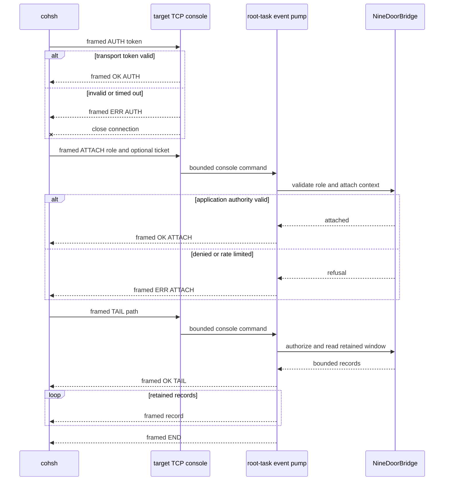

<!-- Copyright 2026 Lukas Bower -->
<!-- SPDX-License-Identifier: Apache-2.0 -->
<!-- Purpose: Define the as-built external transport, namespace, control-file, and schema contracts. -->
<!-- Author: Lukas Bower -->

# External Interfaces

This document is the index and human-authored contract for Cohesix external
interfaces: transport selection, target console framing, namespace paths,
control files, and non-generated record schemas. It links to generated snippets
for compiler-owned values instead of copying them.

Protocol internals belong in [SECURE9P.md](SECURE9P.md), role and ticket policy
in [ROLES_AND_SCHEDULING.md](ROLES_AND_SCHEDULING.md), system boundaries in
[ARCHITECTURE.md](ARCHITECTURE.md), and operator command usage in
[USERLAND_AND_CLI.md](USERLAND_AND_CLI.md).

## Stability and authority

The selected profile manifest, resolved manifest, generated tables, and
generated snippets are authoritative for enabled providers, exact capacities,
paths, and defaults. Source and fixtures are authoritative for handwritten
parsers and response grammar.

The following are breaking changes:

- a Secure9P request, response, or error-code change;
- a target console verb or `OK`/`ERR`/`END` grammar change;
- a namespace path, mode, or record-format change;
- a role/ticket authority change; or
- a generated interface, bound, or default change.

Breaking changes require the process in `AGENTS.md`: manifest schema changes
where applicable, regenerated artifacts, updated fixtures, tests, and canonical
documentation in the same authorized change.

## Pi 4 pre-kernel policy interface

The Pi 4 U-Boot menu is a bounded pre-kernel configuration surface, not a new
Cohesix protocol or authority path. `scripts/pi4-image-build.sh` generates the
executable `boot.cmd`/`boot.scr.uimg` contract. Generic persistent U-Boot
environment storage is disabled; only the FAT-side `cohesix.env` file is
eligible for Cohesix boot-policy import.

The import contract is:

- maximum file size: 384 bytes;
- text line endings: LF or CRLF;
- allowlisted keys only: `coh_net_mode`, `coh_net_interface`,
  `coh_static_ip`, `coh_static_prefix_len`, `coh_static_gateway`,
  `coh_wifi_ssid`, `coh_wifi_psk`, and `coh_show_logo`;
- coherent network tuples: `dhcp|static` plus `wired|wifi`, with static address
  and prefix required for static mode and SSID required for Wi-Fi;
- logo preference: absent or exactly `0|1`; any other value rejects the saved
  policy;
- absent, empty, oversized, malformed, or incoherent input: clear network
  overrides and use selected-manifest defaults.

File presence and saved-network state are deliberately distinct. A logo-only
or cleared `cohesix.env` remains a valid file but produces **Default network
settings active** with the **Boot with default settings** action. A coherent
imported network tuple produces **Saved network settings loaded** with **Boot
with saved settings**. Back/discard transitions reload the file before
returning to **Cohesix boot menu**, so working values cannot masquerade as
persisted policy.

The root menu exposes **Change network settings**, a stateful **Boot logo: On
(select to turn off)** / **Boot logo: Off (select to turn on)** action, **Reset
saved settings to defaults**, **Save settings and restart**, and **Advanced:
Open U-Boot shell**. Reset has a separate **Reset saved settings?** confirmation
page; `1` confirms, `0` cancels, and no persistent state changes before
confirmation. Cancel is the Enter-key default. A confirmed reset writes a
verified default policy rather than requiring deletion of `cohesix.env`.

The menu uses an iterative page dispatcher for root, IPv4 configuration,
network connection, Wi-Fi, manual IPv4, review, and reset-confirmation pages.
Submenus consistently use `0` for **Back** or **Cancel** and `9` for
**Advanced: Open U-Boot shell**. Operator-facing choices are **Automatic
(DHCP)** / **Manual (static IPv4)** and **Ethernet (wired)** / **Wi-Fi
(wireless)**. The review page distinguishes **Boot once without saving** from
**Save settings and restart**; discard reloads persisted policy before returning
to the root menu.

Existing Wi-Fi settings can be kept or changed, and a reset followed by
**Change network settings** creates a fresh saved policy for a different Wi-Fi
network without a reflash. Credential entry is enabled only on the
USB-keyboard/HDMI console. The display explicitly warns that the network name
and password are visible on that display while serial output is disabled;
temporary replacement variables are not part of the export allowlist. SSIDs
are redacted from summaries so untrusted imported text cannot forge terminal or
serial evidence. Save and reset operations export into a bounded buffer, write
`cohesix.env`, verify its size, privately compare a readback copy, and set
success only after exact agreement. Restart is never invoked after a failed
export, write, size check, load, or comparison.

At boot, selected non-empty overrides are projected into the staged DTB as
`/chosen/cohesix,net-mode`, `cohesix,net-interface`,
`cohesix,static-ipv4`, `cohesix,static-prefix-len`,
`cohesix,static-gateway`, `cohesix,wifi-ssid`, and `cohesix,wifi-psk`.
Root-task validates these properties and either selects the DTB-backed policy
or reports a bounded rejection and retains the generated manifest defaults.
The source manifest is never rewritten by U-Boot.

## Transport matrix

| Surface | Wire contract | Authentication and authority | Runtime boundary |
| --- | --- | --- | --- |
| Host/in-process NineDoor | Bounded Secure9P 9P2000.L subset | `Tattach` selects role/identity and carries the ticket | Host `std` server and tests only; not an in-target listener |
| Target serial console | Unframed console lines | Physical serial access, then application `ATTACH` for role/ticket authority | Root-task console |
| Target TCP console | Four-byte little-endian length plus one console line | Transport `AUTH <token>`, then application `ATTACH <role> [ticket]` | Root-task smoltcp listener; the only permitted in-target TCP listener |
| REST, UI, GPU, sidecar, and federation tools | Host-specific projection | Must preserve the underlying ticket and namespace authority | Host only; never a new VM authority path |

Secure9P messages are not transported through the target TCP console. A
console command such as `CAT` or `ECHO` invokes the target namespace adapter; it
does not synthesize a 9P frame on the wire.

### Internal target namespace-service ABI

`nine-door-runtime` uses `namespace-service/v1` only inside the target. It is
not an operator transport, a host RPC, or a second policy plane. The
pointer-free 32-byte request header carries exact ABI/header versions,
operation, zero flags, sequence, supervisor generation, bounded path/payload
lengths, and zero reserved bytes. Path and payload bytes occupy a distinct
shared frame bounded to 256 and 4096 bytes respectively. The child accepts only
`attach`, `tail`, `spawn`, `kill`, `echo`, `cat`, `list`, and `log`; absolute
paths have at most eight components and reject `.` and `..`.

The child response repeats the operation, exact sequence and generation, typed
status, and bounded prepared path/payload. The root-side client contract exposes
exact response validation that must succeed before ticket/Queen policy or
authoritative mutation. Its call cap is exactly Write + GrantReply, without
Read or Grant; the child receive cap is Read-only. Root maps the request window
read-write and response window read-only; the child receives the complementary
read-only and read-write mappings. Each direction is exactly two 4 KiB pages,
uses distinct frame capabilities and physical pages, and carries no pointers in
the shared record. The target adapter sends only sequence and encoded length in
two message registers and rejects extra or unwrapped caps, unknown labels,
short replies, stale identities, mismatched prepared bytes, and unknown error
codes. The sealed 72-byte `namespace-runtime-init/v2` descriptor carries the
aligned child IPC-buffer address in its formerly reserved word; the child
validates that mapping and installs it as the libsel4 IPC buffer before its
first receive. The QEMU constructor binds the exact selected ELF digest and
entry/load span, maps image pages W^X, and creates the child from generated revoke anchor
16137 without allocator fallback. While the child remains suspended, root
configures and binds one compiler-budgeted, root-retained bootstrap scheduling
context. After registry seal and root-fault activation, root resumes the child,
validates an empty `Log` parser probe, observes the atomic `ReplyRecv` transition
into the next receive, and unbinds that exact scheduling context. Only then is
the child passive and only `root-control` donates on the single-inflight,
one-deep Call chain. Activation, probe, or unbind failure revokes the namespace
boundary and suspends the child where possible. The child owns one receive-loop
Reply object but no scheduling-context cap or `SchedControl` authority, and no
`SetAffinity` path is used. Root-fault retains a copy in its generated CSpace slot 10
solely to return `NAMESPACE_REJECTED` with typed `Closed` once when a fault
interrupts an outstanding Call. It then publishes the owner mailbox for scrub,
unmap, and anchor revoke. No Reply is issued between calls, and the active
console-network service cannot use this path. Queue-full, partial-frame, close,
cancellation, stale-generation, and revoke outcomes are explicit and bounded.
The ABI supplies no target TCP listener, namespace-wide capability, device
capability, scheduling-context or `SchedControl` capability, ticket-execution
authority, or root CSpace access. The bootstrap scheduling-context candidate
remains subject to live QEMU qualification.
`apps/nine-door` remains a host library/fixture provider and has no target or
print-and-exit binary. A live QEMU boot is still required to promote these
constructed interfaces to target execution evidence.

## Target TCP console sequence


```mermaid
sequenceDiagram
  participant Client as cohsh
  participant Tcp as target TCP console
  participant Pump as root-task event pump
  participant Namespace as NineDoorBridge

  Client->>Tcp: framed AUTH token
  alt transport token valid
    Tcp-->>Client: framed OK AUTH
  else invalid or timed out
    Tcp-->>Client: framed ERR AUTH
    Tcp--xClient: close connection
  end

  Client->>Tcp: framed ATTACH role and optional ticket
  Tcp->>Pump: bounded console command
  Pump->>Namespace: validate role and attach context
  alt application authority valid
    Namespace-->>Pump: attached
    Pump-->>Client: framed OK ATTACH
  else denied or rate limited
    Namespace-->>Pump: refusal
    Pump-->>Client: framed ERR ATTACH
  end

  Client->>Tcp: framed TAIL path
  Tcp->>Pump: bounded console command
  Pump->>Namespace: authorize and read retained window
  Namespace-->>Pump: bounded records
  Pump-->>Client: framed OK TAIL
  loop retained records
    Pump-->>Client: framed record
  end
  Pump-->>Client: framed END
```

The diagram shows protocol order, not a claim that `NineDoorBridge` is a host
NineDoor server or that every path is available in every profile.

## Target console contract

### Framing

Serial accepts console lines directly. TCP frames every inbound and outbound
line with a four-byte little-endian total length that includes the header.

- Declared total length must be at least 4 and no greater than the Secure9P
  implementation cap of 8192 bytes.
- The isolated QEMU console admits at most 2304 bytes for one authenticated
  command frame. The existing `echo` grammar permits at most 2048 payload
  bytes so one compiler-bounded host-ticket record fits with its verb and path;
  every other command retains its narrower field-specific bound. Physical
  serial/local-seat lines remain bounded independently at 256 bytes.
- Oversized unauthenticated frames terminate authentication. An authenticated
  session receives `ERR FRAME reason=invalid-length` and the declared payload
  is drained before the next frame.
- The first TCP payload must be exactly `AUTH <token>` with the configured
  token length. Invalid, missing, or late authentication closes the session.

Transport authentication does not select a namespace role. After `OK AUTH`,
the client uses `ATTACH <role> [ticket]`. Queen may omit the ticket; worker
roles require a valid ticket and subject identity. Failed application login
attempts use the current bounded limiter: three failures within 60 seconds
produce a 90-second cooldown.

`ATTACH` binds an application session to a role-scoped namespace; it never
creates or resumes a task. The selected profiles separately admit executable
Heartbeat, GPU, and LoRA roles, but only an authorized `/queen/ctl` lifecycle
operation can select one of their already constructed suspended children. The
child's durable READY record, not `ATTACH` or the control acknowledgement,
publishes its exact namespace identity.

### Command grammar

The compiler-owned command inventory is generated in
[cohsh_grammar.md](snippets/cohsh_grammar.md). The parser applies per-field
bounds from [`cohsh-core`](../crates/cohsh-core/src/command.rs), including the
2304-byte authenticated network-command limit, 2048-byte `echo` payload limit,
bounded paths/tickets/JSON payloads, and a maximum of 256 requested tail lines.

Commands are case-insensitive at the verb parser where implemented; arguments
remain subject to their command-specific grammar. Unknown verbs, missing
arguments, extra arguments on strict commands, oversized values, and invalid
numeric fields return `ERR` and produce no documented side effect.

### Acknowledgements and streams

- Every accepted command produces `OK <VERB> ...`; every refused command
  produces `ERR <VERB> reason=<reason> ...`.
- Structured namespace streams such as successful `tail`, `cat`, `ls`, and
  `log` emit a leading `OK`, zero or more bounded records, and a terminal
  `END`.
- Bounded diagnostic commands may emit their diagnostic records before the
  terminal `OK`; their checked transcript, rather than the namespace-stream
  ordering rule, is authoritative.
- `PING` responds as `OK PING reply=pong`; it does not emit a bare `PONG`.
- `QUIT` and authenticated `REBOOT` have explicit connection/flush behavior;
  clients must wait for the documented acknowledgement rather than treating a
  disconnect as success.
- An `ERR` is terminal for that command and must not be treated as a successful
  no-op.

Some queued Queen commands acknowledge acceptance before the event pump
forwards the work; others validate and apply a bounded provider operation before
acknowledging success. Clients must use the command-specific status and
observability path rather than infer completion timing from a generic `OK`.
Canonical transcripts and negative cases live in
[`tests/integration`](../tests/integration) and the root-task tests.

## Host Secure9P contract

Host NineDoor accepts only `version`, `attach`, `walk`, `open`, `read`, `write`,
and `clunk`. It does not accept `stat`, `create`, or `remove`. The current codec
caps walk depth at eight and each walk component at 64 bytes. Exact session,
batching, fid, offset, and error rules are in [SECURE9P.md](SECURE9P.md).

The checked-in default profile uses one frame per batch. Where a selected
manifest enables larger batches, host NineDoor encodes responses in request
order and preserves response tags. Clients must still correlate by tag.

## Namespace conventions

All paths are absolute UTF-8 paths. `..`, NUL, undeclared wildcard expansion,
and traversal outside the attached role view are rejected. A path appearing in
this catalogue does not guarantee runtime presence: the selected manifest must
enable it and the active adapter must implement it.

Node modes have these meanings:

- **read-only:** clients cannot append or replace content;
- **append-only:** writes add one bounded record at the provider's expected
  offset; random overwrite and truncation are rejected;
- **control:** an append-only node whose record is parsed and may cause a
  bounded side effect; and
- **directory:** walk/list only.

Host providers and the target `NineDoorBridge` overlap but are not identical.
Parity must be established per path: a host-only GPU job, sidecar adapter, or
federation relay is not target evidence. Conversely, the target adapter does
implement selected bounded GPU publication, UI, and `/host` files, but their
presence proves only the namespace projection; operating-system actions and
federated delivery still execute in host agents.

## Core namespace

| Path | Mode | Contract |
| --- | --- | --- |
| `/log/queen.log` | Client read stream; system append | Bounded retained Queen/root log. Console `log`, `tail`, and `cat` are projections over this path. |
| `/proc/*` | Read-only unless a generated node explicitly says otherwise | Bounded session, lifecycle, pressure, ingest, scheduling, lease, and root-reachability observations. |
| `/queen/ctl` | Queen control, JSONL | Root-owned lifecycle control for compiler-selected executable Heartbeat, GPU, and LoRA children plus model-only WorkerBus. A successful spawn/admit write means accepted or queued, never READY; only the exact child's durable READY record publishes its canonical `/shard/<label>/worker/<id>` paths. Kill/teardown is generation-fenced and removes stale authority before recreation. |
| `/queen/lifecycle/ctl` | Queen control, token line | Node lifecycle transitions. |
| `/queen/schedule/ctl` | Queen control, JSONL | Bounded orchestration queue; not a direct seL4 scheduler interface. |
| `/queen/lease/ctl` | Queen control, JSONL | Grant, renew, preempt, and quota state for bounded control-plane leases. |
| `/queen/export/ctl` | Queen control, JSONL | Open and close bounded export windows. |
| `/shard/<label>/worker/<id>/telemetry` | Worker append; authorized read | Canonical worker telemetry path. |
| `/worker/<id>/telemetry` | Compatibility alias | Present only when `sharding.legacy_worker_alias` is enabled. |
| `/queen/telemetry/<device>/...` | Authorized control/append/read | OS-named, bounded telemetry-ingest segments. |

Exact generated `/proc` records and capacities are in
[observability_interfaces.md](snippets/observability_interfaces.md). Exact
sharding state and feature gates are in
[root_task_manifest.md](snippets/root_task_manifest.md).

## Queen control records

Control parsers are strict: unknown operations, invalid transitions, unknown
fields where the parser is strict, duplicate identifiers, out-of-range values,
and capacity exhaustion are deterministic errors.

### Worker and mount control

`/queen/ctl` accepts one JSON object per append. Representative accepted shapes
include:

```json
{"spawn":"heartbeat","ticks":100,"budget":{"ttl_s":120,"ops":500}}
{"kill":"worker-7"}
{"bind":{"from":"/shard","to":"/shadow"}}
{"mount":{"service":"gpu-bridge","at":"/gpu"}}
{"spawn":"gpu","lease":{"gpu_id":"GPU-0","mem_mb":4096,"streams":2,"ttl_s":120}}
{"spawn":"lora","budget":{"ttl_s":120,"ops":64}}
```

A successful parse is not permission by itself. Role, ticket, lifecycle,
provider presence, compiler-selected executable contract, queue capacity, and
available task slot remain mandatory. WorkerBus requests remain model/session
only and cannot acquire target-task authority.

For the selected executable roles an accepted `spawn`/admit record targets one
preconstructed suspended child and returns before READY. Publication occurs
only after the exact child commits READY and signals its generated completion
notification. Kill is generation-fenced, contains and revokes the complete
instance bundle, and prevents stale records or caps from affecting a later
fresh-generation reconstruction. Configuration, an ACK, or a host/model
projection is not target execution evidence.

### Lifecycle control

`/queen/lifecycle/ctl` accepts these single-line tokens:

```text
cordon
drain
resume
quiesce
reset
```

The provider validates the state transition and exposes the resulting state,
reason, and time through `/proc/lifecycle/*`. Worker attach, telemetry ingest,
GPU jobs, and host publication remain lifecycle-gated.

### Schedule control

`/queen/schedule/ctl` accepts bounded JSONL entries:

```json
{"id":"sched-1","role":"worker-gpu","priority":2,"ticks":3,"budget_ms":120}
```

`id` and `role` are bounded tokens; numeric work fields must be positive; IDs
are unique within the retained queue. `/proc/schedule/summary` and
`/proc/schedule/queue` are the corresponding generated observations.

### Lease control

`/queen/lease/ctl` accepts `grant`, `renew`, `preempt`, and `quota` records:

```json
{"op":"grant","id":"lease-1","subject":"queen","resource":"gpu0","ttl_s":300,"priority":5}
{"op":"renew","id":"lease-1","ttl_s":600,"priority":6}
{"op":"preempt","id":"lease-1","reason":"timeout"}
{"op":"quota","subject":"queen","resource":"gpu0","max_active":4,"max_preemptions":8}
```

Active, quota, and preemption collections are bounded. Generated summaries are
available at `/proc/lease/*` when enabled.

### Export control

`/queen/export/ctl` accepts bounded `open` and `close` records:

```json
{"op":"open","id":"export-1","ttl_s":900}
{"op":"close","id":"export-1","reason":"window-complete"}
```

## Telemetry contracts

### Worker telemetry

Worker records are appended to the canonical sharded path. Ring size, cursor
retention, and frame selection are manifest-controlled. The generated CBOR
format is defined in
[telemetry_cbor_schema.md](snippets/telemetry_cbor_schema.md). Plain-text and
CBOR evidence must identify which selected schema produced it.

Current telemetry records can be produced by authorized sessions, root-owned
model helpers, or host simulation. Their presence is not proof that a separate
target Worker task emitted them.

The checked-in profiles currently select `legacy-plaintext`. Under that
selection each append must be valid UTF-8 and is retained in the bounded
append-only worker ring; the transport does not add a JSON or CBOR wrapper.
Common heartbeat and GPU records may be JSON lines, but their application
fields are not a replacement for the selected telemetry frame contract. A
profile selecting `cbor-v1` uses `telemetry-frame/v1`; clients must not decode a
legacy record as CBOR or claim the generated CBOR schema was active merely
because the schema is available in this repository.

### Queen telemetry ingest

For `/queen/telemetry/<device_id>/`:

- `ctl` requests a new OS-named segment;
- `seg/<segment_id>` is append-only;
- `latest` is a read-only pointer to the newest segment; and
- the provider, not the client, chooses segment IDs.

The successful segment-control `ECHO` acknowledgement carries the selected
segment ID. Host REST projections may expose that existing receipt through
their response payload; clients retain a bounded `latest` read as the
compatibility fallback when the receipt is unavailable.

The inline `cohsh-telemetry-push/v1` envelope contains:

| Field | Type | Rule |
| --- | --- | --- |
| `schema` | text | Exactly `cohsh-telemetry-push/v1`. |
| `seq` | unsigned integer | Monotonic within the segment, starting at 1. |
| `mime` | text | MIME type for the source payload. |
| `payload` | text | UTF-8 payload chunk bounded by the provider record limit. |

Large host artifacts use a reference manifest rather than inline transfer. A
`coh-ref-c/v1` record contains `schema`, monotonic `seq`, contiguous `off`,
positive `len`, and a bounded `sha256` token. Inline and reference records
cannot be mixed in one segment. All segment, record, reference-count, reference
byte, and eviction bounds come from the selected manifest.

### Queen LoRA export

When telemetry ingest is enabled, host NineDoor can install a read-only
training handoff below `/queen/export/lora_jobs/<job_id>/`:

| Path | Contract |
| --- | --- |
| `telemetry.cbor` | Bounded telemetry bundle selected for the external training job. |
| `base_model.ref` | Single-line base-model identifier. |
| `policy.toml` | Policy snapshot that governed the export. |

The host publisher chooses `<job_id>`; clients do not append to these files.
The target adapter currently exposes the gated export root and its control
file, but it does not populate job directories or accept a job upload. The host
`coh peft export` flow may copy an installed handoff to external training
infrastructure, but the target does not train or import a model by exposing the
directory.

## Manifest-gated namespace families

| Family | Representative paths | Ownership |
| --- | --- | --- |
| GPU bridge and nodes | `/gpu/bridge/*`, `/gpu/<id>/*`, `/gpu/models/*`, `/gpu/telemetry/schema.json` | Host bridge owns GPU hardware and publication; target consumes only bounded files. See [GPU_NODES.md](GPU_NODES.md). |
| Sidecar buses | `/bus/<adapter>/*` | Host sidecar providers; adapter labels and gates are generated. Exact nodes are catalogued below. |
| Host services | `/host/systemd/*`, `/host/k8s/*`, `/host/docker/*`, `/host/nvidia/*`, `/host/tickets/*` | Target and host adapters expose selected bounded projections; host agents execute actions and federation. This document owns the schemas; [HOST_TOOLS.md](HOST_TOOLS.md) owns tool operation. |
| Content-addressed updates | `/updates/<epoch>/*`, `/models/<sha256>/*` | CAS provider, gated by generated policy. |
| Policy and actions | `/policy/*`, `/actions/*` | Generated rules plus bounded policy/action queues. |
| Audit and replay | `/audit/*`, `/replay/*` | Present only when audit and replay gates are enabled. |

Disabled providers return an explicit refusal or absence according to the
active adapter; clients must not silently create substitute paths.

## GPU publication

`/gpu/bridge/ctl` uses a bounded three-stage snapshot stream:

```text
begin bytes=<payload_bytes> sha256=<hex>
b64:<base64_chunk>
end
```

The bridge validates decoded size and SHA-256 before publishing nodes.
`/gpu/bridge/status` reports bounded `idle`, `receiving`, `ok`, or `err` state.
Lease and status breadcrumb formats are generated in
[gpu_breadcrumbs.md](snippets/gpu_breadcrumbs.md).

## Sidecar bus providers

Sidecar mounts exist only when the selected MODBUS or DNP3 `sidecars.*` gate is
enabled. The compiler resolves adapter labels, including collision handling;
clients must discover those labels rather than derive them. Both provider types
share the `/bus/<adapter>` file contract:

| Path | Mode | Contract |
| --- | --- | --- |
| `ctl` | Append-only | Bounded sidecar coordination/control records. |
| `telemetry` | Append-only | Accepted records; while the link is offline, writes are spooled for bounded replay. |
| `link` | Control | `online` or `offline`. |
| `replay` | Control | A write requests a bounded spool drain and records `replay entries=<n> bytes=<n>`. |
| `spool` | Read-only | Aggregate entry/byte bounds followed by retained frame summaries. |

Adapter-scoped role/ticket checks precede every side effect. A denial is not a
successful control operation or replay and is recorded through the existing
Queen log or audit surface; these providers do not create a second RPC
protocol. AI LoRA lifecycle interfaces are the
[Queen LoRA export](#queen-lora-export) above and the host-side PEFT workflows
owned by [GPU_NODES.md](GPU_NODES.md); lowercase `lora` identifiers denote that
AI lifecycle, not a sidecar bus family.

## UI provider projections

UI providers are optional, bounded, read-only representations of existing
state. Each text provider has a paired `.cbor` form only where listed; the
generated `ui_providers.*` gates and the underlying provider gate must both be
enabled.

| Family | Public nodes |
| --- | --- |
| 9P sessions | `/proc/9p/sessions`, `/proc/9p/outstanding`, `/proc/9p/short_writes`, and the corresponding `.cbor` nodes. |
| Ingest | `/proc/ingest/p50_ms`, `/proc/ingest/p95_ms`, `/proc/ingest/backpressure`, and the corresponding `.cbor` nodes. |
| Policy preflight | `/policy/preflight/req`, `/policy/preflight/req.cbor`, `/policy/preflight/diff`, and `/policy/preflight/diff.cbor`. |
| Update state | `/updates/<epoch>/manifest.cbor`, `/updates/<epoch>/status`, and `/updates/<epoch>/status.cbor`. |

The paired record fields are:

| Provider | Text form | CBOR map |
| --- | --- | --- |
| 9P sessions | The generated `/proc/9p/*` records below. | Sessions: `total`, `worker`, `shard_bits`, `shard_count`, and `shards[] {label, count}`; outstanding: `current`, `limit`; short writes: `total`, `retries`. |
| Ingest | The generated `/proc/ingest/*` scalar records below. | One unsigned field named `p50_ms`, `p95_ms`, or `backpressure`, matching the node. |
| Policy request preflight | Summary counts plus `req id=<id> target=<path> decision=<approve\|deny> state=<queued\|consumed>` lines. | `total`, `queued`, `consumed`, and `actions[] {id, target, decision, state}`. |
| Policy diff preflight | Summary counts plus `rule id=<id> target=<path> queued=<n> consumed=<n>` lines. | `rules`, `actions`, `unmatched`, and `entries[] {id, target, queued, consumed}`. |
| Update status | Epoch/state, manifest/chunk counts, payload digest, and optional delta-base lines. | The same `epoch`, `state`, byte/count, digest, and optional `delta {base_epoch, base_sha256}` fields. |

Text and CBOR variants describe the same snapshot but are separate bounded
reads. Disabled or oversized providers fail explicitly and emit a
`ui-provider` audit record. SwarmUI and other clients may render, cache, or
replay these records, but they do not own their schema or mutation policy.

## Host service projections

The host tree appears only when `ecosystem.host.enable` is selected; individual
provider roots follow `ecosystem.host.providers[]`. These append-only nodes are
projections or ticketed control sinks, not direct VM access to systemd,
Kubernetes, Docker, or NVIDIA APIs.

| Path | Contract |
| --- | --- |
| `/host/systemd/<unit>/status` | Host-published unit state; `start`, `stop`, and `restart` siblings are Queen-only control sinks. |
| `/host/k8s/node/<name>/status` | Host-published node state; `cordon` and `drain` siblings are Queen-only control sinks. |
| `/host/docker/status` | Host-published engine/container summary; `restart` and `stop` are Queen-only control sinks. |
| `/host/nvidia/gpu/<id>/status` | Host-published GPU summary; `power_cap` is a Queen-only control sink and `thermal` is host-published state. |
| `/host/jetson`, `/host/net` | Manifest-selected provider roots. The as-built namespace currently defines no portable child-record schema for these roots. |

Provider agents sanitize bounded status records. Systemd uses
`state=<state> sub=<substate>`; Kubernetes uses
`state=<state> role=<role> version=<version>`; Docker uses
`version=<version> containers=<n> running=<n> paused=<n> stopped=<n>`; NVIDIA
status uses `util_pct`, `mem_used_mb`, `mem_total_mb`, `temp_c`, and `power_w`,
while its thermal node uses `temp_c`. Collection failure uses `state=unknown`
or the provider's documented unknown scalar. A control-file append records a
request; only the corresponding host-ticket result or provider observation can
prove that the host action occurred.

## Host tickets and federation

When host tickets are enabled, the namespace exposes:

| Path | Mode | Record |
| --- | --- | --- |
| `/host/tickets/spec` | Append-only JSONL | Strict request records using the generated request schema (`host-ticket/v1` in the checked-in profile). |
| `/host/tickets/status` | Append-only JSONL | Lifecycle receipts using the generated result schema (`host-ticket-result/v1`). |
| `/host/tickets/deadletter` | Append-only JSONL | Terminal failure or expiry receipts using the result schema. |
| `/host/tickets/spec.snapshot` | Read-only | Bounded snapshot of `spec`. |
| `/host/tickets/status.snapshot` | Read-only | Bounded snapshot of `status`. |
| `/host/tickets/deadletter.snapshot` | Read-only | Bounded snapshot of `deadletter`. |

A request contains the required fields `schema`, `id`, `idempotency_key`, and
`action`; `target`, `args`, and `expires_unix_ms` are optional. A result contains
the required fields `schema`, `id`, `idempotency_key`, `action`, and `state`,
with optional `message`. Unknown fields are rejected. Actions and result states
must appear in the selected manifest's allowlists; the checked-in lifecycle is
`queued`, `claimed`, `running`, then `succeeded`, `failed`, or `expired`.

```json
{"schema":"host-ticket/v1","id":"ticket-1","idempotency_key":"restart-1","action":"systemd.restart","target":"/host/systemd/cohesix-agent.service/restart"}
{"schema":"host-ticket-result/v1","id":"ticket-1","idempotency_key":"restart-1","action":"systemd.restart","state":"succeeded","message":"ok"}
```

`id`, `idempotency_key`, and federation identifiers are at most 128 bytes and
use only ASCII letters, digits, `.`, `-`, `_`, and `:`. The manifest bounds the
full JSON line; the Secure9P `msize` remains an independent upper bound.

Federated requests and receipts add `source_hive`, `target_hive`, `relay_hop`,
and `relay_correlation_id`. Source and target are pair-required, `relay_hop` is
`1..=32` when present, and every relay revalidates its manifest-gated peer and
action policy. The correlation key is local `id + idempotency_key`, or
federated `id + idempotency_key + source_hive + target_hive`; it provides
idempotency/evidence correlation, not additional authority. Relay queues, WAL,
timeouts, peers, and credentials remain host-side and manifest-bounded.

## CAS updates

CAS layout, fixed chunk size, delta references, signing requirement, and
manifest template are generated in
[cas_interfaces.md](snippets/cas_interfaces.md). Clients append only to declared
manifest/chunk nodes, and a hash or size mismatch is an error. Do not duplicate
the generated manifest template in another canonical document.

## Policy, audit, and replay

| Path | Mode | Contract |
| --- | --- | --- |
| `/policy/ctl` | Control JSONL | Strict `apply` and `rollback` policy-revision records. |
| `/policy/rules` | Read-only | Deterministic snapshot of the selected manifest rules. |
| `/actions/queue` | Control JSONL | Single-use `id`, `target`, and `approve`/`deny` decisions. |
| `/actions/<id>/status` | Read-only | `queued` or `consumed` decision state. |
| `/audit/journal` | Append-only JSONL | Bounded control-action journal. |
| `/audit/decisions` | Append-only JSONL | Policy decision records with role/ticket context. |
| `/audit/export` | Read-only | Retained cursor bounds and replay flags. |
| `/replay/ctl` | Control JSON | Bounded `{"from":<cursor>}` request. |
| `/replay/status` | Read-only | `idle`, `ok`, or `err` state with deterministic sequence fingerprint. |

Representative strict control records are:

```json
{"op":"apply","id":"rev-1","sha256":"0123456789abcdef0123456789abcdef0123456789abcdef0123456789abcdef"}
{"op":"rollback","id":"rev-1"}
{"id":"approve-1","target":"/queen/ctl","decision":"approve"}
{"from":42}
```

Policy nodes require `ecosystem.policy.enable`; audit nodes require
`ecosystem.audit.enable`; replay additionally requires
`ecosystem.audit.replay_enable`. Policy approvals are single-use. Replay is
limited to the retained audit window and to Cohesix-issued control actions;
out-of-window cursors, offset mismatches, or disabled gates fail without
creating an alternate control or authority path.

## Generated schema index

These files are generated by `coh-rtc` or the grammar generator and must be
updated only through their source:

- [root_task_manifest.md](snippets/root_task_manifest.md) — profile summary,
  mounts, sharding, sidecars, and ecosystem gates
- [observability_interfaces.md](snippets/observability_interfaces.md) — exact
  `/proc` paths, formats, and byte limits
- [telemetry_cbor_schema.md](snippets/telemetry_cbor_schema.md) — worker
  telemetry CBOR frame
- [gpu_breadcrumbs.md](snippets/gpu_breadcrumbs.md) — GPU lease and status
  breadcrumbs
- [cas_interfaces.md](snippets/cas_interfaces.md) — update and model registry
  layout
- [ticket_quotas.md](snippets/ticket_quotas.md) — ticket quota limits
- [cohsh_grammar.md](snippets/cohsh_grammar.md) — target console verbs

## Compiler-generated interface appendices

The following blocks are embedded because `coh-rtc` compares them with the
active default-profile output. Do not edit them by hand; update the manifest or
generator and run `scripts/check-generated.sh`.

<!-- markdownlint-disable MD022 MD032 MD031 -->
<!-- coh-rtc:telemetry-cbor:start -->
### Telemetry CBOR Frame v1 (generated)
- Schema: `telemetry-frame/v1`
- Version: `1`
- Encoding: CBOR map (major type 5)

| Field | CBOR type | Required | Description |
| --- | --- | --- | --- |
| `schema` | `text` | `yes` | Schema identifier; must be `telemetry-frame/v1`. |
| `worker_id` | `text` | `yes` | Worker identifier emitting the record. |
| `role` | `text` | `yes` | Worker role label (`worker-heartbeat`, `worker-gpu`). |
| `seq` | `uint` | `yes` | Monotonic frame sequence number. |
| `emitted_ms` | `uint` | `yes` | Unix epoch milliseconds captured by the worker. |
| `payload` | `map` | `yes` | Schema-specific payload map (e.g., heartbeat or GPU job data). |

_Generated by coh-rtc (sha256: `d1906bce668a4d73d95a8262734f1ec04a1480610ebfd9b6c3f3c8ad2e402b7e`)._
<!-- coh-rtc:telemetry-cbor:end -->

<!-- coh-rtc:observability-interfaces:start -->
### /proc observability nodes (generated)
- `/proc/9p/sessions` (read-only, max 8192 bytes): `sessions total=<u64> worker=<u64> shard_bits=<u8> shard_count=<u16>` plus `shard <hex> <count>` lines.
- `/proc/9p/outstanding` (read-only, max 128 bytes): `outstanding current=<u64> limit=<u64>`.
- `/proc/9p/short_writes` (read-only, max 128 bytes): `short_writes total=<u64> retries=<u64>`.
- `/proc/9p/session/active` (read-only, max 128 bytes): `active=<u64> draining=<u64>`.
- `/proc/9p/session/<id>/state` (read-only, max 64 bytes): `state=SETUP|ACTIVE|DRAINING|CLOSED`.
- `/proc/9p/session/<id>/since_ms` (read-only, max 64 bytes): `since_ms=<u64>`.
- `/proc/9p/session/<id>/owner` (read-only, max 96 bytes): `owner=<identity>`.
- `/proc/ingest/p50_ms` (read-only, max 64 bytes): `p50_ms=<u32>` (milliseconds).
- `/proc/ingest/p95_ms` (read-only, max 64 bytes): `p95_ms=<u32>` (milliseconds).
- `/proc/ingest/backpressure` (read-only, max 64 bytes): `backpressure=<u64>`.
- `/proc/ingest/dropped` (read-only, max 64 bytes): `dropped=<u64>`.
- `/proc/ingest/queued` (read-only, max 64 bytes): `queued=<u32>`.
- `/proc/ingest/watch` (append-only, max_entries=16, line_bytes=192, min_interval_ms=50): `watch ts_ms=<u64> p50_ms=<u32> p95_ms=<u32> queued=<u32> backpressure=<u64> dropped=<u64> ui_reads=<u64> ui_denies=<u64>`.
- `/proc/root/reachable` (read-only, max 32 bytes): `reachable=yes|no`.
- `/proc/root/last_seen_ms` (read-only, max 64 bytes): `last_seen_ms=<u64>`.
- `/proc/root/cut_reason` (read-only, max 64 bytes): `cut_reason=<none|network_unreachable|session_revoked|policy_denied|lifecycle_offline>`.
- `/proc/pressure/busy` (read-only, max 64 bytes): `busy=<u64>`.
- `/proc/pressure/quota` (read-only, max 64 bytes): `quota=<u64>`.
- `/proc/pressure/cut` (read-only, max 64 bytes): `cut=<u64>`.
- `/proc/pressure/policy` (read-only, max 64 bytes): `policy=<u64>`.
- `/proc/schedule/summary` (read-only, max 128 bytes): `queue=<u64> dequeued=<u64> dropped=<u64> max_entries=<u32>`.
- `/proc/schedule/queue` (read-only, max 256 bytes): `id=<id> role=<role> priority=<u32> ticks=<u32> budget_ms=<u32> seq=<u64>`.
- `/proc/lease/summary` (read-only, max 160 bytes): `active=<u64> preemptions=<u64> quotas=<u64> max_active=<u32> max_preemptions=<u32>`.
- `/proc/lease/active` (read-only, max 256 bytes): `id=<id> subject=<subject> resource=<resource> ttl_s=<u32> priority=<u32> state=<STATE> seq=<u64>`.
- `/proc/lease/preemptions` (read-only, max 256 bytes): `id=<id> subject=<subject> resource=<resource> reason=<reason> seq=<u64>`.

_Generated by coh-rtc (sha256: `4ff0d485329b917eeaa1b604f8adfb28fd0a75924e7d55ac818d9359b81379b5`)._
<!-- coh-rtc:observability-interfaces:end -->

<!-- coh-rtc:gpu-breadcrumbs:start -->
### GPU status breadcrumb schema (generated)
- `coh.run.lease.schema`: `gpu-lease/v1`
- `coh.run.lease.active_state`: `ACTIVE`
- `coh.run.lease.max_bytes`: `1024`
- `coh.run.breadcrumb.schema`: `gpu-breadcrumb/v1`
- `coh.run.breadcrumb.max_line_bytes`: `512`
- `coh.run.breadcrumb.max_command_bytes`: `256`
- Lease entries are JSON lines with fields: `schema`, `state`, `gpu_id`, `worker_id`, `mem_mb`, `streams`, `ttl_s`, `priority`.
- Breadcrumb entries are JSON lines with fields: `schema`, `event`, `command`, `status`, `exit_code` (optional).

_Generated by coh-rtc (sha256: `80eff6277e0b97c54fc8996ffc01a54ccff20b899bcd0e9f63c30de1afb02f80`)._
<!-- coh-rtc:gpu-breadcrumbs:end -->

<!-- coh-rtc:cas-interfaces:start -->
### CAS update surfaces (generated)
- `cas.store.chunk_bytes`: `128`
- `cas.delta.enable`: `true`
- `cas.signing.required`: `true`
- Base update layout: `/updates/<epoch>/manifest.cbor`, `/updates/<epoch>/chunks/<sha256>`.
- Model registry layout: `/models/<sha256>/weights`, `/models/<sha256>/schema`, `/models/<sha256>/signature`.
- Delta manifests supply `delta.base_epoch` and `delta.base_sha256`, referencing a non-delta base.
- Payloads are appended as raw bytes or `b64:`-prefixed base64.
- CAS manifest template:
```json
{
  "chunk_bytes": 128,
  "chunks": [
    "<sha256-hex>"
  ],
  "delta": {
    "base_epoch": "<epoch>",
    "base_sha256": "<sha256-hex>"
  },
  "epoch": "<epoch>",
  "payload_bytes": "<payload-bytes>",
  "payload_sha256": "<sha256-hex>",
  "schema": "cohesix-cas/manifest-v1",
  "signature": "<ed25519-signature-hex>"
}
```

_Generated by coh-rtc (sha256: `1bd13b5ce9da8c2e5442e87cfca3e95daa90ee3fbba7de30e21855f19a3ae8a5`)._
<!-- coh-rtc:cas-interfaces:end -->
<!-- markdownlint-enable MD022 MD032 MD031 -->

## Error surfaces

Secure9P wire errors are `Permission`, `NotFound`, `Busy`, `Invalid`, `TooBig`,
and `Closed`. Their semantics are defined in [SECURE9P.md](SECURE9P.md).

Console errors are textual `ERR` acknowledgements with a verb and bounded
reason/detail fields. Common reasons include authentication, permission,
policy, lifecycle, quota, busy/backpressure, invalid path or payload, and frame
length. Console rate limiting is not a Secure9P wire error.

Host REST or UI projections may map these failures into their own transport
status, but they must preserve the underlying refusal and must not retry a
non-idempotent operation unless the documented host contract explicitly permits
it.

## Verification and source map

- Console parser: [`crates/cohsh-core/src/command.rs`](../crates/cohsh-core/src/command.rs)
- TCP framing/authentication:
  [`apps/root-task/src/net/console_srv.rs`](../apps/root-task/src/net/console_srv.rs)
- Target dispatch: [`apps/root-task/src/event`](../apps/root-task/src/event)
- Target namespace adapter:
  [`apps/root-task/src/ninedoor.rs`](../apps/root-task/src/ninedoor.rs)
- Host Secure9P server: [`apps/nine-door/src/host`](../apps/nine-door/src/host)
- Host namespace and ticket validation:
  [`apps/nine-door/src/host/namespace.rs`](../apps/nine-door/src/host/namespace.rs)
- Host-ticket lifecycle and federation agent:
  [`apps/host-ticket-agent`](../apps/host-ticket-agent)
- Worker model/build-artifact contracts: [`apps/worker-bus`](../apps/worker-bus),
  [`apps/worker-lora`](../apps/worker-lora), and
  [`apps/worker-gpu`](../apps/worker-gpu)
- Codec operations: [`crates/secure9p-codec`](../crates/secure9p-codec)
- Generated interface checks: `scripts/check-generated.sh`
- Staged validation: [TEST_PLAN.md](TEST_PLAN.md)

Every new public path or record must be documented here, owned by manifest IR
when it changes generated behavior, and covered by positive and negative
fixtures before clients depend on it.
