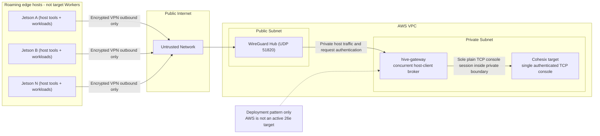

<!-- Copyright © 2026 Lukas Bower -->
<!-- SPDX-License-Identifier: Apache-2.0 -->
<!-- Author: Lukas Bower -->
<!-- Purpose: Describe a host-encrypted roaming-edge integration pattern and its current authority limits. -->
# Example Secure Network Topology for Cohesix
**Roaming Jetson hosts + host gateway + private Cohesix target**

---

## Purpose

This document describes a deployment integration pattern with:

- a private Cohesix target behind one host gateway;
- multiple independently roaming Jetson hosts, which are not Cohesix target
  Workers;
- an external encrypted overlay network; and
- no TLS, HTTPS, or general cryptographic stack inside the target.

This is not an accepted Milestone 26e AWS target profile. The selected 26e
targets remain QEMU `aarch64/virt` and Raspberry Pi 4; AWS and UEFI execution
are inactive unless [BUILD_PLAN.md](BUILD_PLAN.md) explicitly authorizes them.
The pattern shows how a future deployment must preserve the current
single-console-owner and host-encryption boundaries.

---

## High-Level Security Principles

1. **Edge devices initiate all connections**
   - Jetsons never accept inbound connections.
   - This survives NAT, CGNAT, LTE, hotel Wi-Fi, etc.

2. **The Cohesix target is never publicly reachable**
   - No public IP
   - No internet-facing ports
   - Reachable only from the private host gateway

3. **Encryption lives outside the VM**
   - VPN / tunnel terminates on the host
   - Cohesix VM sees plain TCP inside a trusted boundary

4. **Identity and authority are explicit**
   - Each Jetson has a unique network identity
   - Gateway request authentication protects the host HTTP edge
   - All clients behind one gateway inherit that gateway's upstream target
     role and optional ticket
   - Gateway request authentication is not delegated target identity; per-edge
     target roles require a separately designed and accepted host broker

---

## Components and Roles

### Jetson Edge Device
Runs:
- Application workloads (CV, inference, sensors, CUDA, etc.)
- A **VPN client** (WireGuard or equivalent)
- A deployment-approved REST client or edge agent

Does **not** run:
- seL4
- Cohesix root-task
- NineDoor namespaces

Rationale:
- CUDA and device drivers must remain host-side
- Avoids per-device seL4 bring-up and attestation overhead
- Keeps edge simple and operationally robust

---

### VPN Hub (AWS, Host-Level)
Runs:
- WireGuard (or WireGuard-based system)
- No Cohesix logic

Responsibilities:
- Accept encrypted outbound connections from Jetsons
- Provide a private, authenticated L3 network
- Act as the **only** internet-facing component

Security note:
- This host is part of the *network boundary*, not the Cohesix TCB.

---

### Host Gateway (Private Subnet)
Runs:
- `hive-gateway` as the sole target TCP-console owner
- Deployment-specific edge authorization and audit controls when individual
  Jetsons need distinct policy

Responsibilities:
- Multiplex concurrent host clients through bounded REST operations
- Hold one upstream target role and optional ticket
- Preserve request authentication, queue bounds, and target refusal semantics

Security note:
- The gateway is a privileged host boundary. Its request token does not become
  a per-client target capability or namespace identity.

---

### Private Cohesix Target (Deployment Pattern)
Runs:
- seL4 kernel + elfloader
- Cohesix root-task
- `console-network-runtime` and the target namespace adapter

Network exposure:
- **Private subnet only**
- One authenticated TCP console reachable **only from the host gateway**

Responsibilities:
- Global orchestration
- Policy enforcement
- Logging, telemetry ingestion, artifact coordination

---

## Reference Topology

The following diagram expresses:
- Trust boundaries
- Encrypted vs plaintext links
- Outbound-only edge connectivity
- The gateway's sole ownership of the target console
- The fact that AWS placement is a pattern, not 26e target acceptance

## Connection Flow (Step-by-Step)

1. **Jetson boots**
   - Establishes outbound VPN tunnel to AWS hub
   - Receives a stable VPN IP (e.g. `10.200.0.x`)

2. **Jetson starts Cohesix host agent**
   - Connects to the private host gateway over the VPN
   - Uses the deployment's host-edge authentication and policy

3. **Gateway admits or refuses the host request**
   - The VPN authenticates the network peer
   - Gateway request authentication protects the REST edge
   - Deployment-specific policy must distinguish clients when one shared
     gateway credential is insufficient

4. **Gateway projects the operation to the target**
   - `hive-gateway` remains the sole target console client
   - The target validates the gateway's upstream role, optional ticket,
     namespace, policy, and bounds
   - The target does not receive a delegated Jetson identity

5. **Operational traffic begins**
   - Telemetry upload
   - Job fetch
   - Result submission

All traffic is encrypted **on the wire**, but remains simple and deterministic **inside** the VM.

---

## Identity and Access Control

### Network Layer
- One VPN keypair per Jetson
- Revocation = remove peer → instant disconnect

### Host Gateway Layer
- Authenticate and authorize the private host edge
- Rotate or revoke the affected gateway credential and ingress policy
- Treat a shared request token as shared host-edge authority, not as an
  individual target identity

### Cohesix Target Layer
- One upstream role and optional ticket are bound to the gateway's target
  session
- Target role, namespace, lifecycle, policy, and bounds checks remain
  authoritative
- Milestone 26e does not delegate a distinct target role or ticket from each
  REST client through one gateway

Every selected layer is required. VPN identity cannot replace target
authorization, and target authorization cannot provide internet transport
confidentiality.

---

## Failure and Compromise Model

| Event | Outcome |
|-----|--------|
| Packet sniffing on internet | Encrypted, unreadable |
| Compromised Jetson | Bounded by its VPN peer and deployment-specific host ingress policy; a shared gateway does not automatically give it a distinct target role. |
| Gateway request-token leak | Exposes the corresponding host edge when network reach exists; rotate the token and audit the gateway. |
| VPN key leak | Does not satisfy independent gateway request authentication. |
| Gateway compromise | Exposes the gateway's complete upstream target authority and requires fencing, credential rotation, and audit. |
| Cohesix target compromise | Out of scope (TCB breach). |

---

## Non-Goals (Explicitly Out of Scope)

- HTTPS or TLS inside the Cohesix VM
- Mutual TLS between Jetsons and the Cohesix target
- Direct inbound connections to edge devices
- Multiple direct clients competing for the single target TCP console
- Delegated per-Jetson target identity through one 26e gateway session
- AWS or UEFI target acceptance under Milestone 26e

---

## Summary

This pattern preserves:

- Strong confidentiality on untrusted networks
- One explicit host owner for the target TCP console
- Separation between VPN, gateway, and target authorization
- Minimal TCB inside the seL4 VM
- Operational simplicity for roaming edge devices

It does not by itself provide per-Jetson target authority. A deployment that
requires that property must add and accept a host-side identity broker without
creating another in-target listener or authority path.

If you are extending this pattern, document:
- What new attack surface is introduced
- Why it cannot be handled at the host/network layer
- How revocation and least privilege are preserved
