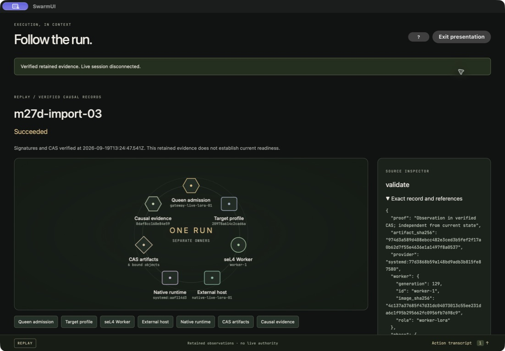
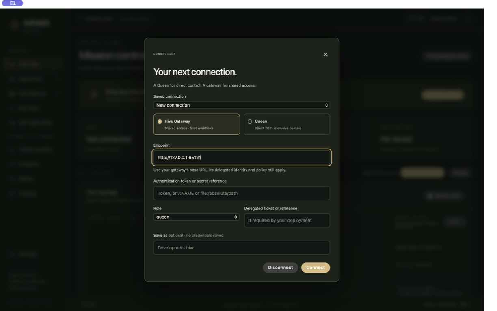
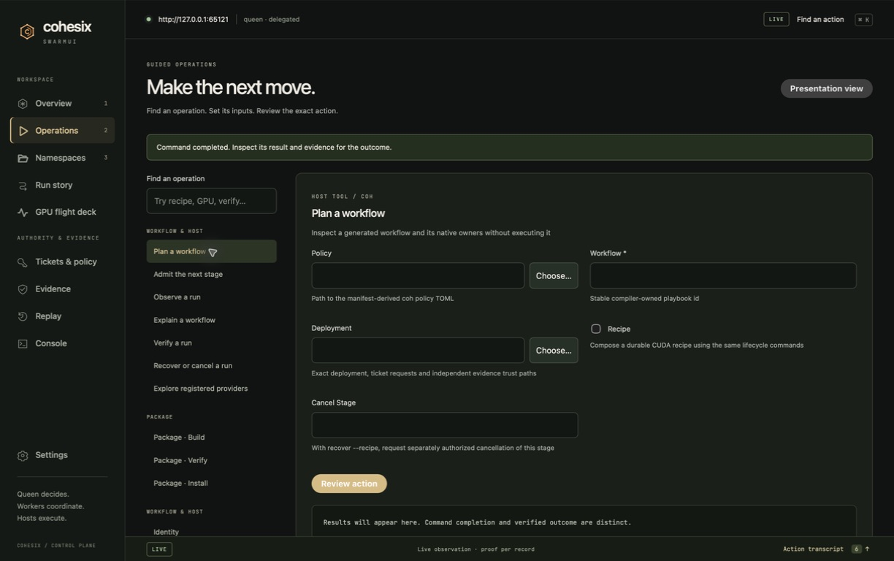
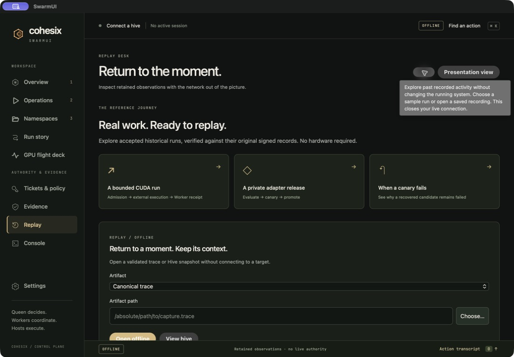
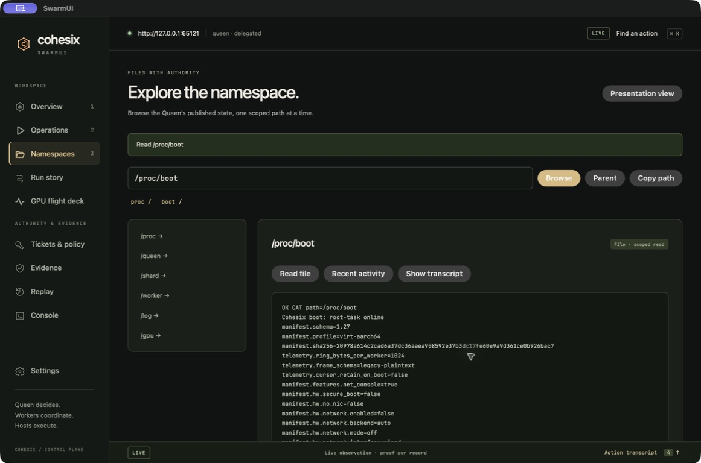
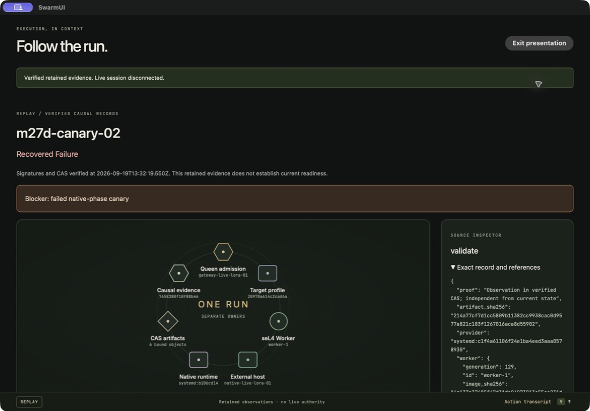
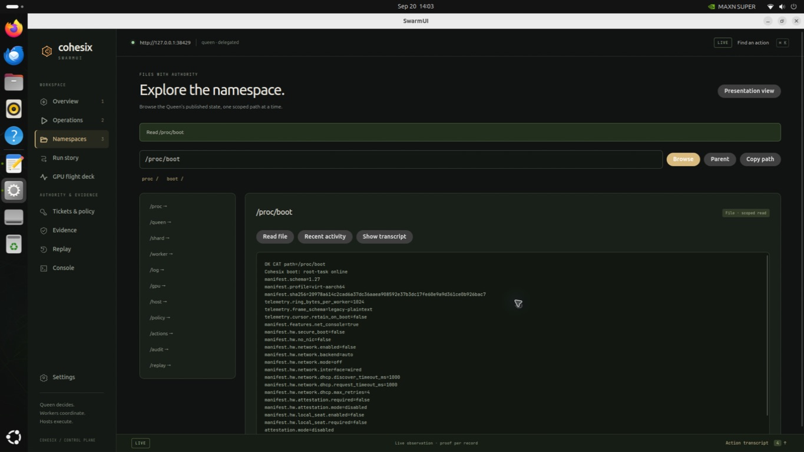

<!-- Author: Lukas Bower -->
<!-- Purpose: Show the actual native SwarmUI workbench with its original evidence and connection labels. -->
<!-- Copyright 2026 Lukas Bower -->
<!-- SPDX-License-Identifier: Apache-2.0 -->

# SwarmUI in use

These images come from the native desktop application, not browser fixtures or
mockups. The macOS images use the signed, verified and installed desktop candidate.
The Jetson image uses the native Linux AArch64 build. Source and artifact identities
are retained in the [implementation record](audit/M27F_IMPLEMENTATION_RECORD.md).
The existing public 1.0.0-beta archives retain their original interface.

## Follow a verified run

The signed LoRA reference is historical **REPLAY**. Selecting a phase or evidence
segment reveals the exact supporting record; it cannot establish current readiness.

## Connect from the desktop

Choose a gateway for shared access, or a Queen when its direct console is free.
Credentials stay in the active session. Saved profiles retain only non-secret
connection preferences.

## Use guided operations

The installed host tool owns argument validation, admission and outcomes. Native
file pickers and reviewed forms make its workflows available without a terminal.

## Get a quick hint

The **?** beside each title gives a short next step. Focus or hover to read it;
press **Escape** to dismiss it. Four less obvious controls also have short hints.

## Explore published state

Select an entry to open a directory or read a file. The final native Mac and
Jetson checks verify that old listings and refusal notices clear on a new read.

## Understand a failed candidate

A successful rollback restores the previous adapter. The candidate remains a
**recovered failure**, with its blocker and original evidence visible.

## Run on Jetson

This checks Linux desktop rendering, the Rust bridge and gateway operation.
Replaying accepted GPU evidence does not claim a new GPU execution.

The [SwarmUI guide](SWARMUI.md) and [operator walkthrough](OPERATOR_WALKTHROUGH.md)
explain these workflows. The deterministic [native frame walkthrough](images/swarmui/walkthrough.html)
replays the original packaged-app screenshots with their mode labels intact.
