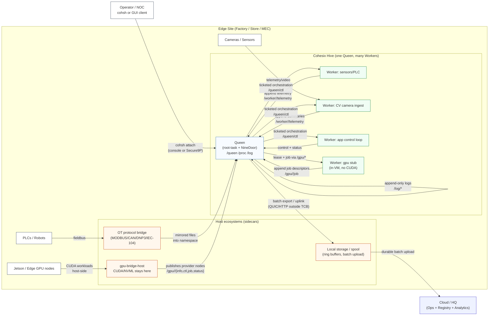
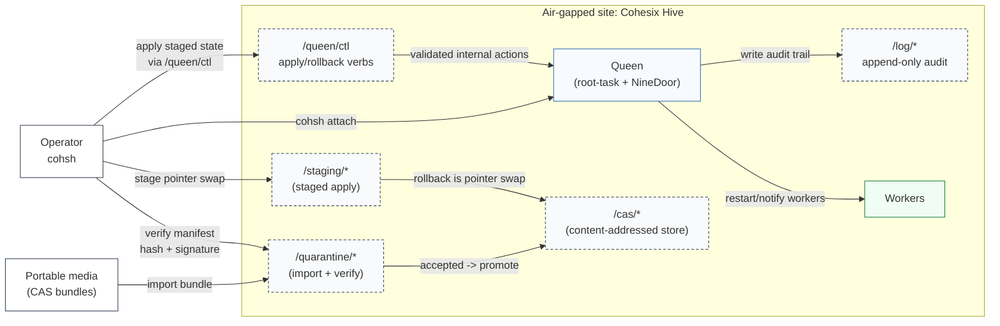
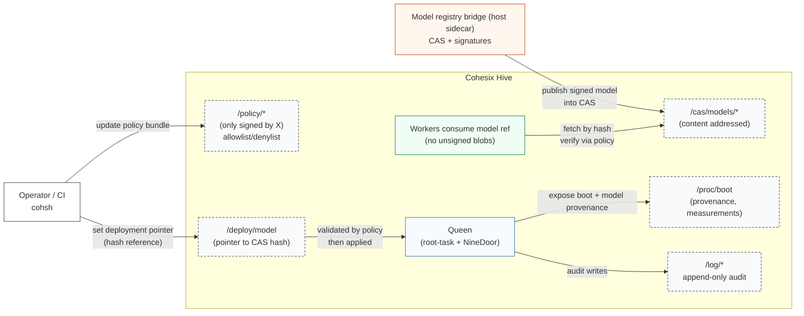

<!-- Author: Lukas Bower -->
<!-- Purpose: Catalogue high-value Cohesix use cases and their operational constraints. -->
# USE_CASES.md
Author: Lukas Bower — October 15, 2025

## Purpose
This document enumerates concrete, high‑value **use cases** for Cohesix across sectors, highlighting why the platform is a fit, what (if anything) needs to be added, and any notable compliance or operational constraints.

## Differentiation Overview (Why Cohesix is different)
- **Everything is a file, but secured:** the control plane is a Secure9P namespace, not agents, ad-hoc RPC, or in-VM HTTP. All verbs are file ops with AccessPolicy enforcement.
- **Queen/Worker orchestration:** one Queen coordinating many Workers via explicit tickets, role budgets, and bounded resources; no hidden daemons.
- **Tiny TCB + deterministic envelope:** upstream seL4 with pure Rust userspace, no POSIX/libc stacks, no in-VM GPU stacks; memory and I/O are bounded and deterministic.
- **Coexists with existing ecosystems:** host-side sidecars mirror namespaces (Kubernetes, CUDA/NVML, OT protocols, storage, model registries) over 9P so Cohesix stays the boundary orchestrator, not a general OS.
- **LoRA / PEFT feedback loops without in-VM ML:** model lifecycle pointers (e.g. `/gpu/models/active`) and schema-tagged, bounded telemetry make edge feedback ingestible by external training farms without expanding the VM’s TCB.
- **Cohesix is not:**
  - a Linux replacement
  - an in-VM container runtime
  - an in-VM network appliance with ad-hoc daemons
- **What you get:** auditability via append-only file semantics, capability scoping through tickets/leases, reproducible operations via CAS/policy-as-files, and resilience for low-trust endpoints (unreliable nets, air-gaps).

---

## Edge & Industrial

### 1) Smart‑factory / Industrial IoT gateway
**Why Cohesix:** tiny TCB (seL4), strong isolation between PLC/robot cells, append‑only telemetry, offline‑first.  
**Needs:** MODBUS/CAN sidecars; telemetry ring buffers + cursors; QUIC uplink (gateway/host).  
**Constraints:** Deterministic timing, safety certification paths.

### 2) Energy substation / Micro‑grid controller
**Why:** deterministic scheduling, minimal attack surface at OT/IT boundary.  
**Needs:** DNP3/IEC‑104 adapters; signed config updates; GPS/PTP time beacons.  
**Constraints:** NERC/CIP, IEC 61850 contexts.

### 3) Retail / Computer-vision hub (store analytics)
**Why:** private LAN for cameras/Jetsons; secure UEFI worker as the only WAN node; continuous improvement without shipping raw video upstream.  
**Needs:** content-addressed model updates; CBOR telemetry; local summarization; LoRA-ready feedback telemetry.  
**Constraints:** Privacy/PII handling at edge.

### 4) Logistics & ports (ALPR, container ID, crane safety)
**Why:** harsh networks, need resilient telemetry & updates.
**Needs:** durable disk spooling; batch uploads; ring buffers.
**Constraints:** Physical security, RF noise.
Hives with a single Queen orchestrate multiple workers across yard devices, commanded through `cohsh` or compatible clients on physical ARM64 hardware, with QEMU used during development to mirror deployment behaviour.

### 5) Telco MEC micro‑orchestrator
**Why:** coordinate accelerators at cell sites; capability tickets; multi‑tenant scheduling.
**Needs:** SR‑IOV/NIC telemetry sidecars; per‑tenant quotas; shard namespaces.
**Constraints:** Carrier‑grade Ops, slice isolation.
Each MEC node is a hive (one Queen, many workers and GPU workers) steered through `cohsh` or GUI tooling that reuses the same protocol, hosted on physical ARM64 hardware booted via UEFI; QEMU is reserved for dev/CI equivalence testing.

### 6) Healthcare imaging edge → cloud PACS
**Why:** minimize PHI footprint, deterministic control plane.  
**Needs:** DICOM proxy; de‑identification; audit‑grade append logs.  
**Constraints:** HIPAA/ISO 27001, locality of data.

### 7) Autonomous depots (AV/AGV fleets)
**Why:** bandwidth-aware model deltas; offline autonomy; fleet-wide learning from local conditions.  
**Needs:** CAS manifests; delta packs; multicast to many vehicles; schema-bounded telemetry suitable for PEFT aggregation.  
**Constraints:** Safety, predictable update windows.

### 8) Defense ISR kits / forward ops
**Why:** seL4 assurance, LoRa for low‑bandwidth control.  
**Needs:** LoRa scheduler; tamper logging; rapid key rolls.  
**Constraints:** Export controls, contested networks.

### 9) Smart‑city sensing (air/noise/traffic)
**Why:** many cheap sensors behind a single secure gateway.  
**Needs:** sensor bus sidecars (I2C/SPI); coarse summarization before uplink.  
**Constraints:** Public data, OTA safety.

### 10) Broadcast/DOOH signage controller
**Why:** signed content updates, simple auditable playback.
**Needs:** CAS assets + schedule provider; proof‑of‑display receipts.
**Constraints:** Bandwidth caps, SLA reporting.
Each signage hub is a hive with one Queen orchestrating multiple workers, all commanded through `cohsh` or GUI clients that speak the same protocol on physical ARM64 hardware, validated during development on the QEMU reference board.

---

## Security & Fintech

### 11) HSM‑adjacent signing gateway
**Why:** auditable control in front of HSMs/KMS/Enclaves.  
**Needs:** sign/verify provider; rate/role caps; immutable logs.  
**Constraints:** FIPS modes, key custody.

### 12) OT/IT segmentation appliance
**Why:** formally small boundary device; tickets instead of VPN sprawl.  
**Needs:** dual‑NIC profile; policy compiler → AccessPolicy; ring telemetry.  
**Constraints:** Audits, change control.

---

## Science & Remote Ops

### 13) Environmental science stations (polar, offshore)
**Why:** limited power/links; need store‑and‑forward.  
**Needs:** delay‑tolerant queues; trickle CAS updates; clock beacons.  
**Constraints:** Power budget, severe weather.

### 14) HAPS/satellite ground gateway
**Why:** deterministic, low‑memory control processes.  
**Needs:** CCSDS/TCP bridge; very high‑latency backpressure tuning.  
**Constraints:** Link budgets, long RTTs.

---

## Developer & Platform Tooling

### 15) “Secure OTA lab” appliance
**Why:** demonstrate signed content → staged apply → A/B rollback with attestation.
**Needs:** golden‑image verifier; CLI scripts; dashboards.

### 16) Classroom OS/security labs
**Why:** small, readable microkernel userland; 9P surfaces ideal for labs.
**Needs:** mock transports; fuzz harnesses; trace viewer.

---

## Control‑plane & Operations

### 17) Fleet policy “GitOps” boundary appliance (policy‑as‑files)
**Why:** desired state lives as files; Queen applies policies across many workers; drift is diffable file state.
**Needs:** policy provider (`/policy/...`), declarative apply/rollback via CAS, diff views, signed policy bundles.
**Constraints:** change control, audit trails, segregation of duties.

### 18) Vendor remote maintenance for OT without VPN sprawl
**Why:** per‑vendor tickets scoped to specific files/verbs; time‑boxed leases; everything logged append‑only.
**Needs:** “maintenance window” lease files, per‑path AccessPolicy, session recording into `/log`.
**Constraints:** compliance audits, strict least‑privilege, offline fallback.

### 19) Air‑gapped update ferry (sneakernet CAS)
**Why:** portable media imports content‑addressed bundles; deterministic verification; Queen stages and applies across offline fleets.
**Needs:** CAS import/export tooling, bundle manifests, staged apply, resumable chunk validation, “quarantine” namespace.
**Constraints:** no WAN, strict provenance, operational simplicity.

### 20) GPU lease broker for multi‑tenant edge (host CUDA ecosystem intact)
**Why:** GPU resources are leased via files (e.g., `/gpu/<id>/lease`); Queen arbitrates while CUDA/NVML stay on the host.
**Needs:** stronger lease semantics, quota accounting, per‑tenant telemetry rings, eviction/renew flows, host GPU bridge sidecar.
**Constraints:** fair sharing, noisy neighbors, operator clarity.

### 21) Model governance + provenance at the edge (attested models)
**Why:** models are content-addressed artifacts; deployments are file references with attestations; rollback is a pointer swap; learning loops remain auditable.  
**Needs:** model registry sidecar; CAS + signatures; `/proc/boot` provenance exposure; policy gating (“only signed by X”); LoRA adapter lineage tracking.  
**Constraints:** regulated AI, audit, privacy boundaries.

### 22) Ransomware‑resistant “control‑plane safe mode” for edge fleets
**Why:** Cohesix stays a minimal boundary to keep telemetry and remote control alive even if the host OS is degraded.
**Needs:** read‑only recovery namespace, immutable logs, minimal “rescue” worker, out‑of‑band operator attach flows.
**Constraints:** incident response procedures, tamper evidence.

### 23) High‑integrity event recorder / flight‑data recorder for robotics
**Why:** append‑only, bounded ring buffers with deterministic scheduling enable blame‑free postmortems via file replay.
**Needs:** ring buffers with cursors, timestamping, export pipeline sidecar, compression outside the TCB.
**Constraints:** safety certification, storage bounds, retention.

### 24) Edge “data diode” style telemetry gateway (one‑way‑ish)
**Why:** enforce outbound‑only semantics using tickets/policies and append‑only exports to reduce inbound attack surface.
**Needs:** strict AccessPolicy modes, export‑only provider, batching/backpressure tuning, optional physical link constraints.
**Constraints:** regulated environments, reliability under packet loss.

### 25) Kubernetes coexistence: Cohesix as the secure out‑of‑band orchestrator
**Why:** Kubernetes stays the workload plane while Cohesix is the control‑plane boundary exposing file APIs for lifecycle, telemetry, GPU leasing, and updates.
**Needs:** Kubernetes sidecar bridge on the host mapping K8s operations into `/queen/...` and `/worker/...`, identity mapping, RBAC→tickets.
**Constraints:** avoid duplicating K8s; clear separation of responsibilities.

### 26) Edge learning feedback loop (LoRA / PEFT, control-plane only)
**Why:** edge fleets generate valuable performance signals, but training must remain off-device and out of the TCB. Cohesix enables safe feedback without becoming an ML runtime.  
**Needs:** schema-tagged, bounded telemetry; model lifecycle pointers (`/gpu/models/active`); export namespaces for external training farms.  
**Constraints:** no gradients or raw data in the VM; deterministic bandwidth and storage envelopes; clear separation between control plane and training plane.

<!-- ========================================================= -->
<!-- USE_CASES.md — Visuals (GitHub-compatible Mermaid)         -->
<!-- These diagrams illustrate typical Cohesix use cases.        -->
<!-- ========================================================= -->

## Diagrams
**Figure 1** Edge “Hive” deployment (Smart factory / Retail CV hub / MEC node)


**Figure 2:** Vendor remote maintenance without VPN sprawl (tickets + leases + append logs)
```mermaid
sequenceDiagram
  autonumber
  participant Vendor as Vendor Engineer
  participant Cohsh as cohsh
  participant ND as NineDoor
  participant RT as root-task
  participant POL as AccessPolicy
  participant LOG as log session
  participant MW as maintenance window
  participant DEV as worker ctl

  Note over ND: File-ops only; policy runs before provider logic; logs append-only.

  Vendor->>Cohsh: obtain scoped ticket
  Vendor->>Cohsh: attach role vendor with ticket
  Cohsh->>ND: TATTACH ticket
  ND->>POL: evaluate scope TTL rate limits
  POL-->>ND: allow or deny

  alt maintenance window active
    Cohsh->>ND: TOPEN MW read
    ND-->>Cohsh: ROPEN
    Cohsh->>ND: TREAD MW
    ND-->>Cohsh: RREAD active

    Cohsh->>ND: TOPEN DEV append
    ND-->>Cohsh: ROPEN
    Cohsh->>ND: TWRITE cmd diagnose level basic
    ND->>POL: check path and verb
    POL-->>ND: allow
    ND->>RT: perform validated internal action
    RT-->>ND: ok
    ND-->>Cohsh: RWRITE

    Cohsh->>ND: TOPEN LOG append
    ND-->>Cohsh: ROPEN
    Cohsh->>ND: TWRITE audit vendor action diagnose target worker
    ND-->>Cohsh: RWRITE
  else window inactive or expired
    Cohsh->>ND: TOPEN MW read
    ND-->>Cohsh: ROPEN
    Cohsh->>ND: TREAD MW
    ND-->>Cohsh: RREAD inactive
    Cohsh->>ND: TWRITE cmd diagnose
    ND-->>Cohsh: Rerror Permission
  end
```
**Figure 3:** Air-gapped update ferry (CAS bundles + staged apply + audit)

**Figure 4:** GPU lease broker for multi-tenant edge (CUDA stays on host)
```mermaid
sequenceDiagram
  autonumber
  participant Tenant as Tenant App
  participant ND as NineDoor
  participant RT as root-task
  participant GPU as gpu files
  participant GPUB as gpu bridge host

  Note over GPUB: CUDA and NVML stay on host; enforcement happens here.

  Tenant->>ND: TATTACH tenant ticket
  Tenant->>ND: TWALK queen ctl
  ND-->>Tenant: RWALK
  Tenant->>ND: TOPEN queen ctl append
  ND-->>Tenant: ROPEN
  Tenant->>ND: TWRITE spawn gpu lease request
  ND->>RT: validate ticket scope and quotas

  alt capacity available
    RT-->>ND: ok queued
    ND-->>Tenant: RWRITE
    RT->>GPU: append ctl LEASE issued
    GPUB->>GPU: append status QUEUED
    GPUB->>GPU: append status RUNNING
  else no capacity
    RT-->>ND: Err Busy
    ND-->>Tenant: Rerror Busy
  end

  Tenant->>ND: TOPEN gpu job append
  ND-->>Tenant: ROPEN
  Tenant->>ND: TWRITE append job descriptor
  ND-->>Tenant: RWRITE
  GPUB->>GPU: append status OK or ERR
```
**Figure 5:** Model governance + provenance at the edge (attested models)

---

## Cross‑cutting capabilities that unlock many use cases
- **9P scalability upgrades:** pipelining, batching (framed CBOR), sharded namespaces, ring buffers with cursors, short‑write backpressure.
- **Tickets & leases:** signed capability tokens with TTL/scopes/rate‑limits; revocation.
- **Content‑addressed updates (CAS):** Merkle manifests, delta packs, resumable fetches.
- **Edge identity:** UEFI Secure Boot + TPM attest for workers; device keys and enrollment.
- **Policy‑as‑files:** signed bundles, diff/drift views, atomic apply/rollback via CAS and policy namespaces.
- **Leases everywhere:** GPU allocations, maintenance windows, and export budgets modeled as explicit lease files with renew/evict flows.
- **Air‑gap workflows:** import/export of CAS bundles with quarantine/verify stages and resumable validation for offline fleets.
- **Bridge sidecars:** Kubernetes bridge, model registry bridge, OT maintenance bridges to mirror external ecosystems without expanding the TCB.
