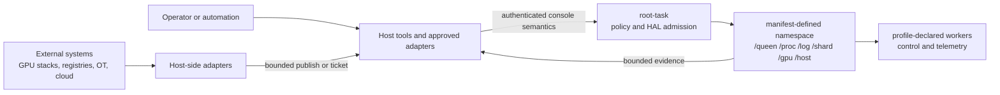
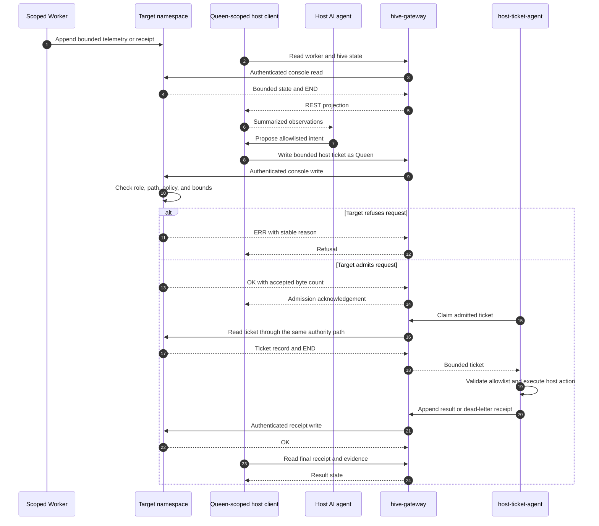

<!-- Copyright 2026 Lukas Bower -->
<!-- SPDX-License-Identifier: Apache-2.0 -->
<!-- Purpose: Explain where current Cohesix capabilities fit and how to assess candidate deployments. -->
<!-- Author: Lukas Bower -->
# Cohesix Use Cases

Cohesix is a bounded control-plane operating system for coordinating edge nodes
through manifest-defined, capability-scoped files. It is a good fit when the
authority to observe or change a fleet must be smaller and easier to audit than
the applications, GPU stacks, protocol adapters, and automation that it
governs.

This document describes capability fit. It does not claim that a named sector,
protocol, cloud, GPU, or compliance regime is supported out of the box.
Deployment-specific integrations remain host-side and require their own design,
validation, and operational acceptance.

## How to Read Maturity Claims

| Term | Meaning |
| --- | --- |
| **As-built** | Present in current source or compiler-generated profile output and covered by repository tests. |
| **Evidence-backed** | As-built behavior with target-qualified evidence named in the canonical audit or Test Plan records. |
| **Integration pattern** | A deployment composition that uses current Cohesix boundaries but requires project-specific host software or policy. |
| **Planned** | Authorized only by a pending or future task in [BUILD_PLAN.md](BUILD_PLAN.md); it must not be treated as current behavior. |

The selected source manifest, resolved manifest, and generated `coh-rtc` output
define which namespaces, roles, limits, and host projections exist in a build.
Examples here are therefore conditional on the selected profile.

## Current Capability Boundary

| Capability | Current boundary |
| --- | --- |
| Operator control | Authenticated console grammar projected by `cohsh`, `coh`, the REST gateway, and other host tools. There is no independent in-VM 9P/TCP listener. |
| Authority | Role-scoped tickets, manifest-defined namespaces, bounded file operations, and explicit policy gates. |
| Orchestration | Queen control files plus profile-declared worker roles and telemetry paths. The default profile implements heartbeat, GPU, and LoRa radio roles; it declares `worker-bus` with `implemented=false`. Another profile may differ. |
| Observability | Bounded `/proc`, `/log`, worker telemetry, driver counters, and host-projected status. Retention and durability depend on the selected profile and host integration. |
| Host integration | REST, Python, GPU inventory, model-registry descriptors, and host-side adapters project existing Cohesix semantics; they do not create new VM authority. |
| Heavy runtimes | CUDA, NVML, Kubernetes, systemd, Docker, model training, field protocols, and application data planes remain outside the VM trusted computing base. |


```mermaid
flowchart LR
  Operator["Operator or automation"] --> Tools["Host tools and approved adapters"]
  Tools -->|"authenticated console semantics"| Root["root-task\npolicy and HAL admission"]
  Root --> Namespace["manifest-defined namespace\n/queen /proc /log /shard /gpu /host"]
  Namespace --> Workers["profile-declared workers\ncontrol and telemetry"]
  External["External systems\nGPU stacks, registries, OT, cloud"] --> Adapters["Host-side adapters"]
  Adapters -->|"bounded publish or ticket"| Tools
  Namespace -->|"bounded evidence"| Tools
```

See [ARCHITECTURE.md](ARCHITECTURE.md) for component ownership,
[SECURE9P.md](SECURE9P.md) for protocol bounds, and
[ROLES_AND_SCHEDULING.md](ROLES_AND_SCHEDULING.md) for role and budget rules.

## Six AI Hive Scenarios

The Queen and Workers are control-plane roles, not language models running
inside the VM. Models and agent frameworks stay on a host and can propose
intent; a Queen-scoped client submits an allowed bounded operation, while
specialized Workers contribute scoped telemetry, lease state, or receipts.

### 1. The Agent Action Airlock

**Maturity: as-built admission primitives; deployment integration pattern.**

Give an AI operations agent a narrow way to request a service restart, GPU
lease, model activation, or Kubernetes action without giving it a shell or
cluster credential. The Queen-scoped submission accepts only a bounded,
role-authorized record. `host-ticket-agent` independently validates the
selected manifest's action allowlist and performs the host-side effect through
its configured executor, then writes a status or dead-letter receipt.

The exciting part is also the safety boundary: the model proposes, Cohesix
admits or refuses, and a constrained host adapter acts. Cohesix does not make an
arbitrary prompt safe, synthesize a general command, or remove the need to test
the executor and rollback policy. This pattern is especially useful where an
operator must later explain which request was accepted and why.


```mermaid
sequenceDiagram
  autonumber
  participant W as Scoped Worker
  participant N as Target namespace
  participant Q as Queen-scoped host client
  participant A as Host AI agent
  participant G as hive-gateway
  participant E as host-ticket-agent

  W->>N: Append bounded telemetry or receipt
  Q->>G: Read worker and hive state
  G->>N: Authenticated console read
  N-->>G: Bounded state and END
  G-->>Q: REST projection
  Q-->>A: Summarized observations
  A->>Q: Propose allowlisted intent
  Q->>G: Write bounded host ticket as Queen
  G->>N: Authenticated console write
  N->>N: Check role, path, policy, and bounds
  alt Target refuses request
    N-->>G: ERR with stable reason
    G-->>Q: Refusal
  else Target admits request
    N-->>G: OK with accepted byte count
    G-->>Q: Admission acknowledgement
    E->>G: Claim admitted ticket
    G->>N: Read ticket through the same authority path
    N-->>G: Ticket record and END
    G-->>E: Bounded ticket
    E->>E: Validate allowlist and execute host action
    E->>G: Append result or dead-letter receipt
    G->>N: Authenticated receipt write
    N-->>G: OK
    Q->>G: Read final receipt and evidence
    G-->>Q: Result state
  end
```

The diagram shows multiplexed gateway mode. In direct mode, one approved host
tool owns the single console session instead; direct and gateway owners must
not compete. See [HOST_TOOLS.md](HOST_TOOLS.md).

### 2. The Self-Healing Edge Swarm

**Maturity: as-built heartbeat and telemetry surfaces; deployment integration
pattern.**

Heartbeat Workers report bounded health and drift signals from each edge node.
A host model can rank anomalies, but remediation returns through the Queen: for
example, an allowlisted restart ticket, a scheduling record, or a request for
more diagnostics. Worker telemetry, `/proc`, driver counters, and the eventual
receipt form a compact incident trail.

This is control-plane coordination, not an in-VM monitoring data lake. Raw
video, tensors, and unbounded event streams remain outside Cohesix. The
deployment must define alert quality, retry limits, host-side durability, and a
safe terminal state when the model is uncertain or the target refuses work.

### 3. The GPU Flight Deck

**Maturity: as-built inventory, lease, status, and Worker GPU records;
deployment integration pattern for execution.**

`gpu-bridge-host` can publish a bounded view of host accelerators and model
descriptors. A GPU Worker carries only scoped lease, status, and telemetry
authority, allowing the Queen to coordinate who may request a device without
putting CUDA, NVML, model weights, or raw GPU access inside the VM.

A deployment-specific host executor must enforce memory, stream, lifetime,
revocation, and device-isolation policy and return an observed result. An
`ACTIVE` lease line is intent/state evidence, not proof of hardware isolation,
and the live root task has no `/gpu/<id>/job` execution file. See
[GPU_NODES.md](GPU_NODES.md).

### 4. Model Rollout with a Flight Recorder

**Maturity: as-built model descriptors and active identifier; deployment
integration pattern for activation and rollback.**

Imagine a canary rollout in which an agent recommends a new model, the Queen
admits a bounded activation ticket, and a host executor verifies the artifact,
updates the inference runtime, observes health, and publishes a receipt. The
namespace preserves the requested identifier, lease context, status, and
evidence needed to distinguish “pointer accepted” from “runtime actually
reloaded.” A failed canary can use the same allowlisted path for rollback.

Cohesix does not store the weights, watch `/gpu/models/active` on behalf of the
runtime, or hot-reload inference. Those are host responsibilities. This
separation keeps a powerful model lifecycle outside the trusted VM while making
the authority and result inspectable.

### 5. The Private LoRA Foundry

**Maturity: as-built Worker LoRA receipt loop and bounded host PEFT helpers;
profile-dependent integration pattern.**

A private training pool can export a bounded job package, train an adapter on
the host, import size-checked and hashed adapter metadata into a host registry,
and request activation through the Queen. The Worker LoRA VM loop records
control receipts; it never performs training. The selected profile must declare
the role and generated authority. Do not confuse this low-rank-adaptation flow
with the separately gated LoRa radio sidecar namespace, which has different
records and deployment responsibilities.

Model training, data governance, evaluation, artifact scanning, and runtime
reload remain host-side acceptance responsibilities. Use the generated PEFT
limits rather than copying byte ceilings into integration code. See
[USERLAND_AND_CLI.md](USERLAND_AND_CLI.md) and
[PYTHON_SUPPORT.md](PYTHON_SUPPORT.md).

### 6. Multi-Hive Mission Control

**Maturity: as-built manifest-driven host-ticket relay and read-only fleet
fan-in; deployment integration pattern across accepted hives.**

Several hives can present a single read-only operational picture while keeping
mutation authority local and explicit. A manifest-declared host relay forwards
only allowlisted tickets to named peers, uses bounded queues and a WAL for
delivery state, prevents an already relayed ticket from being forwarded again,
and carries correlation fields into receipts. An AI coordinator can recommend
where to move a lease or recover a service without receiving ambient authority
over every target.

For a regulated or safety-conscious multi-site fleet, that separation creates
a reviewable remediation boundary: the recommendation, local admission,
external side effect, and receipt remain distinct. Cohesix evidence can support
an assurance or incident process, but it does not certify the deployment or
provide its fail-safe behavior.

Every peer still needs its own authentication, accepted target proof, executor,
failure policy, and evidence retention. Federation is host-side composition,
not a new VM protocol and not proof of exactly-once external side effects. Pair
the receipt trail with deterministic evidence packs and timelines when an
incident or regulated change needs review.

The Python package includes mockable, dry-run playbooks for exploring these
compositions. Their platform-flavoured names exercise contracts; they are not
hardware acceptance claims:

```bash
.venv/bin/python tools/cohesix-py/examples/use_case_playbook.py \
  --playbook mixed-closed-loop-ai-factory \
  --dry-run \
  --mock
```

MCP and A2A projections remain planned unless an active
[BUILD_PLAN.md](BUILD_PLAN.md) task explicitly marks them complete. They are
not current target protocols or independent authority paths.

## Poor-Fit Patterns

Cohesix is not the right boundary when a workload requires any of the
following inside the VM:

- POSIX or Linux application compatibility;
- CUDA, NVML, a model trainer, or a general container runtime;
- an unbounded message broker or high-volume media/tensor data plane;
- arbitrary remote procedure calls or unauthenticated mutation;
- a network appliance with additional in-VM listeners;
- a claim of offline durability without an accepted persistent profile or
  host-side store.

## Deployment Assessment

Before adopting a pattern, answer these questions:

1. Which exact manifest profile and generated namespace authorize the flow?
2. Which component owns the data plane, and is it outside the VM where required?
3. What ticket, path, bounds, and refusal behavior govern every mutation?
4. Which host adapter performs the external side effect, and how is it
   allowlisted, cancelled, and audited?
5. Which evidence lane proves the target: repository tests, QEMU, historical Pi
   GENET, or fresh current-image hardware?
6. What remains diagnostic, simulated, site-specific, or planned?
7. How are secrets, offline state, rollback, and recovery handled without
   widening VM authority?

Use [TEST_PLAN.md](TEST_PLAN.md) to choose the required validation lane,
[BENCHMARKS.md](BENCHMARKS.md) to qualify performance claims, and
[HARDWARE_BRINGUP.md](HARDWARE_BRINGUP.md) to keep build, flash, boot, network,
console, and benchmark proof separate.
