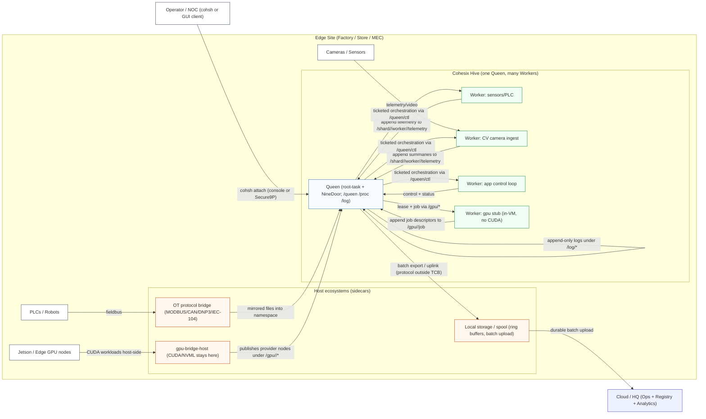
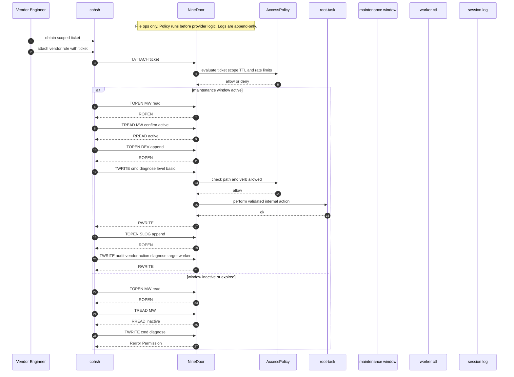
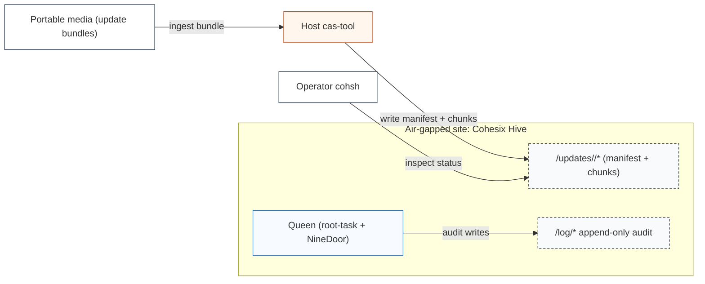
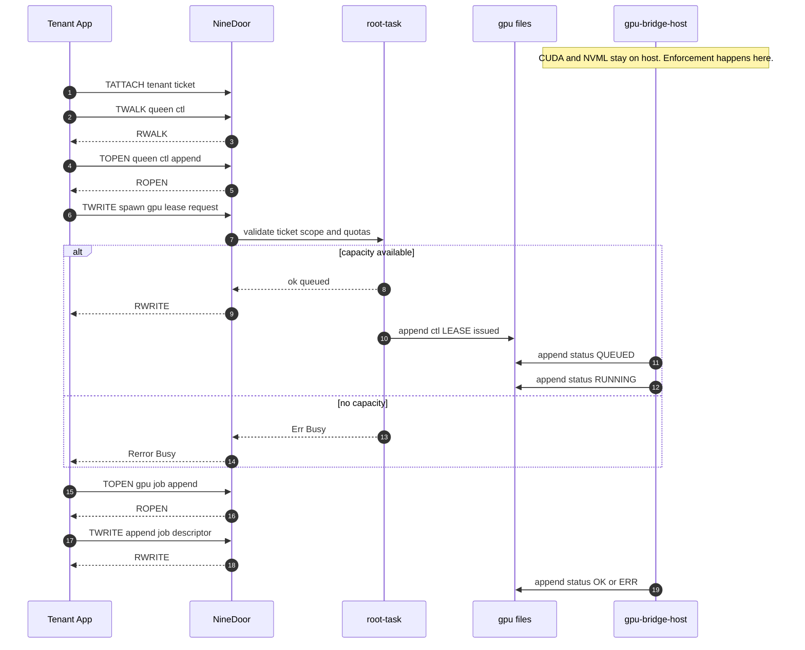
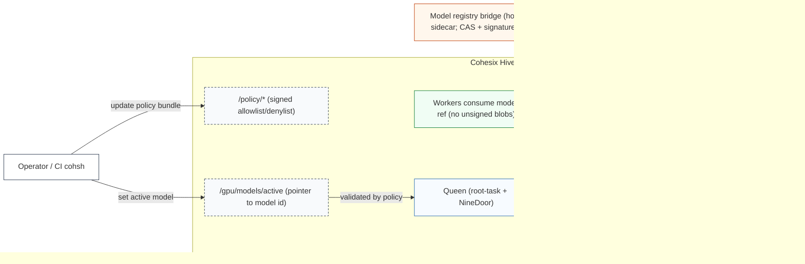

<!-- Copyright © 2026 Lukas Bower -->
<!-- SPDX-License-Identifier: Apache-2.0 -->
<!-- Purpose: Catalogue high-value Cohesix use cases and their operational constraints. -->
<!-- Author: Lukas Bower -->
# USE_CASES.md
Author: Lukas Bower — October 15, 2025
Revision: February 14, 2026

## Purpose
This document enumerates concrete, high-value use cases for Cohesix across sectors. It preserves technical specifics while adding business context so stakeholders can quickly assess fit, risk, and required integrations.

## Executive Summary
Cohesix is a control-plane operating system for secure orchestration and telemetry of edge GPU nodes. It exposes a bounded Secure9P file namespace as the control surface and keeps heavy ecosystems (Kubernetes, CUDA/NVML, OT protocols, model registries) on the host and outside the VM's trusted computing base. The Python orchestration surface adds typed control APIs, host-provider adapters, and playbooks for Mac, Jetson, and mixed worker fleets without adding new VM authority. For business stakeholders, this means smaller audit scope, safer multi-tenant GPU sharing, and faster integration into existing automation.

## Positioning (Business + Technical)
**Cohesix is:**
- A hive-style control plane: one Queen coordinating many Workers via explicit tickets, roles, and budgets.
- A deterministic, auditable boundary with append-only logs and telemetry, policy-as-files, and content-addressed updates.
- A coexistence layer: host sidecars mirror external ecosystems into the namespace so the VM stays minimal.

**Cohesix is not:**
- A Linux replacement.
- An in-VM container runtime.
- An in-VM network appliance with ad-hoc daemons.

## Business Outcomes
- Audit-ready operations through append-only logs, content-addressed artifacts, and explicit policy gates.
- Reduced risk and compliance scope via a tiny TCB (seL4 + pure Rust userspace, no POSIX/libc, no in-VM GPU stacks).
- Resilient edge operations through deterministic resource bounds and replayable state.
- Governed multi-tenancy with ticketed leases, bounded quotas, and explicit ownership.

## Operating Model (As-Built)
A Cohesix hive runs inside an seL4 VM on aarch64. The **Queen** is the orchestration role (root-task + NineDoor); **Workers** are bounded role-scoped sessions or tasks that report telemetry and consume explicit resources. The Queen exposes `/queen`, `/proc`, `/log`, and sharded worker telemetry under `/shard/<label>/worker/<id>/telemetry`; a **shard** is a deterministic namespace bucket derived from a worker ID, not an authority grant. Optional `/gpu`, `/host`, `/policy`, `/audit`, `/replay`, `/updates`, and `/models` namespaces appear only when enabled by the manifest. External ecosystems live on the host; host-side bridges publish `/host/*` and `/gpu/*` views into the namespace. QEMU `aarch64/virt` is the reference dev/CI environment. Raspberry Pi 4 via `Pi firmware -> U-Boot -> seL4 image -> root-task` is the current physical bring-up path; UEFI/AWS targets are profile-scoped work only when admitted by `docs/BUILD_PLAN.md`.

## Python Orchestration Surface (As-Built, Milestone 25c)
The Python SDK (`tools/cohesix-py`) is now a first-class operator path for high-scale automation while preserving Cohesix protocol boundaries.

**Control APIs (typed, bounded, non-authoritative):**
- `CohesixOrchestrator` provides typed requests for:
  - approvals (`/actions/queue`)
  - schedule control (`/queen/schedule/ctl`)
  - lease control (`/queen/lease/ctl`)
  - export windows (`/queen/export/ctl`)
- `/proc` snapshot helpers provide bounded reads for scheduler and lease observability.

**Integration adapters (host-side only):**
- `systemd` service state probes.
- Docker inventory (SDK first, CLI fallback).
- Kubernetes pod snapshots (SDK first, `kubectl` fallback).
- NVML/NVIDIA probes (`pynvml` first, `nvidia-smi` fallback).
- PEFT runtime probes (`torch`, `transformers`, `peft`, `accelerate`, `bitsandbytes`).

**Playbook UX (frictionless integration):**
- `cohesix-playbook --list` returns a deterministic catalog.
- `cohesix-playbook --playbook <id> --dry-run --mock` validates plans with no control writes.
- Reports and audit transcripts are emitted under `out/examples/playbooks/<playbook-id>/`.

**Built-in world-class playbooks (1k-worker oriented):**
- Mac fleets:
  - `mac-release-factory`
  - `mac-private-peft-grid`
  - `mac-endpoint-compliance`
- Jetson fleets:
  - `jetson-traffic-safety`
  - `jetson-manufacturing-safety`
  - `jetson-critical-infra`
- Mixed fleets:
  - `mixed-closed-loop-ai-factory`
  - `mixed-medical-edge-ai`
  - `mixed-logistics-digital-twin`

## Strategic Fit Patterns
- Change-authority substrate for regulated or safety-critical environments.
- Governed edge AI where model activation and rollback must be auditable.
- Disconnected or hostile networks where state must survive link loss.
- Cross-ecosystem governance without replacing Kubernetes/systemd/GPU stacks.
- Audit-first infrastructure where policy gates and append-only logs are mandatory.
- Python-first adoption path for enterprises with existing automation, MLOps, and CI stacks.

---

## Use Case Catalog

### 25c Playbook Mapping (1k+ Worker Readiness)
| Fleet type | Business program | Python playbook id |
| --- | --- | --- |
| Mac | Global app release factory | `mac-release-factory` |
| Mac | Private PEFT/LoRA grid | `mac-private-peft-grid` |
| Mac | Endpoint compliance orchestration | `mac-endpoint-compliance` |
| Jetson | Traffic safety mesh | `jetson-traffic-safety` |
| Jetson | Manufacturing safety + QA | `jetson-manufacturing-safety` |
| Jetson | Critical infrastructure sensing | `jetson-critical-infra` |
| Mixed | Closed-loop edge AI factory | `mixed-closed-loop-ai-factory` |
| Mixed | Medical edge AI governance | `mixed-medical-edge-ai` |
| Mixed | Logistics digital twin operations | `mixed-logistics-digital-twin` |

### Edge and Industrial

### 1) Smart-factory / Industrial IoT gateway
**Business outcome:** Segmented OT control with auditable change authority and minimal downtime.
**Why Cohesix:** seL4 isolation, file-shaped control plane, deterministic telemetry and logs.
**Integration:** MODBUS/CAN sidecars; host-side uplink for telemetry export.
**Constraints:** deterministic timing, safety certification paths.

### 2) Energy substation / Micro-grid controller
**Business outcome:** Hardened OT/IT boundary with predictable behavior during incidents.
**Why Cohesix:** deterministic scheduling, minimal attack surface, append-only audit logs.
**Integration:** DNP3/IEC-104 adapters; signed config bundles; GPS/PTP time sources.
**Constraints:** NERC/CIP, IEC 61850, local change control.

### 3) Retail / Computer-vision hub (store analytics)
**Business outcome:** Privacy-respecting analytics and faster model rollouts with lower WAN cost.
**Why Cohesix:** host-side GPU stack, model pointers via `/gpu/models/active`, bounded telemetry.
**Integration:** content-addressed model updates; local summarization; schema-tagged telemetry.
**Constraints:** PII handling, retention windows.

### 4) Logistics and ports (ALPR, container ID, crane safety)
**Business outcome:** Reliable telemetry and updates across harsh RF and intermittent links.
**Why Cohesix:** offline-first logs, replayable state, strict capability scoping.
**Integration:** durable disk spooling; batch upload sidecar.
**Constraints:** physical security, RF noise.

### 5) Telco MEC micro-orchestrator
**Business outcome:** Multi-tenant accelerator governance at cell sites with clear SLAs.
**Why Cohesix:** ticketed leases, sharded namespaces, deterministic resource budgets.
**Integration:** SR-IOV/NIC telemetry sidecars; per-tenant quota policies.
**Constraints:** carrier-grade ops, slice isolation.

### 6) Healthcare imaging edge to cloud PACS
**Business outcome:** Minimal PHI footprint with traceable access and transfers.
**Why Cohesix:** append-only audit, policy gates, deterministic telemetry.
**Integration:** DICOM proxy; de-identification pipeline; export gating.
**Constraints:** HIPAA, ISO 27001, locality requirements.

### 7) Autonomous depots (AV/AGV fleets)
**Business outcome:** Safe update windows and fleet learning without constant connectivity.
**Why Cohesix:** content-addressed updates for deterministic version pinning and bounded telemetry envelopes.
**Integration:** delta packs; multicast to many vehicles; PEFT-ready telemetry export.
**Constraints:** safety certification, predictable maintenance windows.

### 8) Defense ISR kits / forward ops
**Business outcome:** Trusted control under low bandwidth with tamper-evident logs.
**Why Cohesix:** seL4 assurance, minimal TCB, file-scoped authority.
**Integration:** LoRa or SATCOM schedulers; rapid key-rotation workflows.
**Constraints:** export controls, contested networks.

### 9) Smart-city sensing (air/noise/traffic)
**Business outcome:** Scalable governance of large sensor fleets with low operational cost.
**Why Cohesix:** small footprint gateway with append-only telemetry.
**Integration:** sensor-bus sidecars (I2C/SPI); coarse local summarization.
**Constraints:** public data governance, OTA safety.

### 10) Broadcast/DOOH signage controller
**Business outcome:** Signed content delivery with proof-of-display and SLA reporting.
**Why Cohesix:** content-addressed assets, policy gating, immutable audit trails.
**Integration:** schedule provider; receipts pipeline; bandwidth-aware staging.
**Constraints:** bandwidth caps, SLA reporting.

---

### Security and Fintech

### 11) HSM-adjacent signing gateway
**Business outcome:** Auditable control over high-value signing operations.
**Why Cohesix:** policy-as-files, role-scoped tickets, append-only logs.
**Integration:** sign/verify provider; rate and role caps.
**Constraints:** FIPS modes, key custody.

### 12) OT/IT segmentation appliance
**Business outcome:** Replace VPN sprawl with time-boxed, least-privilege access.
**Why Cohesix:** tiny boundary device, tickets/leases, deterministic audit logs.
**Integration:** dual-NIC profile; AccessPolicy compiler; telemetry rings.
**Constraints:** audits, change control.

---

### Science and Remote Ops

### 13) Environmental science stations (polar/offshore)
**Business outcome:** Store-and-forward data collection under power and link limits.
**Why Cohesix:** deterministic envelopes, append-only queues, replayable state.
**Integration:** delay-tolerant queues; trickle updates; clock beacons.
**Constraints:** power budget, severe weather.

### 14) HAPS/satellite ground gateway
**Business outcome:** Predictable control-plane operations under long RTT.
**Why Cohesix:** low-memory deterministic control processes.
**Integration:** CCSDS/TCP bridge; high-latency backpressure tuning.
**Constraints:** link budgets, long RTT.

---

### Developer and Platform Tooling

### 15) Secure OTA lab appliance
**Business outcome:** Demonstrable, auditable update lifecycle and rollback readiness for stakeholders.
**Why Cohesix:** content-addressed updates, policy gating, audit logs.
**Integration:** golden-image verifier; host updater for rollbacks; CLI scripts; dashboards.
**Constraints:** demo reproducibility, change control.

### 16) Classroom OS/security labs
**Business outcome:** Teachable microkernel and secure control-plane workflows.
**Why Cohesix:** small, readable userland; file-shaped APIs for labs.
**Integration:** mock transports; fuzz harnesses; trace viewer.
**Constraints:** safe sandboxing, repeatable fixtures.

---

### Control-plane and Operations

### 17) Fleet policy GitOps boundary (policy-as-files)
**Business outcome:** Signed, reviewable policy changes with diffable drift.
**Why Cohesix:** policy namespaces, audit trails, deterministic control.
**Integration:** policy bundle pipeline; diff views; approval workflow.
**Constraints:** segregation of duties, audit trails.

### 18) Vendor remote maintenance without VPN sprawl
**Business outcome:** Time-boxed vendor access with complete traceability.
**Why Cohesix:** scoped tickets, lease files, append-only session logs.
**Integration:** maintenance window leases; per-path AccessPolicy; `/log` session recording.
**Constraints:** compliance audits, least-privilege, offline fallback.

### 19) Air-gapped update ferry (removable media + `/updates`)
**Business outcome:** Provenance-preserving updates without WAN connectivity.
**Why Cohesix:** content-addressed bundles under `/updates`, deterministic verification, audit trails.
**Integration:** host-side cas-tool ingestion from removable media; resumable chunk validation.
**Constraints:** strict provenance, operational simplicity.

### 20) GPU lease broker for multi-tenant edge (host CUDA intact)
**Business outcome:** Fair, auditable sharing of accelerators across tenants.
**Why Cohesix:** file-modeled leases, ticketed requests, host-enforced policy.
**Integration:** quota accounting; eviction/renew flows; `gpu-bridge-host` governance rules.
**Constraints:** noisy-neighbor control, operator clarity.

### 21) Model governance and provenance at the edge (attested models)
**Business outcome:** Controlled model rollout with auditable provenance.
**Why Cohesix:** content-addressed models under `/models` and `/gpu/models`, policy gating, `/proc/boot` provenance.
**Integration:** model registry sidecar; signature verification; LoRA lineage tracking.
**Constraints:** regulated AI, privacy boundaries.

### 22) Ransomware-resistant control-plane safe mode
**Business outcome:** Maintain telemetry and remote control even if host OS degrades.
**Why Cohesix:** minimal boundary, read-only recovery namespace, immutable logs.
**Integration:** rescue worker profile; out-of-band operator attach flow.
**Constraints:** incident response procedures, tamper evidence.

### 23) High-integrity event recorder for robotics
**Business outcome:** Blame-free postmortems with deterministic replay.
**Why Cohesix:** append-only rings, bounded scheduling, file-based replay.
**Integration:** export pipeline sidecar; compression outside the TCB.
**Constraints:** safety certification, retention limits.

### 24) Edge data-diode style telemetry gateway (one-way-ish)
**Business outcome:** Outbound-only telemetry posture with minimal inbound surface.
**Why Cohesix:** policy-enforced file verbs, append-only exports.
**Integration:** export-only providers; batching/backpressure tuning.
**Constraints:** regulated environments, packet loss tolerance.

### 25) Kubernetes coexistence: secure out-of-band orchestrator
**Business outcome:** Governance layer for lifecycle, telemetry, and GPU leasing without replacing Kubernetes.
**Why Cohesix:** file APIs for control-plane actions; host-side bridge maps K8s to `/queen` and `/shard`.
**Integration:** identity mapping; RBAC-to-ticket translation.
**Constraints:** clear separation of responsibilities.

### 26) Edge learning feedback loop (LoRA/PEFT, control-plane only)
**Business outcome:** Safe performance feedback for centralized training.
**Why Cohesix:** schema-tagged, bounded telemetry; model lifecycle pointers.
**Integration:** export namespaces for training farms; privacy filters.
**Constraints:** no gradients or raw data in the VM; deterministic bandwidth/storage envelopes.

<!-- ========================================================= -->
<!-- USE_CASES.md — Visuals (GitHub-compatible Mermaid)         -->
<!-- These diagrams illustrate typical Cohesix use cases.        -->
<!-- ========================================================= -->

## Diagrams
**Figure 1** Edge hive deployment (Smart factory / Retail CV hub / MEC node)

```mermaid
flowchart LR
  subgraph SITE["Edge Site (Factory / Store / MEC)"]
    subgraph HIVE["Cohesix Hive (one Queen, many Workers)"]
      Q["Queen (root-task + NineDoor; /queen /proc /log)"]:::queen
      W1["Worker: sensors/PLC"]:::worker
      W2["Worker: CV camera ingest"]:::worker
      W3["Worker: app control loop"]:::worker
      WG["Worker: gpu stub (in-VM, no CUDA)"]:::worker
    end

    subgraph HOST["Host ecosystems (sidecars)"]
      OT["OT protocol bridge (MODBUS/CAN/DNP3/IEC-104)"]:::sidecar
      GPU["gpu-bridge-host (CUDA/NVML stays here)"]:::sidecar
      STORE["Local storage / spool (ring buffers, batch upload)"]:::sidecar
    end

    CAM["Cameras / Sensors"]:::ext
    PLC["PLCs / Robots"]:::ext
    JET["Jetson / Edge GPU nodes"]:::ext
  end

  CLOUD["Cloud / HQ (Ops + Registry + Analytics)"]:::cloud
  OPS["Operator / NOC (cohsh or GUI client)"]:::ext

  %% flows
  OPS -->|"cohsh attach (console or Secure9P)"| Q
  CAM -->|"telemetry/video"| W2
  PLC -->|"fieldbus"| OT
  OT -->|"mirrored files into namespace"| Q
  W1 -->|"append telemetry to /shard/<label>/worker/<id>/telemetry"| Q
  W2 -->|"append summaries to /shard/<label>/worker/<id>/telemetry"| Q
  W3 -->|"control + status"| Q

  Q -->|"ticketed orchestration via /queen/ctl"| W1
  Q -->|"ticketed orchestration via /queen/ctl"| W2
  Q -->|"ticketed orchestration via /queen/ctl"| W3
  Q -->|"lease + job via /gpu/*"| WG
  WG -->|"append job descriptors to /gpu/<id>/job"| Q

  GPU -->|"publishes provider nodes under /gpu/<id>/*"| Q
  JET -->|"CUDA workloads host-side"| GPU

  Q -->|"append-only logs under /log/*"| Q
  Q -->|"batch export / uplink (protocol outside TCB)"| STORE
  STORE -->|"durable batch upload"| CLOUD

  classDef queen fill:#f7fbff,stroke:#2b6cb0,stroke-width:1px;
  classDef worker fill:#f0fdf4,stroke:#15803d,stroke-width:1px;
  classDef sidecar fill:#fff7ed,stroke:#c2410c,stroke-width:1px;
  classDef cloud fill:#eef2ff,stroke:#4338ca,stroke-width:1px;
  classDef ext fill:#ffffff,stroke:#334155,stroke-width:1px;
```

**Figure 2:** Vendor remote maintenance without VPN sprawl (tickets + leases + append logs)

```mermaid
sequenceDiagram
  autonumber

  participant Vendor as Vendor Engineer
  participant Cohsh as cohsh
  participant ND as NineDoor
  participant POL as AccessPolicy
  participant RT as root-task
  participant MW as maintenance window
  participant DEV as worker ctl
  participant SLOG as session log

  Note over ND: File ops only. Policy runs before provider logic. Logs are append-only.

  Vendor->>Cohsh: obtain scoped ticket
  Vendor->>Cohsh: attach vendor role with ticket
  Cohsh->>ND: TATTACH ticket
  ND->>POL: evaluate ticket scope TTL and rate limits
  POL-->>ND: allow or deny

  alt maintenance window active
    Cohsh->>ND: TOPEN MW read
    ND-->>Cohsh: ROPEN
    Cohsh->>ND: TREAD MW confirm active
    ND-->>Cohsh: RREAD active

    Cohsh->>ND: TOPEN DEV append
    ND-->>Cohsh: ROPEN
    Cohsh->>ND: TWRITE cmd diagnose level basic
    ND->>POL: check path and verb allowed
    POL-->>ND: allow
    ND->>RT: perform validated internal action
    RT-->>ND: ok
    ND-->>Cohsh: RWRITE

    Cohsh->>ND: TOPEN SLOG append
    ND-->>Cohsh: ROPEN
    Cohsh->>ND: TWRITE audit vendor action diagnose target worker
    ND-->>Cohsh: RWRITE
  else window inactive or expired
    Cohsh->>ND: TOPEN MW read
    ND-->>Cohsh: ROPEN
    Cohsh->>ND: TREAD MW
    ND-->>Cohsh: RREAD inactive
    Cohsh->>ND: TWRITE cmd diagnose
    ND-->>Cohsh: Rerror Permission
  end
```

**Figure 3:** Air-gapped update ferry (removable media + `/updates` + audit)

```mermaid
flowchart LR
  USB["Portable media (update bundles)"]:::ext
  subgraph HIVE["Air-gapped site: Cohesix Hive"]
    Q["Queen (root-task + NineDoor)"]:::queen
    UPD["/updates/<epoch>/* (manifest + chunks)"]:::path
    LOG["/log/* append-only audit"]:::path
  end
  OPS["Operator cohsh"]:::ext
  HOST["Host cas-tool"]:::sidecar

  USB -->|"ingest bundle"| HOST
  HOST -->|"write manifest + chunks"| UPD
  OPS -->|"inspect status"| UPD
  Q -->|"audit writes"| LOG

  classDef queen fill:#f7fbff,stroke:#2b6cb0,stroke-width:1px;
  classDef path fill:#f8fafc,stroke:#334155,stroke-dasharray: 4 3;
  classDef ext fill:#ffffff,stroke:#334155,stroke-width:1px;
  classDef sidecar fill:#fff7ed,stroke:#c2410c,stroke-width:1px;
```

**Figure 4:** GPU lease broker for multi-tenant edge (CUDA stays on host)

```mermaid
sequenceDiagram
  autonumber

  participant Tenant as Tenant App
  participant ND as NineDoor
  participant RT as root-task
  participant GPU as gpu files
  participant GPUB as gpu-bridge-host

  Note over GPUB: CUDA and NVML stay on host. Enforcement happens here.

  Tenant->>ND: TATTACH tenant ticket
  Tenant->>ND: TWALK queen ctl
  ND-->>Tenant: RWALK
  Tenant->>ND: TOPEN queen ctl append
  ND-->>Tenant: ROPEN
  Tenant->>ND: TWRITE spawn gpu lease request
  ND->>RT: validate ticket scope and quotas

  alt capacity available
    RT-->>ND: ok queued
    ND-->>Tenant: RWRITE
    RT->>GPU: append ctl LEASE issued
    GPUB->>GPU: append status QUEUED
    GPUB->>GPU: append status RUNNING
  else no capacity
    RT-->>ND: Err Busy
    ND-->>Tenant: Rerror Busy
  end

  Tenant->>ND: TOPEN gpu job append
  ND-->>Tenant: ROPEN
  Tenant->>ND: TWRITE append job descriptor
  ND-->>Tenant: RWRITE
  GPUB->>GPU: append status OK or ERR
```

**Figure 5:** Model governance and provenance at the edge (attested models)

```mermaid
flowchart LR
  REG["Model registry bridge (host sidecar; CAS + signatures)"]:::sidecar
  subgraph HIVE["Cohesix Hive"]
    Q["Queen (root-task + NineDoor)"]:::queen
    POL["/policy/* (signed allowlist/denylist)"]:::path
    MODELS["/models/* (content addressed)"]:::path
    DEP["/gpu/models/active (pointer to model id)"]:::path
    BOOT["/proc/boot (provenance, measurements)"]:::path
    LOG["/log/* append-only audit"]:::path
    W["Workers consume model ref (no unsigned blobs)"]:::worker
  end

  OPS["Operator / CI cohsh"]:::ext

  REG -->|"publish signed model"| MODELS
  OPS -->|"update policy bundle"| POL
  OPS -->|"set active model"| DEP
  DEP -->|"validated by policy"| Q
  Q -->|"audit writes"| LOG
  Q -->|"expose boot + model provenance"| BOOT
  W -->|"fetch by id and verify via policy"| MODELS

  classDef queen fill:#f7fbff,stroke:#2b6cb0,stroke-width:1px;
  classDef worker fill:#f0fdf4,stroke:#15803d,stroke-width:1px;
  classDef sidecar fill:#fff7ed,stroke:#c2410c,stroke-width:1px;
  classDef path fill:#f8fafc,stroke:#334155,stroke-dasharray: 4 3;
  classDef ext fill:#ffffff,stroke:#334155,stroke-width:1px;
```

## 27) Unified host control tickets across CUDA, PEFT, systemd, docker, and K8s
**Problem:** Operators need one auditable mechanism to coordinate GPU lease/model actions and host remediation without introducing sideband RPC channels.

**Cohesix flow:**
- Queen emits bounded JSONL tickets to `/host/tickets/spec` (`host-ticket/v1`).
- `host-ticket-agent` executes allowlisted adapters:
  - `gpu.lease.*` via existing `/queen/ctl` and `/queen/lease/ctl` semantics.
  - `peft.*` via existing host registry + `/gpu/models/*`.
  - `systemd.*`, `docker.*`, `k8s.*` as host-side coexistence actions.
- Agent appends lifecycle receipts (`claimed`, `running`, `succeeded`, `failed`, `expired`) to `/host/tickets/status` or `/host/tickets/deadletter`.
- Evidence/timeline tooling correlates:
  - local: `id + idempotency_key`
  - federated: `id + idempotency_key + source_hive + target_hive`
  across request/outcome/audit/lease artifacts.

**Why this is distinctive:**
- No new in-VM protocols.
- One control shape for heterogeneous ecosystems.
- Deterministic replay and chargeback from append-only ticket streams.

## 28) Multi-hive federation (10x1k pattern, single-writer preserved)
**Problem:** A single hive has practical reliability limits around high worker counts; operators need to orchestrate many hives without introducing active/active split-brain writes.

**Cohesix flow:**
- Keep each hive authoritative and single-writer.
- Use host-only relay (`host-ticket-agent --relay`) to forward allowlisted intents between hives via existing REST mutation paths.
- Persist relay queue state in WAL and replay unapplied entries deterministically after restart/cutover.
- Use `coh fleet status|lease-summary|pressure` for read-only fan-in visibility across hives.
- Use failover watchdog hooks (`--relay-pause-cmd`, `--relay-resume-cmd`) to freeze relay during cutover and resume after health checks.

**Why this is distinctive:**
- Scales to multi-hive operations (for example 10 queens x 1000 workers) without changing VM protocols.
- Preserves strict split-brain fencing and explicit authority boundaries.
- Produces replayable evidence linking source intent to target execution and terminal receipts.

## 29) AI Harness action authority for enterprise agents
**Problem:** Enterprise AI agents can plan across tools, but they should not receive direct mutation authority over production systems, GPUs, model registries, Kubernetes, systemd, or Docker.

**Cohesix flow:**
- Agent frameworks, MCP clients, A2A peers, or workflow engines submit intent only through existing Cohesix gateway or host-ticket surfaces.
- Cohesix reduces each mutating request to a bounded ticket or append-only control write with role, scope, idempotency, writer epoch, and policy checks.
- Host-side adapters execute only allowlisted actions and append terminal receipts; the LLM never calls CUDA/NVML, `kubectl`, `systemctl`, Docker, PEFT tooling, or shell commands directly.
- Evidence tooling correlates the delegated identity, Cohesix path or ticket, adapter receipt, logs, and final state without storing raw prompts or creating an opaque inter-agent mailbox.

**Why this is distinctive:**
- Makes the harness authority boundary explicit: model intent is advisory until Cohesix policy admits it.
- Preserves existing Secure9P, REST, MCP, and A2A projection semantics without adding a second executor.
- Gives security teams a deterministic refusal and receipt trail for every attempted production change.

## 30) AI Harness edge model-change gate
**Problem:** AI systems need to update models, adapters, prompts, and runtime policy at the edge, but unsafe or unaudited changes can break regulated operations faster than humans can review them.

**Cohesix flow:**
- The harness stages candidate model or adapter changes through existing `/models`, `/gpu/models`, `/updates`, `/policy`, and host-ticket paths where enabled by the manifest.
- Cohesix gates activation on signed artifacts, explicit lease or rollout policy, bounded telemetry readiness, and rollback availability.
- Host-side model registry and GPU bridge components perform heavy work outside the VM; Cohesix records pointers, receipts, health summaries, and operator-visible evidence.
- Agents may propose promotion, rollback, or canary expansion, but side effects still pass through Cohesix tickets and append-only control files.

**Why this is distinctive:**
- Turns AI-driven model operations into auditable infrastructure changes instead of opaque agent actions.
- Keeps CUDA/NVML, registry storage, and inference engines outside the trusted computing base.
- Supports disconnected or hostile edge sites where the harness must continue enforcing local policy during WAN loss.

---

## Platform Primitives and Typical Integrations
**As-built primitives (current releases):**
- Secure9P namespace with AccessPolicy gating, tickets/leases, and deterministic error semantics.
- Queen/Worker roles with bounded budgets and sharded worker telemetry under `/shard/<label>/worker/<id>/telemetry`.
- Content-addressed updates under `/updates/*` and model registry exposure under `/models/*` and `/gpu/models/*` (when enabled).
- Policy, audit, and replay namespaces (`/policy`, `/actions`, `/audit`, `/replay`) with append-only logs.
- Host bridge namespaces `/host/*` and `/gpu/*` for ecosystem coexistence.

**Typical integrations (environment-specific):**
- Protocol bridges (MODBUS, CAN, DNP3, IEC-104, DICOM, CCSDS).
- Host-side uplinks for batch export and analytics ingestion (protocol outside the TCB).
- Model registry, GPU bridge, and identity workflows on the host.
- Pi 4 U-Boot policy handoff for current hardware bring-up; UEFI Secure Boot, TPM, and DICE identity flows only in profiles that explicitly admit them.
- Operator tooling that speaks `cohsh` or the shared client library.
