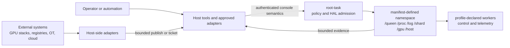

<!-- Copyright 2026 Lukas Bower -->
<!-- SPDX-License-Identifier: Apache-2.0 -->
<!-- Purpose: Explain where current Cohesix capabilities fit and how to assess candidate deployments. -->
<!-- Author: Lukas Bower -->
# Cohesix Use Cases

Cohesix is a bounded control-plane operating system for coordinating edge nodes
through manifest-defined, capability-scoped files. It is a good fit when the
authority to observe or change a fleet must be smaller and easier to audit than
the applications, GPU stacks, protocol adapters, and automation that it
governs.

This document describes capability fit. It does not claim that a named sector,
protocol, cloud, GPU, or compliance regime is supported out of the box.
Deployment-specific integrations remain host-side and require their own design,
validation, and operational acceptance.

## How to Read Maturity Claims

| Term | Meaning |
| --- | --- |
| **As-built** | Present in current source or compiler-generated profile output and covered by repository tests. |
| **Evidence-backed** | As-built behavior with target-qualified evidence named in the canonical audit or Test Plan records. |
| **Integration pattern** | A deployment composition that uses current Cohesix boundaries but requires project-specific host software or policy. |
| **Planned** | Authorized only by a pending or future task in [BUILD_PLAN.md](BUILD_PLAN.md); it must not be treated as current behavior. |

The selected source manifest, resolved manifest, and generated `coh-rtc` output
define which namespaces, roles, limits, and host projections exist in a build.
Examples here are therefore conditional on the selected profile.

## Current Capability Boundary

| Capability | Current boundary |
| --- | --- |
| Operator control | Authenticated console grammar projected by `cohsh`, `coh`, the REST gateway, and other host tools. There is no independent in-VM 9P/TCP listener. |
| Authority | Role-scoped tickets, manifest-defined namespaces, bounded file operations, and explicit policy gates. |
| Orchestration | Queen control files plus profile-declared worker roles and telemetry paths. The default profile implements heartbeat, GPU, and LoRA roles; it declares `worker-bus` with `implemented=false`. Another profile may differ. |
| Observability | Bounded `/proc`, `/log`, worker telemetry, driver counters, and host-projected status. Retention and durability depend on the selected profile and host integration. |
| Host integration | REST, Python, GPU inventory, model-registry descriptors, and host-side adapters project existing Cohesix semantics; they do not create new VM authority. |
| Heavy runtimes | CUDA, NVML, Kubernetes, systemd, Docker, model training, field protocols, and application data planes remain outside the VM trusted computing base. |


```mermaid
flowchart LR
  Operator["Operator or automation"] --> Tools["Host tools and approved adapters"]
  Tools -->|"authenticated console semantics"| Root["root-task\npolicy and HAL admission"]
  Root --> Namespace["manifest-defined namespace\n/queen /proc /log /shard /gpu /host"]
  Namespace --> Workers["profile-declared workers\ncontrol and telemetry"]
  External["External systems\nGPU stacks, registries, OT, cloud"] --> Adapters["Host-side adapters"]
  Adapters -->|"bounded publish or ticket"| Tools
  Namespace -->|"bounded evidence"| Tools
```

See [ARCHITECTURE.md](ARCHITECTURE.md) for component ownership,
[SECURE9P.md](SECURE9P.md) for protocol bounds, and
[ROLES_AND_SCHEDULING.md](ROLES_AND_SCHEDULING.md) for role and budget rules.

## Strong-Fit Patterns

### Governed Fleet Changes

Use Cohesix as the admission and receipt boundary for actions that an existing
host automation system performs. A host adapter can translate an approved
ticket into an allowlisted systemd, container, Kubernetes, registry, or device
operation and return a bounded receipt.

This is an **integration pattern**. Cohesix supplies the authority, policy,
bounded queueing, and evidence shape; it does not make arbitrary external
commands safe and does not replace the external orchestrator. Adapter behavior
and rollback must be validated for the deployment. See
[HOST_TOOLS.md](HOST_TOOLS.md).

### Edge Telemetry and Incident Evidence

Workers and host adapters can publish bounded telemetry into manifest-defined
worker or Queen paths. Operators can correlate those records with `/proc`,
driver counters, and append-oriented logs without moving the application data
plane into the VM.

This pattern fits health summaries, drift signals, device state, and incident
breadcrumbs. It does not imply that raw video, tensors, or unbounded event
streams pass through Cohesix. Offline durability must be provided by an
accepted profile or a host-side spool; do not infer durable replay from an
in-memory append log. See [INTERFACES.md](INTERFACES.md) and
[FAILURE_MODES.md](FAILURE_MODES.md).

### Host GPU and Model Governance

The as-built GPU bridge discovers host GPUs, serializes bounded inventory and
model descriptors, and publishes them into the VM. Cohesix can expose lease,
status, and active-model control records while CUDA/NVML and model storage stay
on the host.

GPU job execution, TTL enforcement, training, and model hot-reload are not
implemented by `gpu-bridge-host`; they require a host executor and deployment
policy. See [GPU_NODES.md](GPU_NODES.md) for the exact live and simulation-only
surfaces.

### Regulated or Safety-Conscious Control Boundaries

Cohesix can sit between an operator and an existing OT, medical, transport, or
critical-infrastructure control system when explicit authority, deterministic
bounds, and refusal evidence are valuable. MODBUS, CAN, DNP3, IEC protocols,
DICOM, and similar ecosystems are **candidate host-side integrations**, not
built-in Cohesix device or protocol support.

Certification, safety cases, timing guarantees, and fail-safe behavior remain
deployment responsibilities. Cohesix evidence can support those processes but
does not establish compliance by itself.

### Reproducible Automation and Playbooks

The Python package under `tools/cohesix-py` provides typed clients, mockable
adapters, dry-run playbooks, and evidence receipts. Its built-in Mac, Jetson,
and mixed-fleet playbooks are repeatable examples for exercising orchestration
contracts; their names are not proof that the corresponding hardware or
external platform has passed production acceptance.

Use a dry run before enabling writes:

```bash
python3 tools/cohesix-py/examples/use_case_playbook.py \
  --playbook mixed-closed-loop-ai-factory \
  --dry-run \
  --mock
```

### AI Action Admission

An agent framework can submit intent to an existing Cohesix host tool, where
policy reduces it to a bounded ticket or control write. This is a useful
**integration pattern** because the model never needs direct shell, CUDA,
cluster, or registry authority.

MCP and A2A projections are planned work unless the active
[BUILD_PLAN.md](BUILD_PLAN.md) task explicitly marks them complete. They are
not current VM protocols and must not be described as an existing Cohesix
executor path.

## Poor-Fit Patterns

Cohesix is not the right boundary when a workload requires any of the
following inside the VM:

- POSIX or Linux application compatibility;
- CUDA, NVML, a model trainer, or a general container runtime;
- an unbounded message broker or high-volume media/tensor data plane;
- arbitrary remote procedure calls or unauthenticated mutation;
- a network appliance with additional in-VM listeners;
- a claim of offline durability without an accepted persistent profile or
  host-side store.

## Deployment Assessment

Before adopting a pattern, answer these questions:

1. Which exact manifest profile and generated namespace authorize the flow?
2. Which component owns the data plane, and is it outside the VM where required?
3. What ticket, path, bounds, and refusal behavior govern every mutation?
4. Which host adapter performs the external side effect, and how is it
   allowlisted, cancelled, and audited?
5. Which evidence lane proves the target: repository tests, QEMU, historical Pi
   GENET, or fresh current-image hardware?
6. What remains diagnostic, simulated, site-specific, or planned?
7. How are secrets, offline state, rollback, and recovery handled without
   widening VM authority?

Use [TEST_PLAN.md](TEST_PLAN.md) to choose the required validation lane,
[BENCHMARKS.md](BENCHMARKS.md) to qualify performance claims, and
[HARDWARE_BRINGUP.md](HARDWARE_BRINGUP.md) to keep build, flash, boot, network,
console, and benchmark proof separate.
