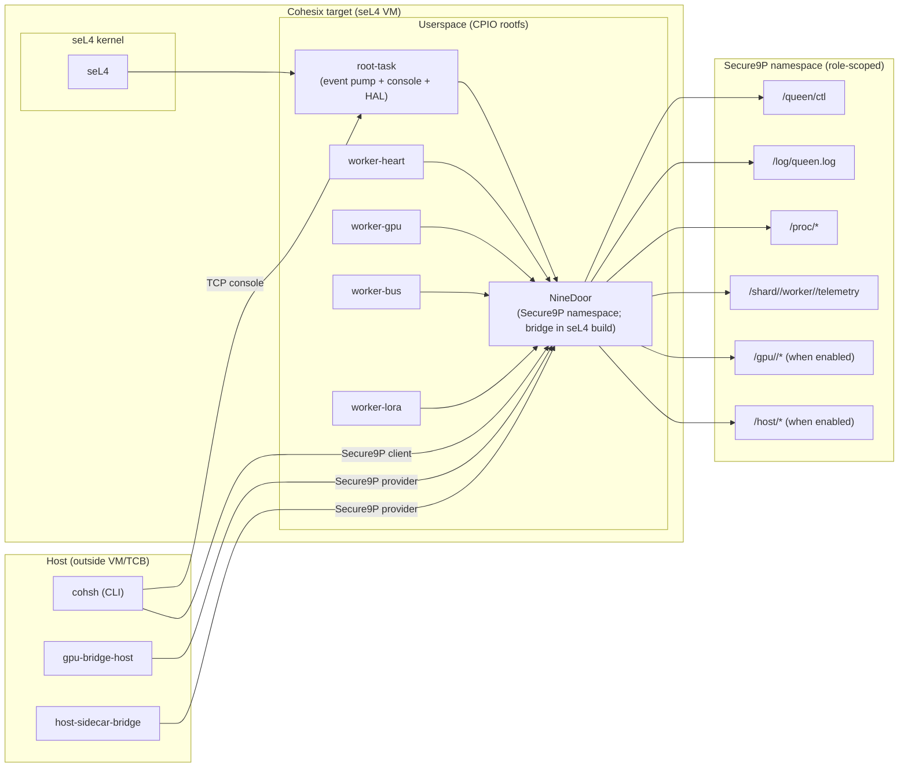
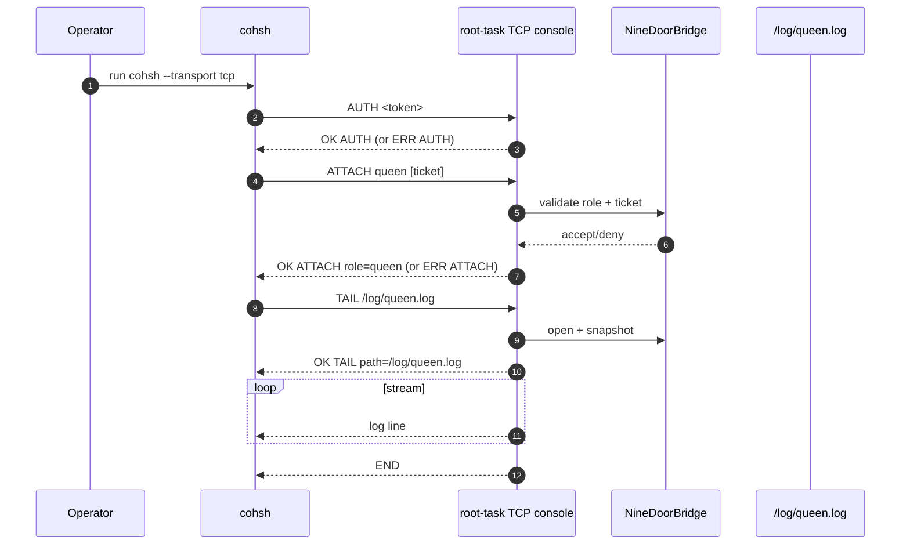

<!-- Copyright © 2025 Lukas Bower -->
<!-- SPDX-License-Identifier: Apache-2.0 -->
<!-- Purpose: Describe the Cohesix system architecture, component responsibilities, and boundary constraints. -->
<!-- Author: Lukas Bower -->
# Cohesix Architecture (As-Built)

Cohesix is a control-plane OS for secure orchestration and telemetry of edge GPU nodes using a Queen/Worker hive model. This document describes the current as-built system for the QEMU `aarch64/virt` target and the macOS host; manifest-gated features are called out explicitly.

## 1. Scope and Non-Goals
Scope:
- Host: macOS 26 on Apple Silicon for build, QEMU, and host tools.
- Target: QEMU `aarch64/virt` (GICv3) running upstream seL4; userspace is a pure Rust CPIO rootfs.
- Control plane: Secure9P namespace plus a deterministic console grammar shared with `cohsh`.

Non-goals:
- In-VM GPU runtimes (CUDA/NVML), POSIX emulation, or dynamic loading.
- Control channels outside Secure9P and the console grammar (no ad-hoc RPC, no shared-memory shortcuts).
- In-VM TCP services except the authenticated root-task console.
- UI clients or hardware/UEFI deployment details (UEFI boot is planned).

## 2. System Boundaries and TCB
- VM boundary: seL4 kernel plus the CPIO userspace payload (`root-task` and worker binaries). This is the trusted computing base.
- The root task owns capability setup, the event pump, console surfaces, HAL, logging, and the in-VM NineDoor bridge. It is the sole authority for side effects.
- Host tooling (`cohsh`, `gpu-bridge-host`, `host-sidecar-bridge`, `cas-tool`) is outside the TCB and interacts only through Secure9P or the console.
- The only in-VM TCP listener is the root-task console; all other TCP services remain host-only.
- Device access (MMIO, DMA, cache ops) goes through the HAL; no direct MMIO outside HAL.

## 3. Top-Level Architecture
- `root-task` (`apps/root-task`): seL4 bootstrap, CSpace management, event pump, console (serial + TCP), ticket issuance, log buffer (`/log/queen.log`), HAL, and the in-VM NineDoor bridge.
- `NineDoor` (`apps/nine-door`): Secure9P server for host builds and in-process tests. On seL4, `apps/root-task/src/ninedoor.rs` provides `NineDoorBridge`, a namespace/control shim used by the console path.
- Secure9P core (`crates/secure9p-*`): 9P2000.L codec and session logic used by NineDoor and `cohsh`.
- Worker crates (`apps/worker-heart`, `apps/worker-gpu`, `apps/worker-bus`, `apps/worker-lora`): role-specific binaries; orchestration is file-driven via `/queen/ctl` and role-scoped mounts.
- Host tools: `cohsh` CLI (`apps/cohsh`), `gpu-bridge-host`, `host-sidecar-bridge`, and `cas-tool`.
- Manifest compiler: `tools/coh-rtc` generates root-task tables, policies, and docs snippets from `configs/root_task.toml` into `apps/root-task/src/generated` and `out/manifests/`.

## 4. Control Surfaces
### Secure9P namespace (NineDoor)
- Protocol: 9P2000.L only; ops include `version`, `attach`, `walk`, `open`, `read`, `write`, `clunk`, `stat`. `remove` is disabled.
- Bounds: `msize <= 8192`, walk depth <= 8, path components <= 255 bytes, UTF-8 only, no `..`.
- Append-only semantics apply to control and stream files (`/queen/ctl`, `/log/*`, telemetry, policy/audit sinks).
- The path layout and constraints are shared between the host NineDoor server and the in-VM console bridge; host-only providers may be absent in the seL4 build.

### Console surfaces
- Serial console: PL011-backed `cohesix>` prompt when `serial-console` is built; used for bring-up and bootinfo checks.
- TCP console: smoltcp-based listener when `net-console` is built; frames are length-prefixed (4-byte little-endian) and capped by `secure9p_codec::MAX_MSIZE`.
- Session guard: `AUTH <token>` handshake before any console verbs; failed auth is rate-limited.
- Command grammar: shared with `cohsh-core`; acknowledgements (`OK` / `ERR`) precede side effects and streamed commands terminate with `END`.
- Line bounds: 256-byte console line cap across transports.

### Host tooling
- `cohsh` is the canonical operator client. It speaks Secure9P for in-process/host NineDoor sessions and the console grammar over TCP for QEMU/VM sessions.
- `gpu-bridge-host` and `host-sidecar-bridge` publish provider data into `/gpu/*` and `/host/*` via Secure9P; they never run inside the VM.

## 5. Boot and Bring-Up Flow
1. seL4 elfloader enters the root-task entry point.
2. Root task reconstructs canonical CSpace addressing using `seL4_CapInitThreadCNode` and `bootinfo.initThreadCNodeSizeBits`, validates the `bootinfo.empty` window, and logs copy/mint/retype tuples before consuming slots.
3. UART is mapped and the serial logger is activated; the boot banner is emitted.
4. HAL setup, timer initialization, and IPC endpoints are established.
5. Manifest-generated tables (tickets, Secure9P limits, policy/audit flags) are loaded from `apps/root-task/src/generated`.
6. The log buffer (`/log/queen.log`) and NineDoorBridge are initialized.
7. Serial console starts; TCP console is started if `net-console` is built.
8. The event pump enters its cooperative loop (serial, timer, networking, IPC, NineDoorBridge), avoiding busy waits.

### CSpace bootstrap invariants
- Root CNode addressing uses the kernel-advertised radix (`initThreadCNodeSizeBits`), with `seL4_CapInitThreadCNode` as the root and offsets fixed at 0.
- Destination slots are constrained to the `bootinfo.empty` window; reserved slots remain untouched.
- A smoke copy into the empty window validates the addressing policy before further retypes.

## 6. Role Model and Mounts
| Role | Namespace view (as-built) | Notes |
| --- | --- | --- |
| Queen | Full tree (`/`, `/queen`, `/log`, `/proc`, `/shard/*/worker/*`, legacy `/worker/*` when enabled) plus manifest-gated `/gpu`, `/host`, `/policy`, `/actions`, `/audit`, `/replay` | Queen tickets are optional; worker tickets are required. |
| WorkerHeartbeat | `/proc/boot`, `/shard/<label>/worker/<id>/telemetry`, `/log/queen.log` (RO); legacy `/worker/<id>/telemetry` when enabled | Ticket must include a subject identity. |
| WorkerGpu | WorkerHeartbeat view + `/gpu/<id>/*` when GPU nodes are present | GPU nodes are host-published; no in-VM GPU stack. |
| WorkerBus | WorkerHeartbeat view + `/bus/<adapter>/*` when MODBUS/DNP3 sidecars are enabled | Scope is derived from ticket subject. |
| WorkerLora | WorkerHeartbeat view + `/lora/<adapter>/*` when LoRa sidecars are enabled | Scope is derived from ticket subject. |

Mount and bind semantics:
- NineDoor maintains a per-session mount table; `bind` and `mount` are queen-only (mount is implemented in the host NineDoor server).
- Sharding is canonical: `/shard/<label>/worker/<id>/telemetry`; legacy `/worker/<id>/telemetry` exists only when `sharding.legacy_worker_alias = true`.
- Role isolation is enforced before provider logic runs.

## 7. Key Invariants (Red Lines)
- Secure9P: 9P2000.L only; `msize <= 8192`; walk depth <= 8; UTF-8 paths; no `..`; no fid reuse after `clunk`; `remove` disabled.
- Append-only: `/queen/ctl`, `/log/*`, telemetry, policy/audit sinks ignore offsets and reject writes that break bounds.
- Only TCP listener inside the VM is the authenticated root-task console.
- Rootfs CPIO remains < 4 MiB (`scripts/ci/size_guard.sh`).
- VM artifacts remain `no_std`; no POSIX or libc-style emulation layers.
- All device access goes through HAL; no ad-hoc MMIO or unsafe device access outside HAL.
- GPU access is host-only; worker-gpu is file-driven and lease-bound.

## 8. Data Flows
- **Orchestration:** Queen appends JSON lines to `/queen/ctl`; NineDoor validates and the root task updates worker state, bind tables, and audits to `/log/queen.log` (mount is implemented in the host NineDoor server).
- **Telemetry:** Workers append newline-delimited records to `/shard/<label>/worker/<id>/telemetry`; ring sizes and schema selection are manifest-driven (`telemetry.ring_bytes_per_worker`, `telemetry.frame_schema`).
- **Logging:** All roles read `/log/queen.log`; only queen/host tools append.
- **Observability:** `/proc/boot` exposes manifest fingerprints; `/proc/tests/*` carries regression scripts; `/proc/ingest/*` is available when enabled; `/proc/9p/*` is provided by the host NineDoor server.
- **GPU:** Host GPU bridge publishes `/gpu/<id>/*` nodes; worker-gpu reads `info/status` and appends to `job/ctl` within ticket scope.
- **Host sidecars:** `/host/*` is present only when `ecosystem.host.enable = true`; providers are published by `host-sidecar-bridge`.
- **Policy/Audit/Replay:** `/policy`, `/actions`, `/audit`, `/replay` appear only when enabled in the manifest; writes are append-only and audited.
- **CAS:** `/updates/*` and `/models/*` are available when CAS is enabled (`cas.enable = true`).

## 9. Security Posture
- Capability tickets are MACed (`blake3::keyed_hash`) and bound to role, budget, subject, and mount scope.
- Role isolation is enforced at attach and on every path operation; NineDoor normalizes and validates paths before providers run.
- The console grammar and Secure9P semantics are shared via `cohsh-core` to keep ACK/ERR/END lines deterministic across transports.
- DMA cache maintenance follows manifest policy (`cache.*`) and is audited; misconfiguration is rejected by `coh-rtc`.
- Heavy ecosystems (CUDA/NVML, host sidecars, policy engines) remain host-side and do not expand the VM TCB.

## 10. Operational Workflows
- **Bring-up:** Use the PL011 serial console for bootinfo and capability checks; use `cohsh --transport tcp` for authenticated remote workflows.
- **Queen control:** `cohsh` appends to `/queen/ctl` to spawn/kill workers, then tails `/log/queen.log` or worker telemetry files.
- **Self-test:** `coh> test` executes the preinstalled `/proc/tests/*.coh` scripts; it is the canonical regression gate for console and Secure9P behavior.
- **Regression pack:** `scripts/cohsh/run_regression_batch.sh` runs the full `.coh` suite across base and gated manifests using QEMU.

## 11. Diagrams
### Boundary and components

### TCP console attach + tail

## 12. References
- `AGENTS.md`
- `docs/INTERFACES.md`
- `docs/SECURE9P.md`
- `docs/USERLAND_AND_CLI.md`
- `docs/ROLES_AND_SCHEDULING.md`
- `docs/GPU_NODES.md`
- `configs/root_task.toml`
- `out/manifests/root_task_resolved.json`
- `apps/root-task`
- `apps/nine-door`
- `apps/cohsh`
- `tools/coh-rtc`
- `scripts/cohsh/run_regression_batch.sh`
- `tests/integration`

### Manifest snapshot (generated)
The following block is generated by `coh-rtc` and mirrored from `docs/snippets/root_task_manifest.md`. Do not edit by hand.
<!-- Author: Lukas Bower -->
<!-- Purpose: Generated manifest snippet consumed by docs/ARCHITECTURE.md. -->

### Root-task manifest schema (generated)
- `meta.author`: `Lukas Bower`
- `meta.purpose`: `Root-task manifest input for coh-rtc.`
- `root_task.schema`: `1.5`
- `profile.name`: `virt-aarch64`
- `profile.kernel`: `true`
- `event_pump.tick_ms`: `5`
- `secure9p.msize`: `8192`
- `secure9p.walk_depth`: `8`
- `secure9p.tags_per_session`: `16`
- `secure9p.batch_frames`: `1`
- `secure9p.short_write.policy`: `reject`
- `ticket_limits.max_scopes`: `8`
- `ticket_limits.max_scope_path_len`: `128`
- `ticket_limits.max_scope_rate_per_s`: `64`
- `ticket_limits.bandwidth_bytes`: `131072`
- `ticket_limits.cursor_resumes`: `16`
- `ticket_limits.cursor_advances`: `256`
- `cas.enable`: `true`
- `cas.store.chunk_bytes`: `128`
- `cas.delta.enable`: `true`
- `cas.signing.required`: `true`
- `cas.signing.key_path`: `resources/fixtures/cas_signing_key.hex`
- `telemetry.ring_bytes_per_worker`: `1024`
- `telemetry.frame_schema`: `legacy-plaintext`
- `telemetry.cursor.retain_on_boot`: `false`
- `observability.proc_9p.sessions`: `true`
- `observability.proc_9p.outstanding`: `true`
- `observability.proc_9p.short_writes`: `true`
- `observability.proc_9p.sessions_bytes`: `8192`
- `observability.proc_9p.outstanding_bytes`: `128`
- `observability.proc_9p.short_writes_bytes`: `128`
- `observability.proc_ingest.p50_ms`: `true`
- `observability.proc_ingest.p95_ms`: `true`
- `observability.proc_ingest.backpressure`: `true`
- `observability.proc_ingest.dropped`: `true`
- `observability.proc_ingest.queued`: `true`
- `observability.proc_ingest.watch`: `true`
- `observability.proc_ingest.p50_ms_bytes`: `64`
- `observability.proc_ingest.p95_ms_bytes`: `64`
- `observability.proc_ingest.backpressure_bytes`: `64`
- `observability.proc_ingest.dropped_bytes`: `64`
- `observability.proc_ingest.queued_bytes`: `64`
- `observability.proc_ingest.watch_max_entries`: `16`
- `observability.proc_ingest.watch_line_bytes`: `192`
- `observability.proc_ingest.watch_min_interval_ms`: `50`
- `observability.proc_ingest.latency_samples`: `32`
- `observability.proc_ingest.latency_tolerance_ms`: `5`
- `observability.proc_ingest.counter_tolerance`: `1`
- `ui_providers.proc_9p.sessions`: `true`
- `ui_providers.proc_9p.outstanding`: `true`
- `ui_providers.proc_9p.short_writes`: `true`
- `ui_providers.proc_ingest.p50_ms`: `true`
- `ui_providers.proc_ingest.p95_ms`: `true`
- `ui_providers.proc_ingest.backpressure`: `true`
- `ui_providers.policy_preflight.req`: `false`
- `ui_providers.policy_preflight.diff`: `false`
- `ui_providers.updates.manifest`: `true`
- `ui_providers.updates.status`: `true`
- `client_policies.cohsh.pool.control_sessions`: `2`
- `client_policies.cohsh.pool.telemetry_sessions`: `4`
- `client_policies.retry.max_attempts`: `3`
- `client_policies.retry.backoff_ms`: `200`
- `client_policies.retry.ceiling_ms`: `2000`
- `client_policies.retry.timeout_ms`: `5000`
- `client_policies.heartbeat.interval_ms`: `15000`
- `client_paths.queen_ctl`: `/queen/ctl`
- `client_paths.log`: `/log/queen.log`
- `swarmui.ticket_scope`: `per-ticket`
- `swarmui.cache.enabled`: `false`
- `swarmui.cache.max_bytes`: `262144`
- `swarmui.cache.ttl_s`: `3600`
- `swarmui.hive.frame_cap_fps`: `60`
- `swarmui.hive.step_ms`: `16`
- `swarmui.hive.lod_zoom_out`: `0.7`
- `swarmui.hive.lod_zoom_in`: `1.25`
- `swarmui.hive.lod_event_budget`: `512`
- `swarmui.hive.snapshot_max_events`: `4096`
- `swarmui.paths.telemetry_root`: `/worker`
- `swarmui.paths.proc_ingest_root`: `/proc/ingest`
- `swarmui.paths.worker_root`: `/worker`
- `swarmui.paths.namespace_roots`: `/proc, /queen, /worker, /log, /gpu`
- `cache.kernel_ops`: `true`
- `cache.dma_clean`: `true`
- `cache.dma_invalidate`: `true`
- `cache.unify_instructions`: `false`
- `features.net_console`: `true`
- `features.serial_console`: `true`
- `features.std_console`: `false`
- `features.std_host_tools`: `false`
- `namespaces.role_isolation`: `true`
- `sharding.enabled`: `true`
- `sharding.shard_bits`: `8`
- `sharding.legacy_worker_alias`: `true`
- `tickets`: 5 entries
- `manifest.sha256`: `0b887f3ed65c907434f2d0935f79dce99812ffd34941c8ce54a43aa6ee1734c6`

### Namespace mounts (generated)
- (none)

### Sharded worker namespace (generated)
- `sharding.enabled`: `true`
- `sharding.shard_bits`: `8`
- `sharding.legacy_worker_alias`: `true`
- shard labels: `00..ff` (count: 256)
- canonical worker path: `/shard/<label>/worker/<id>/telemetry`
- legacy alias: `/worker/<id>/telemetry`

### Sidecars section (generated)
- `sidecars.modbus.enable`: `false`
- `sidecars.modbus.mount_at`: `/bus`
- `sidecars.modbus.adapters`: `(none)`
- `sidecars.dnp3.enable`: `false`
- `sidecars.dnp3.mount_at`: `/bus`
- `sidecars.dnp3.adapters`: `(none)`
- `sidecars.lora.enable`: `false`
- `sidecars.lora.mount_at`: `/lora`
- `sidecars.lora.adapters`: `(none)`

### Ecosystem section (generated)
- `ecosystem.host.enable`: `false`
- `ecosystem.host.mount_at`: `/host`
- `ecosystem.host.providers`: `(none)`
- `ecosystem.audit.enable`: `false`
- `ecosystem.audit.journal_max_bytes`: `8192`
- `ecosystem.audit.decisions_max_bytes`: `4096`
- `ecosystem.audit.replay_enable`: `false`
- `ecosystem.audit.replay_max_entries`: `64`
- `ecosystem.audit.replay_ctl_max_bytes`: `1024`
- `ecosystem.audit.replay_status_max_bytes`: `1024`
- `ecosystem.policy.enable`: `false`
- `ecosystem.policy.queue_max_entries`: `32`
- `ecosystem.policy.queue_max_bytes`: `4096`
- `ecosystem.policy.ctl_max_bytes`: `2048`
- `ecosystem.policy.status_max_bytes`: `512`
- `ecosystem.policy.rules`: `queen-ctl` → `/queen/ctl`
- `ecosystem.policy.rules`: `systemd-restart` → `/host/systemd/*/restart`
- `ecosystem.models.enable`: `false`
- Nodes appear only when enabled.

_Generated from `configs/root_task.toml` (sha256: `0b887f3ed65c907434f2d0935f79dce99812ffd34941c8ce54a43aa6ee1734c6`)._
