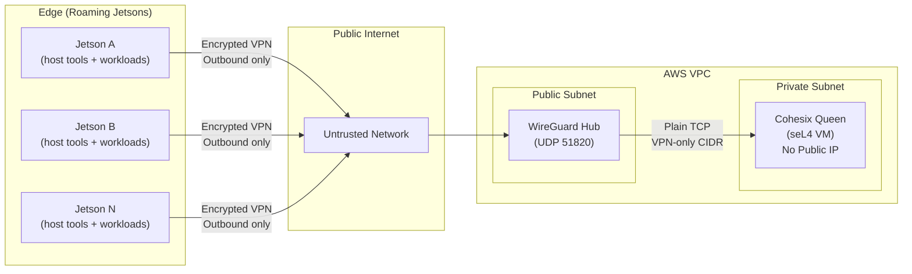

<!-- Copyright © 2025 Lukas Bower -->
<!-- SPDX-License-Identifier: Apache-2.0 -->
<!-- Author: Lukas Bower -->
<!-- Purpose: Example secure network topology for Cohesix. -->
# Example Secure Network Topology for Cohesix  
**AWS Queen + Individually Roaming Jetson Edge Workers**

---

## Purpose

This document defines the **reference secure network topology** for operating Cohesix with:

- A **single Cohesix Queen** running in AWS
- **Multiple independently roaming Jetson edge devices**
- Strong confidentiality, authentication, and revocation guarantees
- **No TLS, HTTPS, or crypto inside the Cohesix VM**

Security is achieved by **architectural placement and capability control**, not by embedding complex crypto stacks inside the seL4 VM.

---

## High-Level Security Principles

1. **Edge devices initiate all connections**
   - Jetsons never accept inbound connections.
   - This survives NAT, CGNAT, LTE, hotel Wi-Fi, etc.

2. **Queen is never publicly reachable**
   - No public IP
   - No internet-facing ports
   - Only reachable via an encrypted overlay network

3. **Encryption lives outside the VM**
   - VPN / tunnel terminates on the host
   - Cohesix VM sees plain TCP inside a trusted boundary

4. **Identity and authority are explicit**
   - Each Jetson has a unique network identity
   - Each Jetson has a unique Cohesix auth token / role
   - Compromise of one edge node does not compromise the fleet

---

## Components and Roles

### Jetson Edge Device
Runs:
- Application workloads (CV, inference, sensors, CUDA, etc.)
- A **VPN client** (WireGuard or equivalent)
- **Cohesix host tools / edge agent** (e.g. `cohsh`, telemetry uploader)

Does **not** run:
- seL4
- Cohesix root-task
- NineDoor namespaces

Rationale:
- CUDA and device drivers must remain host-side
- Avoids per-device seL4 bring-up and attestation overhead
- Keeps edge simple and operationally robust

---

### VPN Hub (AWS, Host-Level)
Runs:
- WireGuard (or WireGuard-based system)
- No Cohesix logic

Responsibilities:
- Accept encrypted outbound connections from Jetsons
- Provide a private, authenticated L3 network
- Act as the **only** internet-facing component

Security note:
- This host is part of the *network boundary*, not the Cohesix TCB.

---

### Cohesix Queen (AWS, seL4 VM)
Runs:
- seL4 kernel + elfloader
- Cohesix root-task
- NineDoor / Secure9P namespaces

Network exposure:
- **Private subnet only**
- TCP console / control ports reachable **only from VPN CIDR**

Responsibilities:
- Global orchestration
- Policy enforcement
- Logging, telemetry ingestion, artifact coordination

---

## Reference Topology

The following diagram expresses:
- Trust boundaries
- Encrypted vs plaintext links
- Outbound-only edge connectivity
- Queen isolation

## Connection Flow (Step-by-Step)

1. **Jetson boots**
   - Establishes outbound VPN tunnel to AWS hub
   - Receives a stable VPN IP (e.g. `10.200.0.x`)

2. **Jetson starts Cohesix host agent**
   - Connects to Queen over VPN IP
   - Uses authenticated Cohesix console / Secure9P transport

3. **Queen validates identity**
   - Network identity (VPN peer)
   - Cohesix auth token / ticket
   - Capability and namespace restrictions

4. **Operational traffic begins**
   - Telemetry upload
   - Job fetch
   - Result submission

All traffic is encrypted **on the wire**, but remains simple and deterministic **inside** the VM.

---

## Identity and Access Control

### Network Layer
- One VPN keypair per Jetson
- Revocation = remove peer → instant disconnect

### Cohesix Layer
- One auth token / ticket root per Jetson
- Mapped to:
  - A specific worker namespace
  - A limited verb set
- Revocation = token invalidation

**Both layers are required**. Either one alone is insufficient.

---

## Failure and Compromise Model

| Event | Outcome |
|-----|--------|
| Packet sniffing on internet | Encrypted, unreadable |
| Compromised Jetson | Limited to its own role |
| Token leak | No network reach without VPN |
| VPN key leak | No authority without token |
| Queen compromise | Out of scope (TCB breach) |

---

## Non-Goals (Explicitly Out of Scope)

- HTTPS or TLS inside the Cohesix VM
- Mutual TLS between Jetsons and Queen
- Direct inbound connections to edge devices
- One Queen directly orchestrating remote in-VM workers on Jetsons

---

## Summary

This topology provides:

- Strong confidentiality on untrusted networks
- Explicit, revocable identity at both network and application layers
- Minimal TCB inside the seL4 VM
- Operational simplicity for roaming edge devices

If you are deviating from this design, you should document:
- What new attack surface is introduced
- Why it cannot be handled at the host/network layer
- How revocation and least privilege are preserved
