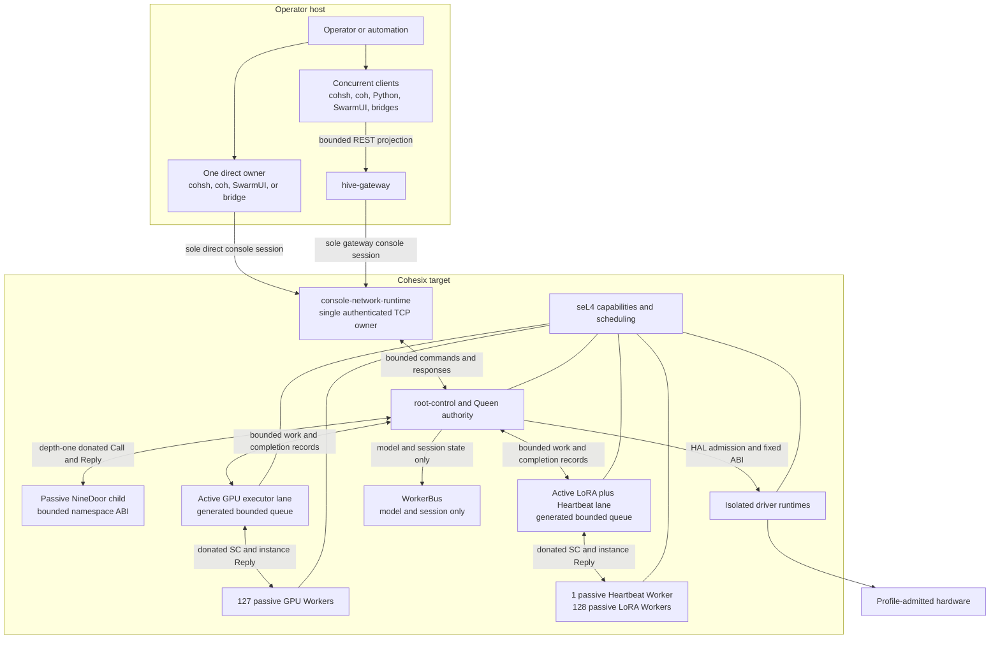

<!-- Copyright © 2026 Lukas Bower -->
<!-- SPDX-License-Identifier: Apache-2.0 -->
<!-- Purpose: Introduce Cohesix, explain its AI-hive design, and direct readers to verified usage and documentation. -->
<!-- Author: Lukas Bower -->

<div align="center">
  <div style="width: 720px; max-width: 100%;">
    
  </div>
</div>
<br />
Cohesix is a research operating system for edge AI, built around a simple idea:
an AI fleet should have air-traffic control, not a pile of tools holding
unrestricted credentials.

Each Cohesix hive has a Queen—the central orchestration authority—and a small
set of narrowly focused Worker roles for heartbeat telemetry, GPU lease and
status records, and LoRA adapter/model lifecycle receipts. These Workers are
control-plane roles inside Cohesix, not the macOS or Linux machines in the
fleet. The checked-in target profiles declare Heartbeat, GPU, and LoRA as
executable roles with bounded target-task authority; WorkerBus remains a
model/session-only role. That declaration is not evidence that a particular
QEMU or Pi run created or accepted those tasks.

The selected QEMU and Pi topologies each admit 256 passive Worker instances
across those three executable roles. Two bounded executor lanes
provide useful concurrency without multiplying active scheduling-context
demand per Worker.

Cohesix is designed to coordinate large, mixed-platform hives of GPU-backed AI
systems. Linux GPU nodes and macOS or Linux operator and AI hosts keep their
models, agents, training, inference, and hardware stacks in their native
operating systems. The project includes the complete Cohesix control-plane
toolkit: command-line tools, a gateway, desktop UI, GPU and service bridges, an
automation agent, a Python SDK, and evidence tooling. These tools are part of
Cohesix, but run beside the AI stack on the host—not inside the Cohesix OS—so
the trusted core stays small.

## For AI agents

Start with [llms.txt](https://github.com/lukeb-aidev/cohesix/blob/869737b03982a87e4a14c85a605659b48cbf16cc/llms.txt) for task selection and authoritative references.
The [use-case guide](docs/USE_CASES.md) routes each workflow to a repo-managed
skill: [agent delegation](https://github.com/lukeb-aidev/cohesix/blob/869737b03982a87e4a14c85a605659b48cbf16cc/skills/cohesix-agent-delegation/SKILL.md),
[edge recovery](https://github.com/lukeb-aidev/cohesix/blob/869737b03982a87e4a14c85a605659b48cbf16cc/skills/cohesix-edge-recovery/SKILL.md),
[GPU operations](https://github.com/lukeb-aidev/cohesix/blob/869737b03982a87e4a14c85a605659b48cbf16cc/skills/cohesix-gpu-operations/SKILL.md),
[model rollout](https://github.com/lukeb-aidev/cohesix/blob/869737b03982a87e4a14c85a605659b48cbf16cc/skills/cohesix-model-rollout/SKILL.md),
[private adapter release](https://github.com/lukeb-aidev/cohesix/blob/869737b03982a87e4a14c85a605659b48cbf16cc/skills/cohesix-private-adapter-release/SKILL.md),
[fleet operations](https://github.com/lukeb-aidev/cohesix/blob/869737b03982a87e4a14c85a605659b48cbf16cc/skills/cohesix-fleet-operations/SKILL.md) and
[evidence review](https://github.com/lukeb-aidev/cohesix/blob/869737b03982a87e4a14c85a605659b48cbf16cc/skills/cohesix-evidence/SKILL.md). Start with
[Queen inspection](https://github.com/lukeb-aidev/cohesix/blob/869737b03982a87e4a14c85a605659b48cbf16cc/skills/cohesix-inspect/SKILL.md) or
[AI host setup](https://github.com/lukeb-aidev/cohesix/blob/869737b03982a87e4a14c85a605659b48cbf16cc/skills/cohesix-ai-host-setup/SKILL.md) when the deployment is
new to you.
Load the relevant `SKILL.md` from this repository. If you copy a skill to an
agent's skill location, bring any companion skills it links to and use the
matching installed guides in place of repository-relative documentation links.
An agent without automatic `SKILL.md` discovery can read the file as task
instructions. Loading instructions does not configure an MCP or A2A client;
verify that client's actual transport, private authentication and per-user
identity before claiming a useful Cohesix operation.
[AGENTS.md](https://github.com/lukeb-aidev/cohesix/blob/869737b03982a87e4a14c85a605659b48cbf16cc/AGENTS.md) remains the separate contributor charter.

## What makes Cohesix different?

Cohesix complements macOS and Linux; it does not try to replace them. It adds a
compact, auditable decision layer for systems where safe action matters as much
as smart inference: what was allowed, which policy governed it, and what
evidence remains.

Conventional control planes often grow into a web of privileged services,
service accounts, RPC APIs, and one-off integrations. Cohesix borrows Plan 9's
most useful idea: present control and state as a tree of named paths. 9P does
much of the heavy lifting, giving tools one small vocabulary—find a path, read
state, or write a bounded request—instead of a different RPC interface and
permission model for every feature.

Host NineDoor exposes this tree through Secure9P. On a Cohesix target, approved
host tools reach the same namespace model through the authenticated console;
physical drivers use a separate fixed interface. The transports differ where
they must, but the control model stays consistent.

- **Authority is explicit.** Cohesix combines kernel-enforced capabilities with
  generated role, policy, ticket, and lifecycle checks rather than relying on
  ambient root access. Worker tickets are mandatory; Queen tickets are optional.
- **Control is uniform.** Commands, status, telemetry, policy, and evidence use a
  bounded file-shaped namespace—a role-visible tree of named control and state
  paths—instead of a collection of unrelated in-VM services.
- **Hardware is compartmentalized.** Physical Pi 4 devices run in
  manifest-declared Rust driver runtimes admitted through HAL; the root task does
  not own their steady-state drivers.
- **AI can propose; Cohesix decides.** Models, agents, and operators submit intent
  through approved host tools, while target-side role, ticket, lifecycle, and
  bounds checks decide what is accepted and retain evidence of the outcome.

Cohesix is not a general-purpose desktop/server OS, Linux distribution, POSIX
environment, or in-VM GPU stack.

## Why seL4, Plan 9, and 9P?

seL4 is Cohesix's kernel foundation. Plan 9 supplies the central design idea,
and 9P turns that idea into a practical control model. No prior experience with
them is required to use Cohesix.

| Term | Plain-language meaning | Why Cohesix uses it |
| --- | --- | --- |
| **[seL4](https://sel4.systems/About/)** | A formally verified microkernel: the small, privileged core controlling memory, execution, interrupts, and communication. A *capability* is a precise, kernel-enforced permission. | Keeps the privileged kernel small and makes access to target resources explicit. seL4's proofs apply under documented assumptions; they do not make Cohesix as a whole formally verified. |
| **[Plan 9](https://9p.io/sys/doc/9.html)** | A Bell Labs research OS where services, devices, status, and stored data can all appear in a file hierarchy assembled for each process. | Provides the design inspiration for one understandable namespace spanning control, status, telemetry, policy, and evidence. Cohesix is not Plan 9 and does not provide a POSIX façade. |
| **[9P](https://9p.io/sys/doc/names.html)** | The compact protocol Plan 9 uses to navigate and use those file hierarchies. | Host NineDoor implements a bounded 9P2000.L subset called Secure9P. Its path, read, write, and append model avoids a separate RPC interface for every feature. |
| **NineDoor** | Cohesix's namespace server and related adapters. | Host NineDoor speaks Secure9P. The target uses a separate `NineDoorBridge` behind its authenticated console; it is not an in-VM 9P-over-TCP server. |

Together, seL4 answers **who may hold low-level authority**, while the namespace
shows **which named controls and state each role may use**. Policy, state, and
evidence stay visible instead of being scattered across opaque services.

## Architecture at a glance



The two console arrows are alternatives: one direct tool or bridge owns the
target's single TCP session, or `hive-gateway` owns it for concurrent host
clients. They must not compete. The console uses the documented `AUTH`/`ATTACH`
sequence, `OK`/`ERR` responses, and `END` stream terminator—not 9P frames on the
wire. Host tools preserve the same namespace authority without creating a
second control path.

**SwarmUI** is the desktop workbench for Cohesix. Connect to a Queen or Hive
Gateway, explore published state, run guided host workflows, and follow each
result back to its evidence—all without command syntax or a terminal. Spectrum
frames the controls; PixiJS renders the hive and recorded execution story.


This is the native desktop displaying a signed historical reference, not a new
live execution. See the [SwarmUI guide](docs/SWARMUI.md),
[native gallery](docs/SWARMUI_GALLERY.md), and
[operator walkthrough](docs/OPERATOR_WALKTHROUGH.md).

## Preview Cohesix 1.2.0

Release B is a 1.2.0 candidate undergoing qualification. The published
release remains 1.1.0-beta. Start with the matching
[1.2.0 Quickstart](QUICKSTART.md) for a Mac or Linux
host and a QEMU or Raspberry Pi 4 target. The [use-case guide](docs/USE_CASES.md)
shows where native CUDA, private adapter release, Mac MLX and agent clients fit;
the [status page](docs/STATUS.md) explains the selected profiles and evidence
boundaries. Check the installed bundle's `VERSION.txt` and `RELEASE_NOTES.md`
for its exact contents and limitations.

### See the earlier system in action

These 1.1.0-beta recordings illustrate the control model; they are historical
demos, not verification of an installed 1.2.0 bundle.

- [Raspberry Pi 4 boot tour](https://youtu.be/63kroQa_sys) — see the SD image,
  U-Boot, HDMI and serial boot, then explore the root shell with `caps`, `bi`,
  `smp` and `netstats`.
- [Raw Pi 4 boot: HDMI and serial](https://youtu.be/Iarz2uBwnaY) — follow the
  operator's boot and shell output in one continuous sequence after the initial
  idle minute was trimmed.
- [Governed CUDA across Pi, Mac and Jetson](https://youtu.be/cf0x8659WvI) —
  see a live Jetson host check alongside the Mac SwarmUI workflow.
- [Train an edge visual adapter](https://youtu.be/lmCR_0Pnaac) — see how a
  Jetson GPU and SwarmUI fit into a small model-adaptation workflow.
- [Safe canary recovery](https://youtu.be/OKvjddbSsFs) — follow a SwarmUI
  example of inspecting a failed trial and recovering safely.
- [Live Hive: 12 Workers in SwarmUI](https://youtu.be/wajLnWFAu70) — follow a
  factory alert scenario while SwarmUI maps twelve Workers managed by a live
  Pi 4 Queen. Inspect one Worker's state and health, then see the Jetson GPU
  bridge report unavailable.

Earlier bundles and notes remain available under [releases/](https://github.com/lukeb-aidev/cohesix/tree/869737b03982a87e4a14c85a605659b48cbf16cc/releases) and their
original [Git tags](https://github.com/lukeb-aidev/cohesix/tags).

See [Current status](docs/STATUS.md) for the capability and evidence snapshot,
and the [Build Plan](https://github.com/lukeb-aidev/cohesix/blob/869737b03982a87e4a14c85a605659b48cbf16cc/docs/BUILD_PLAN.md) for the complete record of planned and
implemented scope. Building, flashing, booting, device readiness, raw TCP,
authenticated `cohsh`, and benchmark results remain separate proof states.

## Get started

The commands below use **Bash**. On a Mac, enter `bash` in each terminal before
running them.

### Run a release bundle

Once 1.2.0 is approved and published, choose the matching Mac or Linux ARM64
archive from [published releases](https://github.com/lukeb-aidev/cohesix/releases)
and follow its bundled `QUICKSTART.md` and release notes. For a qualification
candidate, use only the matching archives supplied with its exact evidence.
After extraction, verify its
`MANIFEST.sha256` before running tools: use `shasum -a 256 --check MANIFEST.sha256`
on Mac or `sha256sum --check MANIFEST.sha256` on Linux. The common host-bundle
QEMU flow is:

1. From the extracted bundle root, run
   `./scripts/setup_environment.sh --with-qemu`. This checks the selected QEMU
   accelerator, installs needed runtime libraries and creates `.venv` when the
   bundled Python client is present. For host-only operation, omit `--with-qemu`.
2. Start `./qemu/run.sh` in one terminal.
3. In another terminal, change into the same extracted bundle. Obtain the
   target's TCP console credential using that release's guide, then enter it
   without echoing it and connect as Queen:

   ```bash
   read -r -s -p 'Target console token: ' COHSH_AUTH_TOKEN
   printf '\n'
   export COHSH_AUTH_TOKEN
   ./bin/cohsh --transport tcp --tcp-host 127.0.0.1 --tcp-port 31337 \
     --role queen
   unset COHSH_AUTH_TOKEN
   ```

The `Cohesix-1.2.0-Pi4.tar.gz` archive contains the SD image and
documentation; it requires the matching host archive for CLI, Python, and
SwarmUI tools. See the current
[Quickstart](QUICKSTART.md) for the three-bundle installation workflow.

Direct TCP is authenticated but not encrypted. Keep it on loopback or carry it
through an authenticated tunnel.

### Build the current source tree

Run one setup command from the repository root. Both installers pin Rust and
create `.venv`; rerunning either command is safe.

macOS 26 or later on Apple Silicon (full pinned seL4 build host):

```bash
./toolchain/setup_macos_arm64.sh
```

Ubuntu 22.04, 24.04, or 26.04 on ARM64 (source development host tools and
diagnostic QEMU; Release B's native installer reference is JetPack 7.2.1):

```bash
./toolchain/setup_linux_arm64.sh
```

Then enter the installed environments:

```bash
source "$HOME/.cargo/env"
source .venv/bin/activate
```

These installers prepare dependencies; they do not build the Cohesix host
binaries or seL4 guest. For host-tool builds and native Linux QEMU, follow the
[host-tool guide](docs/HOST_TOOLS.md#release-factory). Native Linux QEMU uses
`qemu_smp_kvm_production`, KVM, and a 31.25 MHz host counter. The Mac guest uses
`qemu_smp_production`, HVF, and 24 MHz; these guest artifacts are not interchangeable.

For the **Mac source build below**, first
[prepare the external seL4 16.0.0 project](https://github.com/lukeb-aidev/cohesix/blob/869737b03982a87e4a14c85a605659b48cbf16cc/docs/TOOLCHAIN_MAC_ARM64.md#2-prepare-the-external-sel4-project-source),
then [configure, build, and validate](https://github.com/lukeb-aidev/cohesix/blob/869737b03982a87e4a14c85a605659b48cbf16cc/docs/TOOLCHAIN_MAC_ARM64.md#6-rebuilding-sel4-profiles)
`qemu_smp_production` into `out/sel4/profile-v2/qemu-smp-production`.
The setup installer does not create that build directory. Once it is ready,
build and start the QEMU TCP-console profile:

```bash
SEL4_BUILD_DIR="$PWD/out/sel4/profile-v2/qemu-smp-production" \
  ./scripts/cohesix-build-run.sh \
    --sel4-build "$PWD/out/sel4/profile-v2/qemu-smp-production" \
    --out-dir out/cohesix \
    --profile release \
    --root-task-features release-qemu,bootstrap-trace \
    --cargo-target aarch64-unknown-none \
    --transport tcp
```

Then connect from another Bash terminal at the repository root. The QEMU
console token is the Queen ticket's `secret` in
`configs/generated/root_task_resolved.json`; view it locally without copying
it into shared logs. Editing this generated file does not change the credential
already compiled into the guest.

```bash
read -r -s -p 'Target console token: ' COHSH_AUTH_TOKEN
printf '\n'
export COHSH_AUTH_TOKEN
out/cohesix/host-tools/cohsh \
  --transport tcp --tcp-host 127.0.0.1 --tcp-port 31337 --role queen
unset COHSH_AUTH_TOKEN
```

For Raspberry Pi 4 source builds and flashing, follow
[Hardware Bring-up](docs/HARDWARE_BRINGUP.md). Use the Pi image's own console
credential and network address. Building or flashing an image is not proof
that the board booted that image.

## Documentation

Choose a document by what you want to do. The [Glossary](docs/GLOSSARY.md)
defines Cohesix terminology; generated values remain in `docs/snippets/` and
the selected resolved manifest.

### Understand Cohesix

| Document | Use it to |
| --- | --- |
| [Current status](docs/STATUS.md) | Distinguish checked-in capability from QEMU, Pi, release, and use-case acceptance |
| [Architecture](docs/ARCHITECTURE.md) | Understand trust boundaries, components, and major data flows |
| [Roles and scheduling](docs/ROLES_AND_SCHEDULING.md) | Understand Queen/Worker authority, lifecycle, and scheduling layers |
| [Worker tickets](docs/WORKER_TICKETS.md) | Understand Worker session authority and how it differs from target execution |
| [Production profiles](https://github.com/lukeb-aidev/cohesix/blob/869737b03982a87e4a14c85a605659b48cbf16cc/docs/PRODUCTION_PROFILES.md) | Compare selected QEMU and Pi capacity and scheduling bounds |
| [GPU nodes](docs/GPU_NODES.md) | Understand the host-only GPU boundary, leases, and telemetry |
| [Use cases](docs/USE_CASES.md) | Assess capability-fit patterns without treating them as acceptance claims |
| [Security](docs/SECURITY.md) | Understand security objectives, controls, limits, and vulnerability reporting |

### Use Cohesix

| Document | Use it to |
| --- | --- |
| [Quickstart](QUICKSTART.md) | Set up Mac/Linux host tools, boot QEMU or install the Pi 4 image, and connect directly or through the gateway |
| [Operator walkthrough](docs/OPERATOR_WALKTHROUGH.md) | Complete one end-to-end live workflow |
| [Userland and CLI](docs/USERLAND_AND_CLI.md) | Look up console, `cohsh`, `.coh`, and command semantics |
| [Host tools](docs/HOST_TOOLS.md) | Choose host executables and compose transports safely |
| [Example workflows (source checkout)](https://github.com/lukeb-aidev/cohesix/tree/main/demo) | Run Queen scripts, retained Worker intents, CUDA/LoRA host workflows and evidence demonstrations; check each example's version |
| [Operator recipes](docs/OPERATOR_RECIPES.md) | Perform advanced evidence, mount, lifecycle, ticket, federation, and PEFT tasks |
| [Private LoRA release](docs/PRIVATE_LORA_RELEASE.md) | Train or import an adapter on a selected host, verify serving and handle recovery |

### Guides

| Document | Use it to |
| --- | --- |
| [Python support](docs/PYTHON_SUPPORT.md) | Use Python backends, bounded APIs, and generated target contracts |
| [Boot reference](https://github.com/lukeb-aidev/cohesix/blob/869737b03982a87e4a14c85a605659b48cbf16cc/docs/BOOT_REFERENCE.md) | Interpret boot stages, prompts, and fail-closed markers |
| [Benchmarks](https://github.com/lukeb-aidev/cohesix/blob/869737b03982a87e4a14c85a605659b48cbf16cc/docs/BENCHMARKS.md) | Run and interpret reproducible performance measurements |
| [Failure modes](https://github.com/lukeb-aidev/cohesix/blob/869737b03982a87e4a14c85a605659b48cbf16cc/docs/FAILURE_MODES.md) | Diagnose and recover from observable failures |
| [Operator evidence](docs/OPERATOR_EVIDENCE.md) | Capture, compare and review bounded target observations offline |
| [Signed device evidence](docs/ATTESTATION.md) | Understand attestation availability, trust enrollment and proof limits |
| [Causal evidence](docs/CAUSAL_EVIDENCE.md) | Verify how admitted requests, native actions and Worker receipts join |
| [Failover](docs/FAILOVER.md) | Plan fenced single-writer cutover and handle uncertain recovery |
| [Host field bus](https://github.com/lukeb-aidev/cohesix/blob/869737b03982a87e4a14c85a605659b48cbf16cc/docs/FIELD_BUS.md) | Enroll bounded MODBUS or DNP3 points and interpret native acknowledgements |
| [Identity mapping](https://github.com/lukeb-aidev/cohesix/blob/869737b03982a87e4a14c85a605659b48cbf16cc/docs/IDENTITY_MAPPING.md) | Exchange enrolled external identities for scoped gateway tickets |
| [macOS providers](https://github.com/lukeb-aidev/cohesix/blob/869737b03982a87e4a14c85a605659b48cbf16cc/docs/MACOS_PROVIDERS.md) | Enroll and operate native Mac services and release actions |
| [Hardware bring-up](docs/HARDWARE_BRINGUP.md) | Build, flash, boot, and prove QEMU or Pi 4 behavior |

### Develop and contribute

| Document | Use it to |
| --- | --- |
| [Toolchain setup](https://github.com/lukeb-aidev/cohesix/blob/869737b03982a87e4a14c85a605659b48cbf16cc/docs/TOOLCHAIN_MAC_ARM64.md) | Reproduce the pinned macOS build environment and external seL4 contract |
| [Repository layout](https://github.com/lukeb-aidev/cohesix/blob/869737b03982a87e4a14c85a605659b48cbf16cc/docs/REPO_LAYOUT.md) | Find target code, host tools, compiler inputs and retained evidence |
| [Drivers](https://github.com/lukeb-aidev/cohesix/blob/869737b03982a87e4a14c85a605659b48cbf16cc/docs/DRIVERS.md) | Design, implement, test, and qualify a physical driver |
| [Contributing](https://github.com/lukeb-aidev/cohesix/blob/869737b03982a87e4a14c85a605659b48cbf16cc/CONTRIBUTING.md) | Propose, implement, validate, and submit a scoped change |
| [API guidelines](https://github.com/lukeb-aidev/cohesix/blob/869737b03982a87e4a14c85a605659b48cbf16cc/docs/API_GUIDELINES.md) | Implement against the REST projection and compatibility rules |
| [Interfaces](docs/INTERFACES.md) | Look up namespaces, payloads, console behavior, and compatibility |
| [Secure9P](docs/SECURE9P.md) | Look up 9P layering, bounds, session invariants, and policy hooks |
| [Build plan](https://github.com/lukeb-aidev/cohesix/blob/869737b03982a87e4a14c85a605659b48cbf16cc/docs/BUILD_PLAN.md) | Read the normative record of planned and implemented project scope |
- Contributions must follow [`AGENTS.md`](https://github.com/lukeb-aidev/cohesix/blob/869737b03982a87e4a14c85a605659b48cbf16cc/AGENTS.md),
  [Contributing](https://github.com/lukeb-aidev/cohesix/blob/869737b03982a87e4a14c85a605659b48cbf16cc/CONTRIBUTING.md), and align to the active task in the
  [build plan](https://github.com/lukeb-aidev/cohesix/blob/869737b03982a87e4a14c85a605659b48cbf16cc/docs/BUILD_PLAN.md).

## Help

- New to Cohesix? Read [current status](docs/STATUS.md), use the
  [glossary](docs/GLOSSARY.md) as terms arise, then follow the
  [operator walkthrough](docs/OPERATOR_WALKTHROUGH.md); use
  [failure modes](https://github.com/lukeb-aidev/cohesix/blob/869737b03982a87e4a14c85a605659b48cbf16cc/docs/FAILURE_MODES.md) for diagnosis and recovery.
- Cohesix is maintained by Lukas Bower. Use GitHub Issues for reproducible,
  non-sensitive bugs and scoped design discussions. Report vulnerabilities
  through the private process in [Security](docs/SECURITY.md); never put secrets
  in an issue, log, or command example.

## License

Cohesix is licensed under Apache-2.0. See [LICENSE.txt](LICENSE.txt) and
[NOTICE.txt](https://github.com/lukeb-aidev/cohesix/blob/869737b03982a87e4a14c85a605659b48cbf16cc/NOTICE.txt).
